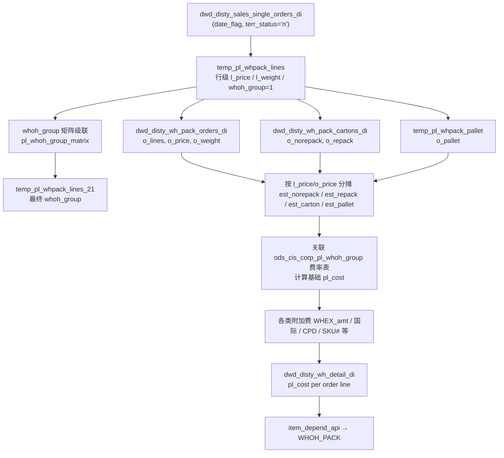

# Dependent Dataset of P&L Item

> P&L 各 item 所依赖的上游数据集（AP/AR/Inventory、**SCM（Soft Cost Management）** aging、Inventory Writeoff、CPL/RMA、WHOH_PACK 等）的业务逻辑说明。  
> 资料来源：`disty_common/ap`、`disty_common/ar`、`disty_common/inventory`、`disty_common/inventory_writeoff`、`disty_common/cpl_extract`、`disty_common/scm_aging` 及 `opl_whoh_detail` 相关代码。  
> 更新日期：2026-07-19（文档更名；新增 §9 WHOH_PACK / opl_whoh_detail）

---

## 目录

1. [通用概念](#1-通用概念)
2. [AP Aging（应付账龄）](#2-ap-aging应付账龄)
3. [AR Aging（应收账龄）](#3-ar-aging应收账龄)
4. [Inventory Aging（库存账龄）](#4-inventory-aging库存账龄)
5. [SCM Aging（Soft Cost Management 软成本账龄）](#5-scm-agingsoft-cost-management-软成本账龄)
6. [Inventory Writeoff（库存减值/核销）](#6-inventory-writeoff库存减值核销)
7. [CPL Extract / RMA 数据源](#7-cpl-extract--rma-数据源)
8. [模块对比总结](#8-模块对比总结)
9. [WHOH_PACK / Warehouse Pack（opl_whoh_detail）](#9-whoh_pack--warehouse-packopl_whoh_detail)
10. [关键代码路径索引](#10-关键代码路径索引)

---

## 1. 通用概念

### 1.1 各模块对照表

| 模块 | 代码目录 | 目标表 | 基准日期 | 天数公式 | 分桶对象 |
|------|----------|--------|----------|----------|----------|
| AP | `disty_common/ap` | `dws_disty_ap_vend_aging_df` | `date_flag`（报表日） | `datediff(date_flag, 基准到期日)` | 应付未结金额 |
| AR | `disty_common/ar` | `dws_disty_ar_cust_sum_age_df` 等 | `date_flag` | `datediff(date_flag, due_date)` | 应收未结余额 `amount - applied` |
| Inventory | `disty_common/inventory` | `dwd_disty_inv_aging_df` | `date_flag` | 库存交易 `doc_date` 距报表日的天数 | 在库数量 / 成本 |
| SCM（Soft Cost Management） | `disty_common/scm_aging` | `dws_disty_vcm_scm_aging_df` | `date_flag` | `datediff(date_flag, gl_trans_date)` | **应向供应商收回的返利/资金** GL 余额（按 `proj_no` 项目账龄分桶） |
| Inv Writeoff | `disty_common/inventory_writeoff` | `dws_disty_inv_writedown_vpc_mi` | 当月 `[bop, eop)` | 按 GL/交易日期落在月内（**非 aging 分桶**） | 减值/核销金额 `amt` |
| CPL/RMA | `disty_common/cpl_extract` | `dws_disty_brpt_extract_cpl_di` | `date_flag` | RMA 收货日 `rec_date` | RMA 笔数/成本（**非 aging**） |
| WHOH_PACK | `opl_whoh_detail` | `dwd_disty_wh_detail_di` | `date_flag` | 当日发货订单 | 仓库处理/打包费用 `pl_cost`（**非 aging**） |

### 1.2 天数符号约定（AP / AR）

| 条件 | 含义 |
|------|------|
| `datediff > 0` | 已逾期（到期日在报表日之前） |
| `datediff = 0` | 当天到期 |
| `datediff < 0` | 未到期（到期日在报表日之后） |

### 1.3 分桶实现方式

AP / AR / SCM 普遍使用 `SIGN` 函数将天数映射到区间，再乘以金额：

```sql
-- 示例：AR 逾期 1-30 天
(amount - applied) * SIGN(1 - SIGN(1 - datediff)) * SIGN(1 - SIGN(datediff - 30))
```

Inventory 则采用 **FIFO 数量分配 + 成本乘算**，逻辑与应付/应收到期日不同。

---

## 2. AP Aging（应付账龄）

### 2.1 数据流

```
ODS 源表
  → load_ap_vdah_lines.py        → dwd_disty_ap_vdah_lines_di（行级，含 days 字段）
  → load_ap_vend_aging.py        → dws_disty_ap_vend_aging_df（分桶汇总）
```

关联 Flow：`ap_aging_load_*.flow`、`ap_aging_reload_*.flow`

### 2.2 核心：`days` 字段计算

实现文件：`disty_common/ap/python/load_ap_vdah_lines.py`

| 场景 | 条件 | 计算公式 | 业务含义 |
|------|------|----------|----------|
| 已入账供应商发票（折扣期内） | `vd_type='V'` 且 `inv_disc_date > a_date` | `datediff(a_date, nvl(inv_disc_date, doc_due_date + tolerance))` | 按折扣到期日计算 |
| 已入账供应商发票（折扣期已过） | `vd_type='V'` 且 `inv_disc_date <= a_date` | `datediff(a_date, doc_due_date + tolerance)` | 按付款到期日计算 |
| 未入账（折扣期内） | `ah_type='U'`，当前日在折扣截止前 | `datediff(a_date, rec_datetime + disc_days)` | 按收货折扣日计算 |
| 未入账（折扣期已过） | `ah_type='U'`，当前日在折扣截止后 | `datediff(a_date, rec_datetime + terms_days + tolerance)` | 按收货日 + 账期计算 |
| 退货/贷项 | `vd_type='R'` | `datediff(a_date, doc_due_date + tolerance)` | 按单据到期日 |
| 特殊订单，PM Claim | `order_type=27` | `datediff(a_date, rec_datetime) - hold_day - 1` | 按 hold 天数调整 |
| 兜底 | 以上均不适用 | `datediff(date_flag, nvl(doc_due_date, rec_datetime))` | 用到期日或收货日 |

**关键字段说明：**

| 字段 | 含义 |
|------|------|
| `doc_due_date` | 单据到期日 |
| `inv_disc_date` | 发票折扣到期日 |
| `rec_datetime` | 收货日期时间 |
| `disc_days` | 折扣天数 |
| `terms_days` | 账期天数 |
| `tolerance` | 容差天数 |

### 2.3 分桶逻辑

实现文件：`disty_common/ap/python/load_ap_vend_aging.py`

以行级 `days` 为基础，用 `SIGN` 函数将金额归入各 bucket：

| 字段 | days 区间 | 业务含义 |
|------|-----------|----------|
| `age29_up` | `days <= -29` | 距到期还有 29 天以上（远期未到期） |
| `age22_28` | `-28 ~ -22` | 距到期 22–28 天 |
| `age15_21` | `-21 ~ -15` | 距到期 15–21 天 |
| `age8_14` | `-14 ~ -8` | 距到期 8–14 天 |
| `age1_7` | `-7 ~ -1` | 距到期 1–7 天 |
| `age1_30` | `0 ~ 30` | 已到期 0–30 天（含当天到期） |
| `age31_60` | `31 ~ 60` | 逾期 31–60 天 |
| `age61_90` | `61 ~ 90` | 逾期 61–90 天 |
| `age91_120` | `91 ~ 120` | 逾期 91–120 天 |
| `age121_180` | `121 ~ 180` | 逾期 121–180 天 |
| `age181_365` | `181 ~ 365` | 逾期 181–365 天 |
| `age365_up` | `>= 366` | 逾期 365 天以上 |

**AP 特点：** 同时覆盖"到期前"（负 days）和"逾期后"（正 days）两套 bucket，与其他模块不同。

### 2.4 其他重要字段

| 字段 | 含义 |
|------|------|
| `usd_age*` / `usd29_up` 等 | 美元口径对应分桶金额 |
| `total_doc_amt` | 单据总金额 |
| `total_po_cost` | PO 成本合计 |
| `inv_cost_reg` | 常规库存成本 |
| `inv_cost_rma` | RMA 库存成本 |
| `sum_level` | 汇总维度（TVP / VCD / VVU / VP / V / P 等） |

---

## 3. AR Aging（应收账龄）

### 3.1 数据流

```
dwd_disty_ar_cust_doc_df（客户单据）
  → ar_cust_sum_age_temp.py
      → dwd_disty_ar_cust_age_temp          （单据级分桶）
      → dwd_disty_ar_cust_sum_age_temp      （客户汇总）
      → dws_disty_ar_cust_sum_age_df        （最终汇总表）
      → dws_disty_ar_cust_sum_age_inv_df    （发票视图汇总）
```

关联 Flow：`ar_aging_load_*.flow`、`ar_aging_reload_*.flow`

### 3.2 核心算法

**天数公式：**

```
days = datediff(date_flag, due_date)
```

**金额基数：**

| 口径 | 公式 |
|------|------|
| 本币 | `amount - applied` |
| 美元 | `usd_amt - usd_applied` |
| 第二本币 | `amount_2lc - applied_2lc` |

**过滤条件：** 仅处理 `amount != applied` 的未结清单据。

### 3.3 分桶字段说明

实现文件：`disty_common/ar/python/ar_cust_sum_age_temp.py`

#### 标准逾期分桶

| 字段 | days 区间 | 业务含义 |
|------|-----------|----------|
| `age0_less` | `days <= 0` | 未逾期（含当天到期） |
| `age1_30` | `1 ~ 30` | 逾期 1–30 天 |
| `age31_60` | `31 ~ 60` | 逾期 31–60 天 |
| `age61_90` | `61 ~ 90` | 逾期 61–90 天 |
| `age91_120` | `91 ~ 120` | 逾期 91–120 天 |
| `age120_up` | `>= 121` | 逾期 120 天以上 |

#### 到期前分桶（远期）

| 字段 | days 区间 | 业务含义 |
|------|-----------|----------|
| `age_n8_less` | `days <= -8` | 距到期超过 8 天 |
| `age_n7_0` | `-7 ~ 0` | 距到期 7 天内 |

#### 细粒度逾期分桶

| 字段 | days 区间 | 业务含义 |
|------|-----------|----------|
| `age1_7` | `1 ~ 7` | 逾期 1–7 天 |
| `age8_15` | `8 ~ 15` | 逾期 8–15 天 |
| `age8_30` | `8 ~ 30` | 逾期 8–30 天 |
| `age16_30` | `16 ~ 30` | 逾期 16–30 天 |
| `age31_45` | `31 ~ 45` | 逾期 31–45 天 |
| `age46_60` | `46 ~ 60` | 逾期 46–60 天 |
| `age60_up` | `>= 61` | 逾期 60 天以上 |
| `age90_up` | `>= 91` | 逾期 90 天以上 |

#### 长期逾期分桶（每 30 天一档）

| 字段 | days 区间 |
|------|-----------|
| `age121_150` | `121 ~ 150` |
| `age151_180` | `151 ~ 180` |
| `age181_210` | `181 ~ 210` |
| `age211_240` | `211 ~ 240` |
| `age241_270` | `241 ~ 270` |
| `age271_300` | `271 ~ 300` |
| `age301_330` | `301 ~ 330` |
| `age331_360` | `331 ~ 360` |
| `age180_up` | `>= 181` |
| `age360_up` | `>= 361` |

所有字段均有对应的 `usd_*` 和 `*_2lc` 版本。

### 3.4 借贷方向拆分

| cmdm_flag | 条件 | 含义 |
|-----------|------|------|
| `D` | `amount >= 0` | 借方（正常应收） |
| `C` | `amount < 0` | 贷方（贷项/调整） |

---

## 4. Inventory Aging（库存账龄）

### 4.1 数据流

```
dwd_disty_inv_tran_df（库存交易）
  + inv_qty / ods_cis_corp_inv_qty（在库数量）
  → load_dw_inv_aging_temp.py           → dwd_disty_inv_aging_temp
  → load_dw_inv_aging_view_levels.py    → dwd_disty_inv_aging_df
  → load_dw_true_aging.py               → dwd_disty_inv_true_aging_df（True Aging 细化）
```

关联 Flow：`inv_aging_load_*.flow`

### 4.2 核心算法（与 AP/AR 根本不同）

Inventory Aging **不按到期日**，而是按库存交易 `doc_date` 距报表日多久来划分账龄。

#### 第一步：按交易日期统计各时段入库量

实现文件：`disty_common/inventory/python/load_dw_inv_aging_temp.py`

数据源：`dwd_disty_inv_tran_df`（近 360 天交易）

| qty 字段 | doc_date 范围（相对 date_flag） | 含义 |
|----------|----------------------------------|------|
| `qty1_30` | 最近 30 天 | 最新入库 |
| `qty31_60` | 31–60 天前 | |
| `qty61_90` | 61–90 天前 | |
| `qty90_up` | 90 天以前 | |
| `qty91_120` | 91–120 天前 | |
| `qty121_150` | 121–150 天前 | |
| `qty151_180` | 151–180 天前 | |
| `qty181_210` | 181–210 天前 | |
| `qty211_240` | 211–240 天前 | |
| `qty241_270` | 241–270 天前 | |
| `qty271_300` | 271–300 天前 | |
| `qty301_330` | 301–330 天前 | |
| `qty331_360` | 331–360 天前 | |
| `qty180_up` | 180 天以前（汇总档） | |
| `qty240_up` | 240 天以前（汇总档） | |
| `qty360_up` | 360 天以前（汇总档） | |

#### 第二步：FIFO 数量分配

用当前 `on_hand_qty`（在库量），从最新 bucket 向最旧 bucket 依次填充：

```
若 on_hand_qty > qty1_30          → qty1_30 桶填满
若 on_hand_qty > qty1_30+qty31_60 → qty31_60 桶填满
... 以此类推
```

#### 第三步：成本 aging 计算

```
age1_30  = ave_cost × qty1_30
age31_60 = ave_cost × qty31_60
...
```

### 4.3 字段类型说明

| 字段类型 | 含义 | 示例 |
|----------|------|------|
| `qty*` | 该账龄段的在库**数量** | `qty1_30`, `qty90_up` |
| `age*` | 该账龄段的库存**成本金额** | `age1_30`, `age360_up` |
| `on_hand_qty` | 总在库量 | |
| `intran_in` | 在途入库量 | |
| `ave_cost` | 平均成本 | 来源取决于 `cost_from`（Q/L/M） |
| `ext_oh_cost` | 在库扩展成本 | `ave_cost × on_hand_qty` |
| `ext_it_cost` | 在途扩展成本 | `ave_cost × intran_in` |
| `view_level` | 视图层级 | 如 `IT_PART` |

**成本来源（`cost_from`）：**

| 值 | 含义 |
|----|------|
| `Q` | 使用 `inv_qty.ave_cost` |
| `L` | 使用 landed cost（`dwd_disty_inv_landed_que_df`） |
| `M` | 使用 `part_master.ave_cost` |

### 4.4 True Aging（真实账龄调整）

实现文件：`disty_common/inventory/python/load_dw_true_aging.py`

在常规 `age360_up`（超 360 天库存）基础上，用当日实际交易将库存拆分为：

| 字段 | 来源交易 | 含义 |
|------|----------|------|
| `true_swa_qty` / `swa` | `trans_type=38`, `mt_expense_code='SWA'` | SWA 调整数量/金额 |
| `true_cyc_qty` / `cyc` | `trans_type=38`, 非 SWA | 周期盘点调整 |
| `true_rma_qty` / `rma` | `trans_type=87` | RMA 相关调整 |

True Aging 是对超龄库存的**业务细化**，不改变基础 FIFO 日期算法。

---

## 5. SCM Aging（Soft Cost Management 软成本账龄）

> **SCM** = **Soft Cost Management（软成本管理）**，**不是** Supply Chain Management（供应链管理）。  
> TD SYNNEX 用 SCM 系统**管理和跟踪软成本**，重点是**供应商返利 / 供应商资金（vendor rebate / vendor fund）**的申领、使用与回收，约束销售代表使用返利/资金时的规则与额度，控制软成本风险。  
> **scm_no / `proj_no`**：SCM **项目编号**（账龄表汇总维度为 `proj_no`，业务口语亦称 scm_no），用于标识并跟踪某一 SCM 项目的余额与状态。  
> **本数据集在 P&L 中的用途**：对**应向供应商索要返利的 amount**（尚未从 vendor 收回的 SCM 资金）按 GL 过账日账龄分桶，输出 `dws_disty_vcm_scm_aging_df`，供 **`SCM_COST`**（`pre_vend.py`）按 `vend_no` 计提垫付资金成本。

### 5.1 数据流

```
ods_cis_corp_journal_entry（日记账）
  + ods_cis_corp_trans_acd_bal（期初余额）
  → load_vcm_scm_aging_df.sql → dws_disty_vcm_scm_aging_df
```

关联 Flow：`scm_aging_load_*.flow`  
代码目录：`disty_common/scm_aging`

### 5.2 数据来源

| 来源 | 说明 |
|------|------|
| SCM 软成本项目 | `ods_cis_corp_project_info`（`ccode='SCM'`），关联 SCM 相关 GL 科目；**`proj_no` = scm_no** |
| 当月交易 | `ods_cis_corp_journal_entry`，`gl_trans_date` 在当月（反映项目 GL 变动） |
| 期初余额 | `ods_cis_corp_trans_acd_bal`（上月期末），日期固定为 `date_flag - 541` 天 |

### 5.3 核心算法

**天数公式：**

```
days = datediff(date_flag, gl_trans_date)
```

**分桶逻辑：** 将 `gl_amt` 按 `gl_trans_date` 距报表日的天数归入区间。

| 字段 | days 区间 | 业务含义 |
|------|-----------|----------|
| `age1_30` | `1 ~ 30` | 近 1 个月仍未收回的 vendor rebate / SCM 资金 |
| `age31_60` | `31 ~ 60` | |
| `age61_90` | `61 ~ 90` | |
| `age91_120` | `91 ~ 120` | |
| `age121_150` | `121 ~ 150` | |
| `age151_180` | `151 ~ 180` | |
| `age181_270` | `181 ~ 270` | |
| `age271_360` | `271 ~ 360` | |
| `age361_450` | `361 ~ 450` | |
| `age451_540` | `451 ~ 540` | |
| `total` | 全部 | 该 SCM 项目（`proj_no`）待收回返利/资金余额合计 |

**汇总维度：** `vend_no` + `proj_no` + `company_no`

**供应商补全：** 若 `vend_no` 为空，从 `ods_cis_corp_pm_claim` 按 `proj_no` 补全。

---

## 6. Inventory Writeoff（库存减值/核销）

> **注意：** Inventory Writeoff **不是账龄分桶（Aging）**，而是按月汇总各类库存减值、核销、费用分摊金额，输出到 Vendor + Product Code（VPC）维度。与 Inventory Aging 互补：Aging 看"库龄"，Writeoff 看"当月减值发生额"。

### 6.1 数据流

```
ODS（库存日记账 / 订单 / AP-OE 日记账 / 费用等）
  → load_writedown_vpc_mi.py → dws_disty_inv_writedown_vpc_mi
```

关联 Flow：`inv_writeoff_load_*.flow`（按月调度，`schedule-cron: 0 10 1 1 * ?`）  
代码目录：`disty_common/inventory_writeoff`

### 6.2 时间窗口

实现文件：`disty_common/inventory_writeoff/sql/get_params.sql`

| 参数 | 计算方式 | 含义 |
|------|----------|------|
| `bop` | 当月 1 日 | 月初（Begin of Period） |
| `eop` | `date_flag + 1` | 月末次日（左闭右开区间上界） |
| `dt_month` | `yyyy-MM` | 分区月份 |
| `m` | `ods_cis_corp_dw_calendar.m` | 日历月序号 |

**日期过滤规则：** 所有源数据均取 `>= bop AND < eop`，即 `date_flag` 所在自然月内的交易/过账。

### 6.3 开关参数

| 参数 | 来源 | 含义 |
|------|------|------|
| `param_val_5` | `COMPANY_NO = 5` 是否存在 | `Y`：FI 订单走 GL 科目 149010/149152；`N`：走 `pl_code` 中 `usage='INVR'` 的 GLNO 科目 |
| `param_val_1` | `COMPANY_NO = 1` 是否存在 | `Y`：额外启用 FROM_OE、FROM_AP、OT 毛利（temp_from_inv_1d）逻辑 |
| `rerun_flag` | Flow 参数 | `Y` 时用 `ods_dw_prod_dws_dw_b_log` 控制 `entry_datetime` 截止点，支持重跑 |

### 6.4 核心逻辑：七类来源汇总

实现文件：`disty_common/inventory_writeoff/python/load_writedown_vpc_mi.py`

最终表 `dws_disty_inv_writedown_vpc_mi` 由以下 7 类数据 `UNION ALL` 组成：

| type 字段 | 中间表 | 数据来源 | 核心计算 | 业务含义 |
|-----------|--------|----------|----------|----------|
| `FROM_INV` | `temp_writedown_vpc_1` | 库存交易 + FI 订单 | 按 `order_type` 汇总 `trans_cost` / `cost_change` | 当月库存侧减值/成本变动 |
| `FROM_OE` | `temp_writedown_vpc_2` | OE 日记账（`param_val_1='Y'`） | `-gl_amt × unit_cost × ship_qty / 订单总成本` | OE 侧 INVR 科目分摊到 SKU |
| `FROM_AP` | `temp_writedown_vpc_3` | AP 日记账（`param_val_1='Y'`） | `SUM(-gl_amt)` 按 `vend_no` | AP 侧 INVR 科目供应商级金额 |
| `SCM_U` | `temp_writedown_vpc_4` | SCM 软成本项目费用（`order_exp_type='DP'`） | `SUM(extended_exp)` 按 SKU | SCM 项目未分摊到订单的软成本费用 |
| `Carrier` | `temp_writedown_vpc_5` | OT14 丢货订单（`ext_ref='LOST'`） | `loss_amt = -dm_amt + check_amt` | 承运商丢货损失 |
| `RES_SKU` | `temp_writedown_vpc_6` | 费用码 `RES` 的订单费用 | 按行成本比例或均摊 `line_res` | 预留（Reserve）费用分摊到 SKU |
| `RES_VEND` | `temp_writedown_vpc_7` | AP 日记账 GL `421000` | `SUM(-gl_amt)` 按 `vend_no` | 预留费用供应商级金额 |

### 6.5 FROM_INV 明细（按 order_type）

以 FI 订单（`temp_fi_order`，来自 `ods_cis_corp_inv_journal_entry`）为驱动，关联库存交易：

| order_type | 交易类型 / 条件 | 成本计算 |
|------------|-----------------|----------|
| `4` | `trans_type IN (9,10,11,12)` | `trans_qty × trans_cost × col_factor` |
| `7` | 非 `cwsParSwap` 来源 | `trans_qty × trans_cost × col2_factor` |
| `15` | 全部 | `SUM(cost_change)` |
| `2` | `trans_type=137`；PO 收货变量费用等 | `cost_change` 或 PO rec var 费用 |
| `34` | `trans_type=76`（`param_val_5='N'`） | `cost_change`；或 order_exp 中 R/B 类型项目费用 |
| `48` | `trans_type IN (178,179,180,181)`（`param_val_5='Y'`） | `trans_qty × trans_cost × col_factor` |

**temp_from_inv_1d（OT 毛利，需 `param_val_1='Y'` 或 `param_val_5='Y'`）：**

从销售订单取 `ship_qty × (u_price - u_cost)`，排除特定 `order_type` 和 `ship_method`，计入 FROM_INV 汇总。

### 6.6 目标表字段说明

| 字段 | 含义 |
|------|------|
| `month` | 日历月序号（来自 `dw_calendar.m`） |
| `dt_month` | 分区键，格式 `yyyy-MM` |
| `type` | 来源类型（见 6.4 表） |
| `order_type` | 订单类型 |
| `vend_no` | 供应商编号 |
| `vpl_no` | Vendor Product Line |
| `sku_no` | SKU 编号（部分 type 如 FROM_AP、RES_VEND 为 NULL） |
| `amt` | 减值/核销/费用金额 |
| `entry_datetime` | ETL 写入时间 |
| `entry_id` | 写入标识（Carrier/RES 类为 10381） |
| `company_no` | 公司编号（通过 `vend_master` 关联） |

### 6.7 与 Inventory Aging 的关系

| 对比项 | Inventory Aging | Inventory Writeoff |
|--------|-----------------|-------------------|
| 核心问题 | 库存放了多久？ | 当月发生了多少减值/核销？ |
| 时间维度 | 按 `doc_date` 回溯最多 360 天 FIFO 分桶 | 按自然月 `[bop, eop)` 汇总 |
| 输出粒度 | SKU + inv_type + view_level | SKU/VPL + vend_no + type |
| 是否有 age/qty 分桶 | 有（qty1_30 ~ qty360_up） | 无 |
| 数据频率 | 日批 | 月批 |

---

## 7. CPL Extract / RMA 数据源

> **注意：** `dws_disty_brpt_extract_cpl_di` 中的 RMA 数据**不是 Aging**，而是当日 RMA 收货指标的聚合，供 CPL 报表使用。

### 7.1 数据流

```
dws_disty_brpt_extract_cpl_stage（load_type='RMAVCC'）
  → dws_disty_brpt_extract_cpl_di（data_group='cust_rma'）
```

实现文件：
- `disty_common/cpl_extract/python/dws_disty_brpt_extract_cpl_stage.py`
- `disty_common/cpl_extract/python/dws_disty_brpt_extract_cpl_di.py`

关联 Flow：`cpl_extract_load_*.flow`

### 7.2 RMA 计算逻辑

| 字段 | 算法 | 业务含义 |
|------|------|----------|
| `rma_count` | `SUM(1 / line_count)` | 当日收货 RMA 笔数（按行数加权） |
| `rma_cost` | `SUM(rec_qty × ave_cost)`，`loc_no=98` 时取 0 | RMA 成本 |
| `rma_type` | `rma_header.rma_type` | RMA 类型 |
| `vend_no` | 来自 `dim_pub_part_info` | 供应商编号 |
| `cust_no` | 来自 `dim_pub_customer_info_df` | 客户编号 |

### 7.3 过滤条件

| 条件 | 说明 |
|------|------|
| `rec_date = date_flag` | 仅统计当日收货的 RMA |
| `delete_date IS NULL` | 排除已删除明细 |
| 排除特定 `rsn_cd_auth` | 来自 `ods_cis_corp_rma_reason` 排除列表 |
| 排除特定 `rma_type` | 来自 `pl_code` 中 `usage='RMA_TYPE'` 排除列表 |

### 7.4 同表其他 data_group

| data_group | load_type | 含义 |
|------------|-----------|------|
| `cust_rsik` | `RISKCOST` | 客户风险成本 |
| `cust_rma` | `RMAVCC` | RMA 笔数/成本 |
| `cust_exp` | `FRTEXP` | 运费费用 |
| `cust_gl` | `GLACT` | GL 科目金额 |

---

## 8. 模块对比总结

### 8.1 算法差异

```
AP Aging
  基准日: doc_due_date / inv_disc_date / rec_datetime
  days = datediff(date_flag, 基准日)
  负值 = 未到期, 正值 = 逾期
  同时有"到期前"和"逾期后"两套 bucket

AR Aging
  基准日: due_date
  days = datediff(date_flag, due_date)
  金额 = amount - applied
  大量细粒度 bucket（含远期、每 30 天长期档）

Inventory Aging
  基准日: inv_tran.doc_date
  按交易日期分段统计 qty → FIFO 分配到 on_hand_qty
  age = ave_cost × qty（数量为 qty*，金额为 age*）

SCM Aging (Soft Cost Management)
  业务对象: 应向供应商收回的返利/资金 amount (vendor rebate/fund)
  基准日: gl_trans_date
  days = datediff(date_flag, gl_trans_date)
  按 GL 金额分桶，最细到 540 天 → 供 P&L SCM_COST

Inv Writeoff
  时间窗: 当月 [bop, eop)
  非 aging，按 7 类来源汇总 amt 到 VPC 维度

CPL RMA
  基准日: rma_details.rec_date
  非 aging，统计当日 rma_count / rma_cost

WHOH_PACK (opl_whoh_detail)
  基准日: date_flag（当日发货）
  非 aging，按 whoh_group 费率 + 纸箱/托盘估算计算 pl_cost
  P&L 侧 item_depend_api 直接取用，kit 头行按 net sales 摊分
```

### 8.2 关键差异速查

| 对比项 | AP | AR | Inventory | SCM | Inv Writeoff |
|--------|----|----|-----------|-----|--------------|
| 基准日期类型 | 到期日/折扣日/收货日 | 到期日 `due_date` | 交易日期 `doc_date` | GL 过账日 `gl_trans_date` | 月内 GL/交易日期 |
| 是否有 aging 分桶 | 有 | 有 | 有（库龄 qty/age） | 有 | **无** |
| 分桶/汇总对象 | 金额 | 金额 | 数量 + 成本 | **vendor rebate/fund GL 金额** | 减值金额 `amt` |
| 最细粒度 | 1 天（到期前）/ 30 天（逾期后） | 1 天 ~ 30 天 | 30 天 | 30 ~ 90 天 | 按来源 type 分类 |
| 最长 bucket | 365+ 天 | 360+ 天 | 360+ 天 | 540 天 | — |
| 运行频率 | 日批 | 日批 | 日批 | 日批 | **月批** |

---

## 9. WHOH_PACK / Warehouse Pack（opl_whoh_detail）

> **注意：** `opl_whoh_detail` **不是账龄（Aging）模块**，而是按日计算订单仓库处理/打包费用（Warehouse Handling / Packing），输出订单行级 `pl_cost`，供 Disty B Report 的 P&L item **WHOH_PACK** 使用。

### 9.1 与 P&L 的关系

```
dwd_disty_sales_single_orders_di（当日发货单行）
  → opl_whoh_detail/load_dwd_disty_wh_detail_di.py
      → dwd_disty_wh_pack_orders_di / dwd_disty_wh_pack_cartons_di（订单级中间表）
      → dwd_disty_wh_detail_di（订单行级 pl_cost）
  → disty_b_report/item/item_depend_api.py（WHOH_PACK 段）
      → dwd_disty_brpt_opl_api_di（orders_pl 宽表中的 whoh_pack 列）
```

| 环节 | 节点 | 说明 |
|------|------|------|
| 上游 ETL | `opl_whoh_detail_load_*.flow` | 日批；依赖 CDC、订单 ODS、维度表、`pos_load`（single orders） |
| 费用明细 | `dwd_disty_wh_detail_di` | 每订单行一条 `pl_cost`，分区 `date_flag` |
| P&L 消费 | `item_depend_api.py` | 类型 A，直接取 `pl_cost`；kit 头行再按 net sales 摊到子行 |
| 排除 | `hy_company='Y'`（`COMPANY_NO=3200`） | 不算 WHOH_PACK，置 null |

关联 Flow：`opl_whoh_detail/opl_whoh_detail_load_us.flow`（及 ca/br/wcla 变体）；跑完后异步触发 `opl_whoh_detail_validation_*.flow` 与 Sybase 对账。

### 9.2 数据流（计算步骤概览）



### 9.3 第一步：订单行基础数据

实现文件：`opl_whoh_detail/python/load_dwd_disty_wh_detail_di.py`

从 `dwd_disty_sales_single_orders_di` 取当日（`date_flag`，`terr_status='n'`）发货单行，关联 `dim_pub_part_info_df` 取重量：

| 字段 | 计算 | 说明 |
|------|------|------|
| `l_price` | `ship_qty * u_price`；若 `inv_type` 在 `pl_code(WHEX/IT/inv_type)` 中则加 `u_sum_expense` | 行销售金额，用于后续按比例分摊 |
| `l_weight` | `ship_qty * part.weight` | 行重量 |
| `whoh_group` | 初始值 `1` | 默认仓库处理费率组，后续由矩阵覆盖 |

同时汇总到 `dwd_disty_wh_pack_orders_di`（按 `order_type, order_no`）：

- `o_lines` = 行数
- `o_price` = `sum(l_price)`
- `o_weight` = `sum(l_weight)`

### 9.4 第二步：订单级纸箱 / 托盘估算

#### 纸箱（`dwd_disty_wh_pack_cartons_di`）

关联 `ods_cis_corp_cws_part.repackable`：

| 字段 | 逻辑 |
|------|------|
| `o_norepack` | `sum(ship_qty)` where `repackable='N'` |
| `o_repack` | `round(sum(l_weight of repackable) / 33.0 - 0.23, 0)`；若为 0 则置 1 |

#### 托盘（`temp_pl_whpack_pallet`）

从 `ods_cis_corp_cws_pallet_carton` 统计 `pallet_id`（以 `'P'` 开头）distinct 数 → `o_pallet`。

#### 行级分摊到订单行

将订单级纸箱/托盘指标按行 `l_price / o_price`（或 `o_price=0` 时按行数）分摊：

```
est_norepack = o_norepack * (l_price / o_price)
est_repack   = o_repack   * (l_price / o_price)
est_carton   = (o_norepack + o_repack) * (l_price / o_price)
est_pallet   = o_pallet   * (l_price / o_price)
```

若 `est_pallet > 0` 且 `pl_whoh_group.pallet_rate != 0`，则 `est_norepack / est_repack / est_carton` 置 0（托盘与纸箱互斥计费）。

**US/CA 特殊逻辑（按 ship# 去重 repack）：** 同一 `SHIP#`（`ods_etl_order_profile_all`，`profile_type='SHIP#'`）下若多订单同时有 repack 与 pallet，或 repack 金额相同，只保留一个订单的 `est_repack`，其余置 0，避免重复计费。

### 9.5 第三步：whoh_group 判定（费率组）

核心配置表：`ods_cis_corp_pl_whoh_group_matrix`（`whoh_group` + `whoh_group_type` + `whoh_icode` + `company_no`）。

脚本通过**多级 left join 级联**（`temp_pl_whpack_lines` → `_2` → … → `_21`）依次覆盖 `whoh_group`，优先级靠后的规则覆盖靠前。主要匹配维度包括：

| whoh_group_type | 匹配键 | 典型 whoh_group | 业务场景（示例） |
|-----------------|--------|-----------------|------------------|
| `VEND` | `vend_no` | 13, 15, 37 | 特定供应商 |
| `CUST_NO` / `CUST_LOC` | `cust_no` / `cust_no*1000+from_loc_no` | 20, 21, 22, 23 | 特定客户（CA 逻辑较多） |
| `LOC_NO` | `from_loc_no` | 2, 3, 4, 12, 17, 27, 31–36 | 发货仓库 |
| `INV_TYPE` | `inv_type` | 4, 8 | 库存类型 |
| `TERR_NO` | `sales_terr` | 5 | 销售区域 |
| `VEND_PROD` | `vend_no*10000+prod_code` | 6 | 供应商+产品码 |
| `VEND_LOC` | `vend_no*1000+from_loc_no` | 9, 10, 11 | 供应商+仓库 |
| `ORDER_TYPE` | `order_type` | 0, 21, 25 | 订单类型 |
| `VPC` | `vpl_no`（经 part 维表） | 24, 28 | 产品线 |
| Special Handle | `soldto.special_handle` + `order_profile` | 7, 14, 16, 26, 29 | D/D2/C/G 等特殊处理 |
| 多供应商订单 | `count(distinct vend_no)>1` 且 `from_loc_no=98` | 11 或 max(whoh_group) | 一单多 vendor |
| PrintSolve | 单行单件 + 特定 terms | 19 | PSLV 条款 |
| UCCallow | `cust_profile` | 20 | 客户 profile |
| OEM RapidShip | 特定 cust+sku+loc | 29 | RapidShipNoPackList |
| 清零 | `from_loc_no=199 AND inv_type=500` | 0 | 不计费 |

`company_no` 不同（1=US、5=CA、8 等）会走不同分支，CA 额外处理 cust/loc/vpc 等组。

费率定义表：`ods_cis_corp_pl_whoh_group`（按 `whoh_group` 关联），关键费率字段：

| 字段 | 含义 |
|------|------|
| `order_rate` | 按订单固定费（除以 `o_lines` 摊到行） |
| `line_rate` | 按订单行固定费 |
| `sales_pct` | 按行销售金额百分比（`0.01 * sales_pct * l_price`） |
| `norepack_rate` | × `est_norepack` |
| `repack_rate` | × `est_repack` |
| `pallet_rate` | × `est_pallet` |

### 9.6 第四步：基础 pl_cost 公式

```sql
pl_cost = nvl(order_rate / o_lines, 0)
        + nvl(line_rate, 0)
        + nvl(0.01 * sales_pct * l_price, 0)
        + nvl(norepack_rate * est_norepack, 0)
        + nvl(repack_rate * est_repack, 0)
        + nvl(pallet_rate * est_pallet, 0)
```

### 9.7 第五步：附加费与清零规则

在基础 `pl_cost` 上叠加或清零（按 `company_no` 与公司参数）：

| 步骤 | 条件 | 调整 |
|------|------|------|
| CPD label | `ods_cis_corp_cpd_label_data` 命中 cust+sku | `+ ship_qty * WHEX_amt(icode=1)` |
| OEM Return | `soldto.special_handle='R'` 且 SKU 为 OEM | `+ ship_qty * WHEX_amt(icode=3)` |
| 国际运费 | `ship_to_country` 非 US/CA | `+ international_amt / o_lines`（排除特定 whoh_group） |
| WH_CUST_VEND | `pl_code(WHEX/amt/WH_CUST_VEND)` 按 cust+vend | `+ ship_qty * mcode` |
| WH_CONFIG | vend + special_handle/profile 匹配 | `+ ship_qty * mcode`（订单级） |
| SKU# whoh fee | `pl_code(SKU#/whoh fee)` + carton | `+ mcode * box_count` |
| 仓库 loc 豁免 | `from_loc_no` 匹配 WHEX_amt icode 4/5 | `pl_cost = 0` |
| order_type=125 | — | `pl_cost = 0` |
| Consignment | `LOL_CSGN` profile 或 `order_type=1, inv_type=300` | `pl_cost = 0` |

费率参数来自 `ods_cis_corp_pl_code`（`code_type='WHEX'` 等）。

### 9.8 目标表：`dwd_disty_wh_detail_di`

| 字段 | 含义 |
|------|------|
| `order_type / order_no / order_line_no` | 订单行主键 |
| `cust_no / vend_no / sku_no / prod_code` | 维度 |
| `from_loc_no / inv_type` | 仓库与库存类型 |
| `l_price / l_weight` | 行销售金额与重量 |
| `whoh_group` | 最终费率组 |
| `est_norepack / est_repack / est_carton / est_pallet` | 分摊后的纸箱/托盘估算量 |
| `pl_cost` | **该行仓库处理费合计**（P&L 直接消费） |
| `date_flag` | 分区日期 |

中间表（同日分区，供调试与复用）：

| 表 | 粒度 | 内容 |
|----|------|------|
| `dwd_disty_wh_pack_orders_di` | order | `o_lines, o_price, o_weight` |
| `dwd_disty_wh_pack_cartons_di` | order | `o_norepack, o_repack` |

### 9.9 P&L 侧：WHOH_PACK 如何取用 pl_cost

实现文件：`py_module/disty_b_report/item/item_depend_api.py`（WHOH_PACK 段）

1. 若 `hy_company='Y'`（Hyve，`COMPANY_NO=3200`）：`whoh_pack = null`，不算此项。
2. 否则 left join `dwd_disty_wh_detail_di`，取同行 `pl_cost`。
3. **Kit 订单处理**：若费用挂在 kit 头行（`temp_kit` 匹配），需摊到子行：
   - `sales_total <> 0`：`whoh_pack = pl_cost * (u_price+u_sum_expense)*ship_qty / sales_total`
   - `sales_total = 0`：`whoh_pack = pl_cost / cnt`（按行数均摊）

WHOH_PACK 为**类型 A**（订单行直接赋值），不涉及 pre 聚合或 net sales 比例分摊（kit 摊分除外）。

### 9.10 与 Aging 模块的对比

| 对比项 | AP/AR/Inv/SCM Aging | WHOH_PACK（opl_whoh_detail） |
|--------|----------------------|------------------------------|
| 核心问题 | 余额/库龄放了多久？ | 当日订单产生了多少仓库处理费？ |
| 时间维度 | 历史回溯分桶 | **仅 `date_flag` 当日** |
| 输出 | aging bucket 金额 | 订单行 `pl_cost` |
| 配置驱动 | 到期日/账龄桶 | `whoh_group` 矩阵 + 费率表 + WHEX 附加费 |
| 运行频率 | 日批 | 日批（`schedule-cron: 0 10 1 ? * *`） |

### 9.11 关键源表索引

| 类别 | 表 |
|------|-----|
| 订单输入 | `dwd_disty_sales_single_orders_di` |
| 订单属性 | `ods_etl_order_header_all`、`ods_etl_order_soldto_all`、`ods_etl_order_profile_all` |
| 费率配置 | `ods_cis_corp_pl_whoh_group`、`ods_cis_corp_pl_whoh_group_matrix`、`ods_cis_corp_pl_code`（WHEX/SKU#） |
| 纸箱/托盘 | `ods_cis_corp_cws_part`、`ods_cis_corp_cws_pallet_carton`、`ods_cis_corp_carton_header/detail` |
| 客户/供应商 | `ods_cis_corp_cust_profile`、`ods_cis_corp_vendor_profile`、`ods_cis_corp_cpd_label_data` |
| 维度 | `dim_pub_part_info_df`、`dim_pub_vpl_info_df` |
| P&L 消费 | `dwd_disty_wh_detail_di` → `item_depend_api` → `dwd_disty_brpt_opl_api_di` |

---

## 10. 关键代码路径索引

| 模块 | 核心计算文件 | 目标表 |
|------|-------------|--------|
| AP days 计算 | `ap/python/load_ap_vdah_lines.py` | `dwd_disty_ap_vdah_lines_di` |
| AP 分桶汇总 | `ap/python/load_ap_vend_aging.py` | `dws_disty_ap_vend_aging_df` |
| AR 分桶计算 | `ar/python/ar_cust_sum_age_temp.py` | `dwd_disty_ar_cust_age_temp` |
| AR 汇总 | `ar/sql/dws_ar_cust_sum_age_df.sql` | `dws_disty_ar_cust_sum_age_df` |
| Inv 账龄计算 | `inventory/python/load_dw_inv_aging_temp.py` | `dwd_disty_inv_aging_temp` |
| Inv 视图汇总 | `inventory/python/load_dw_inv_aging_view_levels.py` | `dwd_disty_inv_aging_df` |
| Inv True Aging | `inventory/python/load_dw_true_aging.py` | `dwd_disty_inv_true_aging_df` |
| SCM 软成本账龄 | `scm_aging/sql/load_vcm_scm_aging_df.sql` | `dws_disty_vcm_scm_aging_df` |
| Inv Writeoff 参数 | `inventory_writeoff/sql/get_params.sql` | — |
| Inv Writeoff 计算 | `inventory_writeoff/python/load_writedown_vpc_mi.py` | `dws_disty_inv_writedown_vpc_mi` |
| CPL RMA Stage | `cpl_extract/python/dws_disty_brpt_extract_cpl_stage.py` | `dws_disty_brpt_extract_cpl_stage` |
| CPL 最终输出 | `cpl_extract/python/dws_disty_brpt_extract_cpl_di.py` | `dws_disty_brpt_extract_cpl_di` |
| WHOH 费用计算 | `opl_whoh_detail/python/load_dwd_disty_wh_detail_di.py` | `dwd_disty_wh_detail_di` |
| WHOH P&L 取用 | `py_module/disty_b_report/item/item_depend_api.py`（WHOH_PACK 段） | `dwd_disty_brpt_opl_api_di` |

---

*文档由代码分析自动生成，如有业务规则变更请同步更新对应模块代码与本文件。*
