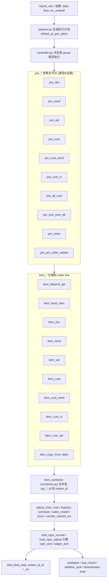
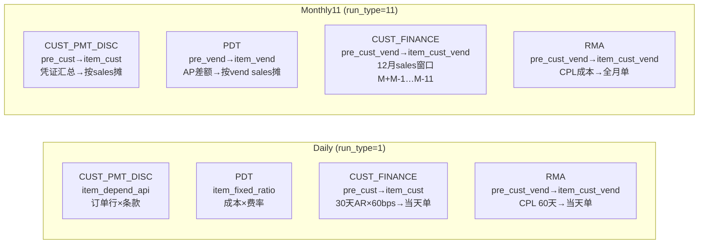

# Disty B Report —— P&L Item 计算与分摊逻辑说明

> 本文档梳理 Disty B Report（分销 B 报表）ETL 项目中约 50 个 P&L item 的**业务定义、计算公式、分摊类型、所属计算节点、以及每个 item 用到的 key source table**。
>
> 资料来源：`All SP migration_V4.xlsx`（`Item` / `Def` / `Matrix` / `Combiner` sheet）、`py_module/disty_b_report/pre/*` 与 `py_module/disty_b_report/item/*` 代码、以及 AZ flow [disty_b_report_monthly_11_us.flow](disty_b_report_monthly_11_us.flow)。
>
> 约定：正文用中文，P&L item 名 / 表名 / 字段 / 公式保留英文。文中 `net sales`（净销售额）统一指订单行的 `(u_price + u_sum_expense) * ship_qty`。

## 目录

- [1. 概述](#1-概述)
  - [1.1 P&L 层级（利润口径）](#11-pl-层级利润口径)
  - [1.2 bps（基点）换算](#12-bps基点换算)
  - [1.3 正负号约定](#13-正负号约定)
- [2. 整体 ETL Pipeline](#2-整体-etl-pipeline)
- [3. 两种分摊类型（核心概念）](#3-两种分摊类型核心概念)
  - [类型 A —— 订单行级直接按系数计算](#类型-a-订单行级直接按系数计算fixed-ratio-order-line-direct)
  - [类型 B —— 按 net sales 比例分摊](#类型-b-按-net-sales-比例分摊prorate-by-net-sales)
  - [判定一览（每个 item 属于哪种类型）](#判定一览每个-item-属于哪种类型)
  - [3.1 全局日期参数（planner.py 下发）](#31-全局日期参数plannerpy-下发)
  - [3.2 Daily vs Monthly11：四个「口径会变」的 item](#32-daily-vs-monthly11四个口径会变的-item)
    - [CUST_PMT_DISC（客户付款折扣）](#cust_pmt_disc客户付款折扣)
    - [PDT（供应商提前付款折扣 / Product cost）](#pdt供应商提前付款折扣-product-cost)
    - [CUST_FINANCE（客户应收账款融资成本）](#cust_finance客户应收账款融资成本)
    - [RMA（退货授权成本）](#rma退货授权成本)
    - [四 item 计算路径总览](#四-item-计算路径总览)
  - [3.3 类型 B 分摊日期窗口一览](#33-类型-b-分摊日期窗口一览)
- [4. item_depend_api 组 —— 订单级直接计算（类型 A）](#4-item_depend_api-组-订单级直接计算类型-a)
  - [4.1 BTL](#41-btlbehind-the-line-rebate)
  - [4.2 BTL_SALES](#42-btl_sales)
  - [4.3 BTL_BACKOUT](#43-btl_backout)
  - [4.4 CUST_REBATE](#44-cust_rebate)
  - [4.5 MOF](#45-mofminimum-order-fee)
  - [4.6 FRT_OUT_EXP](#46-frt_out_expfreight-out-expense)
  - [4.7 OTHERS / OTHERS_SALES](#47-others-others_sales)
  - [4.8 FRT_IN](#48-frt_infreight-in)
  - [4.9 FRT_OUT_LOAD](#49-frt_out_loadfreight-out-load)
  - [4.10 FRT_OB_RECOVERY](#410-frt_ob_recoveryfreight-outbound-recovery)
  - [4.11 FRT_IB_RECOVERY](#411-frt_ib_recoveryfreight-inbound-recovery)
  - [4.12 WHOH_PACK](#412-whoh_packwarehouse-handling-packing)
  - [4.13 SCM_DISC / SCM_NDISC](#413-scm_discscm-discretionary-scm_ndiscscm-non-discretionary)
  - [4.14 CUST_PMT_DISC](#414-cust_pmt_disccustomer-payment-discount)
- [5. item_fixed_ratio 组 —— 固定系数订单级计算（类型 A）](#5-item_fixed_ratio-组-固定系数订单级计算类型-a)
  - [5.1 CSGN_EDI_FEE](#51-csgn_edi_feeconsignment-edi-fee)
  - [5.2 CORPORATE](#52-corporate)
  - [5.3 SFS](#53-sfs)
  - [5.4 CUST_FINANCE_SALES](#54-cust_finance_sales)
  - [5.5 DIRECT_CREDIT](#55-direct_credit)
  - [5.6 CR_RISK_CTERM](#56-cr_risk_ctermcredit-risk-credit-term)
  - [5.7 FLR_SYNNEX / FLR_VENDOR](#57-flr_synnex-flr_vendorflooring-charges)
  - [5.8 SCM_RISK](#58-scm_risk)
  - [5.9 PDT](#59-pdtproduct-early-payment-discount)
- [6. 客户维度组 —— 按 net sales 比例分摊（类型 B）](#6-客户维度组-按-net-sales-比例分摊类型-b)
  - [6.1 pre_cust / item_cust（cust 粒度）](#61-pre_cust-item_custcust-粒度)
    - [CUST_PMT_DISC（monthly）](#cust_pmt_discmonthly-口径)
    - [CVR_RM（Customer Volume Rebate Remainder Sweep）](#cvr_rmcustomer-volume-rebate-remainder-sweep)
    - [AR_FIN_RECOVERY](#ar_fin_recoveryar-finance-recovery)
    - [CUST_FINANCE](#cust_finance)
    - [RMA](#rma)
    - [MFG_OH（Sales 团队 T&E）](#mfg_ohtravel--entertainment--sales-团队)
  - [6.2 pre_cust_vend / item_cust_vend（monthly）](#62-pre_cust_vend-item_cust_vendcust-vend-粒度monthly)
    - [CUST_FINANCE（monthly）](#cust_financemonthly)
    - [RMA（monthly）](#rmamonthly)
  - [6.3 pre_cust_ct / item_cust_ct（多级粒度）](#63-pre_cust_ct-item_cust_ctcust_type-等多级粒度)
    - [HC_SALES](#hc_salesheadcount-sales)
    - [ORDER_OVERHEAD](#order_overhead)
    - [MFG_OH（Sales 团队 T&E，cust_type 粒度）](#mfg_ohtravel--entertainment--sales-团队cust_type-粒度)
- [7. 产品/供应商维度组 —— 按 net sales 比例分摊（类型 B）](#7-产品供应商维度组-按-net-sales-比例分摊类型-b)
  - [7.1 pre_sku / item_sku（sku 粒度）](#71-pre_sku-item_skusku-粒度)
    - [AP_FINANCE](#ap_financeap-finance约-53bps)
    - [INV_RESERVE](#inv_reserveinventory-reserve)
    - [INV_COST](#inv_costinventory-cost约-53bps)
  - [7.2 pre_vend / item_vend（vend 粒度）](#72-pre_vend-item_vendvend-粒度)
    - [AP_ADJ](#ap_adjap-adjustment)
    - [SCM_COST](#scm_cost)
    - [PDT（monthly11）](#pdtmonthly11-口径)
    - [INFRASTRUCTURE / MARKETING / COOP（vend 侧）](#infrastructure-marketing-coopvend-侧)
  - [7.3 pre_vpl / item_vpl / item_cust_vpl（vpl 粒度）](#73-pre_vpl-item_vpl-item_cust_vplvpl-与-vplcust-粒度)
    - [ONE_TIME_BTL](#one_time_btl)
    - [HBTL](#hbtl)
    - [SCM_PROFIT_ADJ](#scm_profit_adj)
    - [HC_PM / HC_BD](#hc_pmheadcount-product-management-hc_bdheadcount-business-development)
    - [MARGIN_SHARE（PM 团队 T&E）](#margin_sharetravel--entertainment--pm-团队)
    - [INFRASTRUCTURE / MARKETING / COOP（vpl 侧）](#infrastructure-marketing-coopvpl-侧)
- [8. adjust_misc 阶段的后处理](#8-adjust_misc-阶段的后处理item-覆盖与再分摊)
  - [8.1 item_adjust_csat.py](#81-item_adjust_csatpycsat-订单的价格重算-othersothers_sales-再分摊)
  - [8.2 item_adjust_misc.py](#82-item_adjust_miscpy公司级-3pl-人工特例覆盖)
- [9. Key Source Table 汇总（按 item）](#9-key-source-table-汇总按-item)
- [10. 附录](#10-附录)
  - [10.1 中间 / 落地表清单](#101-中间-落地表清单)
  - [10.2 关键机制备注](#102-关键机制备注)

---

## 1. 概述

Disty B Report 是公司计算分销业务盈亏（Profit & Loss）的 ETL 系统。它把每一笔销售订单行（order line）上的**收入项与成本项**逐一计算出来，最终汇总为不同层级的利润指标，用于业绩考核、PM/高管决策与销售提成计算。

计算的最小粒度是 **order line**（由 `virtual_type, order_type, order_no, order_line_no` 唯一标识），最终结果落在 `dwd_disty_brpt_orders_pl_di`（daily）与 `dwd_disty_brpt_orders_pl_mi`（monthly）两张宽表，每个 P&L item 是其中一列。

### 1.1 P&L 层级（利润口径）

| 层级 | 含义 | 用途 |
| --- | --- | --- |
| **TGM** (Total Gross Margin) | 基础毛利，仅扣核心运营/生产成本（BTL、PDT、logistics、customer discount 等） | 财务、VP 视角 |
| **NGM0** (Net Gross Margin 0) | 在 TGM 基础上加入部分间接与财务成本（WHOH_PACK、INV_COST、AP/CUST_FINANCE、SCM_COST 等），但排除部分一次性/非核心项 | 部门级业绩 |
| **NGM** (Net Gross Margin) | 最全口径，在 NGM0 基础上纳入全部间接/风险成本（CORPORATE、HC_SALES、CR_RISK_CTERM、ORDER_OVERHEAD 等），是评估 SYNNEX 盈利能力的最终 P&L | PM 与高管 |
| **OPL** (Order P&L) | 只包含与该销售订单直接相关的成本/费用，用于销售提成（sales rep commission） | 销售提成 |
| **OPL+** | OPL 的扩展口径 | —— |

> 每个 item 归属于哪个口径，见第 4~7 节各 item 的「NGM/OPL 口径」标注，源自 `Item` sheet 的 NGM/OPL/OPL+ 列。落地聚合由 `total_ngm_normal.py` / `total_ngm_adjust.py` 生成 `ngm_amt` / `oplgm_amt` / `oplgm_plus_amt`。

### 1.2 bps（基点）换算

多个费率型 item 用 bps 表达：`1 bps = 0.01% = 0.0001`，`60 bps = 0.006 = 0.6%`。例如 CORPORATE 为 net sales 的 40bps、CUST_FINANCE 为 AR 余额的 60bps、INV_COST/AP_FINANCE 约 53bps、**SCM_COST** 按 SCM aging 分桶 × `SCMA` 费率、**SCM_RISK** 为订单 SCM 费用金额的 15bps。

### 1.3 正负号约定

- 成本/费用项通常为负数（loss），收入/返利项通常为正数（profit）。
- `depend_api` 与 `fixed_ratio` 组的 item「有正有负」，因为它们直接基于订单 net sales 计算，不同 order type 的 net sales 正负不同（例如退货类订单 net sales 为负）。

---

## 2. 整体 ETL Pipeline

以 [disty_b_report_monthly_11_us.flow](disty_b_report_monthly_11_us.flow) 为例，整体流程如下：



流程要点：

1. **planner + controller**：根据 `run_type`（1=daily、11=月中 monthly、12=月末 monthly）和配置决定本次要跑哪些 group（item），写入 MySQL 表 `BReport.distyb_pl_gen_plan` / `distyb_pl_gen_log`。
2. **pre_\* 节点**：类型 B 的 item 先在某个粒度（cust / cust_vend / cust_ct / sku / vend / vpl）把总额算出来，落到 `dwd_disty_brpt_pre_*_di`。
3. **item_\* 节点**：把 pre 总额按 net sales 比例分摊到每个 order line（类型 B），或直接在 order line 上按系数计算（类型 A：`item_fixed_ratio`、`item_depend_api`）。结果落到各 `dwd_disty_brpt_opl_*_di`。
4. **item_combiner**：把各 `opl_*_di` 表按 `date_flag, order_type, order_no, order_line_no` 合并、并 join 订单属性缓存 `dwd_disty_brpt_comp_cache_di`，写入 `orders_pl_di/_mi`。
5. **adjust_misc + total_ngm**：在 combiner 之后对少量 item 做二次覆盖/再分摊（`item_adjust_csat` 处理 **CSAT（Customer Satisfaction 客户满意度补偿）** 订单：重算单价并再摊 OTHERS/OTHERS_SALES；`item_adjust_misc` 按公司号做 3PL/特例覆盖 HC_SALES、HC_BD、CR_RISK_CTERM、CORPORATE、CUST_FINANCE 等，详见第 8 节），再汇总生成 `ngm_amt` / `oplgm_amt`。

> `dwd_disty_brpt_comp_cache_di`（简称 comp cache）是所有节点共享的**订单明细缓存**，含 `u_price / u_cost / u_sum_expense / ship_qty / l_weight / sku_no / vpl_no / vend_no / cust_no / cust_terr / cust_type / terms` 等属性，是几乎所有 item 计算的基础输入。

---

## 3. 两种分摊类型（核心概念）

所有 P&L item 的计算，本质上都是把某个金额落到 order line 粒度。落地方式分两类：

### 类型 A —— 订单行级直接按系数计算（fixed ratio / order-line direct）

在 order line 粒度**直接用费率（rate）乘以某个订单度量**，无需先聚合再分摊。度量通常是 `net sales = (u_price + u_sum_expense) * ship_qty`，也可能是 `u_cost * ship_qty`（成本）或 `l_weight`（重量，用于运费）。

代表节点：`item_fixed_ratio.py`、`item_depend_api.py`。

示例：

```sql
-- CORPORATE：按 net sales × NGM 系数
corporate = (u_price + u_sum_expense) * ship_qty * ngm_coop_rate

-- CR_RISK_CTERM：按 net sales × credit risk(bps)
cr_risk_cterm = -(u_price + u_sum_expense) * ship_qty * credit_risk / 10000
```

特点：一个 order line 直接得到结果，不涉及「总额」概念，也不会产生 virtual 单。

### 类型 B —— 按 net sales 比例分摊（prorate by net sales）

分两步：

1. **pre_\* 节点**：在某个粒度（cust / cust_vend / cust_ct / sku / vend / vpl）先聚合出该维度的**总金额**（total）与该维度的 **`sales_total`（该维度所有 order line 的 net sales 之和）**，落到 `dwd_disty_brpt_pre_*_di`。
2. **item_\* 节点**：把总额按每个 order line 的 net sales 占比分摊：

```sql
item_line = total_amount * (u_price + u_sum_expense) * ship_qty / sales_total
```

代表节点：`item_cust.py`、`item_cust_vend.py`、`item_cust_ct.py`、`item_sku.py`、`item_vend.py`、`item_vpl.py`、`item_cust_vpl.py`。

**类型 B 的标准计算顺序（三步）**，以 CUST_FINANCE 为例：

1. **按维度聚合基数**：`pre_*` 节点先在某粒度（如 cust_no）把「计费基数」聚合出来。CUST_FINANCE 的基数是客户的 AR（应收账款）余额——把 AR 账龄各桶（age0~age120up）按客户加总，再除以天数得到**日均 AR 余额**。
2. **乘以费率得到该维度总额**：把聚合出来的基数乘以配置费率（rate），得到该维度的 item 总额（一个客户一个总额）。CUST_FINANCE 用 ~60bps（`r0`）：`cust_finance_total = 日均AR余额 * r0`。**注意此时还未涉及任何订单行**，总额是「客户级」的。
3. **按 net sales 比例分摊到订单行**：`item_*` 节点再把客户级总额，按每个订单行的 net sales 占该客户总 net sales 的比例，摊到订单行。

即顺序为：**先聚合基数（AR aging）→ 再乘 rate（60bps）得到客户级总额 → 最后按 sales 分摊到订单行**。三步的粒度依次是「维度基数 → 维度总额 → 订单行」，不要与类型 A 的「订单行直接乘 rate」混淆。

**virtual 单机制**：当某维度 `sales_total = 0`（该维度当期没有可分摊的销售，但仍有金额需要体现），无法按比例分摊，脚本会生成一条 **virtual order**（虚拟订单）承接该金额，金额乘以调整因子 `${factor_c}`。不同粒度用不同的负 `order_type` 标识：

- `-2`：cust_ct 组（HC_SALES / ORDER_OVERHEAD / MFG_OH）
- `-3`：sku 组
- `-4`：sku_cust
- `-5` / `-6`：vpl / vend 组（`vpl_no <> -3` 用 -5，`vpl_no = -3` 用 -6）
- `-8` / `-9`：vpl_cust 组
- 这些 virtual 单也会 union 回 comp cache（`gen_group='item_*_month'`），供后续 combiner 汇总。

### 判定一览（每个 item 属于哪种类型）

| item | 类型 | 计算节点 | 分摊粒度 |
| --- | --- | --- | --- |
| BTL / BTL_SALES / BTL_BACKOUT | A | item_depend_api | order line |
| CUST_REBATE | A | item_depend_api | order line |
| MOF | A(内部再按行分) | item_depend_api | order（再摊到行） |
| FRT_OUT_LOAD / FRT_OUT_EXP / FRT_IN | A | item_depend_api | order line（按 weight/cost） |
| FRT_OB_RECOVERY / FRT_IB_RECOVERY | A | item_depend_api | order line |
| OTHERS / OTHERS_SALES | A | item_depend_api | order line |
| WHOH_PACK | A | item_depend_api | order line |
| SCM_DISC / SCM_NDISC | A | item_depend_api | order line |
| CR_RISK_CTERM | A | item_fixed_ratio | order line |
| FLR_SYNNEX / FLR_VENDOR | A | item_fixed_ratio | order line |
| DIRECT_CREDIT | A | item_fixed_ratio | order line |
| CSGN_EDI_FEE | A | item_fixed_ratio | order line |
| CORPORATE | A | item_fixed_ratio | order line |
| SFS | A | item_fixed_ratio | order line |
| SCM_RISK | A | item_fixed_ratio | order line |
| CUST_FINANCE_SALES | A | item_fixed_ratio | order line |
| PDT (daily) | A | item_fixed_ratio | order line |
| CUST_PMT_DISC | B(daily 为 A) | pre/item_cust | cust |
| CVR_RM | B | pre/item_cust | cust |
| AR_FIN_RECOVERY | B | pre/item_cust | cust |
| MFG_OH | B | pre/item_cust_ct（`travel_expense`→`mfg_oh`） | cust_type（hcs_group=2） |
| CUST_FINANCE | B | pre/item_cust(daily)、pre/item_cust_vend(monthly) | cust / cust+vend |
| RMA | B | pre/item_cust_vend（daily：`pre_cust_vend_di`；monthly：`pre_cust_vend`） | cust+vend |
| HC_SALES | B | pre/item_cust_ct | cust_type/terr/cust/terms/overall/SWL/HSN 多级 |
| ORDER_OVERHEAD | B | pre/item_cust_ct | 同上多级 |
| INV_COST | B | pre/item_sku | sku（按 cost 比例） |
| INV_RESERVE | B | pre/item_sku | sku（过去 12 个月库存调整均值 → 按 net sales 摊；部分 vend 走 rate 覆盖） |
| AP_FINANCE | B | pre/item_sku | sku（按 net sales） |
| AP_ADJ | B | pre/item_vend | vend |
| SCM_COST | B | pre/item_vend | vend |
| INFRASTRUCTURE | B | pre/item_vend、pre/item_vpl | vend / vpl |
| MARKETING | B | pre/item_vend、pre/item_vpl | vend / vpl |
| COOP | B | pre/item_vend、pre/item_vpl | vend / vpl |
| PDT (monthly11) | B | pre/item_vend | vend |
| ONE_TIME_BTL / HBTL / SCM_PROFIT_ADJ | B | pre/item_vpl、item_cust_vpl | vpl / vpl+cust 多级 |
| HC_PM / HC_BD | B | pre/item_vpl | vpl |
| MARGIN_SHARE | B | pre/item_vpl（`travel_expense`→`margin_share`） | vpl |

> 说明：CUST_FINANCE / RMA / MFG_OH / INFRASTRUCTURE / MARKETING / COOP 等在 daily 与 monthly、或不同粒度下由不同节点计算，下文对应小节会分别说明。**CUST_PMT_DISC、PDT、CUST_FINANCE、RMA 的 daily 与 monthly11 完整对照见 [3.2](#32-daily-vs-monthly11四个口径会变的-item)**；**所有类型 B item 的 sales / item total 取数天数见 [3.3](#33-类型-b-分摊日期窗口一览)**。

### 3.1 全局日期参数（`planner.py` 下发）

所有 `pre_*` / `item_*` 节点共享 `planner.py` 写入 conf 的日期参数。理解这些参数是读懂「取多少天 sales / 取多少天 item total」的前提。

| 参数 | daily（`run_type=1`） | monthly11 / monthly12（`run_type=11/12`） |
| --- | --- | --- |
| `period_start_date` | `date_flag - 29` 天（滚动 **30 天**） | 当月 1 日（`trunc(date_flag,'MM')`） |
| `period_end_date` | `date_flag` | `last_day(date_flag)`（**整个自然月**） |
| `month_start_date` | 当月 1 日 | 当月 1 日 |
| `month_end_date` | 当月最后一天 | 当月最后一天 |
| `factor_c` | `1/30` | `1.0` |
| `literal_run_day` | `day(date_flag + 1)` | 同上 |

补充说明：

- **`pre_all_cust` 的 sales 汇总窗口**：daily 用 `period_start_date ~ date_flag`（30 天）；monthly 用 `month_start_date ~ date_flag`（`pre_all_cust.py`）。
- **各 `pre_*` 脚本内的 `bop`（begin of period）** 可能与 `period_start_date` 不同，见 [3.3](#33-类型-b-分摊日期窗口一览)。
- **daily 每月 11 / 21 日 reload**（`literal_run_day=11/21`）：`combiner` 会把 comp cache 和 opl 的读取范围扩到 `month_start_date ~ date_flag`，并对 `reload_item_list` 中的 item（含 **PDT**）整月重算；这与 `run_type=11` 的 monthly11 flow 是不同触发机制，但 PDT 等 item 会在该日切换为 vend 粒度分摊。

### 3.2 Daily vs Monthly11：四个「口径会变」的 item

本节只讲 **CUST_PMT_DISC、PDT、CUST_FINANCE、RMA** 这四个 item。它们在 daily 和 monthly11 下**不是同一套算法**，有的连计算节点、分摊粒度都不一样。

#### 先搞清楚两种跑批

| | Daily | Monthly11 |
|---|--------|-----------|
| **是什么** | 每天跑，`run_type=1` | 月中/月末 reload，`run_type=11`（`disty_b_report_monthly_11_us.flow`） |
| **统计窗口** | 滚动 **30 天**（`date_flag-29` ~ `date_flag`） | **整个自然月**（月初 ~ 月末） |
| **典型场景** | 当天 P&L 快报 | 月中修正、与财务月结对齐 |

读下面每个 item 时，记住三个问题：

1. **钱从哪来？**（总额怎么算出来）
2. **摊到哪？**（按什么粒度、什么比例分到订单行）
3. **取哪几天的数？**（源数据窗口 vs 分摊分母 vs 最终落单的订单行）

---

#### 一句话对照（速查）

| Item | Daily 一句话 | Monthly11 一句话 |
|------|-------------|-----------------|
| **CUST_PMT_DISC** | 每个订单行按付款条款直接算折扣 | 先按客户汇总当月实际享受的折扣，再按销售额摊到订单行 |
| **PDT** | 每行 `成本 × 供应商PDT费率` | 先按供应商算月初/月末 AP 差额，再按 vend 销售额摊到全月订单 |
| **CUST_FINANCE** | 客户 30 天日均 AR × 60bps，摊到**当天**订单 | **当月 AR 余额一次算定**；在 **12 个月 sales 窗口**（**M + M-1…M-11**）内滚动分摊到 cust+vend，再落到全月订单行 |
| **RMA** | 从 CPL 取 **60 天** RMA 成本，按 **cust+vend** 摊到**当天**订单 | 从 CPL 取**整月** RMA 成本，按 **cust+vend** 摊到**全月**订单 |

---

#### CUST_PMT_DISC（客户付款折扣）

**业务含义**：客户因提前付款享受的折扣（Early Payment Discount）。

**Daily — 订单行直接算（类型 A）**

```
当天每一笔订单行
  → 查付款条款 ods_cis_corp_terms_file 的 disc_percent
  → cust_pmt_disc = -1 × net_price × disc_percent / 100
  → 写入 item_depend_api
```

- **节点**：`item_depend_api`
- **取数**：只处理 **`date_flag` 当天**的订单
- **特点**：不涉及客户汇总，也不按比例分摊；一行一算，算完即得

**Monthly11 — 先汇总到客户，再分摊（类型 B）**

```
Step 1  从凭证汇总客户当月折扣总额（pre_cust）
          源表：ods_cis_corp_cust_doc + ods_cis_corp_cust_application
          窗口：当月 1 日 ~ date_flag
          输出：每个 cust_no 一个 cust_pmt_disc 总额

Step 2  按客户销售额比例摊到订单行（item_cust）
          分母：该客户当月 net sales（pre_all_cust）
          分子：date_flag 当天各订单行的 net sales
          公式：行值 = 客户总额 × 本行 sales / 客户总 sales
```

- **节点**：`pre_cust` → `item_cust`
- **触发条件**：仅 `run_type=11` 且处理月末快照时执行
- **无销售客户**：生成 virtual 单（order_type=-2）承载金额

**和 Daily 的核心区别**：Daily 是「条款算出来的理论折扣」；Monthly11 是「财务凭证里实际发生的折扣」，先客户汇总再摊。

---

#### PDT（供应商提前付款折扣 / Product cost）

**业务含义**：从供应商处获得的提前付款信用（Early Payment Credit）。Daily 和 Monthly11 的**算法完全不同**。

**Daily — 按成本费率直接乘（类型 A）**

```
每个订单行
  → 查 ods_cis_corp_vend_pl_param 的 vend_pdt_rate（按 vend_no + month）
  → pdt = u_cost × ship_qty × vend_pdt_rate / 100
  → 写入 item_fixed_ratio
```

- **节点**：`item_fixed_ratio`
- **取数**：**`date_flag` 当天**订单行
- **特点**：简单乘法，与 AP 账龄无关

**Monthly11 — 按供应商 AP/库存差额算总额，再分摊（类型 B）**

```
Step 1  在 vend 粒度算 PDT 总额（pre_vend）
          取月初(BOM)与月末(EOM)两个时点的 AP 发票额、库存成本
          比较差额 × PDT 费率，扣减 GL 调整
          源表：dwd_disty_ap_vdah_lines_di、ods_cis_corp_journal_entry 等

Step 2  按 vend 销售额比例摊到全月订单行（item_vend）
          分母：该 vend 当月 net sales（bop ~ date_flag）
          分子：period_start ~ period_end 全月订单行
          公式：行值 = vend总额 × 本行 sales / vend总 sales
```

- **节点**：`pre_vend` → `item_vend`
- **触发条件**：`run_type in (11,12)` 且月末快照日

**特殊：Daily 每月 11 日的 reload**

PDT 在 `reload_item_list_10` 里——每月 11 号 daily 跑批会把当月 PDT **改由 `item_vend` 重算**，覆盖之前 `item_fixed_ratio` 的结果。这和 `run_type=11` 的 monthly flow 是两套触发机制，但 PDT 都会切到 vend 粒度分摊。

**和 Daily 的核心区别**：Daily 是「成本 × 固定费率」；Monthly11 是「AP/库存快照差额法」，粒度从订单行升到供应商。

---

#### CUST_FINANCE（客户应收账款融资成本）

**业务含义**：Synnex 为客户应收账款融资的成本，约 **60bps**（`r0`）。两种模式都是「先算客户级总额，再摊到订单行」，但**粒度、回溯逻辑、分摊窗口**不同。

**Daily — 客户粒度，30 天 AR，摊到当天订单**

```
Step 1  算每个客户的日均 AR 余额（pre_cust）
          从 dws_disty_ar_cust_sum_age_df 取过去 30 天账龄
          各桶相加 ÷ day_cnt → 日均 ar_balance
          cust_finance = Round(ar_balance × r0, 4) + AMPL fee

Step 2  摊到当天订单行（item_cust）
          分母：该客户 30 天 net sales 汇总（pre_all_cust @ date_flag）
          分子：date_flag 当天各订单行 net sales
          公式：行值 = 客户总额 × 本行 sales / 客户总 sales
```

- **节点**：`pre_cust` → `item_cust`
- **粒度**：**cust_no**（客户）
- **注意**：AR 和 sales 分母都是 **30 天**，但订单行只取 **当天**

**Monthly11 — cust+vend 粒度；AR 一次算定，12 个月 sales 窗口分摊**

> **12 个月怎么理解（推荐记法）**
> 业务上按 **共 12 个自然月** 解读：**当月 M** + 向前 **11 个月 M-1 … M-11**。代码里这两段分工不同，不要混成「只回溯 11 个月、当月不算」。
>
> **余额 vs Sales（务必区分）**
> - **AR Balance（当月 M）**：Step 1 按**整个自然月**账龄算**一次**（客户级 `ar_balance` 快照），**不是**把 AR 逐月往回取 12 次。
> - **Sales 滚动分摊（M-1 → M-11）**：Step 2 的 `pre_cust_vend` 循环（`num=11`）从 **M-1** 向历史逐月回退至 **M-11**，每月取该月 **cust+vend(+vpl) 历史 net sales** 作为权重，把 Step 1 的 AR 余额「滚动消化」到各历史销售月；**M-11** 摊掉剩余全部 `ar_balance × r0`。
> - **Sales 落单行（当月 M）**：Step 3 用 **当月全月** cust+vend net sales 作分母，把 cust+vend 总额摊到 `period_start` ~ `period_end` 订单行。

```
Step 1  算客户当月 AR 余额（pre_cust_vend）—— 只算一次，窗口 = 自然月 M
          源：dws_disty_ar_cust_sum_age_df
          得客户级 ar_balance（非 12 个月各算一遍 AR）

Step 2  pre 滚动：历史 sales M-1 → M-11（num=11，共 11 轮）
          第 1 轮：M-1 月 comp_cache sales（sales2）
          第 2 轮：M-2 … 直至 M-11
          每轮：min(剩余 ar_balance, 该月 cust_sales) × r0
                再按该月 cust+vend sales 比例拆到各 vend
          每轮结束后：ar_balance -= 该月 cust_sales（滚动扣减）
          M-11：剩余 ar_balance 全部 × r0

Step 3  item 落行：当月 M 全月 sales 作分母（item_cust_vend）
          分子：period_start ~ period_end 全月订单行
          → 与 Step 2 合起来，即 12 个月 sales 窗口（M + M-1…M-11）
```

- **节点**：`pre_cust_vend` → `item_cust_vend`
- **粒度**：**cust_no + vend_no**（客户 + 供应商）

**和 Daily 的核心区别**：

| 对比点 | Daily | Monthly11 |
|--------|-------|-----------|
| 粒度 | 客户 | 客户 + 供应商 |
| AR 窗口 | 滚动 30 天，算**一次**日均余额 | 整个自然月，算**一次**客户级余额 |
| 分配逻辑 | 一次性 `ar_balance × r0` | **12 个月 sales 窗口**：pre 用 M-1…M-11 历史 sales 滚动分摊 AR；item 用 **当月 M** 全月 sales 落到订单行 |
| 摊到哪天的单 | **仅当天** | **全月** |

---

#### RMA（退货授权成本）

**业务含义**：Return Merchandise Authorization 相关处理成本。

**Daily — pre cust 链路（cust+vend 汇总后分摊）**

> Daily 的 RMA **会计算**，走客户维度 **pre cust 组**下的 `pre_cust_vend` 节点（脚本 `pre_cust_vend_di.py`），**不是** `pre_cust.py` / `item_cust.py`（这两处 `rma` 列固定为 0，仅承载 CUST_FINANCE 等其它 item）。

```
Step 1  从 CPL 抽取 RMA 成本（pre_cust_vend / pre_cust_vend_di.py）
          源表：dws_disty_brpt_extract_cpl_di（data_group='CUST_RMA'）
          公式：r1 × rma_count + r2 × rma_cost / 100
          窗口：date_flag 向前 **60 天**（date_add(date_flag,-59) ~ date_flag）
          另：RMA_FOR_CUST 特殊客户按 pl_code 调整

Step 2  摊到当天订单行（item_cust_vend / item_cust_vend_di.py）
          分母：cust+vend 在 pre 表中的 sales_total（同期 60 天 comp_cache 汇总）
          分子：date_flag 当天各订单行 net sales
          公式：行值 = cust+vend总额 × 本行 sales / cust+vend总 sales
          FIX_RMA_CUST：固定客户按 sales × mcode/100
```

- **节点**：`pre_cust_vend` → `item_cust_vend`（daily 脚本带 `_di` 后缀）
- **粒度**：**cust_no + vend_no**
- **落地表**：`dwd_disty_brpt_pre_cust_vend_di` → `dwd_disty_brpt_opl_cust_vend_di`

**Monthly11 — 同源 CPL，整月窗口**

```
Step 1  从 CPL 抽取 RMA 成本（pre_cust_vend）
          源表：dws_disty_brpt_extract_cpl_di（data_group='CUST_RMA'）
          公式：r1 × rma_count + r2 × rma_cost / 100
          窗口：整个自然月（period_start_date ~ period_end_date）
          另加 FIX_RMA_CUST 固定客户调整

Step 2  摊到全月订单行（item_cust_vend）
          分母：cust+vend 当月 net sales
          分子：同期全月订单行
          公式：行值 = cust+vend总额 × 本行 sales / cust+vend总 sales
```

- **节点**：`pre_cust_vend` → `item_cust_vend`
- **粒度**：**cust_no + vend_no**
- **无销售**：virtual 单 order_type=-2 / -9（monthly `item_cust_vend.py` 三路 union）

**和 Monthly11 的核心区别**：

| 对比点 | Daily | Monthly11 |
|--------|-------|-----------|
| pre / item 脚本 | `pre_cust_vend_di.py` / `item_cust_vend_di.py` | `pre_cust_vend.py` / `item_cust_vend.py` |
| CPL / sales 分母窗口 | **60 天**滚动 | **整个自然月** |
| 分摊订单行 | **`date_flag` 当天** | **全月** |
| virtual 单 | 无（_di 脚本较简） | -2 / -9 承载无销售余额 |

---

#### 四 item 计算路径总览



#### 读代码时怎么对号入座

| 你想看… | Daily 去看 | Monthly11 去看 |
|---------|-----------|----------------|
| CUST_PMT_DISC | `item_depend_api.py` § CUST_PMT_DISC | `pre_cust.py` + `item_cust.py` |
| PDT | `item_fixed_ratio.py` § PDT | `pre_vend.py`（vend_pdt 块）+ `item_vend.py` |
| CUST_FINANCE | `pre_cust.py`（AR aging）+ `item_cust.py` | `pre_cust_vend.py`（12月窗口：pre 循环 M-1…M-11）+ `item_cust_vend.py`（落行用 M） |
| RMA | `pre_cust_vend_di.py` + `item_cust_vend_di.py` | `pre_cust_vend.py` + `item_cust_vend.py` |

各 item 在正文中的详细公式见 [4.14](#414-cust_pmt_disccustomer-payment-discount)、[5.9](#59-pdtproduct--early-payment-discount)、[6.1 CUST_FINANCE](#cust_finance)、[6.2](#62-pre_cust_vend--item_cust_vendcust--vend-粒度monthly)。

### 3.3 类型 B 分摊日期窗口一览

类型 B 的分摊永远涉及两个时间窗口，务必区分：

1. **item total 窗口**：`pre_*` 汇总该维度 item 金额时，源数据取多少天。
2. **sales 窗口**：用作分摊分母（及 `pre_*` 中 `sales_total`）的 net sales 汇总取多少天；`item_*` 再把总额摊到哪些天的订单行上。

> 记法：**「总额取 X 天，sales 分母取 Y 天，订单行取 Z 天」**。很多 item 的 Y 与 item total 窗口相同，但 CUST_FINANCE daily 是例外（总额基于 30 天 AR，分母是 30 天 sales 汇总，订单行只取当天）。

#### CUST_FINANCE vs AP_FINANCE：12 个月 sales 窗口是否一样？

**结论：monthly11 下两者按「共 12 个自然月」解读一致——**当月 M** + 向前 **M-1 … M-11**。差异只在实现方式与分摊粒度，不是窗口长短不同。

| | CUST_FINANCE（`pre_cust_vend.py`） | AP_FINANCE（`pre_sku.py`，`run_type=11`） |
|---|-------------------------------------|------------------------------------------|
| **12 个月窗口** | **M**（AR 快照 + item 落单行）+ **M-1…M-11**（pre 滚动分摊） | **M**（AP 总额 + item 落单行）+ **M-1…M-11**（pre 滚动分摊） |
| **余额/总额（当月 M）** | 当月 AR 账龄算**一次** `ar_balance` | 当月 AP aging 算**一次** sku 级 `ap_finance` |
| **pre 滚动对象** | **历史 sales**（非 AR 逐月重取） | **历史 sales**（非 AP 逐月重取） |
| **pre 循环覆盖** | **M-1 → M-11**（`num=11`，逐月 1 轮） | **M-1 → M-11**（`num=6`，每轮 2 月：M-1；M-2~M-3；…；M-10~M-11） |
| **item 落单行** | **当月 M** 全月订单行 net sales | **当月 M** 全月订单行 net sales |
| **分摊粒度** | cust → vend (+vpl) | vend → sku → cust/terr |
| **滚动扣减** | 每轮 `ar_balance -= cust_sales` | 每轮把已摊出的 `ap_finance` 从 `tmp_sku` 扣减，余量进入下一轮 |

> 代码注释：`pre_cust_vend` 仍留有 “last 6 months” 旧注释，但 `num=11`；`pre_sku` 注释写 “last 12 months”——与上表 **12 个月窗口（M + M-1…M-11）** 的业务解读一致；`pre_*` 循环体只遍历 **M-1…M-11**，**当月 M** 在余额快照与 `item_*` 落单行中体现。

#### 全局基表：`pre_all_cust` / `comp_cache`

| 用途 | daily | monthly11/12 |
| --- | --- | --- |
| `pre_all_cust` sales 汇总 | `period_start_date` ~ `date_flag`（**30 天**） | `month_start_date` ~ `date_flag`（**当月**） |
| `item_*` 分摊订单行（常规 daily） | **`date_flag` 当天** | **`period_start_date` ~ `period_end_date`**（全月） |
| `item_*` 分摊订单行（daily 11/21 reload） | **`month_start_date` ~ `date_flag`** | — |

#### 按 pre 节点 / item 组

| 分组 | 涉及 item | item total 取数窗口 | sales 分母窗口（pre 中 `sales_total`） | item_* 分摊到订单行 |
| --- | --- | --- | --- | --- |
| **pre_cust / item_cust** | CUST_PMT_DISC（monthly）、CVR_RM、AR_FIN_RECOVERY、CUST_FINANCE（daily） | 因 item 而异：CPD=当月凭证；CFIN=AR aging **`period_start`~`period_end`**；CVR_RM=当月 RM rebate batch + `cvr_rm_prod_scope` 余量清扫；AR_FIN=当月利息 | `pre_all_cust` @ `period_end_date`（daily=30天sales聚合；monthly=当月） | daily=**当天**；monthly=**全月** |
| **pre_cust_vend / item_cust_vend** | CUST_FINANCE（monthly）、**RMA（daily + monthly）** | CFIN：**AR=当月账龄算一次**；RMA=extract_cpl **daily=60天 / monthly=全月** | CFIN=**12 月 sales 窗口**：pre 分母 **M-1→M-11**；item 分母 **当月 M**；RMA=cust+vend sales **daily=60天 / monthly=全月** | RMA daily=**当天**；RMA monthly + CFIN=**全月** |
| **pre_cust_ct / item_cust_ct** | HC_SALES、ORDER_OVERHEAD、**MFG_OH（Sales T&E）** | MFG_OH=GL **T&E** 过去 3 个月均值按部门→cust_type sales 分摊；HC/OOH=GL **`bop`~`date_flag`** + HCS 头寸 | `pre_all_cust` 或 comp_cache **`month_start`~`date_flag`** | daily=**当天**；monthly11 部分 item 仅 **月末日**有值 |
| **pre_sku / item_sku** | AP_FINANCE、INV_COST、INV_RESERVE | AP_FIN：**AP=当月 aging 算一次**；INV_COST=库存 **`period_start`~`period_end`**；INV_RESERVE=**过去 12 个月** `dws_disty_inv_writedown_vpc_mi` 调整额汇总 | AP_FIN monthly11=**12 月 sales 窗口**（pre **M-1→M-11** + item **当月 M**，与 CFIN 一致）；INV_RESERVE / INV_COST=sku 级 **`period_start`~`period_end`** net sales 作分母 | daily=**当天**；monthly=**全月** |
| **pre_vend / item_vend** | AP_ADJ、SCM_COST、PDT（monthly）、INFRA/MKTG/COOP（vend侧） | SCM_COST：**SCM aging** `bop`~`date_flag`（应向供应商收回的返利/资金账龄）；PDT=BOM/EOM 快照+GL；AP_ADJ/MKTG=GL **`bop`~`date_flag`** | vend_sales：**`bop`~`date_flag`**（daily 30天 / monthly 当月） | daily=**当天**；monthly / day11 reload=**`month_start`~`date_flag`** |
| **pre_vpl / item_vpl** | ONE_TIME_BTL、HBTL、SCM_PROFIT_ADJ、HC_PM/BD、MARGIN_SHARE、INFRA/MKTG/COOP（vpl侧） | portfolio + GL；INFRA/MKTG 另含过去 2~3 个月 GL 均值 | comp_cache **`period_start`~`date_flag`**（vpl 级 sales_total） | daily=**当天**；monthly=**全月** |
| **pre_vpl_cust / item_cust_vpl** | ONE_TIME_BTL、HBTL、SCM_PROFIT_ADJ（vpl+cust） | 同 vpl 组 | comp_cache **`period_start`~`date_flag`**（vpl+cust 级） | daily=**当天**；monthly=**全月** |
| **pre_one_time_btl** | ONE_TIME_BTL（预聚合输入） | BTL 源 **`period_start`~`date_flag`** | 同行 | — |

---

## 4. `item_depend_api` 组 —— 订单级直接计算（类型 A）

计算节点：`py_module/disty_b_report/item/item_depend_api.py`，结果落地表 `dwd_disty_brpt_opl_api_di`。

该节点从 comp cache 出发，逐层构造 `temp_comp_cache_1 … _7`（费用类）与 `temp_comp_cache_rl_1 … _5`（BTL/rebate 类）视图，最后一次性 join 写入 opl_api。共享输入：`dwd_disty_brpt_comp_cache_di`（订单明细）、`dwd_disty_brpt_pre_order_di`（订单级 sales_total / weight_total / line_cnt 汇总）、`dwd_disty_pm_order_rebate_di`（PM 返利明细）、`dwd_disty_sales_single_orders_di`、`dim_pub_order_type`（`pl_flag='Y'` 的 order type 列表 = 参与销售的订单类型）。

### 4.1 BTL（Behind-The-Line rebate）

- **业务定义**：供应商提供的线后返利（按销售额一定百分比设置），但根据 PM 设置从 Sales OPL 中扣留（withheld）。属 profit。
- **计算公式**：默认 `btl = (u_price + u_sum_expense) * ship_qty * nvl(pm_btl_rate,0) / 100`；当参数 `cost_factor_vpl='Y'` 时改用 `(u_cost + u_sum_expense) * ship_qty * (pm_btl_rate + safty_btl_rate)/100`。VCRED 订单（order_type=114 且带 VCRED 标记）btl 置 0。CM 类订单（order_type 14/114）会追溯原始订单（`ods_etl_order_header_all` 的 int_ref）按成本比例回算 btl。
- **分摊类型**：A（order line 直接算 rate）。
- **key source tables**：**上游 dwd/dws** `dwd_disty_pm_order_rebate_di`、`dwd_disty_brpt_comp_cache_di`、`dwd_disty_brpt_orders_pl_di/_mi`（CM 回溯）；**ods/维表** `ods_cis_corp_cost_factor` / `ods_cis_corp_cost_factor_vpl`、`dim_pub_part_info_df`、`dim_pub_vpl_info_df`、`ods_etl_order_header_all`。
- **NGM/OPL 口径**：进入 NGM；OPL 侧因「withheld」通常不计入销售 OPL（与 BTL_SALES 区分）。

### 4.2 BTL_SALES

- **业务定义**：供应商线后返利，且计入 Sales OPL（按 PM 设置）。profit。
- **计算公式**：`btl_sales = (u_cost + u_sum_expense) * ship_qty * sale_btl_rate / 100`。VCRED 订单置 0；CM 订单按原单成本比例回算。
- **分摊类型**：A。
- **key source tables**：**上游 dwd/dws** `dwd_disty_pm_order_rebate_di`、`dwd_disty_brpt_comp_cache_di`、`dwd_disty_brpt_orders_pl_di/_mi`（CM 回溯）；**ods/维表** 同 BTL（`ods_cis_corp_cost_factor(_vpl)` 的 `sale_btl_rate`）。

### 4.3 BTL_BACKOUT

- **业务定义**：线后返利的例外情况（对 BTL_SALES% 的冲销 contra item）。loss。
- **计算公式**：来自 `dwd_disty_pm_order_rebate_di` 的 `rebate` 字段（`btl_backout = rebate`），并把 `rebate_p` 追加进 btl / btl_sales。
- **分摊类型**：A。
- **key source tables**：**上游 dwd/dws** `dwd_disty_pm_order_rebate_di`、`dwd_disty_brpt_comp_cache_di`。

### 4.4 CUST_REBATE

- **业务定义**：应计客户返利（不从发票价扣减、而是后续支付的返利）。loss or profit。
- **计算公式**：`cust_rebate = - rebate`；当返利落在 kit 行时按成本比例分摊到子行：`- rebate * (u_cost*ship_qty) / vend_cost`（`vend_cost=0` 时 `- rebate / cnt`）。rebate 来源按日期拆两路：IR 明细日用 `dws_disty_scm_ir_cvr_ir_rebate_detail_mi`（`sum(net_price*rebate_rate/100)`），其余日用 `ods_int_dws_order_rebate`。
- **分摊类型**：A（按行/按成本比例）。
- **key source tables**：**上游 dwd/dws** `dws_disty_scm_ir_cvr_ir_rebate_detail_mi`、`dwd_disty_sales_single_orders_di`、`dwd_disty_brpt_comp_cache_di`；**ods/维表** `ods_int_dws_order_rebate`。

### 4.5 MOF（Minimum Order Fee）

- **业务定义**：向客户收取的最低订单费，按 Sales 维护的 MOF 政策。profit。
- **计算公式**：订单级 MOF 总额（`exp_code='MOF'` 的 `extended_exp` 汇总）再摊到订单行：`sales_total != 0` 时 `mof_total * net sales / sales_total`；`sales_total = 0` 时 `mof_total / line_cnt`。
- **分摊类型**：A（订单级金额按行 net sales 比例分）。
- **key source tables**：**上游 dwd/dws** `dwd_pub_shipped_order_exp_di`、`dwd_disty_brpt_pre_order_di`、`dwd_disty_brpt_comp_cache_di`。

### 4.6 FRT_OUT_EXP（Freight Out Expense）

- **业务定义**：预付并从客户发票中折让的运费。loss or profit。
- **计算公式**：订单级 `FRT-OE` 费用摊到行，优先按重量：`frt_out_exp_total * l_weight / weight_total`；`weight_total=0` 用 net sales 比例；两者皆 0 用 `/cnt`。3PL 供应商且 `company_no=5` 时对负值 `*0.85`。order_type 14/16/114 特殊处理（用 `ods_cis_corp_pl_code usage='FRT-OE' icode=1`）。
- **分摊类型**：A（订单级金额按 weight/net sales 摊到行）。
- **key source tables**：**上游 dwd/dws** `dwd_pub_shipped_order_exp_di`、`dwd_disty_brpt_pre_order_di`、`dwd_disty_brpt_comp_cache_di`；**ods/维表** `ods_cis_corp_pl_code`（`FRT-OE`/`OTHERS`/`OTHERS-SALES`）、`ods_breport_mydaas_breport_parameter`（`3PL_Vendor`）。

### 4.7 OTHERS / OTHERS_SALES

- **业务定义**：其他杂项收入/费用（OTHERS 计 profit，OTHERS_SALES 归 0 口径）。其中 **`OTHERS_SALES` 承载 CSAT（Customer Satisfaction）客户满意度补偿金额**——源费用 `exp_code='CSAT'`（`order_exp_type='HE'`），经 `ods_cis_corp_pl_code` usage `OTHERS-SALES` 映射；CSAT 订单在 combiner 之后由 `item_adjust_csat` 再分摊（见 [8.1](#81-item_adjust_csatpycsat-订单的价格重算-othersothers_sales-再分摊)）。
- **计算公式**：与 FRT_OUT_EXP 同一批（`temp_frt_out_1/2`），分别取 `usage='OTHERS'` / `'OTHERS-SALES'` 的 `extended_exp`，同样按 weight → net sales → cnt 三级摊到行。
- **分摊类型**：A。
- **key source tables**：**上游 dwd/dws** `dwd_pub_shipped_order_exp_di`、`dwd_disty_brpt_pre_order_di`、`dwd_disty_brpt_comp_cache_di`；**ods/维表** `ods_cis_corp_pl_code`（`OTHERS` / `OTHERS-SALES`）。

### 4.8 FRT_IN（Freight In）

- **业务定义**：进货运费。文档标注 profit。
- **计算公式**：`frt_in = fic * ship_qty`，其中 `fic` 为 SKU 级采购到货成本方差（POCV），来自 `ods_etl_pocv_detail_cost_all` 的最新 close 记录 + `ods_etl_pocv_detail_exp_all`（`code_type='PFIC'`）。kit 行会先把 `fic` 按重量/net sales/cnt 摊到订单行。
- **分摊类型**：A（SKU 级单位成本 × 数量）。
- **key source tables**：**上游 dwd/dws** `dwd_disty_brpt_comp_cache_di`；**ods/维表** `ods_etl_pocv_detail_cost_all`、`ods_etl_pocv_detail_exp_all`、`ods_cis_corp_pl_code`（`PFIC`）。

### 4.9 FRT_OUT_LOAD（Freight Out Load）

- **业务定义**：抵消产品「系统成本」中内置的 Freight Out load 的 P&L credit。profit or loss。
- **计算公式**：`frt_out_load = fol * ship_qty`，`fol` 同 FRT_IN 来自 POCV，但取 `code_type='PFOL'`。
- **分摊类型**：A。
- **key source tables**：**上游 dwd/dws** `dwd_disty_brpt_comp_cache_di`；**ods/维表** `ods_etl_pocv_detail_cost_all`、`ods_etl_pocv_detail_exp_all`、`ods_cis_corp_pl_code`（`PFOL`）。

### 4.10 FRT_OB_RECOVERY（Freight Outbound Recovery）

- **业务定义**：客户承担运费而为 SYNNEX 节省的 Freight Out 费用回收（Apptis 场景，已并入 FRT_OUT_EXP，通常为 0）。
- **计算公式**：`frt_ob_recovery = - frt_out_exp`，仅当客户在 `ods_cis_corp_cust_xref`（`MASTER_SUB`）且命中 `ods_cis_corp_pl_code code_type='FOR'`。
- **分摊类型**：A。
- **key source tables**：**上游 dwd/dws** `dwd_disty_brpt_comp_cache_di`（复用 4.6 `frt_out_exp`）；**ods/维表** `ods_cis_corp_cust_xref`、`ods_cis_corp_pl_code`（`FOR`）。

### 4.11 FRT_IB_RECOVERY（Freight Inbound Recovery）

- **业务定义**：抵消 drop ship 订单产品系统成本中内置的 Inbound Freight load。profit。
- **计算公式**：`frt_ib_recovery = frt_in`，条件 `from_loc_no = 98 AND inv_type IN (100,200)`（drop ship 特征）。
- **分摊类型**：A。
- **key source tables**：**上游 dwd/dws** `dwd_disty_brpt_comp_cache_di`（复用 4.8 `frt_in` / POCV 链路）。

### 4.12 WHOH_PACK（Warehouse Handling / Packing）

- **业务定义**：处理与打包订单产生的仓库费用。loss。
- **计算公式**：`hy_company='Y'` 时置空；否则取 `dwd_disty_wh_detail_di.pl_cost`，若挂在 kit 头行则按 net sales 比例（`pl_cost * net sales / sales_total`）或 `/cnt` 摊到子行。
- **分摊类型**：A。
- **key source tables**：**上游 dwd/dws** `dwd_disty_wh_detail_di`、`dwd_disty_brpt_comp_cache_di`。

### 4.13 SCM_DISC（SCM Discretionary）/ SCM_NDISC（SCM Non-Discretionary）

- **业务定义**：SCM 优惠金额，按 PM claim 类型区分是否可自由支配（`discretionary_fund='Y'` → SCM_DISC，`'N'` → SCM_NDISC）。loss。
- **计算公式**：从 `dwd_pub_shipped_order_exp_di`（`order_exp_type IN ('DC','DP')`）取 `unit_exp * ship_qty`，按 PM claim 的 discretionary flag 归类；当挂在 kit 头时按成本比例摊到子行 `scm * (u_cost*ship_qty)/cost_total`。
- **分摊类型**：A（按成本比例）。
- **key source tables**：**上游 dwd/dws** `dwd_pub_shipped_order_exp_di`、`dwd_disty_brpt_comp_cache_di`；**ods/维表** `ods_cis_corp_pm_claim`、`ods_cis_corp_pm_claim_type`、`ods_cis_corp_project_info`、`ods_cis_corp_no_ctrl`。

### 4.14 CUST_PMT_DISC（Customer Payment Discount）

- **业务定义**：客户按付款条款享受的付款折扣。loss。
- **Daily vs Monthly11**：完整对照见 [3.2](#32-daily-vs-monthly11四个口径会变的-item) 中 CUST_PMT_DISC 小节。

**Daily 口径**（`run_type=1`，节点 `item_depend_api`，类型 A）：

- **计算公式**：`cust_pmt_disc = -1 * net_price * disc_percent / 100`，`disc_percent` 来自 `ods_cis_corp_terms_file`；`ship_method='BO'` 排除，仅 `order_type>0`。
- **取数窗口**：仅 **`date_flag` 当天**订单（`dwd_disty_pm_order_rebate_di`）；每月 11 日 reload 时 comp cache 扩到 `month_start_date ~ date_flag` 重算整月。
- **key source tables**：**上游 dwd/dws** `dwd_disty_pm_order_rebate_di`、`dwd_disty_brpt_comp_cache_di`；**ods/维表** `ods_cis_corp_terms_file`。

**Monthly11 口径**（`run_type=11`，节点 `pre_cust` → `item_cust`，类型 B）：

- **item 总额**：按 `cust_no` 汇总 `ods_cis_corp_cust_doc` + `ods_cis_corp_cust_application` 的 `disc_amt_taken` 及 CPD 类 GL 凭证，窗口 **当月 1 日 ~ `date_flag`**。
- **分摊**：`cust_pmt_disc_line = cust_total * 行net sales / 客户sales_total`；分母 sales 来自 `pre_all_cust`（当月），订单行取 **`date_flag` 当天**（monthly combiner 输出为 `last_day(date_flag)`）。
- **key source tables**：**上游 dwd/dws** `dwd_disty_brpt_pre_all_cust_di`、`dwd_disty_brpt_comp_cache_di`；**ods/维表** `ods_cis_corp_cust_doc`、`ods_cis_corp_cust_application`、`ods_cis_corp_pl_code`（CPD GLNO）。

> TRANS_BTL / TRANS_BTL_SALES 在本节输出中恒为 null（已 cancelled）。

---

## 5. `item_fixed_ratio` 组 —— 固定系数订单级计算（类型 A）

计算节点：`py_module/disty_b_report/item/item_fixed_ratio.py`，结果落地表 `dwd_disty_brpt_opl_fixrto_di`。

该节点在脚本开头一次性从 `ods_cis_corp_pl_code` 等配置表读出各类 rate（`edi_fee_rate / ngm_coop_rate / cfin_rate / cfin_base_rate / leadtime / var_r1` 等），然后从 comp cache 逐个 item 叠加（`temp_comp_cache_p1 … p8`）。共享输入：`dwd_disty_brpt_comp_cache_di`、`dwd_disty_brpt_pre_order_di`、`dim_pub_order_type`（pl_flag='Y'）。所有 item 均为**订单行级按系数直接计算**。

### 5.1 CSGN_EDI_FEE（Consignment EDI Fee）

- **业务定义**：SYNNEX 对托运（consignment）业务收取的 EDI 费用。loss。
- **计算公式**：`csgn_edi_fee = -(u_price + nvl(u_sum_expense,0)) * ship_qty * edi_fee_rate / 100`，仅当 `order_type=146` 或（`order_type=1 且 inv_type=300`）。
- **key source tables**：**上游 dwd/dws** `dwd_disty_brpt_comp_cache_di`；**ods/维表** `ods_cis_corp_pl_code`（`CSGN/FEER`）。

### 5.2 CORPORATE

- **业务定义**：公司统一间接费用，对所有销售订单按同一 NGM 系数收取。loss or profit（因不同 order type 的 net sales 正负不同）。
- **计算公式**：`corporate = (u_price + u_sum_expense) * ship_qty * ngm_coop_rate`（约 40bps）。
- **key source tables**：**上游 dwd/dws** `dwd_disty_brpt_comp_cache_di`；**ods/维表** `ods_cis_corp_pl_code`（`RATE/NGM`）。

### 5.3 SFS

- **业务定义**：SFS 费项，当前口径归 0。
- **计算公式**：脚本中显式置 `null`（历史按 `code_type='SFSR'` 计算的逻辑已注释）。
- **key source tables**：**上游 dwd/dws**（无，历史逻辑已注释）；**ods/维表**（历史）`ods_cis_corp_pl_code`（`SFSR`）。

### 5.4 CUST_FINANCE_SALES

- **业务定义**：SYNNEX 为客户应收账款融资付出的成本（销售 OPL 口径）。loss or profit。
- **计算公式**：`cust_finance_sales = - net sales / 100 * (账期天数因子) * cfin_rate / cfin_base_rate`。账期天数因子基于 `ods_cis_corp_terms_file` 的 `terms_days`/`disc_days + leadtime`（>120 取 2.0、<10 取 10/60，其余 `days/60`）。脚本经 `temp_tab0 → tab1 → tab2 → tab3 → tab3_2 → cfs1 → cfs2 → p4_1 → p4_2` 多层覆盖，处理 TDSC 条款、CUST_FINANCE 排除/特定条款、AR_PROG 订单、BOLT 分期（`temp_o_cfs`）、以及 CFSV 按 cust/vend/master/finance sub 的特殊费率覆盖。
- **key source tables**：**上游 dwd/dws** `dwd_disty_brpt_comp_cache_di`、`dwd_pub_shipped_order_header_di`、`dwd_pub_shipped_order_profile_di`；**ods/维表** `ods_cis_corp_terms_file`、`ods_cis_corp_pl_code`（`CFIN/CFSP/CFSV/ETER/STCU`）、`ods_cis_corp_cust_xref`、`ods_etl_customer_header_all`、`ods_etl_order_header_all`。

### 5.5 DIRECT_CREDIT

- **业务定义**：信用卡处理费用。loss。
- **计算公式**：先在订单头算 `pl_cost = -h.total_order * tf.credit_cost / 100`，再按行 net sales 比例摊：`direct_credit = net sales * pl_cost / sales_total`（`sales_total=0` 时为 0）。
- **key source tables**：**上游 dwd/dws** `dwd_disty_brpt_pre_order_di`、`dwd_pub_shipped_order_header_di`、`dwd_disty_brpt_comp_cache_di`；**ods/维表** `ods_cis_corp_terms_file`（`credit_cost`）。

### 5.6 CR_RISK_CTERM（Credit Risk / Credit Term）

- **业务定义**：与特定客户相关的信用风险成本。loss or profit（order type 决定 net sales 正负）。
- **计算公式**：`cr_risk_cterm = -(u_price + u_sum_expense) * ship_qty * credit_risk / 10000`。`credit_risk` 优先按条款 `ods_cis_corp_terms_file.credit_risk`，再被客户风险画像 `ods_cis_corp_cust_profile(profile_type='CUST_RISK')`、`CRCT` 配置、供应商 xref 覆盖；US/UK 且条款为 WT/T 置 0；CA 3PL 场景取固定 5bps；Synnex Canada 客户置 0。
- **key source tables**：**上游 dwd/dws** `dwd_disty_brpt_comp_cache_di`；**ods/维表** `ods_cis_corp_terms_file`、`ods_cis_corp_cust_profile`、`ods_cis_corp_pl_code`（`CRCT`）、`ods_cis_corp_list_box_detail`（`CRTR`）、`ods_cis_corp_dw_vend_pl`、`ods_cis_corp_vendor_xref`、`ods_breport_mydaas_breport_parameter`（3PL）。

### 5.7 FLR_SYNNEX / FLR_VENDOR（Flooring Charges）

- **业务定义**：融资租赁（flooring）费用。FLR_SYNNEX 为 SYNNEX 承担部分（loss），FLR_VENDOR 为供应商承担部分（口径 0）。
- **计算公式**：先把订单头总额按行 net sales 比例摊为 `total = h_total_order * net sales / sales_total`，再按 flooring program 费率矩阵：`flr = -SUM((rate + add_rate) * total / 100)`；`who_pays LIKE 'Vendor%'` 的部分归 FLR_VENDOR。CFSV 命中的 cust/vend/master/finance sub 组合把 FLR_SYNNEX 置 0。
- **key source tables**：**上游 dwd/dws** `dwd_disty_brpt_pre_order_di`、`dwd_disty_brpt_comp_cache_di`；**ods/维表** `ods_cis_corp_terms_file`、`ods_cis_corp_flooring_program`、`ods_cis_corp_flooring_rate_matrix`、`ods_cis_corp_pl_code`（`CFSV`）、`ods_cis_corp_cust_xref`。

### 5.8 SCM_RISK

- **业务定义**：SCM 优惠被错误使用的风险计提，约 15bps，作用于已发货订单的 SCM 金额。loss or profit。
- **计算公式**：`scm_risk = var_r1 * (u_sum_expense * ship_qty)`。
- **key source tables**：**上游 dwd/dws** `dwd_disty_brpt_comp_cache_di`；**ods/维表** `ods_cis_corp_pl_code`（`SCMR/r1`）。

### 5.9 PDT（Product / Early Payment Discount）

- **业务定义**：供应商提前付款折扣（vendor early payment credit）。daily 为产品成本费率；monthly 为 AP/库存差额法。
- **Daily vs Monthly11**：完整对照见 [3.2](#32-daily-vs-monthly11四个口径会变的-item) 中 PDT 小节。

**Daily 口径**（`run_type=1`，节点 `item_fixed_ratio`，类型 A）：

- **计算公式**：`pdt = u_cost * ship_qty * vend_pdt_rate / 100`，费率按 `ods_cis_corp_vend_pl_param.vend_no + month`。
- **取数窗口**：**`date_flag` 当天**订单行；每月 11 日 reload 时改由 `item_vend` 按 vend 粒度重算当月（PDT 在 `reload_item_list_10` 中）。
- **key source tables**：**上游 dwd/dws** `dwd_disty_brpt_comp_cache_di`；**ods/维表** `ods_cis_corp_vend_pl_param`。

**Monthly11 口径**（`run_type=11`，节点 `pre_vend` → `item_vend`，类型 B）：

- **item 总额**：比较 BOM（月初）与 EOM（`date_flag`）的 AP 发票额与库存成本，乘以 vend PDT 费率，扣减 GL 调整，在 vend 粒度汇总（`pre_vend` 中 `vend_pdt1~5`）。
- **取数窗口**：AP 快照取 **`date_flag` 与上月最后一天**；GL 取 **`bop`（月初）~ `date_flag`**；sales 分母取 **`bop` ~ `date_flag`**；分摊订单行取 **全月**。
- **key source tables**：**上游 dwd/dws** `dwd_disty_ap_vdah_lines_di`、`dws_disty_ap_vend_aging_df`、`dwd_disty_inv_qty_df`、`dwd_disty_brpt_pre_vend_di`、`dwd_disty_brpt_comp_cache_di`；**ods/维表** `ods_cis_corp_vend_pl_param`、`ods_cis_corp_journal_entry`、`ods_cis_corp_pl_code`（GLNO/PDT）。

---

## 6. 客户维度组 —— 按 net sales 比例分摊（类型 B）

这些 item 先在客户相关维度聚合出总额（`pre_*` 节点），再按 order line 的 net sales 占该维度总 net sales 的比例分摊（`item_*` 节点）。分摊通式：

```sql
item_line = total_amount * (u_price + u_sum_expense) * ship_qty / sales_total
```

`sales_total = 0` 时生成 virtual 单（cust 组 order_type=-2/-4 等）承接金额并乘 `${factor_c}`。

### 6.1 `pre_cust` / `item_cust`（cust 粒度）

计算节点：`pre/pre_cust.py`（落 `dwd_disty_brpt_pre_cust_di`）→ `item/item_cust.py`（落 `dwd_disty_brpt_opl_cust_di`）。在 `cust_no` 粒度聚合以下 item 的总额，再按 net sales 摊到订单行。

#### CUST_PMT_DISC（monthly 口径）

> Daily 口径见 [4.14](#414-cust_pmt_disccustomer-payment-discount)；Daily vs Monthly11 对照见 [3.2](#32-daily-vs-monthly11四个口径会变的-item)。

- **业务定义**：客户付款折扣。loss。
- **计算/聚合**：从 `ods_cis_corp_cust_doc` + `ods_cis_corp_cust_application`（对应 GL 账号由 `ods_cis_corp_pl_code code_type='GLNO', ccode='OT', usage='CPD'` 界定）汇总每客户的付款折扣金额。
- **取数窗口**：凭证 `entry_datetime` / `doc_date` 从 **当月 1 日（`bop`）~ `date_flag`**；仅在 `run_type=11` 且 `day(date_flag+1)=1` 时执行聚合。
- **分摊 sales 窗口**：分母为 `pre_all_cust` 当月 sales；订单行为 `date_flag` 当天（详见 [3.3](#33-类型-b-分摊日期窗口一览)）。
- **key source tables**：**上游 dwd/dws** `dwd_disty_brpt_pre_all_cust_di`、`dwd_disty_brpt_comp_cache_di`；**ods/维表** `ods_cis_corp_cust_doc`、`ods_cis_corp_cust_application`、`ods_cis_corp_pl_code`。

#### CVR_RM（Customer Volume Rebate Remainder Sweep）

- **全称**：Customer Volume Rebate **Remainder Sweep**（客户销量返利余量清扫；代码注释亦称 credit-back / remainder sweep）。
- **业务定义**：对客户 volume rebate 计划中**尚未通过其它渠道（如 `CUST_REBATE`）完全消化**的返利余额做清扫（sweep），将剩余金额计入 P&L。与 `CUST_REBATE` 同源体系但口径不同——`CVR_RM` 处理的是 RM 批次下的**余量**部分。金额**大部分为正（profit）、小部分为负（loss）**。
- **触发时机**：`literal_run_day=21`（daily reload）或 `literal_run_day=1`（monthly11/12）；非上述跑数日 `cvr_rm` 为 0。
- **计算/聚合**（`pre_cust.py`）：
  1. 从 `ods_cis_corp_cust_rebate_sum` 取当月 `flag='RM'`、`rebate_type` 非 `M`/`C` 的 rebate batch，按客户汇总（`crt_back` 字段，最终写入 `pre_cust_di.cvr_rm`）。
  2. 按 `ods_cis_corp_crb_prod_scope` 将 batch 映射到 vpl/sku/vpc group/vend 等产品范围；无产品范围匹配的 batch 金额直接归客户。
  3. 与 `ods_int_dws_cvr_rm_prod_scope`（`alloc_type='W'` 的 CVR-RM 产品范围与 `rm_total_amt`）对冲/补记，得到客户级净额。
- **分摊**（`item_cust.py`）：按客户 net sales 比例摊到订单行：`cvr_rm_line = -cvr_rm_total × 行 net sales / 客户 sales_total`；`sales_total=0` 时生成 virtual 单（order_type=-2）。
- **key source tables**：**上游 dwd/dws** `dwd_disty_brpt_comp_cache_di`；**ods/维表** `ods_cis_corp_cust_rebate_sum`、`ods_int_dws_cvr_rm_prod_scope`、`ods_cis_corp_crb_prod_scope`、`ods_cis_corp_vpc_group(_xref)`、`dim_pub_part_info_df`、`dim_pub_vpl_info_df`。

#### AR_FIN_RECOVERY（AR Finance Recovery）

- **业务定义**：应收账款融资相关的利息/费用回收。口径 0（`ods_cis_corp_int_all_det/hd`）。
- **计算/聚合**：从 `ods_cis_corp_int_all_det` + `ods_cis_corp_int_all_hd`（利息明细/头）按客户汇总。
- **key source tables**：**上游 dwd/dws**（无专用 dwd/dws，直接读 ods 利息表）；**ods/维表** `ods_cis_corp_int_all_det`、`ods_cis_corp_int_all_hd`。

#### CUST_FINANCE

> Daily vs Monthly11 完整对照见 [3.2](#32-daily-vs-monthly11四个口径会变的-item) 中 CUST_FINANCE 小节。

**Daily 口径**（`pre_cust` → `item_cust`，cust 粒度）：

- **业务定义**：为客户应收账款（AR）融资的成本（AR balance 的约 60bps）。loss，小部分 profit。
- **计算顺序（严格分三步，粒度依次为 客户 → 客户 → 订单行）**：

  **第 1 步：客户粒度汇总 AR 账龄（基数）**（在 `pre_cust.py`）
  - 先取费率 `r0`：`select sum(mcode / icode2) from ods_cis_corp_pl_code where code_type='CFIN' and ccode='r0'`，即约 60bps 的 CFIN 费率。
  - 取周期天数 `day_cnt`：`dws_disty_ar_cust_sum_age_df` 在 **`[period_start_date, period_end_date]`**（daily=**滚动 30 天**）内的 `count(distinct date_flag)`。
  - 按 `cust_no` 汇总 AR 账龄各桶：`cust_sum_age` = `CUST_COM` 级各桶之和，再**减去** `CUST_COM_TERMS` 级、**减去**异常表 `dws_disty_ar_cust_exception_df` 的对应值。
  - 得到每个客户的**日均 AR 余额**：`ar_balance = sum(age0+age1+...+age5) / day_cnt`（落 `ar_balance1`）。

  **第 2 步：日均 AR 余额 × 60bps 费率，得到客户级 CUST_FINANCE 总额**（仍在 `pre_cust.py`）
  - `cust_finance = Round(nvl(ar_balance,0) * r0, 4)`，`calcproc = concat(ar_balance,'*',r0)`。
  - 再加上 AMPL fee（来自 `dwd_pub_shipped_order_exp_di`）：`cust_finance = nvl(cust_finance,0) + nvl(ampl_fee,0)`。
  - 至此每个 `cust_no` 得到**一个客户级总额**，尚未落到任何订单行。

  **第 3 步：按 net sales 比例分摊到订单行**（在 `item_cust.py`）
  - 客户 sales 分母来自 `pre_all_cust` @ `period_end_date`（=date_flag），实为 **30 天**汇总。
  - 分摊订单行仅取 **`date_flag` 当天** comp cache。
  - 每个订单行分得：`cust_finance_line = cust_finance_total * 本行 net sales / 该客户总 net sales`。
  - 若某客户 `sales_total = 0`，生成 virtual 单（order_type=-8）承载该客户总额。

- **key source tables**：**上游 dwd/dws** `dws_disty_ar_cust_sum_age_df`、`dws_disty_ar_cust_exception_df`、`dwd_pub_shipped_order_exp_di`（AMPL fee）、`dwd_disty_brpt_pre_all_cust_di`、`dwd_disty_brpt_comp_cache_di`；**ods/维表** `ods_cis_corp_pl_code`（`CFIN/r0`）。

**Monthly11 口径**（`pre_cust_vend` → `item_cust_vend`，cust+vend 粒度，见 [6.2](#62-pre_cust_vend--item_cust_vendcust--vend-粒度monthly)）：

- 三步顺序相同，但 AR 在**整个自然月 M 算一次**；**12 个月 sales 窗口**中，pre 用 **M-1→M-11** 历史 sales 把 AR 余额按 cust+vend 滚动分摊，**当月 M** 全月 net sales 用于 `item_cust_vend` 落到订单行。

#### RMA

> Daily vs Monthly11 完整对照见 [3.2](#32-daily-vs-monthly11四个口径会变的-item) 中 RMA 小节。

**Daily 口径**（`pre_cust_vend` → `item_cust_vend`，cust+vend 粒度；脚本 `pre_cust_vend_di.py` / `item_cust_vend_di.py`）：

- **业务定义**：退货授权（Return Merchandise Authorization）相关成本。loss（小部分 profit）。
- **说明**：归属客户维度 **pre cust 组**的 `pre_cust_vend` 节点；`pre_cust.py` / `item_cust.py` 中 `rma` 固定为 0，**RMA 不从该路径出数**。
- **item 总额**：`dws_disty_brpt_extract_cpl_di`（`data_group='CUST_RMA'`）按 cust+vend 汇总 `r1*rma_count + r2*rma_cost/100`；`RMA_FOR_CUST` 客户在 pre 阶段按 pl_code 调整。
- **取数窗口**：CPL 与 sales 分母均为 **60 天**（`date_add(date_flag,-59)` ~ `date_flag`）；分摊订单行取 **`date_flag` 当天**。
- **key source tables**：**上游 dwd/dws** `dws_disty_brpt_extract_cpl_di`、`dwd_disty_brpt_comp_cache_di`；**ods/维表** `ods_cis_corp_pl_code`（RMA / RMA_FOR_CUST / FIX_RMA_CUST）、`ods_cis_corp_parameters`（`rma_fix_cost_amount`、`rma_var_cost_rate`）。

**Monthly11 口径**（`pre_cust_vend` → `item_cust_vend`，cust+vend 粒度，见 [6.2](#62-pre_cust_vend--item_cust_vendcust--vend-粒度monthly)）：

- **item 总额**：同上 CPL 公式；窗口为 **整个自然月**。
- **分摊**：`item_cust_vend.py` 含 FIX_RMA_CUST 三路 union；无销售时 virtual 单 -2 / -9。
- **key source tables**：同 Daily（**上游 dwd/dws** `dws_disty_brpt_extract_cpl_di`、`dwd_disty_brpt_comp_cache_di`）。

#### MFG_OH（Travel & Entertainment — Sales 团队）

> **业务含义（现行）**：**Sales 团队的差旅与招待费**（Travel and Entertainment expense for sales team）。旧口径「制造/生产间接费用（Manufacturing Overhead）」**已作废**。
>
> **计算位置**：仅在 `pre_cust_ct` / `item_cust_ct`（`hcs_group=2`，cust_type 粒度）产出；`pre_cust.py` 中历史 MFG_OH 逻辑已整体注释，`pre_cust_di.mfg_oh` 恒为 0。详见 [6.3 MFG_OH](#mfg_ohtravel--entertainment--sales-团队cust_type-粒度)。

### 6.2 `pre_cust_vend` / `item_cust_vend`（cust + vend 粒度）

计算节点：

- **Daily**：`pre/pre_cust_vend_di.py`（落 `dwd_disty_brpt_pre_cust_vend_di`）→ `item/item_cust_vend_di.py`（落 `dwd_disty_brpt_opl_cust_vend_di`）
- **Monthly11/12**：`pre/pre_cust_vend.py`（落 `dwd_disty_brpt_pre_cust_vend_mi`）→ `item/item_cust_vend.py`（落 `dwd_disty_brpt_opl_cust_vend_di`）

该组在 **daily 承载 RMA**，在 **monthly 承载 RMA + CUST_FINANCE**，均按「客户 + 供应商」粒度汇总后再按 net sales 摊到订单行。

#### CUST_FINANCE（monthly）

> Daily 口径见 [6.1 CUST_FINANCE](#cust_finance)；Daily vs Monthly11 对照见 [3.2](#32-daily-vs-monthly11四个口径会变的-item)。

- **业务定义**：同 daily，但月末按 **cust+vend+vpl** 粒度分配。
- **计算/聚合**：
  1. **AR Balance（当月 M，只算一次）**：账龄窗口为**整个自然月**（`period_start_date` ~ `period_end_date`），得客户级 `ar_balance1`（**不是** 12 个月各取一遍 AR）。
  2. **pre 滚动：历史 sales M-1 → M-11**（`num=11`）：每轮取该月 `sales2`（cust+vend+vpl 历史 net sales），按 `min(剩余ar_balance, 该月cust_sales) × r0 × vend_sales/cust_sales` 记入 `cust_finance`；每轮 `ar_balance -= cust_sales`；**M-11** 用剩余全部 `ar_balance × r0`。
  3. **item 落行：当月 M**：`item_cust_vend` 以**全月**订单行 net sales 比例分摊到行。与 Step 2 合起来即 **12 个月 sales 窗口（M + M-1…M-11）**。
- **key source tables**：**上游 dwd/dws** `dws_disty_ar_cust_sum_age_df`、`dws_disty_ar_cust_exception_df`、`dwd_pub_shipped_order_exp_di`、`dwd_disty_brpt_comp_cache_di`；**ods/维表** `ods_cis_corp_terms_file`、`ods_cis_corp_pl_code`。

#### RMA（monthly）

> Daily 口径见 [6.1 RMA](#rma)（`pre_cust_vend_di` / `item_cust_vend_di`）；Daily vs Monthly11 对照见 [3.2](#32-daily-vs-monthly11四个口径会变的-item)。

- **业务定义**：同 daily，monthly 按 cust+vend 粒度、整月窗口。
- **计算/聚合**：`pre_cust_vend` 从 `dws_disty_brpt_extract_cpl_di`（`CUST_RMA`）按 cust+vend 汇总；`item_cust_vend` 另含 `FIX_RMA_CUST` 固定客户（按 `sales * mcode/100`）三路 union。
- **取数窗口**：item total 与 sales 分母均为 **`period_start_date` ~ `period_end_date`**（整个自然月）；分摊订单行同期全月。
- **key source tables**：**上游 dwd/dws** `dws_disty_brpt_extract_cpl_di`、`dwd_disty_brpt_comp_cache_di`；**ods/维表** `ods_cis_corp_pl_code`（RMA）、`ods_cis_corp_parameters`。

### 6.3 `pre_cust_ct` / `item_cust_ct`（cust_type 等多级粒度）

计算节点：`pre/pre_cust_ct.py`（落 `dwd_disty_brpt_pre_cust_ct_di`，含 `hcs_group` 标识粒度）→ `item/item_cust_ct.py`（落 `dwd_disty_brpt_opl_cust_ct_di`）。

该组的分摊是**多级递进**的：`item_cust_ct.py` 依次按 `cust_type`(hcs_group=2) → `cust_terr`(4) → `cust_no`(5) → `terms`(7) → overall(0) → SWL(8) → HSN 逐层把对应粒度的总额按 net sales 比例累加到订单行。每一级都用 `total * net sales / sales_total` 追加。

#### HC_SALES（Headcount - Sales）

- **业务定义**：分摊到销售的人力成本（headcount）。loss。
- **计算/聚合**：`pre_cust_ct` 从 `dwd_disty_brpt_pre_hcs_mi`（HCS 头寸）、GL 账（`ods_breport_mydaas_cpl_stage_gl_acct` + `ods_cis_corp_journal_entry`）按 hcs_group（cust_type/terr/cust/terms/overall/SWL）聚合；HSN 部分按 `ods_cis_corp_pl_code(code_type='RMA', usage='RMA_FOR_CUST')` 的 fcode。monthly11 会用上期 opl 回填。
- **分摊**：多级按 net sales 比例累加；`sales_total=0` 生成 order_type=-2 的 virtual 单。
- **key source tables**：**上游 dwd/dws** `dwd_disty_brpt_pre_hcs_mi`、`dwd_disty_brpt_pre_all_cust_di`、`dwd_disty_brpt_comp_cache_di`；**ods/维表** `ods_breport_mydaas_cpl_stage_gl_acct`、`ods_cis_corp_journal_entry`、`ods_cis_corp_cust_type`、`ods_cis_corp_vend_part_no`（SWL）、`ods_cis_corp_pl_code`。
- **NGM/OPL 口径**：进入 NGM（最全口径特有）。US 月末（run_type=12）还会叠加 BD project 的 HC 调整（`temp_o_2`，源自 `ods_cis_corp_bd_project(_task)`、`ods_cis_corp_prog_prod/cust_detail`、`dws_disty_brpt_pl_extend_mtd`、`ods_breport_mydaas_distyb_adj_sales_hc`）。

#### ORDER_OVERHEAD

- **业务定义**：订单间接费用（CPOH，Cost Per Order Handling）。loss。
- **计算/聚合**：`pre_cust_ct` 从 GL 账（`ods_breport_mydaas_cpl_stage_gl_acct`、`ods_cis_corp_journal_entry`）与人工调整 `ods_breport_mydaas_distyb_adj_order_overhead` 聚合；分摊逻辑同 HC_SALES 多级。
- **key source tables**：**上游 dwd/dws** `dwd_disty_brpt_pre_all_cust_di`、`dwd_disty_brpt_comp_cache_di`；**ods/维表** `ods_breport_mydaas_cpl_stage_gl_acct`、`ods_cis_corp_journal_entry`、`ods_breport_mydaas_distyb_adj_order_overhead`。

#### MFG_OH（Travel & Entertainment — Sales 团队，cust_type 粒度）

- **业务定义**：**Sales 团队的差旅与招待费**（Travel and Entertainment expense for sales team）。loss。
- **计算/聚合**（`pre_cust_ct.py`）：
  1. 从 `ods_cis_corp_journal_entry` 取 T&E 科目 GL 金额（科目列表见 `ods_breport_mydaas_breport_parameter`，`param_type='T&E'`, `param_cat='travel_expense'`, `param_sub_cat='gl_acct_no'`），按 `gl_department` 汇总**过去 3 个月均值**（`dept_travel`）。
  2. 将部门差旅费按 `cust_type` 的 net sales 占部门 sales 比例分摊：`travel_expense = -(dept_travel × type_dept_sales / dept_sales)`。
  3. 写入 `pre_cust_ct_di.mfg_oh`（`hcs_group=2`）；`item_cust_ct` 再按 cust_type 级 net sales 比例累加到订单行。
- **key source tables**：**上游 dwd/dws** `dwd_disty_brpt_pre_all_cust_di`、`dwd_disty_brpt_comp_cache_di`；**ods/维表** `ods_cis_corp_journal_entry`、`ods_breport_mydaas_breport_parameter`（T&E）、`ods_cis_corp_cust_type`。

---

## 7. 产品/供应商维度组 —— 按 net sales 比例分摊（类型 B）

### 7.1 `pre_sku` / `item_sku`（sku 粒度）

计算节点：`pre/pre_sku.py`（落 `dwd_disty_brpt_pre_sku_di`，含每 sku 的 `sales_total` 与 `cost_total`）→ `item/item_sku.py`（落 `dwd_disty_brpt_opl_sku_di`）。分摊时 AP_FINANCE/INV_RESERVE 按 net sales 比例，INV_COST 按成本比例：

```sql
ap_finance_line  = ap_finance  * net sales / sku.sales_total
inv_reserve_line = inv_reserve * net sales / sku.sales_total
inv_cost_line    = inv_cost    * u_cost*ship_qty / sku.cost_total
```

`sales_total=0` / `cost_total=0` 生成 virtual 单（order_type=-3/-4/-6）。

#### AP_FINANCE（AP Finance，约 53bps）

- **业务定义**：应付账款（AP）融资相关收益。profit。
- **计算/聚合**（`pre_sku.py`）：
  1. **AP Balance / 总额（只算一次）**：从 `dws_disty_ap_vend_aging_df`（`sum_level='SKU'`）取**当期**日均 `avg_ap`，× `ods_cis_corp_pl_code`（`APFI`）费率 `r1`，在 **sku+vend** 粒度得到 `ap_finance` 总额（daily=当月内日均 AP；**不是**把 AP 逐月往回取 12 次）。
  2. **pre 滚动：历史 sales M-1 → M-11**（仅 `run_type=11`）：在 sku 总额算定后，循环 **6 轮 × 每轮 2 个历史月**（`num=6`，与 CUST_FINANCE 的 `num=11` 逐月循环等价），用各月 comp_cache net sales 把 `ap_finance` 按 vend→sku→cust 比例滚动摊到 `tmp_disty_brpt_pre_sku_cust_di`（**回溯的是 sales，不是 AP 余额**）。
  3. **item 落行：当月 M**：`item_sku` 再按 sku 级 net sales 摊到**全月**订单行。与 Step 2 合起来即 **12 个月 sales 窗口（M + M-1…M-11）**，与 CFIN 一致。`run_type=12` 可叠加人工调整 `ods_breport_mydaas_distyb_adj_ap_finance`。
- **key source tables**：**上游 dwd/dws** `dws_disty_ap_vend_aging_df`、`dwd_disty_brpt_comp_cache_di`（历史 sales 回溯）、`dwd_disty_brpt_pre_sku_di`、`dwd_disty_brpt_pre_sku_cust_di`；**ods/维表** `ods_cis_corp_pl_code`（`APFI`）、`ods_breport_mydaas_distyb_adj_ap_finance`、`ods_cis_corp_cws_part`。

#### INV_RESERVE（Inventory Reserve）

- **业务定义**：**Inventory Reserve**——**过去 12 个月库存调整额（inventory adjustments）的均值**，典型来源包括 **cycle count（盘点调整）** 与 **inventory write-off（库存核销/减值）** 等。loss。与 **INV_COST**（按当期库存余额 × 费率）不同，INV_RESERVE 反映的是历史调整行为的平滑分摊。
- **计算/聚合**（`pre_sku.py`，脚本头注释与实现一致）：
  1. **pre 总额**：从 `dws_disty_inv_writedown_vpc_mi` 按 **sku + vend + vpl** 汇总 `amt`（该表按月落各类库存调整，含 FROM_INV 库存交易、OE/AP 日记账 INVR、盘点/核销、RES 相关等，详见 `A Dependent dataset of P&L Item.md` §6）。
  2. **12 个月窗口**（`dim_pub_date.month_flag = m`）：
     - **monthly11/12**：`month BETWEEN m - 11 AND m`（**含当月**，共 12 个自然月）
     - **daily**：`month BETWEEN m - 12 AND m - 1`（**不含当月**，向前 12 个自然月）
  3. **sku 级公式**：`inv_reserve = sum(amt) / 10.00`（以代码除数 **10** 为准；业务口径为 prior 12 months adjustments 的均值化分摊）。
  4. **vend 级兜底**：`sku_no = -3` 的 vend 总额按该 vend 下各 sku 的 `sales_total` 比例拆回 sku。
  5. **seg / vend / vpl 排除**：命中 `ods_breport_mydaas_dw_inv_reserve_rate`（按 SEG）或参数 `exc_inv_reserve_rate` 的 vend 不走 writedown 路径，改由 `item_sku` 用费率覆盖（见下）。
- **分摊**（`item_sku.py`）：
  1. 默认：`inv_reserve_line = sku.inv_reserve × net sales / sku.sales_total`（分母为 `period_start`~`period_end` / 当天 comp_cache）。
  2. **叠加当期 RES 费用**：`dwd_pub_shipped_order_exp_di`（`exp_code='RES'`）按行成本比例摊入 `inv_reserve`（与 pre 中历史 writedown 为不同层逻辑）。
  3. **费率覆盖**：对配置在 `ods_breport_mydaas_dw_inv_reserve_rate` 的 seg_code / vend_no / vpl_no，用 `u_cost × ship_qty × rate / 10000` **替换**对应行的 writedown 分摊结果；`profile_c='Exclude INV_RESERVE'` 的 vend 置 0。
- **key source tables**：**上游 dwd/dws** `dws_disty_inv_writedown_vpc_mi`、`dwd_pub_shipped_order_exp_di`（`RES`）、`dwd_disty_brpt_comp_cache_di`、`dwd_disty_brpt_pre_sku_di`；**ods/维表** `ods_breport_mydaas_dw_inv_reserve_rate`、`ods_cis_corp_vendor_profile`（SEG）、`dim_pub_part_info_df`、`ods_breport_mydaas_breport_parameter`（`exc_inv_reserve_rate`）。

#### INV_COST（Inventory Cost，约 53bps）

- **业务定义**：库存持有成本。loss。
- **计算/聚合**：`pre_sku` 基于库存余额与费率（`ods_cis_corp_pl_code`）在 sku 粒度算出总额，`item_sku` 按成本比例（`u_cost*ship_qty / cost_total`）分摊。排除 `from_loc_no=98` 及 `inv_type IN (100,200)`（drop ship）。
- **key source tables**：**上游 dwd/dws** `dwd_disty_inv_aging_df`、`dwd_disty_brpt_comp_cache_di`、`dwd_disty_brpt_pre_sku_di`、`dwd_disty_brpt_pre_sku_cust_di`；**ods/维表** `ods_cis_corp_pl_code`、`ods_cis_corp_cws_part`、`ods_cis_corp_bom`。

### 7.2 `pre_vend` / `item_vend`（vend 粒度）

计算节点：`pre/pre_vend.py`（落 `dwd_disty_brpt_pre_vend_di`）→ `item/item_vend.py`（落 `dwd_disty_brpt_opl_vend_di`）。所有 item 按 `total * net sales / vend.sales_total` 摊到订单行；`sales_total=0` 生成 order_type=-6 virtual 单。

#### AP_ADJ（AP Adjustment）

- **业务定义**：应付账款调整。profit。
- **计算/聚合**：来自供应商 AP 明细/日记账 `dwd_disty_ap_vdah_lines_di`、`ods_cis_corp_ap_journal_entry`、`dws_disty_ap_vend_aging_df`，在 vend 粒度汇总。
- **key source tables**：**上游 dwd/dws** `dwd_disty_ap_vdah_lines_di`、`dws_disty_ap_vend_aging_df`、`dwd_disty_brpt_comp_cache_di`、`dwd_disty_brpt_pre_vend_di`；**ods/维表** `ods_cis_corp_ap_journal_entry`、`ods_cis_corp_vend_doc`、`ods_cis_corp_vend_payments`、`ods_cis_corp_pl_code`。

#### SCM_COST

- **业务定义**：**Soft Cost Management（软成本管理）** 场景下，销售已使用供应商返利/资金、但公司尚未从供应商处收回对应 amount 时产生的**资金成本**。数据来自 **SCM aging**（`dws_disty_vcm_scm_aging_df`）：按 `proj_no`（业务上亦称 scm_no，即 SCM 项目编号）跟踪各供应商 SCM 项目的 GL 余额，再按 `gl_trans_date` 距报表日的天数分账龄桶，对「应向供应商索要返利的 amount」计提费用。`pre_vend.py` 注释：*未收到 vendor 的 SCM 资金的成本（垫付 SCM 资金）*。loss。
- **计算/聚合**（`pre_vend.py`）：
  1. 源表：`dws_disty_vcm_scm_aging_df`（`vend_no` + `proj_no`；详见 `A Dependent dataset of P&L Item.md` §5）。
  2. 窗口：`date_flag BETWEEN bop AND date_flag`（daily：`bop` = 向前 30 天；monthly11/12：`bop` = 当月 1 日）。
  3. vend 级公式（费率 `r1`~`r4` 来自 `ods_cis_corp_pl_code`，`code_type='SCMA'`）：
     ```
     scm_cost = (Σage1_30×r1 + Σage31_60×r2 + Σage61_90×r3 + Σ(更老桶)×r4)
                × date_factor / (datediff(date_flag, bop) + 1)
     ```
     monthly 时 `date_factor = day / mon_end`。
  4. 仅保留 `round(scm_cost, 4) < 0` 的 vend。
  5. `item_vend` 按 vend net sales 比例摊到订单行。
- **key source tables**：**上游 dwd/dws** `dws_disty_vcm_scm_aging_df`、`dwd_disty_brpt_comp_cache_di`、`dwd_disty_brpt_pre_vend_di`；**ods/维表** `ods_cis_corp_pl_code`（`SCMA`）、`ods_cis_corp_project_info`（`ccode='SCM'`）、`ods_cis_corp_pm_claim`（补全 `vend_no`）。

#### PDT（monthly11 口径）

> Daily 口径见 [5.9 PDT](#59-pdtproduct--early-payment-discount)；Daily vs Monthly11 对照见 [3.2](#32-daily-vs-monthly11四个口径会变的-item)。

- **业务定义**：供应商提前付款折扣，月末 vend 粒度（与 daily 的 `u_cost*rate` 直接算法不同）。
- **计算/聚合**：`pre_vend` 比较 BOM/EOM 的 AP 与库存差额 × PDT 费率，扣 GL，在 vend 汇总；`item_vend` 按 vend 的 `sales_total`（**`bop`~`date_flag`**）比例摊到全月订单行。
- **key source tables**：**上游 dwd/dws** `dwd_disty_ap_vdah_lines_di`、`dws_disty_ap_vend_aging_df`、`dwd_disty_inv_qty_df`、`dwd_disty_brpt_pre_vend_di`、`dwd_disty_brpt_comp_cache_di`；**ods/维表** `ods_cis_corp_vend_pl_param`、`ods_cis_corp_journal_entry`、`ods_cis_corp_pl_code`（GLNO/PDT）。

#### INFRASTRUCTURE / MARKETING / COOP（vend 侧）

- **业务定义**：基础设施费 / 市场费 / 合作市场费（vendor 提供）。
- **计算/聚合**：来自 `ods_cis_corp_vend_pl_param` 等在 vend 粒度汇总。注意：若某 vend 同时在 `pre_vpl` 有 infrastructure，`item_vend` 会把该 vend 的 infrastructure 置 0（`temp_infra_vend` 去重），避免与 vpl 侧重复计。
- **key source tables**：**上游 dwd/dws** `dwd_disty_brpt_comp_cache_di`、`dwd_disty_brpt_pre_vend_di`；**ods/维表** `ods_cis_corp_vend_pl_param`、`ods_cis_corp_onetime_btl_vpl`、`ods_breport_mydaas_breport_parameter`。
- **说明**：INFRASTRUCTURE/MARKETING/COOP 同时在 vpl 粒度计算（见 7.3），两侧互补。

### 7.3 `pre_vpl` / `item_vpl` / `item_cust_vpl`（vpl 与 vpl+cust 粒度）

计算节点：`pre/pre_vpl.py`（落 `dwd_disty_brpt_pre_vpl_di` 与 `dwd_disty_brpt_pre_vpl_cust_di`）→ `item/item_vpl.py`（落 `dwd_disty_brpt_opl_vpl_di` / `dwd_disty_brpt_opl_vpl_cust_di`）。

`item_vpl.py` 的 BTL 类分摊分**多步**（对应代码里的多个 union）：分别用 `pre_vpl_di`（vpl_no<>-3 / =-3）与 `pre_vpl_cust_di`（vpl+cust）匹配订单，按 `total * net sales / v.sales_total` 累加。INFRASTRUCTURE/MARKETING/COOP 用 `sales_total_original` 作分母。`sales_total=0` 生成 order_type -5/-6/-8/-9 的 virtual 单。

#### ONE_TIME_BTL

- **业务定义**：一次性线后返利（供应商）。profit。
- **计算/聚合**：来自 `ods_cis_corp_onetime_btl_vpl`（经 pre_one_time_btl / pre_vpl），在 vpl 及 vpl+cust 粒度汇总。
- **key source tables**：**上游 dwd/dws** `dwd_disty_brpt_pre_one_time_btl`、`dwd_disty_brpt_comp_cache_di`、`dwd_disty_brpt_pre_vpl_di` / `pre_vpl_cust_di`；**ods/维表** `ods_cis_corp_onetime_btl_vpl`、`ods_cis_corp_vpc_group(_xref)`。

#### HBTL

- **业务定义**：**ONE_TIME_BTL 的特殊情形**。当 **SCM 项目关闭**时由 **VCM** 提交；系统自动计算 **budget 与 actual amount received 的差额**并记入 HBTL；由 **PM 管控**（PM controlled）。profit（代码注释：大部分为正数）。字母 **H** 为业务缩写，**不**按 “House” 展开。
- **计算/聚合**：`pre_one_time_btl` 从 `ods_cis_corp_onetime_btl_vpl` 按 `btl_type = hbtl_type`（默认 `'h'`，取自该表 `min(btl_type)`）汇总 `amt`；关联 SCM 项目（`scmno` ↔ `ods_cis_corp_project_info.proj_no`）时，将 marketing rebate（`var_no = 900`）部分拆至 `hbtl_mr` 后从 HBTL 扣除。经 `pre_vpl` rollup 到 vpl / vpl+cust 粒度后，`item_vpl` / `item_cust_vpl` 按 net sales 比例摊到订单行。
- **key source tables**：**上游 dwd/dws** `dwd_disty_brpt_pre_one_time_btl`、`dwd_disty_brpt_comp_cache_di`、`dwd_disty_brpt_pre_vpl_di`；**ods/维表** `ods_cis_corp_onetime_btl_vpl`、`ods_cis_corp_onetime_btl_vpl_cust`、`ods_cis_corp_project_info`、`dim_pub_vpl_info_df`。

#### SCM_PROFIT_ADJ

- **业务定义**：SCM 利润调整。
- **计算/聚合**：VPL portfolio 相关，在 vpl / vpl+cust 粒度汇总。
- **key source tables**：**上游 dwd/dws** `dwd_disty_brpt_pre_one_time_btl`、`dwd_disty_brpt_comp_cache_di`、`dwd_disty_brpt_pre_vpl_di` / `pre_vpl_cust_di`；**ods/维表** `ods_breport_mydaas_vpl_portfolio(_line/_column)`（portfolio 输入经 `pre_one_time_btl` 汇入）。

#### HC_PM（Headcount - Product Management）/ HC_BD（Headcount - Business Development）

- **业务定义**：分摊到产品管理 / 业务拓展的人力成本。loss。
- **计算/聚合**：VPL portfolio HC（`ods_breport_mydaas_vpl_portfolio_hc`）+ GL journal（`ods_cis_corp_journal_entry`）+ 经理映射（`ods_cis_corp_manager`）在 vpl 粒度汇总。
- **key source tables**：**上游 dwd/dws** `dwd_disty_pm_portfolio_user_def_df`、`dwd_disty_brpt_pre_vpl_di`、`dwd_disty_brpt_comp_cache_di`、`dwd_disty_brpt_pre_hcs_mi`；**ods/维表** `ods_breport_mydaas_vpl_portfolio_hc`、`_portfolio(_column)`、`ods_cis_corp_journal_entry`、`ods_cis_corp_manager`、`ods_cis_corp_cust_type`。

#### MARGIN_SHARE（Travel & Entertainment — PM 团队）

- **业务定义**：**PM（Product Management）团队的差旅与招待费**（Travel and Entertainment expense for PM team）。旧口径「毛利分成」**已作废**。loss。
- **计算/聚合**（`pre_vpl.py`）：
  1. 在 vpl portfolio 维度汇总 `travel_expense`（代码注释 `margin_share(travel_expense)`）。
  2. 取 `ods_breport_mydaas_vpl_portfolio` 中 `master_flag='Y'` 的 portfolio，并排除 `breport_parameter` 中 `T&E / travel_expense / excl_portfolio` 配置的 portfolio。
  3. 汇总后写入 `pre_vpl_di.margin_share`；`item_vpl` 按 vpl 级 net sales 比例摊到订单行。
- **key source tables**：**上游 dwd/dws** `dwd_disty_pm_portfolio_user_def_df`、`dwd_disty_brpt_pre_vpl_di`、`dwd_disty_brpt_comp_cache_di`；**ods/维表** `ods_breport_mydaas_vpl_portfolio`（`_line` / `_column`）、`ods_cis_corp_journal_entry`、`ods_breport_mydaas_breport_parameter`（T&E）、`ods_cis_corp_manager`。

#### INFRASTRUCTURE / MARKETING / COOP（vpl 侧）

- **业务定义**：基础设施/市场/合作费（vpl 粒度部分），可含人工调整。
- **计算/聚合**：`pre_vpl` 结合 `ods_breport_mydaas_distyb_adj_marketing_infra`（人工调整）与 portfolio 在 vpl 粒度汇总，`item_vpl` 用 `sales_total_original` 作分母摊到订单行。
- **key source tables**：**上游 dwd/dws** `dwd_disty_pm_portfolio_user_def_df`、`dwd_disty_brpt_pre_vpl_di`、`dwd_disty_brpt_pre_vend_di`、`dwd_disty_brpt_comp_cache_di`；**ods/维表** `ods_breport_mydaas_distyb_adj_marketing_infra`、`ods_breport_mydaas_vpl_portfolio`、`ods_cis_corp_vpc_group(_xref)`、`ods_cis_corp_vend_pl_param`（vend 侧）。

---

## 8. `adjust_misc` 阶段的后处理（item 覆盖与再分摊）

在 `pre_*` / `item_*` / `item_combiner` 把各 item 写入 `dwd_disty_brpt_orders_pl_di`（daily）与 `dwd_disty_brpt_orders_pl_mi`（monthly）之后，flow 还有两个 **adjust** 节点会对若干 item 做二次覆盖或再分摊。它们直接 `insert overwrite` 回 `orders_pl_di/_mi` 的 `normal` 分区（`adjust_flag=0` / `adjust_group='normal'`），因此是这些 item 的**最终值**。

> **CSAT** = **Customer Satisfaction**（客户满意度）相关订单的**补偿金额**。费用在源表中以 `exp_code='CSAT'` 出现；P&L 上主要落入 `OTHERS_SALES`（`ods_cis_corp_pl_code` usage `OTHERS-SALES`），并在 `item_adjust_csat` 阶段对 CSAT 订单做单价与销售指标重算（见 [8.1](#81-item_adjust_csatpycsat-订单的价格重算-othersothers_sales-再分摊)）。

### 8.1 `item_adjust_csat.py`（CSAT 订单的价格重算 + OTHERS/OTHERS_SALES 再分摊）

**CSAT（Customer Satisfaction）**：面向客户的**满意度补偿金额**（customer satisfaction compensation）。订单费用源为 `dwd_pub_shipped_order_exp_di` 中 `exp_code='CSAT'`、`order_exp_type='HE'` 的头部费用；补偿额在 P&L 中经 `ods_cis_corp_pl_code`（usage `OTHERS-SALES`）计入 **`OTHERS_SALES`**（与 `SGW` → `OTHERS` 成对处理）。

针对含上述 CSAT 费用的订单（主要是 **order_type 14/114**）做处理。monthly 及每月 11/21 号 reload 时，`u_price` 会从 comp_cache 重新取，因此必须重算。

- **重算订单销售指标（影响所有费率型 item 的分母）**：对 CSAT 订单把 CSAT 费用摊进单价——
  - `ship_qty = 0` 时：`u_price = extended_exp`，`u_cost = 0`、`u_sum_expense = 0`、`ship_qty` 视为 1；
  - `ship_qty <> 0` 时：`u_price = u_price + extended_exp / ship_qty`；
  - 并据此重算 `sales_total`。这些修正后的 `ship_qty/u_price/u_cost/u_sum_expense/sales_total` 通过 `nvl(b.*, o.*)` 覆盖回 `orders_pl`。因为几乎所有类型 A/B item 的 net sales 都基于 `(u_price+u_sum_expense)*ship_qty`，此步会间接影响下游数值。
  - CSAT 头部费用先在 order 内按 `l_weight → sales_total → 行数` 三级 fallback 分摊到订单行（`t_csat_2`）。
- **重算 OTHERS / OTHERS_SALES**：从 `dwd_pub_shipped_order_exp_di` 取 `HE` 类型的 `SGW`（→ usage `OTHERS`）与 `CSAT`（→ usage `OTHERS-SALES`）费用（关联 `ods_cis_corp_pl_code`），在订单级汇总后，按 `weight_total → sales_total → line_cnt` 三级 fallback 分摊到订单行，覆盖 `OTHERS`；命中的行 `OTHERS_SALES` 置 0。
- **受影响 item**：`OTHERS`、`OTHERS_SALES`，以及经由 `u_price/sales_total` 重算而间接变化的全部费率型 item。
- **key source tables**：**上游 dwd/dws** `dwd_pub_shipped_order_exp_di`、`dwd_pub_shipped_order_header_di`、`dwd_disty_sales_union_orders_di`、`dwd_disty_brpt_comp_cache_di`、`dwd_disty_brpt_orders_pl_di/_mi`；**ods/维表** `ods_cis_corp_pl_code`、`dim_pub_order_type`。

### 8.2 `item_adjust_misc.py`（公司级 / 3PL 人工特例覆盖）

按 `ods_cis_corp_parameters` 的 `COMPANY_NO` 走两条互斥分支，对少量 item 做**特例覆盖**（多为特定 vend/cust/terr/order_type 组合的硬编码规则）。

**分支一：COMPANY_NO = 5（CA / 3PL 逻辑）**

- **HC_SALES（3PL 供应商再分配）**：从 `ods_breport_mydaas_breport_parameter`（`param_type/cat/sub_cat='3PL_Vendor'`）取 3PL 供应商及其 `percentge`，按 cust_type 把 HC_SALES 拆成 3PL 命中部分（`hc_total_ct * percentge/100`）与非 3PL 剩余部分，再分别按 cust+vend 的 net sales 比例重新分配到订单行（`hc_sales = nvl(hc_sales,0) + diff * 行net sales / sales_total`）。
- **CR_RISK_CTERM**：对 `vend_no in (2732,1182,10880,2704,31340)` 且 `cust_no in (1207070,1181966)` 且特定 order_type 的行，覆盖为 `-(u_price+u_sum_expense)*ship_qty * 10/10000`（10bps）。
- **CORPORATE**：同上 vend/cust 组合、且在 comp_cache 中有匹配的行，覆盖为 `CORPORATE * 25/40`。

**分支二：COMPANY_NO = 1（US 逻辑）**

- **HC_BD**：按 cust_type 从（已停用的）HC 表取 `hc_bd`，按 cust_type 级 net sales（`nsales = (u_price+u_sum_expense)*ship_qty > 0`）比例分摊：`hc_bd = nvl(hc_bd,0) + b.hc_bd * 行net sales / b.nsales`。
- **CR_RISK_CTERM**：对 `cust_terr=5308 & vend_no=13439 & cust_no in (564080,...)` 等组合覆盖为 10bps（`-(...)*10/10000`）。
- **CORPORATE**：对上述 terr/vend/cust 组合或 `vend_no in (50633)` 覆盖为 `CORPORATE * 25/40`。
- **CUST_FINANCE**：对 `cust_no=501436` 且特定 order_type 覆盖为 `-1 * (u_price+u_sum_expense)*ship_qty * 0.0066`（66bps）；`order_no=501436 & order_type=-8` 置 0。
- 该分支还对 `cust_terr in (550,5305) & order_type=1` 的行走单独 union 分支（保留 HC_SALES/HC_BD/CUST_FINANCE/MFG_OH 等、其余 item 置 null）。
- **受影响 item**：`HC_SALES`（CA）、`HC_BD`（US）、`CR_RISK_CTERM`、`CORPORATE`、`CUST_FINANCE`（均为特例覆盖）。
- **key source tables**：**上游 dwd/dws** `dwd_disty_brpt_orders_pl_di/_mi`、`dwd_disty_brpt_opl_fixrto_di`、`dwd_disty_brpt_opl_cust_ct_di` 等 opl 中间表；**ods/维表** `ods_cis_corp_parameters`、`ods_breport_mydaas_breport_parameter`（3PL_Vendor）、`ods_etl_customer_header_all`、`ods_cis_corp_territory`。

> 说明：这两个节点都在 combiner 之后运行，对已合并的 `orders_pl_di/_mi` 做 `insert overwrite`；其修改的 item 以此处结果为准。8.2 的规则多为审计/合规驱动的客户/供应商特例，不改变整体分摊框架。

---

## 9. Key Source Table 汇总（按 item）

以下按 item 汇总主要来源表。**每个 item 优先列出其依赖的上游 dwd/dws 表**（详见 [A Dependent dataset of P&L Item.md](A%20Dependent%20dataset%20of%20P&L%20Item.md)）；类型 B 分摊时普遍还读 `dwd_disty_brpt_comp_cache_di`，无特殊说明时不重复列出。

- **BTL / BTL_SALES**：**dwd/dws** `dwd_disty_pm_order_rebate_di`、`dwd_disty_brpt_comp_cache_di`、`dwd_disty_brpt_orders_pl_di/_mi`；**ods/维表** `ods_cis_corp_cost_factor(_vpl)`、`ods_etl_order_header_all`。
- **BTL_BACKOUT**：**dwd/dws** `dwd_disty_pm_order_rebate_di`、`dwd_disty_brpt_comp_cache_di`。
- **CUST_REBATE**：**dwd/dws** `dws_disty_scm_ir_cvr_ir_rebate_detail_mi`、`dwd_disty_sales_single_orders_di`、`dwd_disty_brpt_comp_cache_di`；**ods** `ods_int_dws_order_rebate`。
- **MOF / FRT_OUT_EXP / OTHERS / OTHERS_SALES**：**dwd/dws** `dwd_pub_shipped_order_exp_di`、`dwd_disty_brpt_pre_order_di`、`dwd_disty_brpt_comp_cache_di`；**ods** `ods_cis_corp_pl_code`。
- **FRT_IN / FRT_OUT_LOAD / FRT_IB_RECOVERY**：**dwd/dws** `dwd_disty_brpt_comp_cache_di`；**ods** `ods_etl_pocv_detail_cost_all`、`ods_etl_pocv_detail_exp_all`、`ods_cis_corp_pl_code`（`PFIC`/`PFOL`）。
- **FRT_OB_RECOVERY**：**dwd/dws** `dwd_disty_brpt_comp_cache_di`（复用 `frt_out_exp`）；**ods** `ods_cis_corp_cust_xref`、`ods_cis_corp_pl_code`（`FOR`）。
- **WHOH_PACK**：**dwd/dws** `dwd_disty_wh_detail_di`、`dwd_disty_brpt_comp_cache_di`。
- **SCM_DISC / SCM_NDISC**：**dwd/dws** `dwd_pub_shipped_order_exp_di`、`dwd_disty_brpt_comp_cache_di`；**ods** `ods_cis_corp_pm_claim`、`ods_cis_corp_pm_claim_type`、`ods_cis_corp_project_info`。
- **CSGN_EDI_FEE / CORPORATE / SCM_RISK**：**dwd/dws** `dwd_disty_brpt_comp_cache_di`；**ods** `ods_cis_corp_pl_code`。
- **CR_RISK_CTERM**：**dwd/dws** `dwd_disty_brpt_comp_cache_di`；**ods** `ods_cis_corp_terms_file`、`ods_cis_corp_cust_profile`、`ods_cis_corp_pl_code`（`CRCT`）、`ods_cis_corp_vendor_xref`。
- **CUST_FINANCE_SALES**：**dwd/dws** `dwd_disty_brpt_comp_cache_di`、`dwd_pub_shipped_order_header_di`、`dwd_pub_shipped_order_profile_di`；**ods** `ods_cis_corp_terms_file`、`ods_cis_corp_pl_code`（`CFIN/CFSP/CFSV` 等）。
- **DIRECT_CREDIT / FLR_SYNNEX / FLR_VENDOR**：**dwd/dws** `dwd_disty_brpt_pre_order_di`、`dwd_disty_brpt_comp_cache_di`；**ods** `ods_cis_corp_terms_file`、`ods_cis_corp_flooring_program` 等。
- **PDT（daily）**：**dwd/dws** `dwd_disty_brpt_comp_cache_di`；**ods** `ods_cis_corp_vend_pl_param`。
- **PDT（monthly11）**：**dwd/dws** `dwd_disty_ap_vdah_lines_di`、`dws_disty_ap_vend_aging_df`、`dwd_disty_inv_qty_df`、`dwd_disty_brpt_pre_vend_di`、`dwd_disty_brpt_comp_cache_di`；**ods** `ods_cis_corp_vend_pl_param`、`ods_cis_corp_journal_entry`。
- **CUST_PMT_DISC**：**dwd/dws** daily=`dwd_disty_pm_order_rebate_di`；monthly=`dwd_disty_brpt_pre_all_cust_di`；**ods** `ods_cis_corp_cust_doc`、`ods_cis_corp_cust_application`、`ods_cis_corp_terms_file`。
- **CVR_RM**：**dwd/dws** `dwd_disty_brpt_comp_cache_di`；**ods** `ods_cis_corp_cust_rebate_sum`、`ods_int_dws_cvr_rm_prod_scope`、`ods_cis_corp_crb_prod_scope`。
- **AR_FIN_RECOVERY**：**ods** `ods_cis_corp_int_all_det`、`ods_cis_corp_int_all_hd`（无专用 dwd/dws）。
- **CUST_FINANCE**：**dwd/dws** `dws_disty_ar_cust_sum_age_df`、`dws_disty_ar_cust_exception_df`、`dwd_pub_shipped_order_exp_di`（AMPL）、`dwd_disty_brpt_pre_all_cust_di`；monthly 另读 `dwd_disty_brpt_comp_cache_di`（历史 sales 滚动）；**ods** `ods_cis_corp_pl_code`（`CFIN`）。
- **RMA**：**dwd/dws** `dws_disty_brpt_extract_cpl_di`、`dwd_disty_brpt_comp_cache_di`；**ods** `ods_cis_corp_pl_code`、`ods_cis_corp_parameters`。
- **MFG_OH**（Sales T&E）：**dwd/dws** `dwd_disty_brpt_pre_all_cust_di`、`dwd_disty_brpt_comp_cache_di`；**ods** `ods_cis_corp_journal_entry`、`ods_breport_mydaas_breport_parameter`（T&E）。
- **HC_SALES / ORDER_OVERHEAD**：**dwd/dws** `dwd_disty_brpt_pre_hcs_mi`、`dwd_disty_brpt_pre_all_cust_di`、`dwd_disty_brpt_comp_cache_di`；**ods** GL / 调整表。
- **AP_FINANCE**：**dwd/dws** `dws_disty_ap_vend_aging_df`、`dwd_disty_brpt_comp_cache_di`（sales 回溯）、`dwd_disty_brpt_pre_sku_di`、`dwd_disty_brpt_pre_sku_cust_di`；**ods** `ods_cis_corp_pl_code`（`APFI`）。
- **INV_RESERVE**：**dwd/dws** `dws_disty_inv_writedown_vpc_mi`、`dwd_pub_shipped_order_exp_di`（`RES`）、`dwd_disty_brpt_pre_sku_di`；**ods** `ods_breport_mydaas_dw_inv_reserve_rate`。
- **INV_COST**：**dwd/dws** `dwd_disty_inv_aging_df`、`dwd_disty_brpt_pre_sku_di`、`dwd_disty_brpt_pre_sku_cust_di`；**ods** `ods_cis_corp_pl_code`、`ods_cis_corp_cws_part`、`ods_cis_corp_bom`。
- **AP_ADJ**：**dwd/dws** `dwd_disty_ap_vdah_lines_di`、`dws_disty_ap_vend_aging_df`、`dwd_disty_brpt_pre_vend_di`；**ods** `ods_cis_corp_ap_journal_entry`。
- **SCM_COST**：**dwd/dws** `dws_disty_vcm_scm_aging_df`、`dwd_disty_brpt_pre_vend_di`；**ods** `ods_cis_corp_pl_code`（`SCMA`）、`ods_cis_corp_project_info`。
- **INFRASTRUCTURE / MARKETING / COOP**：**dwd/dws** `dwd_disty_pm_portfolio_user_def_df`、`dwd_disty_brpt_pre_vpl_di` / `pre_vend_di`；**ods** `ods_cis_corp_vend_pl_param`、`ods_breport_mydaas_vpl_portfolio`、`ods_breport_mydaas_distyb_adj_marketing_infra`。
- **ONE_TIME_BTL / HBTL / SCM_PROFIT_ADJ**：**dwd/dws** `dwd_disty_brpt_pre_one_time_btl`、`dwd_disty_brpt_pre_vpl_di` / `pre_vpl_cust_di`；**ods** `ods_cis_corp_onetime_btl_vpl`、`ods_cis_corp_project_info`。
- **HC_PM / HC_BD / MARGIN_SHARE**（PM T&E）：**dwd/dws** `dwd_disty_pm_portfolio_user_def_df`、`dwd_disty_brpt_pre_vpl_di`、`dwd_disty_brpt_pre_hcs_mi`；**ods** `ods_breport_mydaas_vpl_portfolio(_hc)`、`ods_cis_corp_journal_entry`。

---

## 10. 附录

### 10.1 中间 / 落地表清单

| 表 | 说明 |
| --- | --- |
| `dwd_disty_brpt_comp_cache_di` | 订单明细缓存（所有节点共享的基础输入 + virtual 单回写），分区 `date_flag, gen_group` |
| `dwd_disty_brpt_pre_order_di` | 订单级 sales_total / weight_total / line_cnt 等汇总 |
| `dwd_disty_brpt_pre_all_cust_di` | 全客户级预聚合基表 |
| `dwd_disty_brpt_pre_cust_di` / `pre_cust_vend_mi` / `pre_cust_ct_di` | cust / cust+vend / cust_type 维度总额 |
| `dwd_disty_brpt_pre_sku_di` / `pre_sku_cust_di` | sku 维度总额（sales_total / cost_total） |
| `dwd_disty_brpt_pre_vend_di` | vend 维度总额 |
| `dwd_disty_brpt_pre_vpl_di` / `pre_vpl_cust_di` | vpl / vpl+cust 维度总额 |
| `dwd_disty_brpt_pre_hcs_mi` | headcount（HC_SALES/HC_PM/HC_BD）预聚合 |
| `dwd_disty_brpt_opl_api_di` | `item_depend_api` 输出（BTL 系列、MOF、FRT 系列、SCM_DISC 等） |
| `dwd_disty_brpt_opl_fixrto_di` | `item_fixed_ratio` 输出（CORPORATE、CR_RISK_CTERM、FLR、SCM_RISK 等） |
| `dwd_disty_brpt_opl_cust_di` / `opl_cust_vend_di` / `opl_cust_ct_di` | 客户维度分摊输出 |
| `dwd_disty_brpt_opl_sku_di` / `opl_vend_di` / `opl_vpl_di` / `opl_vpl_cust_di` | 产品/供应商维度分摊输出 |
| `dwd_disty_brpt_orders_pl_di` / `_mi` | 最终 P&L 宽表（daily / monthly），每个 item 一列，由 combiner + total_ngm 生成 |

### 10.2 关键机制备注

- **virtual 单（虚拟订单）**：类型 B item 在某维度 `sales_total=0` 时，把无法按比例分摊的金额放到虚拟订单行（负 order_type），金额乘调整因子 `${factor_c}`，并 union 回 comp cache。用于保证总额守恒（不丢金额）。
- **reload / run_type**：`run_type=1`（daily）、`11`（月中 monthly，`literal_run_day` 常为 11/21）、`12`（月末 monthly）。月中/月末会读取上批次 `max(batch_no)` 的历史 opl 数据做回填（`temp_brpt_opl_*`），并按 `date_flag between month_start_date and date_flag` 汇总整月。全局日期参数见 [3.1](#31-全局日期参数plannerpy-下发)。
- **monthly11 特殊性**：CUST_PMT_DISC、PDT、CUST_FINANCE、RMA 在 daily 与 monthly11 走**不同节点/粒度/公式**（详见 [3.2](#32-daily-vs-monthly11四个口径会变的-item)）。部分 item（HC_SALES、INFRASTRUCTURE 等）在 monthly11 仅月末日有值（`item_group.monthly11_special_items`）。`combiner.py` 按 `combine_table_pattern_per_phase` 选择 daily/monthly 来源表合并；daily 11/21 日 reload 对 PDT 等 item 整月重算（`reload_item_list_10/20`）。
- **calcproc 字段**：几乎每个 item 都伴随一个 `*_calcproc` 字符串列，记录该行金额的计算过程（如 `total * (u_price+u_sum_expense) * ship_qty / sales_total`），便于审计与追溯。

---

> 本文档为纯说明性 Markdown，不改动任何项目代码或配置。如需针对某个 item 的逐行 SQL 细节，可对照对应 `py_module/disty_b_report/{pre,item}/*.py` 脚本中标注的 item 区块阅读。
