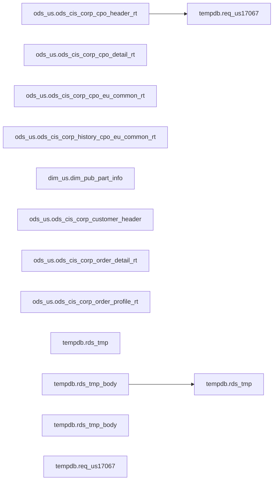

# REPORT: RDS vpo report SQL — vpo cpo mso vpo sso contract ot125 rds 17067 (`tempdb.rds_tmp`)

- artifact_type: rds_report
- artifact_id: rds.starrocks_vpo.vpo_cpo_mso_vpo_sso_contract_ot125_rds_17067
- domain: RDS/starrocks_vpo
- one_line_purpose: RDS vpo report SQL on StarRocks producing `tempdb.rds_tmp`
- layer_type: REPORT
- source_kind: rds_report_sql
- evidence_source: source/contracts/rds/starrocks_vpo/etl/vpo_cpo_mso_vpo_sso_contract_ot125_rds_17067.sql
- knowledgebase_path: target/knowledgebase/RDS/starrocks_vpo/vpo_cpo_mso_vpo_sso_contract_ot125_rds_17067.md
- ref_evidence: source/ref/RDS/starrocks_vpo/

---

## L1 Data Foundation

### Identity and physical mapping
- **Table:** `tempdb.rds_tmp`
- **Layer type:** REPORT
- **Canonical / derived:** Report SQL output (temporary / session result), not a warehouse load target
- **Owner team:** Not documented in repository

### Grain, scope, exclusions
- **Grain:** Not documented in repository (infer from final SELECT in evidence SQL)
- **Scope:** `vpo` domain report on StarRocks
- **Partition:** Not documented in repository — report SQL uses session/date filters (see L4)
- **Natural key:** Not documented in repository
- **Exclusions:** Not documented in repository

### Cross-engine presence
| Engine | Present | Canonical FQN | Notes |
|--------|---------|---------------|-------|
| StarRocks | yes | `tempdb.rds_tmp` | Evidence SQL pack `starrocks_vpo` |
| Vertica | unknown | — | Sister pack may exist under the other engine prefix |

### Physical schema reference

Pointer block only — report outputs are session temps; no warehouse L1 catalog unless separately seeded.

| Field | Value |
|-------|-------|
| **Authoritative catalog** | Not documented in repository (report temp output) |
| **entity_id** | `tempdb.rds_tmp` |
| **l1_catalog_seed** | Not documented in repository |
| **column_count** | 24 |
| **partition_keys** | Not documented in repository |
| **ddl_source** | Report SQL — `source/contracts/rds/starrocks_vpo/etl/vpo_cpo_mso_vpo_sso_contract_ot125_rds_17067.sql` |
| **retrieval** | `python -m tools.wkb.indexing.run_query --query "RDS starrocks_vpo vpo_cpo_mso_vpo_sso_contract_ot125_rds_17067" --intent find_table_schema` |

### Lineage
- **upstream:** `ods_us.ods_cis_corp_cpo_header_rt` — `source/contracts/rds/starrocks_vpo/etl/vpo_cpo_mso_vpo_sso_contract_ot125_rds_17067.sql`
- **upstream:** `ods_us.ods_cis_corp_cpo_detail_rt` — `source/contracts/rds/starrocks_vpo/etl/vpo_cpo_mso_vpo_sso_contract_ot125_rds_17067.sql`
- **upstream:** `ods_us.ods_cis_corp_cpo_eu_common_rt` — `source/contracts/rds/starrocks_vpo/etl/vpo_cpo_mso_vpo_sso_contract_ot125_rds_17067.sql`
- **upstream:** `ods_us.ods_cis_corp_history_cpo_eu_common_rt` — `source/contracts/rds/starrocks_vpo/etl/vpo_cpo_mso_vpo_sso_contract_ot125_rds_17067.sql`
- **upstream:** `dim_us.dim_pub_part_info` — `source/contracts/rds/starrocks_vpo/etl/vpo_cpo_mso_vpo_sso_contract_ot125_rds_17067.sql`
- **upstream:** `ods_us.ods_cis_corp_customer_header` — `source/contracts/rds/starrocks_vpo/etl/vpo_cpo_mso_vpo_sso_contract_ot125_rds_17067.sql`
- **upstream:** `ods_us.ods_cis_corp_order_detail_rt` — `source/contracts/rds/starrocks_vpo/etl/vpo_cpo_mso_vpo_sso_contract_ot125_rds_17067.sql`
- **upstream:** `ods_us.ods_cis_corp_order_profile_rt` — `source/contracts/rds/starrocks_vpo/etl/vpo_cpo_mso_vpo_sso_contract_ot125_rds_17067.sql`
- **upstream:** `ods_us.ods_cis_corp_cpo_profile_rt` — `source/contracts/rds/starrocks_vpo/etl/vpo_cpo_mso_vpo_sso_contract_ot125_rds_17067.sql`
- **upstream:** `ods_us.ods_cis_corp_history_cpo_profile_rt` — `source/contracts/rds/starrocks_vpo/etl/vpo_cpo_mso_vpo_sso_contract_ot125_rds_17067.sql`
- **downstream:** `tempdb.rds_tmp` (report output) — `source/contracts/rds/starrocks_vpo/etl/vpo_cpo_mso_vpo_sso_contract_ot125_rds_17067.sql`
- **downstream:** `tempdb.rds_tmp_body` (report output) — `source/contracts/rds/starrocks_vpo/etl/vpo_cpo_mso_vpo_sso_contract_ot125_rds_17067.sql`
- **downstream:** `tempdb.req_us17067` (report output) — `source/contracts/rds/starrocks_vpo/etl/vpo_cpo_mso_vpo_sso_contract_ot125_rds_17067.sql`

### Freshness and load path
| Item | Value |
|------|-------|
| Load pattern | On-demand report SQL (not Azkaban warehouse load) |
| Schedule | Not documented in repository |
| Parameters | Session / report parameters in SQL (if any) |

---

## L2 Declarative Knowledge

### Business purpose
RDS `vpo` curated example report SQL for StarRocks. Documents how the report stages data into temporary tables and projects the final result set used by RDS tooling. Business filters and measure formulas must be taken from the evidence SQL and `source/ref/RDS/starrocks_vpo/special_logic.txt` — do not invent.

### Audience and use cases
| Audience | How they benefit |
|----------|-----------------|
| **RDS developers** | Reuse proven report patterns for `vpo` |
| **Analysts** | Understand which warehouse tables feed this report |

### Fact key resolution
N/A — catalog-only / report SQL (not a FACT warehouse table load).

### Time field semantics
- **date_flag / report dates:** use predicates present in the evidence SQL; see L3 Key filters.

### Metrics served
| Category | Columns | Business reading |
|----------|---------|------------------|
| Report measures | See L3 column derivations | Derived in report SELECT list |

### Metric serving map
- Report output columns map 1:1 from final SELECT aliases (see L3).

### etl_metrics
*(Link to pack metric-index; formulas append-only — do not invent.)*

- **Source:** [source/contracts/rds/starrocks_vpo/metric-index.md](../../../../source/contracts/rds/starrocks_vpo/metric-index.md)
- **Business definition:** Not documented in repository unless listed in metric-index
- Formula SQL: use metric-index `final_effective_formula_sql` when present; otherwise Not documented in repository

---

## L3 Procedural Knowledge

### Query and routing rules
**Business filters:** predicates in the report SQL WHERE clauses (see Key filters).
**Technical predicates (load only):** N/A — not a warehouse partition load job.

### Dimension join patterns
| Dimension FQN | Join keys | Purpose | Evidence |
|---------------|-----------|---------|----------|
| See SQL JOIN list | Not documented in repository | Dimension enrichment in report | `source/contracts/rds/starrocks_vpo/etl/vpo_cpo_mso_vpo_sso_contract_ot125_rds_17067.sql` |

### Key filters and ETL business logic
- `ch.convert_datetime between DATE_FORMAT(date_add(current_date(),interval -1 day), '%Y-%m-01') AND current_date() and pm.vend_no in (96378,75432,75062,54254,74771,75063,96248,96432,…`
- `a.contract_no is null`
- `a.contract_no is not null`

### Standard time-filter SQL
<!-- sql-artifact snippet_type: time_filter_pattern -->
```sql
-- Use date predicates from source/contracts/rds/starrocks_vpo/etl/vpo_cpo_mso_vpo_sso_contract_ot125_rds_17067.sql; do not invent partition values.
```

### End-to-end flow
1. Read permanent sources (19 objects).
2. Build staging temps (3 objects).
3. Materialize final output `tempdb.rds_tmp`.



### Base tables register
| Object | Role in this job |
|--------|-----------------|
| `ods_us.ods_cis_corp_cpo_header_rt` | Permanent warehouse source |
| `ods_us.ods_cis_corp_cpo_detail_rt` | Permanent warehouse source |
| `ods_us.ods_cis_corp_cpo_eu_common_rt` | Permanent warehouse source |
| `ods_us.ods_cis_corp_history_cpo_eu_common_rt` | Permanent warehouse source |
| `dim_us.dim_pub_part_info` | Permanent warehouse source |
| `ods_us.ods_cis_corp_customer_header` | Permanent warehouse source |
| `ods_us.ods_cis_corp_order_detail_rt` | Permanent warehouse source |
| `ods_us.ods_cis_corp_order_profile_rt` | Permanent warehouse source |
| `ods_us.ods_cis_corp_cpo_profile_rt` | Permanent warehouse source |
| `ods_us.ods_cis_corp_history_cpo_profile_rt` | Permanent warehouse source |
| `ods_us.ods_cis_corp_ot125_billing_entry` | Permanent warehouse source |
| `ods_us.ods_cis_corp_addr_xref_rt` | Permanent warehouse source |
| `ods_us.ods_cis_corp_address_rt` | Permanent warehouse source |
| `ods_us.ods_cis_corp_vpc_group_xref_rt` | Permanent warehouse source |
| `ods_us.ods_cis_corp_vpc_group_rt` | Permanent warehouse source |
| `ods_us.ods_cis_corp_history_cpo_header_rt` | Permanent warehouse source |
| `ods_us.ods_cis_corp_history_cpo_detail_rt` | Permanent warehouse source |
| `ods_us.ods_cis_corp_history_detail_rt` | Permanent warehouse source |
| `ods_us.ods_cis_corp_history_profile_rt` | Permanent warehouse source |
| `tempdb.req_us17067` | Report staging / temp table |
| `tempdb.rds_tmp` | Report staging / temp table |
| `tempdb.rds_tmp_body` | Report staging / temp table |
| `tempdb.rds_tmp` | Final report output object |
| `tempdb.rds_tmp_body` | Final report output object |
| `tempdb.req_us17067` | Final report output object |

### Step-by-step logic
#### Step 1 -- read warehouse sources
**Source:** `ods_us.ods_cis_corp_cpo_header_rt`, `ods_us.ods_cis_corp_cpo_detail_rt`, `ods_us.ods_cis_corp_cpo_eu_common_rt`, `ods_us.ods_cis_corp_history_cpo_eu_common_rt`, `dim_us.dim_pub_part_info`, `ods_us.ods_cis_corp_customer_header`, `ods_us.ods_cis_corp_order_detail_rt`, `ods_us.ods_cis_corp_order_profile_rt`, `ods_us.ods_cis_corp_cpo_profile_rt`, `ods_us.ods_cis_corp_history_cpo_profile_rt`, `ods_us.ods_cis_corp_ot125_billing_entry`, `ods_us.ods_cis_corp_addr_xref_rt`  
**Filter:** see Key filters  
**Join keys:** Not documented in repository (see SQL)

#### Step 2 -- `tempdb.req_us17067`
**Source:** prior step / permanent tables  
**Filter:** report-specific predicates in SQL  
**Join keys:** Not documented in repository (see SQL)

#### Step 3 -- `tempdb.rds_tmp`
**Source:** prior step / permanent tables  
**Filter:** report-specific predicates in SQL  
**Join keys:** Not documented in repository (see SQL)

#### Step 4 -- `tempdb.rds_tmp_body`
**Source:** prior step / permanent tables  
**Filter:** report-specific predicates in SQL  
**Join keys:** Not documented in repository (see SQL)

#### Step 5 -- finalize `tempdb.rds_tmp`
**Source:** last staging temp  
**Filter:** final SELECT projection  
**Join keys:** N/A

#### Step 6 -- finalize `tempdb.rds_tmp_body`
**Source:** last staging temp  
**Filter:** final SELECT projection  
**Join keys:** N/A

#### Step 7 -- finalize `tempdb.req_us17067`
**Source:** last staging temp  
**Filter:** final SELECT projection  
**Join keys:** N/A


### Column / field derivations (from ETL SQL)

| target_column | expression_sql | upstream_columns | upstream_tables | transform_kind | evidence |
|---------------|----------------|------------------|-----------------|----------------|----------|
| `cpo_id` | `ch.cpo_id` | `cpo_id` | `ods_us.ods_cis_corp_cpo_header_rt`, `ods_us.ods_cis_corp_cpo_detail_rt`, `ods_us.ods_cis_corp_cpo_eu_common_rt`, `ods_us.ods_cis_corp_history_cpo_eu_common_rt`, `dim_us.dim_pub_part_info`, `ods_us.ods_cis_corp_customer_header`, `ods_us.ods_cis_corp_order_detail_rt`, `ods_us.ods_cis_corp_order_profile_rt`, `ods_us.ods_cis_corp_cpo_profile_rt`, `ods_us.ods_cis_corp_history_cpo_profile_rt`, `ods_us.ods_cis_corp_ot125_billing_entry`, `ods_us.ods_cis_corp_addr_xref_rt` | passthrough | `source/contracts/rds/starrocks_vpo/etl/vpo_cpo_mso_vpo_sso_contract_ot125_rds_17067.sql:34` |
| `Calendar_Day` | `date_format(ch.convert_datetime ,'%m/%d/%Y')as` | `convert_datetime`, `m`, `d`, `Y` | `ods_us.ods_cis_corp_cpo_header_rt`, `ods_us.ods_cis_corp_cpo_detail_rt`, `ods_us.ods_cis_corp_cpo_eu_common_rt`, `ods_us.ods_cis_corp_history_cpo_eu_common_rt`, `dim_us.dim_pub_part_info`, `ods_us.ods_cis_corp_customer_header`, `ods_us.ods_cis_corp_order_detail_rt`, `ods_us.ods_cis_corp_order_profile_rt`, `ods_us.ods_cis_corp_cpo_profile_rt`, `ods_us.ods_cis_corp_history_cpo_profile_rt`, `ods_us.ods_cis_corp_ot125_billing_entry`, `ods_us.ods_cis_corp_addr_xref_rt` | arithmetic | `source/contracts/rds/starrocks_vpo/etl/vpo_cpo_mso_vpo_sso_contract_ot125_rds_17067.sql:35` |
| `Sold_To_Party` | `cth.cust_name` | `cust_name` | `ods_us.ods_cis_corp_cpo_header_rt`, `ods_us.ods_cis_corp_cpo_detail_rt`, `ods_us.ods_cis_corp_cpo_eu_common_rt`, `ods_us.ods_cis_corp_history_cpo_eu_common_rt`, `dim_us.dim_pub_part_info`, `ods_us.ods_cis_corp_customer_header`, `ods_us.ods_cis_corp_order_detail_rt`, `ods_us.ods_cis_corp_order_profile_rt`, `ods_us.ods_cis_corp_cpo_profile_rt`, `ods_us.ods_cis_corp_history_cpo_profile_rt`, `ods_us.ods_cis_corp_ot125_billing_entry`, `ods_us.ods_cis_corp_addr_xref_rt` | rename | `source/contracts/rds/starrocks_vpo/etl/vpo_cpo_mso_vpo_sso_contract_ot125_rds_17067.sql:36` |
| `Region` | `adr.state` | `state` | `ods_us.ods_cis_corp_cpo_header_rt`, `ods_us.ods_cis_corp_cpo_detail_rt`, `ods_us.ods_cis_corp_cpo_eu_common_rt`, `ods_us.ods_cis_corp_history_cpo_eu_common_rt`, `dim_us.dim_pub_part_info`, `ods_us.ods_cis_corp_customer_header`, `ods_us.ods_cis_corp_order_detail_rt`, `ods_us.ods_cis_corp_order_profile_rt`, `ods_us.ods_cis_corp_cpo_profile_rt`, `ods_us.ods_cis_corp_history_cpo_profile_rt`, `ods_us.ods_cis_corp_ot125_billing_entry`, `ods_us.ods_cis_corp_addr_xref_rt` | rename | `source/contracts/rds/starrocks_vpo/etl/vpo_cpo_mso_vpo_sso_contract_ot125_rds_17067.sql:37` |
| `End_Customer` | `case when cec.eu_company_name is null then cec1.eu_company_name else cec.eu_company_name end` | `eu_company_name` | `ods_us.ods_cis_corp_cpo_header_rt`, `ods_us.ods_cis_corp_cpo_detail_rt`, `ods_us.ods_cis_corp_cpo_eu_common_rt`, `ods_us.ods_cis_corp_history_cpo_eu_common_rt`, `dim_us.dim_pub_part_info`, `ods_us.ods_cis_corp_customer_header`, `ods_us.ods_cis_corp_order_detail_rt`, `ods_us.ods_cis_corp_order_profile_rt`, `ods_us.ods_cis_corp_cpo_profile_rt`, `ods_us.ods_cis_corp_history_cpo_profile_rt`, `ods_us.ods_cis_corp_ot125_billing_entry`, `ods_us.ods_cis_corp_addr_xref_rt` | case | `source/contracts/rds/starrocks_vpo/etl/vpo_cpo_mso_vpo_sso_contract_ot125_rds_17067.sql:32` |
| `Drop_Ship_Flag` | `case when (oh.order_no is not null) or (cp.profile_i is not null or hcp.profile_i is not null) then 'Y' ELSE 'N' END` | `order_no`, `profile_i`, `Y`, `N` | `ods_us.ods_cis_corp_cpo_header_rt`, `ods_us.ods_cis_corp_cpo_detail_rt`, `ods_us.ods_cis_corp_cpo_eu_common_rt`, `ods_us.ods_cis_corp_history_cpo_eu_common_rt`, `dim_us.dim_pub_part_info`, `ods_us.ods_cis_corp_customer_header`, `ods_us.ods_cis_corp_order_detail_rt`, `ods_us.ods_cis_corp_order_profile_rt`, `ods_us.ods_cis_corp_cpo_profile_rt`, `ods_us.ods_cis_corp_history_cpo_profile_rt`, `ods_us.ods_cis_corp_ot125_billing_entry`, `ods_us.ods_cis_corp_addr_xref_rt` | case | `source/contracts/rds/starrocks_vpo/etl/vpo_cpo_mso_vpo_sso_contract_ot125_rds_17067.sql:42` |
| `Reservation_Flag` | `case when op.order_no is not null then 'Y' ELSE 'N' END` | `order_no`, `Y`, `N` | `ods_us.ods_cis_corp_cpo_header_rt`, `ods_us.ods_cis_corp_cpo_detail_rt`, `ods_us.ods_cis_corp_cpo_eu_common_rt`, `ods_us.ods_cis_corp_history_cpo_eu_common_rt`, `dim_us.dim_pub_part_info`, `ods_us.ods_cis_corp_customer_header`, `ods_us.ods_cis_corp_order_detail_rt`, `ods_us.ods_cis_corp_order_profile_rt`, `ods_us.ods_cis_corp_cpo_profile_rt`, `ods_us.ods_cis_corp_history_cpo_profile_rt`, `ods_us.ods_cis_corp_ot125_billing_entry`, `ods_us.ods_cis_corp_addr_xref_rt` | case | `source/contracts/rds/starrocks_vpo/etl/vpo_cpo_mso_vpo_sso_contract_ot125_rds_17067.sql:43` |
| `cpo_line_seq` | `cd.cpo_line_seq` | `cpo_line_seq` | `ods_us.ods_cis_corp_cpo_header_rt`, `ods_us.ods_cis_corp_cpo_detail_rt`, `ods_us.ods_cis_corp_cpo_eu_common_rt`, `ods_us.ods_cis_corp_history_cpo_eu_common_rt`, `dim_us.dim_pub_part_info`, `ods_us.ods_cis_corp_customer_header`, `ods_us.ods_cis_corp_order_detail_rt`, `ods_us.ods_cis_corp_order_profile_rt`, `ods_us.ods_cis_corp_cpo_profile_rt`, `ods_us.ods_cis_corp_history_cpo_profile_rt`, `ods_us.ods_cis_corp_ot125_billing_entry`, `ods_us.ods_cis_corp_addr_xref_rt` | passthrough | `source/contracts/rds/starrocks_vpo/etl/vpo_cpo_mso_vpo_sso_contract_ot125_rds_17067.sql:44` |
| `MSO` | `oh.order_no` | `order_no` | `ods_us.ods_cis_corp_cpo_header_rt`, `ods_us.ods_cis_corp_cpo_detail_rt`, `ods_us.ods_cis_corp_cpo_eu_common_rt`, `ods_us.ods_cis_corp_history_cpo_eu_common_rt`, `dim_us.dim_pub_part_info`, `ods_us.ods_cis_corp_customer_header`, `ods_us.ods_cis_corp_order_detail_rt`, `ods_us.ods_cis_corp_order_profile_rt`, `ods_us.ods_cis_corp_cpo_profile_rt`, `ods_us.ods_cis_corp_history_cpo_profile_rt`, `ods_us.ods_cis_corp_ot125_billing_entry`, `ods_us.ods_cis_corp_addr_xref_rt` | rename | `source/contracts/rds/starrocks_vpo/etl/vpo_cpo_mso_vpo_sso_contract_ot125_rds_17067.sql:42` |
| `VPO` | `vpo.order_no` | `order_no` | `ods_us.ods_cis_corp_cpo_header_rt`, `ods_us.ods_cis_corp_cpo_detail_rt`, `ods_us.ods_cis_corp_cpo_eu_common_rt`, `ods_us.ods_cis_corp_history_cpo_eu_common_rt`, `dim_us.dim_pub_part_info`, `ods_us.ods_cis_corp_customer_header`, `ods_us.ods_cis_corp_order_detail_rt`, `ods_us.ods_cis_corp_order_profile_rt`, `ods_us.ods_cis_corp_cpo_profile_rt`, `ods_us.ods_cis_corp_history_cpo_profile_rt`, `ods_us.ods_cis_corp_ot125_billing_entry`, `ods_us.ods_cis_corp_addr_xref_rt` | rename | `source/contracts/rds/starrocks_vpo/etl/vpo_cpo_mso_vpo_sso_contract_ot125_rds_17067.sql:46` |
| `SSO` | `sso.order_no` | `order_no` | `ods_us.ods_cis_corp_cpo_header_rt`, `ods_us.ods_cis_corp_cpo_detail_rt`, `ods_us.ods_cis_corp_cpo_eu_common_rt`, `ods_us.ods_cis_corp_history_cpo_eu_common_rt`, `dim_us.dim_pub_part_info`, `ods_us.ods_cis_corp_customer_header`, `ods_us.ods_cis_corp_order_detail_rt`, `ods_us.ods_cis_corp_order_profile_rt`, `ods_us.ods_cis_corp_cpo_profile_rt`, `ods_us.ods_cis_corp_history_cpo_profile_rt`, `ods_us.ods_cis_corp_ot125_billing_entry`, `ods_us.ods_cis_corp_addr_xref_rt` | rename | `source/contracts/rds/starrocks_vpo/etl/vpo_cpo_mso_vpo_sso_contract_ot125_rds_17067.sql:47` |
| `contract_no` | `case when cp.profile_i is null then hcp.profile_i else cp.profile_i end` | `profile_i` | `ods_us.ods_cis_corp_cpo_header_rt`, `ods_us.ods_cis_corp_cpo_detail_rt`, `ods_us.ods_cis_corp_cpo_eu_common_rt`, `ods_us.ods_cis_corp_history_cpo_eu_common_rt`, `dim_us.dim_pub_part_info`, `ods_us.ods_cis_corp_customer_header`, `ods_us.ods_cis_corp_order_detail_rt`, `ods_us.ods_cis_corp_order_profile_rt`, `ods_us.ods_cis_corp_cpo_profile_rt`, `ods_us.ods_cis_corp_history_cpo_profile_rt`, `ods_us.ods_cis_corp_ot125_billing_entry`, `ods_us.ods_cis_corp_addr_xref_rt` | case | `source/contracts/rds/starrocks_vpo/etl/vpo_cpo_mso_vpo_sso_contract_ot125_rds_17067.sql:48` |
| `OT125` | `case when obe.order_no is null then obe1.order_no else obe.order_no end` | `order_no` | `ods_us.ods_cis_corp_cpo_header_rt`, `ods_us.ods_cis_corp_cpo_detail_rt`, `ods_us.ods_cis_corp_cpo_eu_common_rt`, `ods_us.ods_cis_corp_history_cpo_eu_common_rt`, `dim_us.dim_pub_part_info`, `ods_us.ods_cis_corp_customer_header`, `ods_us.ods_cis_corp_order_detail_rt`, `ods_us.ods_cis_corp_order_profile_rt`, `ods_us.ods_cis_corp_cpo_profile_rt`, `ods_us.ods_cis_corp_history_cpo_profile_rt`, `ods_us.ods_cis_corp_ot125_billing_entry`, `ods_us.ods_cis_corp_addr_xref_rt` | case | `source/contracts/rds/starrocks_vpo/etl/vpo_cpo_mso_vpo_sso_contract_ot125_rds_17067.sql:49` |
| `vend_no` | `pm.vend_no` | `vend_no` | `ods_us.ods_cis_corp_cpo_header_rt`, `ods_us.ods_cis_corp_cpo_detail_rt`, `ods_us.ods_cis_corp_cpo_eu_common_rt`, `ods_us.ods_cis_corp_history_cpo_eu_common_rt`, `dim_us.dim_pub_part_info`, `ods_us.ods_cis_corp_customer_header`, `ods_us.ods_cis_corp_order_detail_rt`, `ods_us.ods_cis_corp_order_profile_rt`, `ods_us.ods_cis_corp_cpo_profile_rt`, `ods_us.ods_cis_corp_history_cpo_profile_rt`, `ods_us.ods_cis_corp_ot125_billing_entry`, `ods_us.ods_cis_corp_addr_xref_rt` | passthrough | `source/contracts/rds/starrocks_vpo/etl/vpo_cpo_mso_vpo_sso_contract_ot125_rds_17067.sql:50` |
| `vpl_no` | `pm.vpl_no` | `vpl_no` | `ods_us.ods_cis_corp_cpo_header_rt`, `ods_us.ods_cis_corp_cpo_detail_rt`, `ods_us.ods_cis_corp_cpo_eu_common_rt`, `ods_us.ods_cis_corp_history_cpo_eu_common_rt`, `dim_us.dim_pub_part_info`, `ods_us.ods_cis_corp_customer_header`, `ods_us.ods_cis_corp_order_detail_rt`, `ods_us.ods_cis_corp_order_profile_rt`, `ods_us.ods_cis_corp_cpo_profile_rt`, `ods_us.ods_cis_corp_history_cpo_profile_rt`, `ods_us.ods_cis_corp_ot125_billing_entry`, `ods_us.ods_cis_corp_addr_xref_rt` | passthrough | `source/contracts/rds/starrocks_vpo/etl/vpo_cpo_mso_vpo_sso_contract_ot125_rds_17067.sql:51` |
| `vend_name` | `pm.vend_name` | `vend_name` | `ods_us.ods_cis_corp_cpo_header_rt`, `ods_us.ods_cis_corp_cpo_detail_rt`, `ods_us.ods_cis_corp_cpo_eu_common_rt`, `ods_us.ods_cis_corp_history_cpo_eu_common_rt`, `dim_us.dim_pub_part_info`, `ods_us.ods_cis_corp_customer_header`, `ods_us.ods_cis_corp_order_detail_rt`, `ods_us.ods_cis_corp_order_profile_rt`, `ods_us.ods_cis_corp_cpo_profile_rt`, `ods_us.ods_cis_corp_history_cpo_profile_rt`, `ods_us.ods_cis_corp_ot125_billing_entry`, `ods_us.ods_cis_corp_addr_xref_rt` | passthrough | `source/contracts/rds/starrocks_vpo/etl/vpo_cpo_mso_vpo_sso_contract_ot125_rds_17067.sql:52` |
| `Customer_PO_Number` | `ch.cpo_no` | `cpo_no` | `ods_us.ods_cis_corp_cpo_header_rt`, `ods_us.ods_cis_corp_cpo_detail_rt`, `ods_us.ods_cis_corp_cpo_eu_common_rt`, `ods_us.ods_cis_corp_history_cpo_eu_common_rt`, `dim_us.dim_pub_part_info`, `ods_us.ods_cis_corp_customer_header`, `ods_us.ods_cis_corp_order_detail_rt`, `ods_us.ods_cis_corp_order_profile_rt`, `ods_us.ods_cis_corp_cpo_profile_rt`, `ods_us.ods_cis_corp_history_cpo_profile_rt`, `ods_us.ods_cis_corp_ot125_billing_entry`, `ods_us.ods_cis_corp_addr_xref_rt` | rename | `source/contracts/rds/starrocks_vpo/etl/vpo_cpo_mso_vpo_sso_contract_ot125_rds_17067.sql:53` |
| `pcode` | `pm.pcode` | `pcode` | `ods_us.ods_cis_corp_cpo_header_rt`, `ods_us.ods_cis_corp_cpo_detail_rt`, `ods_us.ods_cis_corp_cpo_eu_common_rt`, `ods_us.ods_cis_corp_history_cpo_eu_common_rt`, `dim_us.dim_pub_part_info`, `ods_us.ods_cis_corp_customer_header`, `ods_us.ods_cis_corp_order_detail_rt`, `ods_us.ods_cis_corp_order_profile_rt`, `ods_us.ods_cis_corp_cpo_profile_rt`, `ods_us.ods_cis_corp_history_cpo_profile_rt`, `ods_us.ods_cis_corp_ot125_billing_entry`, `ods_us.ods_cis_corp_addr_xref_rt` | passthrough | `source/contracts/rds/starrocks_vpo/etl/vpo_cpo_mso_vpo_sso_contract_ot125_rds_17067.sql:54` |
| `pcode_desc` | `pm.pcode_desc` | `pcode_desc` | `ods_us.ods_cis_corp_cpo_header_rt`, `ods_us.ods_cis_corp_cpo_detail_rt`, `ods_us.ods_cis_corp_cpo_eu_common_rt`, `ods_us.ods_cis_corp_history_cpo_eu_common_rt`, `dim_us.dim_pub_part_info`, `ods_us.ods_cis_corp_customer_header`, `ods_us.ods_cis_corp_order_detail_rt`, `ods_us.ods_cis_corp_order_profile_rt`, `ods_us.ods_cis_corp_cpo_profile_rt`, `ods_us.ods_cis_corp_history_cpo_profile_rt`, `ods_us.ods_cis_corp_ot125_billing_entry`, `ods_us.ods_cis_corp_addr_xref_rt` | passthrough | `source/contracts/rds/starrocks_vpo/etl/vpo_cpo_mso_vpo_sso_contract_ot125_rds_17067.sql:55` |
| `category` | `pm.category` | `category` | `ods_us.ods_cis_corp_cpo_header_rt`, `ods_us.ods_cis_corp_cpo_detail_rt`, `ods_us.ods_cis_corp_cpo_eu_common_rt`, `ods_us.ods_cis_corp_history_cpo_eu_common_rt`, `dim_us.dim_pub_part_info`, `ods_us.ods_cis_corp_customer_header`, `ods_us.ods_cis_corp_order_detail_rt`, `ods_us.ods_cis_corp_order_profile_rt`, `ods_us.ods_cis_corp_cpo_profile_rt`, `ods_us.ods_cis_corp_history_cpo_profile_rt`, `ods_us.ods_cis_corp_ot125_billing_entry`, `ods_us.ods_cis_corp_addr_xref_rt` | passthrough | `source/contracts/rds/starrocks_vpo/etl/vpo_cpo_mso_vpo_sso_contract_ot125_rds_17067.sql:56` |
| `global_cat_type` | `pm.global_cat_type` | `global_cat_type` | `ods_us.ods_cis_corp_cpo_header_rt`, `ods_us.ods_cis_corp_cpo_detail_rt`, `ods_us.ods_cis_corp_cpo_eu_common_rt`, `ods_us.ods_cis_corp_history_cpo_eu_common_rt`, `dim_us.dim_pub_part_info`, `ods_us.ods_cis_corp_customer_header`, `ods_us.ods_cis_corp_order_detail_rt`, `ods_us.ods_cis_corp_order_profile_rt`, `ods_us.ods_cis_corp_cpo_profile_rt`, `ods_us.ods_cis_corp_history_cpo_profile_rt`, `ods_us.ods_cis_corp_ot125_billing_entry`, `ods_us.ods_cis_corp_addr_xref_rt` | passthrough | `source/contracts/rds/starrocks_vpo/etl/vpo_cpo_mso_vpo_sso_contract_ot125_rds_17067.sql:57` |
| `VPG` | `pm.vpl_code` | `vpl_code` | `ods_us.ods_cis_corp_cpo_header_rt`, `ods_us.ods_cis_corp_cpo_detail_rt`, `ods_us.ods_cis_corp_cpo_eu_common_rt`, `ods_us.ods_cis_corp_history_cpo_eu_common_rt`, `dim_us.dim_pub_part_info`, `ods_us.ods_cis_corp_customer_header`, `ods_us.ods_cis_corp_order_detail_rt`, `ods_us.ods_cis_corp_order_profile_rt`, `ods_us.ods_cis_corp_cpo_profile_rt`, `ods_us.ods_cis_corp_history_cpo_profile_rt`, `ods_us.ods_cis_corp_ot125_billing_entry`, `ods_us.ods_cis_corp_addr_xref_rt` | rename | `source/contracts/rds/starrocks_vpo/etl/vpo_cpo_mso_vpo_sso_contract_ot125_rds_17067.sql:58` |
| `VPG_DESC` | `vpg.vpc_group_desc` | `vpc_group_desc` | `ods_us.ods_cis_corp_cpo_header_rt`, `ods_us.ods_cis_corp_cpo_detail_rt`, `ods_us.ods_cis_corp_cpo_eu_common_rt`, `ods_us.ods_cis_corp_history_cpo_eu_common_rt`, `dim_us.dim_pub_part_info`, `ods_us.ods_cis_corp_customer_header`, `ods_us.ods_cis_corp_order_detail_rt`, `ods_us.ods_cis_corp_order_profile_rt`, `ods_us.ods_cis_corp_cpo_profile_rt`, `ods_us.ods_cis_corp_history_cpo_profile_rt`, `ods_us.ods_cis_corp_ot125_billing_entry`, `ods_us.ods_cis_corp_addr_xref_rt` | rename | `source/contracts/rds/starrocks_vpo/etl/vpo_cpo_mso_vpo_sso_contract_ot125_rds_17067.sql:59` |
| `End_User_State` | `case when cec.eu_loc_state is null then cec1.eu_loc_state else cec.eu_loc_state end` | `eu_loc_state` | `ods_us.ods_cis_corp_cpo_header_rt`, `ods_us.ods_cis_corp_cpo_detail_rt`, `ods_us.ods_cis_corp_cpo_eu_common_rt`, `ods_us.ods_cis_corp_history_cpo_eu_common_rt`, `dim_us.dim_pub_part_info`, `ods_us.ods_cis_corp_customer_header`, `ods_us.ods_cis_corp_order_detail_rt`, `ods_us.ods_cis_corp_order_profile_rt`, `ods_us.ods_cis_corp_cpo_profile_rt`, `ods_us.ods_cis_corp_history_cpo_profile_rt`, `ods_us.ods_cis_corp_ot125_billing_entry`, `ods_us.ods_cis_corp_addr_xref_rt` | case | `source/contracts/rds/starrocks_vpo/etl/vpo_cpo_mso_vpo_sso_contract_ot125_rds_17067.sql:60` |

### Sentinel and code values
| Value | Type | Meaning |
|-------|------|---------|
| None identified in repository | — | — |

---

## L4 Validation

### Resolved partition value
| Step | Source | How partition/date is determined |
|------|--------|----------------------------------|
| 1 | Report SQL | Session/current_date or explicit literals in `source/contracts/rds/starrocks_vpo/etl/vpo_cpo_mso_vpo_sso_contract_ot125_rds_17067.sql` — Not documented as Azkaban partition |

**Plain language:** This is on-demand report SQL. Date windows come from the script body or runtime parameters, not from warehouse ETL bootstrap jobs.

### Data quality checks
- Row counts on `tempdb.rds_tmp` after report execution
- Spot-check measure totals vs source fact tables listed in L1 lineage

### Validation SQL
<!-- sql-artifact snippet_type: illustrative intent: audit -->
```sql
-- 1) row count on final output (session)
-- SELECT COUNT(*) FROM tempdb.rds_tmp;

-- 2) metric sum by a key dimension (replace <dim> / <metric> from final SELECT)
-- SELECT <dim>, SUM(<metric>) FROM tempdb.rds_tmp GROUP BY 1;

-- 3) grain duplicate check when natural key is known from SQL
-- SELECT <key_cols>, COUNT(*) FROM tempdb.rds_tmp GROUP BY <key_cols> HAVING COUNT(*) > 1;
```

### Caveats for interpretation
- Temp table names and schemas differ by engine (`rdsetl` vs `tempdb`).
- Example SQL may use regional schemas (`dw_ca`, `dw_us`, `dw_xx` placeholders).

### Conflicts and open questions
- Schedule, SLA, and production report number ownership: Not documented in repository

---

## L5 Runtime View

### Query path and engine preference
| Role | Hive object | Vertica object | Sync mode | Evidence | MCP verified |
|------|-------------|----------------|-----------|----------|--------------|
| Report output | N/A | `tempdb.rds_tmp` (StarRocks) | on-demand | `source/contracts/rds/starrocks_vpo/etl/vpo_cpo_mso_vpo_sso_contract_ot125_rds_17067.sql` | no |

### Access constraints
- Country/region schemas in FROM clauses; do not assume US-only.
- Vertica no-run policy while documenting: do not execute business SQL via Vertica MCP.

### Query risk profile
| Field | Value |
|-------|-------|
| requires_date_predicate | yes (typical for RDS reports) |
| scan_risk_tier | medium |

---

## L6 Access and Consumption

### Primary consumers and use cases
| Consumer | Use case |
|----------|----------|
| RDS report tooling | Execute curated example / production-like report SQL |
| Knowledgebase / agents | Lineage and filter documentation for `vpo` |

### Representative query patterns
<!-- sql-artifact snippet_type: routing_certified -->
```sql
-- See full script: source/contracts/rds/starrocks_vpo/etl/vpo_cpo_mso_vpo_sso_contract_ot125_rds_17067.sql
```

### Dependencies and notes
#### Upstream objects (verified)
| Object | Usage | Evidence |
|--------|-------|----------|
| `ods_us.ods_cis_corp_cpo_header_rt` | FROM/JOIN source | `source/contracts/rds/starrocks_vpo/etl/vpo_cpo_mso_vpo_sso_contract_ot125_rds_17067.sql` |
| `ods_us.ods_cis_corp_cpo_detail_rt` | FROM/JOIN source | `source/contracts/rds/starrocks_vpo/etl/vpo_cpo_mso_vpo_sso_contract_ot125_rds_17067.sql` |
| `ods_us.ods_cis_corp_cpo_eu_common_rt` | FROM/JOIN source | `source/contracts/rds/starrocks_vpo/etl/vpo_cpo_mso_vpo_sso_contract_ot125_rds_17067.sql` |
| `ods_us.ods_cis_corp_history_cpo_eu_common_rt` | FROM/JOIN source | `source/contracts/rds/starrocks_vpo/etl/vpo_cpo_mso_vpo_sso_contract_ot125_rds_17067.sql` |
| `dim_us.dim_pub_part_info` | FROM/JOIN source | `source/contracts/rds/starrocks_vpo/etl/vpo_cpo_mso_vpo_sso_contract_ot125_rds_17067.sql` |
| `ods_us.ods_cis_corp_customer_header` | FROM/JOIN source | `source/contracts/rds/starrocks_vpo/etl/vpo_cpo_mso_vpo_sso_contract_ot125_rds_17067.sql` |
| `ods_us.ods_cis_corp_order_detail_rt` | FROM/JOIN source | `source/contracts/rds/starrocks_vpo/etl/vpo_cpo_mso_vpo_sso_contract_ot125_rds_17067.sql` |
| `ods_us.ods_cis_corp_order_profile_rt` | FROM/JOIN source | `source/contracts/rds/starrocks_vpo/etl/vpo_cpo_mso_vpo_sso_contract_ot125_rds_17067.sql` |
| `ods_us.ods_cis_corp_cpo_profile_rt` | FROM/JOIN source | `source/contracts/rds/starrocks_vpo/etl/vpo_cpo_mso_vpo_sso_contract_ot125_rds_17067.sql` |
| `ods_us.ods_cis_corp_history_cpo_profile_rt` | FROM/JOIN source | `source/contracts/rds/starrocks_vpo/etl/vpo_cpo_mso_vpo_sso_contract_ot125_rds_17067.sql` |
| `ods_us.ods_cis_corp_ot125_billing_entry` | FROM/JOIN source | `source/contracts/rds/starrocks_vpo/etl/vpo_cpo_mso_vpo_sso_contract_ot125_rds_17067.sql` |
| `ods_us.ods_cis_corp_addr_xref_rt` | FROM/JOIN source | `source/contracts/rds/starrocks_vpo/etl/vpo_cpo_mso_vpo_sso_contract_ot125_rds_17067.sql` |
| `ods_us.ods_cis_corp_address_rt` | FROM/JOIN source | `source/contracts/rds/starrocks_vpo/etl/vpo_cpo_mso_vpo_sso_contract_ot125_rds_17067.sql` |
| `ods_us.ods_cis_corp_vpc_group_xref_rt` | FROM/JOIN source | `source/contracts/rds/starrocks_vpo/etl/vpo_cpo_mso_vpo_sso_contract_ot125_rds_17067.sql` |
| `ods_us.ods_cis_corp_vpc_group_rt` | FROM/JOIN source | `source/contracts/rds/starrocks_vpo/etl/vpo_cpo_mso_vpo_sso_contract_ot125_rds_17067.sql` |

#### Downstream consumers (verified)
| Object / script | Evidence |
|-----------------|----------|
| `tempdb.rds_tmp` final report result | `source/contracts/rds/starrocks_vpo/etl/vpo_cpo_mso_vpo_sso_contract_ot125_rds_17067.sql` |

#### Not documented in repository
- Schedule, owner, SLA
- Production Azkaban flow binding for this report example

---

*Document generated from `source/contracts/rds/starrocks_vpo/etl/vpo_cpo_mso_vpo_sso_contract_ot125_rds_17067.sql` (source_kind: rds_report_sql).*
