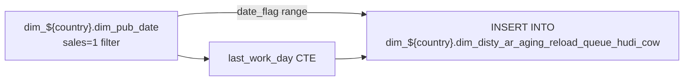

# Utility: AR Aging Reload Queue Loader (`dim_disty_ar_aging_reload_queue_hudi_cow`)

- artifact_type: etl_table
- artifact_id: dim_us.dim_disty_ar_aging_reload_queue_hudi_cow
- domain: ar
- one_line_purpose: This Python script populates the AR aging reload queue Hudi table with a range of business dates that need to be (re-)processed for AR aging. Starting from the most recent sales working day before `date_flag`, it inserts one queue entry per...
- layer_type: DWD
- source_kind: etl_sql
- evidence_source: source/etl/sql/ar/data_service/ar/python/ar_aging_reload_queue.py

---

## L1 Data Foundation

### Identity and physical mapping
- **Table:** `dim_us.dim_disty_ar_aging_reload_queue_hudi_cow`
- **Layer type:** DWD
- **Canonical / derived:** Derived / ETL-loaded (see L3)
- **Owner team:** not registered in metadata catalog

### Grain, scope, exclusions
- **Grain:** one row per calendar date in the reload range.
- **Scope:** See L2 business purpose / L3 filters
- **Partition:** Not documented in repository - resolved from pipeline (see L4)
- **Natural key:** `date_flag` (reload date), `time_stamp` (insert timestamp).
- **Exclusions:** Not documented in repository

#### Grain detail (preserved)

- **Grain:** one row per calendar date in the reload range.
- **Natural key:** `date_flag` (reload date), `time_stamp` (insert timestamp).
- **Table type:** Hudi COW (Copy-On-Write) — `dim_disty_ar_aging_reload_queue_hudi_cow`.

---

### Cross-engine presence
| Engine | Present | Canonical FQN | Notes |
|--------|---------|---------------|-------|
| Hive | yes | `dim_disty_ar_aging_reload_queue_hudi_cow` | ETL target / intermediate per evidence script |
| Vertica | pending | `dim_disty_ar_aging_reload_queue_hudi_cow` | Confirm via hive2vertica flow evidence / MCP |

### Physical schema reference

Pointer block only - full column catalog lives in WKB L1 storage JSON.

| Field | Value |
|-------|-------|
| **Authoritative catalog** | WKB L1 storage seed (not duplicated in this file) |
| **entity_id** | `dim_us.dim_disty_ar_aging_reload_queue_hudi_cow` |
| **l1_catalog_seed** | `target/storage/wkb/snapshots/_snapshot_id_template/l1_catalog/{engine}_{schema}_{table}.json` |
| **column_count** | pending (run ddl_seed_writer) |
| **partition_keys** | `Not documented in repository` |
| **ddl_source** | pending Bitbucket DDL / Vertica metadata ingest |
| **retrieval** | `python -m tools.wkb.indexing.run_query --query "ar ar_aging_reload_queue schema" --intent find_table_schema` |

### Lineage
| Object | Role |
|--------|------|
| `dim_${country}.dim_pub_date` | Business calendar |

---

### Freshness and load path
| Item | Value |
|------|-------|
| Load pattern | See L3 end-to-end / INSERT pattern in evidence script |
| Schedule | Not documented in repository |
| Parameters | `date_flag`, `flow_name`, `biz_unit`, `country` |


---

## L2 Declarative Knowledge

### Business purpose
This Python script populates the AR aging reload queue Hudi table with a range of business dates
that need to be (re-)processed for AR aging. Starting from the most recent sales working day
before `date_flag`, it inserts one queue entry per calendar day up to (but not including)
`date_flag`. It is used to trigger downstream re-processing of AR aging for recent work days.

---

### Audience and use cases
| Audience | How they benefit |
|----------|-----------------|
| **ETL / data operations** | Triggers re-processing of AR aging for any unprocessed working days in the reload queue |
| **Data engineering** | Supports catch-up and incremental re-runs without manual intervention |

---

### Fact key resolution
- Natural key: `date_flag` (reload date), `time_stamp` (insert timestamp).
- FK / label-on attributes: see L3 dimension join patterns and step-by-step logic.
- Negative assertion: do not treat descriptive labels as grain keys unless listed under natural key.

### Time field semantics
- **date_flag / partition columns:** Not documented in repository
- Primary reporting filter should use the partition column(s) documented in L1; resolve values via L4.


### Metrics served

| Category | Column | Logical metric | Business reading |
|----------|--------|----------------|------------------|
| Measures | — | — | No measure columns mapped for this table. |

### Metric serving map

**Formula authority:** [`source/contracts/ar/metric-index.md`](../../source/contracts/ar/metric-index.md)

N/A — no measure columns mapped for this table.

### etl_metrics

No governed logical metrics from `source/contracts/ar/metric-index.md` are mapped on this table.

---

## L3 Procedural Knowledge

### Query and routing rules
**Business filters:** Use partition / date keys from L1 grain for reporting scope.
**Technical predicates (load only):** See Key filters and step-by-step logic below.

### Dimension join patterns
| Dimension FQN | Join keys | Purpose | Evidence |
|---------------|-----------|---------|----------|
| See step-by-step / base tables | See L3 steps | Dimension enrichment | `source/etl/sql/ar/data_service/ar/python/ar_aging_reload_queue.py` |

### Key filters and ETL business logic
### Step 1 — `last_work_day` CTE

**Source:** `dim_${country}.dim_pub_date`

**Filter:** `sales = 1 AND date_flag < '${date_flag}'`

**Derived:** `MAX(date_flag) AS last_workday` — the most recent sales-enabled business day before the run date.

---

### Step 2 — Final `INSERT INTO` (Hudi COW append)

**From:** `dim_${country}.dim_pub_date`

**Filter:** `date_flag >= (last_workday) AND date_flag < '${date_flag}'`

**Columns written:**
- `date_flag` — The date to be reloaded
- `time_stamp = from_utc_timestamp(current_timestamp(), 'America/Los_Angeles')` — Insertion time in Pacific timezone

---

### Standard time-filter SQL
```sql
-- relative period filter using resolved partition value (see L4)
SELECT *
FROM dim_disty_ar_aging_reload_queue_hudi_cow
WHERE /* partition predicate */ date_flag = '${partition_value}';
```

### End-to-end flow
**Runtime parameters:** `date_flag`, `country`
**Target table:** `dim_${country}.dim_disty_ar_aging_reload_queue_hudi_cow` (Hudi COW append).

1. Find `last_workday = MAX(date_flag) WHERE sales=1 AND date_flag < '${date_flag}'` from `dim_pub_date`.
2. Insert all `date_flag` values from `dim_pub_date` where `date_flag >= last_workday AND date_flag < '${date_flag}'`, tagged with the current Pacific-time timestamp.



---


#### High-level stages (preserved)

| Stage | Business meaning |
|-------|-----------------|
| **Find last working day** | Identify the most recent day before `date_flag` where `sales = 1` in the dim_pub_date calendar |
| **Insert queue entries** | Insert one row per date in the range `[last_workday, date_flag)` with a Pacific-time timestamp |

**Parameters:** `date_flag`, `flow_name`, `biz_unit`, `country`

---


### Base tables register
| Object | Role in this job |
|--------|-----------------|
| `dim_${country}.dim_pub_date` | Source for finding the last working day and the date range to enqueue |

---

### Step-by-step logic
### Step 1 — `last_work_day` CTE

**Source:** `dim_${country}.dim_pub_date`

**Filter:** `sales = 1 AND date_flag < '${date_flag}'`

**Derived:** `MAX(date_flag) AS last_workday` — the most recent sales-enabled business day before the run date.

---

### Step 2 — Final `INSERT INTO` (Hudi COW append)

**From:** `dim_${country}.dim_pub_date`

**Filter:** `date_flag >= (last_workday) AND date_flag < '${date_flag}'`

**Columns written:**
- `date_flag` — The date to be reloaded
- `time_stamp = from_utc_timestamp(current_timestamp(), 'America/Los_Angeles')` — Insertion time in Pacific timezone

---

### Relationship map (embedded)

| from_fqn | to_fqn | cardinality | join_keys | provenance |
|----------|--------|-------------|-----------|------------|
| — | — | — | — | Not documented in repository |

`source/ref/ar/table relationship.txt`: Not documented in repository.

### Special logic (embedded)

Not documented in repository

### Column / field derivations (from ETL SQL)

| target_column | expression_sql | upstream_columns | upstream_tables | transform_kind | evidence |
|---------------|----------------|------------------|-----------------|----------------|----------|
| — | — | — | — | — | No derivations parsed from ETL SQL (`source/etl/sql/ar/data_service/ar/python/ar_aging_reload_queue.py`) — Not documented in repository |

### Sentinel and code values
| Value | Meaning |
|-------|---------|
| `sales = 1` in `dim_pub_date` | Indicates a valid sales/working business day |
| `America/Los_Angeles` | All timestamps stored in Pacific time zone |

---

---

## L4 Validation

### Resolved partition value
| Step | Source | How partition / date scope is determined |
|------|--------|------------------------------------------|
| 1 | evidence script / flow | See parameters in L1 Freshness and L3 filters - `source/etl/sql/ar/data_service/ar/python/ar_aging_reload_queue.py` |

**Plain language:** Partition and date scope follow Azkaban/bootstrap parameters documented in the source script and orchestrating flow; do not hardcode calendar literals.

### Data quality checks
- Prefer row-count-by-partition, metric sums, and grain duplicate checks (see Validation SQL).
- Additional checks from legacy caveats / operational notes when present.

### Validation SQL
```sql
-- 1) Row count by partition
SELECT ${partition_col}, COUNT(*) AS row_cnt
FROM dim_${country}.dim_disty_ar_aging_reload_queue_hudi_cow
WHERE ${partition_col} = '${partition_value}'
GROUP BY ${partition_col};

-- 2) Metric sum by business dimension (top deltas)
SELECT ${dim_key}, SUM(${metric}) AS metric_sum
FROM dim_${country}.dim_disty_ar_aging_reload_queue_hudi_cow
WHERE ${partition_col} = '${partition_value}'
GROUP BY ${dim_key}
ORDER BY ABS(SUM(${metric})) DESC
LIMIT 20;

-- 3) Grain duplicate check
SELECT ${grain_key_1}, ${grain_key_2}, ${grain_key_3}, ${partition_col}, COUNT(*) AS cnt
FROM dim_${country}.dim_disty_ar_aging_reload_queue_hudi_cow
WHERE ${partition_col} = '${partition_value}'
GROUP BY ${grain_key_1}, ${grain_key_2}, ${grain_key_3}, ${partition_col}
HAVING COUNT(*) > 1;
```

Replace placeholders from this file's Grain and keys / Data you can fetch sections, and use the resolved partition value from run scope.

### Caveats for interpretation
- This script only **appends** to the Hudi table — it does not delete or overwrite existing queue entries for the same dates.
- The range loaded is typically 1–2 business days (from the last workday up to, but not including, today).
- A companion script (`ar_aging_reload_queue_update.py`) deletes specific entries from this queue after processing.

---

### Conflicts and open questions
- Schedule, owner, SLA: Not documented in repository (unless preserved schedule evidence above).
- Vertica MCP verification: pending unless confirmed in L5.


---

## L5 Runtime View

### Query path and engine preference
| Role | Hive object | Vertica object | Sync mode | Evidence | MCP verified |
|------|-------------|----------------|-----------|----------|--------------|
| **Query for reporting** | *See script lineage* | `dim_${country}.dim_disty_ar_aging_reload_queue_hudi_cow` | *Verify from flow* | *Add flow file:line* | pending |
| **Hive alternative** | `*` | `dim_${country}.dim_disty_ar_aging_reload_queue_hudi_cow` | - | *See dependencies* | - |
| **ETL internal** | staging/temp tables | *Not synced to Vertica* | - | *See step-by-step logic* | - |

Business users should query `dim_${country}.dim_disty_ar_aging_reload_queue_hudi_cow` in Vertica once MCP verification is completed for this document.

### Access constraints
- Country / company schema parameters may apply (`literal_country`, `company_no`, etc.).
- Hive-only staging objects are not reporting surfaces unless synced.

### Query risk profile
| Field | Value |
|-------|-------|
| requires_date_predicate | unknown |
| scan_risk_tier | high |

---

## L6 Access and Consumption

### Primary consumers and use cases
| Audience | How they benefit |
|----------|-----------------|
| **ETL / data operations** | Triggers re-processing of AR aging for any unprocessed working days in the reload queue |
| **Data engineering** | Supports catch-up and incremental re-runs without manual intervention |

---

### Representative query patterns
```sql
-- certified / illustrative lookup - replace predicates from L1/L4
SELECT *
FROM dim_disty_ar_aging_reload_queue_hudi_cow
WHERE date_flag = '${partition_value}'
LIMIT 100;
```

### Dependencies and notes
### Upstream objects (verified)

| Object | Usage | Evidence |
|--------|-------|----------|
| `dim_${country}.dim_pub_date` | Business day calendar | `source/etl/sql/ar/data_service/ar/python/ar_aging_reload_queue.py:22` |

### Downstream consumers (verified)

None identified in repository (queue is consumed by downstream AR aging reload pipelines, not documented here).

### Operational detail (verified)

- Inserts into Hudi COW table (append): `source/etl/sql/ar/data_service/ar/python/ar_aging_reload_queue.py:25`
- Timestamp uses Pacific timezone conversion: `source/etl/sql/ar/data_service/ar/python/ar_aging_reload_queue.py:26`

### Not documented in repository

- Schedule, owner, SLA — not in scripts or configs
- Downstream consumers of the queue table are not present in this repository

### Related scripts (verified)

- `ar_aging_reload_queue_update.py` — Companion that deletes processed entries from this queue — `source/etl/sql/ar/data_service/ar/python/`

---

*Document generated from `source/etl/sql/ar/data_service/ar/python/ar_aging_reload_queue.py`.*

#### Not documented in repository
- Owner, SLA (unless schedule evidence preserved above)
- Any dependency without `file:line` evidence in this document

---

*Document migrated to L1-L6 from legacy Knowledgebase content. Evidence: `source/etl/sql/ar/data_service/ar/python/ar_aging_reload_queue.py`.*
