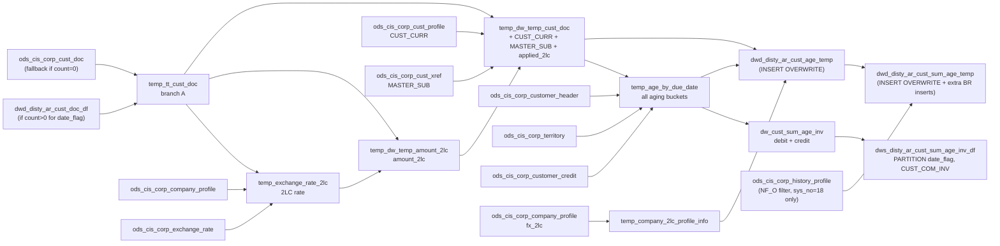

# ETL: AR Customer Aging Temp — Multi-Target (`dwd_disty_ar_cust_age_temp` + `dwd_disty_ar_cust_sum_age_temp` + `dws_disty_ar_cust_sum_age_inv_df`)

- artifact_type: etl_table
- artifact_id: ${target_db}.dws_disty_ar_cust_sum_age_inv_df
- domain: ar
- one_line_purpose: This Python ETL script is the core AR aging computation engine. It reads open AR documents (preferring the pre-built `dwd_disty_ar_cust_doc_df` if available for the date, else falling back to the raw `ods_cis_corp_cust_doc`), computes per-d...
- layer_type: DWD
- source_kind: etl_sql
- evidence_source: source/etl/sql/ar/data_service/ar/python/ar_cust_sum_age_temp.py

---

## L1 Data Foundation

### Identity and physical mapping
- **Table:** `${target_db}.dws_disty_ar_cust_sum_age_inv_df`
- **Layer type:** DWD
- **Canonical / derived:** Derived / ETL-loaded (see L3)
- **Owner team:** not registered in metadata catalog

### Grain, scope, exclusions
- **Grain:** one row per (`cust_no`, `company_no`, `mcust_no`, `cmdm_flag`) per `date_flag`.
- **Scope:** See L2 business purpose / L3 filters
- **Partition:** `date_flag`, `view_level` = `'CUST_COM_INV'`. - resolved from pipeline (see L4)
- **Natural key:** `order_type`, `order_no`, `cust_no`, `company_no`, `mcust_no`.
- **Exclusions:** Not documented in repository

#### Grain detail (preserved)

### `dwd_disty_ar_cust_age_temp`
- **Grain:** one row per open AR document (order_type, order_no) per run.
- **Natural key:** `order_type`, `order_no`, `cust_no`, `company_no`, `mcust_no`.

### `dwd_disty_ar_cust_sum_age_temp`
- **Grain:** one row per (`cust_no`, `company_no`, `mcust_no`, `data_period`) per run.
- **Partition:** none explicit (overwritten each run).

### `dws_disty_ar_cust_sum_age_inv_df`
- **Grain:** one row per (`cust_no`, `company_no`, `mcust_no`, `cmdm_flag`) per `date_flag`.
- **Partition:** `date_flag`, `view_level` = `'CUST_COM_INV'`.

---

### Cross-engine presence
| Engine | Present | Canonical FQN | Notes |
|--------|---------|---------------|-------|
| Hive | yes | `${target_db}.dws_disty_ar_cust_sum_age_inv_df` | ETL target / intermediate per evidence script |
| Vertica | pending | `${target_db}.dws_disty_ar_cust_sum_age_inv_df` | Confirm via hive2vertica flow evidence / MCP |

### Physical schema reference

Pointer block only - full column catalog lives in WKB L1 storage JSON.

| Field | Value |
|-------|-------|
| **Authoritative catalog** | WKB L1 storage seed (not duplicated in this file) |
| **entity_id** | `${target_db}.dws_disty_ar_cust_sum_age_inv_df` |
| **l1_catalog_seed** | `target/storage/wkb/snapshots/_snapshot_id_template/l1_catalog/{engine}_{schema}_{table}.json` |
| **column_count** | pending (run ddl_seed_writer) |
| **partition_keys** | `date_flag, view_level, 'CUST_COM_INV'` |
| **ddl_source** | pending Bitbucket DDL / Vertica metadata ingest |
| **retrieval** | `python -m tools.wkb.indexing.run_query --query "ar ar_cust_sum_age_temp schema" --intent find_table_schema` |

### Lineage
| Object | Role |
|--------|------|
| `${target_db}.dwd_disty_ar_cust_doc_df` | Preferred source for open AR items |
| `${source_db}.ods_cis_corp_cust_doc` | Fallback source |

---

### Freshness and load path
| Item | Value |
|------|-------|
| Load pattern | See L3 end-to-end / INSERT pattern in evidence script |
| Schedule | Not documented in repository |
| Parameters | `date_flag`, `etl_timestamp`, `target_db`, `source_db`, `sys_no`, `data_period` |


---

## L2 Declarative Knowledge

### Business purpose
This Python ETL script is the core AR aging computation engine. It reads open AR documents
(preferring the pre-built `dwd_disty_ar_cust_doc_df` if available for the date, else falling back
to the raw `ods_cis_corp_cust_doc`), computes per-document aging buckets using the SIGN-product
formula, and writes results to three downstream tables: the per-document aging intermediate
(`dwd_disty_ar_cust_age_temp`), the customer-aggregated aging summary temp (`dwd_disty_ar_cust_sum_age_temp`),
and an invoice-level view (`dws_disty_ar_cust_sum_age_inv_df`). For system 18 (Brazil/WCLA), additional
`data_period` segments (1–5) are appended based on nota-fiscal presence and credit-memo polarity.

---

### Audience and use cases
| Audience | How they benefit |
|----------|-----------------|
| **Credit / AR** | Feeds `dws_ar_cust_sum_age_df.sql` which produces all customer and aggregate aging views |
| **Finance (Brazil)** | Nota-fiscal-separated aging segments (data_period 1–5) for NF-based collection reporting |
| **Credit management** | Invoice-level aging by customer and segment (`CUST_COM_INV` view in `dws_disty_ar_cust_sum_age_inv_df`) |

---

### Fact key resolution
- Natural key: `order_type`, `order_no`, `cust_no`, `company_no`, `mcust_no`.
- FK / label-on attributes: see L3 dimension join patterns and step-by-step logic.
- Negative assertion: do not treat descriptive labels as grain keys unless listed under natural key.

### Time field semantics
- **date_flag / partition columns:** `date_flag`, `view_level` = `'CUST_COM_INV'`.
- Primary reporting filter should use the partition column(s) documented in L1; resolve values via L4.


### Metrics served

| Category | Column | Logical metric | Business reading |
|----------|--------|----------------|------------------|
| Measures | — | — | No measure columns mapped for this table. |

### Metric serving map

**Formula authority:** [`source/contracts/ar/metric-index.md`](../../source/contracts/ar/metric-index.md)

N/A — no measure columns mapped for this table.

### etl_metrics

No governed logical metrics from `source/contracts/ar/metric-index.md` are mapped on this table.

---

### Metric serving map
N/A - not a `*_comb_mtd` / multi-period wide serving table (or map not present in legacy doc).


### Data products and column groups (preserved)

### `dwd_disty_ar_cust_age_temp`

- All document identifiers: `order_type`, `order_no`, `cust_no`, `company_no`, `mcust_no`
- Customer attributes: `cust_name`, `cust_type`, `terms`, `region`, `territory`, `credit_analyst`, `fx_currency`
- Amount fields: `amount`, `usd_amt`, `applied`, `usd_applied`, `amount_2lc`, `applied_2lc`, `currency_2lc`
- All 30+ aging buckets in local, USD, and 2LC currency
- `total`, `usd_total`, `total_2lc`

### `dwd_disty_ar_cust_sum_age_temp`

Same aging bucket columns aggregated by customer/company/mcust. Additional column:
- `data_period` — `'${data_period}'` for standard run; `'1'`–`'5'` for Brazil NF segments

### `dws_disty_ar_cust_sum_age_inv_df`

- `cmdm_flag` — `'D'` for debit (positive amount), `'C'` for credit memo (negative amount)
- All aging bucket sums per `cust_no/company_no/mcust_no/cmdm_flag`

---

### etl_metrics

#### `applied_2lc`
- **Source:** [metric-index.md](../../source/contracts/ar/metric-index.md#applied_2lc)
- **Business definition:** Proportional 2LC applied amount
```sql
IF applied<>0 AND amount<>0 AND amount_2lc IS NOT NULL AND mismatch THEN ROUND(applied*amount_2lc/amount, 2) ELSE applied_2lc
```

#### `age0_less`
- **Source:** [metric-index.md](../../source/contracts/ar/metric-index.md#age0_less)
- **Business definition:** Outstanding amount not yet due
```sql
NVL((amount-applied) * SIGN(1-SIGN(DATEDIFF(date_flag, due_date)-0)), 0)
```

#### `age1_30`
- **Source:** [metric-index.md](../../source/contracts/ar/metric-index.md#age1_30)
- **Business definition:** 1–30 days overdue
```sql
NVL((amount-applied) * SIGN(1-SIGN(1-datediff)) * SIGN(1-SIGN(datediff-30)), 0)
```

#### `total`
- **Source:** [metric-index.md](../../source/contracts/ar/metric-index.md#total)
- **Business definition:** Total outstanding
```sql
NVL(amount-applied, 0)
```


---

## L3 Procedural Knowledge

### Query and routing rules
**Business filters:** Use partition / date keys from L1 grain for reporting scope.
**Technical predicates (load only):** See Key filters and step-by-step logic below.

### Dimension join patterns
| Dimension FQN | Join keys | Purpose | Evidence |
|---------------|-----------|---------|----------|
| See step-by-step / base tables | See L3 steps | Dimension enrichment | `source/etl/sql/ar/data_service/ar/python/ar_cust_sum_age_temp.py` |

### Key filters and ETL business logic
### Step 1 — Source selection (Python)

```python
no_row = run_sql("SELECT count(1) FROM dwd_disty_ar_cust_doc_df WHERE date_flag = '${date_flag}'")
if no_row != 0:
    # branch A: read from DWD pre-built table
else:
    # branch B: fallback to raw ods_cis_corp_cust_doc
```

**Branch A filter:** `date_flag = '${date_flag}'` AND `amount != applied`
**Branch B filter:** `amount != applied` only (all open items)

Both branches produce `temp_tt_cust_doc` with columns: `order_type`, `order_no`, `cust_no`, `amount`, `usd_amt`, `applied`, `usd_applied`, `amount_2lc`, `applied_2lc`, `due_date`, `terms`, `doc_date`, `company_no`, `fx_currency` (branch B: NULL cast).

---

### Step 2 — `temp_exchange_rate_2lc` (same logic as `dwd_ar_cust_doc_df`)

Find the most recent 2LC exchange rate per (order_type, order_no, company_no) for documents where `amount <> 0 AND amount_2lc IS NULL` and the company has an active `fx_2lc` profile.

---

### Step 3 — `temp_dw_temp_amount_2lc`

Compute `amount_2lc = ROUND(amount / exchange_rate_2lc, 2)` when rate is not NULL and source `amount_2lc` is NULL.

---

### Step 4 — `temp_dw_temp_cust_doc`

Join `temp_tt_cust_doc` to:
- `ods_cis_corp_cust_profile` (`CUST_CURR`, active) → `fx_currency` (COALESCE with original `fx_currency`)
- `ods_cis_corp_cust_xref` (`MASTER_SUB`, active) → `mcust_no`
- `temp_dw_temp_amount_2lc` → `amount_2lc`

**Derived:**

| Column | Formula | Plain language |
|--------|---------|----------------|
| `applied_2lc` | `IF applied<>0...

### Standard time-filter SQL
```sql
-- relative period filter using resolved partition value (see L4)
SELECT *
FROM ${target_db}.dws_disty_ar_cust_sum_age_inv_df
WHERE /* partition predicate */ date_flag = '${partition_value}';
```

### End-to-end flow
**Runtime parameters:** `date_flag`, `etl_timestamp`, `target_db`, `source_db`, `sys_no`, `data_period`
**Targets:** `${target_db}.dwd_disty_ar_cust_age_temp`, `${target_db}.dwd_disty_ar_cust_sum_age_temp`, `${target_db}.dws_disty_ar_cust_sum_age_inv_df`.

1. **Row count check:** COUNT open documents in `dwd_disty_ar_cust_doc_df` for `date_flag`.
2. **`temp_tt_cust_doc` (branch A — pre-built table):** If count > 0, read from `dwd_disty_ar_cust_doc_df` where `date_flag = '${date_flag}'` and `amount != applied`.
3. **`temp_tt_cust_doc` (branch B — fallback):** If count = 0, read from `ods_cis_corp_cust_doc` where `amount != applied` (no date filter — full open balance).
4. **`temp_exchange_rate_2lc`:** Find max-date exchange rate for 2LC conversion per document.
5. **`temp_dw_temp_amount_2lc`:** Derive `amount_2lc` from the rate when NULL.
6. **`temp_dw_temp_cust_doc`:** Add `CUST_CURR` fx_currency profile, MASTER_SUB xref, and proportional `applied_2lc`.
7. **`temp_age_by_due_date`:** Join to `customer_header`, `territory`, `customer_credit`; compute all aging buckets via SIGN-product formula for local, USD, and 2LC amounts.
8. **`dw_cust_sum_age_inv` (debit + credit inserts):** Aggregate `temp_age_by_due_date` by (cust_no, company_no, mcust_no) for amount > 0 (`cmdm_flag='D'`) and amount < 0 (`cmdm_flag='C'`). **INSERT OVERWRITE** to `dws_disty_ar_cust_sum_age_inv_df PARTITION(date_flag, 'CUST_COM_INV')**.
9. **`temp_company_2lc_profile_info`:** Company-level 2LC currency code.
10. **`dwd_disty_ar_cust_age_temp` INSERT OVERWRITE:** Write all enriched per-document aging rows from `temp_dw_temp_cust_doc` + customer attributes + all computed buckets + 2LC amounts + `currency_2lc`.
11. **`dwd_disty_ar_cust_sum_age_temp` INSERT OVERWRITE:** Aggregate `dwd_disty_ar_cust_age_temp` by (cust_no, company_no, mcust_no) for all open items (`amount != applied`), `data_period = '${data_period}'`.
12. **Brazil `sys_no=18` extra segments:** 4 additional `INSERT INTO` statements for `data_period` 1–5 based on NF-profile presence and credit-memo polarity.



---


#### High-level stages (preserved)

| Stage | Business meaning |
|-------|-----------------|
| **Source selection** | If `dwd_disty_ar_cust_doc_df` has data for `date_flag`, read from it (open items only); otherwise fall back to raw `ods_cis_corp_cust_doc` |
| **2LC exchange rate** | Compute second-local-currency amount for companies with `fx_2lc` profile |
| **`temp_dw_temp_cust_doc`** | Enrich with customer currency profile (`CUST_CURR`), MASTER_SUB xref, and derived `applied_2lc` |
| **`temp_age_by_due_date`** | Join to customer header / territory / credit for age attributes; compute all aging buckets per document |
| **`dw_cust_sum_age_inv` (CUST_COM_INV)** | Customer-aggregated aging for positive amounts (debit docs), plus a second INSERT for negative amounts (credit memos); write to `dws_disty_ar_cust_sum_age_inv_df` |
| **`dwd_disty_ar_cust_age_temp`** | Full per-document aging with all buckets — permanent intermediate table |
| **`dwd_disty_ar_cust_sum_age_temp`** | Customer-aggregated summary (first INSERT: all open `dwd_disty_ar_cust_age_temp` grouped by cust_no/company/mcust) |
| **sys_no=18 extra segments** | Brazil-specific: additional `data_period` 1–5 inserts into `dwd_disty_ar_cust_sum_age_temp` segmented by nota-fiscal presence (`NF_O/NUMBER` profile exists) and credit-memo polarity |

**Parameters:** `date_flag`, `etl_timestamp`, `target_db`, `source_db`, `sys_no`, `data_period`

---


### Base tables register
| Object | Role in this job |
|--------|-----------------|
| `${target_db}.dwd_disty_ar_cust_doc_df` | Primary source (if loaded for `date_flag`) |
| `${source_db}.ods_cis_corp_cust_doc` | Fallback source when DWD table has no data for `date_flag` |
| `${source_db}.ods_cis_corp_company_info` | Company currency for 2LC rate join |
| `${source_db}.ods_cis_corp_company_profile` | `fx_2lc` and `CUST_CURR` profiles |
| `${source_db}.ods_cis_corp_exchange_rate` | Historical FX rates for 2LC conversion |
| `${source_db}.ods_cis_corp_cust_profile` | `CUST_CURR` profile (customer currency) |
| `${source_db}.ods_cis_corp_cust_xref` | MASTER_SUB cross-reference |
| `${source_db}.ods_cis_corp_customer_header` | Customer name, cust_type, sales_terr |
| `${source_db}.ods_cis_corp_territory` | Territory attributes |
| `${source_db}.ods_cis_corp_customer_credit` | Default terms for credit enrichment |
| `${source_db}.ods_cis_corp_history_profile` | NF profile filter (Brazil only, `sys_no=18`) |

**Temporary tables (inside the job only):**
`temp_tt_cust_doc` → `temp_exchange_rate_2lc` → `temp_dw_temp_amount_2lc` → `temp_dw_temp_cust_doc` → `temp_age_by_due_date` → `dw_cust_sum_age_inv` → `temp_company_2lc_profile_info` → (INSERT `dwd_disty_ar_cust_age_temp`) → (INSERT `dwd_disty_ar_cust_sum_age_temp`)

---

### Step-by-step logic
### Step 1 — Source selection (Python)

```python
no_row = run_sql("SELECT count(1) FROM dwd_disty_ar_cust_doc_df WHERE date_flag = '${date_flag}'")
if no_row != 0:
    # branch A: read from DWD pre-built table
else:
    # branch B: fallback to raw ods_cis_corp_cust_doc
```

**Branch A filter:** `date_flag = '${date_flag}'` AND `amount != applied`
**Branch B filter:** `amount != applied` only (all open items)

Both branches produce `temp_tt_cust_doc` with columns: `order_type`, `order_no`, `cust_no`, `amount`, `usd_amt`, `applied`, `usd_applied`, `amount_2lc`, `applied_2lc`, `due_date`, `terms`, `doc_date`, `company_no`, `fx_currency` (branch B: NULL cast).

---

### Step 2 — `temp_exchange_rate_2lc` (same logic as `dwd_ar_cust_doc_df`)

Find the most recent 2LC exchange rate per (order_type, order_no, company_no) for documents where `amount <> 0 AND amount_2lc IS NULL` and the company has an active `fx_2lc` profile.

---

### Step 3 — `temp_dw_temp_amount_2lc`

Compute `amount_2lc = ROUND(amount / exchange_rate_2lc, 2)` when rate is not NULL and source `amount_2lc` is NULL.

---

### Step 4 — `temp_dw_temp_cust_doc`

Join `temp_tt_cust_doc` to:
- `ods_cis_corp_cust_profile` (`CUST_CURR`, active) → `fx_currency` (COALESCE with original `fx_currency`)
- `ods_cis_corp_cust_xref` (`MASTER_SUB`, active) → `mcust_no`
- `temp_dw_temp_amount_2lc` → `amount_2lc`

**Derived:**

| Column | Formula | Plain language |
|--------|---------|----------------|
| `applied_2lc` | `IF applied<>0 AND amount<>0 AND amount_2lc IS NOT NULL AND mismatch THEN ROUND(applied*amount_2lc/amount, 2) ELSE applied_2lc` | Proportional 2LC applied amount |

---

### Step 5 — `temp_age_by_due_date`

Join `temp_dw_temp_cust_doc` to `customer_header` (INNER), `territory` (LEFT), `customer_credit` (LEFT on default_terms).

**Aging bucket formula (SIGN-product, example):**

| Column | Formula | Plain language |
|--------|---------|----------------|
| `age0_less` | `NVL((amount-applied) * SIGN(1-SIGN(DATEDIFF(date_flag, due_date)-0)), 0)` | Outstanding amount not yet due |
| `age1_30` | `NVL((amount-applied) * SIGN(1-SIGN(1-datediff)) * SIGN(1-SIGN(datediff-30)), 0)` | 1–30 days overdue |
| `total` | `NVL(amount-applied, 0)` | Total outstanding |

Same formula applied to `usd_amt-usd_applied` for `usd_*` columns, and `amount_2lc-applied_2lc` for `*_2lc` columns.

---

### Step 6 — `dw_cust_sum_age_inv` → `dws_disty_ar_cust_sum_age_inv_df`

Two inserts:
1. `amount >= 0` → GROUP BY `cust_no, company_no, mcust_no`, `cmdm_flag = 'D'`
2. `amount < 0` → same grouping, `cmdm_flag = 'C'`

**INSERT OVERWRITE** into `dws_disty_ar_cust_sum_age_inv_df PARTITION(date_flag, 'CUST_COM_INV')`.

---

### Step 7 — `dwd_disty_ar_cust_age_temp` (INSERT OVERWRITE)

Full per-document aging from `temp_dw_temp_cust_doc` INNER JOIN `customer_header` + `territory` + `customer_credit` + `temp_company_2lc_profile_info`.

Writes all amount fields, all aging buckets, 2LC amounts, and `currency_2lc`.

---

### Step 8 — `dwd_disty_ar_cust_sum_age_temp` (INSERT OVERWRITE + BR extra)

**Main insert:** Aggregate `dwd_disty_ar_cust_age_temp` GROUP BY `cust_no, company_no, mcust_no` for all `amount != applied` open items. `data_period = '${data_period}'`.

**Brazil `sys_no=18` extra inserts (4 more INSERT INTO statements):**

| `data_period` | Filter | Meaning |
|--------------|--------|---------|
| `'1'` | `amount < 0` AND NF profile exists | NF credit memos |
| `'2'` | `amount > 0` AND NF profile exists | NF debit docs |
| `'3'` | Any `amount != applied` AND NF profile exists | All NF documents |
| `'4'` | `amount < 0` (all) | All credit memos |
| `'5'` | `amount > 0` (all) | All debit docs |

NF filter: `EXISTS (SELECT 1 FROM ods_cis_corp_history_profile WHERE order_no/type match AND profile_cat='NF_O' AND profile_type='NUMBER' AND active='Y')`.

---

### Relationship map (embedded)

| from_fqn | to_fqn | cardinality | join_keys | provenance |
|----------|--------|-------------|-----------|------------|
| `temp_tt_cust_doc` | `ods_xx.ods_cis_corp_company_info` | many:1 | `cd.company_no = cp.company_no` | etl_sql (source/etl/sql/ar/data_service/ar/python/ar_cust_sum_age_temp.py:76) |
| `temp_tt_cust_doc` | `ods_xx.ods_cis_corp_company_profile` | many:1 | `cpp.company_no = cd.company_no AND cpp.profile_type = 'fx_2lc' AND cpp.profile_cat = 'COM' AND cpp.active = 'Y' AND cpp.profile_c IS NOT NULL` | etl_sql (source/etl/sql/ar/data_service/ar/python/ar_cust_sum_age_temp.py:76) |
| `ods_xx.ods_cis_corp_company_info` | `ods_xx.ods_cis_corp_exchange_rate` | many:1 | `exc.currency = cp.currency AND exc.`base` = cpp.profile_c AND exc.`date` <= cd.doc_date` | etl_sql (source/etl/sql/ar/data_service/ar/python/ar_cust_sum_age_temp.py:76) |
| `temp_tt_cust_doc` | `ods_xx.ods_cis_corp_exchange_rate` | many:1 | `e.currency = m.currency AND e.`base` = m.currency_2lc AND e.`date` = m.exchange_rate_date_2lc` | etl_sql (source/etl/sql/ar/data_service/ar/python/ar_cust_sum_age_temp.py:76) |
| `temp_tt_cust_doc` | `temp_exchange_rate_2lc` | many:1 | `a.order_type = ex.order_type AND a.order_no = ex.order_no AND a.company_no = ex.company_no` | etl_sql (source/etl/sql/ar/data_service/ar/python/ar_cust_sum_age_temp.py:118) |
| `temp_tt_cust_doc` | `ods_xx.ods_cis_corp_cust_profile` | many:1 | `a.cust_no = b.cust_no AND b.profile_type = 'CUST_CURR' AND b.active = 'Y'` | etl_sql (source/etl/sql/ar/data_service/ar/python/ar_cust_sum_age_temp.py:132) |
| `temp_tt_cust_doc` | `ods_xx.ods_cis_corp_cust_xref` | many:1 | `a.cust_no = cx.cust_no AND cx.xref_type='MASTER_SUB' AND cx.active='Y'` | etl_sql (source/etl/sql/ar/data_service/ar/python/ar_cust_sum_age_temp.py:132) |
| `temp_tt_cust_doc` | `temp_dw_temp_amount_2lc` | many:1 | `a.order_type = m.order_type AND a.order_no = m.order_no AND a.company_no = m.company_no` | etl_sql (source/etl/sql/ar/data_service/ar/python/ar_cust_sum_age_temp.py:132) |
| `temp_dw_temp_cust_doc` | `ods_xx.ods_cis_corp_customer_header` | many:1 | `cd.cust_no = cm.cust_no` | etl_sql (source/etl/sql/ar/data_service/ar/python/ar_cust_sum_age_temp.py:169) |
| `ods_xx.ods_cis_corp_customer_header` | `ods_xx.ods_cis_corp_territory` | many:1 | `cm.sales_terr = te.sales_terr` | etl_sql (source/etl/sql/ar/data_service/ar/python/ar_cust_sum_age_temp.py:169) |
| `ods_xx.ods_cis_corp_customer_header` | `ods_xx.ods_cis_corp_customer_credit` | many:1 | `trim(cm.default_terms) = trim(cl.terms) AND cm.cust_no = cl.cust_no` | etl_sql (source/etl/sql/ar/data_service/ar/python/ar_cust_sum_age_temp.py:169) |
| `temp_dw_temp_cust_doc` | `temp_company_2lc_profile_info` | many:1 | `cd.company_no = cpp2.company_no` | etl_sql (source/etl/sql/ar/data_service/ar/python/ar_cust_sum_age_temp.py:496) |

`source/ref/ar/table relationship.txt`: Not documented in repository.

### Special logic (embedded)

Not documented in repository

### Column / field derivations (from ETL SQL)

| target_column | expression_sql | upstream_columns | upstream_tables | transform_kind | evidence |
|---------------|----------------|------------------|-----------------|----------------|----------|
| `data_period` | `'5'` | — | `${target_db}.dwd_disty_ar_cust_age_temp` | literal | `source/etl/sql/ar/data_service/ar/python/ar_cust_sum_age_temp.py:1157` |
| `date_flag` | `'${date_flag}'` | `date_flag` | `${target_db}.dwd_disty_ar_cust_age_temp` | literal | `source/etl/sql/ar/data_service/ar/python/ar_cust_sum_age_temp.py:28` |
| `cust_no` | `cust_no` | `cust_no` | `${target_db}.dwd_disty_ar_cust_age_temp` | passthrough | `source/etl/sql/ar/data_service/ar/python/ar_cust_sum_age_temp.py:36` |
| `u_version` | `"!"` | — | `${target_db}.dwd_disty_ar_cust_age_temp` | partial | `source/etl/sql/ar/data_service/ar/python/ar_cust_sum_age_temp.py:258` |
| `entry_id` | `0` | — | `${target_db}.dwd_disty_ar_cust_age_temp` | rename | `source/etl/sql/ar/data_service/ar/python/ar_cust_sum_age_temp.py:5` |
| `entry_datetime` | `'${etl_timestamp}'` | `etl_timestamp` | `${target_db}.dwd_disty_ar_cust_age_temp` | literal | `source/etl/sql/ar/data_service/ar/python/ar_cust_sum_age_temp.py:260` |
| `cust_name` | `MAX(cust_name)` | `cust_name` | `${target_db}.dwd_disty_ar_cust_age_temp` | agg | `source/etl/sql/ar/data_service/ar/python/ar_cust_sum_age_temp.py:261` |
| `cust_type` | `MAX(cust_type)` | `cust_type` | `${target_db}.dwd_disty_ar_cust_age_temp` | agg | `source/etl/sql/ar/data_service/ar/python/ar_cust_sum_age_temp.py:262` |
| `terms` | `MAX(trim(terms))` | `terms` | `${target_db}.dwd_disty_ar_cust_age_temp` | agg | `source/etl/sql/ar/data_service/ar/python/ar_cust_sum_age_temp.py:263` |
| `region` | `MAX(region)` | `region` | `${target_db}.dwd_disty_ar_cust_age_temp` | agg | `source/etl/sql/ar/data_service/ar/python/ar_cust_sum_age_temp.py:264` |
| `territory` | `MAX(territory)` | `territory` | `${target_db}.dwd_disty_ar_cust_age_temp` | agg | `source/etl/sql/ar/data_service/ar/python/ar_cust_sum_age_temp.py:265` |
| `credit_analyst` | `MAX(credit_analyst)` | `credit_analyst` | `${target_db}.dwd_disty_ar_cust_age_temp` | agg | `source/etl/sql/ar/data_service/ar/python/ar_cust_sum_age_temp.py:266` |
| `total` | `sum(total)` | `total` | `${target_db}.dwd_disty_ar_cust_age_temp` | agg | `source/etl/sql/ar/data_service/ar/python/ar_cust_sum_age_temp.py:267` |
| `age0_less` | `sum(age0_less)` | `age0_less` | `${target_db}.dwd_disty_ar_cust_age_temp` | agg | `source/etl/sql/ar/data_service/ar/python/ar_cust_sum_age_temp.py:268` |
| `age1_30` | `sum(age1_30)` | `age1_30` | `${target_db}.dwd_disty_ar_cust_age_temp` | agg | `source/etl/sql/ar/data_service/ar/python/ar_cust_sum_age_temp.py:269` |
| `age31_60` | `sum(age31_60)` | `age31_60` | `${target_db}.dwd_disty_ar_cust_age_temp` | agg | `source/etl/sql/ar/data_service/ar/python/ar_cust_sum_age_temp.py:270` |
| `age61_90` | `sum(age61_90)` | `age61_90` | `${target_db}.dwd_disty_ar_cust_age_temp` | agg | `source/etl/sql/ar/data_service/ar/python/ar_cust_sum_age_temp.py:271` |
| `age91_120` | `sum(age91_120)` | `age91_120` | `${target_db}.dwd_disty_ar_cust_age_temp` | agg | `source/etl/sql/ar/data_service/ar/python/ar_cust_sum_age_temp.py:272` |
| `age120_up` | `sum(age120_up)` | `age120_up` | `${target_db}.dwd_disty_ar_cust_age_temp` | agg | `source/etl/sql/ar/data_service/ar/python/ar_cust_sum_age_temp.py:273` |
| `age_n8_less` | `sum(age_n8_less)` | `age_n8_less` | `${target_db}.dwd_disty_ar_cust_age_temp` | agg | `source/etl/sql/ar/data_service/ar/python/ar_cust_sum_age_temp.py:274` |
| `age_n7_0` | `sum(age_n7_0)` | `age_n7_0` | `${target_db}.dwd_disty_ar_cust_age_temp` | agg | `source/etl/sql/ar/data_service/ar/python/ar_cust_sum_age_temp.py:275` |
| `age1_7` | `sum(age1_7)` | `age1_7` | `${target_db}.dwd_disty_ar_cust_age_temp` | agg | `source/etl/sql/ar/data_service/ar/python/ar_cust_sum_age_temp.py:276` |
| `age8_30` | `sum(age8_30)` | `age8_30` | `${target_db}.dwd_disty_ar_cust_age_temp` | agg | `source/etl/sql/ar/data_service/ar/python/ar_cust_sum_age_temp.py:277` |
| `age8_15` | `sum(age8_15)` | `age8_15` | `${target_db}.dwd_disty_ar_cust_age_temp` | agg | `source/etl/sql/ar/data_service/ar/python/ar_cust_sum_age_temp.py:278` |
| `age16_30` | `sum(age16_30)` | `age16_30` | `${target_db}.dwd_disty_ar_cust_age_temp` | agg | `source/etl/sql/ar/data_service/ar/python/ar_cust_sum_age_temp.py:279` |
| `age31_45` | `sum(age31_45)` | `age31_45` | `${target_db}.dwd_disty_ar_cust_age_temp` | agg | `source/etl/sql/ar/data_service/ar/python/ar_cust_sum_age_temp.py:280` |
| `age46_60` | `sum(age46_60)` | `age46_60` | `${target_db}.dwd_disty_ar_cust_age_temp` | agg | `source/etl/sql/ar/data_service/ar/python/ar_cust_sum_age_temp.py:281` |
| `age60_up` | `sum(age60_up)` | `age60_up` | `${target_db}.dwd_disty_ar_cust_age_temp` | agg | `source/etl/sql/ar/data_service/ar/python/ar_cust_sum_age_temp.py:282` |
| `age90_up` | `sum(age90_up)` | `age90_up` | `${target_db}.dwd_disty_ar_cust_age_temp` | agg | `source/etl/sql/ar/data_service/ar/python/ar_cust_sum_age_temp.py:283` |
| `usd_total` | `sum(usd_total)` | `usd_total` | `${target_db}.dwd_disty_ar_cust_age_temp` | agg | `source/etl/sql/ar/data_service/ar/python/ar_cust_sum_age_temp.py:284` |
| `usd_age0_less` | `sum(usd_age0_less)` | `usd_age0_less` | `${target_db}.dwd_disty_ar_cust_age_temp` | agg | `source/etl/sql/ar/data_service/ar/python/ar_cust_sum_age_temp.py:285` |
| `usd_age1_30` | `sum(usd_age1_30)` | `usd_age1_30` | `${target_db}.dwd_disty_ar_cust_age_temp` | agg | `source/etl/sql/ar/data_service/ar/python/ar_cust_sum_age_temp.py:286` |
| `usd_age31_60` | `sum(usd_age31_60)` | `usd_age31_60` | `${target_db}.dwd_disty_ar_cust_age_temp` | agg | `source/etl/sql/ar/data_service/ar/python/ar_cust_sum_age_temp.py:287` |
| `usd_age61_90` | `sum(usd_age61_90)` | `usd_age61_90` | `${target_db}.dwd_disty_ar_cust_age_temp` | agg | `source/etl/sql/ar/data_service/ar/python/ar_cust_sum_age_temp.py:288` |
| `usd_age91_120` | `sum(usd_age91_120)` | `usd_age91_120` | `${target_db}.dwd_disty_ar_cust_age_temp` | agg | `source/etl/sql/ar/data_service/ar/python/ar_cust_sum_age_temp.py:289` |
| `usd_age120_up` | `sum(usd_age120_up)` | `usd_age120_up` | `${target_db}.dwd_disty_ar_cust_age_temp` | agg | `source/etl/sql/ar/data_service/ar/python/ar_cust_sum_age_temp.py:290` |
| `usd_age_n8_less` | `sum(usd_age_n8_less)` | `usd_age_n8_less` | `${target_db}.dwd_disty_ar_cust_age_temp` | agg | `source/etl/sql/ar/data_service/ar/python/ar_cust_sum_age_temp.py:291` |
| `usd_age_n7_0` | `sum(usd_age_n7_0)` | `usd_age_n7_0` | `${target_db}.dwd_disty_ar_cust_age_temp` | agg | `source/etl/sql/ar/data_service/ar/python/ar_cust_sum_age_temp.py:292` |
| `usd_age1_7` | `sum(usd_age1_7)` | `usd_age1_7` | `${target_db}.dwd_disty_ar_cust_age_temp` | agg | `source/etl/sql/ar/data_service/ar/python/ar_cust_sum_age_temp.py:293` |
| `usd_age8_30` | `sum(usd_age8_30)` | `usd_age8_30` | `${target_db}.dwd_disty_ar_cust_age_temp` | agg | `source/etl/sql/ar/data_service/ar/python/ar_cust_sum_age_temp.py:294` |
| `usd_age8_15` | `sum(usd_age8_15)` | `usd_age8_15` | `${target_db}.dwd_disty_ar_cust_age_temp` | agg | `source/etl/sql/ar/data_service/ar/python/ar_cust_sum_age_temp.py:295` |
| `usd_age16_30` | `sum(usd_age16_30)` | `usd_age16_30` | `${target_db}.dwd_disty_ar_cust_age_temp` | agg | `source/etl/sql/ar/data_service/ar/python/ar_cust_sum_age_temp.py:296` |
| `usd_age31_45` | `sum(usd_age31_45)` | `usd_age31_45` | `${target_db}.dwd_disty_ar_cust_age_temp` | agg | `source/etl/sql/ar/data_service/ar/python/ar_cust_sum_age_temp.py:297` |
| `usd_age46_60` | `sum(usd_age46_60)` | `usd_age46_60` | `${target_db}.dwd_disty_ar_cust_age_temp` | agg | `source/etl/sql/ar/data_service/ar/python/ar_cust_sum_age_temp.py:298` |
| `usd_age60_up` | `sum(usd_age60_up)` | `usd_age60_up` | `${target_db}.dwd_disty_ar_cust_age_temp` | agg | `source/etl/sql/ar/data_service/ar/python/ar_cust_sum_age_temp.py:299` |
| `usd_age90_up` | `sum(usd_age90_up)` | `usd_age90_up` | `${target_db}.dwd_disty_ar_cust_age_temp` | agg | `source/etl/sql/ar/data_service/ar/python/ar_cust_sum_age_temp.py:300` |
| `company_no` | `cd.company_no` | `company_no` | `${target_db}.dwd_disty_ar_cust_age_temp` | passthrough | `source/etl/sql/ar/data_service/ar/python/ar_cust_sum_age_temp.py:82` |
| `fx_currency` | `max(fx_currency)` | `fx_currency` | `${target_db}.dwd_disty_ar_cust_age_temp` | agg | `source/etl/sql/ar/data_service/ar/python/ar_cust_sum_age_temp.py:302` |
| `mcust_no` | `cd.mcust_no` | `mcust_no` | `${target_db}.dwd_disty_ar_cust_age_temp` | passthrough | `source/etl/sql/ar/data_service/ar/python/ar_cust_sum_age_temp.py:188` |
| `age121_150` | `sum(age121_150)` | `age121_150` | `${target_db}.dwd_disty_ar_cust_age_temp` | agg | `source/etl/sql/ar/data_service/ar/python/ar_cust_sum_age_temp.py:304` |
| `age151_180` | `sum(age151_180)` | `age151_180` | `${target_db}.dwd_disty_ar_cust_age_temp` | agg | `source/etl/sql/ar/data_service/ar/python/ar_cust_sum_age_temp.py:305` |
| `age181_210` | `sum(age181_210)` | `age181_210` | `${target_db}.dwd_disty_ar_cust_age_temp` | agg | `source/etl/sql/ar/data_service/ar/python/ar_cust_sum_age_temp.py:306` |
| `age180_up` | `sum(age180_up)` | `age180_up` | `${target_db}.dwd_disty_ar_cust_age_temp` | agg | `source/etl/sql/ar/data_service/ar/python/ar_cust_sum_age_temp.py:307` |
| `age211_240` | `sum(age211_240)` | `age211_240` | `${target_db}.dwd_disty_ar_cust_age_temp` | agg | `source/etl/sql/ar/data_service/ar/python/ar_cust_sum_age_temp.py:308` |
| `age241_270` | `sum(age241_270)` | `age241_270` | `${target_db}.dwd_disty_ar_cust_age_temp` | agg | `source/etl/sql/ar/data_service/ar/python/ar_cust_sum_age_temp.py:309` |
| `age271_300` | `sum(age271_300)` | `age271_300` | `${target_db}.dwd_disty_ar_cust_age_temp` | agg | `source/etl/sql/ar/data_service/ar/python/ar_cust_sum_age_temp.py:310` |
| `age301_330` | `sum(age301_330)` | `age301_330` | `${target_db}.dwd_disty_ar_cust_age_temp` | agg | `source/etl/sql/ar/data_service/ar/python/ar_cust_sum_age_temp.py:311` |
| `age331_360` | `sum(age331_360)` | `age331_360` | `${target_db}.dwd_disty_ar_cust_age_temp` | agg | `source/etl/sql/ar/data_service/ar/python/ar_cust_sum_age_temp.py:312` |
| `age360_up` | `sum(age360_up)` | `age360_up` | `${target_db}.dwd_disty_ar_cust_age_temp` | agg | `source/etl/sql/ar/data_service/ar/python/ar_cust_sum_age_temp.py:313` |
| `usd_age121_150` | `sum(usd_age121_150)` | `usd_age121_150` | `${target_db}.dwd_disty_ar_cust_age_temp` | agg | `source/etl/sql/ar/data_service/ar/python/ar_cust_sum_age_temp.py:314` |
| `usd_age151_180` | `sum(usd_age151_180)` | `usd_age151_180` | `${target_db}.dwd_disty_ar_cust_age_temp` | agg | `source/etl/sql/ar/data_service/ar/python/ar_cust_sum_age_temp.py:315` |
| `usd_age181_210` | `sum(usd_age181_210)` | `usd_age181_210` | `${target_db}.dwd_disty_ar_cust_age_temp` | agg | `source/etl/sql/ar/data_service/ar/python/ar_cust_sum_age_temp.py:316` |
| `usd_age180_up` | `sum(usd_age180_up)` | `usd_age180_up` | `${target_db}.dwd_disty_ar_cust_age_temp` | agg | `source/etl/sql/ar/data_service/ar/python/ar_cust_sum_age_temp.py:317` |
| `usd_age211_240` | `sum(usd_age211_240)` | `usd_age211_240` | `${target_db}.dwd_disty_ar_cust_age_temp` | agg | `source/etl/sql/ar/data_service/ar/python/ar_cust_sum_age_temp.py:318` |
| `usd_age241_270` | `sum(usd_age241_270)` | `usd_age241_270` | `${target_db}.dwd_disty_ar_cust_age_temp` | agg | `source/etl/sql/ar/data_service/ar/python/ar_cust_sum_age_temp.py:319` |
| `usd_age271_300` | `sum(usd_age271_300)` | `usd_age271_300` | `${target_db}.dwd_disty_ar_cust_age_temp` | agg | `source/etl/sql/ar/data_service/ar/python/ar_cust_sum_age_temp.py:320` |
| `usd_age301_330` | `sum(usd_age301_330)` | `usd_age301_330` | `${target_db}.dwd_disty_ar_cust_age_temp` | agg | `source/etl/sql/ar/data_service/ar/python/ar_cust_sum_age_temp.py:321` |
| `usd_age331_360` | `sum(usd_age331_360)` | `usd_age331_360` | `${target_db}.dwd_disty_ar_cust_age_temp` | agg | `source/etl/sql/ar/data_service/ar/python/ar_cust_sum_age_temp.py:322` |
| `usd_age360_up` | `sum(usd_age360_up)` | `usd_age360_up` | `${target_db}.dwd_disty_ar_cust_age_temp` | agg | `source/etl/sql/ar/data_service/ar/python/ar_cust_sum_age_temp.py:323` |
| `total_2lc` | `sum(total_2lc)` | `total_2lc` | `${target_db}.dwd_disty_ar_cust_age_temp` | agg | `source/etl/sql/ar/data_service/ar/python/ar_cust_sum_age_temp.py:681` |
| `age0_less_2lc` | `sum(age0_less_2lc)` | `age0_less_2lc` | `${target_db}.dwd_disty_ar_cust_age_temp` | agg | `source/etl/sql/ar/data_service/ar/python/ar_cust_sum_age_temp.py:682` |
| `age1_30_2lc` | `sum(age1_30_2lc)` | `age1_30_2lc` | `${target_db}.dwd_disty_ar_cust_age_temp` | agg | `source/etl/sql/ar/data_service/ar/python/ar_cust_sum_age_temp.py:683` |
| `age31_60_2lc` | `sum(age31_60_2lc)` | `age31_60_2lc` | `${target_db}.dwd_disty_ar_cust_age_temp` | agg | `source/etl/sql/ar/data_service/ar/python/ar_cust_sum_age_temp.py:684` |
| `age61_90_2lc` | `sum(age61_90_2lc)` | `age61_90_2lc` | `${target_db}.dwd_disty_ar_cust_age_temp` | agg | `source/etl/sql/ar/data_service/ar/python/ar_cust_sum_age_temp.py:685` |
| `age91_120_2lc` | `sum(age91_120_2lc)` | `age91_120_2lc` | `${target_db}.dwd_disty_ar_cust_age_temp` | agg | `source/etl/sql/ar/data_service/ar/python/ar_cust_sum_age_temp.py:686` |
| `age120_up_2lc` | `sum(age120_up_2lc)` | `age120_up_2lc` | `${target_db}.dwd_disty_ar_cust_age_temp` | agg | `source/etl/sql/ar/data_service/ar/python/ar_cust_sum_age_temp.py:687` |
| `age_n8_less_2lc` | `sum(age_n8_less_2lc)` | `age_n8_less_2lc` | `${target_db}.dwd_disty_ar_cust_age_temp` | agg | `source/etl/sql/ar/data_service/ar/python/ar_cust_sum_age_temp.py:688` |
| `age_n7_0_2lc` | `sum(age_n7_0_2lc)` | `age_n7_0_2lc` | `${target_db}.dwd_disty_ar_cust_age_temp` | agg | `source/etl/sql/ar/data_service/ar/python/ar_cust_sum_age_temp.py:689` |
| `age1_7_2lc` | `sum(age1_7_2lc)` | `age1_7_2lc` | `${target_db}.dwd_disty_ar_cust_age_temp` | agg | `source/etl/sql/ar/data_service/ar/python/ar_cust_sum_age_temp.py:690` |
| `age8_30_2lc` | `sum(age8_30_2lc)` | `age8_30_2lc` | `${target_db}.dwd_disty_ar_cust_age_temp` | agg | `source/etl/sql/ar/data_service/ar/python/ar_cust_sum_age_temp.py:691` |
| `age8_15_2lc` | `sum(age8_15_2lc)` | `age8_15_2lc` | `${target_db}.dwd_disty_ar_cust_age_temp` | agg | `source/etl/sql/ar/data_service/ar/python/ar_cust_sum_age_temp.py:692` |
| `age16_30_2lc` | `sum(age16_30_2lc)` | `age16_30_2lc` | `${target_db}.dwd_disty_ar_cust_age_temp` | agg | `source/etl/sql/ar/data_service/ar/python/ar_cust_sum_age_temp.py:693` |
| `age31_45_2lc` | `sum(age31_45_2lc)` | `age31_45_2lc` | `${target_db}.dwd_disty_ar_cust_age_temp` | agg | `source/etl/sql/ar/data_service/ar/python/ar_cust_sum_age_temp.py:694` |
| `age46_60_2lc` | `sum(age46_60_2lc)` | `age46_60_2lc` | `${target_db}.dwd_disty_ar_cust_age_temp` | agg | `source/etl/sql/ar/data_service/ar/python/ar_cust_sum_age_temp.py:695` |
| `age60_up_2lc` | `sum(age60_up_2lc)` | `age60_up_2lc` | `${target_db}.dwd_disty_ar_cust_age_temp` | agg | `source/etl/sql/ar/data_service/ar/python/ar_cust_sum_age_temp.py:696` |
| `age90_up_2lc` | `sum(age90_up_2lc)` | `age90_up_2lc` | `${target_db}.dwd_disty_ar_cust_age_temp` | agg | `source/etl/sql/ar/data_service/ar/python/ar_cust_sum_age_temp.py:697` |
| `age121_150_2lc` | `sum(age121_150_2lc)` | `age121_150_2lc` | `${target_db}.dwd_disty_ar_cust_age_temp` | agg | `source/etl/sql/ar/data_service/ar/python/ar_cust_sum_age_temp.py:698` |
| `age151_180_2lc` | `sum(age151_180_2lc)` | `age151_180_2lc` | `${target_db}.dwd_disty_ar_cust_age_temp` | agg | `source/etl/sql/ar/data_service/ar/python/ar_cust_sum_age_temp.py:699` |
| `age181_210_2lc` | `sum(age181_210_2lc)` | `age181_210_2lc` | `${target_db}.dwd_disty_ar_cust_age_temp` | agg | `source/etl/sql/ar/data_service/ar/python/ar_cust_sum_age_temp.py:700` |
| `age180_up_2lc` | `sum(age180_up_2lc)` | `age180_up_2lc` | `${target_db}.dwd_disty_ar_cust_age_temp` | agg | `source/etl/sql/ar/data_service/ar/python/ar_cust_sum_age_temp.py:701` |
| `age211_240_2lc` | `sum(age211_240_2lc)` | `age211_240_2lc` | `${target_db}.dwd_disty_ar_cust_age_temp` | agg | `source/etl/sql/ar/data_service/ar/python/ar_cust_sum_age_temp.py:702` |
| `age241_270_2lc` | `sum(age241_270_2lc)` | `age241_270_2lc` | `${target_db}.dwd_disty_ar_cust_age_temp` | agg | `source/etl/sql/ar/data_service/ar/python/ar_cust_sum_age_temp.py:703` |
| `age271_300_2lc` | `sum(age271_300_2lc)` | `age271_300_2lc` | `${target_db}.dwd_disty_ar_cust_age_temp` | agg | `source/etl/sql/ar/data_service/ar/python/ar_cust_sum_age_temp.py:704` |
| `age301_330_2lc` | `sum(age301_330_2lc)` | `age301_330_2lc` | `${target_db}.dwd_disty_ar_cust_age_temp` | agg | `source/etl/sql/ar/data_service/ar/python/ar_cust_sum_age_temp.py:705` |
| `age331_360_2lc` | `sum(age331_360_2lc)` | `age331_360_2lc` | `${target_db}.dwd_disty_ar_cust_age_temp` | agg | `source/etl/sql/ar/data_service/ar/python/ar_cust_sum_age_temp.py:706` |
| `age360_up_2lc` | `sum(age360_up_2lc)` | `age360_up_2lc` | `${target_db}.dwd_disty_ar_cust_age_temp` | agg | `source/etl/sql/ar/data_service/ar/python/ar_cust_sum_age_temp.py:707` |
| `currency_2lc` | `max(currency_2lc)` | `currency_2lc` | `${target_db}.dwd_disty_ar_cust_age_temp` | agg | `source/etl/sql/ar/data_service/ar/python/ar_cust_sum_age_temp.py:708` |

### Sentinel and code values
| Value | Meaning |
|-------|---------|
| `cmdm_flag = 'D'` | Debit document (positive amount) |
| `cmdm_flag = 'C'` | Credit memo (negative amount) |
| `sys_no = '18'` | Brazil/WCLA system; triggers 4 extra `data_period` segments |
| `data_period = '${data_period}'` | Standard (typically 'D'); main aging segment |
| `data_period '1'–'5'` | Brazil-specific NF and polarity segments |
| `amount_2lc IS NULL` (from source) | Triggers computed 2LC conversion |
| `profile_cat='NF_O', profile_type='NUMBER', active='Y'` | Nota-fiscal number presence filter |

---

---

## L4 Validation

### Resolved partition value
| Step | Source | How partition / date scope is determined |
|------|--------|------------------------------------------|
| 1 | evidence script / flow | See parameters in L1 Freshness and L3 filters - `source/etl/sql/ar/data_service/ar/python/ar_cust_sum_age_temp.py` |

**Plain language:** Partition and date scope follow Azkaban/bootstrap parameters documented in the source script and orchestrating flow; do not hardcode calendar literals.

### Data quality checks
- Prefer row-count-by-partition, metric sums, and grain duplicate checks (see Validation SQL).
- Additional checks from legacy caveats / operational notes when present.

### Validation SQL
```sql
-- 1) row count by partition
-- SELECT partition_col, COUNT(*) FROM ${target_db}.dws_disty_ar_cust_sum_age_inv_df WHERE partition_col = '${partition_value}' GROUP BY 1;
-- 2) metric sum by dimension (top N) - replace metric/dim from L2
-- 3) grain duplicate check on natural keys
```


### Caveats for interpretation
- **Branch selection:** If `dwd_disty_ar_cust_doc_df` has any rows for `date_flag`, it is used exclusively. If the table is empty or not yet loaded, the script falls back to the raw CIS `cust_doc` table without a date filter, meaning it picks up **all** open items across all dates — not just the snapshot date.
- **`temp_company_2lc_profile_info`:** Takes `MAX(profile_c)` per `company_no`. If a company has multiple active `fx_2lc` profiles, only the lexicographically maximum 2LC currency is used.
- **SIGN-product formula:** Algebraically equivalent to CASE WHEN for positive amounts, but for negative amounts (credit memos) the bucket allocation may behave differently.
- **Brazil `data_period` 1–5:** These segments exist only for `sys_no = '18'`. For all other countries, `dwd_disty_ar_cust_sum_age_temp` contains only the main `data_period` value.
- **`dwd_disty_ar_cust_age_temp` is non-partitioned:** It is fully overwritten each run. Consumers of this table must query it immediately after this job completes.

---

### Conflicts and open questions
- Schedule, owner, SLA: Not documented in repository (unless preserved schedule evidence above).
- Vertica MCP verification: pending unless confirmed in L5.


---

## L5 Runtime View

### Query path and engine preference
| Role | Hive object | Vertica object | Sync mode | Evidence | MCP verified |
|------|-------------|----------------|-----------|----------|--------------|
| **Not in Vertica** | *See script lineage* | *No Vertica mapping identified in repository* | - | *Add flow evidence when found* | no |

No queryable Vertica table has been confirmed for this script from current repository evidence.

### Access constraints
- Country / company schema parameters may apply (`literal_country`, `company_no`, etc.).
- Hive-only staging objects are not reporting surfaces unless synced.

### Query risk profile
| Field | Value |
|-------|-------|
| requires_date_predicate | yes |
| scan_risk_tier | high |

---

## L6 Access and Consumption

### Primary consumers and use cases
| Audience | How they benefit |
|----------|-----------------|
| **Credit / AR** | Feeds `dws_ar_cust_sum_age_df.sql` which produces all customer and aggregate aging views |
| **Finance (Brazil)** | Nota-fiscal-separated aging segments (data_period 1–5) for NF-based collection reporting |
| **Credit management** | Invoice-level aging by customer and segment (`CUST_COM_INV` view in `dws_disty_ar_cust_sum_age_inv_df`) |

---

### Representative query patterns
```sql
-- certified / illustrative lookup - replace predicates from L1/L4
SELECT *
FROM ${target_db}.dws_disty_ar_cust_sum_age_inv_df
WHERE date_flag = '${partition_value}'
LIMIT 100;
```

### Dependencies and notes
### Upstream objects (verified)

| Object | Usage | Evidence |
|--------|-------|----------|
| `${target_db}.dwd_disty_ar_cust_doc_df` | Primary source (branch A) | `source/etl/sql/ar/data_service/ar/python/ar_cust_sum_age_temp.py:27` |
| `${source_db}.ods_cis_corp_cust_doc` | Fallback source (branch B) | `source/etl/sql/ar/data_service/ar/python/ar_cust_sum_age_temp.py:68` |
| `${source_db}.ods_cis_corp_company_profile` | fx_2lc and CUST_CURR profiles | `source/etl/sql/ar/data_service/ar/python/ar_cust_sum_age_temp.py:88,154` |
| `${source_db}.ods_cis_corp_exchange_rate` | 2LC FX rates | `source/etl/sql/ar/data_service/ar/python/ar_cust_sum_age_temp.py:95` |
| `${source_db}.ods_cis_corp_customer_header` | Customer attributes | `source/etl/sql/ar/data_service/ar/python/ar_cust_sum_age_temp.py:246` |
| `${source_db}.ods_cis_corp_history_profile` | NF filter (Brazil) | `source/etl/sql/ar/data_service/ar/python/ar_cust_sum_age_temp.py:818` |

### Downstream consumers (verified)

| Object / script | Evidence |
|-----------------|----------|
| `dws_ar_cust_sum_age_df.sql` — reads `dwd_disty_ar_cust_age_temp` and `dwd_disty_ar_cust_sum_age_temp` | `source/etl/sql/ar/data_service/ar/sql/dws_ar_cust_sum_age_df.sql:101,202` |

### Operational detail (verified)

- `dwd_disty_ar_cust_age_temp` — INSERT OVERWRITE (full replacement): `source/etl/sql/ar/data_service/ar/python/ar_cust_sum_age_temp.py:496`
- `dwd_disty_ar_cust_sum_age_temp` — INSERT OVERWRITE then INSERT INTO (appended): `source/etl/sql/ar/data_service/ar/python/ar_cust_sum_age_temp.py:611`
- `dws_disty_ar_cust_sum_age_inv_df` — INSERT OVERWRITE PARTITION(date_flag, view_level): `source/etl/sql/ar/data_service/ar/python/ar_cust_sum_age_temp.py:410`

### Not documented in repository

- Schedule, owner, SLA — not in scripts or configs

### Related scripts (verified)

- `dws_ar_cust_sum_age_df.sql` — Direct downstream consumer of both temp tables — `source/etl/sql/ar/data_service/ar/sql/`

---

*Document generated from `source/etl/sql/ar/data_service/ar/python/ar_cust_sum_age_temp.py`.*

#### Not documented in repository
- Owner, SLA (unless schedule evidence preserved above)
- Any dependency without `file:line` evidence in this document

---

*Document migrated to L1-L6 from legacy Knowledgebase content. Evidence: `source/etl/sql/ar/data_service/ar/python/ar_cust_sum_age_temp.py`.*
