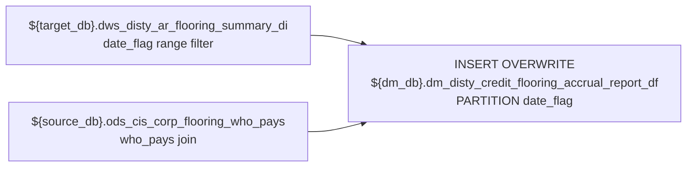

# DM: Credit Flooring Accrual Report — Date-Partitioned (`dm_disty_credit_flooring_accrual_report_df`)

- artifact_type: etl_table
- artifact_id: ${dm_db}.dm_disty_credit_flooring_accrual_report_df
- domain: ar
- one_line_purpose: This job produces the daily flooring accrual report for the credit team. It reads pre-computed flooring summary records from `dws_disty_ar_flooring_summary_di` for a given date range and enriches each order line with the `who_pays_type` cla...
- layer_type: DM
- source_kind: etl_sql
- evidence_source: source/etl/sql/ar/data_service/ar_flooring/sql/dm_disty_credit_flooring_accrual_report_df.sql

---

## L1 Data Foundation

### Identity and physical mapping
- **Table:** `${dm_db}.dm_disty_credit_flooring_accrual_report_df`
- **Layer type:** DM
- **Canonical / derived:** Derived / ETL-loaded (see L3)
- **Owner team:** not registered in metadata catalog

### Grain, scope, exclusions
- **Grain:** one row per order line per `date_flag` within the reporting period.
- **Scope:** See L2 business purpose / L3 filters
- **Partition:** `date_flag`. - resolved from pipeline (see L4)
- **Natural key:** `order_type`, `order_no`, `cust_no`, `date_flag`, `terms_code`.
- **Exclusions:** Not documented in repository

#### Grain detail (preserved)

- **Grain:** one row per order line per `date_flag` within the reporting period.
- **Partition:** `date_flag`.
- **Natural key:** `order_type`, `order_no`, `cust_no`, `date_flag`, `terms_code`.

---

### Cross-engine presence
| Engine | Present | Canonical FQN | Notes |
|--------|---------|---------------|-------|
| Hive | yes | `${dm_db}.dm_disty_credit_flooring_accrual_report_df` | ETL target / intermediate per evidence script |
| Vertica | pending | `${dm_db}.dm_disty_credit_flooring_accrual_report_df` | Confirm via hive2vertica flow evidence / MCP |

### Physical schema reference

Pointer block only - full column catalog lives in WKB L1 storage JSON.

| Field | Value |
|-------|-------|
| **Authoritative catalog** | WKB L1 storage seed (not duplicated in this file) |
| **entity_id** | `${dm_db}.dm_disty_credit_flooring_accrual_report_df` |
| **l1_catalog_seed** | `target/storage/wkb/snapshots/_snapshot_id_template/l1_catalog/{engine}_{schema}_{table}.json` |
| **column_count** | pending (run ddl_seed_writer) |
| **partition_keys** | `date_flag` |
| **ddl_source** | pending Bitbucket DDL / Vertica metadata ingest |
| **retrieval** | `python -m tools.wkb.indexing.run_query --query "ar dm_disty_credit_flooring_accrual_report_df schema" --intent find_table_schema` |

### Lineage
| Object | Role |
|--------|------|
| `${target_db}.dws_disty_ar_flooring_summary_di` | Upstream flooring summary (must run first) |
| `${source_db}.ods_cis_corp_flooring_who_pays` | Who-pays classification master |

---

### Freshness and load path
| Item | Value |
|------|-------|
| Load pattern | See L3 end-to-end / INSERT pattern in evidence script |
| Schedule | Not documented in repository |
| Parameters | `dm_db`, `target_db`, `source_db`, `start_day`, `end_day` |


---

## L2 Declarative Knowledge

### Business purpose
This job produces the daily flooring accrual report for the credit team. It reads pre-computed
flooring summary records from `dws_disty_ar_flooring_summary_di` for a given date range and enriches
each order line with the `who_pays_type` classification from the flooring who-pays master table. The
result is used to understand which party (vendor, distributor, or other) bears the flooring cost for
each shipped order line during the reporting period.

---

### Audience and use cases
| Audience | How they benefit |
|----------|-----------------|
| **Credit / flooring management** | See who pays flooring costs (`who_pays_type`) per order during the accrual period |
| **Finance** | Monthly flooring accrual totals: `gross_price`, `net_price`, `flooring_rate` per order/customer |
| **Vendor management** | Identify vendor-funded flooring arrangements |

---

### Fact key resolution
- Natural key: `order_type`, `order_no`, `cust_no`, `date_flag`, `terms_code`.
- FK / label-on attributes: see L3 dimension join patterns and step-by-step logic.
- Negative assertion: do not treat descriptive labels as grain keys unless listed under natural key.

### Time field semantics
- **date_flag / partition columns:** `date_flag`.
- Primary reporting filter should use the partition column(s) documented in L1; resolve values via L4.

### Metrics served
1. **Flooring cost allocation:** `who_pays_type` for vendor vs. distributor-funded identification
2. **Accrual amounts:** `gross_price × flooring_rate` (computed downstream)
3. **Order volume:** `order_no`, `cust_no` counts per `who_pays_type`

---

### Metric serving map
N/A - not a `*_comb_mtd` / multi-period wide serving table (or map not present in legacy doc).


### Data products and column groups (preserved)

### Identifiers and relationships

- `order_no`, `order_type`, `cust_no`, `terms_code`, `date_flag`

### Flooring attributes

- `who_pays` — Code identifying who pays the flooring cost
- `who_pays_type` — Human-readable type label for the who-pays code (from master)
- `gross_price` — Gross order price (COALESCE 0 when NULL)
- `net_price` — Net order price after expenses (COALESCE 0 when NULL)
- `flooring_rate` — Accrual rate for flooring cost (COALESCE 0 when NULL)

---

### etl_metrics

#### `who_pays`
- **Source:** [metric-index.md](../../source/contracts/ar/metric-index.md#who_pays)
- **Business definition:** Default to empty string if NULL
```sql
COALESCE(d.who_pays, '')
```

#### `gross_price`
- **Source:** [metric-index.md](../../source/contracts/ar/metric-index.md#gross_price)
- **Business definition:** Default 0 if NULL
```sql
COALESCE(d.gross_price, 0)
```

#### `net_price`
- **Source:** [metric-index.md](../../source/contracts/ar/metric-index.md#net_price)
- **Business definition:** Default 0 if NULL
```sql
COALESCE(d.net_price, 0)
```

#### `flooring_rate`
- **Source:** [metric-index.md](../../source/contracts/ar/metric-index.md#flooring_rate)
- **Business definition:** Default 0 if NULL
```sql
COALESCE(d.flooring_rate, 0)
```


---

## L3 Procedural Knowledge

### Query and routing rules
**Business filters:** Use partition / date keys from L1 grain for reporting scope.
**Technical predicates (load only):** See Key filters and step-by-step logic below.

### Dimension join patterns
| Dimension FQN | Join keys | Purpose | Evidence |
|---------------|-----------|---------|----------|
| See step-by-step / base tables | See L3 steps | Dimension enrichment | `source/etl/sql/ar/data_service/ar_flooring/sql/dm_disty_credit_flooring_accrual_report_df.sql` |

### Key filters and ETL business logic
### Step 1 — Final `INSERT OVERWRITE` into `dm_disty_credit_flooring_accrual_report_df PARTITION(date_flag)`

**From:** `${target_db}.dws_disty_ar_flooring_summary_di d`
INNER JOIN `${source_db}.ods_cis_corp_flooring_who_pays f` ON `d.who_pays = f.who_pays`

**Filter:** `d.date_flag >= '${start_day}' AND d.date_flag < '${end_day}'`

**Columns written:**

| Column | Source | Note |
|--------|--------|------|
| `who_pays_type` | `f.who_pays_type` | From who-pays master |
| `terms_code` | `d.terms_code` | Pass-through |
| `who_pays` | `COALESCE(d.who_pays, '')` | Default to empty string if NULL |
| `gross_price` | `COALESCE(d.gross_price, 0)` | Default 0 if NULL |
| `net_price` | `COALESCE(d.net_price, 0)` | Default 0 if NULL |
| `flooring_rate` | `COALESCE(d.flooring_rate, 0)` | Default 0 if NULL |
| `order_no`, `order_type`, `cust_no`, `date_flag` | Pass-through | |

---

### Standard time-filter SQL
```sql
-- relative period filter using resolved partition value (see L4)
SELECT *
FROM ${dm_db}.dm_disty_credit_flooring_accrual_report_df
WHERE /* partition predicate */ date_flag = '${partition_value}';
```

### End-to-end flow
**Runtime parameters:** `dm_db`, `target_db`, `source_db`, `start_day`, `end_day`
**Target table:** `${dm_db}.dm_disty_credit_flooring_accrual_report_df`, partitioned by **`date_flag`**.

1. Read `dws_disty_ar_flooring_summary_di` for `date_flag >= '${start_day}' AND date_flag < '${end_day}'`.
2. INNER JOIN to `ods_cis_corp_flooring_who_pays` on `who_pays`.
3. Insert all matching rows into the reporting table.



---


#### High-level stages (preserved)

| Stage | Business meaning |
|-------|-----------------|
| **Filter by date range** | Read flooring summary records where `date_flag >= start_day AND date_flag < end_day` |
| **Join to who-pays master** | Enrich with `who_pays_type` from `ods_cis_corp_flooring_who_pays` using the `who_pays` code |
| **Final INSERT** | Write enriched flooring accrual rows to the reporting table, partitioned by `date_flag` |

**Parameters:** `dm_db`, `target_db`, `source_db`, `start_day`, `end_day`

---


### Base tables register
| Object | Role in this job |
|--------|-----------------|
| `${target_db}.dws_disty_ar_flooring_summary_di` | Primary source — daily flooring summary per order line |
| `${source_db}.ods_cis_corp_flooring_who_pays` | Who-pays master — maps `who_pays` code to `who_pays_type` label |

---

### Step-by-step logic
### Step 1 — Final `INSERT OVERWRITE` into `dm_disty_credit_flooring_accrual_report_df PARTITION(date_flag)`

**From:** `${target_db}.dws_disty_ar_flooring_summary_di d`
INNER JOIN `${source_db}.ods_cis_corp_flooring_who_pays f` ON `d.who_pays = f.who_pays`

**Filter:** `d.date_flag >= '${start_day}' AND d.date_flag < '${end_day}'`

**Columns written:**

| Column | Source | Note |
|--------|--------|------|
| `who_pays_type` | `f.who_pays_type` | From who-pays master |
| `terms_code` | `d.terms_code` | Pass-through |
| `who_pays` | `COALESCE(d.who_pays, '')` | Default to empty string if NULL |
| `gross_price` | `COALESCE(d.gross_price, 0)` | Default 0 if NULL |
| `net_price` | `COALESCE(d.net_price, 0)` | Default 0 if NULL |
| `flooring_rate` | `COALESCE(d.flooring_rate, 0)` | Default 0 if NULL |
| `order_no`, `order_type`, `cust_no`, `date_flag` | Pass-through | |

---

### Relationship map (embedded)

| from_fqn | to_fqn | cardinality | join_keys | provenance |
|----------|--------|-------------|-----------|------------|
| `dw_xx.dws_disty_ar_flooring_summary_di` | `ods_xx.ods_cis_corp_flooring_who_pays` | many:1 | `d.who_pays = f.who_pays` | etl_sql (source/etl/sql/ar/data_service/ar_flooring/sql/dm_disty_credit_flooring_accrual_report_df.sql:1) |

`source/ref/ar/table relationship.txt`: Not documented in repository.

### Special logic (embedded)

Not documented in repository

### Column / field derivations (from ETL SQL)

| target_column | expression_sql | upstream_columns | upstream_tables | transform_kind | evidence |
|---------------|----------------|------------------|-----------------|----------------|----------|
| `who_pays_type` | `f.who_pays_type` | `who_pays_type` | `${target_db}.dws_disty_ar_flooring_summary_di`, `${source_db}.ods_cis_corp_flooring_who_pays` | passthrough | `source/etl/sql/ar/data_service/ar_flooring/sql/dm_disty_credit_flooring_accrual_report_df.sql:7` |
| `terms_code` | `d.terms_code` | `terms_code` | `${target_db}.dws_disty_ar_flooring_summary_di`, `${source_db}.ods_cis_corp_flooring_who_pays` | passthrough | `source/etl/sql/ar/data_service/ar_flooring/sql/dm_disty_credit_flooring_accrual_report_df.sql:8` |
| `who_pays` | `COALESCE(d.who_pays, '')` | `who_pays` | `${target_db}.dws_disty_ar_flooring_summary_di`, `${source_db}.ods_cis_corp_flooring_who_pays` | coalesce | `source/etl/sql/ar/data_service/ar_flooring/sql/dm_disty_credit_flooring_accrual_report_df.sql:9` |
| `gross_price` | `COALESCE(d.gross_price, 0)` | `gross_price` | `${target_db}.dws_disty_ar_flooring_summary_di`, `${source_db}.ods_cis_corp_flooring_who_pays` | coalesce | `source/etl/sql/ar/data_service/ar_flooring/sql/dm_disty_credit_flooring_accrual_report_df.sql:10` |
| `net_price` | `COALESCE(d.net_price, 0)` | `net_price` | `${target_db}.dws_disty_ar_flooring_summary_di`, `${source_db}.ods_cis_corp_flooring_who_pays` | coalesce | `source/etl/sql/ar/data_service/ar_flooring/sql/dm_disty_credit_flooring_accrual_report_df.sql:11` |
| `flooring_rate` | `COALESCE(d.flooring_rate, 0)` | `flooring_rate` | `${target_db}.dws_disty_ar_flooring_summary_di`, `${source_db}.ods_cis_corp_flooring_who_pays` | coalesce | `source/etl/sql/ar/data_service/ar_flooring/sql/dm_disty_credit_flooring_accrual_report_df.sql:12` |
| `order_no` | `d.order_no` | `order_no` | `${target_db}.dws_disty_ar_flooring_summary_di`, `${source_db}.ods_cis_corp_flooring_who_pays` | passthrough | `source/etl/sql/ar/data_service/ar_flooring/sql/dm_disty_credit_flooring_accrual_report_df.sql:13` |
| `order_type` | `d.order_type` | `order_type` | `${target_db}.dws_disty_ar_flooring_summary_di`, `${source_db}.ods_cis_corp_flooring_who_pays` | passthrough | `source/etl/sql/ar/data_service/ar_flooring/sql/dm_disty_credit_flooring_accrual_report_df.sql:14` |
| `cust_no` | `d.cust_no` | `cust_no` | `${target_db}.dws_disty_ar_flooring_summary_di`, `${source_db}.ods_cis_corp_flooring_who_pays` | passthrough | `source/etl/sql/ar/data_service/ar_flooring/sql/dm_disty_credit_flooring_accrual_report_df.sql:15` |
| `date_flag` | `d.date_flag` | `date_flag` | `${target_db}.dws_disty_ar_flooring_summary_di`, `${source_db}.ods_cis_corp_flooring_who_pays` | passthrough | `source/etl/sql/ar/data_service/ar_flooring/sql/dm_disty_credit_flooring_accrual_report_df.sql:16` |

### Sentinel and code values
| Value | Meaning |
|-------|---------|
| `COALESCE(d.who_pays, '')` | Orders with no who-pays assignment become empty string |
| `COALESCE(d.gross_price, 0)` | NULL prices become 0 |
| INNER JOIN on `who_pays` | Orders without a matching `who_pays` in the master are excluded |

---

---

## L4 Validation

### Resolved partition value
| Step | Source | How partition / date scope is determined |
|------|--------|------------------------------------------|
| 1 | evidence script / flow | See parameters in L1 Freshness and L3 filters - `source/etl/sql/ar/data_service/ar_flooring/sql/dm_disty_credit_flooring_accrual_report_df.sql` |

**Plain language:** Partition and date scope follow Azkaban/bootstrap parameters documented in the source script and orchestrating flow; do not hardcode calendar literals.

### Data quality checks
- Prefer row-count-by-partition, metric sums, and grain duplicate checks (see Validation SQL).
- Additional checks from legacy caveats / operational notes when present.

### Validation SQL
```sql
-- 1) Row count by partition
SELECT ${partition_col}, COUNT(*) AS row_cnt
FROM dm_db}.dm_disty_credit_flooring_accrual_report_df
WHERE ${partition_col} = '${partition_value}'
GROUP BY ${partition_col};

-- 2) Metric sum by business dimension (top deltas)
SELECT ${dim_key}, SUM(${metric}) AS metric_sum
FROM dm_db}.dm_disty_credit_flooring_accrual_report_df
WHERE ${partition_col} = '${partition_value}'
GROUP BY ${dim_key}
ORDER BY ABS(SUM(${metric})) DESC
LIMIT 20;

-- 3) Grain duplicate check
SELECT ${grain_key_1}, ${grain_key_2}, ${grain_key_3}, ${partition_col}, COUNT(*) AS cnt
FROM dm_db}.dm_disty_credit_flooring_accrual_report_df
WHERE ${partition_col} = '${partition_value}'
GROUP BY ${grain_key_1}, ${grain_key_2}, ${grain_key_3}, ${partition_col}
HAVING COUNT(*) > 1;
```

Replace placeholders from this file's Grain and keys / Data you can fetch sections, and use the resolved partition value from run scope.

### Caveats for interpretation
- **INNER JOIN on `who_pays`:** Orders where `who_pays` is NULL or not found in `ods_cis_corp_flooring_who_pays` are excluded from this report. The upstream table has COALESCE logic setting `who_pays` to `'No one'` as default.
- **Date range, not single-day:** Unlike most AR tables partitioned by a single `date_flag`, this report loads a multi-day range (`start_day` to `end_day`). The range is typically a month-to-date window driven by the flow orchestrator.
- **Identical script in two paths:** The same SQL exists at `source/etl/sql/ar/data_service/ar_flooring/sql/` and `source/etl/sql/ar/data_service/ar/ar_flooring/sql/`. Both are identical; this document covers both.

---

### Conflicts and open questions
- Schedule, owner, SLA: Not documented in repository (unless preserved schedule evidence above).
- Vertica MCP verification: pending unless confirmed in L5.


---

## L5 Runtime View

### Query path and engine preference
| Role | Hive object | Vertica object | Sync mode | Evidence | MCP verified |
|------|-------------|----------------|-----------|----------|--------------|
| **Query for reporting** | *See script lineage* | `dm_db}.dm_disty_credit_flooring_accrual_report_df` | *Verify from flow* | *Add flow file:line* | pending |
| **Hive alternative** | `*` | `dm_db}.dm_disty_credit_flooring_accrual_report_df` | - | *See dependencies* | - |
| **ETL internal** | staging/temp tables | *Not synced to Vertica* | - | *See step-by-step logic* | - |

Business users should query `dm_db}.dm_disty_credit_flooring_accrual_report_df` in Vertica once MCP verification is completed for this document.

### Access constraints
- Country / company schema parameters may apply (`literal_country`, `company_no`, etc.).
- Hive-only staging objects are not reporting surfaces unless synced.

### Query risk profile
| Field | Value |
|-------|-------|
| requires_date_predicate | yes |
| scan_risk_tier | medium |

---

## L6 Access and Consumption

### Primary consumers and use cases
| Audience | How they benefit |
|----------|-----------------|
| **Credit / flooring management** | See who pays flooring costs (`who_pays_type`) per order during the accrual period |
| **Finance** | Monthly flooring accrual totals: `gross_price`, `net_price`, `flooring_rate` per order/customer |
| **Vendor management** | Identify vendor-funded flooring arrangements |

---

### Representative query patterns
```sql
-- certified / illustrative lookup - replace predicates from L1/L4
SELECT *
FROM ${dm_db}.dm_disty_credit_flooring_accrual_report_df
WHERE date_flag = '${partition_value}'
LIMIT 100;
```

### Dependencies and notes
### Upstream objects (verified)

| Object | Usage | Evidence |
|--------|-------|----------|
| `${target_db}.dws_disty_ar_flooring_summary_di` | Flooring summary source | `source/etl/sql/ar/data_service/ar_flooring/sql/dm_disty_credit_flooring_accrual_report_df.sql:17` |
| `${source_db}.ods_cis_corp_flooring_who_pays` | Who-pays type label | `source/etl/sql/ar/data_service/ar_flooring/sql/dm_disty_credit_flooring_accrual_report_df.sql:18` |

### Downstream consumers (verified)

None identified in repository.

### Operational detail (verified)

- Partitioned by `date_flag` (INSERT OVERWRITE PARTITION): `source/etl/sql/ar/data_service/ar_flooring/sql/dm_disty_credit_flooring_accrual_report_df.sql:5`
- Date range filter: `source/etl/sql/ar/data_service/ar_flooring/sql/dm_disty_credit_flooring_accrual_report_df.sql:20`

### Not documented in repository

- Schedule, owner, SLA — not in scripts or configs

### Related scripts (verified)

- `load_ar_flooring_summary_di.py` — Populates `dws_disty_ar_flooring_summary_di` which this job reads — `source/etl/sql/ar/data_service/ar_flooring/python/`

---

*Document generated from `source/etl/sql/ar/data_service/ar_flooring/sql/dm_disty_credit_flooring_accrual_report_df.sql`.*

#### Not documented in repository
- Owner, SLA (unless schedule evidence preserved above)
- Any dependency without `file:line` evidence in this document

---

*Document migrated to L1-L6 from legacy Knowledgebase content. Evidence: `source/etl/sql/ar/data_service/ar_flooring/sql/dm_disty_credit_flooring_accrual_report_df.sql`.*
