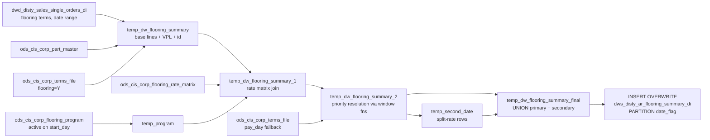

# ETL: AR Flooring Summary — Daily Incremental (`dws_disty_ar_flooring_summary_di`)

- artifact_type: etl_table
- artifact_id: ${target_db}.dws_disty_ar_flooring_summary_di
- domain: ar
- one_line_purpose: This Python ETL script computes the daily flooring accrual for each shipped order line. It matches order lines to active flooring programs and their rate matrices, resolves the highest-priority accrual rate and who-pays assignment per line,...
- layer_type: DWD
- source_kind: etl_sql
- evidence_source: source/etl/sql/ar/data_service/ar_flooring/python/load_ar_flooring_summary_di.py

---

## L1 Data Foundation

### Identity and physical mapping
- **Table:** `${target_db}.dws_disty_ar_flooring_summary_di`
- **Layer type:** DWD
- **Canonical / derived:** Derived / ETL-loaded (see L3)
- **Owner team:** not registered in metadata catalog

### Grain, scope, exclusions
- **Grain:** one row per (order_type, order_no, prod_code, vend_no, vend_code, terms_code, sku_no, cust_no, date_flag, id) — where `id` is a synthetic row identifier enabling secondary-rate expansion.
- **Scope:** See L2 business purpose / L3 filters
- **Partition:** `date_flag`. - resolved from pipeline (see L4)
- **Natural key:** Not documented in repository
- **Exclusions:** Not documented in repository

#### Grain detail (preserved)

- **Grain:** one row per (order_type, order_no, prod_code, vend_no, vend_code, terms_code, sku_no, cust_no, date_flag, id) — where `id` is a synthetic row identifier enabling secondary-rate expansion.
- **Partition:** `date_flag`.
- **Note:** Secondary-rate rows (`id = identity_offset + ROW_NUMBER()`) produce additional rows per order line for split flooring arrangements.

---

### Cross-engine presence
| Engine | Present | Canonical FQN | Notes |
|--------|---------|---------------|-------|
| Hive | yes | `${target_db}.dws_disty_ar_flooring_summary_di` | ETL target / intermediate per evidence script |
| Vertica | pending | `${target_db}.dws_disty_ar_flooring_summary_di` | Confirm via hive2vertica flow evidence / MCP |

### Physical schema reference

Pointer block only - full column catalog lives in WKB L1 storage JSON.

| Field | Value |
|-------|-------|
| **Authoritative catalog** | WKB L1 storage seed (not duplicated in this file) |
| **entity_id** | `${target_db}.dws_disty_ar_flooring_summary_di` |
| **l1_catalog_seed** | `target/storage/wkb/snapshots/_snapshot_id_template/l1_catalog/{engine}_{schema}_{table}.json` |
| **column_count** | pending (run ddl_seed_writer) |
| **partition_keys** | `date_flag` |
| **ddl_source** | pending Bitbucket DDL / Vertica metadata ingest |
| **retrieval** | `python -m tools.wkb.indexing.run_query --query "ar load_ar_flooring_summary_di schema" --intent find_table_schema` |

### Lineage
| Object | Role |
|--------|------|
| `${target_db}.dwd_disty_sales_single_orders_di` | Shipped order lines |
| `${source_db}.ods_cis_corp_flooring_program` | Active program definitions |
| `${source_db}.ods_cis_corp_flooring_rate_matrix` | Program rate matrix |

---

### Freshness and load path
| Item | Value |
|------|-------|
| Load pattern | See L3 end-to-end / INSERT pattern in evidence script |
| Schedule | Not documented in repository |
| Parameters | `start_day`, `end_day`, `target_db`, `source_db`, `etl_timestamp` |


---

## L2 Declarative Knowledge

### Business purpose
This Python ETL script computes the daily flooring accrual for each shipped order line. It matches
order lines to active flooring programs and their rate matrices, resolves the highest-priority
accrual rate and who-pays assignment per line, and handles dual-rate (primary + secondary) flooring
arrangements. The result feeds the flooring accrual report and supports vendor and distributor
flooring cost-sharing analysis.

---

### Audience and use cases
| Audience | How they benefit |
|----------|-----------------|
| **Credit / flooring management** | Per-order flooring rate and who-pays for accrual tracking |
| **Finance** | Gross/net price and flooring rate per order line for cost allocation |
| **Vendor management** | Identify which orders fall under vendor-funded flooring programs |

---

### Fact key resolution
- Natural key: Not documented in repository
- FK / label-on attributes: see L3 dimension join patterns and step-by-step logic.
- Negative assertion: do not treat descriptive labels as grain keys unless listed under natural key.

### Time field semantics
- **date_flag / partition columns:** `date_flag`.
- Primary reporting filter should use the partition column(s) documented in L1; resolve values via L4.

### Metrics served
1. **Flooring accrual per order:** `net_price × flooring_rate` (computed downstream in reports)
2. **Who-pays split:** `who_pays`, `second_who_pays` for vendor vs. distributor tracking
3. **Pay timing:** `pay_day` for cash flow modeling

---

### Metric serving map
N/A - not a `*_comb_mtd` / multi-period wide serving table (or map not present in legacy doc).


### Data products and column groups (preserved)

### Identifiers

- `order_type`, `order_no`, `cust_no`, `date_flag`, `sku_no`, `prod_code`, `vend_no`, `vend_code`, `terms_code`, `vpl_no`

### Flooring resolution

- `who_pays` — Who pays for flooring for this line
- `flooring_rate` — Accrual rate for the primary payer
- `second_rate` — Secondary payer's accrual rate (if split)
- `second_who_pays` — Secondary payer code (if split)
- `setting_id` — Rate matrix setting that matched
- `pay_day` — Payment days from terms file (or program setting)
- `pay_amount` — Net price as payment amount reference

### Pricing

- `gross_price` — `SUM(ship_qty × u_price)`
- `net_price` — `SUM(ship_qty × (u_price + NVL(u_sum_expense, 0)))`
- `ship_qty`, `u_price`, `id`

---

### etl_metrics

#### `gross_price`
- **Source:** [metric-index.md](../../source/contracts/ar/metric-index.md#gross_price)
- **Business definition:** Total pre-expense gross price per line group
```sql
SUM(ship_qty × u_price)
```

#### `net_price`
- **Source:** [metric-index.md](../../source/contracts/ar/metric-index.md#net_price)
- **Business definition:** Net price including expenses
```sql
SUM(ship_qty × (u_price + NVL(u_sum_expense, 0)))
```

#### `ship_qty`
- **Source:** [metric-index.md](../../source/contracts/ar/metric-index.md#ship_qty)
- **Business definition:** Total shipped quantity
```sql
SUM(ship_qty)
```

#### `vpl_no`
- **Source:** [metric-index.md](../../source/contracts/ar/metric-index.md#vpl_no)
- **Business definition:** Vendor product line number (0 if none)
```sql
NVL(b.vpl_no, 0)
```


---

## L3 Procedural Knowledge

### Query and routing rules
**Business filters:** Use partition / date keys from L1 grain for reporting scope.
**Technical predicates (load only):** See Key filters and step-by-step logic below.

### Dimension join patterns
| Dimension FQN | Join keys | Purpose | Evidence |
|---------------|-----------|---------|----------|
| See step-by-step / base tables | See L3 steps | Dimension enrichment | `source/etl/sql/ar/data_service/ar_flooring/python/load_ar_flooring_summary_di.py` |

### Key filters and ETL business logic
### Step 1 — `temp_dw_flooring_summary`

**Source:** `${target_db}.dwd_disty_sales_single_orders_di o`
INNER JOIN `ods_cis_corp_terms_file t` ON `trim(o.terms) = trim(t.doc_terms)` WHERE `t.flooring = 'Y'`
LEFT JOIN `ods_cis_corp_part_master b` ON `a.sku_no = b.sku_no`

**Filter:** `date_flag >= '${start_day}' AND date_flag < '${end_day}'` AND `o.terr_status = 'n'`

**Aggregation:** GROUP BY `(date_flag, order_type, order_no, prod_code, vend_no, vend_code, trim(terms), cust_no, sku_no, u_price)`

**Derived columns:**

| Column | Formula | Plain language |
|--------|---------|----------------|
| `gross_price` | `SUM(ship_qty × u_price)` | Total pre-expense gross price per line group |
| `net_price` | `SUM(ship_qty × (u_price + NVL(u_sum_expense, 0)))` | Net price including expenses |
| `ship_qty` | `SUM(ship_qty)` | Total shipped quantity |
| `vpl_no` | `NVL(b.vpl_no, 0)` | Vendor product line number (0 if none) |
| `id` | `ROW_NUMBER() OVER (ORDER BY 'A')` | Synthetic row identifier |
| `who_pays` | `'No one'` | Default — overridden by program matching |
| `flooring_rate` | `NULL` | Default — populated by program matching |

---

### Step 2 — `temp_program`

**Source:** `${source_db}.ods_cis_corp_flooring_program fp`

**Filter:** `'${start_day}' BETWEEN NVL(fp.begin_date, '${start_day}') AND NVL(fp.end_date, '${start_day}')`

**Output:** Ranked list of active `program_id` values.

---

### Step 3 — `temp_dw_flooring_summary_1`

LEFT JOIN `temp_dw_flooring_summary f` to `ods_c...

### Standard time-filter SQL
```sql
-- relative period filter using resolved partition value (see L4)
SELECT *
FROM ${target_db}.dws_disty_ar_flooring_summary_di
WHERE /* partition predicate */ date_flag = '${partition_value}';
```

### End-to-end flow
**Runtime parameters:** `start_day`, `end_day`, `target_db`, `source_db`, `etl_timestamp`
**Target table:** `${target_db}.dws_disty_ar_flooring_summary_di`, partitioned by **`date_flag`**.

1. Build `temp_dw_flooring_summary`: select shipped order lines on flooring terms (`flooring = 'Y'`) from `dwd_disty_sales_single_orders_di`, join to `ods_cis_corp_part_master` for `vpl_no`. Add synthetic `id` via `ROW_NUMBER()`.
2. Build `temp_program`: list active flooring programs for `start_day`, ordered by `program_id`.
3. Build `temp_dw_flooring_summary_1`: LEFT JOIN `temp_dw_flooring_summary` to `ods_cis_corp_flooring_rate_matrix` filtered to active programs. Match on terms (NVL fallback), vend_no, prod_code, vpl_no, cust_no, and date range. Produce one row per (line, matching matrix entry) — can be many-to-many.
4. Build `temp_dw_flooring_summary_2`: Use `DENSE_RANK()` and `FIRST_VALUE()` window functions over `(id)` ordered by `priority DESC, program_id DESC, setting_id DESC` to pick the best who-pays, flooring_rate, second_rate, second_who_pays, setting_id, pay_day. Self-join back to deduplicate to one row per (id, setting_id).
5. Drop `temp_program`.
6. Compute `identity_offset = MAX(id)` from `temp_dw_flooring_summary_2` (Python).
7. Build `temp_second_date`: extract rows with non-zero `second_rate` OR non-NULL `second_who_pays` as additional secondary-rate rows.
8. Build `temp_dw_flooring_summary_final`: UNION `temp_dw_flooring_summary_2` (primary rows) and `temp_second_date` (secondary rows, with `id = identity_offset + ROW_NUMBER()`). Apply `flooring_rate = 0` when `net_price < 0`.
9. `INSERT OVERWRITE` from `temp_dw_flooring_summary_final` into `dws_disty_ar_flooring_summary_di PARTITION(date_flag)`.



---


#### High-level stages (preserved)

| Stage | Business meaning |
|-------|-----------------|
| **Base flooring orders** | Select shipped lines on flooring-eligible terms within the date range, join to part master for VPL |
| **Active flooring programs** | Identify flooring programs active on `start_day` |
| **Rate matrix matching** | Match each order line to the highest-priority rate matrix entry (by program priority, program_id, setting_id) using a left join on multiple criteria (terms, vend_no, prod_code, vpl_no, cust_no, date_flag) |
| **Priority resolution** | Use window functions to pick the single best who-pays, flooring rate, second rate, and second who-pays across all matching programs |
| **Final rate selection** | Join priority winners back to the deduplicated setting; add `pay_day` from terms_file as fallback |
| **Second-rate expansion** | For lines with a second (split) rate/who-pays, create an additional row per line |
| **Final cleansing** | Enforce `flooring_rate = 0` when `net_price < 0`; UNION primary and secondary rows |
| **INSERT OVERWRITE** | Write to `dws_disty_ar_flooring_summary_di` partitioned by `date_flag` |

**Parameters:** `start_day`, `end_day`, `target_db`, `source_db`, `etl_timestamp`

---


### Base tables register
| Object | Role in this job |
|--------|-----------------|
| `${target_db}.dwd_disty_sales_single_orders_di` | Shipped order lines — source of ship_qty, u_price, u_sum_expense, terms |
| `${source_db}.ods_cis_corp_terms_file` | Flooring eligibility (`flooring = 'Y'`) and `pay_day` fallback |
| `${source_db}.ods_cis_corp_part_master` | VPL number per SKU |
| `${source_db}.ods_cis_corp_flooring_program` | Active flooring program definitions |
| `${source_db}.ods_cis_corp_flooring_rate_matrix` | Rate matrix entries per program: terms, vend, prod, vpl, cust, dates, rate, who_pays |
| `${source_db}.ods_cis_corp_flooring_who_pays` | Who-pays type labels (used downstream by `dm_disty_credit_flooring_accrual_report_df`) |

**Temporary tables (inside the job only):**
`temp_dw_flooring_summary` → `temp_program` → `temp_dw_flooring_summary_1` → `temp_dw_flooring_summary_2` → `temp_second_date` → `temp_dw_flooring_summary_final` → (final `INSERT`)

---

### Step-by-step logic
### Step 1 — `temp_dw_flooring_summary`

**Source:** `${target_db}.dwd_disty_sales_single_orders_di o`
INNER JOIN `ods_cis_corp_terms_file t` ON `trim(o.terms) = trim(t.doc_terms)` WHERE `t.flooring = 'Y'`
LEFT JOIN `ods_cis_corp_part_master b` ON `a.sku_no = b.sku_no`

**Filter:** `date_flag >= '${start_day}' AND date_flag < '${end_day}'` AND `o.terr_status = 'n'`

**Aggregation:** GROUP BY `(date_flag, order_type, order_no, prod_code, vend_no, vend_code, trim(terms), cust_no, sku_no, u_price)`

**Derived columns:**

| Column | Formula | Plain language |
|--------|---------|----------------|
| `gross_price` | `SUM(ship_qty × u_price)` | Total pre-expense gross price per line group |
| `net_price` | `SUM(ship_qty × (u_price + NVL(u_sum_expense, 0)))` | Net price including expenses |
| `ship_qty` | `SUM(ship_qty)` | Total shipped quantity |
| `vpl_no` | `NVL(b.vpl_no, 0)` | Vendor product line number (0 if none) |
| `id` | `ROW_NUMBER() OVER (ORDER BY 'A')` | Synthetic row identifier |
| `who_pays` | `'No one'` | Default — overridden by program matching |
| `flooring_rate` | `NULL` | Default — populated by program matching |

---

### Step 2 — `temp_program`

**Source:** `${source_db}.ods_cis_corp_flooring_program fp`

**Filter:** `'${start_day}' BETWEEN NVL(fp.begin_date, '${start_day}') AND NVL(fp.end_date, '${start_day}')`

**Output:** Ranked list of active `program_id` values.

---

### Step 3 — `temp_dw_flooring_summary_1`

LEFT JOIN `temp_dw_flooring_summary f` to `ods_cis_corp_flooring_rate_matrix r` (filtered to programs in `temp_program`) on:
- `f.terms_code = NVL(trim(r.terms), f.terms_code)`
- `f.vend_no = NVL(r.vend_no, f.vend_no)`
- `f.prod_code = NVL(r.prod_code, f.prod_code)`
- `f.vpl_no = NVL(r.vpl_no, f.vpl_no)`
- `f.cust_no = NVL(r.cust_no, f.cust_no)`
- `f.date_flag >= r.begin_date AND f.date_flag < NVL(date_add(r.end_date, 1), '${end_day}')`

NVL-based joins mean NULL matrix fields are treated as wildcards — matching any value in the order line.

---

### Step 4 — `temp_dw_flooring_summary_2` (priority resolution)

Window functions over `PARTITION BY id ORDER BY priority DESC, program_id DESC, setting_id DESC`:
- `DENSE_RANK()` to identify the single best program_id rank
- `FIRST_VALUE(who_pays)` — preferring non-NULL (sorted: non-NULL first, then by priority)
- `FIRST_VALUE(flooring_rate)` — same
- `FIRST_VALUE(second_rate)` — same
- `FIRST_VALUE(second_who_pays)` — same
- `FIRST_VALUE(setting_id)` — top priority
- `FIRST_VALUE(pay_day)` — top priority

Then self-joined back: `temp_dw_flooring_summary_1 a INNER JOIN ft b ON (a.id = b.id AND NVL(a.setting_id, 9999999999) = b.setting_id)`. LEFT JOIN `ods_cis_corp_terms_file c` for `pay_day` fallback: `NVL(b.pay_day, c.terms_days)`.

---

### Step 5 — `temp_second_date`

Extract rows from `temp_dw_flooring_summary_2` where `NVL(second_rate, 0) != 0 OR second_who_pays IS NOT NULL`. These become the secondary payer's rows, with `who_pays = second_who_pays` and `flooring_rate = second_rate`.

---

### Step 6 — `temp_dw_flooring_summary_final`

UNION of:
- `temp_dw_flooring_summary_2` (primary rows, `id` as-is) with `flooring_rate = 0` when `net_price < 0`
- `temp_second_date` (secondary rows, `id = identity_offset + ROW_NUMBER()`) with same rate guard

---

### Step 7 — Final `INSERT OVERWRITE`

Write all columns from `temp_dw_flooring_summary_final` into `${target_db}.dws_disty_ar_flooring_summary_di PARTITION(date_flag)`.

---

### Relationship map (embedded)

| from_fqn | to_fqn | cardinality | join_keys | provenance |
|----------|--------|-------------|-----------|------------|
| `dw_fs` | `ods_xx.ods_cis_corp_part_master` | many:1 | `a.sku_no = b.sku_no` | etl_sql (source/etl/sql/ar/data_service/ar_flooring/python/load_ar_flooring_summary_di.py:25) |
| `temp_dw_flooring_summary_1` | `ods_xx.ods_cis_corp_terms_file` | many:1 | `trim(a.terms_code) = trim(c.doc_terms)` | etl_sql (source/etl/sql/ar/data_service/ar_flooring/python/load_ar_flooring_summary_di.py:141) |

`source/ref/ar/table relationship.txt`: Not documented in repository.

### Special logic (embedded)

Not documented in repository

### Column / field derivations (from ETL SQL)

| target_column | expression_sql | upstream_columns | upstream_tables | transform_kind | evidence |
|---------------|----------------|------------------|-----------------|----------------|----------|
| `a` | `a.*` | `a` | `temp_dw_flooring_summary_final` | arithmetic | `source/etl/sql/ar/data_service/ar_flooring/python/load_ar_flooring_summary_di.py:129` |

### Sentinel and code values
| Value | Meaning |
|-------|---------|
| `who_pays = 'No one'` | Default — no flooring program matched or no who-pays assigned |
| `vpl_no = -1` | Initial value in `temp_dw_flooring_summary`; overridden by part master join |
| `vpl_no = 0` | `NVL(b.vpl_no, 0)` when part has no VPL |
| `setting_id = 9999999999` | Used to represent NULL setting_id in self-join deduplication |
| `flooring_rate = 0 when net_price < 0` | Credit orders cannot accrue flooring costs |
| `terr_status = 'n'` | Include only normal (non-excluded) territory orders |
| `flooring = 'Y'` in terms_file | Only flooring-eligible payment terms are processed |

---

---

## L4 Validation

### Resolved partition value
| Step | Source | How partition / date scope is determined |
|------|--------|------------------------------------------|
| 1 | evidence script / flow | See parameters in L1 Freshness and L3 filters - `source/etl/sql/ar/data_service/ar_flooring/python/load_ar_flooring_summary_di.py` |

**Plain language:** Partition and date scope follow Azkaban/bootstrap parameters documented in the source script and orchestrating flow; do not hardcode calendar literals.

### Data quality checks
- Prefer row-count-by-partition, metric sums, and grain duplicate checks (see Validation SQL).
- Additional checks from legacy caveats / operational notes when present.

### Validation SQL
```sql
-- 1) row count by partition
-- SELECT partition_col, COUNT(*) FROM ${target_db}.dws_disty_ar_flooring_summary_di WHERE partition_col = '${partition_value}' GROUP BY 1;
-- 2) metric sum by dimension (top N) - replace metric/dim from L2
-- 3) grain duplicate check on natural keys
```


### Caveats for interpretation
- **Many-to-many in step 3:** A single order line can match multiple rate matrix entries across programs. The priority resolution in step 4 selects the single best entry, but the self-join in step 4 requires careful matching on `(id, setting_id)` — lines that matched no matrix entry get the left-join NULL defaults (keeping `who_pays='No one'`, `flooring_rate=NULL`).
- **Secondary-rate rows expand the grain:** If a flooring program specifies a `second_rate` / `second_who_pays` (split flooring), the output contains two rows per order line — one for each payer. Downstream consumers must account for this.
- **`identity_offset` (Python):** Computed as `MAX(id)` from `temp_dw_flooring_summary_2` to ensure secondary-rate row IDs do not collide with primary row IDs.
- **`net_price < 0` guard:** Credit orders (returns/cancellations) have `flooring_rate` forced to 0 to avoid negative flooring accruals.
- **Date range is inclusive-start, exclusive-end** (`>= start_day AND < end_day`).
- **`terr_status = 'n'`:** Ensures only normal territory orders are included; excluded territory orders are filtered out.

---

### Conflicts and open questions
- Schedule, owner, SLA: Not documented in repository (unless preserved schedule evidence above).
- Vertica MCP verification: pending unless confirmed in L5.


---

## L5 Runtime View

### Query path and engine preference
| Role | Hive object | Vertica object | Sync mode | Evidence | MCP verified |
|------|-------------|----------------|-----------|----------|--------------|
| **Not in Vertica** | *See script lineage* | *No Vertica mapping identified in repository* | - | *Add flow evidence when found* | no |

No queryable Vertica table has been confirmed for this script from current repository evidence.

### Access constraints
- Country / company schema parameters may apply (`literal_country`, `company_no`, etc.).
- Hive-only staging objects are not reporting surfaces unless synced.

### Query risk profile
| Field | Value |
|-------|-------|
| requires_date_predicate | yes |
| scan_risk_tier | high |

---

## L6 Access and Consumption

### Primary consumers and use cases
| Audience | How they benefit |
|----------|-----------------|
| **Credit / flooring management** | Per-order flooring rate and who-pays for accrual tracking |
| **Finance** | Gross/net price and flooring rate per order line for cost allocation |
| **Vendor management** | Identify which orders fall under vendor-funded flooring programs |

---

### Representative query patterns
```sql
-- certified / illustrative lookup - replace predicates from L1/L4
SELECT *
FROM ${target_db}.dws_disty_ar_flooring_summary_di
WHERE date_flag = '${partition_value}'
LIMIT 100;
```

### Dependencies and notes
### Upstream objects (verified)

| Object | Usage | Evidence |
|--------|-------|----------|
| `${target_db}.dwd_disty_sales_single_orders_di` | Shipped order lines | `source/etl/sql/ar/data_service/ar_flooring/python/load_ar_flooring_summary_di.py:44` |
| `${source_db}.ods_cis_corp_terms_file` | Flooring eligibility filter | `source/etl/sql/ar/data_service/ar_flooring/python/load_ar_flooring_summary_di.py:45` |
| `${source_db}.ods_cis_corp_part_master` | VPL number | `source/etl/sql/ar/data_service/ar_flooring/python/load_ar_flooring_summary_di.py:86` |
| `${source_db}.ods_cis_corp_flooring_program` | Active programs | `source/etl/sql/ar/data_service/ar_flooring/python/load_ar_flooring_summary_di.py:93` |
| `${source_db}.ods_cis_corp_flooring_rate_matrix` | Rate matrix entries | `source/etl/sql/ar/data_service/ar_flooring/python/load_ar_flooring_summary_di.py:130` |

### Downstream consumers (verified)

| Object / script | Evidence |
|-----------------|----------|
| `dm_disty_credit_flooring_accrual_report_df.sql` — reads `dws_disty_ar_flooring_summary_di` | `source/etl/sql/ar/data_service/ar_flooring/sql/dm_disty_credit_flooring_accrual_report_df.sql:17` |

### Operational detail (verified)

- Partitioned by `date_flag` (INSERT OVERWRITE PARTITION): `source/etl/sql/ar/data_service/ar_flooring/python/load_ar_flooring_summary_di.py:298`
- `identity_offset` computed in Python before secondary-rate expansion: `source/etl/sql/ar/data_service/ar_flooring/python/load_ar_flooring_summary_di.py:214`

### Not documented in repository

- Schedule, owner, SLA — not in scripts or configs

### Related scripts (verified)

- `dm_disty_credit_flooring_accrual_report_df.sql` — Direct downstream report consumer — `source/etl/sql/ar/data_service/ar_flooring/sql/`

---

*Document generated from `source/etl/sql/ar/data_service/ar_flooring/python/load_ar_flooring_summary_di.py`.*

#### Not documented in repository
- Owner, SLA (unless schedule evidence preserved above)
- Any dependency without `file:line` evidence in this document

---

*Document migrated to L1-L6 from legacy Knowledgebase content. Evidence: `source/etl/sql/ar/data_service/ar_flooring/python/load_ar_flooring_summary_di.py`.*
