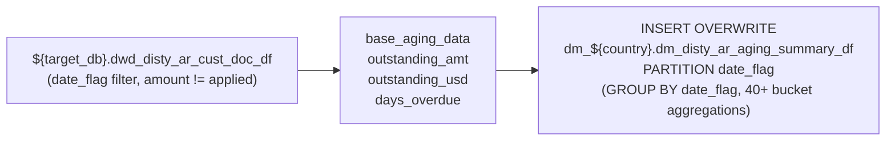

# DM: AR Aging Summary — Aggregate Aging Buckets (`dm_disty_ar_aging_summary_df`)

- artifact_type: etl_table
- artifact_id: dm_us.dm_disty_ar_aging_summary_df
- domain: ar
- one_line_purpose: This job produces a single-row daily snapshot of aggregate AR aging for the entire country, expressed as outstanding balances (in both local currency and USD) bucketed into standard aging intervals. It exists to give leadership and credit m...
- layer_type: DM
- source_kind: etl_sql
- evidence_source: source/etl/sql/ar/data_service/ar/sql/dm_disty_ar_aging_summary_df.sql

---

## L1 Data Foundation

### Identity and physical mapping
- **Table:** `dm_us.dm_disty_ar_aging_summary_df`
- **Layer type:** DM
- **Canonical / derived:** Derived / ETL-loaded (see L3)
- **Owner team:** not registered in metadata catalog

### Grain, scope, exclusions
- **Grain:** one aggregate row per `date_flag` (entire country aggregate, no customer breakdown).
- **Scope:** See L2 business purpose / L3 filters
- **Partition:** `date_flag`. - resolved from pipeline (see L4)
- **Natural key:** `date_flag` (single row per partition).
- **Exclusions:** Not documented in repository

#### Grain detail (preserved)

- **Grain:** one aggregate row per `date_flag` (entire country aggregate, no customer breakdown).
- **Partition:** `date_flag`.
- **Natural key:** `date_flag` (single row per partition).

---

### Cross-engine presence
| Engine | Present | Canonical FQN | Notes |
|--------|---------|---------------|-------|
| Hive | yes | `dm_disty_ar_aging_summary_df` | ETL target / intermediate per evidence script |
| Vertica | pending | `dm_disty_ar_aging_summary_df` | Confirm via hive2vertica flow evidence / MCP |

### Physical schema reference

Pointer block only - full column catalog lives in WKB L1 storage JSON.

| Field | Value |
|-------|-------|
| **Authoritative catalog** | WKB L1 storage seed (not duplicated in this file) |
| **entity_id** | `dm_us.dm_disty_ar_aging_summary_df` |
| **l1_catalog_seed** | `target/storage/wkb/snapshots/_snapshot_id_template/l1_catalog/{engine}_{schema}_{table}.json` |
| **column_count** | pending (run ddl_seed_writer) |
| **partition_keys** | `date_flag` |
| **ddl_source** | pending Bitbucket DDL / Vertica metadata ingest |
| **retrieval** | `python -m tools.wkb.indexing.run_query --query "ar dm_disty_ar_aging_summary_df schema" --intent find_table_schema` |

### Lineage
| Object | Role |
|--------|------|
| `${target_db}.dwd_disty_ar_cust_doc_df` | Upstream AR document detail (must run first) |

---

### Freshness and load path
| Item | Value |
|------|-------|
| Load pattern | See L3 end-to-end / INSERT pattern in evidence script |
| Schedule | Not documented in repository |
| Parameters | `target_db`, `country`, `date_flag` |


---

## L2 Declarative Knowledge

### Business purpose
This job produces a single-row daily snapshot of aggregate AR aging for the entire country, expressed
as outstanding balances (in both local currency and USD) bucketed into standard aging intervals. It
exists to give leadership and credit management an at-a-glance picture of the overall receivables
health, including the proportion of receivables past 30 days, the count of open documents per aging
band, and total outstanding amounts.

---

### Audience and use cases
| Audience | How they benefit |
|----------|-----------------|
| **Credit management** | `age30_up_percent`, `past_due_percent`, `debit_age90_up_percent` for KPI reporting |
| **Finance leadership** | Total AR balance, past-due amount, and USD equivalents for executive dashboards |
| **Treasury** | `total_cnt`, age bucket sums for DSO and collection forecasting |

---

### Fact key resolution
- Natural key: `date_flag` (single row per partition).
- FK / label-on attributes: see L3 dimension join patterns and step-by-step logic.
- Negative assertion: do not treat descriptive labels as grain keys unless listed under natural key.

### Time field semantics
- **date_flag / partition columns:** `date_flag`.
- Primary reporting filter should use the partition column(s) documented in L1; resolve values via L4.


### Metrics served

| Category | Column | Logical metric | Business reading |
|----------|--------|----------------|------------------|
| Measures | — | — | No measure columns mapped for this table. |

### Metric serving map

**Formula authority:** [`source/contracts/ar/metric-index.md`](../../source/contracts/ar/metric-index.md)

N/A — no measure columns mapped for this table.

### etl_metrics

No governed logical metrics from `source/contracts/ar/metric-index.md` are mapped on this table.

---

### Metric serving map
N/A - not a `*_comb_mtd` / multi-period wide serving table (or map not present in legacy doc).


### Data products and column groups (preserved)

### Core aging buckets (local currency)

- `age0_less` — Not yet due (days_overdue ≤ 0)
- `age1_30` — 1–30 days overdue
- `age31_60` — 31–60 days
- `age61_90` — 61–90 days
- `age91_120` — 91–120 days
- `age120_up` — >120 days
- `age_n8_less` — More than 8 days early (days_overdue ≤ −8)
- `age_n7_0` — 7 to 0 days early
- `age1_7` — 1–7 days overdue
- `age8_15`, `age8_30`, `age16_30` — Sub-30-day bands
- `age31_45`, `age46_60` — Sub-60-day bands
- `age60_up`, `age90_up` — Cumulative 60+ and 90+ bands
- `age121_180`, `age181_360`, `age360_up` — Long-overdue bands

### Core aging buckets (USD)

Same bands prefixed with `usd_` (e.g., `usd_age0_less`, `usd_age30_up_percent`)

### Count metrics

- `total_cnt` — Total open document count
- `age0_less_cnt`, `age_n8_less_cnt`, `age_n7_0_cnt`, `age1_7_cnt`, `age8_15_cnt`, `age8_30_cnt`, `age16_30_cnt`, `age1_30_cnt`, `age31_45_cnt`, `age46_60_cnt`, `age31_60_cnt`, `age60_up_cnt`, `age61_90_cnt`, `age90_up_cnt`, `age91_120_cnt`, `age120_up_cnt` — Document counts per band

### Percentage metrics

| Column | Formula | Business reading |
|--------|---------|-----------------|
| `age30_up_percent` | `SUM(age>=31) / SUM(total)` | Share of AR more than 30 days past due |
| `past_due_percent` | `SUM(overdue) / SUM(total)` | Share of AR past due at all |
| `usd_past_due_percent` | `SUM(usd overdue) / SUM(usd_total)` | USD version |
| `debit_age90_up_percent` | `COUNT(age>=91) / COUNT(all)` | Share of documents (not amounts) 90+ days past due |

---

### etl_metrics

#### `age30_up_percent`
- **Source:** [metric-index.md](../../source/contracts/ar/metric-index.md#age30_up_percent)
- **Business definition:** Share of AR more than 30 days past due
```sql
SUM(age>=31) / SUM(total)
```

#### `past_due_percent`
- **Source:** [metric-index.md](../../source/contracts/ar/metric-index.md#past_due_percent)
- **Business definition:** Share of AR past due at all
```sql
SUM(overdue) / SUM(total)
```

#### `usd_past_due_percent`
- **Source:** [metric-index.md](../../source/contracts/ar/metric-index.md#usd_past_due_percent)
- **Business definition:** USD version
```sql
SUM(usd overdue) / SUM(usd_total)
```

#### `outstanding_amt`
- **Source:** [metric-index.md](../../source/contracts/ar/metric-index.md#outstanding_amt)
- **Business definition:** Unpaid portion in local currency
```sql
amount - applied
```

#### `outstanding_usd`
- **Source:** [metric-index.md](../../source/contracts/ar/metric-index.md#outstanding_usd)
- **Business definition:** Unpaid portion in USD
```sql
usd_amt - usd_applied
```

#### `age0_less`
- **Source:** [metric-index.md](../../source/contracts/ar/metric-index.md#age0_less)
- **Business definition:** Not yet due
```sql
SUM(CASE WHEN days_overdue <= 0 THEN outstanding_amt ELSE 0 END)
```

#### `age1_30`
- **Source:** [metric-index.md](../../source/contracts/ar/metric-index.md#age1_30)
- **Business definition:** 1–30 days past due
```sql
SUM(CASE WHEN days_overdue BETWEEN 1 AND 30 THEN outstanding_amt ELSE 0 END)
```

#### `past_due`
- **Source:** [metric-index.md](../../source/contracts/ar/metric-index.md#past_due)
- **Business definition:** Total past-due AR
```sql
SUM(CASE WHEN days_overdue > 0 THEN outstanding_amt ELSE 0 END)
```


---

## L3 Procedural Knowledge

### Query and routing rules
**Business filters:** Use partition / date keys from L1 grain for reporting scope.
**Technical predicates (load only):** See Key filters and step-by-step logic below.

### Dimension join patterns
| Dimension FQN | Join keys | Purpose | Evidence |
|---------------|-----------|---------|----------|
| See step-by-step / base tables | See L3 steps | Dimension enrichment | `source/etl/sql/ar/data_service/ar/sql/dm_disty_ar_aging_summary_df.sql` |

### Key filters and ETL business logic
### Step 1 — `base_aging_data`

**Source:** `${target_db}.dwd_disty_ar_cust_doc_df age`

**Filter:**
- `age.date_flag = '${date_flag}'` — snapshot day only
- `age.amount != age.applied` — only open/partially-applied items

**Derived columns:**

| Column | Formula | Plain language |
|--------|---------|----------------|
| `outstanding_amt` | `amount - applied` | Unpaid portion in local currency |
| `outstanding_usd` | `usd_amt - usd_applied` | Unpaid portion in USD |
| `days_overdue` | `DATEDIFF(date_flag, due_date)` | How many days past due (positive = past due) |

---

### Step 2 — Final `INSERT OVERWRITE` into `dm_disty_ar_aging_summary_df PARTITION(date_flag)`

**From:** `base_aging_data age`

**Aggregation:** `GROUP BY date_flag` — one row per snapshot date

**Bucket derivations (same pattern for USD; examples):**

| Column | Formula | Plain language |
|--------|---------|----------------|
| `age0_less` | `SUM(CASE WHEN days_overdue <= 0 THEN outstanding_amt ELSE 0 END)` | Not yet due |
| `age1_30` | `SUM(CASE WHEN days_overdue BETWEEN 1 AND 30 THEN outstanding_amt ELSE 0 END)` | 1–30 days past due |
| `age30_up_percent` | `SUM(age>=31) / SUM(total)` (0 guard) | Percent of AR 31+ days past due |
| `past_due` | `SUM(CASE WHEN days_overdue > 0 THEN outstanding_amt ELSE 0 END)` | Total past-due AR |
| `debit_age90_up_percent` | `COUNT(CASE WHEN days_overdue>=91 THEN 1 END) / COUNT(1)` | Share of documents 90+ days past due |

---

### Standard time-filter SQL
```sql
-- relative period filter using resolved partition value (see L4)
SELECT *
FROM dm_disty_ar_aging_summary_df
WHERE /* partition predicate */ date_flag = '${partition_value}';
```

### End-to-end flow
**Runtime parameters:** `target_db`, `country`, `date_flag`
**Target table:** `dm_${country}.dm_disty_ar_aging_summary_df`, partitioned by **`date_flag`**.

1. Read `dwd_disty_ar_cust_doc_df` where `date_flag = '${date_flag}'` and `amount != applied` (open items only).
2. Compute `outstanding_amt = amount - applied`, `outstanding_usd = usd_amt - usd_applied`, and `days_overdue = DATEDIFF(date_flag, due_date)` into `base_aging_data`.
3. Aggregate with 40+ CASE WHEN bucket expressions into one aggregate row via `GROUP BY date_flag`.
4. Insert into target.



---


#### High-level stages (preserved)

| Stage | Business meaning |
|-------|-----------------|
| **Read base** | Pull all open (partially unapplied) AR documents for the snapshot date from `dwd_disty_ar_cust_doc_df` |
| **Compute age** | Calculate `days_overdue` per document as `DATEDIFF(date_flag, due_date)` |
| **Aggregate into buckets** | Sum outstanding amounts and count documents into 20+ age bands using CASE WHEN expressions |
| **Final INSERT** | Write one aggregate row per `date_flag` partition |

**Parameters:** `target_db`, `country`, `date_flag`

---


### Base tables register
| Object | Role in this job |
|--------|-----------------|
| `${target_db}.dwd_disty_ar_cust_doc_df` | Primary source — AR document detail with amounts and due dates |

**Temporary tables (inside the job only):**
`base_aging_data` → (final `INSERT`)

---

### Step-by-step logic
### Step 1 — `base_aging_data`

**Source:** `${target_db}.dwd_disty_ar_cust_doc_df age`

**Filter:**
- `age.date_flag = '${date_flag}'` — snapshot day only
- `age.amount != age.applied` — only open/partially-applied items

**Derived columns:**

| Column | Formula | Plain language |
|--------|---------|----------------|
| `outstanding_amt` | `amount - applied` | Unpaid portion in local currency |
| `outstanding_usd` | `usd_amt - usd_applied` | Unpaid portion in USD |
| `days_overdue` | `DATEDIFF(date_flag, due_date)` | How many days past due (positive = past due) |

---

### Step 2 — Final `INSERT OVERWRITE` into `dm_disty_ar_aging_summary_df PARTITION(date_flag)`

**From:** `base_aging_data age`

**Aggregation:** `GROUP BY date_flag` — one row per snapshot date

**Bucket derivations (same pattern for USD; examples):**

| Column | Formula | Plain language |
|--------|---------|----------------|
| `age0_less` | `SUM(CASE WHEN days_overdue <= 0 THEN outstanding_amt ELSE 0 END)` | Not yet due |
| `age1_30` | `SUM(CASE WHEN days_overdue BETWEEN 1 AND 30 THEN outstanding_amt ELSE 0 END)` | 1–30 days past due |
| `age30_up_percent` | `SUM(age>=31) / SUM(total)` (0 guard) | Percent of AR 31+ days past due |
| `past_due` | `SUM(CASE WHEN days_overdue > 0 THEN outstanding_amt ELSE 0 END)` | Total past-due AR |
| `debit_age90_up_percent` | `COUNT(CASE WHEN days_overdue>=91 THEN 1 END) / COUNT(1)` | Share of documents 90+ days past due |

---

### Relationship map (embedded)

| from_fqn | to_fqn | cardinality | join_keys | provenance |
|----------|--------|-------------|-----------|------------|
| — | — | — | — | Not documented in repository |

`source/ref/ar/table relationship.txt`: Not documented in repository.

### Special logic (embedded)

Not documented in repository

### Column / field derivations (from ETL SQL)

| target_column | expression_sql | upstream_columns | upstream_tables | transform_kind | evidence |
|---------------|----------------|------------------|-----------------|----------------|----------|
| `age0_less` | `sum(CASE WHEN days_overdue <= 0 THEN outstanding_amt ELSE 0 END)` | `days_overdue`, `outstanding_amt` | `base_aging_data` | case | `source/etl/sql/ar/data_service/ar/sql/dm_disty_ar_aging_summary_df.sql:14` |
| `age1_30` | `sum(CASE WHEN days_overdue BETWEEN 1 AND 30 THEN outstanding_amt ELSE 0 END)` | `days_overdue`, `outstanding_amt` | `base_aging_data` | case | `source/etl/sql/ar/data_service/ar/sql/dm_disty_ar_aging_summary_df.sql:15` |
| `age30_up` | `sum(CASE WHEN days_overdue >= 31 THEN outstanding_amt ELSE 0 END)` | `days_overdue`, `outstanding_amt` | `base_aging_data` | case | `source/etl/sql/ar/data_service/ar/sql/dm_disty_ar_aging_summary_df.sql:16` |
| `age30_up_percent` | `CASE WHEN sum(outstanding_amt) = 0 THEN 0 ELSE sum(CASE WHEN days_overdue >= 31 THEN outstanding_amt ELSE 0 END) / su...` | `outstanding_amt`, `days_overdue` | `base_aging_data` | case | `source/etl/sql/ar/data_service/ar/sql/dm_disty_ar_aging_summary_df.sql:13` |
| `age31_60` | `sum(CASE WHEN days_overdue BETWEEN 31 AND 60 THEN outstanding_amt ELSE 0 END)` | `days_overdue`, `outstanding_amt` | `base_aging_data` | case | `source/etl/sql/ar/data_service/ar/sql/dm_disty_ar_aging_summary_df.sql:21` |
| `age60_up` | `sum(CASE WHEN days_overdue >= 61 THEN outstanding_amt ELSE 0 END)` | `days_overdue`, `outstanding_amt` | `base_aging_data` | case | `source/etl/sql/ar/data_service/ar/sql/dm_disty_ar_aging_summary_df.sql:22` |
| `age61_90` | `sum(CASE WHEN days_overdue BETWEEN 61 AND 90 THEN outstanding_amt ELSE 0 END)` | `days_overdue`, `outstanding_amt` | `base_aging_data` | case | `source/etl/sql/ar/data_service/ar/sql/dm_disty_ar_aging_summary_df.sql:23` |
| `age91_120` | `sum(CASE WHEN days_overdue BETWEEN 91 AND 120 THEN outstanding_amt ELSE 0 END)` | `days_overdue`, `outstanding_amt` | `base_aging_data` | case | `source/etl/sql/ar/data_service/ar/sql/dm_disty_ar_aging_summary_df.sql:24` |
| `age120_up` | `sum(CASE WHEN days_overdue >= 121 THEN outstanding_amt ELSE 0 END)` | `days_overdue`, `outstanding_amt` | `base_aging_data` | case | `source/etl/sql/ar/data_service/ar/sql/dm_disty_ar_aging_summary_df.sql:25` |
| `age121_180` | `sum(CASE WHEN days_overdue BETWEEN 121 AND 180 THEN outstanding_amt ELSE 0 END)` | `days_overdue`, `outstanding_amt` | `base_aging_data` | case | `source/etl/sql/ar/data_service/ar/sql/dm_disty_ar_aging_summary_df.sql:26` |
| `age181_360` | `sum(CASE WHEN days_overdue BETWEEN 181 AND 360 THEN outstanding_amt ELSE 0 END)` | `days_overdue`, `outstanding_amt` | `base_aging_data` | case | `source/etl/sql/ar/data_service/ar/sql/dm_disty_ar_aging_summary_df.sql:27` |
| `age360_up` | `sum(CASE WHEN days_overdue >= 361 THEN outstanding_amt ELSE 0 END)` | `days_overdue`, `outstanding_amt` | `base_aging_data` | case | `source/etl/sql/ar/data_service/ar/sql/dm_disty_ar_aging_summary_df.sql:28` |
| `total` | `sum(outstanding_amt)` | `outstanding_amt` | `base_aging_data` | agg | `source/etl/sql/ar/data_service/ar/sql/dm_disty_ar_aging_summary_df.sql:18` |
| `total_cnt` | `count(1)` | — | `base_aging_data` | agg | `source/etl/sql/ar/data_service/ar/sql/dm_disty_ar_aging_summary_df.sql:30` |
| `age1_90` | `sum(CASE WHEN days_overdue BETWEEN 1 AND 90 THEN outstanding_amt ELSE 0 END)` | `days_overdue`, `outstanding_amt` | `base_aging_data` | case | `source/etl/sql/ar/data_service/ar/sql/dm_disty_ar_aging_summary_df.sql:15` |
| `age_n8_less` | `sum(CASE WHEN days_overdue <= -8 THEN outstanding_amt ELSE 0 END)` | `days_overdue`, `outstanding_amt` | `base_aging_data` | case | `source/etl/sql/ar/data_service/ar/sql/dm_disty_ar_aging_summary_df.sql:32` |
| `age_n7_0` | `sum(CASE WHEN days_overdue BETWEEN -7 AND 0 THEN outstanding_amt ELSE 0 END)` | `days_overdue`, `outstanding_amt` | `base_aging_data` | case | `source/etl/sql/ar/data_service/ar/sql/dm_disty_ar_aging_summary_df.sql:33` |
| `age1_7` | `sum(CASE WHEN days_overdue BETWEEN 1 AND 7 THEN outstanding_amt ELSE 0 END)` | `days_overdue`, `outstanding_amt` | `base_aging_data` | case | `source/etl/sql/ar/data_service/ar/sql/dm_disty_ar_aging_summary_df.sql:15` |
| `age8_30` | `sum(CASE WHEN days_overdue BETWEEN 8 AND 30 THEN outstanding_amt ELSE 0 END)` | `days_overdue`, `outstanding_amt` | `base_aging_data` | case | `source/etl/sql/ar/data_service/ar/sql/dm_disty_ar_aging_summary_df.sql:35` |
| `age31_45` | `sum(CASE WHEN days_overdue BETWEEN 31 AND 45 THEN outstanding_amt ELSE 0 END)` | `days_overdue`, `outstanding_amt` | `base_aging_data` | case | `source/etl/sql/ar/data_service/ar/sql/dm_disty_ar_aging_summary_df.sql:21` |
| `age46_60` | `sum(CASE WHEN days_overdue BETWEEN 46 AND 60 THEN outstanding_amt ELSE 0 END)` | `days_overdue`, `outstanding_amt` | `base_aging_data` | case | `source/etl/sql/ar/data_service/ar/sql/dm_disty_ar_aging_summary_df.sql:37` |
| `age90_up` | `sum(CASE WHEN days_overdue >= 91 THEN outstanding_amt ELSE 0 END)` | `days_overdue`, `outstanding_amt` | `base_aging_data` | case | `source/etl/sql/ar/data_service/ar/sql/dm_disty_ar_aging_summary_df.sql:38` |
| `age8_15` | `sum(CASE WHEN days_overdue BETWEEN 8 AND 15 THEN outstanding_amt ELSE 0 END)` | `days_overdue`, `outstanding_amt` | `base_aging_data` | case | `source/etl/sql/ar/data_service/ar/sql/dm_disty_ar_aging_summary_df.sql:35` |
| `age16_30` | `sum(CASE WHEN days_overdue BETWEEN 16 AND 30 THEN outstanding_amt ELSE 0 END)` | `days_overdue`, `outstanding_amt` | `base_aging_data` | case | `source/etl/sql/ar/data_service/ar/sql/dm_disty_ar_aging_summary_df.sql:40` |
| `usd_age0_less` | `sum(CASE WHEN days_overdue <= 0 THEN outstanding_usd ELSE 0 END)` | `days_overdue`, `outstanding_usd` | `base_aging_data` | case | `source/etl/sql/ar/data_service/ar/sql/dm_disty_ar_aging_summary_df.sql:14` |
| `usd_age1_30` | `sum(CASE WHEN days_overdue BETWEEN 1 AND 30 THEN outstanding_usd ELSE 0 END)` | `days_overdue`, `outstanding_usd` | `base_aging_data` | case | `source/etl/sql/ar/data_service/ar/sql/dm_disty_ar_aging_summary_df.sql:15` |
| `usd_age30_up` | `sum(CASE WHEN days_overdue >= 31 THEN outstanding_usd ELSE 0 END)` | `days_overdue`, `outstanding_usd` | `base_aging_data` | case | `source/etl/sql/ar/data_service/ar/sql/dm_disty_ar_aging_summary_df.sql:16` |
| `usd_age30_up_percent` | `CASE WHEN sum(outstanding_usd) = 0 THEN 0 ELSE sum(CASE WHEN days_overdue >= 31 THEN outstanding_usd ELSE 0 END) / su...` | `outstanding_usd`, `days_overdue` | `base_aging_data` | case | `source/etl/sql/ar/data_service/ar/sql/dm_disty_ar_aging_summary_df.sql:13` |
| `usd_age31_60` | `sum(CASE WHEN days_overdue BETWEEN 31 AND 60 THEN outstanding_usd ELSE 0 END)` | `days_overdue`, `outstanding_usd` | `base_aging_data` | case | `source/etl/sql/ar/data_service/ar/sql/dm_disty_ar_aging_summary_df.sql:21` |
| `usd_age61_90` | `sum(CASE WHEN days_overdue BETWEEN 61 AND 90 THEN outstanding_usd ELSE 0 END)` | `days_overdue`, `outstanding_usd` | `base_aging_data` | case | `source/etl/sql/ar/data_service/ar/sql/dm_disty_ar_aging_summary_df.sql:23` |
| `usd_age91_120` | `sum(CASE WHEN days_overdue BETWEEN 91 AND 120 THEN outstanding_usd ELSE 0 END)` | `days_overdue`, `outstanding_usd` | `base_aging_data` | case | `source/etl/sql/ar/data_service/ar/sql/dm_disty_ar_aging_summary_df.sql:24` |
| `usd_age120_up` | `sum(CASE WHEN days_overdue >= 121 THEN outstanding_usd ELSE 0 END)` | `days_overdue`, `outstanding_usd` | `base_aging_data` | case | `source/etl/sql/ar/data_service/ar/sql/dm_disty_ar_aging_summary_df.sql:25` |
| `usd_age121_180` | `sum(CASE WHEN days_overdue BETWEEN 121 AND 180 THEN outstanding_usd ELSE 0 END)` | `days_overdue`, `outstanding_usd` | `base_aging_data` | case | `source/etl/sql/ar/data_service/ar/sql/dm_disty_ar_aging_summary_df.sql:26` |
| `usd_age181_360` | `sum(CASE WHEN days_overdue BETWEEN 181 AND 360 THEN outstanding_usd ELSE 0 END)` | `days_overdue`, `outstanding_usd` | `base_aging_data` | case | `source/etl/sql/ar/data_service/ar/sql/dm_disty_ar_aging_summary_df.sql:27` |
| `usd_age360_up` | `sum(CASE WHEN days_overdue >= 361 THEN outstanding_usd ELSE 0 END)` | `days_overdue`, `outstanding_usd` | `base_aging_data` | case | `source/etl/sql/ar/data_service/ar/sql/dm_disty_ar_aging_summary_df.sql:28` |
| `usd_total` | `sum(outstanding_usd)` | `outstanding_usd` | `base_aging_data` | agg | `source/etl/sql/ar/data_service/ar/sql/dm_disty_ar_aging_summary_df.sql:45` |
| `usd_age_n8_less` | `sum(CASE WHEN days_overdue <= -8 THEN outstanding_usd ELSE 0 END)` | `days_overdue`, `outstanding_usd` | `base_aging_data` | case | `source/etl/sql/ar/data_service/ar/sql/dm_disty_ar_aging_summary_df.sql:32` |
| `usd_age_n7_0` | `sum(CASE WHEN days_overdue BETWEEN -7 AND 0 THEN outstanding_usd ELSE 0 END)` | `days_overdue`, `outstanding_usd` | `base_aging_data` | case | `source/etl/sql/ar/data_service/ar/sql/dm_disty_ar_aging_summary_df.sql:33` |
| `usd_age1_7` | `sum(CASE WHEN days_overdue BETWEEN 1 AND 7 THEN outstanding_usd ELSE 0 END)` | `days_overdue`, `outstanding_usd` | `base_aging_data` | case | `source/etl/sql/ar/data_service/ar/sql/dm_disty_ar_aging_summary_df.sql:15` |
| `usd_age8_30` | `sum(CASE WHEN days_overdue BETWEEN 8 AND 30 THEN outstanding_usd ELSE 0 END)` | `days_overdue`, `outstanding_usd` | `base_aging_data` | case | `source/etl/sql/ar/data_service/ar/sql/dm_disty_ar_aging_summary_df.sql:35` |
| `usd_age8_15` | `sum(CASE WHEN days_overdue BETWEEN 8 AND 15 THEN outstanding_usd ELSE 0 END)` | `days_overdue`, `outstanding_usd` | `base_aging_data` | case | `source/etl/sql/ar/data_service/ar/sql/dm_disty_ar_aging_summary_df.sql:35` |
| `usd_age16_30` | `sum(CASE WHEN days_overdue BETWEEN 16 AND 30 THEN outstanding_usd ELSE 0 END)` | `days_overdue`, `outstanding_usd` | `base_aging_data` | case | `source/etl/sql/ar/data_service/ar/sql/dm_disty_ar_aging_summary_df.sql:40` |
| `usd_age31_45` | `sum(CASE WHEN days_overdue BETWEEN 31 AND 45 THEN outstanding_usd ELSE 0 END)` | `days_overdue`, `outstanding_usd` | `base_aging_data` | case | `source/etl/sql/ar/data_service/ar/sql/dm_disty_ar_aging_summary_df.sql:21` |
| `usd_age46_60` | `sum(CASE WHEN days_overdue BETWEEN 46 AND 60 THEN outstanding_usd ELSE 0 END)` | `days_overdue`, `outstanding_usd` | `base_aging_data` | case | `source/etl/sql/ar/data_service/ar/sql/dm_disty_ar_aging_summary_df.sql:37` |
| `usd_age60_up` | `sum(CASE WHEN days_overdue >= 61 THEN outstanding_usd ELSE 0 END)` | `days_overdue`, `outstanding_usd` | `base_aging_data` | case | `source/etl/sql/ar/data_service/ar/sql/dm_disty_ar_aging_summary_df.sql:22` |
| `usd_age90_up` | `sum(CASE WHEN days_overdue >= 91 THEN outstanding_usd ELSE 0 END)` | `days_overdue`, `outstanding_usd` | `base_aging_data` | case | `source/etl/sql/ar/data_service/ar/sql/dm_disty_ar_aging_summary_df.sql:38` |
| `past_due` | `sum(CASE WHEN days_overdue > 0 THEN outstanding_amt ELSE 0 END)` | `days_overdue`, `outstanding_amt` | `base_aging_data` | case | `source/etl/sql/ar/data_service/ar/sql/dm_disty_ar_aging_summary_df.sql:66` |
| `usd_past_due_percent` | `CASE WHEN sum(outstanding_usd) = 0 THEN 0 ELSE sum(CASE WHEN days_overdue > 0 THEN outstanding_usd ELSE 0 END) / sum(...` | `outstanding_usd`, `days_overdue` | `base_aging_data` | case | `source/etl/sql/ar/data_service/ar/sql/dm_disty_ar_aging_summary_df.sql:13` |
| `past_due_percent` | `CASE WHEN sum(outstanding_amt) = 0 THEN 0 ELSE sum(CASE WHEN days_overdue > 0 THEN outstanding_amt ELSE 0 END) / sum(...` | `outstanding_amt`, `days_overdue` | `base_aging_data` | case | `source/etl/sql/ar/data_service/ar/sql/dm_disty_ar_aging_summary_df.sql:13` |
| `debit_age90_up` | `sum(CASE WHEN days_overdue >= 91 THEN outstanding_amt ELSE 0 END)` | `days_overdue`, `outstanding_amt` | `base_aging_data` | case | `source/etl/sql/ar/data_service/ar/sql/dm_disty_ar_aging_summary_df.sql:38` |
| `debit_age90_up_percent` | `CASE WHEN count(1) = 0 THEN 0 ELSE count(CASE WHEN days_overdue >= 91 THEN 1 END) * 1.0 / count(1) END` | `days_overdue` | `base_aging_data` | case | `source/etl/sql/ar/data_service/ar/sql/dm_disty_ar_aging_summary_df.sql:13` |
| `age0_less_cnt` | `count(CASE WHEN days_overdue <= 0 THEN 1 END)` | `days_overdue` | `base_aging_data` | case | `source/etl/sql/ar/data_service/ar/sql/dm_disty_ar_aging_summary_df.sql:80` |
| `age_n8_less_cnt` | `count(CASE WHEN days_overdue <= -8 THEN 1 END)` | `days_overdue` | `base_aging_data` | case | `source/etl/sql/ar/data_service/ar/sql/dm_disty_ar_aging_summary_df.sql:81` |
| `age_n7_0_cnt` | `count(CASE WHEN days_overdue BETWEEN -7 AND 0 THEN 1 END)` | `days_overdue` | `base_aging_data` | case | `source/etl/sql/ar/data_service/ar/sql/dm_disty_ar_aging_summary_df.sql:82` |
| `age1_7_cnt` | `count(CASE WHEN days_overdue BETWEEN 1 AND 7 THEN 1 END)` | `days_overdue` | `base_aging_data` | case | `source/etl/sql/ar/data_service/ar/sql/dm_disty_ar_aging_summary_df.sql:83` |
| `age8_15_cnt` | `count(CASE WHEN days_overdue BETWEEN 8 AND 15 THEN 1 END)` | `days_overdue` | `base_aging_data` | case | `source/etl/sql/ar/data_service/ar/sql/dm_disty_ar_aging_summary_df.sql:84` |
| `age8_30_cnt` | `count(CASE WHEN days_overdue BETWEEN 8 AND 30 THEN 1 END)` | `days_overdue` | `base_aging_data` | case | `source/etl/sql/ar/data_service/ar/sql/dm_disty_ar_aging_summary_df.sql:84` |
| `age16_30_cnt` | `count(CASE WHEN days_overdue BETWEEN 16 AND 30 THEN 1 END)` | `days_overdue` | `base_aging_data` | case | `source/etl/sql/ar/data_service/ar/sql/dm_disty_ar_aging_summary_df.sql:86` |
| `age1_30_cnt` | `count(CASE WHEN days_overdue BETWEEN 1 AND 30 THEN 1 END)` | `days_overdue` | `base_aging_data` | case | `source/etl/sql/ar/data_service/ar/sql/dm_disty_ar_aging_summary_df.sql:83` |
| `age31_45_cnt` | `count(CASE WHEN days_overdue BETWEEN 31 AND 45 THEN 1 END)` | `days_overdue` | `base_aging_data` | case | `source/etl/sql/ar/data_service/ar/sql/dm_disty_ar_aging_summary_df.sql:88` |
| `age46_60_cnt` | `count(CASE WHEN days_overdue BETWEEN 46 AND 60 THEN 1 END)` | `days_overdue` | `base_aging_data` | case | `source/etl/sql/ar/data_service/ar/sql/dm_disty_ar_aging_summary_df.sql:89` |
| `age31_60_cnt` | `count(CASE WHEN days_overdue BETWEEN 31 AND 60 THEN 1 END)` | `days_overdue` | `base_aging_data` | case | `source/etl/sql/ar/data_service/ar/sql/dm_disty_ar_aging_summary_df.sql:88` |
| `age60_up_cnt` | `count(CASE WHEN days_overdue >= 61 THEN 1 END)` | `days_overdue` | `base_aging_data` | case | `source/etl/sql/ar/data_service/ar/sql/dm_disty_ar_aging_summary_df.sql:91` |
| `age61_90_cnt` | `count(CASE WHEN days_overdue BETWEEN 61 AND 90 THEN 1 END)` | `days_overdue` | `base_aging_data` | case | `source/etl/sql/ar/data_service/ar/sql/dm_disty_ar_aging_summary_df.sql:92` |
| `age90_up_cnt` | `count(CASE WHEN days_overdue >= 91 THEN 1 END)` | `days_overdue` | `base_aging_data` | case | `source/etl/sql/ar/data_service/ar/sql/dm_disty_ar_aging_summary_df.sql:78` |
| `age91_120_cnt` | `count(CASE WHEN days_overdue BETWEEN 91 AND 120 THEN 1 END)` | `days_overdue` | `base_aging_data` | case | `source/etl/sql/ar/data_service/ar/sql/dm_disty_ar_aging_summary_df.sql:94` |
| `age120_up_cnt` | `count(CASE WHEN days_overdue >= 121 THEN 1 END)` | `days_overdue` | `base_aging_data` | case | `source/etl/sql/ar/data_service/ar/sql/dm_disty_ar_aging_summary_df.sql:95` |
| `date_flag` | `date_flag` | `date_flag` | `base_aging_data` | passthrough | `source/etl/sql/ar/data_service/ar/sql/dm_disty_ar_aging_summary_df.sql:5` |

### Sentinel and code values
| Value | Meaning |
|-------|---------|
| `amount != applied` | Filter to open/partially-applied AR documents only |
| Division-by-zero guards | All percentage columns return 0 when denominator is 0 |

---

---

## L4 Validation

### Resolved partition value
| Step | Source | How partition / date scope is determined |
|------|--------|------------------------------------------|
| 1 | evidence script / flow | See parameters in L1 Freshness and L3 filters - `source/etl/sql/ar/data_service/ar/sql/dm_disty_ar_aging_summary_df.sql` |

**Plain language:** Partition and date scope follow Azkaban/bootstrap parameters documented in the source script and orchestrating flow; do not hardcode calendar literals.

### Data quality checks
- Prefer row-count-by-partition, metric sums, and grain duplicate checks (see Validation SQL).
- Additional checks from legacy caveats / operational notes when present.

### Validation SQL
```sql
-- 1) Row count by partition
SELECT ${partition_col}, COUNT(*) AS row_cnt
FROM dm_${country}.dm_disty_ar_aging_summary_df
WHERE ${partition_col} = '${partition_value}'
GROUP BY ${partition_col};

-- 2) Metric sum by business dimension (top deltas)
SELECT ${dim_key}, SUM(${metric}) AS metric_sum
FROM dm_${country}.dm_disty_ar_aging_summary_df
WHERE ${partition_col} = '${partition_value}'
GROUP BY ${dim_key}
ORDER BY ABS(SUM(${metric})) DESC
LIMIT 20;

-- 3) Grain duplicate check
SELECT ${grain_key_1}, ${grain_key_2}, ${grain_key_3}, ${partition_col}, COUNT(*) AS cnt
FROM dm_${country}.dm_disty_ar_aging_summary_df
WHERE ${partition_col} = '${partition_value}'
GROUP BY ${grain_key_1}, ${grain_key_2}, ${grain_key_3}, ${partition_col}
HAVING COUNT(*) > 1;
```

Replace placeholders from this file's Grain and keys / Data you can fetch sections, and use the resolved partition value from run scope.

### Caveats for interpretation
- This table has **no customer breakdown** — it is a single aggregate row per day for the entire country. Customer-level aging is in `dws_ar_cust_sum_age_df`.
- `days_overdue` is relative to `date_flag`, not `date_flag+1` (unlike in `dwd_disty_ar_cust_doc_df` where `due_date_agedays` uses `date_flag+1`). This produces a one-day difference in how overdue items are counted between these two tables.
- `total_cnt = count(1)` counts documents, not customers. A customer with multiple open documents contributes multiple rows to `total_cnt`.
- USD amounts reflect whatever USD values were written to `dwd_disty_ar_cust_doc_df` (which may include Brazil rate corrections).

---

### Conflicts and open questions
- Schedule, owner, SLA: Not documented in repository (unless preserved schedule evidence above).
- Vertica MCP verification: pending unless confirmed in L5.


---

## L5 Runtime View

### Query path and engine preference
| Role | Hive object | Vertica object | Sync mode | Evidence | MCP verified |
|------|-------------|----------------|-----------|----------|--------------|
| **Query for reporting** | *See script lineage* | `dm_${country}.dm_disty_ar_aging_summary_df` | *Verify from flow* | *Add flow file:line* | pending |
| **Hive alternative** | `*` | `dm_${country}.dm_disty_ar_aging_summary_df` | - | *See dependencies* | - |
| **ETL internal** | staging/temp tables | *Not synced to Vertica* | - | *See step-by-step logic* | - |

Business users should query `dm_${country}.dm_disty_ar_aging_summary_df` in Vertica once MCP verification is completed for this document.

### Access constraints
- Country / company schema parameters may apply (`literal_country`, `company_no`, etc.).
- Hive-only staging objects are not reporting surfaces unless synced.

### Query risk profile
| Field | Value |
|-------|-------|
| requires_date_predicate | yes |
| scan_risk_tier | medium |

---

## L6 Access and Consumption

### Primary consumers and use cases
| Audience | How they benefit |
|----------|-----------------|
| **Credit management** | `age30_up_percent`, `past_due_percent`, `debit_age90_up_percent` for KPI reporting |
| **Finance leadership** | Total AR balance, past-due amount, and USD equivalents for executive dashboards |
| **Treasury** | `total_cnt`, age bucket sums for DSO and collection forecasting |

---

### Representative query patterns
```sql
-- certified / illustrative lookup - replace predicates from L1/L4
SELECT *
FROM dm_disty_ar_aging_summary_df
WHERE date_flag = '${partition_value}'
LIMIT 100;
```

### Dependencies and notes
### Upstream objects (verified)

| Object | Usage | Evidence |
|--------|-------|----------|
| `${target_db}.dwd_disty_ar_cust_doc_df` | Primary source | `source/etl/sql/ar/data_service/ar/sql/dm_disty_ar_aging_summary_df.sql:7` |

### Downstream consumers (verified)

None identified in repository.

### Operational detail (verified)

- Partitioned by `date_flag` (INSERT OVERWRITE PARTITION): `source/etl/sql/ar/data_service/ar/sql/dm_disty_ar_aging_summary_df.sql:12`
- Reads only the current `date_flag` partition from the source: `source/etl/sql/ar/data_service/ar/sql/dm_disty_ar_aging_summary_df.sql:8`

### Not documented in repository

- Schedule, owner, SLA — not in scripts or configs

---

*Document generated from `source/etl/sql/ar/data_service/ar/sql/dm_disty_ar_aging_summary_df.sql`.*

#### Not documented in repository
- Owner, SLA (unless schedule evidence preserved above)
- Any dependency without `file:line` evidence in this document

---

*Document migrated to L1-L6 from legacy Knowledgebase content. Evidence: `source/etl/sql/ar/data_service/ar/sql/dm_disty_ar_aging_summary_df.sql`.*
