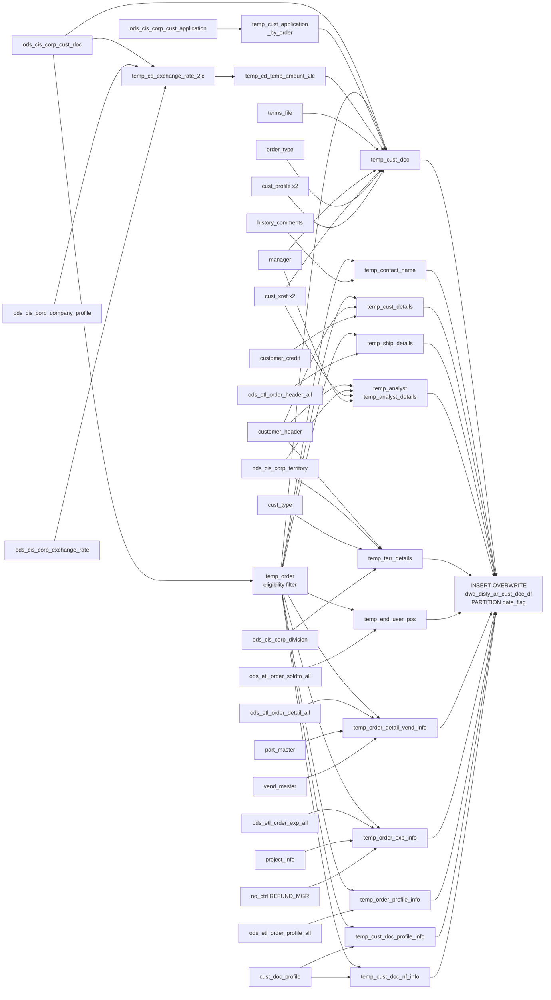

# DWD: AR Customer Document Detail — Date-Partitioned (`dwd_disty_ar_cust_doc_df`)

- artifact_type: etl_table
- artifact_id: ${target_db}.dwd_disty_ar_cust_doc_df
- domain: ar
- one_line_purpose: This job builds the core accounts-receivable customer document detail table, producing one row per open or partially-applied AR document as of a given `date_flag`. It enriches each document with payment terms, customer credit attributes, sh...
- layer_type: DWD
- source_kind: etl_sql
- evidence_source: source/etl/sql/ar/data_service/ar/sql/dwd_ar_cust_doc_df.sql

---

## L1 Data Foundation

### Identity and physical mapping
- **Table:** `${target_db}.dwd_disty_ar_cust_doc_df`
- **Layer type:** DWD
- **Canonical / derived:** Derived / ETL-loaded (see L3)
- **Owner team:** not registered in metadata catalog

### Grain, scope, exclusions
- **Grain:** one row per AR customer document (open or partially applied) as of `date_flag`.
- **Scope:** See L2 business purpose / L3 filters
- **Partition:** `date_flag`. - resolved from pipeline (see L4)
- **Natural key:** `order_type`, `order_no`, `cust_no` within a `date_flag` partition.
- **Exclusions:** Not documented in repository

#### Grain detail (preserved)

- **Grain:** one row per AR customer document (open or partially applied) as of `date_flag`.
- **Partition:** `date_flag`.
- **Natural key:** `order_type`, `order_no`, `cust_no` within a `date_flag` partition.

---

### Cross-engine presence
| Engine | Present | Canonical FQN | Notes |
|--------|---------|---------------|-------|
| Hive | yes | `${target_db}.dwd_disty_ar_cust_doc_df` | ETL target / intermediate per evidence script |
| Vertica | pending | `${target_db}.dwd_disty_ar_cust_doc_df` | Confirm via hive2vertica flow evidence / MCP |

### Physical schema reference

Pointer block only - full column catalog lives in WKB L1 storage JSON.

| Field | Value |
|-------|-------|
| **Authoritative catalog** | WKB L1 storage seed (not duplicated in this file) |
| **entity_id** | `${target_db}.dwd_disty_ar_cust_doc_df` |
| **l1_catalog_seed** | `target/storage/wkb/snapshots/_snapshot_id_template/l1_catalog/vertica_dw_us_dwd_disty_ar_cust_doc_df.json` |
| **column_count** | 82 |
| **partition_keys** | `date_flag` |
| **ddl_source** | pending Bitbucket DDL / Vertica metadata ingest |
| **retrieval** | `python -m tools.wkb.indexing.run_query --query "ar dwd_ar_cust_doc_df schema" --intent find_table_schema` |

### Lineage
| Object | Role |
|--------|------|
| `${source_db}.ods_cis_corp_cust_doc` | Primary AR document source |
| All other sources | See Base tables register |

---

### Freshness and load path
| Item | Value |
|------|-------|
| Load pattern | See L3 end-to-end / INSERT pattern in evidence script |
| Schedule | Not documented in repository |
| Parameters | `source_db`, `target_db`, `date_flag`, `etl_timestamp` |


---

## L2 Declarative Knowledge

### Business purpose
This job builds the core accounts-receivable customer document detail table, producing one row per
open or partially-applied AR document as of a given `date_flag`. It enriches each document with
payment terms, customer credit attributes, shipping details, analyst assignments, vendor info,
commission amounts, FX rates, and a secondary local currency (`2lc`) conversion for Brazil. The
result is the foundational AR aging dataset that feeds all downstream AR summary, aging, and credit
reporting tables.

---

### Audience and use cases
| Audience | How they benefit |
|----------|-----------------|
| **Credit / AR team** | Core AR aging data: open amounts, age days, credit limits, analyst assignments, release codes |
| **Finance** | USD and 2LC amounts for multi-currency reporting; FX rate per order |
| **Sales** | Territory, division, customer type, and sales rep assignments on open AR |
| **Collections** | Collector ID, collector name, contact name, next review date for prioritizing collections |
| **Compliance / audit** | Entry name, entry datetime, commission amounts, NF number |

---

### Fact key resolution
- Natural key: `order_type`, `order_no`, `cust_no` within a `date_flag` partition.
- FK / label-on attributes: see L3 dimension join patterns and step-by-step logic.
- Negative assertion: do not treat descriptive labels as grain keys unless listed under natural key.

### Time field semantics
- **date_flag / partition columns:** `date_flag`.
- Primary reporting filter should use the partition column(s) documented in L1; resolve values via L4.


### Metrics served

| Category | Column | Logical metric | Business reading |
|----------|--------|----------------|------------------|
| Governed metric | `amount_2lc` | `amount_2lc` | amount_2lc at unspecified grain |
| Governed metric | `amt_current` | `amt_current` | amt_current at unspecified grain |
| Governed metric | `applied_2lc` | `applied_2lc` | applied_2lc at unspecified grain |
| P&L adjustment / measure | `commission_amt` | `commission_amt` | commission_amt at unspecified grain |
| P&L adjustment / measure | `pending_amt` | `pending_amt` | pending_amt at unspecified grain |
| Governed metric | `usd_amt` | `usd_amt` | usd_amt at unspecified grain |

### Metric serving map

**Formula authority:** [`source/contracts/ar/metric-index.md`](../../source/contracts/ar/metric-index.md)

| Logical metric | Period scope | Physical column | Formula reference |
|----------------|--------------|-----------------|-------------------|
| `amount_2lc` | unspecified | `amount_2lc` | `source/contracts/ar/metric-index.md#amount_2lc` |
| `amt_current` | unspecified | `amt_current` | `source/contracts/ar/metric-index.md#amt_current` |
| `applied_2lc` | unspecified | `applied_2lc` | `source/contracts/ar/metric-index.md#applied_2lc` |
| `commission_amt` | unspecified | `commission_amt` | Not in metric-index.md |
| `pending_amt` | unspecified | `pending_amt` | Not in metric-index.md |
| `usd_amt` | unspecified | `usd_amt` | `source/contracts/ar/metric-index.md#usd_amt` |

### etl_metrics

Formulas below are sourced from [`source/contracts/ar/metric-index.md`](../../source/contracts/ar/metric-index.md) for logical metrics present on this table.
Index formulas are canonical: this enricher copies them into KB and never overwrites `final_effective_formula_sql` in the metric-index.

#### `amount_2lc`
- **Source:** [metric-index.md](../../source/contracts/ar/metric-index.md#amount_2lc)
- **Business definition:** Computes 2LC amount from rate only when source is NULL
```sql
IF exchange_rate_2lc IS NOT NULL AND amount_2lc IS NULL THEN ROUND(amount / exchange_rate_2lc, 2) ELSE amount_2lc
```

#### `amt_current`
- **Source:** [metric-index.md](../../source/contracts/ar/metric-index.md#amt_current)
- **Business definition:** Amount not yet due as of snapshot date
```sql
IF due_date > date_flag+1 THEN (amount - applied) ELSE 0
```

#### `applied_2lc`
- **Source:** [metric-index.md](../../source/contracts/ar/metric-index.md#applied_2lc)
- **Business definition:** Proportional 2LC applied amount
```sql
IF applied<>0 AND amount<>0 AND amount_2lc IS NOT NULL AND mismatch THEN ROUND(applied*amount_2lc/amount, 2) ELSE applied_2lc
```

#### `usd_amt`
- **Source:** [metric-index.md](../../source/contracts/ar/metric-index.md#usd_amt)
- **Business definition:** For BR: recalculated from trade-currency rate; otherwise from source
```sql
IF em.exchange_rate IS NOT NULL THEN ROUND(ht.amount / em.exchange_rate, 2) ELSE ht.usd_amt
```

---

### Metric serving map
N/A - not a `*_comb_mtd` / multi-period wide serving table (or map not present in legacy doc).


### Data products and column groups (preserved)

### Identifiers and relationships

- **Document:** `order_type`, `order_no`, `cust_no`, `loc_no`, `company_no`
- **Customer hierarchy:** `finance_mcust_no` (FINAN_SUB xref), `mcust_no` (MASTER_SUB xref)
- **Vendor:** `vend_no`, `vend_name`

### Dimension columns

- `terms`, `terms_desc`, `terms_days`, `disc_percent`, `disc_days`, `terms_type`, `terms_group`, `default_terms`
- `cust_name`, `release_code`, `next_review`, `credit_limit`, `pending_amt`
- `sales_terr`, `terr_name`, `cust_type`, `cust_type_descr`, `division`, `division_desc`, `region`
- `credit_analyst`, `credit_analyst_name`, `program_analyst`, `program_analyst_name`
- `service_analyst`, `service_analyst_name`, `collector_id`, `collector_name`
- `order_type_descr`, `contact_name`, `cust_currency`
- `ship_to_name`, `ship_to_addr`, `ship_to_state`, `ship_to_country`, `ship_to_city`, `ship_to_zip`, `from_loc_no`, `drop_ship`
- `end_user_po`
- `gl_account` — 136012 for intercompany customers, 110000 otherwise

### Financial amounts

- `amount` — Document total
- `applied` — Amount applied (uses `new_applied` which accounts for type-22 adjustments)
- `usd_amt`, `usd_applied` — USD equivalents (may be BR-rate-corrected)
- `amount_2lc`, `applied_2lc` — Second-local-currency amounts
- `currency_2lc` — The second local currency code
- `fx_currency`, `fx_rate` — FX currency and order-level FX rate
- `disc_amt_used`, `usd_disc_amt_used` — Discount amounts taken
- `commission_amt` — Total commission expense for the document

### Date attributes

- `doc_date`, `close_date`, `due_date`, `entry_datetime`, `payment_expected_date`
- `due_date_agedays` — Days from `date_flag+1` to `due_date` (negative = overdue)
- `doc_date_agedays` — Days from `date_flag+1` to `doc_date`
- `snap_date` — ETL timestamp as string

### Other

- `nf_no` — Nota fiscal number (Brazil only)
- `reference`, `reference2`, `credit_code`, `me_applied`

---

### etl_metrics

#### `pay_sum`
- **Source:** [metric-index.md](../../source/contracts/ar/metric-index.md#pay_sum)
- **Business definition:** Total payment + discount applied per document
```sql
SUM(pay_amt + disc_amt_taken)
```

#### `usd_pay_sum`
- **Source:** [metric-index.md](../../source/contracts/ar/metric-index.md#usd_pay_sum)
- **Business definition:** USD equivalent of the above
```sql
SUM(usd_pay_amt + usd_disc_taken)
```

#### `exchange_rate_date_2lc`
- **Source:** [metric-index.md](../../source/contracts/ar/metric-index.md#exchange_rate_date_2lc)
- **Business definition:** Latest rate date at or before doc_date
```sql
MAX(exc.date)
```

#### `amount_2lc`
- **Source:** [metric-index.md](../../source/contracts/ar/metric-index.md#amount_2lc)
- **Business definition:** Computes 2LC amount from rate only when source is NULL
```sql
IF exchange_rate_2lc IS NOT NULL AND amount_2lc IS NULL THEN ROUND(amount / exchange_rate_2lc, 2) ELSE amount_2lc
```

#### `amt_current`
- **Source:** [metric-index.md](../../source/contracts/ar/metric-index.md#amt_current)
- **Business definition:** Amount not yet due as of snapshot date
```sql
IF due_date > date_flag+1 THEN (amount - applied) ELSE 0
```

#### `due_date_agedays`
- **Source:** [metric-index.md](../../source/contracts/ar/metric-index.md#due_date_agedays)
- **Business definition:** Days past due (positive = overdue, negative = not yet due)
```sql
DATEDIFF(date_flag+1, due_date)
```

#### `doc_date_agedays`
- **Source:** [metric-index.md](../../source/contracts/ar/metric-index.md#doc_date_agedays)
- **Business definition:** Age of the document from its creation date
```sql
DATEDIFF(date_flag+1, doc_date)
```

#### `new_applied`
- **Source:** [metric-index.md](../../source/contracts/ar/metric-index.md#new_applied)
- **Business definition:** Corrected applied amount including application records
```sql
IF order_type=22 THEN amount+nvl(pay_sum,0) ELSE nvl(pay_sum,0)
```

#### `applied_2lc`
- **Source:** [metric-index.md](../../source/contracts/ar/metric-index.md#applied_2lc)
- **Business definition:** 2LC applied amount proportionally derived
```sql
IF applied<>0 AND amount<>0 AND amount_2lc IS NOT NULL AND applied_2lc doesn't match THEN ROUND(applied*amount_2lc/amount,2) ELSE applied_2lc
```

#### `usd_amt`
- **Source:** [metric-index.md](../../source/contracts/ar/metric-index.md#usd_amt)
- **Business definition:** For BR: recalculated from trade-currency rate; otherwise from source
```sql
IF em.exchange_rate IS NOT NULL THEN ROUND(ht.amount / em.exchange_rate, 2) ELSE ht.usd_amt
```

#### `fx_currency`
- **Source:** [metric-index.md](../../source/contracts/ar/metric-index.md#fx_currency)
- **Business definition:** Trade currency from BR rate lookup, else from document
```sql
NVL(em.fx_currency, ht.fx_currency)
```


---

## L3 Procedural Knowledge

### Query and routing rules
**Business filters:** Use partition / date keys from L1 grain for reporting scope.
**Technical predicates (load only):** See Key filters and step-by-step logic below.

### Dimension join patterns
| Dimension FQN | Join keys | Purpose | Evidence |
|---------------|-----------|---------|----------|
| See step-by-step / base tables | See L3 steps | Dimension enrichment | `source/etl/sql/ar/data_service/ar/sql/dwd_ar_cust_doc_df.sql` |

### Key filters and ETL business logic
### Step 1 — `temp_cust_application_by_order`

**Source:** `${source_db}.ods_cis_corp_cust_application`

**Filter:** `entry_datetime < DATE_ADD(date_flag, 1)` — only applications entered on or before the snapshot date

**Derived columns:**

| Column | Formula | Plain language |
|--------|---------|----------------|
| `pay_sum` | `SUM(pay_amt + disc_amt_taken)` | Total payment + discount applied per document |
| `usd_pay_sum` | `SUM(usd_pay_amt + usd_disc_taken)` | USD equivalent of the above |

---

### Step 2 — `temp_order` (document eligibility)

**Source:** `${source_db}.ods_cis_corp_cust_doc cd`

**Filter (three OR conditions):**
1. `close_date IS NOT NULL AND amount = applied AND doc_date < date_flag+1 AND close_date >= date_flag+1 AND entry_datetime < date_flag+1` — Fully paid but closed on or after snapshot → still open on snapshot date
2. `close_date IS NOT NULL AND amount != applied AND doc_date < date_flag+1` — Partially paid (regardless of close date)
3. `close_date IS NULL AND doc_date < date_flag+1 AND entry_datetime < date_flag+1` — Not yet closed

---

### Step 3 — `temp_cd_exchange_rate_2lc`

**Source:** `ods_cis_corp_cust_doc cd` (filtered: `amount <> 0 AND amount_2lc IS NULL`) INNER JOIN `ods_cis_corp_company_info cp` INNER JOIN `ods_cis_corp_company_profile cpp` (`fx_2lc`, active) LEFT JOIN `ods_cis_corp_exchange_rate exc` (currency = company currency, base = 2LC currency, date ≤ doc_date)

**Derived columns:**

| Column | Formula | Plain language |
|------...

### Standard time-filter SQL
```sql
-- relative period filter using resolved partition value (see L4)
SELECT *
FROM ${target_db}.dwd_disty_ar_cust_doc_df
WHERE /* partition predicate */ date_flag = '${partition_value}';
```

### End-to-end flow
**Runtime parameters:** `source_db`, `target_db`, `date_flag`, `etl_timestamp`
**Target table:** `${target_db}.dwd_disty_ar_cust_doc_df`, partitioned by **`date_flag`**.

1. **`temp_cust_application_by_order`:** Sum payment applications per document up to `date_flag+1`.
2. **`temp_order`:** Identify eligible open/partially-applied documents using three eligibility conditions.
3. **`temp_cd_exchange_rate_2lc`:** For non-null `fx_2lc` companies, find the latest FX rate date ≤ `doc_date` for the 2LC currency.
4. **`temp_cd_temp_amount_2lc`:** Compute `amount_2lc` from the rate when the source is NULL.
5. **`temp_cust_doc`:** Main document view — joins `cust_doc` to `temp_order`, `terms_file`, `manager`, `cust_xref` (x2), `order_type`, `cust_profile` (x2), `temp_cust_application_by_order`, and `temp_cd_temp_amount_2lc`; derives `amt_current`, `due_date_agedays`, `gl_account`, `new_applied`, `new_usd_applied`, `applied_2lc`.
6. **`temp_contact_name`:** MAX comment for `SA` type, location `N` per document.
7. **`temp_cust_details`:** Customer name, release code, next review, credit limit, pending amount.
8. **`temp_ship_details`:** Ship-to address from `ods_etl_order_header_all`.
9. **`temp_order_detail_vend_info`:** Max vendor per document from order detail + part master.
10. **`temp_order_exp_info`:** Commission sum from REFUND_MGR-type project expenses.
11. **`temp_order_profile_info`:** Max `ORDRFXRATE` profile value per document.
12. **`temp_cust_doc_profile_info`:** Max `PYMT_EXP_D` payment expected date.
13. **`temp_cust_doc_nf_info`:** Max `NF_O/NUMBER` nota fiscal number.
14. **`temp_end_user_pos`:** End user PO from `ods_etl_order_soldto_all`.
15. **`temp_terr_details`:** Territory, customer type, division from `ods_cis_corp_territory` and `cust_type`/`division`.
16. **`temp_analyst` + `temp_analyst_details`:** Credit analyst, program analyst, service analyst, collector from `customer_header`, `territory`, `cust_xref` (x2), resolved to names via `manager` (x4 joins).
17. **`temp_exchange_rate_date` + `temp_exchange_rate`:** Brazil-only trade-currency exchange rate for `ods_br`.
18. **`temp_company_2lc_profile_info`:** Company-level 2LC currency code.
19. **Final `INSERT OVERWRITE`:** Assembles all 17 views with LEFT JOINs; derives `snap_date`, USD amounts (BR-corrected if applicable), and `currency_2lc`.



---


#### High-level stages (preserved)

| Stage | Business meaning |
|-------|-----------------|
| **Order eligibility filter** | Identifies which AR documents are "open as of the snapshot date" using three conditions: fully paid but closed after snapshot; partially paid; or not yet closed with doc and entry date before snapshot |
| **Payment application** | Aggregates customer payment application amounts per document to compute a correct `applied` figure (especially for type-22 documents) |
| **Secondary-currency rate lookup** | For companies with an `fx_2lc` profile (Brazil), finds the latest exchange rate between the company currency and the 2LC currency on or before `doc_date` |
| **2LC amount derivation** | Computes `amount_2lc` (document amount in second local currency) from the rate if the source value is NULL |
| **Customer document enrichment** | Joins document to terms, manager (entry name), customer xrefs, order type, customer profile, and payment application totals |
| **Contact name** | Extracts `SA` (Sales) comment from order history as contact name |
| **Customer credit details** | Adds credit limit, release code, next review, and pending amount |
| **Shipping details** | Adds ship-to address from the order header |
| **Vendor info** | Identifies the primary vendor for the document's order lines |
| **Commission amounts** | Sums commission expenses from REFUND_MGR-type projects |
| **FX rate** | Pulls `ORDRFXRATE` profile from order profiles |
| **Payment expected date** | Pulls `PYMT_EXP_D` profile from `cust_doc_profile` |
| **NF number** | Pulls Brazilian nota fiscal number from `cust_doc_profile` |
| **Territory / division** | Adds sales territory, customer type, and division from the territory dimension |
| **Analyst details** | Resolves credit analyst, program analyst, service analyst, and collector IDs and names from the manager table |
| **Brazil exchange rate** | For BR: computes a `trade_curr` exchange rate if `source_db = 'ods_br'` |
| **Final INSERT** | Assembles all enrichment views into one wide row per document per `date_flag` partition |

**Parameters:** `source_db`, `target_db`, `date_flag`, `etl_timestamp`

---


### Base tables register
| Object | Role in this job |
|--------|-----------------|
| `${source_db}.ods_cis_corp_cust_doc` | Primary source — AR customer documents |
| `${source_db}.ods_cis_corp_cust_application` | Payment application amounts per document |
| `${source_db}.ods_cis_corp_exchange_rate` | FX rates for 2LC conversion and BR trade-currency |
| `${source_db}.ods_cis_corp_company_info` | Company currency for FX joins |
| `${source_db}.ods_cis_corp_company_profile` | `fx_2lc` and `TRADE_CURR` profiles |
| `${source_db}.ods_cis_corp_terms_file` | Payment terms attributes |
| `${source_db}.ods_cis_corp_manager` | Entry name and analyst name lookups |
| `${source_db}.ods_cis_corp_cust_xref` | FINAN_SUB and MASTER_SUB customer cross-references |
| `${source_db}.ods_cis_corp_order_type` | Order type description |
| `${source_db}.ods_cis_corp_cust_profile` | `CUST_CURR` and `INTR_CMPY` profiles |
| `${source_db}.ods_cis_corp_history_comments` | SA contact name |
| `${source_db}.ods_cis_corp_customer_header` | Customer name, release code, review date, sales territory |
| `${source_db}.ods_cis_corp_customer_credit` | Credit limit, pending amount |
| `${source_db}.ods_etl_order_header_all` | Ship-to address |
| `${source_db}.ods_etl_order_detail_all` | Order lines for vendor identification |
| `${source_db}.ods_cis_corp_part_master` | Part-to-vendor mapping |
| `${source_db}.ods_cis_corp_vend_master` | Vendor name |
| `${source_db}.ods_etl_order_exp_all` | Order expenses for commission calculation |
| `${source_db}.ods_cis_corp_project_info` | Project for commission classification |
| `${source_db}.ods_cis_corp_no_ctrl` | REFUND_MGR kind for commission filter |
| `${source_db}.ods_etl_order_profile_all` | `ORDRFXRATE` profile |
| `${source_db}.ods_cis_corp_cust_doc_profile` | Payment expected date and NF number |
| `${source_db}.ods_etl_order_soldto_all` | End user PO |
| `${source_db}.ods_cis_corp_territory` | Sales territory attributes |
| `${source_db}.ods_cis_corp_cust_type` | Customer type description and division |
| `${source_db}.ods_cis_corp_division` | Division description |

**Temporary tables (inside the job only):**
`temp_cust_application_by_order` → `temp_order` → `temp_cd_exchange_rate_2lc` → `temp_cd_temp_amount_2lc` → `temp_cust_doc` → `temp_contact_name` → `temp_cust_details` → `temp_ship_details` → `temp_order_detail_vend_info` → `temp_order_exp_info` → `temp_order_profile_info` → `temp_cust_doc_profile_info` → `temp_cust_doc_nf_info` → `temp_end_user_pos` → `temp_terr_details` → `temp_analyst` → `temp_analyst_details` → `temp_exchange_rate_date` → `temp_exchange_rate` → `temp_company_2lc_profile_info` → (final `INSERT`)

---

### Step-by-step logic
### Step 1 — `temp_cust_application_by_order`

**Source:** `${source_db}.ods_cis_corp_cust_application`

**Filter:** `entry_datetime < DATE_ADD(date_flag, 1)` — only applications entered on or before the snapshot date

**Derived columns:**

| Column | Formula | Plain language |
|--------|---------|----------------|
| `pay_sum` | `SUM(pay_amt + disc_amt_taken)` | Total payment + discount applied per document |
| `usd_pay_sum` | `SUM(usd_pay_amt + usd_disc_taken)` | USD equivalent of the above |

---

### Step 2 — `temp_order` (document eligibility)

**Source:** `${source_db}.ods_cis_corp_cust_doc cd`

**Filter (three OR conditions):**
1. `close_date IS NOT NULL AND amount = applied AND doc_date < date_flag+1 AND close_date >= date_flag+1 AND entry_datetime < date_flag+1` — Fully paid but closed on or after snapshot → still open on snapshot date
2. `close_date IS NOT NULL AND amount != applied AND doc_date < date_flag+1` — Partially paid (regardless of close date)
3. `close_date IS NULL AND doc_date < date_flag+1 AND entry_datetime < date_flag+1` — Not yet closed

---

### Step 3 — `temp_cd_exchange_rate_2lc`

**Source:** `ods_cis_corp_cust_doc cd` (filtered: `amount <> 0 AND amount_2lc IS NULL`) INNER JOIN `ods_cis_corp_company_info cp` INNER JOIN `ods_cis_corp_company_profile cpp` (`fx_2lc`, active) LEFT JOIN `ods_cis_corp_exchange_rate exc` (currency = company currency, base = 2LC currency, date ≤ doc_date)

**Derived columns:**

| Column | Formula | Plain language |
|--------|---------|----------------|
| `exchange_rate_date_2lc` | `MAX(exc.date)` | Latest rate date at or before doc_date |
| `exchange_rate_2lc` | `IF currency=currency_2lc THEN 1 ELSE e.rate` | Rate to convert to 2LC; 1 if same currency |

---

### Step 4 — `temp_cd_temp_amount_2lc`

**Derived column:**

| Column | Formula | Plain language |
|--------|---------|----------------|
| `amount_2lc` | `IF exchange_rate_2lc IS NOT NULL AND amount_2lc IS NULL THEN ROUND(amount / exchange_rate_2lc, 2) ELSE amount_2lc` | Computes 2LC amount from rate only when source is NULL |

---

### Step 5 — `temp_cust_doc` (core document view)

Joins `ods_cis_corp_cust_doc` to `temp_order` (INNER), `terms_file` (LEFT), `manager` (LEFT on `entry_id`), `cust_xref` FINAN_SUB (LEFT), `cust_xref` MASTER_SUB (LEFT), `order_type` (LEFT), `cust_profile` CUST_CURR (LEFT), `cust_profile` INTR_CMPY (LEFT), `temp_cust_application_by_order` (LEFT), `temp_cd_temp_amount_2lc` (LEFT).

**Derived columns:**

| Column | Formula | Plain language |
|--------|---------|----------------|
| `amt_current` | `IF due_date > date_flag+1 THEN (amount - applied) ELSE 0` | Amount not yet due as of snapshot date |
| `entry_name` | `CONCAT(mg.firstname,' ',mg.lastname)` | Name of the person who entered the document |
| `due_date_agedays` | `DATEDIFF(date_flag+1, due_date)` | Days past due (positive = overdue, negative = not yet due) |
| `doc_date_agedays` | `DATEDIFF(date_flag+1, doc_date)` | Age of the document from its creation date |
| `gl_account` | `IF cp2.profile_i IS NOT NULL THEN 136012 ELSE 110000` | 136012 for intercompany (`INTR_CMPY`) customers |
| `new_applied` | `IF order_type=22 THEN amount+nvl(pay_sum,0) ELSE nvl(pay_sum,0)` | Corrected applied amount including application records |
| `new_usd_applied` | Same formula for USD | USD version of `new_applied` |
| `applied_2lc` | `IF applied<>0 AND amount<>0 AND amount_2lc IS NOT NULL AND applied_2lc doesn't match THEN ROUND(applied*amount_2lc/amount,2) ELSE applied_2lc` | 2LC applied amount proportionally derived |

---

### Steps 6–18 — Enrichment views

Each view joins from `temp_order` to get additional attributes; all details per source table documented in the Base tables register above.

---

### Step 19 — Final `INSERT OVERWRITE` into `dwd_disty_ar_cust_doc_df PARTITION(date_flag)`

**From:** `temp_cust_doc ht` LEFT JOINed to all 12 enrichment views; writes `'${date_flag}'` as partition value.

**Derived columns computed at INSERT:**

| Column | Formula | Plain language |
|--------|---------|----------------|
| `u_version` | `'!'` | Version sentinel |
| `snap_date` | `'${etl_timestamp}'` | ETL timestamp string |
| `usd_amt` | `IF em.exchange_rate IS NOT NULL THEN ROUND(ht.amount / em.exchange_rate, 2) ELSE ht.usd_amt` | For BR: recalculated from trade-currency rate; otherwise from source |
| `usd_applied` | Same formula for applied | USD applied recalculated for BR |
| `fx_currency` | `NVL(em.fx_currency, ht.fx_currency)` | Trade currency from BR rate lookup, else from document |

---

### Relationship map (embedded)

| from_fqn | to_fqn | cardinality | join_keys | provenance |
|----------|--------|-------------|-----------|------------|
| `temp_exchange_rate_date` | `ods_xx.ods_cis_corp_company_info` | many:1 | `cd.company_no = cp.company_no` | etl_sql (source/etl/sql/ar/data_service/ar/sql/dwd_ar_cust_doc_df.sql:1) |
| `temp_exchange_rate_date` | `ods_xx.ods_cis_corp_company_profile` | many:1 | `cpp.company_no = cd.company_no AND cpp.profile_type = 'fx_2lc' AND cpp.profile_cat = 'COM' AND cpp.active = 'Y' AND cpp.profile_c IS NOT NULL` | etl_sql (source/etl/sql/ar/data_service/ar/sql/dwd_ar_cust_doc_df.sql:1) |
| `ods_xx.ods_cis_corp_company_info` | `ods_xx.ods_cis_corp_exchange_rate` | many:1 | `exc.currency = cp.currency AND exc.`base` = cpp.profile_c AND exc.`date` <= cd.doc_date` | etl_sql (source/etl/sql/ar/data_service/ar/sql/dwd_ar_cust_doc_df.sql:1) |
| `ods_xx.ods_cis_corp_cust_application` | `ods_xx.ods_cis_corp_exchange_rate` | many:1 | `e.currency = m.currency AND e.`base` = m.currency_2lc AND e.`date` = m.exchange_rate_date_2lc ; CREATE OR REPLACE TEMPORARY VIEW temp_cd_temp_amount_2lc AS` | etl_sql (source/etl/sql/ar/data_service/ar/sql/dwd_ar_cust_doc_df.sql:1) |
| `temp_analyst` | `temp_cd_exchange_rate_2lc` | many:1 | `a.order_type = ex.order_type AND a.order_no = ex.order_no AND a.company_no = ex.company_no ; CREATE OR REPLACE TEMPORARY VIEW temp_cust_doc AS` | etl_sql (source/etl/sql/ar/data_service/ar/sql/dwd_ar_cust_doc_df.sql:1) |
| `temp_exchange_rate_date` | `temp_order` | many:1 | `cd2.order_no = cd.order_no and cd2.order_type = cd.order_type and cd2.cust_no = cd.cust_no` | etl_sql (source/etl/sql/ar/data_service/ar/sql/dwd_ar_cust_doc_df.sql:1) |
| `temp_exchange_rate_date` | `ods_xx.ods_cis_corp_terms_file` | many:1 | `trim(cd.terms) = trim(tf.doc_terms)` | etl_sql (source/etl/sql/ar/data_service/ar/sql/dwd_ar_cust_doc_df.sql:1) |
| `temp_exchange_rate_date` | `ods_xx.ods_cis_corp_manager` | many:1 | `cd.entry_id = mg.userid` | etl_sql (source/etl/sql/ar/data_service/ar/sql/dwd_ar_cust_doc_df.sql:1) |
| `temp_exchange_rate_date` | `ods_xx.ods_cis_corp_cust_xref` | many:1 | `cd.cust_no = cx.cust_no and cx.xref_type='FINAN_SUB' and cx.active='Y'` | etl_sql (source/etl/sql/ar/data_service/ar/sql/dwd_ar_cust_doc_df.sql:1) |
| `temp_exchange_rate_date` | `ods_xx.ods_cis_corp_cust_xref` | many:1 | `cd.cust_no = cx1.cust_no and cx1.xref_type='MASTER_SUB' and cx1.active='Y'` | etl_sql (source/etl/sql/ar/data_service/ar/sql/dwd_ar_cust_doc_df.sql:1) |
| `temp_exchange_rate_date` | `ods_xx.ods_cis_corp_order_type` | many:1 | `cd.order_type = ot.order_type` | etl_sql (source/etl/sql/ar/data_service/ar/sql/dwd_ar_cust_doc_df.sql:1) |
| `temp_exchange_rate_date` | `ods_xx.ods_cis_corp_cust_profile` | many:1 | `cd.cust_no=cp.cust_no and cp.profile_type='CUST_CURR' and cp.active='Y'` | etl_sql (source/etl/sql/ar/data_service/ar/sql/dwd_ar_cust_doc_df.sql:1) |
| `temp_exchange_rate_date` | `ods_xx.ods_cis_corp_cust_profile` | many:1 | `cd.cust_no=cp2.cust_no and cp2.profile_type='INTR_CMPY' and cp2.profile_cat='CUST' and cp2.active='Y'` | etl_sql (source/etl/sql/ar/data_service/ar/sql/dwd_ar_cust_doc_df.sql:1) |
| `temp_exchange_rate_date` | `temp_cust_application_by_order` | many:1 | `cap.order_no = cd.order_no and cap.order_type = cd.order_type` | etl_sql (source/etl/sql/ar/data_service/ar/sql/dwd_ar_cust_doc_df.sql:1) |
| `temp_exchange_rate_date` | `temp_cd_temp_amount_2lc` | many:1 | `cd.order_type = m.order_type AND cd.order_no = m.order_no AND cd.company_no = m.company_no ; CREATE OR REPLACE TEMPORARY VIEW temp_contact_name AS` | etl_sql (source/etl/sql/ar/data_service/ar/sql/dwd_ar_cust_doc_df.sql:1) |
| `temp_exchange_rate_date` | `ods_xx.ods_cis_corp_history_comments` | many:1 | `cd.order_no = b.order_no and cd.order_type = b.order_type` | etl_sql (source/etl/sql/ar/data_service/ar/sql/dwd_ar_cust_doc_df.sql:1) |
| `temp_exchange_rate_date` | `ods_xx.ods_cis_corp_customer_header` | many:1 | `cd.cust_no = ch.cust_no` | etl_sql (source/etl/sql/ar/data_service/ar/sql/dwd_ar_cust_doc_df.sql:1) |
| `temp_exchange_rate_date` | `ods_xx.ods_cis_corp_customer_credit` | many:1 | `cd.cust_no = cc.cust_no and trim(cd.terms)= trim(cc.terms); --fetching data for shipping details CREATE OR REPLACE TEMPORARY VIEW temp_ship_details AS` | etl_sql (source/etl/sql/ar/data_service/ar/sql/dwd_ar_cust_doc_df.sql:1) |
| `temp_exchange_rate_date` | `ods_xx.ods_etl_order_header_all` | many:1 | `cd.order_type = hh.order_type AND cd.order_no = hh.order_no; --fetching data for vendor infos CREATE OR REPLACE TEMPORARY VIEW temp_order_detail_vend_info AS` | etl_sql (source/etl/sql/ar/data_service/ar/sql/dwd_ar_cust_doc_df.sql:1) |
| `temp_exchange_rate_date` | `ods_xx.ods_etl_order_detail_all` | many:1 | `cd.order_type = b.order_type AND cd.order_no = b.order_no` | etl_sql (source/etl/sql/ar/data_service/ar/sql/dwd_ar_cust_doc_df.sql:1) |
| `ods_xx.ods_etl_order_detail_all` | `ods_xx.ods_cis_corp_part_master` | many:1 | `b.sku_no = pm.sku_no` | etl_sql (source/etl/sql/ar/data_service/ar/sql/dwd_ar_cust_doc_df.sql:1) |
| `ods_xx.ods_cis_corp_part_master` | `ods_xx.ods_cis_corp_vend_master` | many:1 | `pm.vend_no = vm.vend_no` | etl_sql (source/etl/sql/ar/data_service/ar/sql/dwd_ar_cust_doc_df.sql:1) |
| `temp_exchange_rate_date` | `ods_xx.ods_etl_order_exp_all` | many:1 | `cd.order_no = he.order_no AND cd.order_type = he.order_type` | etl_sql (source/etl/sql/ar/data_service/ar/sql/dwd_ar_cust_doc_df.sql:1) |
| `ods_xx.ods_etl_order_exp_all` | `ods_xx.ods_cis_corp_project_info` | many:1 | `he.project_no = p.proj_no` | etl_sql (source/etl/sql/ar/data_service/ar/sql/dwd_ar_cust_doc_df.sql:1) |
| `ods_xx.ods_cis_corp_project_info` | `ods_xx.ods_cis_corp_no_ctrl` | many:1 | `p.var_no = nc.doc_num` | etl_sql (source/etl/sql/ar/data_service/ar/sql/dwd_ar_cust_doc_df.sql:1) |
| `temp_exchange_rate_date` | `ods_xx.ods_etl_order_profile_all` | many:1 | `cd.order_no=op.order_no and cd.order_type= op.order_type` | etl_sql (source/etl/sql/ar/data_service/ar/sql/dwd_ar_cust_doc_df.sql:1) |
| `temp_exchange_rate_date` | `ods_xx.ods_cis_corp_cust_doc_profile` | many:1 | `cd.order_no=op.order_no and cd.order_type= op.order_type` | etl_sql (source/etl/sql/ar/data_service/ar/sql/dwd_ar_cust_doc_df.sql:1) |
| `temp_exchange_rate_date` | `ods_xx.ods_etl_order_soldto_all` | many:1 | `cd.order_type = os.order_type AND cd.order_no = os.order_no ; CREATE OR REPLACE TEMPORARY VIEW temp_terr_details AS` | etl_sql (source/etl/sql/ar/data_service/ar/sql/dwd_ar_cust_doc_df.sql:1) |
| `ods_xx.ods_cis_corp_customer_header` | `ods_xx.ods_cis_corp_territory` | many:1 | `ch.sales_terr = t.sales_terr` | etl_sql (source/etl/sql/ar/data_service/ar/sql/dwd_ar_cust_doc_df.sql:1) |
| `ods_xx.ods_cis_corp_territory` | `ods_xx.ods_cis_corp_cust_type` | many:1 | `t.cust_type = ct.cust_type` | etl_sql (source/etl/sql/ar/data_service/ar/sql/dwd_ar_cust_doc_df.sql:1) |
| `ods_xx.ods_cis_corp_cust_type` | `ods_xx.ods_cis_corp_division` | many:1 | `di.division = ct.division ; --creating analyst details --doubt not cleared here CREATE OR REPLACE TEMPORARY VIEW temp_analyst AS` | etl_sql (source/etl/sql/ar/data_service/ar/sql/dwd_ar_cust_doc_df.sql:1) |
| `temp_exchange_rate_date` | `ods_xx.ods_cis_corp_customer_header` | many:1 | `a.cust_no = cd.cust_no` | etl_sql (source/etl/sql/ar/data_service/ar/sql/dwd_ar_cust_doc_df.sql:1) |
| `ods_xx.ods_cis_corp_customer_header` | `ods_xx.ods_cis_corp_territory` | many:1 | `a.sales_terr = b.sales_terr` | etl_sql (source/etl/sql/ar/data_service/ar/sql/dwd_ar_cust_doc_df.sql:1) |
| `ods_xx.ods_cis_corp_customer_header` | `ods_xx.ods_cis_corp_cust_xref` | many:1 | `a.cust_no=c.cust_no and c.xref_type='CUST_PROG' and c.active='Y'` | etl_sql (source/etl/sql/ar/data_service/ar/sql/dwd_ar_cust_doc_df.sql:1) |
| `ods_xx.ods_cis_corp_customer_header` | `ods_xx.ods_cis_corp_cust_xref` | many:1 | `a.cust_no=d.cust_no and d.xref_type='CUST_CSREP' and d.active='Y'` | etl_sql (source/etl/sql/ar/data_service/ar/sql/dwd_ar_cust_doc_df.sql:1) |
| `ods_xx.ods_cis_corp_customer_header` | `ods_xx.ods_cis_corp_manager` | many:1 | `mg.userid = a.credit_analyst` | etl_sql (source/etl/sql/ar/data_service/ar/sql/dwd_ar_cust_doc_df.sql:1) |
| `ods_xx.ods_cis_corp_customer_header` | `ods_xx.ods_cis_corp_manager` | many:1 | `mg1.userid = a.service_analyst` | etl_sql (source/etl/sql/ar/data_service/ar/sql/dwd_ar_cust_doc_df.sql:1) |
| `ods_xx.ods_cis_corp_customer_header` | `ods_xx.ods_cis_corp_manager` | many:1 | `mg2.userid = a.collector_id` | etl_sql (source/etl/sql/ar/data_service/ar/sql/dwd_ar_cust_doc_df.sql:1) |
| `ods_xx.ods_cis_corp_customer_header` | `ods_xx.ods_cis_corp_manager` | many:1 | `mg3.userid = a.program_analyst ; --this section only for BR CREATE OR REPLACE TEMPORARY VIEW temp_exchange_rate_date AS` | etl_sql (source/etl/sql/ar/data_service/ar/sql/dwd_ar_cust_doc_df.sql:1) |
| `temp_exchange_rate_date` | `ods_xx.ods_cis_corp_company_profile` | many:1 | `cpp.company_no = cd.company_no AND cpp.profile_type = 'TRADE_CURR' AND cpp.active = 'Y'` | etl_sql (source/etl/sql/ar/data_service/ar/sql/dwd_ar_cust_doc_df.sql:1) |
| `ods_xx.ods_cis_corp_company_info` | `ods_xx.ods_cis_corp_exchange_rate` | many:1 | `exc.currency = cp.currency AND exc.base = nvl(cpp.profile_c, 'USD') AND exc.`date` <= '${date_flag}' AND exc.`date` >= DATE_ADD('${date_flag}',-14)` | etl_sql (source/etl/sql/ar/data_service/ar/sql/dwd_ar_cust_doc_df.sql:1) |
| `temp_exchange_rate_date` | `ods_xx.ods_cis_corp_exchange_rate` | many:1 | `exc.currency = cd.currency AND exc.base = cd.fx_currency AND exc.`date`= cd.max_exchange_rate_date` | etl_sql (source/etl/sql/ar/data_service/ar/sql/dwd_ar_cust_doc_df.sql:1) |
| `temp_cust_doc` | `temp_cust_details` | many:1 | `ht.order_type = cd.order_type and ht.order_no = cd.order_no` | etl_sql (source/etl/sql/ar/data_service/ar/sql/dwd_ar_cust_doc_df.sql:1) |
| `temp_cust_doc` | `temp_ship_details` | many:1 | `ht.order_type = sd.order_type and ht.order_no = sd.order_no` | etl_sql (source/etl/sql/ar/data_service/ar/sql/dwd_ar_cust_doc_df.sql:1) |
| `temp_cust_doc` | `temp_analyst_details` | many:1 | `ht.order_type = ad.order_type and ht.order_no = ad.order_no` | etl_sql (source/etl/sql/ar/data_service/ar/sql/dwd_ar_cust_doc_df.sql:1) |
| `temp_cust_doc` | `temp_contact_name` | many:1 | `ht.order_no=th1.order_no and ht.order_type=th1.order_type` | etl_sql (source/etl/sql/ar/data_service/ar/sql/dwd_ar_cust_doc_df.sql:1) |
| `temp_cust_doc` | `temp_terr_details` | many:1 | `ht.cust_no = t.cust_no` | etl_sql (source/etl/sql/ar/data_service/ar/sql/dwd_ar_cust_doc_df.sql:1) |
| `temp_cust_doc` | `temp_end_user_pos` | many:1 | `ht.order_type = eu.order_type and ht.order_no = eu.order_no` | etl_sql (source/etl/sql/ar/data_service/ar/sql/dwd_ar_cust_doc_df.sql:1) |
| `temp_cust_doc` | `temp_exchange_rate` | many:1 | `em.company_no = ht.company_no` | etl_sql (source/etl/sql/ar/data_service/ar/sql/dwd_ar_cust_doc_df.sql:1) |
| `temp_cust_doc` | `temp_order_detail_vend_info` | many:1 | `ht.order_type = vi.order_type and ht.order_no = vi.order_no` | etl_sql (source/etl/sql/ar/data_service/ar/sql/dwd_ar_cust_doc_df.sql:1) |
| `temp_cust_doc` | `temp_order_exp_info` | many:1 | `ht.order_type = ei.order_type and ht.order_no = ei.order_no` | etl_sql (source/etl/sql/ar/data_service/ar/sql/dwd_ar_cust_doc_df.sql:1) |
| `temp_cust_doc` | `temp_order_profile_info` | many:1 | `ht.order_type = pi.order_type and ht.order_no = pi.order_no` | etl_sql (source/etl/sql/ar/data_service/ar/sql/dwd_ar_cust_doc_df.sql:1) |
| `temp_cust_doc` | `temp_cust_doc_profile_info` | many:1 | `ht.order_type = cdp.order_type and ht.order_no = cdp.order_no` | etl_sql (source/etl/sql/ar/data_service/ar/sql/dwd_ar_cust_doc_df.sql:1) |
| `temp_cust_doc` | `temp_cust_doc_nf_info` | many:1 | `ht.order_type = cdf.order_type and ht.order_no = cdf.order_no` | etl_sql (source/etl/sql/ar/data_service/ar/sql/dwd_ar_cust_doc_df.sql:1) |
| `temp_cust_doc` | `temp_company_2lc_profile_info` | many:1 | `ht.company_no = cpp2.company_no ;` | etl_sql (source/etl/sql/ar/data_service/ar/sql/dwd_ar_cust_doc_df.sql:1) |

`source/ref/ar/table relationship.txt`: Not documented in repository.

### Special logic (embedded)

Not documented in repository

### Column / field derivations (from ETL SQL)

| target_column | expression_sql | upstream_columns | upstream_tables | transform_kind | evidence |
|---------------|----------------|------------------|-----------------|----------------|----------|
| `order_type` | `ht.order_type` | `order_type` | `temp_cust_doc`, `temp_cust_details`, `temp_ship_details`, `temp_analyst_details`, `temp_contact_name`, `temp_terr_details`, `temp_end_user_pos`, `temp_exchange_rate`, `temp_order_detail_vend_info`, `temp_order_exp_info`, `temp_order_profile_info`, `temp_cust_doc_profile_info` | passthrough | `source/etl/sql/ar/data_service/ar/sql/dwd_ar_cust_doc_df.sql:426` |
| `order_no` | `ht.order_no` | `order_no` | `temp_cust_doc`, `temp_cust_details`, `temp_ship_details`, `temp_analyst_details`, `temp_contact_name`, `temp_terr_details`, `temp_end_user_pos`, `temp_exchange_rate`, `temp_order_detail_vend_info`, `temp_order_exp_info`, `temp_order_profile_info`, `temp_cust_doc_profile_info` | passthrough | `source/etl/sql/ar/data_service/ar/sql/dwd_ar_cust_doc_df.sql:427` |
| `u_version` | `"!"` | — | `temp_cust_doc`, `temp_cust_details`, `temp_ship_details`, `temp_analyst_details`, `temp_contact_name`, `temp_terr_details`, `temp_end_user_pos`, `temp_exchange_rate`, `temp_order_detail_vend_info`, `temp_order_exp_info`, `temp_order_profile_info`, `temp_cust_doc_profile_info` | partial | `source/etl/sql/ar/data_service/ar/sql/dwd_ar_cust_doc_df.sql:428` |
| `cust_no` | `ht.cust_no` | `cust_no` | `temp_cust_doc`, `temp_cust_details`, `temp_ship_details`, `temp_analyst_details`, `temp_contact_name`, `temp_terr_details`, `temp_end_user_pos`, `temp_exchange_rate`, `temp_order_detail_vend_info`, `temp_order_exp_info`, `temp_order_profile_info`, `temp_cust_doc_profile_info` | passthrough | `source/etl/sql/ar/data_service/ar/sql/dwd_ar_cust_doc_df.sql:429` |
| `cust_name` | `cd.cust_name` | `cust_name` | `temp_cust_doc`, `temp_cust_details`, `temp_ship_details`, `temp_analyst_details`, `temp_contact_name`, `temp_terr_details`, `temp_end_user_pos`, `temp_exchange_rate`, `temp_order_detail_vend_info`, `temp_order_exp_info`, `temp_order_profile_info`, `temp_cust_doc_profile_info` | passthrough | `source/etl/sql/ar/data_service/ar/sql/dwd_ar_cust_doc_df.sql:430` |
| `loc_no` | `ht.loc_no` | `loc_no` | `temp_cust_doc`, `temp_cust_details`, `temp_ship_details`, `temp_analyst_details`, `temp_contact_name`, `temp_terr_details`, `temp_end_user_pos`, `temp_exchange_rate`, `temp_order_detail_vend_info`, `temp_order_exp_info`, `temp_order_profile_info`, `temp_cust_doc_profile_info` | passthrough | `source/etl/sql/ar/data_service/ar/sql/dwd_ar_cust_doc_df.sql:431` |
| `amount` | `ht.amount` | `amount` | `temp_cust_doc`, `temp_cust_details`, `temp_ship_details`, `temp_analyst_details`, `temp_contact_name`, `temp_terr_details`, `temp_end_user_pos`, `temp_exchange_rate`, `temp_order_detail_vend_info`, `temp_order_exp_info`, `temp_order_profile_info`, `temp_cust_doc_profile_info` | passthrough | `source/etl/sql/ar/data_service/ar/sql/dwd_ar_cust_doc_df.sql:432` |
| `amt_current` | `ht.amt_current` | `amt_current` | `temp_cust_doc`, `temp_cust_details`, `temp_ship_details`, `temp_analyst_details`, `temp_contact_name`, `temp_terr_details`, `temp_end_user_pos`, `temp_exchange_rate`, `temp_order_detail_vend_info`, `temp_order_exp_info`, `temp_order_profile_info`, `temp_cust_doc_profile_info` | passthrough | `source/etl/sql/ar/data_service/ar/sql/dwd_ar_cust_doc_df.sql:433` |
| `doc_date` | `ht.doc_date` | `doc_date` | `temp_cust_doc`, `temp_cust_details`, `temp_ship_details`, `temp_analyst_details`, `temp_contact_name`, `temp_terr_details`, `temp_end_user_pos`, `temp_exchange_rate`, `temp_order_detail_vend_info`, `temp_order_exp_info`, `temp_order_profile_info`, `temp_cust_doc_profile_info` | passthrough | `source/etl/sql/ar/data_service/ar/sql/dwd_ar_cust_doc_df.sql:434` |
| `close_date` | `ht.close_date` | `close_date` | `temp_cust_doc`, `temp_cust_details`, `temp_ship_details`, `temp_analyst_details`, `temp_contact_name`, `temp_terr_details`, `temp_end_user_pos`, `temp_exchange_rate`, `temp_order_detail_vend_info`, `temp_order_exp_info`, `temp_order_profile_info`, `temp_cust_doc_profile_info` | passthrough | `source/etl/sql/ar/data_service/ar/sql/dwd_ar_cust_doc_df.sql:435` |
| `applied` | `ht.new_applied` | `new_applied` | `temp_cust_doc`, `temp_cust_details`, `temp_ship_details`, `temp_analyst_details`, `temp_contact_name`, `temp_terr_details`, `temp_end_user_pos`, `temp_exchange_rate`, `temp_order_detail_vend_info`, `temp_order_exp_info`, `temp_order_profile_info`, `temp_cust_doc_profile_info` | rename | `source/etl/sql/ar/data_service/ar/sql/dwd_ar_cust_doc_df.sql:436` |
| `due_date` | `ht.due_date` | `due_date` | `temp_cust_doc`, `temp_cust_details`, `temp_ship_details`, `temp_analyst_details`, `temp_contact_name`, `temp_terr_details`, `temp_end_user_pos`, `temp_exchange_rate`, `temp_order_detail_vend_info`, `temp_order_exp_info`, `temp_order_profile_info`, `temp_cust_doc_profile_info` | passthrough | `source/etl/sql/ar/data_service/ar/sql/dwd_ar_cust_doc_df.sql:437` |
| `reference` | `ht.reference` | `reference` | `temp_cust_doc`, `temp_cust_details`, `temp_ship_details`, `temp_analyst_details`, `temp_contact_name`, `temp_terr_details`, `temp_end_user_pos`, `temp_exchange_rate`, `temp_order_detail_vend_info`, `temp_order_exp_info`, `temp_order_profile_info`, `temp_cust_doc_profile_info` | passthrough | `source/etl/sql/ar/data_service/ar/sql/dwd_ar_cust_doc_df.sql:438` |
| `terms` | `trim(ht.terms)` | `terms` | `temp_cust_doc`, `temp_cust_details`, `temp_ship_details`, `temp_analyst_details`, `temp_contact_name`, `temp_terr_details`, `temp_end_user_pos`, `temp_exchange_rate`, `temp_order_detail_vend_info`, `temp_order_exp_info`, `temp_order_profile_info`, `temp_cust_doc_profile_info` | udf | `source/etl/sql/ar/data_service/ar/sql/dwd_ar_cust_doc_df.sql:439` |
| `terms_desc` | `ht.terms_desc` | `terms_desc` | `temp_cust_doc`, `temp_cust_details`, `temp_ship_details`, `temp_analyst_details`, `temp_contact_name`, `temp_terr_details`, `temp_end_user_pos`, `temp_exchange_rate`, `temp_order_detail_vend_info`, `temp_order_exp_info`, `temp_order_profile_info`, `temp_cust_doc_profile_info` | passthrough | `source/etl/sql/ar/data_service/ar/sql/dwd_ar_cust_doc_df.sql:440` |
| `terms_days` | `ht.terms_days` | `terms_days` | `temp_cust_doc`, `temp_cust_details`, `temp_ship_details`, `temp_analyst_details`, `temp_contact_name`, `temp_terr_details`, `temp_end_user_pos`, `temp_exchange_rate`, `temp_order_detail_vend_info`, `temp_order_exp_info`, `temp_order_profile_info`, `temp_cust_doc_profile_info` | passthrough | `source/etl/sql/ar/data_service/ar/sql/dwd_ar_cust_doc_df.sql:441` |
| `disc_percent` | `ht.disc_percent` | `disc_percent` | `temp_cust_doc`, `temp_cust_details`, `temp_ship_details`, `temp_analyst_details`, `temp_contact_name`, `temp_terr_details`, `temp_end_user_pos`, `temp_exchange_rate`, `temp_order_detail_vend_info`, `temp_order_exp_info`, `temp_order_profile_info`, `temp_cust_doc_profile_info` | passthrough | `source/etl/sql/ar/data_service/ar/sql/dwd_ar_cust_doc_df.sql:442` |
| `disc_days` | `ht.disc_days` | `disc_days` | `temp_cust_doc`, `temp_cust_details`, `temp_ship_details`, `temp_analyst_details`, `temp_contact_name`, `temp_terr_details`, `temp_end_user_pos`, `temp_exchange_rate`, `temp_order_detail_vend_info`, `temp_order_exp_info`, `temp_order_profile_info`, `temp_cust_doc_profile_info` | passthrough | `source/etl/sql/ar/data_service/ar/sql/dwd_ar_cust_doc_df.sql:443` |
| `terms_type` | `ht.terms_type` | `terms_type` | `temp_cust_doc`, `temp_cust_details`, `temp_ship_details`, `temp_analyst_details`, `temp_contact_name`, `temp_terr_details`, `temp_end_user_pos`, `temp_exchange_rate`, `temp_order_detail_vend_info`, `temp_order_exp_info`, `temp_order_profile_info`, `temp_cust_doc_profile_info` | passthrough | `source/etl/sql/ar/data_service/ar/sql/dwd_ar_cust_doc_df.sql:444` |
| `terms_group` | `ht.terms_group` | `terms_group` | `temp_cust_doc`, `temp_cust_details`, `temp_ship_details`, `temp_analyst_details`, `temp_contact_name`, `temp_terr_details`, `temp_end_user_pos`, `temp_exchange_rate`, `temp_order_detail_vend_info`, `temp_order_exp_info`, `temp_order_profile_info`, `temp_cust_doc_profile_info` | passthrough | `source/etl/sql/ar/data_service/ar/sql/dwd_ar_cust_doc_df.sql:445` |
| `entry_datetime` | `ht.entry_datetime` | `entry_datetime` | `temp_cust_doc`, `temp_cust_details`, `temp_ship_details`, `temp_analyst_details`, `temp_contact_name`, `temp_terr_details`, `temp_end_user_pos`, `temp_exchange_rate`, `temp_order_detail_vend_info`, `temp_order_exp_info`, `temp_order_profile_info`, `temp_cust_doc_profile_info` | passthrough | `source/etl/sql/ar/data_service/ar/sql/dwd_ar_cust_doc_df.sql:446` |
| `entry_id` | `ht.entry_id` | `entry_id` | `temp_cust_doc`, `temp_cust_details`, `temp_ship_details`, `temp_analyst_details`, `temp_contact_name`, `temp_terr_details`, `temp_end_user_pos`, `temp_exchange_rate`, `temp_order_detail_vend_info`, `temp_order_exp_info`, `temp_order_profile_info`, `temp_cust_doc_profile_info` | passthrough | `source/etl/sql/ar/data_service/ar/sql/dwd_ar_cust_doc_df.sql:447` |
| `entry_name` | `ht.entry_name` | `entry_name` | `temp_cust_doc`, `temp_cust_details`, `temp_ship_details`, `temp_analyst_details`, `temp_contact_name`, `temp_terr_details`, `temp_end_user_pos`, `temp_exchange_rate`, `temp_order_detail_vend_info`, `temp_order_exp_info`, `temp_order_profile_info`, `temp_cust_doc_profile_info` | passthrough | `source/etl/sql/ar/data_service/ar/sql/dwd_ar_cust_doc_df.sql:448` |
| `me_applied` | `ht.new_applied` | `new_applied` | `temp_cust_doc`, `temp_cust_details`, `temp_ship_details`, `temp_analyst_details`, `temp_contact_name`, `temp_terr_details`, `temp_end_user_pos`, `temp_exchange_rate`, `temp_order_detail_vend_info`, `temp_order_exp_info`, `temp_order_profile_info`, `temp_cust_doc_profile_info` | rename | `source/etl/sql/ar/data_service/ar/sql/dwd_ar_cust_doc_df.sql:436` |
| `credit_code` | `ht.credit_code` | `credit_code` | `temp_cust_doc`, `temp_cust_details`, `temp_ship_details`, `temp_analyst_details`, `temp_contact_name`, `temp_terr_details`, `temp_end_user_pos`, `temp_exchange_rate`, `temp_order_detail_vend_info`, `temp_order_exp_info`, `temp_order_profile_info`, `temp_cust_doc_profile_info` | passthrough | `source/etl/sql/ar/data_service/ar/sql/dwd_ar_cust_doc_df.sql:450` |
| `snap_date` | `'${etl_timestamp}'` | `etl_timestamp` | `temp_cust_doc`, `temp_cust_details`, `temp_ship_details`, `temp_analyst_details`, `temp_contact_name`, `temp_terr_details`, `temp_end_user_pos`, `temp_exchange_rate`, `temp_order_detail_vend_info`, `temp_order_exp_info`, `temp_order_profile_info`, `temp_cust_doc_profile_info` | literal | `source/etl/sql/ar/data_service/ar/sql/dwd_ar_cust_doc_df.sql:451` |
| `usd_amt` | `case when em.exchange_rate is not null then round(ht.amount / em.exchange_rate, 2) else ht.usd_amt end` | `exchange_rate`, `amount`, `usd_amt` | `temp_cust_doc`, `temp_cust_details`, `temp_ship_details`, `temp_analyst_details`, `temp_contact_name`, `temp_terr_details`, `temp_end_user_pos`, `temp_exchange_rate`, `temp_order_detail_vend_info`, `temp_order_exp_info`, `temp_order_profile_info`, `temp_cust_doc_profile_info` | case | `source/etl/sql/ar/data_service/ar/sql/dwd_ar_cust_doc_df.sql:411` |
| `usd_applied` | `case when em.exchange_rate is not null then round(ht.new_applied / em.exchange_rate, 2) else ht.new_usd_applied end` | `exchange_rate`, `new_applied`, `new_usd_applied` | `temp_cust_doc`, `temp_cust_details`, `temp_ship_details`, `temp_analyst_details`, `temp_contact_name`, `temp_terr_details`, `temp_end_user_pos`, `temp_exchange_rate`, `temp_order_detail_vend_info`, `temp_order_exp_info`, `temp_order_profile_info`, `temp_cust_doc_profile_info` | case | `source/etl/sql/ar/data_service/ar/sql/dwd_ar_cust_doc_df.sql:411` |
| `reference2` | `ht.reference2` | `reference2` | `temp_cust_doc`, `temp_cust_details`, `temp_ship_details`, `temp_analyst_details`, `temp_contact_name`, `temp_terr_details`, `temp_end_user_pos`, `temp_exchange_rate`, `temp_order_detail_vend_info`, `temp_order_exp_info`, `temp_order_profile_info`, `temp_cust_doc_profile_info` | passthrough | `source/etl/sql/ar/data_service/ar/sql/dwd_ar_cust_doc_df.sql:459` |
| `company_no` | `ht.company_no` | `company_no` | `temp_cust_doc`, `temp_cust_details`, `temp_ship_details`, `temp_analyst_details`, `temp_contact_name`, `temp_terr_details`, `temp_end_user_pos`, `temp_exchange_rate`, `temp_order_detail_vend_info`, `temp_order_exp_info`, `temp_order_profile_info`, `temp_cust_doc_profile_info` | passthrough | `source/etl/sql/ar/data_service/ar/sql/dwd_ar_cust_doc_df.sql:460` |
| `fx_currency` | `nvl(em.fx_currency,ht.fx_currency)` | `fx_currency` | `temp_cust_doc`, `temp_cust_details`, `temp_ship_details`, `temp_analyst_details`, `temp_contact_name`, `temp_terr_details`, `temp_end_user_pos`, `temp_exchange_rate`, `temp_order_detail_vend_info`, `temp_order_exp_info`, `temp_order_profile_info`, `temp_cust_doc_profile_info` | coalesce | `source/etl/sql/ar/data_service/ar/sql/dwd_ar_cust_doc_df.sql:461` |
| `disc_amt_used` | `ht.disc_amt_used` | `disc_amt_used` | `temp_cust_doc`, `temp_cust_details`, `temp_ship_details`, `temp_analyst_details`, `temp_contact_name`, `temp_terr_details`, `temp_end_user_pos`, `temp_exchange_rate`, `temp_order_detail_vend_info`, `temp_order_exp_info`, `temp_order_profile_info`, `temp_cust_doc_profile_info` | passthrough | `source/etl/sql/ar/data_service/ar/sql/dwd_ar_cust_doc_df.sql:462` |
| `usd_disc_amt_used` | `ht.usd_disc_amt_used` | `usd_disc_amt_used` | `temp_cust_doc`, `temp_cust_details`, `temp_ship_details`, `temp_analyst_details`, `temp_contact_name`, `temp_terr_details`, `temp_end_user_pos`, `temp_exchange_rate`, `temp_order_detail_vend_info`, `temp_order_exp_info`, `temp_order_profile_info`, `temp_cust_doc_profile_info` | passthrough | `source/etl/sql/ar/data_service/ar/sql/dwd_ar_cust_doc_df.sql:463` |
| `due_date_agedays` | `ht.due_date_agedays` | `due_date_agedays` | `temp_cust_doc`, `temp_cust_details`, `temp_ship_details`, `temp_analyst_details`, `temp_contact_name`, `temp_terr_details`, `temp_end_user_pos`, `temp_exchange_rate`, `temp_order_detail_vend_info`, `temp_order_exp_info`, `temp_order_profile_info`, `temp_cust_doc_profile_info` | passthrough | `source/etl/sql/ar/data_service/ar/sql/dwd_ar_cust_doc_df.sql:464` |
| `doc_date_agedays` | `ht.doc_date_agedays` | `doc_date_agedays` | `temp_cust_doc`, `temp_cust_details`, `temp_ship_details`, `temp_analyst_details`, `temp_contact_name`, `temp_terr_details`, `temp_end_user_pos`, `temp_exchange_rate`, `temp_order_detail_vend_info`, `temp_order_exp_info`, `temp_order_profile_info`, `temp_cust_doc_profile_info` | passthrough | `source/etl/sql/ar/data_service/ar/sql/dwd_ar_cust_doc_df.sql:465` |
| `finance_mcust_no` | `ht.finance_mcust_no` | `finance_mcust_no` | `temp_cust_doc`, `temp_cust_details`, `temp_ship_details`, `temp_analyst_details`, `temp_contact_name`, `temp_terr_details`, `temp_end_user_pos`, `temp_exchange_rate`, `temp_order_detail_vend_info`, `temp_order_exp_info`, `temp_order_profile_info`, `temp_cust_doc_profile_info` | passthrough | `source/etl/sql/ar/data_service/ar/sql/dwd_ar_cust_doc_df.sql:466` |
| `mcust_no` | `ht.mcust_no` | `mcust_no` | `temp_cust_doc`, `temp_cust_details`, `temp_ship_details`, `temp_analyst_details`, `temp_contact_name`, `temp_terr_details`, `temp_end_user_pos`, `temp_exchange_rate`, `temp_order_detail_vend_info`, `temp_order_exp_info`, `temp_order_profile_info`, `temp_cust_doc_profile_info` | passthrough | `source/etl/sql/ar/data_service/ar/sql/dwd_ar_cust_doc_df.sql:467` |
| `sales_terr` | `t.sales_terr` | `sales_terr` | `temp_cust_doc`, `temp_cust_details`, `temp_ship_details`, `temp_analyst_details`, `temp_contact_name`, `temp_terr_details`, `temp_end_user_pos`, `temp_exchange_rate`, `temp_order_detail_vend_info`, `temp_order_exp_info`, `temp_order_profile_info`, `temp_cust_doc_profile_info` | passthrough | `source/etl/sql/ar/data_service/ar/sql/dwd_ar_cust_doc_df.sql:315` |
| `terr_name` | `t.terr_name` | `terr_name` | `temp_cust_doc`, `temp_cust_details`, `temp_ship_details`, `temp_analyst_details`, `temp_contact_name`, `temp_terr_details`, `temp_end_user_pos`, `temp_exchange_rate`, `temp_order_detail_vend_info`, `temp_order_exp_info`, `temp_order_profile_info`, `temp_cust_doc_profile_info` | passthrough | `source/etl/sql/ar/data_service/ar/sql/dwd_ar_cust_doc_df.sql:316` |
| `cust_type` | `t.cust_type` | `cust_type` | `temp_cust_doc`, `temp_cust_details`, `temp_ship_details`, `temp_analyst_details`, `temp_contact_name`, `temp_terr_details`, `temp_end_user_pos`, `temp_exchange_rate`, `temp_order_detail_vend_info`, `temp_order_exp_info`, `temp_order_profile_info`, `temp_cust_doc_profile_info` | passthrough | `source/etl/sql/ar/data_service/ar/sql/dwd_ar_cust_doc_df.sql:317` |
| `cust_type_descr` | `t.cust_type_descr` | `cust_type_descr` | `temp_cust_doc`, `temp_cust_details`, `temp_ship_details`, `temp_analyst_details`, `temp_contact_name`, `temp_terr_details`, `temp_end_user_pos`, `temp_exchange_rate`, `temp_order_detail_vend_info`, `temp_order_exp_info`, `temp_order_profile_info`, `temp_cust_doc_profile_info` | passthrough | `source/etl/sql/ar/data_service/ar/sql/dwd_ar_cust_doc_df.sql:318` |
| `division` | `t.division` | `division` | `temp_cust_doc`, `temp_cust_details`, `temp_ship_details`, `temp_analyst_details`, `temp_contact_name`, `temp_terr_details`, `temp_end_user_pos`, `temp_exchange_rate`, `temp_order_detail_vend_info`, `temp_order_exp_info`, `temp_order_profile_info`, `temp_cust_doc_profile_info` | passthrough | `source/etl/sql/ar/data_service/ar/sql/dwd_ar_cust_doc_df.sql:319` |
| `division_desc` | `t.division_desc` | `division_desc` | `temp_cust_doc`, `temp_cust_details`, `temp_ship_details`, `temp_analyst_details`, `temp_contact_name`, `temp_terr_details`, `temp_end_user_pos`, `temp_exchange_rate`, `temp_order_detail_vend_info`, `temp_order_exp_info`, `temp_order_profile_info`, `temp_cust_doc_profile_info` | passthrough | `source/etl/sql/ar/data_service/ar/sql/dwd_ar_cust_doc_df.sql:473` |
| `default_terms` | `trim(cd.default_terms)` | `default_terms` | `temp_cust_doc`, `temp_cust_details`, `temp_ship_details`, `temp_analyst_details`, `temp_contact_name`, `temp_terr_details`, `temp_end_user_pos`, `temp_exchange_rate`, `temp_order_detail_vend_info`, `temp_order_exp_info`, `temp_order_profile_info`, `temp_cust_doc_profile_info` | udf | `source/etl/sql/ar/data_service/ar/sql/dwd_ar_cust_doc_df.sql:474` |
| `region` | `t.region` | `region` | `temp_cust_doc`, `temp_cust_details`, `temp_ship_details`, `temp_analyst_details`, `temp_contact_name`, `temp_terr_details`, `temp_end_user_pos`, `temp_exchange_rate`, `temp_order_detail_vend_info`, `temp_order_exp_info`, `temp_order_profile_info`, `temp_cust_doc_profile_info` | passthrough | `source/etl/sql/ar/data_service/ar/sql/dwd_ar_cust_doc_df.sql:321` |
| `credit_analyst` | `ad.credit_analyst` | `credit_analyst` | `temp_cust_doc`, `temp_cust_details`, `temp_ship_details`, `temp_analyst_details`, `temp_contact_name`, `temp_terr_details`, `temp_end_user_pos`, `temp_exchange_rate`, `temp_order_detail_vend_info`, `temp_order_exp_info`, `temp_order_profile_info`, `temp_cust_doc_profile_info` | passthrough | `source/etl/sql/ar/data_service/ar/sql/dwd_ar_cust_doc_df.sql:476` |
| `credit_analyst_name` | `ad.credit_analyst_name` | `credit_analyst_name` | `temp_cust_doc`, `temp_cust_details`, `temp_ship_details`, `temp_analyst_details`, `temp_contact_name`, `temp_terr_details`, `temp_end_user_pos`, `temp_exchange_rate`, `temp_order_detail_vend_info`, `temp_order_exp_info`, `temp_order_profile_info`, `temp_cust_doc_profile_info` | passthrough | `source/etl/sql/ar/data_service/ar/sql/dwd_ar_cust_doc_df.sql:477` |
| `program_analyst` | `ad.program_analyst` | `program_analyst` | `temp_cust_doc`, `temp_cust_details`, `temp_ship_details`, `temp_analyst_details`, `temp_contact_name`, `temp_terr_details`, `temp_end_user_pos`, `temp_exchange_rate`, `temp_order_detail_vend_info`, `temp_order_exp_info`, `temp_order_profile_info`, `temp_cust_doc_profile_info` | passthrough | `source/etl/sql/ar/data_service/ar/sql/dwd_ar_cust_doc_df.sql:478` |
| `program_analyst_name` | `ad.program_analyst_name` | `program_analyst_name` | `temp_cust_doc`, `temp_cust_details`, `temp_ship_details`, `temp_analyst_details`, `temp_contact_name`, `temp_terr_details`, `temp_end_user_pos`, `temp_exchange_rate`, `temp_order_detail_vend_info`, `temp_order_exp_info`, `temp_order_profile_info`, `temp_cust_doc_profile_info` | passthrough | `source/etl/sql/ar/data_service/ar/sql/dwd_ar_cust_doc_df.sql:479` |
| `service_analyst` | `ad.service_analyst` | `service_analyst` | `temp_cust_doc`, `temp_cust_details`, `temp_ship_details`, `temp_analyst_details`, `temp_contact_name`, `temp_terr_details`, `temp_end_user_pos`, `temp_exchange_rate`, `temp_order_detail_vend_info`, `temp_order_exp_info`, `temp_order_profile_info`, `temp_cust_doc_profile_info` | passthrough | `source/etl/sql/ar/data_service/ar/sql/dwd_ar_cust_doc_df.sql:480` |
| `service_analyst_name` | `ad.service_analyst_name` | `service_analyst_name` | `temp_cust_doc`, `temp_cust_details`, `temp_ship_details`, `temp_analyst_details`, `temp_contact_name`, `temp_terr_details`, `temp_end_user_pos`, `temp_exchange_rate`, `temp_order_detail_vend_info`, `temp_order_exp_info`, `temp_order_profile_info`, `temp_cust_doc_profile_info` | passthrough | `source/etl/sql/ar/data_service/ar/sql/dwd_ar_cust_doc_df.sql:481` |
| `collector_id` | `ad.collector_id` | `collector_id` | `temp_cust_doc`, `temp_cust_details`, `temp_ship_details`, `temp_analyst_details`, `temp_contact_name`, `temp_terr_details`, `temp_end_user_pos`, `temp_exchange_rate`, `temp_order_detail_vend_info`, `temp_order_exp_info`, `temp_order_profile_info`, `temp_cust_doc_profile_info` | passthrough | `source/etl/sql/ar/data_service/ar/sql/dwd_ar_cust_doc_df.sql:482` |
| `collector_name` | `ad.collector_name` | `collector_name` | `temp_cust_doc`, `temp_cust_details`, `temp_ship_details`, `temp_analyst_details`, `temp_contact_name`, `temp_terr_details`, `temp_end_user_pos`, `temp_exchange_rate`, `temp_order_detail_vend_info`, `temp_order_exp_info`, `temp_order_profile_info`, `temp_cust_doc_profile_info` | passthrough | `source/etl/sql/ar/data_service/ar/sql/dwd_ar_cust_doc_df.sql:483` |
| `release_code` | `cd.release_code` | `release_code` | `temp_cust_doc`, `temp_cust_details`, `temp_ship_details`, `temp_analyst_details`, `temp_contact_name`, `temp_terr_details`, `temp_end_user_pos`, `temp_exchange_rate`, `temp_order_detail_vend_info`, `temp_order_exp_info`, `temp_order_profile_info`, `temp_cust_doc_profile_info` | passthrough | `source/etl/sql/ar/data_service/ar/sql/dwd_ar_cust_doc_df.sql:484` |
| `credit_limit` | `cd.credit_limit` | `credit_limit` | `temp_cust_doc`, `temp_cust_details`, `temp_ship_details`, `temp_analyst_details`, `temp_contact_name`, `temp_terr_details`, `temp_end_user_pos`, `temp_exchange_rate`, `temp_order_detail_vend_info`, `temp_order_exp_info`, `temp_order_profile_info`, `temp_cust_doc_profile_info` | passthrough | `source/etl/sql/ar/data_service/ar/sql/dwd_ar_cust_doc_df.sql:485` |
| `next_review` | `cd.next_review` | `next_review` | `temp_cust_doc`, `temp_cust_details`, `temp_ship_details`, `temp_analyst_details`, `temp_contact_name`, `temp_terr_details`, `temp_end_user_pos`, `temp_exchange_rate`, `temp_order_detail_vend_info`, `temp_order_exp_info`, `temp_order_profile_info`, `temp_cust_doc_profile_info` | passthrough | `source/etl/sql/ar/data_service/ar/sql/dwd_ar_cust_doc_df.sql:486` |
| `pending_amt` | `cd.pending_amt` | `pending_amt` | `temp_cust_doc`, `temp_cust_details`, `temp_ship_details`, `temp_analyst_details`, `temp_contact_name`, `temp_terr_details`, `temp_end_user_pos`, `temp_exchange_rate`, `temp_order_detail_vend_info`, `temp_order_exp_info`, `temp_order_profile_info`, `temp_cust_doc_profile_info` | passthrough | `source/etl/sql/ar/data_service/ar/sql/dwd_ar_cust_doc_df.sql:487` |
| `order_type_descr` | `ht.order_type_descr` | `order_type_descr` | `temp_cust_doc`, `temp_cust_details`, `temp_ship_details`, `temp_analyst_details`, `temp_contact_name`, `temp_terr_details`, `temp_end_user_pos`, `temp_exchange_rate`, `temp_order_detail_vend_info`, `temp_order_exp_info`, `temp_order_profile_info`, `temp_cust_doc_profile_info` | passthrough | `source/etl/sql/ar/data_service/ar/sql/dwd_ar_cust_doc_df.sql:488` |
| `contact_name` | `th1.contact_name` | `contact_name` | `temp_cust_doc`, `temp_cust_details`, `temp_ship_details`, `temp_analyst_details`, `temp_contact_name`, `temp_terr_details`, `temp_end_user_pos`, `temp_exchange_rate`, `temp_order_detail_vend_info`, `temp_order_exp_info`, `temp_order_profile_info`, `temp_cust_doc_profile_info` | passthrough | `source/etl/sql/ar/data_service/ar/sql/dwd_ar_cust_doc_df.sql:489` |
| `cust_currency` | `ht.cust_currency` | `cust_currency` | `temp_cust_doc`, `temp_cust_details`, `temp_ship_details`, `temp_analyst_details`, `temp_contact_name`, `temp_terr_details`, `temp_end_user_pos`, `temp_exchange_rate`, `temp_order_detail_vend_info`, `temp_order_exp_info`, `temp_order_profile_info`, `temp_cust_doc_profile_info` | passthrough | `source/etl/sql/ar/data_service/ar/sql/dwd_ar_cust_doc_df.sql:490` |
| `ship_to_name` | `sd.ship_to_name` | `ship_to_name` | `temp_cust_doc`, `temp_cust_details`, `temp_ship_details`, `temp_analyst_details`, `temp_contact_name`, `temp_terr_details`, `temp_end_user_pos`, `temp_exchange_rate`, `temp_order_detail_vend_info`, `temp_order_exp_info`, `temp_order_profile_info`, `temp_cust_doc_profile_info` | passthrough | `source/etl/sql/ar/data_service/ar/sql/dwd_ar_cust_doc_df.sql:491` |
| `ship_to_addr` | `sd.ship_to_addr` | `ship_to_addr` | `temp_cust_doc`, `temp_cust_details`, `temp_ship_details`, `temp_analyst_details`, `temp_contact_name`, `temp_terr_details`, `temp_end_user_pos`, `temp_exchange_rate`, `temp_order_detail_vend_info`, `temp_order_exp_info`, `temp_order_profile_info`, `temp_cust_doc_profile_info` | passthrough | `source/etl/sql/ar/data_service/ar/sql/dwd_ar_cust_doc_df.sql:492` |
| `ship_to_state` | `sd.ship_to_state` | `ship_to_state` | `temp_cust_doc`, `temp_cust_details`, `temp_ship_details`, `temp_analyst_details`, `temp_contact_name`, `temp_terr_details`, `temp_end_user_pos`, `temp_exchange_rate`, `temp_order_detail_vend_info`, `temp_order_exp_info`, `temp_order_profile_info`, `temp_cust_doc_profile_info` | passthrough | `source/etl/sql/ar/data_service/ar/sql/dwd_ar_cust_doc_df.sql:493` |
| `ship_to_country` | `sd.ship_to_country` | `ship_to_country` | `temp_cust_doc`, `temp_cust_details`, `temp_ship_details`, `temp_analyst_details`, `temp_contact_name`, `temp_terr_details`, `temp_end_user_pos`, `temp_exchange_rate`, `temp_order_detail_vend_info`, `temp_order_exp_info`, `temp_order_profile_info`, `temp_cust_doc_profile_info` | passthrough | `source/etl/sql/ar/data_service/ar/sql/dwd_ar_cust_doc_df.sql:494` |
| `ship_to_city` | `sd.ship_to_city` | `ship_to_city` | `temp_cust_doc`, `temp_cust_details`, `temp_ship_details`, `temp_analyst_details`, `temp_contact_name`, `temp_terr_details`, `temp_end_user_pos`, `temp_exchange_rate`, `temp_order_detail_vend_info`, `temp_order_exp_info`, `temp_order_profile_info`, `temp_cust_doc_profile_info` | passthrough | `source/etl/sql/ar/data_service/ar/sql/dwd_ar_cust_doc_df.sql:495` |
| `ship_to_zip` | `sd.ship_to_zip` | `ship_to_zip` | `temp_cust_doc`, `temp_cust_details`, `temp_ship_details`, `temp_analyst_details`, `temp_contact_name`, `temp_terr_details`, `temp_end_user_pos`, `temp_exchange_rate`, `temp_order_detail_vend_info`, `temp_order_exp_info`, `temp_order_profile_info`, `temp_cust_doc_profile_info` | passthrough | `source/etl/sql/ar/data_service/ar/sql/dwd_ar_cust_doc_df.sql:496` |
| `from_loc_no` | `sd.from_loc_no` | `from_loc_no` | `temp_cust_doc`, `temp_cust_details`, `temp_ship_details`, `temp_analyst_details`, `temp_contact_name`, `temp_terr_details`, `temp_end_user_pos`, `temp_exchange_rate`, `temp_order_detail_vend_info`, `temp_order_exp_info`, `temp_order_profile_info`, `temp_cust_doc_profile_info` | passthrough | `source/etl/sql/ar/data_service/ar/sql/dwd_ar_cust_doc_df.sql:497` |
| `drop_ship` | `sd.drop_ship` | `drop_ship` | `temp_cust_doc`, `temp_cust_details`, `temp_ship_details`, `temp_analyst_details`, `temp_contact_name`, `temp_terr_details`, `temp_end_user_pos`, `temp_exchange_rate`, `temp_order_detail_vend_info`, `temp_order_exp_info`, `temp_order_profile_info`, `temp_cust_doc_profile_info` | passthrough | `source/etl/sql/ar/data_service/ar/sql/dwd_ar_cust_doc_df.sql:498` |
| `end_user_po` | `eu.end_user_po` | `end_user_po` | `temp_cust_doc`, `temp_cust_details`, `temp_ship_details`, `temp_analyst_details`, `temp_contact_name`, `temp_terr_details`, `temp_end_user_pos`, `temp_exchange_rate`, `temp_order_detail_vend_info`, `temp_order_exp_info`, `temp_order_profile_info`, `temp_cust_doc_profile_info` | passthrough | `source/etl/sql/ar/data_service/ar/sql/dwd_ar_cust_doc_df.sql:499` |
| `vend_no` | `vi.vend_no` | `vend_no` | `temp_cust_doc`, `temp_cust_details`, `temp_ship_details`, `temp_analyst_details`, `temp_contact_name`, `temp_terr_details`, `temp_end_user_pos`, `temp_exchange_rate`, `temp_order_detail_vend_info`, `temp_order_exp_info`, `temp_order_profile_info`, `temp_cust_doc_profile_info` | passthrough | `source/etl/sql/ar/data_service/ar/sql/dwd_ar_cust_doc_df.sql:500` |
| `vend_name` | `vi.vend_name` | `vend_name` | `temp_cust_doc`, `temp_cust_details`, `temp_ship_details`, `temp_analyst_details`, `temp_contact_name`, `temp_terr_details`, `temp_end_user_pos`, `temp_exchange_rate`, `temp_order_detail_vend_info`, `temp_order_exp_info`, `temp_order_profile_info`, `temp_cust_doc_profile_info` | passthrough | `source/etl/sql/ar/data_service/ar/sql/dwd_ar_cust_doc_df.sql:501` |
| `commission_amt` | `ei.commission_amt` | `commission_amt` | `temp_cust_doc`, `temp_cust_details`, `temp_ship_details`, `temp_analyst_details`, `temp_contact_name`, `temp_terr_details`, `temp_end_user_pos`, `temp_exchange_rate`, `temp_order_detail_vend_info`, `temp_order_exp_info`, `temp_order_profile_info`, `temp_cust_doc_profile_info` | passthrough | `source/etl/sql/ar/data_service/ar/sql/dwd_ar_cust_doc_df.sql:502` |
| `fx_rate` | `pi.fx_rate` | `fx_rate` | `temp_cust_doc`, `temp_cust_details`, `temp_ship_details`, `temp_analyst_details`, `temp_contact_name`, `temp_terr_details`, `temp_end_user_pos`, `temp_exchange_rate`, `temp_order_detail_vend_info`, `temp_order_exp_info`, `temp_order_profile_info`, `temp_cust_doc_profile_info` | passthrough | `source/etl/sql/ar/data_service/ar/sql/dwd_ar_cust_doc_df.sql:503` |
| `gl_account` | `ht.gl_account` | `gl_account` | `temp_cust_doc`, `temp_cust_details`, `temp_ship_details`, `temp_analyst_details`, `temp_contact_name`, `temp_terr_details`, `temp_end_user_pos`, `temp_exchange_rate`, `temp_order_detail_vend_info`, `temp_order_exp_info`, `temp_order_profile_info`, `temp_cust_doc_profile_info` | passthrough | `source/etl/sql/ar/data_service/ar/sql/dwd_ar_cust_doc_df.sql:504` |
| `payment_expected_date` | `cdp.payment_expected_date` | `payment_expected_date` | `temp_cust_doc`, `temp_cust_details`, `temp_ship_details`, `temp_analyst_details`, `temp_contact_name`, `temp_terr_details`, `temp_end_user_pos`, `temp_exchange_rate`, `temp_order_detail_vend_info`, `temp_order_exp_info`, `temp_order_profile_info`, `temp_cust_doc_profile_info` | passthrough | `source/etl/sql/ar/data_service/ar/sql/dwd_ar_cust_doc_df.sql:505` |
| `nf_no` | `cdf.nf_no` | `nf_no` | `temp_cust_doc`, `temp_cust_details`, `temp_ship_details`, `temp_analyst_details`, `temp_contact_name`, `temp_terr_details`, `temp_end_user_pos`, `temp_exchange_rate`, `temp_order_detail_vend_info`, `temp_order_exp_info`, `temp_order_profile_info`, `temp_cust_doc_profile_info` | passthrough | `source/etl/sql/ar/data_service/ar/sql/dwd_ar_cust_doc_df.sql:506` |
| `amount_2lc` | `ht.amount_2lc` | `amount_2lc` | `temp_cust_doc`, `temp_cust_details`, `temp_ship_details`, `temp_analyst_details`, `temp_contact_name`, `temp_terr_details`, `temp_end_user_pos`, `temp_exchange_rate`, `temp_order_detail_vend_info`, `temp_order_exp_info`, `temp_order_profile_info`, `temp_cust_doc_profile_info` | passthrough | `source/etl/sql/ar/data_service/ar/sql/dwd_ar_cust_doc_df.sql:507` |
| `applied_2lc` | `ht.applied_2lc` | `applied_2lc` | `temp_cust_doc`, `temp_cust_details`, `temp_ship_details`, `temp_analyst_details`, `temp_contact_name`, `temp_terr_details`, `temp_end_user_pos`, `temp_exchange_rate`, `temp_order_detail_vend_info`, `temp_order_exp_info`, `temp_order_profile_info`, `temp_cust_doc_profile_info` | passthrough | `source/etl/sql/ar/data_service/ar/sql/dwd_ar_cust_doc_df.sql:508` |
| `currency_2lc` | `cpp2.currency_2lc` | `currency_2lc` | `temp_cust_doc`, `temp_cust_details`, `temp_ship_details`, `temp_analyst_details`, `temp_contact_name`, `temp_terr_details`, `temp_end_user_pos`, `temp_exchange_rate`, `temp_order_detail_vend_info`, `temp_order_exp_info`, `temp_order_profile_info`, `temp_cust_doc_profile_info` | passthrough | `source/etl/sql/ar/data_service/ar/sql/dwd_ar_cust_doc_df.sql:509` |
| `date_flag` | `'${date_flag}'` | `date_flag` | `temp_cust_doc`, `temp_cust_details`, `temp_ship_details`, `temp_analyst_details`, `temp_contact_name`, `temp_terr_details`, `temp_end_user_pos`, `temp_exchange_rate`, `temp_order_detail_vend_info`, `temp_order_exp_info`, `temp_order_profile_info`, `temp_cust_doc_profile_info` | literal | `source/etl/sql/ar/data_service/ar/sql/dwd_ar_cust_doc_df.sql:11` |

### Sentinel and code values
| Value | Meaning |
|-------|---------|
| `u_version = '!'` | Standard version marker |
| `gl_account = 136012` | Intercompany AR account (customer has `INTR_CMPY` profile) |
| `gl_account = 110000` | Standard AR account |
| `xref_type = 'FINAN_SUB'` | Finance sub-customer cross-reference |
| `xref_type = 'MASTER_SUB'` | Master sub-customer cross-reference |
| `comment_type = 'SA'` | Sales-analyst comment used as `contact_name` |
| `profile_type = 'ORDRFXRATE'` | Order-level FX rate profile |
| `profile_type = 'PYMT_EXP_D'` | Payment expected date profile |
| `profile_type = 'NF_O' / profile_cat = 'NUMBER'` | Nota fiscal number (Brazil) |
| `kind = 'REFUND_MGR'` | Commission-type project identifier |
| `WHERE source_db = 'ods_br'` | Brazil-only exchange rate logic (conditionals in temp views use string equality on parameter) |
| `order_type = 22` | Documents where `applied` must include the payment application sum |

---

---


### POS bitbucket-etl mirror

- Also packaged under POS contract pack: source/contracts/pos/bitbucket-etl/dwd_disty_ar_cust_doc_df/dwd_ar_cust_doc_df.sql
- Table-level POS KB (when applicable): see 	arget/knowledgebase/pos/readme.md § Bitbucket-etl

## L4 Validation

### Resolved partition value
| Step | Source | How partition / date scope is determined |
|------|--------|------------------------------------------|
| 1 | evidence script / flow | See parameters in L1 Freshness and L3 filters - `source/etl/sql/ar/data_service/ar/sql/dwd_ar_cust_doc_df.sql` |

**Plain language:** Partition and date scope follow Azkaban/bootstrap parameters documented in the source script and orchestrating flow; do not hardcode calendar literals.

### Data quality checks
- Prefer row-count-by-partition, metric sums, and grain duplicate checks (see Validation SQL).
- Additional checks from legacy caveats / operational notes when present.

### Validation SQL
```sql
-- 1) row count by partition
-- SELECT partition_col, COUNT(*) FROM ${target_db}.dwd_disty_ar_cust_doc_df WHERE partition_col = '${partition_value}' GROUP BY 1;
-- 2) metric sum by dimension (top N) - replace metric/dim from L2
-- 3) grain duplicate check on natural keys
```


### Caveats for interpretation
- **`new_applied` vs. `applied`:** The output `applied` column actually writes `new_applied`, which re-aggregates from `ods_cis_corp_cust_application`. For type-22 documents it adds the document `amount` to the payment sum. Downstream consumers that expect the raw CIS `applied` value will see this recomputed figure instead.
- **`usd_amt`/`usd_applied` for Brazil:** These are recalculated using the `TRADE_CURR` exchange rate when `source_db = 'ods_br'`; for all other countries the source values are used as-is.
- **`amount_2lc`:** Only computed when the source value is NULL and the company has an `fx_2lc` profile. For companies without this profile, `amount_2lc` remains NULL.
- **`applied_2lc`:** Proportionally derived from `amount_2lc`. If `applied_2lc` in the source already matches the proportional calculation, the source value is kept.
- **Commission amounts:** Only REFUND_MGR-type (`nc.kind = 'REFUND_MGR'`, `nc.site = 0`) project expenses with no `exp_code` and no delete flag are included.
- **Contact name:** MAX of SA-type comments — if multiple comments exist, only the lexicographically largest value is used.

---

### Conflicts and open questions
- Schedule, owner, SLA: Not documented in repository (unless preserved schedule evidence above).
- Vertica MCP verification: pending unless confirmed in L5.


---

## L5 Runtime View

### Query path and engine preference
| Role | Hive object | Vertica object | Sync mode | Evidence | MCP verified |
|------|-------------|----------------|-----------|----------|--------------|
| **Not in Vertica** | *See script lineage* | *No Vertica mapping identified in repository* | - | *Add flow evidence when found* | no |

No queryable Vertica table has been confirmed for this script from current repository evidence.

### Access constraints
- Country / company schema parameters may apply (`literal_country`, `company_no`, etc.).
- Hive-only staging objects are not reporting surfaces unless synced.

### Query risk profile
| Field | Value |
|-------|-------|
| requires_date_predicate | yes |
| scan_risk_tier | high |

---

## L6 Access and Consumption

### Primary consumers and use cases
| Audience | How they benefit |
|----------|-----------------|
| **Credit / AR team** | Core AR aging data: open amounts, age days, credit limits, analyst assignments, release codes |
| **Finance** | USD and 2LC amounts for multi-currency reporting; FX rate per order |
| **Sales** | Territory, division, customer type, and sales rep assignments on open AR |
| **Collections** | Collector ID, collector name, contact name, next review date for prioritizing collections |
| **Compliance / audit** | Entry name, entry datetime, commission amounts, NF number |

---

### Representative query patterns
```sql
-- certified / illustrative lookup - replace predicates from L1/L4
SELECT *
FROM ${target_db}.dwd_disty_ar_cust_doc_df
WHERE date_flag = '${partition_value}'
LIMIT 100;
```

### Dependencies and notes
### Upstream objects (verified)

| Object | Usage | Evidence |
|--------|-------|----------|
| `${source_db}.ods_cis_corp_cust_doc` | Primary document source | `source/etl/sql/ar/data_service/ar/sql/dwd_ar_cust_doc_df.sql:21` |
| `${source_db}.ods_cis_corp_cust_application` | Payment application sum | `source/etl/sql/ar/data_service/ar/sql/dwd_ar_cust_doc_df.sql:10` |
| `${source_db}.ods_cis_corp_exchange_rate` | 2LC and BR FX rates | `source/etl/sql/ar/data_service/ar/sql/dwd_ar_cust_doc_df.sql:54,394` |
| `${source_db}.ods_cis_corp_company_info` | Company currency | `source/etl/sql/ar/data_service/ar/sql/dwd_ar_cust_doc_df.sql:46` |
| `${source_db}.ods_cis_corp_company_profile` | fx_2lc and TRADE_CURR profiles | `source/etl/sql/ar/data_service/ar/sql/dwd_ar_cust_doc_df.sql:48,388` |
| `${source_db}.ods_cis_corp_terms_file` | Payment terms | `source/etl/sql/ar/data_service/ar/sql/dwd_ar_cust_doc_df.sql:139` |
| `${source_db}.ods_cis_corp_manager` | Entry name + analyst names | `source/etl/sql/ar/data_service/ar/sql/dwd_ar_cust_doc_df.sql:141,371` |

### Downstream consumers (verified)

| Object / script | Evidence |
|-----------------|----------|
| `dm_disty_ar_aging_summary_df.sql` — reads this table | `source/etl/sql/ar/data_service/ar/sql/dm_disty_ar_aging_summary_df.sql:7` |
| `dwd_disty_credit_cust_doc_profile_df.sql` — reads this table | `source/etl/sql/ar/data_service/ar/sql/dwd_disty_credit_cust_doc_profile_df.sql:149` |
| `dws_ar_cust_sum_age_dso_df.sql` — reads this table | `source/etl/sql/ar/data_service/ar/sql/dws_ar_cust_sum_age_dso_df.sql:7` |
| `ar_cust_sum_age_temp.py` — conditionally reads this table | `source/etl/sql/ar/data_service/ar/python/ar_cust_sum_age_temp.py:27` |

### Operational detail (verified)

- Partitioned by `date_flag` (INSERT OVERWRITE PARTITION): `source/etl/sql/ar/data_service/ar/sql/dwd_ar_cust_doc_df.sql:424`
- Brazil FX branch active only when `source_db = 'ods_br'`: `source/etl/sql/ar/data_service/ar/sql/dwd_ar_cust_doc_df.sql:399,419`

### Not documented in repository

- Schedule, owner, SLA — not in scripts or configs

### Related scripts (verified)

- `dm_disty_ar_aging_summary_df.sql` — aggregate aging summary, reads this table — `source/etl/sql/ar/data_service/ar/sql/`
- `dwd_disty_credit_cust_doc_profile_df.sql` — credit doc profile enrichment, reads this table — `source/etl/sql/ar/data_service/ar/sql/`

---

*Document generated from `source/etl/sql/ar/data_service/ar/sql/dwd_ar_cust_doc_df.sql`.*

#### Not documented in repository
- Owner, SLA (unless schedule evidence preserved above)
- Any dependency without `file:line` evidence in this document

---

*Document migrated to L1-L6 from legacy Knowledgebase content. Evidence: `source/etl/sql/ar/data_service/ar/sql/dwd_ar_cust_doc_df.sql`.*
