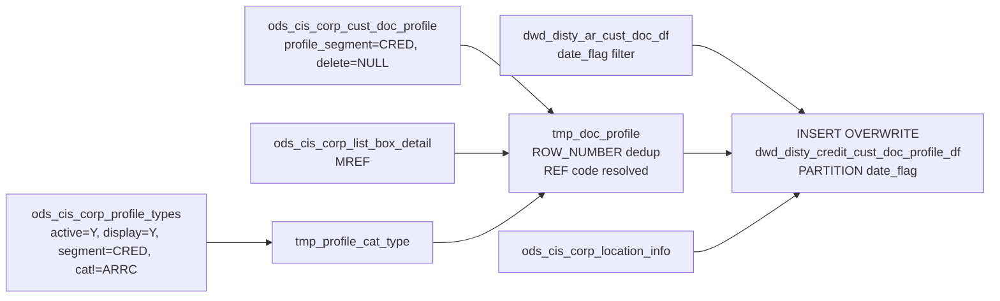

# DWD: Credit Customer Document Profile — Date-Partitioned (`dwd_disty_credit_cust_doc_profile_df`)

- artifact_type: etl_table
- artifact_id: ${target_db}.dwd_disty_credit_cust_doc_profile_df
- domain: ar
- one_line_purpose: This job extends the core AR customer document table (`dwd_disty_ar_cust_doc_df`) with active, deduplicated credit document profile attributes. It is used by the credit team to track per-document annotations, approvals, and reference data a...
- layer_type: DWD
- source_kind: etl_sql
- evidence_source: source/etl/sql/ar/data_service/ar/sql/dwd_disty_credit_cust_doc_profile_df.sql

---

## L1 Data Foundation

### Identity and physical mapping
- **Table:** `${target_db}.dwd_disty_credit_cust_doc_profile_df`
- **Layer type:** DWD
- **Canonical / derived:** Derived / ETL-loaded (see L3)
- **Owner team:** not registered in metadata catalog

### Grain, scope, exclusions
- **Grain:** one row per (AR document, credit profile type / profile-i combination) per `date_flag`.
- **Scope:** See L2 business purpose / L3 filters
- **Partition:** `date_flag`. - resolved from pipeline (see L4)
- **Natural key:** `order_type`, `order_no`, `profile_type`, `profile_i` within a `date_flag` partition.
- **Exclusions:** Not documented in repository

#### Grain detail (preserved)

- **Grain:** one row per (AR document, credit profile type / profile-i combination) per `date_flag`.
- **Partition:** `date_flag`.
- **Natural key:** `order_type`, `order_no`, `profile_type`, `profile_i` within a `date_flag` partition.

---

### Cross-engine presence
| Engine | Present | Canonical FQN | Notes |
|--------|---------|---------------|-------|
| Hive | yes | `${target_db}.dwd_disty_credit_cust_doc_profile_df` | ETL target / intermediate per evidence script |
| Vertica | pending | `${target_db}.dwd_disty_credit_cust_doc_profile_df` | Confirm via hive2vertica flow evidence / MCP |

### Physical schema reference

Pointer block only - full column catalog lives in WKB L1 storage JSON.

| Field | Value |
|-------|-------|
| **Authoritative catalog** | WKB L1 storage seed (not duplicated in this file) |
| **entity_id** | `${target_db}.dwd_disty_credit_cust_doc_profile_df` |
| **l1_catalog_seed** | `target/storage/wkb/snapshots/_snapshot_id_template/l1_catalog/{engine}_{schema}_{table}.json` |
| **column_count** | pending (run ddl_seed_writer) |
| **partition_keys** | `date_flag` |
| **ddl_source** | pending Bitbucket DDL / Vertica metadata ingest |
| **retrieval** | `python -m tools.wkb.indexing.run_query --query "ar dwd_disty_credit_cust_doc_profile_df schema" --intent find_table_schema` |

### Lineage
| Object | Role |
|--------|------|
| `${target_db}.dwd_disty_ar_cust_doc_df` | Upstream AR document detail (must run first) |
| `${source_db}.ods_cis_corp_cust_doc_profile` | Credit profile source |
| `${source_db}.ods_cis_corp_profile_types` | Profile type allowlist |

---

### Freshness and load path
| Item | Value |
|------|-------|
| Load pattern | See L3 end-to-end / INSERT pattern in evidence script |
| Schedule | Not documented in repository |
| Parameters | `source_db`, `target_db`, `date_flag` |


---

## L2 Declarative Knowledge

### Business purpose
This job extends the core AR customer document table (`dwd_disty_ar_cust_doc_df`) with active,
deduplicated credit document profile attributes. It is used by the credit team to track per-document
annotations, approvals, and reference data attached to open AR items. Each output row is one
document-profile pairing, enriched with ship-from location description.

---

### Audience and use cases
| Audience | How they benefit |
|----------|-----------------|
| **Credit team** | Profile-level annotations (e.g., reference notes, promise-to-pay details) against each open AR document |
| **Compliance / AR auditors** | Full audit trail of profile entry, update, and delete timestamps |
| **Collections** | Additional flags and descriptors on individual AR documents for collection action tracking |

---

### Fact key resolution
- Natural key: `order_type`, `order_no`, `profile_type`, `profile_i` within a `date_flag` partition.
- FK / label-on attributes: see L3 dimension join patterns and step-by-step logic.
- Negative assertion: do not treat descriptive labels as grain keys unless listed under natural key.

### Time field semantics
- **date_flag / partition columns:** `date_flag`.
- Primary reporting filter should use the partition column(s) documented in L1; resolve values via L4.


### Metrics served

| Category | Column | Logical metric | Business reading |
|----------|--------|----------------|------------------|
| Measures | — | — | No measure columns mapped for this table. |

### Metric serving map

**Formula authority:** [`source/contracts/ar/metric-index.md`](../../source/contracts/ar/metric-index.md)

N/A — no measure columns mapped for this table.

### etl_metrics

No governed logical metrics from `source/contracts/ar/metric-index.md` are mapped on this table.

---

### Metric serving map
N/A - not a `*_comb_mtd` / multi-period wide serving table (or map not present in legacy doc).


### Data products and column groups (preserved)

### Inherited from `dwd_disty_ar_cust_doc_df`

All base AR document columns are inherited: `order_type`, `order_no`, `cust_no`, `loc_no`,
`amount`, `applied`, `due_date`, `terms`, terms attributes, `usd_amt`, `usd_applied`,
`credit_analyst`, `credit_limit`, territory and division attributes, ship-to address,
`vend_no`, `vend_name`, `gl_account`, `payment_expected_date`, `date_flag`, etc.

### Credit profile columns

- `profile_no` — Profile record identifier
- `profile_type` — Resolved profile type code (`REF` types replaced with `list_box_detail.code_value`)
- `profile_cat` — Profile category
- `profile_segment` — Profile segment
- `profile_c`, `profile_i`, `profile_m`, `profile_d` — Profile payload fields (string, integer, memo, date)
- `profile_status` — Status flag
- `profile_entry_datetime`, `profile_entry_id` — Entry audit
- `profile_update_datetime`, `profile_update_id` — Update audit
- `profile_delete_datetime`, `profile_delete_id` — Soft-delete audit

### Location enrichment

- `ship_from_loc_desc` — `loc_char || '(' || loc_no || ')-' || loc_name` derived from `ods_cis_corp_location_info` on `from_loc_no`

---

### etl_metrics

#### `profile_type`
- **Source:** [metric-index.md](../../source/contracts/ar/metric-index.md#profile_type)
- **Business definition:** Resolves `REF` type to the actual reference code label from the list box
```sql
CASE WHEN pf.profile_type='REF' THEN cd.code_value ELSE pf.profile_type END
```


---

## L3 Procedural Knowledge

### Query and routing rules
**Business filters:** Use partition / date keys from L1 grain for reporting scope.
**Technical predicates (load only):** See Key filters and step-by-step logic below.

### Dimension join patterns
| Dimension FQN | Join keys | Purpose | Evidence |
|---------------|-----------|---------|----------|
| See step-by-step / base tables | See L3 steps | Dimension enrichment | `source/etl/sql/ar/data_service/ar/sql/dwd_disty_credit_cust_doc_profile_df.sql` |

### Key filters and ETL business logic
### Step 1 — `tmp_profile_cat_type`

**Source:** `${source_db}.ods_cis_corp_profile_types`

**Filter:**
- `profile_segment = 'CRED'`
- `active = 'Y'`
- `display_flag = 'Y'`
- `profile_cat != 'ARRC'`

**Output:** Distinct `(profile_cat, profile_type)` pairs that are valid for credit document annotation.

---

### Step 2 — `tmp_doc_profile`

**Source:** `${source_db}.ods_cis_corp_cust_doc_profile p`
INNER JOIN `tmp_profile_cat_type pt` (on `profile_cat`, `profile_type`)
LEFT JOIN `${source_db}.ods_cis_corp_list_box_detail cd` (`list_box_code = 'MREF'`, `cd.sequence = pf.profile_i`, `pf.profile_type = 'REF'`)

**Filter:**
- `p.profile_segment = 'CRED'`
- `p.delete_datetime IS NULL`
- `pf.rn = 1` — latest record per `(order_no, order_type, profile_type, profile_i)` by `COALESCE(update_datetime, entry_datetime) DESC, profile_no DESC`

**Derived column:**

| Column | Formula | Plain language |
|--------|---------|----------------|
| `profile_type` | `CASE WHEN pf.profile_type='REF' THEN cd.code_value ELSE pf.profile_type END` | Resolves `REF` type to the actual reference code label from the list box |

---

### Step 3 — Final `INSERT OVERWRITE` into `dwd_disty_credit_cust_doc_profile_df PARTITION(date_flag)`

**From:** `${target_db}.dwd_disty_ar_cust_doc_df ht` WHERE `date_flag = '${date_flag}'`
LEFT JOIN `tmp_doc_profile pf` ON `order_no`, `order_type`
LEFT JOIN `${source_db}.ods_cis_corp_location_info li` ON `ht.from_loc_no = li.loc_no`

**Derived column at INSERT:**

| Column | ...

### Standard time-filter SQL
```sql
-- relative period filter using resolved partition value (see L4)
SELECT *
FROM ${target_db}.dwd_disty_credit_cust_doc_profile_df
WHERE /* partition predicate */ date_flag = '${partition_value}';
```

### End-to-end flow
**Runtime parameters:** `source_db`, `target_db`, `date_flag`
**Target table:** `${target_db}.dwd_disty_credit_cust_doc_profile_df`, partitioned by **`date_flag`**.

1. Load active, displayable, non-ARRC credit profile types from `ods_cis_corp_profile_types` into `tmp_profile_cat_type`.
2. Select and deduplicate all matching document profiles from `ods_cis_corp_cust_doc_profile`, using `ROW_NUMBER()` to pick the latest by `(update_datetime, profile_no) DESC`. Left-join to `ods_cis_corp_list_box_detail` to resolve `REF`-type codes.
3. Read all AR documents for `date_flag` from `dwd_disty_ar_cust_doc_df`, left-join to `tmp_doc_profile` and `ods_cis_corp_location_info`, and insert into target.



---


#### High-level stages (preserved)

| Stage | Business meaning |
|-------|-----------------|
| **Profile type filter** | Loads active, non-ARRC credit profile types from `ods_cis_corp_profile_types` |
| **Document profile deduplication** | Picks the most-recently-updated profile record per document/profile-type/profile-i combination, resolving `REF`-type codes to their list-box descriptions |
| **Final INSERT** | Passes all columns from `dwd_disty_ar_cust_doc_df` for `date_flag`, adds deduplicated profile columns and ship-from location description |

**Parameters:** `source_db`, `target_db`, `date_flag`

---


### Base tables register
| Object | Role in this job |
|--------|-----------------|
| `${source_db}.ods_cis_corp_profile_types` | Allowlist of active, displayable credit profile types |
| `${source_db}.ods_cis_corp_cust_doc_profile` | Per-document credit profile records (source of profile payload) |
| `${source_db}.ods_cis_corp_list_box_detail` | Code-to-description lookup for `REF`-type profile types |
| `${target_db}.dwd_disty_ar_cust_doc_df` | AR document base with all document and customer attributes |
| `${source_db}.ods_cis_corp_location_info` | Ship-from location details |

**Temporary tables (inside the job only):**
`tmp_profile_cat_type` → `tmp_doc_profile` → (final `INSERT`)

---

### Step-by-step logic
### Step 1 — `tmp_profile_cat_type`

**Source:** `${source_db}.ods_cis_corp_profile_types`

**Filter:**
- `profile_segment = 'CRED'`
- `active = 'Y'`
- `display_flag = 'Y'`
- `profile_cat != 'ARRC'`

**Output:** Distinct `(profile_cat, profile_type)` pairs that are valid for credit document annotation.

---

### Step 2 — `tmp_doc_profile`

**Source:** `${source_db}.ods_cis_corp_cust_doc_profile p`
INNER JOIN `tmp_profile_cat_type pt` (on `profile_cat`, `profile_type`)
LEFT JOIN `${source_db}.ods_cis_corp_list_box_detail cd` (`list_box_code = 'MREF'`, `cd.sequence = pf.profile_i`, `pf.profile_type = 'REF'`)

**Filter:**
- `p.profile_segment = 'CRED'`
- `p.delete_datetime IS NULL`
- `pf.rn = 1` — latest record per `(order_no, order_type, profile_type, profile_i)` by `COALESCE(update_datetime, entry_datetime) DESC, profile_no DESC`

**Derived column:**

| Column | Formula | Plain language |
|--------|---------|----------------|
| `profile_type` | `CASE WHEN pf.profile_type='REF' THEN cd.code_value ELSE pf.profile_type END` | Resolves `REF` type to the actual reference code label from the list box |

---

### Step 3 — Final `INSERT OVERWRITE` into `dwd_disty_credit_cust_doc_profile_df PARTITION(date_flag)`

**From:** `${target_db}.dwd_disty_ar_cust_doc_df ht` WHERE `date_flag = '${date_flag}'`
LEFT JOIN `tmp_doc_profile pf` ON `order_no`, `order_type`
LEFT JOIN `${source_db}.ods_cis_corp_location_info li` ON `ht.from_loc_no = li.loc_no`

**Derived column at INSERT:**

| Column | Formula | Plain language |
|--------|---------|----------------|
| `ship_from_loc_desc` | `li.loc_char \|\| '(' \|\| li.loc_no \|\| ')-' \|\| li.loc_name` | Human-readable ship-from location label |

All other columns are passed through from `ht` or `pf`.

---

### Relationship map (embedded)

| from_fqn | to_fqn | cardinality | join_keys | provenance |
|----------|--------|-------------|-----------|------------|
| `ods_xx.ods_cis_corp_cust_doc_profile` | `tmp_profile_cat_type` | many:1 | `p.profile_cat = pt.profile_cat AND p.profile_type = pt.profile_type` | etl_sql (source/etl/sql/ar/data_service/ar/sql/dwd_disty_credit_cust_doc_profile_df.sql:1) |
| `ods_xx.ods_cis_corp_profile_types` | `ods_xx.ods_cis_corp_list_box_detail` | many:1 | `cd.list_box_code = 'MREF' AND cd.delete_id is null AND cd.sequence = pf.profile_i AND pf.profile_type='REF'` | etl_sql (source/etl/sql/ar/data_service/ar/sql/dwd_disty_credit_cust_doc_profile_df.sql:1) |
| `dw_xx.dwd_disty_ar_cust_doc_df` | `tmp_doc_profile` | many:1 | `ht.order_no = pf.order_no AND ht.order_type = pf.order_type` | etl_sql (source/etl/sql/ar/data_service/ar/sql/dwd_disty_credit_cust_doc_profile_df.sql:1) |
| `dw_xx.dwd_disty_ar_cust_doc_df` | `ods_xx.ods_cis_corp_location_info` | many:1 | `ht.from_loc_no = li.loc_no` | etl_sql (source/etl/sql/ar/data_service/ar/sql/dwd_disty_credit_cust_doc_profile_df.sql:1) |

`source/ref/ar/table relationship.txt`: Not documented in repository.

### Special logic (embedded)

Not documented in repository

### Column / field derivations (from ETL SQL)

| target_column | expression_sql | upstream_columns | upstream_tables | transform_kind | evidence |
|---------------|----------------|------------------|-----------------|----------------|----------|
| `order_type` | `ht.order_type` | `order_type` | `${target_db}.dwd_disty_ar_cust_doc_df`, `tmp_doc_profile`, `${source_db}.ods_cis_corp_location_info` | passthrough | `source/etl/sql/ar/data_service/ar/sql/dwd_disty_credit_cust_doc_profile_df.sql:58` |
| `order_no` | `ht.order_no` | `order_no` | `${target_db}.dwd_disty_ar_cust_doc_df`, `tmp_doc_profile`, `${source_db}.ods_cis_corp_location_info` | passthrough | `source/etl/sql/ar/data_service/ar/sql/dwd_disty_credit_cust_doc_profile_df.sql:59` |
| `cust_no` | `ht.cust_no` | `cust_no` | `${target_db}.dwd_disty_ar_cust_doc_df`, `tmp_doc_profile`, `${source_db}.ods_cis_corp_location_info` | passthrough | `source/etl/sql/ar/data_service/ar/sql/dwd_disty_credit_cust_doc_profile_df.sql:60` |
| `loc_no` | `ht.loc_no` | `loc_no` | `${target_db}.dwd_disty_ar_cust_doc_df`, `tmp_doc_profile`, `${source_db}.ods_cis_corp_location_info` | passthrough | `source/etl/sql/ar/data_service/ar/sql/dwd_disty_credit_cust_doc_profile_df.sql:61` |
| `amount` | `ht.amount` | `amount` | `${target_db}.dwd_disty_ar_cust_doc_df`, `tmp_doc_profile`, `${source_db}.ods_cis_corp_location_info` | passthrough | `source/etl/sql/ar/data_service/ar/sql/dwd_disty_credit_cust_doc_profile_df.sql:62` |
| `amt_current` | `ht.amt_current` | `amt_current` | `${target_db}.dwd_disty_ar_cust_doc_df`, `tmp_doc_profile`, `${source_db}.ods_cis_corp_location_info` | passthrough | `source/etl/sql/ar/data_service/ar/sql/dwd_disty_credit_cust_doc_profile_df.sql:63` |
| `doc_date` | `ht.doc_date` | `doc_date` | `${target_db}.dwd_disty_ar_cust_doc_df`, `tmp_doc_profile`, `${source_db}.ods_cis_corp_location_info` | passthrough | `source/etl/sql/ar/data_service/ar/sql/dwd_disty_credit_cust_doc_profile_df.sql:64` |
| `close_date` | `ht.close_date` | `close_date` | `${target_db}.dwd_disty_ar_cust_doc_df`, `tmp_doc_profile`, `${source_db}.ods_cis_corp_location_info` | passthrough | `source/etl/sql/ar/data_service/ar/sql/dwd_disty_credit_cust_doc_profile_df.sql:65` |
| `applied` | `ht.applied` | `applied` | `${target_db}.dwd_disty_ar_cust_doc_df`, `tmp_doc_profile`, `${source_db}.ods_cis_corp_location_info` | passthrough | `source/etl/sql/ar/data_service/ar/sql/dwd_disty_credit_cust_doc_profile_df.sql:66` |
| `due_date` | `ht.due_date` | `due_date` | `${target_db}.dwd_disty_ar_cust_doc_df`, `tmp_doc_profile`, `${source_db}.ods_cis_corp_location_info` | passthrough | `source/etl/sql/ar/data_service/ar/sql/dwd_disty_credit_cust_doc_profile_df.sql:67` |
| `reference` | `ht.reference` | `reference` | `${target_db}.dwd_disty_ar_cust_doc_df`, `tmp_doc_profile`, `${source_db}.ods_cis_corp_location_info` | passthrough | `source/etl/sql/ar/data_service/ar/sql/dwd_disty_credit_cust_doc_profile_df.sql:68` |
| `terms` | `ht.terms` | `terms` | `${target_db}.dwd_disty_ar_cust_doc_df`, `tmp_doc_profile`, `${source_db}.ods_cis_corp_location_info` | passthrough | `source/etl/sql/ar/data_service/ar/sql/dwd_disty_credit_cust_doc_profile_df.sql:69` |
| `terms_desc` | `ht.terms_desc` | `terms_desc` | `${target_db}.dwd_disty_ar_cust_doc_df`, `tmp_doc_profile`, `${source_db}.ods_cis_corp_location_info` | passthrough | `source/etl/sql/ar/data_service/ar/sql/dwd_disty_credit_cust_doc_profile_df.sql:70` |
| `terms_days` | `ht.terms_days` | `terms_days` | `${target_db}.dwd_disty_ar_cust_doc_df`, `tmp_doc_profile`, `${source_db}.ods_cis_corp_location_info` | passthrough | `source/etl/sql/ar/data_service/ar/sql/dwd_disty_credit_cust_doc_profile_df.sql:71` |
| `disc_percent` | `ht.disc_percent` | `disc_percent` | `${target_db}.dwd_disty_ar_cust_doc_df`, `tmp_doc_profile`, `${source_db}.ods_cis_corp_location_info` | passthrough | `source/etl/sql/ar/data_service/ar/sql/dwd_disty_credit_cust_doc_profile_df.sql:72` |
| `disc_days` | `ht.disc_days` | `disc_days` | `${target_db}.dwd_disty_ar_cust_doc_df`, `tmp_doc_profile`, `${source_db}.ods_cis_corp_location_info` | passthrough | `source/etl/sql/ar/data_service/ar/sql/dwd_disty_credit_cust_doc_profile_df.sql:73` |
| `terms_type` | `ht.terms_type` | `terms_type` | `${target_db}.dwd_disty_ar_cust_doc_df`, `tmp_doc_profile`, `${source_db}.ods_cis_corp_location_info` | passthrough | `source/etl/sql/ar/data_service/ar/sql/dwd_disty_credit_cust_doc_profile_df.sql:74` |
| `terms_group` | `ht.terms_group` | `terms_group` | `${target_db}.dwd_disty_ar_cust_doc_df`, `tmp_doc_profile`, `${source_db}.ods_cis_corp_location_info` | passthrough | `source/etl/sql/ar/data_service/ar/sql/dwd_disty_credit_cust_doc_profile_df.sql:75` |
| `entry_datetime` | `ht.entry_datetime` | `entry_datetime` | `${target_db}.dwd_disty_ar_cust_doc_df`, `tmp_doc_profile`, `${source_db}.ods_cis_corp_location_info` | passthrough | `source/etl/sql/ar/data_service/ar/sql/dwd_disty_credit_cust_doc_profile_df.sql:76` |
| `entry_id` | `ht.entry_id` | `entry_id` | `${target_db}.dwd_disty_ar_cust_doc_df`, `tmp_doc_profile`, `${source_db}.ods_cis_corp_location_info` | passthrough | `source/etl/sql/ar/data_service/ar/sql/dwd_disty_credit_cust_doc_profile_df.sql:77` |
| `entry_name` | `ht.entry_name` | `entry_name` | `${target_db}.dwd_disty_ar_cust_doc_df`, `tmp_doc_profile`, `${source_db}.ods_cis_corp_location_info` | passthrough | `source/etl/sql/ar/data_service/ar/sql/dwd_disty_credit_cust_doc_profile_df.sql:78` |
| `me_applied` | `ht.me_applied` | `me_applied` | `${target_db}.dwd_disty_ar_cust_doc_df`, `tmp_doc_profile`, `${source_db}.ods_cis_corp_location_info` | passthrough | `source/etl/sql/ar/data_service/ar/sql/dwd_disty_credit_cust_doc_profile_df.sql:79` |
| `credit_code` | `ht.credit_code` | `credit_code` | `${target_db}.dwd_disty_ar_cust_doc_df`, `tmp_doc_profile`, `${source_db}.ods_cis_corp_location_info` | passthrough | `source/etl/sql/ar/data_service/ar/sql/dwd_disty_credit_cust_doc_profile_df.sql:80` |
| `snap_date` | `ht.snap_date` | `snap_date` | `${target_db}.dwd_disty_ar_cust_doc_df`, `tmp_doc_profile`, `${source_db}.ods_cis_corp_location_info` | passthrough | `source/etl/sql/ar/data_service/ar/sql/dwd_disty_credit_cust_doc_profile_df.sql:81` |
| `usd_amt` | `ht.usd_amt` | `usd_amt` | `${target_db}.dwd_disty_ar_cust_doc_df`, `tmp_doc_profile`, `${source_db}.ods_cis_corp_location_info` | passthrough | `source/etl/sql/ar/data_service/ar/sql/dwd_disty_credit_cust_doc_profile_df.sql:82` |
| `usd_applied` | `ht.usd_applied` | `usd_applied` | `${target_db}.dwd_disty_ar_cust_doc_df`, `tmp_doc_profile`, `${source_db}.ods_cis_corp_location_info` | passthrough | `source/etl/sql/ar/data_service/ar/sql/dwd_disty_credit_cust_doc_profile_df.sql:83` |
| `reference2` | `ht.reference2` | `reference2` | `${target_db}.dwd_disty_ar_cust_doc_df`, `tmp_doc_profile`, `${source_db}.ods_cis_corp_location_info` | passthrough | `source/etl/sql/ar/data_service/ar/sql/dwd_disty_credit_cust_doc_profile_df.sql:84` |
| `company_no` | `ht.company_no` | `company_no` | `${target_db}.dwd_disty_ar_cust_doc_df`, `tmp_doc_profile`, `${source_db}.ods_cis_corp_location_info` | passthrough | `source/etl/sql/ar/data_service/ar/sql/dwd_disty_credit_cust_doc_profile_df.sql:85` |
| `fx_currency` | `ht.fx_currency` | `fx_currency` | `${target_db}.dwd_disty_ar_cust_doc_df`, `tmp_doc_profile`, `${source_db}.ods_cis_corp_location_info` | passthrough | `source/etl/sql/ar/data_service/ar/sql/dwd_disty_credit_cust_doc_profile_df.sql:86` |
| `disc_amt_used` | `ht.disc_amt_used` | `disc_amt_used` | `${target_db}.dwd_disty_ar_cust_doc_df`, `tmp_doc_profile`, `${source_db}.ods_cis_corp_location_info` | passthrough | `source/etl/sql/ar/data_service/ar/sql/dwd_disty_credit_cust_doc_profile_df.sql:87` |
| `usd_disc_amt_used` | `ht.usd_disc_amt_used` | `usd_disc_amt_used` | `${target_db}.dwd_disty_ar_cust_doc_df`, `tmp_doc_profile`, `${source_db}.ods_cis_corp_location_info` | passthrough | `source/etl/sql/ar/data_service/ar/sql/dwd_disty_credit_cust_doc_profile_df.sql:88` |
| `due_date_agedays` | `ht.due_date_agedays` | `due_date_agedays` | `${target_db}.dwd_disty_ar_cust_doc_df`, `tmp_doc_profile`, `${source_db}.ods_cis_corp_location_info` | passthrough | `source/etl/sql/ar/data_service/ar/sql/dwd_disty_credit_cust_doc_profile_df.sql:89` |
| `doc_date_agedays` | `ht.doc_date_agedays` | `doc_date_agedays` | `${target_db}.dwd_disty_ar_cust_doc_df`, `tmp_doc_profile`, `${source_db}.ods_cis_corp_location_info` | passthrough | `source/etl/sql/ar/data_service/ar/sql/dwd_disty_credit_cust_doc_profile_df.sql:90` |
| `finance_mcust_no` | `ht.finance_mcust_no` | `finance_mcust_no` | `${target_db}.dwd_disty_ar_cust_doc_df`, `tmp_doc_profile`, `${source_db}.ods_cis_corp_location_info` | passthrough | `source/etl/sql/ar/data_service/ar/sql/dwd_disty_credit_cust_doc_profile_df.sql:91` |
| `mcust_no` | `ht.mcust_no` | `mcust_no` | `${target_db}.dwd_disty_ar_cust_doc_df`, `tmp_doc_profile`, `${source_db}.ods_cis_corp_location_info` | passthrough | `source/etl/sql/ar/data_service/ar/sql/dwd_disty_credit_cust_doc_profile_df.sql:92` |
| `sales_terr` | `ht.sales_terr` | `sales_terr` | `${target_db}.dwd_disty_ar_cust_doc_df`, `tmp_doc_profile`, `${source_db}.ods_cis_corp_location_info` | passthrough | `source/etl/sql/ar/data_service/ar/sql/dwd_disty_credit_cust_doc_profile_df.sql:93` |
| `terr_name` | `ht.terr_name` | `terr_name` | `${target_db}.dwd_disty_ar_cust_doc_df`, `tmp_doc_profile`, `${source_db}.ods_cis_corp_location_info` | passthrough | `source/etl/sql/ar/data_service/ar/sql/dwd_disty_credit_cust_doc_profile_df.sql:94` |
| `cust_type` | `ht.cust_type` | `cust_type` | `${target_db}.dwd_disty_ar_cust_doc_df`, `tmp_doc_profile`, `${source_db}.ods_cis_corp_location_info` | passthrough | `source/etl/sql/ar/data_service/ar/sql/dwd_disty_credit_cust_doc_profile_df.sql:95` |
| `cust_type_desc` | `ht.cust_type_desc` | `cust_type_desc` | `${target_db}.dwd_disty_ar_cust_doc_df`, `tmp_doc_profile`, `${source_db}.ods_cis_corp_location_info` | passthrough | `source/etl/sql/ar/data_service/ar/sql/dwd_disty_credit_cust_doc_profile_df.sql:96` |
| `division` | `ht.division` | `division` | `${target_db}.dwd_disty_ar_cust_doc_df`, `tmp_doc_profile`, `${source_db}.ods_cis_corp_location_info` | passthrough | `source/etl/sql/ar/data_service/ar/sql/dwd_disty_credit_cust_doc_profile_df.sql:97` |
| `division_desc` | `ht.division_desc` | `division_desc` | `${target_db}.dwd_disty_ar_cust_doc_df`, `tmp_doc_profile`, `${source_db}.ods_cis_corp_location_info` | passthrough | `source/etl/sql/ar/data_service/ar/sql/dwd_disty_credit_cust_doc_profile_df.sql:98` |
| `default_terms` | `ht.default_terms` | `default_terms` | `${target_db}.dwd_disty_ar_cust_doc_df`, `tmp_doc_profile`, `${source_db}.ods_cis_corp_location_info` | passthrough | `source/etl/sql/ar/data_service/ar/sql/dwd_disty_credit_cust_doc_profile_df.sql:99` |
| `region` | `ht.region` | `region` | `${target_db}.dwd_disty_ar_cust_doc_df`, `tmp_doc_profile`, `${source_db}.ods_cis_corp_location_info` | passthrough | `source/etl/sql/ar/data_service/ar/sql/dwd_disty_credit_cust_doc_profile_df.sql:100` |
| `credit_analyst` | `ht.credit_analyst` | `credit_analyst` | `${target_db}.dwd_disty_ar_cust_doc_df`, `tmp_doc_profile`, `${source_db}.ods_cis_corp_location_info` | passthrough | `source/etl/sql/ar/data_service/ar/sql/dwd_disty_credit_cust_doc_profile_df.sql:101` |
| `credit_analyst_name` | `ht.credit_analyst_name` | `credit_analyst_name` | `${target_db}.dwd_disty_ar_cust_doc_df`, `tmp_doc_profile`, `${source_db}.ods_cis_corp_location_info` | passthrough | `source/etl/sql/ar/data_service/ar/sql/dwd_disty_credit_cust_doc_profile_df.sql:102` |
| `program_analyst` | `ht.program_analyst` | `program_analyst` | `${target_db}.dwd_disty_ar_cust_doc_df`, `tmp_doc_profile`, `${source_db}.ods_cis_corp_location_info` | passthrough | `source/etl/sql/ar/data_service/ar/sql/dwd_disty_credit_cust_doc_profile_df.sql:103` |
| `program_analyst_name` | `ht.program_analyst_name` | `program_analyst_name` | `${target_db}.dwd_disty_ar_cust_doc_df`, `tmp_doc_profile`, `${source_db}.ods_cis_corp_location_info` | passthrough | `source/etl/sql/ar/data_service/ar/sql/dwd_disty_credit_cust_doc_profile_df.sql:104` |
| `service_analyst` | `ht.service_analyst` | `service_analyst` | `${target_db}.dwd_disty_ar_cust_doc_df`, `tmp_doc_profile`, `${source_db}.ods_cis_corp_location_info` | passthrough | `source/etl/sql/ar/data_service/ar/sql/dwd_disty_credit_cust_doc_profile_df.sql:105` |
| `service_analyst_name` | `ht.service_analyst_name` | `service_analyst_name` | `${target_db}.dwd_disty_ar_cust_doc_df`, `tmp_doc_profile`, `${source_db}.ods_cis_corp_location_info` | passthrough | `source/etl/sql/ar/data_service/ar/sql/dwd_disty_credit_cust_doc_profile_df.sql:106` |
| `collector_id` | `ht.collector_id` | `collector_id` | `${target_db}.dwd_disty_ar_cust_doc_df`, `tmp_doc_profile`, `${source_db}.ods_cis_corp_location_info` | passthrough | `source/etl/sql/ar/data_service/ar/sql/dwd_disty_credit_cust_doc_profile_df.sql:107` |
| `collector_name` | `ht.collector_name` | `collector_name` | `${target_db}.dwd_disty_ar_cust_doc_df`, `tmp_doc_profile`, `${source_db}.ods_cis_corp_location_info` | passthrough | `source/etl/sql/ar/data_service/ar/sql/dwd_disty_credit_cust_doc_profile_df.sql:108` |
| `release_code` | `ht.release_code` | `release_code` | `${target_db}.dwd_disty_ar_cust_doc_df`, `tmp_doc_profile`, `${source_db}.ods_cis_corp_location_info` | passthrough | `source/etl/sql/ar/data_service/ar/sql/dwd_disty_credit_cust_doc_profile_df.sql:109` |
| `credit_limit` | `ht.credit_limit` | `credit_limit` | `${target_db}.dwd_disty_ar_cust_doc_df`, `tmp_doc_profile`, `${source_db}.ods_cis_corp_location_info` | passthrough | `source/etl/sql/ar/data_service/ar/sql/dwd_disty_credit_cust_doc_profile_df.sql:110` |
| `next_review` | `ht.next_review` | `next_review` | `${target_db}.dwd_disty_ar_cust_doc_df`, `tmp_doc_profile`, `${source_db}.ods_cis_corp_location_info` | passthrough | `source/etl/sql/ar/data_service/ar/sql/dwd_disty_credit_cust_doc_profile_df.sql:111` |
| `pending_amt` | `ht.pending_amt` | `pending_amt` | `${target_db}.dwd_disty_ar_cust_doc_df`, `tmp_doc_profile`, `${source_db}.ods_cis_corp_location_info` | passthrough | `source/etl/sql/ar/data_service/ar/sql/dwd_disty_credit_cust_doc_profile_df.sql:112` |
| `order_type_desc` | `ht.order_type_desc` | `order_type_desc` | `${target_db}.dwd_disty_ar_cust_doc_df`, `tmp_doc_profile`, `${source_db}.ods_cis_corp_location_info` | passthrough | `source/etl/sql/ar/data_service/ar/sql/dwd_disty_credit_cust_doc_profile_df.sql:113` |
| `contact_name` | `ht.contact_name` | `contact_name` | `${target_db}.dwd_disty_ar_cust_doc_df`, `tmp_doc_profile`, `${source_db}.ods_cis_corp_location_info` | passthrough | `source/etl/sql/ar/data_service/ar/sql/dwd_disty_credit_cust_doc_profile_df.sql:114` |
| `ship_to_name` | `ht.ship_to_name` | `ship_to_name` | `${target_db}.dwd_disty_ar_cust_doc_df`, `tmp_doc_profile`, `${source_db}.ods_cis_corp_location_info` | passthrough | `source/etl/sql/ar/data_service/ar/sql/dwd_disty_credit_cust_doc_profile_df.sql:115` |
| `ship_to_addr` | `ht.ship_to_addr` | `ship_to_addr` | `${target_db}.dwd_disty_ar_cust_doc_df`, `tmp_doc_profile`, `${source_db}.ods_cis_corp_location_info` | passthrough | `source/etl/sql/ar/data_service/ar/sql/dwd_disty_credit_cust_doc_profile_df.sql:116` |
| `ship_to_state` | `ht.ship_to_state` | `ship_to_state` | `${target_db}.dwd_disty_ar_cust_doc_df`, `tmp_doc_profile`, `${source_db}.ods_cis_corp_location_info` | passthrough | `source/etl/sql/ar/data_service/ar/sql/dwd_disty_credit_cust_doc_profile_df.sql:117` |
| `ship_to_country` | `ht.ship_to_country` | `ship_to_country` | `${target_db}.dwd_disty_ar_cust_doc_df`, `tmp_doc_profile`, `${source_db}.ods_cis_corp_location_info` | passthrough | `source/etl/sql/ar/data_service/ar/sql/dwd_disty_credit_cust_doc_profile_df.sql:118` |
| `ship_to_city` | `ht.ship_to_city` | `ship_to_city` | `${target_db}.dwd_disty_ar_cust_doc_df`, `tmp_doc_profile`, `${source_db}.ods_cis_corp_location_info` | passthrough | `source/etl/sql/ar/data_service/ar/sql/dwd_disty_credit_cust_doc_profile_df.sql:119` |
| `ship_to_zip` | `ht.ship_to_zip` | `ship_to_zip` | `${target_db}.dwd_disty_ar_cust_doc_df`, `tmp_doc_profile`, `${source_db}.ods_cis_corp_location_info` | passthrough | `source/etl/sql/ar/data_service/ar/sql/dwd_disty_credit_cust_doc_profile_df.sql:120` |
| `from_loc_no` | `ht.from_loc_no` | `from_loc_no` | `${target_db}.dwd_disty_ar_cust_doc_df`, `tmp_doc_profile`, `${source_db}.ods_cis_corp_location_info` | passthrough | `source/etl/sql/ar/data_service/ar/sql/dwd_disty_credit_cust_doc_profile_df.sql:121` |
| `ship_from_loc_desc` | `li.loc_char \|\| '(' \|\| li.loc_no \|\| ')-' \|\| li.loc_name` | `loc_char`, `loc_no`, `loc_name` | `${target_db}.dwd_disty_ar_cust_doc_df`, `tmp_doc_profile`, `${source_db}.ods_cis_corp_location_info` | arithmetic | `source/etl/sql/ar/data_service/ar/sql/dwd_disty_credit_cust_doc_profile_df.sql:122` |
| `drop_ship` | `ht.drop_ship` | `drop_ship` | `${target_db}.dwd_disty_ar_cust_doc_df`, `tmp_doc_profile`, `${source_db}.ods_cis_corp_location_info` | passthrough | `source/etl/sql/ar/data_service/ar/sql/dwd_disty_credit_cust_doc_profile_df.sql:123` |
| `end_user_po` | `ht.end_user_po` | `end_user_po` | `${target_db}.dwd_disty_ar_cust_doc_df`, `tmp_doc_profile`, `${source_db}.ods_cis_corp_location_info` | passthrough | `source/etl/sql/ar/data_service/ar/sql/dwd_disty_credit_cust_doc_profile_df.sql:124` |
| `vend_no` | `ht.vend_no` | `vend_no` | `${target_db}.dwd_disty_ar_cust_doc_df`, `tmp_doc_profile`, `${source_db}.ods_cis_corp_location_info` | passthrough | `source/etl/sql/ar/data_service/ar/sql/dwd_disty_credit_cust_doc_profile_df.sql:125` |
| `vend_name` | `ht.vend_name` | `vend_name` | `${target_db}.dwd_disty_ar_cust_doc_df`, `tmp_doc_profile`, `${source_db}.ods_cis_corp_location_info` | passthrough | `source/etl/sql/ar/data_service/ar/sql/dwd_disty_credit_cust_doc_profile_df.sql:126` |
| `commission_amt` | `ht.commission_amt` | `commission_amt` | `${target_db}.dwd_disty_ar_cust_doc_df`, `tmp_doc_profile`, `${source_db}.ods_cis_corp_location_info` | passthrough | `source/etl/sql/ar/data_service/ar/sql/dwd_disty_credit_cust_doc_profile_df.sql:127` |
| `fx_rate` | `ht.fx_rate` | `fx_rate` | `${target_db}.dwd_disty_ar_cust_doc_df`, `tmp_doc_profile`, `${source_db}.ods_cis_corp_location_info` | passthrough | `source/etl/sql/ar/data_service/ar/sql/dwd_disty_credit_cust_doc_profile_df.sql:128` |
| `gl_account` | `ht.gl_account` | `gl_account` | `${target_db}.dwd_disty_ar_cust_doc_df`, `tmp_doc_profile`, `${source_db}.ods_cis_corp_location_info` | passthrough | `source/etl/sql/ar/data_service/ar/sql/dwd_disty_credit_cust_doc_profile_df.sql:129` |
| `payment_expected_date` | `ht.payment_expected_date` | `payment_expected_date` | `${target_db}.dwd_disty_ar_cust_doc_df`, `tmp_doc_profile`, `${source_db}.ods_cis_corp_location_info` | passthrough | `source/etl/sql/ar/data_service/ar/sql/dwd_disty_credit_cust_doc_profile_df.sql:130` |
| `profile_no` | `pf.profile_no` | `profile_no` | `${target_db}.dwd_disty_ar_cust_doc_df`, `tmp_doc_profile`, `${source_db}.ods_cis_corp_location_info` | passthrough | `source/etl/sql/ar/data_service/ar/sql/dwd_disty_credit_cust_doc_profile_df.sql:16` |
| `profile_type` | `pf.profile_type` | `profile_type` | `${target_db}.dwd_disty_ar_cust_doc_df`, `tmp_doc_profile`, `${source_db}.ods_cis_corp_location_info` | passthrough | `source/etl/sql/ar/data_service/ar/sql/dwd_disty_credit_cust_doc_profile_df.sql:17` |
| `profile_cat` | `pf.profile_cat` | `profile_cat` | `${target_db}.dwd_disty_ar_cust_doc_df`, `tmp_doc_profile`, `${source_db}.ods_cis_corp_location_info` | passthrough | `source/etl/sql/ar/data_service/ar/sql/dwd_disty_credit_cust_doc_profile_df.sql:18` |
| `profile_segment` | `pf.profile_segment` | `profile_segment` | `${target_db}.dwd_disty_ar_cust_doc_df`, `tmp_doc_profile`, `${source_db}.ods_cis_corp_location_info` | passthrough | `source/etl/sql/ar/data_service/ar/sql/dwd_disty_credit_cust_doc_profile_df.sql:19` |
| `profile_c` | `pf.profile_c` | `profile_c` | `${target_db}.dwd_disty_ar_cust_doc_df`, `tmp_doc_profile`, `${source_db}.ods_cis_corp_location_info` | passthrough | `source/etl/sql/ar/data_service/ar/sql/dwd_disty_credit_cust_doc_profile_df.sql:18` |
| `profile_i` | `pf.profile_i` | `profile_i` | `${target_db}.dwd_disty_ar_cust_doc_df`, `tmp_doc_profile`, `${source_db}.ods_cis_corp_location_info` | passthrough | `source/etl/sql/ar/data_service/ar/sql/dwd_disty_credit_cust_doc_profile_df.sql:21` |
| `profile_m` | `pf.profile_m` | `profile_m` | `${target_db}.dwd_disty_ar_cust_doc_df`, `tmp_doc_profile`, `${source_db}.ods_cis_corp_location_info` | passthrough | `source/etl/sql/ar/data_service/ar/sql/dwd_disty_credit_cust_doc_profile_df.sql:22` |
| `profile_d` | `pf.profile_d` | `profile_d` | `${target_db}.dwd_disty_ar_cust_doc_df`, `tmp_doc_profile`, `${source_db}.ods_cis_corp_location_info` | passthrough | `source/etl/sql/ar/data_service/ar/sql/dwd_disty_credit_cust_doc_profile_df.sql:23` |
| `profile_status` | `pf.status` | `status` | `${target_db}.dwd_disty_ar_cust_doc_df`, `tmp_doc_profile`, `${source_db}.ods_cis_corp_location_info` | rename | `source/etl/sql/ar/data_service/ar/sql/dwd_disty_credit_cust_doc_profile_df.sql:24` |
| `profile_entry_datetime` | `pf.entry_datetime` | `entry_datetime` | `${target_db}.dwd_disty_ar_cust_doc_df`, `tmp_doc_profile`, `${source_db}.ods_cis_corp_location_info` | rename | `source/etl/sql/ar/data_service/ar/sql/dwd_disty_credit_cust_doc_profile_df.sql:25` |
| `profile_entry_id` | `pf.entry_id` | `entry_id` | `${target_db}.dwd_disty_ar_cust_doc_df`, `tmp_doc_profile`, `${source_db}.ods_cis_corp_location_info` | rename | `source/etl/sql/ar/data_service/ar/sql/dwd_disty_credit_cust_doc_profile_df.sql:26` |
| `profile_update_datetime` | `pf.update_datetime` | `update_datetime` | `${target_db}.dwd_disty_ar_cust_doc_df`, `tmp_doc_profile`, `${source_db}.ods_cis_corp_location_info` | rename | `source/etl/sql/ar/data_service/ar/sql/dwd_disty_credit_cust_doc_profile_df.sql:27` |
| `profile_update_id` | `pf.update_id` | `update_id` | `${target_db}.dwd_disty_ar_cust_doc_df`, `tmp_doc_profile`, `${source_db}.ods_cis_corp_location_info` | rename | `source/etl/sql/ar/data_service/ar/sql/dwd_disty_credit_cust_doc_profile_df.sql:28` |
| `profile_delete_datetime` | `pf.delete_datetime` | `delete_datetime` | `${target_db}.dwd_disty_ar_cust_doc_df`, `tmp_doc_profile`, `${source_db}.ods_cis_corp_location_info` | rename | `source/etl/sql/ar/data_service/ar/sql/dwd_disty_credit_cust_doc_profile_df.sql:29` |
| `profile_delete_id` | `pf.delete_id` | `delete_id` | `${target_db}.dwd_disty_ar_cust_doc_df`, `tmp_doc_profile`, `${source_db}.ods_cis_corp_location_info` | rename | `source/etl/sql/ar/data_service/ar/sql/dwd_disty_credit_cust_doc_profile_df.sql:30` |
| `date_flag` | `ht.date_flag` | `date_flag` | `${target_db}.dwd_disty_ar_cust_doc_df`, `tmp_doc_profile`, `${source_db}.ods_cis_corp_location_info` | passthrough | `source/etl/sql/ar/data_service/ar/sql/dwd_disty_credit_cust_doc_profile_df.sql:147` |

### Sentinel and code values
| Value | Meaning |
|-------|---------|
| `profile_cat != 'ARRC'` | Excludes ARRC category profiles from the allowlist |
| `profile_type = 'REF'` + `list_box_code = 'MREF'` | REF-type profiles are resolved to their descriptive code via the list-box lookup |
| `delete_datetime IS NULL` | Only non-deleted profile records are included |

---

---

## L4 Validation

### Resolved partition value
| Step | Source | How partition / date scope is determined |
|------|--------|------------------------------------------|
| 1 | evidence script / flow | See parameters in L1 Freshness and L3 filters - `source/etl/sql/ar/data_service/ar/sql/dwd_disty_credit_cust_doc_profile_df.sql` |

**Plain language:** Partition and date scope follow Azkaban/bootstrap parameters documented in the source script and orchestrating flow; do not hardcode calendar literals.

### Data quality checks
- Prefer row-count-by-partition, metric sums, and grain duplicate checks (see Validation SQL).
- Additional checks from legacy caveats / operational notes when present.

### Validation SQL
```sql
-- 1) row count by partition
-- SELECT partition_col, COUNT(*) FROM ${target_db}.dwd_disty_credit_cust_doc_profile_df WHERE partition_col = '${partition_value}' GROUP BY 1;
-- 2) metric sum by dimension (top N) - replace metric/dim from L2
-- 3) grain duplicate check on natural keys
```


### Caveats for interpretation
- The output can have **multiple rows per document** — one per active credit profile type/profile-i combination. Consumers must account for this fan-out when joining.
- Only `profile_segment = 'CRED'` profiles are included; other profile segments are excluded.
- The `rn = 1` deduplication picks the single most recent update for each `(order_no, order_type, profile_type, profile_i)` combination. Multiple active profiles of the same type but different `profile_i` values produce separate rows.
- Documents without any matching credit profile will still appear in the output (with NULL profile columns) due to the LEFT JOIN on `tmp_doc_profile`.

---

### Conflicts and open questions
- Schedule, owner, SLA: Not documented in repository (unless preserved schedule evidence above).
- Vertica MCP verification: pending unless confirmed in L5.


---

## L5 Runtime View

### Query path and engine preference
| Role | Hive object | Vertica object | Sync mode | Evidence | MCP verified |
|------|-------------|----------------|-----------|----------|--------------|
| **Not in Vertica** | *See script lineage* | *No Vertica mapping identified in repository* | - | *Add flow evidence when found* | no |

No queryable Vertica table has been confirmed for this script from current repository evidence.

### Access constraints
- Country / company schema parameters may apply (`literal_country`, `company_no`, etc.).
- Hive-only staging objects are not reporting surfaces unless synced.

### Query risk profile
| Field | Value |
|-------|-------|
| requires_date_predicate | yes |
| scan_risk_tier | high |

---

## L6 Access and Consumption

### Primary consumers and use cases
| Audience | How they benefit |
|----------|-----------------|
| **Credit team** | Profile-level annotations (e.g., reference notes, promise-to-pay details) against each open AR document |
| **Compliance / AR auditors** | Full audit trail of profile entry, update, and delete timestamps |
| **Collections** | Additional flags and descriptors on individual AR documents for collection action tracking |

---

### Representative query patterns
```sql
-- certified / illustrative lookup - replace predicates from L1/L4
SELECT *
FROM ${target_db}.dwd_disty_credit_cust_doc_profile_df
WHERE date_flag = '${partition_value}'
LIMIT 100;
```

### Dependencies and notes
### Upstream objects (verified)

| Object | Usage | Evidence |
|--------|-------|----------|
| `${target_db}.dwd_disty_ar_cust_doc_df` | AR document base | `source/etl/sql/ar/data_service/ar/sql/dwd_disty_credit_cust_doc_profile_df.sql:149` |
| `${source_db}.ods_cis_corp_cust_doc_profile` | Credit profile source | `source/etl/sql/ar/data_service/ar/sql/dwd_disty_credit_cust_doc_profile_df.sql:40` |
| `${source_db}.ods_cis_corp_profile_types` | Profile type allowlist | `source/etl/sql/ar/data_service/ar/sql/dwd_disty_credit_cust_doc_profile_df.sql:5` |
| `${source_db}.ods_cis_corp_list_box_detail` | REF code resolution | `source/etl/sql/ar/data_service/ar/sql/dwd_disty_credit_cust_doc_profile_df.sql:47` |
| `${source_db}.ods_cis_corp_location_info` | Ship-from location | `source/etl/sql/ar/data_service/ar/sql/dwd_disty_credit_cust_doc_profile_df.sql:152` |

### Downstream consumers (verified)

None identified in repository.

### Operational detail (verified)

- Partitioned by `date_flag` (INSERT OVERWRITE PARTITION): `source/etl/sql/ar/data_service/ar/sql/dwd_disty_credit_cust_doc_profile_df.sql:56`

### Not documented in repository

- Schedule, owner, SLA — not in scripts or configs

---

*Document generated from `source/etl/sql/ar/data_service/ar/sql/dwd_disty_credit_cust_doc_profile_df.sql`.*

#### Not documented in repository
- Owner, SLA (unless schedule evidence preserved above)
- Any dependency without `file:line` evidence in this document

---

*Document migrated to L1-L6 from legacy Knowledgebase content. Evidence: `source/etl/sql/ar/data_service/ar/sql/dwd_disty_credit_cust_doc_profile_df.sql`.*
