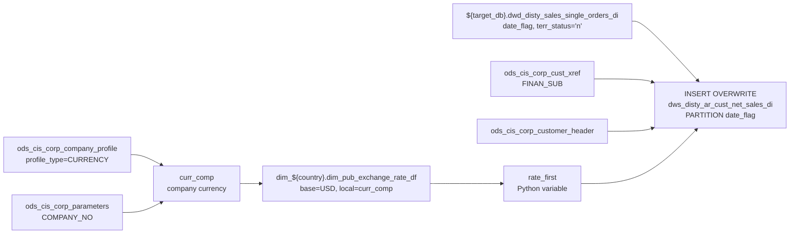

# DWS: AR Customer Net Sales — Daily Incremental (`dws_disty_ar_cust_net_sales_di`)

- artifact_type: etl_table
- artifact_id: ${target_db}.dws_disty_ar_cust_net_sales_di
- domain: ar
- one_line_purpose: This job computes daily net sales per customer by aggregating shipped order lines from the sales orders table, converting them to USD using a dynamically retrieved exchange rate for the company currency, and writing one row per customer per...
- layer_type: DWS
- source_kind: etl_sql
- evidence_source: source/etl/sql/ar/data_service/ar/python/dws_ar_cust_net_sales_di.py

---

## L1 Data Foundation

### Identity and physical mapping
- **Table:** `${target_db}.dws_disty_ar_cust_net_sales_di`
- **Layer type:** DWS
- **Canonical / derived:** Derived / ETL-loaded (see L3)
- **Owner team:** not registered in metadata catalog

### Grain, scope, exclusions
- **Grain:** one row per customer (`cust_no`) per `date_flag`.
- **Scope:** See L2 business purpose / L3 filters
- **Partition:** `date_flag`. - resolved from pipeline (see L4)
- **Natural key:** `cust_no` within a `date_flag` partition.
- **Exclusions:** Not documented in repository

#### Grain detail (preserved)

- **Grain:** one row per customer (`cust_no`) per `date_flag`.
- **Partition:** `date_flag`.
- **Natural key:** `cust_no` within a `date_flag` partition.

---

### Cross-engine presence
| Engine | Present | Canonical FQN | Notes |
|--------|---------|---------------|-------|
| Hive | yes | `${target_db}.dws_disty_ar_cust_net_sales_di` | ETL target / intermediate per evidence script |
| Vertica | pending | `${target_db}.dws_disty_ar_cust_net_sales_di` | Confirm via hive2vertica flow evidence / MCP |

### Physical schema reference

Pointer block only - full column catalog lives in WKB L1 storage JSON.

| Field | Value |
|-------|-------|
| **Authoritative catalog** | WKB L1 storage seed (not duplicated in this file) |
| **entity_id** | `${target_db}.dws_disty_ar_cust_net_sales_di` |
| **l1_catalog_seed** | `target/storage/wkb/snapshots/_snapshot_id_template/l1_catalog/{engine}_{schema}_{table}.json` |
| **column_count** | pending (run ddl_seed_writer) |
| **partition_keys** | `date_flag` |
| **ddl_source** | pending Bitbucket DDL / Vertica metadata ingest |
| **retrieval** | `python -m tools.wkb.indexing.run_query --query "ar dws_ar_cust_net_sales_di schema" --intent find_table_schema` |

### Lineage
| Object | Role |
|--------|------|
| `${target_db}.dwd_disty_sales_single_orders_di` | Daily shipped order lines |
| `dim_${country}.dim_pub_exchange_rate_df` | Exchange rate for USD conversion |

---

### Freshness and load path
| Item | Value |
|------|-------|
| Load pattern | See L3 end-to-end / INSERT pattern in evidence script |
| Schedule | Not documented in repository |
| Parameters | `date_flag`, `etl_timestamp`, `target_db`, `source_db`, `country` |


---

## L2 Declarative Knowledge

### Business purpose
This job computes daily net sales per customer by aggregating shipped order lines from the sales
orders table, converting them to USD using a dynamically retrieved exchange rate for the company
currency, and writing one row per customer per day. It serves as the net-sales denominator used
by the DSO calculation in `dws_ar_cust_sum_age_dso_df` and supports customer-level revenue reporting.

---

### Audience and use cases
| Audience | How they benefit |
|----------|-----------------|
| **Credit / AR** | Rolling net sales denominator for DSO computation |
| **Finance / revenue** | Daily customer-level net revenue in both local and USD |
| **Territory management** | Sales territory per customer via `sales_terr` |

---

### Fact key resolution
- Natural key: `cust_no` within a `date_flag` partition.
- FK / label-on attributes: see L3 dimension join patterns and step-by-step logic.
- Negative assertion: do not treat descriptive labels as grain keys unless listed under natural key.

### Time field semantics
- **date_flag / partition columns:** `date_flag`.
- Primary reporting filter should use the partition column(s) documented in L1; resolve values via L4.


### Metrics served

| Category | Column | Logical metric | Business reading |
|----------|--------|----------------|------------------|
| Measures | — | — | No measure columns mapped for this table. |

### Metric serving map

**Formula authority:** [`source/contracts/ar/metric-index.md`](../../source/contracts/ar/metric-index.md)

N/A — no measure columns mapped for this table.

### etl_metrics

No governed logical metrics from `source/contracts/ar/metric-index.md` are mapped on this table.

---

### Metric serving map
N/A - not a `*_comb_mtd` / multi-period wide serving table (or map not present in legacy doc).


### Data products and column groups (preserved)

### Identifiers

- `cust_no` — Customer number
- `finance_mcust_no` — FINAN_SUB xref customer (NULL if none)
- `sales_terr` — Sales territory

### Net sales amounts

- `nsls` — Net sales in local currency: `SUM(ship_qty × (u_price + u_sum_expense))`
- `usd_nsls` — USD equivalent: `nsls × exchange_rate`

---

### etl_metrics

#### `nsls`
- **Source:** [metric-index.md](../../source/contracts/ar/metric-index.md#nsls)
- **Business definition:** Net sales in local currency
```sql
SUM(ship_qty × (u_price + u_sum_expense))
```

#### `usd_nsls`
- **Source:** [metric-index.md](../../source/contracts/ar/metric-index.md#usd_nsls)
- **Business definition:** USD-converted net sales
```sql
SUM(ship_qty × (u_price + u_sum_expense) × rate_first)
```


---

## L3 Procedural Knowledge

### Query and routing rules
**Business filters:** Use partition / date keys from L1 grain for reporting scope.
**Technical predicates (load only):** See Key filters and step-by-step logic below.

### Dimension join patterns
| Dimension FQN | Join keys | Purpose | Evidence |
|---------------|-----------|---------|----------|
| See step-by-step / base tables | See L3 steps | Dimension enrichment | `source/etl/sql/ar/data_service/ar/python/dws_ar_cust_net_sales_di.py` |

### Key filters and ETL business logic
### Step 1 — Company currency lookup (Python)

```sql
SELECT cp.profile_c FROM ods_cis_corp_company_profile cp, ods_cis_corp_parameters p
WHERE cp.company_no = CAST(p.parameter_value AS INT)
AND cp.profile_type = 'CURRENCY' AND p.parameter_name = 'COMPANY_NO'
```

If result is empty or USD, `rate_first = 0.00` (no conversion needed — or treated as 1:1 downstream via multiplication by 0).

---

### Step 2 — Exchange rate resolution (Python)

For non-USD companies:
1. Look up `NVL(rate2, rate)` from `dim_pub_exchange_rate_df` where `date_flag = '${date_flag}'`, `base_currency = 'USD'`, `local_currency = curr_comp_first`.
2. If not found, search the last 14 days for the most recent date with a non-NULL `rate2`.
3. Use the rate from that fallback date, or 0.0 if still not found.

---

### Step 3 — Final `INSERT OVERWRITE` into `dws_disty_ar_cust_net_sales_di PARTITION(date_flag)`

**Source:** `${target_db}.dwd_disty_sales_single_orders_di do`
LEFT JOIN `ods_cis_corp_cust_xref cx` (FINAN_SUB, active)
LEFT JOIN `ods_cis_corp_customer_header ch`

**Filter:** `do.date_flag = '${date_flag}' AND do.terr_status = 'n'`

**Aggregation:** GROUP BY `date_flag`, `cust_no`, `cx.xref_no`, `ch.sales_terr`

**Derived columns:**

| Column | Formula | Plain language |
|--------|---------|----------------|
| `nsls` | `SUM(ship_qty × (u_price + u_sum_expense))` | Net sales in local currency |
| `usd_nsls` | `SUM(ship_qty × (u_price + u_sum_expense) × rate_first)` | USD-converted net sales |

---

### Standard time-filter SQL
```sql
-- relative period filter using resolved partition value (see L4)
SELECT *
FROM ${target_db}.dws_disty_ar_cust_net_sales_di
WHERE /* partition predicate */ date_flag = '${partition_value}';
```

### End-to-end flow
**Runtime parameters:** `date_flag`, `etl_timestamp`, `target_db`, `source_db`, `country`
**Target table:** `${target_db}.dws_disty_ar_cust_net_sales_di`, partitioned by **`date_flag`**.

1. Look up the primary company currency from `ods_cis_corp_company_profile` + `ods_cis_corp_parameters`.
2. If currency is not USD (and not empty), retrieve the exchange rate (`rate2` preferred, else `rate`) from `dim_pub_exchange_rate_df` for `date_flag`. If no rate found for that date, look back up to 14 days for the most recent available rate.
3. Set `rate_first` (Python variable) to the resolved rate, or 0.0 if no rate found.
4. Insert into target: aggregate `dwd_disty_sales_single_orders_di` for `date_flag` and `terr_status = 'n'`, grouping by `cust_no`, `finance_mcust_no` (xref FINAN_SUB), and `sales_terr`; multiply local-currency sales by `rate_first` for USD.



---


#### High-level stages (preserved)

| Stage | Business meaning |
|-------|-----------------|
| **Company currency lookup** | Identify the primary company's local currency from `ods_cis_corp_company_profile` |
| **Exchange rate resolution** | Look up the USD conversion rate from `dim_pub_exchange_rate_df` for `date_flag`; fall back to a 14-day window if no rate available for that exact date |
| **Net sales aggregation** | Sum `ship_qty × (u_price + u_sum_expense)` per customer for `date_flag`, converting to USD using the resolved rate |
| **Finance sub-customer join** | Add FINAN_SUB cross-reference as `finance_mcust_no` |

**Parameters:** `date_flag`, `etl_timestamp`, `target_db`, `source_db`, `country`

---


### Base tables register
| Object | Role in this job |
|--------|-----------------|
| `${source_db}.ods_cis_corp_company_profile` | Company currency lookup (`CURRENCY` profile type) |
| `${source_db}.ods_cis_corp_parameters` | Company number parameter (`COMPANY_NO`) |
| `dim_${country}.dim_pub_exchange_rate_df` | Exchange rate for USD conversion |
| `${target_db}.dwd_disty_sales_single_orders_di` | Daily shipped order lines — source of `ship_qty`, `u_price`, `u_sum_expense` |
| `${source_db}.ods_cis_corp_cust_xref` | FINAN_SUB cross-reference |
| `${source_db}.ods_cis_corp_customer_header` | Customer sales territory |

---

### Step-by-step logic
### Step 1 — Company currency lookup (Python)

```sql
SELECT cp.profile_c FROM ods_cis_corp_company_profile cp, ods_cis_corp_parameters p
WHERE cp.company_no = CAST(p.parameter_value AS INT)
AND cp.profile_type = 'CURRENCY' AND p.parameter_name = 'COMPANY_NO'
```

If result is empty or USD, `rate_first = 0.00` (no conversion needed — or treated as 1:1 downstream via multiplication by 0).

---

### Step 2 — Exchange rate resolution (Python)

For non-USD companies:
1. Look up `NVL(rate2, rate)` from `dim_pub_exchange_rate_df` where `date_flag = '${date_flag}'`, `base_currency = 'USD'`, `local_currency = curr_comp_first`.
2. If not found, search the last 14 days for the most recent date with a non-NULL `rate2`.
3. Use the rate from that fallback date, or 0.0 if still not found.

---

### Step 3 — Final `INSERT OVERWRITE` into `dws_disty_ar_cust_net_sales_di PARTITION(date_flag)`

**Source:** `${target_db}.dwd_disty_sales_single_orders_di do`
LEFT JOIN `ods_cis_corp_cust_xref cx` (FINAN_SUB, active)
LEFT JOIN `ods_cis_corp_customer_header ch`

**Filter:** `do.date_flag = '${date_flag}' AND do.terr_status = 'n'`

**Aggregation:** GROUP BY `date_flag`, `cust_no`, `cx.xref_no`, `ch.sales_terr`

**Derived columns:**

| Column | Formula | Plain language |
|--------|---------|----------------|
| `nsls` | `SUM(ship_qty × (u_price + u_sum_expense))` | Net sales in local currency |
| `usd_nsls` | `SUM(ship_qty × (u_price + u_sum_expense) × rate_first)` | USD-converted net sales |

---

### Relationship map (embedded)

| from_fqn | to_fqn | cardinality | join_keys | provenance |
|----------|--------|-------------|-----------|------------|
| `dw_xx.dwd_disty_sales_single_orders_di` | `ods_xx.ods_cis_corp_cust_xref` | many:1 | `do.cust_no = cx.cust_no and cx.xref_type='FINAN_SUB' and cx.active='Y'` | etl_sql (source/etl/sql/ar/data_service/ar/python/dws_ar_cust_net_sales_di.py:71) |
| `dw_xx.dwd_disty_sales_single_orders_di` | `ods_xx.ods_cis_corp_customer_header` | many:1 | `do.cust_no = ch.cust_no` | etl_sql (source/etl/sql/ar/data_service/ar/python/dws_ar_cust_net_sales_di.py:71) |

`source/ref/ar/table relationship.txt`: Not documented in repository.

### Special logic (embedded)

Not documented in repository

### Column / field derivations (from ETL SQL)

| target_column | expression_sql | upstream_columns | upstream_tables | transform_kind | evidence |
|---------------|----------------|------------------|-----------------|----------------|----------|
| `cust_no` | `do.cust_no` | `cust_no` | `${target_db}.dwd_disty_sales_single_orders_di`, `${source_db}.ods_cis_corp_cust_xref`, `${source_db}.ods_cis_corp_customer_header` | passthrough | `source/etl/sql/ar/data_service/ar/python/dws_ar_cust_net_sales_di.py:73` |
| `finance_mcust_no` | `cx.xref_no` | `xref_no` | `${target_db}.dwd_disty_sales_single_orders_di`, `${source_db}.ods_cis_corp_cust_xref`, `${source_db}.ods_cis_corp_customer_header` | rename | `source/etl/sql/ar/data_service/ar/python/dws_ar_cust_net_sales_di.py:74` |
| `sales_terr` | `ch.sales_terr` | `sales_terr` | `${target_db}.dwd_disty_sales_single_orders_di`, `${source_db}.ods_cis_corp_cust_xref`, `${source_db}.ods_cis_corp_customer_header` | passthrough | `source/etl/sql/ar/data_service/ar/python/dws_ar_cust_net_sales_di.py:75` |
| `nsls` | `sum((ship_qty)*(u_price+u_sum_expense))` | `ship_qty`, `u_price`, `u_sum_expense` | `${target_db}.dwd_disty_sales_single_orders_di`, `${source_db}.ods_cis_corp_cust_xref`, `${source_db}.ods_cis_corp_customer_header` | agg | `source/etl/sql/ar/data_service/ar/python/dws_ar_cust_net_sales_di.py:76` |
| `usd_nsls` | `sum((ship_qty)*(u_price+u_sum_expense)*${rate_first})` | `ship_qty`, `u_price`, `u_sum_expense`, `rate_first` | `${target_db}.dwd_disty_sales_single_orders_di`, `${source_db}.ods_cis_corp_cust_xref`, `${source_db}.ods_cis_corp_customer_header` | agg | `source/etl/sql/ar/data_service/ar/python/dws_ar_cust_net_sales_di.py:77` |
| `date_flag` | `to_date('${date_flag}')` | `date_flag` | `${target_db}.dwd_disty_sales_single_orders_di`, `${source_db}.ods_cis_corp_cust_xref`, `${source_db}.ods_cis_corp_customer_header` | udf | `source/etl/sql/ar/data_service/ar/python/dws_ar_cust_net_sales_di.py:78` |

### Sentinel and code values
| Value | Meaning |
|-------|---------|
| `terr_status = 'n'` | Include only normal (non-excluded) territory orders |
| `rate_first = 0.00` | If the company currency is USD or no rate found, USD sales are written as 0 |
| `xref_type = 'FINAN_SUB'` | Finance sub-customer cross-reference |
| `profile_type = 'CURRENCY'` + `parameter_name = 'COMPANY_NO'` | Identifies the primary company's local currency |

---

---

## L4 Validation

### Resolved partition value
| Step | Source | How partition / date scope is determined |
|------|--------|------------------------------------------|
| 1 | evidence script / flow | See parameters in L1 Freshness and L3 filters - `source/etl/sql/ar/data_service/ar/python/dws_ar_cust_net_sales_di.py` |

**Plain language:** Partition and date scope follow Azkaban/bootstrap parameters documented in the source script and orchestrating flow; do not hardcode calendar literals.

### Data quality checks
- Prefer row-count-by-partition, metric sums, and grain duplicate checks (see Validation SQL).
- Additional checks from legacy caveats / operational notes when present.

### Validation SQL
```sql
-- 1) Row count by partition
SELECT ${partition_col}, COUNT(*) AS row_cnt
FROM dim_${country}.dim_pub_exchange_rate_df
WHERE ${partition_col} = '${partition_value}'
GROUP BY ${partition_col};

-- 2) Metric sum by business dimension (top deltas)
SELECT ${dim_key}, SUM(${metric}) AS metric_sum
FROM dim_${country}.dim_pub_exchange_rate_df
WHERE ${partition_col} = '${partition_value}'
GROUP BY ${dim_key}
ORDER BY ABS(SUM(${metric})) DESC
LIMIT 20;

-- 3) Grain duplicate check
SELECT ${grain_key_1}, ${grain_key_2}, ${grain_key_3}, ${partition_col}, COUNT(*) AS cnt
FROM dim_${country}.dim_pub_exchange_rate_df
WHERE ${partition_col} = '${partition_value}'
GROUP BY ${grain_key_1}, ${grain_key_2}, ${grain_key_3}, ${partition_col}
HAVING COUNT(*) > 1;
```

Replace placeholders from this file's Grain and keys / Data you can fetch sections, and use the resolved partition value from run scope.

### Caveats for interpretation
- **`usd_nsls = 0` for USD companies:** If the company currency is USD or the parameter returns empty, `rate_first` is set to 0.00, causing `usd_nsls` to be 0 for all rows. This means USD sales are not stored for USD-native companies — downstream DSO calculations relying on `usd_nsls` will show 0.
- **Exchange rate fallback window:** The 14-day lookback uses `rate2 IS NOT NULL` as the criteria. If no `rate2` is available within 14 days, `rate_first` defaults to 0.00.
- **Dependency on `dwd_disty_sales_single_orders_di`:** This table must be loaded for `date_flag` before this script runs.

---

### Conflicts and open questions
- Schedule, owner, SLA: Not documented in repository (unless preserved schedule evidence above).
- Vertica MCP verification: pending unless confirmed in L5.


---

## L5 Runtime View

### Query path and engine preference
| Role | Hive object | Vertica object | Sync mode | Evidence | MCP verified |
|------|-------------|----------------|-----------|----------|--------------|
| **Query for reporting** | *See script lineage* | `dim_${country}.dim_pub_exchange_rate_df` | *Verify from flow* | *Add flow file:line* | pending |
| **Hive alternative** | `*` | `dim_${country}.dim_pub_exchange_rate_df` | - | *See dependencies* | - |
| **ETL internal** | staging/temp tables | *Not synced to Vertica* | - | *See step-by-step logic* | - |

Business users should query `dim_${country}.dim_pub_exchange_rate_df` in Vertica once MCP verification is completed for this document.

### Access constraints
- Country / company schema parameters may apply (`literal_country`, `company_no`, etc.).
- Hive-only staging objects are not reporting surfaces unless synced.

### Query risk profile
| Field | Value |
|-------|-------|
| requires_date_predicate | yes |
| scan_risk_tier | high |

---

## L6 Access and Consumption

### Primary consumers and use cases
| Audience | How they benefit |
|----------|-----------------|
| **Credit / AR** | Rolling net sales denominator for DSO computation |
| **Finance / revenue** | Daily customer-level net revenue in both local and USD |
| **Territory management** | Sales territory per customer via `sales_terr` |

---

### Representative query patterns
```sql
-- certified / illustrative lookup - replace predicates from L1/L4
SELECT *
FROM ${target_db}.dws_disty_ar_cust_net_sales_di
WHERE date_flag = '${partition_value}'
LIMIT 100;
```

### Dependencies and notes
### Upstream objects (verified)

| Object | Usage | Evidence |
|--------|-------|----------|
| `${target_db}.dwd_disty_sales_single_orders_di` | Daily order lines | `source/etl/sql/ar/data_service/ar/python/dws_ar_cust_net_sales_di.py:79` |
| `dim_${country}.dim_pub_exchange_rate_df` | Exchange rate | `source/etl/sql/ar/data_service/ar/python/dws_ar_cust_net_sales_di.py:37` |
| `${source_db}.ods_cis_corp_company_profile` | Company currency | `source/etl/sql/ar/data_service/ar/python/dws_ar_cust_net_sales_di.py:23` |
| `${source_db}.ods_cis_corp_parameters` | Company number | `source/etl/sql/ar/data_service/ar/python/dws_ar_cust_net_sales_di.py:25` |
| `${source_db}.ods_cis_corp_cust_xref` | FINAN_SUB xref | `source/etl/sql/ar/data_service/ar/python/dws_ar_cust_net_sales_di.py:80` |
| `${source_db}.ods_cis_corp_customer_header` | Sales territory | `source/etl/sql/ar/data_service/ar/python/dws_ar_cust_net_sales_di.py:83` |

### Downstream consumers (verified)

| Object / script | Evidence |
|-----------------|----------|
| `dws_ar_cust_sum_age_dso_df.sql` — reads this table for rolling sales | `source/etl/sql/ar/data_service/ar/sql/dws_ar_cust_sum_age_dso_df.sql:94` |

### Operational detail (verified)

- Partitioned by `date_flag` (INSERT OVERWRITE PARTITION): `source/etl/sql/ar/data_service/ar/python/dws_ar_cust_net_sales_di.py:71`
- Exchange rate resolved dynamically in Python before SQL execution: `source/etl/sql/ar/data_service/ar/python/dws_ar_cust_net_sales_di.py:35–68`

### Not documented in repository

- Schedule, owner, SLA — not in scripts or configs

---

*Document generated from `source/etl/sql/ar/data_service/ar/python/dws_ar_cust_net_sales_di.py`.*

#### Not documented in repository
- Owner, SLA (unless schedule evidence preserved above)
- Any dependency without `file:line` evidence in this document

---

*Document migrated to L1-L6 from legacy Knowledgebase content. Evidence: `source/etl/sql/ar/data_service/ar/python/dws_ar_cust_net_sales_di.py`.*
