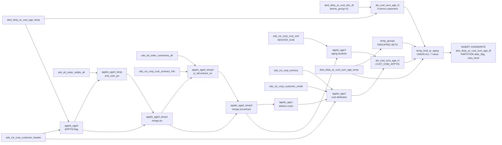

# DWS: AR Customer Aging Summary — Multi-View (`dws_disty_ar_cust_sum_age_df`)

- artifact_type: etl_table
- artifact_id: ${target_db}.dws_disty_ar_cust_sum_age_df
- domain: ar
- one_line_purpose: This job produces the comprehensive customer AR aging summary table used for credit management reporting. It assembles seven distinct views of the same aging data — by customer/company/terms (`CUST_COM`), by APPTIS customer/contract (`CUST_...
- layer_type: DWS
- source_kind: etl_sql
- evidence_source: source/etl/sql/ar/data_service/ar/sql/dws_ar_cust_sum_age_df.sql

---

## L1 Data Foundation

### Identity and physical mapping
- **Table:** `${target_db}.dws_disty_ar_cust_sum_age_df`
- **Layer type:** DWS
- **Canonical / derived:** Derived / ETL-loaded (see L3)
- **Owner team:** not registered in metadata catalog

### Grain, scope, exclusions
- **Grain:** one row per (`cust_no` OR rollup sentinel, `view_level`, `terms` [where applicable]) per `date_flag`.
- **Scope:** See L2 business purpose / L3 filters
- **Partition:** Not documented in repository - resolved from pipeline (see L4)
- **Natural key:** `cust_no`, `mcust_no`, `terms`, `company_no` within `view_level = 'CUST_COM_TERMS'`; `cust_no`, `end_user_po`, `jv_id`, `contract_no`, `company_no` within `view_level = 'CUST_COM_APPTIS'`.
- **Exclusions:** Not documented in repository

#### Grain detail (preserved)

- **Grain:** one row per (`cust_no` OR rollup sentinel, `view_level`, `terms` [where applicable]) per `date_flag`.
- **Partitions:** `date_flag`, `view_level`.
- **Natural key:** `cust_no`, `mcust_no`, `terms`, `company_no` within `view_level = 'CUST_COM_TERMS'`; `cust_no`, `end_user_po`, `jv_id`, `contract_no`, `company_no` within `view_level = 'CUST_COM_APPTIS'`.
- **For rollup views** (`REGION`, `TERR`, `ANALYST`, `VIEWER`): `cust_no = -1` is the sentinel indicating an aggregate row (not a real customer).

---

### Cross-engine presence
| Engine | Present | Canonical FQN | Notes |
|--------|---------|---------------|-------|
| Hive | yes | `${target_db}.dws_disty_ar_cust_sum_age_df` | ETL target / intermediate per evidence script |
| Vertica | pending | `${target_db}.dws_disty_ar_cust_sum_age_df` | Confirm via hive2vertica flow evidence / MCP |

### Physical schema reference

Pointer block only - full column catalog lives in WKB L1 storage JSON.

| Field | Value |
|-------|-------|
| **Authoritative catalog** | WKB L1 storage seed (not duplicated in this file) |
| **entity_id** | `${target_db}.dws_disty_ar_cust_sum_age_df` |
| **l1_catalog_seed** | `target/storage/wkb/snapshots/_snapshot_id_template/l1_catalog/{engine}_{schema}_{table}.json` |
| **column_count** | pending (run ddl_seed_writer) |
| **partition_keys** | `Not documented in repository` |
| **ddl_source** | pending Bitbucket DDL / Vertica metadata ingest |
| **retrieval** | `python -m tools.wkb.indexing.run_query --query "ar dws_ar_cust_sum_age_df schema" --intent find_table_schema` |

### Lineage
| Object | Role |
|--------|------|
| `${target_db}.dwd_disty_ar_cust_age_temp` | Per-document aging with pre-computed buckets (upstream dependency) |
| `${target_db}.dwd_disty_ar_cust_sum_age_temp` | Customer-aggregated aging (upstream dependency) |
| `${target_db}.dwd_disty_ar_cust_doc_df` | Terms lookup for X-terms filter |

---

### Freshness and load path
| Item | Value |
|------|-------|
| Load pattern | See L3 end-to-end / INSERT pattern in evidence script |
| Schedule | Not documented in repository |
| Parameters | `source_db`, `target_db`, `date_flag`, `etl_timestamp`, `data_period` |


---

## L2 Declarative Knowledge

### Business purpose
This job produces the comprehensive customer AR aging summary table used for credit management
reporting. It assembles seven distinct views of the same aging data — by customer/company/terms
(`CUST_COM`), by APPTIS customer/contract (`CUST_COM_APPTIS`), by customer/company/terms for
X-terms customers (`CUST_COM_TERMS`), and aggregated at region (`REGION`), territory (`TERR`),
credit-analyst (`ANALYST`), and territory+analyst (`VIEWER`) levels. All views cover 30+ aging
buckets in local currency, USD, and 2LC.

---

### Audience and use cases
| Audience | How they benefit |
|----------|-----------------|
| **Credit management** | Customer-level aging (`CUST_COM`, `CUST_COM_TERMS`) for individual account review |
| **Collections (APPTIS)** | Detailed contract/JV/end-user-PO annotations on APPTIS customer aging |
| **Regional managers** | Territory and region rollups (`TERR`, `REGION`) for portfolio oversight |
| **Credit analysts** | Analyst-level aggregates (`ANALYST`) for workload and delinquency tracking |
| **Executive** | Full company aggregate available via `REGION` (all-company rollup) |

---

### Fact key resolution
- Natural key: `cust_no`, `mcust_no`, `terms`, `company_no` within `view_level = 'CUST_COM_TERMS'`; `cust_no`, `end_user_po`, `jv_id`, `contract_no`, `company_no` within `view_level = 'CUST_COM_APPTIS'`.
- FK / label-on attributes: see L3 dimension join patterns and step-by-step logic.
- Negative assertion: do not treat descriptive labels as grain keys unless listed under natural key.

### Time field semantics
- **date_flag / partition columns:** Not documented in repository
- Primary reporting filter should use the partition column(s) documented in L1; resolve values via L4.


### Metrics served

| Category | Column | Logical metric | Business reading |
|----------|--------|----------------|------------------|
| Measures | — | — | No measure columns mapped for this table. |

### Metric serving map

**Formula authority:** [`source/contracts/ar/metric-index.md`](../../source/contracts/ar/metric-index.md)

N/A — no measure columns mapped for this table.

### etl_metrics

No governed logical metrics from `source/contracts/ar/metric-index.md` are mapped on this table.

---

### Metric serving map
N/A - not a `*_comb_mtd` / multi-period wide serving table (or map not present in legacy doc).


### Data products and column groups (preserved)

### Identifiers

- `cust_no` (-1 for rollup rows), `mcust_no`
- `company_no`, `fx_currency`, `currency_2lc`
- `end_user_po`, `jv_id`, `contract_no` (APPTIS view only)
- `period_line_id` (row-number within APPTIS view)

### Dimension attributes

- `cust_name`, `cust_type`, `terms`
- `region`, `territory`, `credit_analyst`
- `view_level` — One of: `CUST_COM`, `CUST_COM_APPTIS`, `CUST_COM_TERMS`, `REGION`, `TERR`, `ANALYST`, `VIEWER`

### Aging buckets (local currency, USD, 2LC)

All 30+ age bands present in both local (`age*`), USD (`usd_age*`), and 2LC (`age*_2lc`) variants:
- `age0_less`, `age1_30`, `age31_60`, `age61_90`, `age91_120`, `age120_up`
- `age_n8_less`, `age_n7_0`, `age1_7`, `age8_15`, `age8_30`, `age16_30`
- `age31_45`, `age46_60`, `age60_up`, `age90_up`
- `age121_150`, `age151_180`, `age181_210`, `age180_up`
- `age211_240`, `age241_270`, `age271_300`, `age301_330`, `age331_360`, `age360_up`
- `total` (sum of all positive and negative outstanding amounts)

---

### etl_metrics

N/A - no calculable ETL formulas extracted from this document (passthrough / stored measures only, or formulas not documented).

---

## L3 Procedural Knowledge

### Query and routing rules
**Business filters:** Use partition / date keys from L1 grain for reporting scope.
**Technical predicates (load only):** See Key filters and step-by-step logic below.

### Dimension join patterns
| Dimension FQN | Join keys | Purpose | Evidence |
|---------------|-----------|---------|----------|
| See step-by-step / base tables | See L3 steps | Dimension enrichment | `source/etl/sql/ar/data_service/ar/sql/dws_ar_cust_sum_age_df.sql` |

### Key filters and ETL business logic
### Step 1 — `dw_cust_sum_age_N` (CUST_COM_TERMS)

**Source:** `${target_db}.dwd_disty_ar_cust_age_temp cd` INNER JOIN `${target_db}.dwd_disty_ar_cust_doc_df cdf` (on order_no/order_type)

**Filter:** `cd.amount != cd.applied` AND `cdf.date_flag = '${date_flag}'` AND `cdf.terms IN (SELECT trim(doc_terms) FROM ods_cis_corp_terms_file WHERE terms_group = 'X')`

**Aggregation:** GROUP BY `cust_no, cdf.terms, company_no, mcust_no`

**All aging bucket columns** summed from `cd.age*` and `cd.usd_age*` and `cd.*_2lc` variants.

---

### Steps 2–9 — APPTIS enrichment chain

**Step 2 (`apptis_age0`):** Read all open items from `dwd_disty_ar_cust_age_temp`, LEFT JOIN `ods_cis_corp_customer_header` to flag `apptis_flag = 1` when `sales_terr IN (9730, 9740)`.

**Step 3 (`apptis_age0_temp`):** For APPTIS items without `end_user_po`, fetch it from `ods_etl_order_soldto_all` (where `end_user_po IS NOT NULL`, `delete_date IS NULL`).

**Step 4 (`apptis_age0_temp1`):** NVL merge of `end_user_po` from step 3 into all APPTIS records.

**Step 5 (`apptis_age0_temp2`):** For APPTIS items without `jv_id`, look up `ods_etl_order_comments_all` (`comment_type='IC'`, `comment_loc='1'`, `delete_date IS NULL`) and join to `ods_cis_corp_cust_contract_info` (`contract_code = comment`, `jv_id IS NOT NULL`).

**Step 6 (`apptis_age0_temp3`):** NVL merge `jv_id` and `contract_no` from step 5.

**Step 7 (`apptis_age1`):** DISTINCT `cust_no` from `apptis_age0_temp3`.

**Step 8 (`apptis_age2`):** `ods_cis_corp_cus...

### Standard time-filter SQL
```sql
-- relative period filter using resolved partition value (see L4)
SELECT *
FROM ${target_db}.dws_disty_ar_cust_sum_age_df
WHERE /* partition predicate */ date_flag = '${partition_value}';
```

### End-to-end flow
**Runtime parameters:** `source_db`, `target_db`, `date_flag`, `etl_timestamp`, `data_period`
**Target table:** `${target_db}.dws_disty_ar_cust_sum_age_df`, partitioned by **`date_flag`**, **`view_level`**.

1. **`dw_cust_sum_age_N`:** Read `dwd_disty_ar_cust_age_temp` joined to `dwd_disty_ar_cust_doc_df` (for terms), filtered to X-terms customers (`terms_group = 'X'`), open items only. GROUP BY `cust_no, terms, company_no, mcust_no`.
2. **`apptis_age0`:** Read all open `dwd_disty_ar_cust_age_temp` items, flag APPTIS customers (sales_terr IN 9730/9740).
3. **`apptis_age0_temp`:** Fetch `end_user_po` for APPTIS customers without one, from `ods_etl_order_soldto_all`.
4. **`apptis_age0_temp1`:** Merge `end_user_po` from step 3.
5. **`apptis_age0_temp2`:** Fetch `jv_id`/`contract_no` from `ods_cis_corp_cust_contract_info` via `ods_etl_order_comments_all` (IC/1 comment type) for APPTIS items without JV info.
6. **`apptis_age0_temp3`:** Merge `jv_id`/`contract_no`.
7. **`apptis_age1`:** Distinct APPTIS customer list.
8. **`apptis_age2`:** Customer master attributes (name, cust_type, terms, region, territory, credit_analyst) for APPTIS customers.
9. **`apptis_age3`:** Compute SIGN-product aging buckets per (cust_no, end_user_po, jv_id, contract_no, company_no, mcust_no).
10. **`dw_cust_sum_age_H`:** Join `apptis_age3` to `apptis_age2`, add metadata columns.
11. **`temp_groups`:** Aggregate `dwd_disty_ar_cust_sum_age_temp` via GROUPING SETS `(region)`, `(territory, region)`, `(credit_analyst, region)`, `(territory, credit_analyst, region)`.
12. **`temp_final_ar_aging`:** UNION ALL of 7 views: CUST_COM from `dwd_disty_ar_cust_sum_age_temp`, CUST_COM_APPTIS from `dw_cust_sum_age_H`, CUST_COM_TERMS from `dw_cust_sum_age_N`, REGION/TERR/ANALYST/VIEWER from `temp_groups`.
13. **Final INSERT OVERWRITE** into `dws_disty_ar_cust_sum_age_df PARTITION(date_flag, view_level)`.



---


#### High-level stages (preserved)

| Stage | Business meaning |
|-------|-----------------|
| **CUST_COM_TERMS** (`dw_cust_sum_age_N`) | Customer aging for X-terms customers only (terms_group='X'), grouped by customer/company/mcust/terms |
| **APPTIS enrichment** (`apptis_age0`–`apptis_age3`) | For APPTIS territory customers (sales_terr IN 9730, 9740): enrich with end_user_po and JV/contract info, then compute aging buckets using SIGN-product formula |
| **APPTIS customer detail** (`apptis_age2`) | Customer master attributes for APPTIS customers |
| **CUST_COM_APPTIS** (`dw_cust_sum_age_H`) | Final APPTIS-level customer aging with contract/JV annotations |
| **Aggregate grouping sets** (`temp_groups`) | Compute regional rollups (REGION, TERR, ANALYST, VIEWER) using SQL GROUPING SETS over `dwd_disty_ar_cust_sum_age_temp` |
| **UNION of all 7 views** (`temp_final_ar_aging`) | Combine CUST_COM, CUST_COM_APPTIS, CUST_COM_TERMS, REGION, TERR, ANALYST, VIEWER into one dataset |
| **Final INSERT** | Write to `dws_disty_ar_cust_sum_age_df` partitioned by `date_flag` and `view_level` |

**Parameters:** `source_db`, `target_db`, `date_flag`, `etl_timestamp`, `data_period`

---


### Base tables register
| Object | Role in this job |
|--------|-----------------|
| `${target_db}.dwd_disty_ar_cust_age_temp` | Per-order-line aging with pre-computed bucket amounts |
| `${target_db}.dwd_disty_ar_cust_sum_age_temp` | Customer-aggregated aging (from `ar_cust_sum_age_temp.py`) |
| `${target_db}.dwd_disty_ar_cust_doc_df` | Terms reference for X-terms customer filter |
| `${source_db}.ods_cis_corp_terms_file` | `terms_group = 'X'` filter |
| `${source_db}.ods_cis_corp_customer_header` | Customer attributes (APPTIS branch) |
| `${source_db}.ods_cis_corp_territory` | Territory attributes |
| `${source_db}.ods_cis_corp_customer_credit` | Default terms for APPTIS customer |
| `${source_db}.ods_etl_order_soldto_all` | End user PO for APPTIS orders |
| `${source_db}.ods_etl_order_comments_all` | IC comment for JV/contract lookup |
| `${source_db}.ods_cis_corp_cust_contract_info` | JV ID and contract number |
| `${source_db}.ods_cis_corp_cust_xref` | MASTER_SUB cross-reference for APPTIS mcust_no |

**Temporary tables (inside the job only):**
`dw_cust_sum_age_N` → `apptis_age0` → `apptis_age0_temp` → `apptis_age0_temp1` → `apptis_age0_temp2` → `apptis_age0_temp3` → `apptis_age1` → `apptis_age2` → `apptis_age3` → `dw_cust_sum_age_H` → `temp_groups` → `temp_final_ar_aging` → (final `INSERT`)

---

### Step-by-step logic
### Step 1 — `dw_cust_sum_age_N` (CUST_COM_TERMS)

**Source:** `${target_db}.dwd_disty_ar_cust_age_temp cd` INNER JOIN `${target_db}.dwd_disty_ar_cust_doc_df cdf` (on order_no/order_type)

**Filter:** `cd.amount != cd.applied` AND `cdf.date_flag = '${date_flag}'` AND `cdf.terms IN (SELECT trim(doc_terms) FROM ods_cis_corp_terms_file WHERE terms_group = 'X')`

**Aggregation:** GROUP BY `cust_no, cdf.terms, company_no, mcust_no`

**All aging bucket columns** summed from `cd.age*` and `cd.usd_age*` and `cd.*_2lc` variants.

---

### Steps 2–9 — APPTIS enrichment chain

**Step 2 (`apptis_age0`):** Read all open items from `dwd_disty_ar_cust_age_temp`, LEFT JOIN `ods_cis_corp_customer_header` to flag `apptis_flag = 1` when `sales_terr IN (9730, 9740)`.

**Step 3 (`apptis_age0_temp`):** For APPTIS items without `end_user_po`, fetch it from `ods_etl_order_soldto_all` (where `end_user_po IS NOT NULL`, `delete_date IS NULL`).

**Step 4 (`apptis_age0_temp1`):** NVL merge of `end_user_po` from step 3 into all APPTIS records.

**Step 5 (`apptis_age0_temp2`):** For APPTIS items without `jv_id`, look up `ods_etl_order_comments_all` (`comment_type='IC'`, `comment_loc='1'`, `delete_date IS NULL`) and join to `ods_cis_corp_cust_contract_info` (`contract_code = comment`, `jv_id IS NOT NULL`).

**Step 6 (`apptis_age0_temp3`):** NVL merge `jv_id` and `contract_no` from step 5.

**Step 7 (`apptis_age1`):** DISTINCT `cust_no` from `apptis_age0_temp3`.

**Step 8 (`apptis_age2`):** `ods_cis_corp_customer_header` LEFT JOIN `ods_cis_corp_territory` LEFT JOIN `ods_cis_corp_customer_credit` for APPTIS customers, producing customer attributes.

**Step 9 (`apptis_age3`):** Compute all aging buckets using the SIGN-product formula per (cust_no, end_user_po, jv_id, contract_no, company_no, mcust_no). LEFT JOIN `ods_cis_corp_cust_xref` MASTER_SUB for `mcust_no`.

---

### Step 10 — `dw_cust_sum_age_H` (CUST_COM_APPTIS)

Join `apptis_age3` to `apptis_age2` on `cust_no`. Add `'${data_period}'`, `'${date_flag}'`, `'!'`, metadata, and contract/JV/end_user_po columns. Row-number assigned as `period_line_id` in the final UNION.

---

### Step 11 — `temp_groups` (rollup aggregates)

**Source:** `${target_db}.dwd_disty_ar_cust_sum_age_temp`

**Filter:** `date_flag = '${date_flag}'`

**GROUPING SETS:**
- `(data_period, date_flag, region)` → REGION view
- `(data_period, date_flag, territory, region)` → TERR view
- `(data_period, date_flag, credit_analyst, region)` → ANALYST view
- `(data_period, date_flag, territory, credit_analyst, region)` → VIEWER view

---

### Step 12 — `temp_final_ar_aging` (7-way UNION ALL)

| Branch | Source | `view_level` |
|--------|--------|-------------|
| 1 | `dwd_disty_ar_cust_sum_age_temp` | `CUST_COM` |
| 2 | `dw_cust_sum_age_H` | `CUST_COM_APPTIS` |
| 3 | `dw_cust_sum_age_N` | `CUST_COM_TERMS` |
| 4 | `temp_groups` (region only, territory=NULL, analyst=NULL) | `REGION` |
| 5 | `temp_groups` (territory not null, analyst=NULL) | `TERR` |
| 6 | `temp_groups` (territory=NULL, analyst not null) | `ANALYST` |
| 7 | `temp_groups` (territory not null, analyst not null) | `VIEWER` |

Rollup rows (views 4–7) use sentinel `cust_no = -1`, `mcust_no = -1`, `company_no = -1`.

---

### Relationship map (embedded)

| from_fqn | to_fqn | cardinality | join_keys | provenance |
|----------|--------|-------------|-----------|------------|
| `dw_xx.dwd_disty_ar_cust_age_temp` | `dw_xx.dwd_disty_ar_cust_doc_df` | many:1 | `cd.order_no = cdf.order_no and cd.order_type=cdf.order_type` | etl_sql (source/etl/sql/ar/data_service/ar/sql/dws_ar_cust_sum_age_df.sql:1) |
| `dw_xx.dwd_disty_ar_cust_age_temp` | `ods_xx.ods_cis_corp_customer_header` | many:1 | `a.cust_no = z.cust_no; CREATE TEMPORARY TABLE apptis_age0_temp AS` | etl_sql (source/etl/sql/ar/data_service/ar/sql/dws_ar_cust_sum_age_df.sql:1) |
| `ods_xx.ods_cis_corp_customer_header` | `ods_xx.ods_cis_corp_territory` | many:1 | `cm.sales_terr = te.sales_terr` | etl_sql (source/etl/sql/ar/data_service/ar/sql/dws_ar_cust_sum_age_df.sql:1) |
| `ods_xx.ods_cis_corp_customer_header` | `ods_xx.ods_cis_corp_customer_credit` | many:1 | `cm.cust_no = cl.cust_no AND trim(cm.default_terms) = trim(cl.terms)` | etl_sql (source/etl/sql/ar/data_service/ar/sql/dws_ar_cust_sum_age_df.sql:1) |
| `dw_xx.dwd_disty_ar_cust_age_temp` | `ods_xx.ods_cis_corp_cust_xref` | many:1 | `cd.cust_no = cx.cust_no AND cx.xref_type='MASTER_SUB' AND cx.active='Y'` | etl_sql (source/etl/sql/ar/data_service/ar/sql/dws_ar_cust_sum_age_df.sql:1) |

`source/ref/ar/table relationship.txt`: Not documented in repository.

### Special logic (embedded)

Not documented in repository

### Column / field derivations (from ETL SQL)

| target_column | expression_sql | upstream_columns | upstream_tables | transform_kind | evidence |
|---------------|----------------|------------------|-----------------|----------------|----------|
| `*` | `*` | — | — | partial | `source/etl/sql/ar/data_service/ar/sql/dws_ar_cust_sum_age_df.sql:5` |

### Sentinel and code values
| Value | Meaning |
|-------|---------|
| `cust_no = -1` | Rollup/aggregate row (no individual customer) |
| `u_version = '!'` | Standard version marker |
| `view_level` | Identifies which aggregation view the row belongs to |
| `apptis_flag = 1` | Customer is in APPTIS territory (sales_terr 9730 or 9740) |
| `sales_terr IN (9730, 9740)` | Defines APPTIS territory |
| `terms_group = 'X'` | X-terms customers (net extended payment terms) |
| `period_line_id = 0` | Default for non-APPTIS views; row_number() for APPTIS |
| `data_period = '${data_period}'` | Used to filter `temp_groups`; typically 'D' for daily |

---

---

## L4 Validation

### Resolved partition value
| Step | Source | How partition / date scope is determined |
|------|--------|------------------------------------------|
| 1 | evidence script / flow | See parameters in L1 Freshness and L3 filters - `source/etl/sql/ar/data_service/ar/sql/dws_ar_cust_sum_age_df.sql` |

**Plain language:** Partition and date scope follow Azkaban/bootstrap parameters documented in the source script and orchestrating flow; do not hardcode calendar literals.

### Data quality checks
- Prefer row-count-by-partition, metric sums, and grain duplicate checks (see Validation SQL).
- Additional checks from legacy caveats / operational notes when present.

### Validation SQL
```sql
-- 1) row count by partition
-- SELECT partition_col, COUNT(*) FROM ${target_db}.dws_disty_ar_cust_sum_age_df WHERE partition_col = '${partition_value}' GROUP BY 1;
-- 2) metric sum by dimension (top N) - replace metric/dim from L2
-- 3) grain duplicate check on natural keys
```


### Caveats for interpretation
- **SIGN-product aging formula:** Used in the APPTIS branch (`apptis_age3`) as an algebraic substitute for CASE WHEN; produces the same values but may behave differently when amounts are negative. The formula is `amount * SIGN(1 - SIGN(datediff - lower)) * SIGN(1 - SIGN(datediff - upper))`.
- **`dwd_disty_ar_cust_sum_age_temp` must be pre-loaded:** This table is populated by `ar_cust_sum_age_temp.py` and must run before this SQL script.
- **Rollup views (`REGION`, `TERR`, etc.) use `data_period = '${data_period}'` filter** on `temp_groups`; the main `CUST_COM` view reads all records from `dwd_disty_ar_cust_sum_age_temp` without this filter.
- **`currency_2lc` is NULL for rollup views** — these aggregate rows cannot carry a single 2LC currency value.
- **APPTIS enrichment only applies to sales_terr 9730/9740** — all other customers bypass the APPTIS chain.

---

### Conflicts and open questions
- Schedule, owner, SLA: Not documented in repository (unless preserved schedule evidence above).
- Vertica MCP verification: pending unless confirmed in L5.


---

## L5 Runtime View

### Query path and engine preference
| Role | Hive object | Vertica object | Sync mode | Evidence | MCP verified |
|------|-------------|----------------|-----------|----------|--------------|
| **Not in Vertica** | *See script lineage* | *No Vertica mapping identified in repository* | - | *Add flow evidence when found* | no |

No queryable Vertica table has been confirmed for this script from current repository evidence.

### Access constraints
- Country / company schema parameters may apply (`literal_country`, `company_no`, etc.).
- Hive-only staging objects are not reporting surfaces unless synced.

### Query risk profile
| Field | Value |
|-------|-------|
| requires_date_predicate | unknown |
| scan_risk_tier | high |

---

## L6 Access and Consumption

### Primary consumers and use cases
| Audience | How they benefit |
|----------|-----------------|
| **Credit management** | Customer-level aging (`CUST_COM`, `CUST_COM_TERMS`) for individual account review |
| **Collections (APPTIS)** | Detailed contract/JV/end-user-PO annotations on APPTIS customer aging |
| **Regional managers** | Territory and region rollups (`TERR`, `REGION`) for portfolio oversight |
| **Credit analysts** | Analyst-level aggregates (`ANALYST`) for workload and delinquency tracking |
| **Executive** | Full company aggregate available via `REGION` (all-company rollup) |

---

### Representative query patterns
```sql
-- certified / illustrative lookup - replace predicates from L1/L4
SELECT *
FROM ${target_db}.dws_disty_ar_cust_sum_age_df
WHERE date_flag = '${partition_value}'
LIMIT 100;
```

### Dependencies and notes
### Upstream objects (verified)

| Object | Usage | Evidence |
|--------|-------|----------|
| `${target_db}.dwd_disty_ar_cust_age_temp` | Per-document aging | `source/etl/sql/ar/data_service/ar/sql/dws_ar_cust_sum_age_df.sql:101` |
| `${target_db}.dwd_disty_ar_cust_sum_age_temp` | Customer-aggregated aging | `source/etl/sql/ar/data_service/ar/sql/dws_ar_cust_sum_age_df.sql:202` |
| `${target_db}.dwd_disty_ar_cust_doc_df` | Terms reference | `source/etl/sql/ar/data_service/ar/sql/dws_ar_cust_sum_age_df.sql:102` |
| `${source_db}.ods_cis_corp_customer_header` | APPTIS customer attributes | `source/etl/sql/ar/data_service/ar/sql/dws_ar_cust_sum_age_df.sql:241,348` |
| `${source_db}.ods_etl_order_soldto_all` | APPTIS end_user_po | `source/etl/sql/ar/data_service/ar/sql/dws_ar_cust_sum_age_df.sql:251` |
| `${source_db}.ods_etl_order_comments_all` | JV/contract comment | `source/etl/sql/ar/data_service/ar/sql/dws_ar_cust_sum_age_df.sql:297` |
| `${source_db}.ods_cis_corp_cust_contract_info` | JV ID and contract number | `source/etl/sql/ar/data_service/ar/sql/dws_ar_cust_sum_age_df.sql:294` |

### Downstream consumers (verified)

None identified in repository.

### Operational detail (verified)

- Partitioned by `date_flag` and `view_level` (INSERT OVERWRITE PARTITION): `source/etl/sql/ar/data_service/ar/sql/dws_ar_cust_sum_age_df.sql:1336`
- Distributed by `date_flag` before insert: `source/etl/sql/ar/data_service/ar/sql/dws_ar_cust_sum_age_df.sql:1337`

### Not documented in repository

- Schedule, owner, SLA — not in scripts or configs

### Related scripts (verified)

- `ar_cust_sum_age_temp.py` — Populates `dwd_disty_ar_cust_sum_age_temp` and `dwd_disty_ar_cust_age_temp` which this script reads — `source/etl/sql/ar/data_service/ar/python/`

---

*Document generated from `source/etl/sql/ar/data_service/ar/sql/dws_ar_cust_sum_age_df.sql`.*

#### Not documented in repository
- Owner, SLA (unless schedule evidence preserved above)
- Any dependency without `file:line` evidence in this document

---

*Document migrated to L1-L6 from legacy Knowledgebase content. Evidence: `source/etl/sql/ar/data_service/ar/sql/dws_ar_cust_sum_age_df.sql`.*
