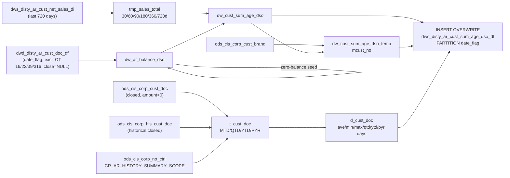

# DWS: AR Customer Aging Summary with DSO (`dws_disty_ar_cust_sum_age_dso_df`)

- artifact_type: etl_table
- artifact_id: ${target_db}.dws_disty_ar_cust_sum_age_dso_df
- domain: ar
- one_line_purpose: This job computes per-customer Days Sales Outstanding (DSO) metrics by combining open AR balances with rolling net sales totals over 30, 60, 90, 180, 360, and 720-day windows. It also calculates average, minimum, maximum, and period-specifi...
- layer_type: DWS
- source_kind: etl_sql
- evidence_source: source/etl/sql/ar/data_service/ar/sql/dws_ar_cust_sum_age_dso_df.sql

---

## L1 Data Foundation

### Identity and physical mapping
- **Table:** `${target_db}.dws_disty_ar_cust_sum_age_dso_df`
- **Layer type:** DWS
- **Canonical / derived:** Derived / ETL-loaded (see L3)
- **Owner team:** not registered in metadata catalog

### Grain, scope, exclusions
- **Grain:** one row per customer (`cust_no`) per `date_flag`.
- **Scope:** See L2 business purpose / L3 filters
- **Partition:** `date_flag`. - resolved from pipeline (see L4)
- **Natural key:** `cust_no` within a `date_flag` partition.
- **Exclusions:** Not documented in repository

#### Grain detail (preserved)

- **Grain:** one row per customer (`cust_no`) per `date_flag`.
- **Partition:** `date_flag`.
- **Natural key:** `cust_no` within a `date_flag` partition.

---

### Cross-engine presence
| Engine | Present | Canonical FQN | Notes |
|--------|---------|---------------|-------|
| Hive | yes | `${target_db}.dws_disty_ar_cust_sum_age_dso_df` | ETL target / intermediate per evidence script |
| Vertica | pending | `${target_db}.dws_disty_ar_cust_sum_age_dso_df` | Confirm via hive2vertica flow evidence / MCP |

### Physical schema reference

Pointer block only - full column catalog lives in WKB L1 storage JSON.

| Field | Value |
|-------|-------|
| **Authoritative catalog** | WKB L1 storage seed (not duplicated in this file) |
| **entity_id** | `${target_db}.dws_disty_ar_cust_sum_age_dso_df` |
| **l1_catalog_seed** | `target/storage/wkb/snapshots/_snapshot_id_template/l1_catalog/{engine}_{schema}_{table}.json` |
| **column_count** | pending (run ddl_seed_writer) |
| **partition_keys** | `date_flag` |
| **ddl_source** | pending Bitbucket DDL / Vertica metadata ingest |
| **retrieval** | `python -m tools.wkb.indexing.run_query --query "ar dws_ar_cust_sum_age_dso_df schema" --intent find_table_schema` |

### Lineage
| Object | Role |
|--------|------|
| `${target_db}.dwd_disty_ar_cust_doc_df` | AR open balance (must run first) |
| `${target_db}.dws_disty_ar_cust_net_sales_di` | Net sales per customer (must run first) |

---

### Freshness and load path
| Item | Value |
|------|-------|
| Load pattern | See L3 end-to-end / INSERT pattern in evidence script |
| Schedule | Not documented in repository |
| Parameters | `source_db`, `target_db`, `date_flag`, `etl_timestamp`, `first_date_month`, `first_date_quarter`, `first_date_year`, `date_last_year` |


---

## L2 Declarative Knowledge

### Business purpose
This job computes per-customer Days Sales Outstanding (DSO) metrics by combining open AR balances
with rolling net sales totals over 30, 60, 90, 180, 360, and 720-day windows. It also calculates
average, minimum, maximum, and period-specific (MTD, QTD, YTD, prior-year) invoice payment lapse
times to characterise how quickly customers pay their bills. The result feeds executive DSO dashboards
and customer-level credit performance reporting.

---

### Audience and use cases
| Audience | How they benefit |
|----------|-----------------|
| **Finance / treasury** | DSO metrics (`dso_30d`–`dso_720d`) for working capital tracking |
| **Credit management** | Per-customer payment behavior: `ave_day`, `min_day`, `max_day`, `qtd_day`, `ytd_day`, `pyr_day` |
| **Executive reporting** | AR balance (`ar_total`, `usd_ar_total`) vs. sales by rolling window for trend analysis |

---

### Fact key resolution
- Natural key: `cust_no` within a `date_flag` partition.
- FK / label-on attributes: see L3 dimension join patterns and step-by-step logic.
- Negative assertion: do not treat descriptive labels as grain keys unless listed under natural key.

### Time field semantics
- **date_flag / partition columns:** `date_flag`.
- Primary reporting filter should use the partition column(s) documented in L1; resolve values via L4.


### Metrics served

| Category | Column | Logical metric | Business reading |
|----------|--------|----------------|------------------|
| Measures | — | — | No measure columns mapped for this table. |

### Metric serving map

**Formula authority:** [`source/contracts/ar/metric-index.md`](../../source/contracts/ar/metric-index.md)

N/A — no measure columns mapped for this table.

### etl_metrics

No governed logical metrics from `source/contracts/ar/metric-index.md` are mapped on this table.

---

### Metric serving map
N/A - not a `*_comb_mtd` / multi-period wide serving table (or map not present in legacy doc).


### Data products and column groups (preserved)

### Identifiers

- `cust_no`, `mcust_no` (master brand customer, resolved from `ods_cis_corp_cust_brand`)

### AR balance

- `ar_total` — Open local-currency AR balance (excluding order types 16, 22, 39, 316 and negative credit memos)
- `usd_ar_total` — USD equivalent

### Rolling net sales

- `sales_30d`, `sales_60d`, `sales_90d`, `sales_180d`, `sales_360d`, `sales_720d`
- `usd_sales_30d`, ..., `usd_sales_720d`

### DSO metrics

| Column | Formula | Business reading |
|--------|---------|-----------------|
| `dso_30d` | `(ar_total × 30) / sales_30d` | Days of 30-day sales represented in open AR |
| `dso_60d` | `(ar_total × 60) / sales_60d` | Same for 60-day window |
| `dso_90d` | `(ar_total × 90) / sales_90d` | Same for 90-day window |
| `dso_180d` | `(ar_total × 180) / sales_180d` | Same for 180-day window |
| `dso_360d` | `(ar_total × 360) / sales_360d` | Same for 360-day window |
| `dso_720d` | `(ar_total × 720) / sales_720d` | Same for 720-day window |
| `usd_dso_*` | USD equivalents | All DSO metrics in USD |

> **Note:** `usd_dso_180d` uses `ar_total × 30` (not 180) in the script — this appears to be a known bug in the source SQL.

### Invoice payment age

- `inv_count` — Invoices closed within the current month
- `ave_day` — MTD average days from `doc_date` to `close_date` for closed invoices
- `min_day`, `max_day` — MTD min/max payment days
- `qtd_day`, `qtd_count`, `qtd_sum_days` — Quarter-to-date equivalents
- `ytd_day`, `ytd_count`, `ytd_sum_days` — Year-to-date equivalents
- `pyr_day`, `pyr_count`, `pyr_sum_days` — Prior-year equivalents
- `total_diff_date` — MTD sum of payment days (for averaging)
- `total_amount`, `usd_total_amount` — Invoice amounts closed MTD

---

### etl_metrics

#### `ave_day`
- **Source:** [metric-index.md](../../source/contracts/ar/metric-index.md#ave_day)
- **Business definition:** MTD average payment days
```sql
SUM(diff_date) / SUM(mon_diff_cnt)
```


---

## L3 Procedural Knowledge

### Query and routing rules
**Business filters:** Use partition / date keys from L1 grain for reporting scope.
**Technical predicates (load only):** See Key filters and step-by-step logic below.

### Dimension join patterns
| Dimension FQN | Join keys | Purpose | Evidence |
|---------------|-----------|---------|----------|
| See step-by-step / base tables | See L3 steps | Dimension enrichment | `source/etl/sql/ar/data_service/ar/sql/dws_ar_cust_sum_age_dso_df.sql` |

### Key filters and ETL business logic
### Step 1 — `dw_ar_balance_dso`

**Source:** `${target_db}.dwd_disty_ar_cust_doc_df`

**Filter:**
- `date_flag = '${date_flag}'`
- `order_type NOT IN (16, 22, 39, 316)` — exclude specific non-standard types
- `(order_type NOT IN (14, 114, 314, 3114) OR amount >= 0)` — exclude negative credit memos of these types
- `close_date IS NULL` — only open items

Then appends zero-balance rows (`amount=0, usd=0`) for customers appearing in the last 720 days' cust_doc data (same order-type exclusions) who are not already in the result.

---

### Step 2 — `tmp_sales_total`

**Source:** `${target_db}.dws_disty_ar_cust_net_sales_di`

**Filter:** `date_flag >= DATE_ADD('${date_flag}', -720) AND date_flag <= '${date_flag}'`

**Derived columns:** Rolling sales sums for 30/60/90/180/360/720 day windows using `DATEDIFF(date_flag, date_flag) <= N` CASE WHEN guards.

---

### Step 3 — `dw_cust_sum_age_dso`

**DSO formula pattern:** `(ar_total × N) / sales_Nd` where N ∈ {30, 60, 90, 180, 360, 720}, 0 when denominator is 0.

---

### Step 4 — `t_cust_doc` + `d_cust_doc`

**Sources:** `ods_cis_corp_cust_doc` (current) UNION `ods_cis_corp_his_cust_doc` (history), filtered to customers in `dw_ar_balance_dso`, amount > 0, closed after `date_last_year`, respecting `CR_AR_HISTORY_SUMMARY_SCOPE` include/exclude controls.

**Payment lapse columns computed:**

| Column | Formula | Plain language |
|--------|---------|----------------|
| `diff_date` | `(UNIX_TIMESTAMP(close_date) - UNIX_TIMESTAMP(doc_date))...

### Standard time-filter SQL
```sql
-- relative period filter using resolved partition value (see L4)
SELECT *
FROM ${target_db}.dws_disty_ar_cust_sum_age_dso_df
WHERE /* partition predicate */ date_flag = '${partition_value}';
```

### End-to-end flow
**Runtime parameters:** `source_db`, `target_db`, `date_flag`, `etl_timestamp`, `first_date_month`, `first_date_quarter`, `first_date_year`, `date_last_year`
**Target table:** `${target_db}.dws_disty_ar_cust_sum_age_dso_df`, partitioned by **`date_flag`**.

1. Build `dw_ar_balance_dso`: sum open AR per customer (excluding types 16,22,39,316; excluding negative credit memos), filtered to `date_flag`. Then insert zero-balance rows for customers with prior-720-day history but no current balance.
2. Build `tmp_sales_total`: sum net sales from `dws_disty_ar_cust_net_sales_di` per customer over 30/60/90/180/360/720-day windows ending on `date_flag`.
3. Build `dw_cust_sum_age_dso`: join `tmp_sales_total` to `dw_ar_balance_dso` and compute DSO for each window.
4. Build `t_cust_doc` + `d_cust_doc`: compute payment lapse statistics from `ods_cis_corp_cust_doc` (current) and `ods_cis_corp_his_cust_doc` (history), filtered by scope controls in `ods_cis_corp_no_ctrl`.
5. Build `dw_cust_sum_age_dso_temp`: resolve `mcust_no` via `ods_cis_corp_cust_brand`.
6. Final `INSERT OVERWRITE`: join `dw_cust_sum_age_dso`, `dw_cust_sum_age_dso_temp`, and `d_cust_doc`.



---


#### High-level stages (preserved)

| Stage | Business meaning |
|-------|-----------------|
| **AR balance per customer** | Sum open (non-closed) AR amounts per customer as of `date_flag`, excluding non-standard order types |
| **Zero-balance seed** | Add zero-balance rows for any customer active in the last 720 days who has no open balance today, ensuring DSO can still be calculated |
| **Rolling net sales totals** | Aggregate net sales from `dws_disty_ar_cust_net_sales_di` for 30/60/90/180/360/720-day windows |
| **DSO calculation** | Divide (AR balance × window_days) / sales_window for each window; 0 guard when sales = 0 |
| **Invoice payment age** | Compute MTD/QTD/YTD/prior-year average, min, max payment days from closed `cust_doc` and historical `cust_doc` records |
| **mcust_no resolution** | Resolve master brand customer number via `ods_cis_corp_cust_brand` |
| **Final INSERT** | Combine all three temp tables and insert one row per customer per `date_flag` |

**Parameters:** `source_db`, `target_db`, `date_flag`, `etl_timestamp`, `first_date_month`, `first_date_quarter`, `first_date_year`, `date_last_year`

---


### Base tables register
| Object | Role in this job |
|--------|-----------------|
| `${target_db}.dwd_disty_ar_cust_doc_df` | Open AR balance source |
| `${target_db}.dws_disty_ar_cust_net_sales_di` | Rolling daily net sales per customer |
| `${source_db}.ods_cis_corp_cust_doc` | Current closed invoice records for payment lapse calculation |
| `${source_db}.ods_cis_corp_his_cust_doc` | Historical closed invoice records |
| `${source_db}.ods_cis_corp_no_ctrl` | Scope controls: which order types to include/exclude in payment history (`CR_AR_HISTORY_SUMMARY_SCOPE`) |
| `${source_db}.ods_cis_corp_cust_brand` | Master brand customer resolution |

**Temporary tables (inside the job only):**
`dw_ar_balance_dso` → `tmp_sales_total` → `dw_cust_sum_age_dso` → `t_cust_doc` → `d_cust_doc` → `dw_cust_sum_age_dso_temp` → (final `INSERT`)

---

### Step-by-step logic
### Step 1 — `dw_ar_balance_dso`

**Source:** `${target_db}.dwd_disty_ar_cust_doc_df`

**Filter:**
- `date_flag = '${date_flag}'`
- `order_type NOT IN (16, 22, 39, 316)` — exclude specific non-standard types
- `(order_type NOT IN (14, 114, 314, 3114) OR amount >= 0)` — exclude negative credit memos of these types
- `close_date IS NULL` — only open items

Then appends zero-balance rows (`amount=0, usd=0`) for customers appearing in the last 720 days' cust_doc data (same order-type exclusions) who are not already in the result.

---

### Step 2 — `tmp_sales_total`

**Source:** `${target_db}.dws_disty_ar_cust_net_sales_di`

**Filter:** `date_flag >= DATE_ADD('${date_flag}', -720) AND date_flag <= '${date_flag}'`

**Derived columns:** Rolling sales sums for 30/60/90/180/360/720 day windows using `DATEDIFF(date_flag, date_flag) <= N` CASE WHEN guards.

---

### Step 3 — `dw_cust_sum_age_dso`

**DSO formula pattern:** `(ar_total × N) / sales_Nd` where N ∈ {30, 60, 90, 180, 360, 720}, 0 when denominator is 0.

---

### Step 4 — `t_cust_doc` + `d_cust_doc`

**Sources:** `ods_cis_corp_cust_doc` (current) UNION `ods_cis_corp_his_cust_doc` (history), filtered to customers in `dw_ar_balance_dso`, amount > 0, closed after `date_last_year`, respecting `CR_AR_HISTORY_SUMMARY_SCOPE` include/exclude controls.

**Payment lapse columns computed:**

| Column | Formula | Plain language |
|--------|---------|----------------|
| `diff_date` | `(UNIX_TIMESTAMP(close_date) - UNIX_TIMESTAMP(doc_date)) / 86400.0` if closed MTD, else 0 | Invoice-to-payment days for MTD invoices |
| `qtd_diff_date`, `ytd_diff_date`, `pyr_diff_date` | Same formula gated by period range | Same for QTD, YTD, prior-year |
| `ave_day` | `SUM(diff_date) / SUM(mon_diff_cnt)` | MTD average payment days |

---

### Step 5 — `dw_cust_sum_age_dso_temp`

Resolves `mcust_no` by joining `dw_cust_sum_age_dso` to `ods_cis_corp_cust_brand` on `cust_no`. The final INSERT uses `NVL(b.mcust_no, a.mcust_no)` to prefer the brand-level master customer.

---

### Relationship map (embedded)

| from_fqn | to_fqn | cardinality | join_keys | provenance |
|----------|--------|-------------|-----------|------------|
| `dw_cust_sum_age_dso` | `ods_xx.ods_cis_corp_no_ctrl` | many:1 | `a.company_no = b.site AND b.kind = 'CR_AR_HISTORY_SUMMARY_SCOPE' AND b.inv_chg = 'INCLUDE_OT'` | etl_sql (source/etl/sql/ar/data_service/ar/sql/dws_ar_cust_sum_age_dso_df.sql:1) |
| `dw_cust_sum_age_dso` | `ods_xx.ods_cis_corp_no_ctrl` | many:1 | `a.company_no = b2.site AND a.order_type = b2.doc_num AND b2.kind = 'CR_AR_HISTORY_SUMMARY_SCOPE' AND b2.inv_chg = 'EXCLUDE_OT'` | etl_sql (source/etl/sql/ar/data_service/ar/sql/dws_ar_cust_sum_age_dso_df.sql:1) |
| `dw_cust_sum_age_dso` | `dw_cust_sum_age_dso_temp` | many:1 | `a.cust_no = b.cust_no` | etl_sql (source/etl/sql/ar/data_service/ar/sql/dws_ar_cust_sum_age_dso_df.sql:1) |

`source/ref/ar/table relationship.txt`: Not documented in repository.

### Special logic (embedded)

Not documented in repository

### Column / field derivations (from ETL SQL)

| target_column | expression_sql | upstream_columns | upstream_tables | transform_kind | evidence |
|---------------|----------------|------------------|-----------------|----------------|----------|
| `date_flag` | `'${date_flag}'` | `date_flag` | `${target_db}.dwd_disty_ar_cust_doc_df`, `dw_ar_balance_dso`, `${target_db}.dws_disty_ar_cust_net_sales_di`, `tmp_sales_total`, `${source_db}.ods_cis_corp_cust_doc`, `${source_db}.ods_cis_corp_no_ctrl`, `${source_db}.ods_cis_corp_his_cust_doc`, `t_cust_doc`, `dw_cust_sum_age_dso`, `dw_cust_sum_age_dso_temp`, `d_cust_doc` | literal | `source/etl/sql/ar/data_service/ar/sql/dws_ar_cust_sum_age_dso_df.sql:8` |
| `cust_no` | `cust_no` | `cust_no` | `${target_db}.dwd_disty_ar_cust_doc_df`, `dw_ar_balance_dso`, `${target_db}.dws_disty_ar_cust_net_sales_di`, `tmp_sales_total`, `${source_db}.ods_cis_corp_cust_doc`, `${source_db}.ods_cis_corp_no_ctrl`, `${source_db}.ods_cis_corp_his_cust_doc`, `t_cust_doc`, `dw_cust_sum_age_dso`, `dw_cust_sum_age_dso_temp`, `d_cust_doc` | passthrough | `source/etl/sql/ar/data_service/ar/sql/dws_ar_cust_sum_age_dso_df.sql:4` |
| `0` | `0` | — | `${target_db}.dwd_disty_ar_cust_doc_df`, `dw_ar_balance_dso`, `${target_db}.dws_disty_ar_cust_net_sales_di`, `tmp_sales_total`, `${source_db}.ods_cis_corp_cust_doc`, `${source_db}.ods_cis_corp_no_ctrl`, `${source_db}.ods_cis_corp_his_cust_doc`, `t_cust_doc`, `dw_cust_sum_age_dso`, `dw_cust_sum_age_dso_temp`, `d_cust_doc` | passthrough | `source/etl/sql/ar/data_service/ar/sql/dws_ar_cust_sum_age_dso_df.sql:13` |
| `0` | `0` | — | `${target_db}.dwd_disty_ar_cust_doc_df`, `dw_ar_balance_dso`, `${target_db}.dws_disty_ar_cust_net_sales_di`, `tmp_sales_total`, `${source_db}.ods_cis_corp_cust_doc`, `${source_db}.ods_cis_corp_no_ctrl`, `${source_db}.ods_cis_corp_his_cust_doc`, `t_cust_doc`, `dw_cust_sum_age_dso`, `dw_cust_sum_age_dso_temp`, `d_cust_doc` | passthrough | `source/etl/sql/ar/data_service/ar/sql/dws_ar_cust_sum_age_dso_df.sql:13` |

### Sentinel and code values
| Value | Meaning |
|-------|---------|
| `order_type IN (16, 22, 39, 316)` exclusion | Excludes non-invoice AR types from open balance calculation |
| `kind = 'CR_AR_HISTORY_SUMMARY_SCOPE'` | Scope control in `no_ctrl` that governs which order types are included/excluded from payment history |
| `inv_chg = 'INCLUDE_OT'` | Include-only filter for specific order types |
| `inv_chg = 'EXCLUDE_OT'` | Explicit exclusion of specific order types |
| `usd_dso_180d` uses factor 30 | Appears to be a coding error in the source SQL (multiplied by 30 instead of 180) |

---

---

## L4 Validation

### Resolved partition value
| Step | Source | How partition / date scope is determined |
|------|--------|------------------------------------------|
| 1 | evidence script / flow | See parameters in L1 Freshness and L3 filters - `source/etl/sql/ar/data_service/ar/sql/dws_ar_cust_sum_age_dso_df.sql` |

**Plain language:** Partition and date scope follow Azkaban/bootstrap parameters documented in the source script and orchestrating flow; do not hardcode calendar literals.

### Data quality checks
- Prefer row-count-by-partition, metric sums, and grain duplicate checks (see Validation SQL).
- Additional checks from legacy caveats / operational notes when present.

### Validation SQL
```sql
-- 1) Row count by partition
SELECT ${partition_col}, COUNT(*) AS row_cnt
FROM ods_cis_corp_cust_brand.master_brand_cust
WHERE ${partition_col} = '${partition_value}'
GROUP BY ${partition_col};

-- 2) Metric sum by business dimension (top deltas)
SELECT ${dim_key}, SUM(${metric}) AS metric_sum
FROM ods_cis_corp_cust_brand.master_brand_cust
WHERE ${partition_col} = '${partition_value}'
GROUP BY ${dim_key}
ORDER BY ABS(SUM(${metric})) DESC
LIMIT 20;

-- 3) Grain duplicate check
SELECT ${grain_key_1}, ${grain_key_2}, ${grain_key_3}, ${partition_col}, COUNT(*) AS cnt
FROM ods_cis_corp_cust_brand.master_brand_cust
WHERE ${partition_col} = '${partition_value}'
GROUP BY ${grain_key_1}, ${grain_key_2}, ${grain_key_3}, ${partition_col}
HAVING COUNT(*) > 1;
```

Replace placeholders from this file's Grain and keys / Data you can fetch sections, and use the resolved partition value from run scope.

### Caveats for interpretation
- **`usd_dso_180d` bug:** The formula in the SQL uses `(usd_total × 30) / usd_sales_180d` (not 180). This is a confirmed defect in the source code and makes `usd_dso_180d` numerically equivalent to `(usd_total × 30) / usd_sales_180d` rather than a true 180-day DSO.
- **Zero-balance seeding:** Customers with no open balance today but with prior-720-day activity are inserted with `ar_total = 0`. Their DSO will be 0, but they appear in the output so DSO trend continuity is preserved.
- **Scope controls:** The `CR_AR_HISTORY_SUMMARY_SCOPE` configuration in `no_ctrl` controls which order types enter the payment lapse calculation. This configuration is company-specific and may differ across country deployments.
- **mcust_no resolution:** `ods_cis_corp_cust_brand.master_brand_cust` is used when available; otherwise falls back to the `mcust_no` derived from `dw_cust_sum_age_dso` (which itself comes from the sales table's cust_no).

---

### Conflicts and open questions
- Schedule, owner, SLA: Not documented in repository (unless preserved schedule evidence above).
- Vertica MCP verification: pending unless confirmed in L5.


---

## L5 Runtime View

### Query path and engine preference
| Role | Hive object | Vertica object | Sync mode | Evidence | MCP verified |
|------|-------------|----------------|-----------|----------|--------------|
| **Query for reporting** | *See script lineage* | `ods_cis_corp_cust_brand.master_brand_cust` | *Verify from flow* | *Add flow file:line* | pending |
| **Hive alternative** | `*` | `ods_cis_corp_cust_brand.master_brand_cust` | - | *See dependencies* | - |
| **ETL internal** | staging/temp tables | *Not synced to Vertica* | - | *See step-by-step logic* | - |

Business users should query `ods_cis_corp_cust_brand.master_brand_cust` in Vertica once MCP verification is completed for this document.

### Access constraints
- Country / company schema parameters may apply (`literal_country`, `company_no`, etc.).
- Hive-only staging objects are not reporting surfaces unless synced.

### Query risk profile
| Field | Value |
|-------|-------|
| requires_date_predicate | yes |
| scan_risk_tier | high |

---

## L6 Access and Consumption

### Primary consumers and use cases
| Audience | How they benefit |
|----------|-----------------|
| **Finance / treasury** | DSO metrics (`dso_30d`–`dso_720d`) for working capital tracking |
| **Credit management** | Per-customer payment behavior: `ave_day`, `min_day`, `max_day`, `qtd_day`, `ytd_day`, `pyr_day` |
| **Executive reporting** | AR balance (`ar_total`, `usd_ar_total`) vs. sales by rolling window for trend analysis |

---

### Representative query patterns
```sql
-- certified / illustrative lookup - replace predicates from L1/L4
SELECT *
FROM ${target_db}.dws_disty_ar_cust_sum_age_dso_df
WHERE date_flag = '${partition_value}'
LIMIT 100;
```

### Dependencies and notes
### Upstream objects (verified)

| Object | Usage | Evidence |
|--------|-------|----------|
| `${target_db}.dwd_disty_ar_cust_doc_df` | AR balance source | `source/etl/sql/ar/data_service/ar/sql/dws_ar_cust_sum_age_dso_df.sql:7` |
| `${target_db}.dws_disty_ar_cust_net_sales_di` | Rolling sales source | `source/etl/sql/ar/data_service/ar/sql/dws_ar_cust_sum_age_dso_df.sql:94` |
| `${source_db}.ods_cis_corp_cust_doc` | Payment lapse — current | `source/etl/sql/ar/data_service/ar/sql/dws_ar_cust_sum_age_dso_df.sql:241` |
| `${source_db}.ods_cis_corp_his_cust_doc` | Payment lapse — history | `source/etl/sql/ar/data_service/ar/sql/dws_ar_cust_sum_age_dso_df.sql:317` |
| `${source_db}.ods_cis_corp_no_ctrl` | Scope controls | `source/etl/sql/ar/data_service/ar/sql/dws_ar_cust_sum_age_dso_df.sql:243` |
| `${source_db}.ods_cis_corp_cust_brand` | mcust_no resolution | `source/etl/sql/ar/data_service/ar/sql/dws_ar_cust_sum_age_dso_df.sql:384` |

### Downstream consumers (verified)

None identified in repository.

### Operational detail (verified)

- Partitioned by `date_flag` (INSERT OVERWRITE PARTITION): `source/etl/sql/ar/data_service/ar/sql/dws_ar_cust_sum_age_dso_df.sql:390`

### Not documented in repository

- Schedule, owner, SLA — not in scripts or configs

---

*Document generated from `source/etl/sql/ar/data_service/ar/sql/dws_ar_cust_sum_age_dso_df.sql`.*

#### Not documented in repository
- Owner, SLA (unless schedule evidence preserved above)
- Any dependency without `file:line` evidence in this document

---

*Document migrated to L1-L6 from legacy Knowledgebase content. Evidence: `source/etl/sql/ar/data_service/ar/sql/dws_ar_cust_sum_age_dso_df.sql`.*
