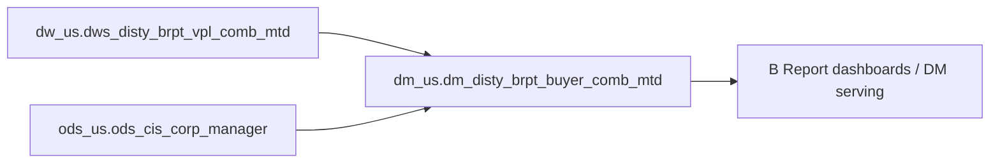

# DM: B Report combined-month profitability serving slice (buyer_comb_mtd) (`dm_us.dm_disty_brpt_buyer_comb_mtd`)

- artifact_type: etl_table
- artifact_id: dm_us.dm_disty_brpt_buyer_comb_mtd
- domain: b-report-us
- one_line_purpose: B Report combined-month profitability serving slice (buyer_comb_mtd)
- layer_type: DM
- source_kind: etl_sql
- evidence_source: source/contracts/b-report-us/bitbicket_etl/dm_disty_brpt_buyer_comb_mtd/Product/python/dm_disty_brpt_buyer_comb_mtd.py
- knowledgebase_path: target/knowledgebase/b-report-us/dm_disty_brpt_buyer_comb_mtd.md
- contract_source: source/contracts/b-report-us/tables/dm_disty_brpt_buyer_comb_mtd.md

---

## L1 Data Foundation

### Identity and physical mapping
- **Table:** `dm_us.dm_disty_brpt_buyer_comb_mtd`
- **Layer type:** DM
- **Canonical / derived:** Derived aggregation/serving (ETL-loaded)
- **Owner team:** Not documented in repository

### Grain, scope, exclusions
- **Grain:** month-to-date cumulative through each date_flag
- **Scope:** US disty B Report shipped-order P&L and performance metrics.
- **Partition:** `month_no` — resolved from Azkaban/bootstrap parameters (see L4).
- **Natural key:** `buyer_id`, `buyer_mgr_id`, `buyer_dir_id`, `buyer_vp_id`, `company_no`, `date_flag`
- **Exclusions:** Non-US schemas, backup/temp table variants (`_bkp`, `_temp`), and non-shipped-order scenarios.

### Cross-engine presence
| Engine | Present | Canonical FQN | Notes |
|--------|---------|---------------|-------|
| Hive | yes | `dm_${country}.dm_disty_brpt_buyer_comb_mtd` | ETL target in Bitbucket script |
| Vertica | yes | `dm_us.dm_disty_brpt_buyer_comb_mtd` | Contract marks Vertica verified |

### Physical schema reference
| Field | Value |
|-------|-------|
| **Authoritative catalog** | WKB L1 storage seed (not duplicated in this file) |
| **entity_id** | `dm_us.dm_disty_brpt_buyer_comb_mtd` |
| **l1_catalog_seed** | `target/storage/wkb/snapshots/_snapshot_id_template/l1_catalog/vertica_dm_us_dm_disty_brpt_buyer_comb_mtd.json` |
| **column_count** | 211 |
| **partition_keys** | `month_no` |
| **ddl_source** | B Report contract catalog and/or VERTICA/vcdisty DDL |
| **retrieval** | `python -m tools.wkb.indexing.run_query --query "b-report-us dm_disty_brpt_buyer_comb_mtd schema" --intent find_table_schema` |

### Lineage
- **upstream:** dw_us.dws_disty_brpt_vpl_comb_mtd, ods_us.ods_cis_corp_manager — `source/contracts/b-report-us/bitbicket_etl/dm_disty_brpt_buyer_comb_mtd/Product/python/dm_disty_brpt_buyer_comb_mtd.py`
- **downstream:** B Report DM/DWS serving and dashboards (per contract L6 when present) — `source/contracts/b-report-us/tables/dm_disty_brpt_buyer_comb_mtd.md`

### Freshness and load path
| Item | Value |
|------|-------|
| Load pattern | INSERT OVERWRITE partition reload (per ETL SQL) |
| Schedule | Not documented in repository |
| Parameters | `country`, `date_flag`, `dt_month`, `etl_timestamp`, `end_day_of_last_month`, `end_day_of_last_2month`, `end_day_of_same_month_of_last_year` |

---

## L2 Declarative Knowledge

### Business purpose
B Report combined-month profitability serving slice (buyer_comb_mtd)

This Knowledgebase entry documents the Bitbucket ETL load script in `source/contracts/b-report-us/bitbicket_etl/`. Business semantics align with the B Report US contract catalog when present.

### Audience and use cases
| Audience | How they benefit |
|----------|-----------------|
| **B Report / P&L analytics** | Consumers: PM, Sales, Buyer, BD and executive analysis views. |
| **Sales / PM / finance** | Shipped-order and margin metrics at documented grain (combined month-to-date wide serving (multiple period columns)). |
| **Data engineering** | Verified upstream/downstream objects with `file:line` evidence from ETL SQL. |

### Fact key resolution
- Order-line hub for B Report P&L: `dw_us.dwd_disty_brpt_orders_pl_etl_mi` when debugging transaction-level metrics.
- This table grain: month-to-date cumulative through each date_flag.
- Label-on/off and order_type adjustments: see `source/contracts/b-report-us/metric-index.md`.

### Time field semantics
- **`month_no`:** primary partition / filter for this load; value supplied by Azkaban `conf.get` parameters (see L4).
- **Period semantics:** combined month-to-date wide serving (multiple period columns).


### Metrics served

| Category | Column | Logical metric | Business reading |
|----------|--------|----------------|------------------|
| P&L adjustment / measure | `d_cgp` | `cgp` | cgp at daily grain |
| P&L adjustment / measure | `d_cost` | `cost` | cost at daily grain |
| P&L adjustment / measure | `d_fx_cost` | `fx_cost` | fx_cost at daily grain |
| Governed profitability | `d_gm` | `gm_amt` | gm_amt at daily grain |
| Governed profitability | `d_ngm` | `ngm_amt` | ngm_amt at daily grain |
| Governed profitability | `d_opl` | `oplgm_amt` | oplgm_amt at daily grain |
| Governed profitability | `d_oplgm_plus_amt` | `oplgm_plus_amt` | oplgm_plus_amt at daily grain |
| Governed profitability | `d_sales` | `net_sales` | net_sales at daily grain |
| P&L adjustment / measure | `d_scm_usage` | `scm_usage` | scm_usage at daily grain |
| Governed profitability | `d_tgm` | `tgm_amt` | tgm_amt at daily grain |
| Governed profitability | `d_total_btl` | `total_btl` | total_btl at daily grain |
| P&L adjustment / measure | `d_unit` | `unit` | unit at daily grain |
| P&L adjustment / measure | `lm_cgp` | `cgp` | cgp at last_month grain |
| P&L adjustment / measure | `lm_cgp_2` | `cgp_2` | cgp_2 at last_month grain |
| P&L adjustment / measure | `lm_cost` | `cost` | cost at last_month grain |
| P&L adjustment / measure | `lm_cost_2` | `cost_2` | cost_2 at last_month grain |
| P&L adjustment / measure | `lm_ds_cost` | `ds_cost` | ds_cost at last_month grain |
| P&L adjustment / measure | `lm_ds_cost_2` | `ds_cost_2` | ds_cost_2 at last_month grain |
| P&L adjustment / measure | `lm_ds_sales` | `ds_sales` | ds_sales at last_month grain |
| P&L adjustment / measure | `lm_ds_sales_2` | `ds_sales_2` | ds_sales_2 at last_month grain |
| P&L adjustment / measure | `lm_ds_scm_usage` | `ds_scm_usage` | ds_scm_usage at last_month grain |
| P&L adjustment / measure | `lm_ds_scm_usage_2` | `ds_scm_usage_2` | ds_scm_usage_2 at last_month grain |
| P&L adjustment / measure | `lm_fx_cost` | `fx_cost` | fx_cost at last_month grain |
| Governed profitability | `lm_gm` | `gm_amt` | gm_amt at last_month grain |
| P&L adjustment / measure | `lm_gm_2` | `gm_2` | gm_2 at last_month grain |
| Governed profitability | `lm_ngm` | `ngm_amt` | ngm_amt at last_month grain |
| P&L adjustment / measure | `lm_ngm_2` | `ngm_2` | ngm_2 at last_month grain |
| Governed profitability | `lm_opl` | `oplgm_amt` | oplgm_amt at last_month grain |
| P&L adjustment / measure | `lm_opl_2` | `opl_2` | opl_2 at last_month grain |
| Governed profitability | `lm_oplgm_plus_amt` | `oplgm_plus_amt` | oplgm_plus_amt at last_month grain |
| Governed profitability | `lm_sales` | `net_sales` | net_sales at last_month grain |
| P&L adjustment / measure | `lm_sales_2` | `sales_2` | sales_2 at last_month grain |
| P&L adjustment / measure | `lm_scm_disc` | `scm_disc` | scm_disc at last_month grain |
| P&L adjustment / measure | `lm_scm_disc_2` | `scm_disc_2` | scm_disc_2 at last_month grain |
| P&L adjustment / measure | `lm_scm_ndisc` | `scm_ndisc` | scm_ndisc at last_month grain |
| P&L adjustment / measure | `lm_scm_ndisc_2` | `scm_ndisc_2` | scm_ndisc_2 at last_month grain |
| P&L adjustment / measure | `lm_scm_usage` | `scm_usage` | scm_usage at last_month grain |
| P&L adjustment / measure | `lm_scm_usage_2` | `scm_usage_2` | scm_usage_2 at last_month grain |
| P&L adjustment / measure | `lm_stock_cost` | `stock_cost` | stock_cost at last_month grain |
| P&L adjustment / measure | `lm_stock_cost_2` | `stock_cost_2` | stock_cost_2 at last_month grain |
| P&L adjustment / measure | `lm_stock_sales` | `stock_sales` | stock_sales at last_month grain |
| P&L adjustment / measure | `lm_stock_sales_2` | `stock_sales_2` | stock_sales_2 at last_month grain |
| P&L adjustment / measure | `lm_stock_scm_usage` | `stock_scm_usage` | stock_scm_usage at last_month grain |
| P&L adjustment / measure | `lm_stock_scm_usage_2` | `stock_scm_usage_2` | stock_scm_usage_2 at last_month grain |
| Governed profitability | `lm_tgm` | `tgm_amt` | tgm_amt at last_month grain |
| P&L adjustment / measure | `lm_tgm_2` | `tgm_2` | tgm_2 at last_month grain |
| Governed profitability | `lm_total_btl` | `total_btl` | total_btl at last_month grain |
| P&L adjustment / measure | `lm_total_btl_2` | `total_btl_2` | total_btl_2 at last_month grain |
| P&L adjustment / measure | `lm_unit` | `unit` | unit at last_month grain |
| P&L adjustment / measure | `lm_unit_2` | `unit_2` | unit_2 at last_month grain |
| P&L adjustment / measure | `m_cgp` | `cgp` | cgp at current_month grain |
| P&L adjustment / measure | `m_cost` | `cost` | cost at current_month grain |
| P&L adjustment / measure | `m_ds_cost` | `ds_cost` | ds_cost at current_month grain |
| P&L adjustment / measure | `m_ds_sales` | `ds_sales` | ds_sales at current_month grain |
| P&L adjustment / measure | `m_ds_scm_usage` | `ds_scm_usage` | ds_scm_usage at current_month grain |
| P&L adjustment / measure | `m_fx_cost` | `fx_cost` | fx_cost at current_month grain |
| Governed profitability | `m_gm` | `gm_amt` | gm_amt at current_month grain |
| Governed profitability | `m_ngm` | `ngm_amt` | ngm_amt at current_month grain |
| Governed profitability | `m_opl` | `oplgm_amt` | oplgm_amt at current_month grain |
| Governed profitability | `m_oplgm_plus_amt` | `oplgm_plus_amt` | oplgm_plus_amt at current_month grain |
| P&L adjustment / measure | `m_p91_cost` | `p91_cost` | p91_cost at current_month grain |
| Governed profitability | `m_sales` | `net_sales` | net_sales at current_month grain |
| P&L adjustment / measure | `m_scm_disc` | `scm_disc` | scm_disc at current_month grain |
| P&L adjustment / measure | `m_scm_ndisc` | `scm_ndisc` | scm_ndisc at current_month grain |
| P&L adjustment / measure | `m_scm_usage` | `scm_usage` | scm_usage at current_month grain |
| P&L adjustment / measure | `m_stock_cost` | `stock_cost` | stock_cost at current_month grain |
| P&L adjustment / measure | `m_stock_sales` | `stock_sales` | stock_sales at current_month grain |
| P&L adjustment / measure | `m_stock_scm_usage` | `stock_scm_usage` | stock_scm_usage at current_month grain |
| Governed profitability | `m_tgm` | `tgm_amt` | tgm_amt at current_month grain |
| Governed profitability | `m_total_btl` | `total_btl` | total_btl at current_month grain |
| P&L adjustment / measure | `m_unit` | `unit` | unit at current_month grain |
| P&L adjustment / measure | `pm_cgp` | `cgp` | cgp at prior_month grain |
| P&L adjustment / measure | `pm_cgp_2` | `cgp_2` | cgp_2 at prior_month grain |
| P&L adjustment / measure | `pm_cost` | `cost` | cost at prior_month grain |
| P&L adjustment / measure | `pm_cost_2` | `cost_2` | cost_2 at prior_month grain |
| P&L adjustment / measure | `pm_ds_cost` | `ds_cost` | ds_cost at prior_month grain |
| P&L adjustment / measure | `pm_ds_cost_2` | `ds_cost_2` | ds_cost_2 at prior_month grain |
| P&L adjustment / measure | `pm_ds_sales` | `ds_sales` | ds_sales at prior_month grain |
| P&L adjustment / measure | `pm_ds_sales_2` | `ds_sales_2` | ds_sales_2 at prior_month grain |
| P&L adjustment / measure | `pm_ds_scm_usage` | `ds_scm_usage` | ds_scm_usage at prior_month grain |
| P&L adjustment / measure | `pm_ds_scm_usage_2` | `ds_scm_usage_2` | ds_scm_usage_2 at prior_month grain |
| P&L adjustment / measure | `pm_fx_cost` | `fx_cost` | fx_cost at prior_month grain |
| Governed profitability | `pm_gm` | `gm_amt` | gm_amt at prior_month grain |
| P&L adjustment / measure | `pm_gm_2` | `gm_2` | gm_2 at prior_month grain |
| Governed profitability | `pm_ngm` | `ngm_amt` | ngm_amt at prior_month grain |
| P&L adjustment / measure | `pm_ngm_2` | `ngm_2` | ngm_2 at prior_month grain |
| Governed profitability | `pm_opl` | `oplgm_amt` | oplgm_amt at prior_month grain |
| P&L adjustment / measure | `pm_opl_2` | `opl_2` | opl_2 at prior_month grain |
| Governed profitability | `pm_oplgm_plus_amt` | `oplgm_plus_amt` | oplgm_plus_amt at prior_month grain |
| Governed profitability | `pm_sales` | `net_sales` | net_sales at prior_month grain |
| P&L adjustment / measure | `pm_sales_2` | `sales_2` | sales_2 at prior_month grain |
| P&L adjustment / measure | `pm_scm_disc` | `scm_disc` | scm_disc at prior_month grain |
| P&L adjustment / measure | `pm_scm_disc_2` | `scm_disc_2` | scm_disc_2 at prior_month grain |
| P&L adjustment / measure | `pm_scm_ndisc` | `scm_ndisc` | scm_ndisc at prior_month grain |
| P&L adjustment / measure | `pm_scm_ndisc_2` | `scm_ndisc_2` | scm_ndisc_2 at prior_month grain |
| P&L adjustment / measure | `pm_scm_usage` | `scm_usage` | scm_usage at prior_month grain |
| P&L adjustment / measure | `pm_scm_usage_2` | `scm_usage_2` | scm_usage_2 at prior_month grain |
| P&L adjustment / measure | `pm_stock_cost` | `stock_cost` | stock_cost at prior_month grain |
| P&L adjustment / measure | `pm_stock_cost_2` | `stock_cost_2` | stock_cost_2 at prior_month grain |
| P&L adjustment / measure | `pm_stock_sales` | `stock_sales` | stock_sales at prior_month grain |
| P&L adjustment / measure | `pm_stock_sales_2` | `stock_sales_2` | stock_sales_2 at prior_month grain |
| P&L adjustment / measure | `pm_stock_scm_usage` | `stock_scm_usage` | stock_scm_usage at prior_month grain |
| P&L adjustment / measure | `pm_stock_scm_usage_2` | `stock_scm_usage_2` | stock_scm_usage_2 at prior_month grain |
| Governed profitability | `pm_tgm` | `tgm_amt` | tgm_amt at prior_month grain |
| P&L adjustment / measure | `pm_tgm_2` | `tgm_2` | tgm_2 at prior_month grain |
| Governed profitability | `pm_total_btl` | `total_btl` | total_btl at prior_month grain |
| P&L adjustment / measure | `pm_total_btl_2` | `total_btl_2` | total_btl_2 at prior_month grain |
| P&L adjustment / measure | `pm_unit` | `unit` | unit at prior_month grain |
| P&L adjustment / measure | `pm_unit_2` | `unit_2` | unit_2 at prior_month grain |
| P&L adjustment / measure | `ppm_cgp` | `cgp` | cgp at prior_prior_month grain |
| P&L adjustment / measure | `ppm_cgp_2` | `cgp_2` | cgp_2 at prior_prior_month grain |
| P&L adjustment / measure | `ppm_cost` | `cost` | cost at prior_prior_month grain |
| P&L adjustment / measure | `ppm_cost_2` | `cost_2` | cost_2 at prior_prior_month grain |
| P&L adjustment / measure | `ppm_ds_cost` | `ds_cost` | ds_cost at prior_prior_month grain |
| P&L adjustment / measure | `ppm_ds_cost_2` | `ds_cost_2` | ds_cost_2 at prior_prior_month grain |
| P&L adjustment / measure | `ppm_ds_sales` | `ds_sales` | ds_sales at prior_prior_month grain |
| P&L adjustment / measure | `ppm_ds_sales_2` | `ds_sales_2` | ds_sales_2 at prior_prior_month grain |
| P&L adjustment / measure | `ppm_ds_scm_usage` | `ds_scm_usage` | ds_scm_usage at prior_prior_month grain |
| P&L adjustment / measure | `ppm_ds_scm_usage_2` | `ds_scm_usage_2` | ds_scm_usage_2 at prior_prior_month grain |
| P&L adjustment / measure | `ppm_fx_cost` | `fx_cost` | fx_cost at prior_prior_month grain |
| Governed profitability | `ppm_gm` | `gm_amt` | gm_amt at prior_prior_month grain |
| P&L adjustment / measure | `ppm_gm_2` | `gm_2` | gm_2 at prior_prior_month grain |
| Governed profitability | `ppm_ngm` | `ngm_amt` | ngm_amt at prior_prior_month grain |
| P&L adjustment / measure | `ppm_ngm_2` | `ngm_2` | ngm_2 at prior_prior_month grain |
| Governed profitability | `ppm_opl` | `oplgm_amt` | oplgm_amt at prior_prior_month grain |
| P&L adjustment / measure | `ppm_opl_2` | `opl_2` | opl_2 at prior_prior_month grain |
| Governed profitability | `ppm_oplgm_plus_amt` | `oplgm_plus_amt` | oplgm_plus_amt at prior_prior_month grain |
| Governed profitability | `ppm_sales` | `net_sales` | net_sales at prior_prior_month grain |
| P&L adjustment / measure | `ppm_sales_2` | `sales_2` | sales_2 at prior_prior_month grain |
| P&L adjustment / measure | `ppm_scm_disc` | `scm_disc` | scm_disc at prior_prior_month grain |
| P&L adjustment / measure | `ppm_scm_disc_2` | `scm_disc_2` | scm_disc_2 at prior_prior_month grain |
| P&L adjustment / measure | `ppm_scm_ndisc` | `scm_ndisc` | scm_ndisc at prior_prior_month grain |
| P&L adjustment / measure | `ppm_scm_ndisc_2` | `scm_ndisc_2` | scm_ndisc_2 at prior_prior_month grain |
| P&L adjustment / measure | `ppm_scm_usage` | `scm_usage` | scm_usage at prior_prior_month grain |
| P&L adjustment / measure | `ppm_scm_usage_2` | `scm_usage_2` | scm_usage_2 at prior_prior_month grain |
| P&L adjustment / measure | `ppm_stock_cost` | `stock_cost` | stock_cost at prior_prior_month grain |
| P&L adjustment / measure | `ppm_stock_cost_2` | `stock_cost_2` | stock_cost_2 at prior_prior_month grain |
| P&L adjustment / measure | `ppm_stock_sales` | `stock_sales` | stock_sales at prior_prior_month grain |
| P&L adjustment / measure | `ppm_stock_sales_2` | `stock_sales_2` | stock_sales_2 at prior_prior_month grain |
| P&L adjustment / measure | `ppm_stock_scm_usage` | `stock_scm_usage` | stock_scm_usage at prior_prior_month grain |
| P&L adjustment / measure | `ppm_stock_scm_usage_2` | `stock_scm_usage_2` | stock_scm_usage_2 at prior_prior_month grain |
| Governed profitability | `ppm_tgm` | `tgm_amt` | tgm_amt at prior_prior_month grain |
| P&L adjustment / measure | `ppm_tgm_2` | `tgm_2` | tgm_2 at prior_prior_month grain |
| Governed profitability | `ppm_total_btl` | `total_btl` | total_btl at prior_prior_month grain |
| P&L adjustment / measure | `ppm_total_btl_2` | `total_btl_2` | total_btl_2 at prior_prior_month grain |
| P&L adjustment / measure | `ppm_unit` | `unit` | unit at prior_prior_month grain |
| P&L adjustment / measure | `ppm_unit_2` | `unit_2` | unit_2 at prior_prior_month grain |
| P&L adjustment / measure | `rr_cgp` | `cgp` | cgp at run_rate grain |
| P&L adjustment / measure | `rr_cost` | `cost` | cost at run_rate grain |
| Governed profitability | `rr_gm` | `gm_amt` | gm_amt at run_rate grain |
| Governed profitability | `rr_ngm` | `ngm_amt` | ngm_amt at run_rate grain |
| Governed profitability | `rr_opl` | `oplgm_amt` | oplgm_amt at run_rate grain |
| Governed profitability | `rr_oplgm_plus_amt` | `oplgm_plus_amt` | oplgm_plus_amt at run_rate grain |
| Governed profitability | `rr_sales` | `net_sales` | net_sales at run_rate grain |
| Governed profitability | `rr_tgm` | `tgm_amt` | tgm_amt at run_rate grain |
| Governed profitability | `rr_total_btl` | `total_btl` | total_btl at run_rate grain |
| P&L adjustment / measure | `rr_unit` | `unit` | unit at run_rate grain |
| P&L adjustment / measure | `w_cgp` | `cgp` | cgp at wtd grain |
| P&L adjustment / measure | `w_cost` | `cost` | cost at wtd grain |
| P&L adjustment / measure | `w_fx_cost` | `fx_cost` | fx_cost at wtd grain |
| Governed profitability | `w_gm` | `gm_amt` | gm_amt at wtd grain |
| Governed profitability | `w_ngm` | `ngm_amt` | ngm_amt at wtd grain |
| Governed profitability | `w_opl` | `oplgm_amt` | oplgm_amt at wtd grain |
| Governed profitability | `w_oplgm_plus_amt` | `oplgm_plus_amt` | oplgm_plus_amt at wtd grain |
| Governed profitability | `w_sales` | `net_sales` | net_sales at wtd grain |
| P&L adjustment / measure | `w_scm_usage` | `scm_usage` | scm_usage at wtd grain |
| Governed profitability | `w_tgm` | `tgm_amt` | tgm_amt at wtd grain |
| Governed profitability | `w_total_btl` | `total_btl` | total_btl at wtd grain |
| P&L adjustment / measure | `w_unit` | `unit` | unit at wtd grain |

### Metric serving map

**Formula authority:** [`source/contracts/b-report-us/metric-index.md`](../../source/contracts/b-report-us/metric-index.md)

| Logical metric | Period scope | Physical column | Formula reference |
|----------------|--------------|-----------------|-------------------|
| `cgp` | daily | `d_cgp` | Not in metric-index.md |
| `cost` | daily | `d_cost` | Not in metric-index.md |
| `fx_cost` | daily | `d_fx_cost` | Not in metric-index.md |
| `gm_amt` | daily | `d_gm` | `source/contracts/b-report-us/metric-index.md#gm_amt` |
| `ngm_amt` | daily | `d_ngm` | `source/contracts/b-report-us/metric-index.md#ngm_amt` |
| `oplgm_amt` | daily | `d_opl` | `source/contracts/b-report-us/metric-index.md#oplgm_amt` |
| `oplgm_plus_amt` | daily | `d_oplgm_plus_amt` | `source/contracts/b-report-us/metric-index.md#oplgm_plus_amt` |
| `net_sales` | daily | `d_sales` | `source/contracts/b-report-us/metric-index.md#net_sales` |
| `scm_usage` | daily | `d_scm_usage` | Not in metric-index.md |
| `tgm_amt` | daily | `d_tgm` | `source/contracts/b-report-us/metric-index.md#tgm_amt` |
| `total_btl` | daily | `d_total_btl` | `source/contracts/b-report-us/metric-index.md#total_btl` |
| `unit` | daily | `d_unit` | Not in metric-index.md |
| `cgp` | last_month | `lm_cgp` | Not in metric-index.md |
| `cgp_2` | last_month | `lm_cgp_2` | Not in metric-index.md |
| `cost` | last_month | `lm_cost` | Not in metric-index.md |
| `cost_2` | last_month | `lm_cost_2` | Not in metric-index.md |
| `ds_cost` | last_month | `lm_ds_cost` | Not in metric-index.md |
| `ds_cost_2` | last_month | `lm_ds_cost_2` | Not in metric-index.md |
| `ds_sales` | last_month | `lm_ds_sales` | Not in metric-index.md |
| `ds_sales_2` | last_month | `lm_ds_sales_2` | Not in metric-index.md |
| `ds_scm_usage` | last_month | `lm_ds_scm_usage` | Not in metric-index.md |
| `ds_scm_usage_2` | last_month | `lm_ds_scm_usage_2` | Not in metric-index.md |
| `fx_cost` | last_month | `lm_fx_cost` | Not in metric-index.md |
| `gm_amt` | last_month | `lm_gm` | `source/contracts/b-report-us/metric-index.md#gm_amt` |
| `gm_2` | last_month | `lm_gm_2` | Not in metric-index.md |
| `ngm_amt` | last_month | `lm_ngm` | `source/contracts/b-report-us/metric-index.md#ngm_amt` |
| `ngm_2` | last_month | `lm_ngm_2` | Not in metric-index.md |
| `oplgm_amt` | last_month | `lm_opl` | `source/contracts/b-report-us/metric-index.md#oplgm_amt` |
| `opl_2` | last_month | `lm_opl_2` | Not in metric-index.md |
| `oplgm_plus_amt` | last_month | `lm_oplgm_plus_amt` | `source/contracts/b-report-us/metric-index.md#oplgm_plus_amt` |
| `net_sales` | last_month | `lm_sales` | `source/contracts/b-report-us/metric-index.md#net_sales` |
| `sales_2` | last_month | `lm_sales_2` | Not in metric-index.md |
| `scm_disc` | last_month | `lm_scm_disc` | Not in metric-index.md |
| `scm_disc_2` | last_month | `lm_scm_disc_2` | Not in metric-index.md |
| `scm_ndisc` | last_month | `lm_scm_ndisc` | Not in metric-index.md |
| `scm_ndisc_2` | last_month | `lm_scm_ndisc_2` | Not in metric-index.md |
| `scm_usage` | last_month | `lm_scm_usage` | Not in metric-index.md |
| `scm_usage_2` | last_month | `lm_scm_usage_2` | Not in metric-index.md |
| `stock_cost` | last_month | `lm_stock_cost` | Not in metric-index.md |
| `stock_cost_2` | last_month | `lm_stock_cost_2` | Not in metric-index.md |
| `stock_sales` | last_month | `lm_stock_sales` | Not in metric-index.md |
| `stock_sales_2` | last_month | `lm_stock_sales_2` | Not in metric-index.md |
| `stock_scm_usage` | last_month | `lm_stock_scm_usage` | Not in metric-index.md |
| `stock_scm_usage_2` | last_month | `lm_stock_scm_usage_2` | Not in metric-index.md |
| `tgm_amt` | last_month | `lm_tgm` | `source/contracts/b-report-us/metric-index.md#tgm_amt` |
| `tgm_2` | last_month | `lm_tgm_2` | Not in metric-index.md |
| `total_btl` | last_month | `lm_total_btl` | `source/contracts/b-report-us/metric-index.md#total_btl` |
| `total_btl_2` | last_month | `lm_total_btl_2` | Not in metric-index.md |
| `unit` | last_month | `lm_unit` | Not in metric-index.md |
| `unit_2` | last_month | `lm_unit_2` | Not in metric-index.md |
| `cgp` | current_month | `m_cgp` | Not in metric-index.md |
| `cost` | current_month | `m_cost` | Not in metric-index.md |
| `ds_cost` | current_month | `m_ds_cost` | Not in metric-index.md |
| `ds_sales` | current_month | `m_ds_sales` | Not in metric-index.md |
| `ds_scm_usage` | current_month | `m_ds_scm_usage` | Not in metric-index.md |
| `fx_cost` | current_month | `m_fx_cost` | Not in metric-index.md |
| `gm_amt` | current_month | `m_gm` | `source/contracts/b-report-us/metric-index.md#gm_amt` |
| `ngm_amt` | current_month | `m_ngm` | `source/contracts/b-report-us/metric-index.md#ngm_amt` |
| `oplgm_amt` | current_month | `m_opl` | `source/contracts/b-report-us/metric-index.md#oplgm_amt` |
| `oplgm_plus_amt` | current_month | `m_oplgm_plus_amt` | `source/contracts/b-report-us/metric-index.md#oplgm_plus_amt` |
| `p91_cost` | current_month | `m_p91_cost` | Not in metric-index.md |
| `net_sales` | current_month | `m_sales` | `source/contracts/b-report-us/metric-index.md#net_sales` |
| `scm_disc` | current_month | `m_scm_disc` | Not in metric-index.md |
| `scm_ndisc` | current_month | `m_scm_ndisc` | Not in metric-index.md |
| `scm_usage` | current_month | `m_scm_usage` | Not in metric-index.md |
| `stock_cost` | current_month | `m_stock_cost` | Not in metric-index.md |
| `stock_sales` | current_month | `m_stock_sales` | Not in metric-index.md |
| `stock_scm_usage` | current_month | `m_stock_scm_usage` | Not in metric-index.md |
| `tgm_amt` | current_month | `m_tgm` | `source/contracts/b-report-us/metric-index.md#tgm_amt` |
| `total_btl` | current_month | `m_total_btl` | `source/contracts/b-report-us/metric-index.md#total_btl` |
| `unit` | current_month | `m_unit` | Not in metric-index.md |
| `cgp` | prior_month | `pm_cgp` | Not in metric-index.md |
| `cgp_2` | prior_month | `pm_cgp_2` | Not in metric-index.md |
| `cost` | prior_month | `pm_cost` | Not in metric-index.md |
| `cost_2` | prior_month | `pm_cost_2` | Not in metric-index.md |
| `ds_cost` | prior_month | `pm_ds_cost` | Not in metric-index.md |
| `ds_cost_2` | prior_month | `pm_ds_cost_2` | Not in metric-index.md |
| `ds_sales` | prior_month | `pm_ds_sales` | Not in metric-index.md |
| `ds_sales_2` | prior_month | `pm_ds_sales_2` | Not in metric-index.md |
| `ds_scm_usage` | prior_month | `pm_ds_scm_usage` | Not in metric-index.md |
| `ds_scm_usage_2` | prior_month | `pm_ds_scm_usage_2` | Not in metric-index.md |
| `fx_cost` | prior_month | `pm_fx_cost` | Not in metric-index.md |
| `gm_amt` | prior_month | `pm_gm` | `source/contracts/b-report-us/metric-index.md#gm_amt` |
| `gm_2` | prior_month | `pm_gm_2` | Not in metric-index.md |
| `ngm_amt` | prior_month | `pm_ngm` | `source/contracts/b-report-us/metric-index.md#ngm_amt` |
| `ngm_2` | prior_month | `pm_ngm_2` | Not in metric-index.md |
| `oplgm_amt` | prior_month | `pm_opl` | `source/contracts/b-report-us/metric-index.md#oplgm_amt` |
| `opl_2` | prior_month | `pm_opl_2` | Not in metric-index.md |
| `oplgm_plus_amt` | prior_month | `pm_oplgm_plus_amt` | `source/contracts/b-report-us/metric-index.md#oplgm_plus_amt` |
| `net_sales` | prior_month | `pm_sales` | `source/contracts/b-report-us/metric-index.md#net_sales` |
| `sales_2` | prior_month | `pm_sales_2` | Not in metric-index.md |
| `scm_disc` | prior_month | `pm_scm_disc` | Not in metric-index.md |
| `scm_disc_2` | prior_month | `pm_scm_disc_2` | Not in metric-index.md |
| `scm_ndisc` | prior_month | `pm_scm_ndisc` | Not in metric-index.md |
| `scm_ndisc_2` | prior_month | `pm_scm_ndisc_2` | Not in metric-index.md |
| `scm_usage` | prior_month | `pm_scm_usage` | Not in metric-index.md |
| `scm_usage_2` | prior_month | `pm_scm_usage_2` | Not in metric-index.md |
| `stock_cost` | prior_month | `pm_stock_cost` | Not in metric-index.md |
| `stock_cost_2` | prior_month | `pm_stock_cost_2` | Not in metric-index.md |
| `stock_sales` | prior_month | `pm_stock_sales` | Not in metric-index.md |
| `stock_sales_2` | prior_month | `pm_stock_sales_2` | Not in metric-index.md |
| `stock_scm_usage` | prior_month | `pm_stock_scm_usage` | Not in metric-index.md |
| `stock_scm_usage_2` | prior_month | `pm_stock_scm_usage_2` | Not in metric-index.md |
| `tgm_amt` | prior_month | `pm_tgm` | `source/contracts/b-report-us/metric-index.md#tgm_amt` |
| `tgm_2` | prior_month | `pm_tgm_2` | Not in metric-index.md |
| `total_btl` | prior_month | `pm_total_btl` | `source/contracts/b-report-us/metric-index.md#total_btl` |
| `total_btl_2` | prior_month | `pm_total_btl_2` | Not in metric-index.md |
| `unit` | prior_month | `pm_unit` | Not in metric-index.md |
| `unit_2` | prior_month | `pm_unit_2` | Not in metric-index.md |
| `cgp` | prior_prior_month | `ppm_cgp` | Not in metric-index.md |
| `cgp_2` | prior_prior_month | `ppm_cgp_2` | Not in metric-index.md |
| `cost` | prior_prior_month | `ppm_cost` | Not in metric-index.md |
| `cost_2` | prior_prior_month | `ppm_cost_2` | Not in metric-index.md |
| `ds_cost` | prior_prior_month | `ppm_ds_cost` | Not in metric-index.md |
| `ds_cost_2` | prior_prior_month | `ppm_ds_cost_2` | Not in metric-index.md |
| `ds_sales` | prior_prior_month | `ppm_ds_sales` | Not in metric-index.md |
| `ds_sales_2` | prior_prior_month | `ppm_ds_sales_2` | Not in metric-index.md |
| `ds_scm_usage` | prior_prior_month | `ppm_ds_scm_usage` | Not in metric-index.md |
| `ds_scm_usage_2` | prior_prior_month | `ppm_ds_scm_usage_2` | Not in metric-index.md |
| `fx_cost` | prior_prior_month | `ppm_fx_cost` | Not in metric-index.md |
| `gm_amt` | prior_prior_month | `ppm_gm` | `source/contracts/b-report-us/metric-index.md#gm_amt` |
| `gm_2` | prior_prior_month | `ppm_gm_2` | Not in metric-index.md |
| `ngm_amt` | prior_prior_month | `ppm_ngm` | `source/contracts/b-report-us/metric-index.md#ngm_amt` |
| `ngm_2` | prior_prior_month | `ppm_ngm_2` | Not in metric-index.md |
| `oplgm_amt` | prior_prior_month | `ppm_opl` | `source/contracts/b-report-us/metric-index.md#oplgm_amt` |
| `opl_2` | prior_prior_month | `ppm_opl_2` | Not in metric-index.md |
| `oplgm_plus_amt` | prior_prior_month | `ppm_oplgm_plus_amt` | `source/contracts/b-report-us/metric-index.md#oplgm_plus_amt` |
| `net_sales` | prior_prior_month | `ppm_sales` | `source/contracts/b-report-us/metric-index.md#net_sales` |
| `sales_2` | prior_prior_month | `ppm_sales_2` | Not in metric-index.md |
| `scm_disc` | prior_prior_month | `ppm_scm_disc` | Not in metric-index.md |
| `scm_disc_2` | prior_prior_month | `ppm_scm_disc_2` | Not in metric-index.md |
| `scm_ndisc` | prior_prior_month | `ppm_scm_ndisc` | Not in metric-index.md |
| `scm_ndisc_2` | prior_prior_month | `ppm_scm_ndisc_2` | Not in metric-index.md |
| `scm_usage` | prior_prior_month | `ppm_scm_usage` | Not in metric-index.md |
| `scm_usage_2` | prior_prior_month | `ppm_scm_usage_2` | Not in metric-index.md |
| `stock_cost` | prior_prior_month | `ppm_stock_cost` | Not in metric-index.md |
| `stock_cost_2` | prior_prior_month | `ppm_stock_cost_2` | Not in metric-index.md |
| `stock_sales` | prior_prior_month | `ppm_stock_sales` | Not in metric-index.md |
| `stock_sales_2` | prior_prior_month | `ppm_stock_sales_2` | Not in metric-index.md |
| `stock_scm_usage` | prior_prior_month | `ppm_stock_scm_usage` | Not in metric-index.md |
| `stock_scm_usage_2` | prior_prior_month | `ppm_stock_scm_usage_2` | Not in metric-index.md |
| `tgm_amt` | prior_prior_month | `ppm_tgm` | `source/contracts/b-report-us/metric-index.md#tgm_amt` |
| `tgm_2` | prior_prior_month | `ppm_tgm_2` | Not in metric-index.md |
| `total_btl` | prior_prior_month | `ppm_total_btl` | `source/contracts/b-report-us/metric-index.md#total_btl` |
| `total_btl_2` | prior_prior_month | `ppm_total_btl_2` | Not in metric-index.md |
| `unit` | prior_prior_month | `ppm_unit` | Not in metric-index.md |
| `unit_2` | prior_prior_month | `ppm_unit_2` | Not in metric-index.md |
| `cgp` | run_rate | `rr_cgp` | Not in metric-index.md |
| `cost` | run_rate | `rr_cost` | Not in metric-index.md |
| `gm_amt` | run_rate | `rr_gm` | `source/contracts/b-report-us/metric-index.md#gm_amt` |
| `ngm_amt` | run_rate | `rr_ngm` | `source/contracts/b-report-us/metric-index.md#ngm_amt` |
| `oplgm_amt` | run_rate | `rr_opl` | `source/contracts/b-report-us/metric-index.md#oplgm_amt` |
| `oplgm_plus_amt` | run_rate | `rr_oplgm_plus_amt` | `source/contracts/b-report-us/metric-index.md#oplgm_plus_amt` |
| `net_sales` | run_rate | `rr_sales` | `source/contracts/b-report-us/metric-index.md#net_sales` |
| `tgm_amt` | run_rate | `rr_tgm` | `source/contracts/b-report-us/metric-index.md#tgm_amt` |
| `total_btl` | run_rate | `rr_total_btl` | `source/contracts/b-report-us/metric-index.md#total_btl` |
| `unit` | run_rate | `rr_unit` | Not in metric-index.md |
| `cgp` | wtd | `w_cgp` | Not in metric-index.md |
| `cost` | wtd | `w_cost` | Not in metric-index.md |
| `fx_cost` | wtd | `w_fx_cost` | Not in metric-index.md |
| `gm_amt` | wtd | `w_gm` | `source/contracts/b-report-us/metric-index.md#gm_amt` |
| `ngm_amt` | wtd | `w_ngm` | `source/contracts/b-report-us/metric-index.md#ngm_amt` |
| `oplgm_amt` | wtd | `w_opl` | `source/contracts/b-report-us/metric-index.md#oplgm_amt` |
| `oplgm_plus_amt` | wtd | `w_oplgm_plus_amt` | `source/contracts/b-report-us/metric-index.md#oplgm_plus_amt` |
| `net_sales` | wtd | `w_sales` | `source/contracts/b-report-us/metric-index.md#net_sales` |
| `scm_usage` | wtd | `w_scm_usage` | Not in metric-index.md |
| `tgm_amt` | wtd | `w_tgm` | `source/contracts/b-report-us/metric-index.md#tgm_amt` |
| `total_btl` | wtd | `w_total_btl` | `source/contracts/b-report-us/metric-index.md#total_btl` |
| `unit` | wtd | `w_unit` | Not in metric-index.md |

### etl_metrics

Formulas below are sourced from [`source/contracts/b-report-us/metric-index.md`](../../source/contracts/b-report-us/metric-index.md) for logical metrics present on this table.
Index formulas are canonical: this enricher copies them into KB and never overwrites `final_effective_formula_sql` in the metric-index.

#### `gm_amt`
- **Source:** [metric-index.md](../../source/contracts/b-report-us/metric-index.md#gm_amt)
- **Business definition:** Core line gross margin before BTL/PDT and full NGM adjustment chain.
```sql
(nvl(u_price,0) - nvl(if(sales_cost is null, u_cost, sales_cost), 0)) * nvl(ship_qty,0)
```

#### `net_sales`
- **Source:** [metric-index.md](../../source/contracts/b-report-us/metric-index.md#net_sales)
- **Business definition:** Shipped quantity times unit price plus per-unit sum expense (net of returns scope per order_type filter).
```sql
nvl(ship_qty,0) * (nvl(u_price,0) + nvl(u_sum_expense,0))
```

#### `ngm_amt`
- **Source:** [metric-index.md](../../source/contracts/b-report-us/metric-index.md#ngm_amt)
- **Business definition:** Net Gross Margin — final P&L profitability metric for PM/executive use after full adjustment chain.
```sql
( (nvl(u_price,0)-nvl(if(sales_cost is null,u_cost,sales_cost),0))*nvl(ship_qty,0)
      + nvl(BTL,0) + nvl(TRANS_BTL,0) + nvl(ONE_TIME_BTL,0) + nvl(HBTL,0) + nvl(SCM_PROFIT_ADJ,0)
      + nvl(BTL_BACKOUT,0) + nvl(PDT,0) + nvl(AP_FINANCE,0) + nvl(SCM_COST,0) + nvl(SCM_RISK,0)
      + nvl(INV_COST,0) + nvl(INV_RESERVE,0) + nvl(INFRASTRUCTURE,0) + nvl(MARKETING,0)
      + nvl(FRT_OUT_LOAD,0) + nvl(FRT_OUT_EXP,0) + nvl(FRT_OB_RECOVERY,0) + nvl(FRT_IB_RECOVERY,0)
      + nvl(WHOH_PACK,0) + nvl(CSGN_EDI_FEE,0) + nvl(CUST_FINANCE,0) * nvl(c.NGM_CFN_RATE,1)
      + nvl(AR_FIN_RECOVERY,0) + nvl(CR_RISK_CTERM,0) * nvl(c.NGM_CRCT_RATE,1)
      + nvl(CUST_PMT_DISC,0) + nvl(CUST_REBATE,0) + nvl(CVR_RM,0) + nvl(DIRECT_CREDIT,0)
      + nvl(FLR_SYNNEX,0) + nvl(RMA,0) + nvl(MOF,0) + nvl(MARGIN_SHARE,0) + nvl(AP_ADJ,0)
      + nvl(CORPORATE,0) + nvl(HC_PM,0) + nvl(HC_BD,0) + nvl(HC_SALES,0) + nvl(ORDER_OVERHEAD,0)
      + nvl(OTHERS,0) + nvl(MFG_OH,0) + nvl(SFS,0) )
```

#### `oplgm_amt`
- **Source:** [metric-index.md](../../source/contracts/b-report-us/metric-index.md#oplgm_amt)
- **Business definition:** Order Profit and Loss for sales commission logic.
```sql
( (nvl(u_price,0)-nvl(if(sales_cost is null,u_cost,sales_cost),0))*nvl(ship_qty,0)
      + nvl(BTL_BACKOUT,0) + nvl(BTL_SALES,0) + nvl(TRANS_BTL_SALES,0)
      + nvl(PDT,0) + nvl(CUST_PMT_DISC,0) + nvl(CUST_REBATE,0) + nvl(CVR_RM,0)
      + nvl(FRT_OUT_LOAD,0) + nvl(FRT_OUT_EXP,0) + nvl(FRT_OB_RECOVERY,0)
      + nvl(MOF,0) + nvl(CUST_FINANCE_SALES,0) * nvl(c.CPL_CFN_RATE,1)
      + nvl(AR_FIN_RECOVERY,0) + nvl(CR_RISK_CTERM,0) * nvl(c.CPL_CRCT_RATE,1)
      + nvl(FLR_SYNNEX,0) + nvl(DIRECT_CREDIT,0) + nvl(WHOH_PACK,0) + nvl(RMA,0)
      + nvl(ORDER_OVERHEAD,0) + nvl(CSGN_EDI_FEE,0) + nvl(FRT_IB_RECOVERY,0)
      + nvl(OTHERS_SALES,0) + nvl(SFS,0)
      + (nvl(u_price,0)+nvl(u_sum_expense,0))*nvl(ship_qty,0) * nvl(c.CPL_COOP_RATE,0) )
```

#### `oplgm_plus_amt`
- **Source:** [metric-index.md](../../source/contracts/b-report-us/metric-index.md#oplgm_plus_amt)
- **Business definition:** Extended OPL metric including additional direct cost/expense components beyond base OPL.
```sql
derived from oplgm_amt chain with additional OPL+ components (see oplgm_plus_amt_calcproc column on DWD)
```

#### `tgm_amt`
- **Source:** [metric-index.md](../../source/contracts/b-report-us/metric-index.md#tgm_amt)
- **Business definition:** Gross margin with core BTL/PDT and related trade-term add-backs (pre-full NGM overhead chain).
```sql
gm_amt + nvl(BTL,0) + nvl(TRANS_BTL,0) + nvl(ONE_TIME_BTL,0) + nvl(HBTL,0) + nvl(SCM_PROFIT_ADJ,0) + nvl(BTL_BACKOUT,0) + nvl(PDT,0)
```

#### `total_btl`
- **Source:** [metric-index.md](../../source/contracts/b-report-us/metric-index.md#total_btl)
- **Business definition:** Aggregate of Below-The-Line trade term adjustment components (BTL, TRANS_BTL, ONE_TIME_BTL, HBTL, etc.).
```sql
nvl(BTL,0) + nvl(TRANS_BTL,0) + nvl(ONE_TIME_BTL,0) + nvl(HBTL,0) + nvl(SCM_PROFIT_ADJ,0) + nvl(BTL_BACKOUT,0)
```

---

## L3 Procedural Knowledge

### Query and routing rules
**Business filters:** Use `month_no` (or `month_no` for month-indexed DM tables) for reporting scope.
**Technical predicates (load only):** Partition predicate on INSERT OVERWRITE; see Key filters below.

### Dimension join patterns
| Dimension FQN | Join keys | Purpose | Evidence |
|---------------|-----------|---------|----------|
| — | — | No explicit JOIN clauses parsed | `source/contracts/b-report-us/bitbicket_etl/dm_disty_brpt_buyer_comb_mtd/Product/python/dm_disty_brpt_buyer_comb_mtd.py` |

### Key filters and ETL business logic
- `date_flag = '${date_flag}'` — inferred from ETL WHERE clause
- By default, do **not** apply `dim_us.dim_pub_order_type.sales = 'Y'`, `virtual_type = 0`, or `order_type = 1`.
- Apply the order-type / shipped-order join (`sales = 'Y'`) **only when the question explicitly says shipped orders only** (or equivalent).
- Apply `virtual_type = 0` or a specific `order_type` **only when the question explicitly requests that scope**.
- For profitability metrics on this table, always filter `segment_exclude = 'N'` (see `source/ref/b-report-us/special_logic.txt`).
- Technical sync predicates (partition/date load guards) are not business filters.

### Standard time-filter SQL
```sql
-- Reporting filter pattern (replace partition value from L4 trace)
SELECT *
FROM dm_us.dm_disty_brpt_buyer_comb_mtd
WHERE month_no = '${partition_value}';
```

### End-to-end flow
1. Read upstream warehouse objects (dw_us.dws_disty_brpt_vpl_comb_mtd, ods_us.ods_cis_corp_manager).
2. Apply CTE aggregations and business joins inside ETL SQL.
3. INSERT OVERWRITE into `dm_us.dm_disty_brpt_buyer_comb_mtd` partition `month_no`.
4. Sync to Vertica for B Report consumption (sync job not verified in this repository unless cited below).



### Base tables register
| Object | Role in this job |
|--------|------------------|
| `dm_us.dm_disty_brpt_buyer_comb_mtd` | target |
| `dw_us.dws_disty_brpt_vpl_comb_mtd` | source |
| `ods_us.ods_cis_corp_manager` | source |

### Step-by-step logic
#### Step 1 — CTE `table_dws`

**Source:** intermediate aggregation inside ETL SQL — `source/contracts/b-report-us/bitbicket_etl/dm_disty_brpt_buyer_comb_mtd/Product/python/dm_disty_brpt_buyer_comb_mtd.py`

### Column / field derivations (from ETL SQL)

| target_column | expression_sql | upstream_columns | upstream_tables | transform_kind | evidence |
|---------------|----------------|------------------|-----------------|----------------|----------|
| `month_no` | `${month_no}` | `month_no` | `table_dws`, `ods_${country}.ods_cis_corp_manager` | partial | `source/contracts/b-report-us/bitbicket_etl/dm_disty_brpt_buyer_comb_mtd/Product/python/dm_disty_brpt_buyer_comb_mtd.py:199` |
| `3` | `coalesce(table_dws.buyer_id,-3)` | `buyer_id` | `table_dws`, `ods_${country}.ods_cis_corp_manager` | coalesce | `source/contracts/b-report-us/bitbicket_etl/dm_disty_brpt_buyer_comb_mtd/Product/python/dm_disty_brpt_buyer_comb_mtd.py:200` |
| `buyer_name` | `concat_ws(' ', table_manager.firstname, table_manager.lastname)` | `concat_ws`, `firstname`, `lastname` | `table_dws`, `ods_${country}.ods_cis_corp_manager` | udf | `source/contracts/b-report-us/bitbicket_etl/dm_disty_brpt_buyer_comb_mtd/Product/python/dm_disty_brpt_buyer_comb_mtd.py:201` |
| `3` | `coalesce(table_dws.buyer_mgr_id,-3)` | `buyer_mgr_id` | `table_dws`, `ods_${country}.ods_cis_corp_manager` | coalesce | `source/contracts/b-report-us/bitbicket_etl/dm_disty_brpt_buyer_comb_mtd/Product/python/dm_disty_brpt_buyer_comb_mtd.py:202` |
| `buyer_mgr_name` | `concat_ws(' ', table_manager2.firstname, table_manager2.lastname)` | `concat_ws`, `firstname`, `lastname` | `table_dws`, `ods_${country}.ods_cis_corp_manager` | udf | `source/contracts/b-report-us/bitbicket_etl/dm_disty_brpt_buyer_comb_mtd/Product/python/dm_disty_brpt_buyer_comb_mtd.py:203` |
| `3` | `coalesce(table_dws.buyer_dir_id,-3)` | `buyer_dir_id` | `table_dws`, `ods_${country}.ods_cis_corp_manager` | coalesce | `source/contracts/b-report-us/bitbicket_etl/dm_disty_brpt_buyer_comb_mtd/Product/python/dm_disty_brpt_buyer_comb_mtd.py:204` |
| `buyer_dir_name` | `concat_ws(' ', table_manager3.firstname, table_manager3.lastname)` | `concat_ws`, `firstname`, `lastname` | `table_dws`, `ods_${country}.ods_cis_corp_manager` | udf | `source/contracts/b-report-us/bitbicket_etl/dm_disty_brpt_buyer_comb_mtd/Product/python/dm_disty_brpt_buyer_comb_mtd.py:205` |
| `3` | `coalesce(table_dws.buyer_vp_id,-3)` | `buyer_vp_id` | `table_dws`, `ods_${country}.ods_cis_corp_manager` | coalesce | `source/contracts/b-report-us/bitbicket_etl/dm_disty_brpt_buyer_comb_mtd/Product/python/dm_disty_brpt_buyer_comb_mtd.py:206` |
| `buyer_vp_name` | `concat_ws(' ', table_manager4.firstname, table_manager4.lastname)` | `concat_ws`, `firstname`, `lastname` | `table_dws`, `ods_${country}.ods_cis_corp_manager` | udf | `source/contracts/b-report-us/bitbicket_etl/dm_disty_brpt_buyer_comb_mtd/Product/python/dm_disty_brpt_buyer_comb_mtd.py:207` |
| `company_no` | `nvl(company_no,1)` | `company_no` | `table_dws`, `ods_${country}.ods_cis_corp_manager` | coalesce | `source/contracts/b-report-us/bitbicket_etl/dm_disty_brpt_buyer_comb_mtd/Product/python/dm_disty_brpt_buyer_comb_mtd.py:33` |
| `d_sales` | `sum(d_sales)` | `d_sales` | `table_dws`, `ods_${country}.ods_cis_corp_manager` | agg | `source/contracts/b-report-us/bitbicket_etl/dm_disty_brpt_buyer_comb_mtd/Product/python/dm_disty_brpt_buyer_comb_mtd.py:35` |
| `d_cost` | `sum(d_cost)` | `d_cost` | `table_dws`, `ods_${country}.ods_cis_corp_manager` | agg | `source/contracts/b-report-us/bitbicket_etl/dm_disty_brpt_buyer_comb_mtd/Product/python/dm_disty_brpt_buyer_comb_mtd.py:36` |
| `d_unit` | `sum(d_unit)` | `d_unit` | `table_dws`, `ods_${country}.ods_cis_corp_manager` | agg | `source/contracts/b-report-us/bitbicket_etl/dm_disty_brpt_buyer_comb_mtd/Product/python/dm_disty_brpt_buyer_comb_mtd.py:37` |
| `d_gm` | `sum(d_gm)` | `d_gm` | `table_dws`, `ods_${country}.ods_cis_corp_manager` | agg | `source/contracts/b-report-us/bitbicket_etl/dm_disty_brpt_buyer_comb_mtd/Product/python/dm_disty_brpt_buyer_comb_mtd.py:38` |
| `d_ngm` | `sum(d_ngm)` | `d_ngm` | `table_dws`, `ods_${country}.ods_cis_corp_manager` | agg | `source/contracts/b-report-us/bitbicket_etl/dm_disty_brpt_buyer_comb_mtd/Product/python/dm_disty_brpt_buyer_comb_mtd.py:39` |
| `d_opl` | `sum(d_opl)` | `d_opl` | `table_dws`, `ods_${country}.ods_cis_corp_manager` | agg | `source/contracts/b-report-us/bitbicket_etl/dm_disty_brpt_buyer_comb_mtd/Product/python/dm_disty_brpt_buyer_comb_mtd.py:40` |
| `d_scm_usage` | `sum(d_scm_usage)` | `d_scm_usage` | `table_dws`, `ods_${country}.ods_cis_corp_manager` | agg | `source/contracts/b-report-us/bitbicket_etl/dm_disty_brpt_buyer_comb_mtd/Product/python/dm_disty_brpt_buyer_comb_mtd.py:42` |
| `d_tgm` | `sum(d_tgm)` | `d_tgm` | `table_dws`, `ods_${country}.ods_cis_corp_manager` | agg | `source/contracts/b-report-us/bitbicket_etl/dm_disty_brpt_buyer_comb_mtd/Product/python/dm_disty_brpt_buyer_comb_mtd.py:43` |
| `d_cgp` | `sum(d_cgp)` | `d_cgp` | `table_dws`, `ods_${country}.ods_cis_corp_manager` | agg | `source/contracts/b-report-us/bitbicket_etl/dm_disty_brpt_buyer_comb_mtd/Product/python/dm_disty_brpt_buyer_comb_mtd.py:44` |
| `d_total_btl` | `sum(d_total_btl)` | `d_total_btl` | `table_dws`, `ods_${country}.ods_cis_corp_manager` | agg | `source/contracts/b-report-us/bitbicket_etl/dm_disty_brpt_buyer_comb_mtd/Product/python/dm_disty_brpt_buyer_comb_mtd.py:45` |
| `w_sales` | `sum(w_sales)` | `w_sales` | `table_dws`, `ods_${country}.ods_cis_corp_manager` | agg | `source/contracts/b-report-us/bitbicket_etl/dm_disty_brpt_buyer_comb_mtd/Product/python/dm_disty_brpt_buyer_comb_mtd.py:47` |
| `w_cost` | `sum(w_cost)` | `w_cost` | `table_dws`, `ods_${country}.ods_cis_corp_manager` | agg | `source/contracts/b-report-us/bitbicket_etl/dm_disty_brpt_buyer_comb_mtd/Product/python/dm_disty_brpt_buyer_comb_mtd.py:48` |
| `w_unit` | `sum(w_unit)` | `w_unit` | `table_dws`, `ods_${country}.ods_cis_corp_manager` | agg | `source/contracts/b-report-us/bitbicket_etl/dm_disty_brpt_buyer_comb_mtd/Product/python/dm_disty_brpt_buyer_comb_mtd.py:49` |
| `w_gm` | `sum(w_gm)` | `w_gm` | `table_dws`, `ods_${country}.ods_cis_corp_manager` | agg | `source/contracts/b-report-us/bitbicket_etl/dm_disty_brpt_buyer_comb_mtd/Product/python/dm_disty_brpt_buyer_comb_mtd.py:50` |
| `w_ngm` | `sum(w_ngm)` | `w_ngm` | `table_dws`, `ods_${country}.ods_cis_corp_manager` | agg | `source/contracts/b-report-us/bitbicket_etl/dm_disty_brpt_buyer_comb_mtd/Product/python/dm_disty_brpt_buyer_comb_mtd.py:51` |
| `w_opl` | `sum(w_opl)` | `w_opl` | `table_dws`, `ods_${country}.ods_cis_corp_manager` | agg | `source/contracts/b-report-us/bitbicket_etl/dm_disty_brpt_buyer_comb_mtd/Product/python/dm_disty_brpt_buyer_comb_mtd.py:52` |
| `w_scm_usage` | `sum(w_scm_usage)` | `w_scm_usage` | `table_dws`, `ods_${country}.ods_cis_corp_manager` | agg | `source/contracts/b-report-us/bitbicket_etl/dm_disty_brpt_buyer_comb_mtd/Product/python/dm_disty_brpt_buyer_comb_mtd.py:54` |
| `w_tgm` | `sum(w_tgm)` | `w_tgm` | `table_dws`, `ods_${country}.ods_cis_corp_manager` | agg | `source/contracts/b-report-us/bitbicket_etl/dm_disty_brpt_buyer_comb_mtd/Product/python/dm_disty_brpt_buyer_comb_mtd.py:55` |
| `w_cgp` | `sum(w_cgp)` | `w_cgp` | `table_dws`, `ods_${country}.ods_cis_corp_manager` | agg | `source/contracts/b-report-us/bitbicket_etl/dm_disty_brpt_buyer_comb_mtd/Product/python/dm_disty_brpt_buyer_comb_mtd.py:56` |
| `w_total_btl` | `sum(w_total_btl)` | `w_total_btl` | `table_dws`, `ods_${country}.ods_cis_corp_manager` | agg | `source/contracts/b-report-us/bitbicket_etl/dm_disty_brpt_buyer_comb_mtd/Product/python/dm_disty_brpt_buyer_comb_mtd.py:57` |
| `m_sales` | `sum(m_sales)` | `m_sales` | `table_dws`, `ods_${country}.ods_cis_corp_manager` | agg | `source/contracts/b-report-us/bitbicket_etl/dm_disty_brpt_buyer_comb_mtd/Product/python/dm_disty_brpt_buyer_comb_mtd.py:59` |
| `m_cost` | `sum(m_cost)` | `m_cost` | `table_dws`, `ods_${country}.ods_cis_corp_manager` | agg | `source/contracts/b-report-us/bitbicket_etl/dm_disty_brpt_buyer_comb_mtd/Product/python/dm_disty_brpt_buyer_comb_mtd.py:60` |
| `m_unit` | `sum(m_unit)` | `m_unit` | `table_dws`, `ods_${country}.ods_cis_corp_manager` | agg | `source/contracts/b-report-us/bitbicket_etl/dm_disty_brpt_buyer_comb_mtd/Product/python/dm_disty_brpt_buyer_comb_mtd.py:61` |
| `m_gm` | `sum(m_gm)` | `m_gm` | `table_dws`, `ods_${country}.ods_cis_corp_manager` | agg | `source/contracts/b-report-us/bitbicket_etl/dm_disty_brpt_buyer_comb_mtd/Product/python/dm_disty_brpt_buyer_comb_mtd.py:62` |
| `m_ngm` | `sum(m_ngm)` | `m_ngm` | `table_dws`, `ods_${country}.ods_cis_corp_manager` | agg | `source/contracts/b-report-us/bitbicket_etl/dm_disty_brpt_buyer_comb_mtd/Product/python/dm_disty_brpt_buyer_comb_mtd.py:63` |
| `m_opl` | `sum(m_opl)` | `m_opl` | `table_dws`, `ods_${country}.ods_cis_corp_manager` | agg | `source/contracts/b-report-us/bitbicket_etl/dm_disty_brpt_buyer_comb_mtd/Product/python/dm_disty_brpt_buyer_comb_mtd.py:64` |
| `m_scm_usage` | `sum(m_scm_usage)` | `m_scm_usage` | `table_dws`, `ods_${country}.ods_cis_corp_manager` | agg | `source/contracts/b-report-us/bitbicket_etl/dm_disty_brpt_buyer_comb_mtd/Product/python/dm_disty_brpt_buyer_comb_mtd.py:66` |
| `m_tgm` | `sum(m_tgm)` | `m_tgm` | `table_dws`, `ods_${country}.ods_cis_corp_manager` | agg | `source/contracts/b-report-us/bitbicket_etl/dm_disty_brpt_buyer_comb_mtd/Product/python/dm_disty_brpt_buyer_comb_mtd.py:67` |
| `m_scm_disc` | `sum(m_scm_disc)` | `m_scm_disc` | `table_dws`, `ods_${country}.ods_cis_corp_manager` | agg | `source/contracts/b-report-us/bitbicket_etl/dm_disty_brpt_buyer_comb_mtd/Product/python/dm_disty_brpt_buyer_comb_mtd.py:68` |
| `m_scm_ndisc` | `sum(m_scm_ndisc)` | `m_scm_ndisc` | `table_dws`, `ods_${country}.ods_cis_corp_manager` | agg | `source/contracts/b-report-us/bitbicket_etl/dm_disty_brpt_buyer_comb_mtd/Product/python/dm_disty_brpt_buyer_comb_mtd.py:69` |
| `m_ds_sales` | `sum(m_ds_sales)` | `m_ds_sales` | `table_dws`, `ods_${country}.ods_cis_corp_manager` | agg | `source/contracts/b-report-us/bitbicket_etl/dm_disty_brpt_buyer_comb_mtd/Product/python/dm_disty_brpt_buyer_comb_mtd.py:70` |
| `m_stock_sales` | `sum(m_stock_sales)` | `m_stock_sales` | `table_dws`, `ods_${country}.ods_cis_corp_manager` | agg | `source/contracts/b-report-us/bitbicket_etl/dm_disty_brpt_buyer_comb_mtd/Product/python/dm_disty_brpt_buyer_comb_mtd.py:71` |
| `m_ds_cost` | `sum(m_ds_cost)` | `m_ds_cost` | `table_dws`, `ods_${country}.ods_cis_corp_manager` | agg | `source/contracts/b-report-us/bitbicket_etl/dm_disty_brpt_buyer_comb_mtd/Product/python/dm_disty_brpt_buyer_comb_mtd.py:72` |
| `m_stock_cost` | `sum(m_stock_cost)` | `m_stock_cost` | `table_dws`, `ods_${country}.ods_cis_corp_manager` | agg | `source/contracts/b-report-us/bitbicket_etl/dm_disty_brpt_buyer_comb_mtd/Product/python/dm_disty_brpt_buyer_comb_mtd.py:73` |
| `m_ds_scm_usage` | `sum(m_ds_scm_usage)` | `m_ds_scm_usage` | `table_dws`, `ods_${country}.ods_cis_corp_manager` | agg | `source/contracts/b-report-us/bitbicket_etl/dm_disty_brpt_buyer_comb_mtd/Product/python/dm_disty_brpt_buyer_comb_mtd.py:74` |
| `m_stock_scm_usage` | `sum(m_stock_scm_usage)` | `m_stock_scm_usage` | `table_dws`, `ods_${country}.ods_cis_corp_manager` | agg | `source/contracts/b-report-us/bitbicket_etl/dm_disty_brpt_buyer_comb_mtd/Product/python/dm_disty_brpt_buyer_comb_mtd.py:75` |
| `m_cgp` | `sum(m_cgp)` | `m_cgp` | `table_dws`, `ods_${country}.ods_cis_corp_manager` | agg | `source/contracts/b-report-us/bitbicket_etl/dm_disty_brpt_buyer_comb_mtd/Product/python/dm_disty_brpt_buyer_comb_mtd.py:76` |
| `m_total_btl` | `sum(m_total_btl)` | `m_total_btl` | `table_dws`, `ods_${country}.ods_cis_corp_manager` | agg | `source/contracts/b-report-us/bitbicket_etl/dm_disty_brpt_buyer_comb_mtd/Product/python/dm_disty_brpt_buyer_comb_mtd.py:77` |
| `pm_sales` | `sum(pm_sales)` | `pm_sales` | `table_dws`, `ods_${country}.ods_cis_corp_manager` | agg | `source/contracts/b-report-us/bitbicket_etl/dm_disty_brpt_buyer_comb_mtd/Product/python/dm_disty_brpt_buyer_comb_mtd.py:79` |
| `pm_cost` | `sum(pm_cost)` | `pm_cost` | `table_dws`, `ods_${country}.ods_cis_corp_manager` | agg | `source/contracts/b-report-us/bitbicket_etl/dm_disty_brpt_buyer_comb_mtd/Product/python/dm_disty_brpt_buyer_comb_mtd.py:80` |
| `pm_unit` | `sum(pm_unit)` | `pm_unit` | `table_dws`, `ods_${country}.ods_cis_corp_manager` | agg | `source/contracts/b-report-us/bitbicket_etl/dm_disty_brpt_buyer_comb_mtd/Product/python/dm_disty_brpt_buyer_comb_mtd.py:81` |
| `pm_gm` | `sum(pm_gm)` | `pm_gm` | `table_dws`, `ods_${country}.ods_cis_corp_manager` | agg | `source/contracts/b-report-us/bitbicket_etl/dm_disty_brpt_buyer_comb_mtd/Product/python/dm_disty_brpt_buyer_comb_mtd.py:82` |
| `pm_ngm` | `sum(pm_ngm)` | `pm_ngm` | `table_dws`, `ods_${country}.ods_cis_corp_manager` | agg | `source/contracts/b-report-us/bitbicket_etl/dm_disty_brpt_buyer_comb_mtd/Product/python/dm_disty_brpt_buyer_comb_mtd.py:83` |
| `pm_opl` | `sum(pm_opl)` | `pm_opl` | `table_dws`, `ods_${country}.ods_cis_corp_manager` | agg | `source/contracts/b-report-us/bitbicket_etl/dm_disty_brpt_buyer_comb_mtd/Product/python/dm_disty_brpt_buyer_comb_mtd.py:84` |
| `pm_scm_usage` | `sum(pm_scm_usage)` | `pm_scm_usage` | `table_dws`, `ods_${country}.ods_cis_corp_manager` | agg | `source/contracts/b-report-us/bitbicket_etl/dm_disty_brpt_buyer_comb_mtd/Product/python/dm_disty_brpt_buyer_comb_mtd.py:86` |
| `pm_tgm` | `sum(pm_tgm)` | `pm_tgm` | `table_dws`, `ods_${country}.ods_cis_corp_manager` | agg | `source/contracts/b-report-us/bitbicket_etl/dm_disty_brpt_buyer_comb_mtd/Product/python/dm_disty_brpt_buyer_comb_mtd.py:87` |
| `pm_scm_disc` | `sum(pm_scm_disc)` | `pm_scm_disc` | `table_dws`, `ods_${country}.ods_cis_corp_manager` | agg | `source/contracts/b-report-us/bitbicket_etl/dm_disty_brpt_buyer_comb_mtd/Product/python/dm_disty_brpt_buyer_comb_mtd.py:88` |
| `pm_scm_ndisc` | `sum(pm_scm_ndisc)` | `pm_scm_ndisc` | `table_dws`, `ods_${country}.ods_cis_corp_manager` | agg | `source/contracts/b-report-us/bitbicket_etl/dm_disty_brpt_buyer_comb_mtd/Product/python/dm_disty_brpt_buyer_comb_mtd.py:89` |
| `pm_ds_sales` | `sum(pm_ds_sales)` | `pm_ds_sales` | `table_dws`, `ods_${country}.ods_cis_corp_manager` | agg | `source/contracts/b-report-us/bitbicket_etl/dm_disty_brpt_buyer_comb_mtd/Product/python/dm_disty_brpt_buyer_comb_mtd.py:90` |
| `pm_stock_sales` | `sum(pm_stock_sales)` | `pm_stock_sales` | `table_dws`, `ods_${country}.ods_cis_corp_manager` | agg | `source/contracts/b-report-us/bitbicket_etl/dm_disty_brpt_buyer_comb_mtd/Product/python/dm_disty_brpt_buyer_comb_mtd.py:91` |
| `pm_ds_cost` | `sum(pm_ds_cost)` | `pm_ds_cost` | `table_dws`, `ods_${country}.ods_cis_corp_manager` | agg | `source/contracts/b-report-us/bitbicket_etl/dm_disty_brpt_buyer_comb_mtd/Product/python/dm_disty_brpt_buyer_comb_mtd.py:92` |
| `pm_stock_cost` | `sum(pm_stock_cost)` | `pm_stock_cost` | `table_dws`, `ods_${country}.ods_cis_corp_manager` | agg | `source/contracts/b-report-us/bitbicket_etl/dm_disty_brpt_buyer_comb_mtd/Product/python/dm_disty_brpt_buyer_comb_mtd.py:93` |
| `pm_ds_scm_usage` | `sum(pm_ds_scm_usage)` | `pm_ds_scm_usage` | `table_dws`, `ods_${country}.ods_cis_corp_manager` | agg | `source/contracts/b-report-us/bitbicket_etl/dm_disty_brpt_buyer_comb_mtd/Product/python/dm_disty_brpt_buyer_comb_mtd.py:94` |
| `pm_stock_scm_usage` | `sum(pm_stock_scm_usage)` | `pm_stock_scm_usage` | `table_dws`, `ods_${country}.ods_cis_corp_manager` | agg | `source/contracts/b-report-us/bitbicket_etl/dm_disty_brpt_buyer_comb_mtd/Product/python/dm_disty_brpt_buyer_comb_mtd.py:95` |
| `pm_cgp` | `sum(pm_cgp)` | `pm_cgp` | `table_dws`, `ods_${country}.ods_cis_corp_manager` | agg | `source/contracts/b-report-us/bitbicket_etl/dm_disty_brpt_buyer_comb_mtd/Product/python/dm_disty_brpt_buyer_comb_mtd.py:96` |
| `pm_total_btl` | `sum(pm_total_btl)` | `pm_total_btl` | `table_dws`, `ods_${country}.ods_cis_corp_manager` | agg | `source/contracts/b-report-us/bitbicket_etl/dm_disty_brpt_buyer_comb_mtd/Product/python/dm_disty_brpt_buyer_comb_mtd.py:97` |
| `ppm_sales` | `sum(ppm_sales)` | `ppm_sales` | `table_dws`, `ods_${country}.ods_cis_corp_manager` | agg | `source/contracts/b-report-us/bitbicket_etl/dm_disty_brpt_buyer_comb_mtd/Product/python/dm_disty_brpt_buyer_comb_mtd.py:99` |
| `ppm_cost` | `sum(ppm_cost)` | `ppm_cost` | `table_dws`, `ods_${country}.ods_cis_corp_manager` | agg | `source/contracts/b-report-us/bitbicket_etl/dm_disty_brpt_buyer_comb_mtd/Product/python/dm_disty_brpt_buyer_comb_mtd.py:100` |
| `ppm_unit` | `sum(ppm_unit)` | `ppm_unit` | `table_dws`, `ods_${country}.ods_cis_corp_manager` | agg | `source/contracts/b-report-us/bitbicket_etl/dm_disty_brpt_buyer_comb_mtd/Product/python/dm_disty_brpt_buyer_comb_mtd.py:101` |
| `ppm_gm` | `sum(ppm_gm)` | `ppm_gm` | `table_dws`, `ods_${country}.ods_cis_corp_manager` | agg | `source/contracts/b-report-us/bitbicket_etl/dm_disty_brpt_buyer_comb_mtd/Product/python/dm_disty_brpt_buyer_comb_mtd.py:102` |
| `ppm_ngm` | `sum(ppm_ngm)` | `ppm_ngm` | `table_dws`, `ods_${country}.ods_cis_corp_manager` | agg | `source/contracts/b-report-us/bitbicket_etl/dm_disty_brpt_buyer_comb_mtd/Product/python/dm_disty_brpt_buyer_comb_mtd.py:103` |
| `ppm_opl` | `sum(ppm_opl)` | `ppm_opl` | `table_dws`, `ods_${country}.ods_cis_corp_manager` | agg | `source/contracts/b-report-us/bitbicket_etl/dm_disty_brpt_buyer_comb_mtd/Product/python/dm_disty_brpt_buyer_comb_mtd.py:104` |
| `ppm_scm_usage` | `sum(ppm_scm_usage)` | `ppm_scm_usage` | `table_dws`, `ods_${country}.ods_cis_corp_manager` | agg | `source/contracts/b-report-us/bitbicket_etl/dm_disty_brpt_buyer_comb_mtd/Product/python/dm_disty_brpt_buyer_comb_mtd.py:106` |
| `ppm_tgm` | `sum(ppm_tgm)` | `ppm_tgm` | `table_dws`, `ods_${country}.ods_cis_corp_manager` | agg | `source/contracts/b-report-us/bitbicket_etl/dm_disty_brpt_buyer_comb_mtd/Product/python/dm_disty_brpt_buyer_comb_mtd.py:107` |
| `ppm_scm_disc` | `sum(ppm_scm_disc)` | `ppm_scm_disc` | `table_dws`, `ods_${country}.ods_cis_corp_manager` | agg | `source/contracts/b-report-us/bitbicket_etl/dm_disty_brpt_buyer_comb_mtd/Product/python/dm_disty_brpt_buyer_comb_mtd.py:108` |
| `ppm_scm_ndisc` | `sum(ppm_scm_ndisc)` | `ppm_scm_ndisc` | `table_dws`, `ods_${country}.ods_cis_corp_manager` | agg | `source/contracts/b-report-us/bitbicket_etl/dm_disty_brpt_buyer_comb_mtd/Product/python/dm_disty_brpt_buyer_comb_mtd.py:109` |
| `ppm_ds_sales` | `sum(ppm_ds_sales)` | `ppm_ds_sales` | `table_dws`, `ods_${country}.ods_cis_corp_manager` | agg | `source/contracts/b-report-us/bitbicket_etl/dm_disty_brpt_buyer_comb_mtd/Product/python/dm_disty_brpt_buyer_comb_mtd.py:110` |
| `ppm_stock_sales` | `sum(ppm_stock_sales)` | `ppm_stock_sales` | `table_dws`, `ods_${country}.ods_cis_corp_manager` | agg | `source/contracts/b-report-us/bitbicket_etl/dm_disty_brpt_buyer_comb_mtd/Product/python/dm_disty_brpt_buyer_comb_mtd.py:111` |
| `ppm_ds_cost` | `sum(ppm_ds_cost)` | `ppm_ds_cost` | `table_dws`, `ods_${country}.ods_cis_corp_manager` | agg | `source/contracts/b-report-us/bitbicket_etl/dm_disty_brpt_buyer_comb_mtd/Product/python/dm_disty_brpt_buyer_comb_mtd.py:112` |
| `ppm_stock_cost` | `sum(ppm_stock_cost)` | `ppm_stock_cost` | `table_dws`, `ods_${country}.ods_cis_corp_manager` | agg | `source/contracts/b-report-us/bitbicket_etl/dm_disty_brpt_buyer_comb_mtd/Product/python/dm_disty_brpt_buyer_comb_mtd.py:113` |

_Showing 80 of 210 columns; full list in L3 `*_column_derivations.json` sidecar._

### Sentinel and code values
| Value | Type | Meaning |
|-------|------|---------|
| `-3` | business_filter | Coalesce fallback for unmatched hierarchy keys (inferred from ETL SQL) |
| `goal_type = 'NORMAL'` | business_filter | Sales goal filter when goal view is joined |

---

## L4 Validation

### Resolved partition value
| Step | Source | How `month_no` is determined |
|------|--------|-----------------------------------------------------|
| 1 | `conf.get('date_flag')` | Business process date (comment: yesterday / @process_date) — `source/contracts/b-report-us/bitbicket_etl/dm_disty_brpt_buyer_comb_mtd/Product/python/dm_disty_brpt_buyer_comb_mtd.py:16` |
| 3 | `conf.get('dt_month')` | Hive partition key `dt_month` (yyyy-MM derived from date_flag) — `source/contracts/b-report-us/bitbicket_etl/dm_disty_brpt_buyer_comb_mtd/Product/python/dm_disty_brpt_buyer_comb_mtd.py:17` |
| — | `conf.get('end_day_of_last_month')` | Period anchor for comb_mtd wide columns — `source/contracts/b-report-us/bitbicket_etl/dm_disty_brpt_buyer_comb_mtd/Product/python/dm_disty_brpt_buyer_comb_mtd.py:436` |
| — | `conf.get('end_day_of_same_month_of_last_year')` | Period anchor for comb_mtd wide columns — `source/contracts/b-report-us/bitbicket_etl/dm_disty_brpt_buyer_comb_mtd/Product/python/dm_disty_brpt_buyer_comb_mtd.py:438` |

**Plain language:** The ETL wrapper reads Azkaban-injected `conf` parameters; `date_flag` is the business processing date, and `dt_month` / `month_no` derive month scope for partitioned loads. Downstream reporting must use the same resolved period as the load partition.

### Data quality checks
- Verify row counts and `date_flag` coverage after each monthly close.
- Check dimension key match rates for `cust_no`, `vend_no`, `sku_no` joins.
- Monitor null rates on key measures (`ngm_amt`, `net_sales`).
- Recompute `net_sales`, `ngm_amt`, `oplgm_amt` from DWD for sample `date_flag` and compare to serving table aggregates.
- DWD gold validation (2026-06-09): 117,868 rows, zero mismatches at 0.01 tolerance.
- Conflict item:

### Validation SQL
```sql
-- 1) Row count by partition
SELECT month_no, COUNT(*) AS row_cnt
FROM dm_us.dm_disty_brpt_buyer_comb_mtd
WHERE month_no = '${partition_value}'
GROUP BY month_no;

-- 2) Metric sum by business dimension (top N)
SELECT buyer_id, COUNT(*) AS row_cnt
FROM dm_us.dm_disty_brpt_buyer_comb_mtd
WHERE month_no = '${partition_value}'
GROUP BY buyer_id
ORDER BY COUNT(*) DESC
LIMIT 20;

-- 3) Grain duplicate check
SELECT buyer_id, buyer_mgr_id, buyer_dir_id, month_no, COUNT(*) AS cnt
FROM dm_us.dm_disty_brpt_buyer_comb_mtd
WHERE month_no = '${partition_value}'
GROUP BY buyer_id, buyer_mgr_id, buyer_dir_id, month_no
HAVING COUNT(*) > 1;
```

### Caveats for interpretation
- ETL SQL is authoritative for load-time joins; contract catalog is authoritative for column business definitions.
- US schema `dm_us` documented as baseline; other countries use same table names with regional `country` parameter.
- Comb_mtd and multi-period tables require correct period column selection (see L2 Metric serving map).

### Conflicts and open questions
- hive2vertica sync job `file:line` evidence: Not documented in repository (Bitbucket ETL snapshot only).
- Schedule, owner, SLA: Not documented in repository.

---

## L5 Runtime View

### Query path and engine preference
| Role | Hive object | Vertica object | Sync mode | Evidence | MCP verified |
|------|-------------|----------------|-----------|----------|--------------|
| **Query for reporting** | `dm_us.dm_disty_brpt_buyer_comb_mtd` | `dm_us.dm_disty_brpt_buyer_comb_mtd` | overwrite / incremental | `source/contracts/b-report-us/bitbicket_etl/dm_disty_brpt_buyer_comb_mtd/Product/python/dm_disty_brpt_buyer_comb_mtd.py` | yes |
| **Hive alternative** | `dm_us.dm_disty_brpt_buyer_comb_mtd` | same as reporting table | — | ETL target table | — |
| **ETL internal** | `dm_us.dm_disty_brpt_buyer_comb_mtd` | n/a | INSERT OVERWRITE | `source/contracts/b-report-us/bitbicket_etl/dm_disty_brpt_buyer_comb_mtd/Product/python/dm_disty_brpt_buyer_comb_mtd.py` | — |

### Access constraints
- Standard `dw_us` / `dm_us` / `dim_us` role-based access applies.
- Country parameter `${country}` in ETL resolves schema prefix at runtime.

### Query risk profile
| Field | Value |
|-------|-------|
| requires_date_predicate | yes |
| scan_risk_tier | medium |

---

## L6 Access and Consumption

### Primary consumers and use cases
| Consumer | Use case |
|----------|----------|
| Consumers: PM, Sales, Buyer, BD and executive analysis views. | B Report profitability and operating performance |
| Use cases: profitability tracking, vendor/customer ranking, PM performance, YoY trend analysis, executive dashboards. | B Report profitability and operating performance |

### Representative query patterns
```sql
SELECT month_no, SUM(net_sales) AS net_sales, SUM(ngm_amt) AS ngm_amt
FROM dm_us.dm_disty_brpt_buyer_comb_mtd
WHERE month_no = '${partition_value}'
GROUP BY month_no;
```

### Dependencies and notes

#### Upstream objects (verified)
| Object | Usage | Evidence |
|--------|-------|----------|
| `dw_us.dws_disty_brpt_vpl_comb_mtd` | ETL source | `source/contracts/b-report-us/bitbicket_etl/dm_disty_brpt_buyer_comb_mtd/Product/python/dm_disty_brpt_buyer_comb_mtd.py` |
| `ods_us.ods_cis_corp_manager` | ETL source | `source/contracts/b-report-us/bitbicket_etl/dm_disty_brpt_buyer_comb_mtd/Product/python/dm_disty_brpt_buyer_comb_mtd.py` |

#### Downstream consumers (verified)
| Object / script | Evidence |
|-----------------|----------|
| B Report dashboards / sibling DM tables | `source/contracts/b-report-us/tables/dm_disty_brpt_buyer_comb_mtd.md:L6` |

#### Operational detail (verified)
- Load pattern: INSERT OVERWRITE (partitioned) per ETL SQL — `source/contracts/b-report-us/bitbicket_etl/dm_disty_brpt_buyer_comb_mtd/Product/python/dm_disty_brpt_buyer_comb_mtd.py:197`
- ETL script path: `source/contracts/b-report-us/bitbicket_etl/dm_disty_brpt_buyer_comb_mtd/Product/python/dm_disty_brpt_buyer_comb_mtd.py`

#### Not documented in repository
- Azkaban `.flow` orchestration for this table
- hive2vertica sync job file:line evidence
- Schedule, owner, SLA

#### Related scripts (verified)
- `dm_disty_brpt_buyer_comb_mtd.py` — primary Bitbucket ETL for `dm_disty_brpt_buyer_comb_mtd` — `source/contracts/b-report-us/bitbicket_etl/dm_disty_brpt_buyer_comb_mtd/Product/python/dm_disty_brpt_buyer_comb_mtd.py`

---

*Document generated from `source/contracts/b-report-us/bitbicket_etl/dm_disty_brpt_buyer_comb_mtd/Product/python/dm_disty_brpt_buyer_comb_mtd.py` with B Report contract enrichment when available.*
