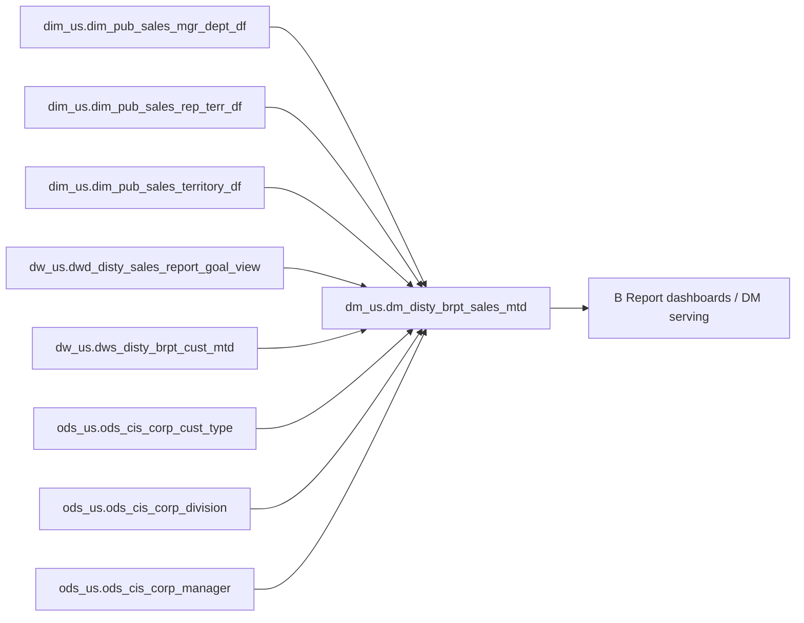

# DM: B Report profitability serving aggregation (mtd) by business slice (`dm_us.dm_disty_brpt_sales_mtd`)

- artifact_type: etl_table
- artifact_id: dm_us.dm_disty_brpt_sales_mtd
- domain: b-report-us
- one_line_purpose: B Report profitability serving aggregation (mtd) by business slice
- layer_type: DM
- source_kind: etl_sql
- evidence_source: source/contracts/b-report-us/bitbicket_etl/dm_disty_brpt_sales_mtd/Customer/python/dm_disty_brpt_sales_mtd.py
- knowledgebase_path: target/knowledgebase/b-report-us/dm_disty_brpt_sales_mtd.md
- contract_source: source/contracts/b-report-us/tables/dm_disty_brpt_sales_mtd.md

---

## L1 Data Foundation

### Identity and physical mapping
- **Table:** `dm_us.dm_disty_brpt_sales_mtd`
- **Layer type:** DM
- **Canonical / derived:** Derived aggregation/serving (ETL-loaded)
- **Owner team:** Not documented in repository

### Grain, scope, exclusions
- **Grain:** month-to-date cumulative through each date_flag
- **Scope:** US disty B Report shipped-order P&L and performance metrics.
- **Partition:** `month_no` — resolved from Azkaban/bootstrap parameters (see L4).
- **Natural key:** `sales_rep_id`, `sales_sup_id`, `sales_mgr_id`, `sales_dir_id`, `sales_vp_id`, `company_no`
- **Exclusions:** Non-US schemas, backup/temp table variants (`_bkp`, `_temp`), and non-shipped-order scenarios.

### Cross-engine presence
| Engine | Present | Canonical FQN | Notes |
|--------|---------|---------------|-------|
| Hive | yes | `dm_${country}.dm_disty_brpt_sales_mtd` | ETL target in Bitbucket script |
| Vertica | yes | `dm_us.dm_disty_brpt_sales_mtd` | Contract marks Vertica verified |

### Physical schema reference
| Field | Value |
|-------|-------|
| **Authoritative catalog** | WKB L1 storage seed (not duplicated in this file) |
| **entity_id** | `dm_us.dm_disty_brpt_sales_mtd` |
| **l1_catalog_seed** | `target/storage/wkb/snapshots/_snapshot_id_template/l1_catalog/vertica_dm_us_dm_disty_brpt_sales_mtd.json` |
| **column_count** | 146 |
| **partition_keys** | `month_no` |
| **ddl_source** | B Report contract catalog and/or VERTICA/vcdisty DDL |
| **retrieval** | `python -m tools.wkb.indexing.run_query --query "b-report-us dm_disty_brpt_sales_mtd schema" --intent find_table_schema` |

### Lineage
- **upstream:** dim_us.dim_pub_sales_mgr_dept_df, dim_us.dim_pub_sales_rep_terr_df, dim_us.dim_pub_sales_territory_df, dw_us.dwd_disty_sales_report_goal_view, dw_us.dws_disty_brpt_cust_mtd, ods_us.ods_cis_corp_cust_type — `source/contracts/b-report-us/bitbicket_etl/dm_disty_brpt_sales_mtd/Customer/python/dm_disty_brpt_sales_mtd.py`
- **downstream:** B Report DM/DWS serving and dashboards (per contract L6 when present) — `source/contracts/b-report-us/tables/dm_disty_brpt_sales_mtd.md`

### Freshness and load path
| Item | Value |
|------|-------|
| Load pattern | INSERT OVERWRITE partition reload (per ETL SQL) |
| Schedule | Not documented in repository |
| Parameters | `country`, `date_flag`, `dt_month`, `month_no`, `etl_timestamp`, `flow_run_type` |

---

## L2 Declarative Knowledge

### Business purpose
B Report profitability serving aggregation (mtd) by business slice

This Knowledgebase entry documents the Bitbucket ETL load script in `source/contracts/b-report-us/bitbicket_etl/`. Business semantics align with the B Report US contract catalog when present.

### Audience and use cases
| Audience | How they benefit |
|----------|-----------------|
| **B Report / P&L analytics** | Consumers: PM, Sales, Buyer, BD and executive analysis views. |
| **Sales / PM / finance** | Shipped-order and margin metrics at documented grain (month-to-date cumulative through each date_flag). |
| **Data engineering** | Verified upstream/downstream objects with `file:line` evidence from ETL SQL. |

### Fact key resolution
- Order-line hub for B Report P&L: `dw_us.dwd_disty_brpt_orders_pl_etl_mi` when debugging transaction-level metrics.
- This table grain: month-to-date cumulative through each date_flag.
- Label-on/off and order_type adjustments: see `source/contracts/b-report-us/metric-index.md`.

### Time field semantics
- **`month_no`:** primary partition / filter for this load; value supplied by Azkaban `conf.get` parameters (see L4).
- **Period semantics:** month-to-date cumulative through each date_flag.


### Metrics served

| Category | Column | Logical metric | Business reading |
|----------|--------|----------------|------------------|
| P&L adjustment / measure | `bo_gm_amt` | `bo_gm_amt` | bo_gm_amt at mtd grain |
| P&L adjustment / measure | `bo_gross_cost` | `bo_gross_cost` | bo_gross_cost at mtd grain |
| P&L adjustment / measure | `bo_gross_sales` | `bo_gross_sales` | bo_gross_sales at mtd grain |
| P&L adjustment / measure | `btl_sales` | `btl_sales` | btl_sales at mtd grain |
| P&L adjustment / measure | `cust_finance_sales` | `cust_finance_sales` | cust_finance_sales at mtd grain |
| P&L adjustment / measure | `ds_cost` | `ds_cost` | ds_cost at mtd grain |
| P&L adjustment / measure | `ds_sales` | `ds_sales` | ds_sales at mtd grain |
| P&L adjustment / measure | `fx_cost` | `fx_cost` | fx_cost at mtd grain |
| Governed profitability | `gm_amt` | `gm_amt` | gm_amt at mtd grain |
| P&L adjustment / measure | `goal_cust_cnt` | `goal_cust_cnt` | goal_cust_cnt at goal_target grain |
| P&L adjustment / measure | `goal_dos` | `goal_dos` | goal_dos at goal_target grain |
| P&L adjustment / measure | `goal_gm` | `goal_gm` | goal_gm at goal_target grain |
| P&L adjustment / measure | `goal_ngm` | `goal_ngm` | goal_ngm at goal_target grain |
| P&L adjustment / measure | `goal_nsales` | `goal_nsales` | goal_nsales at goal_target grain |
| P&L adjustment / measure | `goal_opl_gm` | `goal_opl_gm` | goal_opl_gm at goal_target grain |
| P&L adjustment / measure | `goal_oplgm_plus_amt` | `goal_oplgm_plus_amt` | goal_oplgm_plus_amt at goal_target grain |
| P&L adjustment / measure | `goal_pdt` | `goal_pdt` | goal_pdt at goal_target grain |
| P&L adjustment / measure | `goal_soft_sales` | `goal_soft_sales` | goal_soft_sales at goal_target grain |
| P&L adjustment / measure | `goal_tgm` | `goal_tgm` | goal_tgm at goal_target grain |
| P&L adjustment / measure | `goal_total_btl` | `goal_total_btl` | goal_total_btl at goal_target grain |
| P&L adjustment / measure | `gross_cost` | `gross_cost` | gross_cost at mtd grain |
| Governed profitability | `gross_sales` | `gross_sales` | gross_sales at mtd grain |
| P&L adjustment / measure | `hc_sales` | `hc_sales` | hc_sales at mtd grain |
| P&L adjustment / measure | `inv_cost` | `inv_cost` | inv_cost at mtd grain |
| P&L adjustment / measure | `net_cost` | `net_cost` | net_cost at mtd grain |
| Governed profitability | `net_sales` | `net_sales` | net_sales at mtd grain |
| Governed profitability | `ngm_amt` | `ngm_amt` | ngm_amt at mtd grain |
| Governed profitability | `oplgm_amt` | `oplgm_amt` | oplgm_amt at mtd grain |
| Governed profitability | `oplgm_plus_amt` | `oplgm_plus_amt` | oplgm_plus_amt at mtd grain |
| P&L adjustment / measure | `others_sales` | `others_sales` | others_sales at mtd grain |
| P&L adjustment / measure | `rr_cost` | `rr_cost` | rr_cost at mtd grain |
| Governed profitability | `rr_gm` | `gm_amt` | gm_amt at mtd grain |
| Governed profitability | `rr_ngm` | `ngm_amt` | ngm_amt at mtd grain |
| Governed profitability | `rr_opl` | `oplgm_amt` | oplgm_amt at mtd grain |
| Governed profitability | `rr_oplgm_plus_amt` | `oplgm_plus_amt` | oplgm_plus_amt at mtd grain |
| Governed profitability | `rr_sales` | `net_sales` | net_sales at mtd grain |
| Governed profitability | `rr_tgm` | `tgm_amt` | tgm_amt at mtd grain |
| Governed profitability | `rr_total_btl` | `total_btl` | total_btl at mtd grain |
| P&L adjustment / measure | `scm_cost` | `scm_cost` | scm_cost at mtd grain |
| P&L adjustment / measure | `so_gm_amt` | `so_gm_amt` | so_gm_amt at mtd grain |
| P&L adjustment / measure | `so_gross_cost` | `so_gross_cost` | so_gross_cost at mtd grain |
| P&L adjustment / measure | `so_gross_sales` | `so_gross_sales` | so_gross_sales at mtd grain |
| P&L adjustment / measure | `stock_cost` | `stock_cost` | stock_cost at mtd grain |
| P&L adjustment / measure | `stock_sales` | `stock_sales` | stock_sales at mtd grain |
| Governed profitability | `tgm_amt` | `tgm_amt` | tgm_amt at mtd grain |
| Governed profitability | `total_btl` | `total_btl` | total_btl at mtd grain |
| P&L adjustment / measure | `trans_btl_sales` | `trans_btl_sales` | trans_btl_sales at mtd grain |

### Metric serving map

**Formula authority:** [`source/contracts/b-report-us/metric-index.md`](../../source/contracts/b-report-us/metric-index.md)

| Logical metric | Period scope | Physical column | Formula reference |
|----------------|--------------|-----------------|-------------------|
| `bo_gm_amt` | mtd | `bo_gm_amt` | Not in metric-index.md |
| `bo_gross_cost` | mtd | `bo_gross_cost` | Not in metric-index.md |
| `bo_gross_sales` | mtd | `bo_gross_sales` | Not in metric-index.md |
| `btl_sales` | mtd | `btl_sales` | Not in metric-index.md |
| `cust_finance_sales` | mtd | `cust_finance_sales` | Not in metric-index.md |
| `ds_cost` | mtd | `ds_cost` | Not in metric-index.md |
| `ds_sales` | mtd | `ds_sales` | Not in metric-index.md |
| `fx_cost` | mtd | `fx_cost` | Not in metric-index.md |
| `gm_amt` | mtd | `gm_amt` | `source/contracts/b-report-us/metric-index.md#gm_amt` |
| `goal_cust_cnt` | goal_target | `goal_cust_cnt` | Not in metric-index.md |
| `goal_dos` | goal_target | `goal_dos` | Not in metric-index.md |
| `goal_gm` | goal_target | `goal_gm` | Not in metric-index.md |
| `goal_ngm` | goal_target | `goal_ngm` | Not in metric-index.md |
| `goal_nsales` | goal_target | `goal_nsales` | Not in metric-index.md |
| `goal_opl_gm` | goal_target | `goal_opl_gm` | Not in metric-index.md |
| `goal_oplgm_plus_amt` | goal_target | `goal_oplgm_plus_amt` | Not in metric-index.md |
| `goal_pdt` | goal_target | `goal_pdt` | Not in metric-index.md |
| `goal_soft_sales` | goal_target | `goal_soft_sales` | Not in metric-index.md |
| `goal_tgm` | goal_target | `goal_tgm` | Not in metric-index.md |
| `goal_total_btl` | goal_target | `goal_total_btl` | Not in metric-index.md |
| `gross_cost` | mtd | `gross_cost` | Not in metric-index.md |
| `gross_sales` | mtd | `gross_sales` | `source/contracts/b-report-us/metric-index.md#gross_sales` |
| `hc_sales` | mtd | `hc_sales` | Not in metric-index.md |
| `inv_cost` | mtd | `inv_cost` | Not in metric-index.md |
| `net_cost` | mtd | `net_cost` | Not in metric-index.md |
| `net_sales` | mtd | `net_sales` | `source/contracts/b-report-us/metric-index.md#net_sales` |
| `ngm_amt` | mtd | `ngm_amt` | `source/contracts/b-report-us/metric-index.md#ngm_amt` |
| `oplgm_amt` | mtd | `oplgm_amt` | `source/contracts/b-report-us/metric-index.md#oplgm_amt` |
| `oplgm_plus_amt` | mtd | `oplgm_plus_amt` | `source/contracts/b-report-us/metric-index.md#oplgm_plus_amt` |
| `others_sales` | mtd | `others_sales` | Not in metric-index.md |
| `rr_cost` | mtd | `rr_cost` | Not in metric-index.md |
| `gm_amt` | mtd | `rr_gm` | `source/contracts/b-report-us/metric-index.md#gm_amt` |
| `ngm_amt` | mtd | `rr_ngm` | `source/contracts/b-report-us/metric-index.md#ngm_amt` |
| `oplgm_amt` | mtd | `rr_opl` | `source/contracts/b-report-us/metric-index.md#oplgm_amt` |
| `oplgm_plus_amt` | mtd | `rr_oplgm_plus_amt` | `source/contracts/b-report-us/metric-index.md#oplgm_plus_amt` |
| `net_sales` | mtd | `rr_sales` | `source/contracts/b-report-us/metric-index.md#net_sales` |
| `tgm_amt` | mtd | `rr_tgm` | `source/contracts/b-report-us/metric-index.md#tgm_amt` |
| `total_btl` | mtd | `rr_total_btl` | `source/contracts/b-report-us/metric-index.md#total_btl` |
| `scm_cost` | mtd | `scm_cost` | Not in metric-index.md |
| `so_gm_amt` | mtd | `so_gm_amt` | Not in metric-index.md |
| `so_gross_cost` | mtd | `so_gross_cost` | Not in metric-index.md |
| `so_gross_sales` | mtd | `so_gross_sales` | Not in metric-index.md |
| `stock_cost` | mtd | `stock_cost` | Not in metric-index.md |
| `stock_sales` | mtd | `stock_sales` | Not in metric-index.md |
| `tgm_amt` | mtd | `tgm_amt` | `source/contracts/b-report-us/metric-index.md#tgm_amt` |
| `total_btl` | mtd | `total_btl` | `source/contracts/b-report-us/metric-index.md#total_btl` |
| `trans_btl_sales` | mtd | `trans_btl_sales` | Not in metric-index.md |

### etl_metrics

Formulas below are sourced from [`source/contracts/b-report-us/metric-index.md`](../../source/contracts/b-report-us/metric-index.md) for logical metrics present on this table.
Index formulas are canonical: this enricher copies them into KB and never overwrites `final_effective_formula_sql` in the metric-index.

#### `gm_amt`
- **Source:** [metric-index.md](../../source/contracts/b-report-us/metric-index.md#gm_amt)
- **Business definition:** Core line gross margin before BTL/PDT and full NGM adjustment chain.
```sql
(nvl(u_price,0) - nvl(if(sales_cost is null, u_cost, sales_cost), 0)) * nvl(ship_qty,0)
```

#### `gross_sales`
- **Source:** [metric-index.md](../../source/contracts/b-report-us/metric-index.md#gross_sales)
- **Business definition:** Shipped quantity times unit price without sum expense.
```sql
nvl(ship_qty,0) * nvl(u_price,0)
```

#### `net_sales`
- **Source:** [metric-index.md](../../source/contracts/b-report-us/metric-index.md#net_sales)
- **Business definition:** Shipped quantity times unit price plus per-unit sum expense (net of returns scope per order_type filter).
```sql
nvl(ship_qty,0) * (nvl(u_price,0) + nvl(u_sum_expense,0))
```

#### `ngm_amt`
- **Source:** [metric-index.md](../../source/contracts/b-report-us/metric-index.md#ngm_amt)
- **Business definition:** Net Gross Margin — final P&L profitability metric for PM/executive use after full adjustment chain.
```sql
( (nvl(u_price,0)-nvl(if(sales_cost is null,u_cost,sales_cost),0))*nvl(ship_qty,0)
      + nvl(BTL,0) + nvl(TRANS_BTL,0) + nvl(ONE_TIME_BTL,0) + nvl(HBTL,0) + nvl(SCM_PROFIT_ADJ,0)
      + nvl(BTL_BACKOUT,0) + nvl(PDT,0) + nvl(AP_FINANCE,0) + nvl(SCM_COST,0) + nvl(SCM_RISK,0)
      + nvl(INV_COST,0) + nvl(INV_RESERVE,0) + nvl(INFRASTRUCTURE,0) + nvl(MARKETING,0)
      + nvl(FRT_OUT_LOAD,0) + nvl(FRT_OUT_EXP,0) + nvl(FRT_OB_RECOVERY,0) + nvl(FRT_IB_RECOVERY,0)
      + nvl(WHOH_PACK,0) + nvl(CSGN_EDI_FEE,0) + nvl(CUST_FINANCE,0) * nvl(c.NGM_CFN_RATE,1)
      + nvl(AR_FIN_RECOVERY,0) + nvl(CR_RISK_CTERM,0) * nvl(c.NGM_CRCT_RATE,1)
      + nvl(CUST_PMT_DISC,0) + nvl(CUST_REBATE,0) + nvl(CVR_RM,0) + nvl(DIRECT_CREDIT,0)
      + nvl(FLR_SYNNEX,0) + nvl(RMA,0) + nvl(MOF,0) + nvl(MARGIN_SHARE,0) + nvl(AP_ADJ,0)
      + nvl(CORPORATE,0) + nvl(HC_PM,0) + nvl(HC_BD,0) + nvl(HC_SALES,0) + nvl(ORDER_OVERHEAD,0)
      + nvl(OTHERS,0) + nvl(MFG_OH,0) + nvl(SFS,0) )
```

#### `oplgm_amt`
- **Source:** [metric-index.md](../../source/contracts/b-report-us/metric-index.md#oplgm_amt)
- **Business definition:** Order Profit and Loss for sales commission logic.
```sql
( (nvl(u_price,0)-nvl(if(sales_cost is null,u_cost,sales_cost),0))*nvl(ship_qty,0)
      + nvl(BTL_BACKOUT,0) + nvl(BTL_SALES,0) + nvl(TRANS_BTL_SALES,0)
      + nvl(PDT,0) + nvl(CUST_PMT_DISC,0) + nvl(CUST_REBATE,0) + nvl(CVR_RM,0)
      + nvl(FRT_OUT_LOAD,0) + nvl(FRT_OUT_EXP,0) + nvl(FRT_OB_RECOVERY,0)
      + nvl(MOF,0) + nvl(CUST_FINANCE_SALES,0) * nvl(c.CPL_CFN_RATE,1)
      + nvl(AR_FIN_RECOVERY,0) + nvl(CR_RISK_CTERM,0) * nvl(c.CPL_CRCT_RATE,1)
      + nvl(FLR_SYNNEX,0) + nvl(DIRECT_CREDIT,0) + nvl(WHOH_PACK,0) + nvl(RMA,0)
      + nvl(ORDER_OVERHEAD,0) + nvl(CSGN_EDI_FEE,0) + nvl(FRT_IB_RECOVERY,0)
      + nvl(OTHERS_SALES,0) + nvl(SFS,0)
      + (nvl(u_price,0)+nvl(u_sum_expense,0))*nvl(ship_qty,0) * nvl(c.CPL_COOP_RATE,0) )
```

#### `oplgm_plus_amt`
- **Source:** [metric-index.md](../../source/contracts/b-report-us/metric-index.md#oplgm_plus_amt)
- **Business definition:** Extended OPL metric including additional direct cost/expense components beyond base OPL.
```sql
derived from oplgm_amt chain with additional OPL+ components (see oplgm_plus_amt_calcproc column on DWD)
```

#### `tgm_amt`
- **Source:** [metric-index.md](../../source/contracts/b-report-us/metric-index.md#tgm_amt)
- **Business definition:** Gross margin with core BTL/PDT and related trade-term add-backs (pre-full NGM overhead chain).
```sql
gm_amt + nvl(BTL,0) + nvl(TRANS_BTL,0) + nvl(ONE_TIME_BTL,0) + nvl(HBTL,0) + nvl(SCM_PROFIT_ADJ,0) + nvl(BTL_BACKOUT,0) + nvl(PDT,0)
```

#### `total_btl`
- **Source:** [metric-index.md](../../source/contracts/b-report-us/metric-index.md#total_btl)
- **Business definition:** Aggregate of Below-The-Line trade term adjustment components (BTL, TRANS_BTL, ONE_TIME_BTL, HBTL, etc.).
```sql
nvl(BTL,0) + nvl(TRANS_BTL,0) + nvl(ONE_TIME_BTL,0) + nvl(HBTL,0) + nvl(SCM_PROFIT_ADJ,0) + nvl(BTL_BACKOUT,0)
```

---

## L3 Procedural Knowledge

### Query and routing rules
**Business filters:** Use `month_no` (or `month_no` for month-indexed DM tables) for reporting scope.
**Technical predicates (load only):** Partition predicate on INSERT OVERWRITE; see Key filters below.

### Dimension join patterns
| Dimension FQN | Join keys | Purpose | Evidence |
|---------------|-----------|---------|----------|
| (ETL join) | — | left join (select * from dim_${country}.dim_pub_sales_territory_df | `source/contracts/b-report-us/bitbicket_etl/dm_disty_brpt_sales_mtd/Customer/python/dm_disty_brpt_sales_mtd.py` |

### Key filters and ETL business logic
- `date_flag = '${date_flag}'` — inferred from ETL WHERE clause
- By default, do **not** apply `dim_us.dim_pub_order_type.sales = 'Y'`, `virtual_type = 0`, or `order_type = 1`.
- Apply the order-type / shipped-order join (`sales = 'Y'`) **only when the question explicitly says shipped orders only** (or equivalent).
- Apply `virtual_type = 0` or a specific `order_type` **only when the question explicitly requests that scope**.
- For profitability metrics on this table, always filter `segment_exclude = 'N'` (see `source/ref/b-report-us/special_logic.txt`).
- Technical sync predicates (partition/date load guards) are not business filters.

### Standard time-filter SQL
```sql
-- Reporting filter pattern (replace partition value from L4 trace)
SELECT *
FROM dm_us.dm_disty_brpt_sales_mtd
WHERE month_no = '${partition_value}';
```

### End-to-end flow
1. Read upstream warehouse objects (dim_us.dim_pub_sales_mgr_dept_df, dim_us.dim_pub_sales_rep_terr_df, dim_us.dim_pub_sales_territory_df, dw_us.dwd_disty_sales_report_goal_view).
2. Apply CTE aggregations and business joins inside ETL SQL.
3. INSERT OVERWRITE into `dm_us.dm_disty_brpt_sales_mtd` partition `month_no`.
4. Sync to Vertica for B Report consumption (sync job not verified in this repository unless cited below).



### Base tables register
| Object | Role in this job |
|--------|------------------|
| `dim_us.dim_pub_sales_mgr_dept_df` | source |
| `dim_us.dim_pub_sales_rep_terr_df` | source |
| `dim_us.dim_pub_sales_territory_df` | source |
| `dm_us.dm_disty_brpt_sales_mtd` | target |
| `dw_us.dwd_disty_sales_report_goal_view` | source |
| `dw_us.dws_disty_brpt_cust_mtd` | source |
| `ods_us.ods_cis_corp_cust_type` | source |
| `ods_us.ods_cis_corp_division` | source |
| `ods_us.ods_cis_corp_manager` | source |
| `ods_us.ods_cis_corp_territory_group` | source |
| `ods_us.ods_cis_corp_territory_sub_group` | source |

### Step-by-step logic
#### Step 1 — CTE `table_goal`

**Source:** intermediate aggregation inside ETL SQL — `source/contracts/b-report-us/bitbicket_etl/dm_disty_brpt_sales_mtd/Customer/python/dm_disty_brpt_sales_mtd.py`

#### Step 2 — CTE `table_dws`

**Source:** intermediate aggregation inside ETL SQL — `source/contracts/b-report-us/bitbicket_etl/dm_disty_brpt_sales_mtd/Customer/python/dm_disty_brpt_sales_mtd.py`

#### Step 3 — dimension and reference joins

**Join keys:** see Dimension join patterns table (parsed from ETL SQL).

### Column / field derivations (from ETL SQL)

| target_column | expression_sql | upstream_columns | upstream_tables | transform_kind | evidence |
|---------------|----------------|------------------|-----------------|----------------|----------|
| `month_no` | `${month_no}` | `month_no` | `table_dws`, `table_goal`, `dim_${country}.dim_pub_sales_territory_df`, `dim_${country}.dim_pub_sales_rep_terr_df`, `dim_${country}.dim_pub_sales_mgr_dept_df`, `ods_${country}.ods_cis_corp_territory_sub_group`, `ods_${country}.ods_cis_corp_territory_group`, `ods_${country}.ods_cis_corp_cust_type`, `ods_${country}.ods_cis_corp_division`, `ods_${country}.ods_cis_corp_manager` | partial | `source/contracts/b-report-us/bitbicket_etl/dm_disty_brpt_sales_mtd/Customer/python/dm_disty_brpt_sales_mtd.py:67` |
| `sales_rep_id` | `coalesce(table_dws.sales_rep_id,table1.sales_rep_id,-3)` | `sales_rep_id` | `table_dws`, `table_goal`, `dim_${country}.dim_pub_sales_territory_df`, `dim_${country}.dim_pub_sales_rep_terr_df`, `dim_${country}.dim_pub_sales_mgr_dept_df`, `ods_${country}.ods_cis_corp_territory_sub_group`, `ods_${country}.ods_cis_corp_territory_group`, `ods_${country}.ods_cis_corp_cust_type`, `ods_${country}.ods_cis_corp_division`, `ods_${country}.ods_cis_corp_manager` | coalesce | `source/contracts/b-report-us/bitbicket_etl/dm_disty_brpt_sales_mtd/Customer/python/dm_disty_brpt_sales_mtd.py:228` |
| `sales_rep_name` | `concat_ws(' ', table_manager.firstname, table_manager.lastname)` | `concat_ws`, `firstname`, `lastname` | `table_dws`, `table_goal`, `dim_${country}.dim_pub_sales_territory_df`, `dim_${country}.dim_pub_sales_rep_terr_df`, `dim_${country}.dim_pub_sales_mgr_dept_df`, `ods_${country}.ods_cis_corp_territory_sub_group`, `ods_${country}.ods_cis_corp_territory_group`, `ods_${country}.ods_cis_corp_cust_type`, `ods_${country}.ods_cis_corp_division`, `ods_${country}.ods_cis_corp_manager` | udf | `source/contracts/b-report-us/bitbicket_etl/dm_disty_brpt_sales_mtd/Customer/python/dm_disty_brpt_sales_mtd.py:229` |
| `sales_sup_id` | `coalesce(table_dws.sales_sup_id,table2.manager_id,-3)` | `sales_sup_id`, `manager_id` | `table_dws`, `table_goal`, `dim_${country}.dim_pub_sales_territory_df`, `dim_${country}.dim_pub_sales_rep_terr_df`, `dim_${country}.dim_pub_sales_mgr_dept_df`, `ods_${country}.ods_cis_corp_territory_sub_group`, `ods_${country}.ods_cis_corp_territory_group`, `ods_${country}.ods_cis_corp_cust_type`, `ods_${country}.ods_cis_corp_division`, `ods_${country}.ods_cis_corp_manager` | coalesce | `source/contracts/b-report-us/bitbicket_etl/dm_disty_brpt_sales_mtd/Customer/python/dm_disty_brpt_sales_mtd.py:230` |
| `sales_sup_name` | `concat_ws(' ', table_manager2.firstname, table_manager2.lastname)` | `concat_ws`, `firstname`, `lastname` | `table_dws`, `table_goal`, `dim_${country}.dim_pub_sales_territory_df`, `dim_${country}.dim_pub_sales_rep_terr_df`, `dim_${country}.dim_pub_sales_mgr_dept_df`, `ods_${country}.ods_cis_corp_territory_sub_group`, `ods_${country}.ods_cis_corp_territory_group`, `ods_${country}.ods_cis_corp_cust_type`, `ods_${country}.ods_cis_corp_division`, `ods_${country}.ods_cis_corp_manager` | udf | `source/contracts/b-report-us/bitbicket_etl/dm_disty_brpt_sales_mtd/Customer/python/dm_disty_brpt_sales_mtd.py:231` |
| `sales_mgr_id` | `coalesce(table_dws.sales_mgr_id,table3.manager_id,-3)` | `sales_mgr_id`, `manager_id` | `table_dws`, `table_goal`, `dim_${country}.dim_pub_sales_territory_df`, `dim_${country}.dim_pub_sales_rep_terr_df`, `dim_${country}.dim_pub_sales_mgr_dept_df`, `ods_${country}.ods_cis_corp_territory_sub_group`, `ods_${country}.ods_cis_corp_territory_group`, `ods_${country}.ods_cis_corp_cust_type`, `ods_${country}.ods_cis_corp_division`, `ods_${country}.ods_cis_corp_manager` | coalesce | `source/contracts/b-report-us/bitbicket_etl/dm_disty_brpt_sales_mtd/Customer/python/dm_disty_brpt_sales_mtd.py:232` |
| `sales_mgr_name` | `concat_ws(' ', table_manager3.firstname, table_manager3.lastname)` | `concat_ws`, `firstname`, `lastname` | `table_dws`, `table_goal`, `dim_${country}.dim_pub_sales_territory_df`, `dim_${country}.dim_pub_sales_rep_terr_df`, `dim_${country}.dim_pub_sales_mgr_dept_df`, `ods_${country}.ods_cis_corp_territory_sub_group`, `ods_${country}.ods_cis_corp_territory_group`, `ods_${country}.ods_cis_corp_cust_type`, `ods_${country}.ods_cis_corp_division`, `ods_${country}.ods_cis_corp_manager` | udf | `source/contracts/b-report-us/bitbicket_etl/dm_disty_brpt_sales_mtd/Customer/python/dm_disty_brpt_sales_mtd.py:233` |
| `sales_dir_id` | `coalesce(table_dws.sales_dir_id,table4.manager_id)` | `sales_dir_id`, `manager_id` | `table_dws`, `table_goal`, `dim_${country}.dim_pub_sales_territory_df`, `dim_${country}.dim_pub_sales_rep_terr_df`, `dim_${country}.dim_pub_sales_mgr_dept_df`, `ods_${country}.ods_cis_corp_territory_sub_group`, `ods_${country}.ods_cis_corp_territory_group`, `ods_${country}.ods_cis_corp_cust_type`, `ods_${country}.ods_cis_corp_division`, `ods_${country}.ods_cis_corp_manager` | coalesce | `source/contracts/b-report-us/bitbicket_etl/dm_disty_brpt_sales_mtd/Customer/python/dm_disty_brpt_sales_mtd.py:234` |
| `sales_dir_name` | `concat_ws(' ', table_manager4.firstname, table_manager4.lastname)` | `concat_ws`, `firstname`, `lastname` | `table_dws`, `table_goal`, `dim_${country}.dim_pub_sales_territory_df`, `dim_${country}.dim_pub_sales_rep_terr_df`, `dim_${country}.dim_pub_sales_mgr_dept_df`, `ods_${country}.ods_cis_corp_territory_sub_group`, `ods_${country}.ods_cis_corp_territory_group`, `ods_${country}.ods_cis_corp_cust_type`, `ods_${country}.ods_cis_corp_division`, `ods_${country}.ods_cis_corp_manager` | udf | `source/contracts/b-report-us/bitbicket_etl/dm_disty_brpt_sales_mtd/Customer/python/dm_disty_brpt_sales_mtd.py:235` |
| `sales_vp_id` | `coalesce(table_dws.sales_vp_id,table5.manager_id)` | `sales_vp_id`, `manager_id` | `table_dws`, `table_goal`, `dim_${country}.dim_pub_sales_territory_df`, `dim_${country}.dim_pub_sales_rep_terr_df`, `dim_${country}.dim_pub_sales_mgr_dept_df`, `ods_${country}.ods_cis_corp_territory_sub_group`, `ods_${country}.ods_cis_corp_territory_group`, `ods_${country}.ods_cis_corp_cust_type`, `ods_${country}.ods_cis_corp_division`, `ods_${country}.ods_cis_corp_manager` | coalesce | `source/contracts/b-report-us/bitbicket_etl/dm_disty_brpt_sales_mtd/Customer/python/dm_disty_brpt_sales_mtd.py:236` |
| `sales_vp_name` | `concat_ws(' ', table_manager5.firstname, table_manager5.lastname)` | `concat_ws`, `firstname`, `lastname` | `table_dws`, `table_goal`, `dim_${country}.dim_pub_sales_territory_df`, `dim_${country}.dim_pub_sales_rep_terr_df`, `dim_${country}.dim_pub_sales_mgr_dept_df`, `ods_${country}.ods_cis_corp_territory_sub_group`, `ods_${country}.ods_cis_corp_territory_group`, `ods_${country}.ods_cis_corp_cust_type`, `ods_${country}.ods_cis_corp_division`, `ods_${country}.ods_cis_corp_manager` | udf | `source/contracts/b-report-us/bitbicket_etl/dm_disty_brpt_sales_mtd/Customer/python/dm_disty_brpt_sales_mtd.py:237` |
| `company_no` | `coalesce(table_dws.company_no,table_goal.company_no)` | `company_no` | `table_dws`, `table_goal`, `dim_${country}.dim_pub_sales_territory_df`, `dim_${country}.dim_pub_sales_rep_terr_df`, `dim_${country}.dim_pub_sales_mgr_dept_df`, `ods_${country}.ods_cis_corp_territory_sub_group`, `ods_${country}.ods_cis_corp_territory_group`, `ods_${country}.ods_cis_corp_cust_type`, `ods_${country}.ods_cis_corp_division`, `ods_${country}.ods_cis_corp_manager` | coalesce | `source/contracts/b-report-us/bitbicket_etl/dm_disty_brpt_sales_mtd/Customer/python/dm_disty_brpt_sales_mtd.py:238` |
| `cust_terr` | `coalesce(table_dws.cust_terr,table_goal.cust_terr,-3)` | `cust_terr` | `table_dws`, `table_goal`, `dim_${country}.dim_pub_sales_territory_df`, `dim_${country}.dim_pub_sales_rep_terr_df`, `dim_${country}.dim_pub_sales_mgr_dept_df`, `ods_${country}.ods_cis_corp_territory_sub_group`, `ods_${country}.ods_cis_corp_territory_group`, `ods_${country}.ods_cis_corp_cust_type`, `ods_${country}.ods_cis_corp_division`, `ods_${country}.ods_cis_corp_manager` | coalesce | `source/contracts/b-report-us/bitbicket_etl/dm_disty_brpt_sales_mtd/Customer/python/dm_disty_brpt_sales_mtd.py:240` |
| `terr_sub_group` | `coalesce(table_dws.terr_sub_group,table_terr.sub_group_id,-3)` | `terr_sub_group`, `sub_group_id` | `table_dws`, `table_goal`, `dim_${country}.dim_pub_sales_territory_df`, `dim_${country}.dim_pub_sales_rep_terr_df`, `dim_${country}.dim_pub_sales_mgr_dept_df`, `ods_${country}.ods_cis_corp_territory_sub_group`, `ods_${country}.ods_cis_corp_territory_group`, `ods_${country}.ods_cis_corp_cust_type`, `ods_${country}.ods_cis_corp_division`, `ods_${country}.ods_cis_corp_manager` | coalesce | `source/contracts/b-report-us/bitbicket_etl/dm_disty_brpt_sales_mtd/Customer/python/dm_disty_brpt_sales_mtd.py:241` |
| `terr_group` | `coalesce(table_dws.terr_group,table_terr.group_id,-3)` | `terr_group`, `group_id` | `table_dws`, `table_goal`, `dim_${country}.dim_pub_sales_territory_df`, `dim_${country}.dim_pub_sales_rep_terr_df`, `dim_${country}.dim_pub_sales_mgr_dept_df`, `ods_${country}.ods_cis_corp_territory_sub_group`, `ods_${country}.ods_cis_corp_territory_group`, `ods_${country}.ods_cis_corp_cust_type`, `ods_${country}.ods_cis_corp_division`, `ods_${country}.ods_cis_corp_manager` | coalesce | `source/contracts/b-report-us/bitbicket_etl/dm_disty_brpt_sales_mtd/Customer/python/dm_disty_brpt_sales_mtd.py:242` |
| `cust_type` | `coalesce(table_dws.cust_type,table_goal.cust_type,-3)` | `cust_type` | `table_dws`, `table_goal`, `dim_${country}.dim_pub_sales_territory_df`, `dim_${country}.dim_pub_sales_rep_terr_df`, `dim_${country}.dim_pub_sales_mgr_dept_df`, `ods_${country}.ods_cis_corp_territory_sub_group`, `ods_${country}.ods_cis_corp_territory_group`, `ods_${country}.ods_cis_corp_cust_type`, `ods_${country}.ods_cis_corp_division`, `ods_${country}.ods_cis_corp_manager` | coalesce | `source/contracts/b-report-us/bitbicket_etl/dm_disty_brpt_sales_mtd/Customer/python/dm_disty_brpt_sales_mtd.py:243` |
| `division` | `coalesce(table_dws.division,table_goal.division,-3)` | `division` | `table_dws`, `table_goal`, `dim_${country}.dim_pub_sales_territory_df`, `dim_${country}.dim_pub_sales_rep_terr_df`, `dim_${country}.dim_pub_sales_mgr_dept_df`, `ods_${country}.ods_cis_corp_territory_sub_group`, `ods_${country}.ods_cis_corp_territory_group`, `ods_${country}.ods_cis_corp_cust_type`, `ods_${country}.ods_cis_corp_division`, `ods_${country}.ods_cis_corp_manager` | coalesce | `source/contracts/b-report-us/bitbicket_etl/dm_disty_brpt_sales_mtd/Customer/python/dm_disty_brpt_sales_mtd.py:244` |
| `0` | `nvl(table_goal.goal_nsales,0)` | `goal_nsales` | `table_dws`, `table_goal`, `dim_${country}.dim_pub_sales_territory_df`, `dim_${country}.dim_pub_sales_rep_terr_df`, `dim_${country}.dim_pub_sales_mgr_dept_df`, `ods_${country}.ods_cis_corp_territory_sub_group`, `ods_${country}.ods_cis_corp_territory_group`, `ods_${country}.ods_cis_corp_cust_type`, `ods_${country}.ods_cis_corp_division`, `ods_${country}.ods_cis_corp_manager` | coalesce | `source/contracts/b-report-us/bitbicket_etl/dm_disty_brpt_sales_mtd/Customer/python/dm_disty_brpt_sales_mtd.py:246` |
| `0` | `nvl(table_goal.goal_gm,0)` | `goal_gm` | `table_dws`, `table_goal`, `dim_${country}.dim_pub_sales_territory_df`, `dim_${country}.dim_pub_sales_rep_terr_df`, `dim_${country}.dim_pub_sales_mgr_dept_df`, `ods_${country}.ods_cis_corp_territory_sub_group`, `ods_${country}.ods_cis_corp_territory_group`, `ods_${country}.ods_cis_corp_cust_type`, `ods_${country}.ods_cis_corp_division`, `ods_${country}.ods_cis_corp_manager` | coalesce | `source/contracts/b-report-us/bitbicket_etl/dm_disty_brpt_sales_mtd/Customer/python/dm_disty_brpt_sales_mtd.py:247` |
| `0` | `nvl(table_goal.goal_ngm,0)` | `goal_ngm` | `table_dws`, `table_goal`, `dim_${country}.dim_pub_sales_territory_df`, `dim_${country}.dim_pub_sales_rep_terr_df`, `dim_${country}.dim_pub_sales_mgr_dept_df`, `ods_${country}.ods_cis_corp_territory_sub_group`, `ods_${country}.ods_cis_corp_territory_group`, `ods_${country}.ods_cis_corp_cust_type`, `ods_${country}.ods_cis_corp_division`, `ods_${country}.ods_cis_corp_manager` | coalesce | `source/contracts/b-report-us/bitbicket_etl/dm_disty_brpt_sales_mtd/Customer/python/dm_disty_brpt_sales_mtd.py:248` |
| `0` | `nvl(table_goal.goal_opl_gm,0)` | `goal_opl_gm` | `table_dws`, `table_goal`, `dim_${country}.dim_pub_sales_territory_df`, `dim_${country}.dim_pub_sales_rep_terr_df`, `dim_${country}.dim_pub_sales_mgr_dept_df`, `ods_${country}.ods_cis_corp_territory_sub_group`, `ods_${country}.ods_cis_corp_territory_group`, `ods_${country}.ods_cis_corp_cust_type`, `ods_${country}.ods_cis_corp_division`, `ods_${country}.ods_cis_corp_manager` | coalesce | `source/contracts/b-report-us/bitbicket_etl/dm_disty_brpt_sales_mtd/Customer/python/dm_disty_brpt_sales_mtd.py:249` |
| `0` | `nvl(table_goal.goal_tgm,0)` | `goal_tgm` | `table_dws`, `table_goal`, `dim_${country}.dim_pub_sales_territory_df`, `dim_${country}.dim_pub_sales_rep_terr_df`, `dim_${country}.dim_pub_sales_mgr_dept_df`, `ods_${country}.ods_cis_corp_territory_sub_group`, `ods_${country}.ods_cis_corp_territory_group`, `ods_${country}.ods_cis_corp_cust_type`, `ods_${country}.ods_cis_corp_division`, `ods_${country}.ods_cis_corp_manager` | coalesce | `source/contracts/b-report-us/bitbicket_etl/dm_disty_brpt_sales_mtd/Customer/python/dm_disty_brpt_sales_mtd.py:250` |
| `0` | `nvl(table_goal.goal_dos,0)` | `goal_dos` | `table_dws`, `table_goal`, `dim_${country}.dim_pub_sales_territory_df`, `dim_${country}.dim_pub_sales_rep_terr_df`, `dim_${country}.dim_pub_sales_mgr_dept_df`, `ods_${country}.ods_cis_corp_territory_sub_group`, `ods_${country}.ods_cis_corp_territory_group`, `ods_${country}.ods_cis_corp_cust_type`, `ods_${country}.ods_cis_corp_division`, `ods_${country}.ods_cis_corp_manager` | coalesce | `source/contracts/b-report-us/bitbicket_etl/dm_disty_brpt_sales_mtd/Customer/python/dm_disty_brpt_sales_mtd.py:251` |
| `0` | `nvl(table_goal.goal_pdt,0)` | `goal_pdt` | `table_dws`, `table_goal`, `dim_${country}.dim_pub_sales_territory_df`, `dim_${country}.dim_pub_sales_rep_terr_df`, `dim_${country}.dim_pub_sales_mgr_dept_df`, `ods_${country}.ods_cis_corp_territory_sub_group`, `ods_${country}.ods_cis_corp_territory_group`, `ods_${country}.ods_cis_corp_cust_type`, `ods_${country}.ods_cis_corp_division`, `ods_${country}.ods_cis_corp_manager` | coalesce | `source/contracts/b-report-us/bitbicket_etl/dm_disty_brpt_sales_mtd/Customer/python/dm_disty_brpt_sales_mtd.py:252` |
| `0` | `nvl(table_goal.goal_total_btl,0)` | `goal_total_btl` | `table_dws`, `table_goal`, `dim_${country}.dim_pub_sales_territory_df`, `dim_${country}.dim_pub_sales_rep_terr_df`, `dim_${country}.dim_pub_sales_mgr_dept_df`, `ods_${country}.ods_cis_corp_territory_sub_group`, `ods_${country}.ods_cis_corp_territory_group`, `ods_${country}.ods_cis_corp_cust_type`, `ods_${country}.ods_cis_corp_division`, `ods_${country}.ods_cis_corp_manager` | coalesce | `source/contracts/b-report-us/bitbicket_etl/dm_disty_brpt_sales_mtd/Customer/python/dm_disty_brpt_sales_mtd.py:253` |
| `0` | `nvl(table_goal.goal_cust_cnt,0)` | `goal_cust_cnt` | `table_dws`, `table_goal`, `dim_${country}.dim_pub_sales_territory_df`, `dim_${country}.dim_pub_sales_rep_terr_df`, `dim_${country}.dim_pub_sales_mgr_dept_df`, `ods_${country}.ods_cis_corp_territory_sub_group`, `ods_${country}.ods_cis_corp_territory_group`, `ods_${country}.ods_cis_corp_cust_type`, `ods_${country}.ods_cis_corp_division`, `ods_${country}.ods_cis_corp_manager` | coalesce | `source/contracts/b-report-us/bitbicket_etl/dm_disty_brpt_sales_mtd/Customer/python/dm_disty_brpt_sales_mtd.py:254` |
| `0` | `nvl(table_dws.gross_sales,0)` | `gross_sales` | `table_dws`, `table_goal`, `dim_${country}.dim_pub_sales_territory_df`, `dim_${country}.dim_pub_sales_rep_terr_df`, `dim_${country}.dim_pub_sales_mgr_dept_df`, `ods_${country}.ods_cis_corp_territory_sub_group`, `ods_${country}.ods_cis_corp_territory_group`, `ods_${country}.ods_cis_corp_cust_type`, `ods_${country}.ods_cis_corp_division`, `ods_${country}.ods_cis_corp_manager` | coalesce | `source/contracts/b-report-us/bitbicket_etl/dm_disty_brpt_sales_mtd/Customer/python/dm_disty_brpt_sales_mtd.py:256` |
| `0` | `nvl(table_dws.net_sales,0)` | `net_sales` | `table_dws`, `table_goal`, `dim_${country}.dim_pub_sales_territory_df`, `dim_${country}.dim_pub_sales_rep_terr_df`, `dim_${country}.dim_pub_sales_mgr_dept_df`, `ods_${country}.ods_cis_corp_territory_sub_group`, `ods_${country}.ods_cis_corp_territory_group`, `ods_${country}.ods_cis_corp_cust_type`, `ods_${country}.ods_cis_corp_division`, `ods_${country}.ods_cis_corp_manager` | coalesce | `source/contracts/b-report-us/bitbicket_etl/dm_disty_brpt_sales_mtd/Customer/python/dm_disty_brpt_sales_mtd.py:257` |
| `0` | `nvl(table_dws.gross_cost,0)` | `gross_cost` | `table_dws`, `table_goal`, `dim_${country}.dim_pub_sales_territory_df`, `dim_${country}.dim_pub_sales_rep_terr_df`, `dim_${country}.dim_pub_sales_mgr_dept_df`, `ods_${country}.ods_cis_corp_territory_sub_group`, `ods_${country}.ods_cis_corp_territory_group`, `ods_${country}.ods_cis_corp_cust_type`, `ods_${country}.ods_cis_corp_division`, `ods_${country}.ods_cis_corp_manager` | coalesce | `source/contracts/b-report-us/bitbicket_etl/dm_disty_brpt_sales_mtd/Customer/python/dm_disty_brpt_sales_mtd.py:258` |
| `0` | `nvl(table_dws.net_cost,0)` | `net_cost` | `table_dws`, `table_goal`, `dim_${country}.dim_pub_sales_territory_df`, `dim_${country}.dim_pub_sales_rep_terr_df`, `dim_${country}.dim_pub_sales_mgr_dept_df`, `ods_${country}.ods_cis_corp_territory_sub_group`, `ods_${country}.ods_cis_corp_territory_group`, `ods_${country}.ods_cis_corp_cust_type`, `ods_${country}.ods_cis_corp_division`, `ods_${country}.ods_cis_corp_manager` | coalesce | `source/contracts/b-report-us/bitbicket_etl/dm_disty_brpt_sales_mtd/Customer/python/dm_disty_brpt_sales_mtd.py:259` |
| `0` | `nvl(table_dws.scm_usage,0)` | `scm_usage` | `table_dws`, `table_goal`, `dim_${country}.dim_pub_sales_territory_df`, `dim_${country}.dim_pub_sales_rep_terr_df`, `dim_${country}.dim_pub_sales_mgr_dept_df`, `ods_${country}.ods_cis_corp_territory_sub_group`, `ods_${country}.ods_cis_corp_territory_group`, `ods_${country}.ods_cis_corp_cust_type`, `ods_${country}.ods_cis_corp_division`, `ods_${country}.ods_cis_corp_manager` | coalesce | `source/contracts/b-report-us/bitbicket_etl/dm_disty_brpt_sales_mtd/Customer/python/dm_disty_brpt_sales_mtd.py:260` |
| `0` | `nvl(table_dws.ds_sales,0)` | `ds_sales` | `table_dws`, `table_goal`, `dim_${country}.dim_pub_sales_territory_df`, `dim_${country}.dim_pub_sales_rep_terr_df`, `dim_${country}.dim_pub_sales_mgr_dept_df`, `ods_${country}.ods_cis_corp_territory_sub_group`, `ods_${country}.ods_cis_corp_territory_group`, `ods_${country}.ods_cis_corp_cust_type`, `ods_${country}.ods_cis_corp_division`, `ods_${country}.ods_cis_corp_manager` | coalesce | `source/contracts/b-report-us/bitbicket_etl/dm_disty_brpt_sales_mtd/Customer/python/dm_disty_brpt_sales_mtd.py:261` |
| `0` | `nvl(table_dws.stock_sales,0)` | `stock_sales` | `table_dws`, `table_goal`, `dim_${country}.dim_pub_sales_territory_df`, `dim_${country}.dim_pub_sales_rep_terr_df`, `dim_${country}.dim_pub_sales_mgr_dept_df`, `ods_${country}.ods_cis_corp_territory_sub_group`, `ods_${country}.ods_cis_corp_territory_group`, `ods_${country}.ods_cis_corp_cust_type`, `ods_${country}.ods_cis_corp_division`, `ods_${country}.ods_cis_corp_manager` | coalesce | `source/contracts/b-report-us/bitbicket_etl/dm_disty_brpt_sales_mtd/Customer/python/dm_disty_brpt_sales_mtd.py:262` |
| `0` | `nvl(table_dws.ds_cost,0)` | `ds_cost` | `table_dws`, `table_goal`, `dim_${country}.dim_pub_sales_territory_df`, `dim_${country}.dim_pub_sales_rep_terr_df`, `dim_${country}.dim_pub_sales_mgr_dept_df`, `ods_${country}.ods_cis_corp_territory_sub_group`, `ods_${country}.ods_cis_corp_territory_group`, `ods_${country}.ods_cis_corp_cust_type`, `ods_${country}.ods_cis_corp_division`, `ods_${country}.ods_cis_corp_manager` | coalesce | `source/contracts/b-report-us/bitbicket_etl/dm_disty_brpt_sales_mtd/Customer/python/dm_disty_brpt_sales_mtd.py:263` |
| `0` | `nvl(table_dws.stock_cost,0)` | `stock_cost` | `table_dws`, `table_goal`, `dim_${country}.dim_pub_sales_territory_df`, `dim_${country}.dim_pub_sales_rep_terr_df`, `dim_${country}.dim_pub_sales_mgr_dept_df`, `ods_${country}.ods_cis_corp_territory_sub_group`, `ods_${country}.ods_cis_corp_territory_group`, `ods_${country}.ods_cis_corp_cust_type`, `ods_${country}.ods_cis_corp_division`, `ods_${country}.ods_cis_corp_manager` | coalesce | `source/contracts/b-report-us/bitbicket_etl/dm_disty_brpt_sales_mtd/Customer/python/dm_disty_brpt_sales_mtd.py:264` |
| `0` | `nvl(table_dws.ds_scm_usage,0)` | `ds_scm_usage` | `table_dws`, `table_goal`, `dim_${country}.dim_pub_sales_territory_df`, `dim_${country}.dim_pub_sales_rep_terr_df`, `dim_${country}.dim_pub_sales_mgr_dept_df`, `ods_${country}.ods_cis_corp_territory_sub_group`, `ods_${country}.ods_cis_corp_territory_group`, `ods_${country}.ods_cis_corp_cust_type`, `ods_${country}.ods_cis_corp_division`, `ods_${country}.ods_cis_corp_manager` | coalesce | `source/contracts/b-report-us/bitbicket_etl/dm_disty_brpt_sales_mtd/Customer/python/dm_disty_brpt_sales_mtd.py:265` |
| `0` | `nvl(table_dws.stock_scm_usage,0)` | `stock_scm_usage` | `table_dws`, `table_goal`, `dim_${country}.dim_pub_sales_territory_df`, `dim_${country}.dim_pub_sales_rep_terr_df`, `dim_${country}.dim_pub_sales_mgr_dept_df`, `ods_${country}.ods_cis_corp_territory_sub_group`, `ods_${country}.ods_cis_corp_territory_group`, `ods_${country}.ods_cis_corp_cust_type`, `ods_${country}.ods_cis_corp_division`, `ods_${country}.ods_cis_corp_manager` | coalesce | `source/contracts/b-report-us/bitbicket_etl/dm_disty_brpt_sales_mtd/Customer/python/dm_disty_brpt_sales_mtd.py:266` |
| `0` | `nvl(table_dws.total_unit,0)` | `total_unit` | `table_dws`, `table_goal`, `dim_${country}.dim_pub_sales_territory_df`, `dim_${country}.dim_pub_sales_rep_terr_df`, `dim_${country}.dim_pub_sales_mgr_dept_df`, `ods_${country}.ods_cis_corp_territory_sub_group`, `ods_${country}.ods_cis_corp_territory_group`, `ods_${country}.ods_cis_corp_cust_type`, `ods_${country}.ods_cis_corp_division`, `ods_${country}.ods_cis_corp_manager` | coalesce | `source/contracts/b-report-us/bitbicket_etl/dm_disty_brpt_sales_mtd/Customer/python/dm_disty_brpt_sales_mtd.py:267` |
| `0` | `nvl(table_dws.total_weight,0)` | `total_weight` | `table_dws`, `table_goal`, `dim_${country}.dim_pub_sales_territory_df`, `dim_${country}.dim_pub_sales_rep_terr_df`, `dim_${country}.dim_pub_sales_mgr_dept_df`, `ods_${country}.ods_cis_corp_territory_sub_group`, `ods_${country}.ods_cis_corp_territory_group`, `ods_${country}.ods_cis_corp_cust_type`, `ods_${country}.ods_cis_corp_division`, `ods_${country}.ods_cis_corp_manager` | coalesce | `source/contracts/b-report-us/bitbicket_etl/dm_disty_brpt_sales_mtd/Customer/python/dm_disty_brpt_sales_mtd.py:268` |
| `0` | `nvl(table_dws.net_income,0)` | `net_income` | `table_dws`, `table_goal`, `dim_${country}.dim_pub_sales_territory_df`, `dim_${country}.dim_pub_sales_rep_terr_df`, `dim_${country}.dim_pub_sales_mgr_dept_df`, `ods_${country}.ods_cis_corp_territory_sub_group`, `ods_${country}.ods_cis_corp_territory_group`, `ods_${country}.ods_cis_corp_cust_type`, `ods_${country}.ods_cis_corp_division`, `ods_${country}.ods_cis_corp_manager` | coalesce | `source/contracts/b-report-us/bitbicket_etl/dm_disty_brpt_sales_mtd/Customer/python/dm_disty_brpt_sales_mtd.py:270` |
| `0` | `nvl(table_dws.invest_capital,0)` | `invest_capital` | `table_dws`, `table_goal`, `dim_${country}.dim_pub_sales_territory_df`, `dim_${country}.dim_pub_sales_rep_terr_df`, `dim_${country}.dim_pub_sales_mgr_dept_df`, `ods_${country}.ods_cis_corp_territory_sub_group`, `ods_${country}.ods_cis_corp_territory_group`, `ods_${country}.ods_cis_corp_cust_type`, `ods_${country}.ods_cis_corp_division`, `ods_${country}.ods_cis_corp_manager` | coalesce | `source/contracts/b-report-us/bitbicket_etl/dm_disty_brpt_sales_mtd/Customer/python/dm_disty_brpt_sales_mtd.py:271` |
| `0` | `nvl(table_dws.cgp,0)` | `cgp` | `table_dws`, `table_goal`, `dim_${country}.dim_pub_sales_territory_df`, `dim_${country}.dim_pub_sales_rep_terr_df`, `dim_${country}.dim_pub_sales_mgr_dept_df`, `ods_${country}.ods_cis_corp_territory_sub_group`, `ods_${country}.ods_cis_corp_territory_group`, `ods_${country}.ods_cis_corp_cust_type`, `ods_${country}.ods_cis_corp_division`, `ods_${country}.ods_cis_corp_manager` | coalesce | `source/contracts/b-report-us/bitbicket_etl/dm_disty_brpt_sales_mtd/Customer/python/dm_disty_brpt_sales_mtd.py:273` |
| `0` | `nvl(table_dws.total_btl,0)` | `total_btl` | `table_dws`, `table_goal`, `dim_${country}.dim_pub_sales_territory_df`, `dim_${country}.dim_pub_sales_rep_terr_df`, `dim_${country}.dim_pub_sales_mgr_dept_df`, `ods_${country}.ods_cis_corp_territory_sub_group`, `ods_${country}.ods_cis_corp_territory_group`, `ods_${country}.ods_cis_corp_cust_type`, `ods_${country}.ods_cis_corp_division`, `ods_${country}.ods_cis_corp_manager` | coalesce | `source/contracts/b-report-us/bitbicket_etl/dm_disty_brpt_sales_mtd/Customer/python/dm_disty_brpt_sales_mtd.py:274` |
| `0` | `nvl(table_dws.tgm_amt,0)` | `tgm_amt` | `table_dws`, `table_goal`, `dim_${country}.dim_pub_sales_territory_df`, `dim_${country}.dim_pub_sales_rep_terr_df`, `dim_${country}.dim_pub_sales_mgr_dept_df`, `ods_${country}.ods_cis_corp_territory_sub_group`, `ods_${country}.ods_cis_corp_territory_group`, `ods_${country}.ods_cis_corp_cust_type`, `ods_${country}.ods_cis_corp_division`, `ods_${country}.ods_cis_corp_manager` | coalesce | `source/contracts/b-report-us/bitbicket_etl/dm_disty_brpt_sales_mtd/Customer/python/dm_disty_brpt_sales_mtd.py:275` |
| `0` | `nvl(table_dws.gm_amt,0)` | `gm_amt` | `table_dws`, `table_goal`, `dim_${country}.dim_pub_sales_territory_df`, `dim_${country}.dim_pub_sales_rep_terr_df`, `dim_${country}.dim_pub_sales_mgr_dept_df`, `ods_${country}.ods_cis_corp_territory_sub_group`, `ods_${country}.ods_cis_corp_territory_group`, `ods_${country}.ods_cis_corp_cust_type`, `ods_${country}.ods_cis_corp_division`, `ods_${country}.ods_cis_corp_manager` | coalesce | `source/contracts/b-report-us/bitbicket_etl/dm_disty_brpt_sales_mtd/Customer/python/dm_disty_brpt_sales_mtd.py:276` |
| `0` | `nvl(table_dws.ngm_amt,0)` | `ngm_amt` | `table_dws`, `table_goal`, `dim_${country}.dim_pub_sales_territory_df`, `dim_${country}.dim_pub_sales_rep_terr_df`, `dim_${country}.dim_pub_sales_mgr_dept_df`, `ods_${country}.ods_cis_corp_territory_sub_group`, `ods_${country}.ods_cis_corp_territory_group`, `ods_${country}.ods_cis_corp_cust_type`, `ods_${country}.ods_cis_corp_division`, `ods_${country}.ods_cis_corp_manager` | coalesce | `source/contracts/b-report-us/bitbicket_etl/dm_disty_brpt_sales_mtd/Customer/python/dm_disty_brpt_sales_mtd.py:277` |
| `0` | `nvl(table_dws.oplgm_amt,0)` | `oplgm_amt` | `table_dws`, `table_goal`, `dim_${country}.dim_pub_sales_territory_df`, `dim_${country}.dim_pub_sales_rep_terr_df`, `dim_${country}.dim_pub_sales_mgr_dept_df`, `ods_${country}.ods_cis_corp_territory_sub_group`, `ods_${country}.ods_cis_corp_territory_group`, `ods_${country}.ods_cis_corp_cust_type`, `ods_${country}.ods_cis_corp_division`, `ods_${country}.ods_cis_corp_manager` | coalesce | `source/contracts/b-report-us/bitbicket_etl/dm_disty_brpt_sales_mtd/Customer/python/dm_disty_brpt_sales_mtd.py:278` |
| `0` | `nvl(table_dws.bo_gross_sales,0)` | `bo_gross_sales` | `table_dws`, `table_goal`, `dim_${country}.dim_pub_sales_territory_df`, `dim_${country}.dim_pub_sales_rep_terr_df`, `dim_${country}.dim_pub_sales_mgr_dept_df`, `ods_${country}.ods_cis_corp_territory_sub_group`, `ods_${country}.ods_cis_corp_territory_group`, `ods_${country}.ods_cis_corp_cust_type`, `ods_${country}.ods_cis_corp_division`, `ods_${country}.ods_cis_corp_manager` | coalesce | `source/contracts/b-report-us/bitbicket_etl/dm_disty_brpt_sales_mtd/Customer/python/dm_disty_brpt_sales_mtd.py:280` |
| `0` | `nvl(table_dws.bo_gross_cost,0)` | `bo_gross_cost` | `table_dws`, `table_goal`, `dim_${country}.dim_pub_sales_territory_df`, `dim_${country}.dim_pub_sales_rep_terr_df`, `dim_${country}.dim_pub_sales_mgr_dept_df`, `ods_${country}.ods_cis_corp_territory_sub_group`, `ods_${country}.ods_cis_corp_territory_group`, `ods_${country}.ods_cis_corp_cust_type`, `ods_${country}.ods_cis_corp_division`, `ods_${country}.ods_cis_corp_manager` | coalesce | `source/contracts/b-report-us/bitbicket_etl/dm_disty_brpt_sales_mtd/Customer/python/dm_disty_brpt_sales_mtd.py:281` |
| `0` | `nvl(table_dws.bo_total_unit,0)` | `bo_total_unit` | `table_dws`, `table_goal`, `dim_${country}.dim_pub_sales_territory_df`, `dim_${country}.dim_pub_sales_rep_terr_df`, `dim_${country}.dim_pub_sales_mgr_dept_df`, `ods_${country}.ods_cis_corp_territory_sub_group`, `ods_${country}.ods_cis_corp_territory_group`, `ods_${country}.ods_cis_corp_cust_type`, `ods_${country}.ods_cis_corp_division`, `ods_${country}.ods_cis_corp_manager` | coalesce | `source/contracts/b-report-us/bitbicket_etl/dm_disty_brpt_sales_mtd/Customer/python/dm_disty_brpt_sales_mtd.py:282` |
| `0` | `nvl(table_dws.bo_gm_amt,0)` | `bo_gm_amt` | `table_dws`, `table_goal`, `dim_${country}.dim_pub_sales_territory_df`, `dim_${country}.dim_pub_sales_rep_terr_df`, `dim_${country}.dim_pub_sales_mgr_dept_df`, `ods_${country}.ods_cis_corp_territory_sub_group`, `ods_${country}.ods_cis_corp_territory_group`, `ods_${country}.ods_cis_corp_cust_type`, `ods_${country}.ods_cis_corp_division`, `ods_${country}.ods_cis_corp_manager` | coalesce | `source/contracts/b-report-us/bitbicket_etl/dm_disty_brpt_sales_mtd/Customer/python/dm_disty_brpt_sales_mtd.py:283` |
| `0` | `nvl(table_dws.so_gross_sales,0)` | `so_gross_sales` | `table_dws`, `table_goal`, `dim_${country}.dim_pub_sales_territory_df`, `dim_${country}.dim_pub_sales_rep_terr_df`, `dim_${country}.dim_pub_sales_mgr_dept_df`, `ods_${country}.ods_cis_corp_territory_sub_group`, `ods_${country}.ods_cis_corp_territory_group`, `ods_${country}.ods_cis_corp_cust_type`, `ods_${country}.ods_cis_corp_division`, `ods_${country}.ods_cis_corp_manager` | coalesce | `source/contracts/b-report-us/bitbicket_etl/dm_disty_brpt_sales_mtd/Customer/python/dm_disty_brpt_sales_mtd.py:284` |
| `0` | `nvl(table_dws.so_gross_cost,0)` | `so_gross_cost` | `table_dws`, `table_goal`, `dim_${country}.dim_pub_sales_territory_df`, `dim_${country}.dim_pub_sales_rep_terr_df`, `dim_${country}.dim_pub_sales_mgr_dept_df`, `ods_${country}.ods_cis_corp_territory_sub_group`, `ods_${country}.ods_cis_corp_territory_group`, `ods_${country}.ods_cis_corp_cust_type`, `ods_${country}.ods_cis_corp_division`, `ods_${country}.ods_cis_corp_manager` | coalesce | `source/contracts/b-report-us/bitbicket_etl/dm_disty_brpt_sales_mtd/Customer/python/dm_disty_brpt_sales_mtd.py:285` |
| `0` | `nvl(table_dws.so_total_unit,0)` | `so_total_unit` | `table_dws`, `table_goal`, `dim_${country}.dim_pub_sales_territory_df`, `dim_${country}.dim_pub_sales_rep_terr_df`, `dim_${country}.dim_pub_sales_mgr_dept_df`, `ods_${country}.ods_cis_corp_territory_sub_group`, `ods_${country}.ods_cis_corp_territory_group`, `ods_${country}.ods_cis_corp_cust_type`, `ods_${country}.ods_cis_corp_division`, `ods_${country}.ods_cis_corp_manager` | coalesce | `source/contracts/b-report-us/bitbicket_etl/dm_disty_brpt_sales_mtd/Customer/python/dm_disty_brpt_sales_mtd.py:286` |
| `0` | `nvl(table_dws.so_gm_amt,0)` | `so_gm_amt` | `table_dws`, `table_goal`, `dim_${country}.dim_pub_sales_territory_df`, `dim_${country}.dim_pub_sales_rep_terr_df`, `dim_${country}.dim_pub_sales_mgr_dept_df`, `ods_${country}.ods_cis_corp_territory_sub_group`, `ods_${country}.ods_cis_corp_territory_group`, `ods_${country}.ods_cis_corp_cust_type`, `ods_${country}.ods_cis_corp_division`, `ods_${country}.ods_cis_corp_manager` | coalesce | `source/contracts/b-report-us/bitbicket_etl/dm_disty_brpt_sales_mtd/Customer/python/dm_disty_brpt_sales_mtd.py:287` |
| `0` | `nvl(table_dws.bo_age0_7,0)` | `bo_age0_7` | `table_dws`, `table_goal`, `dim_${country}.dim_pub_sales_territory_df`, `dim_${country}.dim_pub_sales_rep_terr_df`, `dim_${country}.dim_pub_sales_mgr_dept_df`, `ods_${country}.ods_cis_corp_territory_sub_group`, `ods_${country}.ods_cis_corp_territory_group`, `ods_${country}.ods_cis_corp_cust_type`, `ods_${country}.ods_cis_corp_division`, `ods_${country}.ods_cis_corp_manager` | coalesce | `source/contracts/b-report-us/bitbicket_etl/dm_disty_brpt_sales_mtd/Customer/python/dm_disty_brpt_sales_mtd.py:288` |
| `0` | `nvl(table_dws.bo_age8_14,0)` | `bo_age8_14` | `table_dws`, `table_goal`, `dim_${country}.dim_pub_sales_territory_df`, `dim_${country}.dim_pub_sales_rep_terr_df`, `dim_${country}.dim_pub_sales_mgr_dept_df`, `ods_${country}.ods_cis_corp_territory_sub_group`, `ods_${country}.ods_cis_corp_territory_group`, `ods_${country}.ods_cis_corp_cust_type`, `ods_${country}.ods_cis_corp_division`, `ods_${country}.ods_cis_corp_manager` | coalesce | `source/contracts/b-report-us/bitbicket_etl/dm_disty_brpt_sales_mtd/Customer/python/dm_disty_brpt_sales_mtd.py:289` |
| `0` | `nvl(table_dws.bo_age15_21,0)` | `bo_age15_21` | `table_dws`, `table_goal`, `dim_${country}.dim_pub_sales_territory_df`, `dim_${country}.dim_pub_sales_rep_terr_df`, `dim_${country}.dim_pub_sales_mgr_dept_df`, `ods_${country}.ods_cis_corp_territory_sub_group`, `ods_${country}.ods_cis_corp_territory_group`, `ods_${country}.ods_cis_corp_cust_type`, `ods_${country}.ods_cis_corp_division`, `ods_${country}.ods_cis_corp_manager` | coalesce | `source/contracts/b-report-us/bitbicket_etl/dm_disty_brpt_sales_mtd/Customer/python/dm_disty_brpt_sales_mtd.py:290` |
| `0` | `nvl(table_dws.bo_age21_up,0)` | `bo_age21_up` | `table_dws`, `table_goal`, `dim_${country}.dim_pub_sales_territory_df`, `dim_${country}.dim_pub_sales_rep_terr_df`, `dim_${country}.dim_pub_sales_mgr_dept_df`, `ods_${country}.ods_cis_corp_territory_sub_group`, `ods_${country}.ods_cis_corp_territory_group`, `ods_${country}.ods_cis_corp_cust_type`, `ods_${country}.ods_cis_corp_division`, `ods_${country}.ods_cis_corp_manager` | coalesce | `source/contracts/b-report-us/bitbicket_etl/dm_disty_brpt_sales_mtd/Customer/python/dm_disty_brpt_sales_mtd.py:291` |
| `0` | `nvl(table_dws.so_age0_7,0)` | `so_age0_7` | `table_dws`, `table_goal`, `dim_${country}.dim_pub_sales_territory_df`, `dim_${country}.dim_pub_sales_rep_terr_df`, `dim_${country}.dim_pub_sales_mgr_dept_df`, `ods_${country}.ods_cis_corp_territory_sub_group`, `ods_${country}.ods_cis_corp_territory_group`, `ods_${country}.ods_cis_corp_cust_type`, `ods_${country}.ods_cis_corp_division`, `ods_${country}.ods_cis_corp_manager` | coalesce | `source/contracts/b-report-us/bitbicket_etl/dm_disty_brpt_sales_mtd/Customer/python/dm_disty_brpt_sales_mtd.py:292` |
| `0` | `nvl(table_dws.so_age8_14,0)` | `so_age8_14` | `table_dws`, `table_goal`, `dim_${country}.dim_pub_sales_territory_df`, `dim_${country}.dim_pub_sales_rep_terr_df`, `dim_${country}.dim_pub_sales_mgr_dept_df`, `ods_${country}.ods_cis_corp_territory_sub_group`, `ods_${country}.ods_cis_corp_territory_group`, `ods_${country}.ods_cis_corp_cust_type`, `ods_${country}.ods_cis_corp_division`, `ods_${country}.ods_cis_corp_manager` | coalesce | `source/contracts/b-report-us/bitbicket_etl/dm_disty_brpt_sales_mtd/Customer/python/dm_disty_brpt_sales_mtd.py:293` |
| `0` | `nvl(table_dws.so_age15_21,0)` | `so_age15_21` | `table_dws`, `table_goal`, `dim_${country}.dim_pub_sales_territory_df`, `dim_${country}.dim_pub_sales_rep_terr_df`, `dim_${country}.dim_pub_sales_mgr_dept_df`, `ods_${country}.ods_cis_corp_territory_sub_group`, `ods_${country}.ods_cis_corp_territory_group`, `ods_${country}.ods_cis_corp_cust_type`, `ods_${country}.ods_cis_corp_division`, `ods_${country}.ods_cis_corp_manager` | coalesce | `source/contracts/b-report-us/bitbicket_etl/dm_disty_brpt_sales_mtd/Customer/python/dm_disty_brpt_sales_mtd.py:294` |
| `0` | `nvl(table_dws.so_age21_up,0)` | `so_age21_up` | `table_dws`, `table_goal`, `dim_${country}.dim_pub_sales_territory_df`, `dim_${country}.dim_pub_sales_rep_terr_df`, `dim_${country}.dim_pub_sales_mgr_dept_df`, `ods_${country}.ods_cis_corp_territory_sub_group`, `ods_${country}.ods_cis_corp_territory_group`, `ods_${country}.ods_cis_corp_cust_type`, `ods_${country}.ods_cis_corp_division`, `ods_${country}.ods_cis_corp_manager` | coalesce | `source/contracts/b-report-us/bitbicket_etl/dm_disty_brpt_sales_mtd/Customer/python/dm_disty_brpt_sales_mtd.py:295` |
| `0` | `nvl(table_dws.rr_unit,0)` | `rr_unit` | `table_dws`, `table_goal`, `dim_${country}.dim_pub_sales_territory_df`, `dim_${country}.dim_pub_sales_rep_terr_df`, `dim_${country}.dim_pub_sales_mgr_dept_df`, `ods_${country}.ods_cis_corp_territory_sub_group`, `ods_${country}.ods_cis_corp_territory_group`, `ods_${country}.ods_cis_corp_cust_type`, `ods_${country}.ods_cis_corp_division`, `ods_${country}.ods_cis_corp_manager` | coalesce | `source/contracts/b-report-us/bitbicket_etl/dm_disty_brpt_sales_mtd/Customer/python/dm_disty_brpt_sales_mtd.py:297` |
| `0` | `nvl(table_dws.rr_sales,0)` | `rr_sales` | `table_dws`, `table_goal`, `dim_${country}.dim_pub_sales_territory_df`, `dim_${country}.dim_pub_sales_rep_terr_df`, `dim_${country}.dim_pub_sales_mgr_dept_df`, `ods_${country}.ods_cis_corp_territory_sub_group`, `ods_${country}.ods_cis_corp_territory_group`, `ods_${country}.ods_cis_corp_cust_type`, `ods_${country}.ods_cis_corp_division`, `ods_${country}.ods_cis_corp_manager` | coalesce | `source/contracts/b-report-us/bitbicket_etl/dm_disty_brpt_sales_mtd/Customer/python/dm_disty_brpt_sales_mtd.py:298` |
| `0` | `nvl(table_dws.rr_cost,0)` | `rr_cost` | `table_dws`, `table_goal`, `dim_${country}.dim_pub_sales_territory_df`, `dim_${country}.dim_pub_sales_rep_terr_df`, `dim_${country}.dim_pub_sales_mgr_dept_df`, `ods_${country}.ods_cis_corp_territory_sub_group`, `ods_${country}.ods_cis_corp_territory_group`, `ods_${country}.ods_cis_corp_cust_type`, `ods_${country}.ods_cis_corp_division`, `ods_${country}.ods_cis_corp_manager` | coalesce | `source/contracts/b-report-us/bitbicket_etl/dm_disty_brpt_sales_mtd/Customer/python/dm_disty_brpt_sales_mtd.py:299` |
| `0` | `nvl(table_dws.rr_gm,0)` | `rr_gm` | `table_dws`, `table_goal`, `dim_${country}.dim_pub_sales_territory_df`, `dim_${country}.dim_pub_sales_rep_terr_df`, `dim_${country}.dim_pub_sales_mgr_dept_df`, `ods_${country}.ods_cis_corp_territory_sub_group`, `ods_${country}.ods_cis_corp_territory_group`, `ods_${country}.ods_cis_corp_cust_type`, `ods_${country}.ods_cis_corp_division`, `ods_${country}.ods_cis_corp_manager` | coalesce | `source/contracts/b-report-us/bitbicket_etl/dm_disty_brpt_sales_mtd/Customer/python/dm_disty_brpt_sales_mtd.py:300` |
| `0` | `nvl(table_dws.rr_ngm,0)` | `rr_ngm` | `table_dws`, `table_goal`, `dim_${country}.dim_pub_sales_territory_df`, `dim_${country}.dim_pub_sales_rep_terr_df`, `dim_${country}.dim_pub_sales_mgr_dept_df`, `ods_${country}.ods_cis_corp_territory_sub_group`, `ods_${country}.ods_cis_corp_territory_group`, `ods_${country}.ods_cis_corp_cust_type`, `ods_${country}.ods_cis_corp_division`, `ods_${country}.ods_cis_corp_manager` | coalesce | `source/contracts/b-report-us/bitbicket_etl/dm_disty_brpt_sales_mtd/Customer/python/dm_disty_brpt_sales_mtd.py:301` |
| `0` | `nvl(table_dws.rr_opl,0)` | `rr_opl` | `table_dws`, `table_goal`, `dim_${country}.dim_pub_sales_territory_df`, `dim_${country}.dim_pub_sales_rep_terr_df`, `dim_${country}.dim_pub_sales_mgr_dept_df`, `ods_${country}.ods_cis_corp_territory_sub_group`, `ods_${country}.ods_cis_corp_territory_group`, `ods_${country}.ods_cis_corp_cust_type`, `ods_${country}.ods_cis_corp_division`, `ods_${country}.ods_cis_corp_manager` | coalesce | `source/contracts/b-report-us/bitbicket_etl/dm_disty_brpt_sales_mtd/Customer/python/dm_disty_brpt_sales_mtd.py:302` |
| `0` | `nvl(table_dws.rr_cgp,0)` | `rr_cgp` | `table_dws`, `table_goal`, `dim_${country}.dim_pub_sales_territory_df`, `dim_${country}.dim_pub_sales_rep_terr_df`, `dim_${country}.dim_pub_sales_mgr_dept_df`, `ods_${country}.ods_cis_corp_territory_sub_group`, `ods_${country}.ods_cis_corp_territory_group`, `ods_${country}.ods_cis_corp_cust_type`, `ods_${country}.ods_cis_corp_division`, `ods_${country}.ods_cis_corp_manager` | coalesce | `source/contracts/b-report-us/bitbicket_etl/dm_disty_brpt_sales_mtd/Customer/python/dm_disty_brpt_sales_mtd.py:303` |
| `0` | `nvl(table_dws.rr_total_btl,0)` | `rr_total_btl` | `table_dws`, `table_goal`, `dim_${country}.dim_pub_sales_territory_df`, `dim_${country}.dim_pub_sales_rep_terr_df`, `dim_${country}.dim_pub_sales_mgr_dept_df`, `ods_${country}.ods_cis_corp_territory_sub_group`, `ods_${country}.ods_cis_corp_territory_group`, `ods_${country}.ods_cis_corp_cust_type`, `ods_${country}.ods_cis_corp_division`, `ods_${country}.ods_cis_corp_manager` | coalesce | `source/contracts/b-report-us/bitbicket_etl/dm_disty_brpt_sales_mtd/Customer/python/dm_disty_brpt_sales_mtd.py:304` |
| `0` | `nvl(table_dws.rr_tgm,0)` | `rr_tgm` | `table_dws`, `table_goal`, `dim_${country}.dim_pub_sales_territory_df`, `dim_${country}.dim_pub_sales_rep_terr_df`, `dim_${country}.dim_pub_sales_mgr_dept_df`, `ods_${country}.ods_cis_corp_territory_sub_group`, `ods_${country}.ods_cis_corp_territory_group`, `ods_${country}.ods_cis_corp_cust_type`, `ods_${country}.ods_cis_corp_division`, `ods_${country}.ods_cis_corp_manager` | coalesce | `source/contracts/b-report-us/bitbicket_etl/dm_disty_brpt_sales_mtd/Customer/python/dm_disty_brpt_sales_mtd.py:305` |
| `0` | `nvl(table_dws.ap_finance,0)` | `ap_finance` | `table_dws`, `table_goal`, `dim_${country}.dim_pub_sales_territory_df`, `dim_${country}.dim_pub_sales_rep_terr_df`, `dim_${country}.dim_pub_sales_mgr_dept_df`, `ods_${country}.ods_cis_corp_territory_sub_group`, `ods_${country}.ods_cis_corp_territory_group`, `ods_${country}.ods_cis_corp_cust_type`, `ods_${country}.ods_cis_corp_division`, `ods_${country}.ods_cis_corp_manager` | coalesce | `source/contracts/b-report-us/bitbicket_etl/dm_disty_brpt_sales_mtd/Customer/python/dm_disty_brpt_sales_mtd.py:307` |
| `0` | `nvl(table_dws.inv_cost,0)` | `inv_cost` | `table_dws`, `table_goal`, `dim_${country}.dim_pub_sales_territory_df`, `dim_${country}.dim_pub_sales_rep_terr_df`, `dim_${country}.dim_pub_sales_mgr_dept_df`, `ods_${country}.ods_cis_corp_territory_sub_group`, `ods_${country}.ods_cis_corp_territory_group`, `ods_${country}.ods_cis_corp_cust_type`, `ods_${country}.ods_cis_corp_division`, `ods_${country}.ods_cis_corp_manager` | coalesce | `source/contracts/b-report-us/bitbicket_etl/dm_disty_brpt_sales_mtd/Customer/python/dm_disty_brpt_sales_mtd.py:308` |
| `0` | `nvl(table_dws.inv_reserve,0)` | `inv_reserve` | `table_dws`, `table_goal`, `dim_${country}.dim_pub_sales_territory_df`, `dim_${country}.dim_pub_sales_rep_terr_df`, `dim_${country}.dim_pub_sales_mgr_dept_df`, `ods_${country}.ods_cis_corp_territory_sub_group`, `ods_${country}.ods_cis_corp_territory_group`, `ods_${country}.ods_cis_corp_cust_type`, `ods_${country}.ods_cis_corp_division`, `ods_${country}.ods_cis_corp_manager` | coalesce | `source/contracts/b-report-us/bitbicket_etl/dm_disty_brpt_sales_mtd/Customer/python/dm_disty_brpt_sales_mtd.py:309` |
| `0` | `nvl(table_dws.cr_risk_cterm,0)` | `cr_risk_cterm` | `table_dws`, `table_goal`, `dim_${country}.dim_pub_sales_territory_df`, `dim_${country}.dim_pub_sales_rep_terr_df`, `dim_${country}.dim_pub_sales_mgr_dept_df`, `ods_${country}.ods_cis_corp_territory_sub_group`, `ods_${country}.ods_cis_corp_territory_group`, `ods_${country}.ods_cis_corp_cust_type`, `ods_${country}.ods_cis_corp_division`, `ods_${country}.ods_cis_corp_manager` | coalesce | `source/contracts/b-report-us/bitbicket_etl/dm_disty_brpt_sales_mtd/Customer/python/dm_disty_brpt_sales_mtd.py:310` |
| `0` | `nvl(table_dws.flr_synnex,0)` | `flr_synnex` | `table_dws`, `table_goal`, `dim_${country}.dim_pub_sales_territory_df`, `dim_${country}.dim_pub_sales_rep_terr_df`, `dim_${country}.dim_pub_sales_mgr_dept_df`, `ods_${country}.ods_cis_corp_territory_sub_group`, `ods_${country}.ods_cis_corp_territory_group`, `ods_${country}.ods_cis_corp_cust_type`, `ods_${country}.ods_cis_corp_division`, `ods_${country}.ods_cis_corp_manager` | coalesce | `source/contracts/b-report-us/bitbicket_etl/dm_disty_brpt_sales_mtd/Customer/python/dm_disty_brpt_sales_mtd.py:311` |
| `0` | `nvl(table_dws.direct_credit,0)` | `direct_credit` | `table_dws`, `table_goal`, `dim_${country}.dim_pub_sales_territory_df`, `dim_${country}.dim_pub_sales_rep_terr_df`, `dim_${country}.dim_pub_sales_mgr_dept_df`, `ods_${country}.ods_cis_corp_territory_sub_group`, `ods_${country}.ods_cis_corp_territory_group`, `ods_${country}.ods_cis_corp_cust_type`, `ods_${country}.ods_cis_corp_division`, `ods_${country}.ods_cis_corp_manager` | coalesce | `source/contracts/b-report-us/bitbicket_etl/dm_disty_brpt_sales_mtd/Customer/python/dm_disty_brpt_sales_mtd.py:312` |
| `0` | `nvl(table_dws.csgn_edi_fee,0)` | `csgn_edi_fee` | `table_dws`, `table_goal`, `dim_${country}.dim_pub_sales_territory_df`, `dim_${country}.dim_pub_sales_rep_terr_df`, `dim_${country}.dim_pub_sales_mgr_dept_df`, `ods_${country}.ods_cis_corp_territory_sub_group`, `ods_${country}.ods_cis_corp_territory_group`, `ods_${country}.ods_cis_corp_cust_type`, `ods_${country}.ods_cis_corp_division`, `ods_${country}.ods_cis_corp_manager` | coalesce | `source/contracts/b-report-us/bitbicket_etl/dm_disty_brpt_sales_mtd/Customer/python/dm_disty_brpt_sales_mtd.py:313` |
| `0` | `nvl(table_dws.corporate,0)` | `corporate` | `table_dws`, `table_goal`, `dim_${country}.dim_pub_sales_territory_df`, `dim_${country}.dim_pub_sales_rep_terr_df`, `dim_${country}.dim_pub_sales_mgr_dept_df`, `ods_${country}.ods_cis_corp_territory_sub_group`, `ods_${country}.ods_cis_corp_territory_group`, `ods_${country}.ods_cis_corp_cust_type`, `ods_${country}.ods_cis_corp_division`, `ods_${country}.ods_cis_corp_manager` | coalesce | `source/contracts/b-report-us/bitbicket_etl/dm_disty_brpt_sales_mtd/Customer/python/dm_disty_brpt_sales_mtd.py:314` |

_Showing 80 of 145 columns; full list in L3 `*_column_derivations.json` sidecar._

### Sentinel and code values
| Value | Type | Meaning |
|-------|------|---------|
| `-3` | business_filter | Coalesce fallback for unmatched hierarchy keys (inferred from ETL SQL) |
| `goal_type = 'NORMAL'` | business_filter | Sales goal filter when goal view is joined |

---

## L4 Validation

### Resolved partition value
| Step | Source | How `month_no` is determined |
|------|--------|-----------------------------------------------------|
| 1 | `conf.get('date_flag')` | Business process date (comment: yesterday / @process_date) — `source/contracts/b-report-us/bitbicket_etl/dm_disty_brpt_sales_mtd/Customer/python/dm_disty_brpt_sales_mtd.py:37` |
| 2 | `conf.get('month_no')` | Fiscal month index used in SELECT/goal joins — `source/contracts/b-report-us/bitbicket_etl/dm_disty_brpt_sales_mtd/Customer/python/dm_disty_brpt_sales_mtd.py:42` |
| 3 | `conf.get('dt_month')` | Hive partition key `dt_month` (yyyy-MM derived from date_flag) — `source/contracts/b-report-us/bitbicket_etl/dm_disty_brpt_sales_mtd/Customer/python/dm_disty_brpt_sales_mtd.py:38` |

**Plain language:** The ETL wrapper reads Azkaban-injected `conf` parameters; `date_flag` is the business processing date, and `dt_month` / `month_no` derive month scope for partitioned loads. Downstream reporting must use the same resolved period as the load partition.

### Data quality checks
- Verify row counts and `date_flag` coverage after each monthly close.
- Check dimension key match rates for `cust_no`, `vend_no`, `sku_no` joins.
- Monitor null rates on key measures (`ngm_amt`, `net_sales`).
- Recompute `net_sales`, `ngm_amt`, `oplgm_amt` from DWD for sample `date_flag` and compare to serving table aggregates.
- DWD gold validation (2026-06-09): 117,868 rows, zero mismatches at 0.01 tolerance.
- Conflict item:

### Validation SQL
```sql
-- 1) Row count by partition
SELECT month_no, COUNT(*) AS row_cnt
FROM dm_us.dm_disty_brpt_sales_mtd
WHERE month_no = '${partition_value}'
GROUP BY month_no;

-- 2) Metric sum by business dimension (top N)
SELECT sales_rep_id, COUNT(*) AS row_cnt
FROM dm_us.dm_disty_brpt_sales_mtd
WHERE month_no = '${partition_value}'
GROUP BY sales_rep_id
ORDER BY COUNT(*) DESC
LIMIT 20;

-- 3) Grain duplicate check
SELECT sales_rep_id, sales_sup_id, sales_mgr_id, month_no, COUNT(*) AS cnt
FROM dm_us.dm_disty_brpt_sales_mtd
WHERE month_no = '${partition_value}'
GROUP BY sales_rep_id, sales_sup_id, sales_mgr_id, month_no
HAVING COUNT(*) > 1;
```

### Caveats for interpretation
- ETL SQL is authoritative for load-time joins; contract catalog is authoritative for column business definitions.
- US schema `dm_us` documented as baseline; other countries use same table names with regional `country` parameter.
- Comb_mtd and multi-period tables require correct period column selection (see L2 Metric serving map).

### Conflicts and open questions
- hive2vertica sync job `file:line` evidence: Not documented in repository (Bitbucket ETL snapshot only).
- Schedule, owner, SLA: Not documented in repository.

---

## L5 Runtime View

### Query path and engine preference
| Role | Hive object | Vertica object | Sync mode | Evidence | MCP verified |
|------|-------------|----------------|-----------|----------|--------------|
| **Query for reporting** | `dm_us.dm_disty_brpt_sales_mtd` | `dm_us.dm_disty_brpt_sales_mtd` | overwrite / incremental | `source/contracts/b-report-us/bitbicket_etl/dm_disty_brpt_sales_mtd/Customer/python/dm_disty_brpt_sales_mtd.py` | yes |
| **Hive alternative** | `dm_us.dm_disty_brpt_sales_mtd` | same as reporting table | — | ETL target table | — |
| **ETL internal** | `dm_us.dm_disty_brpt_sales_mtd` | n/a | INSERT OVERWRITE | `source/contracts/b-report-us/bitbicket_etl/dm_disty_brpt_sales_mtd/Customer/python/dm_disty_brpt_sales_mtd.py` | — |

### Access constraints
- Standard `dw_us` / `dm_us` / `dim_us` role-based access applies.
- Country parameter `${country}` in ETL resolves schema prefix at runtime.

### Query risk profile
| Field | Value |
|-------|-------|
| requires_date_predicate | yes |
| scan_risk_tier | medium |

---

## L6 Access and Consumption

### Primary consumers and use cases
| Consumer | Use case |
|----------|----------|
| Consumers: PM, Sales, Buyer, BD and executive analysis views. | B Report profitability and operating performance |
| Use cases: profitability tracking, vendor/customer ranking, PM performance, YoY trend analysis, executive dashboards. | B Report profitability and operating performance |

### Representative query patterns
```sql
SELECT month_no, SUM(net_sales) AS net_sales, SUM(ngm_amt) AS ngm_amt
FROM dm_us.dm_disty_brpt_sales_mtd
WHERE month_no = '${partition_value}'
GROUP BY month_no;
```

### Dependencies and notes

#### Upstream objects (verified)
| Object | Usage | Evidence |
|--------|-------|----------|
| `dim_us.dim_pub_sales_mgr_dept_df` | ETL source | `source/contracts/b-report-us/bitbicket_etl/dm_disty_brpt_sales_mtd/Customer/python/dm_disty_brpt_sales_mtd.py` |
| `dim_us.dim_pub_sales_rep_terr_df` | ETL source | `source/contracts/b-report-us/bitbicket_etl/dm_disty_brpt_sales_mtd/Customer/python/dm_disty_brpt_sales_mtd.py` |
| `dim_us.dim_pub_sales_territory_df` | ETL source | `source/contracts/b-report-us/bitbicket_etl/dm_disty_brpt_sales_mtd/Customer/python/dm_disty_brpt_sales_mtd.py` |
| `dw_us.dwd_disty_sales_report_goal_view` | ETL source | `source/contracts/b-report-us/bitbicket_etl/dm_disty_brpt_sales_mtd/Customer/python/dm_disty_brpt_sales_mtd.py` |
| `dw_us.dws_disty_brpt_cust_mtd` | ETL source | `source/contracts/b-report-us/bitbicket_etl/dm_disty_brpt_sales_mtd/Customer/python/dm_disty_brpt_sales_mtd.py` |
| `ods_us.ods_cis_corp_cust_type` | ETL source | `source/contracts/b-report-us/bitbicket_etl/dm_disty_brpt_sales_mtd/Customer/python/dm_disty_brpt_sales_mtd.py` |
| `ods_us.ods_cis_corp_division` | ETL source | `source/contracts/b-report-us/bitbicket_etl/dm_disty_brpt_sales_mtd/Customer/python/dm_disty_brpt_sales_mtd.py` |
| `ods_us.ods_cis_corp_manager` | ETL source | `source/contracts/b-report-us/bitbicket_etl/dm_disty_brpt_sales_mtd/Customer/python/dm_disty_brpt_sales_mtd.py` |
| `ods_us.ods_cis_corp_territory_group` | ETL source | `source/contracts/b-report-us/bitbicket_etl/dm_disty_brpt_sales_mtd/Customer/python/dm_disty_brpt_sales_mtd.py` |
| `ods_us.ods_cis_corp_territory_sub_group` | ETL source | `source/contracts/b-report-us/bitbicket_etl/dm_disty_brpt_sales_mtd/Customer/python/dm_disty_brpt_sales_mtd.py` |

#### Downstream consumers (verified)
| Object / script | Evidence |
|-----------------|----------|
| B Report dashboards / sibling DM tables | `source/contracts/b-report-us/tables/dm_disty_brpt_sales_mtd.md:L6` |

#### Operational detail (verified)
- Load pattern: INSERT OVERWRITE (partitioned) per ETL SQL — `source/contracts/b-report-us/bitbicket_etl/dm_disty_brpt_sales_mtd/Customer/python/dm_disty_brpt_sales_mtd.py:224`
- ETL script path: `source/contracts/b-report-us/bitbicket_etl/dm_disty_brpt_sales_mtd/Customer/python/dm_disty_brpt_sales_mtd.py`

#### Not documented in repository
- Azkaban `.flow` orchestration for this table
- hive2vertica sync job file:line evidence
- Schedule, owner, SLA

#### Related scripts (verified)
- `dm_disty_brpt_sales_mtd.py` — primary Bitbucket ETL for `dm_disty_brpt_sales_mtd` — `source/contracts/b-report-us/bitbicket_etl/dm_disty_brpt_sales_mtd/Customer/python/dm_disty_brpt_sales_mtd.py`

---

*Document generated from `source/contracts/b-report-us/bitbicket_etl/dm_disty_brpt_sales_mtd/Customer/python/dm_disty_brpt_sales_mtd.py` with B Report contract enrichment when available.*
