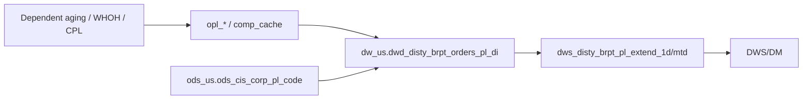

# DWD: US B Report shipped-order profitability daily P&L fact (`dw_us.dwd_disty_brpt_orders_pl_di`)

- artifact_type: etl_table
- artifact_id: dw_us.dwd_disty_brpt_orders_pl_di
- domain: b-report-us
- one_line_purpose: US B Report daily order-line P&L detail fact — feeder for pl_extend and monthly serving
- layer_type: DWD
- source_kind: etl_sql
- evidence_source: source/contracts/b-report-us/bitbicket_etl/dwd_disty_brpt_orders_pl_di/z_reload_data/dwd_disty_brpt_orders_pl_di.py
- knowledgebase_path: target/knowledgebase/b-report-us/dwd_disty_brpt_orders_pl_di.md

---

## L1 Data Foundation

### Identity and physical mapping
- **Table:** `dw_us.dwd_disty_brpt_orders_pl_di`
- **Layer type:** DWD
- **Canonical / derived:** Derived daily P&L wide fact (ETL-loaded)
- **Owner team:** Not documented in repository

### Grain, scope, exclusions
- **Grain:** order line
- **Scope:** US disty B Report daily order-line P&L (`date_flag` / `adjust_flag` partitions).
- **Partition:** `date_flag`, `adjust_flag` — resolved from Azkaban/bootstrap (see L4).
- **Natural key:** `order_no`, `order_line_no`, `virtual_type`, `order_type` (plus adjust partitions)
- **Exclusions:** Non-US schemas; for official P&L queries apply `segment_exclude = 'N'` (see L3 Special logic — same rules as monthly hub).

### Cross-engine presence
| Engine | Present | Canonical FQN | Notes |
|--------|---------|---------------|-------|
| Hive | yes | `dw_${country}.dwd_disty_brpt_orders_pl_di` | ETL target |
| Vertica | yes | `dw_us.dwd_disty_brpt_orders_pl_di` | Sync for reporting |

### Physical schema reference
| Field | Value |
|-------|-------|
| **Authoritative catalog** | WKB L1 storage seed (not duplicated in this file) |
| **entity_id** | `dw_us.dwd_disty_brpt_orders_pl_di` |
| **l1_catalog_seed** | `target/storage/wkb/snapshots/_snapshot_id_template/l1_catalog/vertica_dw_us_dwd_disty_brpt_orders_pl_di.json` |
| **column_count** | 134 |
| **partition_keys** | `date_flag`, `adjust_flag` |
| **ddl_source** | VERTICA/vcdisty and/or prior seed |
| **retrieval** | `python -m tools.wkb.indexing.run_query --query "b-report-us dwd_disty_brpt_orders_pl_di schema" --intent find_table_schema` |

### Lineage
- **upstream (this reload ETL):** self read for `date_flag between firstday_of_month and date_flag` + `ods_us.ods_cis_corp_pl_code` (CFNR/NGM) — `dwd_disty_brpt_orders_pl_di.py:168-175`
- **upstream (P&L build chain):** combiner from `opl_*_di` + `comp_cache` → daily wide table — `pl_item_logic`
- **upstream (dependent datasets):** same AP/AR/SCM aging, writedown, CPL, WHOH modules as monthly hub — see L3
- **downstream:** `dws_disty_brpt_pl_extend_1d` / `_mtd` explicitly `FROM` this table (and `orders_pl_mi`) — `dws_disty_brpt_pl_extend_mtd.py:65-70`

### Freshness and load path
| Item | Value |
|------|-------|
| Load pattern | INSERT OVERWRITE partition (`date_flag`, `adjust_flag`); recomputes `oplgm_plus_amt` |
| Schedule | Not documented in repository |
| Parameters | `country`, `date_flag`, `firstday_of_month` |

---

## L2 Declarative Knowledge

### Business purpose
Daily US B Report order-line P&L wide fact. Same P&L item column contract as the monthly hub; primary feeder into `dws_disty_brpt_pl_extend_*` aggregations. English P&L allocation and special-query rules are embedded here for single-source answers.

### Audience and use cases
| Audience | How they benefit |
|----------|-----------------|
| **B Report analytics** | Daily P&L and mid-month reload scope |
| **Serving ETL** | Source for pl_extend / DWS |
| **Data engineering** | Lineage with ETL + gap-fill evidence |

### Fact key resolution
- Daily order-line fact: `dw_us.dwd_disty_brpt_orders_pl_di`
- Transaction-level monthly analysis hub often cited as `dw_us.dwd_disty_brpt_orders_pl_etl_mi`
- Prefer `dim_vend_no` when present for vendor-number analysis

### Time field semantics
- **`date_flag`:** primary business day / partition key
- **`adjust_flag` / `adjust_group`:** normal vs adjust partitions (combiner / adjust_misc)

### Metrics served
Same P&L measure families as monthly hub (`ngm_amt`, `oplgm_amt`, BTL family, freight, type-B allocated items). See monthly hub Metrics served / metric-index for formula authority.

### Metric serving map
**Formula authority:** [source/contracts/b-report-us/metric-index.md](../../source/contracts/b-report-us/metric-index.md) — same logical metrics; physical columns on this daily table.

### P&L hierarchy and margin stack
Same English summary as monthly hub (GM → TGM → NGM / OPL, bps, sign conventions).
Provenance: `source/contracts/b-report-us/A PL_ITEM_LOGIC 1.md` §1.

### etl_metrics
Canonical formulas from metric-index (do not overwrite index). Enrichment notes match monthly hub:

#### `ngm_amt`
- **Source:** [metric-index.md](../../source/contracts/b-report-us/metric-index.md#ngm_amt)
- **Business definition:** Full Net Gross Margin stack for PM/executive use.
- **Allocation type:** stack
- Use metric-index SQL as formula authority.

#### `oplgm_amt` / `oplgm_plus_amt`
- **Source:** metric-index `#oplgm_amt` / `#oplgm_plus_amt`
- **ETL note:** daily reload recomputes `oplgm_plus_amt` with CFNR `cust_finance * mcode/icode2` — `dwd_disty_brpt_orders_pl_di.py:168-175` (same pattern as monthly reload).

#### `net_sales` / `gm_amt` / `tgm_amt` / `total_btl`
- Link metric-index; allocation types as on monthly hub L2.

---

## L3 Procedural Knowledge

### Query and routing rules
**Business filters:** For profitability pulls prefer `segment_exclude = 'N'` when the column exists on the queried object; scope by `date_flag`. Prefer `dim_vend_no` for vendor # when present.
**Technical predicates (load only):** month window on self-read; CFNR date window on pl_code.

### Dimension join patterns
| Dimension FQN | Join keys | Purpose | Evidence |
|---------------|-----------|---------|----------|
| (none in this reload) | — | Self + broadcast CFNR | `dwd_disty_brpt_orders_pl_di.py:168-175` |

### Key filters and ETL business logic
- **Technical (load only):** `date_flag between '${firstday_of_month}' and '${date_flag}'` — `:168-169`
- **CFNR rate window:** `code_type = 'CFNR' and ccode = 'NGM'` + start/end date window — `:174-175`
- **Special logic applied in this ETL:** recompute `oplgm_plus_amt` with CFNR-scaled `cust_finance`
- INSERT OVERWRITE `partition(date_flag, adjust_flag)` — `:9`

### Special logic (embedded)
Same B Report hub rules as monthly (FQN aliases / query scope for BRPT profitability). Provenance: `source/ref/b-report-us/special_logic.txt`.

#### Rule 17 — `segment_exclude` on B Report order-line P&L
- **Plain language:** Official P&L / `ngm_amt` / profitability queries on the BRPT order-line hubs require `segment_exclude = 'N'`. Do not default to `sales = 'Y'`, `virtual_type = 0`, or `order_type = 1` unless explicitly requested.
- **Example predicate:** `segment_exclude = 'N'`
- **Provenance:** `special_logic.txt:169-180` (names `dwd_disty_brpt_orders_pl_etl_mi`; apply same reporting discipline to daily hub when column present)

#### Rule 18 — Prefer `dim_vend_no`
- **Plain language:** On tables with `dim_vend_no`, use it for vendor-number analysis; use `vend_no` only when `dim_vend_no` is absent (typical DWS/DM).
- **Provenance:** `special_logic.txt:182-192`

### P&L item logic (embedded)
Compact registry aligned with monthly hub [`dwd_disty_brpt_orders_pl_etl_mi.md`](dwd_disty_brpt_orders_pl_etl_mi.md) (type A/B, compute groups, daily vs monthly11 callouts). Detailed **dwd/dws | ods** key sources live in that file (synced from PL_ITEM_LOGIC §9).
Provenance: `source/contracts/b-report-us/A PL_ITEM_LOGIC 1.md`.

| item | allocation_type | compute_group | notes |
|------|-----------------|---------------|-------|
| BTL family, freight, WHOH, SCM_DISC, OTHERS* | A | item_depend_api | Order-line direct; key sources include `pm_order_rebate_di` / `shipped_order_exp` / `wh_detail_di` + `comp_cache` |
| CORPORATE, CR_RISK_CTERM, FLR_*, PDT(daily), … | A | item_fixed_ratio | Fixed ratio via pl_code / terms |
| CUST_FINANCE, RMA, HC_*, AP_*, INV_*, SCM_COST, … | B | pre/item_* | Prorate by net sales; virtual orders when sales_total=0 |
| INV_COST | B | pre/item_sku | **dwd/dws** `dwd_disty_inv_aging_df`, `pre_sku*` (PL §9) |
| PDT (monthly11) | B | pre/item_vend | **dwd/dws** `ap_vdah_lines_di`, `ap_vend_aging_df`, `inv_qty_df`, `pre_vend_di` |
| ONE_TIME_BTL / HBTL / HC_PM family | B | pre/item_vpl(_cust) | **dwd/dws** `pre_one_time_btl`, `pm_portfolio_user_def_df`, `pre_vpl*` |

**Type A vs B / virtual orders:** same as monthly hub — see etl_mi embedded P&L section and PL_ITEM_LOGIC §2 / §9.

### Dependent datasets (embedded)
Identical module summary as monthly hub (AP/AR/Inventory aging + `inv_qty_df`, SCM aging, writedown, CPL/RMA, WHOH_PACK, `pre_one_time_btl`, `pm_portfolio_user_def_df`). See etl_mi Dependent datasets table for linked_items.
Provenance: `source/contracts/b-report-us/A Dependent dataset of P&L Item 1.md` + PL_ITEM_LOGIC §9.

**Gap-fill (shared):** AP aging Bitbucket `BAF/data_service_b_report/.../load_ap_vend_aging.py` vendored under `source/contracts/b-report-us/bitbicket_etl/dws_disty_ap_vend_aging_df/`; WHOH Compass process `opl_whoh_detail_load_us/wh_detail_di`. Provenance: `data_compass+bitbucket`.

### Standard time-filter SQL
```sql
SELECT *
FROM dw_us.dwd_disty_brpt_orders_pl_di
WHERE date_flag = '${partition_value}';
```

### End-to-end flow
1. Daily P&L pipeline builds item columns into this table (contract combiner).
2. Reload ETL reads month-to-date rows and applies CFNR rates.
3. INSERT OVERWRITE partitions.
4. `dws_disty_brpt_pl_extend_*` reads this table as `source_table` for serving.



### Base tables register
| Object | Role in this job |
|--------|-----------------|
| `dw_us.dwd_disty_brpt_orders_pl_di` | Target + self source |
| `ods_us.ods_cis_corp_pl_code` | CFNR rate source |

### Relationship map (embedded)
| from_fqn | to_fqn | cardinality | join_keys | provenance |
|----------|--------|-------------|-----------|------------|
| `dw_us.dwd_disty_brpt_orders_pl_di` | `dw_us.dwd_disty_brpt_orders_pl_di` | 1:1 reload | `date_flag` window | etl_sql |
| `ods_us.ods_cis_corp_pl_code` | `dw_us.dwd_disty_brpt_orders_pl_di` | 1:many broadcast | `ON 1=1` + CFNR | etl_sql |
| `dw_us.dwd_disty_brpt_orders_pl_di` | `dw_us.dws_disty_brpt_pl_extend_1d` / `_mtd` | many:1 | date / dims | etl_sql (`pl_extend_*.py`) |
| Dependent aging / WHOH / CPL | hub item columns | many:1 via item_* | dimension keys | dependent_dataset / data_compass+bitbucket |

`table relationship.txt` edges naming this FQN: none found — Not documented in repository.

### Step-by-step logic
#### Step 1 — MTD self-read
**Filter:** `date_flag between '${firstday_of_month}' and '${date_flag}'`

#### Step 2 — CFNR join + `oplgm_plus_amt` recompute
#### Step 3 — INSERT OVERWRITE partitions

### Column / field derivations (from ETL SQL)
| target_column | expression_sql | transform_kind | evidence |
|---------------|----------------|----------------|----------|
| `oplgm_plus_amt` | GM components + items + `cust_finance * mcode/icode2` | arithmetic | `dwd_disty_brpt_orders_pl_di.py` reload SELECT |
| other columns | passthrough | passthrough | same script |

### Sentinel and code values
| Value | Type | Meaning |
|-------|------|---------|
| `adjust_flag` / `adjust_group='normal'` | partition | Post-combiner adjust vs normal |
| CFNR `mcode`/`icode2` | rate | NGM finance rate scaling |

---

## L4 Validation

### Resolved partition value
| Step | Source | How `date_flag` is determined |
|------|--------|-------------------------------|
| 1 | Azkaban / conf | Injected `date_flag`, `firstday_of_month` — flow path Not documented in repository for this reload |

### Data quality checks
- MTD row coverage for `date_flag`
- Compare pl_extend aggregates to DWD sums for sample days

### Validation SQL
```sql
SELECT date_flag, COUNT(*) AS row_cnt, SUM(ngm_amt) AS ngm_amt
FROM dw_us.dwd_disty_brpt_orders_pl_di
WHERE date_flag = '${partition_value}'
GROUP BY date_flag;
```

### Caveats for interpretation
- Reload enrichment only; full item compute is upstream combiner chain.
- Serving jobs may switch between `orders_pl_di` and `orders_pl_mi` by period mode.

### Conflicts and open questions
- Prefer metric-index formulas over reload-local `oplgm_plus_amt` arithmetic when they diverge.
- Whether every daily column includes `segment_exclude`: confirm via L1 catalog seed.

---

## L5 Runtime View

### Query path and engine preference
| Role | Hive object | Vertica object | Sync mode | Evidence | MCP verified |
|------|-------------|----------------|-----------|----------|--------------|
| Daily fact | `dw_${country}.dwd_disty_brpt_orders_pl_di` | `dw_us.dwd_disty_brpt_orders_pl_di` | hive2vertica (job Not documented) | `dwd_disty_brpt_orders_pl_di.py` | prior seed |

### Access constraints
- Country schema; Vertica preferred for analysis

### Query risk profile
| Field | Value |
|-------|-------|
| requires_date_predicate | yes (`date_flag`) |
| scan_risk_tier | high |

---

## L6 Access and Consumption

### Primary consumers and use cases
| Consumer | Use case |
|----------|----------|
| `dws_disty_brpt_pl_extend_*` | Dimension-enriched serving base |
| DWS/DM brpt | Aggregated P&L by cust/vend/vpl/terr/PM |

### Representative query patterns
```sql
SELECT date_flag, SUM(sales_total) AS net_sales, SUM(ngm_amt) AS ngm_amt
FROM dw_us.dwd_disty_brpt_orders_pl_di
WHERE date_flag = '${partition_value}'
GROUP BY date_flag;
```

### Dependencies and notes

#### Upstream objects (verified)
| Object | Usage / join keys | Evidence |
|--------|-------------------|----------|
| `dw_us.dwd_disty_brpt_orders_pl_di` (self) | MTD reload source | `dwd_disty_brpt_orders_pl_di.py:168-169` |
| `ods_us.ods_cis_corp_pl_code` | CFNR rates | `:171-175` |
| `dws_disty_ap_vend_aging_df` (+ `dwd_disty_ap_vdah_lines_di`) | AP item chain / PDT monthly11 | Dependent dataset + Compass/Bitbucket; PL_ITEM_LOGIC §9 |
| `dws_disty_ar_cust_sum_age_df` | CUST_FINANCE / RMA | Dependent dataset |
| `dws_disty_vcm_scm_aging_df` | SCM_COST | Dependent dataset |
| `dwd_disty_inv_aging_df` | INV_COST | PL_ITEM_LOGIC §9 |
| `dwd_disty_inv_qty_df` | PDT monthly11 | PL_ITEM_LOGIC §9 |
| `dws_disty_inv_writedown_vpc_mi` | INV_RESERVE | Dependent dataset |
| `dws_disty_brpt_extract_cpl_di` | RMA | Dependent dataset |
| `dwd_disty_wh_detail_di` | WHOH_PACK | Dependent dataset + Compass |
| `dwd_disty_brpt_pre_one_time_btl` | ONE_TIME_BTL / HBTL / SCM_PROFIT_ADJ | PL_ITEM_LOGIC §9 |
| `dwd_disty_pm_portfolio_user_def_df` | HC_PM / HC_BD / MARGIN_SHARE / INFRA | PL_ITEM_LOGIC §9 |
| `dwd_disty_brpt_comp_cache_di` / `opl_*_di` | Combiner inputs | PL_ITEM_LOGIC §9 |

#### Downstream consumers (verified)
| Object / script | Usage | Evidence |
|-----------------|-------|----------|
| `dws_disty_brpt_pl_extend_1d` | `source_table = orders_pl_di` | `dws_disty_brpt_pl_extend_1d.py:32` |
| `dws_disty_brpt_pl_extend_mtd` | `source_table = orders_pl_di` / `orders_pl_mi` | `dws_disty_brpt_pl_extend_mtd.py:65-97` |
| DWS/DM brpt family | Aggregates from pl_extend | sibling KB |

#### Not documented in repository
- Schedule, owner, SLA; hive2vertica sync `file:line`; `table relationship.txt` hub edges

---

*Document generated from `evidence_source` with embedded special_logic, English P&L knowledge, and Compass+Bitbucket gap-fill for dependent upstreams.*
