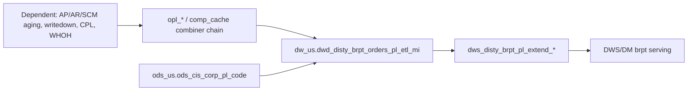

# DWD: US B Report order-line P&L detail fact — canonical source for profitability metrics (`dw_us.dwd_disty_brpt_orders_pl_etl_mi`)

- artifact_type: etl_table
- artifact_id: dw_us.dwd_disty_brpt_orders_pl_etl_mi
- domain: b-report-us
- one_line_purpose: US B Report order-line P&L detail fact — canonical source for profitability metrics
- layer_type: DWD
- source_kind: etl_sql
- evidence_source: source/contracts/b-report-us/bitbicket_etl/dwd_disty_brpt_orders_pl_etl_mi/z_reload_data/dwd_disty_brpt_orders_pl_etl_mi.py
- knowledgebase_path: target/knowledgebase/b-report-us/dwd_disty_brpt_orders_pl_etl_mi.md

---

## L1 Data Foundation

### Identity and physical mapping
- **Table:** `dw_us.dwd_disty_brpt_orders_pl_etl_mi`
- **Layer type:** DWD
- **Canonical / derived:** Derived aggregation/serving (ETL-loaded monthly P&L wide fact)
- **Owner team:** Not documented in repository

### Grain, scope, exclusions
- **Grain:** order line (`virtual_type`, `order_type`, `order_no`, `order_line_no`)
- **Scope:** US disty B Report order-line P&L and performance metrics (monthly partition).
- **Partition:** `dt_month` — resolved from Azkaban/bootstrap parameters (see L4).
- **Natural key:** `order_no`, `order_line_no` (with `virtual_type`, `order_type`)
- **Exclusions:** Non-US schemas; backup/temp variants; rows with `segment_exclude <> 'N'` for official P&L queries (see L3 Special logic).

### Cross-engine presence
| Engine | Present | Canonical FQN | Notes |
|--------|---------|---------------|-------|
| Hive | yes | `dw_${country}.dwd_disty_brpt_orders_pl_etl_mi` | ETL target in Bitbucket reload script |
| Vertica | yes | `dw_us.dwd_disty_brpt_orders_pl_etl_mi` | Reporting / analysis hub |

### Physical schema reference
| Field | Value |
|-------|-------|
| **Authoritative catalog** | WKB L1 storage seed (not duplicated in this file) |
| **entity_id** | `dw_us.dwd_disty_brpt_orders_pl_etl_mi` |
| **l1_catalog_seed** | `target/storage/wkb/snapshots/_snapshot_id_template/l1_catalog/vertica_dw_us_dwd_disty_brpt_orders_pl_etl_mi.json` |
| **column_count** | 172 |
| **partition_keys** | `dt_month` |
| **ddl_source** | VERTICA/vcdisty and/or prior seed |
| **retrieval** | `python -m tools.wkb.indexing.run_query --query "b-report-us dwd_disty_brpt_orders_pl_etl_mi schema" --intent find_table_schema` |

### Lineage
- **upstream (this reload ETL):** self partition read `dw_us.dwd_disty_brpt_orders_pl_etl_mi` + `ods_us.ods_cis_corp_pl_code` (CFNR/NGM rates) — `dwd_disty_brpt_orders_pl_etl_mi.py:206-214`
- **upstream (P&L build chain, contract):** `dwd_disty_brpt_comp_cache_di`, `dwd_disty_brpt_opl_*_di`, combiner → monthly wide table — provenance `pl_item_logic`
- **upstream (dependent datasets feeding type-B items):** AP/AR/SCM aging, inv writedown, CPL/RMA, WHOH — see L3 Dependent datasets / L6
- **downstream:** `dws_disty_brpt_pl_extend_*` and DWS/DM serving (via `orders_pl_di` / `orders_pl_mi` path in local ETL); analysis treats this FQN as order-line gold hub — sibling KB / `pl_extend_mtd.py:65-97`

### Freshness and load path
| Item | Value |
|------|-------|
| Load pattern | INSERT OVERWRITE partition reload; recomputes `oplgm_plus_amt` using CFNR rates |
| Schedule | Not documented in repository |
| Parameters | `country`, `dt_month`, `date_flag` |

---

## L2 Declarative Knowledge

### Business purpose
US B Report monthly order-line P&L wide fact. Each P&L item is a column; rolled-up profitability metrics (`gm_amt`, `tgm_amt`, `ngm_amt`, `oplgm_amt`, `oplgm_plus_amt`) support PM, sales, buyer, BD, and executive analysis. This Knowledgebase entry embeds lineage, special query rules, and English P&L allocation knowledge so answerers need not reopen `special_logic.txt` or the Chinese P&L contract MDs.

### Audience and use cases
| Audience | How they benefit |
|----------|-----------------|
| **B Report / P&L analytics** | Order-line profitability with certified filters (`segment_exclude = 'N'`) |
| **Sales / PM / finance** | Margin stacks and component drill-down at order-line grain |
| **Data engineering** | Verified upstream/downstream with ETL + Compass/Bitbucket evidence |

### Fact key resolution
- Order-line hub: `dw_us.dwd_disty_brpt_orders_pl_etl_mi`
- Prefer `dim_vend_no` (not `vend_no`) for vendor-number analysis on this hub
- Label-on/off and order_type: see metric-index and Special logic (embedded)

### Time field semantics
- **`dt_month`:** primary partition / filter for this load
- **`date_flag`:** business processing date used when joining CFNR rate window on `ods_cis_corp_pl_code`

### Metrics served
| Category | Columns (examples) | Business reading |
|----------|--------------------|------------------|
| Governed profitability | `ngm_amt`, `oplgm_amt`, `oplgm_plus_amt`, `sales_total` | Final NGM / OPL / OPL+ and net sales |
| Trade / BTL | `btl`, `btl_sales`, `btl_backout`, `one_time_btl`, `hbtl`, `trans_btl` | Below-the-line rebate family |
| Logistics / WH | `frt_*`, `whoh_pack`, `mof` | Freight and warehouse pack |
| Type-B allocated | `ap_finance`, `cust_finance`, `rma`, `inv_cost`, `scm_cost`, `hc_*` | Prorated from aging / HC / portfolio |

### Metric serving map
**Formula authority:** [source/contracts/b-report-us/metric-index.md](../../source/contracts/b-report-us/metric-index.md)

| Logical metric | Physical column | Formula reference |
|----------------|-----------------|-------------------|
| `net_sales` | `sales_total` | metric-index `#net_sales` |
| `ngm_amt` | `ngm_amt` | metric-index `#ngm_amt` |
| `oplgm_amt` | `oplgm_amt` | metric-index `#oplgm_amt` |
| `oplgm_plus_amt` | `oplgm_plus_amt` | metric-index `#oplgm_plus_amt` |
| `tgm_amt` | (derived) | metric-index `#tgm_amt` |
| `gm_amt` | (derived) | metric-index `#gm_amt` |
| `total_btl` | (derived) | metric-index `#total_btl` |

### P&L hierarchy and margin stack
Provenance: `source/contracts/b-report-us/A PL_ITEM_LOGIC 1.md` §1 (English summary).

- **GM** — core line gross margin: `(u_price − sales_cost/u_cost) × ship_qty` before BTL/PDT chain.
- **TGM (Total Gross Margin)** — GM plus core trade/production items (BTL family, PDT, logistics-facing adds per Item sheet).
- **NGM0 / NGM** — Net Gross Margin; NGM is the fullest SYNNEX profitability stack (includes corporate, HC, credit risk, overhead, etc.). Physical column `ngm_amt` is the governed NGM total on this hub.
- **OPL / OPL+** — order P&L for sales commission (`oplgm_amt` / `oplgm_plus_amt`); subset of costs directly tied to the sales order.
- **bps:** `1 bps = 0.01% = 0.0001` (e.g. CORPORATE ~40 bps of net sales; CUST_FINANCE ~60 bps of AR balance).
- **Sign:** costs/expenses usually negative (loss); rebates/income usually positive. Type-A items can flip with order_type net-sales sign (e.g. returns).

### etl_metrics
Formulas from metric-index (canonical). Allocation / key sources enriched from PL_ITEM_LOGIC.

#### `gm_amt`
- **Source:** [metric-index.md](../../source/contracts/b-report-us/metric-index.md#gm_amt)
- **Business definition:** Core line gross margin before BTL/PDT and full NGM chain.
- **Allocation type:** stack (line arithmetic)
- **Key source tables:** order attributes on hub / `dwd_disty_brpt_comp_cache_di`
```sql
(nvl(u_price,0) - nvl(if(sales_cost is null, u_cost, sales_cost), 0)) * nvl(ship_qty,0)
```

#### `net_sales`
- **Source:** [metric-index.md](../../source/contracts/b-report-us/metric-index.md#net_sales)
- **Business definition:** Shipped qty × (unit price + unit sum expense); allocation denominator for type-B items.
- **Allocation type:** N/A (base measure)
```sql
nvl(ship_qty,0) * (nvl(u_price,0) + nvl(u_sum_expense,0))
```

#### `tgm_amt`
- **Source:** [metric-index.md](../../source/contracts/b-report-us/metric-index.md#tgm_amt)
- **Business definition:** GM plus core BTL/PDT and related trade add-backs (pre-full NGM overhead).
- **Allocation type:** stack
```sql
gm_amt + nvl(BTL,0) + nvl(TRANS_BTL,0) + nvl(ONE_TIME_BTL,0) + nvl(HBTL,0) + nvl(SCM_PROFIT_ADJ,0) + nvl(BTL_BACKOUT,0) + nvl(PDT,0)
```

#### `ngm_amt`
- **Source:** [metric-index.md](../../source/contracts/b-report-us/metric-index.md#ngm_amt)
- **Business definition:** Full Net Gross Margin after adjustment chain — primary PM/executive P&L metric.
- **Allocation type:** stack (rollup of type-A + type-B item columns)
- **Key source tables:** all `opl_*` / pre_* item outputs + rates from `ods_cis_corp_pl_code`
```sql
( (nvl(u_price,0)-nvl(if(sales_cost is null,u_cost,sales_cost),0))*nvl(ship_qty,0)
      + nvl(BTL,0) + nvl(TRANS_BTL,0) + nvl(ONE_TIME_BTL,0) + nvl(HBTL,0) + nvl(SCM_PROFIT_ADJ,0)
      + nvl(BTL_BACKOUT,0) + nvl(PDT,0) + nvl(AP_FINANCE,0) + nvl(SCM_COST,0) + nvl(SCM_RISK,0)
      + nvl(INV_COST,0) + nvl(INV_RESERVE,0) + nvl(INFRASTRUCTURE,0) + nvl(MARKETING,0)
      + nvl(FRT_OUT_LOAD,0) + nvl(FRT_OUT_EXP,0) + nvl(FRT_OB_RECOVERY,0) + nvl(FRT_IB_RECOVERY,0)
      + nvl(WHOH_PACK,0) + nvl(CSGN_EDI_FEE,0) + nvl(CUST_FINANCE,0) * nvl(c.NGM_CFN_RATE,1)
      + nvl(AR_FIN_RECOVERY,0) + nvl(CR_RISK_CTERM,0) * nvl(c.NGM_CRCT_RATE,1)
      + nvl(CUST_PMT_DISC,0) + nvl(CUST_REBATE,0) + nvl(CVR_RM,0) + nvl(DIRECT_CREDIT,0)
      + nvl(FLR_SYNNEX,0) + nvl(RMA,0) + nvl(MOF,0) + nvl(MARGIN_SHARE,0) + nvl(AP_ADJ,0)
      + nvl(CORPORATE,0) + nvl(HC_PM,0) + nvl(HC_BD,0) + nvl(HC_SALES,0) + nvl(ORDER_OVERHEAD,0)
      + nvl(OTHERS,0) + nvl(MFG_OH,0) + nvl(SFS,0) )
```

#### `oplgm_amt`
- **Source:** [metric-index.md](../../source/contracts/b-report-us/metric-index.md#oplgm_amt)
- **Business definition:** Order P&L for sales commission logic (direct order-related costs).
- **Allocation type:** stack
```sql
( (nvl(u_price,0)-nvl(if(sales_cost is null,u_cost,sales_cost),0))*nvl(ship_qty,0)
      + nvl(BTL_BACKOUT,0) + nvl(BTL_SALES,0) + nvl(TRANS_BTL_SALES,0)
      + nvl(PDT,0) + nvl(CUST_PMT_DISC,0) + nvl(CUST_REBATE,0) + nvl(CVR_RM,0)
      + nvl(FRT_OUT_LOAD,0) + nvl(FRT_OUT_EXP,0) + nvl(FRT_OB_RECOVERY,0)
      + nvl(MOF,0) + nvl(CUST_FINANCE_SALES,0) * nvl(c.CPL_CFN_RATE,1)
      + nvl(AR_FIN_RECOVERY,0) + nvl(CR_RISK_CTERM,0) * nvl(c.CPL_CRCT_RATE,1)
      + nvl(FLR_SYNNEX,0) + nvl(DIRECT_CREDIT,0) + nvl(WHOH_PACK,0) + nvl(RMA,0)
      + nvl(ORDER_OVERHEAD,0) + nvl(CSGN_EDI_FEE,0) + nvl(FRT_IB_RECOVERY,0)
      + nvl(OTHERS_SALES,0) + nvl(SFS,0)
      + (nvl(u_price,0)+nvl(u_sum_expense,0))*nvl(ship_qty,0) * nvl(c.CPL_COOP_RATE,0) )
```

#### `oplgm_plus_amt`
- **Source:** [metric-index.md](../../source/contracts/b-report-us/metric-index.md#oplgm_plus_amt)
- **Business definition:** Extended OPL; this reload ETL recomputes the column using CFNR `mcode`/`icode2` rate on `cust_finance`.
- **Allocation type:** stack
- **ETL note:** reload script sets `oplgm_plus_amt` with `cust_finance * mcode/icode2` from `ods_cis_corp_pl_code` — `dwd_disty_brpt_orders_pl_etl_mi.py:181-214`

#### `total_btl`
- **Source:** [metric-index.md](../../source/contracts/b-report-us/metric-index.md#total_btl)
- **Business definition:** Aggregate Below-The-Line trade-term components.
- **Allocation type:** stack (type-A BTL family)
```sql
nvl(BTL,0) + nvl(TRANS_BTL,0) + nvl(ONE_TIME_BTL,0) + nvl(HBTL,0) + nvl(SCM_PROFIT_ADJ,0) + nvl(BTL_BACKOUT,0)
```

---

## L3 Procedural Knowledge

### Query and routing rules
**Business filters:** Always `segment_exclude = 'N'` for profitability metrics; prefer `dim_vend_no` for vendor #; use `dt_month` for period.
**Technical predicates (load only):** `dt_month = '${dt_month}'` on self-read; CFNR date window on `ods_cis_corp_pl_code`.

### Dimension join patterns
| Dimension FQN | Join keys | Purpose | Evidence |
|---------------|-----------|---------|----------|
| (none in this reload) | — | Reload is self + scalar CFNR join `ON 1=1` | `dwd_disty_brpt_orders_pl_etl_mi.py:206-215` |

### Key filters and ETL business logic
- **Technical (load only):** partition self-read `where dt_month = '${dt_month}'` — `dwd_disty_brpt_orders_pl_etl_mi.py:206-207`
- **CFNR rate window:** `code_type = 'CFNR' and ccode = 'NGM'` and `'${date_flag}' between nvl(start_date,...) and nvl(end_date,...)` — `:212-214`
- **Special logic applied in this ETL:** recomputes `oplgm_plus_amt` applying `cust_finance * mcode / icode2` (icode2 coalesced when 0 → 1) — `:194`
- INSERT OVERWRITE target partition `dt_month = '${dt_month}'` — `:9`

### Special logic (embedded)
Provenance: `special_logic` — `source/ref/b-report-us/special_logic.txt` (rules naming this FQN only; POS §§1–16 not inlined).

#### Rule 17 — B Report order-line P&L requires `segment_exclude` filter
- **Plain language:** Whenever pulling P&L items, `ngm_amt`, or any profitability metric from this hub, always filter `segment_exclude = 'N'`. Do **not** apply `dim_pub_order_type.sales = 'Y'`, `virtual_type = 0`, or `order_type = 1` by default. Apply shipped-order (`sales = 'Y'`) or virtual/order_type scopes only when the question explicitly requests them.
- **Example predicate:** `segment_exclude = 'N'`
- **Provenance:** `source/ref/b-report-us/special_logic.txt:169-180`

#### Rule 18 — Prefer `dim_vend_no` on DWD hub
- **Plain language:** For vendor-number analysis on this table (and other b-report-us tables with `dim_vend_no`), filter and GROUP BY `dim_vend_no` — do **not** use `vend_no`. On DWS/DM that only expose `vend_no`, continue using `vend_no`. Vendor label lookup stays on `dim_us.dim_pub_vendor_info`.
- **Example predicate:** `GROUP BY dim_vend_no`
- **Provenance:** `source/ref/b-report-us/special_logic.txt:182-192`

### P&L item logic (embedded)
Provenance: `source/contracts/b-report-us/A PL_ITEM_LOGIC 1.md` §9 (key source summary; scoped to hub columns). Key sources split **dwd/dws** (upstream warehouse) vs **ods/dim**.

| item | allocation_type | compute_group | key_source_tables (dwd/dws \| ods/dim) | notes |
|------|-----------------|---------------|----------------------------------------|-------|
| BTL / BTL_SALES / BTL_BACKOUT | A | item_depend_api | **dwd/dws** `dwd_disty_pm_order_rebate_di`, `dwd_disty_brpt_comp_cache_di`, `orders_pl_di/_mi` (CM); **ods** `ods_cis_corp_cost_factor(_vpl)`, `ods_etl_order_header_all` | Order-line rates |
| CUST_REBATE | A | item_depend_api | **dwd/dws** `dws_disty_scm_ir_cvr_ir_rebate_detail_mi`, `dwd_disty_sales_single_orders_di`, `comp_cache`; **ods** `ods_int_dws_order_rebate` | Kit cost share |
| MOF / FRT_OUT_EXP / OTHERS* / SCM_DISC | A | item_depend_api | **dwd/dws** `dwd_pub_shipped_order_exp_di`, `dwd_disty_brpt_pre_order_di`, `comp_cache`; **ods** `ods_cis_corp_pl_code` (+ pm_claim* for SCM_DISC) | Weight/net-sales/cnt fallbacks |
| WHOH_PACK | A | item_depend_api | **dwd/dws** `dwd_disty_wh_detail_di`, `comp_cache` | Warehouse pack |
| FRT_IN / FRT_OUT_LOAD / FRT_IB_RECOVERY | A | item_depend_api | **dwd/dws** `comp_cache`; **ods** POCV cost/exp + pl_code (`PFIC`/`PFOL`) | SKU unit × qty |
| CORPORATE / CSGN_EDI_FEE / SCM_RISK / CR_RISK_CTERM | A | item_fixed_ratio | **dwd/dws** `comp_cache`; **ods** `ods_cis_corp_pl_code` (+ terms/cust_profile for CRCT) | Fixed bps × line |
| CUST_FINANCE_SALES / FLR_* / DIRECT_CREDIT | A | item_fixed_ratio | **dwd/dws** `comp_cache`, `pre_order_di`, shipped header/profile; **ods** terms_file, flooring_*, pl_code | Sales OPL finance / flooring |
| PDT (daily) | A | item_fixed_ratio | **dwd/dws** `comp_cache`; **ods** `ods_cis_corp_vend_pl_param` | Line × vend rate |
| CUST_PMT_DISC | B (daily A) | pre/item_cust | **dwd/dws** daily=`pm_order_rebate_di`; monthly=`pre_all_cust_di` + `comp_cache`; **ods** cust_doc / application / terms_file | **Daily vs monthly11 differs** |
| CVR_RM | B | pre/item_cust | **dwd/dws** `comp_cache`; **ods** cust_rebate_sum, cvr_rm / crb scopes | Cust grain; virtual `-2` if no sales |
| AR_FIN_RECOVERY | B | pre/item_cust | **ods** `ods_cis_corp_int_all_det` / `_hd` (no dedicated dwd/dws) | Cust grain |
| CUST_FINANCE / RMA | B | pre/item_cust(_vend) | **dwd/dws** AR age / exception, AMPL exp, `pre_all_cust_di`, `extract_cpl_di`, `comp_cache`; **ods** pl_code / parameters | **Daily vs monthly11 differs**; CUST_FINANCE zero-sales → virtual `-8` |
| HC_SALES / ORDER_OVERHEAD / MFG_OH | B | pre/item_cust_ct | **dwd/dws** `pre_hcs_mi`, `pre_all_cust_di`, `comp_cache`; **ods** GL / T&E / adj tables | Multi-level cust_type/terr; virtual `-2` |
| AP_FINANCE | B | pre/item_sku | **dwd/dws** `dws_disty_ap_vend_aging_df`, `comp_cache`, `pre_sku_di` / `pre_sku_cust_di`; **ods** pl_code (`APFI`) | SKU grain; zero sales → virtual `-3/-4/-6` |
| INV_RESERVE | B | pre/item_sku | **dwd/dws** `dws_disty_inv_writedown_vpc_mi`, `dwd_pub_shipped_order_exp_di` (`RES`), `pre_sku_di`, `comp_cache`; **ods** inv_reserve_rate | SKU grain |
| INV_COST | B | pre/item_sku | **dwd/dws** `dwd_disty_inv_aging_df`, `pre_sku_di` / `pre_sku_cust_di`, `comp_cache`; **ods** pl_code, cws_part, bom | SKU cost share |
| AP_ADJ / SCM_COST / PDT(monthly11) | B | pre/item_vend | **dwd/dws** `ap_vdah_lines_di`, `ap_vend_aging_df`, `inv_qty_df` (PDT), `vcm_scm_aging_df`, `pre_vend_di`, `comp_cache`; **ods** vend_pl_param, journal_entry, pl_code | Vend grain; PDT monthly11 type B |
| INFRA / MKT / COOP | B | pre/item_vend + pre/item_vpl | **dwd/dws** `pm_portfolio_user_def_df`, `pre_vpl_di` / `pre_vend_di`, `comp_cache`; **ods** vend_pl_param, vpl_portfolio, adj_marketing_infra | Vend + VPL complementary |
| ONE_TIME_BTL / HBTL / SCM_PROFIT_ADJ | B | pre/item_vpl(_cust) | **dwd/dws** `dwd_disty_brpt_pre_one_time_btl`, `pre_vpl_di` / `pre_vpl_cust_di`, `comp_cache`; **ods** onetime_btl_vpl, project_info | VPL / vpl+cust; zero sales → `-5/-6/-8/-9` |
| HC_PM / HC_BD / MARGIN_SHARE | B | pre/item_vpl | **dwd/dws** `dwd_disty_pm_portfolio_user_def_df`, `pre_vpl_di`, `pre_hcs_mi`, `comp_cache`; **ods** vpl_portfolio(_hc), journal_entry | PM T&E / headcount |

**comp_cache note:** Type-B (and many Type-A) items read `dwd_disty_brpt_comp_cache_di` for line net sales / allocation; §9 omits repeating it on every bullet when already listed above as `comp_cache`.

**Daily vs monthly11 variance (four items):** CUST_PMT_DISC, PDT, CUST_FINANCE, RMA change node/grain/formula between daily and monthly11 (`run_type` 1 vs 11/12). See PL_ITEM_LOGIC §3.2.

**Type A vs B:** A = order-line fixed ratio; B = pre-aggregate total at dimension then prorate by line net sales (`total * line_ns / sales_total`); virtual orders when `sales_total = 0`.

### Dependent datasets (embedded)
Provenance: `source/contracts/b-report-us/A Dependent dataset of P&L Item 1.md` (+ Compass/Bitbucket gap-fill for AP aging).

| module | target_table | date_basis | role feeding P&L | linked_items |
|--------|--------------|------------|------------------|--------------|
| AP aging | `dws_disty_ap_vend_aging_df` | `date_flag` | Open AP bucket totals → type-B AP finance/adj / PDT monthly | `AP_FINANCE`, `AP_ADJ`, `PDT` (monthly11) |
| AR aging | `dws_disty_ar_cust_sum_age_df` | `date_flag` | Open AR buckets → cust finance / RMA bases | `CUST_FINANCE`, `RMA` |
| Inventory aging | `dwd_disty_inv_aging_df` | `date_flag` | On-hand aging (FIFO qty/cost) → INV_COST | `INV_COST` |
| Inv qty | `dwd_disty_inv_qty_df` | `date_flag` | Inventory qty for PDT monthly BOM/EOM compare | `PDT` (monthly11) |
| SCM aging | `dws_disty_vcm_scm_aging_df` | `date_flag` | Vendor rebate/GL aging by project | `SCM_COST` |
| Inv writedown | `dws_disty_inv_writedown_vpc_mi` | month `[bop,eop)` | Writeoff/cycle-count amounts | `INV_RESERVE` |
| CPL / RMA | `dws_disty_brpt_extract_cpl_di` | `date_flag` / `rec_date` | RMA cost extract | `RMA` |
| WHOH_PACK | `dwd_disty_wh_detail_di` | `date_flag` | Warehouse pack `pl_cost` | `WHOH_PACK` |
| Pre one-time BTL | `dwd_disty_brpt_pre_one_time_btl` | (pre stage) | ONE_TIME_BTL / HBTL / SCM_PROFIT_ADJ totals | `ONE_TIME_BTL`, `HBTL`, `SCM_PROFIT_ADJ` |
| PM portfolio user def | `dwd_disty_pm_portfolio_user_def_df` | (dim-like) | Portfolio mapping for HC_PM / MARGIN_SHARE / INFRA | `HC_PM`, `HC_BD`, `MARGIN_SHARE`, `INFRASTRUCTURE` / `MARKETING` / `COOP` |

**AP aging gap-fill:** Compass INPUT lineage on `dw_us.dws_disty_ap_vend_aging_df` → process `load_ap_vend_aging` (`ap_aging_load_us`). Bitbucket ETL: `BAF/data_service_b_report/disty_common/ap/python/load_ap_vend_aging.py` (vendored extract under `source/contracts/b-report-us/bitbicket_etl/dws_disty_ap_vend_aging_df/`). Upstream line table: `dwd_disty_ap_vdah_lines_di`. Provenance: `data_compass+bitbucket`.

**WHOH gap-fill:** Compass INPUT on `dw_us.dwd_disty_wh_detail_di` → process `wh_detail_di` (`opl_whoh_detail_load_us`); upstream includes order detail/soldto, pl_whoh_group*, `ods_cis_corp_pl_code`, carton_header. Provenance: `data_compass+bitbucket` (ETL script path not vendored this pass — process name recorded).

### Standard time-filter SQL
```sql
SELECT *
FROM dw_us.dwd_disty_brpt_orders_pl_etl_mi
WHERE dt_month = '${partition_value}'
  AND segment_exclude = 'N';
```

### End-to-end flow
1. Prior monthly pipeline (planner → pre_* → item_* → combiner → total_ngm) materializes order-line P&L columns on this / sibling monthly table (contract).
2. Reload ETL reads current `dt_month` partition from the same table.
3. Left-joins CFNR/NGM rates from `ods_cis_corp_pl_code` (scalar `ON 1=1`).
4. Recomputes `oplgm_plus_amt` (and passthroughs other columns); INSERT OVERWRITE partition.
5. Downstream DWS/DM aggregate via `pl_extend` / serving jobs (often from `orders_pl_di` / `orders_pl_mi`).



### Base tables register
| Object | Role in this job |
|--------|-----------------|
| `dw_us.dwd_disty_brpt_orders_pl_etl_mi` | Target + self source (reload) |
| `ods_us.ods_cis_corp_pl_code` | CFNR/NGM rate source for `oplgm_plus_amt` |

### Relationship map (embedded)
| from_fqn | to_fqn | cardinality | join_keys | provenance |
|----------|--------|-------------|-----------|------------|
| `dw_us.dwd_disty_brpt_orders_pl_etl_mi` | `dw_us.dwd_disty_brpt_orders_pl_etl_mi` | 1:1 reload | `dt_month` partition | etl_sql |
| `ods_us.ods_cis_corp_pl_code` | `dw_us.dwd_disty_brpt_orders_pl_etl_mi` | 1:many (broadcast) | `ON 1=1` + CFNR filters | etl_sql |
| `dwd_disty_brpt_comp_cache_di` / `opl_*_di` | `dwd_disty_brpt_orders_pl_*` | many:1 combine | order keys | pl_item_logic |
| `dws_disty_ap_vend_aging_df` | P&L AP items / PDT monthly → hub columns | many:1 via pre/item_sku|vend | vend/sku sales share | dependent_dataset + pl_item_logic §9 |
| `dwd_disty_inv_aging_df` | INV_COST → hub | many:1 via pre/item_sku | sku cost share | pl_item_logic §9 |
| `dwd_disty_inv_qty_df` | PDT monthly11 → hub | many:1 via pre/item_vend | vend sales share | pl_item_logic §9 |
| `dwd_disty_wh_detail_di` | `whoh_pack` on hub | many:1 via item_depend_api | order line | dependent_dataset + data_compass+bitbucket |
| `dwd_disty_brpt_pre_one_time_btl` / `pm_portfolio_user_def_df` | ONE_TIME_BTL / HC_PM family → hub | many:1 via pre/item_vpl | vpl/cust sales share | pl_item_logic §9 |
| `dw_us.dwd_disty_brpt_orders_pl_di` / `_mi` | `dws_disty_brpt_pl_extend_*` | many:1 aggregate | date / order attrs | sibling_kb / etl_sql (`pl_extend_*.py`) |

`source/ref/b-report-us/table relationship.txt`: **no edges naming this FQN** (file is largely POS-shaped) — Not documented in repository for hub-specific relationship rows.

### Step-by-step logic
#### Step 1 — Read partition
**Source:** `dwd_disty_brpt_orders_pl_etl_mi` **Filter:** `dt_month = '${dt_month}'` **Join keys:** n/a

#### Step 2 — CFNR rates
**Source:** `ods_cis_corp_pl_code` **Filter:** `code_type='CFNR' and ccode='NGM'` + date window **Join keys:** broadcast `ON 1=1`

#### Step 3 — Write
**Action:** INSERT OVERWRITE partition; passthrough columns; derive `oplgm_plus_amt`

### Column / field derivations (from ETL SQL)
| target_column | expression_sql | upstream_columns | upstream_tables | transform_kind | evidence |
|---------------|----------------|------------------|-----------------|----------------|----------|
| `oplgm_plus_amt` | `(ship_qty*(u_price-coalesce(sales_cost,u_cost,0))) + Σ(item cols) + cust_finance*mcode/icode2 + …` | `cust_finance`, item cols, `mcode`, `icode2` | hub self, `ods_cis_corp_pl_code` | arithmetic | `dwd_disty_brpt_orders_pl_etl_mi.py:181-205` |
| most measure cols | passthrough `col` | `col` | hub self | passthrough | `:11-175` |

Full passthrough list: L3 sidecar `*_column_derivations.json` when present (prior seed).

### Sentinel and code values
| Value | Type | Meaning |
|-------|------|---------|
| `segment_exclude = 'N'` | business_filter | Include in official P&L / segment reporting |
| `code_type = 'CFNR'`, `ccode = 'NGM'` | rate lookup | NGM cust-finance rate numerator/denominator (`mcode`/`icode2`) |
| negative `order_type` | virtual order | Type-B remainder when dimension `sales_total = 0` (contract) |

---

## L4 Validation

### Resolved partition value
| Step | Source | How `dt_month` is determined |
|------|--------|------------------------------|
| 1 | Azkaban / conf | Wrapper `conf.get` injects `dt_month`, `date_flag` — exact flow path Not documented in repository for this reload script |

**Plain language:** Reporting must use the same `dt_month` as the loaded partition; CFNR rates use `date_flag` as-of date.

### Data quality checks
- Row counts by `dt_month` after reload
- Null rates on `ngm_amt`, `sales_total`
- Spot-check `oplgm_plus_amt` vs metric-index OPL+ definition when rates change

### Validation SQL
```sql
-- 1) row count by partition
SELECT dt_month, COUNT(*) AS row_cnt
FROM dw_us.dwd_disty_brpt_orders_pl_etl_mi
WHERE dt_month = '${partition_value}'
GROUP BY dt_month;

-- 2) metric sum (official P&L scope)
SELECT SUM(sales_total) AS net_sales, SUM(ngm_amt) AS ngm_amt
FROM dw_us.dwd_disty_brpt_orders_pl_etl_mi
WHERE dt_month = '${partition_value}'
  AND segment_exclude = 'N';

-- 3) grain duplicate check
SELECT order_no, order_line_no, virtual_type, order_type, COUNT(*) AS c
FROM dw_us.dwd_disty_brpt_orders_pl_etl_mi
WHERE dt_month = '${partition_value}'
GROUP BY order_no, order_line_no, virtual_type, order_type
HAVING COUNT(*) > 1;
```

### Caveats for interpretation
- This Bitbucket script is a **reload/enrichment**, not the full P&L item compute pipeline.
- Downstream local ETL often reads `orders_pl_di` / `orders_pl_mi`; this `etl_mi` FQN is the Vertica analysis hub.

### Conflicts and open questions
- Metric-index `ngm_amt` / `oplgm_amt` remain formula authority; reload `oplgm_plus_amt` expression may differ in rate application detail — prefer metric-index + `*_calcproc` columns for audit.
- Full Azkaban flow for this reload: Not documented in repository.

---

## L5 Runtime View

### Query path and engine preference
| Role | Hive object | Vertica object | Sync mode | Evidence | MCP verified |
|------|-------------|----------------|-----------|----------|--------------|
| Fact hub | `dw_${country}.dwd_disty_brpt_orders_pl_etl_mi` | `dw_us.dwd_disty_brpt_orders_pl_etl_mi` | hive2vertica (job file Not documented) | ETL script basename `dwd_disty_brpt_orders_pl_etl_mi.py` | prior seed |

### Access constraints
- Country schema substitution `${country}` / `us`
- Vertica preferred for business analysis queries

### Query risk profile
| Field | Value |
|-------|-------|
| requires_date_predicate | yes (`dt_month`) |
| scan_risk_tier | high |

---

## L6 Access and Consumption

### Primary consumers and use cases
| Consumer | Use case |
|----------|----------|
| PM / Sales / Buyer / BD / exec | Order-line and rolled P&L, rankings, YoY |
| DWS/DM serving | Aggregations via pl_extend path |

### Representative query patterns
```sql
SELECT dt_month, dim_vend_no, SUM(sales_total) AS net_sales, SUM(ngm_amt) AS ngm_amt
FROM dw_us.dwd_disty_brpt_orders_pl_etl_mi
WHERE dt_month = '${partition_value}'
  AND segment_exclude = 'N'
GROUP BY dt_month, dim_vend_no;
```

### Dependencies and notes

#### Upstream objects (verified)
| Object | Usage / join keys | Evidence |
|--------|-------------------|----------|
| `dw_us.dwd_disty_brpt_orders_pl_etl_mi` (self) | Partition reload source | `dwd_disty_brpt_orders_pl_etl_mi.py:206-207` |
| `ods_us.ods_cis_corp_pl_code` | CFNR rates `mcode`/`icode2` | `:209-214` |
| `dws_disty_ap_vend_aging_df` | Feeds AP_FINANCE / AP_ADJ / PDT monthly11 | Dependent dataset + Compass; Bitbucket `load_ap_vend_aging.py` extract; PL_ITEM_LOGIC §9 |
| `dwd_disty_ap_vdah_lines_di` | AP aging line source; PDT monthly11 | Bitbucket extract; PL_ITEM_LOGIC §9 |
| `dws_disty_ar_cust_sum_age_df` | Feeds CUST_FINANCE / RMA | Dependent dataset doc |
| `dws_disty_vcm_scm_aging_df` | Feeds SCM_COST | Dependent dataset doc |
| `dwd_disty_inv_aging_df` | Feeds INV_COST | PL_ITEM_LOGIC §9 / Dependent dataset |
| `dwd_disty_inv_qty_df` | Feeds PDT monthly11 BOM/EOM | PL_ITEM_LOGIC §9 |
| `dws_disty_inv_writedown_vpc_mi` | Feeds INV_RESERVE | Dependent dataset doc |
| `dws_disty_brpt_extract_cpl_di` | Feeds RMA | Dependent dataset doc |
| `dwd_disty_wh_detail_di` | Feeds WHOH_PACK | Dependent dataset + Compass `wh_detail_di` |
| `dwd_disty_brpt_pre_sku_di` / `pre_sku_cust_di` | AP_FINANCE / INV_* pre totals | PL_ITEM_LOGIC §9 |
| `dwd_disty_brpt_pre_vend_di` | AP_ADJ / SCM_COST / PDT monthly / INFRA vend | PL_ITEM_LOGIC §9 |
| `dwd_disty_brpt_pre_one_time_btl` | ONE_TIME_BTL / HBTL / SCM_PROFIT_ADJ | PL_ITEM_LOGIC §9 |
| `dwd_disty_pm_portfolio_user_def_df` | HC_PM / HC_BD / MARGIN_SHARE / INFRA VPL | PL_ITEM_LOGIC §9 |
| `dwd_disty_brpt_comp_cache_di` / `dwd_disty_brpt_opl_*_di` | Item combiner inputs + Type-B sales share | PL_ITEM_LOGIC §9 |

#### Downstream consumers (verified)
| Object / script | Usage | Evidence |
|-----------------|-------|----------|
| `dws_disty_brpt_pl_extend_1d` / `_mtd` | Aggregate from `orders_pl_di` / `orders_pl_mi` | `dws_disty_brpt_pl_extend_mtd.py:65-97` |
| DWS/DM `dws_disty_brpt_*` / `dm_disty_brpt_*` | Serving layers consuming pl_extend | sibling KB under `target/knowledgebase/b-report-us/` |

#### Not documented in repository
- Schedule, owner, SLA
- hive2vertica sync job `file:line`
- Edges in `table relationship.txt` naming this FQN

---

*Document generated from `evidence_source` with embedded special_logic, English P&L contract knowledge, and Compass+Bitbucket gap-fill for dependent AP/WHOH upstreams.*
