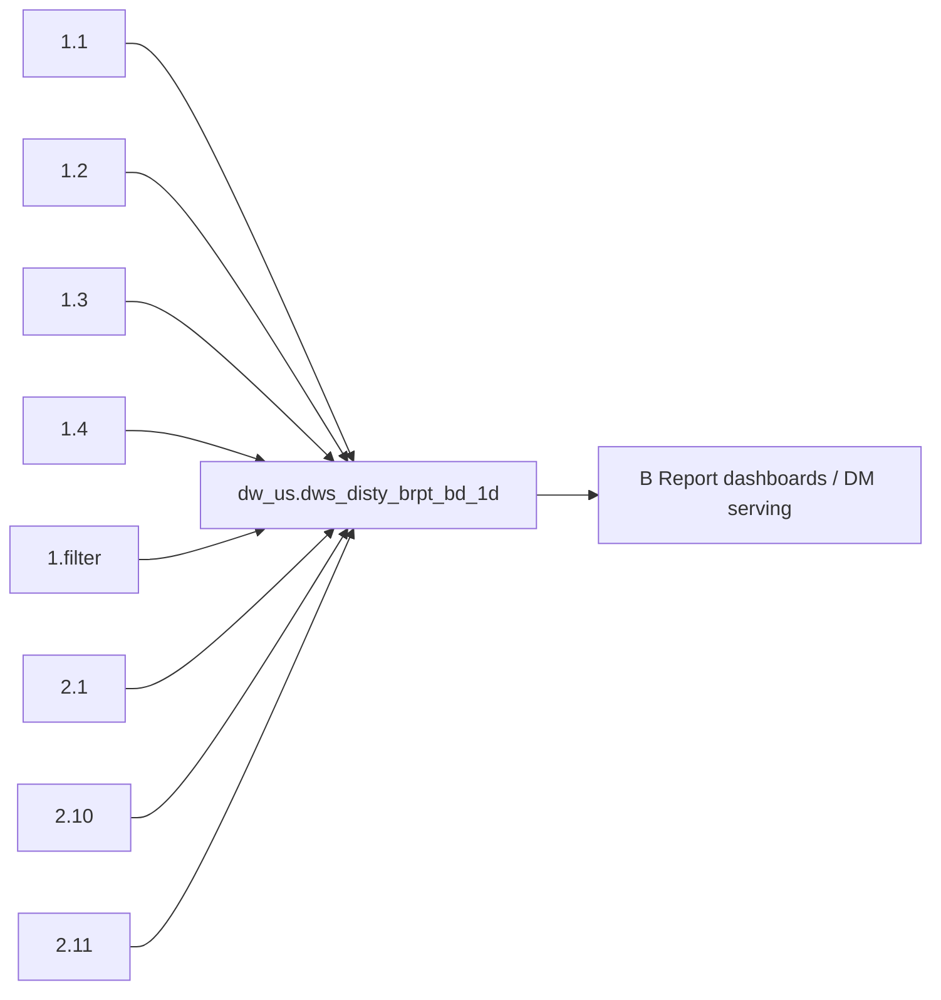

# DWS: B Report profitability serving aggregation (1d) by business slice (`dw_us.dws_disty_brpt_bd_1d`)

- artifact_type: etl_table
- artifact_id: dw_us.dws_disty_brpt_bd_1d
- domain: b-report-us
- one_line_purpose: B Report profitability serving aggregation (1d) by business slice
- layer_type: DWS
- source_kind: etl_sql
- evidence_source: source/contracts/b-report-us/bitbicket_etl/dws_disty_brpt_bd_1d/Common/bd/dws_disty_brpt_bd_1d_v2.py
- knowledgebase_path: target/knowledgebase/b-report-us/dws_disty_brpt_bd_1d.md
- contract_source: source/contracts/b-report-us/tables/dws_disty_brpt_bd_1d.md

---

## L1 Data Foundation

### Identity and physical mapping
- **Table:** `dw_us.dws_disty_brpt_bd_1d`
- **Layer type:** DWS
- **Canonical / derived:** Derived aggregation/serving (ETL-loaded)
- **Owner team:** Not documented in repository

### Grain, scope, exclusions
- **Grain:** daily snapshot (single business date)
- **Scope:** US disty B Report shipped-order P&L and performance metrics.
- **Partition:** `date_flag` — resolved from Azkaban/bootstrap parameters (see L4).
- **Natural key:** `project_no`, `task_no`, `company_no`, `bd_rep_id`, `bd_mgr_id`, `bd_dir_id`
- **Exclusions:** Non-US schemas, backup/temp table variants (`_bkp`, `_temp`), and non-shipped-order scenarios.

### Cross-engine presence
| Engine | Present | Canonical FQN | Notes |
|--------|---------|---------------|-------|
| Hive | yes | `dw_${country}.dws_disty_brpt_bd_1d` | ETL target in Bitbucket script |
| Vertica | yes | `dw_us.dws_disty_brpt_bd_1d` | Contract marks Vertica verified |

### Physical schema reference
| Field | Value |
|-------|-------|
| **Authoritative catalog** | WKB L1 storage seed (not duplicated in this file) |
| **entity_id** | `dw_us.dws_disty_brpt_bd_1d` |
| **l1_catalog_seed** | `target/storage/wkb/snapshots/_snapshot_id_template/l1_catalog/vertica_dw_us_dws_disty_brpt_bd_1d.json` |
| **column_count** | 142 |
| **partition_keys** | `date_flag` |
| **ddl_source** | B Report contract catalog and/or VERTICA/vcdisty DDL |
| **retrieval** | `python -m tools.wkb.indexing.run_query --query "b-report-us dws_disty_brpt_bd_1d schema" --intent find_table_schema` |

### Lineage
- **upstream:** 1.1, 1.2, 1.3, 1.4, 1.filter, 2.1 — `source/contracts/b-report-us/bitbicket_etl/dws_disty_brpt_bd_1d/Common/bd/dws_disty_brpt_bd_1d_v2.py`
- **downstream:** B Report DM/DWS serving and dashboards (per contract L6 when present) — `source/contracts/b-report-us/tables/dws_disty_brpt_bd_1d.md`

### Freshness and load path
| Item | Value |
|------|-------|
| Load pattern | INSERT OVERWRITE partition reload (per ETL SQL) |
| Schedule | Not documented in repository |
| Parameters | country, date_flag |

---

## L2 Declarative Knowledge

### Business purpose
B Report profitability serving aggregation (1d) by business slice

This Knowledgebase entry documents the Bitbucket ETL load script in `source/contracts/b-report-us/bitbicket_etl/`. Business semantics align with the B Report US contract catalog when present.

### Audience and use cases
| Audience | How they benefit |
|----------|-----------------|
| **B Report / P&L analytics** | Consumers: PM, Sales, Buyer, BD and executive analysis views. |
| **Sales / PM / finance** | Shipped-order and margin metrics at documented grain (daily snapshot). |
| **Data engineering** | Verified upstream/downstream objects with `file:line` evidence from ETL SQL. |

### Fact key resolution
- Order-line hub for B Report P&L: `dw_us.dwd_disty_brpt_orders_pl_etl_mi` when debugging transaction-level metrics.
- This table grain: daily snapshot (single business date).
- Label-on/off and order_type adjustments: see `source/contracts/b-report-us/metric-index.md`.

### Time field semantics
- **`date_flag`:** primary partition / filter for this load; value supplied by Azkaban `conf.get` parameters (see L4).
- **Period semantics:** daily snapshot.


### Metrics served

| Category | Column | Logical metric | Business reading |
|----------|--------|----------------|------------------|
| P&L adjustment / measure | `bo_gm_amt` | `bo_gm_amt` | bo_gm_amt at daily grain |
| P&L adjustment / measure | `bo_gross_cost` | `bo_gross_cost` | bo_gross_cost at daily grain |
| P&L adjustment / measure | `bo_gross_sales` | `bo_gross_sales` | bo_gross_sales at daily grain |
| P&L adjustment / measure | `btl_sales` | `btl_sales` | btl_sales at daily grain |
| P&L adjustment / measure | `cust_finance_sales` | `cust_finance_sales` | cust_finance_sales at daily grain |
| P&L adjustment / measure | `ds_cost` | `ds_cost` | ds_cost at daily grain |
| P&L adjustment / measure | `ds_sales` | `ds_sales` | ds_sales at daily grain |
| P&L adjustment / measure | `fx_cost` | `fx_cost` | fx_cost at daily grain |
| Governed profitability | `gm_amt` | `gm_amt` | gm_amt at daily grain |
| P&L adjustment / measure | `gross_cost` | `gross_cost` | gross_cost at daily grain |
| Governed profitability | `gross_sales` | `gross_sales` | gross_sales at daily grain |
| P&L adjustment / measure | `hc_sales` | `hc_sales` | hc_sales at daily grain |
| P&L adjustment / measure | `inv_cost` | `inv_cost` | inv_cost at daily grain |
| P&L adjustment / measure | `net_cost` | `net_cost` | net_cost at daily grain |
| Governed profitability | `net_sales` | `net_sales` | net_sales at daily grain |
| Governed profitability | `ngm_amt` | `ngm_amt` | ngm_amt at daily grain |
| Governed profitability | `oplgm_amt` | `oplgm_amt` | oplgm_amt at daily grain |
| Governed profitability | `oplgm_plus_amt` | `oplgm_plus_amt` | oplgm_plus_amt at daily grain |
| P&L adjustment / measure | `others_sales` | `others_sales` | others_sales at daily grain |
| P&L adjustment / measure | `scm_cost` | `scm_cost` | scm_cost at daily grain |
| P&L adjustment / measure | `so_gm_amt` | `so_gm_amt` | so_gm_amt at daily grain |
| P&L adjustment / measure | `so_gross_cost` | `so_gross_cost` | so_gross_cost at daily grain |
| P&L adjustment / measure | `so_gross_sales` | `so_gross_sales` | so_gross_sales at daily grain |
| P&L adjustment / measure | `stock_cost` | `stock_cost` | stock_cost at daily grain |
| P&L adjustment / measure | `stock_sales` | `stock_sales` | stock_sales at daily grain |
| Governed profitability | `tgm_amt` | `tgm_amt` | tgm_amt at daily grain |
| Governed profitability | `total_btl` | `total_btl` | total_btl at daily grain |
| P&L adjustment / measure | `trans_btl_sales` | `trans_btl_sales` | trans_btl_sales at daily grain |

### Metric serving map

**Formula authority:** [`source/contracts/b-report-us/metric-index.md`](../../source/contracts/b-report-us/metric-index.md)

| Logical metric | Period scope | Physical column | Formula reference |
|----------------|--------------|-----------------|-------------------|
| `bo_gm_amt` | daily | `bo_gm_amt` | Not in metric-index.md |
| `bo_gross_cost` | daily | `bo_gross_cost` | Not in metric-index.md |
| `bo_gross_sales` | daily | `bo_gross_sales` | Not in metric-index.md |
| `btl_sales` | daily | `btl_sales` | Not in metric-index.md |
| `cust_finance_sales` | daily | `cust_finance_sales` | Not in metric-index.md |
| `ds_cost` | daily | `ds_cost` | Not in metric-index.md |
| `ds_sales` | daily | `ds_sales` | Not in metric-index.md |
| `fx_cost` | daily | `fx_cost` | Not in metric-index.md |
| `gm_amt` | daily | `gm_amt` | `source/contracts/b-report-us/metric-index.md#gm_amt` |
| `gross_cost` | daily | `gross_cost` | Not in metric-index.md |
| `gross_sales` | daily | `gross_sales` | `source/contracts/b-report-us/metric-index.md#gross_sales` |
| `hc_sales` | daily | `hc_sales` | Not in metric-index.md |
| `inv_cost` | daily | `inv_cost` | Not in metric-index.md |
| `net_cost` | daily | `net_cost` | Not in metric-index.md |
| `net_sales` | daily | `net_sales` | `source/contracts/b-report-us/metric-index.md#net_sales` |
| `ngm_amt` | daily | `ngm_amt` | `source/contracts/b-report-us/metric-index.md#ngm_amt` |
| `oplgm_amt` | daily | `oplgm_amt` | `source/contracts/b-report-us/metric-index.md#oplgm_amt` |
| `oplgm_plus_amt` | daily | `oplgm_plus_amt` | `source/contracts/b-report-us/metric-index.md#oplgm_plus_amt` |
| `others_sales` | daily | `others_sales` | Not in metric-index.md |
| `scm_cost` | daily | `scm_cost` | Not in metric-index.md |
| `so_gm_amt` | daily | `so_gm_amt` | Not in metric-index.md |
| `so_gross_cost` | daily | `so_gross_cost` | Not in metric-index.md |
| `so_gross_sales` | daily | `so_gross_sales` | Not in metric-index.md |
| `stock_cost` | daily | `stock_cost` | Not in metric-index.md |
| `stock_sales` | daily | `stock_sales` | Not in metric-index.md |
| `tgm_amt` | daily | `tgm_amt` | `source/contracts/b-report-us/metric-index.md#tgm_amt` |
| `total_btl` | daily | `total_btl` | `source/contracts/b-report-us/metric-index.md#total_btl` |
| `trans_btl_sales` | daily | `trans_btl_sales` | Not in metric-index.md |

### etl_metrics

Formulas below are sourced from [`source/contracts/b-report-us/metric-index.md`](../../source/contracts/b-report-us/metric-index.md) for logical metrics present on this table.
Index formulas are canonical: this enricher copies them into KB and never overwrites `final_effective_formula_sql` in the metric-index.

#### `gm_amt`
- **Source:** [metric-index.md](../../source/contracts/b-report-us/metric-index.md#gm_amt)
- **Business definition:** Core line gross margin before BTL/PDT and full NGM adjustment chain.
```sql
(nvl(u_price,0) - nvl(if(sales_cost is null, u_cost, sales_cost), 0)) * nvl(ship_qty,0)
```

#### `gross_sales`
- **Source:** [metric-index.md](../../source/contracts/b-report-us/metric-index.md#gross_sales)
- **Business definition:** Shipped quantity times unit price without sum expense.
```sql
nvl(ship_qty,0) * nvl(u_price,0)
```

#### `net_sales`
- **Source:** [metric-index.md](../../source/contracts/b-report-us/metric-index.md#net_sales)
- **Business definition:** Shipped quantity times unit price plus per-unit sum expense (net of returns scope per order_type filter).
```sql
nvl(ship_qty,0) * (nvl(u_price,0) + nvl(u_sum_expense,0))
```

#### `ngm_amt`
- **Source:** [metric-index.md](../../source/contracts/b-report-us/metric-index.md#ngm_amt)
- **Business definition:** Net Gross Margin — final P&L profitability metric for PM/executive use after full adjustment chain.
```sql
( (nvl(u_price,0)-nvl(if(sales_cost is null,u_cost,sales_cost),0))*nvl(ship_qty,0)
      + nvl(BTL,0) + nvl(TRANS_BTL,0) + nvl(ONE_TIME_BTL,0) + nvl(HBTL,0) + nvl(SCM_PROFIT_ADJ,0)
      + nvl(BTL_BACKOUT,0) + nvl(PDT,0) + nvl(AP_FINANCE,0) + nvl(SCM_COST,0) + nvl(SCM_RISK,0)
      + nvl(INV_COST,0) + nvl(INV_RESERVE,0) + nvl(INFRASTRUCTURE,0) + nvl(MARKETING,0)
      + nvl(FRT_OUT_LOAD,0) + nvl(FRT_OUT_EXP,0) + nvl(FRT_OB_RECOVERY,0) + nvl(FRT_IB_RECOVERY,0)
      + nvl(WHOH_PACK,0) + nvl(CSGN_EDI_FEE,0) + nvl(CUST_FINANCE,0) * nvl(c.NGM_CFN_RATE,1)
      + nvl(AR_FIN_RECOVERY,0) + nvl(CR_RISK_CTERM,0) * nvl(c.NGM_CRCT_RATE,1)
      + nvl(CUST_PMT_DISC,0) + nvl(CUST_REBATE,0) + nvl(CVR_RM,0) + nvl(DIRECT_CREDIT,0)
      + nvl(FLR_SYNNEX,0) + nvl(RMA,0) + nvl(MOF,0) + nvl(MARGIN_SHARE,0) + nvl(AP_ADJ,0)
      + nvl(CORPORATE,0) + nvl(HC_PM,0) + nvl(HC_BD,0) + nvl(HC_SALES,0) + nvl(ORDER_OVERHEAD,0)
      + nvl(OTHERS,0) + nvl(MFG_OH,0) + nvl(SFS,0) )
```

#### `oplgm_amt`
- **Source:** [metric-index.md](../../source/contracts/b-report-us/metric-index.md#oplgm_amt)
- **Business definition:** Order Profit and Loss for sales commission logic.
```sql
( (nvl(u_price,0)-nvl(if(sales_cost is null,u_cost,sales_cost),0))*nvl(ship_qty,0)
      + nvl(BTL_BACKOUT,0) + nvl(BTL_SALES,0) + nvl(TRANS_BTL_SALES,0)
      + nvl(PDT,0) + nvl(CUST_PMT_DISC,0) + nvl(CUST_REBATE,0) + nvl(CVR_RM,0)
      + nvl(FRT_OUT_LOAD,0) + nvl(FRT_OUT_EXP,0) + nvl(FRT_OB_RECOVERY,0)
      + nvl(MOF,0) + nvl(CUST_FINANCE_SALES,0) * nvl(c.CPL_CFN_RATE,1)
      + nvl(AR_FIN_RECOVERY,0) + nvl(CR_RISK_CTERM,0) * nvl(c.CPL_CRCT_RATE,1)
      + nvl(FLR_SYNNEX,0) + nvl(DIRECT_CREDIT,0) + nvl(WHOH_PACK,0) + nvl(RMA,0)
      + nvl(ORDER_OVERHEAD,0) + nvl(CSGN_EDI_FEE,0) + nvl(FRT_IB_RECOVERY,0)
      + nvl(OTHERS_SALES,0) + nvl(SFS,0)
      + (nvl(u_price,0)+nvl(u_sum_expense,0))*nvl(ship_qty,0) * nvl(c.CPL_COOP_RATE,0) )
```

#### `oplgm_plus_amt`
- **Source:** [metric-index.md](../../source/contracts/b-report-us/metric-index.md#oplgm_plus_amt)
- **Business definition:** Extended OPL metric including additional direct cost/expense components beyond base OPL.
```sql
derived from oplgm_amt chain with additional OPL+ components (see oplgm_plus_amt_calcproc column on DWD)
```

#### `tgm_amt`
- **Source:** [metric-index.md](../../source/contracts/b-report-us/metric-index.md#tgm_amt)
- **Business definition:** Gross margin with core BTL/PDT and related trade-term add-backs (pre-full NGM overhead chain).
```sql
gm_amt + nvl(BTL,0) + nvl(TRANS_BTL,0) + nvl(ONE_TIME_BTL,0) + nvl(HBTL,0) + nvl(SCM_PROFIT_ADJ,0) + nvl(BTL_BACKOUT,0) + nvl(PDT,0)
```

#### `total_btl`
- **Source:** [metric-index.md](../../source/contracts/b-report-us/metric-index.md#total_btl)
- **Business definition:** Aggregate of Below-The-Line trade term adjustment components (BTL, TRANS_BTL, ONE_TIME_BTL, HBTL, etc.).
```sql
nvl(BTL,0) + nvl(TRANS_BTL,0) + nvl(ONE_TIME_BTL,0) + nvl(HBTL,0) + nvl(SCM_PROFIT_ADJ,0) + nvl(BTL_BACKOUT,0)
```

---

## L3 Procedural Knowledge

### Query and routing rules
**Business filters:** Use `date_flag` (or `month_no` for month-indexed DM tables) for reporting scope.
**Technical predicates (load only):** Partition predicate on INSERT OVERWRITE; see Key filters below.

### Dimension join patterns
| Dimension FQN | Join keys | Purpose | Evidence |
|---------------|-----------|---------|----------|
| (ETL join) | — | inner join (select * from ods_${country}.ods_etl_bd_project_df | `source/contracts/b-report-us/bitbicket_etl/dws_disty_brpt_bd_1d/Common/bd/dws_disty_brpt_bd_1d_v2.py` |
| (ETL join) | — | inner join (select * from ods_${country}.ods_etl_bd_project_df | `source/contracts/b-report-us/bitbicket_etl/dws_disty_brpt_bd_1d/Common/bd/dws_disty_brpt_bd_1d_v2.py` |
| (ETL join) | — | inner join (select * from ods_${country}.ods_etl_bd_project_task_df | `source/contracts/b-report-us/bitbicket_etl/dws_disty_brpt_bd_1d/Common/bd/dws_disty_brpt_bd_1d_v2.py` |
| (ETL join) | — | inner join (select * from ods_${country}.ods_etl_cust_xref_all_df | `source/contracts/b-report-us/bitbicket_etl/dws_disty_brpt_bd_1d/Common/bd/dws_disty_brpt_bd_1d_v2.py` |
| (ETL join) | — | join (select * from ods_${country}.ods_etl_prog_cust_detail_df | `source/contracts/b-report-us/bitbicket_etl/dws_disty_brpt_bd_1d/Common/bd/dws_disty_brpt_bd_1d_v2.py` |
| (ETL join) | — | join (select * from ods_${country}.ods_cis_corp_state_code | `source/contracts/b-report-us/bitbicket_etl/dws_disty_brpt_bd_1d/Common/bd/dws_disty_brpt_bd_1d_v2.py` |
| (ETL join) | — | inner join (select * from ods_${country}.ods_cis_corp_addr_xref | `source/contracts/b-report-us/bitbicket_etl/dws_disty_brpt_bd_1d/Common/bd/dws_disty_brpt_bd_1d_v2.py` |
| (ETL join) | — | INNER JOIN (select * from ods_${country}.ods_cis_corp_address | `source/contracts/b-report-us/bitbicket_etl/dws_disty_brpt_bd_1d/Common/bd/dws_disty_brpt_bd_1d_v2.py` |
| (ETL join) | — | JOIN (select * from ods_${country}.ods_cis_corp_addr_profile | `source/contracts/b-report-us/bitbicket_etl/dws_disty_brpt_bd_1d/Common/bd/dws_disty_brpt_bd_1d_v2.py` |
| (ETL join) | — | inner join (select * from ods_${country}.ods_etl_bd_project_task_df | `source/contracts/b-report-us/bitbicket_etl/dws_disty_brpt_bd_1d/Common/bd/dws_disty_brpt_bd_1d_v2.py` |
| (ETL join) | — | inner join (select * from ods_${country}.ods_etl_bd_project_task_df | `source/contracts/b-report-us/bitbicket_etl/dws_disty_brpt_bd_1d/Common/bd/dws_disty_brpt_bd_1d_v2.py` |
| (ETL join) | — | inner join (select * from ods_${country}.ods_etl_cust_xref_all_df | `source/contracts/b-report-us/bitbicket_etl/dws_disty_brpt_bd_1d/Common/bd/dws_disty_brpt_bd_1d_v2.py` |

### Key filters and ETL business logic
- `prod_level = 'VEND'` — inferred from ETL WHERE clause
- `prod_level = 'VPC'` — inferred from ETL WHERE clause
- `prod_level = 'SKU') as a` — inferred from ETL WHERE clause
- `cust_level = 'DIV'` — inferred from ETL WHERE clause
- `cust_level = 'CTYP'` — inferred from ETL WHERE clause
- `cust_level = 'TERR'` — inferred from ETL WHERE clause
- `cust_level = 'CUST') as a` — inferred from ETL WHERE clause
- `prod_level = 'ALL') as table_sku` — inferred from ETL WHERE clause
- By default, do **not** apply `dim_us.dim_pub_order_type.sales = 'Y'`, `virtual_type = 0`, or `order_type = 1`.
- Apply the order-type / shipped-order join (`sales = 'Y'`) **only when the question explicitly says shipped orders only** (or equivalent).
- Apply `virtual_type = 0` or a specific `order_type` **only when the question explicitly requests that scope**.
- For profitability metrics on this table, always filter `segment_exclude = 'N'` (see `source/ref/b-report-us/special_logic.txt`).
- Technical sync predicates (partition/date load guards) are not business filters.

### Standard time-filter SQL
```sql
-- Reporting filter pattern (replace partition value from L4 trace)
SELECT *
FROM dw_us.dws_disty_brpt_bd_1d
WHERE date_flag = '${partition_value}';
```

### End-to-end flow
1. Read upstream warehouse objects (1.1, 1.2, 1.3, 1.4).
2. Apply CTE aggregations and business joins inside ETL SQL.
3. INSERT OVERWRITE into `dw_us.dws_disty_brpt_bd_1d` partition `date_flag`.
4. Sync to Vertica for B Report consumption (sync job not verified in this repository unless cited below).



### Base tables register
| Object | Role in this job |
|--------|------------------|
| `1.1` | source |
| `1.2` | source |
| `1.3` | source |
| `1.4` | source |
| `1.filter` | source |
| `2.1` | source |
| `2.10` | source |
| `2.11` | source |
| `2.12` | source |
| `2.2` | source |
| `2.3` | source |
| `2.4` | source |
| `2.5` | source |
| `2.6` | source |
| `2.7` | source |
| `2.8` | source |
| `2.9` | source |
| `3.1` | source |
| `3.2` | source |
| `3.3` | source |

### Step-by-step logic
#### Step 1 — CTE `table_filter_cust_sku`

**Source:** intermediate aggregation inside ETL SQL — `source/contracts/b-report-us/bitbicket_etl/dws_disty_brpt_bd_1d/Common/bd/dws_disty_brpt_bd_1d_v2.py`

#### Step 2 — CTE `table_tmp2`

**Source:** intermediate aggregation inside ETL SQL — `source/contracts/b-report-us/bitbicket_etl/dws_disty_brpt_bd_1d/Common/bd/dws_disty_brpt_bd_1d_v2.py`

#### Step 3 — dimension and reference joins

**Join keys:** see Dimension join patterns table (parsed from ETL SQL).

### Column / field derivations (from ETL SQL)

| target_column | expression_sql | upstream_columns | upstream_tables | transform_kind | evidence |
|---------------|----------------|------------------|-----------------|----------------|----------|
| `project_no` | `p.project_no` | `project_no` | `ods_${country}.ods_etl_prog_prod_detail_df`, `ods_${country}.ods_etl_bd_project_df`, `bdprj_prod_def`, `table_mi_dws2`, `ods_${country}.ods_etl_prog_cust_detail_df`, `ods_${country}.ods_etl_bd_project_task_df`, `bdprj_cust_def`, `ods_${country}.ods_etl_cust_xref_all_df`, `ods_${country}.ods_cis_corp_state_code`, `ods_${country}.ods_cis_corp_customer_header`, `ods_${country}.ods_cis_corp_addr_xref`, `ods_${country}.ods_cis_corp_address` | passthrough | `source/contracts/b-report-us/bitbicket_etl/dws_disty_brpt_bd_1d/Common/bd/dws_disty_brpt_bd_1d_v2.py:193` |
| `prod_level` | `d.prod_level` | `prod_level` | `ods_${country}.ods_etl_prog_prod_detail_df`, `ods_${country}.ods_etl_bd_project_df`, `bdprj_prod_def`, `table_mi_dws2`, `ods_${country}.ods_etl_prog_cust_detail_df`, `ods_${country}.ods_etl_bd_project_task_df`, `bdprj_cust_def`, `ods_${country}.ods_etl_cust_xref_all_df`, `ods_${country}.ods_cis_corp_state_code`, `ods_${country}.ods_cis_corp_customer_header`, `ods_${country}.ods_cis_corp_addr_xref`, `ods_${country}.ods_cis_corp_address` | passthrough | `source/contracts/b-report-us/bitbicket_etl/dws_disty_brpt_bd_1d/Common/bd/dws_disty_brpt_bd_1d_v2.py:194` |
| `prod_id` | `null` | — | `ods_${country}.ods_etl_prog_prod_detail_df`, `ods_${country}.ods_etl_bd_project_df`, `bdprj_prod_def`, `table_mi_dws2`, `ods_${country}.ods_etl_prog_cust_detail_df`, `ods_${country}.ods_etl_bd_project_task_df`, `bdprj_cust_def`, `ods_${country}.ods_etl_cust_xref_all_df`, `ods_${country}.ods_cis_corp_state_code`, `ods_${country}.ods_cis_corp_customer_header`, `ods_${country}.ods_cis_corp_addr_xref`, `ods_${country}.ods_cis_corp_address` | rename | `source/contracts/b-report-us/bitbicket_etl/dws_disty_brpt_bd_1d/Common/bd/dws_disty_brpt_bd_1d_v2.py:200` |

### Sentinel and code values
| Value | Type | Meaning |
|-------|------|---------|
| `-3` | business_filter | Coalesce fallback for unmatched hierarchy keys (inferred from ETL SQL) |
| `goal_type = 'NORMAL'` | business_filter | Sales goal filter when goal view is joined |

---

## L4 Validation

### Resolved partition value
| Step | Source | How `date_flag` is determined |
|------|--------|-----------------------------------------------------|
| — | — | Parameters not parsed from ETL wrapper |

**Plain language:** The ETL wrapper reads Azkaban-injected `conf` parameters; `date_flag` is the business processing date, and `dt_month` / `month_no` derive month scope for partitioned loads. Downstream reporting must use the same resolved period as the load partition.

### Data quality checks
- Verify row counts and `date_flag` coverage after each monthly close.
- Check dimension key match rates for `cust_no`, `vend_no`, `sku_no` joins.
- Monitor null rates on key measures (`ngm_amt`, `net_sales`).
- Recompute `net_sales`, `ngm_amt`, `oplgm_amt` from DWD for sample `date_flag` and compare to serving table aggregates.
- DWD gold validation (2026-06-09): 117,868 rows, zero mismatches at 0.01 tolerance.
- Conflict item:

### Validation SQL
```sql
-- 1) Row count by partition
SELECT date_flag, COUNT(*) AS row_cnt
FROM dw_us.dws_disty_brpt_bd_1d
WHERE date_flag = '${partition_value}'
GROUP BY date_flag;

-- 2) Metric sum by business dimension (top N)
SELECT project_no, COUNT(*) AS row_cnt
FROM dw_us.dws_disty_brpt_bd_1d
WHERE date_flag = '${partition_value}'
GROUP BY project_no
ORDER BY COUNT(*) DESC
LIMIT 20;

-- 3) Grain duplicate check
SELECT project_no, task_no, company_no, date_flag, COUNT(*) AS cnt
FROM dw_us.dws_disty_brpt_bd_1d
WHERE date_flag = '${partition_value}'
GROUP BY project_no, task_no, company_no, date_flag
HAVING COUNT(*) > 1;
```

### Caveats for interpretation
- ETL SQL is authoritative for load-time joins; contract catalog is authoritative for column business definitions.
- US schema `dw_us` documented as baseline; other countries use same table names with regional `country` parameter.
- Comb_mtd and multi-period tables require correct period column selection (see L2 Metric serving map).

### Conflicts and open questions
- hive2vertica sync job `file:line` evidence: Not documented in repository (Bitbucket ETL snapshot only).
- Schedule, owner, SLA: Not documented in repository.

---

## L5 Runtime View

### Query path and engine preference
| Role | Hive object | Vertica object | Sync mode | Evidence | MCP verified |
|------|-------------|----------------|-----------|----------|--------------|
| **Query for reporting** | `dw_us.dws_disty_brpt_bd_1d` | `dw_us.dws_disty_brpt_bd_1d` | overwrite / incremental | `source/contracts/b-report-us/bitbicket_etl/dws_disty_brpt_bd_1d/Common/bd/dws_disty_brpt_bd_1d_v2.py` | yes |
| **Hive alternative** | `dw_us.dws_disty_brpt_bd_1d` | same as reporting table | — | ETL target table | — |
| **ETL internal** | `dw_us.dws_disty_brpt_bd_1d` | n/a | INSERT OVERWRITE | `source/contracts/b-report-us/bitbicket_etl/dws_disty_brpt_bd_1d/Common/bd/dws_disty_brpt_bd_1d_v2.py` | — |

### Access constraints
- Standard `dw_us` / `dm_us` / `dim_us` role-based access applies.
- Country parameter `${country}` in ETL resolves schema prefix at runtime.

### Query risk profile
| Field | Value |
|-------|-------|
| requires_date_predicate | yes |
| scan_risk_tier | high |

---

## L6 Access and Consumption

### Primary consumers and use cases
| Consumer | Use case |
|----------|----------|
| Consumers: PM, Sales, Buyer, BD and executive analysis views. | B Report profitability and operating performance |
| Use cases: profitability tracking, vendor/customer ranking, PM performance, YoY trend analysis, executive dashboards. | B Report profitability and operating performance |

### Representative query patterns
```sql
SELECT date_flag, SUM(net_sales) AS net_sales, SUM(ngm_amt) AS ngm_amt
FROM dw_us.dws_disty_brpt_bd_1d
WHERE date_flag = '${partition_value}'
GROUP BY date_flag;
```

### Dependencies and notes

#### Upstream objects (verified)
| Object | Usage | Evidence |
|--------|-------|----------|
| `1.1` | ETL source | `source/contracts/b-report-us/bitbicket_etl/dws_disty_brpt_bd_1d/Common/bd/dws_disty_brpt_bd_1d_v2.py` |
| `1.2` | ETL source | `source/contracts/b-report-us/bitbicket_etl/dws_disty_brpt_bd_1d/Common/bd/dws_disty_brpt_bd_1d_v2.py` |
| `1.3` | ETL source | `source/contracts/b-report-us/bitbicket_etl/dws_disty_brpt_bd_1d/Common/bd/dws_disty_brpt_bd_1d_v2.py` |
| `1.4` | ETL source | `source/contracts/b-report-us/bitbicket_etl/dws_disty_brpt_bd_1d/Common/bd/dws_disty_brpt_bd_1d_v2.py` |
| `1.filter` | ETL source | `source/contracts/b-report-us/bitbicket_etl/dws_disty_brpt_bd_1d/Common/bd/dws_disty_brpt_bd_1d_v2.py` |
| `2.1` | ETL source | `source/contracts/b-report-us/bitbicket_etl/dws_disty_brpt_bd_1d/Common/bd/dws_disty_brpt_bd_1d_v2.py` |
| `2.10` | ETL source | `source/contracts/b-report-us/bitbicket_etl/dws_disty_brpt_bd_1d/Common/bd/dws_disty_brpt_bd_1d_v2.py` |
| `2.11` | ETL source | `source/contracts/b-report-us/bitbicket_etl/dws_disty_brpt_bd_1d/Common/bd/dws_disty_brpt_bd_1d_v2.py` |
| `2.12` | ETL source | `source/contracts/b-report-us/bitbicket_etl/dws_disty_brpt_bd_1d/Common/bd/dws_disty_brpt_bd_1d_v2.py` |
| `2.2` | ETL source | `source/contracts/b-report-us/bitbicket_etl/dws_disty_brpt_bd_1d/Common/bd/dws_disty_brpt_bd_1d_v2.py` |
| `2.3` | ETL source | `source/contracts/b-report-us/bitbicket_etl/dws_disty_brpt_bd_1d/Common/bd/dws_disty_brpt_bd_1d_v2.py` |
| `2.4` | ETL source | `source/contracts/b-report-us/bitbicket_etl/dws_disty_brpt_bd_1d/Common/bd/dws_disty_brpt_bd_1d_v2.py` |
| `2.5` | ETL source | `source/contracts/b-report-us/bitbicket_etl/dws_disty_brpt_bd_1d/Common/bd/dws_disty_brpt_bd_1d_v2.py` |
| `2.6` | ETL source | `source/contracts/b-report-us/bitbicket_etl/dws_disty_brpt_bd_1d/Common/bd/dws_disty_brpt_bd_1d_v2.py` |
| `2.7` | ETL source | `source/contracts/b-report-us/bitbicket_etl/dws_disty_brpt_bd_1d/Common/bd/dws_disty_brpt_bd_1d_v2.py` |

#### Downstream consumers (verified)
| Object / script | Evidence |
|-----------------|----------|
| B Report dashboards / sibling DM tables | `source/contracts/b-report-us/tables/dws_disty_brpt_bd_1d.md:L6` |

#### Operational detail (verified)
- Load pattern: INSERT OVERWRITE (partitioned) per ETL SQL — `source/contracts/b-report-us/bitbicket_etl/dws_disty_brpt_bd_1d/Common/bd/dws_disty_brpt_bd_1d_v2.py:471`
- ETL script path: `source/contracts/b-report-us/bitbicket_etl/dws_disty_brpt_bd_1d/Common/bd/dws_disty_brpt_bd_1d_v2.py`

#### Not documented in repository
- Azkaban `.flow` orchestration for this table
- hive2vertica sync job file:line evidence
- Schedule, owner, SLA

#### Related scripts (verified)
- `dws_disty_brpt_bd_1d_v2.py` — primary Bitbucket ETL for `dws_disty_brpt_bd_1d` — `source/contracts/b-report-us/bitbicket_etl/dws_disty_brpt_bd_1d/Common/bd/dws_disty_brpt_bd_1d_v2.py`

---

*Document generated from `source/contracts/b-report-us/bitbicket_etl/dws_disty_brpt_bd_1d/Common/bd/dws_disty_brpt_bd_1d_v2.py` with B Report contract enrichment when available.*
