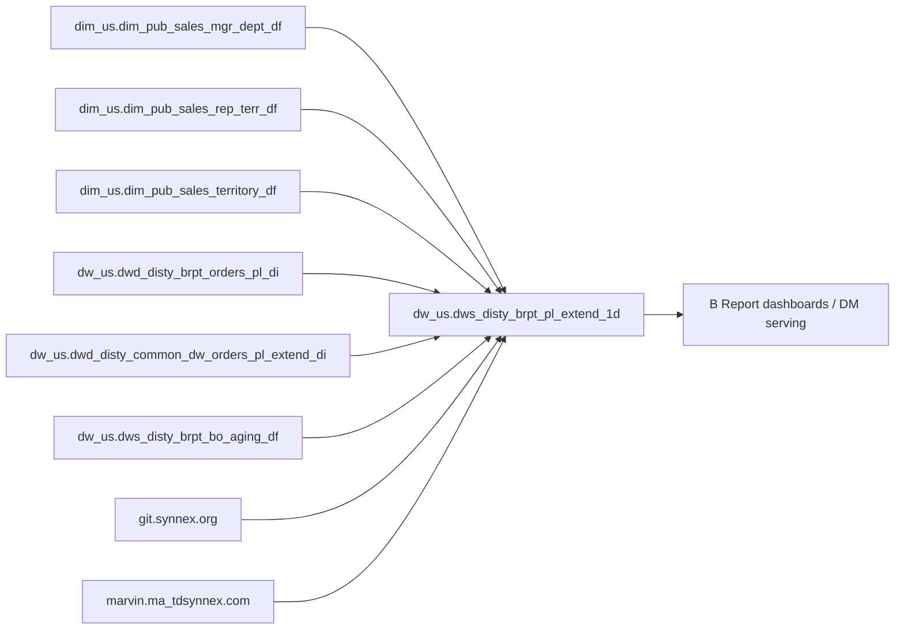

# DWS: B Report profitability serving aggregation (1d) by business slice (`dw_us.dws_disty_brpt_pl_extend_1d`)

- artifact_type: etl_table
- artifact_id: dw_us.dws_disty_brpt_pl_extend_1d
- domain: b-report-us
- one_line_purpose: B Report profitability serving aggregation (1d) by business slice
- layer_type: DWS
- source_kind: etl_sql
- evidence_source: source/contracts/b-report-us/bitbicket_etl/dws_disty_brpt_pl_extend_1d/Common/python/dws_disty_brpt_pl_extend_1d.py
- knowledgebase_path: target/knowledgebase/b-report-us/dws_disty_brpt_pl_extend_1d.md
- contract_source: source/contracts/b-report-us/tables/dws_disty_brpt_pl_extend_1d.md

---

## L1 Data Foundation

### Identity and physical mapping
- **Table:** `dw_us.dws_disty_brpt_pl_extend_1d`
- **Layer type:** DWS
- **Canonical / derived:** Derived aggregation/serving (ETL-loaded)
- **Owner team:** Not documented in repository

### Grain, scope, exclusions
- **Grain:** daily snapshot (single business date)
- **Scope:** US disty B Report shipped-order P&L and performance metrics.
- **Partition:** `date_flag` — resolved from Azkaban/bootstrap parameters (see L4).
- **Natural key:** `cust_no`, `mcust_no`, `sales_rep_id`, `sales_sup_id`, `sales_mgr_id`, `sales_dir_id`
- **Exclusions:** Non-US schemas, backup/temp table variants (`_bkp`, `_temp`), and non-shipped-order scenarios.

### Cross-engine presence
| Engine | Present | Canonical FQN | Notes |
|--------|---------|---------------|-------|
| Hive | yes | `dw_${country}.dws_disty_brpt_pl_extend_1d` | ETL target in Bitbucket script |
| Vertica | yes | `dw_us.dws_disty_brpt_pl_extend_1d` | Contract marks Vertica verified |

### Physical schema reference
| Field | Value |
|-------|-------|
| **Authoritative catalog** | WKB L1 storage seed (not duplicated in this file) |
| **entity_id** | `dw_us.dws_disty_brpt_pl_extend_1d` |
| **l1_catalog_seed** | `target/storage/wkb/snapshots/_snapshot_id_template/l1_catalog/vertica_dw_us_dws_disty_brpt_pl_extend_1d.json` |
| **column_count** | 142 |
| **partition_keys** | `date_flag` |
| **ddl_source** | B Report contract catalog and/or VERTICA/vcdisty DDL |
| **retrieval** | `python -m tools.wkb.indexing.run_query --query "b-report-us dws_disty_brpt_pl_extend_1d schema" --intent find_table_schema` |

### Lineage
- **upstream:** dim_us.dim_pub_sales_mgr_dept_df, dim_us.dim_pub_sales_rep_terr_df, dim_us.dim_pub_sales_territory_df, dw_us.dwd_disty_brpt_orders_pl_di, dw_us.dwd_disty_common_dw_orders_pl_extend_di, dw_us.dws_disty_brpt_bo_aging_df — `source/contracts/b-report-us/bitbicket_etl/dws_disty_brpt_pl_extend_1d/Common/python/dws_disty_brpt_pl_extend_1d.py`
- **downstream:** B Report DM/DWS serving and dashboards (per contract L6 when present) — `source/contracts/b-report-us/tables/dws_disty_brpt_pl_extend_1d.md`

### Freshness and load path
| Item | Value |
|------|-------|
| Load pattern | INSERT OVERWRITE partition reload (per ETL SQL) |
| Schedule | Not documented in repository |
| Parameters | `country`, `date_flag`, `dt_month`, `etl_timestamp`, `flow_run_type` |

---

## L2 Declarative Knowledge

### Business purpose
B Report profitability serving aggregation (1d) by business slice

This Knowledgebase entry documents the Bitbucket ETL load script in `source/contracts/b-report-us/bitbicket_etl/`. Business semantics align with the B Report US contract catalog when present.

### Audience and use cases
| Audience | How they benefit |
|----------|-----------------|
| **B Report / P&L analytics** | Consumers: PM, Sales, Buyer, BD and executive analysis views. |
| **Sales / PM / finance** | Shipped-order and margin metrics at documented grain (daily snapshot). |
| **Data engineering** | Verified upstream/downstream objects with `file:line` evidence from ETL SQL. |

### Fact key resolution
- Order-line hub for B Report P&L: `dw_us.dwd_disty_brpt_orders_pl_etl_mi` when debugging transaction-level metrics.
- This table grain: daily snapshot (single business date).
- Label-on/off and order_type adjustments: see `source/contracts/b-report-us/metric-index.md`.

### Time field semantics
- **`date_flag`:** primary partition / filter for this load; value supplied by Azkaban `conf.get` parameters (see L4).
- **Period semantics:** daily snapshot.


### Metrics served

| Category | Column | Logical metric | Business reading |
|----------|--------|----------------|------------------|
| P&L adjustment / measure | `bo_gm_amt` | `bo_gm_amt` | bo_gm_amt at daily grain |
| P&L adjustment / measure | `bo_gross_cost` | `bo_gross_cost` | bo_gross_cost at daily grain |
| P&L adjustment / measure | `bo_gross_sales` | `bo_gross_sales` | bo_gross_sales at daily grain |
| P&L adjustment / measure | `btl_sales` | `btl_sales` | btl_sales at daily grain |
| P&L adjustment / measure | `cust_finance_sales` | `cust_finance_sales` | cust_finance_sales at daily grain |
| P&L adjustment / measure | `ds_cost` | `ds_cost` | ds_cost at daily grain |
| P&L adjustment / measure | `ds_sales` | `ds_sales` | ds_sales at daily grain |
| P&L adjustment / measure | `fx_cost` | `fx_cost` | fx_cost at daily grain |
| Governed profitability | `gm_amt` | `gm_amt` | gm_amt at daily grain |
| P&L adjustment / measure | `gross_cost` | `gross_cost` | gross_cost at daily grain |
| Governed profitability | `gross_sales` | `gross_sales` | gross_sales at daily grain |
| P&L adjustment / measure | `hc_sales` | `hc_sales` | hc_sales at daily grain |
| P&L adjustment / measure | `inv_cost` | `inv_cost` | inv_cost at daily grain |
| P&L adjustment / measure | `net_cost` | `net_cost` | net_cost at daily grain |
| Governed profitability | `net_sales` | `net_sales` | net_sales at daily grain |
| Governed profitability | `ngm_amt` | `ngm_amt` | ngm_amt at daily grain |
| Governed profitability | `oplgm_amt` | `oplgm_amt` | oplgm_amt at daily grain |
| Governed profitability | `oplgm_plus_amt` | `oplgm_plus_amt` | oplgm_plus_amt at daily grain |
| P&L adjustment / measure | `others_sales` | `others_sales` | others_sales at daily grain |
| P&L adjustment / measure | `scm_cost` | `scm_cost` | scm_cost at daily grain |
| P&L adjustment / measure | `so_gm_amt` | `so_gm_amt` | so_gm_amt at daily grain |
| P&L adjustment / measure | `so_gross_cost` | `so_gross_cost` | so_gross_cost at daily grain |
| P&L adjustment / measure | `so_gross_sales` | `so_gross_sales` | so_gross_sales at daily grain |
| P&L adjustment / measure | `stock_cost` | `stock_cost` | stock_cost at daily grain |
| P&L adjustment / measure | `stock_sales` | `stock_sales` | stock_sales at daily grain |
| Governed profitability | `tgm_amt` | `tgm_amt` | tgm_amt at daily grain |
| Governed profitability | `total_btl` | `total_btl` | total_btl at daily grain |
| P&L adjustment / measure | `trans_btl_sales` | `trans_btl_sales` | trans_btl_sales at daily grain |

### Metric serving map

**Formula authority:** [`source/contracts/b-report-us/metric-index.md`](../../source/contracts/b-report-us/metric-index.md)

| Logical metric | Period scope | Physical column | Formula reference |
|----------------|--------------|-----------------|-------------------|
| `bo_gm_amt` | daily | `bo_gm_amt` | Not in metric-index.md |
| `bo_gross_cost` | daily | `bo_gross_cost` | Not in metric-index.md |
| `bo_gross_sales` | daily | `bo_gross_sales` | Not in metric-index.md |
| `btl_sales` | daily | `btl_sales` | Not in metric-index.md |
| `cust_finance_sales` | daily | `cust_finance_sales` | Not in metric-index.md |
| `ds_cost` | daily | `ds_cost` | Not in metric-index.md |
| `ds_sales` | daily | `ds_sales` | Not in metric-index.md |
| `fx_cost` | daily | `fx_cost` | Not in metric-index.md |
| `gm_amt` | daily | `gm_amt` | `source/contracts/b-report-us/metric-index.md#gm_amt` |
| `gross_cost` | daily | `gross_cost` | Not in metric-index.md |
| `gross_sales` | daily | `gross_sales` | `source/contracts/b-report-us/metric-index.md#gross_sales` |
| `hc_sales` | daily | `hc_sales` | Not in metric-index.md |
| `inv_cost` | daily | `inv_cost` | Not in metric-index.md |
| `net_cost` | daily | `net_cost` | Not in metric-index.md |
| `net_sales` | daily | `net_sales` | `source/contracts/b-report-us/metric-index.md#net_sales` |
| `ngm_amt` | daily | `ngm_amt` | `source/contracts/b-report-us/metric-index.md#ngm_amt` |
| `oplgm_amt` | daily | `oplgm_amt` | `source/contracts/b-report-us/metric-index.md#oplgm_amt` |
| `oplgm_plus_amt` | daily | `oplgm_plus_amt` | `source/contracts/b-report-us/metric-index.md#oplgm_plus_amt` |
| `others_sales` | daily | `others_sales` | Not in metric-index.md |
| `scm_cost` | daily | `scm_cost` | Not in metric-index.md |
| `so_gm_amt` | daily | `so_gm_amt` | Not in metric-index.md |
| `so_gross_cost` | daily | `so_gross_cost` | Not in metric-index.md |
| `so_gross_sales` | daily | `so_gross_sales` | Not in metric-index.md |
| `stock_cost` | daily | `stock_cost` | Not in metric-index.md |
| `stock_sales` | daily | `stock_sales` | Not in metric-index.md |
| `tgm_amt` | daily | `tgm_amt` | `source/contracts/b-report-us/metric-index.md#tgm_amt` |
| `total_btl` | daily | `total_btl` | `source/contracts/b-report-us/metric-index.md#total_btl` |
| `trans_btl_sales` | daily | `trans_btl_sales` | Not in metric-index.md |

### etl_metrics

Formulas below are sourced from [`source/contracts/b-report-us/metric-index.md`](../../source/contracts/b-report-us/metric-index.md) for logical metrics present on this table.
Index formulas are canonical: this enricher copies them into KB and never overwrites `final_effective_formula_sql` in the metric-index.

#### `gm_amt`
- **Source:** [metric-index.md](../../source/contracts/b-report-us/metric-index.md#gm_amt)
- **Business definition:** Core line gross margin before BTL/PDT and full NGM adjustment chain.
```sql
(nvl(u_price,0) - nvl(if(sales_cost is null, u_cost, sales_cost), 0)) * nvl(ship_qty,0)
```

#### `gross_sales`
- **Source:** [metric-index.md](../../source/contracts/b-report-us/metric-index.md#gross_sales)
- **Business definition:** Shipped quantity times unit price without sum expense.
```sql
nvl(ship_qty,0) * nvl(u_price,0)
```

#### `net_sales`
- **Source:** [metric-index.md](../../source/contracts/b-report-us/metric-index.md#net_sales)
- **Business definition:** Shipped quantity times unit price plus per-unit sum expense (net of returns scope per order_type filter).
```sql
nvl(ship_qty,0) * (nvl(u_price,0) + nvl(u_sum_expense,0))
```

#### `ngm_amt`
- **Source:** [metric-index.md](../../source/contracts/b-report-us/metric-index.md#ngm_amt)
- **Business definition:** Net Gross Margin — final P&L profitability metric for PM/executive use after full adjustment chain.
```sql
( (nvl(u_price,0)-nvl(if(sales_cost is null,u_cost,sales_cost),0))*nvl(ship_qty,0)
      + nvl(BTL,0) + nvl(TRANS_BTL,0) + nvl(ONE_TIME_BTL,0) + nvl(HBTL,0) + nvl(SCM_PROFIT_ADJ,0)
      + nvl(BTL_BACKOUT,0) + nvl(PDT,0) + nvl(AP_FINANCE,0) + nvl(SCM_COST,0) + nvl(SCM_RISK,0)
      + nvl(INV_COST,0) + nvl(INV_RESERVE,0) + nvl(INFRASTRUCTURE,0) + nvl(MARKETING,0)
      + nvl(FRT_OUT_LOAD,0) + nvl(FRT_OUT_EXP,0) + nvl(FRT_OB_RECOVERY,0) + nvl(FRT_IB_RECOVERY,0)
      + nvl(WHOH_PACK,0) + nvl(CSGN_EDI_FEE,0) + nvl(CUST_FINANCE,0) * nvl(c.NGM_CFN_RATE,1)
      + nvl(AR_FIN_RECOVERY,0) + nvl(CR_RISK_CTERM,0) * nvl(c.NGM_CRCT_RATE,1)
      + nvl(CUST_PMT_DISC,0) + nvl(CUST_REBATE,0) + nvl(CVR_RM,0) + nvl(DIRECT_CREDIT,0)
      + nvl(FLR_SYNNEX,0) + nvl(RMA,0) + nvl(MOF,0) + nvl(MARGIN_SHARE,0) + nvl(AP_ADJ,0)
      + nvl(CORPORATE,0) + nvl(HC_PM,0) + nvl(HC_BD,0) + nvl(HC_SALES,0) + nvl(ORDER_OVERHEAD,0)
      + nvl(OTHERS,0) + nvl(MFG_OH,0) + nvl(SFS,0) )
```

#### `oplgm_amt`
- **Source:** [metric-index.md](../../source/contracts/b-report-us/metric-index.md#oplgm_amt)
- **Business definition:** Order Profit and Loss for sales commission logic.
```sql
( (nvl(u_price,0)-nvl(if(sales_cost is null,u_cost,sales_cost),0))*nvl(ship_qty,0)
      + nvl(BTL_BACKOUT,0) + nvl(BTL_SALES,0) + nvl(TRANS_BTL_SALES,0)
      + nvl(PDT,0) + nvl(CUST_PMT_DISC,0) + nvl(CUST_REBATE,0) + nvl(CVR_RM,0)
      + nvl(FRT_OUT_LOAD,0) + nvl(FRT_OUT_EXP,0) + nvl(FRT_OB_RECOVERY,0)
      + nvl(MOF,0) + nvl(CUST_FINANCE_SALES,0) * nvl(c.CPL_CFN_RATE,1)
      + nvl(AR_FIN_RECOVERY,0) + nvl(CR_RISK_CTERM,0) * nvl(c.CPL_CRCT_RATE,1)
      + nvl(FLR_SYNNEX,0) + nvl(DIRECT_CREDIT,0) + nvl(WHOH_PACK,0) + nvl(RMA,0)
      + nvl(ORDER_OVERHEAD,0) + nvl(CSGN_EDI_FEE,0) + nvl(FRT_IB_RECOVERY,0)
      + nvl(OTHERS_SALES,0) + nvl(SFS,0)
      + (nvl(u_price,0)+nvl(u_sum_expense,0))*nvl(ship_qty,0) * nvl(c.CPL_COOP_RATE,0) )
```

#### `oplgm_plus_amt`
- **Source:** [metric-index.md](../../source/contracts/b-report-us/metric-index.md#oplgm_plus_amt)
- **Business definition:** Extended OPL metric including additional direct cost/expense components beyond base OPL.
```sql
derived from oplgm_amt chain with additional OPL+ components (see oplgm_plus_amt_calcproc column on DWD)
```

#### `tgm_amt`
- **Source:** [metric-index.md](../../source/contracts/b-report-us/metric-index.md#tgm_amt)
- **Business definition:** Gross margin with core BTL/PDT and related trade-term add-backs (pre-full NGM overhead chain).
```sql
gm_amt + nvl(BTL,0) + nvl(TRANS_BTL,0) + nvl(ONE_TIME_BTL,0) + nvl(HBTL,0) + nvl(SCM_PROFIT_ADJ,0) + nvl(BTL_BACKOUT,0) + nvl(PDT,0)
```

#### `total_btl`
- **Source:** [metric-index.md](../../source/contracts/b-report-us/metric-index.md#total_btl)
- **Business definition:** Aggregate of Below-The-Line trade term adjustment components (BTL, TRANS_BTL, ONE_TIME_BTL, HBTL, etc.).
```sql
nvl(BTL,0) + nvl(TRANS_BTL,0) + nvl(ONE_TIME_BTL,0) + nvl(HBTL,0) + nvl(SCM_PROFIT_ADJ,0) + nvl(BTL_BACKOUT,0)
```

---

## L3 Procedural Knowledge

### Query and routing rules
**Business filters:** Use `date_flag` (or `month_no` for month-indexed DM tables) for reporting scope.
**Technical predicates (load only):** Partition predicate on INSERT OVERWRITE; see Key filters below.

### Dimension join patterns
| Dimension FQN | Join keys | Purpose | Evidence |
|---------------|-----------|---------|----------|
| (ETL join) | — | left join (select -- mtd用的full | `source/contracts/b-report-us/bitbicket_etl/dws_disty_brpt_pl_extend_1d/Common/python/dws_disty_brpt_pl_extend_1d.py` |
| (ETL join) | — | left join (select * from ods_${country}.ods_etl_dw_vend_pl_df | `source/contracts/b-report-us/bitbicket_etl/dws_disty_brpt_pl_extend_1d/Common/python/dws_disty_brpt_pl_extend_1d.py` |
| (ETL join) | — | left join (select * from dim_${country}.dim_pub_sales_territory_df | `source/contracts/b-report-us/bitbicket_etl/dws_disty_brpt_pl_extend_1d/Common/python/dws_disty_brpt_pl_extend_1d.py` |
| (ETL join) | — | left join (select * from temp_cust_xref_company | `source/contracts/b-report-us/bitbicket_etl/dws_disty_brpt_pl_extend_1d/Common/python/dws_disty_brpt_pl_extend_1d.py` |
| (ETL join) | — | left join (select * from ods_${country}.ods_etl_dw_vend_pl_df | `source/contracts/b-report-us/bitbicket_etl/dws_disty_brpt_pl_extend_1d/Common/python/dws_disty_brpt_pl_extend_1d.py` |

### Key filters and ETL business logic
- `${where_condition}` — inferred from ETL WHERE clause
- `date_flag between '${firstday_of_month}' and '${date_flag}'` — inferred from ETL WHERE clause
- `date_flag between '${firstday_of_month}' and '${date_flag}') as table_dwd` — inferred from ETL WHERE clause
- By default, do **not** apply `dim_us.dim_pub_order_type.sales = 'Y'`, `virtual_type = 0`, or `order_type = 1`.
- Apply the order-type / shipped-order join (`sales = 'Y'`) **only when the question explicitly says shipped orders only** (or equivalent).
- Apply `virtual_type = 0` or a specific `order_type` **only when the question explicitly requests that scope**.
- For profitability metrics on this table, always filter `segment_exclude = 'N'` (see `source/ref/b-report-us/special_logic.txt`).
- Technical sync predicates (partition/date load guards) are not business filters.

### Standard time-filter SQL
```sql
-- Reporting filter pattern (replace partition value from L4 trace)
SELECT *
FROM dw_us.dws_disty_brpt_pl_extend_1d
WHERE date_flag = '${partition_value}';
```

### End-to-end flow
1. Read upstream warehouse objects (dim_us.dim_pub_sales_mgr_dept_df, dim_us.dim_pub_sales_rep_terr_df, dim_us.dim_pub_sales_territory_df, dw_us.dwd_disty_brpt_orders_pl_di).
2. Apply CTE aggregations and business joins inside ETL SQL.
3. INSERT OVERWRITE into `dw_us.dws_disty_brpt_pl_extend_1d` partition `date_flag`.
4. Sync to Vertica for B Report consumption (sync job not verified in this repository unless cited below).



### Base tables register
| Object | Role in this job |
|--------|------------------|
| `dim_us.dim_pub_sales_mgr_dept_df` | source |
| `dim_us.dim_pub_sales_rep_terr_df` | source |
| `dim_us.dim_pub_sales_territory_df` | source |
| `dw_us.dwd_disty_brpt_orders_pl_di` | source |
| `dw_us.dwd_disty_common_dw_orders_pl_extend_di` | source |
| `dw_us.dws_disty_brpt_bo_aging_df` | source |
| `dw_us.dws_disty_brpt_pl_extend_1d` | target |
| `git.synnex.org` | source |
| `marvin.ma_tdsynnex.com` | source |
| `ods_us.ods_breport_mydaas_breport_parameter` | source |
| `ods_us.ods_cis_corp_cust_type` | source |
| `ods_us.ods_cis_corp_division` | source |
| `ods_us.ods_cis_corp_parameters` | source |
| `ods_us.ods_cis_corp_pl_code` | source |
| `ods_us.ods_cis_corp_vendor_segment` | source |
| `ods_us.ods_etl_cust_xref_all_df` | source |
| `ods_us.ods_etl_dw_vend_pl_df` | source |
| `ods_us.ods_etl_pm_vpc_matrix_df` | source |

### Step-by-step logic
#### Step 1 — CTE `table_dwd`

**Source:** intermediate aggregation inside ETL SQL — `source/contracts/b-report-us/bitbicket_etl/dws_disty_brpt_pl_extend_1d/Common/python/dws_disty_brpt_pl_extend_1d.py`

#### Step 2 — dimension and reference joins

**Join keys:** see Dimension join patterns table (parsed from ETL SQL).

### Column / field derivations (from ETL SQL)

| target_column | expression_sql | upstream_columns | upstream_tables | transform_kind | evidence |
|---------------|----------------|------------------|-----------------|----------------|----------|
| `cust_no` | `nvl(table_dwd.cust_no,table_aging.cust_no)` | `cust_no` | `table_dwd`, `dw_${country}.dws_disty_brpt_bo_aging_df`, `${dim_pub_part_info}`, `${dim_pub_vpl_info}`, `ods_${country}.ods_etl_dw_vend_pl_df`, `${dim_pub_customer_info}`, `ods_${country}.ods_cis_corp_cust_type`, `ods_${country}.ods_cis_corp_division`, `dim_${country}.dim_pub_sales_territory_df`, `dim_${country}.dim_pub_sales_rep_terr_df`, `dim_${country}.dim_pub_sales_mgr_dept_df`, `temp_mcust_no_clean` | coalesce | `source/contracts/b-report-us/bitbicket_etl/dws_disty_brpt_pl_extend_1d/Common/python/dws_disty_brpt_pl_extend_1d.py:249` |
| `cust_name` | `table_customer.cust_name` | `cust_name` | `table_dwd`, `dw_${country}.dws_disty_brpt_bo_aging_df`, `${dim_pub_part_info}`, `${dim_pub_vpl_info}`, `ods_${country}.ods_etl_dw_vend_pl_df`, `${dim_pub_customer_info}`, `ods_${country}.ods_cis_corp_cust_type`, `ods_${country}.ods_cis_corp_division`, `dim_${country}.dim_pub_sales_territory_df`, `dim_${country}.dim_pub_sales_rep_terr_df`, `dim_${country}.dim_pub_sales_mgr_dept_df`, `temp_mcust_no_clean` | passthrough | `source/contracts/b-report-us/bitbicket_etl/dws_disty_brpt_pl_extend_1d/Common/python/dws_disty_brpt_pl_extend_1d.py:250` |
| `mcust_no` | `coalesce(cxc.cust_no, dbp.icode1, cx.xref_no, table_customer.mcust_no)` | `cust_no`, `icode1`, `xref_no`, `mcust_no` | `table_dwd`, `dw_${country}.dws_disty_brpt_bo_aging_df`, `${dim_pub_part_info}`, `${dim_pub_vpl_info}`, `ods_${country}.ods_etl_dw_vend_pl_df`, `${dim_pub_customer_info}`, `ods_${country}.ods_cis_corp_cust_type`, `ods_${country}.ods_cis_corp_division`, `dim_${country}.dim_pub_sales_territory_df`, `dim_${country}.dim_pub_sales_rep_terr_df`, `dim_${country}.dim_pub_sales_mgr_dept_df`, `temp_mcust_no_clean` | coalesce | `source/contracts/b-report-us/bitbicket_etl/dws_disty_brpt_pl_extend_1d/Common/python/dws_disty_brpt_pl_extend_1d.py:251` |
| `mcust_name` | `null` | — | `table_dwd`, `dw_${country}.dws_disty_brpt_bo_aging_df`, `${dim_pub_part_info}`, `${dim_pub_vpl_info}`, `ods_${country}.ods_etl_dw_vend_pl_df`, `${dim_pub_customer_info}`, `ods_${country}.ods_cis_corp_cust_type`, `ods_${country}.ods_cis_corp_division`, `dim_${country}.dim_pub_sales_territory_df`, `dim_${country}.dim_pub_sales_rep_terr_df`, `dim_${country}.dim_pub_sales_mgr_dept_df`, `temp_mcust_no_clean` | rename | `source/contracts/b-report-us/bitbicket_etl/dws_disty_brpt_pl_extend_1d/Common/python/dws_disty_brpt_pl_extend_1d.py:252` |
| `cust_terr` | `nvl(table_dwd.cust_terr,table_aging.cust_terr)` | `cust_terr` | `table_dwd`, `dw_${country}.dws_disty_brpt_bo_aging_df`, `${dim_pub_part_info}`, `${dim_pub_vpl_info}`, `ods_${country}.ods_etl_dw_vend_pl_df`, `${dim_pub_customer_info}`, `ods_${country}.ods_cis_corp_cust_type`, `ods_${country}.ods_cis_corp_division`, `dim_${country}.dim_pub_sales_territory_df`, `dim_${country}.dim_pub_sales_rep_terr_df`, `dim_${country}.dim_pub_sales_mgr_dept_df`, `temp_mcust_no_clean` | coalesce | `source/contracts/b-report-us/bitbicket_etl/dws_disty_brpt_pl_extend_1d/Common/python/dws_disty_brpt_pl_extend_1d.py:253` |
| `terr_name` | `table_terr.terr_name` | `terr_name` | `table_dwd`, `dw_${country}.dws_disty_brpt_bo_aging_df`, `${dim_pub_part_info}`, `${dim_pub_vpl_info}`, `ods_${country}.ods_etl_dw_vend_pl_df`, `${dim_pub_customer_info}`, `ods_${country}.ods_cis_corp_cust_type`, `ods_${country}.ods_cis_corp_division`, `dim_${country}.dim_pub_sales_territory_df`, `dim_${country}.dim_pub_sales_rep_terr_df`, `dim_${country}.dim_pub_sales_mgr_dept_df`, `temp_mcust_no_clean` | passthrough | `source/contracts/b-report-us/bitbicket_etl/dws_disty_brpt_pl_extend_1d/Common/python/dws_disty_brpt_pl_extend_1d.py:254` |
| `cust_type` | `nvl(table_dwd.cust_type,table_aging.cust_type)` | `cust_type` | `table_dwd`, `dw_${country}.dws_disty_brpt_bo_aging_df`, `${dim_pub_part_info}`, `${dim_pub_vpl_info}`, `ods_${country}.ods_etl_dw_vend_pl_df`, `${dim_pub_customer_info}`, `ods_${country}.ods_cis_corp_cust_type`, `ods_${country}.ods_cis_corp_division`, `dim_${country}.dim_pub_sales_territory_df`, `dim_${country}.dim_pub_sales_rep_terr_df`, `dim_${country}.dim_pub_sales_mgr_dept_df`, `temp_mcust_no_clean` | coalesce | `source/contracts/b-report-us/bitbicket_etl/dws_disty_brpt_pl_extend_1d/Common/python/dws_disty_brpt_pl_extend_1d.py:255` |
| `cust_type_desc` | `table_cust_type.cust_type_descr` | `cust_type_descr` | `table_dwd`, `dw_${country}.dws_disty_brpt_bo_aging_df`, `${dim_pub_part_info}`, `${dim_pub_vpl_info}`, `ods_${country}.ods_etl_dw_vend_pl_df`, `${dim_pub_customer_info}`, `ods_${country}.ods_cis_corp_cust_type`, `ods_${country}.ods_cis_corp_division`, `dim_${country}.dim_pub_sales_territory_df`, `dim_${country}.dim_pub_sales_rep_terr_df`, `dim_${country}.dim_pub_sales_mgr_dept_df`, `temp_mcust_no_clean` | rename | `source/contracts/b-report-us/bitbicket_etl/dws_disty_brpt_pl_extend_1d/Common/python/dws_disty_brpt_pl_extend_1d.py:256` |
| `division` | `table_cust_type.division` | `division` | `table_dwd`, `dw_${country}.dws_disty_brpt_bo_aging_df`, `${dim_pub_part_info}`, `${dim_pub_vpl_info}`, `ods_${country}.ods_etl_dw_vend_pl_df`, `${dim_pub_customer_info}`, `ods_${country}.ods_cis_corp_cust_type`, `ods_${country}.ods_cis_corp_division`, `dim_${country}.dim_pub_sales_territory_df`, `dim_${country}.dim_pub_sales_rep_terr_df`, `dim_${country}.dim_pub_sales_mgr_dept_df`, `temp_mcust_no_clean` | passthrough | `source/contracts/b-report-us/bitbicket_etl/dws_disty_brpt_pl_extend_1d/Common/python/dws_disty_brpt_pl_extend_1d.py:257` |
| `division_desc` | `table_div.division_desc` | `division_desc` | `table_dwd`, `dw_${country}.dws_disty_brpt_bo_aging_df`, `${dim_pub_part_info}`, `${dim_pub_vpl_info}`, `ods_${country}.ods_etl_dw_vend_pl_df`, `${dim_pub_customer_info}`, `ods_${country}.ods_cis_corp_cust_type`, `ods_${country}.ods_cis_corp_division`, `dim_${country}.dim_pub_sales_territory_df`, `dim_${country}.dim_pub_sales_rep_terr_df`, `dim_${country}.dim_pub_sales_mgr_dept_df`, `temp_mcust_no_clean` | passthrough | `source/contracts/b-report-us/bitbicket_etl/dws_disty_brpt_pl_extend_1d/Common/python/dws_disty_brpt_pl_extend_1d.py:258` |
| `terr_sub_group` | `table_terr.sub_group_id` | `sub_group_id` | `table_dwd`, `dw_${country}.dws_disty_brpt_bo_aging_df`, `${dim_pub_part_info}`, `${dim_pub_vpl_info}`, `ods_${country}.ods_etl_dw_vend_pl_df`, `${dim_pub_customer_info}`, `ods_${country}.ods_cis_corp_cust_type`, `ods_${country}.ods_cis_corp_division`, `dim_${country}.dim_pub_sales_territory_df`, `dim_${country}.dim_pub_sales_rep_terr_df`, `dim_${country}.dim_pub_sales_mgr_dept_df`, `temp_mcust_no_clean` | rename | `source/contracts/b-report-us/bitbicket_etl/dws_disty_brpt_pl_extend_1d/Common/python/dws_disty_brpt_pl_extend_1d.py:259` |
| `terr_sub_group_desc` | `table_terr.sub_group_desc` | `sub_group_desc` | `table_dwd`, `dw_${country}.dws_disty_brpt_bo_aging_df`, `${dim_pub_part_info}`, `${dim_pub_vpl_info}`, `ods_${country}.ods_etl_dw_vend_pl_df`, `${dim_pub_customer_info}`, `ods_${country}.ods_cis_corp_cust_type`, `ods_${country}.ods_cis_corp_division`, `dim_${country}.dim_pub_sales_territory_df`, `dim_${country}.dim_pub_sales_rep_terr_df`, `dim_${country}.dim_pub_sales_mgr_dept_df`, `temp_mcust_no_clean` | rename | `source/contracts/b-report-us/bitbicket_etl/dws_disty_brpt_pl_extend_1d/Common/python/dws_disty_brpt_pl_extend_1d.py:260` |
| `terr_group` | `table_terr.group_id` | `group_id` | `table_dwd`, `dw_${country}.dws_disty_brpt_bo_aging_df`, `${dim_pub_part_info}`, `${dim_pub_vpl_info}`, `ods_${country}.ods_etl_dw_vend_pl_df`, `${dim_pub_customer_info}`, `ods_${country}.ods_cis_corp_cust_type`, `ods_${country}.ods_cis_corp_division`, `dim_${country}.dim_pub_sales_territory_df`, `dim_${country}.dim_pub_sales_rep_terr_df`, `dim_${country}.dim_pub_sales_mgr_dept_df`, `temp_mcust_no_clean` | rename | `source/contracts/b-report-us/bitbicket_etl/dws_disty_brpt_pl_extend_1d/Common/python/dws_disty_brpt_pl_extend_1d.py:261` |
| `terr_group_desc` | `table_terr.group_desc` | `group_desc` | `table_dwd`, `dw_${country}.dws_disty_brpt_bo_aging_df`, `${dim_pub_part_info}`, `${dim_pub_vpl_info}`, `ods_${country}.ods_etl_dw_vend_pl_df`, `${dim_pub_customer_info}`, `ods_${country}.ods_cis_corp_cust_type`, `ods_${country}.ods_cis_corp_division`, `dim_${country}.dim_pub_sales_territory_df`, `dim_${country}.dim_pub_sales_rep_terr_df`, `dim_${country}.dim_pub_sales_mgr_dept_df`, `temp_mcust_no_clean` | rename | `source/contracts/b-report-us/bitbicket_etl/dws_disty_brpt_pl_extend_1d/Common/python/dws_disty_brpt_pl_extend_1d.py:262` |
| `sales_rep_id` | `nvl(table1.sales_rep_id,-3)` | `sales_rep_id` | `table_dwd`, `dw_${country}.dws_disty_brpt_bo_aging_df`, `${dim_pub_part_info}`, `${dim_pub_vpl_info}`, `ods_${country}.ods_etl_dw_vend_pl_df`, `${dim_pub_customer_info}`, `ods_${country}.ods_cis_corp_cust_type`, `ods_${country}.ods_cis_corp_division`, `dim_${country}.dim_pub_sales_territory_df`, `dim_${country}.dim_pub_sales_rep_terr_df`, `dim_${country}.dim_pub_sales_mgr_dept_df`, `temp_mcust_no_clean` | coalesce | `source/contracts/b-report-us/bitbicket_etl/dws_disty_brpt_pl_extend_1d/Common/python/dws_disty_brpt_pl_extend_1d.py:264` |
| `sales_sup_id` | `nvl(table2.manager_id,-3)` | `manager_id` | `table_dwd`, `dw_${country}.dws_disty_brpt_bo_aging_df`, `${dim_pub_part_info}`, `${dim_pub_vpl_info}`, `ods_${country}.ods_etl_dw_vend_pl_df`, `${dim_pub_customer_info}`, `ods_${country}.ods_cis_corp_cust_type`, `ods_${country}.ods_cis_corp_division`, `dim_${country}.dim_pub_sales_territory_df`, `dim_${country}.dim_pub_sales_rep_terr_df`, `dim_${country}.dim_pub_sales_mgr_dept_df`, `temp_mcust_no_clean` | coalesce | `source/contracts/b-report-us/bitbicket_etl/dws_disty_brpt_pl_extend_1d/Common/python/dws_disty_brpt_pl_extend_1d.py:265` |
| `sales_mgr_id` | `nvl(table3.manager_id,-3)` | `manager_id` | `table_dwd`, `dw_${country}.dws_disty_brpt_bo_aging_df`, `${dim_pub_part_info}`, `${dim_pub_vpl_info}`, `ods_${country}.ods_etl_dw_vend_pl_df`, `${dim_pub_customer_info}`, `ods_${country}.ods_cis_corp_cust_type`, `ods_${country}.ods_cis_corp_division`, `dim_${country}.dim_pub_sales_territory_df`, `dim_${country}.dim_pub_sales_rep_terr_df`, `dim_${country}.dim_pub_sales_mgr_dept_df`, `temp_mcust_no_clean` | coalesce | `source/contracts/b-report-us/bitbicket_etl/dws_disty_brpt_pl_extend_1d/Common/python/dws_disty_brpt_pl_extend_1d.py:266` |
| `sales_dir_id` | `nvl(table4.manager_id,-3)` | `manager_id` | `table_dwd`, `dw_${country}.dws_disty_brpt_bo_aging_df`, `${dim_pub_part_info}`, `${dim_pub_vpl_info}`, `ods_${country}.ods_etl_dw_vend_pl_df`, `${dim_pub_customer_info}`, `ods_${country}.ods_cis_corp_cust_type`, `ods_${country}.ods_cis_corp_division`, `dim_${country}.dim_pub_sales_territory_df`, `dim_${country}.dim_pub_sales_rep_terr_df`, `dim_${country}.dim_pub_sales_mgr_dept_df`, `temp_mcust_no_clean` | coalesce | `source/contracts/b-report-us/bitbicket_etl/dws_disty_brpt_pl_extend_1d/Common/python/dws_disty_brpt_pl_extend_1d.py:267` |
| `sales_vp_id` | `nvl(table5.manager_id,-3)` | `manager_id` | `table_dwd`, `dw_${country}.dws_disty_brpt_bo_aging_df`, `${dim_pub_part_info}`, `${dim_pub_vpl_info}`, `ods_${country}.ods_etl_dw_vend_pl_df`, `${dim_pub_customer_info}`, `ods_${country}.ods_cis_corp_cust_type`, `ods_${country}.ods_cis_corp_division`, `dim_${country}.dim_pub_sales_territory_df`, `dim_${country}.dim_pub_sales_rep_terr_df`, `dim_${country}.dim_pub_sales_mgr_dept_df`, `temp_mcust_no_clean` | coalesce | `source/contracts/b-report-us/bitbicket_etl/dws_disty_brpt_pl_extend_1d/Common/python/dws_disty_brpt_pl_extend_1d.py:268` |
| `sku_no` | `nvl(table_dwd.sku_no,table_aging.sku_no)` | `sku_no` | `table_dwd`, `dw_${country}.dws_disty_brpt_bo_aging_df`, `${dim_pub_part_info}`, `${dim_pub_vpl_info}`, `ods_${country}.ods_etl_dw_vend_pl_df`, `${dim_pub_customer_info}`, `ods_${country}.ods_cis_corp_cust_type`, `ods_${country}.ods_cis_corp_division`, `dim_${country}.dim_pub_sales_territory_df`, `dim_${country}.dim_pub_sales_rep_terr_df`, `dim_${country}.dim_pub_sales_mgr_dept_df`, `temp_mcust_no_clean` | coalesce | `source/contracts/b-report-us/bitbicket_etl/dws_disty_brpt_pl_extend_1d/Common/python/dws_disty_brpt_pl_extend_1d.py:270` |
| `part_no` | `table_part.part_no` | `part_no` | `table_dwd`, `dw_${country}.dws_disty_brpt_bo_aging_df`, `${dim_pub_part_info}`, `${dim_pub_vpl_info}`, `ods_${country}.ods_etl_dw_vend_pl_df`, `${dim_pub_customer_info}`, `ods_${country}.ods_cis_corp_cust_type`, `ods_${country}.ods_cis_corp_division`, `dim_${country}.dim_pub_sales_territory_df`, `dim_${country}.dim_pub_sales_rep_terr_df`, `dim_${country}.dim_pub_sales_mgr_dept_df`, `temp_mcust_no_clean` | passthrough | `source/contracts/b-report-us/bitbicket_etl/dws_disty_brpt_pl_extend_1d/Common/python/dws_disty_brpt_pl_extend_1d.py:271` |
| `mfg_partno` | `table_part.mfg_partno` | `mfg_partno` | `table_dwd`, `dw_${country}.dws_disty_brpt_bo_aging_df`, `${dim_pub_part_info}`, `${dim_pub_vpl_info}`, `ods_${country}.ods_etl_dw_vend_pl_df`, `${dim_pub_customer_info}`, `ods_${country}.ods_cis_corp_cust_type`, `ods_${country}.ods_cis_corp_division`, `dim_${country}.dim_pub_sales_territory_df`, `dim_${country}.dim_pub_sales_rep_terr_df`, `dim_${country}.dim_pub_sales_mgr_dept_df`, `temp_mcust_no_clean` | passthrough | `source/contracts/b-report-us/bitbicket_etl/dws_disty_brpt_pl_extend_1d/Common/python/dws_disty_brpt_pl_extend_1d.py:272` |
| `vpl_no` | `case when nvl(table_dwd.sku_no,table_aging.sku_no) >=0 then nvl(table_part_vpl.alt_vpl_no,table_part.vpl_no) when nvl...` | `sku_no`, `alt_vpl_no`, `vpl_no` | `table_dwd`, `dw_${country}.dws_disty_brpt_bo_aging_df`, `${dim_pub_part_info}`, `${dim_pub_vpl_info}`, `ods_${country}.ods_etl_dw_vend_pl_df`, `${dim_pub_customer_info}`, `ods_${country}.ods_cis_corp_cust_type`, `ods_${country}.ods_cis_corp_division`, `dim_${country}.dim_pub_sales_territory_df`, `dim_${country}.dim_pub_sales_rep_terr_df`, `dim_${country}.dim_pub_sales_mgr_dept_df`, `temp_mcust_no_clean` | case | `source/contracts/b-report-us/bitbicket_etl/dws_disty_brpt_pl_extend_1d/Common/python/dws_disty_brpt_pl_extend_1d.py:273` |
| `vpl_code` | `null` | — | `table_dwd`, `dw_${country}.dws_disty_brpt_bo_aging_df`, `${dim_pub_part_info}`, `${dim_pub_vpl_info}`, `ods_${country}.ods_etl_dw_vend_pl_df`, `${dim_pub_customer_info}`, `ods_${country}.ods_cis_corp_cust_type`, `ods_${country}.ods_cis_corp_division`, `dim_${country}.dim_pub_sales_territory_df`, `dim_${country}.dim_pub_sales_rep_terr_df`, `dim_${country}.dim_pub_sales_mgr_dept_df`, `temp_mcust_no_clean` | rename | `source/contracts/b-report-us/bitbicket_etl/dws_disty_brpt_pl_extend_1d/Common/python/dws_disty_brpt_pl_extend_1d.py:252` |
| `vpc_group_id` | `null` | — | `table_dwd`, `dw_${country}.dws_disty_brpt_bo_aging_df`, `${dim_pub_part_info}`, `${dim_pub_vpl_info}`, `ods_${country}.ods_etl_dw_vend_pl_df`, `${dim_pub_customer_info}`, `ods_${country}.ods_cis_corp_cust_type`, `ods_${country}.ods_cis_corp_division`, `dim_${country}.dim_pub_sales_territory_df`, `dim_${country}.dim_pub_sales_rep_terr_df`, `dim_${country}.dim_pub_sales_mgr_dept_df`, `temp_mcust_no_clean` | rename | `source/contracts/b-report-us/bitbicket_etl/dws_disty_brpt_pl_extend_1d/Common/python/dws_disty_brpt_pl_extend_1d.py:252` |
| `vpc_group_desc` | `null` | — | `table_dwd`, `dw_${country}.dws_disty_brpt_bo_aging_df`, `${dim_pub_part_info}`, `${dim_pub_vpl_info}`, `ods_${country}.ods_etl_dw_vend_pl_df`, `${dim_pub_customer_info}`, `ods_${country}.ods_cis_corp_cust_type`, `ods_${country}.ods_cis_corp_division`, `dim_${country}.dim_pub_sales_territory_df`, `dim_${country}.dim_pub_sales_rep_terr_df`, `dim_${country}.dim_pub_sales_mgr_dept_df`, `temp_mcust_no_clean` | rename | `source/contracts/b-report-us/bitbicket_etl/dws_disty_brpt_pl_extend_1d/Common/python/dws_disty_brpt_pl_extend_1d.py:252` |
| `vend_no` | `case when nvl(table_dwd.sku_no,table_aging.sku_no) >=0 then nvl(table_part_vpl.alt_vend_no,table_part_vpl.vend_no) wh...` | `sku_no`, `alt_vend_no`, `vend_no`, `vpl_no` | `table_dwd`, `dw_${country}.dws_disty_brpt_bo_aging_df`, `${dim_pub_part_info}`, `${dim_pub_vpl_info}`, `ods_${country}.ods_etl_dw_vend_pl_df`, `${dim_pub_customer_info}`, `ods_${country}.ods_cis_corp_cust_type`, `ods_${country}.ods_cis_corp_division`, `dim_${country}.dim_pub_sales_territory_df`, `dim_${country}.dim_pub_sales_rep_terr_df`, `dim_${country}.dim_pub_sales_mgr_dept_df`, `temp_mcust_no_clean` | case | `source/contracts/b-report-us/bitbicket_etl/dws_disty_brpt_pl_extend_1d/Common/python/dws_disty_brpt_pl_extend_1d.py:273` |
| `vend_name` | `null` | — | `table_dwd`, `dw_${country}.dws_disty_brpt_bo_aging_df`, `${dim_pub_part_info}`, `${dim_pub_vpl_info}`, `ods_${country}.ods_etl_dw_vend_pl_df`, `${dim_pub_customer_info}`, `ods_${country}.ods_cis_corp_cust_type`, `ods_${country}.ods_cis_corp_division`, `dim_${country}.dim_pub_sales_territory_df`, `dim_${country}.dim_pub_sales_rep_terr_df`, `dim_${country}.dim_pub_sales_mgr_dept_df`, `temp_mcust_no_clean` | rename | `source/contracts/b-report-us/bitbicket_etl/dws_disty_brpt_pl_extend_1d/Common/python/dws_disty_brpt_pl_extend_1d.py:252` |
| `master_vend_no` | `null` | — | `table_dwd`, `dw_${country}.dws_disty_brpt_bo_aging_df`, `${dim_pub_part_info}`, `${dim_pub_vpl_info}`, `ods_${country}.ods_etl_dw_vend_pl_df`, `${dim_pub_customer_info}`, `ods_${country}.ods_cis_corp_cust_type`, `ods_${country}.ods_cis_corp_division`, `dim_${country}.dim_pub_sales_territory_df`, `dim_${country}.dim_pub_sales_rep_terr_df`, `dim_${country}.dim_pub_sales_mgr_dept_df`, `temp_mcust_no_clean` | rename | `source/contracts/b-report-us/bitbicket_etl/dws_disty_brpt_pl_extend_1d/Common/python/dws_disty_brpt_pl_extend_1d.py:252` |
| `master_vend_name` | `null` | — | `table_dwd`, `dw_${country}.dws_disty_brpt_bo_aging_df`, `${dim_pub_part_info}`, `${dim_pub_vpl_info}`, `ods_${country}.ods_etl_dw_vend_pl_df`, `${dim_pub_customer_info}`, `ods_${country}.ods_cis_corp_cust_type`, `ods_${country}.ods_cis_corp_division`, `dim_${country}.dim_pub_sales_territory_df`, `dim_${country}.dim_pub_sales_rep_terr_df`, `dim_${country}.dim_pub_sales_mgr_dept_df`, `temp_mcust_no_clean` | rename | `source/contracts/b-report-us/bitbicket_etl/dws_disty_brpt_pl_extend_1d/Common/python/dws_disty_brpt_pl_extend_1d.py:252` |
| `group_id` | `table_part.group_id` | `group_id` | `table_dwd`, `dw_${country}.dws_disty_brpt_bo_aging_df`, `${dim_pub_part_info}`, `${dim_pub_vpl_info}`, `ods_${country}.ods_etl_dw_vend_pl_df`, `${dim_pub_customer_info}`, `ods_${country}.ods_cis_corp_cust_type`, `ods_${country}.ods_cis_corp_division`, `dim_${country}.dim_pub_sales_territory_df`, `dim_${country}.dim_pub_sales_rep_terr_df`, `dim_${country}.dim_pub_sales_mgr_dept_df`, `temp_mcust_no_clean` | passthrough | `source/contracts/b-report-us/bitbicket_etl/dws_disty_brpt_pl_extend_1d/Common/python/dws_disty_brpt_pl_extend_1d.py:293` |
| `seg_code` | `nullif(table_part_vpl2.alt_seg_code, '')` | `nullif`, `alt_seg_code` | `table_dwd`, `dw_${country}.dws_disty_brpt_bo_aging_df`, `${dim_pub_part_info}`, `${dim_pub_vpl_info}`, `ods_${country}.ods_etl_dw_vend_pl_df`, `${dim_pub_customer_info}`, `ods_${country}.ods_cis_corp_cust_type`, `ods_${country}.ods_cis_corp_division`, `dim_${country}.dim_pub_sales_territory_df`, `dim_${country}.dim_pub_sales_rep_terr_df`, `dim_${country}.dim_pub_sales_mgr_dept_df`, `temp_mcust_no_clean` | udf | `source/contracts/b-report-us/bitbicket_etl/dws_disty_brpt_pl_extend_1d/Common/python/dws_disty_brpt_pl_extend_1d.py:294` |
| `pm_id` | `null` | — | `table_dwd`, `dw_${country}.dws_disty_brpt_bo_aging_df`, `${dim_pub_part_info}`, `${dim_pub_vpl_info}`, `ods_${country}.ods_etl_dw_vend_pl_df`, `${dim_pub_customer_info}`, `ods_${country}.ods_cis_corp_cust_type`, `ods_${country}.ods_cis_corp_division`, `dim_${country}.dim_pub_sales_territory_df`, `dim_${country}.dim_pub_sales_rep_terr_df`, `dim_${country}.dim_pub_sales_mgr_dept_df`, `temp_mcust_no_clean` | rename | `source/contracts/b-report-us/bitbicket_etl/dws_disty_brpt_pl_extend_1d/Common/python/dws_disty_brpt_pl_extend_1d.py:252` |
| `pm_mgr_id` | `null` | — | `table_dwd`, `dw_${country}.dws_disty_brpt_bo_aging_df`, `${dim_pub_part_info}`, `${dim_pub_vpl_info}`, `ods_${country}.ods_etl_dw_vend_pl_df`, `${dim_pub_customer_info}`, `ods_${country}.ods_cis_corp_cust_type`, `ods_${country}.ods_cis_corp_division`, `dim_${country}.dim_pub_sales_territory_df`, `dim_${country}.dim_pub_sales_rep_terr_df`, `dim_${country}.dim_pub_sales_mgr_dept_df`, `temp_mcust_no_clean` | rename | `source/contracts/b-report-us/bitbicket_etl/dws_disty_brpt_pl_extend_1d/Common/python/dws_disty_brpt_pl_extend_1d.py:252` |
| `pm_dir_id` | `null` | — | `table_dwd`, `dw_${country}.dws_disty_brpt_bo_aging_df`, `${dim_pub_part_info}`, `${dim_pub_vpl_info}`, `ods_${country}.ods_etl_dw_vend_pl_df`, `${dim_pub_customer_info}`, `ods_${country}.ods_cis_corp_cust_type`, `ods_${country}.ods_cis_corp_division`, `dim_${country}.dim_pub_sales_territory_df`, `dim_${country}.dim_pub_sales_rep_terr_df`, `dim_${country}.dim_pub_sales_mgr_dept_df`, `temp_mcust_no_clean` | rename | `source/contracts/b-report-us/bitbicket_etl/dws_disty_brpt_pl_extend_1d/Common/python/dws_disty_brpt_pl_extend_1d.py:252` |
| `pm_vp_id` | `null` | — | `table_dwd`, `dw_${country}.dws_disty_brpt_bo_aging_df`, `${dim_pub_part_info}`, `${dim_pub_vpl_info}`, `ods_${country}.ods_etl_dw_vend_pl_df`, `${dim_pub_customer_info}`, `ods_${country}.ods_cis_corp_cust_type`, `ods_${country}.ods_cis_corp_division`, `dim_${country}.dim_pub_sales_territory_df`, `dim_${country}.dim_pub_sales_rep_terr_df`, `dim_${country}.dim_pub_sales_mgr_dept_df`, `temp_mcust_no_clean` | rename | `source/contracts/b-report-us/bitbicket_etl/dws_disty_brpt_pl_extend_1d/Common/python/dws_disty_brpt_pl_extend_1d.py:252` |
| `buyer_id` | `null` | — | `table_dwd`, `dw_${country}.dws_disty_brpt_bo_aging_df`, `${dim_pub_part_info}`, `${dim_pub_vpl_info}`, `ods_${country}.ods_etl_dw_vend_pl_df`, `${dim_pub_customer_info}`, `ods_${country}.ods_cis_corp_cust_type`, `ods_${country}.ods_cis_corp_division`, `dim_${country}.dim_pub_sales_territory_df`, `dim_${country}.dim_pub_sales_rep_terr_df`, `dim_${country}.dim_pub_sales_mgr_dept_df`, `temp_mcust_no_clean` | rename | `source/contracts/b-report-us/bitbicket_etl/dws_disty_brpt_pl_extend_1d/Common/python/dws_disty_brpt_pl_extend_1d.py:252` |
| `buyer_mgr_id` | `null` | — | `table_dwd`, `dw_${country}.dws_disty_brpt_bo_aging_df`, `${dim_pub_part_info}`, `${dim_pub_vpl_info}`, `ods_${country}.ods_etl_dw_vend_pl_df`, `${dim_pub_customer_info}`, `ods_${country}.ods_cis_corp_cust_type`, `ods_${country}.ods_cis_corp_division`, `dim_${country}.dim_pub_sales_territory_df`, `dim_${country}.dim_pub_sales_rep_terr_df`, `dim_${country}.dim_pub_sales_mgr_dept_df`, `temp_mcust_no_clean` | rename | `source/contracts/b-report-us/bitbicket_etl/dws_disty_brpt_pl_extend_1d/Common/python/dws_disty_brpt_pl_extend_1d.py:252` |
| `buyer_dir_id` | `null` | — | `table_dwd`, `dw_${country}.dws_disty_brpt_bo_aging_df`, `${dim_pub_part_info}`, `${dim_pub_vpl_info}`, `ods_${country}.ods_etl_dw_vend_pl_df`, `${dim_pub_customer_info}`, `ods_${country}.ods_cis_corp_cust_type`, `ods_${country}.ods_cis_corp_division`, `dim_${country}.dim_pub_sales_territory_df`, `dim_${country}.dim_pub_sales_rep_terr_df`, `dim_${country}.dim_pub_sales_mgr_dept_df`, `temp_mcust_no_clean` | rename | `source/contracts/b-report-us/bitbicket_etl/dws_disty_brpt_pl_extend_1d/Common/python/dws_disty_brpt_pl_extend_1d.py:252` |
| `buyer_vp_id` | `null` | — | `table_dwd`, `dw_${country}.dws_disty_brpt_bo_aging_df`, `${dim_pub_part_info}`, `${dim_pub_vpl_info}`, `ods_${country}.ods_etl_dw_vend_pl_df`, `${dim_pub_customer_info}`, `ods_${country}.ods_cis_corp_cust_type`, `ods_${country}.ods_cis_corp_division`, `dim_${country}.dim_pub_sales_territory_df`, `dim_${country}.dim_pub_sales_rep_terr_df`, `dim_${country}.dim_pub_sales_mgr_dept_df`, `temp_mcust_no_clean` | rename | `source/contracts/b-report-us/bitbicket_etl/dws_disty_brpt_pl_extend_1d/Common/python/dws_disty_brpt_pl_extend_1d.py:252` |
| `company_no` | `nvl(table_dwd.company_no,table_aging.company_no)` | `company_no` | `table_dwd`, `dw_${country}.dws_disty_brpt_bo_aging_df`, `${dim_pub_part_info}`, `${dim_pub_vpl_info}`, `ods_${country}.ods_etl_dw_vend_pl_df`, `${dim_pub_customer_info}`, `ods_${country}.ods_cis_corp_cust_type`, `ods_${country}.ods_cis_corp_division`, `dim_${country}.dim_pub_sales_territory_df`, `dim_${country}.dim_pub_sales_rep_terr_df`, `dim_${country}.dim_pub_sales_mgr_dept_df`, `temp_mcust_no_clean` | coalesce | `source/contracts/b-report-us/bitbicket_etl/dws_disty_brpt_pl_extend_1d/Common/python/dws_disty_brpt_pl_extend_1d.py:306` |
| `gross_sales` | `sum( nvl(ship_qty,0) * nvl(u_price,0) )` | `ship_qty`, `u_price` | `table_dwd`, `dw_${country}.dws_disty_brpt_bo_aging_df`, `${dim_pub_part_info}`, `${dim_pub_vpl_info}`, `ods_${country}.ods_etl_dw_vend_pl_df`, `${dim_pub_customer_info}`, `ods_${country}.ods_cis_corp_cust_type`, `ods_${country}.ods_cis_corp_division`, `dim_${country}.dim_pub_sales_territory_df`, `dim_${country}.dim_pub_sales_rep_terr_df`, `dim_${country}.dim_pub_sales_mgr_dept_df`, `temp_mcust_no_clean` | agg | `source/contracts/b-report-us/bitbicket_etl/dws_disty_brpt_pl_extend_1d/Common/python/dws_disty_brpt_pl_extend_1d.py:142` |
| `net_sales` | `sum( nvl(ship_qty,0) * (nvl(u_price,0) + nvl(u_sum_expense,0)) )` | `ship_qty`, `u_price`, `u_sum_expense` | `table_dwd`, `dw_${country}.dws_disty_brpt_bo_aging_df`, `${dim_pub_part_info}`, `${dim_pub_vpl_info}`, `ods_${country}.ods_etl_dw_vend_pl_df`, `${dim_pub_customer_info}`, `ods_${country}.ods_cis_corp_cust_type`, `ods_${country}.ods_cis_corp_division`, `dim_${country}.dim_pub_sales_territory_df`, `dim_${country}.dim_pub_sales_rep_terr_df`, `dim_${country}.dim_pub_sales_mgr_dept_df`, `temp_mcust_no_clean` | agg | `source/contracts/b-report-us/bitbicket_etl/dws_disty_brpt_pl_extend_1d/Common/python/dws_disty_brpt_pl_extend_1d.py:143` |
| `gross_cost` | `sum( nvl(ship_qty,0) * coalesce(sales_cost,u_cost,0) )` | `ship_qty`, `sales_cost`, `u_cost` | `table_dwd`, `dw_${country}.dws_disty_brpt_bo_aging_df`, `${dim_pub_part_info}`, `${dim_pub_vpl_info}`, `ods_${country}.ods_etl_dw_vend_pl_df`, `${dim_pub_customer_info}`, `ods_${country}.ods_cis_corp_cust_type`, `ods_${country}.ods_cis_corp_division`, `dim_${country}.dim_pub_sales_territory_df`, `dim_${country}.dim_pub_sales_rep_terr_df`, `dim_${country}.dim_pub_sales_mgr_dept_df`, `temp_mcust_no_clean` | agg | `source/contracts/b-report-us/bitbicket_etl/dws_disty_brpt_pl_extend_1d/Common/python/dws_disty_brpt_pl_extend_1d.py:144` |
| `net_cost` | `sum( nvl(ship_qty,0) * (coalesce(sales_cost,u_cost,0) + nvl(u_sum_expense,0)) )` | `ship_qty`, `sales_cost`, `u_cost`, `u_sum_expense` | `table_dwd`, `dw_${country}.dws_disty_brpt_bo_aging_df`, `${dim_pub_part_info}`, `${dim_pub_vpl_info}`, `ods_${country}.ods_etl_dw_vend_pl_df`, `${dim_pub_customer_info}`, `ods_${country}.ods_cis_corp_cust_type`, `ods_${country}.ods_cis_corp_division`, `dim_${country}.dim_pub_sales_territory_df`, `dim_${country}.dim_pub_sales_rep_terr_df`, `dim_${country}.dim_pub_sales_mgr_dept_df`, `temp_mcust_no_clean` | agg | `source/contracts/b-report-us/bitbicket_etl/dws_disty_brpt_pl_extend_1d/Common/python/dws_disty_brpt_pl_extend_1d.py:145` |
| `scm_usage` | `sum( nvl(ship_qty,0) * nvl(u_sum_expense,0) )` | `ship_qty`, `u_sum_expense` | `table_dwd`, `dw_${country}.dws_disty_brpt_bo_aging_df`, `${dim_pub_part_info}`, `${dim_pub_vpl_info}`, `ods_${country}.ods_etl_dw_vend_pl_df`, `${dim_pub_customer_info}`, `ods_${country}.ods_cis_corp_cust_type`, `ods_${country}.ods_cis_corp_division`, `dim_${country}.dim_pub_sales_territory_df`, `dim_${country}.dim_pub_sales_rep_terr_df`, `dim_${country}.dim_pub_sales_mgr_dept_df`, `temp_mcust_no_clean` | agg | `source/contracts/b-report-us/bitbicket_etl/dws_disty_brpt_pl_extend_1d/Common/python/dws_disty_brpt_pl_extend_1d.py:146` |
| `ds_cost` | `sum(case when from_loc_no = 98 and inv_type in (100,200) then nvl(ship_qty,0) * coalesce(sales_cost,u_cost,0) else 0 ...` | `from_loc_no`, `inv_type`, `ship_qty`, `sales_cost`, `u_cost` | `table_dwd`, `dw_${country}.dws_disty_brpt_bo_aging_df`, `${dim_pub_part_info}`, `${dim_pub_vpl_info}`, `ods_${country}.ods_etl_dw_vend_pl_df`, `${dim_pub_customer_info}`, `ods_${country}.ods_cis_corp_cust_type`, `ods_${country}.ods_cis_corp_division`, `dim_${country}.dim_pub_sales_territory_df`, `dim_${country}.dim_pub_sales_rep_terr_df`, `dim_${country}.dim_pub_sales_mgr_dept_df`, `temp_mcust_no_clean` | case | `source/contracts/b-report-us/bitbicket_etl/dws_disty_brpt_pl_extend_1d/Common/python/dws_disty_brpt_pl_extend_1d.py:147` |
| `stock_cost` | `sum(case when from_loc_no != 98 and inv_type not in (100,200) then nvl(ship_qty,0) * coalesce(sales_cost,u_cost,0) el...` | `from_loc_no`, `inv_type`, `ship_qty`, `sales_cost`, `u_cost` | `table_dwd`, `dw_${country}.dws_disty_brpt_bo_aging_df`, `${dim_pub_part_info}`, `${dim_pub_vpl_info}`, `ods_${country}.ods_etl_dw_vend_pl_df`, `${dim_pub_customer_info}`, `ods_${country}.ods_cis_corp_cust_type`, `ods_${country}.ods_cis_corp_division`, `dim_${country}.dim_pub_sales_territory_df`, `dim_${country}.dim_pub_sales_rep_terr_df`, `dim_${country}.dim_pub_sales_mgr_dept_df`, `temp_mcust_no_clean` | case | `source/contracts/b-report-us/bitbicket_etl/dws_disty_brpt_pl_extend_1d/Common/python/dws_disty_brpt_pl_extend_1d.py:148` |
| `ds_sales` | `sum(case when from_loc_no = 98 and inv_type in (100,200) then nvl(ship_qty,0) * nvl(u_price,0) else 0 end)` | `from_loc_no`, `inv_type`, `ship_qty`, `u_price` | `table_dwd`, `dw_${country}.dws_disty_brpt_bo_aging_df`, `${dim_pub_part_info}`, `${dim_pub_vpl_info}`, `ods_${country}.ods_etl_dw_vend_pl_df`, `${dim_pub_customer_info}`, `ods_${country}.ods_cis_corp_cust_type`, `ods_${country}.ods_cis_corp_division`, `dim_${country}.dim_pub_sales_territory_df`, `dim_${country}.dim_pub_sales_rep_terr_df`, `dim_${country}.dim_pub_sales_mgr_dept_df`, `temp_mcust_no_clean` | case | `source/contracts/b-report-us/bitbicket_etl/dws_disty_brpt_pl_extend_1d/Common/python/dws_disty_brpt_pl_extend_1d.py:147` |
| `stock_sales` | `sum(case when from_loc_no != 98 and inv_type not in (100,200) then nvl(ship_qty,0) * nvl(u_price,0) else 0 end)` | `from_loc_no`, `inv_type`, `ship_qty`, `u_price` | `table_dwd`, `dw_${country}.dws_disty_brpt_bo_aging_df`, `${dim_pub_part_info}`, `${dim_pub_vpl_info}`, `ods_${country}.ods_etl_dw_vend_pl_df`, `${dim_pub_customer_info}`, `ods_${country}.ods_cis_corp_cust_type`, `ods_${country}.ods_cis_corp_division`, `dim_${country}.dim_pub_sales_territory_df`, `dim_${country}.dim_pub_sales_rep_terr_df`, `dim_${country}.dim_pub_sales_mgr_dept_df`, `temp_mcust_no_clean` | case | `source/contracts/b-report-us/bitbicket_etl/dws_disty_brpt_pl_extend_1d/Common/python/dws_disty_brpt_pl_extend_1d.py:148` |
| `ds_scm_usage` | `sum(case when from_loc_no = 98 and inv_type in (100,200) then nvl(ship_qty,0) * nvl(u_sum_expense,0) else 0 end)` | `from_loc_no`, `inv_type`, `ship_qty`, `u_sum_expense` | `table_dwd`, `dw_${country}.dws_disty_brpt_bo_aging_df`, `${dim_pub_part_info}`, `${dim_pub_vpl_info}`, `ods_${country}.ods_etl_dw_vend_pl_df`, `${dim_pub_customer_info}`, `ods_${country}.ods_cis_corp_cust_type`, `ods_${country}.ods_cis_corp_division`, `dim_${country}.dim_pub_sales_territory_df`, `dim_${country}.dim_pub_sales_rep_terr_df`, `dim_${country}.dim_pub_sales_mgr_dept_df`, `temp_mcust_no_clean` | case | `source/contracts/b-report-us/bitbicket_etl/dws_disty_brpt_pl_extend_1d/Common/python/dws_disty_brpt_pl_extend_1d.py:147` |
| `stock_scm_usage` | `sum(case when from_loc_no != 98 and inv_type not in (100,200) then nvl(ship_qty,0) * nvl(u_sum_expense,0) else 0 end)` | `from_loc_no`, `inv_type`, `ship_qty`, `u_sum_expense` | `table_dwd`, `dw_${country}.dws_disty_brpt_bo_aging_df`, `${dim_pub_part_info}`, `${dim_pub_vpl_info}`, `ods_${country}.ods_etl_dw_vend_pl_df`, `${dim_pub_customer_info}`, `ods_${country}.ods_cis_corp_cust_type`, `ods_${country}.ods_cis_corp_division`, `dim_${country}.dim_pub_sales_territory_df`, `dim_${country}.dim_pub_sales_rep_terr_df`, `dim_${country}.dim_pub_sales_mgr_dept_df`, `temp_mcust_no_clean` | case | `source/contracts/b-report-us/bitbicket_etl/dws_disty_brpt_pl_extend_1d/Common/python/dws_disty_brpt_pl_extend_1d.py:148` |
| `total_unit` | `sum(case when order_type = 114 then 0 else nvl(ship_qty,0) end )` | `order_type`, `ship_qty` | `table_dwd`, `dw_${country}.dws_disty_brpt_bo_aging_df`, `${dim_pub_part_info}`, `${dim_pub_vpl_info}`, `ods_${country}.ods_etl_dw_vend_pl_df`, `${dim_pub_customer_info}`, `ods_${country}.ods_cis_corp_cust_type`, `ods_${country}.ods_cis_corp_division`, `dim_${country}.dim_pub_sales_territory_df`, `dim_${country}.dim_pub_sales_rep_terr_df`, `dim_${country}.dim_pub_sales_mgr_dept_df`, `temp_mcust_no_clean` | case | `source/contracts/b-report-us/bitbicket_etl/dws_disty_brpt_pl_extend_1d/Common/python/dws_disty_brpt_pl_extend_1d.py:153` |
| `total_weight` | `sum( nvl(ship_qty,0) * nvl(l_weight,0) )` | `ship_qty`, `l_weight` | `table_dwd`, `dw_${country}.dws_disty_brpt_bo_aging_df`, `${dim_pub_part_info}`, `${dim_pub_vpl_info}`, `ods_${country}.ods_etl_dw_vend_pl_df`, `${dim_pub_customer_info}`, `ods_${country}.ods_cis_corp_cust_type`, `ods_${country}.ods_cis_corp_division`, `dim_${country}.dim_pub_sales_territory_df`, `dim_${country}.dim_pub_sales_rep_terr_df`, `dim_${country}.dim_pub_sales_mgr_dept_df`, `temp_mcust_no_clean` | agg | `source/contracts/b-report-us/bitbicket_etl/dws_disty_brpt_pl_extend_1d/Common/python/dws_disty_brpt_pl_extend_1d.py:154` |
| `cgp` | `sum( ((nvl(u_price,0) - coalesce(sales_cost,u_cost,0)) * nvl(ship_qty,0)) + nvl(btl,0) + nvl(one_time_btl,0) + nvl(hb...` | `u_price`, `sales_cost`, `u_cost`, `ship_qty`, `btl`, `one_time_btl`, `hbtl`, `scm_profit_adj`, `btl_backout`, `pdt` | `table_dwd`, `dw_${country}.dws_disty_brpt_bo_aging_df`, `${dim_pub_part_info}`, `${dim_pub_vpl_info}`, `ods_${country}.ods_etl_dw_vend_pl_df`, `${dim_pub_customer_info}`, `ods_${country}.ods_cis_corp_cust_type`, `ods_${country}.ods_cis_corp_division`, `dim_${country}.dim_pub_sales_territory_df`, `dim_${country}.dim_pub_sales_rep_terr_df`, `dim_${country}.dim_pub_sales_mgr_dept_df`, `temp_mcust_no_clean` | agg | `source/contracts/b-report-us/bitbicket_etl/dws_disty_brpt_pl_extend_1d/Common/python/dws_disty_brpt_pl_extend_1d.py:157` |
| `total_btl` | `sum( nvl(btl,0) + nvl(one_time_btl,0) + nvl(btl_backout,0) + nvl(hbtl,0) + nvl(scm_profit_adj,0) )` | `btl`, `one_time_btl`, `btl_backout`, `hbtl`, `scm_profit_adj` | `table_dwd`, `dw_${country}.dws_disty_brpt_bo_aging_df`, `${dim_pub_part_info}`, `${dim_pub_vpl_info}`, `ods_${country}.ods_etl_dw_vend_pl_df`, `${dim_pub_customer_info}`, `ods_${country}.ods_cis_corp_cust_type`, `ods_${country}.ods_cis_corp_division`, `dim_${country}.dim_pub_sales_territory_df`, `dim_${country}.dim_pub_sales_rep_terr_df`, `dim_${country}.dim_pub_sales_mgr_dept_df`, `temp_mcust_no_clean` | agg | `source/contracts/b-report-us/bitbicket_etl/dws_disty_brpt_pl_extend_1d/Common/python/dws_disty_brpt_pl_extend_1d.py:151` |
| `tgm_amt` | `sum( (nvl(u_price,0) - coalesce(sales_cost,u_cost,0)) * nvl(ship_qty,0) + nvl(btl,0) + nvl(one_time_btl,0) + nvl(hbtl...` | `u_price`, `sales_cost`, `u_cost`, `ship_qty`, `btl`, `one_time_btl`, `hbtl`, `scm_profit_adj`, `btl_backout`, `pdt`, `inv_reserve`, `mof`, `marketing`, `frt_out_load`, `frt_out_exp`, `frt_ob_recovery`, `frt_ib_recovery`, `cust_pmt_disc`, `cust_rebate`, `cvr_rm`, `ap_adj`, `others` | `table_dwd`, `dw_${country}.dws_disty_brpt_bo_aging_df`, `${dim_pub_part_info}`, `${dim_pub_vpl_info}`, `ods_${country}.ods_etl_dw_vend_pl_df`, `${dim_pub_customer_info}`, `ods_${country}.ods_cis_corp_cust_type`, `ods_${country}.ods_cis_corp_division`, `dim_${country}.dim_pub_sales_territory_df`, `dim_${country}.dim_pub_sales_rep_terr_df`, `dim_${country}.dim_pub_sales_mgr_dept_df`, `temp_mcust_no_clean` | agg | `source/contracts/b-report-us/bitbicket_etl/dws_disty_brpt_pl_extend_1d/Common/python/dws_disty_brpt_pl_extend_1d.py:171` |
| `gm_amt` | `sum( (nvl(u_price,0) - coalesce(sales_cost,u_cost,0)) * nvl(ship_qty,0) )` | `u_price`, `sales_cost`, `u_cost`, `ship_qty` | `table_dwd`, `dw_${country}.dws_disty_brpt_bo_aging_df`, `${dim_pub_part_info}`, `${dim_pub_vpl_info}`, `ods_${country}.ods_etl_dw_vend_pl_df`, `${dim_pub_customer_info}`, `ods_${country}.ods_cis_corp_cust_type`, `ods_${country}.ods_cis_corp_division`, `dim_${country}.dim_pub_sales_territory_df`, `dim_${country}.dim_pub_sales_rep_terr_df`, `dim_${country}.dim_pub_sales_mgr_dept_df`, `temp_mcust_no_clean` | agg | `source/contracts/b-report-us/bitbicket_etl/dws_disty_brpt_pl_extend_1d/Common/python/dws_disty_brpt_pl_extend_1d.py:171` |
| `ngm_amt` | `sum( nvl(ngm_amt,0) )` | `ngm_amt` | `table_dwd`, `dw_${country}.dws_disty_brpt_bo_aging_df`, `${dim_pub_part_info}`, `${dim_pub_vpl_info}`, `ods_${country}.ods_etl_dw_vend_pl_df`, `${dim_pub_customer_info}`, `ods_${country}.ods_cis_corp_cust_type`, `ods_${country}.ods_cis_corp_division`, `dim_${country}.dim_pub_sales_territory_df`, `dim_${country}.dim_pub_sales_rep_terr_df`, `dim_${country}.dim_pub_sales_mgr_dept_df`, `temp_mcust_no_clean` | agg | `source/contracts/b-report-us/bitbicket_etl/dws_disty_brpt_pl_extend_1d/Common/python/dws_disty_brpt_pl_extend_1d.py:180` |
| `oplgm_amt` | `sum( nvl(oplgm_amt,0) )` | `oplgm_amt` | `table_dwd`, `dw_${country}.dws_disty_brpt_bo_aging_df`, `${dim_pub_part_info}`, `${dim_pub_vpl_info}`, `ods_${country}.ods_etl_dw_vend_pl_df`, `${dim_pub_customer_info}`, `ods_${country}.ods_cis_corp_cust_type`, `ods_${country}.ods_cis_corp_division`, `dim_${country}.dim_pub_sales_territory_df`, `dim_${country}.dim_pub_sales_rep_terr_df`, `dim_${country}.dim_pub_sales_mgr_dept_df`, `temp_mcust_no_clean` | agg | `source/contracts/b-report-us/bitbicket_etl/dws_disty_brpt_pl_extend_1d/Common/python/dws_disty_brpt_pl_extend_1d.py:181` |
| `ap_finance` | `sum( nvl(ap_finance,0) )` | `ap_finance` | `table_dwd`, `dw_${country}.dws_disty_brpt_bo_aging_df`, `${dim_pub_part_info}`, `${dim_pub_vpl_info}`, `ods_${country}.ods_etl_dw_vend_pl_df`, `${dim_pub_customer_info}`, `ods_${country}.ods_cis_corp_cust_type`, `ods_${country}.ods_cis_corp_division`, `dim_${country}.dim_pub_sales_territory_df`, `dim_${country}.dim_pub_sales_rep_terr_df`, `dim_${country}.dim_pub_sales_mgr_dept_df`, `temp_mcust_no_clean` | agg | `source/contracts/b-report-us/bitbicket_etl/dws_disty_brpt_pl_extend_1d/Common/python/dws_disty_brpt_pl_extend_1d.py:184` |
| `inv_cost` | `sum( nvl(inv_cost,0) )` | `inv_cost` | `table_dwd`, `dw_${country}.dws_disty_brpt_bo_aging_df`, `${dim_pub_part_info}`, `${dim_pub_vpl_info}`, `ods_${country}.ods_etl_dw_vend_pl_df`, `${dim_pub_customer_info}`, `ods_${country}.ods_cis_corp_cust_type`, `ods_${country}.ods_cis_corp_division`, `dim_${country}.dim_pub_sales_territory_df`, `dim_${country}.dim_pub_sales_rep_terr_df`, `dim_${country}.dim_pub_sales_mgr_dept_df`, `temp_mcust_no_clean` | agg | `source/contracts/b-report-us/bitbicket_etl/dws_disty_brpt_pl_extend_1d/Common/python/dws_disty_brpt_pl_extend_1d.py:185` |
| `inv_reserve` | `sum( nvl(inv_reserve,0) )` | `inv_reserve` | `table_dwd`, `dw_${country}.dws_disty_brpt_bo_aging_df`, `${dim_pub_part_info}`, `${dim_pub_vpl_info}`, `ods_${country}.ods_etl_dw_vend_pl_df`, `${dim_pub_customer_info}`, `ods_${country}.ods_cis_corp_cust_type`, `ods_${country}.ods_cis_corp_division`, `dim_${country}.dim_pub_sales_territory_df`, `dim_${country}.dim_pub_sales_rep_terr_df`, `dim_${country}.dim_pub_sales_mgr_dept_df`, `temp_mcust_no_clean` | agg | `source/contracts/b-report-us/bitbicket_etl/dws_disty_brpt_pl_extend_1d/Common/python/dws_disty_brpt_pl_extend_1d.py:186` |
| `cr_risk_cterm` | `sum( nvl(cr_risk_cterm,0) )` | `cr_risk_cterm` | `table_dwd`, `dw_${country}.dws_disty_brpt_bo_aging_df`, `${dim_pub_part_info}`, `${dim_pub_vpl_info}`, `ods_${country}.ods_etl_dw_vend_pl_df`, `${dim_pub_customer_info}`, `ods_${country}.ods_cis_corp_cust_type`, `ods_${country}.ods_cis_corp_division`, `dim_${country}.dim_pub_sales_territory_df`, `dim_${country}.dim_pub_sales_rep_terr_df`, `dim_${country}.dim_pub_sales_mgr_dept_df`, `temp_mcust_no_clean` | agg | `source/contracts/b-report-us/bitbicket_etl/dws_disty_brpt_pl_extend_1d/Common/python/dws_disty_brpt_pl_extend_1d.py:187` |
| `flr_synnex` | `sum( nvl(flr_synnex,0) )` | `flr_synnex` | `table_dwd`, `dw_${country}.dws_disty_brpt_bo_aging_df`, `${dim_pub_part_info}`, `${dim_pub_vpl_info}`, `ods_${country}.ods_etl_dw_vend_pl_df`, `${dim_pub_customer_info}`, `ods_${country}.ods_cis_corp_cust_type`, `ods_${country}.ods_cis_corp_division`, `dim_${country}.dim_pub_sales_territory_df`, `dim_${country}.dim_pub_sales_rep_terr_df`, `dim_${country}.dim_pub_sales_mgr_dept_df`, `temp_mcust_no_clean` | agg | `source/contracts/b-report-us/bitbicket_etl/dws_disty_brpt_pl_extend_1d/Common/python/dws_disty_brpt_pl_extend_1d.py:188` |
| `direct_credit` | `sum( nvl(direct_credit,0) )` | `direct_credit` | `table_dwd`, `dw_${country}.dws_disty_brpt_bo_aging_df`, `${dim_pub_part_info}`, `${dim_pub_vpl_info}`, `ods_${country}.ods_etl_dw_vend_pl_df`, `${dim_pub_customer_info}`, `ods_${country}.ods_cis_corp_cust_type`, `ods_${country}.ods_cis_corp_division`, `dim_${country}.dim_pub_sales_territory_df`, `dim_${country}.dim_pub_sales_rep_terr_df`, `dim_${country}.dim_pub_sales_mgr_dept_df`, `temp_mcust_no_clean` | agg | `source/contracts/b-report-us/bitbicket_etl/dws_disty_brpt_pl_extend_1d/Common/python/dws_disty_brpt_pl_extend_1d.py:189` |
| `csgn_edi_fee` | `sum( nvl(csgn_edi_fee,0) )` | `csgn_edi_fee` | `table_dwd`, `dw_${country}.dws_disty_brpt_bo_aging_df`, `${dim_pub_part_info}`, `${dim_pub_vpl_info}`, `ods_${country}.ods_etl_dw_vend_pl_df`, `${dim_pub_customer_info}`, `ods_${country}.ods_cis_corp_cust_type`, `ods_${country}.ods_cis_corp_division`, `dim_${country}.dim_pub_sales_territory_df`, `dim_${country}.dim_pub_sales_rep_terr_df`, `dim_${country}.dim_pub_sales_mgr_dept_df`, `temp_mcust_no_clean` | agg | `source/contracts/b-report-us/bitbicket_etl/dws_disty_brpt_pl_extend_1d/Common/python/dws_disty_brpt_pl_extend_1d.py:190` |
| `corporate` | `sum( nvl(corporate,0) )` | `corporate` | `table_dwd`, `dw_${country}.dws_disty_brpt_bo_aging_df`, `${dim_pub_part_info}`, `${dim_pub_vpl_info}`, `ods_${country}.ods_etl_dw_vend_pl_df`, `${dim_pub_customer_info}`, `ods_${country}.ods_cis_corp_cust_type`, `ods_${country}.ods_cis_corp_division`, `dim_${country}.dim_pub_sales_territory_df`, `dim_${country}.dim_pub_sales_rep_terr_df`, `dim_${country}.dim_pub_sales_mgr_dept_df`, `temp_mcust_no_clean` | agg | `source/contracts/b-report-us/bitbicket_etl/dws_disty_brpt_pl_extend_1d/Common/python/dws_disty_brpt_pl_extend_1d.py:191` |
| `sfs` | `sum( nvl(sfs,0) )` | `sfs` | `table_dwd`, `dw_${country}.dws_disty_brpt_bo_aging_df`, `${dim_pub_part_info}`, `${dim_pub_vpl_info}`, `ods_${country}.ods_etl_dw_vend_pl_df`, `${dim_pub_customer_info}`, `ods_${country}.ods_cis_corp_cust_type`, `ods_${country}.ods_cis_corp_division`, `dim_${country}.dim_pub_sales_territory_df`, `dim_${country}.dim_pub_sales_rep_terr_df`, `dim_${country}.dim_pub_sales_mgr_dept_df`, `temp_mcust_no_clean` | agg | `source/contracts/b-report-us/bitbicket_etl/dws_disty_brpt_pl_extend_1d/Common/python/dws_disty_brpt_pl_extend_1d.py:192` |
| `scm_risk` | `sum( nvl(scm_risk,0) )` | `scm_risk` | `table_dwd`, `dw_${country}.dws_disty_brpt_bo_aging_df`, `${dim_pub_part_info}`, `${dim_pub_vpl_info}`, `ods_${country}.ods_etl_dw_vend_pl_df`, `${dim_pub_customer_info}`, `ods_${country}.ods_cis_corp_cust_type`, `ods_${country}.ods_cis_corp_division`, `dim_${country}.dim_pub_sales_territory_df`, `dim_${country}.dim_pub_sales_rep_terr_df`, `dim_${country}.dim_pub_sales_mgr_dept_df`, `temp_mcust_no_clean` | agg | `source/contracts/b-report-us/bitbicket_etl/dws_disty_brpt_pl_extend_1d/Common/python/dws_disty_brpt_pl_extend_1d.py:193` |
| `flr_vendor` | `sum( nvl(flr_vendor,0) )` | `flr_vendor` | `table_dwd`, `dw_${country}.dws_disty_brpt_bo_aging_df`, `${dim_pub_part_info}`, `${dim_pub_vpl_info}`, `ods_${country}.ods_etl_dw_vend_pl_df`, `${dim_pub_customer_info}`, `ods_${country}.ods_cis_corp_cust_type`, `ods_${country}.ods_cis_corp_division`, `dim_${country}.dim_pub_sales_territory_df`, `dim_${country}.dim_pub_sales_rep_terr_df`, `dim_${country}.dim_pub_sales_mgr_dept_df`, `temp_mcust_no_clean` | agg | `source/contracts/b-report-us/bitbicket_etl/dws_disty_brpt_pl_extend_1d/Common/python/dws_disty_brpt_pl_extend_1d.py:194` |
| `cust_finance_sales` | `sum( nvl(cust_finance_sales,0) )` | `cust_finance_sales` | `table_dwd`, `dw_${country}.dws_disty_brpt_bo_aging_df`, `${dim_pub_part_info}`, `${dim_pub_vpl_info}`, `ods_${country}.ods_etl_dw_vend_pl_df`, `${dim_pub_customer_info}`, `ods_${country}.ods_cis_corp_cust_type`, `ods_${country}.ods_cis_corp_division`, `dim_${country}.dim_pub_sales_territory_df`, `dim_${country}.dim_pub_sales_rep_terr_df`, `dim_${country}.dim_pub_sales_mgr_dept_df`, `temp_mcust_no_clean` | agg | `source/contracts/b-report-us/bitbicket_etl/dws_disty_brpt_pl_extend_1d/Common/python/dws_disty_brpt_pl_extend_1d.py:195` |
| `cust_pmt_disc` | `sum( nvl(cust_pmt_disc,0) )` | `cust_pmt_disc` | `table_dwd`, `dw_${country}.dws_disty_brpt_bo_aging_df`, `${dim_pub_part_info}`, `${dim_pub_vpl_info}`, `ods_${country}.ods_etl_dw_vend_pl_df`, `${dim_pub_customer_info}`, `ods_${country}.ods_cis_corp_cust_type`, `ods_${country}.ods_cis_corp_division`, `dim_${country}.dim_pub_sales_territory_df`, `dim_${country}.dim_pub_sales_rep_terr_df`, `dim_${country}.dim_pub_sales_mgr_dept_df`, `temp_mcust_no_clean` | agg | `source/contracts/b-report-us/bitbicket_etl/dws_disty_brpt_pl_extend_1d/Common/python/dws_disty_brpt_pl_extend_1d.py:196` |
| `cvr_rm` | `sum( nvl(cvr_rm,0) )` | `cvr_rm` | `table_dwd`, `dw_${country}.dws_disty_brpt_bo_aging_df`, `${dim_pub_part_info}`, `${dim_pub_vpl_info}`, `ods_${country}.ods_etl_dw_vend_pl_df`, `${dim_pub_customer_info}`, `ods_${country}.ods_cis_corp_cust_type`, `ods_${country}.ods_cis_corp_division`, `dim_${country}.dim_pub_sales_territory_df`, `dim_${country}.dim_pub_sales_rep_terr_df`, `dim_${country}.dim_pub_sales_mgr_dept_df`, `temp_mcust_no_clean` | agg | `source/contracts/b-report-us/bitbicket_etl/dws_disty_brpt_pl_extend_1d/Common/python/dws_disty_brpt_pl_extend_1d.py:197` |
| `ar_fin_recovery` | `sum( nvl(ar_fin_recovery,0) )` | `ar_fin_recovery` | `table_dwd`, `dw_${country}.dws_disty_brpt_bo_aging_df`, `${dim_pub_part_info}`, `${dim_pub_vpl_info}`, `ods_${country}.ods_etl_dw_vend_pl_df`, `${dim_pub_customer_info}`, `ods_${country}.ods_cis_corp_cust_type`, `ods_${country}.ods_cis_corp_division`, `dim_${country}.dim_pub_sales_territory_df`, `dim_${country}.dim_pub_sales_rep_terr_df`, `dim_${country}.dim_pub_sales_mgr_dept_df`, `temp_mcust_no_clean` | agg | `source/contracts/b-report-us/bitbicket_etl/dws_disty_brpt_pl_extend_1d/Common/python/dws_disty_brpt_pl_extend_1d.py:198` |
| `mfg_oh` | `sum( nvl(mfg_oh,0) )` | `mfg_oh` | `table_dwd`, `dw_${country}.dws_disty_brpt_bo_aging_df`, `${dim_pub_part_info}`, `${dim_pub_vpl_info}`, `ods_${country}.ods_etl_dw_vend_pl_df`, `${dim_pub_customer_info}`, `ods_${country}.ods_cis_corp_cust_type`, `ods_${country}.ods_cis_corp_division`, `dim_${country}.dim_pub_sales_territory_df`, `dim_${country}.dim_pub_sales_rep_terr_df`, `dim_${country}.dim_pub_sales_mgr_dept_df`, `temp_mcust_no_clean` | agg | `source/contracts/b-report-us/bitbicket_etl/dws_disty_brpt_pl_extend_1d/Common/python/dws_disty_brpt_pl_extend_1d.py:199` |
| `cust_finance` | `sum( nvl(cust_finance,0) )` | `cust_finance` | `table_dwd`, `dw_${country}.dws_disty_brpt_bo_aging_df`, `${dim_pub_part_info}`, `${dim_pub_vpl_info}`, `ods_${country}.ods_etl_dw_vend_pl_df`, `${dim_pub_customer_info}`, `ods_${country}.ods_cis_corp_cust_type`, `ods_${country}.ods_cis_corp_division`, `dim_${country}.dim_pub_sales_territory_df`, `dim_${country}.dim_pub_sales_rep_terr_df`, `dim_${country}.dim_pub_sales_mgr_dept_df`, `temp_mcust_no_clean` | agg | `source/contracts/b-report-us/bitbicket_etl/dws_disty_brpt_pl_extend_1d/Common/python/dws_disty_brpt_pl_extend_1d.py:200` |
| `rma` | `sum( nvl(rma,0) )` | `rma` | `table_dwd`, `dw_${country}.dws_disty_brpt_bo_aging_df`, `${dim_pub_part_info}`, `${dim_pub_vpl_info}`, `ods_${country}.ods_etl_dw_vend_pl_df`, `${dim_pub_customer_info}`, `ods_${country}.ods_cis_corp_cust_type`, `ods_${country}.ods_cis_corp_division`, `dim_${country}.dim_pub_sales_territory_df`, `dim_${country}.dim_pub_sales_rep_terr_df`, `dim_${country}.dim_pub_sales_mgr_dept_df`, `temp_mcust_no_clean` | agg | `source/contracts/b-report-us/bitbicket_etl/dws_disty_brpt_pl_extend_1d/Common/python/dws_disty_brpt_pl_extend_1d.py:201` |
| `hc_sales` | `sum( nvl(hc_sales,0) )` | `hc_sales` | `table_dwd`, `dw_${country}.dws_disty_brpt_bo_aging_df`, `${dim_pub_part_info}`, `${dim_pub_vpl_info}`, `ods_${country}.ods_etl_dw_vend_pl_df`, `${dim_pub_customer_info}`, `ods_${country}.ods_cis_corp_cust_type`, `ods_${country}.ods_cis_corp_division`, `dim_${country}.dim_pub_sales_territory_df`, `dim_${country}.dim_pub_sales_rep_terr_df`, `dim_${country}.dim_pub_sales_mgr_dept_df`, `temp_mcust_no_clean` | agg | `source/contracts/b-report-us/bitbicket_etl/dws_disty_brpt_pl_extend_1d/Common/python/dws_disty_brpt_pl_extend_1d.py:202` |
| `order_overhead` | `sum( nvl(order_overhead,0) )` | `order_overhead` | `table_dwd`, `dw_${country}.dws_disty_brpt_bo_aging_df`, `${dim_pub_part_info}`, `${dim_pub_vpl_info}`, `ods_${country}.ods_etl_dw_vend_pl_df`, `${dim_pub_customer_info}`, `ods_${country}.ods_cis_corp_cust_type`, `ods_${country}.ods_cis_corp_division`, `dim_${country}.dim_pub_sales_territory_df`, `dim_${country}.dim_pub_sales_rep_terr_df`, `dim_${country}.dim_pub_sales_mgr_dept_df`, `temp_mcust_no_clean` | agg | `source/contracts/b-report-us/bitbicket_etl/dws_disty_brpt_pl_extend_1d/Common/python/dws_disty_brpt_pl_extend_1d.py:203` |

_Showing 80 of 142 columns; full list in L3 `*_column_derivations.json` sidecar._

### Sentinel and code values
| Value | Type | Meaning |
|-------|------|---------|
| `-3` | business_filter | Coalesce fallback for unmatched hierarchy keys (inferred from ETL SQL) |
| `goal_type = 'NORMAL'` | business_filter | Sales goal filter when goal view is joined |

---

## L4 Validation

### Resolved partition value
| Step | Source | How `date_flag` is determined |
|------|--------|-----------------------------------------------------|
| 1 | `conf.get('date_flag')` | Business process date (comment: yesterday / @process_date) — `source/contracts/b-report-us/bitbicket_etl/dws_disty_brpt_pl_extend_1d/Common/python/dws_disty_brpt_pl_extend_1d.py:24` |
| 3 | `conf.get('dt_month')` | Hive partition key `dt_month` (yyyy-MM derived from date_flag) — `source/contracts/b-report-us/bitbicket_etl/dws_disty_brpt_pl_extend_1d/Common/python/dws_disty_brpt_pl_extend_1d.py:25` |

**Plain language:** The ETL wrapper reads Azkaban-injected `conf` parameters; `date_flag` is the business processing date, and `dt_month` / `month_no` derive month scope for partitioned loads. Downstream reporting must use the same resolved period as the load partition.

### Data quality checks
- Verify row counts and `date_flag` coverage after each monthly close.
- Check dimension key match rates for `cust_no`, `vend_no`, `sku_no` joins.
- Monitor null rates on key measures (`ngm_amt`, `net_sales`).
- Recompute `net_sales`, `ngm_amt`, `oplgm_amt` from DWD for sample `date_flag` and compare to serving table aggregates.
- DWD gold validation (2026-06-09): 117,868 rows, zero mismatches at 0.01 tolerance.
- Conflict item:

### Validation SQL
```sql
-- 1) Row count by partition
SELECT date_flag, COUNT(*) AS row_cnt
FROM dw_us.dws_disty_brpt_pl_extend_1d
WHERE date_flag = '${partition_value}'
GROUP BY date_flag;

-- 2) Metric sum by business dimension (top N)
SELECT cust_no, COUNT(*) AS row_cnt
FROM dw_us.dws_disty_brpt_pl_extend_1d
WHERE date_flag = '${partition_value}'
GROUP BY cust_no
ORDER BY COUNT(*) DESC
LIMIT 20;

-- 3) Grain duplicate check
SELECT cust_no, mcust_no, sales_rep_id, date_flag, COUNT(*) AS cnt
FROM dw_us.dws_disty_brpt_pl_extend_1d
WHERE date_flag = '${partition_value}'
GROUP BY cust_no, mcust_no, sales_rep_id, date_flag
HAVING COUNT(*) > 1;
```

### Caveats for interpretation
- ETL SQL is authoritative for load-time joins; contract catalog is authoritative for column business definitions.
- US schema `dw_us` documented as baseline; other countries use same table names with regional `country` parameter.
- Comb_mtd and multi-period tables require correct period column selection (see L2 Metric serving map).

### Conflicts and open questions
- hive2vertica sync job `file:line` evidence: Not documented in repository (Bitbucket ETL snapshot only).
- Schedule, owner, SLA: Not documented in repository.

---

## L5 Runtime View

### Query path and engine preference
| Role | Hive object | Vertica object | Sync mode | Evidence | MCP verified |
|------|-------------|----------------|-----------|----------|--------------|
| **Query for reporting** | `dw_us.dws_disty_brpt_pl_extend_1d` | `dw_us.dws_disty_brpt_pl_extend_1d` | overwrite / incremental | `source/contracts/b-report-us/bitbicket_etl/dws_disty_brpt_pl_extend_1d/Common/python/dws_disty_brpt_pl_extend_1d.py` | yes |
| **Hive alternative** | `dw_us.dws_disty_brpt_pl_extend_1d` | same as reporting table | — | ETL target table | — |
| **ETL internal** | `dw_us.dws_disty_brpt_pl_extend_1d` | n/a | INSERT OVERWRITE | `source/contracts/b-report-us/bitbicket_etl/dws_disty_brpt_pl_extend_1d/Common/python/dws_disty_brpt_pl_extend_1d.py` | — |

### Access constraints
- Standard `dw_us` / `dm_us` / `dim_us` role-based access applies.
- Country parameter `${country}` in ETL resolves schema prefix at runtime.

### Query risk profile
| Field | Value |
|-------|-------|
| requires_date_predicate | yes |
| scan_risk_tier | high |

---

## L6 Access and Consumption

### Primary consumers and use cases
| Consumer | Use case |
|----------|----------|
| Consumers: PM, Sales, Buyer, BD and executive analysis views. | B Report profitability and operating performance |
| Use cases: profitability tracking, vendor/customer ranking, PM performance, YoY trend analysis, executive dashboards. | B Report profitability and operating performance |

### Representative query patterns
```sql
SELECT date_flag, SUM(net_sales) AS net_sales, SUM(ngm_amt) AS ngm_amt
FROM dw_us.dws_disty_brpt_pl_extend_1d
WHERE date_flag = '${partition_value}'
GROUP BY date_flag;
```

### Dependencies and notes

#### Upstream objects (verified)
| Object | Usage | Evidence |
|--------|-------|----------|
| `dim_us.dim_pub_sales_mgr_dept_df` | ETL source | `source/contracts/b-report-us/bitbicket_etl/dws_disty_brpt_pl_extend_1d/Common/python/dws_disty_brpt_pl_extend_1d.py` |
| `dim_us.dim_pub_sales_rep_terr_df` | ETL source | `source/contracts/b-report-us/bitbicket_etl/dws_disty_brpt_pl_extend_1d/Common/python/dws_disty_brpt_pl_extend_1d.py` |
| `dim_us.dim_pub_sales_territory_df` | ETL source | `source/contracts/b-report-us/bitbicket_etl/dws_disty_brpt_pl_extend_1d/Common/python/dws_disty_brpt_pl_extend_1d.py` |
| `dw_us.dwd_disty_brpt_orders_pl_di` | ETL source | `source/contracts/b-report-us/bitbicket_etl/dws_disty_brpt_pl_extend_1d/Common/python/dws_disty_brpt_pl_extend_1d.py` |
| `dw_us.dwd_disty_common_dw_orders_pl_extend_di` | ETL source | `source/contracts/b-report-us/bitbicket_etl/dws_disty_brpt_pl_extend_1d/Common/python/dws_disty_brpt_pl_extend_1d.py` |
| `dw_us.dws_disty_brpt_bo_aging_df` | ETL source | `source/contracts/b-report-us/bitbicket_etl/dws_disty_brpt_pl_extend_1d/Common/python/dws_disty_brpt_pl_extend_1d.py` |
| `git.synnex.org` | ETL source | `source/contracts/b-report-us/bitbicket_etl/dws_disty_brpt_pl_extend_1d/Common/python/dws_disty_brpt_pl_extend_1d.py` |
| `marvin.ma_tdsynnex.com` | ETL source | `source/contracts/b-report-us/bitbicket_etl/dws_disty_brpt_pl_extend_1d/Common/python/dws_disty_brpt_pl_extend_1d.py` |
| `ods_us.ods_breport_mydaas_breport_parameter` | ETL source | `source/contracts/b-report-us/bitbicket_etl/dws_disty_brpt_pl_extend_1d/Common/python/dws_disty_brpt_pl_extend_1d.py` |
| `ods_us.ods_cis_corp_cust_type` | ETL source | `source/contracts/b-report-us/bitbicket_etl/dws_disty_brpt_pl_extend_1d/Common/python/dws_disty_brpt_pl_extend_1d.py` |
| `ods_us.ods_cis_corp_division` | ETL source | `source/contracts/b-report-us/bitbicket_etl/dws_disty_brpt_pl_extend_1d/Common/python/dws_disty_brpt_pl_extend_1d.py` |
| `ods_us.ods_cis_corp_parameters` | ETL source | `source/contracts/b-report-us/bitbicket_etl/dws_disty_brpt_pl_extend_1d/Common/python/dws_disty_brpt_pl_extend_1d.py` |
| `ods_us.ods_cis_corp_pl_code` | ETL source | `source/contracts/b-report-us/bitbicket_etl/dws_disty_brpt_pl_extend_1d/Common/python/dws_disty_brpt_pl_extend_1d.py` |
| `ods_us.ods_cis_corp_vendor_segment` | ETL source | `source/contracts/b-report-us/bitbicket_etl/dws_disty_brpt_pl_extend_1d/Common/python/dws_disty_brpt_pl_extend_1d.py` |
| `ods_us.ods_etl_cust_xref_all_df` | ETL source | `source/contracts/b-report-us/bitbicket_etl/dws_disty_brpt_pl_extend_1d/Common/python/dws_disty_brpt_pl_extend_1d.py` |

#### Downstream consumers (verified)
| Object / script | Evidence |
|-----------------|----------|
| B Report dashboards / sibling DM tables | `source/contracts/b-report-us/tables/dws_disty_brpt_pl_extend_1d.md:L6` |

#### Operational detail (verified)
- Load pattern: INSERT OVERWRITE (partitioned) per ETL SQL — `source/contracts/b-report-us/bitbicket_etl/dws_disty_brpt_pl_extend_1d/Common/python/dws_disty_brpt_pl_extend_1d.py:247`
- ETL script path: `source/contracts/b-report-us/bitbicket_etl/dws_disty_brpt_pl_extend_1d/Common/python/dws_disty_brpt_pl_extend_1d.py`

#### Not documented in repository
- Azkaban `.flow` orchestration for this table
- hive2vertica sync job file:line evidence
- Schedule, owner, SLA

#### Related scripts (verified)
- `dws_disty_brpt_pl_extend_1d.py` — primary Bitbucket ETL for `dws_disty_brpt_pl_extend_1d` — `source/contracts/b-report-us/bitbicket_etl/dws_disty_brpt_pl_extend_1d/Common/python/dws_disty_brpt_pl_extend_1d.py`

---

*Document generated from `source/contracts/b-report-us/bitbicket_etl/dws_disty_brpt_pl_extend_1d/Common/python/dws_disty_brpt_pl_extend_1d.py` with B Report contract enrichment when available.*
