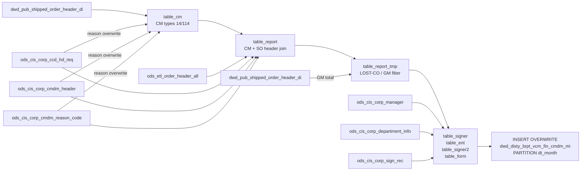

# DWD: Vendor Credit Memo (VCM) Finance — CMDM Reason Code Enriched (`dwd_disty_brpt_vcm_fin_cmdm_mi`)

- artifact_type: etl_table
- artifact_id: dw_us.dwd_disty_brpt_vcm_fin_cmdm_mi
- domain: common
- one_line_purpose: This job produces the monthly VCM (Vendor Credit Memo) finance detail report table, enriched with reason codes from the CMDM (Credit Memo Distribution Management) and CCD (Customer Credit Document) systems. For each credit memo (CM) of type...
- layer_type: DWD
- source_kind: etl_sql
- evidence_source: source/etl/sql/common/data_service/brpt_patch/python/dwd_disty_brpt_vcm_fin_cmdm_mi.py

---

## L1 Data Foundation

### Identity and physical mapping
- **Table:** `dw_us.dwd_disty_brpt_vcm_fin_cmdm_mi`
- **Layer type:** DWD
- **Canonical / derived:** Derived / ETL-loaded (see L3)
- **Owner team:** not registered in metadata catalog

### Grain, scope, exclusions
- **Grain:** one row per credit memo (`cm_no` + `cm_type`) per monthly partition.
- **Scope:** See L2 business purpose / L3 filters
- **Partition:** `dt_month` — the reporting month (e.g., `'2025-08'`). - resolved from pipeline (see L4)
- **Natural key:** `cm_no`, `cm_type` within a `dt_month` partition.
- **Exclusions:** Not documented in repository

#### Grain detail (preserved)

- **Grain:** one row per credit memo (`cm_no` + `cm_type`) per monthly partition.
- **Partition:** `dt_month` — the reporting month (e.g., `'2025-08'`).
- **Natural key:** `cm_no`, `cm_type` within a `dt_month` partition.

---

### Cross-engine presence
| Engine | Present | Canonical FQN | Notes |
|--------|---------|---------------|-------|
| Hive | yes | `dwd_disty_brpt_vcm_fin_cmdm_mi` | ETL target / intermediate per evidence script |
| Vertica | pending | `dwd_disty_brpt_vcm_fin_cmdm_mi` | Confirm via hive2vertica flow evidence / MCP |

### Physical schema reference

Pointer block only - full column catalog lives in WKB L1 storage JSON.

| Field | Value |
|-------|-------|
| **Authoritative catalog** | WKB L1 storage seed (not duplicated in this file) |
| **entity_id** | `dw_us.dwd_disty_brpt_vcm_fin_cmdm_mi` |
| **l1_catalog_seed** | `target/storage/wkb/snapshots/_snapshot_id_template/l1_catalog/{engine}_{schema}_{table}.json` |
| **column_count** | pending (run ddl_seed_writer) |
| **partition_keys** | `dt_month, '2025-08'` |
| **ddl_source** | pending Bitbucket DDL / Vertica metadata ingest |
| **retrieval** | `python -m tools.wkb.indexing.run_query --query "common dwd_disty_brpt_vcm_fin_cmdm_mi schema" --intent find_table_schema` |

### Lineage
| Object | Role |
|--------|------|
| `dw_${country}.dwd_pub_shipped_order_header_di` | CM extraction and GM total correction |
| `ods_${country}.ods_cis_corp_ccd_hd_req` | CCD reason and form enrichment |
| `ods_${country}.ods_cis_corp_cmdm_header` | CMDM form header enrichment |
| `ods_${country}.ods_cis_corp_cmdm_reason_code` | CMDM reason code lookup |
| `ods_${country}.ods_etl_order_header_all` | CM and SO header linkage |
| `ods_${country}.ods_cis_corp_sign_rec` | Approval workflow sign-off records |
| `ods_${country}.ods_cis_corp_manager` | Manager login for signer string |
| `ods_${country}.ods_cis_corp_department_info` | Department for signer string |

---

### Freshness and load path
| Item | Value |
|------|-------|
| Load pattern | See L3 end-to-end / INSERT pattern in evidence script |
| Schedule | Not documented in repository |
| Parameters | `country`, `date_flag`, `month_start`, `month_end`, `month_no`, `dt_month` |


---

## L2 Declarative Knowledge

### Business purpose
This job produces the monthly VCM (Vendor Credit Memo) finance detail report table, enriched with
reason codes from the CMDM (Credit Memo Distribution Management) and CCD (Customer Credit Document)
systems. For each credit memo (CM) of types 14 and 114 within the reporting month, it resolves the
credit reason, links the CM to its originating sales order, joins approval workflow signer data, and
writes one row per CM to `dwd_disty_brpt_vcm_fin_cmdm_mi`. This table feeds finance's VCM reporting
and GM-adjustment analysis.

---

### Audience and use cases
| Audience | How they benefit |
|----------|-----------------|
| **Finance / VCM team** | Monthly breakdown of all credit memos by reason, amount, originating sales order, and approval signer |
| **Sales management** | `sales_terr`, `from_loc_no`, `cust_no` for territory-level credit analysis |
| **Accounting** | `posting_date`, `ship_date`, `request_date`, `form_total`, `cm_total` for month-end reconciliation |
| **Compliance** | Approval `signer` chain and `form_no` for audit trails |

---

### Fact key resolution
- Natural key: `cm_no`, `cm_type` within a `dt_month` partition.
- FK / label-on attributes: see L3 dimension join patterns and step-by-step logic.
- Negative assertion: do not treat descriptive labels as grain keys unless listed under natural key.

### Time field semantics
- **date_flag / partition columns:** `dt_month` — the reporting month (e.g., `'2025-08'`).
- Primary reporting filter should use the partition column(s) documented in L1; resolve values via L4.

### Metrics served
When exposing this table to the business, lead with:

1. **VCM volume and value:** `cm_no`, `cm_type`, `cm_total`, `form_total`
2. **Reason codes:** `reason`
3. **Territory/customer attribution:** `sales_terr`, `cust_no`, `from_loc_no`
4. **Date context:** `posting_date`, `ship_date`, `date_flag`

---

### Metric serving map
N/A - not a `*_comb_mtd` / multi-period wide serving table (or map not present in legacy doc).


### Data products and column groups (preserved)

### Identifiers and relationships

- **Credit memo:** `cm_no`, `cm_type`
- **Sales order:** `so_no`, `so_type`
- **Customer:** `cust_no`
- **SKU:** `sku_no` (always NULL in this flow — see Sentinel values)

### Dimension columns

- `from_loc_no` — Warehouse/location of the CM
- `sales_terr` — Sales territory of the originating SO
- `reason` — Resolved credit reason code
- `sales_id` — Sales rep entry ID from the SO
- `vcm_entryid` — Entry ID from the CM header
- `signer` — Concatenated approval signer string (login + dept)

### Financial amounts

- `cm_total` — Credit memo total (may be replaced by shipped order total for GM-coded CMs)
- `form_total` — Total from the CCD/CMDM form
- `nsales`, `oldplamt`, `oldplpercent`, `newplamt`, `newplpercent` — Always NULL in this flow

### Dates

- `date_flag` — Report month-end date
- `ship_date`, `request_date`, `posting_date` — Key transaction dates

### Reporting

- `month_no` — Integer month number
- `form_no` — CCD/CMDM form number

---

### etl_metrics

N/A - no calculable ETL formulas extracted from this document (passthrough / stored measures only, or formulas not documented).

---

## L3 Procedural Knowledge

### Query and routing rules
**Business filters:** Use partition / date keys from L1 grain for reporting scope.
**Technical predicates (load only):** See Key filters and step-by-step logic below.

### Dimension join patterns
| Dimension FQN | Join keys | Purpose | Evidence |
|---------------|-----------|---------|----------|
| See step-by-step / base tables | See L3 steps | Dimension enrichment | `source/etl/sql/common/data_service/brpt_patch/python/dwd_disty_brpt_vcm_fin_cmdm_mi.py` |

### Key filters and ETL business logic
### Step 1 — `table_cm`

**Source:** `dw_${country}.dwd_pub_shipped_order_header_di`

**Filter:**
- `date_flag BETWEEN month_start AND date_flag` — Reporting period
- `order_type IN (14, 114)` — Credit memo types only
- `delete_date IS NULL` — Not deleted

**Derived columns:**

| Column | Formula | Plain language |
|--------|---------|----------------|
| `cm_type` | `order_type` | CM type code |
| `cm_no` | `order_no` | CM number |
| `reason` | `ltrim(rtrim(ext_ref))` | Trimmed reason from the order's external reference |
| `so_no` | `int_ref_no` | Linked sales order number |
| `so_type` | `int_ref_type` | Linked sales order type |

---

### Steps 2–4 — `table_cm` reason enrichment (three passes)

Each pass uses `INSERT OVERWRITE table_cm` to update the `reason` column:

| Pass | Source | Condition | Overwrite |
|------|--------|-----------|-----------|
| CCD pass | `ods_cis_corp_ccd_hd_req` (form_type 310/320/321, cm_type 14/114) | `synx_ccd_no = cm_no AND synx_ccd_type = cm_type` | `min(reason_code)` from CCD |
| CMDM pass 1 | `ods_cis_corp_cmdm_header` (cmdm_type=114) + `ods_cis_corp_cmdm_reason_code` | `cmdm_no = cm_no` | CMDM `reason_code` |
| CMDM pass 2 | Same sources | `cmdm_no = cm_no` (second join) | CMDM `reason_code` |

---

### Step 5 — `table_report` (base assembly)

**Source:** `table_cm` INNER JOIN `ods_etl_order_header_all` (CM header — posting_date not null, not deleted) LEFT JOIN `ods_etl_order_header_all` (SO header — not deleted)

Key columns populated:
-...

### Standard time-filter SQL
```sql
-- relative period filter using resolved partition value (see L4)
SELECT *
FROM dwd_disty_brpt_vcm_fin_cmdm_mi
WHERE /* partition predicate */ date_flag = '${partition_value}';
```

### End-to-end flow
**Runtime parameters:** `country`, `date_flag`, `month_start`, `month_end`, `month_no`, `dt_month`
**Target table:** `dw_${country}.dwd_disty_brpt_vcm_fin_cmdm_mi`, partitioned by **`dt_month`**.

1. **`table_cm`:** Extract CMs (types 14/114) from shipped order headers within `[month_start, date_flag]`; trim reason codes.
2. **Enrich `table_cm` (CCD pass):** Overwrite reason with CCD reason code when CCD form match exists.
3. **Enrich `table_cm` (CMDM pass 1):** Overwrite reason with CMDM reason code for type-114 CMs (non-BILL).
4. **Enrich `table_cm` (CMDM pass 2):** Second CMDM pass for BILL reasons.
5. **`table_report`:** Join `table_cm` to two self-joins of `ods_etl_order_header_all` — once for the CM header (must have posting date, not deleted), once for the SO header.
6. **Enrich `table_report` (CCD form pass):** Add `form_no`, `form_total`, `request_date` from CCD when match exists.
7. **Enrich `table_report` (CMDM form pass 1):** Add CMDM form data for non-BILL reasons.
8. **Enrich `table_report` (CMDM form pass 2):** Add CMDM form data for BILL reasons.
9. **`table_report_tmp`:** Filter to valid LOST-CO / non-LOST-CO combinations.
10. **Final `table_report` overwrite:** Replace `cm_total` with shipped order `sales_total` for GM-coded CMs.
11. **`table_signer`:** Collect approval sign-off records for all form numbers in report.
12. **`table_ent`:** Find latest ENT-step sign datetime per form.
13. **Enrich `table_signer` with ENT entry.**
14. **`table_signer2`:** Filter out signer records before the ENT timestamp.
15. **`table_form` + CTE `table_tmp`/`table_tmp2`:** Build per-form signer string `concat(loginid, dept_no)` for all valid signers.
16. **Final INSERT:** Write `month_no`, `date_flag` (`month_end`), all CM and report fields, and concatenated signer string into the `dt_month` partition.



---


#### High-level stages (preserved)

| Stage | Business meaning |
|-------|-----------------|
| **CM extraction** | Pulls all order headers of type 14/114 (credit memo types) within the reporting period and trims reason codes |
| **CCD reason enrichment** | Overwrites reason with the code from the CCD form system (form types 310/320/321) when a matching CCD record exists |
| **CMDM reason enrichment (pass 1)** | Overwrites reason with CMDM reason code for type-114 CMs when a CMDM header exists and no BILL reason applies |
| **CMDM reason enrichment (pass 2)** | Second CMDM pass for BILL-coded reason codes |
| **Report assembly** | Builds the full report row: joins CMs to their shipped order headers for location, territory, customer, and totals |
| **CCD form enrichment** | Enriches report with form number, form total, and request date from the CCD form system |
| **CMDM form enrichment (pass 1)** | Enriches report with CMDM form data for non-BILL reasons |
| **CMDM form enrichment (pass 2)** | Enriches report with CMDM form data for BILL reasons |
| **LOST-CO / GM filter** | Filters to valid rows (LOST-CO with form, or non-LOST-CO with/without form) |
| **GM total correction** | Replaces `cm_total` with shipped order total for GM-coded CMs |
| **Approval signer resolution** | Reads sign-off records, resolves to latest ENT-step entry, collects all signers per form |
| **Final INSERT** | Writes one enriched CM row per form into the monthly partition |

**Parameters:** `country`, `date_flag`, `month_start`, `month_end`, `month_no`, `dt_month`

---


### Base tables register
| Object | Role in this job |
|--------|-----------------|
| `dw_${country}.dwd_pub_shipped_order_header_di` | Source for CM extraction and GM total correction |
| `ods_${country}.ods_cis_corp_ccd_hd_req` | CCD form system — form number, reason code, total, and request date |
| `ods_${country}.ods_cis_corp_cmdm_header` | CMDM credit memo distribution header — form number and total |
| `ods_${country}.ods_cis_corp_cmdm_reason_code` | CMDM reason code master — maps reason code number to code |
| `ods_${country}.ods_etl_order_header_all` | Order header for CM and SO linkage |
| `ods_${country}.ods_cis_corp_sign_rec` | Approval workflow sign-off records |
| `ods_${country}.ods_cis_corp_manager` | Manager table for signer login ID lookup |
| `ods_${country}.ods_cis_corp_department_info` | Department table for signer department number |

**Temporary tables (inside the job only):**
`table_cm` → `table_report` → `table_report_tmp` → `table_report` → `table_signer` → `table_ent` → `table_signer2` → `table_form` → CTE `table_tmp`/`table_tmp2` → (final `INSERT`)

---

### Step-by-step logic
### Step 1 — `table_cm`

**Source:** `dw_${country}.dwd_pub_shipped_order_header_di`

**Filter:**
- `date_flag BETWEEN month_start AND date_flag` — Reporting period
- `order_type IN (14, 114)` — Credit memo types only
- `delete_date IS NULL` — Not deleted

**Derived columns:**

| Column | Formula | Plain language |
|--------|---------|----------------|
| `cm_type` | `order_type` | CM type code |
| `cm_no` | `order_no` | CM number |
| `reason` | `ltrim(rtrim(ext_ref))` | Trimmed reason from the order's external reference |
| `so_no` | `int_ref_no` | Linked sales order number |
| `so_type` | `int_ref_type` | Linked sales order type |

---

### Steps 2–4 — `table_cm` reason enrichment (three passes)

Each pass uses `INSERT OVERWRITE table_cm` to update the `reason` column:

| Pass | Source | Condition | Overwrite |
|------|--------|-----------|-----------|
| CCD pass | `ods_cis_corp_ccd_hd_req` (form_type 310/320/321, cm_type 14/114) | `synx_ccd_no = cm_no AND synx_ccd_type = cm_type` | `min(reason_code)` from CCD |
| CMDM pass 1 | `ods_cis_corp_cmdm_header` (cmdm_type=114) + `ods_cis_corp_cmdm_reason_code` | `cmdm_no = cm_no` | CMDM `reason_code` |
| CMDM pass 2 | Same sources | `cmdm_no = cm_no` (second join) | CMDM `reason_code` |

---

### Step 5 — `table_report` (base assembly)

**Source:** `table_cm` INNER JOIN `ods_etl_order_header_all` (CM header — posting_date not null, not deleted) LEFT JOIN `ods_etl_order_header_all` (SO header — not deleted)

Key columns populated:
- From CM header: `from_loc_no`, `ext_ref` (reason), `entry_id` (vcm_entryid), `posting_date`, `total_order` (cm_total)
- From SO header: `sales_terr`, `entry_id` (sales_id), `to_acct_no` (cust_no), `ship_date`
- Forced NULL: `sku_no`, `request_date`, `form_no`, `form_total`, `nsales`, `oldplamt/percent`, `newplamt/percent`, `signer`, `flag`

---

### Steps 6–8 — `table_report` form enrichment (three passes)

| Pass | Source | Condition | Fields added/updated |
|------|--------|-----------|---------------------|
| CCD form | `ods_cis_corp_ccd_hd_req` | `synx_ccd_no = cm_no AND synx_ccd_type = cm_type` | `reason`, `request_date`, `form_no`, `form_total` |
| CMDM form pass 1 | `ods_cis_corp_cmdm_header` (type 114) + `ods_cis_corp_cmdm_reason_code` (not BILL) | `cmdm_no = cm_no` and form_no IS NULL | `reason`, `request_date`, `form_no`, `form_total` |
| CMDM form pass 2 | `ods_cis_corp_cmdm_header` (type 114, order_type != 16) + `ods_cis_corp_cmdm_reason_code` (BILL) | `cmdm_no = cm_no` and form_no IS NULL | `reason`, `request_date`, `form_no`, `form_total` |

---

### Step 9 — `table_report_tmp` (LOST-CO / GM validity filter)

Keeps rows satisfying:
- `reason = 'LOST-CO' AND form_no >= 0`, OR
- `(reason <> 'LOST-CO' OR reason IS NULL) AND (form_no < 0 OR form_no IS NULL)`, OR
- `(reason <> 'LOST-CO' OR reason IS NULL) AND form_no >= 0`

---

### Step 10 — `table_report` GM total correction

LEFT JOIN `dwd_pub_shipped_order_header_di` (types 114/14, reporting period) on `cm_no/cm_type`; replace `cm_total` with `sales_total` when `reason = 'GM'` and a matching shipped order row exists.

---

### Steps 11–15 — Signer resolution (`table_signer` → `table_ent` → `table_signer2` → `table_form` → CTEs)

1. `table_signer`: Pull `ods_cis_corp_sign_rec` for form_types 310/320/321 and all `form_no` in `table_report`.
2. `table_ent`: MAX `sign_datetime` for `proc_id = '$ENT'` per form.
3. Enrich `table_signer` with `entry` (latest ENT sign datetime).
4. `table_signer2`: Keep only signer records where `sign_datetime >= entry`.
5. CTE `table_tmp`: Join `table_signer2` → `table_form` → `ods_cis_corp_manager` → `ods_cis_corp_department_info`; build `update_str = concat(trim(loginid), trim(dept_no))`.
6. CTE `table_tmp2`: Aggregate per form: `concat_ws(',', collect_list(update_str))`.

---

### Step 16 — Final `INSERT OVERWRITE`

**From:** `table_report a` LEFT JOIN `table_tmp2` on `form_no`

**Derived columns computed at INSERT:**

| Column | Formula | Plain language |
|--------|---------|----------------|
| `month_no` | `${month_no}` | Integer month number |
| `date_flag` | `'${month_end}'` | Report month-end date as string |
| `signer` | `concat(trim(a.signer), table_tmp2.update_str)` | Combines the CM's own signer with all approval step signer strings |

---

### Relationship map (embedded)

| from_fqn | to_fqn | cardinality | join_keys | provenance |
|----------|--------|-------------|-----------|------------|
| `dw_${country}.dwd_pub_shipped_order_header_di` | `ods_${country}.ods_cis_corp_cmdm_reason_code` | many:1 (LEFT) | — | etl_sql (`source/etl/sql/common/data_service/brpt_patch/python/dwd_disty_brpt_vcm_fin_cmdm_mi.py:48`) |
| `a` | `table_ent` | many:1 (LEFT) | `a.form_no` = `b.form_no` | etl_sql (`source/etl/sql/common/data_service/brpt_patch/python/dwd_disty_brpt_vcm_fin_cmdm_mi.py:312`) |
| `dw_${country}.dwd_pub_shipped_order_header_di` | `table_form` | many:1 | — | etl_sql (`source/etl/sql/common/data_service/brpt_patch/python/dwd_disty_brpt_vcm_fin_cmdm_mi.py:345`) |
| `dw_${country}.dwd_pub_shipped_order_header_di` | `ods_${country}.ods_cis_corp_manager` | many:1 (LEFT) | — | etl_sql (`source/etl/sql/common/data_service/brpt_patch/python/dwd_disty_brpt_vcm_fin_cmdm_mi.py:348`) |
| `dw_${country}.dwd_pub_shipped_order_header_di` | `ods_${country}.ods_cis_corp_department_info` | many:1 (LEFT) | — | etl_sql (`source/etl/sql/common/data_service/brpt_patch/python/dwd_disty_brpt_vcm_fin_cmdm_mi.py:351`) |
| `dw_${country}.dwd_pub_shipped_order_header_di` | `table_tmp2` | many:1 (LEFT) | — | etl_sql (`source/etl/sql/common/data_service/brpt_patch/python/dwd_disty_brpt_vcm_fin_cmdm_mi.py:391`) |

### Special logic (embedded)

Not documented in repository

### Column / field derivations (from ETL SQL)

| target_column | expression_sql | upstream_columns | upstream_tables | transform_kind | evidence |
|---------------|----------------|------------------|-----------------|----------------|----------|
| `form_no` | `a.form_no` | `form_no` | `table_signer`, `table_ent`, `table_report`, `table_signer2`, `table_form`, `ods_${country}.ods_cis_corp_manager`, `ods_${country}.ods_cis_corp_department_info`, `table_tmp`, `table_tmp2` | passthrough | `source/etl/sql/common/data_service/brpt_patch/python/dwd_disty_brpt_vcm_fin_cmdm_mi.py:118` |
| `signer` | `a.signer` | `signer` | `table_signer`, `table_ent`, `table_report`, `table_signer2`, `table_form`, `ods_${country}.ods_cis_corp_manager`, `ods_${country}.ods_cis_corp_department_info`, `table_tmp`, `table_tmp2` | passthrough | `source/etl/sql/common/data_service/brpt_patch/python/dwd_disty_brpt_vcm_fin_cmdm_mi.py:126` |
| `signer_unit` | `a.signer_unit` | `signer_unit` | `table_signer`, `table_ent`, `table_report`, `table_signer2`, `table_form`, `ods_${country}.ods_cis_corp_manager`, `ods_${country}.ods_cis_corp_department_info`, `table_tmp`, `table_tmp2` | passthrough | `source/etl/sql/common/data_service/brpt_patch/python/dwd_disty_brpt_vcm_fin_cmdm_mi.py:322` |
| `proc_id` | `a.proc_id` | `proc_id` | `table_signer`, `table_ent`, `table_report`, `table_signer2`, `table_form`, `ods_${country}.ods_cis_corp_manager`, `ods_${country}.ods_cis_corp_department_info`, `table_tmp`, `table_tmp2` | passthrough | `source/etl/sql/common/data_service/brpt_patch/python/dwd_disty_brpt_vcm_fin_cmdm_mi.py:323` |
| `sign_datetime` | `a.sign_datetime` | `sign_datetime` | `table_signer`, `table_ent`, `table_report`, `table_signer2`, `table_form`, `ods_${country}.ods_cis_corp_manager`, `ods_${country}.ods_cis_corp_department_info`, `table_tmp`, `table_tmp2` | passthrough | `source/etl/sql/common/data_service/brpt_patch/python/dwd_disty_brpt_vcm_fin_cmdm_mi.py:324` |
| `entry` | `if(b.form_no is not null,b.entry,a.entry)` | `form_no`, `entry` | `table_signer`, `table_ent`, `table_report`, `table_signer2`, `table_form`, `ods_${country}.ods_cis_corp_manager`, `ods_${country}.ods_cis_corp_department_info`, `table_tmp`, `table_tmp2` | udf | `source/etl/sql/common/data_service/brpt_patch/python/dwd_disty_brpt_vcm_fin_cmdm_mi.py:325` |

### Sentinel and code values
| Value | Meaning |
|-------|---------|
| `order_type IN (14, 114)` | Credit memo order types — 14 (standard CM), 114 (vendor CM) |
| `form_type IN (310, 320, 321)` | CCD form types relevant to CM approvals |
| `proc_id = '$ENT'` | Approval workflow entry step used to anchor signer validity timestamps |
| `reason = 'LOST-CO'` | Lost-customer reason code; requires a valid form number |
| `reason = 'GM'` | GM (Gross Margin) adjustment; `cm_total` is replaced by shipped order total |
| `reason = 'BILL'` | Billing-type reason; handled in a separate CMDM pass |
| `sku_no = NULL` | Always NULL — no SKU-level detail in this job |
| `nsales / plamt / plpercent = NULL` | Not computed in this job |

---

---

## L4 Validation

### Resolved partition value
| Step | Source | How partition / date scope is determined |
|------|--------|------------------------------------------|
| 1 | evidence script / flow | See parameters in L1 Freshness and L3 filters - `source/etl/sql/common/data_service/brpt_patch/python/dwd_disty_brpt_vcm_fin_cmdm_mi.py` |

**Plain language:** Partition and date scope follow Azkaban/bootstrap parameters documented in the source script and orchestrating flow; do not hardcode calendar literals.

### Data quality checks
- Prefer row-count-by-partition, metric sums, and grain duplicate checks (see Validation SQL).
- Additional checks from legacy caveats / operational notes when present.

### Validation SQL
```sql
-- 1) Row count by partition
SELECT ${partition_col}, COUNT(*) AS row_cnt
FROM dw_${country}.dwd_disty_brpt_vcm_fin_cmdm_mi
WHERE ${partition_col} = '${partition_value}'
GROUP BY ${partition_col};

-- 2) Metric sum by business dimension (top deltas)
SELECT ${dim_key}, SUM(${metric}) AS metric_sum
FROM dw_${country}.dwd_disty_brpt_vcm_fin_cmdm_mi
WHERE ${partition_col} = '${partition_value}'
GROUP BY ${dim_key}
ORDER BY ABS(SUM(${metric})) DESC
LIMIT 20;

-- 3) Grain duplicate check
SELECT ${grain_key_1}, ${grain_key_2}, ${grain_key_3}, ${partition_col}, COUNT(*) AS cnt
FROM dw_${country}.dwd_disty_brpt_vcm_fin_cmdm_mi
WHERE ${partition_col} = '${partition_value}'
GROUP BY ${grain_key_1}, ${grain_key_2}, ${grain_key_3}, ${partition_col}
HAVING COUNT(*) > 1;
```

Replace placeholders from this file's Grain and keys / Data you can fetch sections, and use the resolved partition value from run scope.

### Caveats for interpretation
- **Three-pass reason resolution:** Reason is overwritten multiple times; the final `reason` in the output reflects the last successful match in the priority order: CMDM (pass 2) > CMDM (pass 1) > CCD > original CM ext_ref.
- **Sybase vs. Hive differences noted in code:** Comments flag that Sybase produced Cartesian products in several joins; the Hive version uses `GROUP BY` and `min()` to resolve these safely.
- **`sku_no` always NULL:** This is the header-level VCM job; SKU-level detail is not populated.
- **`nsales`, `oldplamt`, `newplamt`, etc. always NULL:** Planned margin columns are not computed in this variant.
- **LOST-CO filter logic:** The filter in step 9 is designed to exclude rows that do not satisfy the LOST-CO/form combination business rules.
- **GM correction:** For reason = 'GM', `cm_total` reflects the shipped order total, not the CM header total.
- **Partition overwrite:** Re-running for the same `dt_month` overwrites the entire month's data.

---

### Conflicts and open questions
- Schedule, owner, SLA: Not documented in repository (unless preserved schedule evidence above).
- Vertica MCP verification: pending unless confirmed in L5.


---

## L5 Runtime View

### Query path and engine preference
| Role | Hive object | Vertica object | Sync mode | Evidence | MCP verified |
|------|-------------|----------------|-----------|----------|--------------|
| **Query for reporting** | *See script lineage* | `dw_${country}.dwd_disty_brpt_vcm_fin_cmdm_mi` | *Verify from flow* | *Add flow file:line* | pending |
| **Hive alternative** | `*` | `dw_${country}.dwd_disty_brpt_vcm_fin_cmdm_mi` | - | *See dependencies* | - |
| **ETL internal** | staging/temp tables | *Not synced to Vertica* | - | *See step-by-step logic* | - |

Business users should query `dw_${country}.dwd_disty_brpt_vcm_fin_cmdm_mi` in Vertica once MCP verification is completed for this document.

### Access constraints
- Country / company schema parameters may apply (`literal_country`, `company_no`, etc.).
- Hive-only staging objects are not reporting surfaces unless synced.

### Query risk profile
| Field | Value |
|-------|-------|
| requires_date_predicate | unknown |
| scan_risk_tier | high |

---

## L6 Access and Consumption

### Primary consumers and use cases
| Audience | How they benefit |
|----------|-----------------|
| **Finance / VCM team** | Monthly breakdown of all credit memos by reason, amount, originating sales order, and approval signer |
| **Sales management** | `sales_terr`, `from_loc_no`, `cust_no` for territory-level credit analysis |
| **Accounting** | `posting_date`, `ship_date`, `request_date`, `form_total`, `cm_total` for month-end reconciliation |
| **Compliance** | Approval `signer` chain and `form_no` for audit trails |

---

### Representative query patterns
```sql
-- certified / illustrative lookup - replace predicates from L1/L4
SELECT *
FROM dwd_disty_brpt_vcm_fin_cmdm_mi
WHERE date_flag = '${partition_value}'
LIMIT 100;
```

### Dependencies and notes
### Upstream objects (verified)

| Object | Usage | Evidence |
|--------|-------|----------|
| `dw_${country}.dwd_pub_shipped_order_header_di` | CM source + GM correction | `source/etl/sql/common/data_service/brpt_patch/python/dwd_disty_brpt_vcm_fin_cmdm_mi.py:17,284` |
| `ods_${country}.ods_cis_corp_ccd_hd_req` | CCD reason + form enrichment | `source/etl/sql/common/data_service/brpt_patch/python/dwd_disty_brpt_vcm_fin_cmdm_mi.py:34,129` |
| `ods_${country}.ods_cis_corp_cmdm_header` | CMDM form header | `source/etl/sql/common/data_service/brpt_patch/python/dwd_disty_brpt_vcm_fin_cmdm_mi.py:51,175` |
| `ods_${country}.ods_cis_corp_cmdm_reason_code` | Reason code lookup | `source/etl/sql/common/data_service/brpt_patch/python/dwd_disty_brpt_vcm_fin_cmdm_mi.py:55,178` |
| `ods_${country}.ods_etl_order_header_all` | CM + SO order headers | `source/etl/sql/common/data_service/brpt_patch/python/dwd_disty_brpt_vcm_fin_cmdm_mi.py:88,94` |
| `ods_${country}.ods_cis_corp_sign_rec` | Approval sign records | `source/etl/sql/common/data_service/brpt_patch/python/dwd_disty_brpt_vcm_fin_cmdm_mi.py:296` |
| `ods_${country}.ods_cis_corp_manager` | Signer login lookup | `source/etl/sql/common/data_service/brpt_patch/python/dwd_disty_brpt_vcm_fin_cmdm_mi.py:363` |
| `ods_${country}.ods_cis_corp_department_info` | Signer department lookup | `source/etl/sql/common/data_service/brpt_patch/python/dwd_disty_brpt_vcm_fin_cmdm_mi.py:367` |

### Downstream consumers (verified)

None identified in repository.

### Operational detail (verified)

- Partitioned by `dt_month`: `source/etl/sql/common/data_service/brpt_patch/python/dwd_disty_brpt_vcm_fin_cmdm_mi.py:377`

### Not documented in repository

- Schedule, owner, SLA — not in scripts or configs
- `month_start`, `month_end`, `month_no`, `dt_month` parameter derivation — not in script

### Related scripts (verified)

- `dwd_disty_brpt_vcm_fin_detail_mi.py` — VCM claim/project detail (different target table, related domain) — `source/etl/sql/common/data_service/brpt_patch/python/`

---

*Document generated from `source/etl/sql/common/data_service/brpt_patch/python/dwd_disty_brpt_vcm_fin_cmdm_mi.py`.*

#### Not documented in repository
- Owner, SLA (unless schedule evidence preserved above)
- Any dependency without `file:line` evidence in this document

---

*Document migrated to L1-L6 from legacy Knowledgebase content. Evidence: `source/etl/sql/common/data_service/brpt_patch/python/dwd_disty_brpt_vcm_fin_cmdm_mi.py`.*
