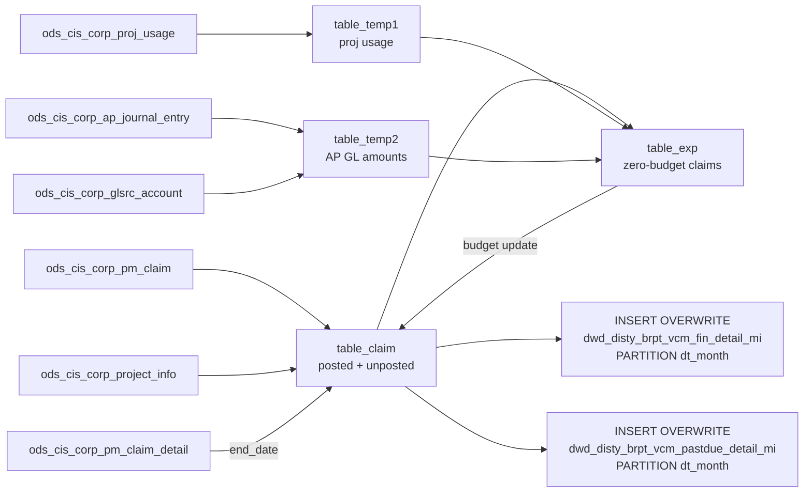

# DWD: VCM Finance Claim Detail with Aging Buckets (`dwd_disty_brpt_vcm_fin_detail_mi`)

- artifact_type: etl_table
- artifact_id: dw_us.dwd_disty_brpt_vcm_fin_detail_mi
- domain: common
- one_line_purpose: This job produces two monthly tables from the CIS PM claim system: a summarized aging-bucketed claim table (`dwd_disty_brpt_vcm_fin_detail_mi`) and a past-due raw claim detail table (`dwd_disty_brpt_vcm_pastdue_detail_mi`). For each claim o...
- layer_type: DWD
- source_kind: etl_sql
- evidence_source: source/etl/sql/common/data_service/brpt_patch/python/dwd_disty_brpt_vcm_fin_detail_mi.py

---

## L1 Data Foundation

### Identity and physical mapping
- **Table:** `dw_us.dwd_disty_brpt_vcm_fin_detail_mi`
- **Layer type:** DWD
- **Canonical / derived:** Derived / ETL-loaded (see L3)
- **Owner team:** not registered in metadata catalog

### Grain, scope, exclusions
- **Grain:** one row per individual past-due claim.
- **Scope:** See L2 business purpose / L3 filters
- **Partition:** `dt_month`. - resolved from pipeline (see L4)
- **Natural key:** `project_no`, `claim_no` within `dt_month`.
- **Exclusions:** Not documented in repository

#### Grain detail (preserved)

**`dwd_disty_brpt_vcm_fin_detail_mi`:**
- **Grain:** one row per vendor + PM code + claim type + aging bucket per `dt_month` partition.
- **Partition:** `dt_month`.
- **Natural key:** `vend_no`, `pm_code`, `claim_type`, aging bucket within a `dt_month`.

**`dwd_disty_brpt_vcm_pastdue_detail_mi`:**
- **Grain:** one row per individual past-due claim.
- **Partition:** `dt_month`.
- **Natural key:** `project_no`, `claim_no` within `dt_month`.

---

### Cross-engine presence
| Engine | Present | Canonical FQN | Notes |
|--------|---------|---------------|-------|
| Hive | yes | `dwd_disty_brpt_vcm_fin_detail_mi` | ETL target / intermediate per evidence script |
| Vertica | pending | `dwd_disty_brpt_vcm_fin_detail_mi` | Confirm via hive2vertica flow evidence / MCP |

### Physical schema reference

Pointer block only - full column catalog lives in WKB L1 storage JSON.

| Field | Value |
|-------|-------|
| **Authoritative catalog** | WKB L1 storage seed (not duplicated in this file) |
| **entity_id** | `dw_us.dwd_disty_brpt_vcm_fin_detail_mi` |
| **l1_catalog_seed** | `target/storage/wkb/snapshots/_snapshot_id_template/l1_catalog/{engine}_{schema}_{table}.json` |
| **column_count** | pending (run ddl_seed_writer) |
| **partition_keys** | `dt_month` |
| **ddl_source** | pending Bitbucket DDL / Vertica metadata ingest |
| **retrieval** | `python -m tools.wkb.indexing.run_query --query "common dwd_disty_brpt_vcm_fin_detail_mi schema" --intent find_table_schema` |

### Lineage
| Object | Role |
|--------|------|
| `ods_${country}.ods_cis_corp_pm_claim` | Primary PM claim source |
| `ods_${country}.ods_cis_corp_project_info` | Project validation |
| `ods_${country}.ods_cis_corp_proj_usage` | Project usage for expense recalculation |
| `ods_${country}.ods_cis_corp_ap_journal_entry` | AP GL amounts for expense recalculation |
| `ods_${country}.ods_cis_corp_glsrc_account` | AP GL account filter |
| `ods_${country}.ods_cis_corp_pm_claim_detail` | Claim end date source |

---

### Freshness and load path
| Item | Value |
|------|-------|
| Load pattern | See L3 end-to-end / INSERT pattern in evidence script |
| Schedule | Not documented in repository |
| Parameters | `country`, `date_flag`, `month_start`, `month_end`, `month_no`, `dt_month`, `month_24_ago`, `next_month_start` |


---

## L2 Declarative Knowledge

### Business purpose
This job produces two monthly tables from the CIS PM claim system: a summarized aging-bucketed
claim table (`dwd_disty_brpt_vcm_fin_detail_mi`) and a past-due raw claim detail table
(`dwd_disty_brpt_vcm_pastdue_detail_mi`). For each claim of a vendor/product manager over a
24-month lookback, it determines whether the claim is open/unposted or posted, calculates how many
days overdue each open claim is, and assigns it to an aging bucket (1–4 for unpaid, 5–6 for paid).
The result enables finance to monitor vendor claim payment timeliness and identify overdue amounts.

---

### Audience and use cases
| Audience | How they benefit |
|----------|-----------------|
| **Finance / vendor management** | Track overdue claims by vendor and aging bucket; identify amounts at risk of not being collected |
| **Product management** | Monitor PM code–level claim volumes and amounts month by month |
| **Accounts receivable** | `dwd_disty_brpt_vcm_pastdue_detail_mi` provides raw past-due claims for collections follow-up |

---

### Fact key resolution
- Natural key: `project_no`, `claim_no` within `dt_month`.
- FK / label-on attributes: see L3 dimension join patterns and step-by-step logic.
- Negative assertion: do not treat descriptive labels as grain keys unless listed under natural key.

### Time field semantics
- **date_flag / partition columns:** `dt_month`.
- Primary reporting filter should use the partition column(s) documented in L1; resolve values via L4.

### Metrics served
When exposing this table to the business, lead with:

1. **Overdue exposure:** Sum of `budget_amount` for aging buckets 1–4 grouped by `vend_no`, `pm_code`
2. **Current-month collections:** Bucket 5 `budget_amount`
3. **Prior-month posted:** Bucket 6 `budget_amount`
4. **Claim counts:** Counts per bucket for frequency analysis

---

### Metric serving map
N/A - not a `*_comb_mtd` / multi-period wide serving table (or map not present in legacy doc).


### Data products and column groups (preserved)

### Identifiers and relationships (`dwd_disty_brpt_vcm_fin_detail_mi`)

- **Vendor:** `vend_no` (defaulted to 0 if NULL)
- **Product manager:** `pm_code` (defaulted to 0 if NULL)
- **Claim type:** `claim_type`

### Aging and financial metrics

- **Aging bucket** (column 6 in INSERT — unnamed in SQL):

| Bucket | Business meaning |
|--------|-----------------|
| 1 | 8–15 days overdue (unposted) |
| 2 | 16–30 days overdue (unposted) |
| 3 | 31–45 days overdue (unposted) |
| 4 | > 45 days overdue (unposted) |
| 5 | Posted within current month (`posting_date >= month_start`) |
| 6 | Posted before current month (`posting_date < month_start`) |
| 0 | Does not fall into any aging category |

- **Total amount** (column 7): Sum of `budget_amount` for claims in the bucket
- **Count** (column 9): Count of claims in the bucket
- `date_flag` — Report month-end date
- `month_no` — Integer month number

### Identifiers and relationships (`dwd_disty_brpt_vcm_pastdue_detail_mi`)

- `project_no`, `claim_no`, `vend_no`, `var_no`, `pm_code`, `claim_type`
- `posting_date`, `expect_date`, `entry_date`, `end_date`
- `budget_amount`, `foreign_bug_amount`

---

### etl_metrics

#### `budget_amount`
- **Source:** [metric-index.md](../../source/contracts/common/metric-index.md#budget_amount)
- **Business definition:** Uses actual when posted
```sql
CASE WHEN posting_date IS NULL THEN budget_amount ELSE actual_amount END
```

#### `foreign_bug_amount`
- **Source:** [metric-index.md](../../source/contracts/common/metric-index.md#foreign_bug_amount)
- **Business definition:** Foreign currency equivalent
```sql
CASE WHEN posting_date IS NULL THEN foreign_bug_amount ELSE foreign_act_amount END
```


---

## L3 Procedural Knowledge

### Query and routing rules
**Business filters:** Use partition / date keys from L1 grain for reporting scope.
**Technical predicates (load only):** See Key filters and step-by-step logic below.

### Dimension join patterns
| Dimension FQN | Join keys | Purpose | Evidence |
|---------------|-----------|---------|----------|
| See step-by-step / base tables | See L3 steps | Dimension enrichment | `source/etl/sql/common/data_service/brpt_patch/python/dwd_disty_brpt_vcm_fin_detail_mi.py` |

### Key filters and ETL business logic
### Step 1 — `table_claim` (posted claims)

**Source:** `ods_cis_corp_pm_claim pc` INNER JOIN `ods_cis_corp_project_info pi` ON `pc.project_no = pi.proj_no`

**Filter:**
- `pc.delete_date IS NULL`
- `pc.posting_date >= month_24_ago AND pc.posting_date < next_month_start`
- `pi.delete_date IS NULL AND pi.var_no IS NOT NULL`

**Derived columns:**

| Column | Formula | Plain language |
|--------|---------|----------------|
| `budget_amount` | `CASE WHEN posting_date IS NULL THEN budget_amount ELSE actual_amount END` | Uses actual when posted |
| `foreign_bug_amount` | `CASE WHEN posting_date IS NULL THEN foreign_bug_amount ELSE foreign_act_amount END` | Foreign currency equivalent |
| `entry_date` | `substr(pc.entry_datetime, 0, 10)` | Entry date as string |
| `end_date` | `NULL` | Populated later from `pm_claim_detail` |

---

### Step 2 — Append unposted claims to `table_claim`

Same join as Step 1 but filter `pc.posting_date IS NULL` (no date range filter on posting_date).

---

### Step 3 — `table_exp` (zero-budget expense claims)

**Filter on `table_claim`:**
- `var_no = 990 AND claim_type = 80 AND budget_amount = 0`

Groups by `project_no`; takes `min(claim_no)` and `max(budget_amount)`.

---

### Step 4 — `table_temp1` (project usage)

**Source:** `ods_cis_corp_proj_usage`

**Filter:** `category_code IN ('SO','PO','CC','WO','OT')`

**Derived column:** `usage = -sum(usage_total)` per `proj_no`

---

### Step 5 — Enrich `table_exp` with project usage

LEFT JOIN `table_temp1...

### Standard time-filter SQL
```sql
-- relative period filter using resolved partition value (see L4)
SELECT *
FROM dwd_disty_brpt_vcm_fin_detail_mi
WHERE /* partition predicate */ date_flag = '${partition_value}';
```

### End-to-end flow
**Runtime parameters:** `country`, `date_flag`, `month_start`, `month_end`, `month_no`, `dt_month`, `month_24_ago`, `next_month_start`
**Target tables:**
- `dw_${country}.dwd_disty_brpt_vcm_fin_detail_mi` partitioned by `dt_month`
- `dw_${country}.dwd_disty_brpt_vcm_pastdue_detail_mi` partitioned by `dt_month`

1. **`table_claim` (posted):** Load PM claims with posting dates in `[month_24_ago, next_month_start)` joined to `project_info` (only projects with `var_no` and not deleted). `budget_amount` uses `actual_amount` when posted, else `budget_amount`.
2. **Append to `table_claim` (unposted):** Same join, but for claims with `posting_date IS NULL`. Uses `budget_amount`.
3. **`table_exp`:** Identify zero-budget claims (`var_no=990, claim_type=80, budget_amount=0`); prepare for expense recalculation.
4. **`table_temp1`:** Compute project usage negation (`-sum(usage_total)`) from `proj_usage` for categories SO/PO/CC/WO/OT.
5. **Enrich `table_exp`:** Replace zero budget with `proj_usage` amount where available.
6. **`table_temp2`:** Sum AP journal entries for `gl_type=112` accounts sourced from 'AP' in `glsrc_account`.
7. **Second enrich `table_exp`:** Add AP GL amounts to the expense estimate.
8. **Merge `table_exp` back into `table_claim`:** Update `budget_amount` for matching project/claim pairs.
9. **Enrich `table_claim` with end dates:** Join `pm_claim_detail` to get `MAX(end_date)` per project/claim.
10. **INSERT OVERWRITE `dwd_disty_brpt_vcm_fin_detail_mi`:** GROUP BY vendor/PM/claim_type/aging bucket; compute `SUM(budget_amount)` and `COUNT(1)` per bucket.
11. **INSERT OVERWRITE `dwd_disty_brpt_vcm_pastdue_detail_mi`:** Write raw past-due rows where `datediff(date_flag, end_date) >= 8 AND posting_date IS NULL`.



---


#### High-level stages (preserved)

| Stage | Business meaning |
|-------|-----------------|
| **Active claims (posted)** | Loads PM claims with posting dates in the reporting range |
| **Active claims (unposted)** | Loads PM claims with no posting date (pending payment) |
| **Expense calculation** | For zero-budget claims with `var_no=990, claim_type=80`, compute actual expense from `proj_usage` and AP journal entries |
| **AP journal enrichment** | Adds AP-sourced GL amounts to the expense estimate |
| **End-date enrichment** | Reads `pm_claim_detail` to set the latest claim end date |
| **Summary INSERT** | Groups by vendor/PM code/claim type/aging bucket; writes total amount and count |
| **Past-due INSERT** | Writes individual raw claim rows that are past-due (>= 8 days after end date and unposted) |

**Parameters:** `country`, `date_flag`, `month_start`, `month_end`, `month_no`, `dt_month`, `month_24_ago`, `next_month_start`

---


### Base tables register
| Object | Role in this job |
|--------|-----------------|
| `ods_${country}.ods_cis_corp_pm_claim` | Primary source — PM claims with posting and budget amounts |
| `ods_${country}.ods_cis_corp_project_info` | Project validation — only claims linked to non-deleted projects with a `var_no` |
| `ods_${country}.ods_cis_corp_proj_usage` | Project usage — negated sum for SO/PO/CC/WO/OT categories used to compute zero-budget expense |
| `ods_${country}.ods_cis_corp_ap_journal_entry` | AP journal — `gl_type=112` amounts for AP-sourced accounts |
| `ods_${country}.ods_cis_corp_glsrc_account` | GL source account filter — identifies AP accounts by `source_name='AP'` |
| `ods_${country}.ods_cis_corp_pm_claim_detail` | Claim detail — provides latest `end_date` per claim for aging calculation |

**Temporary tables (inside the job only):**
`table_claim` → `table_exp` → `table_temp1` → `table_temp2` → (merges back to `table_claim`) → (dual INSERT)

---

### Step-by-step logic
### Step 1 — `table_claim` (posted claims)

**Source:** `ods_cis_corp_pm_claim pc` INNER JOIN `ods_cis_corp_project_info pi` ON `pc.project_no = pi.proj_no`

**Filter:**
- `pc.delete_date IS NULL`
- `pc.posting_date >= month_24_ago AND pc.posting_date < next_month_start`
- `pi.delete_date IS NULL AND pi.var_no IS NOT NULL`

**Derived columns:**

| Column | Formula | Plain language |
|--------|---------|----------------|
| `budget_amount` | `CASE WHEN posting_date IS NULL THEN budget_amount ELSE actual_amount END` | Uses actual when posted |
| `foreign_bug_amount` | `CASE WHEN posting_date IS NULL THEN foreign_bug_amount ELSE foreign_act_amount END` | Foreign currency equivalent |
| `entry_date` | `substr(pc.entry_datetime, 0, 10)` | Entry date as string |
| `end_date` | `NULL` | Populated later from `pm_claim_detail` |

---

### Step 2 — Append unposted claims to `table_claim`

Same join as Step 1 but filter `pc.posting_date IS NULL` (no date range filter on posting_date).

---

### Step 3 — `table_exp` (zero-budget expense claims)

**Filter on `table_claim`:**
- `var_no = 990 AND claim_type = 80 AND budget_amount = 0`

Groups by `project_no`; takes `min(claim_no)` and `max(budget_amount)`.

---

### Step 4 — `table_temp1` (project usage)

**Source:** `ods_cis_corp_proj_usage`

**Filter:** `category_code IN ('SO','PO','CC','WO','OT')`

**Derived column:** `usage = -sum(usage_total)` per `proj_no`

---

### Step 5 — Enrich `table_exp` with project usage

LEFT JOIN `table_temp1`; replace `budget_amount` with `nvl(b.usage, 0)`.

---

### Step 6 — `table_temp2` (AP GL amounts)

**Source:** `ods_cis_corp_ap_journal_entry a` INNER JOIN `ods_cis_corp_glsrc_account b` ON `a.gl_acct_no = b.gl_account_no`

**Filter:** `a.gl_type = 112`, `b.source_name = 'AP'`

**Derived column:** `usage = sum(gl_amt)` per `gl_project`

---

### Step 7 — Second `table_exp` enrichment with AP GL amounts

LEFT JOIN `table_temp2`; `budget_amount = nvl(b.usage, 0) + a.budget_amount`.

---

### Step 8 — Merge `table_exp` back into `table_claim`

LEFT JOIN `table_exp` on `project_no + claim_no`; replace `budget_amount` where matched.

---

### Step 9 — End-date enrichment

LEFT JOIN `ods_cis_corp_pm_claim_detail` (grouped by `proj_no + claim_no`, `MAX(end_date)`); update `end_date`.

---

### Step 10 — INSERT OVERWRITE `dwd_disty_brpt_vcm_fin_detail_mi PARTITION(dt_month)`

**GROUP BY:** `nvl(vend_no,0)`, `nvl(pm_code,0)`, `claim_type`, aging bucket expression

**Aging bucket formula:**

```
CASE
  WHEN datediff(date_flag, end_date) BETWEEN 8 AND 15 AND posting_date IS NULL THEN 1
  WHEN datediff(date_flag, end_date) BETWEEN 16 AND 30 AND posting_date IS NULL THEN 2
  WHEN datediff(date_flag, end_date) BETWEEN 31 AND 45 AND posting_date IS NULL THEN 3
  WHEN datediff(date_flag, end_date) > 45 AND posting_date IS NULL THEN 4
  WHEN posting_date >= month_start AND posting_date < date_add(date_flag, 1) THEN 5
  WHEN posting_date < month_start THEN 6
  ELSE 0
END
```

**Aggregated columns:**
- Column 7: `nvl(SUM(budget_amount_for_bucket), 0)`
- Column 8: `0` (literal)
- Column 9: `nvl(COUNT(claims_in_bucket), 0)`

---

### Step 11 — INSERT OVERWRITE `dwd_disty_brpt_vcm_pastdue_detail_mi PARTITION(dt_month)`

**Filter:** `datediff(date_flag, end_date) >= 8 AND posting_date IS NULL`

Writes all raw claim columns: `project_no`, `claim_no`, `vend_no`, `var_no`, `claim_type`, `pm_code`, `posting_date`, `expect_date`, `budget_amount`, `foreign_bug_amount`, `entry_date`, `end_date`

---

### Relationship map (embedded)

| from_fqn | to_fqn | cardinality | join_keys | provenance |
|----------|--------|-------------|-----------|------------|
| `a` | `table_temp1` | many:1 (LEFT) | `a.project_no` = `b.proj_no` | etl_sql (`source/etl/sql/common/data_service/brpt_patch/python/dwd_disty_brpt_vcm_fin_detail_mi.py:90`) |
| `a` | `table_temp2` | many:1 (LEFT) | `a.project_no` = `b.gl_project` | etl_sql (`source/etl/sql/common/data_service/brpt_patch/python/dwd_disty_brpt_vcm_fin_detail_mi.py:113`) |
| `a` | `table_exp` | many:1 (LEFT) | `a.project_no` = `b.project_no`; `a.claim_no` = `b.claim_no` | etl_sql (`source/etl/sql/common/data_service/brpt_patch/python/dwd_disty_brpt_vcm_fin_detail_mi.py:133`) |

### Special logic (embedded)

Not documented in repository

### Column / field derivations (from ETL SQL)

| target_column | expression_sql | upstream_columns | upstream_tables | transform_kind | evidence |
|---------------|----------------|------------------|-----------------|----------------|----------|
| `date_flag` | `'${date_flag}'` | `date_flag` | `table_claim` | literal | `source/etl/sql/common/data_service/brpt_patch/python/dwd_disty_brpt_vcm_fin_detail_mi.py:180` |
| `project_no` | `project_no` | `project_no` | `table_claim` | passthrough | `source/etl/sql/common/data_service/brpt_patch/python/dwd_disty_brpt_vcm_fin_detail_mi.py:17` |
| `claim_no` | `claim_no` | `claim_no` | `table_claim` | passthrough | `source/etl/sql/common/data_service/brpt_patch/python/dwd_disty_brpt_vcm_fin_detail_mi.py:18` |
| `vend_no` | `vend_no` | `vend_no` | `table_claim` | passthrough | `source/etl/sql/common/data_service/brpt_patch/python/dwd_disty_brpt_vcm_fin_detail_mi.py:19` |
| `var_no` | `var_no` | `var_no` | `table_claim` | passthrough | `source/etl/sql/common/data_service/brpt_patch/python/dwd_disty_brpt_vcm_fin_detail_mi.py:20` |
| `claim_type` | `claim_type` | `claim_type` | `table_claim` | passthrough | `source/etl/sql/common/data_service/brpt_patch/python/dwd_disty_brpt_vcm_fin_detail_mi.py:21` |
| `pm_code` | `pm_code` | `pm_code` | `table_claim` | passthrough | `source/etl/sql/common/data_service/brpt_patch/python/dwd_disty_brpt_vcm_fin_detail_mi.py:22` |
| `posting_date` | `posting_date` | `posting_date` | `table_claim` | passthrough | `source/etl/sql/common/data_service/brpt_patch/python/dwd_disty_brpt_vcm_fin_detail_mi.py:23` |
| `expect_date` | `expect_date` | `expect_date` | `table_claim` | passthrough | `source/etl/sql/common/data_service/brpt_patch/python/dwd_disty_brpt_vcm_fin_detail_mi.py:24` |
| `budget_amount` | `budget_amount` | `budget_amount` | `table_claim` | passthrough | `source/etl/sql/common/data_service/brpt_patch/python/dwd_disty_brpt_vcm_fin_detail_mi.py:25` |
| `foreign_bug_amount` | `foreign_bug_amount` | `foreign_bug_amount` | `table_claim` | passthrough | `source/etl/sql/common/data_service/brpt_patch/python/dwd_disty_brpt_vcm_fin_detail_mi.py:28` |
| `entry_date` | `entry_date` | `entry_date` | `table_claim` | passthrough | `source/etl/sql/common/data_service/brpt_patch/python/dwd_disty_brpt_vcm_fin_detail_mi.py:31` |
| `end_date` | `end_date` | `end_date` | `table_claim` | passthrough | `source/etl/sql/common/data_service/brpt_patch/python/dwd_disty_brpt_vcm_fin_detail_mi.py:32` |

### Sentinel and code values
| Value | Meaning |
|-------|---------|
| `var_no = 990` | Special project var number for zero-budget expense claims requiring recalculation |
| `claim_type = 80` | Claim type triggering expense recalculation via `proj_usage` |
| `gl_type = 112` | AP-sourced GL journal type |
| `source_name = 'AP'` | Accounts Payable source in GL account master |
| `category_code IN ('SO','PO','CC','WO','OT')` | Project usage categories that count toward expense |
| Aging bucket = 0 | Claim does not fit any aging or posting category |
| Column 8 = 0 | Literal placeholder — not computed in this job |

---

---

## L4 Validation

### Resolved partition value
| Step | Source | How partition / date scope is determined |
|------|--------|------------------------------------------|
| 1 | evidence script / flow | See parameters in L1 Freshness and L3 filters - `source/etl/sql/common/data_service/brpt_patch/python/dwd_disty_brpt_vcm_fin_detail_mi.py` |

**Plain language:** Partition and date scope follow Azkaban/bootstrap parameters documented in the source script and orchestrating flow; do not hardcode calendar literals.

### Data quality checks
- Prefer row-count-by-partition, metric sums, and grain duplicate checks (see Validation SQL).
- Additional checks from legacy caveats / operational notes when present.

### Validation SQL
```sql
-- 1) Row count by partition
SELECT ${partition_col}, COUNT(*) AS row_cnt
FROM dw_${country}.dwd_disty_brpt_vcm_fin_detail_mi
WHERE ${partition_col} = '${partition_value}'
GROUP BY ${partition_col};

-- 2) Metric sum by business dimension (top deltas)
SELECT ${dim_key}, SUM(${metric}) AS metric_sum
FROM dw_${country}.dwd_disty_brpt_vcm_fin_detail_mi
WHERE ${partition_col} = '${partition_value}'
GROUP BY ${dim_key}
ORDER BY ABS(SUM(${metric})) DESC
LIMIT 20;

-- 3) Grain duplicate check
SELECT ${grain_key_1}, ${grain_key_2}, ${grain_key_3}, ${partition_col}, COUNT(*) AS cnt
FROM dw_${country}.dwd_disty_brpt_vcm_fin_detail_mi
WHERE ${partition_col} = '${partition_value}'
GROUP BY ${grain_key_1}, ${grain_key_2}, ${grain_key_3}, ${partition_col}
HAVING COUNT(*) > 1;
```

Replace placeholders from this file's Grain and keys / Data you can fetch sections, and use the resolved partition value from run scope.

### Caveats for interpretation
- **24-month lookback:** The posted claims window uses `month_24_ago` as the lookback start; unposted claims have no date range filter, so all outstanding unposted claims are included regardless of age.
- **Zero-budget expense recalculation:** Claims matching `var_no=990, claim_type=80, budget_amount=0` go through a two-step expense recalculation (proj_usage then AP GL). The logic replaces the zero budget with a computed estimate.
- **Column 8 is always 0:** The eighth column in the `dwd_disty_brpt_vcm_fin_detail_mi` INSERT is a hard-coded zero; its business purpose is not documented in the script.
- **Aging uses `end_date`:** Aging is computed relative to `end_date` from `pm_claim_detail`; if no detail exists, `end_date` remains NULL and the claim falls into bucket 0.
- **Two targets in one script:** Both `dwd_disty_brpt_vcm_fin_detail_mi` and `dwd_disty_brpt_vcm_pastdue_detail_mi` are populated from the same `table_claim` in a single script run.
- **Sybase notes in code:** Comments flag differences between Sybase and Hive behavior for the GL project join (step 6).

---

### Conflicts and open questions
- Schedule, owner, SLA: Not documented in repository (unless preserved schedule evidence above).
- Vertica MCP verification: pending unless confirmed in L5.


---

## L5 Runtime View

### Query path and engine preference
| Role | Hive object | Vertica object | Sync mode | Evidence | MCP verified |
|------|-------------|----------------|-----------|----------|--------------|
| **Query for reporting** | *See script lineage* | `dw_${country}.dwd_disty_brpt_vcm_fin_detail_mi` | *Verify from flow* | *Add flow file:line* | pending |
| **Hive alternative** | `*` | `dw_${country}.dwd_disty_brpt_vcm_fin_detail_mi` | - | *See dependencies* | - |
| **ETL internal** | staging/temp tables | *Not synced to Vertica* | - | *See step-by-step logic* | - |

Business users should query `dw_${country}.dwd_disty_brpt_vcm_fin_detail_mi` in Vertica once MCP verification is completed for this document.

### Access constraints
- Country / company schema parameters may apply (`literal_country`, `company_no`, etc.).
- Hive-only staging objects are not reporting surfaces unless synced.

### Query risk profile
| Field | Value |
|-------|-------|
| requires_date_predicate | unknown |
| scan_risk_tier | high |

---

## L6 Access and Consumption

### Primary consumers and use cases
| Audience | How they benefit |
|----------|-----------------|
| **Finance / vendor management** | Track overdue claims by vendor and aging bucket; identify amounts at risk of not being collected |
| **Product management** | Monitor PM code–level claim volumes and amounts month by month |
| **Accounts receivable** | `dwd_disty_brpt_vcm_pastdue_detail_mi` provides raw past-due claims for collections follow-up |

---

### Representative query patterns
```sql
-- certified / illustrative lookup - replace predicates from L1/L4
SELECT *
FROM dwd_disty_brpt_vcm_fin_detail_mi
WHERE date_flag = '${partition_value}'
LIMIT 100;
```

### Dependencies and notes
### Upstream objects (verified)

| Object | Usage | Evidence |
|--------|-------|----------|
| `ods_${country}.ods_cis_corp_pm_claim` | Posted + unposted claims | `source/etl/sql/common/data_service/brpt_patch/python/dwd_disty_brpt_vcm_fin_detail_mi.py:33,61` |
| `ods_${country}.ods_cis_corp_project_info` | `var_no` validation | `source/etl/sql/common/data_service/brpt_patch/python/dwd_disty_brpt_vcm_fin_detail_mi.py:37,62` |
| `ods_${country}.ods_cis_corp_proj_usage` | Usage for expense recalculation | `source/etl/sql/common/data_service/brpt_patch/python/dwd_disty_brpt_vcm_fin_detail_mi.py:85` |
| `ods_${country}.ods_cis_corp_ap_journal_entry` | AP GL amounts | `source/etl/sql/common/data_service/brpt_patch/python/dwd_disty_brpt_vcm_fin_detail_mi.py:105` |
| `ods_${country}.ods_cis_corp_glsrc_account` | AP account filter | `source/etl/sql/common/data_service/brpt_patch/python/dwd_disty_brpt_vcm_fin_detail_mi.py:107` |
| `ods_${country}.ods_cis_corp_pm_claim_detail` | End-date enrichment | `source/etl/sql/common/data_service/brpt_patch/python/dwd_disty_brpt_vcm_fin_detail_mi.py:162` |

### Downstream consumers (verified)

None identified in repository.

### Operational detail (verified)

- `dwd_disty_brpt_vcm_fin_detail_mi` partitioned by `dt_month`: `source/etl/sql/common/data_service/brpt_patch/python/dwd_disty_brpt_vcm_fin_detail_mi.py:173`
- `dwd_disty_brpt_vcm_pastdue_detail_mi` partitioned by `dt_month`: `source/etl/sql/common/data_service/brpt_patch/python/dwd_disty_brpt_vcm_fin_detail_mi.py:223`

### Not documented in repository

- Schedule, owner, SLA — not in scripts or configs
- Meaning of column 8 (always 0) — not documented in script

### Related scripts (verified)

- `dwd_disty_brpt_vcm_fin_cmdm_mi.py` — VCM CMDM credit memo reason enrichment — `source/etl/sql/common/data_service/brpt_patch/python/`

---

*Document generated from `source/etl/sql/common/data_service/brpt_patch/python/dwd_disty_brpt_vcm_fin_detail_mi.py`.*

#### Not documented in repository
- Owner, SLA (unless schedule evidence preserved above)
- Any dependency without `file:line` evidence in this document

---

*Document migrated to L1-L6 from legacy Knowledgebase content. Evidence: `source/etl/sql/common/data_service/brpt_patch/python/dwd_disty_brpt_vcm_fin_detail_mi.py`.*
