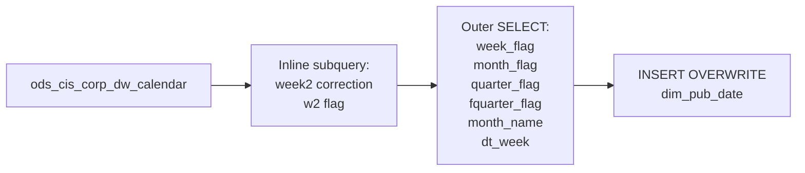

# DIM: Enriched CIS DW Calendar with Derived Period Labels (`dim_pub_date`)

- artifact_type: etl_table
- artifact_id: dim_us.dim_pub_date
- domain: common
- one_line_purpose: This job builds the primary date dimension by enriching the CIS corporate DW calendar with four derived period-label columns (`week_flag`, `month_flag`, `quarter_flag`, `fquarter_flag`) and a Sunday-anchored week correction (`week2`, `dt_we...
- layer_type: DIM
- source_kind: etl_sql
- evidence_source: source/etl/sql/common/source/etl/flows/public_order_tools/ingest/dim_pub_date/dim_pub_date.sql

---

## L1 Data Foundation

### Identity and physical mapping
- **Table:** `dim_us.dim_pub_date`
- **Layer type:** DIM
- **Canonical / derived:** Derived / ETL-loaded (see L3)
- **Owner team:** not registered in metadata catalog

### Grain, scope, exclusions
- **Grain:** one row per calendar date.
- **Scope:** See L2 business purpose / L3 filters
- **Partition:** none — full table overwrite. - resolved from pipeline (see L4)
- **Natural key:** `date_flag`.
- **Exclusions:** Not documented in repository

#### Grain detail (preserved)

- **Grain:** one row per calendar date.
- **Partition:** none — full table overwrite.
- **Natural key:** `date_flag`.

---

### Cross-engine presence
| Engine | Present | Canonical FQN | Notes |
|--------|---------|---------------|-------|
| Hive | yes | `dim_pub_date` | ETL target / intermediate per evidence script |
| Vertica | pending | `dim_pub_date` | Confirm via hive2vertica flow evidence / MCP |

### Physical schema reference

Pointer block only - full column catalog lives in WKB L1 storage JSON.

| Field | Value |
|-------|-------|
| **Authoritative catalog** | WKB L1 storage seed (not duplicated in this file) |
| **entity_id** | `dim_us.dim_pub_date` |
| **l1_catalog_seed** | `target/storage/wkb/snapshots/_snapshot_id_template/l1_catalog/{engine}_{schema}_{table}.json` |
| **column_count** | pending (run ddl_seed_writer) |
| **partition_keys** | `none — full table overwrite.` |
| **ddl_source** | pending Bitbucket DDL / Vertica metadata ingest |
| **retrieval** | `python -m tools.wkb.indexing.run_query --query "common dim_pub_date schema" --intent find_table_schema` |

### Lineage
| Object | Role |
|--------|------|
| `ods_${country_code}.ods_cis_corp_dw_calendar` | Sole source |

---

### Freshness and load path
| Item | Value |
|------|-------|
| Load pattern | See L3 end-to-end / INSERT pattern in evidence script |
| Schedule | Not documented in repository |
| Parameters | `country_code` |


---

## L2 Declarative Knowledge

### Business purpose
This job builds the primary date dimension by enriching the CIS corporate DW calendar with four
derived period-label columns (`week_flag`, `month_flag`, `quarter_flag`, `fquarter_flag`) and a
Sunday-anchored week correction (`week2`, `dt_week`, `w2`). Reports that need formatted period
identifiers (e.g., "2024-W03", "2024-03", "2024-Q1") join on `date_flag` against this table rather
than computing labels at query time.

---

### Audience and use cases
| Audience | How they benefit |
|----------|-----------------|
| **BI / reporting** | Use `week_flag`, `month_flag`, `quarter_flag` for grouping without string-formatting in every query |
| **Finance** | `fquarter_flag`, `fyear`, `fqtr` for fiscal-year rollups |
| **Sales / payroll** | `holiday`, `payroll`, `bonuswk`, `sales` flags for operational scheduling |

---

### Identifier search profile
- Primary lookup keys: see natural key under L1 Grain.
- Use latest snapshot / active flags when documented in L3 filters.

### Time field semantics
- **date_flag / partition columns:** none — full table overwrite.
- Primary reporting filter should use the partition column(s) documented in L1; resolve values via L4.

### Metrics served
When exposing this table to the business, lead with:

1. **Period aggregation:** `week_flag`, `month_flag`, `quarter_flag`, `fquarter_flag`
2. **Fiscal hierarchy:** `fyear`, `fqtr`, `fdoy`
3. **Operational flags:** `holiday`, `payroll`, `bonuswk`, `sales`

---

### Metric serving map
N/A - not a `*_comb_mtd` / multi-period wide serving table (or map not present in legacy doc).


### Data products and column groups (preserved)

### Identifiers and relationships

- **Date:** `date_flag`, `year`, `qtr`, `month`, `week`, `day`, `doy`, `dow`
- **Fiscal:** `fyear`, `fqtr`, `fdoy`

### Dimension columns

Use these for **filters, group-bys, and star-schema joins**:

- `week_flag` — ISO-style week label "YYYY-Www" (zero-padded)
- `month_flag` — Month label "YYYY-MM" (zero-padded)
- `quarter_flag` — Calendar quarter label "YYYY-Q#"
- `fquarter_flag` — Fiscal quarter label "FY-Q#"
- `month_name` — Full month name (e.g., "January")
- `dt_week` — Sunday-anchored week label "YYYY-Www"
- `week2` — Corrected week number (Sunday-anchored)
- `w2` — Corrected week flag (Sunday-anchored)
- `dname` — Day name
- `weekday` — Weekday indicator
- `bonuswk`, `holiday`, `payroll`, `sales` — Operational flags (inherited from base calendar)

---

### etl_metrics

#### `week2`
- **Source:** [metric-index.md](../../source/contracts/common/metric-index.md#week2)
- **Business definition:** Adds or subtracts 1 from the original week when the year's first day is Sunday, anchoring weeks to Sunday starts
```sql
CASE WHEN dow<>7 AND DAYOFWEEK(trunc(date_flag,'YYYY'))=7 THEN week+1 WHEN dow=7 AND DAYOFWEEK(trunc(date_flag,'YYYY'))<>7 THEN week-1 ELSE week END
```

#### `w2`
- **Source:** [metric-index.md](../../source/contracts/common/metric-index.md#w2)
- **Business definition:** Corrected week flag (flag version of week2)
```sql
CASE WHEN dow=7 THEN w-1 ELSE w END
```

#### `week_flag`
- **Source:** [metric-index.md](../../source/contracts/common/metric-index.md#week_flag)
- **Business definition:** Zero-padded calendar week label "YYYY-Www"
```sql
CASE WHEN week>=10 THEN concat(year,'-W',week) ELSE concat(year,'-W0',week) END
```

#### `month_flag`
- **Source:** [metric-index.md](../../source/contracts/common/metric-index.md#month_flag)
- **Business definition:** Zero-padded month label "YYYY-MM"
```sql
CASE WHEN month>=10 THEN concat(year,'-',month) ELSE concat(year,'-0',month) END
```

#### `dt_week`
- **Source:** [metric-index.md](../../source/contracts/common/metric-index.md#dt_week)
- **Business definition:** Sunday-anchored week label "YYYY-Www"
```sql
CASE WHEN week2>=10 THEN concat(year,'-W',week2) ELSE concat(year,'-W0',week2) END
```


---

## L3 Procedural Knowledge

### Query and routing rules
**Business filters:** Use partition / date keys from L1 grain for reporting scope.
**Technical predicates (load only):** See Key filters and step-by-step logic below.

### Dimension join patterns
| Dimension FQN | Join keys | Purpose | Evidence |
|---------------|-----------|---------|----------|
| See step-by-step / base tables | See L3 steps | Dimension enrichment | `source/etl/sql/common/source/etl/flows/public_order_tools/ingest/dim_pub_date/dim_pub_date.sql` |

### Key filters and ETL business logic
### Step 1 — Inline subquery `t`: Week correction

**Source:** `ods_${country_code}.ods_cis_corp_dw_calendar a`

**Filter:** None — all rows.

**Derived columns in this step:**

| Column | Formula | Plain language |
|--------|---------|----------------|
| `week2` | `CASE WHEN dow<>7 AND DAYOFWEEK(trunc(date_flag,'YYYY'))=7 THEN week+1 WHEN dow=7 AND DAYOFWEEK(trunc(date_flag,'YYYY'))<>7 THEN week-1 ELSE week END` | Adds or subtracts 1 from the original week when the year's first day is Sunday, anchoring weeks to Sunday starts |
| `w2` | `CASE WHEN dow=7 THEN w-1 ELSE w END` | Corrected week flag (flag version of week2) |

All other columns are passed through from `a.*`.

---

### Step 2 — Final `INSERT OVERWRITE` into `dim_pub_date`

**From:** inline subquery `t`

**Pass-through columns:**
`date_flag`, `u_version`, `q`, `fq`, `m`, `w`, `d`, `year`, `qtr`, `month`, `week`, `day`, `doy`,
`fyear`, `fqtr`, `fdoy`, `dow`, `dname`, `bonuswk`, `holiday`, `payroll`, `sales`, `comment`,
`weekday`, `w2`, `week2`

**Derived columns computed at INSERT:**

| Column | Formula | Plain language |
|--------|---------|----------------|
| `week_flag` | `CASE WHEN week>=10 THEN concat(year,'-W',week) ELSE concat(year,'-W0',week) END` | Zero-padded calendar week label "YYYY-Www" |
| `month_flag` | `CASE WHEN month>=10 THEN concat(year,'-',month) ELSE concat(year,'-0',month) END` | Zero-padded month label "YYYY-MM" |
| `quarter_flag` | `concat(year,'-Q',qtr)` | Calendar quarter label "YYYY-Q#" |
|...

### Standard time-filter SQL
```sql
-- relative period filter using resolved partition value (see L4)
SELECT *
FROM dim_pub_date
WHERE /* partition predicate */ date_flag = '${partition_value}';
```

### End-to-end flow
**Runtime parameters:** `country_code`
**Target table:** `dim_${country_code}.dim_pub_date` — full table overwrite.

1. Read all rows from `ods_${country_code}.ods_cis_corp_dw_calendar` with all base columns.
2. Apply inline subquery to compute `week2` (corrected week number anchored to Sunday) and `w2`.
3. Derive `week_flag`, `month_flag`, `quarter_flag`, `fquarter_flag`, `month_name`, `dt_week` on the outer SELECT.
4. **INSERT OVERWRITE** all columns into `dim_pub_date`.



---


#### High-level stages (preserved)

| Stage | Business meaning |
|-------|-----------------|
| **Week correction subquery** | Detects whether the calendar year starts on a Sunday and corrects the week number so that `week2` always anchors weeks to Sunday |
| **Period label derivation** | Formats `week_flag` (YYYY-Www), `month_flag` (YYYY-MM), `quarter_flag` (YYYY-Q#), `fquarter_flag` (FY-Q#), and `month_name` |
| **INSERT OVERWRITE** | Writes the full enriched calendar to `dim_pub_date` |

**Parameters:** `country_code`

---


### Base tables register
| Object | Role in this job |
|--------|-----------------|
| `ods_${country_code}.ods_cis_corp_dw_calendar` | Sole source — all base calendar attributes |

**Temporary tables (inside the job only):**
None — inline subquery feeds the outer SELECT directly.

---

### Step-by-step logic
### Step 1 — Inline subquery `t`: Week correction

**Source:** `ods_${country_code}.ods_cis_corp_dw_calendar a`

**Filter:** None — all rows.

**Derived columns in this step:**

| Column | Formula | Plain language |
|--------|---------|----------------|
| `week2` | `CASE WHEN dow<>7 AND DAYOFWEEK(trunc(date_flag,'YYYY'))=7 THEN week+1 WHEN dow=7 AND DAYOFWEEK(trunc(date_flag,'YYYY'))<>7 THEN week-1 ELSE week END` | Adds or subtracts 1 from the original week when the year's first day is Sunday, anchoring weeks to Sunday starts |
| `w2` | `CASE WHEN dow=7 THEN w-1 ELSE w END` | Corrected week flag (flag version of week2) |

All other columns are passed through from `a.*`.

---

### Step 2 — Final `INSERT OVERWRITE` into `dim_pub_date`

**From:** inline subquery `t`

**Pass-through columns:**
`date_flag`, `u_version`, `q`, `fq`, `m`, `w`, `d`, `year`, `qtr`, `month`, `week`, `day`, `doy`,
`fyear`, `fqtr`, `fdoy`, `dow`, `dname`, `bonuswk`, `holiday`, `payroll`, `sales`, `comment`,
`weekday`, `w2`, `week2`

**Derived columns computed at INSERT:**

| Column | Formula | Plain language |
|--------|---------|----------------|
| `week_flag` | `CASE WHEN week>=10 THEN concat(year,'-W',week) ELSE concat(year,'-W0',week) END` | Zero-padded calendar week label "YYYY-Www" |
| `month_flag` | `CASE WHEN month>=10 THEN concat(year,'-',month) ELSE concat(year,'-0',month) END` | Zero-padded month label "YYYY-MM" |
| `quarter_flag` | `concat(year,'-Q',qtr)` | Calendar quarter label "YYYY-Q#" |
| `fquarter_flag` | `concat(fyear,'-Q',fqtr)` | Fiscal quarter label "FY-Q#" |
| `month_name` | `date_format(date_flag,'MMMMM')` | Full month name |
| `dt_week` | `CASE WHEN week2>=10 THEN concat(year,'-W',week2) ELSE concat(year,'-W0',week2) END` | Sunday-anchored week label "YYYY-Www" |

---

### Relationship map (embedded)

| from_fqn | to_fqn | cardinality | join_keys | provenance |
|----------|--------|-------------|-----------|------------|
| `ods_${country_code}.ods_cis_corp_dw_calendar` | `ods_${country_code}.ods_cis_corp_dw_calendar` | 1:1 source scan | — (no JOIN; single FROM) | etl_sql (`source/etl/sql/common/public_order_scripts/dim_pub_date/dim_pub_date.sql:46`) |


### Special logic (embedded)

Not documented in repository

### Column / field derivations (from ETL SQL)

| target_column | expression_sql | upstream_columns | upstream_tables | transform_kind | evidence |
|---------------|----------------|------------------|-----------------|----------------|----------|
| `date_flag` | `date_flag` | `date_flag` | `ods_${country_code}.ods_cis_corp_dw_calendar` | passthrough | `source/etl/sql/common/public_order_scripts/dim_pub_date/dim_pub_date.sql:7` |
| `u_version` | `u_version` | `u_version` | `ods_${country_code}.ods_cis_corp_dw_calendar` | passthrough | `source/etl/sql/common/public_order_scripts/dim_pub_date/dim_pub_date.sql:8` |
| `q` | `q` | `q` | `ods_${country_code}.ods_cis_corp_dw_calendar` | passthrough | `source/etl/sql/common/public_order_scripts/dim_pub_date/dim_pub_date.sql:1` |
| `fq` | `fq` | `fq` | `ods_${country_code}.ods_cis_corp_dw_calendar` | passthrough | `source/etl/sql/common/public_order_scripts/dim_pub_date/dim_pub_date.sql:1` |
| `m` | `m` | `m` | `ods_${country_code}.ods_cis_corp_dw_calendar` | passthrough | `source/etl/sql/common/public_order_scripts/dim_pub_date/dim_pub_date.sql:1` |
| `w` | `w` | `w` | `ods_${country_code}.ods_cis_corp_dw_calendar` | passthrough | `source/etl/sql/common/public_order_scripts/dim_pub_date/dim_pub_date.sql:1` |
| `d` | `d` | `d` | `ods_${country_code}.ods_cis_corp_dw_calendar` | passthrough | `source/etl/sql/common/public_order_scripts/dim_pub_date/dim_pub_date.sql:1` |
| `year` | `year` | `year` | `ods_${country_code}.ods_cis_corp_dw_calendar` | passthrough | `source/etl/sql/common/public_order_scripts/dim_pub_date/dim_pub_date.sql:2` |
| `qtr` | `qtr` | `qtr` | `ods_${country_code}.ods_cis_corp_dw_calendar` | passthrough | `source/etl/sql/common/public_order_scripts/dim_pub_date/dim_pub_date.sql:15` |
| `month` | `month` | `month` | `ods_${country_code}.ods_cis_corp_dw_calendar` | passthrough | `source/etl/sql/common/public_order_scripts/dim_pub_date/dim_pub_date.sql:1` |
| `week` | `week` | `week` | `ods_${country_code}.ods_cis_corp_dw_calendar` | passthrough | `source/etl/sql/common/public_order_scripts/dim_pub_date/dim_pub_date.sql:1` |
| `day` | `day` | `day` | `ods_${country_code}.ods_cis_corp_dw_calendar` | passthrough | `source/etl/sql/common/public_order_scripts/dim_pub_date/dim_pub_date.sql:2` |
| `doy` | `doy` | `doy` | `ods_${country_code}.ods_cis_corp_dw_calendar` | passthrough | `source/etl/sql/common/public_order_scripts/dim_pub_date/dim_pub_date.sql:19` |
| `fyear` | `fyear` | `fyear` | `ods_${country_code}.ods_cis_corp_dw_calendar` | passthrough | `source/etl/sql/common/public_order_scripts/dim_pub_date/dim_pub_date.sql:20` |
| `fqtr` | `fqtr` | `fqtr` | `ods_${country_code}.ods_cis_corp_dw_calendar` | passthrough | `source/etl/sql/common/public_order_scripts/dim_pub_date/dim_pub_date.sql:21` |
| `fdoy` | `fdoy` | `fdoy` | `ods_${country_code}.ods_cis_corp_dw_calendar` | passthrough | `source/etl/sql/common/public_order_scripts/dim_pub_date/dim_pub_date.sql:22` |
| `dow` | `dow` | `dow` | `ods_${country_code}.ods_cis_corp_dw_calendar` | passthrough | `source/etl/sql/common/public_order_scripts/dim_pub_date/dim_pub_date.sql:23` |
| `dname` | `dname` | `dname` | `ods_${country_code}.ods_cis_corp_dw_calendar` | passthrough | `source/etl/sql/common/public_order_scripts/dim_pub_date/dim_pub_date.sql:24` |
| `bonuswk` | `bonuswk` | `bonuswk` | `ods_${country_code}.ods_cis_corp_dw_calendar` | passthrough | `source/etl/sql/common/public_order_scripts/dim_pub_date/dim_pub_date.sql:25` |
| `holiday` | `holiday` | `holiday` | `ods_${country_code}.ods_cis_corp_dw_calendar` | passthrough | `source/etl/sql/common/public_order_scripts/dim_pub_date/dim_pub_date.sql:26` |
| `payroll` | `payroll` | `payroll` | `ods_${country_code}.ods_cis_corp_dw_calendar` | passthrough | `source/etl/sql/common/public_order_scripts/dim_pub_date/dim_pub_date.sql:27` |
| `sales` | `sales` | `sales` | `ods_${country_code}.ods_cis_corp_dw_calendar` | passthrough | `source/etl/sql/common/public_order_scripts/dim_pub_date/dim_pub_date.sql:28` |
| `comment` | `comment` | `comment` | `ods_${country_code}.ods_cis_corp_dw_calendar` | passthrough | `source/etl/sql/common/public_order_scripts/dim_pub_date/dim_pub_date.sql:29` |
| `weekday` | `weekday` | `weekday` | `ods_${country_code}.ods_cis_corp_dw_calendar` | passthrough | `source/etl/sql/common/public_order_scripts/dim_pub_date/dim_pub_date.sql:30` |
| `week_flag` | `case when week >=10 then concat(YEAR ,'-W',WEEK ) else concat(YEAR ,'-W0',WEEK ) end` | `week`, `YEAR`, `W`, `WEEK`, `W0` | `ods_${country_code}.ods_cis_corp_dw_calendar` | case | `source/etl/sql/common/public_order_scripts/dim_pub_date/dim_pub_date.sql:31` |
| `month_flag` | `case when month >=10 then concat(YEAR ,'-',month ) else concat(YEAR ,'-0',month ) end` | `month`, `YEAR` | `ods_${country_code}.ods_cis_corp_dw_calendar` | case | `source/etl/sql/common/public_order_scripts/dim_pub_date/dim_pub_date.sql:32` |
| `quarter_flag` | `concat(YEAR,'-Q',qtr )` | `YEAR`, `Q`, `qtr` | `ods_${country_code}.ods_cis_corp_dw_calendar` | arithmetic | `source/etl/sql/common/public_order_scripts/dim_pub_date/dim_pub_date.sql:33` |
| `fquarter_flag` | `concat(fyear,'-Q',fqtr )` | `fyear`, `Q`, `fqtr` | `ods_${country_code}.ods_cis_corp_dw_calendar` | arithmetic | `source/etl/sql/common/public_order_scripts/dim_pub_date/dim_pub_date.sql:34` |
| `month_name` | `date_format(DATE_FLAG,'MMMMM')` | `DATE_FLAG`, `MMMMM` | `ods_${country_code}.ods_cis_corp_dw_calendar` | udf | `source/etl/sql/common/public_order_scripts/dim_pub_date/dim_pub_date.sql:35` |
| `dt_week` | `case when week2 >=10 then concat(YEAR ,'-W',week2 ) else concat(YEAR ,'-W0',week2 ) end` | `week2`, `YEAR`, `W`, `W0` | `ods_${country_code}.ods_cis_corp_dw_calendar` | case | `source/etl/sql/common/public_order_scripts/dim_pub_date/dim_pub_date.sql:36` |
| `w2` | `w2` | `w2` | `ods_${country_code}.ods_cis_corp_dw_calendar` | passthrough | `source/etl/sql/common/public_order_scripts/dim_pub_date/dim_pub_date.sql:3` |
| `week2` | `week2` | `week2` | `ods_${country_code}.ods_cis_corp_dw_calendar` | passthrough | `source/etl/sql/common/public_order_scripts/dim_pub_date/dim_pub_date.sql:3` |

### Sentinel and code values
| Value | Meaning |
|-------|---------|
| `holiday` | The date is a recognized corporate holiday |
| `payroll` | Payroll-relevant date |
| `bonuswk` | Date falls in a bonus week |
| `sales` | Date is a valid sales day |

---

---

## L4 Validation

### Resolved partition value
| Step | Source | How partition / date scope is determined |
|------|--------|------------------------------------------|
| 1 | evidence script / flow | See parameters in L1 Freshness and L3 filters - `source/etl/sql/common/source/etl/flows/public_order_tools/ingest/dim_pub_date/dim_pub_date.sql` |

**Plain language:** Partition and date scope follow Azkaban/bootstrap parameters documented in the source script and orchestrating flow; do not hardcode calendar literals.

### Data quality checks
- Prefer row-count-by-partition, metric sums, and grain duplicate checks (see Validation SQL).
- Additional checks from legacy caveats / operational notes when present.

### Validation SQL
```sql
-- 1) Row count by partition
SELECT ${partition_col}, COUNT(*) AS row_cnt
FROM dim_${country_code}.dim_pub_date
WHERE ${partition_col} = '${partition_value}'
GROUP BY ${partition_col};

-- 2) Metric sum by business dimension (top deltas)
SELECT ${dim_key}, SUM(${metric}) AS metric_sum
FROM dim_${country_code}.dim_pub_date
WHERE ${partition_col} = '${partition_value}'
GROUP BY ${dim_key}
ORDER BY ABS(SUM(${metric})) DESC
LIMIT 20;

-- 3) Grain duplicate check
SELECT ${grain_key_1}, ${grain_key_2}, ${grain_key_3}, ${partition_col}, COUNT(*) AS cnt
FROM dim_${country_code}.dim_pub_date
WHERE ${partition_col} = '${partition_value}'
GROUP BY ${grain_key_1}, ${grain_key_2}, ${grain_key_3}, ${partition_col}
HAVING COUNT(*) > 1;
```

Replace placeholders from this file's Grain and keys / Data you can fetch sections, and use the resolved partition value from run scope.

### Caveats for interpretation
- **`spark.sql.legacy.timeParserPolicy=LEGACY`** is set at the top of the script (line 4) — required for compatibility with legacy date format patterns in `date_format()`.
- **Week correction logic:** `week2`/`dt_week` are anchored to Sunday. For Monday-anchored week reporting, use the original `week`/`week_flag`.
- **Full refresh:** All rows are overwritten on each run; calendar corrections in the source are reflected immediately.
- **Fiscal labels:** `fquarter_flag` uses `fyear` and `fqtr` from the source calendar; fiscal year definitions are owned upstream in CIS.

---

### Conflicts and open questions
- Schedule, owner, SLA: Not documented in repository (unless preserved schedule evidence above).
- Vertica MCP verification: pending unless confirmed in L5.


---

## L5 Runtime View

### Query path and engine preference
| Role | Hive object | Vertica object | Sync mode | Evidence | MCP verified |
|------|-------------|----------------|-----------|----------|--------------|
| **Query for reporting** | *See script lineage* | `dim_${country_code}.dim_pub_date` | *Verify from flow* | *Add flow file:line* | pending |
| **Hive alternative** | `*` | `dim_${country_code}.dim_pub_date` | - | *See dependencies* | - |
| **ETL internal** | staging/temp tables | *Not synced to Vertica* | - | *See step-by-step logic* | - |

Business users should query `dim_${country_code}.dim_pub_date` in Vertica once MCP verification is completed for this document.

### Access constraints
- Country / company schema parameters may apply (`literal_country`, `company_no`, etc.).
- Hive-only staging objects are not reporting surfaces unless synced.

### Query risk profile
| Field | Value |
|-------|-------|
| requires_date_predicate | unknown |
| scan_risk_tier | medium |

---

## L6 Access and Consumption

### Primary consumers and use cases
| Audience | How they benefit |
|----------|-----------------|
| **BI / reporting** | Use `week_flag`, `month_flag`, `quarter_flag` for grouping without string-formatting in every query |
| **Finance** | `fquarter_flag`, `fyear`, `fqtr` for fiscal-year rollups |
| **Sales / payroll** | `holiday`, `payroll`, `bonuswk`, `sales` flags for operational scheduling |

---

### Representative query patterns
```sql
-- certified / illustrative lookup - replace predicates from L1/L4
SELECT *
FROM dim_pub_date
WHERE date_flag = '${partition_value}'
LIMIT 100;
```

### Dependencies and notes
### Upstream objects (verified)

| Object | Usage | Evidence |
|--------|-------|----------|
| `ods_${country_code}.ods_cis_corp_dw_calendar` | All columns — source of base calendar + `week`/`dow` for correction | `source/etl/sql/common/source/etl/flows/public_order_tools/ingest/dim_pub_date/dim_pub_date.sql:46` |

### Downstream consumers (verified)

None identified in repository.

### Operational detail (verified)

- Full table overwrite on every run: `source/etl/sql/common/source/etl/flows/public_order_tools/ingest/dim_pub_date/dim_pub_date.sql:5`
- Requires `spark.sql.legacy.timeParserPolicy=LEGACY`: `source/etl/sql/common/source/etl/flows/public_order_tools/ingest/dim_pub_date/dim_pub_date.sql:4`

### Not documented in repository

- Schedule, owner, SLA — not in scripts or configs

### Related scripts (verified)

- `dim_dw_calendar.sql` — base calendar (no derived labels) — `source/etl/sql/common/source/etl/flows/public_order_tools/ingest/dim_pub_date/`

---

*Document generated from `source/etl/sql/common/source/etl/flows/public_order_tools/ingest/dim_pub_date/dim_pub_date.sql`.*

#### Not documented in repository
- Owner, SLA (unless schedule evidence preserved above)
- Any dependency without `file:line` evidence in this document

---

*Document migrated to L1-L6 from legacy Knowledgebase content. Evidence: `source/etl/sql/common/source/etl/flows/public_order_tools/ingest/dim_pub_date/dim_pub_date.sql`.*
