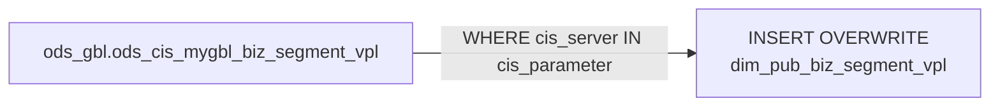

# DIM: Country-Filtered Business Segment to VPL Mapping (`dim_pub_biz_segment_vpl`)

- artifact_type: etl_table
- artifact_id: dim_us.dim_pub_biz_segment_vpl
- domain: common
- one_line_purpose: This job loads the business segment to Vendor Product Line (VPL) cross-reference for a specific country by filtering the global MyGBL mapping table to the target country's CIS server(s). It enables reports to link VPLs to the business segme...
- layer_type: DIM
- source_kind: etl_sql
- evidence_source: source/etl/sql/common/source/etl/flows/public_order_tools/ingest/public_common_dimension/script/dim_pub_biz_segment_vpl.sql

---

## L1 Data Foundation

### Identity and physical mapping
- **Table:** `dim_us.dim_pub_biz_segment_vpl`
- **Layer type:** DIM
- **Canonical / derived:** Derived / ETL-loaded (see L3)
- **Owner team:** not registered in metadata catalog

### Grain, scope, exclusions
- **Grain:** one row per business-segment–to–VPL mapping record.
- **Scope:** See L2 business purpose / L3 filters
- **Partition:** none — full table overwrite. - resolved from pipeline (see L4)
- **Natural key:** `id`.
- **Exclusions:** Not documented in repository

#### Grain detail (preserved)

- **Grain:** one row per business-segment–to–VPL mapping record.
- **Partition:** none — full table overwrite.
- **Natural key:** `id`.

---

### Cross-engine presence
| Engine | Present | Canonical FQN | Notes |
|--------|---------|---------------|-------|
| Hive | yes | `dim_pub_biz_segment_vpl` | ETL target / intermediate per evidence script |
| Vertica | pending | `dim_pub_biz_segment_vpl` | Confirm via hive2vertica flow evidence / MCP |

### Physical schema reference

Pointer block only - full column catalog lives in WKB L1 storage JSON.

| Field | Value |
|-------|-------|
| **Authoritative catalog** | WKB L1 storage seed (not duplicated in this file) |
| **entity_id** | `dim_us.dim_pub_biz_segment_vpl` |
| **l1_catalog_seed** | `target/storage/wkb/snapshots/_snapshot_id_template/l1_catalog/{engine}_{schema}_{table}.json` |
| **column_count** | pending (run ddl_seed_writer) |
| **partition_keys** | `none — full table overwrite.` |
| **ddl_source** | pending Bitbucket DDL / Vertica metadata ingest |
| **retrieval** | `python -m tools.wkb.indexing.run_query --query "common dim_pub_biz_segment_vpl schema" --intent find_table_schema` |

### Lineage
| Object | Role |
|--------|------|
| `ods_gbl.ods_cis_mygbl_biz_segment_vpl` | Sole source |

---

### Freshness and load path
| Item | Value |
|------|-------|
| Load pattern | See L3 end-to-end / INSERT pattern in evidence script |
| Schedule | Not documented in repository |
| Parameters | `country_code`, `cis_parameter` |


---

## L2 Declarative Knowledge

### Business purpose
This job loads the business segment to Vendor Product Line (VPL) cross-reference for a specific
country by filtering the global MyGBL mapping table to the target country's CIS server(s). It
enables reports to link VPLs to the business segment hierarchy, supporting revenue and margin
analysis by both product line and business segment simultaneously.

---

### Audience and use cases
| Audience | How they benefit |
|----------|-----------------|
| **Sales / vendor management** | Join on `biz_segment_id` + `vpl_no` to slice revenue by business segment and vendor product line |
| **Product management** | Validate which VPLs are mapped to which segments for a given country |
| **BI / reporting** | Bridge table enabling segment × VPL analysis in a star schema |

---

### Identifier search profile
- Primary lookup keys: see natural key under L1 Grain.
- Use latest snapshot / active flags when documented in L3 filters.

### Time field semantics
- **date_flag / partition columns:** none — full table overwrite.
- Primary reporting filter should use the partition column(s) documented in L1; resolve values via L4.

### Metrics served
When exposing this table to the business, lead with:

1. **Segment–VPL linkage:** `biz_segment_id`, `vpl_no`
2. **Validity:** `active`

---

### Metric serving map
N/A - not a `*_comb_mtd` / multi-period wide serving table (or map not present in legacy doc).


### Data products and column groups (preserved)

### Identifiers and relationships

- **Mapping record:** `id`
- **Segment:** `biz_segment_id` (FK to `dim_pub_biz_segment.id`)
- **VPL:** `vpl_no`
- **CIS server:** `cis_server`

### Dimension columns

- `active` — Whether the mapping is currently active
- `date_entered`, `entered_by`, `date_modified`, `modified_by` — Audit fields

---

### etl_metrics

N/A - no calculable ETL formulas extracted from this document (passthrough / stored measures only, or formulas not documented).

---

## L3 Procedural Knowledge

### Query and routing rules
**Business filters:** Use partition / date keys from L1 grain for reporting scope.
**Technical predicates (load only):** See Key filters and step-by-step logic below.

### Dimension join patterns
| Dimension FQN | Join keys | Purpose | Evidence |
|---------------|-----------|---------|----------|
| See step-by-step / base tables | See L3 steps | Dimension enrichment | `source/etl/sql/common/source/etl/flows/public_order_tools/ingest/public_common_dimension/script/dim_pub_biz_segment_vpl.sql` |

### Key filters and ETL business logic
### Step 1 — Final `INSERT OVERWRITE` into `dim_pub_biz_segment_vpl`

**From:** `ods_gbl.ods_cis_mygbl_biz_segment_vpl`

**Filter (natural language):**
- `cis_server IN (${cis_parameter})` — Only mappings belonging to the target country's CIS server(s)

**Pass-through columns:**
`id`, `biz_segment_id`, `vpl_no`, `cis_server`, `date_entered`, `entered_by`,
`date_modified`, `modified_by`, `active`

---

### Standard time-filter SQL
```sql
-- relative period filter using resolved partition value (see L4)
SELECT *
FROM dim_pub_biz_segment_vpl
WHERE /* partition predicate */ date_flag = '${partition_value}';
```

### End-to-end flow
**Runtime parameters:** `country_code`, `cis_parameter`
**Target table:** `dim_${country_code}.dim_pub_biz_segment_vpl` — full table overwrite.

1. Read from `ods_gbl.ods_cis_mygbl_biz_segment_vpl` where `cis_server IN (${cis_parameter})`.
2. **INSERT OVERWRITE** all columns as-is.



---


#### High-level stages (preserved)

| Stage | Business meaning |
|-------|-----------------|
| **Country filter** | Reads global segment-to-VPL mapping records and retains only those belonging to the target country's CIS server(s) |
| **INSERT OVERWRITE** | Writes the filtered set to the country-specific `dim_pub_biz_segment_vpl` |

**Parameters:** `country_code`, `cis_parameter`

---


### Base tables register
| Object | Role in this job |
|--------|-----------------|
| `ods_gbl.ods_cis_mygbl_biz_segment_vpl` | Sole source — global segment-to-VPL mapping, filtered to target country |

**Temporary tables (inside the job only):**
None — direct filtered INSERT.

---

### Step-by-step logic
### Step 1 — Final `INSERT OVERWRITE` into `dim_pub_biz_segment_vpl`

**From:** `ods_gbl.ods_cis_mygbl_biz_segment_vpl`

**Filter (natural language):**
- `cis_server IN (${cis_parameter})` — Only mappings belonging to the target country's CIS server(s)

**Pass-through columns:**
`id`, `biz_segment_id`, `vpl_no`, `cis_server`, `date_entered`, `entered_by`,
`date_modified`, `modified_by`, `active`

---

### Relationship map (embedded)

| from_fqn | to_fqn | cardinality | join_keys | provenance |
|----------|--------|-------------|-----------|------------|
| `ods_gbl.ods_cis_mygbl_biz_segment_vpl` | `ods_gbl.ods_cis_mygbl_biz_segment_vpl` | 1:1 source scan | — (no JOIN; single FROM) | etl_sql (`source/etl/sql/common/public_order_scripts/public_common_dimension/script/dim_pub_biz_segment_vpl.sql:12`) |


### Special logic (embedded)

Not documented in repository

### Column / field derivations (from ETL SQL)

| target_column | expression_sql | upstream_columns | upstream_tables | transform_kind | evidence |
|---------------|----------------|------------------|-----------------|----------------|----------|
| `id` | `id` | `id` | `ods_gbl.ods_cis_mygbl_biz_segment_vpl` | passthrough | `source/etl/sql/common/public_order_scripts/public_common_dimension/script/dim_pub_biz_segment_vpl.sql:3` |
| `biz_segment_id` | `biz_segment_id` | `biz_segment_id` | `ods_gbl.ods_cis_mygbl_biz_segment_vpl` | passthrough | `source/etl/sql/common/public_order_scripts/public_common_dimension/script/dim_pub_biz_segment_vpl.sql:4` |
| `vpl_no` | `vpl_no` | `vpl_no` | `ods_gbl.ods_cis_mygbl_biz_segment_vpl` | passthrough | `source/etl/sql/common/public_order_scripts/public_common_dimension/script/dim_pub_biz_segment_vpl.sql:5` |
| `cis_server` | `cis_server` | `cis_server` | `ods_gbl.ods_cis_mygbl_biz_segment_vpl` | passthrough | `source/etl/sql/common/public_order_scripts/public_common_dimension/script/dim_pub_biz_segment_vpl.sql:6` |
| `date_entered` | `date_entered` | `date_entered` | `ods_gbl.ods_cis_mygbl_biz_segment_vpl` | passthrough | `source/etl/sql/common/public_order_scripts/public_common_dimension/script/dim_pub_biz_segment_vpl.sql:7` |
| `entered_by` | `entered_by` | `entered_by` | `ods_gbl.ods_cis_mygbl_biz_segment_vpl` | passthrough | `source/etl/sql/common/public_order_scripts/public_common_dimension/script/dim_pub_biz_segment_vpl.sql:8` |
| `date_modified` | `date_modified` | `date_modified` | `ods_gbl.ods_cis_mygbl_biz_segment_vpl` | passthrough | `source/etl/sql/common/public_order_scripts/public_common_dimension/script/dim_pub_biz_segment_vpl.sql:9` |
| `modified_by` | `modified_by` | `modified_by` | `ods_gbl.ods_cis_mygbl_biz_segment_vpl` | passthrough | `source/etl/sql/common/public_order_scripts/public_common_dimension/script/dim_pub_biz_segment_vpl.sql:10` |
| `active` | `active` | `active` | `ods_gbl.ods_cis_mygbl_biz_segment_vpl` | passthrough | `source/etl/sql/common/public_order_scripts/public_common_dimension/script/dim_pub_biz_segment_vpl.sql:11` |

### Sentinel and code values
| Value | Meaning |
|-------|---------|
| `active` | Mapping is currently valid |

---

---

## L4 Validation

### Resolved partition value
| Step | Source | How partition / date scope is determined |
|------|--------|------------------------------------------|
| 1 | evidence script / flow | See parameters in L1 Freshness and L3 filters - `source/etl/sql/common/source/etl/flows/public_order_tools/ingest/public_common_dimension/script/dim_pub_biz_segment_vpl.sql` |

**Plain language:** Partition and date scope follow Azkaban/bootstrap parameters documented in the source script and orchestrating flow; do not hardcode calendar literals.

### Data quality checks
- Prefer row-count-by-partition, metric sums, and grain duplicate checks (see Validation SQL).
- Additional checks from legacy caveats / operational notes when present.

### Validation SQL
```sql
-- 1) Row count by partition
SELECT ${partition_col}, COUNT(*) AS row_cnt
FROM dim_pub_biz_segment.id
WHERE ${partition_col} = '${partition_value}'
GROUP BY ${partition_col};

-- 2) Metric sum by business dimension (top deltas)
SELECT ${dim_key}, SUM(${metric}) AS metric_sum
FROM dim_pub_biz_segment.id
WHERE ${partition_col} = '${partition_value}'
GROUP BY ${dim_key}
ORDER BY ABS(SUM(${metric})) DESC
LIMIT 20;

-- 3) Grain duplicate check
SELECT ${grain_key_1}, ${grain_key_2}, ${grain_key_3}, ${partition_col}, COUNT(*) AS cnt
FROM dim_pub_biz_segment.id
WHERE ${partition_col} = '${partition_value}'
GROUP BY ${grain_key_1}, ${grain_key_2}, ${grain_key_3}, ${partition_col}
HAVING COUNT(*) > 1;
```

Replace placeholders from this file's Grain and keys / Data you can fetch sections, and use the resolved partition value from run scope.

### Caveats for interpretation
- **Country scoping via `cis_parameter`:** Same risk as `dim_pub_biz_segment` — incorrect parameter loads wrong data.
- **Full refresh on every run.**
- **Companion to `dim_pub_biz_segment`:** This table provides the segment → VPL bridge; `dim_pub_biz_segment` provides the segment hierarchy itself.

---

### Conflicts and open questions
- Schedule, owner, SLA: Not documented in repository (unless preserved schedule evidence above).
- Vertica MCP verification: pending unless confirmed in L5.


---

## L5 Runtime View

### Query path and engine preference
| Role | Hive object | Vertica object | Sync mode | Evidence | MCP verified |
|------|-------------|----------------|-----------|----------|--------------|
| **Query for reporting** | *See script lineage* | `dim_pub_biz_segment.id` | *Verify from flow* | *Add flow file:line* | pending |
| **Hive alternative** | `*` | `dim_pub_biz_segment.id` | - | *See dependencies* | - |
| **ETL internal** | staging/temp tables | *Not synced to Vertica* | - | *See step-by-step logic* | - |

Business users should query `dim_pub_biz_segment.id` in Vertica once MCP verification is completed for this document.

### Access constraints
- Country / company schema parameters may apply (`literal_country`, `company_no`, etc.).
- Hive-only staging objects are not reporting surfaces unless synced.

### Query risk profile
| Field | Value |
|-------|-------|
| requires_date_predicate | unknown |
| scan_risk_tier | medium |

---

## L6 Access and Consumption

### Primary consumers and use cases
| Audience | How they benefit |
|----------|-----------------|
| **Sales / vendor management** | Join on `biz_segment_id` + `vpl_no` to slice revenue by business segment and vendor product line |
| **Product management** | Validate which VPLs are mapped to which segments for a given country |
| **BI / reporting** | Bridge table enabling segment × VPL analysis in a star schema |

---

### Representative query patterns
```sql
-- certified / illustrative lookup - replace predicates from L1/L4
SELECT *
FROM dim_pub_biz_segment_vpl
WHERE date_flag = '${partition_value}'
LIMIT 100;
```

### Dependencies and notes
### Upstream objects (verified)

| Object | Usage | Evidence |
|--------|-------|----------|
| `ods_gbl.ods_cis_mygbl_biz_segment_vpl` | All columns — filtered by `cis_server` | `source/etl/sql/common/source/etl/flows/public_order_tools/ingest/public_common_dimension/script/dim_pub_biz_segment_vpl.sql:12` |

### Downstream consumers (verified)

None identified in repository.

### Operational detail (verified)

- Full table overwrite: `source/etl/sql/common/source/etl/flows/public_order_tools/ingest/public_common_dimension/script/dim_pub_biz_segment_vpl.sql:1`

### Not documented in repository

- Schedule, owner, SLA — not in scripts or configs

### Related scripts (verified)

- `dim_pub_biz_segment.sql` — Segment hierarchy dimension, same country filter — `source/etl/sql/common/source/etl/flows/public_order_tools/ingest/public_common_dimension/script/`

---

*Document generated from `source/etl/sql/common/source/etl/flows/public_order_tools/ingest/public_common_dimension/script/dim_pub_biz_segment_vpl.sql`.*

#### Not documented in repository
- Owner, SLA (unless schedule evidence preserved above)
- Any dependency without `file:line` evidence in this document

---

*Document migrated to L1-L6 from legacy Knowledgebase content. Evidence: `source/etl/sql/common/source/etl/flows/public_order_tools/ingest/public_common_dimension/script/dim_pub_biz_segment_vpl.sql`.*
