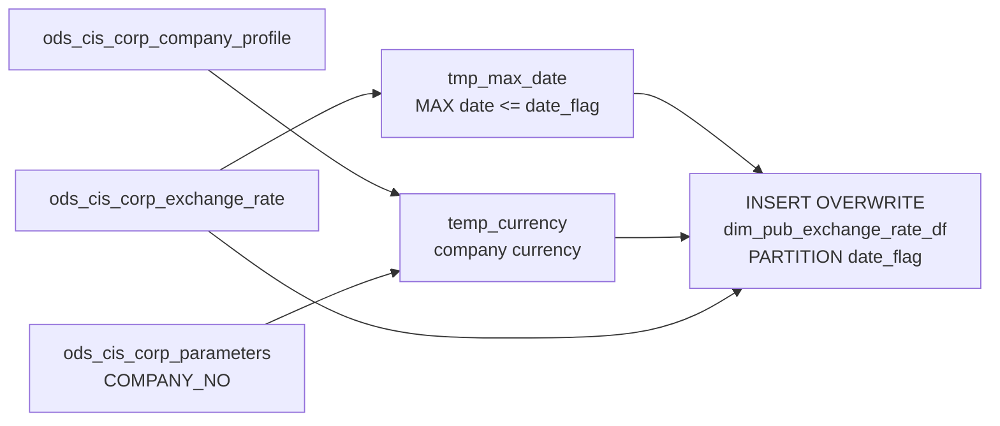

# DIM: Daily Country Exchange Rate Snapshot (`dim_pub_exchange_rate_df`)

- artifact_type: etl_table
- artifact_id: dim_us.dim_pub_exchange_rate_df
- domain: common
- one_line_purpose: This job creates a date-partitioned daily exchange rate snapshot for a specific country. For each run date (`date_flag`), it identifies the most recent available exchange rate on or before that date, and then filters to only the currencies ...
- layer_type: DIM
- source_kind: etl_sql
- evidence_source: source/etl/sql/common/source/etl/flows/public_order_tools/ingest/public_common_dimension/script/dim_pub_exchange_rate_df.sql

---

## L1 Data Foundation

### Identity and physical mapping
- **Table:** `dim_us.dim_pub_exchange_rate_df`
- **Layer type:** DIM
- **Canonical / derived:** Derived / ETL-loaded (see L3)
- **Owner team:** not registered in metadata catalog

### Grain, scope, exclusions
- **Grain:** one row per currency per `date_flag` partition.
- **Scope:** See L2 business purpose / L3 filters
- **Partition:** `date_flag` — the report date for which this rate applies. - resolved from pipeline (see L4)
- **Natural key:** `currency`, `base` within a `date_flag` partition.
- **Exclusions:** Not documented in repository

#### Grain detail (preserved)

- **Grain:** one row per currency per `date_flag` partition.
- **Partition:** `date_flag` — the report date for which this rate applies.
- **Natural key:** `currency`, `base` within a `date_flag` partition.

---

### Cross-engine presence
| Engine | Present | Canonical FQN | Notes |
|--------|---------|---------------|-------|
| Hive | yes | `dim_pub_exchange_rate_df` | ETL target / intermediate per evidence script |
| Vertica | pending | `dim_pub_exchange_rate_df` | Confirm via hive2vertica flow evidence / MCP |

### Physical schema reference

Pointer block only - full column catalog lives in WKB L1 storage JSON.

| Field | Value |
|-------|-------|
| **Authoritative catalog** | WKB L1 storage seed (not duplicated in this file) |
| **entity_id** | `dim_us.dim_pub_exchange_rate_df` |
| **l1_catalog_seed** | `target/storage/wkb/snapshots/_snapshot_id_template/l1_catalog/{engine}_{schema}_{table}.json` |
| **column_count** | pending (run ddl_seed_writer) |
| **partition_keys** | `date_flag` |
| **ddl_source** | pending Bitbucket DDL / Vertica metadata ingest |
| **retrieval** | `python -m tools.wkb.indexing.run_query --query "common dim_pub_exchange_rate_df schema" --intent find_table_schema` |

### Lineage
| Object | Role |
|--------|------|
| `ods_${country_code}.ods_cis_corp_exchange_rate` | Exchange rate history |
| `ods_${country_code}.ods_cis_corp_company_profile` | Company currency configuration |
| `ods_${country_code}.ods_cis_corp_parameters` | System parameter for company number |

---

### Freshness and load path
| Item | Value |
|------|-------|
| Load pattern | See L3 end-to-end / INSERT pattern in evidence script |
| Schedule | Not documented in repository |
| Parameters | `country_code`, `date_flag` |


---

## L2 Declarative Knowledge

### Business purpose
This job creates a date-partitioned daily exchange rate snapshot for a specific country. For each
run date (`date_flag`), it identifies the most recent available exchange rate on or before that date,
and then filters to only the currencies that the country's company uses. This ensures fact tables can
join on `date_flag` to get the correct rate without searching through all historical rate rows.

---

### Audience and use cases
| Audience | How they benefit |
|----------|-----------------|
| **Finance / FP&A** | Apply the correct exchange rate for financial reporting on any given date without searching full history |
| **Reporting** | Join fact tables on `date_flag` to get the company-specific rate for that date's conversion |

---

### Identifier search profile
- Primary lookup keys: see natural key under L1 Grain.
- Use latest snapshot / active flags when documented in L3 filters.

### Time field semantics
- **date_flag / partition columns:** `date_flag` — the report date for which this rate applies.
- Primary reporting filter should use the partition column(s) documented in L1; resolve values via L4.

### Metrics served
When exposing this table to the business, lead with:

1. **Currency conversion:** `currency`, `base`, `rate`
2. **Date partition:** `date_flag`

---

### Metric serving map
N/A - not a `*_comb_mtd` / multi-period wide serving table (or map not present in legacy doc).


### Data products and column groups (preserved)

### Identifiers and relationships

- **Rate:** `currency`, `base`
- **Audit:** `entry_id`, `entry_datetime`

### Exchange rate values

- `rate` — Primary conversion rate
- `rate2` — Secondary rate variant
- `rate3` — Tertiary rate variant

---

### etl_metrics

#### `max_currency_date`
- **Source:** [metric-index.md](../../source/contracts/common/metric-index.md#max_currency_date)
- **Business definition:** Latest available rate date on or before `date_flag`
```sql
MAX(date)
```


---

## L3 Procedural Knowledge

### Query and routing rules
**Business filters:** Use partition / date keys from L1 grain for reporting scope.
**Technical predicates (load only):** See Key filters and step-by-step logic below.

### Dimension join patterns
| Dimension FQN | Join keys | Purpose | Evidence |
|---------------|-----------|---------|----------|
| See step-by-step / base tables | See L3 steps | Dimension enrichment | `source/etl/sql/common/source/etl/flows/public_order_tools/ingest/public_common_dimension/script/dim_pub_exchange_rate_df.sql` |

### Key filters and ETL business logic
### Step 1 — `tmp_max_date`

**Source:** `ods_${country_code}.ods_cis_corp_exchange_rate`

**Filter (natural language):**
- `date <= date_flag` — Only rates available on or before the report date

**Derived columns:**

| Column | Formula | Plain language |
|--------|---------|----------------|
| `max_currency_date` | `MAX(date)` | Latest available rate date on or before `date_flag` |

---

### Step 2 — `temp_currency`

**Source:** `ods_${country_code}.ods_cis_corp_company_profile a`

**Join:**

| Join | Keys | Purpose |
|------|------|---------|
| `ods_cis_corp_parameters b` (INNER) | `a.company_no = cast(b.parameter_value as int)` | Match profile rows to the company identified by the `COMPANY_NO` system parameter |

**Filter (natural language):**
- `b.parameter_name = 'COMPANY_NO'` — Only the system company number parameter
- `a.profile_type = 'CURRENCY'` — Only currency profile rows
- `a.profile_cat = 'COM'` — Company-level (not user-level) currency profile

**Derived columns:**

| Column | Formula | Plain language |
|--------|---------|----------------|
| `currency` | `a.profile_c` | The company's configured base currency code |

---

### Step 3 — Final `INSERT OVERWRITE` into `dim_pub_exchange_rate_df PARTITION(date_flag)`

**From:** `ods_${country_code}.ods_cis_corp_exchange_rate`

**Filter (natural language):**
- `to_date(date) = (SELECT max_currency_date FROM tmp_max_date)` — Only rates for the closest available date
- `currency IN (SELECT currency FROM temp_currency)`...

### Standard time-filter SQL
```sql
-- relative period filter using resolved partition value (see L4)
SELECT *
FROM dim_pub_exchange_rate_df
WHERE /* partition predicate */ date_flag = '${partition_value}';
```

### End-to-end flow
**Runtime parameters:** `country_code`, `date_flag`
**Target table:** `dim_${country_code}.dim_pub_exchange_rate_df`, partitioned by **`date_flag`**.

1. **`tmp_max_date`:** Select `MAX(date)` from `ods_cis_corp_exchange_rate` where `date <= date_flag` — finds the closest available rate date.
2. **`temp_currency`:** Join `ods_cis_corp_company_profile` to `ods_cis_corp_parameters` on `COMPANY_NO` parameter; returns the company's currency code.
3. **INSERT OVERWRITE:** Select from `ods_cis_corp_exchange_rate` where `to_date(date) = max_currency_date` and `currency IN (temp_currency)`.



---


#### High-level stages (preserved)

| Stage | Business meaning |
|-------|-----------------|
| **Max date lookup** | Finds the latest available exchange rate date that is on or before `date_flag` |
| **Company currency lookup** | Reads the company profile to determine which currency is used by the company identified as `COMPANY_NO` |
| **Filtered snapshot insert** | Writes only the rates for the identified currencies as of the max available date into the `date_flag` partition |

**Parameters:** `country_code`, `date_flag`

---


### Base tables register
| Object | Role in this job |
|--------|-----------------|
| `ods_${country_code}.ods_cis_corp_exchange_rate` | Primary source — exchange rates; used for max-date lookup and for the final select |
| `ods_${country_code}.ods_cis_corp_company_profile` | Company profile lookup — returns `profile_c` (currency) for the company |
| `ods_${country_code}.ods_cis_corp_parameters` | Parameter lookup — identifies the company no via `COMPANY_NO` parameter |

**Temporary tables (inside the job only):**
`tmp_max_date` → `temp_currency` → (final `INSERT`)

---

### Step-by-step logic
### Step 1 — `tmp_max_date`

**Source:** `ods_${country_code}.ods_cis_corp_exchange_rate`

**Filter (natural language):**
- `date <= date_flag` — Only rates available on or before the report date

**Derived columns:**

| Column | Formula | Plain language |
|--------|---------|----------------|
| `max_currency_date` | `MAX(date)` | Latest available rate date on or before `date_flag` |

---

### Step 2 — `temp_currency`

**Source:** `ods_${country_code}.ods_cis_corp_company_profile a`

**Join:**

| Join | Keys | Purpose |
|------|------|---------|
| `ods_cis_corp_parameters b` (INNER) | `a.company_no = cast(b.parameter_value as int)` | Match profile rows to the company identified by the `COMPANY_NO` system parameter |

**Filter (natural language):**
- `b.parameter_name = 'COMPANY_NO'` — Only the system company number parameter
- `a.profile_type = 'CURRENCY'` — Only currency profile rows
- `a.profile_cat = 'COM'` — Company-level (not user-level) currency profile

**Derived columns:**

| Column | Formula | Plain language |
|--------|---------|----------------|
| `currency` | `a.profile_c` | The company's configured base currency code |

---

### Step 3 — Final `INSERT OVERWRITE` into `dim_pub_exchange_rate_df PARTITION(date_flag)`

**From:** `ods_${country_code}.ods_cis_corp_exchange_rate`

**Filter (natural language):**
- `to_date(date) = (SELECT max_currency_date FROM tmp_max_date)` — Only rates for the closest available date
- `currency IN (SELECT currency FROM temp_currency)` — Only currencies used by the company

**Pass-through columns:**
`currency`, `base`, `rate`, `rate2`, `rate3`, `entry_id`, `entry_datetime`

---

### Relationship map (embedded)

| from_fqn | to_fqn | cardinality | join_keys | provenance |
|----------|--------|-------------|-----------|------------|
| `ods_${country_code}.ods_cis_corp_exchange_rate` | `ods_${country_code}.ods_cis_corp_parameters` | many:1 | a.company_no = cast(b.parameter_value as int) | etl_sql (`source/etl/sql/common/public_order_scripts/public_common_dimension/script/dim_pub_exchange_rate_df.sql:13`) |

### Special logic (embedded)

Not documented in repository

### Column / field derivations (from ETL SQL)

| target_column | expression_sql | upstream_columns | upstream_tables | transform_kind | evidence |
|---------------|----------------|------------------|-----------------|----------------|----------|
| `currency` | `currency` | `currency` | `ods_${country_code}.ods_cis_corp_exchange_rate`, `tmp_max_date`, `temp_currency` | passthrough | `source/etl/sql/common/public_order_scripts/public_common_dimension/script/dim_pub_exchange_rate_df.sql:4` |
| `base` | `base` | `base` | `ods_${country_code}.ods_cis_corp_exchange_rate`, `tmp_max_date`, `temp_currency` | passthrough | `source/etl/sql/common/public_order_scripts/public_common_dimension/script/dim_pub_exchange_rate_df.sql:19` |
| `rate` | `rate` | `rate` | `ods_${country_code}.ods_cis_corp_exchange_rate`, `tmp_max_date`, `temp_currency` | passthrough | `source/etl/sql/common/public_order_scripts/public_common_dimension/script/dim_pub_exchange_rate_df.sql:5` |
| `rate2` | `rate2` | `rate2` | `ods_${country_code}.ods_cis_corp_exchange_rate`, `tmp_max_date`, `temp_currency` | passthrough | `source/etl/sql/common/public_order_scripts/public_common_dimension/script/dim_pub_exchange_rate_df.sql:25` |
| `rate3` | `rate3` | `rate3` | `ods_${country_code}.ods_cis_corp_exchange_rate`, `tmp_max_date`, `temp_currency` | passthrough | `source/etl/sql/common/public_order_scripts/public_common_dimension/script/dim_pub_exchange_rate_df.sql:26` |
| `entry_id` | `entry_id` | `entry_id` | `ods_${country_code}.ods_cis_corp_exchange_rate`, `tmp_max_date`, `temp_currency` | passthrough | `source/etl/sql/common/public_order_scripts/public_common_dimension/script/dim_pub_exchange_rate_df.sql:27` |
| `entry_datetime` | `entry_datetime` | `entry_datetime` | `ods_${country_code}.ods_cis_corp_exchange_rate`, `tmp_max_date`, `temp_currency` | passthrough | `source/etl/sql/common/public_order_scripts/public_common_dimension/script/dim_pub_exchange_rate_df.sql:28` |

### Sentinel and code values
None identified.

---

---

## L4 Validation

### Resolved partition value
| Step | Source | How partition / date scope is determined |
|------|--------|------------------------------------------|
| 1 | evidence script / flow | See parameters in L1 Freshness and L3 filters - `source/etl/sql/common/source/etl/flows/public_order_tools/ingest/public_common_dimension/script/dim_pub_exchange_rate_df.sql` |

**Plain language:** Partition and date scope follow Azkaban/bootstrap parameters documented in the source script and orchestrating flow; do not hardcode calendar literals.

### Data quality checks
- Prefer row-count-by-partition, metric sums, and grain duplicate checks (see Validation SQL).
- Additional checks from legacy caveats / operational notes when present.

### Validation SQL
```sql
-- 1) Row count by partition
SELECT ${partition_col}, COUNT(*) AS row_cnt
FROM dim_${country_code}.dim_pub_exchange_rate_df
WHERE ${partition_col} = '${partition_value}'
GROUP BY ${partition_col};

-- 2) Metric sum by business dimension (top deltas)
SELECT ${dim_key}, SUM(${metric}) AS metric_sum
FROM dim_${country_code}.dim_pub_exchange_rate_df
WHERE ${partition_col} = '${partition_value}'
GROUP BY ${dim_key}
ORDER BY ABS(SUM(${metric})) DESC
LIMIT 20;

-- 3) Grain duplicate check
SELECT ${grain_key_1}, ${grain_key_2}, ${grain_key_3}, ${partition_col}, COUNT(*) AS cnt
FROM dim_${country_code}.dim_pub_exchange_rate_df
WHERE ${partition_col} = '${partition_value}'
GROUP BY ${grain_key_1}, ${grain_key_2}, ${grain_key_3}, ${partition_col}
HAVING COUNT(*) > 1;
```

Replace placeholders from this file's Grain and keys / Data you can fetch sections, and use the resolved partition value from run scope.

### Caveats for interpretation
- **Rate date may lag:** If no rate exists exactly on `date_flag`, the closest earlier date is used.
- **Currency filter:** Only rates for currencies configured in the company profile are loaded; additional currencies not in the profile are excluded.
- **Partition overwrite:** Re-running for the same `date_flag` overwrites the previous snapshot.

---

### Conflicts and open questions
- Schedule, owner, SLA: Not documented in repository (unless preserved schedule evidence above).
- Vertica MCP verification: pending unless confirmed in L5.


---

## L5 Runtime View

### Query path and engine preference
| Role | Hive object | Vertica object | Sync mode | Evidence | MCP verified |
|------|-------------|----------------|-----------|----------|--------------|
| **Query for reporting** | *See script lineage* | `dim_${country_code}.dim_pub_exchange_rate_df` | *Verify from flow* | *Add flow file:line* | pending |
| **Hive alternative** | `*` | `dim_${country_code}.dim_pub_exchange_rate_df` | - | *See dependencies* | - |
| **ETL internal** | staging/temp tables | *Not synced to Vertica* | - | *See step-by-step logic* | - |

Business users should query `dim_${country_code}.dim_pub_exchange_rate_df` in Vertica once MCP verification is completed for this document.

### Access constraints
- Country / company schema parameters may apply (`literal_country`, `company_no`, etc.).
- Hive-only staging objects are not reporting surfaces unless synced.

### Query risk profile
| Field | Value |
|-------|-------|
| requires_date_predicate | yes |
| scan_risk_tier | medium |

---

## L6 Access and Consumption

### Primary consumers and use cases
| Audience | How they benefit |
|----------|-----------------|
| **Finance / FP&A** | Apply the correct exchange rate for financial reporting on any given date without searching full history |
| **Reporting** | Join fact tables on `date_flag` to get the company-specific rate for that date's conversion |

---

### Representative query patterns
```sql
-- certified / illustrative lookup - replace predicates from L1/L4
SELECT *
FROM dim_pub_exchange_rate_df
WHERE date_flag = '${partition_value}'
LIMIT 100;
```

### Dependencies and notes
### Upstream objects (verified)

| Object | Usage | Evidence |
|--------|-------|----------|
| `ods_${country_code}.ods_cis_corp_exchange_rate` | Max-date lookup and final rate rows | `source/etl/sql/common/source/etl/flows/public_order_tools/ingest/public_common_dimension/script/dim_pub_exchange_rate_df.sql:5,30` |
| `ods_${country_code}.ods_cis_corp_company_profile` | Company currency via `profile_c` | `source/etl/sql/common/source/etl/flows/public_order_tools/ingest/public_common_dimension/script/dim_pub_exchange_rate_df.sql:11` |
| `ods_${country_code}.ods_cis_corp_parameters` | `COMPANY_NO` parameter | `source/etl/sql/common/source/etl/flows/public_order_tools/ingest/public_common_dimension/script/dim_pub_exchange_rate_df.sql:13` |

### Downstream consumers (verified)

None identified in repository.

### Operational detail (verified)

- Partitioned by `date_flag`: `source/etl/sql/common/source/etl/flows/public_order_tools/ingest/public_common_dimension/script/dim_pub_exchange_rate_df.sql:20`

### Not documented in repository

- Schedule, owner, SLA — not in scripts or configs

### Related scripts (verified)

- `dim_pub_exchange_rate.sql` — Full historical copy (not date-partitioned) — `source/etl/sql/common/source/etl/flows/public_order_tools/ingest/public_common_dimension/script/`
- `dim_pub_exchange_rate_df_us.sql` — Multi-region version — `source/etl/sql/common/source/etl/flows/public_order_tools/ingest/public_common_dimension/script/`

---

*Document generated from `source/etl/sql/common/source/etl/flows/public_order_tools/ingest/public_common_dimension/script/dim_pub_exchange_rate_df.sql`.*

#### Not documented in repository
- Owner, SLA (unless schedule evidence preserved above)
- Any dependency without `file:line` evidence in this document

---

*Document migrated to L1-L6 from legacy Knowledgebase content. Evidence: `source/etl/sql/common/source/etl/flows/public_order_tools/ingest/public_common_dimension/script/dim_pub_exchange_rate_df.sql`.*
