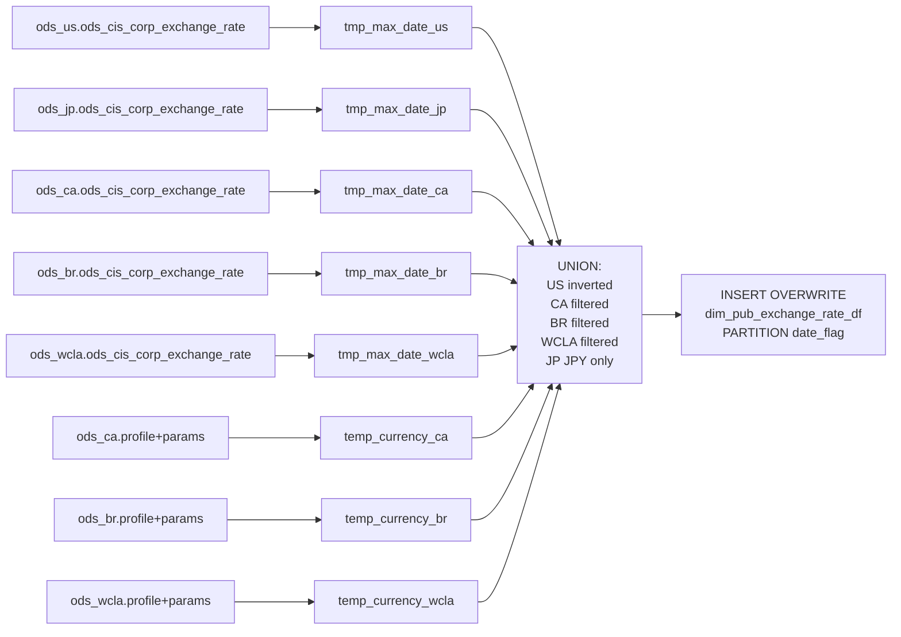

# DIM: Multi-Region Daily Exchange Rate Snapshot — US-Anchored (`dim_pub_exchange_rate_df`) [US variant]

- artifact_type: etl_table
- artifact_id: dim_us.dim_pub_exchange_rate_df
- domain: common
- one_line_purpose: This job builds a multi-region, date-partitioned daily exchange rate table that expresses all supported currencies relative to USD as the base. It combines rates from five countries (US, CA, BR, WCLA, JP), inverting the US rates so they flo...
- layer_type: DIM
- source_kind: etl_sql
- evidence_source: source/etl/sql/common/source/etl/flows/public_order_tools/ingest/public_common_dimension/script/dim_pub_exchange_rate_df_us.sql

---

## L1 Data Foundation

### Identity and physical mapping
- **Table:** `dim_us.dim_pub_exchange_rate_df`
- **Layer type:** DIM
- **Canonical / derived:** Derived / ETL-loaded (see L3)
- **Owner team:** not registered in metadata catalog

### Grain, scope, exclusions
- **Grain:** one row per local currency per `date_flag` partition (across five regions).
- **Scope:** See L2 business purpose / L3 filters
- **Partition:** `date_flag`. - resolved from pipeline (see L4)
- **Natural key:** `local_currency` within a `date_flag` partition (duplicates possible if multiple countries share a currency).
- **Exclusions:** Not documented in repository

#### Grain detail (preserved)

- **Grain:** one row per local currency per `date_flag` partition (across five regions).
- **Partition:** `date_flag`.
- **Natural key:** `local_currency` within a `date_flag` partition (duplicates possible if multiple countries share a currency).

---

### Cross-engine presence
| Engine | Present | Canonical FQN | Notes |
|--------|---------|---------------|-------|
| Hive | yes | `dim_pub_exchange_rate_df` | ETL target / intermediate per evidence script |
| Vertica | pending | `dim_pub_exchange_rate_df` | Confirm via hive2vertica flow evidence / MCP |

### Physical schema reference

Pointer block only - full column catalog lives in WKB L1 storage JSON.

| Field | Value |
|-------|-------|
| **Authoritative catalog** | WKB L1 storage seed (not duplicated in this file) |
| **entity_id** | `dim_us.dim_pub_exchange_rate_df` |
| **l1_catalog_seed** | `target/storage/wkb/snapshots/_snapshot_id_template/l1_catalog/{engine}_{schema}_{table}.json` |
| **column_count** | pending (run ddl_seed_writer) |
| **partition_keys** | `date_flag` |
| **ddl_source** | pending Bitbucket DDL / Vertica metadata ingest |
| **retrieval** | `python -m tools.wkb.indexing.run_query --query "common dim_pub_exchange_rate_df_us schema" --intent find_table_schema` |

### Lineage
| Object | Role |
|--------|------|
| `ods_us.ods_cis_corp_exchange_rate` | US rates (inverted) |
| `ods_jp.ods_cis_corp_exchange_rate` | JPY rates |
| `ods_ca.ods_cis_corp_exchange_rate` | CAD and other CA currencies |
| `ods_br.ods_cis_corp_exchange_rate` | BRL and other BR currencies |
| `ods_wcla.ods_cis_corp_exchange_rate` | WCLA currencies |
| `ods_ca/br/wcla.ods_cis_corp_company_profile` | Company currency identification |
| `ods_ca/br/wcla.ods_cis_corp_parameters` | `COMPANY_NO` parameter |

---

### Freshness and load path
| Item | Value |
|------|-------|
| Load pattern | See L3 end-to-end / INSERT pattern in evidence script |
| Schedule | Not documented in repository |
| Parameters | `country_code`, `date_flag` |


---

## L2 Declarative Knowledge

### Business purpose
This job builds a multi-region, date-partitioned daily exchange rate table that expresses all
supported currencies relative to USD as the base. It combines rates from five countries (US, CA,
BR, WCLA, JP), inverting the US rates so they flow as `local_currency → USD`, and then adds the
CA, BR, WCLA, and JP rates in their native direction (already expressed as `local → USD`). The
result is a single, consistent global rate table used for cross-country financial consolidation.

---

### Audience and use cases
| Audience | How they benefit |
|----------|-----------------|
| **Finance / global consolidation** | Single table with all major currency-to-USD rates for any given `date_flag`, enabling multi-country P&L roll-up |
| **Reporting** | Eliminates the need to join multiple country rate tables separately |

---

### Identifier search profile
- Primary lookup keys: see natural key under L1 Grain.
- Use latest snapshot / active flags when documented in L3 filters.

### Time field semantics
- **date_flag / partition columns:** `date_flag`.
- Primary reporting filter should use the partition column(s) documented in L1; resolve values via L4.

### Metrics served
When exposing this table to the business, lead with:

1. **Currency conversion to USD:** `local_currency`, `base`, `rate`
2. **Date partition:** `date_flag`
3. **Country coverage:** US (inverted), CA, BR, WCLA, JP

---

### Metric serving map
N/A - not a `*_comb_mtd` / multi-period wide serving table (or map not present in legacy doc).


### Data products and column groups (preserved)

### Identifiers and relationships

- **Rate:** `local_currency`, `base` (USD), `date_flag` (partition)
- **Audit:** `entry_id`, `entry_datetime`

### Exchange rate values

- `rate` — Primary conversion rate (local → USD)
- `rate2` — Secondary rate variant
- `rate3` — Tertiary rate variant

---

### etl_metrics

N/A - no calculable ETL formulas extracted from this document (passthrough / stored measures only, or formulas not documented).

---

## L3 Procedural Knowledge

### Query and routing rules
**Business filters:** Use partition / date keys from L1 grain for reporting scope.
**Technical predicates (load only):** See Key filters and step-by-step logic below.

### Dimension join patterns
| Dimension FQN | Join keys | Purpose | Evidence |
|---------------|-----------|---------|----------|
| See step-by-step / base tables | See L3 steps | Dimension enrichment | `source/etl/sql/common/source/etl/flows/public_order_tools/ingest/public_common_dimension/script/dim_pub_exchange_rate_df_us.sql` |

### Key filters and ETL business logic
### Steps 1–5 — `tmp_max_date_*` (one per country)

**Pattern (identical for each country):**

| Column | Formula | Plain language |
|--------|---------|----------------|
| `max_currency_date` | `MAX(date) WHERE date <= date_flag` | Latest available rate date on or before the report date |

---

### Steps 6–8 — `temp_currency_*` (CA, BR, WCLA)

**Pattern:** Join `ods_XX.ods_cis_corp_company_profile` to `ods_XX.ods_cis_corp_parameters` on
`company_no = cast(parameter_value as int)` where `parameter_name = 'COMPANY_NO'`,
`profile_type = 'CURRENCY'`, `profile_cat = 'COM'`.

Returns the local currency code used by each country's company.

---

### Step 9 — Final `INSERT OVERWRITE` into `dim_pub_exchange_rate_df PARTITION(date_flag)`

**UNION structure:**

| Sub-query | Source | Filter | Direction |
|-----------|--------|--------|-----------|
| US inverted | `ods_us.ods_cis_corp_exchange_rate` | `to_date(date)=max_date_us` AND `base NOT IN (CA∪BR∪WCLA currencies ∪ 'JPY')` | `base → local_currency`; rates inverted `1/rate` |
| CA | `ods_ca.ods_cis_corp_exchange_rate` | `to_date(date)=max_date_ca` AND `currency IN temp_currency_ca` | `currency → base` as-is |
| BR | `ods_br.ods_cis_corp_exchange_rate` | `to_date(date)=max_date_br` AND `currency IN temp_currency_br` | `currency → base` as-is |
| WCLA | `ods_wcla.ods_cis_corp_exchange_rate` | `to_date(date)=max_date_wcla` AND `currency IN temp_currency_wcla` | `currency → base` as-is |
| JP | `ods_jp.ods_cis_corp_exchange_rate` | `to_...

### Standard time-filter SQL
```sql
-- relative period filter using resolved partition value (see L4)
SELECT *
FROM dim_pub_exchange_rate_df
WHERE /* partition predicate */ date_flag = '${partition_value}';
```

### End-to-end flow
**Runtime parameters:** `country_code`, `date_flag`
**Target table:** `dim_${country_code}.dim_pub_exchange_rate_df`, partitioned by **`date_flag`**.

1. Build five `tmp_max_date_*` views — one per country — to find the closest available rate date for each.
2. Build three `temp_currency_*` views (CA, BR, WCLA) to identify each country's configured currency.
3. **INSERT OVERWRITE** a UNION of five sub-selects:
   - **US:** Inverted rates (`base → local_currency`, `1/rate`), excluding currencies already covered by CA, BR, WCLA, and JPY.
   - **CA:** Rates filtered to `temp_currency_ca`.
   - **BR:** Rates filtered to `temp_currency_br`.
   - **WCLA:** Rates filtered to `temp_currency_wcla`.
   - **JP:** Rates filtered to `JPY` only.



---


#### High-level stages (preserved)

| Stage | Business meaning |
|-------|-----------------|
| **Max-date lookup (x5)** | Finds the latest available rate date on or before `date_flag` for each of the five country ODS schemas independently |
| **Company currency lookup (CA, BR, WCLA)** | Identifies the currencies used by each country company to filter applicable rates |
| **Rate inversion (US)** | US CIS rates are stored as `USD → foreign`; this job flips them to `foreign → USD` by inverting `rate`, `rate2`, `rate3` |
| **Multi-region UNION** | Combines inverted US rates, CA/BR/WCLA company-filtered rates, and JPY to produce a unified global rate table |
| **INSERT OVERWRITE** | Writes the combined rates into the `date_flag` partition |

**Parameters:** `country_code`, `date_flag`

---


### Base tables register
| Object | Role in this job |
|--------|-----------------|
| `ods_us.ods_cis_corp_exchange_rate` | US exchange rates — inverted for USD-as-base direction |
| `ods_jp.ods_cis_corp_exchange_rate` | Japan exchange rates — JPY only |
| `ods_ca.ods_cis_corp_exchange_rate` | Canada exchange rates |
| `ods_br.ods_cis_corp_exchange_rate` | Brazil exchange rates |
| `ods_wcla.ods_cis_corp_exchange_rate` | WCLA exchange rates |
| `ods_ca.ods_cis_corp_company_profile` + `ods_ca.ods_cis_corp_parameters` | CA company currency identification |
| `ods_br.ods_cis_corp_company_profile` + `ods_br.ods_cis_corp_parameters` | BR company currency identification |
| `ods_wcla.ods_cis_corp_company_profile` + `ods_wcla.ods_cis_corp_parameters` | WCLA company currency identification |

**Temporary tables (inside the job only):**
`tmp_max_date_us`, `tmp_max_date_jp`, `tmp_max_date_ca`, `tmp_max_date_br`, `tmp_max_date_wcla`
→ `temp_currency_ca`, `temp_currency_br`, `temp_currency_wcla`
→ (final UNION INSERT)

---

### Step-by-step logic
### Steps 1–5 — `tmp_max_date_*` (one per country)

**Pattern (identical for each country):**

| Column | Formula | Plain language |
|--------|---------|----------------|
| `max_currency_date` | `MAX(date) WHERE date <= date_flag` | Latest available rate date on or before the report date |

---

### Steps 6–8 — `temp_currency_*` (CA, BR, WCLA)

**Pattern:** Join `ods_XX.ods_cis_corp_company_profile` to `ods_XX.ods_cis_corp_parameters` on
`company_no = cast(parameter_value as int)` where `parameter_name = 'COMPANY_NO'`,
`profile_type = 'CURRENCY'`, `profile_cat = 'COM'`.

Returns the local currency code used by each country's company.

---

### Step 9 — Final `INSERT OVERWRITE` into `dim_pub_exchange_rate_df PARTITION(date_flag)`

**UNION structure:**

| Sub-query | Source | Filter | Direction |
|-----------|--------|--------|-----------|
| US inverted | `ods_us.ods_cis_corp_exchange_rate` | `to_date(date)=max_date_us` AND `base NOT IN (CA∪BR∪WCLA currencies ∪ 'JPY')` | `base → local_currency`; rates inverted `1/rate` |
| CA | `ods_ca.ods_cis_corp_exchange_rate` | `to_date(date)=max_date_ca` AND `currency IN temp_currency_ca` | `currency → base` as-is |
| BR | `ods_br.ods_cis_corp_exchange_rate` | `to_date(date)=max_date_br` AND `currency IN temp_currency_br` | `currency → base` as-is |
| WCLA | `ods_wcla.ods_cis_corp_exchange_rate` | `to_date(date)=max_date_wcla` AND `currency IN temp_currency_wcla` | `currency → base` as-is |
| JP | `ods_jp.ods_cis_corp_exchange_rate` | `to_date(date)=max_date_jp` AND `currency = 'JPY'` | `currency → base` as-is |

**Derived columns for US sub-query:**

| Column | Formula | Plain language |
|--------|---------|----------------|
| `local_currency` | `base` | The US source stores USD as `base`; after inversion this becomes the local currency |
| `base` | `currency` | The non-USD currency becomes the base reference |
| `rate` | `1 / rate` | Inverted to express local-currency-per-USD |
| `rate2` | `1 / rate2` | Inverted |
| `rate3` | `1 / rate3` | Inverted |

---

### Relationship map (embedded)

| from_fqn | to_fqn | cardinality | join_keys | provenance |
|----------|--------|-------------|-----------|------------|
| `ods_us.ods_cis_corp_exchange_rate` | `ods_ca.ods_cis_corp_parameters` | many:1 | a.company_no = cast(b.parameter_value as int) | etl_sql (`source/etl/sql/common/public_order_scripts/public_common_dimension/script/dim_pub_exchange_rate_df_us.sql:37`) |
| `ods_us.ods_cis_corp_exchange_rate` | `ods_br.ods_cis_corp_parameters` | many:1 | a.company_no = cast(b.parameter_value as int) | etl_sql (`source/etl/sql/common/public_order_scripts/public_common_dimension/script/dim_pub_exchange_rate_df_us.sql:47`) |
| `ods_us.ods_cis_corp_exchange_rate` | `ods_wcla.ods_cis_corp_parameters` | many:1 | a.company_no = cast(b.parameter_value as int) | etl_sql (`source/etl/sql/common/public_order_scripts/public_common_dimension/script/dim_pub_exchange_rate_df_us.sql:57`) |

### Special logic (embedded)

Not documented in repository

### Column / field derivations (from ETL SQL)

| target_column | expression_sql | upstream_columns | upstream_tables | transform_kind | evidence |
|---------------|----------------|------------------|-----------------|----------------|----------|
| `local_currency` | `base` | `base` | `ods_us.ods_cis_corp_exchange_rate`, `tmp_max_date_us`, `temp_currency_ca`, `temp_currency_br`, `temp_currency_wcla`, `ods_ca.ods_cis_corp_exchange_rate`, `tmp_max_date_ca`, `ods_br.ods_cis_corp_exchange_rate`, `tmp_max_date_br`, `ods_wcla.ods_cis_corp_exchange_rate`, `tmp_max_date_wcla`, `ods_jp.ods_cis_corp_exchange_rate` | rename | `source/etl/sql/common/public_order_scripts/public_common_dimension/script/dim_pub_exchange_rate_df_us.sql:65` |
| `base` | `currency` | `currency` | `ods_us.ods_cis_corp_exchange_rate`, `tmp_max_date_us`, `temp_currency_ca`, `temp_currency_br`, `temp_currency_wcla`, `ods_ca.ods_cis_corp_exchange_rate`, `tmp_max_date_ca`, `ods_br.ods_cis_corp_exchange_rate`, `tmp_max_date_br`, `ods_wcla.ods_cis_corp_exchange_rate`, `tmp_max_date_wcla`, `ods_jp.ods_cis_corp_exchange_rate` | rename | `source/etl/sql/common/public_order_scripts/public_common_dimension/script/dim_pub_exchange_rate_df_us.sql:4` |
| `rate` | `1 / rate` | `rate` | `ods_us.ods_cis_corp_exchange_rate`, `tmp_max_date_us`, `temp_currency_ca`, `temp_currency_br`, `temp_currency_wcla`, `ods_ca.ods_cis_corp_exchange_rate`, `tmp_max_date_ca`, `ods_br.ods_cis_corp_exchange_rate`, `tmp_max_date_br`, `ods_wcla.ods_cis_corp_exchange_rate`, `tmp_max_date_wcla`, `ods_jp.ods_cis_corp_exchange_rate` | arithmetic | `source/etl/sql/common/public_order_scripts/public_common_dimension/script/dim_pub_exchange_rate_df_us.sql:70` |
| `rate2` | `1 / rate2` | `rate2` | `ods_us.ods_cis_corp_exchange_rate`, `tmp_max_date_us`, `temp_currency_ca`, `temp_currency_br`, `temp_currency_wcla`, `ods_ca.ods_cis_corp_exchange_rate`, `tmp_max_date_ca`, `ods_br.ods_cis_corp_exchange_rate`, `tmp_max_date_br`, `ods_wcla.ods_cis_corp_exchange_rate`, `tmp_max_date_wcla`, `ods_jp.ods_cis_corp_exchange_rate` | arithmetic | `source/etl/sql/common/public_order_scripts/public_common_dimension/script/dim_pub_exchange_rate_df_us.sql:71` |
| `rate3` | `1 / rate3` | `rate3` | `ods_us.ods_cis_corp_exchange_rate`, `tmp_max_date_us`, `temp_currency_ca`, `temp_currency_br`, `temp_currency_wcla`, `ods_ca.ods_cis_corp_exchange_rate`, `tmp_max_date_ca`, `ods_br.ods_cis_corp_exchange_rate`, `tmp_max_date_br`, `ods_wcla.ods_cis_corp_exchange_rate`, `tmp_max_date_wcla`, `ods_jp.ods_cis_corp_exchange_rate` | arithmetic | `source/etl/sql/common/public_order_scripts/public_common_dimension/script/dim_pub_exchange_rate_df_us.sql:72` |
| `entry_id` | `entry_id` | `entry_id` | `ods_us.ods_cis_corp_exchange_rate`, `tmp_max_date_us`, `temp_currency_ca`, `temp_currency_br`, `temp_currency_wcla`, `ods_ca.ods_cis_corp_exchange_rate`, `tmp_max_date_ca`, `ods_br.ods_cis_corp_exchange_rate`, `tmp_max_date_br`, `ods_wcla.ods_cis_corp_exchange_rate`, `tmp_max_date_wcla`, `ods_jp.ods_cis_corp_exchange_rate` | passthrough | `source/etl/sql/common/public_order_scripts/public_common_dimension/script/dim_pub_exchange_rate_df_us.sql:73` |
| `entry_datetime` | `entry_datetime` | `entry_datetime` | `ods_us.ods_cis_corp_exchange_rate`, `tmp_max_date_us`, `temp_currency_ca`, `temp_currency_br`, `temp_currency_wcla`, `ods_ca.ods_cis_corp_exchange_rate`, `tmp_max_date_ca`, `ods_br.ods_cis_corp_exchange_rate`, `tmp_max_date_br`, `ods_wcla.ods_cis_corp_exchange_rate`, `tmp_max_date_wcla`, `ods_jp.ods_cis_corp_exchange_rate` | passthrough | `source/etl/sql/common/public_order_scripts/public_common_dimension/script/dim_pub_exchange_rate_df_us.sql:74` |

### Sentinel and code values
None identified.

---

---

## L4 Validation

### Resolved partition value
| Step | Source | How partition / date scope is determined |
|------|--------|------------------------------------------|
| 1 | evidence script / flow | See parameters in L1 Freshness and L3 filters - `source/etl/sql/common/source/etl/flows/public_order_tools/ingest/public_common_dimension/script/dim_pub_exchange_rate_df_us.sql` |

**Plain language:** Partition and date scope follow Azkaban/bootstrap parameters documented in the source script and orchestrating flow; do not hardcode calendar literals.

### Data quality checks
- Prefer row-count-by-partition, metric sums, and grain duplicate checks (see Validation SQL).
- Additional checks from legacy caveats / operational notes when present.

### Validation SQL
```sql
-- 1) Row count by partition
SELECT ${partition_col}, COUNT(*) AS row_cnt
FROM dim_${country_code}.dim_pub_exchange_rate_df
WHERE ${partition_col} = '${partition_value}'
GROUP BY ${partition_col};

-- 2) Metric sum by business dimension (top deltas)
SELECT ${dim_key}, SUM(${metric}) AS metric_sum
FROM dim_${country_code}.dim_pub_exchange_rate_df
WHERE ${partition_col} = '${partition_value}'
GROUP BY ${dim_key}
ORDER BY ABS(SUM(${metric})) DESC
LIMIT 20;

-- 3) Grain duplicate check
SELECT ${grain_key_1}, ${grain_key_2}, ${grain_key_3}, ${partition_col}, COUNT(*) AS cnt
FROM dim_${country_code}.dim_pub_exchange_rate_df
WHERE ${partition_col} = '${partition_value}'
GROUP BY ${grain_key_1}, ${grain_key_2}, ${grain_key_3}, ${partition_col}
HAVING COUNT(*) > 1;
```

Replace placeholders from this file's Grain and keys / Data you can fetch sections, and use the resolved partition value from run scope.

### Caveats for interpretation
- **US rate inversion:** US CIS stores rates as `USD_amount_per_1_foreign`, so this script flips them to `foreign_amount_per_1_USD`. If the US source rate definition changes, this inversion becomes incorrect.
- **CA/BR/WCLA currency exclusion from US:** The US sub-query explicitly excludes currencies already covered by CA, BR, WCLA, and JPY to avoid double-counting; the exclusion list is derived at query time from `temp_currency_*` sub-selects.
- **UNION (not UNION ALL):** Duplicate rows across regions are deduplicated; if two regions report the same currency, only one row survives.
- **Rate date lag:** If no rate exists exactly on `date_flag` for a given country, the closest earlier date for that country is used independently.

---

### Conflicts and open questions
- Schedule, owner, SLA: Not documented in repository (unless preserved schedule evidence above).
- Vertica MCP verification: pending unless confirmed in L5.


---

## L5 Runtime View

### Query path and engine preference
| Role | Hive object | Vertica object | Sync mode | Evidence | MCP verified |
|------|-------------|----------------|-----------|----------|--------------|
| **Query for reporting** | *See script lineage* | `dim_${country_code}.dim_pub_exchange_rate_df` | *Verify from flow* | *Add flow file:line* | pending |
| **Hive alternative** | `*` | `dim_${country_code}.dim_pub_exchange_rate_df` | - | *See dependencies* | - |
| **ETL internal** | staging/temp tables | *Not synced to Vertica* | - | *See step-by-step logic* | - |

Business users should query `dim_${country_code}.dim_pub_exchange_rate_df` in Vertica once MCP verification is completed for this document.

### Access constraints
- Country / company schema parameters may apply (`literal_country`, `company_no`, etc.).
- Hive-only staging objects are not reporting surfaces unless synced.

### Query risk profile
| Field | Value |
|-------|-------|
| requires_date_predicate | yes |
| scan_risk_tier | medium |

---

## L6 Access and Consumption

### Primary consumers and use cases
| Audience | How they benefit |
|----------|-----------------|
| **Finance / global consolidation** | Single table with all major currency-to-USD rates for any given `date_flag`, enabling multi-country P&L roll-up |
| **Reporting** | Eliminates the need to join multiple country rate tables separately |

---

### Representative query patterns
```sql
-- certified / illustrative lookup - replace predicates from L1/L4
SELECT *
FROM dim_pub_exchange_rate_df
WHERE date_flag = '${partition_value}'
LIMIT 100;
```

### Dependencies and notes
### Upstream objects (verified)

| Object | Usage | Evidence |
|--------|-------|----------|
| `ods_us.ods_cis_corp_exchange_rate` | Max-date + inverted rates | `source/etl/sql/common/source/etl/flows/public_order_tools/ingest/public_common_dimension/script/dim_pub_exchange_rate_df_us.sql:5,76` |
| `ods_jp.ods_cis_corp_exchange_rate` | JPY rate | `source/etl/sql/common/source/etl/flows/public_order_tools/ingest/public_common_dimension/script/dim_pub_exchange_rate_df_us.sql:10,121` |
| `ods_ca.ods_cis_corp_exchange_rate` | CA rates | `source/etl/sql/common/source/etl/flows/public_order_tools/ingest/public_common_dimension/script/dim_pub_exchange_rate_df_us.sql:15,88` |
| `ods_br.ods_cis_corp_exchange_rate` | BR rates | `source/etl/sql/common/source/etl/flows/public_order_tools/ingest/public_common_dimension/script/dim_pub_exchange_rate_df_us.sql:20,102` |
| `ods_wcla.ods_cis_corp_exchange_rate` | WCLA rates | `source/etl/sql/common/source/etl/flows/public_order_tools/ingest/public_common_dimension/script/dim_pub_exchange_rate_df_us.sql:25,113` |
| `ods_ca.ods_cis_corp_company_profile` | CA currency | `source/etl/sql/common/source/etl/flows/public_order_tools/ingest/public_common_dimension/script/dim_pub_exchange_rate_df_us.sql:36` |
| `ods_br.ods_cis_corp_company_profile` | BR currency | `source/etl/sql/common/source/etl/flows/public_order_tools/ingest/public_common_dimension/script/dim_pub_exchange_rate_df_us.sql:44` |
| `ods_wcla.ods_cis_corp_company_profile` | WCLA currency | `source/etl/sql/common/source/etl/flows/public_order_tools/ingest/public_common_dimension/script/dim_pub_exchange_rate_df_us.sql:52` |

### Downstream consumers (verified)

None identified in repository.

### Operational detail (verified)

- Partitioned by `date_flag`: `source/etl/sql/common/source/etl/flows/public_order_tools/ingest/public_common_dimension/script/dim_pub_exchange_rate_df_us.sql:66`

### Not documented in repository

- Schedule, owner, SLA — not in scripts or configs

### Related scripts (verified)

- `dim_pub_exchange_rate_df.sql` — Single-country version — `source/etl/sql/common/source/etl/flows/public_order_tools/ingest/public_common_dimension/script/`

---

*Document generated from `source/etl/sql/common/source/etl/flows/public_order_tools/ingest/public_common_dimension/script/dim_pub_exchange_rate_df_us.sql`.*

#### Not documented in repository
- Owner, SLA (unless schedule evidence preserved above)
- Any dependency without `file:line` evidence in this document

---

*Document migrated to L1-L6 from legacy Knowledgebase content. Evidence: `source/etl/sql/common/source/etl/flows/public_order_tools/ingest/public_common_dimension/script/dim_pub_exchange_rate_df_us.sql`.*
