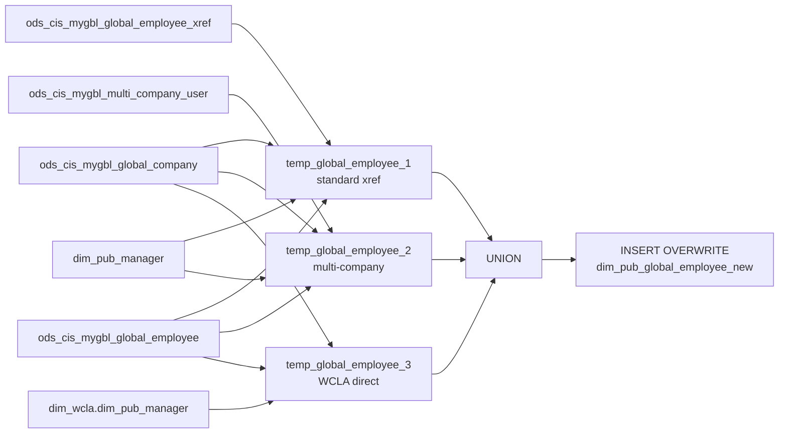

# DIM: Global Employee Dimension with Multi-Company Resolution (`dim_pub_global_employee_new`)

- artifact_type: etl_table
- artifact_id: dim_us.dim_pub_global_employee_new
- domain: common
- one_line_purpose: This job builds a global employee dimension that resolves employees across multiple companies and countries by combining three distinct sourcing strategies: standard cross-reference via the global employee xref, multi-company user assignmen...
- layer_type: DIM
- source_kind: etl_sql
- evidence_source: source/etl/sql/common/source/etl/flows/public_order_tools/ingest/public_common_dimension/script/dim_pub_global_employee_new.sql

---

## L1 Data Foundation

### Identity and physical mapping
- **Table:** `dim_us.dim_pub_global_employee_new`
- **Layer type:** DIM
- **Canonical / derived:** Derived / ETL-loaded (see L3)
- **Owner team:** not registered in metadata catalog

### Grain, scope, exclusions
- **Grain:** one row per employee per company affiliation (an employee can appear once per company they are affiliated with).
- **Scope:** See L2 business purpose / L3 filters
- **Partition:** none — full table overwrite. - resolved from pipeline (see L4)
- **Natural key:** `global_id`, `company_no`.
- **Exclusions:** Not documented in repository

#### Grain detail (preserved)

- **Grain:** one row per employee per company affiliation (an employee can appear once per company they are affiliated with).
- **Partition:** none — full table overwrite.
- **Natural key:** `global_id`, `company_no`.

---

### Cross-engine presence
| Engine | Present | Canonical FQN | Notes |
|--------|---------|---------------|-------|
| Hive | yes | `dim_pub_global_employee_new` | ETL target / intermediate per evidence script |
| Vertica | pending | `dim_pub_global_employee_new` | Confirm via hive2vertica flow evidence / MCP |

### Physical schema reference

Pointer block only - full column catalog lives in WKB L1 storage JSON.

| Field | Value |
|-------|-------|
| **Authoritative catalog** | WKB L1 storage seed (not duplicated in this file) |
| **entity_id** | `dim_us.dim_pub_global_employee_new` |
| **l1_catalog_seed** | `target/storage/wkb/snapshots/_snapshot_id_template/l1_catalog/{engine}_{schema}_{table}.json` |
| **column_count** | pending (run ddl_seed_writer) |
| **partition_keys** | `none — full table overwrite.` |
| **ddl_source** | pending Bitbucket DDL / Vertica metadata ingest |
| **retrieval** | `python -m tools.wkb.indexing.run_query --query "common dim_pub_global_employee_new schema" --intent find_table_schema` |

### Lineage
| Object | Role |
|--------|------|
| `ods_gbl.ods_cis_mygbl_global_company` | Company master |
| `ods_gbl.ods_cis_mygbl_global_employee_xref` | Standard company-employee cross-reference |
| `ods_gbl.ods_cis_mygbl_global_employee` | Employee profile |
| `ods_gbl.ods_cis_mygbl_multi_company_user` | Multi-company user assignments |
| `dim_${country_code}.dim_pub_manager` | Country manager dimension (Sources 1 & 2) |
| `dim_wcla.dim_pub_manager` | WCLA manager dimension (Source 3) |

---

### Freshness and load path
| Item | Value |
|------|-------|
| Load pattern | See L3 end-to-end / INSERT pattern in evidence script |
| Schedule | Not documented in repository |
| Parameters | `country_code` |


---

## L2 Declarative Knowledge

### Business purpose
This job builds a global employee dimension that resolves employees across multiple companies and
countries by combining three distinct sourcing strategies: standard cross-reference via the global
employee xref, multi-company user assignments, and a WCLA-specific direct join. The result is a
single comprehensive employee record per company-affiliation, enabling global workforce analytics
and cross-country compensation, management, and headcount reporting.

---

### Audience and use cases
| Audience | How they benefit |
|----------|-----------------|
| **Global HR / workforce analytics** | One table covering employees across all companies and countries, resolved to their `global_id` |
| **Finance / headcount** | `company_no`, `cis_server`, `cost_center_id` for cost allocation across entities |
| **Management reporting** | `managerid`, `jobcodeid`, `workingtitle` for org hierarchy analysis |
| **Payroll** | `salaryflag`, `pay_rate`, `agency_no` for compensation review |

---

### Identifier search profile
- Primary lookup keys: see natural key under L1 Grain.
- Use latest snapshot / active flags when documented in L3 filters.

### Time field semantics
- **date_flag / partition columns:** none — full table overwrite.
- Primary reporting filter should use the partition column(s) documented in L1; resolve values via L4.

### Metrics served
When exposing this table to the business, lead with:

1. **Employee identity:** `global_id`, `userid`, `loginid`, `company_no`, `cis_server`
2. **Employment status:** `hiredate`, `termdate`
3. **Organizational:** `managerid`, `cost_center_id`, `workingtitle`

---

### Metric serving map
N/A - not a `*_comb_mtd` / multi-period wide serving table (or map not present in legacy doc).


### Data products and column groups (preserved)

### Identifiers and relationships

- **Global identity:** `global_id`, `fusion_id`
- **CIS identity:** `userid`, `loginid`
- **Company:** `company_no`, `company_name`, `cis_server`
- **Manager:** `managerid`

### Dimension columns

- `firstname`, `lastname`, `middlename`, `legalname`, `altname`, `nickname` — Name attributes
- `workingtitle`, `jobcodeid` — Role/title
- `userloc` — Location
- `cost_center_id` — Cost center
- `salaryflag` — Whether salaried
- `emailaddress`, `primaryphone`, `mobilephone` — Contact info
- `support_company` — Support company flag

### Employment dates

- `hiredate`, `termdate`

### Payroll / project

- `pay_rate`, `agency_no`, `msa_project_id`, `shift`

### Audit

- `entry_datetime`, `entry_id`, `update_datetime`

---

### etl_metrics

#### `company_no`
- **Source:** [metric-index.md](../../source/contracts/common/metric-index.md#company_no)
- **Business definition:** Normalizes company_no to 1 when company_no equals cis_server (except for server 2203), indicating the primary company
```sql
CASE WHEN a.company_no = a.cis_server AND a.cis_server <> 2203 THEN 1 ELSE a.company_no END
```


---

## L3 Procedural Knowledge

### Query and routing rules
**Business filters:** Use partition / date keys from L1 grain for reporting scope.
**Technical predicates (load only):** See Key filters and step-by-step logic below.

### Dimension join patterns
| Dimension FQN | Join keys | Purpose | Evidence |
|---------------|-----------|---------|----------|
| See step-by-step / base tables | See L3 steps | Dimension enrichment | `source/etl/sql/common/source/etl/flows/public_order_tools/ingest/public_common_dimension/script/dim_pub_global_employee_new.sql` |

### Key filters and ETL business logic
### Step 1 — `temp_global_employee_1` (Standard xref sourcing)

**Source chain:** `ods_cis_mygbl_global_company a` INNER JOIN `ods_cis_mygbl_global_employee_xref c` ON `a.company_no = c.localCompany` INNER JOIN `ods_cis_mygbl_global_employee b` ON `b.globalemployeeid = c.globalemployeeid` INNER JOIN `dim_${country_code}.dim_pub_manager m` ON `c.globalemployeeid = m.global_id`

**Filter:**
- `b.termDate IS NULL` — Only active employees
- `c.termDate IS NULL` — Only active xref records

**Derived columns:**

| Column | Formula | Plain language |
|--------|---------|----------------|
| `global_id` | `c.globalemployeeid` | Global employee identity |
| `company_no` | `CASE WHEN a.company_no = a.cis_server AND a.cis_server <> 2203 THEN 1 ELSE a.company_no END` | Normalizes company_no to 1 when company_no equals cis_server (except for server 2203), indicating the primary company |

---

### Step 2 — `temp_global_employee_2` (Multi-company user sourcing)

**Source chain:** `ods_cis_mygbl_multi_company_user mcu` INNER JOIN `ods_cis_mygbl_global_company gc` ON `mcu.company_no = gc.company_no` LEFT JOIN `ods_cis_mygbl_global_employee b` ON `b.globalemployeeid = mcu.global_id` INNER JOIN `dim_${country_code}.dim_pub_manager m` ON `mcu.global_id = m.global_id`

**Filter:**
- `gc.activeFlag = 'Y'` — Only active companies

**Derived columns:**

| Column | Formula | Plain language |
|--------|---------|----------------|
| `company_no` | Same `CASE` as Step 1 | Company normalization |

---

#...

### Standard time-filter SQL
```sql
-- relative period filter using resolved partition value (see L4)
SELECT *
FROM dim_pub_global_employee_new
WHERE /* partition predicate */ date_flag = '${partition_value}';
```

### End-to-end flow
**Runtime parameters:** `country_code`
**Target table:** `dim_${country_code}.dim_pub_global_employee_new` — full table overwrite.

1. **`temp_global_employee_1` (standard xref):** Join `ods_cis_mygbl_global_company` → `ods_cis_mygbl_global_employee_xref` → `ods_cis_mygbl_global_employee` → `dim_pub_manager`. Keep only rows where both employee `termDate IS NULL` and xref `termDate IS NULL`.
2. **`temp_global_employee_2` (multi-company):** Join `ods_cis_mygbl_multi_company_user` → `ods_cis_mygbl_global_company` → `ods_cis_mygbl_global_employee` → `dim_pub_manager`. Keep only active companies.
3. **`temp_global_employee_3` (WCLA direct):** Join `ods_cis_mygbl_global_company` → `ods_cis_mygbl_global_employee` (on `company_no`) → `dim_wcla.dim_pub_manager`. Keep only non-terminated employees.
4. **INSERT OVERWRITE:** UNION of all three temp views into `dim_pub_global_employee_new`.



---


#### High-level stages (preserved)

| Stage | Business meaning |
|-------|-----------------|
| **Source 1 (standard xref)** | Identifies active global employees who have a `global_id` → `localCompany` cross-reference and a matching manager record in the target country; only non-terminated employees |
| **Source 2 (multi-company users)** | Identifies active employees registered as multi-company users (via `ods_cis_mygbl_multi_company_user`) who also have a manager record in the target country |
| **Source 3 (WCLA direct)** | Identifies non-terminated global employees who are directly attached to a global company record and have a matching manager in `dim_wcla.dim_pub_manager` (WCLA-specific) |
| **UNION + INSERT** | Combines all three sources and writes to `dim_pub_global_employee_new` |

**Parameters:** `country_code`

---


### Base tables register
| Object | Role in this job |
|--------|-----------------|
| `ods_gbl.ods_cis_mygbl_global_company` | Company master — provides `company_no`, `company_name`, `cis_server`; company_no normalization uses `cis_server` comparison |
| `ods_gbl.ods_cis_mygbl_global_employee_xref` | Employee-to-company cross-reference (Source 1) |
| `ods_gbl.ods_cis_mygbl_global_employee` | Global employee profile — provides all personal and payroll attributes |
| `dim_${country_code}.dim_pub_manager` | Country manager dimension — used in Sources 1 and 2 for `userid` and `loginid` lookup |
| `ods_gbl.ods_cis_mygbl_multi_company_user` | Multi-company user assignments (Source 2) |
| `dim_wcla.dim_pub_manager` | WCLA manager dimension — used in Source 3 |

**Temporary tables (inside the job only):**
`temp_global_employee_1` → `temp_global_employee_2` → `temp_global_employee_3` → UNION (final `INSERT`)

---

### Step-by-step logic
### Step 1 — `temp_global_employee_1` (Standard xref sourcing)

**Source chain:** `ods_cis_mygbl_global_company a` INNER JOIN `ods_cis_mygbl_global_employee_xref c` ON `a.company_no = c.localCompany` INNER JOIN `ods_cis_mygbl_global_employee b` ON `b.globalemployeeid = c.globalemployeeid` INNER JOIN `dim_${country_code}.dim_pub_manager m` ON `c.globalemployeeid = m.global_id`

**Filter:**
- `b.termDate IS NULL` — Only active employees
- `c.termDate IS NULL` — Only active xref records

**Derived columns:**

| Column | Formula | Plain language |
|--------|---------|----------------|
| `global_id` | `c.globalemployeeid` | Global employee identity |
| `company_no` | `CASE WHEN a.company_no = a.cis_server AND a.cis_server <> 2203 THEN 1 ELSE a.company_no END` | Normalizes company_no to 1 when company_no equals cis_server (except for server 2203), indicating the primary company |

---

### Step 2 — `temp_global_employee_2` (Multi-company user sourcing)

**Source chain:** `ods_cis_mygbl_multi_company_user mcu` INNER JOIN `ods_cis_mygbl_global_company gc` ON `mcu.company_no = gc.company_no` LEFT JOIN `ods_cis_mygbl_global_employee b` ON `b.globalemployeeid = mcu.global_id` INNER JOIN `dim_${country_code}.dim_pub_manager m` ON `mcu.global_id = m.global_id`

**Filter:**
- `gc.activeFlag = 'Y'` — Only active companies

**Derived columns:**

| Column | Formula | Plain language |
|--------|---------|----------------|
| `company_no` | Same `CASE` as Step 1 | Company normalization |

---

### Step 3 — `temp_global_employee_3` (WCLA direct sourcing)

**Source chain:** `ods_cis_mygbl_global_company a` INNER JOIN `ods_cis_mygbl_global_employee b` ON `b.company_no = a.company_no` INNER JOIN `dim_wcla.dim_pub_manager m` ON `b.globalEmployeeId = m.global_id`

**Filter:**
- `b.termDate IS NULL` — Only active employees

**Note:** This source uses `dim_wcla.dim_pub_manager` (hard-coded, not parameterized), making this source WCLA-specific.

---

### Step 4 — Final `INSERT OVERWRITE` into `dim_pub_global_employee_new`

**From:** UNION of `temp_global_employee_1`, `temp_global_employee_2`, `temp_global_employee_3`

**Columns written** (same set from all three sources):
`global_id`, `company_no`, `company_name`, `loginid`, `cis_server`, `userid`, `firstname`,
`lastname`, `middlename`, `workingtitle`, `jobcodeid`, `hiredate`, `termdate`, `managerid`,
`cost_center_id`, `userloc`, `primaryphone`, `mobilephone`, `legalname`, `altname`, `nickname`,
`salaryflag`, `emailaddress`, `entry_datetime`, `entry_id`, `update_datetime`, `agency_no`,
`fusion_id`, `pay_rate`, `msa_project_id`, `shift`, `support_company`

---

### Relationship map (embedded)

| from_fqn | to_fqn | cardinality | join_keys | provenance |
|----------|--------|-------------|-----------|------------|
| `ods_gbl.ods_cis_mygbl_global_company` | `ods_gbl.ods_cis_mygbl_global_employee_xref` | many:1 | `a.company_no` = `c.localCompany` | etl_sql (`source/etl/sql/common/public_order_scripts/public_common_dimension/script/dim_pub_global_employee_new.sql:41`) |
| `ods_gbl.ods_cis_mygbl_global_employee_xref` | `ods_gbl.ods_cis_mygbl_global_employee` | many:1 | `b.globalemployeeid` = `c.globalemployeeid` | etl_sql (`source/etl/sql/common/public_order_scripts/public_common_dimension/script/dim_pub_global_employee_new.sql:42`) |
| `ods_gbl.ods_cis_mygbl_global_employee_xref` | `dim_${country_code}.dim_pub_manager` | many:1 | `c.globalemployeeid` = `m.global_id` | etl_sql (`source/etl/sql/common/public_order_scripts/public_common_dimension/script/dim_pub_global_employee_new.sql:43`) |
| `ods_gbl.ods_cis_mygbl_multi_company_user` | `ods_gbl.ods_cis_mygbl_global_company` | many:1 | `mcu.company_no` = `gc.company_no` | etl_sql (`source/etl/sql/common/public_order_scripts/public_common_dimension/script/dim_pub_global_employee_new.sql:87`) |
| `ods_gbl.ods_cis_mygbl_multi_company_user` | `ods_gbl.ods_cis_mygbl_global_employee` | many:1 (LEFT) | `b.globalemployeeid` = `mcu.global_id` | etl_sql (`source/etl/sql/common/public_order_scripts/public_common_dimension/script/dim_pub_global_employee_new.sql:88`) |
| `ods_gbl.ods_cis_mygbl_multi_company_user` | `dim_${country_code}.dim_pub_manager` | many:1 | `mcu.global_id` = `m.global_id` | etl_sql (`source/etl/sql/common/public_order_scripts/public_common_dimension/script/dim_pub_global_employee_new.sql:89`) |
| `ods_gbl.ods_cis_mygbl_global_company` | `ods_gbl.ods_cis_mygbl_global_employee` | many:1 | `b.company_no` = `a.company_no` | etl_sql (`source/etl/sql/common/public_order_scripts/public_common_dimension/script/dim_pub_global_employee_new.sql:134`) |
| `ods_gbl.ods_cis_mygbl_global_employee` | `dim_wcla.dim_pub_manager` | many:1 | `b.globalEmployeeId` = `m.global_id` | etl_sql (`source/etl/sql/common/public_order_scripts/public_common_dimension/script/dim_pub_global_employee_new.sql:136`) |

### Special logic (embedded)

Not documented in repository

### Column / field derivations (from ETL SQL)

| target_column | expression_sql | upstream_columns | upstream_tables | transform_kind | evidence |
|---------------|----------------|------------------|-----------------|----------------|----------|
| `global_id` | `global_id` | `global_id` | `temp_global_employee_1`, `temp_global_employee_2`, `temp_global_employee_3` | passthrough | `source/etl/sql/common/public_order_scripts/public_common_dimension/script/dim_pub_global_employee_new.sql:4` |
| `company_no` | `company_no` | `company_no` | `temp_global_employee_1`, `temp_global_employee_2`, `temp_global_employee_3` | passthrough | `source/etl/sql/common/public_order_scripts/public_common_dimension/script/dim_pub_global_employee_new.sql:6` |
| `company_name` | `company_name` | `company_name` | `temp_global_employee_1`, `temp_global_employee_2`, `temp_global_employee_3` | passthrough | `source/etl/sql/common/public_order_scripts/public_common_dimension/script/dim_pub_global_employee_new.sql:10` |
| `loginid` | `loginid` | `loginid` | `temp_global_employee_1`, `temp_global_employee_2`, `temp_global_employee_3` | passthrough | `source/etl/sql/common/public_order_scripts/public_common_dimension/script/dim_pub_global_employee_new.sql:11` |
| `cis_server` | `cis_server` | `cis_server` | `temp_global_employee_1`, `temp_global_employee_2`, `temp_global_employee_3` | passthrough | `source/etl/sql/common/public_order_scripts/public_common_dimension/script/dim_pub_global_employee_new.sql:6` |
| `userid` | `userid` | `userid` | `temp_global_employee_1`, `temp_global_employee_2`, `temp_global_employee_3` | passthrough | `source/etl/sql/common/public_order_scripts/public_common_dimension/script/dim_pub_global_employee_new.sql:13` |
| `firstname` | `firstname` | `firstname` | `temp_global_employee_1`, `temp_global_employee_2`, `temp_global_employee_3` | passthrough | `source/etl/sql/common/public_order_scripts/public_common_dimension/script/dim_pub_global_employee_new.sql:14` |
| `lastname` | `lastname` | `lastname` | `temp_global_employee_1`, `temp_global_employee_2`, `temp_global_employee_3` | passthrough | `source/etl/sql/common/public_order_scripts/public_common_dimension/script/dim_pub_global_employee_new.sql:15` |
| `middlename` | `middlename` | `middlename` | `temp_global_employee_1`, `temp_global_employee_2`, `temp_global_employee_3` | passthrough | `source/etl/sql/common/public_order_scripts/public_common_dimension/script/dim_pub_global_employee_new.sql:16` |
| `workingtitle` | `workingtitle` | `workingtitle` | `temp_global_employee_1`, `temp_global_employee_2`, `temp_global_employee_3` | passthrough | `source/etl/sql/common/public_order_scripts/public_common_dimension/script/dim_pub_global_employee_new.sql:17` |
| `jobcodeid` | `jobcodeid` | `jobcodeid` | `temp_global_employee_1`, `temp_global_employee_2`, `temp_global_employee_3` | passthrough | `source/etl/sql/common/public_order_scripts/public_common_dimension/script/dim_pub_global_employee_new.sql:18` |
| `hiredate` | `hiredate` | `hiredate` | `temp_global_employee_1`, `temp_global_employee_2`, `temp_global_employee_3` | passthrough | `source/etl/sql/common/public_order_scripts/public_common_dimension/script/dim_pub_global_employee_new.sql:19` |
| `termdate` | `termdate` | `termdate` | `temp_global_employee_1`, `temp_global_employee_2`, `temp_global_employee_3` | passthrough | `source/etl/sql/common/public_order_scripts/public_common_dimension/script/dim_pub_global_employee_new.sql:20` |
| `managerid` | `managerid` | `managerid` | `temp_global_employee_1`, `temp_global_employee_2`, `temp_global_employee_3` | passthrough | `source/etl/sql/common/public_order_scripts/public_common_dimension/script/dim_pub_global_employee_new.sql:21` |
| `cost_center_id` | `cost_center_id` | `cost_center_id` | `temp_global_employee_1`, `temp_global_employee_2`, `temp_global_employee_3` | passthrough | `source/etl/sql/common/public_order_scripts/public_common_dimension/script/dim_pub_global_employee_new.sql:22` |
| `userloc` | `userloc` | `userloc` | `temp_global_employee_1`, `temp_global_employee_2`, `temp_global_employee_3` | passthrough | `source/etl/sql/common/public_order_scripts/public_common_dimension/script/dim_pub_global_employee_new.sql:23` |
| `primaryphone` | `primaryphone` | `primaryphone` | `temp_global_employee_1`, `temp_global_employee_2`, `temp_global_employee_3` | passthrough | `source/etl/sql/common/public_order_scripts/public_common_dimension/script/dim_pub_global_employee_new.sql:24` |
| `mobilephone` | `mobilephone` | `mobilephone` | `temp_global_employee_1`, `temp_global_employee_2`, `temp_global_employee_3` | passthrough | `source/etl/sql/common/public_order_scripts/public_common_dimension/script/dim_pub_global_employee_new.sql:25` |
| `legalname` | `legalname` | `legalname` | `temp_global_employee_1`, `temp_global_employee_2`, `temp_global_employee_3` | passthrough | `source/etl/sql/common/public_order_scripts/public_common_dimension/script/dim_pub_global_employee_new.sql:26` |
| `altname` | `altname` | `altname` | `temp_global_employee_1`, `temp_global_employee_2`, `temp_global_employee_3` | passthrough | `source/etl/sql/common/public_order_scripts/public_common_dimension/script/dim_pub_global_employee_new.sql:27` |
| `nickname` | `nickname` | `nickname` | `temp_global_employee_1`, `temp_global_employee_2`, `temp_global_employee_3` | passthrough | `source/etl/sql/common/public_order_scripts/public_common_dimension/script/dim_pub_global_employee_new.sql:28` |
| `salaryflag` | `salaryflag` | `salaryflag` | `temp_global_employee_1`, `temp_global_employee_2`, `temp_global_employee_3` | passthrough | `source/etl/sql/common/public_order_scripts/public_common_dimension/script/dim_pub_global_employee_new.sql:29` |
| `emailaddress` | `emailaddress` | `emailaddress` | `temp_global_employee_1`, `temp_global_employee_2`, `temp_global_employee_3` | passthrough | `source/etl/sql/common/public_order_scripts/public_common_dimension/script/dim_pub_global_employee_new.sql:30` |
| `entry_datetime` | `entry_datetime` | `entry_datetime` | `temp_global_employee_1`, `temp_global_employee_2`, `temp_global_employee_3` | passthrough | `source/etl/sql/common/public_order_scripts/public_common_dimension/script/dim_pub_global_employee_new.sql:31` |
| `entry_id` | `entry_id` | `entry_id` | `temp_global_employee_1`, `temp_global_employee_2`, `temp_global_employee_3` | passthrough | `source/etl/sql/common/public_order_scripts/public_common_dimension/script/dim_pub_global_employee_new.sql:32` |
| `update_datetime` | `update_datetime` | `update_datetime` | `temp_global_employee_1`, `temp_global_employee_2`, `temp_global_employee_3` | passthrough | `source/etl/sql/common/public_order_scripts/public_common_dimension/script/dim_pub_global_employee_new.sql:33` |
| `agency_no` | `agency_no` | `agency_no` | `temp_global_employee_1`, `temp_global_employee_2`, `temp_global_employee_3` | passthrough | `source/etl/sql/common/public_order_scripts/public_common_dimension/script/dim_pub_global_employee_new.sql:34` |
| `fusion_id` | `fusion_id` | `fusion_id` | `temp_global_employee_1`, `temp_global_employee_2`, `temp_global_employee_3` | passthrough | `source/etl/sql/common/public_order_scripts/public_common_dimension/script/dim_pub_global_employee_new.sql:35` |
| `pay_rate` | `pay_rate` | `pay_rate` | `temp_global_employee_1`, `temp_global_employee_2`, `temp_global_employee_3` | passthrough | `source/etl/sql/common/public_order_scripts/public_common_dimension/script/dim_pub_global_employee_new.sql:36` |
| `msa_project_id` | `msa_project_id` | `msa_project_id` | `temp_global_employee_1`, `temp_global_employee_2`, `temp_global_employee_3` | passthrough | `source/etl/sql/common/public_order_scripts/public_common_dimension/script/dim_pub_global_employee_new.sql:37` |
| `shift` | `shift` | `shift` | `temp_global_employee_1`, `temp_global_employee_2`, `temp_global_employee_3` | passthrough | `source/etl/sql/common/public_order_scripts/public_common_dimension/script/dim_pub_global_employee_new.sql:38` |
| `support_company` | `support_company` | `support_company` | `temp_global_employee_1`, `temp_global_employee_2`, `temp_global_employee_3` | passthrough | `source/etl/sql/common/public_order_scripts/public_common_dimension/script/dim_pub_global_employee_new.sql:39` |

### Sentinel and code values
| Value | Meaning |
|-------|---------|
| `cis_server = 2203` | Special-case CIS server excluded from the `company_no = 1` normalization rule |
| `activeFlag = 'Y'` | Company is active in the global company master |
| `active_flag = 'Y'` (xref) | Employee xref is currently valid |

---

---

## L4 Validation

### Resolved partition value
| Step | Source | How partition / date scope is determined |
|------|--------|------------------------------------------|
| 1 | evidence script / flow | See parameters in L1 Freshness and L3 filters - `source/etl/sql/common/source/etl/flows/public_order_tools/ingest/public_common_dimension/script/dim_pub_global_employee_new.sql` |

**Plain language:** Partition and date scope follow Azkaban/bootstrap parameters documented in the source script and orchestrating flow; do not hardcode calendar literals.

### Data quality checks
- Prefer row-count-by-partition, metric sums, and grain duplicate checks (see Validation SQL).
- Additional checks from legacy caveats / operational notes when present.

### Validation SQL
```sql
-- 1) Row count by partition
SELECT ${partition_col}, COUNT(*) AS row_cnt
FROM dim_wcla.dim_pub_manager
WHERE ${partition_col} = '${partition_value}'
GROUP BY ${partition_col};

-- 2) Metric sum by business dimension (top deltas)
SELECT ${dim_key}, SUM(${metric}) AS metric_sum
FROM dim_wcla.dim_pub_manager
WHERE ${partition_col} = '${partition_value}'
GROUP BY ${dim_key}
ORDER BY ABS(SUM(${metric})) DESC
LIMIT 20;

-- 3) Grain duplicate check
SELECT ${grain_key_1}, ${grain_key_2}, ${grain_key_3}, ${partition_col}, COUNT(*) AS cnt
FROM dim_wcla.dim_pub_manager
WHERE ${partition_col} = '${partition_value}'
GROUP BY ${grain_key_1}, ${grain_key_2}, ${grain_key_3}, ${partition_col}
HAVING COUNT(*) > 1;
```

Replace placeholders from this file's Grain and keys / Data you can fetch sections, and use the resolved partition value from run scope.

### Caveats for interpretation
- **Three sourcing strategies:** An employee may appear in multiple sources (e.g., they have an xref AND a multi-company assignment). The UNION (not UNION ALL) deduplicates exact duplicate rows, but the same `global_id` can still appear multiple times with different `company_no` values.
- **WCLA hard-coded in Source 3:** `dim_wcla.dim_pub_manager` is referenced directly regardless of `country_code`; this source always reads WCLA manager data.
- **`company_no` normalization:** The `CASE WHEN company_no = cis_server AND cis_server <> 2203 THEN 1` rule normalizes "same-company" entries to company_no=1 for the primary entity.
- **Upstream dependency on `dim_pub_manager`:** This job must run after `dim_pub_manager` is refreshed.
- **No filtering on `termdate` in Source 2:** Multi-company user records may include terminated employees if `gc.activeFlag = 'Y'` but the employee's `termdate` is set.

---

### Conflicts and open questions
- Schedule, owner, SLA: Not documented in repository (unless preserved schedule evidence above).
- Vertica MCP verification: pending unless confirmed in L5.


---

## L5 Runtime View

### Query path and engine preference
| Role | Hive object | Vertica object | Sync mode | Evidence | MCP verified |
|------|-------------|----------------|-----------|----------|--------------|
| **Query for reporting** | *See script lineage* | `dim_wcla.dim_pub_manager` | *Verify from flow* | *Add flow file:line* | pending |
| **Hive alternative** | `*` | `dim_wcla.dim_pub_manager` | - | *See dependencies* | - |
| **ETL internal** | staging/temp tables | *Not synced to Vertica* | - | *See step-by-step logic* | - |

Business users should query `dim_wcla.dim_pub_manager` in Vertica once MCP verification is completed for this document.

### Access constraints
- Country / company schema parameters may apply (`literal_country`, `company_no`, etc.).
- Hive-only staging objects are not reporting surfaces unless synced.

### Query risk profile
| Field | Value |
|-------|-------|
| requires_date_predicate | unknown |
| scan_risk_tier | medium |

---

## L6 Access and Consumption

### Primary consumers and use cases
| Audience | How they benefit |
|----------|-----------------|
| **Global HR / workforce analytics** | One table covering employees across all companies and countries, resolved to their `global_id` |
| **Finance / headcount** | `company_no`, `cis_server`, `cost_center_id` for cost allocation across entities |
| **Management reporting** | `managerid`, `jobcodeid`, `workingtitle` for org hierarchy analysis |
| **Payroll** | `salaryflag`, `pay_rate`, `agency_no` for compensation review |

---

### Representative query patterns
```sql
-- certified / illustrative lookup - replace predicates from L1/L4
SELECT *
FROM dim_pub_global_employee_new
WHERE date_flag = '${partition_value}'
LIMIT 100;
```

### Dependencies and notes
### Upstream objects (verified)

| Object | Usage | Evidence |
|--------|-------|----------|
| `ods_gbl.ods_cis_mygbl_global_company` | `company_no`, `company_name`, `cis_server`, `activeFlag` | `source/etl/sql/common/source/etl/flows/public_order_tools/ingest/public_common_dimension/script/dim_pub_global_employee_new.sql:40,86,133` |
| `ods_gbl.ods_cis_mygbl_global_employee_xref` | `globalemployeeid`, `localCompany`, `termDate` | `source/etl/sql/common/source/etl/flows/public_order_tools/ingest/public_common_dimension/script/dim_pub_global_employee_new.sql:41` |
| `ods_gbl.ods_cis_mygbl_global_employee` | All personal/payroll attributes | `source/etl/sql/common/source/etl/flows/public_order_tools/ingest/public_common_dimension/script/dim_pub_global_employee_new.sql:42,87,134` |
| `dim_${country_code}.dim_pub_manager` | `userid`, `loginid`, `support_company` via `global_id` | `source/etl/sql/common/source/etl/flows/public_order_tools/ingest/public_common_dimension/script/dim_pub_global_employee_new.sql:43,89` |
| `ods_gbl.ods_cis_mygbl_multi_company_user` | Multi-company assignments | `source/etl/sql/common/source/etl/flows/public_order_tools/ingest/public_common_dimension/script/dim_pub_global_employee_new.sql:86` |
| `dim_wcla.dim_pub_manager` | WCLA manager records (Source 3) | `source/etl/sql/common/source/etl/flows/public_order_tools/ingest/public_common_dimension/script/dim_pub_global_employee_new.sql:137` |

### Downstream consumers (verified)

None identified in repository.

### Operational detail (verified)

- Full table overwrite: `source/etl/sql/common/source/etl/flows/public_order_tools/ingest/public_common_dimension/script/dim_pub_global_employee_new.sql:141`
- Must run after `dim_pub_manager`: `source/etl/sql/common/source/etl/flows/public_order_tools/ingest/public_common_dimension/script/dim_pub_global_employee_new.sql:43`

### Not documented in repository

- Schedule, owner, SLA — not in scripts or configs

### Related scripts (verified)

- `dim_pub_manager.sql` — Upstream dependency for `dim_pub_manager` — `source/etl/sql/common/source/etl/flows/public_order_tools/ingest/public_common_dimension/script/`

---

*Document generated from `source/etl/sql/common/source/etl/flows/public_order_tools/ingest/public_common_dimension/script/dim_pub_global_employee_new.sql`.*

#### Not documented in repository
- Owner, SLA (unless schedule evidence preserved above)
- Any dependency without `file:line` evidence in this document

---

*Document migrated to L1-L6 from legacy Knowledgebase content. Evidence: `source/etl/sql/common/source/etl/flows/public_order_tools/ingest/public_common_dimension/script/dim_pub_global_employee_new.sql`.*
