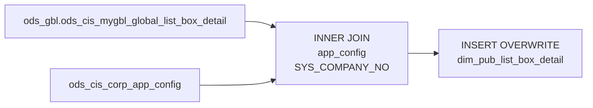

# DIM: Country-Scoped List Box Detail (`dim_pub_list_box_detail`)

- artifact_type: etl_table
- artifact_id: dim_us.dim_pub_list_box_detail
- domain: common
- one_line_purpose: This job loads the CIS list-box code master for a specific country by joining the global list-box detail table against the country's system configuration to identify the correct CIS server, then filtering to only the list-box records that b...
- layer_type: DIM
- source_kind: etl_sql
- evidence_source: source/etl/sql/common/source/etl/flows/public_order_tools/ingest/public_common_dimension/script/dim_pub_list_box_detail.sql

---

## L1 Data Foundation

### Identity and physical mapping
- **Table:** `dim_us.dim_pub_list_box_detail`
- **Layer type:** DIM
- **Canonical / derived:** Derived / ETL-loaded (see L3)
- **Owner team:** not registered in metadata catalog

### Grain, scope, exclusions
- **Grain:** one row per list-box entry per CIS server.
- **Scope:** See L2 business purpose / L3 filters
- **Partition:** none — full table overwrite. - resolved from pipeline (see L4)
- **Natural key:** `cisserver`, `list_box_code`, `code_value`.
- **Exclusions:** Not documented in repository

#### Grain detail (preserved)

- **Grain:** one row per list-box entry per CIS server.
- **Partition:** none — full table overwrite.
- **Natural key:** `cisserver`, `list_box_code`, `code_value`.

---

### Cross-engine presence
| Engine | Present | Canonical FQN | Notes |
|--------|---------|---------------|-------|
| Hive | yes | `dim_pub_list_box_detail` | ETL target / intermediate per evidence script |
| Vertica | pending | `dim_pub_list_box_detail` | Confirm via hive2vertica flow evidence / MCP |

### Physical schema reference

Pointer block only - full column catalog lives in WKB L1 storage JSON.

| Field | Value |
|-------|-------|
| **Authoritative catalog** | WKB L1 storage seed (not duplicated in this file) |
| **entity_id** | `dim_us.dim_pub_list_box_detail` |
| **l1_catalog_seed** | `target/storage/wkb/snapshots/_snapshot_id_template/l1_catalog/{engine}_{schema}_{table}.json` |
| **column_count** | pending (run ddl_seed_writer) |
| **partition_keys** | `none — full table overwrite.` |
| **ddl_source** | pending Bitbucket DDL / Vertica metadata ingest |
| **retrieval** | `python -m tools.wkb.indexing.run_query --query "common dim_pub_list_box_detail schema" --intent find_table_schema` |

### Lineage
| Object | Role |
|--------|------|
| `ods_gbl.ods_cis_mygbl_global_list_box_detail` | Primary source |
| `ods_${country_code}.ods_cis_corp_app_config` | CIS server identification (parameter lookup) |

---

### Freshness and load path
| Item | Value |
|------|-------|
| Load pattern | See L3 end-to-end / INSERT pattern in evidence script |
| Schedule | Not documented in repository |
| Parameters | `country_code` |


---

## L2 Declarative Knowledge

### Business purpose
This job loads the CIS list-box code master for a specific country by joining the global list-box
detail table against the country's system configuration to identify the correct CIS server, then
filtering to only the list-box records that belong to that server. List-box codes are the
application-level enumeration tables used throughout CIS for dropdown values, status codes, and
configurable labels.

---

### Audience and use cases
| Audience | How they benefit |
|----------|-----------------|
| **Application / BI** | Resolve numeric `code_value` fields on fact tables to human-readable `code_desc` labels |
| **Reporting** | Filter and group by configurable code families (e.g., order status, reason codes) via `list_box_code` |
| **Data stewards** | Monitor active vs. deleted codes via `activeflag`, `delete_datetime` |

---

### Identifier search profile
- Primary lookup keys: see natural key under L1 Grain.
- Use latest snapshot / active flags when documented in L3 filters.

### Time field semantics
- **date_flag / partition columns:** none — full table overwrite.
- Primary reporting filter should use the partition column(s) documented in L1; resolve values via L4.

### Metrics served
When exposing this table to the business, lead with:

1. **Code resolution:** `list_box_code`, `code_value`, `code_desc`
2. **Validity:** `activeflag`, `delete_datetime`

---

### Metric serving map
N/A - not a `*_comb_mtd` / multi-period wide serving table (or map not present in legacy doc).


### Data products and column groups (preserved)

### Identifiers and relationships

- **Code:** `cisserver`, `list_box_code`, `code_value`

### Dimension columns

- `code_desc` — Human-readable label for the code value
- `activeflag` — Whether the code is active
- `sequence` — Display order within the list box
- `key1`, `ref1`, `ref2` — Auxiliary reference keys
- `entry_datetime`, `entry_id`, `delete_datetime`, `delete_id`, `update_datetime` — Audit fields
- `h_version` — History version
- `purgeflag` — Whether the record is marked for purge
- `schedule_date` — Scheduled date (code-family specific)

---

### etl_metrics

N/A - no calculable ETL formulas extracted from this document (passthrough / stored measures only, or formulas not documented).

---

## L3 Procedural Knowledge

### Query and routing rules
**Business filters:** Use partition / date keys from L1 grain for reporting scope.
**Technical predicates (load only):** See Key filters and step-by-step logic below.

### Dimension join patterns
| Dimension FQN | Join keys | Purpose | Evidence |
|---------------|-----------|---------|----------|
| See step-by-step / base tables | See L3 steps | Dimension enrichment | `source/etl/sql/common/source/etl/flows/public_order_tools/ingest/public_common_dimension/script/dim_pub_list_box_detail.sql` |

### Key filters and ETL business logic
### Step 1 — Final `INSERT OVERWRITE` into `dim_pub_list_box_detail`

**From:** `ods_gbl.ods_cis_mygbl_global_list_box_detail lbd`

**Join:**

| Join | Keys | Purpose |
|------|------|---------|
| `ods_${country_code}.ods_cis_corp_app_config app` (INNER) | `app.config_name='SYS_COMPANY_NO'` AND `lbd.cisserver=app.config_value` | Filter to list-box entries for the target country's CIS server |

**Pass-through columns from `lbd`:**
`cisserver`, `list_box_code`, `code_value`, `code_desc`, `activeflag`, `sequence`, `key1`,
`ref1`, `ref2`, `entry_datetime`, `entry_id`, `delete_datetime`, `delete_id`, `update_datetime`,
`h_version`, `purgeflag`, `schedule_date`

---

### Standard time-filter SQL
```sql
-- relative period filter using resolved partition value (see L4)
SELECT *
FROM dim_pub_list_box_detail
WHERE /* partition predicate */ date_flag = '${partition_value}';
```

### End-to-end flow
**Runtime parameters:** `country_code`
**Target table:** `dim_${country_code}.dim_pub_list_box_detail` — full table overwrite.

1. Read `ods_gbl.ods_cis_mygbl_global_list_box_detail` joined to
   `ods_${country_code}.ods_cis_corp_app_config` on `config_name='SYS_COMPANY_NO'` and
   `lbd.cisserver = app.config_value`.
2. **INSERT OVERWRITE** all columns from the matched list-box rows.



---


#### High-level stages (preserved)

| Stage | Business meaning |
|-------|-----------------|
| **Server identification** | Joins `ods_cis_corp_app_config` (filtered to `config_name = 'SYS_COMPANY_NO'`) to determine the CIS server for the target country |
| **Country filter** | Keeps only global list-box detail rows where `cisserver` matches the country's configured CIS server |
| **INSERT OVERWRITE** | Writes the filtered set to `dim_pub_list_box_detail` |

**Parameters:** `country_code`

---


### Base tables register
| Object | Role in this job |
|--------|-----------------|
| `ods_gbl.ods_cis_mygbl_global_list_box_detail` | Primary source — all global list-box codes |
| `ods_${country_code}.ods_cis_corp_app_config` | Parameter lookup — identifies the country's CIS server via `SYS_COMPANY_NO` |

**Temporary tables (inside the job only):**
None — single join INSERT.

---

### Step-by-step logic
### Step 1 — Final `INSERT OVERWRITE` into `dim_pub_list_box_detail`

**From:** `ods_gbl.ods_cis_mygbl_global_list_box_detail lbd`

**Join:**

| Join | Keys | Purpose |
|------|------|---------|
| `ods_${country_code}.ods_cis_corp_app_config app` (INNER) | `app.config_name='SYS_COMPANY_NO'` AND `lbd.cisserver=app.config_value` | Filter to list-box entries for the target country's CIS server |

**Pass-through columns from `lbd`:**
`cisserver`, `list_box_code`, `code_value`, `code_desc`, `activeflag`, `sequence`, `key1`,
`ref1`, `ref2`, `entry_datetime`, `entry_id`, `delete_datetime`, `delete_id`, `update_datetime`,
`h_version`, `purgeflag`, `schedule_date`

---

### Relationship map (embedded)

| from_fqn | to_fqn | cardinality | join_keys | provenance |
|----------|--------|-------------|-----------|------------|
| `ods_gbl.ods_cis_mygbl_global_list_box_detail` | `ods_${country_code}.ods_cis_corp_app_config` | many:1 | `lbd.cisserver` = `app.config_value`; `lbd.cisserver` = `app.config_value` | etl_sql (`source/etl/sql/common/public_order_scripts/public_common_dimension/script/dim_pub_list_box_detail.sql:21`) |


### Special logic (embedded)

Not documented in repository

### Column / field derivations (from ETL SQL)

| target_column | expression_sql | upstream_columns | upstream_tables | transform_kind | evidence |
|---------------|----------------|------------------|-----------------|----------------|----------|
| `cisserver` | `lbd.cisserver` | `cisserver` | `ods_gbl.ods_cis_mygbl_global_list_box_detail` | passthrough | `source/etl/sql/common/public_order_scripts/public_common_dimension/script/ods_gbl/dim_pub_list_box_detail.sql:3` |
| `list_box_code` | `lbd.list_box_code` | `list_box_code` | `ods_gbl.ods_cis_mygbl_global_list_box_detail` | passthrough | `source/etl/sql/common/public_order_scripts/public_common_dimension/script/ods_gbl/dim_pub_list_box_detail.sql:4` |
| `code_value` | `lbd.code_value` | `code_value` | `ods_gbl.ods_cis_mygbl_global_list_box_detail` | passthrough | `source/etl/sql/common/public_order_scripts/public_common_dimension/script/ods_gbl/dim_pub_list_box_detail.sql:5` |
| `code_desc` | `lbd.code_desc` | `code_desc` | `ods_gbl.ods_cis_mygbl_global_list_box_detail` | passthrough | `source/etl/sql/common/public_order_scripts/public_common_dimension/script/ods_gbl/dim_pub_list_box_detail.sql:6` |
| `activeflag` | `lbd.activeflag` | `activeflag` | `ods_gbl.ods_cis_mygbl_global_list_box_detail` | passthrough | `source/etl/sql/common/public_order_scripts/public_common_dimension/script/ods_gbl/dim_pub_list_box_detail.sql:7` |
| `sequence` | `lbd.sequence` | `sequence` | `ods_gbl.ods_cis_mygbl_global_list_box_detail` | passthrough | `source/etl/sql/common/public_order_scripts/public_common_dimension/script/ods_gbl/dim_pub_list_box_detail.sql:8` |
| `key1` | `lbd.key1` | `key1` | `ods_gbl.ods_cis_mygbl_global_list_box_detail` | passthrough | `source/etl/sql/common/public_order_scripts/public_common_dimension/script/ods_gbl/dim_pub_list_box_detail.sql:9` |
| `ref1` | `lbd.ref1` | `ref1` | `ods_gbl.ods_cis_mygbl_global_list_box_detail` | passthrough | `source/etl/sql/common/public_order_scripts/public_common_dimension/script/ods_gbl/dim_pub_list_box_detail.sql:10` |
| `ref2` | `lbd.ref2` | `ref2` | `ods_gbl.ods_cis_mygbl_global_list_box_detail` | passthrough | `source/etl/sql/common/public_order_scripts/public_common_dimension/script/ods_gbl/dim_pub_list_box_detail.sql:11` |
| `entry_datetime` | `lbd.entry_datetime` | `entry_datetime` | `ods_gbl.ods_cis_mygbl_global_list_box_detail` | passthrough | `source/etl/sql/common/public_order_scripts/public_common_dimension/script/ods_gbl/dim_pub_list_box_detail.sql:12` |
| `entry_id` | `lbd.entry_id` | `entry_id` | `ods_gbl.ods_cis_mygbl_global_list_box_detail` | passthrough | `source/etl/sql/common/public_order_scripts/public_common_dimension/script/ods_gbl/dim_pub_list_box_detail.sql:13` |
| `delete_datetime` | `lbd.delete_datetime` | `delete_datetime` | `ods_gbl.ods_cis_mygbl_global_list_box_detail` | passthrough | `source/etl/sql/common/public_order_scripts/public_common_dimension/script/ods_gbl/dim_pub_list_box_detail.sql:14` |
| `delete_id` | `lbd.delete_id` | `delete_id` | `ods_gbl.ods_cis_mygbl_global_list_box_detail` | passthrough | `source/etl/sql/common/public_order_scripts/public_common_dimension/script/ods_gbl/dim_pub_list_box_detail.sql:15` |
| `update_datetime` | `lbd.update_datetime` | `update_datetime` | `ods_gbl.ods_cis_mygbl_global_list_box_detail` | passthrough | `source/etl/sql/common/public_order_scripts/public_common_dimension/script/ods_gbl/dim_pub_list_box_detail.sql:16` |
| `h_version` | `lbd.h_version` | `h_version` | `ods_gbl.ods_cis_mygbl_global_list_box_detail` | passthrough | `source/etl/sql/common/public_order_scripts/public_common_dimension/script/ods_gbl/dim_pub_list_box_detail.sql:17` |
| `purgeflag` | `lbd.purgeflag` | `purgeflag` | `ods_gbl.ods_cis_mygbl_global_list_box_detail` | passthrough | `source/etl/sql/common/public_order_scripts/public_common_dimension/script/ods_gbl/dim_pub_list_box_detail.sql:18` |
| `schedule_date` | `lbd.schedule_date` | `schedule_date` | `ods_gbl.ods_cis_mygbl_global_list_box_detail` | passthrough | `source/etl/sql/common/public_order_scripts/public_common_dimension/script/ods_gbl/dim_pub_list_box_detail.sql:19` |

### Sentinel and code values
| Value | Meaning |
|-------|---------|
| `activeflag` | Code is active and usable in the application |
| `purgeflag` | Code is marked for deletion/purge |

---

---

## L4 Validation

### Resolved partition value
| Step | Source | How partition / date scope is determined |
|------|--------|------------------------------------------|
| 1 | evidence script / flow | See parameters in L1 Freshness and L3 filters - `source/etl/sql/common/source/etl/flows/public_order_tools/ingest/public_common_dimension/script/dim_pub_list_box_detail.sql` |

**Plain language:** Partition and date scope follow Azkaban/bootstrap parameters documented in the source script and orchestrating flow; do not hardcode calendar literals.

### Data quality checks
- Prefer row-count-by-partition, metric sums, and grain duplicate checks (see Validation SQL).
- Additional checks from legacy caveats / operational notes when present.

### Validation SQL
```sql
-- 1) Row count by partition
SELECT ${partition_col}, COUNT(*) AS row_cnt
FROM dim_${country_code}.dim_pub_list_box_detail
WHERE ${partition_col} = '${partition_value}'
GROUP BY ${partition_col};

-- 2) Metric sum by business dimension (top deltas)
SELECT ${dim_key}, SUM(${metric}) AS metric_sum
FROM dim_${country_code}.dim_pub_list_box_detail
WHERE ${partition_col} = '${partition_value}'
GROUP BY ${dim_key}
ORDER BY ABS(SUM(${metric})) DESC
LIMIT 20;

-- 3) Grain duplicate check
SELECT ${grain_key_1}, ${grain_key_2}, ${grain_key_3}, ${partition_col}, COUNT(*) AS cnt
FROM dim_${country_code}.dim_pub_list_box_detail
WHERE ${partition_col} = '${partition_value}'
GROUP BY ${grain_key_1}, ${grain_key_2}, ${grain_key_3}, ${partition_col}
HAVING COUNT(*) > 1;
```

Replace placeholders from this file's Grain and keys / Data you can fetch sections, and use the resolved partition value from run scope.

### Caveats for interpretation
- **Country scoping via `SYS_COMPANY_NO`:** If `ods_cis_corp_app_config` is missing the `SYS_COMPANY_NO` row, the INNER JOIN will return zero rows.
- **Full refresh:** All rows for the country are overwritten on each run.
- **Companion `ods_gbl` variant:** A second version of this script (`ods_gbl/dim_pub_list_box_detail.sql`) loads ALL global list-box records without country filtering — see `dim_pub_list_box_detail_global.md`.

---

### Conflicts and open questions
- Schedule, owner, SLA: Not documented in repository (unless preserved schedule evidence above).
- Vertica MCP verification: pending unless confirmed in L5.


---

## L5 Runtime View

### Query path and engine preference
| Role | Hive object | Vertica object | Sync mode | Evidence | MCP verified |
|------|-------------|----------------|-----------|----------|--------------|
| **Query for reporting** | *See script lineage* | `dim_${country_code}.dim_pub_list_box_detail` | *Verify from flow* | *Add flow file:line* | pending |
| **Hive alternative** | `*` | `dim_${country_code}.dim_pub_list_box_detail` | - | *See dependencies* | - |
| **ETL internal** | staging/temp tables | *Not synced to Vertica* | - | *See step-by-step logic* | - |

Business users should query `dim_${country_code}.dim_pub_list_box_detail` in Vertica once MCP verification is completed for this document.

### Access constraints
- Country / company schema parameters may apply (`literal_country`, `company_no`, etc.).
- Hive-only staging objects are not reporting surfaces unless synced.

### Query risk profile
| Field | Value |
|-------|-------|
| requires_date_predicate | unknown |
| scan_risk_tier | medium |

---

## L6 Access and Consumption

### Primary consumers and use cases
| Audience | How they benefit |
|----------|-----------------|
| **Application / BI** | Resolve numeric `code_value` fields on fact tables to human-readable `code_desc` labels |
| **Reporting** | Filter and group by configurable code families (e.g., order status, reason codes) via `list_box_code` |
| **Data stewards** | Monitor active vs. deleted codes via `activeflag`, `delete_datetime` |

---

### Representative query patterns
```sql
-- certified / illustrative lookup - replace predicates from L1/L4
SELECT *
FROM dim_pub_list_box_detail
WHERE date_flag = '${partition_value}'
LIMIT 100;
```

### Dependencies and notes
### Upstream objects (verified)

| Object | Usage | Evidence |
|--------|-------|----------|
| `ods_gbl.ods_cis_mygbl_global_list_box_detail` | All `lbd.*` columns | `source/etl/sql/common/source/etl/flows/public_order_tools/ingest/public_common_dimension/script/dim_pub_list_box_detail.sql:20` |
| `ods_${country_code}.ods_cis_corp_app_config` | `config_value` for country CIS server lookup | `source/etl/sql/common/source/etl/flows/public_order_tools/ingest/public_common_dimension/script/dim_pub_list_box_detail.sql:21-23` |

### Downstream consumers (verified)

None identified in repository.

### Operational detail (verified)

- Full table overwrite: `source/etl/sql/common/source/etl/flows/public_order_tools/ingest/public_common_dimension/script/dim_pub_list_box_detail.sql:1`

### Not documented in repository

- Schedule, owner, SLA — not in scripts or configs

### Related scripts (verified)

- `ods_gbl/dim_pub_list_box_detail.sql` — Unfiltered global version (no country join) — `source/etl/sql/common/source/etl/flows/public_order_tools/ingest/public_common_dimension/script/ods_gbl/`

---

*Document generated from `source/etl/sql/common/source/etl/flows/public_order_tools/ingest/public_common_dimension/script/dim_pub_list_box_detail.sql`.*

#### Not documented in repository
- Owner, SLA (unless schedule evidence preserved above)
- Any dependency without `file:line` evidence in this document

---

*Document migrated to L1-L6 from legacy Knowledgebase content. Evidence: `source/etl/sql/common/source/etl/flows/public_order_tools/ingest/public_common_dimension/script/dim_pub_list_box_detail.sql`.*
