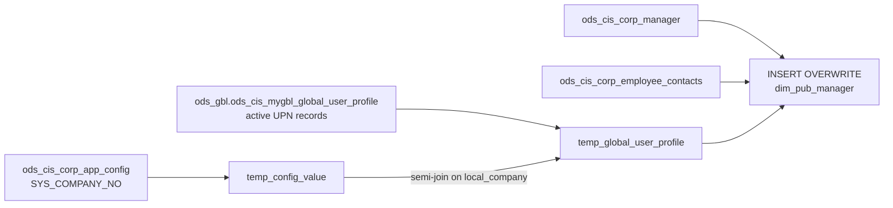

# DIM: Current-State Manager / Employee Dimension (`dim_pub_manager`)

- artifact_type: etl_table
- artifact_id: dim_us.dim_pub_manager
- domain: common
- one_line_purpose: This job builds the current-state manager and employee dimension by joining the CIS manager table with the employee contacts table (for email and mobile phone) and the global user profile table (for Azure Active Directory User Principal Nam...
- layer_type: DIM
- source_kind: etl_sql
- evidence_source: source/etl/sql/common/source/etl/flows/public_order_tools/ingest/public_common_dimension/script/dim_pub_manager.sql

---

## L1 Data Foundation

### Identity and physical mapping
- **Table:** `dim_us.dim_pub_manager`
- **Layer type:** DIM
- **Canonical / derived:** Derived / ETL-loaded (see L3)
- **Owner team:** not registered in metadata catalog

### Grain, scope, exclusions
- **Grain:** one row per employee (current state).
- **Scope:** See L2 business purpose / L3 filters
- **Partition:** none — full table overwrite. - resolved from pipeline (see L4)
- **Natural key:** `userid`.
- **Exclusions:** Not documented in repository

#### Grain detail (preserved)

- **Grain:** one row per employee (current state).
- **Partition:** none — full table overwrite.
- **Natural key:** `userid`.

---

### Cross-engine presence
| Engine | Present | Canonical FQN | Notes |
|--------|---------|---------------|-------|
| Hive | yes | `dim_pub_manager` | ETL target / intermediate per evidence script |
| Vertica | pending | `dim_pub_manager` | Confirm via hive2vertica flow evidence / MCP |

### Physical schema reference

Pointer block only - full column catalog lives in WKB L1 storage JSON.

| Field | Value |
|-------|-------|
| **Authoritative catalog** | WKB L1 storage seed (not duplicated in this file) |
| **entity_id** | `dim_us.dim_pub_manager` |
| **l1_catalog_seed** | `target/storage/wkb/snapshots/_snapshot_id_template/l1_catalog/{engine}_{schema}_{table}.json` |
| **column_count** | pending (run ddl_seed_writer) |
| **partition_keys** | `none — full table overwrite.` |
| **ddl_source** | pending Bitbucket DDL / Vertica metadata ingest |
| **retrieval** | `python -m tools.wkb.indexing.run_query --query "common dim_pub_manager schema" --intent find_table_schema` |

### Lineage
| Object | Role |
|--------|------|
| `ods_${country_code}.ods_cis_corp_manager` | Primary employee/manager source |
| `ods_${country_code}.ods_cis_corp_employee_contacts` | Email and mobile phone supplement |
| `ods_gbl.ods_cis_mygbl_global_user_profile` | Azure AD UPN source |
| `ods_${country_code}.ods_cis_corp_app_config` | Company number parameter |

---

### Freshness and load path
| Item | Value |
|------|-------|
| Load pattern | See L3 end-to-end / INSERT pattern in evidence script |
| Schedule | Not documented in repository |
| Parameters | `country_code` |


---

## L2 Declarative Knowledge

### Business purpose
This job builds the current-state manager and employee dimension by joining the CIS manager table
with the employee contacts table (for email and mobile phone) and the global user profile table
(for Azure Active Directory User Principal Name). The result is a unified employee record that
supports HR analytics, CRM assignments, territory management, and any report that needs to identify
employees and their organizational attributes.

---

### Audience and use cases
| Audience | How they benefit |
|----------|-----------------|
| **Sales management** | Look up sales reps and their managers, territories, and departments |
| **HR / payroll** | Employee attributes for payroll, cost center, and organizational hierarchy |
| **IT / identity management** | `upn` (User Principal Name) links CIS users to Azure AD identities |
| **CRM / account management** | Join on `userid` to resolve account owner names and contact info |

---

### Identifier search profile
- Primary lookup keys: see natural key under L1 Grain.
- Use latest snapshot / active flags when documented in L3 filters.

### Time field semantics
- **date_flag / partition columns:** none — full table overwrite.
- Primary reporting filter should use the partition column(s) documented in L1; resolve values via L4.

### Metrics served
When exposing this table to the business, lead with:

1. **Employee identity:** `userid`, `loginid`, `name`, `global_id`, `upn`
2. **Organization:** `managerid`, `deptid`, `cost_center`, `company_no`
3. **Employment status:** `hiredate`, `termdate`, `available_status`

---

### Metric serving map
N/A - not a `*_comb_mtd` / multi-period wide serving table (or map not present in legacy doc).


### Data products and column groups (preserved)

### Identifiers and relationships

- **CIS identity:** `userid`, `loginid`, `global_id`, `fusion_id`
- **Azure AD:** `upn` (User Principal Name)
- **Manager:** `managerid`
- **Company:** `company_no`, `support_company`

### Dimension columns

- `name` — Derived full name (first + last, trimmed)
- `lastname`, `firstname`, `mi`, `nickname` — Name parts
- `title`, `job_code`, `levelid`, `classid` — Role classification
- `deptid`, `cost_center`, `def_loc`, `user_loc` — Organizational location
- `term_id` — Termination reason code
- `available_status`, `blackout` — Availability flags
- `absence_start_date`, `first_day_back_date` — Leave management dates

### Contact information

- `phone`, `email`, `mobile_phone`, `upn`

### Employment dates

- `hiredate`, `termdate`, `last_login`

### Payroll

- `payrollname`, `tc_exempt`

---

### etl_metrics

#### `name`
- **Source:** [metric-index.md](../../source/contracts/common/metric-index.md#name)
- **Business definition:** Full name combining first + last, null-safe
```sql
concat(if(firstname is null,'',firstname),' ',if(lastname is null,'',lastname))
```


---

## L3 Procedural Knowledge

### Query and routing rules
**Business filters:** Use partition / date keys from L1 grain for reporting scope.
**Technical predicates (load only):** See Key filters and step-by-step logic below.

### Dimension join patterns
| Dimension FQN | Join keys | Purpose | Evidence |
|---------------|-----------|---------|----------|
| See step-by-step / base tables | See L3 steps | Dimension enrichment | `source/etl/sql/common/source/etl/flows/public_order_tools/ingest/public_common_dimension/script/dim_pub_manager.sql` |

### Key filters and ETL business logic
### Step 1 — `temp_config_value`

**Source:** `ods_${country_code}.ods_cis_corp_app_config`

**Filter:**
- `config_name = 'SYS_COMPANY_NO'` — Retrieves the system company number for the country

**Output columns:** `config_value`, `config_name`

---

### Step 2 — `temp_global_user_profile`

**Source:** `ods_gbl.ods_cis_mygbl_global_user_profile gup`

**Join:**

| Join | Keys | Purpose |
|------|------|---------|
| `temp_config_value tca` (LEFT SEMI) | `gup.local_company = tca.config_value` | Keep only users belonging to the target company |

**Filter:**
- `gup.profile_type = 'userPrincipalName'` — Only UPN profile entries
- `gup.active_flag = 'Y'` — Only active UPN records

**Output columns:** `user_id`, `profile_c` (the UPN string)

---

### Step 3 — Final `INSERT OVERWRITE` into `dim_pub_manager`

**From:** `ods_${country_code}.ods_cis_corp_manager mg`

**Left joins:**

| Join | Keys | Purpose |
|------|------|---------|
| `ods_cis_corp_employee_contacts ec` | `mg.userid = ec.user_id` | Add `email` and `mobile_phone` |
| `temp_global_user_profile gup` | `mg.userid = gup.user_id` | Add `upn` (Azure AD UPN) |

**Pass-through columns from `mg`:**
`userid`, `loginid`, `lastname`, `firstname`, `mi`, `title`, `phone`, `deptid`, `managerid`,
`hiredate`, `termdate`, `levelid`, `def_loc`, `term_id`, `last_login`, `classid`, `company_no`,
`tc_exempt`, `cost_center`, `user_loc`, `payrollname`, `available_status`, `absence_start_date`,
`first_day_back_date`, `blackout`, `nickname`, `jo...

### Standard time-filter SQL
```sql
-- relative period filter using resolved partition value (see L4)
SELECT *
FROM dim_pub_manager
WHERE /* partition predicate */ date_flag = '${partition_value}';
```

### End-to-end flow
**Runtime parameters:** `country_code`
**Target table:** `dim_${country_code}.dim_pub_manager` — full table overwrite.

1. **`temp_config_value`:** Read `SYS_COMPANY_NO` from `ods_cis_corp_app_config` to get the country's configured company number.
2. **`temp_global_user_profile`:** Filter `ods_gbl.ods_cis_mygbl_global_user_profile` to active UPN records (`profile_type='userPrincipalName'`, `active_flag='Y'`) matching the company number via a left semi-join.
3. **INSERT OVERWRITE:** Select from `ods_cis_corp_manager`, left-join `ods_cis_corp_employee_contacts` on `userid`, left-join `temp_global_user_profile` on `userid`; compute `name` from first+last name.



---


#### High-level stages (preserved)

| Stage | Business meaning |
|-------|-----------------|
| **Global UPN lookup** | Reads the company's system-configured server number and filters the global user profile to active Azure AD UPN records for the company |
| **Manager base join** | Reads all manager records from CIS and left-joins employee contact info and the UPN view |
| **INSERT OVERWRITE** | Writes the merged employee record — including derived `name` field — to `dim_pub_manager` |

**Parameters:** `country_code`

---


### Base tables register
| Object | Role in this job |
|--------|-----------------|
| `ods_${country_code}.ods_cis_corp_app_config` | Parameter lookup — `SYS_COMPANY_NO` for company identification |
| `ods_gbl.ods_cis_mygbl_global_user_profile` | UPN source — Azure AD User Principal Name per user |
| `ods_${country_code}.ods_cis_corp_manager` | Primary source — all manager/employee master records |
| `ods_${country_code}.ods_cis_corp_employee_contacts` | Supplement — email and mobile phone per user |

**Temporary tables (inside the job only):**
`temp_config_value` → `temp_global_user_profile` → (final `INSERT`)

---

### Step-by-step logic
### Step 1 — `temp_config_value`

**Source:** `ods_${country_code}.ods_cis_corp_app_config`

**Filter:**
- `config_name = 'SYS_COMPANY_NO'` — Retrieves the system company number for the country

**Output columns:** `config_value`, `config_name`

---

### Step 2 — `temp_global_user_profile`

**Source:** `ods_gbl.ods_cis_mygbl_global_user_profile gup`

**Join:**

| Join | Keys | Purpose |
|------|------|---------|
| `temp_config_value tca` (LEFT SEMI) | `gup.local_company = tca.config_value` | Keep only users belonging to the target company |

**Filter:**
- `gup.profile_type = 'userPrincipalName'` — Only UPN profile entries
- `gup.active_flag = 'Y'` — Only active UPN records

**Output columns:** `user_id`, `profile_c` (the UPN string)

---

### Step 3 — Final `INSERT OVERWRITE` into `dim_pub_manager`

**From:** `ods_${country_code}.ods_cis_corp_manager mg`

**Left joins:**

| Join | Keys | Purpose |
|------|------|---------|
| `ods_cis_corp_employee_contacts ec` | `mg.userid = ec.user_id` | Add `email` and `mobile_phone` |
| `temp_global_user_profile gup` | `mg.userid = gup.user_id` | Add `upn` (Azure AD UPN) |

**Pass-through columns from `mg`:**
`userid`, `loginid`, `lastname`, `firstname`, `mi`, `title`, `phone`, `deptid`, `managerid`,
`hiredate`, `termdate`, `levelid`, `def_loc`, `term_id`, `last_login`, `classid`, `company_no`,
`tc_exempt`, `cost_center`, `user_loc`, `payrollname`, `available_status`, `absence_start_date`,
`first_day_back_date`, `blackout`, `nickname`, `job_code`, `global_id`, `support_company`, `fusion_id`

**Pass-through from joins:**
- `ec.email`, `ec.mobile_phone`
- `gup.profile_c` as `upn`

**Derived columns computed at INSERT:**

| Column | Formula | Plain language |
|--------|---------|----------------|
| `name` | `concat(if(firstname is null,'',firstname),' ',if(lastname is null,'',lastname))` | Full name combining first + last, null-safe |

---

### Relationship map (embedded)

| from_fqn | to_fqn | cardinality | join_keys | provenance |
|----------|--------|-------------|-----------|------------|
| `temp_global_user_profile` | `temp_config_value` | many:1 | `gup.local_company` = `tca.config_value` | etl_sql (`source/etl/sql/common/public_order_scripts/public_common_dimension/script/dim_pub_manager.sql:13`) |
| `ods_${country_code}.ods_cis_corp_manager` | `ods_${country_code}.ods_cis_corp_employee_contacts` | many:1 (LEFT) | `mg.userid` = `ec.user_id` | etl_sql (`source/etl/sql/common/public_order_scripts/public_common_dimension/script/dim_pub_manager.sql:57`) |
| `ods_${country_code}.ods_cis_corp_manager` | `temp_global_user_profile` | many:1 (LEFT) | `mg.userid` = `gup.user_id` | etl_sql (`source/etl/sql/common/public_order_scripts/public_common_dimension/script/dim_pub_manager.sql:59`) |

### Special logic (embedded)

Not documented in repository

### Column / field derivations (from ETL SQL)

| target_column | expression_sql | upstream_columns | upstream_tables | transform_kind | evidence |
|---------------|----------------|------------------|-----------------|----------------|----------|
| `userid` | `mg.userid` | `userid` | `ods_${country_code}.ods_cis_corp_manager`, `ods_${country_code}.ods_cis_corp_employee_contacts`, `temp_global_user_profile` | passthrough | `source/etl/sql/common/public_order_scripts/public_common_dimension/script/dim_pub_manager.sql:21` |
| `name` | `concat(if(mg.firstname is null, '', mg.firstname), ' ', if(mg.lastname is null, '', mg.lastname))` | `firstname`, `lastname` | `ods_${country_code}.ods_cis_corp_manager`, `ods_${country_code}.ods_cis_corp_employee_contacts`, `temp_global_user_profile` | udf | `source/etl/sql/common/public_order_scripts/public_common_dimension/script/dim_pub_manager.sql:22` |
| `loginid` | `mg.loginid` | `loginid` | `ods_${country_code}.ods_cis_corp_manager`, `ods_${country_code}.ods_cis_corp_employee_contacts`, `temp_global_user_profile` | passthrough | `source/etl/sql/common/public_order_scripts/public_common_dimension/script/dim_pub_manager.sql:23` |
| `lastname` | `mg.lastname` | `lastname` | `ods_${country_code}.ods_cis_corp_manager`, `ods_${country_code}.ods_cis_corp_employee_contacts`, `temp_global_user_profile` | passthrough | `source/etl/sql/common/public_order_scripts/public_common_dimension/script/dim_pub_manager.sql:22` |
| `firstname` | `mg.firstname` | `firstname` | `ods_${country_code}.ods_cis_corp_manager`, `ods_${country_code}.ods_cis_corp_employee_contacts`, `temp_global_user_profile` | passthrough | `source/etl/sql/common/public_order_scripts/public_common_dimension/script/dim_pub_manager.sql:22` |
| `mi` | `mg.mi` | `mi` | `ods_${country_code}.ods_cis_corp_manager`, `ods_${country_code}.ods_cis_corp_employee_contacts`, `temp_global_user_profile` | passthrough | `source/etl/sql/common/public_order_scripts/public_common_dimension/script/dim_pub_manager.sql:26` |
| `title` | `mg.title` | `title` | `ods_${country_code}.ods_cis_corp_manager`, `ods_${country_code}.ods_cis_corp_employee_contacts`, `temp_global_user_profile` | passthrough | `source/etl/sql/common/public_order_scripts/public_common_dimension/script/dim_pub_manager.sql:27` |
| `phone` | `mg.phone` | `phone` | `ods_${country_code}.ods_cis_corp_manager`, `ods_${country_code}.ods_cis_corp_employee_contacts`, `temp_global_user_profile` | passthrough | `source/etl/sql/common/public_order_scripts/public_common_dimension/script/dim_pub_manager.sql:28` |
| `deptid` | `mg.deptid` | `deptid` | `ods_${country_code}.ods_cis_corp_manager`, `ods_${country_code}.ods_cis_corp_employee_contacts`, `temp_global_user_profile` | passthrough | `source/etl/sql/common/public_order_scripts/public_common_dimension/script/dim_pub_manager.sql:29` |
| `managerid` | `mg.managerid` | `managerid` | `ods_${country_code}.ods_cis_corp_manager`, `ods_${country_code}.ods_cis_corp_employee_contacts`, `temp_global_user_profile` | passthrough | `source/etl/sql/common/public_order_scripts/public_common_dimension/script/dim_pub_manager.sql:30` |
| `hiredate` | `mg.hiredate` | `hiredate` | `ods_${country_code}.ods_cis_corp_manager`, `ods_${country_code}.ods_cis_corp_employee_contacts`, `temp_global_user_profile` | passthrough | `source/etl/sql/common/public_order_scripts/public_common_dimension/script/dim_pub_manager.sql:31` |
| `termdate` | `mg.termdate` | `termdate` | `ods_${country_code}.ods_cis_corp_manager`, `ods_${country_code}.ods_cis_corp_employee_contacts`, `temp_global_user_profile` | passthrough | `source/etl/sql/common/public_order_scripts/public_common_dimension/script/dim_pub_manager.sql:32` |
| `levelid` | `mg.levelid` | `levelid` | `ods_${country_code}.ods_cis_corp_manager`, `ods_${country_code}.ods_cis_corp_employee_contacts`, `temp_global_user_profile` | passthrough | `source/etl/sql/common/public_order_scripts/public_common_dimension/script/dim_pub_manager.sql:33` |
| `def_loc` | `mg.def_loc` | `def_loc` | `ods_${country_code}.ods_cis_corp_manager`, `ods_${country_code}.ods_cis_corp_employee_contacts`, `temp_global_user_profile` | passthrough | `source/etl/sql/common/public_order_scripts/public_common_dimension/script/dim_pub_manager.sql:34` |
| `term_id` | `mg.term_id` | `term_id` | `ods_${country_code}.ods_cis_corp_manager`, `ods_${country_code}.ods_cis_corp_employee_contacts`, `temp_global_user_profile` | passthrough | `source/etl/sql/common/public_order_scripts/public_common_dimension/script/dim_pub_manager.sql:35` |
| `last_login` | `mg.last_login` | `last_login` | `ods_${country_code}.ods_cis_corp_manager`, `ods_${country_code}.ods_cis_corp_employee_contacts`, `temp_global_user_profile` | passthrough | `source/etl/sql/common/public_order_scripts/public_common_dimension/script/dim_pub_manager.sql:36` |
| `classid` | `mg.classid` | `classid` | `ods_${country_code}.ods_cis_corp_manager`, `ods_${country_code}.ods_cis_corp_employee_contacts`, `temp_global_user_profile` | passthrough | `source/etl/sql/common/public_order_scripts/public_common_dimension/script/dim_pub_manager.sql:37` |
| `company_no` | `mg.company_no` | `company_no` | `ods_${country_code}.ods_cis_corp_manager`, `ods_${country_code}.ods_cis_corp_employee_contacts`, `temp_global_user_profile` | passthrough | `source/etl/sql/common/public_order_scripts/public_common_dimension/script/dim_pub_manager.sql:38` |
| `tc_exempt` | `mg.tc_exempt` | `tc_exempt` | `ods_${country_code}.ods_cis_corp_manager`, `ods_${country_code}.ods_cis_corp_employee_contacts`, `temp_global_user_profile` | passthrough | `source/etl/sql/common/public_order_scripts/public_common_dimension/script/dim_pub_manager.sql:39` |
| `cost_center` | `mg.cost_center` | `cost_center` | `ods_${country_code}.ods_cis_corp_manager`, `ods_${country_code}.ods_cis_corp_employee_contacts`, `temp_global_user_profile` | passthrough | `source/etl/sql/common/public_order_scripts/public_common_dimension/script/dim_pub_manager.sql:40` |
| `user_loc` | `mg.user_loc` | `user_loc` | `ods_${country_code}.ods_cis_corp_manager`, `ods_${country_code}.ods_cis_corp_employee_contacts`, `temp_global_user_profile` | passthrough | `source/etl/sql/common/public_order_scripts/public_common_dimension/script/dim_pub_manager.sql:41` |
| `payrollname` | `mg.payrollname` | `payrollname` | `ods_${country_code}.ods_cis_corp_manager`, `ods_${country_code}.ods_cis_corp_employee_contacts`, `temp_global_user_profile` | passthrough | `source/etl/sql/common/public_order_scripts/public_common_dimension/script/dim_pub_manager.sql:42` |
| `available_status` | `mg.available_status` | `available_status` | `ods_${country_code}.ods_cis_corp_manager`, `ods_${country_code}.ods_cis_corp_employee_contacts`, `temp_global_user_profile` | passthrough | `source/etl/sql/common/public_order_scripts/public_common_dimension/script/dim_pub_manager.sql:43` |
| `absence_start_date` | `mg.absence_start_date` | `absence_start_date` | `ods_${country_code}.ods_cis_corp_manager`, `ods_${country_code}.ods_cis_corp_employee_contacts`, `temp_global_user_profile` | passthrough | `source/etl/sql/common/public_order_scripts/public_common_dimension/script/dim_pub_manager.sql:44` |
| `first_day_back_date` | `mg.first_day_back_date` | `first_day_back_date` | `ods_${country_code}.ods_cis_corp_manager`, `ods_${country_code}.ods_cis_corp_employee_contacts`, `temp_global_user_profile` | passthrough | `source/etl/sql/common/public_order_scripts/public_common_dimension/script/dim_pub_manager.sql:45` |
| `blackout` | `mg.blackout` | `blackout` | `ods_${country_code}.ods_cis_corp_manager`, `ods_${country_code}.ods_cis_corp_employee_contacts`, `temp_global_user_profile` | passthrough | `source/etl/sql/common/public_order_scripts/public_common_dimension/script/dim_pub_manager.sql:46` |
| `nickname` | `mg.nickname` | `nickname` | `ods_${country_code}.ods_cis_corp_manager`, `ods_${country_code}.ods_cis_corp_employee_contacts`, `temp_global_user_profile` | passthrough | `source/etl/sql/common/public_order_scripts/public_common_dimension/script/dim_pub_manager.sql:47` |
| `job_code` | `mg.job_code` | `job_code` | `ods_${country_code}.ods_cis_corp_manager`, `ods_${country_code}.ods_cis_corp_employee_contacts`, `temp_global_user_profile` | passthrough | `source/etl/sql/common/public_order_scripts/public_common_dimension/script/dim_pub_manager.sql:48` |
| `global_id` | `mg.global_id` | `global_id` | `ods_${country_code}.ods_cis_corp_manager`, `ods_${country_code}.ods_cis_corp_employee_contacts`, `temp_global_user_profile` | passthrough | `source/etl/sql/common/public_order_scripts/public_common_dimension/script/dim_pub_manager.sql:49` |
| `support_company` | `mg.support_company` | `support_company` | `ods_${country_code}.ods_cis_corp_manager`, `ods_${country_code}.ods_cis_corp_employee_contacts`, `temp_global_user_profile` | passthrough | `source/etl/sql/common/public_order_scripts/public_common_dimension/script/dim_pub_manager.sql:50` |
| `fusion_id` | `mg.fusion_id` | `fusion_id` | `ods_${country_code}.ods_cis_corp_manager`, `ods_${country_code}.ods_cis_corp_employee_contacts`, `temp_global_user_profile` | passthrough | `source/etl/sql/common/public_order_scripts/public_common_dimension/script/dim_pub_manager.sql:51` |
| `email` | `ec.email` | `email` | `ods_${country_code}.ods_cis_corp_manager`, `ods_${country_code}.ods_cis_corp_employee_contacts`, `temp_global_user_profile` | passthrough | `source/etl/sql/common/public_order_scripts/public_common_dimension/script/dim_pub_manager.sql:52` |
| `mobile_phone` | `ec.mobile_phone` | `mobile_phone` | `ods_${country_code}.ods_cis_corp_manager`, `ods_${country_code}.ods_cis_corp_employee_contacts`, `temp_global_user_profile` | passthrough | `source/etl/sql/common/public_order_scripts/public_common_dimension/script/dim_pub_manager.sql:53` |
| `upn` | `gup.profile_c` | `profile_c` | `ods_${country_code}.ods_cis_corp_manager`, `ods_${country_code}.ods_cis_corp_employee_contacts`, `temp_global_user_profile` | rename | `source/etl/sql/common/public_order_scripts/public_common_dimension/script/dim_pub_manager.sql:10` |

### Sentinel and code values
| Value | Meaning |
|-------|---------|
| `active_flag = 'Y'` | UPN record is active in the global user profile |
| `config_name = 'SYS_COMPANY_NO'` | System parameter identifying the company for this country |

---

---

## L4 Validation

### Resolved partition value
| Step | Source | How partition / date scope is determined |
|------|--------|------------------------------------------|
| 1 | evidence script / flow | See parameters in L1 Freshness and L3 filters - `source/etl/sql/common/source/etl/flows/public_order_tools/ingest/public_common_dimension/script/dim_pub_manager.sql` |

**Plain language:** Partition and date scope follow Azkaban/bootstrap parameters documented in the source script and orchestrating flow; do not hardcode calendar literals.

### Data quality checks
- Prefer row-count-by-partition, metric sums, and grain duplicate checks (see Validation SQL).
- Additional checks from legacy caveats / operational notes when present.

### Validation SQL
```sql
-- 1) Row count by partition
SELECT ${partition_col}, COUNT(*) AS row_cnt
FROM dim_${country_code}.dim_pub_manager
WHERE ${partition_col} = '${partition_value}'
GROUP BY ${partition_col};

-- 2) Metric sum by business dimension (top deltas)
SELECT ${dim_key}, SUM(${metric}) AS metric_sum
FROM dim_${country_code}.dim_pub_manager
WHERE ${partition_col} = '${partition_value}'
GROUP BY ${dim_key}
ORDER BY ABS(SUM(${metric})) DESC
LIMIT 20;

-- 3) Grain duplicate check
SELECT ${grain_key_1}, ${grain_key_2}, ${grain_key_3}, ${partition_col}, COUNT(*) AS cnt
FROM dim_${country_code}.dim_pub_manager
WHERE ${partition_col} = '${partition_value}'
GROUP BY ${grain_key_1}, ${grain_key_2}, ${grain_key_3}, ${partition_col}
HAVING COUNT(*) > 1;
```

Replace placeholders from this file's Grain and keys / Data you can fetch sections, and use the resolved partition value from run scope.

### Caveats for interpretation
- **`upn` may be NULL:** If a manager has no active UPN record in the global profile, `upn` is NULL — this is expected for users not provisioned in Azure AD.
- **`email` and `mobile_phone` may be NULL:** If the user has no entry in `ods_cis_corp_employee_contacts`, these columns are NULL.
- **`name` is derived at load time:** Changes to `firstname`/`lastname` in CIS will update `name` on the next run.
- **Full refresh:** All employees are reloaded on each run; terminated employees remain until removed from the source `ods_cis_corp_manager` table.

---

### Conflicts and open questions
- Schedule, owner, SLA: Not documented in repository (unless preserved schedule evidence above).
- Vertica MCP verification: pending unless confirmed in L5.


---

## L5 Runtime View

### Query path and engine preference
| Role | Hive object | Vertica object | Sync mode | Evidence | MCP verified |
|------|-------------|----------------|-----------|----------|--------------|
| **Query for reporting** | *See script lineage* | `dim_${country_code}.dim_pub_manager` | *Verify from flow* | *Add flow file:line* | pending |
| **Hive alternative** | `*` | `dim_${country_code}.dim_pub_manager` | - | *See dependencies* | - |
| **ETL internal** | staging/temp tables | *Not synced to Vertica* | - | *See step-by-step logic* | - |

Business users should query `dim_${country_code}.dim_pub_manager` in Vertica once MCP verification is completed for this document.

### Access constraints
- Country / company schema parameters may apply (`literal_country`, `company_no`, etc.).
- Hive-only staging objects are not reporting surfaces unless synced.

### Query risk profile
| Field | Value |
|-------|-------|
| requires_date_predicate | unknown |
| scan_risk_tier | medium |

---

## L6 Access and Consumption

### Primary consumers and use cases
| Audience | How they benefit |
|----------|-----------------|
| **Sales management** | Look up sales reps and their managers, territories, and departments |
| **HR / payroll** | Employee attributes for payroll, cost center, and organizational hierarchy |
| **IT / identity management** | `upn` (User Principal Name) links CIS users to Azure AD identities |
| **CRM / account management** | Join on `userid` to resolve account owner names and contact info |

---

### Representative query patterns
```sql
-- certified / illustrative lookup - replace predicates from L1/L4
SELECT *
FROM dim_pub_manager
WHERE date_flag = '${partition_value}'
LIMIT 100;
```

### Dependencies and notes
### Upstream objects (verified)

| Object | Usage | Evidence |
|--------|-------|----------|
| `ods_${country_code}.ods_cis_corp_app_config` | `SYS_COMPANY_NO` config lookup | `source/etl/sql/common/source/etl/flows/public_order_tools/ingest/public_common_dimension/script/dim_pub_manager.sql:3` |
| `ods_gbl.ods_cis_mygbl_global_user_profile` | UPN (`profile_c`) for active users | `source/etl/sql/common/source/etl/flows/public_order_tools/ingest/public_common_dimension/script/dim_pub_manager.sql:7` |
| `ods_${country_code}.ods_cis_corp_manager` | All manager/employee attributes | `source/etl/sql/common/source/etl/flows/public_order_tools/ingest/public_common_dimension/script/dim_pub_manager.sql:56` |
| `ods_${country_code}.ods_cis_corp_employee_contacts` | `email`, `mobile_phone` | `source/etl/sql/common/source/etl/flows/public_order_tools/ingest/public_common_dimension/script/dim_pub_manager.sql:57` |

### Downstream consumers (verified)

| Object / script | Evidence |
|-----------------|----------|
| `dim_pub_manager_df.sql` — snapshot reader | `source/etl/sql/common/source/etl/flows/public_order_tools/ingest/public_common_dimension/script/dim_pub_manager_df.sql:38` |
| `dim_pub_global_employee_new.sql` — joins on `global_id` | `source/etl/sql/common/source/etl/flows/public_order_tools/ingest/public_common_dimension/script/dim_pub_global_employee_new.sql:43` |

### Operational detail (verified)

- Full table overwrite: `source/etl/sql/common/source/etl/flows/public_order_tools/ingest/public_common_dimension/script/dim_pub_manager.sql:18`

### Not documented in repository

- Schedule, owner, SLA — not in scripts or configs

### Related scripts (verified)

- `dim_pub_manager_df.sql` — Daily snapshot of this table — `source/etl/sql/common/source/etl/flows/public_order_tools/ingest/public_common_dimension/script/`
- `dim_pub_global_employee_new.sql` — Consumes this table to build global employee dimension — `source/etl/sql/common/source/etl/flows/public_order_tools/ingest/public_common_dimension/script/`

---

*Document generated from `source/etl/sql/common/source/etl/flows/public_order_tools/ingest/public_common_dimension/script/dim_pub_manager.sql`.*

#### Not documented in repository
- Owner, SLA (unless schedule evidence preserved above)
- Any dependency without `file:line` evidence in this document

---

*Document migrated to L1-L6 from legacy Knowledgebase content. Evidence: `source/etl/sql/common/source/etl/flows/public_order_tools/ingest/public_common_dimension/script/dim_pub_manager.sql`.*
