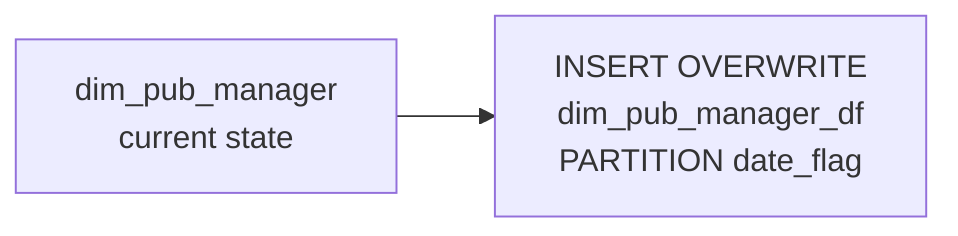

# DIM: Daily Manager/Employee Snapshot (`dim_pub_manager_df`)

- artifact_type: etl_table
- artifact_id: dim_us.dim_pub_manager_df
- domain: common
- one_line_purpose: This job creates a daily, date-partitioned snapshot of the current-state manager and employee dimension (`dim_pub_manager`) by writing all its rows into `dim_pub_manager_df` under the `date_flag` partition. This enables historical point-in-...
- layer_type: DIM
- source_kind: etl_sql
- evidence_source: source/etl/sql/common/source/etl/flows/public_order_tools/ingest/public_common_dimension/script/dim_pub_manager_df.sql

---

## L1 Data Foundation

### Identity and physical mapping
- **Table:** `dim_us.dim_pub_manager_df`
- **Layer type:** DIM
- **Canonical / derived:** Derived / ETL-loaded (see L3)
- **Owner team:** not registered in metadata catalog

### Grain, scope, exclusions
- **Grain:** one row per employee/manager per `date_flag` partition.
- **Scope:** See L2 business purpose / L3 filters
- **Partition:** `date_flag` — the date for which this snapshot is taken. - resolved from pipeline (see L4)
- **Natural key:** `userid` within a `date_flag` partition.
- **Exclusions:** Not documented in repository

#### Grain detail (preserved)

- **Grain:** one row per employee/manager per `date_flag` partition.
- **Partition:** `date_flag` — the date for which this snapshot is taken.
- **Natural key:** `userid` within a `date_flag` partition.

---

### Cross-engine presence
| Engine | Present | Canonical FQN | Notes |
|--------|---------|---------------|-------|
| Hive | yes | `dim_pub_manager_df` | ETL target / intermediate per evidence script |
| Vertica | pending | `dim_pub_manager_df` | Confirm via hive2vertica flow evidence / MCP |

### Physical schema reference

Pointer block only - full column catalog lives in WKB L1 storage JSON.

| Field | Value |
|-------|-------|
| **Authoritative catalog** | WKB L1 storage seed (not duplicated in this file) |
| **entity_id** | `dim_us.dim_pub_manager_df` |
| **l1_catalog_seed** | `target/storage/wkb/snapshots/_snapshot_id_template/l1_catalog/{engine}_{schema}_{table}.json` |
| **column_count** | pending (run ddl_seed_writer) |
| **partition_keys** | `date_flag` |
| **ddl_source** | pending Bitbucket DDL / Vertica metadata ingest |
| **retrieval** | `python -m tools.wkb.indexing.run_query --query "common dim_pub_manager_df schema" --intent find_table_schema` |

### Lineage
| Object | Role |
|--------|------|
| `dim_${country_code}.dim_pub_manager` | Sole source — must be loaded before this job runs |

---

### Freshness and load path
| Item | Value |
|------|-------|
| Load pattern | See L3 end-to-end / INSERT pattern in evidence script |
| Schedule | Not documented in repository |
| Parameters | `country_code`, `date_flag` |


---

## L2 Declarative Knowledge

### Business purpose
This job creates a daily, date-partitioned snapshot of the current-state manager and employee
dimension (`dim_pub_manager`) by writing all its rows into `dim_pub_manager_df` under the
`date_flag` partition. This enables historical point-in-time analysis of the employee and manager
hierarchy — for example, who was managing a territory on a specific past date.

---

### Audience and use cases
| Audience | How they benefit |
|----------|-----------------|
| **Sales / HR analytics** | Query employee and manager data as it existed on any past date without overwriting current state |
| **Finance / payroll** | Reconcile payroll and compensation against the employee hierarchy on a specific date |
| **BI / reporting** | Join on `date_flag` + `userid` to get historically accurate employee attributes |

---

### Identifier search profile
- Primary lookup keys: see natural key under L1 Grain.
- Use latest snapshot / active flags when documented in L3 filters.

### Time field semantics
- **date_flag / partition columns:** `date_flag` — the date for which this snapshot is taken.
- Primary reporting filter should use the partition column(s) documented in L1; resolve values via L4.

### Metrics served
When exposing this table to the business, lead with:

1. **Employee identity:** `userid`, `loginid`, `name`, `global_id`
2. **Organizational hierarchy:** `managerid`, `deptid`, `cost_center`, `company_no`
3. **Employment status:** `hiredate`, `termdate`, `available_status`

---

### Metric serving map
N/A - not a `*_comb_mtd` / multi-period wide serving table (or map not present in legacy doc).


### Data products and column groups (preserved)

### Identifiers and relationships

- **Employee:** `userid`, `loginid`, `global_id`, `fusion_id`
- **Manager:** `managerid`
- **Company:** `company_no`, `support_company`

### Dimension columns

- `name`, `lastname`, `firstname`, `mi`, `nickname` — Name attributes
- `title`, `job_code`, `levelid`, `classid` — Role and classification
- `deptid`, `cost_center`, `def_loc`, `user_loc` — Organizational location
- `term_id` — Termination reason
- `available_status`, `blackout` — Availability flags
- `absence_start_date`, `first_day_back_date` — Leave dates

### Contact information

- `phone`, `email`, `mobile_phone`, `upn` (Azure AD User Principal Name)

### Employment dates

- `hiredate`, `termdate`, `last_login`

### Payroll

- `payroll_name`, `tc_exempt`

---

### etl_metrics

N/A - no calculable ETL formulas extracted from this document (passthrough / stored measures only, or formulas not documented).

---

## L3 Procedural Knowledge

### Query and routing rules
**Business filters:** Use partition / date keys from L1 grain for reporting scope.
**Technical predicates (load only):** See Key filters and step-by-step logic below.

### Dimension join patterns
| Dimension FQN | Join keys | Purpose | Evidence |
|---------------|-----------|---------|----------|
| See step-by-step / base tables | See L3 steps | Dimension enrichment | `source/etl/sql/common/source/etl/flows/public_order_tools/ingest/public_common_dimension/script/dim_pub_manager_df.sql` |

### Key filters and ETL business logic
### Step 1 — Final `INSERT OVERWRITE` into `dim_pub_manager_df PARTITION(date_flag)`

**From:** `dim_${country_code}.dim_pub_manager mg`

**Filter:** None — all rows.

**Pass-through columns:**
`userid`, `name`, `loginid`, `lastname`, `firstname`, `mi`, `title`, `phone`, `deptid`,
`managerid`, `hiredate`, `termdate`, `levelid`, `def_loc`, `term_id`, `last_login`, `classid`,
`company_no`, `tc_exempt`, `cost_center`, `user_loc`, `payroll_name`, `available_status`,
`absence_start_date`, `first_day_back_date`, `blackout`, `nickname`, `job_code`, `global_id`,
`support_company`, `fusion_id`, `email`, `mobile_phone`, `upn`

---

### Standard time-filter SQL
```sql
-- relative period filter using resolved partition value (see L4)
SELECT *
FROM dim_pub_manager_df
WHERE /* partition predicate */ date_flag = '${partition_value}';
```

### End-to-end flow
**Runtime parameters:** `country_code`, `date_flag`
**Target table:** `dim_${country_code}.dim_pub_manager_df`, partitioned by **`date_flag`**.

1. Read all rows from `dim_${country_code}.dim_pub_manager`.
2. **INSERT OVERWRITE** all columns into the `date_flag` partition of `dim_pub_manager_df`.



---


#### High-level stages (preserved)

| Stage | Business meaning |
|-------|-----------------|
| **Daily snapshot** | Copies every row from `dim_pub_manager` (current state) into the `date_flag` partition of `dim_pub_manager_df`, preserving a historical record of the employee dimension as of that date |

**Parameters:** `country_code`, `date_flag`

---


### Base tables register
| Object | Role in this job |
|--------|-----------------|
| `dim_${country_code}.dim_pub_manager` | Sole source — current-state manager/employee dimension |

**Temporary tables (inside the job only):**
None — direct INSERT from source dimension.

---

### Step-by-step logic
### Step 1 — Final `INSERT OVERWRITE` into `dim_pub_manager_df PARTITION(date_flag)`

**From:** `dim_${country_code}.dim_pub_manager mg`

**Filter:** None — all rows.

**Pass-through columns:**
`userid`, `name`, `loginid`, `lastname`, `firstname`, `mi`, `title`, `phone`, `deptid`,
`managerid`, `hiredate`, `termdate`, `levelid`, `def_loc`, `term_id`, `last_login`, `classid`,
`company_no`, `tc_exempt`, `cost_center`, `user_loc`, `payroll_name`, `available_status`,
`absence_start_date`, `first_day_back_date`, `blackout`, `nickname`, `job_code`, `global_id`,
`support_company`, `fusion_id`, `email`, `mobile_phone`, `upn`

---

### Relationship map (embedded)

| from_fqn | to_fqn | cardinality | join_keys | provenance |
|----------|--------|-------------|-----------|------------|
| `dim_${country_code}.dim_pub_manager` | `dim_${country_code}.dim_pub_manager` | 1:1 source scan | — (no JOIN; single FROM) | etl_sql (`source/etl/sql/common/public_order_scripts/public_common_dimension/script/dim_pub_manager_df.sql:38`) |


### Special logic (embedded)

Not documented in repository

### Column / field derivations (from ETL SQL)

| target_column | expression_sql | upstream_columns | upstream_tables | transform_kind | evidence |
|---------------|----------------|------------------|-----------------|----------------|----------|
| `userid` | `mg.userid` | `userid` | `dim_${country_code}.dim_pub_manager` | passthrough | `source/etl/sql/common/public_order_scripts/public_common_dimension/script/dim_pub_manager_df.sql:4` |
| `name` | `mg.name` | `name` | `dim_${country_code}.dim_pub_manager` | passthrough | `source/etl/sql/common/public_order_scripts/public_common_dimension/script/dim_pub_manager_df.sql:5` |
| `loginid` | `mg.loginid` | `loginid` | `dim_${country_code}.dim_pub_manager` | passthrough | `source/etl/sql/common/public_order_scripts/public_common_dimension/script/dim_pub_manager_df.sql:6` |
| `lastname` | `mg.lastname` | `lastname` | `dim_${country_code}.dim_pub_manager` | passthrough | `source/etl/sql/common/public_order_scripts/public_common_dimension/script/dim_pub_manager_df.sql:7` |
| `firstname` | `mg.firstname` | `firstname` | `dim_${country_code}.dim_pub_manager` | passthrough | `source/etl/sql/common/public_order_scripts/public_common_dimension/script/dim_pub_manager_df.sql:8` |
| `mi` | `mg.mi` | `mi` | `dim_${country_code}.dim_pub_manager` | passthrough | `source/etl/sql/common/public_order_scripts/public_common_dimension/script/dim_pub_manager_df.sql:9` |
| `title` | `mg.title` | `title` | `dim_${country_code}.dim_pub_manager` | passthrough | `source/etl/sql/common/public_order_scripts/public_common_dimension/script/dim_pub_manager_df.sql:10` |
| `phone` | `mg.phone` | `phone` | `dim_${country_code}.dim_pub_manager` | passthrough | `source/etl/sql/common/public_order_scripts/public_common_dimension/script/dim_pub_manager_df.sql:11` |
| `deptid` | `mg.deptid` | `deptid` | `dim_${country_code}.dim_pub_manager` | passthrough | `source/etl/sql/common/public_order_scripts/public_common_dimension/script/dim_pub_manager_df.sql:12` |
| `managerid` | `mg.managerid` | `managerid` | `dim_${country_code}.dim_pub_manager` | passthrough | `source/etl/sql/common/public_order_scripts/public_common_dimension/script/dim_pub_manager_df.sql:13` |
| `hiredate` | `mg.hiredate` | `hiredate` | `dim_${country_code}.dim_pub_manager` | passthrough | `source/etl/sql/common/public_order_scripts/public_common_dimension/script/dim_pub_manager_df.sql:14` |
| `termdate` | `mg.termdate` | `termdate` | `dim_${country_code}.dim_pub_manager` | passthrough | `source/etl/sql/common/public_order_scripts/public_common_dimension/script/dim_pub_manager_df.sql:15` |
| `levelid` | `mg.levelid` | `levelid` | `dim_${country_code}.dim_pub_manager` | passthrough | `source/etl/sql/common/public_order_scripts/public_common_dimension/script/dim_pub_manager_df.sql:16` |
| `def_loc` | `mg.def_loc` | `def_loc` | `dim_${country_code}.dim_pub_manager` | passthrough | `source/etl/sql/common/public_order_scripts/public_common_dimension/script/dim_pub_manager_df.sql:17` |
| `term_id` | `mg.term_id` | `term_id` | `dim_${country_code}.dim_pub_manager` | passthrough | `source/etl/sql/common/public_order_scripts/public_common_dimension/script/dim_pub_manager_df.sql:18` |
| `last_login` | `mg.last_login` | `last_login` | `dim_${country_code}.dim_pub_manager` | passthrough | `source/etl/sql/common/public_order_scripts/public_common_dimension/script/dim_pub_manager_df.sql:19` |
| `classid` | `mg.classid` | `classid` | `dim_${country_code}.dim_pub_manager` | passthrough | `source/etl/sql/common/public_order_scripts/public_common_dimension/script/dim_pub_manager_df.sql:20` |
| `company_no` | `mg.company_no` | `company_no` | `dim_${country_code}.dim_pub_manager` | passthrough | `source/etl/sql/common/public_order_scripts/public_common_dimension/script/dim_pub_manager_df.sql:21` |
| `tc_exempt` | `mg.tc_exempt` | `tc_exempt` | `dim_${country_code}.dim_pub_manager` | passthrough | `source/etl/sql/common/public_order_scripts/public_common_dimension/script/dim_pub_manager_df.sql:22` |
| `cost_center` | `mg.cost_center` | `cost_center` | `dim_${country_code}.dim_pub_manager` | passthrough | `source/etl/sql/common/public_order_scripts/public_common_dimension/script/dim_pub_manager_df.sql:23` |
| `user_loc` | `mg.user_loc` | `user_loc` | `dim_${country_code}.dim_pub_manager` | passthrough | `source/etl/sql/common/public_order_scripts/public_common_dimension/script/dim_pub_manager_df.sql:24` |
| `payroll_name` | `mg.payroll_name` | `payroll_name` | `dim_${country_code}.dim_pub_manager` | passthrough | `source/etl/sql/common/public_order_scripts/public_common_dimension/script/dim_pub_manager_df.sql:25` |
| `available_status` | `mg.available_status` | `available_status` | `dim_${country_code}.dim_pub_manager` | passthrough | `source/etl/sql/common/public_order_scripts/public_common_dimension/script/dim_pub_manager_df.sql:26` |
| `absence_start_date` | `mg.absence_start_date` | `absence_start_date` | `dim_${country_code}.dim_pub_manager` | passthrough | `source/etl/sql/common/public_order_scripts/public_common_dimension/script/dim_pub_manager_df.sql:27` |
| `first_day_back_date` | `mg.first_day_back_date` | `first_day_back_date` | `dim_${country_code}.dim_pub_manager` | passthrough | `source/etl/sql/common/public_order_scripts/public_common_dimension/script/dim_pub_manager_df.sql:28` |
| `blackout` | `mg.blackout` | `blackout` | `dim_${country_code}.dim_pub_manager` | passthrough | `source/etl/sql/common/public_order_scripts/public_common_dimension/script/dim_pub_manager_df.sql:29` |
| `nickname` | `mg.nickname` | `nickname` | `dim_${country_code}.dim_pub_manager` | passthrough | `source/etl/sql/common/public_order_scripts/public_common_dimension/script/dim_pub_manager_df.sql:30` |
| `job_code` | `mg.job_code` | `job_code` | `dim_${country_code}.dim_pub_manager` | passthrough | `source/etl/sql/common/public_order_scripts/public_common_dimension/script/dim_pub_manager_df.sql:31` |
| `global_id` | `mg.global_id` | `global_id` | `dim_${country_code}.dim_pub_manager` | passthrough | `source/etl/sql/common/public_order_scripts/public_common_dimension/script/dim_pub_manager_df.sql:32` |
| `support_company` | `mg.support_company` | `support_company` | `dim_${country_code}.dim_pub_manager` | passthrough | `source/etl/sql/common/public_order_scripts/public_common_dimension/script/dim_pub_manager_df.sql:33` |
| `fusion_id` | `mg.fusion_id` | `fusion_id` | `dim_${country_code}.dim_pub_manager` | passthrough | `source/etl/sql/common/public_order_scripts/public_common_dimension/script/dim_pub_manager_df.sql:34` |
| `email` | `mg.email` | `email` | `dim_${country_code}.dim_pub_manager` | passthrough | `source/etl/sql/common/public_order_scripts/public_common_dimension/script/dim_pub_manager_df.sql:35` |
| `mobile_phone` | `mg.mobile_phone` | `mobile_phone` | `dim_${country_code}.dim_pub_manager` | passthrough | `source/etl/sql/common/public_order_scripts/public_common_dimension/script/dim_pub_manager_df.sql:36` |
| `upn` | `mg.upn` | `upn` | `dim_${country_code}.dim_pub_manager` | passthrough | `source/etl/sql/common/public_order_scripts/public_common_dimension/script/dim_pub_manager_df.sql:37` |

### Sentinel and code values
None identified.

---

---

## L4 Validation

### Resolved partition value
| Step | Source | How partition / date scope is determined |
|------|--------|------------------------------------------|
| 1 | evidence script / flow | See parameters in L1 Freshness and L3 filters - `source/etl/sql/common/source/etl/flows/public_order_tools/ingest/public_common_dimension/script/dim_pub_manager_df.sql` |

**Plain language:** Partition and date scope follow Azkaban/bootstrap parameters documented in the source script and orchestrating flow; do not hardcode calendar literals.

### Data quality checks
- Prefer row-count-by-partition, metric sums, and grain duplicate checks (see Validation SQL).
- Additional checks from legacy caveats / operational notes when present.

### Validation SQL
```sql
-- 1) Row count by partition
SELECT ${partition_col}, COUNT(*) AS row_cnt
FROM dim_${country_code}.dim_pub_manager_df
WHERE ${partition_col} = '${partition_value}'
GROUP BY ${partition_col};

-- 2) Metric sum by business dimension (top deltas)
SELECT ${dim_key}, SUM(${metric}) AS metric_sum
FROM dim_${country_code}.dim_pub_manager_df
WHERE ${partition_col} = '${partition_value}'
GROUP BY ${dim_key}
ORDER BY ABS(SUM(${metric})) DESC
LIMIT 20;

-- 3) Grain duplicate check
SELECT ${grain_key_1}, ${grain_key_2}, ${grain_key_3}, ${partition_col}, COUNT(*) AS cnt
FROM dim_${country_code}.dim_pub_manager_df
WHERE ${partition_col} = '${partition_value}'
GROUP BY ${grain_key_1}, ${grain_key_2}, ${grain_key_3}, ${partition_col}
HAVING COUNT(*) > 1;
```

Replace placeholders from this file's Grain and keys / Data you can fetch sections, and use the resolved partition value from run scope.

### Caveats for interpretation
- **Upstream dependency:** `dim_pub_manager` must be loaded and up-to-date before this job runs; this job is a downstream snapshot of that table.
- **Partition overwrite:** Each run overwrites the `date_flag` partition; if the manager table changes and this job re-runs for the same date, the snapshot is updated.
- **No delta detection:** All current employees are snapshotted regardless of whether they changed since the last run.

---

### Conflicts and open questions
- Schedule, owner, SLA: Not documented in repository (unless preserved schedule evidence above).
- Vertica MCP verification: pending unless confirmed in L5.


---

## L5 Runtime View

### Query path and engine preference
| Role | Hive object | Vertica object | Sync mode | Evidence | MCP verified |
|------|-------------|----------------|-----------|----------|--------------|
| **Query for reporting** | *See script lineage* | `dim_${country_code}.dim_pub_manager_df` | *Verify from flow* | *Add flow file:line* | pending |
| **Hive alternative** | `*` | `dim_${country_code}.dim_pub_manager_df` | - | *See dependencies* | - |
| **ETL internal** | staging/temp tables | *Not synced to Vertica* | - | *See step-by-step logic* | - |

Business users should query `dim_${country_code}.dim_pub_manager_df` in Vertica once MCP verification is completed for this document.

### Access constraints
- Country / company schema parameters may apply (`literal_country`, `company_no`, etc.).
- Hive-only staging objects are not reporting surfaces unless synced.

### Query risk profile
| Field | Value |
|-------|-------|
| requires_date_predicate | yes |
| scan_risk_tier | medium |

---

## L6 Access and Consumption

### Primary consumers and use cases
| Audience | How they benefit |
|----------|-----------------|
| **Sales / HR analytics** | Query employee and manager data as it existed on any past date without overwriting current state |
| **Finance / payroll** | Reconcile payroll and compensation against the employee hierarchy on a specific date |
| **BI / reporting** | Join on `date_flag` + `userid` to get historically accurate employee attributes |

---

### Representative query patterns
```sql
-- certified / illustrative lookup - replace predicates from L1/L4
SELECT *
FROM dim_pub_manager_df
WHERE date_flag = '${partition_value}'
LIMIT 100;
```

### Dependencies and notes
### Upstream objects (verified)

| Object | Usage | Evidence |
|--------|-------|----------|
| `dim_${country_code}.dim_pub_manager` | All columns — source of snapshot | `source/etl/sql/common/source/etl/flows/public_order_tools/ingest/public_common_dimension/script/dim_pub_manager_df.sql:38` |

### Downstream consumers (verified)

None identified in repository.

### Operational detail (verified)

- Partition overwrite by `date_flag`: `source/etl/sql/common/source/etl/flows/public_order_tools/ingest/public_common_dimension/script/dim_pub_manager_df.sql:2`

### Not documented in repository

- Schedule, owner, SLA — not in scripts or configs

### Related scripts (verified)

- `dim_pub_manager.sql` — Builds the source `dim_pub_manager` table — `source/etl/sql/common/source/etl/flows/public_order_tools/ingest/public_common_dimension/script/`

---

*Document generated from `source/etl/sql/common/source/etl/flows/public_order_tools/ingest/public_common_dimension/script/dim_pub_manager_df.sql`.*

#### Not documented in repository
- Owner, SLA (unless schedule evidence preserved above)
- Any dependency without `file:line` evidence in this document

---

*Document migrated to L1-L6 from legacy Knowledgebase content. Evidence: `source/etl/sql/common/source/etl/flows/public_order_tools/ingest/public_common_dimension/script/dim_pub_manager_df.sql`.*
