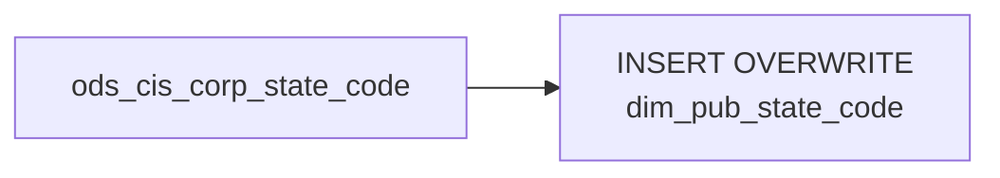

# DIM: State / Province Code Master Pass-Through (`dim_pub_state_code`)

- artifact_type: etl_table
- artifact_id: dim_us.dim_pub_state_code
- domain: common
- one_line_purpose: This job is a full-refresh copy of the CIS state and province code master table into the country-specific dimension schema. It provides a lookup for geographic state and province codes used on customer addresses, shipping destinations, and ...
- layer_type: DIM
- source_kind: etl_sql
- evidence_source: source/etl/sql/common/source/etl/flows/public_order_tools/ingest/public_common_dimension/script/dim_pub_state_code.sql

---

## L1 Data Foundation

### Identity and physical mapping
- **Table:** `dim_us.dim_pub_state_code`
- **Layer type:** DIM
- **Canonical / derived:** Derived / ETL-loaded (see L3)
- **Owner team:** not registered in metadata catalog

### Grain, scope, exclusions
- **Grain:** one row per state/province code within a country.
- **Scope:** See L2 business purpose / L3 filters
- **Partition:** none — full table overwrite. - resolved from pipeline (see L4)
- **Natural key:** `state_code`, `country_code`.
- **Exclusions:** Not documented in repository

#### Grain detail (preserved)

- **Grain:** one row per state/province code within a country.
- **Partition:** none — full table overwrite.
- **Natural key:** `state_code`, `country_code`.

---

### Cross-engine presence
| Engine | Present | Canonical FQN | Notes |
|--------|---------|---------------|-------|
| Hive | yes | `dim_pub_state_code` | ETL target / intermediate per evidence script |
| Vertica | pending | `dim_pub_state_code` | Confirm via hive2vertica flow evidence / MCP |

### Physical schema reference

Pointer block only - full column catalog lives in WKB L1 storage JSON.

| Field | Value |
|-------|-------|
| **Authoritative catalog** | WKB L1 storage seed (not duplicated in this file) |
| **entity_id** | `dim_us.dim_pub_state_code` |
| **l1_catalog_seed** | `target/storage/wkb/snapshots/_snapshot_id_template/l1_catalog/{engine}_{schema}_{table}.json` |
| **column_count** | pending (run ddl_seed_writer) |
| **partition_keys** | `none — full table overwrite.` |
| **ddl_source** | pending Bitbucket DDL / Vertica metadata ingest |
| **retrieval** | `python -m tools.wkb.indexing.run_query --query "common dim_pub_state_code schema" --intent find_table_schema` |

### Lineage
| Object | Role |
|--------|------|
| `ods_${country_code}.ods_cis_corp_state_code` | Sole source |

---

### Freshness and load path
| Item | Value |
|------|-------|
| Load pattern | See L3 end-to-end / INSERT pattern in evidence script |
| Schedule | Not documented in repository |
| Parameters | `country_code` |


---

## L2 Declarative Knowledge

### Business purpose
This job is a full-refresh copy of the CIS state and province code master table into the
country-specific dimension schema. It provides a lookup for geographic state and province codes used
on customer addresses, shipping destinations, and tax jurisdictions. Downstream tables join on
`state_code` + `country_code` to resolve state names and active status.

---

### Audience and use cases
| Audience | How they benefit |
|----------|-----------------|
| **Sales / customer service** | Resolve `state_code` on orders and customer records to a human-readable `state_name` |
| **Compliance / tax** | Validate that a state code is active (`active` flag) for jurisdiction determination |
| **Reporting** | Geographic drill-down by state or province across orders, customers, and inventory |

---

### Identifier search profile
- Primary lookup keys: see natural key under L1 Grain.
- Use latest snapshot / active flags when documented in L3 filters.

### Time field semantics
- **date_flag / partition columns:** none — full table overwrite.
- Primary reporting filter should use the partition column(s) documented in L1; resolve values via L4.

### Metrics served
When exposing this table to the business, lead with:

1. **Geographic lookup:** `state_code`, `state_name`, `country_code`
2. **Validity:** `active`

---

### Metric serving map
N/A - not a `*_comb_mtd` / multi-period wide serving table (or map not present in legacy doc).


### Data products and column groups (preserved)

### Identifiers and relationships

- **Geographic:** `state_code`, `country_code`, `state_name`

### Dimension columns

- `active` — Whether the state/province code is currently active
- `entry_datetime`, `entry_id` — Audit attributes from source

---

### etl_metrics

#### `etl_timestamp`
- **Source:** [metric-index.md](../../source/contracts/common/metric-index.md#etl_timestamp)
- **Business definition:** Load timestamp in Pacific time
```sql
from_utc_timestamp(current_timestamp(), 'America/Los_Angeles')
```


---

## L3 Procedural Knowledge

### Query and routing rules
**Business filters:** Use partition / date keys from L1 grain for reporting scope.
**Technical predicates (load only):** See Key filters and step-by-step logic below.

### Dimension join patterns
| Dimension FQN | Join keys | Purpose | Evidence |
|---------------|-----------|---------|----------|
| See step-by-step / base tables | See L3 steps | Dimension enrichment | `source/etl/sql/common/source/etl/flows/public_order_tools/ingest/public_common_dimension/script/dim_pub_state_code.sql` |

### Key filters and ETL business logic
### Step 1 — Final `INSERT OVERWRITE` into `dim_pub_state_code`

**From:** `ods_${country_code}.ods_cis_corp_state_code`

**Filter:** None — all rows.

**Pass-through columns:**
`state_code`, `country_code`, `state_name`, `active`, `entry_datetime`, `entry_id`

**Derived columns computed at INSERT:**

| Column | Formula | Plain language |
|--------|---------|----------------|
| `etl_timestamp` | `from_utc_timestamp(current_timestamp(), 'America/Los_Angeles')` | Load timestamp in Pacific time |

---

### Standard time-filter SQL
```sql
-- relative period filter using resolved partition value (see L4)
SELECT *
FROM dim_pub_state_code
WHERE /* partition predicate */ date_flag = '${partition_value}';
```

### End-to-end flow
**Runtime parameters:** `country_code`
**Target table:** `dim_${country_code}.dim_pub_state_code` — full table overwrite.

1. Read all rows from `ods_${country_code}.ods_cis_corp_state_code`.
2. **INSERT OVERWRITE** all columns verbatim; add `etl_timestamp`.



---


#### High-level stages (preserved)

| Stage | Business meaning |
|-------|-----------------|
| **Full state code copy** | Reads every row from `ods_cis_corp_state_code` and writes it verbatim to `dim_pub_state_code`; adds an ETL timestamp |

**Parameters:** `country_code`

---


### Base tables register
| Object | Role in this job |
|--------|-----------------|
| `ods_${country_code}.ods_cis_corp_state_code` | Sole source — all state/province attributes |

**Temporary tables (inside the job only):**
None — direct INSERT from source.

---

### Step-by-step logic
### Step 1 — Final `INSERT OVERWRITE` into `dim_pub_state_code`

**From:** `ods_${country_code}.ods_cis_corp_state_code`

**Filter:** None — all rows.

**Pass-through columns:**
`state_code`, `country_code`, `state_name`, `active`, `entry_datetime`, `entry_id`

**Derived columns computed at INSERT:**

| Column | Formula | Plain language |
|--------|---------|----------------|
| `etl_timestamp` | `from_utc_timestamp(current_timestamp(), 'America/Los_Angeles')` | Load timestamp in Pacific time |

---

### Relationship map (embedded)

| from_fqn | to_fqn | cardinality | join_keys | provenance |
|----------|--------|-------------|-----------|------------|
| `ods_${country_code}.ods_cis_corp_state_code` | `ods_${country_code}.ods_cis_corp_state_code` | 1:1 source scan | — (no JOIN; single FROM) | etl_sql (`source/etl/sql/common/public_order_scripts/public_common_dimension/script/dim_pub_state_code.sql:11`) |


### Special logic (embedded)

Not documented in repository

### Column / field derivations (from ETL SQL)

| target_column | expression_sql | upstream_columns | upstream_tables | transform_kind | evidence |
|---------------|----------------|------------------|-----------------|----------------|----------|
| `state_code` | `state_code` | `state_code` | `ods_${country_code}.ods_cis_corp_state_code` | passthrough | `source/etl/sql/common/public_order_scripts/public_common_dimension/script/dim_pub_state_code.sql:2` |
| `country_code` | `country_code` | `country_code` | `ods_${country_code}.ods_cis_corp_state_code` | passthrough | `source/etl/sql/common/public_order_scripts/public_common_dimension/script/dim_pub_state_code.sql:2` |
| `state_name` | `state_name` | `state_name` | `ods_${country_code}.ods_cis_corp_state_code` | passthrough | `source/etl/sql/common/public_order_scripts/public_common_dimension/script/dim_pub_state_code.sql:6` |
| `active` | `active` | `active` | `ods_${country_code}.ods_cis_corp_state_code` | passthrough | `source/etl/sql/common/public_order_scripts/public_common_dimension/script/dim_pub_state_code.sql:7` |
| `entry_datetime` | `entry_datetime` | `entry_datetime` | `ods_${country_code}.ods_cis_corp_state_code` | passthrough | `source/etl/sql/common/public_order_scripts/public_common_dimension/script/dim_pub_state_code.sql:8` |
| `entry_id` | `entry_id` | `entry_id` | `ods_${country_code}.ods_cis_corp_state_code` | passthrough | `source/etl/sql/common/public_order_scripts/public_common_dimension/script/dim_pub_state_code.sql:9` |
| `etl_timestamp` | `from_utc_timestamp(current_timestamp(), 'America/Los_Angeles')` | `from_utc_timestamp`, `current_timestamp`, `America`, `Los_Angeles` | `ods_${country_code}.ods_cis_corp_state_code` | arithmetic | `source/etl/sql/common/public_order_scripts/public_common_dimension/script/dim_pub_state_code.sql:10` |

### Sentinel and code values
| Value | Meaning |
|-------|---------|
| `active` | State/province code is valid and in use |

---

---

## L4 Validation

### Resolved partition value
| Step | Source | How partition / date scope is determined |
|------|--------|------------------------------------------|
| 1 | evidence script / flow | See parameters in L1 Freshness and L3 filters - `source/etl/sql/common/source/etl/flows/public_order_tools/ingest/public_common_dimension/script/dim_pub_state_code.sql` |

**Plain language:** Partition and date scope follow Azkaban/bootstrap parameters documented in the source script and orchestrating flow; do not hardcode calendar literals.

### Data quality checks
- Prefer row-count-by-partition, metric sums, and grain duplicate checks (see Validation SQL).
- Additional checks from legacy caveats / operational notes when present.

### Validation SQL
```sql
-- 1) Row count by partition
SELECT ${partition_col}, COUNT(*) AS row_cnt
FROM dim_${country_code}.dim_pub_state_code
WHERE ${partition_col} = '${partition_value}'
GROUP BY ${partition_col};

-- 2) Metric sum by business dimension (top deltas)
SELECT ${dim_key}, SUM(${metric}) AS metric_sum
FROM dim_${country_code}.dim_pub_state_code
WHERE ${partition_col} = '${partition_value}'
GROUP BY ${dim_key}
ORDER BY ABS(SUM(${metric})) DESC
LIMIT 20;

-- 3) Grain duplicate check
SELECT ${grain_key_1}, ${grain_key_2}, ${grain_key_3}, ${partition_col}, COUNT(*) AS cnt
FROM dim_${country_code}.dim_pub_state_code
WHERE ${partition_col} = '${partition_value}'
GROUP BY ${grain_key_1}, ${grain_key_2}, ${grain_key_3}, ${partition_col}
HAVING COUNT(*) > 1;
```

Replace placeholders from this file's Grain and keys / Data you can fetch sections, and use the resolved partition value from run scope.

### Caveats for interpretation
- **Verbatim copy:** All data is passed through without transformation.
- **Full refresh:** Inactive or deleted codes in the source are reflected on the next run.

---

### Conflicts and open questions
- Schedule, owner, SLA: Not documented in repository (unless preserved schedule evidence above).
- Vertica MCP verification: pending unless confirmed in L5.


---

## L5 Runtime View

### Query path and engine preference
| Role | Hive object | Vertica object | Sync mode | Evidence | MCP verified |
|------|-------------|----------------|-----------|----------|--------------|
| **Query for reporting** | *See script lineage* | `dim_${country_code}.dim_pub_state_code` | *Verify from flow* | *Add flow file:line* | pending |
| **Hive alternative** | `*` | `dim_${country_code}.dim_pub_state_code` | - | *See dependencies* | - |
| **ETL internal** | staging/temp tables | *Not synced to Vertica* | - | *See step-by-step logic* | - |

Business users should query `dim_${country_code}.dim_pub_state_code` in Vertica once MCP verification is completed for this document.

### Access constraints
- Country / company schema parameters may apply (`literal_country`, `company_no`, etc.).
- Hive-only staging objects are not reporting surfaces unless synced.

### Query risk profile
| Field | Value |
|-------|-------|
| requires_date_predicate | unknown |
| scan_risk_tier | medium |

---

## L6 Access and Consumption

### Primary consumers and use cases
| Audience | How they benefit |
|----------|-----------------|
| **Sales / customer service** | Resolve `state_code` on orders and customer records to a human-readable `state_name` |
| **Compliance / tax** | Validate that a state code is active (`active` flag) for jurisdiction determination |
| **Reporting** | Geographic drill-down by state or province across orders, customers, and inventory |

---

### Representative query patterns
```sql
-- certified / illustrative lookup - replace predicates from L1/L4
SELECT *
FROM dim_pub_state_code
WHERE date_flag = '${partition_value}'
LIMIT 100;
```

### Dependencies and notes
### Upstream objects (verified)

| Object | Usage | Evidence |
|--------|-------|----------|
| `ods_${country_code}.ods_cis_corp_state_code` | All columns — verbatim pass-through | `source/etl/sql/common/source/etl/flows/public_order_tools/ingest/public_common_dimension/script/dim_pub_state_code.sql:12` |

### Downstream consumers (verified)

None identified in repository.

### Operational detail (verified)

- Full table overwrite: `source/etl/sql/common/source/etl/flows/public_order_tools/ingest/public_common_dimension/script/dim_pub_state_code.sql:1`

### Not documented in repository

- Schedule, owner, SLA — not in scripts or configs

---

*Document generated from `source/etl/sql/common/source/etl/flows/public_order_tools/ingest/public_common_dimension/script/dim_pub_state_code.sql`.*

#### Not documented in repository
- Owner, SLA (unless schedule evidence preserved above)
- Any dependency without `file:line` evidence in this document

---

*Document migrated to L1-L6 from legacy Knowledgebase content. Evidence: `source/etl/sql/common/source/etl/flows/public_order_tools/ingest/public_common_dimension/script/dim_pub_state_code.sql`.*
