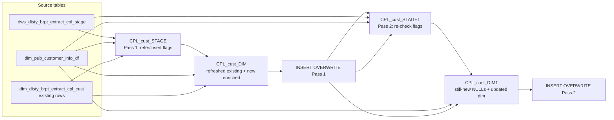

# DIM: CPL Customer Dimension (`dim_disty_brpt_extract_cpl_cust`)

- artifact_type: etl_table
- artifact_id: dim_us.dim_disty_brpt_extract_cpl_cust
- domain: cpl
- one_line_purpose: This dimension table maintains the set of customers participating in the CPL (Customer Profitability & Loss) reporting extract. It resolves customer name, territory, and type from the public customer information dimension, and tracks any cu...
- layer_type: DIM
- source_kind: etl_sql
- evidence_source: source/etl/sql/cpl/data_service/cpl_extract/sql/dim_disty_brpt_extract_cpl_cust.sql

---

## L1 Data Foundation

### Identity and physical mapping
- **Table:** `dim_us.dim_disty_brpt_extract_cpl_cust`
- **Layer type:** DIM
- **Canonical / derived:** Derived / ETL-loaded (see L3)
- **Owner team:** not registered in metadata catalog

### Grain, scope, exclusions
- **Grain:** one row per distinct `cust_no` (deduplicated by `GROUP BY` on all four columns at write time).
- **Scope:** See L2 business purpose / L3 filters
- **Partition:** none — full overwrite each run. - resolved from pipeline (see L4)
- **Natural key:** `cust_no`.
- **Exclusions:** Not documented in repository

#### Grain detail (preserved)

- **Grain:** one row per distinct `cust_no` (deduplicated by `GROUP BY` on all four columns at write time).
- **Partition:** none — full overwrite each run.
- **Natural key:** `cust_no`.

---

### Cross-engine presence
| Engine | Present | Canonical FQN | Notes |
|--------|---------|---------------|-------|
| Hive | yes | `dim_disty_brpt_extract_cpl_cust` | ETL target / intermediate per evidence script |
| Vertica | pending | `dim_disty_brpt_extract_cpl_cust` | Confirm via hive2vertica flow evidence / MCP |

### Physical schema reference

Pointer block only - full column catalog lives in WKB L1 storage JSON.

| Field | Value |
|-------|-------|
| **Authoritative catalog** | WKB L1 storage seed (not duplicated in this file) |
| **entity_id** | `dim_us.dim_disty_brpt_extract_cpl_cust` |
| **l1_catalog_seed** | `target/storage/wkb/snapshots/_snapshot_id_template/l1_catalog/{engine}_{schema}_{table}.json` |
| **column_count** | pending (run ddl_seed_writer) |
| **partition_keys** | `none — full overwrite each run.` |
| **ddl_source** | pending Bitbucket DDL / Vertica metadata ingest |
| **retrieval** | `python -m tools.wkb.indexing.run_query --query "cpl dim_disty_brpt_extract_cpl_cust schema" --intent find_table_schema` |

### Lineage
| Object | Role |
|--------|------|
| `dws_disty_brpt_extract_cpl_stage` | Primary source of customer codes in the CPL extract. |
| `dim_pub_customer_info_df` | Corporate customer master — name, type, territory. |
| `dim_disty_brpt_extract_cpl_cust` | Target dimension — read back to detect and preserve existing rows. |

---

### Freshness and load path
| Item | Value |
|------|-------|
| Load pattern | See L3 end-to-end / INSERT pattern in evidence script |
| Schedule | Not documented in repository |
| Parameters | `${literal_target_db}`, `${literal_source_db}`, `${literal_dim_db}`, `${date_flag}` |


---

## L2 Declarative Knowledge

### Business purpose
This dimension table maintains the set of customers participating in the CPL (Customer Profitability & Loss) reporting extract. It resolves customer name, territory, and type from the public customer information dimension, and tracks any customer active in CPL staging even if not yet fully resolved in the corporate customer master. The table supports all customer-level slicing in CPL P&L reports, tying financial data to customer attributes such as sales territory and customer type.

---

### Audience and use cases
| Audience | How they benefit |
|----------|-----------------|
| **CPL Reporting** | Provides a reliable lookup from `cust_no` to customer name, sales territory, and customer type for P&L grouping and filtering. |
| **Data Engineers** | Maintains an always-current customer master for CPL — both a primary lookup pass (enriched) and a fallback pass (NULL attributes) ensure no customer in staging is left without a dim row. |

---

### Identifier search profile
- Primary lookup keys: see natural key under L1 Grain.
- Use latest snapshot / active flags when documented in L3 filters.

### Time field semantics
- **date_flag / partition columns:** none — full overwrite each run.
- Primary reporting filter should use the partition column(s) documented in L1; resolve values via L4.


### Metrics served

| Category | Column | Logical metric | Business reading |
|----------|--------|----------------|------------------|
| Measures | — | — | No measure columns mapped for this table. |

### Metric serving map

**Formula authority:** [`source/contracts/cpl/metric-index.md`](../../source/contracts/cpl/metric-index.md)

N/A — no measure columns mapped for this table.

### etl_metrics

No governed logical metrics from `source/contracts/cpl/metric-index.md` are mapped on this table.

---

### Metric serving map
N/A - not a `*_comb_mtd` / multi-period wide serving table (or map not present in legacy doc).


### Data products and column groups (preserved)

### Identifiers and relationships

- **Customer:** `cust_no`, `cust_name`
- **Territory:** `cust_terr`
- **Type:** `cust_type`

### Dimension columns (reporting-ready, pre-computed from source)

Use these for **filters, group-bys, and star-schema joins**:

- `cust_no` — unique customer number, links to transaction data
- `cust_name` — customer name resolved from `dim_pub_customer_info_df`
- `cust_type` — customer type code; updated from current public customer info when available, NULL when customer has no match
- `cust_terr` — sales territory; updated from current public customer info when available, NULL for unresolved customers

> **Note:** Customers not found in `dim_pub_customer_info_df` receive NULL `cust_type` and `cust_terr`. This is by design to avoid blocking CPL data loads.

---

### etl_metrics

#### `refer_flag`
- **Source:** [metric-index.md](../../source/contracts/cpl/metric-index.md#refer_flag)
- **Business definition:** `'Y'` when the customer is NOT in public customer info (unresolved).
```sql
CASE WHEN dim_pub_customer_info_df.cust_no IS NOT NULL THEN 'N' ELSE 'Y' END
```

#### `insert_flag`
- **Source:** [metric-index.md](../../source/contracts/cpl/metric-index.md#insert_flag)
- **Business definition:** `'Y'` when the customer is NOT yet in the CPL dim (new).
```sql
CASE WHEN dim_disty_brpt_extract_cpl_cust.cust_no IS NOT NULL THEN 'N' ELSE 'Y' END
```

#### `cust_terr`
- **Source:** [metric-index.md](../../source/contracts/cpl/metric-index.md#cust_terr)
- **Business definition:** Territory set only for new customers; NULL for existing ones.
```sql
CASE WHEN d.cust_no IS NULL THEN m.sales_terr END
```

#### `cust_type`
- **Source:** [metric-index.md](../../source/contracts/cpl/metric-index.md#cust_type)
- **Business definition:** Type set only for new customers; NULL for existing ones.
```sql
CASE WHEN d.cust_no IS NULL THEN m.cust_type END
```


---

## L3 Procedural Knowledge

### Query and routing rules
**Business filters:** Use partition / date keys from L1 grain for reporting scope.
**Technical predicates (load only):** See Key filters and step-by-step logic below.

### Dimension join patterns
| Dimension FQN | Join keys | Purpose | Evidence |
|---------------|-----------|---------|----------|
| See step-by-step / base tables | See L3 steps | Dimension enrichment | `source/etl/sql/cpl/data_service/cpl_extract/sql/dim_disty_brpt_extract_cpl_cust.sql` |

### Key filters and ETL business logic
### Step 1 — `CPL_cust_STAGE` (Pass 1 flag check)

**Source:** `dws_disty_brpt_extract_cpl_stage`

**Filter (natural language):**
- `cust_no != 0` — excludes the "no customer" sentinel.
- `date_flag = '${date_flag}'` — scoped to the processing date.

**Derived columns:**

| Column | Formula | Plain language |
|--------|---------|----------------|
| `refer_flag` | `CASE WHEN dim_pub_customer_info_df.cust_no IS NOT NULL THEN 'N' ELSE 'Y' END` | `'Y'` when the customer is NOT in public customer info (unresolved). |
| `insert_flag` | `CASE WHEN dim_disty_brpt_extract_cpl_cust.cust_no IS NOT NULL THEN 'N' ELSE 'Y' END` | `'Y'` when the customer is NOT yet in the CPL dim (new). |
| `change_flag` | Hardcoded `'N'` | Reserved; no change detection implemented. |
| `cust_terr` | `CASE WHEN d.cust_no IS NULL THEN m.sales_terr END` | Territory set only for new customers; NULL for existing ones. |
| `cust_type` | `CASE WHEN d.cust_no IS NULL THEN m.cust_type END` | Type set only for new customers; NULL for existing ones. |

---

### Step 2 — `CPL_cust_DIM` (Pass 1 merge)

**Sources:** `dim_disty_brpt_extract_cpl_cust` (existing), `CPL_cust_STAGE`, `dim_pub_customer_info_df`

**Branch A — existing rows refreshed:**
- All rows from the current dim are returned.
- `cust_type` is overridden with `m.cust_type` when a public customer record exists; otherwise the dim's own `cust_type` is kept.
- `cust_terr` is overridden with `m.sales_terr` when a public customer record exists; otherwise the dim...

### Standard time-filter SQL
```sql
-- relative period filter using resolved partition value (see L4)
SELECT *
FROM dim_disty_brpt_extract_cpl_cust
WHERE /* partition predicate */ date_flag = '${partition_value}';
```

### End-to-end flow
**Runtime parameters:** `${date_flag}`, `${literal_target_db}`, `${literal_source_db}`, `${literal_dim_db}`
**Target table:** `dim_disty_brpt_extract_cpl_cust` (non-partitioned dimension).

1. **Pass 1 — Stage check:** Read distinct `cust_no` from CPL staging (excluding 0, scoped to `date_flag`) and determine `refer_flag` / `insert_flag`.
2. **Pass 1 — Build CPL_cust_DIM:** UNION of (a) existing dim rows with refreshed `cust_type`/`cust_terr` from current public info, and (b) new customers joining to public info for name/type. INSERT OVERWRITE.
3. **Pass 2 — Stage check:** Re-read distinct `cust_no` from CPL staging (no `cust_no != 0` filter) and re-determine flags against the now-updated dim.
4. **Pass 2 — Build CPL_cust_DIM1:** UNION of (a) still-new customers with `cust_type=NULL`, `cust_terr=NULL`, and (b) all current dim rows. INSERT OVERWRITE.



---


#### High-level stages (preserved)

| Stage | Business meaning |
|-------|-----------------|
| **Stage check (Pass 1)** | Scans CPL staging for distinct `cust_no` codes and flags which ones exist in `dim_pub_customer_info_df` (`refer_flag`) and which are not yet in the CPL customer dim (`insert_flag`). Excludes `cust_no = 0`. |
| **Update existing + add new (Pass 1)** | Merges existing dim rows (refreshing `cust_type` and `cust_terr` from current public customer info) with newly found customers, then writes the full set back to the dimension. |
| **Stage check (Pass 2)** | Re-checks the CPL staging table — without the `cust_no != 0` filter and without date scoping — to catch any remaining new customers that were not picked up in Pass 1. |
| **Second upsert (Pass 2)** | Adds any still-missing customers (with `cust_type` and `cust_terr` NULL) and merges with the now-updated dim, then writes back. |

**Parameters:** `${literal_target_db}`, `${literal_source_db}`, `${literal_dim_db}`, `${date_flag}`

---


### Base tables register
| Object | Role in this job |
|--------|-----------------|
| `dws_disty_brpt_extract_cpl_stage` | Primary source — provides distinct `cust_no` codes seen in CPL data, filtered by `date_flag`. |
| `dim_pub_customer_info_df` | Public customer dimension — provides `cust_name`, `cust_type`, `sales_terr`; joined on `cust_no` and `date_flag`. |
| `dim_disty_brpt_extract_cpl_cust` | Target and read-back source — current dim rows are read to detect existing customers and carry forward unchanged rows. |

**Temporary views (inside the job only):**
`CPL_cust_STAGE` → `CPL_cust_DIM` → (INSERT OVERWRITE Pass 1) → `CPL_cust_STAGE1` → `CPL_cust_DIM1` → (INSERT OVERWRITE Pass 2)

---

### Step-by-step logic
### Step 1 — `CPL_cust_STAGE` (Pass 1 flag check)

**Source:** `dws_disty_brpt_extract_cpl_stage`

**Filter (natural language):**
- `cust_no != 0` — excludes the "no customer" sentinel.
- `date_flag = '${date_flag}'` — scoped to the processing date.

**Derived columns:**

| Column | Formula | Plain language |
|--------|---------|----------------|
| `refer_flag` | `CASE WHEN dim_pub_customer_info_df.cust_no IS NOT NULL THEN 'N' ELSE 'Y' END` | `'Y'` when the customer is NOT in public customer info (unresolved). |
| `insert_flag` | `CASE WHEN dim_disty_brpt_extract_cpl_cust.cust_no IS NOT NULL THEN 'N' ELSE 'Y' END` | `'Y'` when the customer is NOT yet in the CPL dim (new). |
| `change_flag` | Hardcoded `'N'` | Reserved; no change detection implemented. |
| `cust_terr` | `CASE WHEN d.cust_no IS NULL THEN m.sales_terr END` | Territory set only for new customers; NULL for existing ones. |
| `cust_type` | `CASE WHEN d.cust_no IS NULL THEN m.cust_type END` | Type set only for new customers; NULL for existing ones. |

---

### Step 2 — `CPL_cust_DIM` (Pass 1 merge)

**Sources:** `dim_disty_brpt_extract_cpl_cust` (existing), `CPL_cust_STAGE`, `dim_pub_customer_info_df`

**Branch A — existing rows refreshed:**
- All rows from the current dim are returned.
- `cust_type` is overridden with `m.cust_type` when a public customer record exists; otherwise the dim's own `cust_type` is kept.
- `cust_terr` is overridden with `m.sales_terr` when a public customer record exists; otherwise the dim's own `cust_terr` is kept.

**Branch B — new rows from staging:**
- Only rows where `refer_flag='Y'` (not in public customer master) AND `insert_flag='Y'` (not in dim).
- Joined to public customer info for `cust_name` and `cust_type`; `cust_terr` is NULL.

---

### Step 3 — INSERT OVERWRITE Pass 1 into `dim_disty_brpt_extract_cpl_cust`

**From:** `CPL_cust_DIM`
**Deduplication:** `GROUP BY cust_no, cust_name, cust_type, cust_terr`

---

### Step 4 — `CPL_cust_STAGE1` (Pass 2 flag check)

**Source:** `dws_disty_brpt_extract_cpl_stage` (no `cust_no != 0` filter this time; no date filter)

**Derived columns:**
- `refer_flag` — `'Y'` if `cust_no` found in `dim_pub_customer_info_df` for `date_flag`.
- `insert_flag` — `'Y'` if `cust_no` not yet in the updated dim.

---

### Step 5 — `CPL_cust_DIM1` (Pass 2 merge)

**Branch A — still-new customers:**
- Rows where `refer_flag='Y'` AND `insert_flag='Y'`.
- Left-joined to public customer info; `cust_type = NULL`, `cust_terr = NULL`.

**Branch B — current dim:**
- All rows from the dim as updated by Pass 1 INSERT OVERWRITE.

---

### Step 6 — INSERT OVERWRITE Pass 2 into `dim_disty_brpt_extract_cpl_cust`

**From:** `CPL_cust_DIM1`
**Deduplication:** `GROUP BY cust_no, cust_name, cust_type, cust_terr`

---

### Relationship map (embedded)

| from_fqn | to_fqn | cardinality | join_keys | provenance |
|----------|--------|-------------|-----------|------------|
| `${literal_target_db}.dws_disty_brpt_extract_cpl_stage` | `${literal_dim_db}.dim_pub_customer_info_df` | many:1 | `i.cust_no = m.cust_no AND m.date_flag = '${date_flag}'` | etl_sql (source/etl/sql/cpl/data_service/cpl_extract/sql/dim_disty_brpt_extract_cpl_cust.sql:1) |
| `${literal_dim_db}.dim_disty_brpt_extract_cpl_cust` | `${literal_dim_db}.dim_pub_customer_info_df` | many:1 | `d.cust_no = m.cust_no AND m.date_flag = '${date_flag}'` | etl_sql (source/etl/sql/cpl/data_service/cpl_extract/sql/dim_disty_brpt_extract_cpl_cust.sql:1) |
| `${literal_target_db}.dws_disty_brpt_extract_cpl_stage` | `${literal_dim_db}.dim_pub_customer_info_df` | many:1 | `i.cust_no = m.cust_no and m.date_flag = '${date_flag}'` | etl_sql (source/etl/sql/cpl/data_service/cpl_extract/sql/dim_disty_brpt_extract_cpl_cust.sql:1) |

`source/ref/cpl/table relationship.txt`: Not documented in repository.

### Special logic (embedded)

Not documented in repository

### Column / field derivations (from ETL SQL)

| target_column | expression_sql | upstream_columns | upstream_tables | transform_kind | evidence |
|---------------|----------------|------------------|-----------------|----------------|----------|
| `cust_no` | `cust_no` | `cust_no` | `CPL_cust_DIM`, `${literal_target_db}.dws_disty_brpt_extract_cpl_stage`, `${literal_dim_db}.dim_pub_customer_info_df`, `${literal_dim_db}.dim_disty_brpt_extract_cpl_cust`, `CPL_cust_STAGE1`, `CPL_cust_DIM1` | passthrough | `source/etl/sql/cpl/data_service/cpl_extract/sql/dim_disty_brpt_extract_cpl_cust.sql:3` |
| `cust_name` | `cust_name` | `cust_name` | `CPL_cust_DIM`, `${literal_target_db}.dws_disty_brpt_extract_cpl_stage`, `${literal_dim_db}.dim_pub_customer_info_df`, `${literal_dim_db}.dim_disty_brpt_extract_cpl_cust`, `CPL_cust_STAGE1`, `CPL_cust_DIM1` | passthrough | `source/etl/sql/cpl/data_service/cpl_extract/sql/dim_disty_brpt_extract_cpl_cust.sql:22` |
| `cust_type` | `cust_type` | `cust_type` | `CPL_cust_DIM`, `${literal_target_db}.dws_disty_brpt_extract_cpl_stage`, `${literal_dim_db}.dim_pub_customer_info_df`, `${literal_dim_db}.dim_disty_brpt_extract_cpl_cust`, `CPL_cust_STAGE1`, `CPL_cust_DIM1` | passthrough | `source/etl/sql/cpl/data_service/cpl_extract/sql/dim_disty_brpt_extract_cpl_cust.sql:5` |
| `cust_terr` | `cust_terr` | `cust_terr` | `CPL_cust_DIM`, `${literal_target_db}.dws_disty_brpt_extract_cpl_stage`, `${literal_dim_db}.dim_pub_customer_info_df`, `${literal_dim_db}.dim_disty_brpt_extract_cpl_cust`, `CPL_cust_STAGE1`, `CPL_cust_DIM1` | passthrough | `source/etl/sql/cpl/data_service/cpl_extract/sql/dim_disty_brpt_extract_cpl_cust.sql:4` |

### Sentinel and code values
| Value | Meaning |
|-------|---------|
| `cust_no = 0` | "No customer" sentinel — excluded from Pass 1 but not Pass 2. |
| `cust_type = NULL` | Customer not found in public customer master at time of load. |
| `cust_terr = NULL` | Territory not resolved from public customer master. |
| `refer_flag = 'Y'` | Customer is NOT in `dim_pub_customer_info_df` (unresolved). |
| `insert_flag = 'Y'` | Customer is NOT yet in the CPL dim (new). |

---

---

## L4 Validation

### Resolved partition value
| Step | Source | How partition / date scope is determined |
|------|--------|------------------------------------------|
| 1 | evidence script / flow | See parameters in L1 Freshness and L3 filters - `source/etl/sql/cpl/data_service/cpl_extract/sql/dim_disty_brpt_extract_cpl_cust.sql` |

**Plain language:** Partition and date scope follow Azkaban/bootstrap parameters documented in the source script and orchestrating flow; do not hardcode calendar literals.

### Data quality checks
- Prefer row-count-by-partition, metric sums, and grain duplicate checks (see Validation SQL).
- Additional checks from legacy caveats / operational notes when present.

### Validation SQL
```sql
-- 1) Row count by partition
SELECT ${partition_col}, COUNT(*) AS row_cnt
FROM dim_pub_customer_info_df.cust_no
WHERE ${partition_col} = '${partition_value}'
GROUP BY ${partition_col};

-- 2) Metric sum by business dimension (top deltas)
SELECT ${dim_key}, SUM(${metric}) AS metric_sum
FROM dim_pub_customer_info_df.cust_no
WHERE ${partition_col} = '${partition_value}'
GROUP BY ${dim_key}
ORDER BY ABS(SUM(${metric})) DESC
LIMIT 20;

-- 3) Grain duplicate check
SELECT ${grain_key_1}, ${grain_key_2}, ${grain_key_3}, ${partition_col}, COUNT(*) AS cnt
FROM dim_pub_customer_info_df.cust_no
WHERE ${partition_col} = '${partition_value}'
GROUP BY ${grain_key_1}, ${grain_key_2}, ${grain_key_3}, ${partition_col}
HAVING COUNT(*) > 1;
```

Replace placeholders from this file's Grain and keys / Data you can fetch sections, and use the resolved partition value from run scope.

### Caveats for interpretation
- The two-pass design exists to handle customers that appear in staging but have no match in the public customer dimension. Pass 2 inserts them with NULL attributes rather than dropping them.
- `cust_type` and `cust_terr` for existing rows are refreshed on every run based on the current `dim_pub_customer_info_df` snapshot for `date_flag`. Historical territory/type assignments in this dim are overwritten.
- Rows with all four group-by columns identical are collapsed by `GROUP BY` at write time.

---

### Conflicts and open questions
- Schedule, owner, SLA: Not documented in repository (unless preserved schedule evidence above).
- Vertica MCP verification: pending unless confirmed in L5.


---

## L5 Runtime View

### Query path and engine preference
| Role | Hive object | Vertica object | Sync mode | Evidence | MCP verified |
|------|-------------|----------------|-----------|----------|--------------|
| **Query for reporting** | *See script lineage* | `dim_pub_customer_info_df.cust_no` | *Verify from flow* | *Add flow file:line* | pending |
| **Hive alternative** | `*` | `dim_pub_customer_info_df.cust_no` | - | *See dependencies* | - |
| **ETL internal** | staging/temp tables | *Not synced to Vertica* | - | *See step-by-step logic* | - |

Business users should query `dim_pub_customer_info_df.cust_no` in Vertica once MCP verification is completed for this document.

### Access constraints
- Country / company schema parameters may apply (`literal_country`, `company_no`, etc.).
- Hive-only staging objects are not reporting surfaces unless synced.

### Query risk profile
| Field | Value |
|-------|-------|
| requires_date_predicate | unknown |
| scan_risk_tier | medium |

---

## L6 Access and Consumption

### Primary consumers and use cases
| Audience | How they benefit |
|----------|-----------------|
| **CPL Reporting** | Provides a reliable lookup from `cust_no` to customer name, sales territory, and customer type for P&L grouping and filtering. |
| **Data Engineers** | Maintains an always-current customer master for CPL — both a primary lookup pass (enriched) and a fallback pass (NULL attributes) ensure no customer in staging is left without a dim row. |

---

### Representative query patterns
```sql
-- certified / illustrative lookup - replace predicates from L1/L4
SELECT *
FROM dim_disty_brpt_extract_cpl_cust
WHERE date_flag = '${partition_value}'
LIMIT 100;
```

### Dependencies and notes
### Upstream objects (verified)

| Object | Usage | Evidence |
|--------|-------|----------|
| `dws_disty_brpt_extract_cpl_stage` | Source of distinct `cust_no` codes | `dim_disty_brpt_extract_cpl_cust.sql:9,57` |
| `dim_pub_customer_info_df` | Customer name, type, territory lookup | `dim_disty_brpt_extract_cpl_cust.sql:10,35,58,70` |
| `dim_disty_brpt_extract_cpl_cust` | Existing dim rows read and rewritten | `dim_disty_brpt_extract_cpl_cust.sql:13,25,60,75` |

### Downstream consumers (verified)

| Object / script | Evidence |
|-----------------|----------|
| None identified in repository. | — |

### Operational detail (verified)

- Two sequential `INSERT OVERWRITE` operations per run — full table rewrite each time.
- `date_flag` parameter scopes the public customer info lookup.

### Not documented in repository

- Schedule, owner, SLA — not in scripts or configs.
- Whether `change_flag` column in the staging view is used downstream.

---

*Document generated from `source/etl/sql/cpl/data_service/cpl_extract/sql/dim_disty_brpt_extract_cpl_cust.sql`.*

#### Not documented in repository
- Owner, SLA (unless schedule evidence preserved above)
- Any dependency without `file:line` evidence in this document

---

*Document migrated to L1-L6 from legacy Knowledgebase content. Evidence: `source/etl/sql/cpl/data_service/cpl_extract/sql/dim_disty_brpt_extract_cpl_cust.sql`.*
