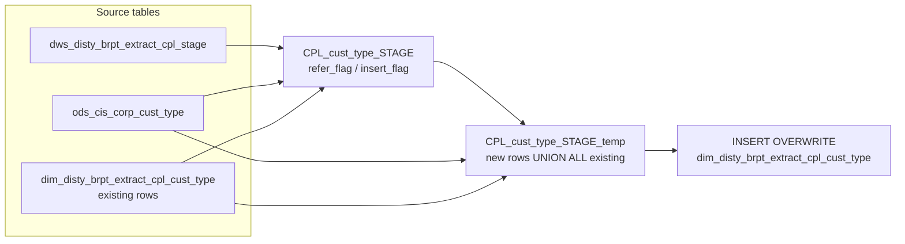

# DIM: CPL Customer Type Dimension (`dim_disty_brpt_extract_cpl_cust_type`)

- artifact_type: etl_table
- artifact_id: dim_us.dim_disty_brpt_extract_cpl_cust_type
- domain: cpl
- one_line_purpose: This dimension table maintains the set of customer types seen in the CPL (Customer Profitability & Loss) reporting extract. For each distinct `cust_type` found in the CPL staging table, it resolves a human-readable description from the corp...
- layer_type: DIM
- source_kind: etl_sql
- evidence_source: source/etl/sql/cpl/data_service/cpl_extract/sql/dim_disty_brpt_extract_cpl_cust_type.sql

---

## L1 Data Foundation

### Identity and physical mapping
- **Table:** `dim_us.dim_disty_brpt_extract_cpl_cust_type`
- **Layer type:** DIM
- **Canonical / derived:** Derived / ETL-loaded (see L3)
- **Owner team:** not registered in metadata catalog

### Grain, scope, exclusions
- **Grain:** one row per distinct `cust_type` code.
- **Scope:** See L2 business purpose / L3 filters
- **Partition:** none — this is a non-partitioned dimension table. - resolved from pipeline (see L4)
- **Natural key:** `cust_type`.
- **Exclusions:** Not documented in repository

#### Grain detail (preserved)

- **Grain:** one row per distinct `cust_type` code.
- **Partition:** none — this is a non-partitioned dimension table.
- **Natural key:** `cust_type`.

---

### Cross-engine presence
| Engine | Present | Canonical FQN | Notes |
|--------|---------|---------------|-------|
| Hive | yes | `dim_disty_brpt_extract_cpl_cust_type` | ETL target / intermediate per evidence script |
| Vertica | pending | `dim_disty_brpt_extract_cpl_cust_type` | Confirm via hive2vertica flow evidence / MCP |

### Physical schema reference

Pointer block only - full column catalog lives in WKB L1 storage JSON.

| Field | Value |
|-------|-------|
| **Authoritative catalog** | WKB L1 storage seed (not duplicated in this file) |
| **entity_id** | `dim_us.dim_disty_brpt_extract_cpl_cust_type` |
| **l1_catalog_seed** | `target/storage/wkb/snapshots/_snapshot_id_template/l1_catalog/{engine}_{schema}_{table}.json` |
| **column_count** | pending (run ddl_seed_writer) |
| **partition_keys** | `none — this is a non-partitioned dimension table.` |
| **ddl_source** | pending Bitbucket DDL / Vertica metadata ingest |
| **retrieval** | `python -m tools.wkb.indexing.run_query --query "cpl dim_disty_brpt_extract_cpl_cust_type schema" --intent find_table_schema` |

### Lineage
| Object | Role |
|--------|------|
| `dws_disty_brpt_extract_cpl_stage` | Primary source of distinct `cust_type` codes. |
| `ods_cis_corp_cust_type` | CIS corporate reference — provides description and validates existence. |
| `dim_disty_brpt_extract_cpl_cust_type` | Target and read-back source for existing rows. |

---

### Freshness and load path
| Item | Value |
|------|-------|
| Load pattern | See L3 end-to-end / INSERT pattern in evidence script |
| Schedule | Not documented in repository |
| Parameters | `${literal_target_db}`, `${literal_source_db}`, `${literal_dim_db}` |


---

## L2 Declarative Knowledge

### Business purpose
This dimension table maintains the set of customer types seen in the CPL (Customer Profitability & Loss) reporting extract. For each distinct `cust_type` found in the CPL staging table, it resolves a human-readable description from the corporate CIS reference data and classifies whether the type belongs to the distributor channel or the manufacturer channel. The table is used as a stable lookup for customer-type groupings in CPL P&L reports.

---

### Audience and use cases
| Audience | How they benefit |
|----------|-----------------|
| **CPL Reporting** | Provides a reliable lookup from raw `cust_type` codes to descriptions and channel flags used in P&L slicing. |
| **Data Engineers** | Acts as a controlled, incremental dimension — only new, CIS-matched types are inserted, preventing orphaned codes from polluting the dim. |

---

### Identifier search profile
- Primary lookup keys: see natural key under L1 Grain.
- Use latest snapshot / active flags when documented in L3 filters.

### Time field semantics
- **date_flag / partition columns:** none — this is a non-partitioned dimension table.
- Primary reporting filter should use the partition column(s) documented in L1; resolve values via L4.


### Metrics served

| Category | Column | Logical metric | Business reading |
|----------|--------|----------------|------------------|
| Measures | — | — | No measure columns mapped for this table. |

### Metric serving map

**Formula authority:** [`source/contracts/cpl/metric-index.md`](../../source/contracts/cpl/metric-index.md)

N/A — no measure columns mapped for this table.

### etl_metrics

No governed logical metrics from `source/contracts/cpl/metric-index.md` are mapped on this table.

---

### Metric serving map
N/A - not a `*_comb_mtd` / multi-period wide serving table (or map not present in legacy doc).


### Data products and column groups (preserved)

### Identifiers and relationships

- **Customer type:** `cust_type`

### Dimension columns (reporting-ready, pre-computed from source)

Use these for **filters, group-bys, and star-schema joins**:

- `cust_type` — customer type code as it appears in transaction data
- `cust_type_desc` — human-readable description sourced from `ods_cis_corp_cust_type`
- `disty_flag` — `'Y'` for all CIS-matched records (distributor channel indicator)
- `mfg_flag` — `'N'` for all new records; reflects manufacturer flag from existing dim rows

> **Note:** All newly inserted rows receive `disty_flag = 'Y'` and `mfg_flag = 'N'` as defaults. Existing rows retain whatever flags were already stored.

---

### etl_metrics

N/A - no calculable ETL formulas extracted from this document (passthrough / stored measures only, or formulas not documented).

---

## L3 Procedural Knowledge

### Query and routing rules
**Business filters:** Use partition / date keys from L1 grain for reporting scope.
**Technical predicates (load only):** See Key filters and step-by-step logic below.

### Dimension join patterns
| Dimension FQN | Join keys | Purpose | Evidence |
|---------------|-----------|---------|----------|
| See step-by-step / base tables | See L3 steps | Dimension enrichment | `source/etl/sql/cpl/data_service/cpl_extract/sql/dim_disty_brpt_extract_cpl_cust_type.sql` |

### Key filters and ETL business logic
### Step 1 — `CPL_cust_type_STAGE`

**Source:** `dws_disty_brpt_extract_cpl_stage` (CPL staging table)

**Filter (natural language):**
- All rows — no date or partition filter applied; distinct `cust_type` values only.

**What happens to columns:**
- `cust_type` — carried through as the key.
- `refer_flag` — `'Y'` if `cust_type` exists in `ods_cis_corp_cust_type`; else `'N'`.
- `insert_flag` — `'Y'` if `cust_type` does NOT exist in `dim_disty_brpt_extract_cpl_cust_type`; else `'N'`.

---

### Step 2 — `CPL_cust_type_STAGE_temp`

**Sources:** `CPL_cust_type_STAGE`, `ods_cis_corp_cust_type`, `dim_disty_brpt_extract_cpl_cust_type`

**What happens:**
- **Branch A (new rows):** Records with `refer_flag='Y'` AND `insert_flag='Y'` are joined to `ods_cis_corp_cust_type` to fetch `cust_type_descr` (aliased to `cust_type_desc`). `disty_flag` is hardcoded `'Y'`; `mfg_flag` is hardcoded `'N'`.
- **Branch B (existing rows):** All current rows from `dim_disty_brpt_extract_cpl_cust_type` are passed through unchanged.
- Both branches are combined with UNION ALL.

---

### Step 3 — Final `INSERT OVERWRITE` into `dim_disty_brpt_extract_cpl_cust_type`

**From:** `CPL_cust_type_STAGE_temp`

**Pass-through columns:**
`cust_type`, `cust_type_desc`, `disty_flag`, `mfg_flag`

---

### Standard time-filter SQL
```sql
-- relative period filter using resolved partition value (see L4)
SELECT *
FROM dim_disty_brpt_extract_cpl_cust_type
WHERE /* partition predicate */ date_flag = '${partition_value}';
```

### End-to-end flow
**Runtime parameters:** `${literal_target_db}`, `${literal_source_db}`, `${literal_dim_db}`
**Target table:** `dim_disty_brpt_extract_cpl_cust_type` (non-partitioned dimension).

1. Read distinct `cust_type` codes from `dws_disty_brpt_extract_cpl_stage` and left-join to `ods_cis_corp_cust_type` (sets `refer_flag`) and to the existing `dim_disty_brpt_extract_cpl_cust_type` (sets `insert_flag`).
2. Build `CPL_cust_type_STAGE_temp`: UNION of (a) new codes where `refer_flag='Y'` and `insert_flag='Y'`, enriched with description and default flags, UNION ALL (b) all existing dim rows.
3. **INSERT OVERWRITE** the dimension table from the combined view.



---


#### High-level stages (preserved)

| Stage | Business meaning |
|-------|-----------------|
| **Stage check** | Scans the CPL staging table for distinct `cust_type` codes and determines which ones already exist in CIS (`refer_flag`) and which are not yet in the dimension (`insert_flag`). |
| **Build candidate set** | Merges newly-discovered types (those in CIS but not yet in the dim) with all existing dim rows into a combined candidate view. |
| **Final INSERT OVERWRITE** | Writes all rows (existing + new) back to the dimension table, enriching each record with description, `disty_flag`, and `mfg_flag` from CIS. |

**Parameters:** `${literal_target_db}`, `${literal_source_db}`, `${literal_dim_db}`

---


### Base tables register
| Object | Role in this job |
|--------|-----------------|
| `dws_disty_brpt_extract_cpl_stage` | Primary source — provides distinct `cust_type` codes seen in the current CPL data. |
| `ods_cis_corp_cust_type` | Reference — provides `cust_type_descr` and validates that a code exists in CIS corporate data (`refer_flag`). |
| `dim_disty_brpt_extract_cpl_cust_type` | Target dimension — read to detect already-loaded types (`insert_flag`) and to carry forward existing rows. |

**Temporary views (inside the job only):**
`CPL_cust_type_STAGE` → `CPL_cust_type_STAGE_temp` → (final `INSERT OVERWRITE`)

---

### Step-by-step logic
### Step 1 — `CPL_cust_type_STAGE`

**Source:** `dws_disty_brpt_extract_cpl_stage` (CPL staging table)

**Filter (natural language):**
- All rows — no date or partition filter applied; distinct `cust_type` values only.

**What happens to columns:**
- `cust_type` — carried through as the key.
- `refer_flag` — `'Y'` if `cust_type` exists in `ods_cis_corp_cust_type`; else `'N'`.
- `insert_flag` — `'Y'` if `cust_type` does NOT exist in `dim_disty_brpt_extract_cpl_cust_type`; else `'N'`.

---

### Step 2 — `CPL_cust_type_STAGE_temp`

**Sources:** `CPL_cust_type_STAGE`, `ods_cis_corp_cust_type`, `dim_disty_brpt_extract_cpl_cust_type`

**What happens:**
- **Branch A (new rows):** Records with `refer_flag='Y'` AND `insert_flag='Y'` are joined to `ods_cis_corp_cust_type` to fetch `cust_type_descr` (aliased to `cust_type_desc`). `disty_flag` is hardcoded `'Y'`; `mfg_flag` is hardcoded `'N'`.
- **Branch B (existing rows):** All current rows from `dim_disty_brpt_extract_cpl_cust_type` are passed through unchanged.
- Both branches are combined with UNION ALL.

---

### Step 3 — Final `INSERT OVERWRITE` into `dim_disty_brpt_extract_cpl_cust_type`

**From:** `CPL_cust_type_STAGE_temp`

**Pass-through columns:**
`cust_type`, `cust_type_desc`, `disty_flag`, `mfg_flag`

---

### Relationship map (embedded)

| from_fqn | to_fqn | cardinality | join_keys | provenance |
|----------|--------|-------------|-----------|------------|
| `${literal_target_db}.dws_disty_brpt_extract_cpl_stage` | `${literal_source_db}.ods_cis_corp_cust_type` | many:1 | `i.cust_type = m.cust_type` | etl_sql (source/etl/sql/cpl/data_service/cpl_extract/sql/dim_disty_brpt_extract_cpl_cust_type.sql:1) |
| `${literal_target_db}.dws_disty_brpt_extract_cpl_stage` | `${literal_dim_db}.dim_disty_brpt_extract_cpl_cust_type` | many:1 | `i.cust_type = d.cust_type; DROP VIEW IF EXISTS CPL_cust_type_STAGE_temp; CREATE TEMPORARY VIEW CPL_cust_type_STAGE_temp AS` | etl_sql (source/etl/sql/cpl/data_service/cpl_extract/sql/dim_disty_brpt_extract_cpl_cust_type.sql:1) |
| `${literal_target_db}.dws_disty_brpt_extract_cpl_stage` | `${literal_source_db}.ods_cis_corp_cust_type` | many:1 | `Not documented in repository` | etl_sql (source/etl/sql/cpl/data_service/cpl_extract/sql/dim_disty_brpt_extract_cpl_cust_type.sql:1) |

`source/ref/cpl/table relationship.txt`: Not documented in repository.

### Special logic (embedded)

Not documented in repository

### Column / field derivations (from ETL SQL)

| target_column | expression_sql | upstream_columns | upstream_tables | transform_kind | evidence |
|---------------|----------------|------------------|-----------------|----------------|----------|
| `cust_type` | `cust_type` | `cust_type` | `CPL_cust_type_STAGE_temp` | passthrough | `source/etl/sql/cpl/data_service/cpl_extract/sql/dim_disty_brpt_extract_cpl_cust_type.sql:1` |
| `cust_type_desc` | `cust_type_desc` | `cust_type_desc` | `CPL_cust_type_STAGE_temp` | passthrough | `source/etl/sql/cpl/data_service/cpl_extract/sql/dim_disty_brpt_extract_cpl_cust_type.sql:16` |
| `disty_flag` | `disty_flag` | `disty_flag` | `CPL_cust_type_STAGE_temp` | passthrough | `source/etl/sql/cpl/data_service/cpl_extract/sql/dim_disty_brpt_extract_cpl_cust_type.sql:17` |
| `mfg_flag` | `mfg_flag` | `mfg_flag` | `CPL_cust_type_STAGE_temp` | passthrough | `source/etl/sql/cpl/data_service/cpl_extract/sql/dim_disty_brpt_extract_cpl_cust_type.sql:18` |

### Sentinel and code values
| Value | Meaning |
|-------|---------|
| `disty_flag = 'Y'` | All newly inserted records are flagged as distributor-channel types. |
| `mfg_flag = 'N'` | All newly inserted records are flagged as non-manufacturer by default. |
| `refer_flag = 'Y'` | `cust_type` exists in CIS corporate reference and is safe to enrich. |
| `insert_flag = 'Y'` | `cust_type` is not yet in the dimension and should be inserted. |

---

---

## L4 Validation

### Resolved partition value
| Step | Source | How partition / date scope is determined |
|------|--------|------------------------------------------|
| 1 | evidence script / flow | See parameters in L1 Freshness and L3 filters - `source/etl/sql/cpl/data_service/cpl_extract/sql/dim_disty_brpt_extract_cpl_cust_type.sql` |

**Plain language:** Partition and date scope follow Azkaban/bootstrap parameters documented in the source script and orchestrating flow; do not hardcode calendar literals.

### Data quality checks
- Prefer row-count-by-partition, metric sums, and grain duplicate checks (see Validation SQL).
- Additional checks from legacy caveats / operational notes when present.

### Validation SQL
```sql
-- 1) row count by partition
-- SELECT partition_col, COUNT(*) FROM dim_disty_brpt_extract_cpl_cust_type WHERE partition_col = '${partition_value}' GROUP BY 1;
-- 2) metric sum by dimension (top N) - replace metric/dim from L2
-- 3) grain duplicate check on natural keys
```


### Caveats for interpretation
- `mfg_flag` defaults to `'N'` for every newly inserted row. Existing rows retain whatever `mfg_flag` was previously set; the script does not update existing rows.
- Only `cust_type` codes that exist in `ods_cis_corp_cust_type` are inserted; codes not found in CIS are silently excluded (no error, no placeholder row).
- The pattern is append-only for new codes — existing rows are never updated by this script.

---

### Conflicts and open questions
- Schedule, owner, SLA: Not documented in repository (unless preserved schedule evidence above).
- Vertica MCP verification: pending unless confirmed in L5.


---

## L5 Runtime View

### Query path and engine preference
| Role | Hive object | Vertica object | Sync mode | Evidence | MCP verified |
|------|-------------|----------------|-----------|----------|--------------|
| **Not in Vertica** | *See script lineage* | *No Vertica mapping identified in repository* | - | *Add flow evidence when found* | no |

No queryable Vertica table has been confirmed for this script from current repository evidence.

### Access constraints
- Country / company schema parameters may apply (`literal_country`, `company_no`, etc.).
- Hive-only staging objects are not reporting surfaces unless synced.

### Query risk profile
| Field | Value |
|-------|-------|
| requires_date_predicate | yes |
| scan_risk_tier | medium |

---

## L6 Access and Consumption

### Primary consumers and use cases
| Audience | How they benefit |
|----------|-----------------|
| **CPL Reporting** | Provides a reliable lookup from raw `cust_type` codes to descriptions and channel flags used in P&L slicing. |
| **Data Engineers** | Acts as a controlled, incremental dimension — only new, CIS-matched types are inserted, preventing orphaned codes from polluting the dim. |

---

### Representative query patterns
```sql
-- certified / illustrative lookup - replace predicates from L1/L4
SELECT *
FROM dim_disty_brpt_extract_cpl_cust_type
WHERE date_flag = '${partition_value}'
LIMIT 100;
```

### Dependencies and notes
### Upstream objects (verified)

| Object | Usage | Evidence |
|--------|-------|----------|
| `dws_disty_brpt_extract_cpl_stage` | Source of distinct `cust_type` codes | `dim_disty_brpt_extract_cpl_cust_type.sql:7` |
| `ods_cis_corp_cust_type` | Reference lookup for description and validation | `dim_disty_brpt_extract_cpl_cust_type.sql:8,20` |
| `dim_disty_brpt_extract_cpl_cust_type` | Existing dim rows read and rewritten | `dim_disty_brpt_extract_cpl_cust_type.sql:10,28` |

### Downstream consumers (verified)

| Object / script | Evidence |
|-----------------|----------|
| None identified in repository. | — |

### Operational detail (verified)

- Full table overwrite (`INSERT OVERWRITE`) — no partition; entire dimension is rewritten each run.

### Not documented in repository

- Schedule, owner, SLA — not in scripts or configs.
- Whether `mfg_flag` is ever set to `'Y'` by another process — not visible in this script.

---

*Document generated from `source/etl/sql/cpl/data_service/cpl_extract/sql/dim_disty_brpt_extract_cpl_cust_type.sql`.*

#### Not documented in repository
- Owner, SLA (unless schedule evidence preserved above)
- Any dependency without `file:line` evidence in this document

---

*Document migrated to L1-L6 from legacy Knowledgebase content. Evidence: `source/etl/sql/cpl/data_service/cpl_extract/sql/dim_disty_brpt_extract_cpl_cust_type.sql`.*
