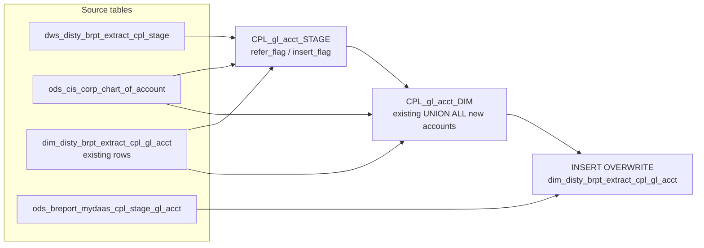

# DIM: CPL GL Account Dimension (`dim_disty_brpt_extract_cpl_gl_acct`)

- artifact_type: etl_table
- artifact_id: dim_us.dim_disty_brpt_extract_cpl_gl_acct
- domain: cpl
- one_line_purpose: This dimension table maintains the set of general ledger account numbers seen in the CPL (Customer Profitability & Loss) reporting extract. It resolves a human-readable description for each GL account from the CIS corporate chart of account...
- layer_type: DIM
- source_kind: etl_sql
- evidence_source: source/etl/sql/cpl/data_service/cpl_extract/sql/dim_disty_brpt_extract_cpl_gl_acct.sql

---

## L1 Data Foundation

### Identity and physical mapping
- **Table:** `dim_us.dim_disty_brpt_extract_cpl_gl_acct`
- **Layer type:** DIM
- **Canonical / derived:** Derived / ETL-loaded (see L3)
- **Owner team:** not registered in metadata catalog

### Grain, scope, exclusions
- **Grain:** one row per distinct `gl_acct_no`.
- **Scope:** See L2 business purpose / L3 filters
- **Partition:** none — full overwrite each run. - resolved from pipeline (see L4)
- **Natural key:** `gl_acct_no`.
- **Exclusions:** Not documented in repository

#### Grain detail (preserved)

- **Grain:** one row per distinct `gl_acct_no`.
- **Partition:** none — full overwrite each run.
- **Natural key:** `gl_acct_no`.

---

### Cross-engine presence
| Engine | Present | Canonical FQN | Notes |
|--------|---------|---------------|-------|
| Hive | yes | `dim_disty_brpt_extract_cpl_gl_acct` | ETL target / intermediate per evidence script |
| Vertica | pending | `dim_disty_brpt_extract_cpl_gl_acct` | Confirm via hive2vertica flow evidence / MCP |

### Physical schema reference

Pointer block only - full column catalog lives in WKB L1 storage JSON.

| Field | Value |
|-------|-------|
| **Authoritative catalog** | WKB L1 storage seed (not duplicated in this file) |
| **entity_id** | `dim_us.dim_disty_brpt_extract_cpl_gl_acct` |
| **l1_catalog_seed** | `target/storage/wkb/snapshots/_snapshot_id_template/l1_catalog/{engine}_{schema}_{table}.json` |
| **column_count** | pending (run ddl_seed_writer) |
| **partition_keys** | `none — full overwrite each run.` |
| **ddl_source** | pending Bitbucket DDL / Vertica metadata ingest |
| **retrieval** | `python -m tools.wkb.indexing.run_query --query "cpl dim_disty_brpt_extract_cpl_gl_acct schema" --intent find_table_schema` |

### Lineage
| Object | Role |
|--------|------|
| `dws_disty_brpt_extract_cpl_stage` | Primary source of distinct `gl_acct_no` values. |
| `ods_cis_corp_chart_of_account` | CIS chart of accounts — description and validation. |
| `dim_disty_brpt_extract_cpl_gl_acct` | Target dimension — read back to carry forward existing rows. |
| `ods_breport_mydaas_cpl_stage_gl_acct` | MyDaaS payroll flag enrichment at INSERT. |

---

### Freshness and load path
| Item | Value |
|------|-------|
| Load pattern | See L3 end-to-end / INSERT pattern in evidence script |
| Schedule | Not documented in repository |
| Parameters | `${literal_target_db}`, `${literal_source_db}`, `${literal_dim_db}` |


---

## L2 Declarative Knowledge

### Business purpose
This dimension table maintains the set of general ledger account numbers seen in the CPL (Customer Profitability & Loss) reporting extract. It resolves a human-readable description for each GL account from the CIS corporate chart of accounts and classifies each account with two categorical flags: whether the account is payroll-related (`payroll_flag`) and whether it belongs to the general "other" expense category (`other_flag`). These flags enable CPL P&L reports to separate payroll expenses from all other GL account categories.

---

### Audience and use cases
| Audience | How they benefit |
|----------|-----------------|
| **CPL Reporting** | Provides description and payroll/other classification for each GL account, enabling P&L reports to distinguish payroll expenses from all other GL account categories. |
| **Data Engineers** | Controlled incremental dimension — only CIS-validated accounts are inserted; `payroll_flag` is refreshed from MyDaaS on every run. |

---

### Identifier search profile
- Primary lookup keys: see natural key under L1 Grain.
- Use latest snapshot / active flags when documented in L3 filters.

### Time field semantics
- **date_flag / partition columns:** none — full overwrite each run.
- Primary reporting filter should use the partition column(s) documented in L1; resolve values via L4.


### Metrics served

| Category | Column | Logical metric | Business reading |
|----------|--------|----------------|------------------|
| Measures | — | — | No measure columns mapped for this table. |

### Metric serving map

**Formula authority:** [`source/contracts/cpl/metric-index.md`](../../source/contracts/cpl/metric-index.md)

N/A — no measure columns mapped for this table.

### etl_metrics

No governed logical metrics from `source/contracts/cpl/metric-index.md` are mapped on this table.

---

### Metric serving map
N/A - not a `*_comb_mtd` / multi-period wide serving table (or map not present in legacy doc).


### Data products and column groups (preserved)

### Identifiers and relationships

- **GL account:** `gl_acct_no`

### Dimension columns (reporting-ready, pre-computed from source)

Use these for **filters, group-bys, and star-schema joins**:

- `gl_acct_no` — GL account number as it appears in transaction data
- `gl_acct_desc` — human-readable description from `ods_cis_corp_chart_of_account`
- `payroll_flag` — `'Y'` if the account is payroll-related (sourced from `ods_breport_mydaas_cpl_stage_gl_acct.payroll_flag`)
- `other_flag` — always `'Y'` for all rows in the final output

> **Note:** `other_flag` is hardcoded `'Y'` at INSERT and is not a meaningful differentiator in the current implementation. New records in the candidate view default to `other_flag = 'Y'` as well.

---

### etl_metrics

#### `refer_flag`
- **Source:** [metric-index.md](../../source/contracts/cpl/metric-index.md#refer_flag)
- **Business definition:** `'Y'` if account exists in CIS chart of accounts.
```sql
CASE WHEN ods_cis_corp_chart_of_account.gl_acct_no IS NOT NULL THEN 'Y' ELSE 'N' END
```

#### `insert_flag`
- **Source:** [metric-index.md](../../source/contracts/cpl/metric-index.md#insert_flag)
- **Business definition:** `'Y'` if account is not yet in the dim.
```sql
CASE WHEN dim_disty_brpt_extract_cpl_gl_acct.gl_acct_no IS NOT NULL THEN 'N' ELSE 'Y' END
```

#### `payroll_flag`
- **Source:** [metric-index.md](../../source/contracts/cpl/metric-index.md#payroll_flag)
- **Business definition:** `'Y'` if MyDaaS marks this GL account as payroll-related.
```sql
CASE WHEN s.payroll_flag = 'Y' THEN 'Y' ELSE 'N' END
```


---

## L3 Procedural Knowledge

### Query and routing rules
**Business filters:** Use partition / date keys from L1 grain for reporting scope.
**Technical predicates (load only):** See Key filters and step-by-step logic below.

### Dimension join patterns
| Dimension FQN | Join keys | Purpose | Evidence |
|---------------|-----------|---------|----------|
| See step-by-step / base tables | See L3 steps | Dimension enrichment | `source/etl/sql/cpl/data_service/cpl_extract/sql/dim_disty_brpt_extract_cpl_gl_acct.sql` |

### Key filters and ETL business logic
### Step 1 — `CPL_gl_acct_STAGE`

**Source:** `dws_disty_brpt_extract_cpl_stage`

**Filter (natural language):**
- `gl_acct_no != 0` — excludes the "no account" sentinel.
- Distinct values only.

**Derived columns:**

| Column | Formula | Plain language |
|--------|---------|----------------|
| `refer_flag` | `CASE WHEN ods_cis_corp_chart_of_account.gl_acct_no IS NOT NULL THEN 'Y' ELSE 'N' END` | `'Y'` if account exists in CIS chart of accounts. |
| `insert_flag` | `CASE WHEN dim_disty_brpt_extract_cpl_gl_acct.gl_acct_no IS NOT NULL THEN 'N' ELSE 'Y' END` | `'Y'` if account is not yet in the dim. |

---

### Step 2 — `CPL_gl_acct_DIM`

**Sources:** `dim_disty_brpt_extract_cpl_gl_acct` (existing), `CPL_gl_acct_STAGE`, `ods_cis_corp_chart_of_account`

**Branch A (existing rows):** Pass through `gl_acct_no`, `gl_acct_desc`, `payroll_flag`, `other_flag` unchanged.

**Branch B (new accounts):** Only rows with `refer_flag='Y'` AND `insert_flag='Y'`. Joined to `ods_cis_corp_chart_of_account` for `gl_acct_desc`. Default `payroll_flag = 'N'`, `other_flag = 'Y'`.

---

### Step 3 — Final `INSERT OVERWRITE` into `dim_disty_brpt_extract_cpl_gl_acct`

**From:** `CPL_gl_acct_DIM` (left-joined to `ods_breport_mydaas_cpl_stage_gl_acct` on `gl_acct_no`)

**Derived columns computed at INSERT:**

| Column | Formula | Plain language |
|--------|---------|----------------|
| `payroll_flag` | `CASE WHEN s.payroll_flag = 'Y' THEN 'Y' ELSE 'N' END` | `'Y'` if MyDaaS marks this GL account as payroll-...

### Standard time-filter SQL
```sql
-- relative period filter using resolved partition value (see L4)
SELECT *
FROM dim_disty_brpt_extract_cpl_gl_acct
WHERE /* partition predicate */ date_flag = '${partition_value}';
```

### End-to-end flow
**Runtime parameters:** `${literal_target_db}`, `${literal_source_db}`, `${literal_dim_db}`
**Target table:** `dim_disty_brpt_extract_cpl_gl_acct` (non-partitioned dimension).

1. Read distinct non-zero `gl_acct_no` from CPL staging and determine `refer_flag` / `insert_flag` against CIS reference and existing dim.
2. Build `CPL_gl_acct_DIM`: UNION of existing dim rows and new CIS-matched accounts with default flags.
3. **INSERT OVERWRITE**: Write combined view, left-joining to `ods_breport_mydaas_cpl_stage_gl_acct` to set final `payroll_flag`; `other_flag` hardcoded `'Y'`.



---


#### High-level stages (preserved)

| Stage | Business meaning |
|-------|-----------------|
| **Stage check** | Scans the CPL staging table for distinct, non-zero `gl_acct_no` values and determines which ones exist in the CIS chart of accounts (`refer_flag`) and which are new to the dimension (`insert_flag`). |
| **Build candidate set** | Merges existing dim rows with newly-discovered accounts (enriched with CIS descriptions and default flags) into a combined view. |
| **Final INSERT OVERWRITE** | Writes all rows back, overriding `payroll_flag` from the MyDaaS CPL stage GL account reference and hardcoding `other_flag = 'Y'` for all rows. |

**Parameters:** `${literal_target_db}`, `${literal_source_db}`, `${literal_dim_db}`

---


### Base tables register
| Object | Role in this job |
|--------|-----------------|
| `dws_disty_brpt_extract_cpl_stage` | Primary source — provides distinct non-zero `gl_acct_no` values from current CPL data. |
| `ods_cis_corp_chart_of_account` | CIS chart of accounts — validates existence (`refer_flag`) and supplies `gl_acct_desc`. |
| `dim_disty_brpt_extract_cpl_gl_acct` | Target and read-back source — existing rows carried forward. |
| `ods_breport_mydaas_cpl_stage_gl_acct` | MyDaaS reference — provides `payroll_flag` at INSERT time. |

**Temporary views (inside the job only):**
`CPL_gl_acct_STAGE` → `CPL_gl_acct_DIM` → (final `INSERT OVERWRITE`)

---

### Step-by-step logic
### Step 1 — `CPL_gl_acct_STAGE`

**Source:** `dws_disty_brpt_extract_cpl_stage`

**Filter (natural language):**
- `gl_acct_no != 0` — excludes the "no account" sentinel.
- Distinct values only.

**Derived columns:**

| Column | Formula | Plain language |
|--------|---------|----------------|
| `refer_flag` | `CASE WHEN ods_cis_corp_chart_of_account.gl_acct_no IS NOT NULL THEN 'Y' ELSE 'N' END` | `'Y'` if account exists in CIS chart of accounts. |
| `insert_flag` | `CASE WHEN dim_disty_brpt_extract_cpl_gl_acct.gl_acct_no IS NOT NULL THEN 'N' ELSE 'Y' END` | `'Y'` if account is not yet in the dim. |

---

### Step 2 — `CPL_gl_acct_DIM`

**Sources:** `dim_disty_brpt_extract_cpl_gl_acct` (existing), `CPL_gl_acct_STAGE`, `ods_cis_corp_chart_of_account`

**Branch A (existing rows):** Pass through `gl_acct_no`, `gl_acct_desc`, `payroll_flag`, `other_flag` unchanged.

**Branch B (new accounts):** Only rows with `refer_flag='Y'` AND `insert_flag='Y'`. Joined to `ods_cis_corp_chart_of_account` for `gl_acct_desc`. Default `payroll_flag = 'N'`, `other_flag = 'Y'`.

---

### Step 3 — Final `INSERT OVERWRITE` into `dim_disty_brpt_extract_cpl_gl_acct`

**From:** `CPL_gl_acct_DIM` (left-joined to `ods_breport_mydaas_cpl_stage_gl_acct` on `gl_acct_no`)

**Derived columns computed at INSERT:**

| Column | Formula | Plain language |
|--------|---------|----------------|
| `payroll_flag` | `CASE WHEN s.payroll_flag = 'Y' THEN 'Y' ELSE 'N' END` | `'Y'` if MyDaaS marks this GL account as payroll-related. |
| `other_flag` | Hardcoded `'Y'` | All accounts are flagged as "other" category in the current implementation. |

**Pass-through columns:** `gl_acct_no`, `gl_acct_desc`

---

### Relationship map (embedded)

| from_fqn | to_fqn | cardinality | join_keys | provenance |
|----------|--------|-------------|-----------|------------|
| `${literal_target_db}.dws_disty_brpt_extract_cpl_stage` | `${literal_source_db}.ods_cis_corp_chart_of_account` | many:1 | `s.gl_acct_no = m.gl_acct_no` | etl_sql (source/etl/sql/cpl/data_service/cpl_extract/sql/dim_disty_brpt_extract_cpl_gl_acct.sql:1) |
| `${literal_target_db}.dws_disty_brpt_extract_cpl_stage` | `${literal_dim_db}.dim_disty_brpt_extract_cpl_gl_acct` | many:1 | `s.gl_acct_no = d.gl_acct_no` | etl_sql (source/etl/sql/cpl/data_service/cpl_extract/sql/dim_disty_brpt_extract_cpl_gl_acct.sql:1) |
| `${literal_target_db}.dws_disty_brpt_extract_cpl_stage` | `${literal_source_db}.ods_cis_corp_chart_of_account` | many:1 | `Not documented in repository` | etl_sql (source/etl/sql/cpl/data_service/cpl_extract/sql/dim_disty_brpt_extract_cpl_gl_acct.sql:1) |
| `${literal_dim_db}.dim_disty_brpt_extract_cpl_gl_acct` | `${literal_source_db}.ods_breport_mydaas_cpl_stage_gl_acct` | many:1 | `d.gl_acct_no = s.gl_acct_no;` | etl_sql (source/etl/sql/cpl/data_service/cpl_extract/sql/dim_disty_brpt_extract_cpl_gl_acct.sql:1) |

`source/ref/cpl/table relationship.txt`: Not documented in repository.

### Special logic (embedded)

Not documented in repository

### Column / field derivations (from ETL SQL)

| target_column | expression_sql | upstream_columns | upstream_tables | transform_kind | evidence |
|---------------|----------------|------------------|-----------------|----------------|----------|
| `gl_acct_no` | `d.gl_acct_no` | `gl_acct_no` | `CPL_gl_acct_DIM`, `${literal_source_db}.ods_breport_mydaas_cpl_stage_gl_acct` | passthrough | `source/etl/sql/cpl/data_service/cpl_extract/sql/dim_disty_brpt_extract_cpl_gl_acct.sql:5` |
| `gl_acct_desc` | `gl_acct_desc` | `gl_acct_desc` | `CPL_gl_acct_DIM`, `${literal_source_db}.ods_breport_mydaas_cpl_stage_gl_acct` | passthrough | `source/etl/sql/cpl/data_service/cpl_extract/sql/dim_disty_brpt_extract_cpl_gl_acct.sql:16` |
| `payroll_flag` | `CASE WHEN s.payroll_flag = 'Y' THEN 'Y' ELSE 'N' END` | `payroll_flag`, `Y`, `N` | `CPL_gl_acct_DIM`, `${literal_source_db}.ods_breport_mydaas_cpl_stage_gl_acct` | case | `source/etl/sql/cpl/data_service/cpl_extract/sql/dim_disty_brpt_extract_cpl_gl_acct.sql:34` |
| `other_flag` | `'Y' other_flag` | `Y`, `other_flag` | `CPL_gl_acct_DIM`, `${literal_source_db}.ods_breport_mydaas_cpl_stage_gl_acct` | partial | `source/etl/sql/cpl/data_service/cpl_extract/sql/dim_disty_brpt_extract_cpl_gl_acct.sql:35` |

### Sentinel and code values
| Value | Meaning |
|-------|---------|
| `gl_acct_no = 0` | "No account" sentinel — excluded from stage check. |
| `payroll_flag = 'N'` (default) | New accounts default to non-payroll; overridden by MyDaaS join at INSERT. |
| `other_flag = 'Y'` (always) | All accounts are classified as "other" in the current implementation. |
| `refer_flag = 'Y'` | Account exists in CIS and can be enriched. |
| `insert_flag = 'Y'` | Account is not yet in the dim and will be inserted. |

---

---

## L4 Validation

### Resolved partition value
| Step | Source | How partition / date scope is determined |
|------|--------|------------------------------------------|
| 1 | evidence script / flow | See parameters in L1 Freshness and L3 filters - `source/etl/sql/cpl/data_service/cpl_extract/sql/dim_disty_brpt_extract_cpl_gl_acct.sql` |

**Plain language:** Partition and date scope follow Azkaban/bootstrap parameters documented in the source script and orchestrating flow; do not hardcode calendar literals.

### Data quality checks
- Prefer row-count-by-partition, metric sums, and grain duplicate checks (see Validation SQL).
- Additional checks from legacy caveats / operational notes when present.

### Validation SQL
```sql
-- 1) Row count by partition
SELECT ${partition_col}, COUNT(*) AS row_cnt
FROM ods_breport_mydaas_cpl_stage_gl_acct.payroll_flag
WHERE ${partition_col} = '${partition_value}'
GROUP BY ${partition_col};

-- 2) Metric sum by business dimension (top deltas)
SELECT ${dim_key}, SUM(${metric}) AS metric_sum
FROM ods_breport_mydaas_cpl_stage_gl_acct.payroll_flag
WHERE ${partition_col} = '${partition_value}'
GROUP BY ${dim_key}
ORDER BY ABS(SUM(${metric})) DESC
LIMIT 20;

-- 3) Grain duplicate check
SELECT ${grain_key_1}, ${grain_key_2}, ${grain_key_3}, ${partition_col}, COUNT(*) AS cnt
FROM ods_breport_mydaas_cpl_stage_gl_acct.payroll_flag
WHERE ${partition_col} = '${partition_value}'
GROUP BY ${grain_key_1}, ${grain_key_2}, ${grain_key_3}, ${partition_col}
HAVING COUNT(*) > 1;
```

Replace placeholders from this file's Grain and keys / Data you can fetch sections, and use the resolved partition value from run scope.

### Caveats for interpretation
- `payroll_flag` is refreshed from MyDaaS on every run for all rows. Changes in `ods_breport_mydaas_cpl_stage_gl_acct` will propagate automatically.
- `other_flag` is always `'Y'` for all rows. Its purpose as a differentiating flag is not activated in this script.
- GL accounts not found in `ods_cis_corp_chart_of_account` are never inserted — no placeholder is created for unresolved codes.

---

### Conflicts and open questions
- Schedule, owner, SLA: Not documented in repository (unless preserved schedule evidence above).
- Vertica MCP verification: pending unless confirmed in L5.


---

## L5 Runtime View

### Query path and engine preference
| Role | Hive object | Vertica object | Sync mode | Evidence | MCP verified |
|------|-------------|----------------|-----------|----------|--------------|
| **Query for reporting** | *See script lineage* | `ods_breport_mydaas_cpl_stage_gl_acct.payroll_flag` | *Verify from flow* | *Add flow file:line* | pending |
| **Hive alternative** | `*` | `ods_breport_mydaas_cpl_stage_gl_acct.payroll_flag` | - | *See dependencies* | - |
| **ETL internal** | staging/temp tables | *Not synced to Vertica* | - | *See step-by-step logic* | - |

Business users should query `ods_breport_mydaas_cpl_stage_gl_acct.payroll_flag` in Vertica once MCP verification is completed for this document.

### Access constraints
- Country / company schema parameters may apply (`literal_country`, `company_no`, etc.).
- Hive-only staging objects are not reporting surfaces unless synced.

### Query risk profile
| Field | Value |
|-------|-------|
| requires_date_predicate | unknown |
| scan_risk_tier | medium |

---

## L6 Access and Consumption

### Primary consumers and use cases
| Audience | How they benefit |
|----------|-----------------|
| **CPL Reporting** | Provides description and payroll/other classification for each GL account, enabling P&L reports to distinguish payroll expenses from all other GL account categories. |
| **Data Engineers** | Controlled incremental dimension — only CIS-validated accounts are inserted; `payroll_flag` is refreshed from MyDaaS on every run. |

---

### Representative query patterns
```sql
-- certified / illustrative lookup - replace predicates from L1/L4
SELECT *
FROM dim_disty_brpt_extract_cpl_gl_acct
WHERE date_flag = '${partition_value}'
LIMIT 100;
```

### Dependencies and notes
### Upstream objects (verified)

| Object | Usage | Evidence |
|--------|-------|----------|
| `dws_disty_brpt_extract_cpl_stage` | Source of distinct non-zero `gl_acct_no` values | `dim_disty_brpt_extract_cpl_gl_acct.sql:6` |
| `ods_cis_corp_chart_of_account` | Chart of accounts reference — description and validation | `dim_disty_brpt_extract_cpl_gl_acct.sql:7,27` |
| `dim_disty_brpt_extract_cpl_gl_acct` | Existing dim rows read and rewritten | `dim_disty_brpt_extract_cpl_gl_acct.sql:9,15` |
| `ods_breport_mydaas_cpl_stage_gl_acct` | Payroll flag enrichment at INSERT | `dim_disty_brpt_extract_cpl_gl_acct.sql:37` |

### Downstream consumers (verified)

| Object / script | Evidence |
|-----------------|----------|
| None identified in repository. | — |

### Operational detail (verified)

- Full table overwrite (`INSERT OVERWRITE`) — entire dimension is rewritten each run.
- `payroll_flag` re-evaluated for all rows on every run via the MyDaaS left join.

### Not documented in repository

- Schedule, owner, SLA — not in scripts or configs.
- Intended use of `other_flag` when it becomes non-constant.

---

*Document generated from `source/etl/sql/cpl/data_service/cpl_extract/sql/dim_disty_brpt_extract_cpl_gl_acct.sql`.*

#### Not documented in repository
- Owner, SLA (unless schedule evidence preserved above)
- Any dependency without `file:line` evidence in this document

---

*Document migrated to L1-L6 from legacy Knowledgebase content. Evidence: `source/etl/sql/cpl/data_service/cpl_extract/sql/dim_disty_brpt_extract_cpl_gl_acct.sql`.*
