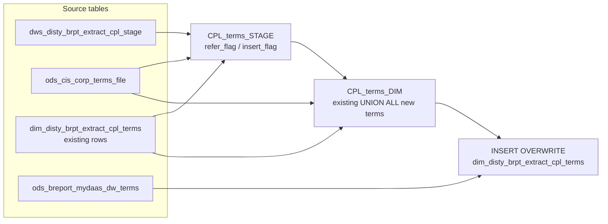

# DIM: CPL Payment Terms Dimension (`dim_disty_brpt_extract_cpl_terms`)

- artifact_type: etl_table
- artifact_id: dim_us.dim_disty_brpt_extract_cpl_terms
- domain: cpl
- one_line_purpose: This dimension table maintains the set of payment terms codes seen in the CPL (Customer Profitability & Loss) reporting extract. It resolves a human-readable description for each terms code from the CIS corporate terms file and classifies e...
- layer_type: DIM
- source_kind: etl_sql
- evidence_source: source/etl/sql/cpl/data_service/cpl_extract/sql/dim_disty_brpt_extract_cpl_terms.sql

---

## L1 Data Foundation

### Identity and physical mapping
- **Table:** `dim_us.dim_disty_brpt_extract_cpl_terms`
- **Layer type:** DIM
- **Canonical / derived:** Derived / ETL-loaded (see L3)
- **Owner team:** not registered in metadata catalog

### Grain, scope, exclusions
- **Grain:** one row per distinct `terms` code.
- **Scope:** See L2 business purpose / L3 filters
- **Partition:** none — full overwrite each run. - resolved from pipeline (see L4)
- **Natural key:** `terms`.
- **Exclusions:** Not documented in repository

#### Grain detail (preserved)

- **Grain:** one row per distinct `terms` code.
- **Partition:** none — full overwrite each run.
- **Natural key:** `terms`.

---

### Cross-engine presence
| Engine | Present | Canonical FQN | Notes |
|--------|---------|---------------|-------|
| Hive | yes | `dim_disty_brpt_extract_cpl_terms` | ETL target / intermediate per evidence script |
| Vertica | pending | `dim_disty_brpt_extract_cpl_terms` | Confirm via hive2vertica flow evidence / MCP |

### Physical schema reference

Pointer block only - full column catalog lives in WKB L1 storage JSON.

| Field | Value |
|-------|-------|
| **Authoritative catalog** | WKB L1 storage seed (not duplicated in this file) |
| **entity_id** | `dim_us.dim_disty_brpt_extract_cpl_terms` |
| **l1_catalog_seed** | `target/storage/wkb/snapshots/_snapshot_id_template/l1_catalog/{engine}_{schema}_{table}.json` |
| **column_count** | pending (run ddl_seed_writer) |
| **partition_keys** | `none — full overwrite each run.` |
| **ddl_source** | pending Bitbucket DDL / Vertica metadata ingest |
| **retrieval** | `python -m tools.wkb.indexing.run_query --query "cpl dim_disty_brpt_extract_cpl_terms schema" --intent find_table_schema` |

### Lineage
| Object | Role |
|--------|------|
| `dws_disty_brpt_extract_cpl_stage` | Primary source of distinct `terms` codes. |
| `ods_cis_corp_terms_file` | CIS terms reference — description and validation (key: `doc_terms`). |
| `dim_disty_brpt_extract_cpl_terms` | Target dimension — read back to carry forward existing rows. |
| `ods_breport_mydaas_dw_terms` | MyDaaS risk flag enrichment at INSERT. |

---

### Freshness and load path
| Item | Value |
|------|-------|
| Load pattern | See L3 end-to-end / INSERT pattern in evidence script |
| Schedule | Not documented in repository |
| Parameters | `${literal_target_db}`, `${literal_source_db}`, `${literal_dim_db}` |


---

## L2 Declarative Knowledge

### Business purpose
This dimension table maintains the set of payment terms codes seen in the CPL (Customer Profitability & Loss) reporting extract. It resolves a human-readable description for each terms code from the CIS corporate terms file and classifies each code into three mutually-derived risk categories: cash (`cash_flag`), cash-on-delivery (`cod_flag`), and other (`other_flag`). These flags drive risk segmentation in CPL P&L reports, allowing analysts to distinguish cash-risk, COD, and standard credit terms exposures.

---

### Audience and use cases
| Audience | How they benefit |
|----------|-----------------|
| **CPL Reporting** | Provides description and risk-category flags for every payment terms code, enabling P&L reports to segment receivables and sales by payment risk profile. |
| **Credit & Risk Teams** | `cash_flag`, `cod_flag`, and `other_flag` provide a simple three-way risk classification for each terms code. |
| **Data Engineers** | Controlled incremental dimension — only CIS-validated terms are inserted; risk flags are refreshed from MyDaaS on every run. |

---

### Identifier search profile
- Primary lookup keys: see natural key under L1 Grain.
- Use latest snapshot / active flags when documented in L3 filters.

### Time field semantics
- **date_flag / partition columns:** none — full overwrite each run.
- Primary reporting filter should use the partition column(s) documented in L1; resolve values via L4.


### Metrics served

| Category | Column | Logical metric | Business reading |
|----------|--------|----------------|------------------|
| Measures | — | — | No measure columns mapped for this table. |

### Metric serving map

**Formula authority:** [`source/contracts/cpl/metric-index.md`](../../source/contracts/cpl/metric-index.md)

N/A — no measure columns mapped for this table.

### etl_metrics

No governed logical metrics from `source/contracts/cpl/metric-index.md` are mapped on this table.

---

### Metric serving map
N/A - not a `*_comb_mtd` / multi-period wide serving table (or map not present in legacy doc).


### Data products and column groups (preserved)

### Identifiers and relationships

- **Payment terms:** `terms`

### Dimension columns (reporting-ready, pre-computed from source)

Use these for **filters, group-bys, and star-schema joins**:

- `terms` — payment terms code as it appears in transaction data
- `terms_desc` — human-readable description from `ods_cis_corp_terms_file`
- `cash_flag` — `'Y'` if the terms code is classified as cash-risk (`risk_cash_flag = 'Y'` in MyDaaS)
- `cod_flag` — `'Y'` if the terms code is classified as cash-on-delivery (`risk_cod_flag = 'Y'` in MyDaaS)
- `other_flag` — `'Y'` if the terms code is neither exclusively cash nor COD (see formula below)

---

### etl_metrics

#### `cash_flag`
- **Source:** [metric-index.md](../../source/contracts/cpl/metric-index.md#cash_flag)
- **Business definition:** Terms represent a cash-payment arrangement.
```sql
CASE WHEN t.risk_cash_flag = 'Y' THEN 'Y' ELSE 'N' END
```

#### `cod_flag`
- **Source:** [metric-index.md](../../source/contracts/cpl/metric-index.md#cod_flag)
- **Business definition:** Terms represent a COD arrangement.
```sql
CASE WHEN t.risk_cod_flag = 'Y' THEN 'Y' ELSE 'N' END
```

#### `other_flag`
- **Source:** [metric-index.md](../../source/contracts/cpl/metric-index.md#other_flag)
- **Business definition:** `'N'` only when the code is cash or COD but NOT flagged as a standard risk term; `'Y'` otherwise (standard credit or unclassified).
```sql
CASE WHEN (risk_cash_flag='Y' OR risk_cod_flag='Y') AND risk_term_flag <> 'Y' THEN 'N' ELSE 'Y' END
```

#### `refer_flag`
- **Source:** [metric-index.md](../../source/contracts/cpl/metric-index.md#refer_flag)
- **Business definition:** `'Y'` if terms code exists in CIS.
```sql
CASE WHEN ods_cis_corp_terms_file.doc_terms IS NOT NULL THEN 'Y' ELSE 'N' END
```

#### `insert_flag`
- **Source:** [metric-index.md](../../source/contracts/cpl/metric-index.md#insert_flag)
- **Business definition:** `'Y'` if terms code is not yet in the dim.
```sql
CASE WHEN dim_disty_brpt_extract_cpl_terms.terms IS NOT NULL THEN 'N' ELSE 'Y' END
```


---

## L3 Procedural Knowledge

### Query and routing rules
**Business filters:** Use partition / date keys from L1 grain for reporting scope.
**Technical predicates (load only):** See Key filters and step-by-step logic below.

### Dimension join patterns
| Dimension FQN | Join keys | Purpose | Evidence |
|---------------|-----------|---------|----------|
| See step-by-step / base tables | See L3 steps | Dimension enrichment | `source/etl/sql/cpl/data_service/cpl_extract/sql/dim_disty_brpt_extract_cpl_terms.sql` |

### Key filters and ETL business logic
### Step 1 — `CPL_terms_STAGE`

**Source:** `dws_disty_brpt_extract_cpl_stage`

**Filter:** Distinct `terms` values; no date or partition filter.

**Join note:** CIS terms file uses `doc_terms` as the key column (not `terms`); the join is `i.terms = m.doc_terms`.

**Derived columns:**

| Column | Formula | Plain language |
|--------|---------|----------------|
| `refer_flag` | `CASE WHEN ods_cis_corp_terms_file.doc_terms IS NOT NULL THEN 'Y' ELSE 'N' END` | `'Y'` if terms code exists in CIS. |
| `insert_flag` | `CASE WHEN dim_disty_brpt_extract_cpl_terms.terms IS NOT NULL THEN 'N' ELSE 'Y' END` | `'Y'` if terms code is not yet in the dim. |

---

### Step 2 — `CPL_terms_DIM`

**Sources:** `dim_disty_brpt_extract_cpl_terms` (existing), `CPL_terms_STAGE`, `ods_cis_corp_terms_file`

**Branch A (existing rows):** Pass through `terms`, `terms_desc`, `cash_flag`, `cod_flag`, `other_flag` unchanged.

**Branch B (new terms):** Only rows with `refer_flag='Y'` AND `insert_flag='Y'`. Joined to `ods_cis_corp_terms_file` (on `terms = doc_terms`) for `terms_desc`. Default `cash_flag = 'N'`, `cod_flag = 'N'`, `other_flag = 'N'`.

---

### Step 3 — Final `INSERT OVERWRITE` into `dim_disty_brpt_extract_cpl_terms`

**From:** `CPL_terms_DIM` (left-joined to `ods_breport_mydaas_dw_terms` on `terms`)

**Derived columns computed at INSERT:**

| Column | Formula | Plain language |
|--------|---------|----------------|
| `cash_flag` | `CASE WHEN t.risk_cash_flag = 'Y' THEN 'Y' ELSE 'N' END` | `'Y'` ...

### Standard time-filter SQL
```sql
-- relative period filter using resolved partition value (see L4)
SELECT *
FROM dim_disty_brpt_extract_cpl_terms
WHERE /* partition predicate */ date_flag = '${partition_value}';
```

### End-to-end flow
**Runtime parameters:** `${literal_target_db}`, `${literal_source_db}`, `${literal_dim_db}`
**Target table:** `dim_disty_brpt_extract_cpl_terms` (non-partitioned dimension).

1. Read distinct `terms` from CPL staging and determine `refer_flag` / `insert_flag` against CIS terms file and existing dim.
2. Build `CPL_terms_DIM`: UNION of existing dim rows and new CIS-matched terms codes with default flags (`'N'` for all three).
3. **INSERT OVERWRITE**: Write combined view, left-joining to `ods_breport_mydaas_dw_terms` to derive final `cash_flag`, `cod_flag`, and `other_flag`.



---


#### High-level stages (preserved)

| Stage | Business meaning |
|-------|-----------------|
| **Stage check** | Scans the CPL staging table for distinct `terms` codes and determines which ones exist in the CIS terms file (`refer_flag`) and which are new to the dimension (`insert_flag`). |
| **Build candidate set** | Merges existing dim rows with newly-discovered terms (enriched with CIS descriptions and default flags) into a combined view. |
| **Final INSERT OVERWRITE** | Writes all rows back, enriching each record's risk flags from the MyDaaS DW terms reference table using a defined classification rule. |

**Parameters:** `${literal_target_db}`, `${literal_source_db}`, `${literal_dim_db}`

---


### Base tables register
| Object | Role in this job |
|--------|-----------------|
| `dws_disty_brpt_extract_cpl_stage` | Primary source — provides distinct `terms` codes from current CPL data. |
| `ods_cis_corp_terms_file` | CIS terms reference — validates existence (`refer_flag`) via `doc_terms` key and supplies `terms_desc`. |
| `dim_disty_brpt_extract_cpl_terms` | Target and read-back source — existing rows carried forward. |
| `ods_breport_mydaas_dw_terms` | MyDaaS terms reference — provides `risk_cash_flag`, `risk_cod_flag`, `risk_term_flag` at INSERT time. |

**Temporary views (inside the job only):**
`CPL_terms_STAGE` → `CPL_terms_DIM` → (final `INSERT OVERWRITE`)

---

### Step-by-step logic
### Step 1 — `CPL_terms_STAGE`

**Source:** `dws_disty_brpt_extract_cpl_stage`

**Filter:** Distinct `terms` values; no date or partition filter.

**Join note:** CIS terms file uses `doc_terms` as the key column (not `terms`); the join is `i.terms = m.doc_terms`.

**Derived columns:**

| Column | Formula | Plain language |
|--------|---------|----------------|
| `refer_flag` | `CASE WHEN ods_cis_corp_terms_file.doc_terms IS NOT NULL THEN 'Y' ELSE 'N' END` | `'Y'` if terms code exists in CIS. |
| `insert_flag` | `CASE WHEN dim_disty_brpt_extract_cpl_terms.terms IS NOT NULL THEN 'N' ELSE 'Y' END` | `'Y'` if terms code is not yet in the dim. |

---

### Step 2 — `CPL_terms_DIM`

**Sources:** `dim_disty_brpt_extract_cpl_terms` (existing), `CPL_terms_STAGE`, `ods_cis_corp_terms_file`

**Branch A (existing rows):** Pass through `terms`, `terms_desc`, `cash_flag`, `cod_flag`, `other_flag` unchanged.

**Branch B (new terms):** Only rows with `refer_flag='Y'` AND `insert_flag='Y'`. Joined to `ods_cis_corp_terms_file` (on `terms = doc_terms`) for `terms_desc`. Default `cash_flag = 'N'`, `cod_flag = 'N'`, `other_flag = 'N'`.

---

### Step 3 — Final `INSERT OVERWRITE` into `dim_disty_brpt_extract_cpl_terms`

**From:** `CPL_terms_DIM` (left-joined to `ods_breport_mydaas_dw_terms` on `terms`)

**Derived columns computed at INSERT:**

| Column | Formula | Plain language |
|--------|---------|----------------|
| `cash_flag` | `CASE WHEN t.risk_cash_flag = 'Y' THEN 'Y' ELSE 'N' END` | `'Y'` for cash-risk terms. |
| `cod_flag` | `CASE WHEN t.risk_cod_flag = 'Y' THEN 'Y' ELSE 'N' END` | `'Y'` for COD terms. |
| `other_flag` | `CASE WHEN (risk_cash_flag='Y' OR risk_cod_flag='Y') AND risk_term_flag <> 'Y' THEN 'N' ELSE 'Y' END` | `'N'` only for codes that are cash or COD but not a standard risk term; `'Y'` for standard credit and unresolved codes. |

**Pass-through columns:** `terms`, `terms_desc`

---

### Relationship map (embedded)

| from_fqn | to_fqn | cardinality | join_keys | provenance |
|----------|--------|-------------|-----------|------------|
| `${literal_target_db}.dws_disty_brpt_extract_cpl_stage` | `${literal_source_db}.ods_cis_corp_terms_file` | many:1 | `i.terms = m.doc_terms` | etl_sql (source/etl/sql/cpl/data_service/cpl_extract/sql/dim_disty_brpt_extract_cpl_terms.sql:1) |
| `${literal_target_db}.dws_disty_brpt_extract_cpl_stage` | `${literal_dim_db}.dim_disty_brpt_extract_cpl_terms` | many:1 | `i.terms = d.terms; DROP VIEW IF EXISTS CPL_terms_DIM; CREATE TEMPORARY VIEW CPL_terms_DIM AS` | etl_sql (source/etl/sql/cpl/data_service/cpl_extract/sql/dim_disty_brpt_extract_cpl_terms.sql:1) |
| `${literal_target_db}.dws_disty_brpt_extract_cpl_stage` | `${literal_source_db}.ods_cis_corp_terms_file` | many:1 | `i.terms = m.doc_terms AND i.refer_flag = 'Y' AND i.insert_flag = 'Y';` | etl_sql (source/etl/sql/cpl/data_service/cpl_extract/sql/dim_disty_brpt_extract_cpl_terms.sql:1) |
| `${literal_dim_db}.dim_disty_brpt_extract_cpl_terms` | `${literal_source_db}.ods_breport_mydaas_dw_terms` | many:1 | `d.terms = t.terms;` | etl_sql (source/etl/sql/cpl/data_service/cpl_extract/sql/dim_disty_brpt_extract_cpl_terms.sql:1) |

`source/ref/cpl/table relationship.txt`: Not documented in repository.

### Special logic (embedded)

Not documented in repository

### Column / field derivations (from ETL SQL)

| target_column | expression_sql | upstream_columns | upstream_tables | transform_kind | evidence |
|---------------|----------------|------------------|-----------------|----------------|----------|
| `terms` | `d.terms` | `terms` | `CPL_terms_DIM`, `${literal_source_db}.ods_breport_mydaas_dw_terms` | passthrough | `source/etl/sql/cpl/data_service/cpl_extract/sql/dim_disty_brpt_extract_cpl_terms.sql:5` |
| `terms_desc` | `d.terms_desc` | `terms_desc` | `CPL_terms_DIM`, `${literal_source_db}.ods_breport_mydaas_dw_terms` | passthrough | `source/etl/sql/cpl/data_service/cpl_extract/sql/dim_disty_brpt_extract_cpl_terms.sql:34` |
| `cash_flag` | `CASE WHEN t.risk_cash_flag = 'Y' THEN 'Y' ELSE 'N' END` | `risk_cash_flag`, `Y`, `N` | `CPL_terms_DIM`, `${literal_source_db}.ods_breport_mydaas_dw_terms` | case | `source/etl/sql/cpl/data_service/cpl_extract/sql/dim_disty_brpt_extract_cpl_terms.sql:35` |
| `cod_flag` | `CASE WHEN t.risk_cod_flag = 'Y' THEN 'Y' ELSE 'N' END` | `risk_cod_flag`, `Y`, `N` | `CPL_terms_DIM`, `${literal_source_db}.ods_breport_mydaas_dw_terms` | case | `source/etl/sql/cpl/data_service/cpl_extract/sql/dim_disty_brpt_extract_cpl_terms.sql:36` |
| `other_flag` | `CASE WHEN (t.risk_cash_flag = 'Y' or t.risk_cod_flag = 'Y') AND t.risk_term_flag <> 'Y' THEN 'N' ELSE 'Y' END` | `risk_cash_flag`, `Y`, `risk_cod_flag`, `risk_term_flag`, `N` | `CPL_terms_DIM`, `${literal_source_db}.ods_breport_mydaas_dw_terms` | case | `source/etl/sql/cpl/data_service/cpl_extract/sql/dim_disty_brpt_extract_cpl_terms.sql:37` |

### Sentinel and code values
| Value | Meaning |
|-------|---------|
| `cash_flag = 'N'` (default) | New terms default to non-cash; overridden by MyDaaS join at INSERT. |
| `cod_flag = 'N'` (default) | New terms default to non-COD; overridden by MyDaaS join at INSERT. |
| `other_flag = 'N'` (default) | New terms default to non-other; overridden by MyDaaS join at INSERT. |
| `refer_flag = 'Y'` | Terms code exists in CIS terms file and can be enriched. |
| `insert_flag = 'Y'` | Terms code is not yet in the dim and will be inserted. |

---

---

## L4 Validation

### Resolved partition value
| Step | Source | How partition / date scope is determined |
|------|--------|------------------------------------------|
| 1 | evidence script / flow | See parameters in L1 Freshness and L3 filters - `source/etl/sql/cpl/data_service/cpl_extract/sql/dim_disty_brpt_extract_cpl_terms.sql` |

**Plain language:** Partition and date scope follow Azkaban/bootstrap parameters documented in the source script and orchestrating flow; do not hardcode calendar literals.

### Data quality checks
- Prefer row-count-by-partition, metric sums, and grain duplicate checks (see Validation SQL).
- Additional checks from legacy caveats / operational notes when present.

### Validation SQL
```sql
-- 1) Row count by partition
SELECT ${partition_col}, COUNT(*) AS row_cnt
FROM ods_cis_corp_terms_file.doc_terms
WHERE ${partition_col} = '${partition_value}'
GROUP BY ${partition_col};

-- 2) Metric sum by business dimension (top deltas)
SELECT ${dim_key}, SUM(${metric}) AS metric_sum
FROM ods_cis_corp_terms_file.doc_terms
WHERE ${partition_col} = '${partition_value}'
GROUP BY ${dim_key}
ORDER BY ABS(SUM(${metric})) DESC
LIMIT 20;

-- 3) Grain duplicate check
SELECT ${grain_key_1}, ${grain_key_2}, ${grain_key_3}, ${partition_col}, COUNT(*) AS cnt
FROM ods_cis_corp_terms_file.doc_terms
WHERE ${partition_col} = '${partition_value}'
GROUP BY ${grain_key_1}, ${grain_key_2}, ${grain_key_3}, ${partition_col}
HAVING COUNT(*) > 1;
```

Replace placeholders from this file's Grain and keys / Data you can fetch sections, and use the resolved partition value from run scope.

### Caveats for interpretation
- All three risk flags are refreshed from MyDaaS on every run for all rows. Changes in `ods_breport_mydaas_dw_terms` propagate automatically.
- The CIS terms file uses `doc_terms` as its key column, not `terms`. This asymmetry is handled in the JOIN condition.
- Terms codes not found in `ods_cis_corp_terms_file` are never inserted — no placeholder is created for unresolved codes.
- `other_flag = 'Y'` applies to terms that are NOT exclusively cash or COD, including any terms with no MyDaaS mapping (NULL join returns default `'Y'`).

---

### Conflicts and open questions
- Schedule, owner, SLA: Not documented in repository (unless preserved schedule evidence above).
- Vertica MCP verification: pending unless confirmed in L5.


---

## L5 Runtime View

### Query path and engine preference
| Role | Hive object | Vertica object | Sync mode | Evidence | MCP verified |
|------|-------------|----------------|-----------|----------|--------------|
| **Query for reporting** | *See script lineage* | `ods_cis_corp_terms_file.doc_terms` | *Verify from flow* | *Add flow file:line* | pending |
| **Hive alternative** | `*` | `ods_cis_corp_terms_file.doc_terms` | - | *See dependencies* | - |
| **ETL internal** | staging/temp tables | *Not synced to Vertica* | - | *See step-by-step logic* | - |

Business users should query `ods_cis_corp_terms_file.doc_terms` in Vertica once MCP verification is completed for this document.

### Access constraints
- Country / company schema parameters may apply (`literal_country`, `company_no`, etc.).
- Hive-only staging objects are not reporting surfaces unless synced.

### Query risk profile
| Field | Value |
|-------|-------|
| requires_date_predicate | unknown |
| scan_risk_tier | medium |

---

## L6 Access and Consumption

### Primary consumers and use cases
| Audience | How they benefit |
|----------|-----------------|
| **CPL Reporting** | Provides description and risk-category flags for every payment terms code, enabling P&L reports to segment receivables and sales by payment risk profile. |
| **Credit & Risk Teams** | `cash_flag`, `cod_flag`, and `other_flag` provide a simple three-way risk classification for each terms code. |
| **Data Engineers** | Controlled incremental dimension — only CIS-validated terms are inserted; risk flags are refreshed from MyDaaS on every run. |

---

### Representative query patterns
```sql
-- certified / illustrative lookup - replace predicates from L1/L4
SELECT *
FROM dim_disty_brpt_extract_cpl_terms
WHERE date_flag = '${partition_value}'
LIMIT 100;
```

### Dependencies and notes
### Upstream objects (verified)

| Object | Usage | Evidence |
|--------|-------|----------|
| `dws_disty_brpt_extract_cpl_stage` | Source of distinct `terms` codes | `dim_disty_brpt_extract_cpl_terms.sql:6` |
| `ods_cis_corp_terms_file` | Terms reference — description and validation via `doc_terms` | `dim_disty_brpt_extract_cpl_terms.sql:7,30` |
| `dim_disty_brpt_extract_cpl_terms` | Existing dim rows read and rewritten | `dim_disty_brpt_extract_cpl_terms.sql:9,15` |
| `ods_breport_mydaas_dw_terms` | Risk flag enrichment at INSERT | `dim_disty_brpt_extract_cpl_terms.sql:39` |

### Downstream consumers (verified)

| Object / script | Evidence |
|-----------------|----------|
| None identified in repository. | — |

### Operational detail (verified)

- Full table overwrite (`INSERT OVERWRITE`) — entire dimension is rewritten each run.
- Risk flags re-evaluated for all rows on every run via the MyDaaS left join.

### Not documented in repository

- Schedule, owner, SLA — not in scripts or configs.
- Whether `risk_term_flag` in MyDaaS has any further meaning beyond its use in the `other_flag` formula.

---

*Document generated from `source/etl/sql/cpl/data_service/cpl_extract/sql/dim_disty_brpt_extract_cpl_terms.sql`.*

#### Not documented in repository
- Owner, SLA (unless schedule evidence preserved above)
- Any dependency without `file:line` evidence in this document

---

*Document migrated to L1-L6 from legacy Knowledgebase content. Evidence: `source/etl/sql/cpl/data_service/cpl_extract/sql/dim_disty_brpt_extract_cpl_terms.sql`.*
