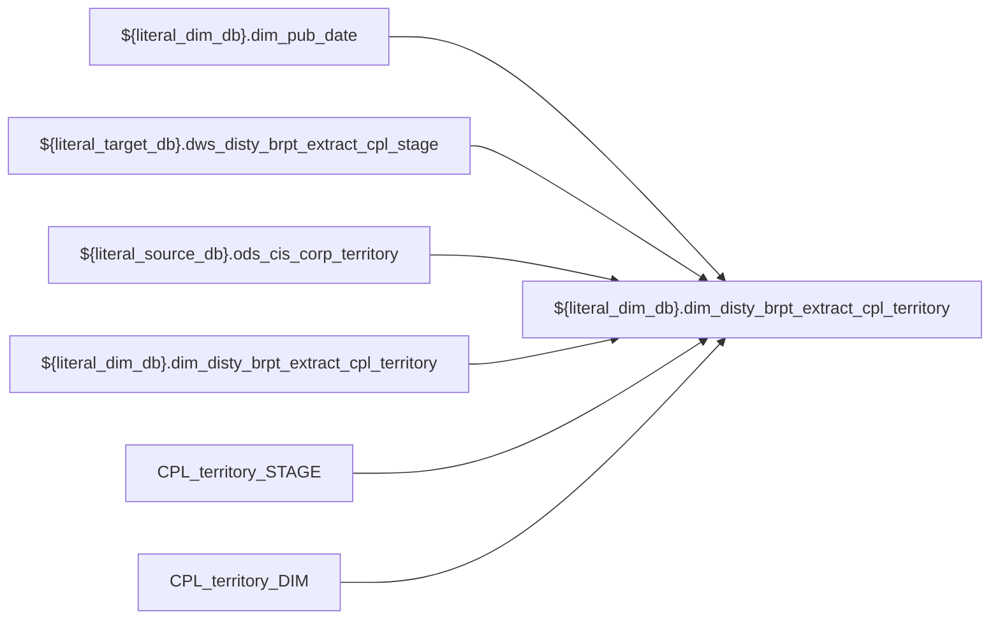

# DIM: `dim_disty_brpt_extract_cpl_territory`

- artifact_type: etl_table
- artifact_id: ${literal_dim_db}.dim_disty_brpt_extract_cpl_territory
- domain: cpl
- one_line_purpose: ETL script `source/etl/sql/cpl/data_service/cpl_extract/python/dim_disty_brpt_extract_cpl_territory.py` loads `${literal_dim_db}.dim_disty_brpt_extract_cpl_territory` (layer `DIM`). Purpose inferred from SQL only.
- layer_type: DIM
- source_kind: etl_sql
- evidence_source: source/etl/sql/cpl/data_service/cpl_extract/python/dim_disty_brpt_extract_cpl_territory.py

---

## L1 Data Foundation

### Identity and physical mapping
- **Table:** `${literal_dim_db}.dim_disty_brpt_extract_cpl_territory`
- **Layer type:** DIM
- **Canonical / derived:** Derived / ETL-loaded (see L3)
- **Owner team:** Not documented in repository

### Grain, scope, exclusions
- **Grain:** Not documented in repository (see SELECT/GROUP BY in `source/etl/sql/cpl/data_service/cpl_extract/python/dim_disty_brpt_extract_cpl_territory.py`)
- **Partition:** `See L4 / ETL partition clause`
- **Exclusions:** See L3 Key filters

### Cross-engine presence
| Engine | Present | Canonical FQN | Notes |
|--------|---------|---------------|-------|
| Hive | yes | `${literal_dim_db}.dim_disty_brpt_extract_cpl_territory` | ETL target |
| Vertica | Not documented in repository | — | Confirm via hive2vertica flow |

### Physical schema reference

Pointer block only - full column catalog lives in WKB L1 storage JSON.

| Field | Value |
|-------|-------|
| **Authoritative catalog** | WKB L1 storage seed (not duplicated in this file) |
| **entity_id** | `${literal_dim_db}.dim_disty_brpt_extract_cpl_territory` |
| **l1_catalog_seed** | `target/storage/wkb/snapshots/_snapshot_id_template/l1_catalog/{engine}_{schema}_{table}.json` |
| **column_count** | pending (run ddl_seed_writer) |
| **partition_keys** | `See L4 / ETL partition clause` |
| **ddl_source** | pending Bitbucket DDL / Vertica metadata ingest |
| **retrieval** | `python -m tools.wkb.indexing.run_query --query "cpl dim_disty_brpt_extract_cpl_territory schema" --intent find_table_schema` |

### Lineage
| Object | Role |
|--------|------|
| `${literal_dim_db}.dim_pub_date` | upstream (ETL FROM/JOIN) |
| `${literal_target_db}.dws_disty_brpt_extract_cpl_stage` | upstream (ETL FROM/JOIN) |
| `${literal_source_db}.ods_cis_corp_territory` | upstream (ETL FROM/JOIN) |
| `${literal_dim_db}.dim_disty_brpt_extract_cpl_territory` | upstream (ETL FROM/JOIN) |
| `CPL_territory_STAGE` | upstream (ETL FROM/JOIN) |
| `CPL_territory_DIM` | upstream (ETL FROM/JOIN) |
| `${literal_dim_db}.dim_disty_brpt_extract_cpl_territory` | **Target** |

### Freshness and load path
| Item | Value |
|------|-------|
| Load pattern | See L3 INSERT / OVERWRITE in evidence script |
| Schedule | Not documented in repository |
| Parameters | Parsed from ETL literals / `${...}` in `source/etl/sql/cpl/data_service/cpl_extract/python/dim_disty_brpt_extract_cpl_territory.py` |

## L2 Declarative Knowledge

### Business purpose
ETL script `source/etl/sql/cpl/data_service/cpl_extract/python/dim_disty_brpt_extract_cpl_territory.py` loads `${literal_dim_db}.dim_disty_brpt_extract_cpl_territory` (layer `DIM`). Purpose inferred from SQL only.

### Audience and use cases
| Audience | How they benefit |
|----------|-----------------|
| Data / BI consumers | Use target table produced by this ETL |
| Data Engineering | Maintain load logic in evidence script |

### Fact key resolution
- Keys follow target INSERT column list / GROUP BY in evidence SQL.

### Time field semantics
- Partition / date fields: `See L4 / ETL partition clause`

### Metrics served
- See L3 column derivations for measure expressions when present.

### Metric serving map
N/A — not a multi-period wide serving table (or not documented).

### etl_metrics
No calculable business metrics registered in metric-index for this create run.

## L3 Procedural Knowledge

### Query and routing rules
- Prefer querying the target `${literal_dim_db}.dim_disty_brpt_extract_cpl_territory` after successful ETL load.

### Dimension join patterns
- See Relationship map and Base tables register.

### Key filters and ETL business logic

| Predicate | Kind | Evidence |
|-----------|------|----------|
| `date_flag='${date_flag}' DROP TABLE IF EXISTS CPL_territory_STAGE; CREATE TEMPORARY TABLE CPL_territory_STAGE AS SELECT distinct i.cust_terr ,CASE WHEN m.sales_terr is not null THEN 'Y' ELSE 'N' EN...` | Technical (load only) / Business | `source/etl/sql/cpl/data_service/cpl_extract/python/dim_disty_brpt_extract_cpl_territory.py` |

### Standard time-filter SQL
```sql
-- See partition / date predicates in source/etl/sql/cpl/data_service/cpl_extract/python/dim_disty_brpt_extract_cpl_territory.py
```

### End-to-end flow



### Base tables register

| Object | Role |
|--------|------|
| `${literal_dim_db}.dim_pub_date` | source / temp (from ETL FROM/JOIN) |
| `${literal_target_db}.dws_disty_brpt_extract_cpl_stage` | source / temp (from ETL FROM/JOIN) |
| `${literal_source_db}.ods_cis_corp_territory` | source / temp (from ETL FROM/JOIN) |
| `${literal_dim_db}.dim_disty_brpt_extract_cpl_territory` | source / temp (from ETL FROM/JOIN) |
| `CPL_territory_STAGE` | source / temp (from ETL FROM/JOIN) |
| `CPL_territory_DIM` | source / temp (from ETL FROM/JOIN) |

### Step-by-step logic
1. Read sources listed in Base tables register (`source/etl/sql/cpl/data_service/cpl_extract/python/dim_disty_brpt_extract_cpl_territory.py`).
2. Apply filters documented under Key filters.
3. INSERT OVERWRITE / write target `${literal_dim_db}.dim_disty_brpt_extract_cpl_territory`.

### Relationship map (embedded)

| from_fqn | to_fqn | cardinality | join_keys | provenance |
|----------|--------|-------------|-----------|------------|
| `${literal_target_db}.dws_disty_brpt_extract_cpl_stage` | `${literal_source_db}.ods_cis_corp_territory` | many:1 | `i.cust_terr = m.sales_terr` | etl_sql (source/etl/sql/cpl/data_service/cpl_extract/python/dim_disty_brpt_extract_cpl_territory.py:19) |
| `${literal_target_db}.dws_disty_brpt_extract_cpl_stage` | `${literal_dim_db}.dim_disty_brpt_extract_cpl_territory` | many:1 | `i.cust_terr = d.cust_terr AND d.month_no = %d` | etl_sql (source/etl/sql/cpl/data_service/cpl_extract/python/dim_disty_brpt_extract_cpl_territory.py:19) |
| `${literal_dim_db}.dim_disty_brpt_extract_cpl_territory` | `${literal_source_db}.ods_cis_corp_territory` | many:1 | `i.cust_terr = m.sales_terr AND i.refer_flag = 'Y' AND i.insert_flag = 'Y'` | etl_sql (source/etl/sql/cpl/data_service/cpl_extract/python/dim_disty_brpt_extract_cpl_territory.py:31) |
| `—` | `${literal_source_db}.ods_cis_corp_territory` | many:1 | `terr.sales_terr = DIM.cust_terr AND dim.month = %d AND dim.cust_terr_desc <> terr_name` | etl_sql (source/etl/sql/cpl/data_service/cpl_extract/python/dim_disty_brpt_extract_cpl_territory.py:51) |

`source/ref/cpl/table relationship.txt`: Not documented in repository.

### Special logic (embedded)

Not documented in repository

### Column / field derivations (from ETL SQL)

| target_column | expression_sql | upstream_columns | upstream_tables | transform_kind | evidence |
|---------------|----------------|------------------|-----------------|----------------|----------|
| `month` | `dim.month` | `month` | `CPL_territory_DIM`, `${literal_source_db}.ods_cis_corp_territory` | passthrough | `source/etl/sql/cpl/data_service/cpl_extract/python/dim_disty_brpt_extract_cpl_territory.py:52` |
| `cust_terr` | `dim.cust_terr` | `cust_terr` | `CPL_territory_DIM`, `${literal_source_db}.ods_cis_corp_territory` | passthrough | `source/etl/sql/cpl/data_service/cpl_extract/python/dim_disty_brpt_extract_cpl_territory.py:53` |
| `cust_terr_desc` | `nvl(terr.terr_name,dim.cust_terr_desc)` | `terr_name`, `cust_terr_desc` | `CPL_territory_DIM`, `${literal_source_db}.ods_cis_corp_territory` | coalesce | `source/etl/sql/cpl/data_service/cpl_extract/python/dim_disty_brpt_extract_cpl_territory.py:54` |
| `region` | `dim.region` | `region` | `CPL_territory_DIM`, `${literal_source_db}.ods_cis_corp_territory` | passthrough | `source/etl/sql/cpl/data_service/cpl_extract/python/dim_disty_brpt_extract_cpl_territory.py:55` |
| `cust_type` | `dim.cust_type` | `cust_type` | `CPL_territory_DIM`, `${literal_source_db}.ods_cis_corp_territory` | passthrough | `source/etl/sql/cpl/data_service/cpl_extract/python/dim_disty_brpt_extract_cpl_territory.py:56` |

### Sentinel and code values
Not documented in repository beyond CASE/exp_code predicates in ETL SQL.

## L4 Validation

### Resolved partition value
- Partition expression from ETL: `See L4 / ETL partition clause`
- Runtime values: Not documented in repository (resolve via Azkaban params when flow evidence exists).

### Data quality checks
Not documented in repository

### Validation SQL
N/A — Vertica MCP not executed during documentation (Vertica no-run policy).

### Caveats for interpretation
- Generated from ETL SQL evidence only; business definitions may need `source/ref` enrichment.

### Conflicts and open questions
None identified in repository

## L5 Runtime View

### Query path and engine preference
| Path | Engine | Evidence |
|------|--------|----------|
| ETL load | Hive/Spark | `source/etl/sql/cpl/data_service/cpl_extract/python/dim_disty_brpt_extract_cpl_territory.py` |
| Serving | Vertica (when synced) | Not documented in repository |

### Access constraints
Not documented in repository

### Query risk profile
- Scan risk depends on partition pruning; always filter partition keys when present.

## L6 Access and Consumption

### Primary consumers and use cases
Not documented in repository

### Representative query patterns
Not documented in repository

### Dependencies and notes

#### Upstream objects (verified)
| Object | Usage | Evidence |
|--------|-------|----------|
| `${literal_dim_db}.dim_pub_date` | FROM/JOIN | `source/etl/sql/cpl/data_service/cpl_extract/python/dim_disty_brpt_extract_cpl_territory.py` |
| `${literal_target_db}.dws_disty_brpt_extract_cpl_stage` | FROM/JOIN | `source/etl/sql/cpl/data_service/cpl_extract/python/dim_disty_brpt_extract_cpl_territory.py` |
| `${literal_source_db}.ods_cis_corp_territory` | FROM/JOIN | `source/etl/sql/cpl/data_service/cpl_extract/python/dim_disty_brpt_extract_cpl_territory.py` |
| `${literal_dim_db}.dim_disty_brpt_extract_cpl_territory` | FROM/JOIN | `source/etl/sql/cpl/data_service/cpl_extract/python/dim_disty_brpt_extract_cpl_territory.py` |
| `CPL_territory_STAGE` | FROM/JOIN | `source/etl/sql/cpl/data_service/cpl_extract/python/dim_disty_brpt_extract_cpl_territory.py` |
| `CPL_territory_DIM` | FROM/JOIN | `source/etl/sql/cpl/data_service/cpl_extract/python/dim_disty_brpt_extract_cpl_territory.py` |

#### Downstream consumers (verified)
| Object / script | Evidence |
|-----------------|----------|
| Not documented in repository | — |

#### Operational detail (verified)
- Partition clause: `See L4 / ETL partition clause`

#### Not documented in repository
- Schedule, owner, SLA
