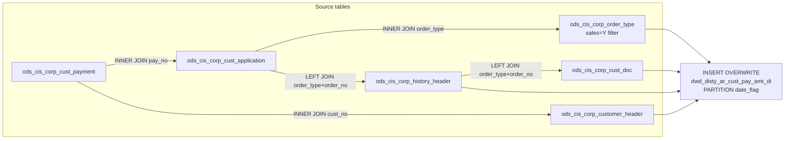

# DWD: AR Customer Payment Amounts — Daily Insert (`dwd_disty_ar_cust_pay_amt_di`)

- artifact_type: etl_table
- artifact_id: dw_us.dwd_disty_ar_cust_pay_amt_di
- domain: cpl
- one_line_purpose: This table captures the daily detail of customer payment applications against sales orders. For each payment applied to a valid sales-type order on a given processing date, it records the payment number, applied amounts (payment and discoun...
- layer_type: DWD
- source_kind: etl_sql
- evidence_source: source/etl/sql/cpl/data_service/cpl_extract/sql/dwd_disty_ar_cust_pay_amt_di.sql

---

## L1 Data Foundation

### Identity and physical mapping
- **Table:** `dw_us.dwd_disty_ar_cust_pay_amt_di`
- **Layer type:** DWD
- **Canonical / derived:** Derived / ETL-loaded (see L3)
- **Owner team:** not registered in metadata catalog

### Grain, scope, exclusions
- **Grain:** one row per payment application line (`pay_no` + `entry_id` within `odometer` within `batch_date`).
- **Scope:** See L2 business purpose / L3 filters
- **Partition:** `date_flag` — the processing date for which payments were loaded. - resolved from pipeline (see L4)
- **Natural key:** `pay_no`, `entry_id`, `odometer` (combination uniquely identifies a payment application line).
- **Exclusions:** Not documented in repository

#### Grain detail (preserved)

- **Grain:** one row per payment application line (`pay_no` + `entry_id` within `odometer` within `batch_date`).
- **Partition:** `date_flag` — the processing date for which payments were loaded.
- **Natural key:** `pay_no`, `entry_id`, `odometer` (combination uniquely identifies a payment application line).

---

### Cross-engine presence
| Engine | Present | Canonical FQN | Notes |
|--------|---------|---------------|-------|
| Hive | yes | `dwd_disty_ar_cust_pay_amt_di` | ETL target / intermediate per evidence script |
| Vertica | pending | `dwd_disty_ar_cust_pay_amt_di` | Confirm via hive2vertica flow evidence / MCP |

### Physical schema reference

Pointer block only - full column catalog lives in WKB L1 storage JSON.

| Field | Value |
|-------|-------|
| **Authoritative catalog** | WKB L1 storage seed (not duplicated in this file) |
| **entity_id** | `dw_us.dwd_disty_ar_cust_pay_amt_di` |
| **l1_catalog_seed** | `target/storage/wkb/snapshots/_snapshot_id_template/l1_catalog/{engine}_{schema}_{table}.json` |
| **column_count** | pending (run ddl_seed_writer) |
| **partition_keys** | `date_flag` |
| **ddl_source** | pending Bitbucket DDL / Vertica metadata ingest |
| **retrieval** | `python -m tools.wkb.indexing.run_query --query "cpl dwd_disty_ar_cust_pay_amt_di schema" --intent find_table_schema` |

### Lineage
| Object | Role |
|--------|------|
| `ods_cis_corp_cust_payment` | Payment batch header — primary driver. |
| `ods_cis_corp_cust_application` | Payment application lines — amount and order reference. |
| `ods_cis_corp_order_type` | Sales order type gate. |
| `ods_cis_corp_customer_header` | Fallback territory. |
| `ods_cis_corp_history_header` | Order history — territory, inventory type, PO. |
| `ods_cis_corp_cust_doc` | Document date. |

---

### Freshness and load path
| Item | Value |
|------|-------|
| Load pattern | See L3 end-to-end / INSERT pattern in evidence script |
| Schedule | Not documented in repository |
| Parameters | `${literal_target_db}`, `${literal_source_db}`, `${date_flag}` |


---

## L2 Declarative Knowledge

### Business purpose
This table captures the daily detail of customer payment applications against sales orders. For each payment applied to a valid sales-type order on a given processing date, it records the payment number, applied amounts (payment and discount taken), associated order and invoice identifiers, sales territory at the time of history, and customer demographics. The table feeds CPL (Customer Profitability & Loss) and AR reporting by providing a row-level audit trail of how customer cash receipts relate to specific orders.

---

### Audience and use cases
| Audience | How they benefit |
|----------|-----------------|
| **CPL Reporting** | Provides daily payment and discount amounts by customer and territory, which feed into the P&L receivables and cash-receipt lines. |
| **AR Analytics** | Enables day-level drill-down of payment application detail, linking payment batches to specific order history and customer records. |
| **Finance** | Supports reconciliation of batch payments against order history and tracks discount amounts taken during settlement. |

---

### Fact key resolution
- Natural key: `pay_no`, `entry_id`, `odometer` (combination uniquely identifies a payment application line).
- FK / label-on attributes: see L3 dimension join patterns and step-by-step logic.
- Negative assertion: do not treat descriptive labels as grain keys unless listed under natural key.

### Time field semantics
- **date_flag / partition columns:** `date_flag` — the processing date for which payments were loaded.
- Primary reporting filter should use the partition column(s) documented in L1; resolve values via L4.


### Metrics served

| Category | Column | Logical metric | Business reading |
|----------|--------|----------------|------------------|
| Measures | — | — | No measure columns mapped for this table. |

### Metric serving map

**Formula authority:** [`source/contracts/cpl/metric-index.md`](../../source/contracts/cpl/metric-index.md)

N/A — no measure columns mapped for this table.

### etl_metrics

No governed logical metrics from `source/contracts/cpl/metric-index.md` are mapped on this table.

---

### Metric serving map
N/A - not a `*_comb_mtd` / multi-period wide serving table (or map not present in legacy doc).


### Data products and column groups (preserved)

### Identifiers and relationships

- **Payment:** `pay_no`, `batch_date`
- **Application detail:** `odometer`, `entry_id`
- **Order:** `order_type`, `order_no`
- **PO reference:** `po_order_type`, `po_order_no`
- **Customer:** `cust_no`
- **Document:** `doc_date`

### Dimension columns (reporting-ready, pre-computed from source)

Use these for **filters, group-bys, and star-schema joins**:

- `order_type` — sales order type code
- `inv_type` — inventory type from order history (`from_inv_type`); defaults to `1` when NULL
- `hist_terr` — sales territory at the time of the history header; falls back to customer header territory when order history is absent
- `cust_type` — always NULL (not populated by this script)
- `cust_terr` — always NULL (not populated by this script)
- `po_order_type`, `po_order_no` — internal reference (PO) order type and number from history header
- `po_vend_no` — always NULL (not populated by this script)

> **Note:** `cust_type`, `cust_terr`, and `po_vend_no` are always NULL in this table. These columns are structural placeholders; resolution is expected downstream.

### Quantity, pricing, and cost building blocks

- `pay_amt` — payment amount applied from the customer application record
- `disc_amt_taken` — discount amount taken at the time of payment application

---

### etl_metrics

#### `inv_type`
- **Source:** [metric-index.md](../../source/contracts/cpl/metric-index.md#inv_type)
- **Business definition:** Inventory type from history; defaults to `1` when history row is absent.
```sql
nvl(h.from_inv_type, 1)
```

#### `hist_terr`
- **Source:** [metric-index.md](../../source/contracts/cpl/metric-index.md#hist_terr)
- **Business definition:** Territory from order history first; falls back to customer master territory.
```sql
nvl(h.sales_terr, c.sales_terr)
```


---

## L3 Procedural Knowledge

### Query and routing rules
**Business filters:** Use partition / date keys from L1 grain for reporting scope.
**Technical predicates (load only):** See Key filters and step-by-step logic below.

### Dimension join patterns
| Dimension FQN | Join keys | Purpose | Evidence |
|---------------|-----------|---------|----------|
| See step-by-step / base tables | See L3 steps | Dimension enrichment | `source/etl/sql/cpl/data_service/cpl_extract/sql/dwd_disty_ar_cust_pay_amt_di.sql` |

### Key filters and ETL business logic
### Step 1 — Final `INSERT OVERWRITE` into `dwd_disty_ar_cust_pay_amt_di`

**Sources:** All six ODS tables joined as described.

**Filter (natural language):**
- `p.batch_date >= '${date_flag}'` AND `p.batch_date < DATE_ADD('${date_flag}', 1)` — payments batched exactly on the processing date.
- `t.sales = 'Y'` (via INNER JOIN) — only sales-type order applications are included.

**Left joins on insert:**

| Join | Keys | Purpose |
|------|------|---------|
| `ods_cis_corp_history_header h` | `a.order_type = h.order_type AND a.order_no = h.order_no` | Adds territory, inventory type, and PO reference from order history. |
| `ods_cis_corp_cust_doc q` | `h.order_type = q.order_type AND h.order_no = q.order_no` | Adds original document date. |

**Derived columns computed at INSERT:**

| Column | Formula | Plain language |
|--------|---------|----------------|
| `inv_type` | `nvl(h.from_inv_type, 1)` | Inventory type from history; defaults to `1` when history row is absent. |
| `hist_terr` | `nvl(h.sales_terr, c.sales_terr)` | Territory from order history first; falls back to customer master territory. |
| `cust_type` | `NULL` | Not resolved in this script. |
| `cust_terr` | `NULL` | Not resolved in this script. |
| `po_vend_no` | `NULL` | Not resolved in this script. |
| `date_flag` | `to_date('${date_flag}')` | Processing date cast to date type. |

**Pass-through columns:**
`pay_no`, `odometer`, `entry_id`, `order_type`, `order_no`, `batch_date`, `pay_amt`, `disc_amt_taken`, `cus...

### Standard time-filter SQL
```sql
-- relative period filter using resolved partition value (see L4)
SELECT *
FROM dwd_disty_ar_cust_pay_amt_di
WHERE /* partition predicate */ date_flag = '${partition_value}';
```

### End-to-end flow
**Runtime parameters:** `${date_flag}`, `${literal_target_db}`, `${literal_source_db}`
**Target table:** `dwd_disty_ar_cust_pay_amt_di`, partitioned by **`date_flag`**.

1. Read customer payments (`ods_cis_corp_cust_payment`) where `batch_date` is within the processing day.
2. Inner-join to payment application detail (`ods_cis_corp_cust_application`) on `pay_no`.
3. Inner-join to order type reference (`ods_cis_corp_order_type`) to restrict to `sales = 'Y'` order types.
4. Inner-join to customer header (`ods_cis_corp_customer_header`) for fallback territory.
5. Left-join to history header (`ods_cis_corp_history_header`) for order-level territory, inventory type, and PO reference.
6. Left-join to customer doc (`ods_cis_corp_cust_doc`) for the original document date.
7. **INSERT OVERWRITE** the daily partition with all qualifying rows.



---


#### High-level stages (preserved)

| Stage | Business meaning |
|-------|-----------------|
| **Filter payments by date** | Selects all customer payments whose batch date falls on the processing date (`date_flag`). |
| **Qualify to sales orders** | Restricts applied payment lines to only those tied to order types marked as sales (`ods_cis_corp_order_type.sales = 'Y'`). |
| **Enrich with order and document context** | Joins to the history header for order-level attributes (territory, inventory type, PO reference) and to the customer doc table for the original document date. |
| **Write daily partition** | Inserts all qualifying rows into the target table, partitioned by `date_flag`. |

**Parameters:** `${literal_target_db}`, `${literal_source_db}`, `${date_flag}`

---


### Base tables register
| Object | Role in this job |
|--------|-----------------|
| `ods_cis_corp_cust_payment` | Primary source — payment header; supplies `pay_no`, `cust_no`, `batch_date`. Filtered to processing date. |
| `ods_cis_corp_cust_application` | Payment application detail — supplies `odometer`, `entry_id`, `pay_amt`, `disc_amt_taken`, `order_type`, `order_no`. |
| `ods_cis_corp_order_type` | Order type reference — restricts to sales-type orders (`sales = 'Y'`). |
| `ods_cis_corp_customer_header` | Customer header — supplies fallback `sales_terr` for `hist_terr`. |
| `ods_cis_corp_history_header` | Order history header — supplies `order_type`, `order_no`, `from_inv_type`, `sales_terr`, `int_ref_type`, `int_ref_no`. |
| `ods_cis_corp_cust_doc` | Customer document — supplies `doc_date` for the original document date. |

**Temporary tables:** None — single direct INSERT from joined sources.

---

### Step-by-step logic
### Step 1 — Final `INSERT OVERWRITE` into `dwd_disty_ar_cust_pay_amt_di`

**Sources:** All six ODS tables joined as described.

**Filter (natural language):**
- `p.batch_date >= '${date_flag}'` AND `p.batch_date < DATE_ADD('${date_flag}', 1)` — payments batched exactly on the processing date.
- `t.sales = 'Y'` (via INNER JOIN) — only sales-type order applications are included.

**Left joins on insert:**

| Join | Keys | Purpose |
|------|------|---------|
| `ods_cis_corp_history_header h` | `a.order_type = h.order_type AND a.order_no = h.order_no` | Adds territory, inventory type, and PO reference from order history. |
| `ods_cis_corp_cust_doc q` | `h.order_type = q.order_type AND h.order_no = q.order_no` | Adds original document date. |

**Derived columns computed at INSERT:**

| Column | Formula | Plain language |
|--------|---------|----------------|
| `inv_type` | `nvl(h.from_inv_type, 1)` | Inventory type from history; defaults to `1` when history row is absent. |
| `hist_terr` | `nvl(h.sales_terr, c.sales_terr)` | Territory from order history first; falls back to customer master territory. |
| `cust_type` | `NULL` | Not resolved in this script. |
| `cust_terr` | `NULL` | Not resolved in this script. |
| `po_vend_no` | `NULL` | Not resolved in this script. |
| `date_flag` | `to_date('${date_flag}')` | Processing date cast to date type. |

**Pass-through columns:**
`pay_no`, `odometer`, `entry_id`, `order_type`, `order_no`, `batch_date`, `pay_amt`, `disc_amt_taken`, `cust_no`, `po_order_type` (from `h.int_ref_type`), `po_order_no` (from `h.int_ref_no`), `doc_date`

---

### Relationship map (embedded)

| from_fqn | to_fqn | cardinality | join_keys | provenance |
|----------|--------|-------------|-----------|------------|
| `${literal_source_db}.ods_cis_corp_cust_payment` | `${literal_source_db}.ods_cis_corp_cust_application` | many:1 | `p.pay_no = a.pay_no` | etl_sql (source/etl/sql/cpl/data_service/cpl_extract/sql/dwd_disty_ar_cust_pay_amt_di.sql:1) |
| `${literal_source_db}.ods_cis_corp_cust_application` | `${literal_source_db}.ods_cis_corp_order_type` | many:1 | `a.order_type = t.order_type AND t.sales = 'Y'` | etl_sql (source/etl/sql/cpl/data_service/cpl_extract/sql/dwd_disty_ar_cust_pay_amt_di.sql:1) |
| `${literal_source_db}.ods_cis_corp_cust_payment` | `${literal_source_db}.ods_cis_corp_customer_header` | many:1 | `p.cust_no = c.cust_no` | etl_sql (source/etl/sql/cpl/data_service/cpl_extract/sql/dwd_disty_ar_cust_pay_amt_di.sql:1) |
| `${literal_source_db}.ods_cis_corp_cust_application` | `${literal_source_db}.ods_cis_corp_history_header` | many:1 | `a.order_type = h.order_type AND a.order_no = h.order_no` | etl_sql (source/etl/sql/cpl/data_service/cpl_extract/sql/dwd_disty_ar_cust_pay_amt_di.sql:1) |
| `${literal_source_db}.ods_cis_corp_history_header` | `${literal_source_db}.ods_cis_corp_cust_doc` | many:1 | `h.order_type = q.order_type and h.order_no = q.order_no` | etl_sql (source/etl/sql/cpl/data_service/cpl_extract/sql/dwd_disty_ar_cust_pay_amt_di.sql:1) |

`source/ref/cpl/table relationship.txt`: Not documented in repository.

### Special logic (embedded)

Not documented in repository

### Column / field derivations (from ETL SQL)

| target_column | expression_sql | upstream_columns | upstream_tables | transform_kind | evidence |
|---------------|----------------|------------------|-----------------|----------------|----------|
| `pay_no` | `p.pay_no` | `pay_no` | `${literal_source_db}.ods_cis_corp_cust_payment`, `${literal_source_db}.ods_cis_corp_cust_application`, `${literal_source_db}.ods_cis_corp_order_type`, `${literal_source_db}.ods_cis_corp_customer_header`, `${literal_source_db}.ods_cis_corp_history_header`, `${literal_source_db}.ods_cis_corp_cust_doc` | passthrough | `source/etl/sql/cpl/data_service/cpl_extract/sql/dwd_disty_ar_cust_pay_amt_di.sql:3` |
| `odometer` | `a.odometer` | `odometer` | `${literal_source_db}.ods_cis_corp_cust_payment`, `${literal_source_db}.ods_cis_corp_cust_application`, `${literal_source_db}.ods_cis_corp_order_type`, `${literal_source_db}.ods_cis_corp_customer_header`, `${literal_source_db}.ods_cis_corp_history_header`, `${literal_source_db}.ods_cis_corp_cust_doc` | passthrough | `source/etl/sql/cpl/data_service/cpl_extract/sql/dwd_disty_ar_cust_pay_amt_di.sql:4` |
| `entry_id` | `a.entry_id` | `entry_id` | `${literal_source_db}.ods_cis_corp_cust_payment`, `${literal_source_db}.ods_cis_corp_cust_application`, `${literal_source_db}.ods_cis_corp_order_type`, `${literal_source_db}.ods_cis_corp_customer_header`, `${literal_source_db}.ods_cis_corp_history_header`, `${literal_source_db}.ods_cis_corp_cust_doc` | passthrough | `source/etl/sql/cpl/data_service/cpl_extract/sql/dwd_disty_ar_cust_pay_amt_di.sql:5` |
| `order_type` | `h.order_type` | `order_type` | `${literal_source_db}.ods_cis_corp_cust_payment`, `${literal_source_db}.ods_cis_corp_cust_application`, `${literal_source_db}.ods_cis_corp_order_type`, `${literal_source_db}.ods_cis_corp_customer_header`, `${literal_source_db}.ods_cis_corp_history_header`, `${literal_source_db}.ods_cis_corp_cust_doc` | passthrough | `source/etl/sql/cpl/data_service/cpl_extract/sql/dwd_disty_ar_cust_pay_amt_di.sql:6` |
| `order_no` | `h.order_no` | `order_no` | `${literal_source_db}.ods_cis_corp_cust_payment`, `${literal_source_db}.ods_cis_corp_cust_application`, `${literal_source_db}.ods_cis_corp_order_type`, `${literal_source_db}.ods_cis_corp_customer_header`, `${literal_source_db}.ods_cis_corp_history_header`, `${literal_source_db}.ods_cis_corp_cust_doc` | passthrough | `source/etl/sql/cpl/data_service/cpl_extract/sql/dwd_disty_ar_cust_pay_amt_di.sql:7` |
| `batch_date` | `p.batch_date` | `batch_date` | `${literal_source_db}.ods_cis_corp_cust_payment`, `${literal_source_db}.ods_cis_corp_cust_application`, `${literal_source_db}.ods_cis_corp_order_type`, `${literal_source_db}.ods_cis_corp_customer_header`, `${literal_source_db}.ods_cis_corp_history_header`, `${literal_source_db}.ods_cis_corp_cust_doc` | passthrough | `source/etl/sql/cpl/data_service/cpl_extract/sql/dwd_disty_ar_cust_pay_amt_di.sql:8` |
| `pay_amt` | `a.pay_amt` | `pay_amt` | `${literal_source_db}.ods_cis_corp_cust_payment`, `${literal_source_db}.ods_cis_corp_cust_application`, `${literal_source_db}.ods_cis_corp_order_type`, `${literal_source_db}.ods_cis_corp_customer_header`, `${literal_source_db}.ods_cis_corp_history_header`, `${literal_source_db}.ods_cis_corp_cust_doc` | passthrough | `source/etl/sql/cpl/data_service/cpl_extract/sql/dwd_disty_ar_cust_pay_amt_di.sql:9` |
| `disc_amt_taken` | `a.disc_amt_taken` | `disc_amt_taken` | `${literal_source_db}.ods_cis_corp_cust_payment`, `${literal_source_db}.ods_cis_corp_cust_application`, `${literal_source_db}.ods_cis_corp_order_type`, `${literal_source_db}.ods_cis_corp_customer_header`, `${literal_source_db}.ods_cis_corp_history_header`, `${literal_source_db}.ods_cis_corp_cust_doc` | passthrough | `source/etl/sql/cpl/data_service/cpl_extract/sql/dwd_disty_ar_cust_pay_amt_di.sql:10` |
| `inv_type` | `nvl(h.from_inv_type,1)` | `from_inv_type` | `${literal_source_db}.ods_cis_corp_cust_payment`, `${literal_source_db}.ods_cis_corp_cust_application`, `${literal_source_db}.ods_cis_corp_order_type`, `${literal_source_db}.ods_cis_corp_customer_header`, `${literal_source_db}.ods_cis_corp_history_header`, `${literal_source_db}.ods_cis_corp_cust_doc` | coalesce | `source/etl/sql/cpl/data_service/cpl_extract/sql/dwd_disty_ar_cust_pay_amt_di.sql:11` |
| `cust_no` | `p.cust_no` | `cust_no` | `${literal_source_db}.ods_cis_corp_cust_payment`, `${literal_source_db}.ods_cis_corp_cust_application`, `${literal_source_db}.ods_cis_corp_order_type`, `${literal_source_db}.ods_cis_corp_customer_header`, `${literal_source_db}.ods_cis_corp_history_header`, `${literal_source_db}.ods_cis_corp_cust_doc` | passthrough | `source/etl/sql/cpl/data_service/cpl_extract/sql/dwd_disty_ar_cust_pay_amt_di.sql:12` |
| `hist_terr` | `nvl(h.sales_terr ,c.sales_terr)` | `sales_terr` | `${literal_source_db}.ods_cis_corp_cust_payment`, `${literal_source_db}.ods_cis_corp_cust_application`, `${literal_source_db}.ods_cis_corp_order_type`, `${literal_source_db}.ods_cis_corp_customer_header`, `${literal_source_db}.ods_cis_corp_history_header`, `${literal_source_db}.ods_cis_corp_cust_doc` | coalesce | `source/etl/sql/cpl/data_service/cpl_extract/sql/dwd_disty_ar_cust_pay_amt_di.sql:13` |
| `cust_type` | `NULL` | — | `${literal_source_db}.ods_cis_corp_cust_payment`, `${literal_source_db}.ods_cis_corp_cust_application`, `${literal_source_db}.ods_cis_corp_order_type`, `${literal_source_db}.ods_cis_corp_customer_header`, `${literal_source_db}.ods_cis_corp_history_header`, `${literal_source_db}.ods_cis_corp_cust_doc` | rename | `source/etl/sql/cpl/data_service/cpl_extract/sql/dwd_disty_ar_cust_pay_amt_di.sql:14` |
| `cust_terr` | `NULL` | — | `${literal_source_db}.ods_cis_corp_cust_payment`, `${literal_source_db}.ods_cis_corp_cust_application`, `${literal_source_db}.ods_cis_corp_order_type`, `${literal_source_db}.ods_cis_corp_customer_header`, `${literal_source_db}.ods_cis_corp_history_header`, `${literal_source_db}.ods_cis_corp_cust_doc` | rename | `source/etl/sql/cpl/data_service/cpl_extract/sql/dwd_disty_ar_cust_pay_amt_di.sql:14` |
| `doc_date` | `q.doc_date` | `doc_date` | `${literal_source_db}.ods_cis_corp_cust_payment`, `${literal_source_db}.ods_cis_corp_cust_application`, `${literal_source_db}.ods_cis_corp_order_type`, `${literal_source_db}.ods_cis_corp_customer_header`, `${literal_source_db}.ods_cis_corp_history_header`, `${literal_source_db}.ods_cis_corp_cust_doc` | passthrough | `source/etl/sql/cpl/data_service/cpl_extract/sql/dwd_disty_ar_cust_pay_amt_di.sql:16` |
| `po_order_type` | `h.int_ref_type` | `int_ref_type` | `${literal_source_db}.ods_cis_corp_cust_payment`, `${literal_source_db}.ods_cis_corp_cust_application`, `${literal_source_db}.ods_cis_corp_order_type`, `${literal_source_db}.ods_cis_corp_customer_header`, `${literal_source_db}.ods_cis_corp_history_header`, `${literal_source_db}.ods_cis_corp_cust_doc` | rename | `source/etl/sql/cpl/data_service/cpl_extract/sql/dwd_disty_ar_cust_pay_amt_di.sql:17` |
| `po_order_no` | `h.int_ref_no` | `int_ref_no` | `${literal_source_db}.ods_cis_corp_cust_payment`, `${literal_source_db}.ods_cis_corp_cust_application`, `${literal_source_db}.ods_cis_corp_order_type`, `${literal_source_db}.ods_cis_corp_customer_header`, `${literal_source_db}.ods_cis_corp_history_header`, `${literal_source_db}.ods_cis_corp_cust_doc` | rename | `source/etl/sql/cpl/data_service/cpl_extract/sql/dwd_disty_ar_cust_pay_amt_di.sql:18` |
| `po_vend_no` | `NULL` | — | `${literal_source_db}.ods_cis_corp_cust_payment`, `${literal_source_db}.ods_cis_corp_cust_application`, `${literal_source_db}.ods_cis_corp_order_type`, `${literal_source_db}.ods_cis_corp_customer_header`, `${literal_source_db}.ods_cis_corp_history_header`, `${literal_source_db}.ods_cis_corp_cust_doc` | rename | `source/etl/sql/cpl/data_service/cpl_extract/sql/dwd_disty_ar_cust_pay_amt_di.sql:14` |
| `date_flag` | `to_date('${date_flag}')` | `date_flag` | `${literal_source_db}.ods_cis_corp_cust_payment`, `${literal_source_db}.ods_cis_corp_cust_application`, `${literal_source_db}.ods_cis_corp_order_type`, `${literal_source_db}.ods_cis_corp_customer_header`, `${literal_source_db}.ods_cis_corp_history_header`, `${literal_source_db}.ods_cis_corp_cust_doc` | udf | `source/etl/sql/cpl/data_service/cpl_extract/sql/dwd_disty_ar_cust_pay_amt_di.sql:20` |

### Sentinel and code values
| Value | Meaning |
|-------|---------|
| `inv_type = 1` | Default inventory type applied when no history header row exists for the order. |
| `cust_type = NULL` | Customer type not populated by this load; must be joined from dim table downstream. |
| `cust_terr = NULL` | Customer territory not populated by this load. |
| `po_vend_no = NULL` | Vendor number for the PO reference not available in this load. |

---

---

## L4 Validation

### Resolved partition value
| Step | Source | How partition / date scope is determined |
|------|--------|------------------------------------------|
| 1 | evidence script / flow | See parameters in L1 Freshness and L3 filters - `source/etl/sql/cpl/data_service/cpl_extract/sql/dwd_disty_ar_cust_pay_amt_di.sql` |

**Plain language:** Partition and date scope follow Azkaban/bootstrap parameters documented in the source script and orchestrating flow; do not hardcode calendar literals.

### Data quality checks
- Prefer row-count-by-partition, metric sums, and grain duplicate checks (see Validation SQL).
- Additional checks from legacy caveats / operational notes when present.

### Validation SQL
```sql
-- 1) Row count by partition
SELECT ${partition_col}, COUNT(*) AS row_cnt
FROM ods_cis_corp_order_type.sales
WHERE ${partition_col} = '${partition_value}'
GROUP BY ${partition_col};

-- 2) Metric sum by business dimension (top deltas)
SELECT ${dim_key}, SUM(${metric}) AS metric_sum
FROM ods_cis_corp_order_type.sales
WHERE ${partition_col} = '${partition_value}'
GROUP BY ${dim_key}
ORDER BY ABS(SUM(${metric})) DESC
LIMIT 20;

-- 3) Grain duplicate check
SELECT ${grain_key_1}, ${grain_key_2}, ${grain_key_3}, ${partition_col}, COUNT(*) AS cnt
FROM ods_cis_corp_order_type.sales
WHERE ${partition_col} = '${partition_value}'
GROUP BY ${grain_key_1}, ${grain_key_2}, ${grain_key_3}, ${partition_col}
HAVING COUNT(*) > 1;
```

Replace placeholders from this file's Grain and keys / Data you can fetch sections, and use the resolved partition value from run scope.

### Caveats for interpretation
- `hist_terr` reflects territory at the time of the history record, not necessarily the current customer territory. When no history record exists, it falls back to the customer master territory, which represents the current assignment.
- `cust_type`, `cust_terr`, and `po_vend_no` are always NULL. Any downstream usage of these columns must join to a separate dim or enrichment table.
- The INNER JOIN to `ods_cis_corp_order_type` on `sales = 'Y'` means payment applications against non-sales order types (e.g., debit memos, adjustments) are excluded.
- `inv_type` defaults to `1` when the history header is absent; this may not reflect the true inventory type for that order.

---

### Conflicts and open questions
- Schedule, owner, SLA: Not documented in repository (unless preserved schedule evidence above).
- Vertica MCP verification: pending unless confirmed in L5.


---

## L5 Runtime View

### Query path and engine preference
| Role | Hive object | Vertica object | Sync mode | Evidence | MCP verified |
|------|-------------|----------------|-----------|----------|--------------|
| **Query for reporting** | *See script lineage* | `ods_cis_corp_order_type.sales` | *Verify from flow* | *Add flow file:line* | pending |
| **Hive alternative** | `*` | `ods_cis_corp_order_type.sales` | - | *See dependencies* | - |
| **ETL internal** | staging/temp tables | *Not synced to Vertica* | - | *See step-by-step logic* | - |

Business users should query `ods_cis_corp_order_type.sales` in Vertica once MCP verification is completed for this document.

### Access constraints
- Country / company schema parameters may apply (`literal_country`, `company_no`, etc.).
- Hive-only staging objects are not reporting surfaces unless synced.

### Query risk profile
| Field | Value |
|-------|-------|
| requires_date_predicate | yes |
| scan_risk_tier | high |

---

## L6 Access and Consumption

### Primary consumers and use cases
| Audience | How they benefit |
|----------|-----------------|
| **CPL Reporting** | Provides daily payment and discount amounts by customer and territory, which feed into the P&L receivables and cash-receipt lines. |
| **AR Analytics** | Enables day-level drill-down of payment application detail, linking payment batches to specific order history and customer records. |
| **Finance** | Supports reconciliation of batch payments against order history and tracks discount amounts taken during settlement. |

---

### Representative query patterns
```sql
-- certified / illustrative lookup - replace predicates from L1/L4
SELECT *
FROM dwd_disty_ar_cust_pay_amt_di
WHERE date_flag = '${partition_value}'
LIMIT 100;
```

### Dependencies and notes
### Upstream objects (verified)

| Object | Usage | Evidence |
|--------|-------|----------|
| `ods_cis_corp_cust_payment` | Payment header, date filter | `dwd_disty_ar_cust_pay_amt_di.sql:21,33` |
| `ods_cis_corp_cust_application` | Application detail (amounts, order ref) | `dwd_disty_ar_cust_pay_amt_di.sql:22` |
| `ods_cis_corp_order_type` | Sales order type filter | `dwd_disty_ar_cust_pay_amt_di.sql:24` |
| `ods_cis_corp_customer_header` | Fallback territory | `dwd_disty_ar_cust_pay_amt_di.sql:26` |
| `ods_cis_corp_history_header` | Order territory, inv_type, PO reference | `dwd_disty_ar_cust_pay_amt_di.sql:28` |
| `ods_cis_corp_cust_doc` | Document date | `dwd_disty_ar_cust_pay_amt_di.sql:30` |

### Downstream consumers (verified)

| Object / script | Evidence |
|-----------------|----------|
| None identified in repository. | — |

### Operational detail (verified)

- Daily incremental load via `INSERT OVERWRITE ... PARTITION (date_flag)` — only the processing-date partition is replaced.
- Date range filter: `batch_date >= date_flag AND batch_date < date_flag + 1 day`.

### Not documented in repository

- Schedule, owner, SLA — not in scripts or configs.
- Whether `cust_type` and `cust_terr` are populated by a subsequent step in the ETL pipeline.

---

*Document generated from `source/etl/sql/cpl/data_service/cpl_extract/sql/dwd_disty_ar_cust_pay_amt_di.sql`.*

#### Not documented in repository
- Owner, SLA (unless schedule evidence preserved above)
- Any dependency without `file:line` evidence in this document

---

*Document migrated to L1-L6 from legacy Knowledgebase content. Evidence: `source/etl/sql/cpl/data_service/cpl_extract/sql/dwd_disty_ar_cust_pay_amt_di.sql`.*
