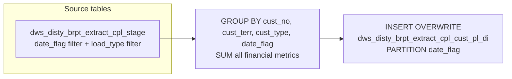

# DWS: CPL Customer P&L Summary — Daily Insert (`dws_disty_brpt_extract_cpl_cust_pl_di`)

- artifact_type: etl_table
- artifact_id: dw_us.dws_disty_brpt_extract_cpl_cust_pl_di
- domain: cpl
- one_line_purpose: This table produces a daily customer-level P&L summary for the CPL (Customer Profitability & Loss) reporting extract. For each customer, territory, and customer-type combination on a given date, it aggregates key financial line items from t...
- layer_type: DWS
- source_kind: etl_sql
- evidence_source: source/etl/sql/cpl/data_service/cpl_extract/sql/dws_disty_brpt_extract_cpl_cust_pl_di.sql

---

## L1 Data Foundation

### Identity and physical mapping
- **Table:** `dw_us.dws_disty_brpt_extract_cpl_cust_pl_di`
- **Layer type:** DWS
- **Canonical / derived:** Derived / ETL-loaded (see L3)
- **Owner team:** not registered in metadata catalog

### Grain, scope, exclusions
- **Grain:** one row per (`cust_no`, `cust_terr`, `cust_type`, `date_flag`) combination.
- **Scope:** See L2 business purpose / L3 filters
- **Partition:** `date_flag` — the processing date. - resolved from pipeline (see L4)
- **Natural key:** `cust_no`, `cust_terr`, `cust_type`, `date_flag`.
- **Exclusions:** Not documented in repository

#### Grain detail (preserved)

- **Grain:** one row per (`cust_no`, `cust_terr`, `cust_type`, `date_flag`) combination.
- **Partition:** `date_flag` — the processing date.
- **Natural key:** `cust_no`, `cust_terr`, `cust_type`, `date_flag`.

---

### Cross-engine presence
| Engine | Present | Canonical FQN | Notes |
|--------|---------|---------------|-------|
| Hive | yes | `dws_disty_brpt_extract_cpl_cust_pl_di` | ETL target / intermediate per evidence script |
| Vertica | pending | `dws_disty_brpt_extract_cpl_cust_pl_di` | Confirm via hive2vertica flow evidence / MCP |

### Physical schema reference

Pointer block only - full column catalog lives in WKB L1 storage JSON.

| Field | Value |
|-------|-------|
| **Authoritative catalog** | WKB L1 storage seed (not duplicated in this file) |
| **entity_id** | `dw_us.dws_disty_brpt_extract_cpl_cust_pl_di` |
| **l1_catalog_seed** | `target/storage/wkb/snapshots/_snapshot_id_template/l1_catalog/{engine}_{schema}_{table}.json` |
| **column_count** | pending (run ddl_seed_writer) |
| **partition_keys** | `date_flag` |
| **ddl_source** | pending Bitbucket DDL / Vertica metadata ingest |
| **retrieval** | `python -m tools.wkb.indexing.run_query --query "cpl dws_disty_brpt_extract_cpl_cust_pl_di schema" --intent find_table_schema` |

### Lineage
| Object | Role |
|--------|------|
| `dws_disty_brpt_extract_cpl_stage` | Sole source for all financial metrics. |

---

### Freshness and load path
| Item | Value |
|------|-------|
| Load pattern | See L3 end-to-end / INSERT pattern in evidence script |
| Schedule | Not documented in repository |
| Parameters | `${literal_target_db}`, `${date_flag}` |


---

## L2 Declarative Knowledge

### Business purpose
This table produces a daily customer-level P&L summary for the CPL (Customer Profitability & Loss) reporting extract. For each customer, territory, and customer-type combination on a given date, it aggregates key financial line items from the CPL staging table — including sales, expenses, cost, flooring charges and sales by party (distributor, dealer, vendor), payment terms sales, and payment metrics. The table is the primary customer P&L summary used to drive CPL business reports.

---

### Audience and use cases
| Audience | How they benefit |
|----------|-----------------|
| **CPL Reporting** | Primary output for customer P&L dashboards and reports — provides pre-aggregated daily totals by customer, territory, and type. |
| **Finance / Management** | Surfaces sales, cost, flooring charges, and payment metrics in a single customer summary row for each business date. |
| **Data Engineers** | Thin transformation layer — reads from the CPL staging table and pivots load_type categories into pre-named metric columns. |

---

### Fact key resolution
- Natural key: `cust_no`, `cust_terr`, `cust_type`, `date_flag`.
- FK / label-on attributes: see L3 dimension join patterns and step-by-step logic.
- Negative assertion: do not treat descriptive labels as grain keys unless listed under natural key.

### Time field semantics
- **date_flag / partition columns:** `date_flag` — the processing date.
- Primary reporting filter should use the partition column(s) documented in L1; resolve values via L4.


### Metrics served

| Category | Column | Logical metric | Business reading |
|----------|--------|----------------|------------------|
| Measures | — | — | No measure columns mapped for this table. |

### Metric serving map

**Formula authority:** [`source/contracts/cpl/metric-index.md`](../../source/contracts/cpl/metric-index.md)

N/A — no measure columns mapped for this table.

### etl_metrics

No governed logical metrics from `source/contracts/cpl/metric-index.md` are mapped on this table.

---

### Metric serving map
N/A - not a `*_comb_mtd` / multi-period wide serving table (or map not present in legacy doc).


### Data products and column groups (preserved)

### Identifiers and relationships

- **Customer:** `cust_no`
- **Territory:** `cust_terr`
- **Customer type:** `cust_type`

### Quantity, pricing, and cost building blocks

- `sales` — total sales amount for the customer on the date
- `exp` — total expense amount
- `cost` — total cost amount
- `floor_sales_disty` — flooring sales amount borne by the distributor
- `floor_sales_dealer` — flooring sales amount borne by the dealer
- `floor_sales_vend` — flooring sales amount borne by the vendor
- `floor_chgs_disty` — flooring charges allocated to the distributor
- `floor_chgs_dealer` — flooring charges allocated to the dealer
- `floor_chgs_vend` — flooring charges allocated to the vendor
- `terms_sales_cash` — sales on cash terms
- `terms_sales_cod` — sales on COD terms
- `period_dayxnpmt` — period days-times-non-payment (days outstanding weighted by unpaid amount)
- `period_pmt` — period payment amount
- `period_disc_taken` — period discount taken amount
- `pmt` — total payment amount
- `disc_taken` — total discount taken amount

> **Note:** `btl_amt`, `frt_load_in`, `frt_load_out`, `pdt_amt`, and `frt_in_cost_amt` are always NULL in this table. These columns are structural placeholders for other CPL load types that are not included in this script's filter.

### Core derived metrics

| Column | Formula | Business reading |
|--------|---------|-----------------|
| `sales` | `SUM(sales)` from staging for qualifying load types | Total net sales revenue for the customer on the date. |
| `exp` | `SUM(exp)` from staging | Total expense amount loaded for the customer. |
| `cost` | `SUM(cost)` from staging | Total cost of goods for the customer. |
| `pmt` | `SUM(pmt)` from staging | Total cash receipts applied. |
| `disc_taken` | `SUM(disc_taken)` from staging | Total discounts taken during payment. |

---

### etl_metrics

#### `floor_sales_disty`
- **Source:** [metric-index.md](../../source/contracts/cpl/metric-index.md#floor_sales_disty)
- **Business definition:** Distributor flooring sales.
```sql
SUM(floor_sales_disty)
```

#### `floor_sales_dealer`
- **Source:** [metric-index.md](../../source/contracts/cpl/metric-index.md#floor_sales_dealer)
- **Business definition:** Dealer flooring sales.
```sql
SUM(floor_sales_dealer)
```

#### `floor_sales_vend`
- **Source:** [metric-index.md](../../source/contracts/cpl/metric-index.md#floor_sales_vend)
- **Business definition:** Vendor flooring sales.
```sql
SUM(floor_sales_vend)
```

#### `floor_chgs_disty`
- **Source:** [metric-index.md](../../source/contracts/cpl/metric-index.md#floor_chgs_disty)
- **Business definition:** Distributor flooring charges.
```sql
SUM(floor_chgs_disty)
```

#### `floor_chgs_dealer`
- **Source:** [metric-index.md](../../source/contracts/cpl/metric-index.md#floor_chgs_dealer)
- **Business definition:** Dealer flooring charges.
```sql
SUM(floor_chgs_dealer)
```

#### `floor_chgs_vend`
- **Source:** [metric-index.md](../../source/contracts/cpl/metric-index.md#floor_chgs_vend)
- **Business definition:** Vendor flooring charges.
```sql
SUM(floor_chgs_vend)
```

#### `terms_sales_cash`
- **Source:** [metric-index.md](../../source/contracts/cpl/metric-index.md#terms_sales_cash)
- **Business definition:** Cash-terms sales.
```sql
SUM(terms_sales_cash)
```

#### `terms_sales_cod`
- **Source:** [metric-index.md](../../source/contracts/cpl/metric-index.md#terms_sales_cod)
- **Business definition:** COD-terms sales.
```sql
SUM(terms_sales_cod)
```

#### `period_dayxnpmt`
- **Source:** [metric-index.md](../../source/contracts/cpl/metric-index.md#period_dayxnpmt)
- **Business definition:** Days-times-non-payment metric for the period.
```sql
SUM(period_dayxnpmt)
```

#### `period_pmt`
- **Source:** [metric-index.md](../../source/contracts/cpl/metric-index.md#period_pmt)
- **Business definition:** Period payment total.
```sql
SUM(period_pmt)
```

#### `period_disc_taken`
- **Source:** [metric-index.md](../../source/contracts/cpl/metric-index.md#period_disc_taken)
- **Business definition:** Period discount taken total.
```sql
SUM(period_disc_taken)
```


---

## L3 Procedural Knowledge

### Query and routing rules
**Business filters:** Use partition / date keys from L1 grain for reporting scope.
**Technical predicates (load only):** See Key filters and step-by-step logic below.

### Dimension join patterns
| Dimension FQN | Join keys | Purpose | Evidence |
|---------------|-----------|---------|----------|
| See step-by-step / base tables | See L3 steps | Dimension enrichment | `source/etl/sql/cpl/data_service/cpl_extract/sql/dws_disty_brpt_extract_cpl_cust_pl_di.sql` |

### Key filters and ETL business logic
### Step 1 — Final `INSERT OVERWRITE` into `dws_disty_brpt_extract_cpl_cust_pl_di`

**Source:** `dws_disty_brpt_extract_cpl_stage`

**Filter (natural language):**
- `date_flag = '${date_flag}'` — scoped to the processing date.
- `load_type IN ('SALES', 'FxDIST', 'FxDEAL', 'FxVEND', 'TSCASH', 'TSCOD', 'PDPMTDISC', 'PMTDISC')` — includes sales, three flooring categories (distributor/dealer/vendor), two terms-sales categories (cash/COD), and two payment-discount categories.

**Group by:** `cust_no`, `cust_terr`, `cust_type`, `date_flag`

**Aggregated columns:**

| Column | Formula | Plain language |
|--------|---------|----------------|
| `sales` | `SUM(sales)` | Total sales from all qualifying load types. |
| `exp` | `SUM(exp)` | Total expenses. |
| `cost` | `SUM(cost)` | Total cost. |
| `floor_sales_disty` | `SUM(floor_sales_disty)` | Distributor flooring sales. |
| `floor_sales_dealer` | `SUM(floor_sales_dealer)` | Dealer flooring sales. |
| `floor_sales_vend` | `SUM(floor_sales_vend)` | Vendor flooring sales. |
| `floor_chgs_disty` | `SUM(floor_chgs_disty)` | Distributor flooring charges. |
| `floor_chgs_dealer` | `SUM(floor_chgs_dealer)` | Dealer flooring charges. |
| `floor_chgs_vend` | `SUM(floor_chgs_vend)` | Vendor flooring charges. |
| `terms_sales_cash` | `SUM(terms_sales_cash)` | Cash-terms sales. |
| `terms_sales_cod` | `SUM(terms_sales_cod)` | COD-terms sales. |
| `period_dayxnpmt` | `SUM(period_dayxnpmt)` | Days-times-non-payment metric for the period. |
| `period...

### Standard time-filter SQL
```sql
-- relative period filter using resolved partition value (see L4)
SELECT *
FROM dws_disty_brpt_extract_cpl_cust_pl_di
WHERE /* partition predicate */ date_flag = '${partition_value}';
```

### End-to-end flow
**Runtime parameters:** `${date_flag}`, `${literal_target_db}`
**Target table:** `dws_disty_brpt_extract_cpl_cust_pl_di`, partitioned by **`date_flag`**.

1. Read `dws_disty_brpt_extract_cpl_stage` for rows where `date_flag = '${date_flag}'` and `load_type IN ('SALES','FxDIST','FxDEAL','FxVEND','TSCASH','TSCOD','PDPMTDISC','PMTDISC')`.
2. Aggregate all financial metrics with `SUM()` grouped by `cust_no`, `cust_terr`, `cust_type`, `date_flag`.
3. **INSERT OVERWRITE** the daily partition with the aggregated rows, with NULL placeholders for columns not covered by these load types.



---


#### High-level stages (preserved)

| Stage | Business meaning |
|-------|-----------------|
| **Filter staging by date and load type** | Reads the CPL staging table for the processing date, keeping only rows whose `load_type` belongs to the defined CPL P&L categories (SALES, FxDIST, FxDEAL, FxVEND, TSCASH, TSCOD, PDPMTDISC, PMTDISC). |
| **Aggregate to customer grain** | Groups all matching rows by `cust_no`, `cust_terr`, `cust_type`, and `date_flag`, summing each financial metric. |
| **Write daily partition** | Inserts the summarized rows into the target table partitioned by `date_flag`. |

**Parameters:** `${literal_target_db}`, `${date_flag}`

---


### Base tables register
| Object | Role in this job |
|--------|-----------------|
| `dws_disty_brpt_extract_cpl_stage` | Sole source — CPL staging table; filtered to processing date and qualifying load types; provides all financial metric columns. |

**Temporary tables:** None — single direct aggregation and INSERT from the staging table.

---

### Step-by-step logic
### Step 1 — Final `INSERT OVERWRITE` into `dws_disty_brpt_extract_cpl_cust_pl_di`

**Source:** `dws_disty_brpt_extract_cpl_stage`

**Filter (natural language):**
- `date_flag = '${date_flag}'` — scoped to the processing date.
- `load_type IN ('SALES', 'FxDIST', 'FxDEAL', 'FxVEND', 'TSCASH', 'TSCOD', 'PDPMTDISC', 'PMTDISC')` — includes sales, three flooring categories (distributor/dealer/vendor), two terms-sales categories (cash/COD), and two payment-discount categories.

**Group by:** `cust_no`, `cust_terr`, `cust_type`, `date_flag`

**Aggregated columns:**

| Column | Formula | Plain language |
|--------|---------|----------------|
| `sales` | `SUM(sales)` | Total sales from all qualifying load types. |
| `exp` | `SUM(exp)` | Total expenses. |
| `cost` | `SUM(cost)` | Total cost. |
| `floor_sales_disty` | `SUM(floor_sales_disty)` | Distributor flooring sales. |
| `floor_sales_dealer` | `SUM(floor_sales_dealer)` | Dealer flooring sales. |
| `floor_sales_vend` | `SUM(floor_sales_vend)` | Vendor flooring sales. |
| `floor_chgs_disty` | `SUM(floor_chgs_disty)` | Distributor flooring charges. |
| `floor_chgs_dealer` | `SUM(floor_chgs_dealer)` | Dealer flooring charges. |
| `floor_chgs_vend` | `SUM(floor_chgs_vend)` | Vendor flooring charges. |
| `terms_sales_cash` | `SUM(terms_sales_cash)` | Cash-terms sales. |
| `terms_sales_cod` | `SUM(terms_sales_cod)` | COD-terms sales. |
| `period_dayxnpmt` | `SUM(period_dayxnpmt)` | Days-times-non-payment metric for the period. |
| `period_pmt` | `SUM(period_pmt)` | Period payment total. |
| `period_disc_taken` | `SUM(period_disc_taken)` | Period discount taken total. |
| `pmt` | `SUM(pmt)` | Total payment amount. |
| `disc_taken` | `SUM(disc_taken)` | Total discount taken. |

**Always-NULL columns:**

| Column | Reason |
|--------|--------|
| `btl_amt` | Not covered by this script's load_type filter. |
| `frt_load_in` | Not covered by this script's load_type filter. |
| `frt_load_out` | Not covered by this script's load_type filter. |
| `pdt_amt` | Not covered by this script's load_type filter. |
| `frt_in_cost_amt` | Not covered by this script's load_type filter. |

---

### Relationship map (embedded)

| from_fqn | to_fqn | cardinality | join_keys | provenance |
|----------|--------|-------------|-----------|------------|
| — | — | — | — | Not documented in repository |

`source/ref/cpl/table relationship.txt`: Not documented in repository.

### Special logic (embedded)

Not documented in repository

### Column / field derivations (from ETL SQL)

| target_column | expression_sql | upstream_columns | upstream_tables | transform_kind | evidence |
|---------------|----------------|------------------|-----------------|----------------|----------|
| `cust_no` | `cust_no` | `cust_no` | `${literal_target_db}.dws_disty_brpt_extract_cpl_stage` | passthrough | `source/etl/sql/cpl/data_service/cpl_extract/sql/dws_disty_brpt_extract_cpl_cust_pl_di.sql:2` |
| `cust_terr` | `cust_terr` | `cust_terr` | `${literal_target_db}.dws_disty_brpt_extract_cpl_stage` | passthrough | `source/etl/sql/cpl/data_service/cpl_extract/sql/dws_disty_brpt_extract_cpl_cust_pl_di.sql:3` |
| `cust_type` | `cust_type` | `cust_type` | `${literal_target_db}.dws_disty_brpt_extract_cpl_stage` | passthrough | `source/etl/sql/cpl/data_service/cpl_extract/sql/dws_disty_brpt_extract_cpl_cust_pl_di.sql:4` |
| `sales` | `SUM(sales)` | `sales` | `${literal_target_db}.dws_disty_brpt_extract_cpl_stage` | agg | `source/etl/sql/cpl/data_service/cpl_extract/sql/dws_disty_brpt_extract_cpl_cust_pl_di.sql:5` |
| `exp` | `SUM(exp)` | `exp` | `${literal_target_db}.dws_disty_brpt_extract_cpl_stage` | agg | `source/etl/sql/cpl/data_service/cpl_extract/sql/dws_disty_brpt_extract_cpl_cust_pl_di.sql:6` |
| `cost` | `SUM(cost)` | `cost` | `${literal_target_db}.dws_disty_brpt_extract_cpl_stage` | agg | `source/etl/sql/cpl/data_service/cpl_extract/sql/dws_disty_brpt_extract_cpl_cust_pl_di.sql:7` |
| `btl_amt` | `null` | — | `${literal_target_db}.dws_disty_brpt_extract_cpl_stage` | rename | `source/etl/sql/cpl/data_service/cpl_extract/sql/dws_disty_brpt_extract_cpl_cust_pl_di.sql:8` |
| `frt_load_in` | `null` | — | `${literal_target_db}.dws_disty_brpt_extract_cpl_stage` | rename | `source/etl/sql/cpl/data_service/cpl_extract/sql/dws_disty_brpt_extract_cpl_cust_pl_di.sql:8` |
| `frt_load_out` | `null` | — | `${literal_target_db}.dws_disty_brpt_extract_cpl_stage` | rename | `source/etl/sql/cpl/data_service/cpl_extract/sql/dws_disty_brpt_extract_cpl_cust_pl_di.sql:8` |
| `floor_sales_disty` | `SUM(floor_sales_disty)` | `floor_sales_disty` | `${literal_target_db}.dws_disty_brpt_extract_cpl_stage` | agg | `source/etl/sql/cpl/data_service/cpl_extract/sql/dws_disty_brpt_extract_cpl_cust_pl_di.sql:11` |
| `floor_sales_dealer` | `SUM(floor_sales_dealer)` | `floor_sales_dealer` | `${literal_target_db}.dws_disty_brpt_extract_cpl_stage` | agg | `source/etl/sql/cpl/data_service/cpl_extract/sql/dws_disty_brpt_extract_cpl_cust_pl_di.sql:12` |
| `floor_sales_vend` | `SUM(floor_sales_vend)` | `floor_sales_vend` | `${literal_target_db}.dws_disty_brpt_extract_cpl_stage` | agg | `source/etl/sql/cpl/data_service/cpl_extract/sql/dws_disty_brpt_extract_cpl_cust_pl_di.sql:13` |
| `floor_chgs_disty` | `SUM(floor_chgs_disty)` | `floor_chgs_disty` | `${literal_target_db}.dws_disty_brpt_extract_cpl_stage` | agg | `source/etl/sql/cpl/data_service/cpl_extract/sql/dws_disty_brpt_extract_cpl_cust_pl_di.sql:14` |
| `floor_chgs_dealer` | `SUM(floor_chgs_dealer)` | `floor_chgs_dealer` | `${literal_target_db}.dws_disty_brpt_extract_cpl_stage` | agg | `source/etl/sql/cpl/data_service/cpl_extract/sql/dws_disty_brpt_extract_cpl_cust_pl_di.sql:15` |
| `floor_chgs_vend` | `SUM(floor_chgs_vend)` | `floor_chgs_vend` | `${literal_target_db}.dws_disty_brpt_extract_cpl_stage` | agg | `source/etl/sql/cpl/data_service/cpl_extract/sql/dws_disty_brpt_extract_cpl_cust_pl_di.sql:16` |
| `terms_sales_cash` | `SUM(terms_sales_cash)` | `terms_sales_cash` | `${literal_target_db}.dws_disty_brpt_extract_cpl_stage` | agg | `source/etl/sql/cpl/data_service/cpl_extract/sql/dws_disty_brpt_extract_cpl_cust_pl_di.sql:17` |
| `terms_sales_cod` | `SUM(terms_sales_cod)` | `terms_sales_cod` | `${literal_target_db}.dws_disty_brpt_extract_cpl_stage` | agg | `source/etl/sql/cpl/data_service/cpl_extract/sql/dws_disty_brpt_extract_cpl_cust_pl_di.sql:18` |
| `period_dayxnpmt` | `SUM(period_dayxnpmt)` | `period_dayxnpmt` | `${literal_target_db}.dws_disty_brpt_extract_cpl_stage` | agg | `source/etl/sql/cpl/data_service/cpl_extract/sql/dws_disty_brpt_extract_cpl_cust_pl_di.sql:19` |
| `period_pmt` | `SUM(period_pmt)` | `period_pmt` | `${literal_target_db}.dws_disty_brpt_extract_cpl_stage` | agg | `source/etl/sql/cpl/data_service/cpl_extract/sql/dws_disty_brpt_extract_cpl_cust_pl_di.sql:20` |
| `period_disc_taken` | `SUM(period_disc_taken)` | `period_disc_taken` | `${literal_target_db}.dws_disty_brpt_extract_cpl_stage` | agg | `source/etl/sql/cpl/data_service/cpl_extract/sql/dws_disty_brpt_extract_cpl_cust_pl_di.sql:21` |
| `pmt` | `SUM(pmt)` | `pmt` | `${literal_target_db}.dws_disty_brpt_extract_cpl_stage` | agg | `source/etl/sql/cpl/data_service/cpl_extract/sql/dws_disty_brpt_extract_cpl_cust_pl_di.sql:22` |
| `disc_taken` | `SUM(disc_taken)` | `disc_taken` | `${literal_target_db}.dws_disty_brpt_extract_cpl_stage` | agg | `source/etl/sql/cpl/data_service/cpl_extract/sql/dws_disty_brpt_extract_cpl_cust_pl_di.sql:23` |
| `pdt_amt` | `null` | — | `${literal_target_db}.dws_disty_brpt_extract_cpl_stage` | rename | `source/etl/sql/cpl/data_service/cpl_extract/sql/dws_disty_brpt_extract_cpl_cust_pl_di.sql:8` |
| `frt_in_cost_amt` | `null` | — | `${literal_target_db}.dws_disty_brpt_extract_cpl_stage` | rename | `source/etl/sql/cpl/data_service/cpl_extract/sql/dws_disty_brpt_extract_cpl_cust_pl_di.sql:8` |
| `date_flag` | `date_flag` | `date_flag` | `${literal_target_db}.dws_disty_brpt_extract_cpl_stage` | passthrough | `source/etl/sql/cpl/data_service/cpl_extract/sql/dws_disty_brpt_extract_cpl_cust_pl_di.sql:1` |

### Sentinel and code values
| Value | Meaning |
|-------|---------|
| `load_type = 'SALES'` | Standard sales revenue lines. |
| `load_type = 'FxDIST'` | Flooring charges/sales allocated to the distributor. |
| `load_type = 'FxDEAL'` | Flooring charges/sales allocated to the dealer. |
| `load_type = 'FxVEND'` | Flooring charges/sales allocated to the vendor. |
| `load_type = 'TSCASH'` | Sales on cash payment terms. |
| `load_type = 'TSCOD'` | Sales on COD payment terms. |
| `load_type = 'PDPMTDISC'` | Period payment discount lines. |
| `load_type = 'PMTDISC'` | Payment discount lines. |

---

---

## L4 Validation

### Resolved partition value
| Step | Source | How partition / date scope is determined |
|------|--------|------------------------------------------|
| 1 | evidence script / flow | See parameters in L1 Freshness and L3 filters - `source/etl/sql/cpl/data_service/cpl_extract/sql/dws_disty_brpt_extract_cpl_cust_pl_di.sql` |

**Plain language:** Partition and date scope follow Azkaban/bootstrap parameters documented in the source script and orchestrating flow; do not hardcode calendar literals.

### Data quality checks
- Prefer row-count-by-partition, metric sums, and grain duplicate checks (see Validation SQL).
- Additional checks from legacy caveats / operational notes when present.

### Validation SQL
```sql
-- 1) row count by partition
-- SELECT partition_col, COUNT(*) FROM dws_disty_brpt_extract_cpl_cust_pl_di WHERE partition_col = '${partition_value}' GROUP BY 1;
-- 2) metric sum by dimension (top N) - replace metric/dim from L2
-- 3) grain duplicate check on natural keys
```


### Caveats for interpretation
- Five columns (`btl_amt`, `frt_load_in`, `frt_load_out`, `pdt_amt`, `frt_in_cost_amt`) are always NULL — they represent load types not handled by this specific script and must be populated by a separate ETL step if needed.
- The aggregation collapses multiple load_type rows per customer into a single row per (`cust_no`, `cust_terr`, `cust_type`, `date_flag`). Individual load_type breakdowns are not available in this table; use the staging table directly for that.
- `cust_terr` and `cust_type` are taken as-is from the staging table; they reflect whatever territory and type were assigned during the staging load process.

---

### Conflicts and open questions
- Schedule, owner, SLA: Not documented in repository (unless preserved schedule evidence above).
- Vertica MCP verification: pending unless confirmed in L5.


---

## L5 Runtime View

### Query path and engine preference
| Role | Hive object | Vertica object | Sync mode | Evidence | MCP verified |
|------|-------------|----------------|-----------|----------|--------------|
| **Not in Vertica** | *See script lineage* | *No Vertica mapping identified in repository* | - | *Add flow evidence when found* | no |

No queryable Vertica table has been confirmed for this script from current repository evidence.

### Access constraints
- Country / company schema parameters may apply (`literal_country`, `company_no`, etc.).
- Hive-only staging objects are not reporting surfaces unless synced.

### Query risk profile
| Field | Value |
|-------|-------|
| requires_date_predicate | yes |
| scan_risk_tier | high |

---

## L6 Access and Consumption

### Primary consumers and use cases
| Audience | How they benefit |
|----------|-----------------|
| **CPL Reporting** | Primary output for customer P&L dashboards and reports — provides pre-aggregated daily totals by customer, territory, and type. |
| **Finance / Management** | Surfaces sales, cost, flooring charges, and payment metrics in a single customer summary row for each business date. |
| **Data Engineers** | Thin transformation layer — reads from the CPL staging table and pivots load_type categories into pre-named metric columns. |

---

### Representative query patterns
```sql
-- certified / illustrative lookup - replace predicates from L1/L4
SELECT *
FROM dws_disty_brpt_extract_cpl_cust_pl_di
WHERE date_flag = '${partition_value}'
LIMIT 100;
```

### Dependencies and notes
### Upstream objects (verified)

| Object | Usage | Evidence |
|--------|-------|----------|
| `dws_disty_brpt_extract_cpl_stage` | Sole source, filtered by `date_flag` and `load_type` | `dws_disty_brpt_extract_cpl_cust_pl_di.sql:27-29` |

### Downstream consumers (verified)

| Object / script | Evidence |
|-----------------|----------|
| None identified in repository. | — |

### Operational detail (verified)

- Daily incremental load via `INSERT OVERWRITE ... PARTITION (date_flag)` — only the processing-date partition is replaced.

### Not documented in repository

- Schedule, owner, SLA — not in scripts or configs.
- Which separate ETL step populates the five always-NULL columns.

---

*Document generated from `source/etl/sql/cpl/data_service/cpl_extract/sql/dws_disty_brpt_extract_cpl_cust_pl_di.sql`.*

#### Not documented in repository
- Owner, SLA (unless schedule evidence preserved above)
- Any dependency without `file:line` evidence in this document

---

*Document migrated to L1-L6 from legacy Knowledgebase content. Evidence: `source/etl/sql/cpl/data_service/cpl_extract/sql/dws_disty_brpt_extract_cpl_cust_pl_di.sql`.*
