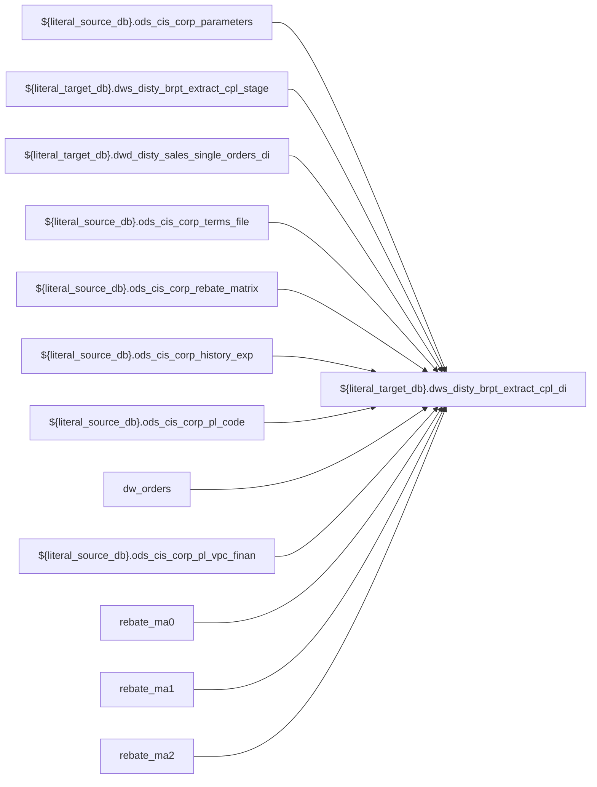

# DWS: `dws_disty_brpt_extract_cpl_di`

- artifact_type: etl_table
- artifact_id: ${literal_target_db}.dws_disty_brpt_extract_cpl_di
- domain: cpl
- one_line_purpose: ETL script `source/etl/sql/cpl/data_service/cpl_extract/python/dws_disty_brpt_extract_cpl_di.py` loads `${literal_target_db}.dws_disty_brpt_extract_cpl_di` (layer `DWS`). Purpose inferred from SQL only.
- layer_type: DWS
- source_kind: etl_sql
- evidence_source: source/etl/sql/cpl/data_service/cpl_extract/python/dws_disty_brpt_extract_cpl_di.py

---

## L1 Data Foundation

### Identity and physical mapping
- **Table:** `${literal_target_db}.dws_disty_brpt_extract_cpl_di`
- **Layer type:** DWS
- **Canonical / derived:** Derived / ETL-loaded (see L3)
- **Owner team:** Not documented in repository

### Grain, scope, exclusions
- **Grain:** Not documented in repository (see SELECT/GROUP BY in `source/etl/sql/cpl/data_service/cpl_extract/python/dws_disty_brpt_extract_cpl_di.py`)
- **Partition:** `date_flag,data_group`
- **Exclusions:** See L3 Key filters

### Cross-engine presence
| Engine | Present | Canonical FQN | Notes |
|--------|---------|---------------|-------|
| Hive | yes | `${literal_target_db}.dws_disty_brpt_extract_cpl_di` | ETL target |
| Vertica | Not documented in repository | — | Confirm via hive2vertica flow |

### Physical schema reference

Pointer block only - full column catalog lives in WKB L1 storage JSON.

| Field | Value |
|-------|-------|
| **Authoritative catalog** | WKB L1 storage seed (not duplicated in this file) |
| **entity_id** | `${literal_target_db}.dws_disty_brpt_extract_cpl_di` |
| **l1_catalog_seed** | `target/storage/wkb/snapshots/_snapshot_id_template/l1_catalog/{engine}_{schema}_{table}.json` |
| **column_count** | pending (run ddl_seed_writer) |
| **partition_keys** | `date_flag,data_group` |
| **ddl_source** | pending Bitbucket DDL / Vertica metadata ingest |
| **retrieval** | `python -m tools.wkb.indexing.run_query --query "cpl dws_disty_brpt_extract_cpl_di schema" --intent find_table_schema` |

### Lineage
| Object | Role |
|--------|------|
| `${literal_source_db}.ods_cis_corp_parameters` | upstream (ETL FROM/JOIN) |
| `${literal_target_db}.dws_disty_brpt_extract_cpl_stage` | upstream (ETL FROM/JOIN) |
| `${literal_target_db}.dwd_disty_sales_single_orders_di` | upstream (ETL FROM/JOIN) |
| `${literal_source_db}.ods_cis_corp_terms_file` | upstream (ETL FROM/JOIN) |
| `${literal_source_db}.ods_cis_corp_rebate_matrix` | upstream (ETL FROM/JOIN) |
| `${literal_source_db}.ods_cis_corp_history_exp` | upstream (ETL FROM/JOIN) |
| `${literal_source_db}.ods_cis_corp_pl_code` | upstream (ETL FROM/JOIN) |
| `dw_orders` | upstream (ETL FROM/JOIN) |
| `${literal_source_db}.ods_cis_corp_pl_vpc_finan` | upstream (ETL FROM/JOIN) |
| `rebate_ma0` | upstream (ETL FROM/JOIN) |
| `rebate_ma1` | upstream (ETL FROM/JOIN) |
| `rebate_ma2` | upstream (ETL FROM/JOIN) |
| `rebate_ma3` | upstream (ETL FROM/JOIN) |
| `rebate_ma4` | upstream (ETL FROM/JOIN) |
| `rebate_ma5` | upstream (ETL FROM/JOIN) |
| `rebate_ma6` | upstream (ETL FROM/JOIN) |
| `rebate_ma7` | upstream (ETL FROM/JOIN) |
| `temp1` | upstream (ETL FROM/JOIN) |
| `${literal_target_db}.dws_disty_brpt_extract_cpl_di` | **Target** |

### Freshness and load path
| Item | Value |
|------|-------|
| Load pattern | See L3 INSERT / OVERWRITE in evidence script |
| Schedule | Not documented in repository |
| Parameters | Parsed from ETL literals / `${...}` in `source/etl/sql/cpl/data_service/cpl_extract/python/dws_disty_brpt_extract_cpl_di.py` |

## L2 Declarative Knowledge

### Business purpose
ETL script `source/etl/sql/cpl/data_service/cpl_extract/python/dws_disty_brpt_extract_cpl_di.py` loads `${literal_target_db}.dws_disty_brpt_extract_cpl_di` (layer `DWS`). Purpose inferred from SQL only.

### Audience and use cases
| Audience | How they benefit |
|----------|-----------------|
| Data / BI consumers | Use target table produced by this ETL |
| Data Engineering | Maintain load logic in evidence script |

### Fact key resolution
- Keys follow target INSERT column list / GROUP BY in evidence SQL.

### Time field semantics
- Partition / date fields: `date_flag,data_group`

### Metrics served
- See L3 column derivations for measure expressions when present.

### Metric serving map
N/A — not a multi-period wide serving table (or not documented).

### etl_metrics
No calculable business metrics registered in metric-index for this create run.

## L3 Procedural Knowledge

### Query and routing rules
- Prefer querying the target `${literal_target_db}.dws_disty_brpt_extract_cpl_di` after successful ETL load.

### Dimension join patterns
- See Relationship map and Base tables register.

### Key filters and ETL business logic

| Predicate | Kind | Evidence |
|-----------|------|----------|
| `deptid = 100 and parameter_name = 'RUN GL FOR CUSTPL' SELECT day('${date_flag}'),trunc('${date_flag}','MM'),add_months(trunc('${date_flag}','MM'),-1) INSERT OVERWRITE TABLE ${literal_target_db}.dws...` | Technical (load only) / Business | `source/etl/sql/cpl/data_service/cpl_extract/python/dws_disty_brpt_extract_cpl_di.py` |
| `o.date_flag = '${date_flag}' and o.terr_status = 'n' DROP TABLE IF EXISTS rebate_ma0; CREATE TEMPORARY TABLE rebate_ma0 AS SELECT r.rebate_no ,r.u_version ,r.rebate_desc ,r.beg_date ,r.end_date ,r....` | Technical (load only) / Business | `source/etl/sql/cpl/data_service/cpl_extract/python/dws_disty_brpt_extract_cpl_di.py` |
| `o.date_flag = '${date_flag}' AND day(o.date_flag) BETWEEN beg_day AND end_day` | Technical (load only) / Business | `source/etl/sql/cpl/data_service/cpl_extract/python/dws_disty_brpt_extract_cpl_di.py` |

### Standard time-filter SQL
```sql
-- See partition / date predicates in source/etl/sql/cpl/data_service/cpl_extract/python/dws_disty_brpt_extract_cpl_di.py
```

### End-to-end flow



### Base tables register

| Object | Role |
|--------|------|
| `${literal_source_db}.ods_cis_corp_parameters` | source / temp (from ETL FROM/JOIN) |
| `${literal_target_db}.dws_disty_brpt_extract_cpl_stage` | source / temp (from ETL FROM/JOIN) |
| `${literal_target_db}.dwd_disty_sales_single_orders_di` | source / temp (from ETL FROM/JOIN) |
| `${literal_source_db}.ods_cis_corp_terms_file` | source / temp (from ETL FROM/JOIN) |
| `${literal_source_db}.ods_cis_corp_rebate_matrix` | source / temp (from ETL FROM/JOIN) |
| `${literal_source_db}.ods_cis_corp_history_exp` | source / temp (from ETL FROM/JOIN) |
| `${literal_source_db}.ods_cis_corp_pl_code` | source / temp (from ETL FROM/JOIN) |
| `dw_orders` | source / temp (from ETL FROM/JOIN) |
| `${literal_source_db}.ods_cis_corp_pl_vpc_finan` | source / temp (from ETL FROM/JOIN) |
| `rebate_ma0` | source / temp (from ETL FROM/JOIN) |
| `rebate_ma1` | source / temp (from ETL FROM/JOIN) |
| `rebate_ma2` | source / temp (from ETL FROM/JOIN) |
| `rebate_ma3` | source / temp (from ETL FROM/JOIN) |
| `rebate_ma4` | source / temp (from ETL FROM/JOIN) |
| `rebate_ma5` | source / temp (from ETL FROM/JOIN) |
| `rebate_ma6` | source / temp (from ETL FROM/JOIN) |
| `rebate_ma7` | source / temp (from ETL FROM/JOIN) |
| `temp1` | source / temp (from ETL FROM/JOIN) |

### Step-by-step logic
1. Read sources listed in Base tables register (`source/etl/sql/cpl/data_service/cpl_extract/python/dws_disty_brpt_extract_cpl_di.py`).
2. Apply filters documented under Key filters.
3. INSERT OVERWRITE / write target `${literal_target_db}.dws_disty_brpt_extract_cpl_di`.

### Relationship map (embedded)

| from_fqn | to_fqn | cardinality | join_keys | provenance |
|----------|--------|-------------|-----------|------------|
| `${literal_target_db}.dwd_disty_sales_single_orders_di` | `${literal_source_db}.ods_cis_corp_terms_file` | many:1 | `trim(o.terms) = trim(t.doc_terms)` | etl_sql (source/etl/sql/cpl/data_service/cpl_extract/python/dws_disty_brpt_extract_cpl_di.py:28) |
| `dw_orders` | `${literal_source_db}.ods_cis_corp_history_exp` | many:1 | `o.order_type = e.order_type AND o.order_no = e.order_no AND o.order_line_no = e.order_line_no` | etl_sql (source/etl/sql/cpl/data_service/cpl_extract/python/dws_disty_brpt_extract_cpl_di.py:585) |
| `${literal_source_db}.ods_cis_corp_history_exp` | `${literal_source_db}.ods_cis_corp_pl_code` | many:1 | `e.gl_acct_no = c.icode` | etl_sql (source/etl/sql/cpl/data_service/cpl_extract/python/dws_disty_brpt_extract_cpl_di.py:585) |
| `dw_orders` | `${literal_source_db}.ods_cis_corp_pl_vpc_finan` | many:1 | `o.prod_code = f.prod_code AND o.vend_no = f.vend_no` | etl_sql (source/etl/sql/cpl/data_service/cpl_extract/python/dws_disty_brpt_extract_cpl_di.py:585) |

`source/ref/cpl/table relationship.txt`: Not documented in repository.

### Special logic (embedded)

Not documented in repository

### Column / field derivations (from ETL SQL)

| target_column | expression_sql | upstream_columns | upstream_tables | transform_kind | evidence |
|---------------|----------------|------------------|-----------------|----------------|----------|
| `cust_no` | `cust_no` | `cust_no` | `temp1` | passthrough | `source/etl/sql/cpl/data_service/cpl_extract/python/dws_disty_brpt_extract_cpl_di.py:29` |
| `cust_terr` | `cust_terr` | `cust_terr` | `temp1` | passthrough | `source/etl/sql/cpl/data_service/cpl_extract/python/dws_disty_brpt_extract_cpl_di.py:30` |
| `cust_type` | `cust_type` | `cust_type` | `temp1` | passthrough | `source/etl/sql/cpl/data_service/cpl_extract/python/dws_disty_brpt_extract_cpl_di.py:31` |
| `terms` | `null` | — | `temp1` | rename | `source/etl/sql/cpl/data_service/cpl_extract/python/dws_disty_brpt_extract_cpl_di.py:34` |
| `risk_cost` | `null` | — | `temp1` | rename | `source/etl/sql/cpl/data_service/cpl_extract/python/dws_disty_brpt_extract_cpl_di.py:34` |
| `rma_type` | `null` | — | `temp1` | rename | `source/etl/sql/cpl/data_service/cpl_extract/python/dws_disty_brpt_extract_cpl_di.py:34` |
| `rma_count` | `null` | — | `temp1` | rename | `source/etl/sql/cpl/data_service/cpl_extract/python/dws_disty_brpt_extract_cpl_di.py:34` |
| `rma_cost` | `null` | — | `temp1` | rename | `source/etl/sql/cpl/data_service/cpl_extract/python/dws_disty_brpt_extract_cpl_di.py:34` |
| `vend_no` | `vend_no` | `vend_no` | `temp1` | passthrough | `source/etl/sql/cpl/data_service/cpl_extract/python/dws_disty_brpt_extract_cpl_di.py:37` |
| `exp_code` | `null` | — | `temp1` | rename | `source/etl/sql/cpl/data_service/cpl_extract/python/dws_disty_brpt_extract_cpl_di.py:34` |
| `exp_amt` | `null` | — | `temp1` | rename | `source/etl/sql/cpl/data_service/cpl_extract/python/dws_disty_brpt_extract_cpl_di.py:34` |
| `gl_acct_no` | `null` | — | `temp1` | rename | `source/etl/sql/cpl/data_service/cpl_extract/python/dws_disty_brpt_extract_cpl_di.py:34` |
| `gl_amt` | `null` | — | `temp1` | rename | `source/etl/sql/cpl/data_service/cpl_extract/python/dws_disty_brpt_extract_cpl_di.py:34` |
| `sales` | `null` | — | `temp1` | rename | `source/etl/sql/cpl/data_service/cpl_extract/python/dws_disty_brpt_extract_cpl_di.py:34` |
| `credit_cost` | `null` | — | `temp1` | rename | `source/etl/sql/cpl/data_service/cpl_extract/python/dws_disty_brpt_extract_cpl_di.py:34` |
| `prod_code` | `prod_code` | `prod_code` | `temp1` | passthrough | `source/etl/sql/cpl/data_service/cpl_extract/python/dws_disty_brpt_extract_cpl_di.py:44` |
| `sku_no` | `sku_no` | `sku_no` | `temp1` | passthrough | `source/etl/sql/cpl/data_service/cpl_extract/python/dws_disty_brpt_extract_cpl_di.py:45` |
| `state` | `state` | `state` | `temp1` | passthrough | `source/etl/sql/cpl/data_service/cpl_extract/python/dws_disty_brpt_extract_cpl_di.py:46` |
| `rebate_no` | `rebate_no` | `rebate_no` | `temp1` | passthrough | `source/etl/sql/cpl/data_service/cpl_extract/python/dws_disty_brpt_extract_cpl_di.py:47` |
| `rebate_rate` | `rebate_rate` | `rebate_rate` | `temp1` | passthrough | `source/etl/sql/cpl/data_service/cpl_extract/python/dws_disty_brpt_extract_cpl_di.py:48` |
| `rebate_amt` | `rebate_amt` | `rebate_amt` | `temp1` | passthrough | `source/etl/sql/cpl/data_service/cpl_extract/python/dws_disty_brpt_extract_cpl_di.py:49` |
| `date_flag` | `date_flag` | `date_flag` | `temp1` | passthrough | `source/etl/sql/cpl/data_service/cpl_extract/python/dws_disty_brpt_extract_cpl_di.py:4` |
| `data_group` | `'cust_rebate'` | `cust_rebate` | `temp1` | literal | `source/etl/sql/cpl/data_service/cpl_extract/python/dws_disty_brpt_extract_cpl_di.py:839` |

### Sentinel and code values
Not documented in repository beyond CASE/exp_code predicates in ETL SQL.

## L4 Validation

### Resolved partition value
- Partition expression from ETL: `date_flag,data_group`
- Runtime values: Not documented in repository (resolve via Azkaban params when flow evidence exists).

### Data quality checks
Not documented in repository

### Validation SQL
N/A — Vertica MCP not executed during documentation (Vertica no-run policy).

### Caveats for interpretation
- Generated from ETL SQL evidence only; business definitions may need `source/ref` enrichment.

### Conflicts and open questions
None identified in repository

## L5 Runtime View

### Query path and engine preference
| Path | Engine | Evidence |
|------|--------|----------|
| ETL load | Hive/Spark | `source/etl/sql/cpl/data_service/cpl_extract/python/dws_disty_brpt_extract_cpl_di.py` |
| Serving | Vertica (when synced) | Not documented in repository |

### Access constraints
Not documented in repository

### Query risk profile
- Scan risk depends on partition pruning; always filter partition keys when present.

## L6 Access and Consumption

### Primary consumers and use cases
Not documented in repository

### Representative query patterns
Not documented in repository

### Dependencies and notes

#### Upstream objects (verified)
| Object | Usage | Evidence |
|--------|-------|----------|
| `${literal_source_db}.ods_cis_corp_parameters` | FROM/JOIN | `source/etl/sql/cpl/data_service/cpl_extract/python/dws_disty_brpt_extract_cpl_di.py` |
| `${literal_target_db}.dws_disty_brpt_extract_cpl_stage` | FROM/JOIN | `source/etl/sql/cpl/data_service/cpl_extract/python/dws_disty_brpt_extract_cpl_di.py` |
| `${literal_target_db}.dwd_disty_sales_single_orders_di` | FROM/JOIN | `source/etl/sql/cpl/data_service/cpl_extract/python/dws_disty_brpt_extract_cpl_di.py` |
| `${literal_source_db}.ods_cis_corp_terms_file` | FROM/JOIN | `source/etl/sql/cpl/data_service/cpl_extract/python/dws_disty_brpt_extract_cpl_di.py` |
| `${literal_source_db}.ods_cis_corp_rebate_matrix` | FROM/JOIN | `source/etl/sql/cpl/data_service/cpl_extract/python/dws_disty_brpt_extract_cpl_di.py` |
| `${literal_source_db}.ods_cis_corp_history_exp` | FROM/JOIN | `source/etl/sql/cpl/data_service/cpl_extract/python/dws_disty_brpt_extract_cpl_di.py` |
| `${literal_source_db}.ods_cis_corp_pl_code` | FROM/JOIN | `source/etl/sql/cpl/data_service/cpl_extract/python/dws_disty_brpt_extract_cpl_di.py` |
| `dw_orders` | FROM/JOIN | `source/etl/sql/cpl/data_service/cpl_extract/python/dws_disty_brpt_extract_cpl_di.py` |
| `${literal_source_db}.ods_cis_corp_pl_vpc_finan` | FROM/JOIN | `source/etl/sql/cpl/data_service/cpl_extract/python/dws_disty_brpt_extract_cpl_di.py` |
| `rebate_ma0` | FROM/JOIN | `source/etl/sql/cpl/data_service/cpl_extract/python/dws_disty_brpt_extract_cpl_di.py` |
| `rebate_ma1` | FROM/JOIN | `source/etl/sql/cpl/data_service/cpl_extract/python/dws_disty_brpt_extract_cpl_di.py` |
| `rebate_ma2` | FROM/JOIN | `source/etl/sql/cpl/data_service/cpl_extract/python/dws_disty_brpt_extract_cpl_di.py` |
| `rebate_ma3` | FROM/JOIN | `source/etl/sql/cpl/data_service/cpl_extract/python/dws_disty_brpt_extract_cpl_di.py` |
| `rebate_ma4` | FROM/JOIN | `source/etl/sql/cpl/data_service/cpl_extract/python/dws_disty_brpt_extract_cpl_di.py` |
| `rebate_ma5` | FROM/JOIN | `source/etl/sql/cpl/data_service/cpl_extract/python/dws_disty_brpt_extract_cpl_di.py` |
| `rebate_ma6` | FROM/JOIN | `source/etl/sql/cpl/data_service/cpl_extract/python/dws_disty_brpt_extract_cpl_di.py` |
| `rebate_ma7` | FROM/JOIN | `source/etl/sql/cpl/data_service/cpl_extract/python/dws_disty_brpt_extract_cpl_di.py` |
| `temp1` | FROM/JOIN | `source/etl/sql/cpl/data_service/cpl_extract/python/dws_disty_brpt_extract_cpl_di.py` |

#### Downstream consumers (verified)
| Object / script | Evidence |
|-----------------|----------|
| Not documented in repository | — |

#### Operational detail (verified)
- Partition clause: `date_flag,data_group`

#### Not documented in repository
- Schedule, owner, SLA
