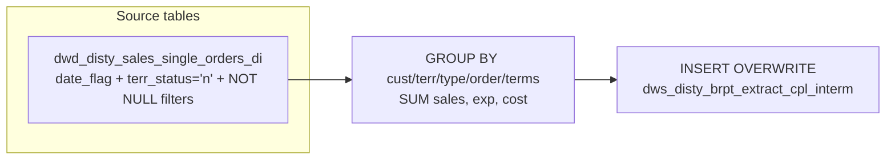

# DWS: CPL Intermediate Order-Level P&L (`dws_disty_brpt_extract_cpl_interm`)

- artifact_type: etl_table
- artifact_id: dw_us.dws_disty_brpt_extract_cpl_interm
- domain: cpl
- one_line_purpose: This table is an intermediate step in the CPL (Customer Profitability & Loss) extract pipeline. It aggregates shipped order-level financial data — sales, expenses, and cost — from the single orders detail table into a summarized form groupe...
- layer_type: DWS
- source_kind: etl_sql
- evidence_source: source/etl/sql/cpl/data_service/cpl_extract/sql/dws_disty_brpt_extract_cpl_interm.sql

---

## L1 Data Foundation

### Identity and physical mapping
- **Table:** `dw_us.dws_disty_brpt_extract_cpl_interm`
- **Layer type:** DWS
- **Canonical / derived:** Derived / ETL-loaded (see L3)
- **Owner team:** not registered in metadata catalog

### Grain, scope, exclusions
- **Grain:** one row per (`cust_no`, `cust_terr`, `cust_type`, `order_type`, `order_no`, `terms`, `date_flag`) combination.
- **Scope:** See L2 business purpose / L3 filters
- **Partition:** none — full table overwrite each run. - resolved from pipeline (see L4)
- **Natural key:** `cust_no`, `cust_terr`, `cust_type`, `order_type` (aliased as `sum_level`), `order_no` (aliased as `load_type`), `terms`, `date_flag`.
- **Exclusions:** Not documented in repository

#### Grain detail (preserved)

- **Grain:** one row per (`cust_no`, `cust_terr`, `cust_type`, `order_type`, `order_no`, `terms`, `date_flag`) combination.
- **Partition:** none — full table overwrite each run.
- **Natural key:** `cust_no`, `cust_terr`, `cust_type`, `order_type` (aliased as `sum_level`), `order_no` (aliased as `load_type`), `terms`, `date_flag`.

> **Note:** The columns `sum_level` and `load_type` in the target table map to `order_type` and `order_no` from the source, respectively. These are structural aliases in the intermediate schema, not semantic load-type categories.

---

### Cross-engine presence
| Engine | Present | Canonical FQN | Notes |
|--------|---------|---------------|-------|
| Hive | yes | `dws_disty_brpt_extract_cpl_interm` | ETL target / intermediate per evidence script |
| Vertica | pending | `dws_disty_brpt_extract_cpl_interm` | Confirm via hive2vertica flow evidence / MCP |

### Physical schema reference

Pointer block only - full column catalog lives in WKB L1 storage JSON.

| Field | Value |
|-------|-------|
| **Authoritative catalog** | WKB L1 storage seed (not duplicated in this file) |
| **entity_id** | `dw_us.dws_disty_brpt_extract_cpl_interm` |
| **l1_catalog_seed** | `target/storage/wkb/snapshots/_snapshot_id_template/l1_catalog/{engine}_{schema}_{table}.json` |
| **column_count** | pending (run ddl_seed_writer) |
| **partition_keys** | `none — full table overwrite each run.` |
| **ddl_source** | pending Bitbucket DDL / Vertica metadata ingest |
| **retrieval** | `python -m tools.wkb.indexing.run_query --query "cpl dws_disty_brpt_extract_cpl_interm schema" --intent find_table_schema` |

### Lineage
| Object | Role |
|--------|------|
| `dwd_disty_sales_single_orders_di` | Sole source — shipped order P&L detail. |

---

### Freshness and load path
| Item | Value |
|------|-------|
| Load pattern | See L3 end-to-end / INSERT pattern in evidence script |
| Schedule | Not documented in repository |
| Parameters | `${literal_target_db}`, `${date_flag}` |


---

## L2 Declarative Knowledge

### Business purpose
This table is an intermediate step in the CPL (Customer Profitability & Loss) extract pipeline. It aggregates shipped order-level financial data — sales, expenses, and cost — from the single orders detail table into a summarized form grouped by customer, territory, customer type, order, and payment terms. Only orders with fully resolved territory, customer type, and terms attributes and where the territory is "normal" (not flagged as non-standard) are included. The result feeds downstream CPL staging or summary tables with a clean, pre-aggregated order P&L foundation.

---

### Audience and use cases
| Audience | How they benefit |
|----------|-----------------|
| **CPL Staging Pipeline** | Provides a clean, pre-aggregated, validated order-level P&L input for the next CPL staging load step. |
| **Data Engineers** | Isolates the "qualified order" filtering logic in one place — ensures that only orders with full dimension resolution contribute to CPL reports. |

---

### Fact key resolution
- Natural key: `cust_no`, `cust_terr`, `cust_type`, `order_type` (aliased as `sum_level`), `order_no` (aliased as `load_type`), `terms`, `date_flag`.
- FK / label-on attributes: see L3 dimension join patterns and step-by-step logic.
- Negative assertion: do not treat descriptive labels as grain keys unless listed under natural key.

### Time field semantics
- **date_flag / partition columns:** none — full table overwrite each run.
- Primary reporting filter should use the partition column(s) documented in L1; resolve values via L4.


### Metrics served

| Category | Column | Logical metric | Business reading |
|----------|--------|----------------|------------------|
| Measures | — | — | No measure columns mapped for this table. |

### Metric serving map

**Formula authority:** [`source/contracts/cpl/metric-index.md`](../../source/contracts/cpl/metric-index.md)

N/A — no measure columns mapped for this table.

### etl_metrics

No governed logical metrics from `source/contracts/cpl/metric-index.md` are mapped on this table.

---

### Metric serving map
N/A - not a `*_comb_mtd` / multi-period wide serving table (or map not present in legacy doc).


### Data products and column groups (preserved)

### Identifiers and relationships

- **Customer:** `cust_no`
- **Territory:** `cust_terr`
- **Customer type:** `cust_type`
- **Order:** `sum_level` (= source `order_type`), `load_type` (= source `order_no`)
- **Payment terms:** `terms`

### Quantity, pricing, and cost building blocks

- `sales` — `SUM(ship_qty × u_price)` — total shipped sales value for the order
- `exp` — `SUM(ship_qty × nvl(u_sum_expense, 0))` — total expense component (unit expense treated as 0 when NULL)
- `cost` — `SUM(ship_qty × u_cost)` — total cost of goods shipped

### Core derived metrics

| Column | Formula | Business reading |
|--------|---------|-----------------|
| `sales` | `SUM(o.ship_qty * o.u_price)` | Revenue at shipped quantity × unit price for the order. |
| `exp` | `SUM(o.ship_qty * nvl(o.u_sum_expense, 0))` | Expense portion; NULL unit expense treated as zero. |
| `cost` | `SUM(o.ship_qty * o.u_cost)` | Cost of goods at shipped quantity × unit cost. |

---

### etl_metrics

#### `sales`
- **Source:** [metric-index.md](../../source/contracts/cpl/metric-index.md#sales)
- **Business definition:** Revenue at shipped quantity × unit price for the order.
```sql
SUM(o.ship_qty * o.u_price)
```

#### `exp`
- **Source:** [metric-index.md](../../source/contracts/cpl/metric-index.md#exp)
- **Business definition:** Expense portion; NULL unit expense treated as zero.
```sql
SUM(o.ship_qty * nvl(o.u_sum_expense, 0))
```

#### `cost`
- **Source:** [metric-index.md](../../source/contracts/cpl/metric-index.md#cost)
- **Business definition:** Cost of goods at shipped quantity × unit cost.
```sql
SUM(o.ship_qty * o.u_cost)
```


---

## L3 Procedural Knowledge

### Query and routing rules
**Business filters:** Use partition / date keys from L1 grain for reporting scope.
**Technical predicates (load only):** See Key filters and step-by-step logic below.

### Dimension join patterns
| Dimension FQN | Join keys | Purpose | Evidence |
|---------------|-----------|---------|----------|
| See step-by-step / base tables | See L3 steps | Dimension enrichment | `source/etl/sql/cpl/data_service/cpl_extract/sql/dws_disty_brpt_extract_cpl_interm.sql` |

### Key filters and ETL business logic
### Step 1 — Final `INSERT OVERWRITE` into `dws_disty_brpt_extract_cpl_interm`

**Source:** `dwd_disty_sales_single_orders_di`

**Filter (natural language):**
- `date_flag = '${date_flag}'` — scoped to the processing date.
- `terms IS NOT NULL` — excludes orders with no payment terms resolved.
- `cust_terr IS NOT NULL` — excludes orders with no territory resolved.
- `cust_type IS NOT NULL` — excludes orders with no customer type resolved.
- `terr_status = 'n'` — keeps only orders in normal (non-special) territory status.

**Group by:** `date_flag`, `cust_no`, `cust_terr`, `cust_type`, `order_type`, `order_no`, `terms`

**Derived columns computed at INSERT:**

| Column | Formula | Plain language |
|--------|---------|----------------|
| `sales` | `SUM(o.ship_qty * o.u_price)` | Shipped revenue at unit price. |
| `exp` | `SUM(o.ship_qty * nvl(o.u_sum_expense, 0))` | Shipped expense; NULL unit expense coerced to 0. |
| `cost` | `SUM(o.ship_qty * o.u_cost)` | Shipped cost at unit cost. |

**Column aliasing:**

| Target column | Source column | Note |
|---------------|--------------|-------|
| `sum_level` | `o.order_type` | Structural alias in the intermediate schema. |
| `load_type` | `o.order_no` | Structural alias in the intermediate schema. |

---

### Standard time-filter SQL
```sql
-- relative period filter using resolved partition value (see L4)
SELECT *
FROM dws_disty_brpt_extract_cpl_interm
WHERE /* partition predicate */ date_flag = '${partition_value}';
```

### End-to-end flow
**Runtime parameters:** `${date_flag}`, `${literal_target_db}`
**Target table:** `dws_disty_brpt_extract_cpl_interm` (no partition — full overwrite).

1. Read `dwd_disty_sales_single_orders_di` for rows where `date_flag = '${date_flag}'`, `terms IS NOT NULL`, `cust_terr IS NOT NULL`, `cust_type IS NOT NULL`, and `terr_status = 'n'`.
2. Compute `sales`, `exp`, and `cost` from shipped-quantity × unit-price/expense/cost.
3. Aggregate with `SUM()` grouped by `date_flag`, `cust_no`, `cust_terr`, `cust_type`, `order_type`, `order_no`, `terms`.
4. **INSERT OVERWRITE** the full intermediate table.



---


#### High-level stages (preserved)

| Stage | Business meaning |
|-------|-----------------|
| **Filter to valid, resolved orders** | Reads shipped single orders for the processing date, keeping only orders where territory, customer type, and terms are all populated, and where the territory status is "normal" (`terr_status = 'n'`). |
| **Compute order-level P&L** | Calculates sales (ship_qty × unit price), expense (ship_qty × unit expense), and cost (ship_qty × unit cost) for each order line, then aggregates to the order + terms level. |
| **Write full table** | Inserts the aggregated rows into the intermediate table (no partition key; full table overwrite). |

**Parameters:** `${literal_target_db}`, `${date_flag}`

---


### Base tables register
| Object | Role in this job |
|--------|-----------------|
| `dwd_disty_sales_single_orders_di` | Sole source — shipped single orders detail; supplies `ship_qty`, `u_price`, `u_sum_expense`, `u_cost`, `cust_no`, `cust_terr`, `cust_type`, `order_type`, `order_no`, `terms`, `terr_status`, `date_flag`. |

**Temporary tables:** None — single direct aggregation and INSERT from the source table.

---

### Step-by-step logic
### Step 1 — Final `INSERT OVERWRITE` into `dws_disty_brpt_extract_cpl_interm`

**Source:** `dwd_disty_sales_single_orders_di`

**Filter (natural language):**
- `date_flag = '${date_flag}'` — scoped to the processing date.
- `terms IS NOT NULL` — excludes orders with no payment terms resolved.
- `cust_terr IS NOT NULL` — excludes orders with no territory resolved.
- `cust_type IS NOT NULL` — excludes orders with no customer type resolved.
- `terr_status = 'n'` — keeps only orders in normal (non-special) territory status.

**Group by:** `date_flag`, `cust_no`, `cust_terr`, `cust_type`, `order_type`, `order_no`, `terms`

**Derived columns computed at INSERT:**

| Column | Formula | Plain language |
|--------|---------|----------------|
| `sales` | `SUM(o.ship_qty * o.u_price)` | Shipped revenue at unit price. |
| `exp` | `SUM(o.ship_qty * nvl(o.u_sum_expense, 0))` | Shipped expense; NULL unit expense coerced to 0. |
| `cost` | `SUM(o.ship_qty * o.u_cost)` | Shipped cost at unit cost. |

**Column aliasing:**

| Target column | Source column | Note |
|---------------|--------------|-------|
| `sum_level` | `o.order_type` | Structural alias in the intermediate schema. |
| `load_type` | `o.order_no` | Structural alias in the intermediate schema. |

---

### Relationship map (embedded)

| from_fqn | to_fqn | cardinality | join_keys | provenance |
|----------|--------|-------------|-----------|------------|
| — | — | — | — | Not documented in repository |

`source/ref/cpl/table relationship.txt`: Not documented in repository.

### Special logic (embedded)

Not documented in repository

### Column / field derivations (from ETL SQL)

| target_column | expression_sql | upstream_columns | upstream_tables | transform_kind | evidence |
|---------------|----------------|------------------|-----------------|----------------|----------|
| `cust_no` | `o.cust_no` | `cust_no` | `${literal_target_db}.dwd_disty_sales_single_orders_di` | passthrough | `source/etl/sql/cpl/data_service/cpl_extract/sql/dws_disty_brpt_extract_cpl_interm.sql:2` |
| `cust_terr` | `o.cust_terr` | `cust_terr` | `${literal_target_db}.dwd_disty_sales_single_orders_di` | passthrough | `source/etl/sql/cpl/data_service/cpl_extract/sql/dws_disty_brpt_extract_cpl_interm.sql:3` |
| `cust_type` | `o.cust_type` | `cust_type` | `${literal_target_db}.dwd_disty_sales_single_orders_di` | passthrough | `source/etl/sql/cpl/data_service/cpl_extract/sql/dws_disty_brpt_extract_cpl_interm.sql:4` |
| `sum_level` | `o.order_type` | `order_type` | `${literal_target_db}.dwd_disty_sales_single_orders_di` | rename | `source/etl/sql/cpl/data_service/cpl_extract/sql/dws_disty_brpt_extract_cpl_interm.sql:5` |
| `load_type` | `o.order_no` | `order_no` | `${literal_target_db}.dwd_disty_sales_single_orders_di` | rename | `source/etl/sql/cpl/data_service/cpl_extract/sql/dws_disty_brpt_extract_cpl_interm.sql:6` |
| `terms` | `o.terms` | `terms` | `${literal_target_db}.dwd_disty_sales_single_orders_di` | passthrough | `source/etl/sql/cpl/data_service/cpl_extract/sql/dws_disty_brpt_extract_cpl_interm.sql:7` |
| `sales` | `SUM(o.ship_qty * o.u_price)` | `ship_qty`, `u_price` | `${literal_target_db}.dwd_disty_sales_single_orders_di` | agg | `source/etl/sql/cpl/data_service/cpl_extract/sql/dws_disty_brpt_extract_cpl_interm.sql:8` |
| `exp` | `SUM(o.ship_qty * nvl(o.u_sum_expense,0))` | `ship_qty`, `u_sum_expense` | `${literal_target_db}.dwd_disty_sales_single_orders_di` | agg | `source/etl/sql/cpl/data_service/cpl_extract/sql/dws_disty_brpt_extract_cpl_interm.sql:9` |
| `cost` | `SUM(o.ship_qty * o.u_cost)` | `ship_qty`, `u_cost` | `${literal_target_db}.dwd_disty_sales_single_orders_di` | agg | `source/etl/sql/cpl/data_service/cpl_extract/sql/dws_disty_brpt_extract_cpl_interm.sql:10` |
| `date_flag` | `o.date_flag` | `date_flag` | `${literal_target_db}.dwd_disty_sales_single_orders_di` | passthrough | `source/etl/sql/cpl/data_service/cpl_extract/sql/dws_disty_brpt_extract_cpl_interm.sql:11` |

### Sentinel and code values
| Value | Meaning |
|-------|---------|
| `terr_status = 'n'` | "Normal" territory — the row represents a standard, fully-resolved order eligible for CPL inclusion. |
| `u_sum_expense = NULL → 0` | Orders with no expense component default to zero expense contribution. |

---

---

## L4 Validation

### Resolved partition value
| Step | Source | How partition / date scope is determined |
|------|--------|------------------------------------------|
| 1 | evidence script / flow | See parameters in L1 Freshness and L3 filters - `source/etl/sql/cpl/data_service/cpl_extract/sql/dws_disty_brpt_extract_cpl_interm.sql` |

**Plain language:** Partition and date scope follow Azkaban/bootstrap parameters documented in the source script and orchestrating flow; do not hardcode calendar literals.

### Data quality checks
- Prefer row-count-by-partition, metric sums, and grain duplicate checks (see Validation SQL).
- Additional checks from legacy caveats / operational notes when present.

### Validation SQL
```sql
-- 1) row count by partition
-- SELECT partition_col, COUNT(*) FROM dws_disty_brpt_extract_cpl_interm WHERE partition_col = '${partition_value}' GROUP BY 1;
-- 2) metric sum by dimension (top N) - replace metric/dim from L2
-- 3) grain duplicate check on natural keys
```


### Caveats for interpretation
- Only orders where all three dimension attributes (`terms`, `cust_terr`, `cust_type`) are non-NULL AND `terr_status = 'n'` are included. Orders failing any of these conditions are silently excluded from CPL — they will not appear in downstream P&L reports.
- `sum_level` and `load_type` in this table correspond to `order_type` and `order_no` from the source — these are positional column aliases in the intermediate schema, not semantic categories.
- NULL `u_sum_expense` values are treated as zero in the `exp` calculation. This means an order with no expense data contributes zero expense rather than being excluded.
- This table is a full-overwrite intermediate — it is not intended for direct downstream reporting; it feeds into the CPL staging table for further aggregation and categorization.

---

### Conflicts and open questions
- Schedule, owner, SLA: Not documented in repository (unless preserved schedule evidence above).
- Vertica MCP verification: pending unless confirmed in L5.


---

## L5 Runtime View

### Query path and engine preference
| Role | Hive object | Vertica object | Sync mode | Evidence | MCP verified |
|------|-------------|----------------|-----------|----------|--------------|
| **Not in Vertica** | *See script lineage* | *No Vertica mapping identified in repository* | - | *Add flow evidence when found* | no |

No queryable Vertica table has been confirmed for this script from current repository evidence.

### Access constraints
- Country / company schema parameters may apply (`literal_country`, `company_no`, etc.).
- Hive-only staging objects are not reporting surfaces unless synced.

### Query risk profile
| Field | Value |
|-------|-------|
| requires_date_predicate | unknown |
| scan_risk_tier | high |

---

## L6 Access and Consumption

### Primary consumers and use cases
| Audience | How they benefit |
|----------|-----------------|
| **CPL Staging Pipeline** | Provides a clean, pre-aggregated, validated order-level P&L input for the next CPL staging load step. |
| **Data Engineers** | Isolates the "qualified order" filtering logic in one place — ensures that only orders with full dimension resolution contribute to CPL reports. |

---

### Representative query patterns
```sql
-- certified / illustrative lookup - replace predicates from L1/L4
SELECT *
FROM dws_disty_brpt_extract_cpl_interm
WHERE date_flag = '${partition_value}'
LIMIT 100;
```

### Dependencies and notes
### Upstream objects (verified)

| Object | Usage | Evidence |
|--------|-------|----------|
| `dwd_disty_sales_single_orders_di` | Sole source, filtered by date, terr_status, and dimension completeness | `dws_disty_brpt_extract_cpl_interm.sql:12-18` |

### Downstream consumers (verified)

| Object / script | Evidence |
|-----------------|----------|
| None identified in repository. | — |

### Operational detail (verified)

- Full table overwrite (`INSERT OVERWRITE`) — no partition key; the entire intermediate table is replaced on each run.
- Single-step load with no intermediate temp tables.

### Not documented in repository

- Schedule, owner, SLA — not in scripts or configs.
- Which downstream CPL staging script reads this intermediate table.

---

*Document generated from `source/etl/sql/cpl/data_service/cpl_extract/sql/dws_disty_brpt_extract_cpl_interm.sql`.*

#### Not documented in repository
- Owner, SLA (unless schedule evidence preserved above)
- Any dependency without `file:line` evidence in this document

---

*Document migrated to L1-L6 from legacy Knowledgebase content. Evidence: `source/etl/sql/cpl/data_service/cpl_extract/sql/dws_disty_brpt_extract_cpl_interm.sql`.*
