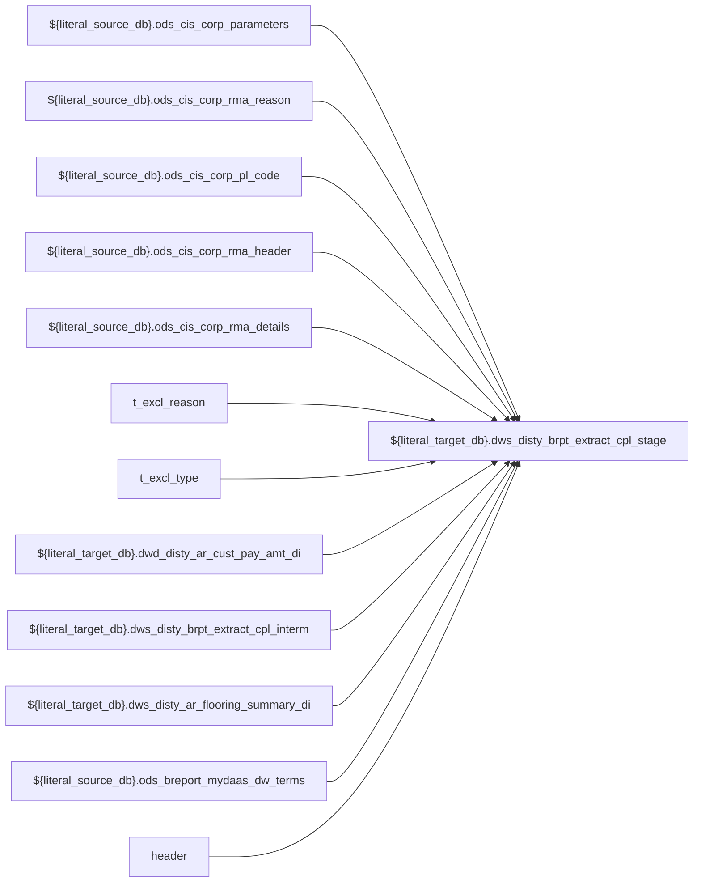

# DWS: `dws_disty_brpt_extract_cpl_stage`

- artifact_type: etl_table
- artifact_id: ${literal_target_db}.dws_disty_brpt_extract_cpl_stage
- domain: cpl
- one_line_purpose: ETL script `source/etl/sql/cpl/data_service/cpl_extract/python/dws_disty_brpt_extract_cpl_stage.py` loads `${literal_target_db}.dws_disty_brpt_extract_cpl_stage` (layer `DWS`). Purpose inferred from SQL only.
- layer_type: DWS
- source_kind: etl_sql
- evidence_source: source/etl/sql/cpl/data_service/cpl_extract/python/dws_disty_brpt_extract_cpl_stage.py

---

## L1 Data Foundation

### Identity and physical mapping
- **Table:** `${literal_target_db}.dws_disty_brpt_extract_cpl_stage`
- **Layer type:** DWS
- **Canonical / derived:** Derived / ETL-loaded (see L3)
- **Owner team:** Not documented in repository

### Grain, scope, exclusions
- **Grain:** Not documented in repository (see SELECT/GROUP BY in `source/etl/sql/cpl/data_service/cpl_extract/python/dws_disty_brpt_extract_cpl_stage.py`)
- **Partition:** `See L4 / ETL partition clause`
- **Exclusions:** See L3 Key filters

### Cross-engine presence
| Engine | Present | Canonical FQN | Notes |
|--------|---------|---------------|-------|
| Hive | yes | `${literal_target_db}.dws_disty_brpt_extract_cpl_stage` | ETL target |
| Vertica | Not documented in repository | — | Confirm via hive2vertica flow |

### Physical schema reference

Pointer block only - full column catalog lives in WKB L1 storage JSON.

| Field | Value |
|-------|-------|
| **Authoritative catalog** | WKB L1 storage seed (not duplicated in this file) |
| **entity_id** | `${literal_target_db}.dws_disty_brpt_extract_cpl_stage` |
| **l1_catalog_seed** | `target/storage/wkb/snapshots/_snapshot_id_template/l1_catalog/{engine}_{schema}_{table}.json` |
| **column_count** | pending (run ddl_seed_writer) |
| **partition_keys** | `See L4 / ETL partition clause` |
| **ddl_source** | pending Bitbucket DDL / Vertica metadata ingest |
| **retrieval** | `python -m tools.wkb.indexing.run_query --query "cpl dws_disty_brpt_extract_cpl_stage schema" --intent find_table_schema` |

### Lineage
| Object | Role |
|--------|------|
| `${literal_source_db}.ods_cis_corp_parameters` | upstream (ETL FROM/JOIN) |
| `${literal_source_db}.ods_cis_corp_rma_reason` | upstream (ETL FROM/JOIN) |
| `${literal_source_db}.ods_cis_corp_pl_code` | upstream (ETL FROM/JOIN) |
| `${literal_source_db}.ods_cis_corp_rma_header` | upstream (ETL FROM/JOIN) |
| `${literal_source_db}.ods_cis_corp_rma_details` | upstream (ETL FROM/JOIN) |
| `t_excl_reason` | upstream (ETL FROM/JOIN) |
| `t_excl_type` | upstream (ETL FROM/JOIN) |
| `${literal_target_db}.dwd_disty_ar_cust_pay_amt_di` | upstream (ETL FROM/JOIN) |
| `${literal_target_db}.dws_disty_brpt_extract_cpl_interm` | upstream (ETL FROM/JOIN) |
| `${literal_target_db}.dws_disty_ar_flooring_summary_di` | upstream (ETL FROM/JOIN) |
| `${literal_source_db}.ods_breport_mydaas_dw_terms` | upstream (ETL FROM/JOIN) |
| `header` | upstream (ETL FROM/JOIN) |
| `${literal_dim_db}.dim_pub_part_info` | upstream (ETL FROM/JOIN) |
| `${literal_dim_db}.dim_pub_customer_info_df` | upstream (ETL FROM/JOIN) |
| `dw_cust_pay_amt` | upstream (ETL FROM/JOIN) |
| `${literal_source_db}.ods_cis_corp_history_header` | upstream (ETL FROM/JOIN) |
| `${literal_source_db}.ods_cis_corp_order_type` | upstream (ETL FROM/JOIN) |
| `${literal_source_db}.ods_cis_corp_history_exp` | upstream (ETL FROM/JOIN) |
| `${literal_source_db}.ods_breport_mydaas_dw_frt_exp_codes` | upstream (ETL FROM/JOIN) |
| `temp1` | upstream (ETL FROM/JOIN) |
| `${literal_target_db}.dws_disty_brpt_extract_cpl_stage` | **Target** |

### Freshness and load path
| Item | Value |
|------|-------|
| Load pattern | See L3 INSERT / OVERWRITE in evidence script |
| Schedule | Not documented in repository |
| Parameters | Parsed from ETL literals / `${...}` in `source/etl/sql/cpl/data_service/cpl_extract/python/dws_disty_brpt_extract_cpl_stage.py` |

## L2 Declarative Knowledge

### Business purpose
ETL script `source/etl/sql/cpl/data_service/cpl_extract/python/dws_disty_brpt_extract_cpl_stage.py` loads `${literal_target_db}.dws_disty_brpt_extract_cpl_stage` (layer `DWS`). Purpose inferred from SQL only.

### Audience and use cases
| Audience | How they benefit |
|----------|-----------------|
| Data / BI consumers | Use target table produced by this ETL |
| Data Engineering | Maintain load logic in evidence script |

### Fact key resolution
- Keys follow target INSERT column list / GROUP BY in evidence SQL.

### Time field semantics
- Partition / date fields: `See L4 / ETL partition clause`

### Metrics served
- See L3 column derivations for measure expressions when present.

### Metric serving map
N/A — not a multi-period wide serving table (or not documented).

### etl_metrics
No calculable business metrics registered in metric-index for this create run.

## L3 Procedural Knowledge

### Query and routing rules
- Prefer querying the target `${literal_target_db}.dws_disty_brpt_extract_cpl_stage` after successful ETL load.

### Dimension join patterns
- See Relationship map and Base tables register.

### Key filters and ETL business logic

| Predicate | Kind | Evidence |
|-----------|------|----------|
| `deptid = 100 and parameter_name = 'RUN GL FOR CUSTPL' SELECT day('${date_flag}'),trunc('${date_flag}','MM'),add_months(trunc('${date_flag}','MM'),-1),add_months('${date_flag}',-3) drop table if exi...` | Technical (load only) / Business | `source/etl/sql/cpl/data_service/cpl_extract/python/dws_disty_brpt_extract_cpl_stage.py` |
| `date_flag >= '%s' AND date_flag < DATE_ADD('${date_flag}', 1) drop table if exists dw_cust_pay_amt; CREATE TEMPORARY TABLE dw_cust_pay_amt AS SELECT cast(null as string) AS date_flag ,cast(null as ...` | Technical (load only) / Business | `source/etl/sql/cpl/data_service/cpl_extract/python/dws_disty_brpt_extract_cpl_stage.py` |
| `o.date_flag = '${date_flag}' and f.date_flag = '${date_flag}' AND f.net_price > 0 AND (f.who_pays like '%s' OR f.who_pays = 'Dealer' OR f.who_pays like '%s')` | Technical (load only) / Business | `source/etl/sql/cpl/data_service/cpl_extract/python/dws_disty_brpt_extract_cpl_stage.py` |
| `o.date_flag = '${date_flag}' AND (t.direct_cash_flag = 'Y' OR t.direct_cod_flag = 'Y')` | Technical (load only) / Business | `source/etl/sql/cpl/data_service/cpl_extract/python/dws_disty_brpt_extract_cpl_stage.py` |
| `o.date_flag = '${date_flag}'` | Technical (load only) / Business | `source/etl/sql/cpl/data_service/cpl_extract/python/dws_disty_brpt_extract_cpl_stage.py` |

### Standard time-filter SQL
```sql
-- See partition / date predicates in source/etl/sql/cpl/data_service/cpl_extract/python/dws_disty_brpt_extract_cpl_stage.py
```

### End-to-end flow



### Base tables register

| Object | Role |
|--------|------|
| `${literal_source_db}.ods_cis_corp_parameters` | source / temp (from ETL FROM/JOIN) |
| `${literal_source_db}.ods_cis_corp_rma_reason` | source / temp (from ETL FROM/JOIN) |
| `${literal_source_db}.ods_cis_corp_pl_code` | source / temp (from ETL FROM/JOIN) |
| `${literal_source_db}.ods_cis_corp_rma_header` | source / temp (from ETL FROM/JOIN) |
| `${literal_source_db}.ods_cis_corp_rma_details` | source / temp (from ETL FROM/JOIN) |
| `t_excl_reason` | source / temp (from ETL FROM/JOIN) |
| `t_excl_type` | source / temp (from ETL FROM/JOIN) |
| `${literal_target_db}.dwd_disty_ar_cust_pay_amt_di` | source / temp (from ETL FROM/JOIN) |
| `${literal_target_db}.dws_disty_brpt_extract_cpl_interm` | source / temp (from ETL FROM/JOIN) |
| `${literal_target_db}.dws_disty_ar_flooring_summary_di` | source / temp (from ETL FROM/JOIN) |
| `${literal_source_db}.ods_breport_mydaas_dw_terms` | source / temp (from ETL FROM/JOIN) |
| `header` | source / temp (from ETL FROM/JOIN) |
| `${literal_dim_db}.dim_pub_part_info` | source / temp (from ETL FROM/JOIN) |
| `${literal_dim_db}.dim_pub_customer_info_df` | source / temp (from ETL FROM/JOIN) |
| `dw_cust_pay_amt` | source / temp (from ETL FROM/JOIN) |
| `${literal_source_db}.ods_cis_corp_history_header` | source / temp (from ETL FROM/JOIN) |
| `${literal_source_db}.ods_cis_corp_order_type` | source / temp (from ETL FROM/JOIN) |
| `${literal_source_db}.ods_cis_corp_history_exp` | source / temp (from ETL FROM/JOIN) |
| `${literal_source_db}.ods_breport_mydaas_dw_frt_exp_codes` | source / temp (from ETL FROM/JOIN) |
| `temp1` | source / temp (from ETL FROM/JOIN) |
| `${literal_source_db}.ods_cis_corp_journal_entry` | source / temp (from ETL FROM/JOIN) |
| `${literal_source_db}.ods_cis_corp_chart_of_account` | source / temp (from ETL FROM/JOIN) |
| `${literal_source_db}.ods_cis_corp_department_info` | source / temp (from ETL FROM/JOIN) |
| `${literal_source_db}.ods_breport_mydaas_cpl_stage_cust_type_dept` | source / temp (from ETL FROM/JOIN) |
| `history_header` | source / temp (from ETL FROM/JOIN) |
| `temp2` | source / temp (from ETL FROM/JOIN) |

### Step-by-step logic
1. Read sources listed in Base tables register (`source/etl/sql/cpl/data_service/cpl_extract/python/dws_disty_brpt_extract_cpl_stage.py`).
2. Apply filters documented under Key filters.
3. INSERT OVERWRITE / write target `${literal_target_db}.dws_disty_brpt_extract_cpl_stage`.

### Relationship map (embedded)

| from_fqn | to_fqn | cardinality | join_keys | provenance |
|----------|--------|-------------|-----------|------------|
| `${literal_source_db}.ods_cis_corp_rma_header` | `${literal_source_db}.ods_cis_corp_rma_details` | many:1 | `h.rma_no = d.rma_no` | etl_sql (source/etl/sql/cpl/data_service/cpl_extract/python/dws_disty_brpt_extract_cpl_stage.py:52) |
| `${literal_target_db}.dws_disty_brpt_extract_cpl_interm` | `${literal_target_db}.dws_disty_ar_flooring_summary_di` | many:1 | `o.date_flag = f.date_flag AND o.order_type = f.order_type AND o.order_no = f.order_no` | etl_sql (source/etl/sql/cpl/data_service/cpl_extract/python/dws_disty_brpt_extract_cpl_stage.py:112) |
| `${literal_target_db}.dws_disty_brpt_extract_cpl_interm` | `${literal_source_db}.ods_breport_mydaas_dw_terms` | many:1 | `trim(o.terms) = t.terms` | etl_sql (source/etl/sql/cpl/data_service/cpl_extract/python/dws_disty_brpt_extract_cpl_stage.py:112) |
| `${literal_target_db}.dws_disty_brpt_extract_cpl_interm` | `${literal_source_db}.ods_cis_corp_rma_details` | many:1 | `h.rma_no = d.rma_no` | etl_sql (source/etl/sql/cpl/data_service/cpl_extract/python/dws_disty_brpt_extract_cpl_stage.py:112) |
| `${literal_source_db}.ods_cis_corp_rma_details` | `${literal_dim_db}.dim_pub_part_info` | many:1 | `d.sku_no = p.sku_no` | etl_sql (source/etl/sql/cpl/data_service/cpl_extract/python/dws_disty_brpt_extract_cpl_stage.py:112) |
| `${literal_target_db}.dws_disty_brpt_extract_cpl_interm` | `${literal_dim_db}.dim_pub_customer_info_df` | many:1 | `h.cust_no = m.cust_no` | etl_sql (source/etl/sql/cpl/data_service/cpl_extract/python/dws_disty_brpt_extract_cpl_stage.py:112) |
| `${literal_dim_db}.dim_pub_part_info` | `${literal_dim_db}.dim_pub_customer_info_df` | many:1 | `p.cust_no = m.cust_no` | etl_sql (source/etl/sql/cpl/data_service/cpl_extract/python/dws_disty_brpt_extract_cpl_stage.py:112) |
| `${literal_source_db}.ods_cis_corp_history_header` | `${literal_source_db}.ods_cis_corp_order_type` | many:1 | `o.order_type = h.order_type` | etl_sql (source/etl/sql/cpl/data_service/cpl_extract/python/dws_disty_brpt_extract_cpl_stage.py:418) |
| `${literal_source_db}.ods_cis_corp_history_header` | `${literal_source_db}.ods_cis_corp_history_exp` | many:1 | `h.order_no = e.order_no AND h.order_type = e.order_type` | etl_sql (source/etl/sql/cpl/data_service/cpl_extract/python/dws_disty_brpt_extract_cpl_stage.py:418) |
| `${literal_source_db}.ods_cis_corp_history_header` | `${literal_dim_db}.dim_pub_customer_info_df` | many:1 | `h.to_acct_no = c.cust_no` | etl_sql (source/etl/sql/cpl/data_service/cpl_extract/python/dws_disty_brpt_extract_cpl_stage.py:418) |
| `${literal_source_db}.ods_cis_corp_history_exp` | `${literal_source_db}.ods_breport_mydaas_dw_frt_exp_codes` | many:1 | `e.exp_code = f.exp_code` | etl_sql (source/etl/sql/cpl/data_service/cpl_extract/python/dws_disty_brpt_extract_cpl_stage.py:418) |
| `${literal_source_db}.ods_cis_corp_journal_entry` | `${literal_source_db}.ods_cis_corp_chart_of_account` | many:1 | `je.gl_acct_no = ca.gl_acct_no` | etl_sql (source/etl/sql/cpl/data_service/cpl_extract/python/dws_disty_brpt_extract_cpl_stage.py:447) |
| `${literal_source_db}.ods_cis_corp_journal_entry` | `${literal_source_db}.ods_cis_corp_department_info` | many:1 | `1 = 1` | etl_sql (source/etl/sql/cpl/data_service/cpl_extract/python/dws_disty_brpt_extract_cpl_stage.py:447) |
| `${literal_source_db}.ods_cis_corp_department_info` | `${literal_source_db}.ods_breport_mydaas_cpl_stage_cust_type_dept` | many:1 | `di.dept_no = t.dept_no` | etl_sql (source/etl/sql/cpl/data_service/cpl_extract/python/dws_disty_brpt_extract_cpl_stage.py:447) |

`source/ref/cpl/table relationship.txt`: Not documented in repository.

### Special logic (embedded)

Not documented in repository

### Column / field derivations (from ETL SQL)

| target_column | expression_sql | upstream_columns | upstream_tables | transform_kind | evidence |
|---------------|----------------|------------------|-----------------|----------------|----------|
| `cust_no` | `cust_no` | `cust_no` | `temp2` | passthrough | `source/etl/sql/cpl/data_service/cpl_extract/python/dws_disty_brpt_extract_cpl_stage.py:55` |
| `cust_terr` | `cust_terr` | `cust_terr` | `temp2` | passthrough | `source/etl/sql/cpl/data_service/cpl_extract/python/dws_disty_brpt_extract_cpl_stage.py:83` |
| `cust_type` | `cust_type` | `cust_type` | `temp2` | passthrough | `source/etl/sql/cpl/data_service/cpl_extract/python/dws_disty_brpt_extract_cpl_stage.py:82` |
| `sum_level` | `sum_level` | `sum_level` | `temp2` | passthrough | `source/etl/sql/cpl/data_service/cpl_extract/python/dws_disty_brpt_extract_cpl_stage.py:117` |
| `load_type` | `load_type` | `load_type` | `temp2` | passthrough | `source/etl/sql/cpl/data_service/cpl_extract/python/dws_disty_brpt_extract_cpl_stage.py:118` |
| `terms` | `terms` | `terms` | `temp2` | passthrough | `source/etl/sql/cpl/data_service/cpl_extract/python/dws_disty_brpt_extract_cpl_stage.py:5` |
| `rma_type` | `rma_type` | `rma_type` | `temp2` | passthrough | `source/etl/sql/cpl/data_service/cpl_extract/python/dws_disty_brpt_extract_cpl_stage.py:6` |
| `exp_code` | `exp_code` | `exp_code` | `temp2` | passthrough | `source/etl/sql/cpl/data_service/cpl_extract/python/dws_disty_brpt_extract_cpl_stage.py:7` |
| `gl_acct_no` | `gl_acct_no` | `gl_acct_no` | `temp2` | passthrough | `source/etl/sql/cpl/data_service/cpl_extract/python/dws_disty_brpt_extract_cpl_stage.py:8` |
| `SALES` | `SALES` | `SALES` | `temp2` | passthrough | `source/etl/sql/cpl/data_service/cpl_extract/python/dws_disty_brpt_extract_cpl_stage.py:118` |
| `exp` | `exp` | `exp` | `temp2` | passthrough | `source/etl/sql/cpl/data_service/cpl_extract/python/dws_disty_brpt_extract_cpl_stage.py:7` |
| `COST` | `COST` | `COST` | `temp2` | passthrough | `source/etl/sql/cpl/data_service/cpl_extract/python/dws_disty_brpt_extract_cpl_stage.py:125` |
| `btl_amt` | `NULL` | — | `temp2` | rename | `source/etl/sql/cpl/data_service/cpl_extract/python/dws_disty_brpt_extract_cpl_stage.py:63` |
| `frt_load_in` | `NULL` | — | `temp2` | rename | `source/etl/sql/cpl/data_service/cpl_extract/python/dws_disty_brpt_extract_cpl_stage.py:63` |
| `frt_load_out` | `NULL` | — | `temp2` | rename | `source/etl/sql/cpl/data_service/cpl_extract/python/dws_disty_brpt_extract_cpl_stage.py:63` |
| `floor_sales_disty` | `floor_sales_disty` | `floor_sales_disty` | `temp2` | passthrough | `source/etl/sql/cpl/data_service/cpl_extract/python/dws_disty_brpt_extract_cpl_stage.py:126` |
| `floor_sales_dealer` | `floor_sales_dealer` | `floor_sales_dealer` | `temp2` | passthrough | `source/etl/sql/cpl/data_service/cpl_extract/python/dws_disty_brpt_extract_cpl_stage.py:128` |
| `floor_sales_vend` | `floor_sales_vend` | `floor_sales_vend` | `temp2` | passthrough | `source/etl/sql/cpl/data_service/cpl_extract/python/dws_disty_brpt_extract_cpl_stage.py:130` |
| `floor_chgs_disty` | `floor_chgs_disty` | `floor_chgs_disty` | `temp2` | passthrough | `source/etl/sql/cpl/data_service/cpl_extract/python/dws_disty_brpt_extract_cpl_stage.py:127` |
| `floor_chgs_dealer` | `floor_chgs_dealer` | `floor_chgs_dealer` | `temp2` | passthrough | `source/etl/sql/cpl/data_service/cpl_extract/python/dws_disty_brpt_extract_cpl_stage.py:129` |
| `floor_chgs_vend` | `floor_chgs_vend` | `floor_chgs_vend` | `temp2` | passthrough | `source/etl/sql/cpl/data_service/cpl_extract/python/dws_disty_brpt_extract_cpl_stage.py:131` |
| `terms_sales_cash` | `terms_sales_cash` | `terms_sales_cash` | `temp2` | passthrough | `source/etl/sql/cpl/data_service/cpl_extract/python/dws_disty_brpt_extract_cpl_stage.py:135` |
| `terms_sales_cod` | `terms_sales_cod` | `terms_sales_cod` | `temp2` | passthrough | `source/etl/sql/cpl/data_service/cpl_extract/python/dws_disty_brpt_extract_cpl_stage.py:136` |
| `period_dayxnpmt` | `period_dayxnpmt` | `period_dayxnpmt` | `temp2` | passthrough | `source/etl/sql/cpl/data_service/cpl_extract/python/dws_disty_brpt_extract_cpl_stage.py:137` |
| `period_pmt` | `period_pmt` | `period_pmt` | `temp2` | passthrough | `source/etl/sql/cpl/data_service/cpl_extract/python/dws_disty_brpt_extract_cpl_stage.py:138` |
| `period_disc_taken` | `period_disc_taken` | `period_disc_taken` | `temp2` | passthrough | `source/etl/sql/cpl/data_service/cpl_extract/python/dws_disty_brpt_extract_cpl_stage.py:139` |
| `pmt` | `pmt` | `pmt` | `temp2` | passthrough | `source/etl/sql/cpl/data_service/cpl_extract/python/dws_disty_brpt_extract_cpl_stage.py:77` |
| `disc_taken` | `disc_taken` | `disc_taken` | `temp2` | passthrough | `source/etl/sql/cpl/data_service/cpl_extract/python/dws_disty_brpt_extract_cpl_stage.py:78` |
| `risk_cost` | `risk_cost` | `risk_cost` | `temp2` | passthrough | `source/etl/sql/cpl/data_service/cpl_extract/python/dws_disty_brpt_extract_cpl_stage.py:132` |
| `rma_count` | `rma_count` | `rma_count` | `temp2` | passthrough | `source/etl/sql/cpl/data_service/cpl_extract/python/dws_disty_brpt_extract_cpl_stage.py:133` |
| `rma_cost` | `rma_cost` | `rma_cost` | `temp2` | passthrough | `source/etl/sql/cpl/data_service/cpl_extract/python/dws_disty_brpt_extract_cpl_stage.py:134` |
| `exp_amt` | `exp_amt` | `exp_amt` | `temp2` | passthrough | `source/etl/sql/cpl/data_service/cpl_extract/python/dws_disty_brpt_extract_cpl_stage.py:424` |
| `gl_amt` | `gl_amt` | `gl_amt` | `temp2` | passthrough | `source/etl/sql/cpl/data_service/cpl_extract/python/dws_disty_brpt_extract_cpl_stage.py:470` |
| `pdt_amt` | `NULL` | — | `temp2` | rename | `source/etl/sql/cpl/data_service/cpl_extract/python/dws_disty_brpt_extract_cpl_stage.py:63` |
| `frt_in_cost_amt` | `NULL` | — | `temp2` | rename | `source/etl/sql/cpl/data_service/cpl_extract/python/dws_disty_brpt_extract_cpl_stage.py:63` |
| `vend_no` | `vend_no` | `vend_no` | `temp2` | passthrough | `source/etl/sql/cpl/data_service/cpl_extract/python/dws_disty_brpt_extract_cpl_stage.py:87` |
| `date_flag` | `date_flag` | `date_flag` | `temp2` | passthrough | `source/etl/sql/cpl/data_service/cpl_extract/python/dws_disty_brpt_extract_cpl_stage.py:4` |

### Sentinel and code values
Not documented in repository beyond CASE/exp_code predicates in ETL SQL.

## L4 Validation

### Resolved partition value
- Partition expression from ETL: `See L4 / ETL partition clause`
- Runtime values: Not documented in repository (resolve via Azkaban params when flow evidence exists).

### Data quality checks
Not documented in repository

### Validation SQL
N/A — Vertica MCP not executed during documentation (Vertica no-run policy).

### Caveats for interpretation
- Generated from ETL SQL evidence only; business definitions may need `source/ref` enrichment.

### Conflicts and open questions
None identified in repository

## L5 Runtime View

### Query path and engine preference
| Path | Engine | Evidence |
|------|--------|----------|
| ETL load | Hive/Spark | `source/etl/sql/cpl/data_service/cpl_extract/python/dws_disty_brpt_extract_cpl_stage.py` |
| Serving | Vertica (when synced) | Not documented in repository |

### Access constraints
Not documented in repository

### Query risk profile
- Scan risk depends on partition pruning; always filter partition keys when present.

## L6 Access and Consumption

### Primary consumers and use cases
Not documented in repository

### Representative query patterns
Not documented in repository

### Dependencies and notes

#### Upstream objects (verified)
| Object | Usage | Evidence |
|--------|-------|----------|
| `${literal_source_db}.ods_cis_corp_parameters` | FROM/JOIN | `source/etl/sql/cpl/data_service/cpl_extract/python/dws_disty_brpt_extract_cpl_stage.py` |
| `${literal_source_db}.ods_cis_corp_rma_reason` | FROM/JOIN | `source/etl/sql/cpl/data_service/cpl_extract/python/dws_disty_brpt_extract_cpl_stage.py` |
| `${literal_source_db}.ods_cis_corp_pl_code` | FROM/JOIN | `source/etl/sql/cpl/data_service/cpl_extract/python/dws_disty_brpt_extract_cpl_stage.py` |
| `${literal_source_db}.ods_cis_corp_rma_header` | FROM/JOIN | `source/etl/sql/cpl/data_service/cpl_extract/python/dws_disty_brpt_extract_cpl_stage.py` |
| `${literal_source_db}.ods_cis_corp_rma_details` | FROM/JOIN | `source/etl/sql/cpl/data_service/cpl_extract/python/dws_disty_brpt_extract_cpl_stage.py` |
| `t_excl_reason` | FROM/JOIN | `source/etl/sql/cpl/data_service/cpl_extract/python/dws_disty_brpt_extract_cpl_stage.py` |
| `t_excl_type` | FROM/JOIN | `source/etl/sql/cpl/data_service/cpl_extract/python/dws_disty_brpt_extract_cpl_stage.py` |
| `${literal_target_db}.dwd_disty_ar_cust_pay_amt_di` | FROM/JOIN | `source/etl/sql/cpl/data_service/cpl_extract/python/dws_disty_brpt_extract_cpl_stage.py` |
| `${literal_target_db}.dws_disty_brpt_extract_cpl_interm` | FROM/JOIN | `source/etl/sql/cpl/data_service/cpl_extract/python/dws_disty_brpt_extract_cpl_stage.py` |
| `${literal_target_db}.dws_disty_ar_flooring_summary_di` | FROM/JOIN | `source/etl/sql/cpl/data_service/cpl_extract/python/dws_disty_brpt_extract_cpl_stage.py` |
| `${literal_source_db}.ods_breport_mydaas_dw_terms` | FROM/JOIN | `source/etl/sql/cpl/data_service/cpl_extract/python/dws_disty_brpt_extract_cpl_stage.py` |
| `header` | FROM/JOIN | `source/etl/sql/cpl/data_service/cpl_extract/python/dws_disty_brpt_extract_cpl_stage.py` |
| `${literal_dim_db}.dim_pub_part_info` | FROM/JOIN | `source/etl/sql/cpl/data_service/cpl_extract/python/dws_disty_brpt_extract_cpl_stage.py` |
| `${literal_dim_db}.dim_pub_customer_info_df` | FROM/JOIN | `source/etl/sql/cpl/data_service/cpl_extract/python/dws_disty_brpt_extract_cpl_stage.py` |
| `dw_cust_pay_amt` | FROM/JOIN | `source/etl/sql/cpl/data_service/cpl_extract/python/dws_disty_brpt_extract_cpl_stage.py` |
| `${literal_source_db}.ods_cis_corp_history_header` | FROM/JOIN | `source/etl/sql/cpl/data_service/cpl_extract/python/dws_disty_brpt_extract_cpl_stage.py` |
| `${literal_source_db}.ods_cis_corp_order_type` | FROM/JOIN | `source/etl/sql/cpl/data_service/cpl_extract/python/dws_disty_brpt_extract_cpl_stage.py` |
| `${literal_source_db}.ods_cis_corp_history_exp` | FROM/JOIN | `source/etl/sql/cpl/data_service/cpl_extract/python/dws_disty_brpt_extract_cpl_stage.py` |
| `${literal_source_db}.ods_breport_mydaas_dw_frt_exp_codes` | FROM/JOIN | `source/etl/sql/cpl/data_service/cpl_extract/python/dws_disty_brpt_extract_cpl_stage.py` |
| `temp1` | FROM/JOIN | `source/etl/sql/cpl/data_service/cpl_extract/python/dws_disty_brpt_extract_cpl_stage.py` |

#### Downstream consumers (verified)
| Object / script | Evidence |
|-----------------|----------|
| Not documented in repository | — |

#### Operational detail (verified)
- Partition clause: `See L4 / ETL partition clause`

#### Not documented in repository
- Schedule, owner, SLA
