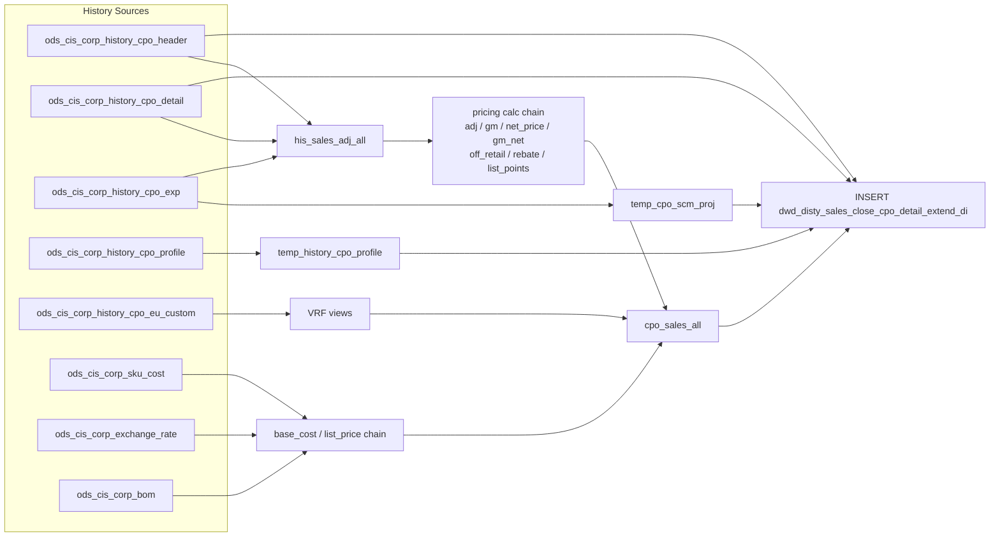

# DWD: Closed CPO Detail — Extended Daily (`dwd_disty_sales_close_cpo_detail_extend_di`)

- artifact_type: etl_table
- artifact_id: dw_us.dwd_disty_sales_close_cpo_detail_extend_di
- domain: cpo
- one_line_purpose: This job builds the **extended closed CPO line detail dataset**, enriching each settled CPO line with a full set of pricing analytics: adjusted unit price, net price, gross margin, net gross margin, off-retail discount, rebate total, list p...
- layer_type: DWD
- source_kind: etl_sql
- evidence_source: source/etl/sql/csource/etl/sql/po/source/etl/flows/public_order_tools/ingest/public_cpo_dw/script/dwd_disty_sales_close_cpo_detail_extend_di.sql

---

## L1 Data Foundation

### Identity and physical mapping
- **Table:** `dw_us.dwd_disty_sales_close_cpo_detail_extend_di`
- **Layer type:** DWD
- **Canonical / derived:** Derived / ETL-loaded (see L3)
- **Owner team:** not registered in metadata catalog

### Grain, scope, exclusions
- **Grain:** one row per `(cpo_id, cpo_line_seq, date_flag)` — a unique CPO line on a given transaction date.
- **Scope:** See L2 business purpose / L3 filters
- **Partition:** `date_flag` = `to_date(ch.trans_datetime)` — calendar date of the CPO transaction. - resolved from pipeline (see L4)
- **Natural key:** `cpo_id`, `cpo_line_seq` within a `date_flag` partition.
- **Exclusions:** Not documented in repository

#### Grain detail (preserved)

- **Grain:** one row per `(cpo_id, cpo_line_seq, date_flag)` — a unique CPO line on a given transaction date.
- **Partition:** `date_flag` = `to_date(ch.trans_datetime)` — calendar date of the CPO transaction.
- **Natural key:** `cpo_id`, `cpo_line_seq` within a `date_flag` partition.

---

### Cross-engine presence
| Engine | Present | Canonical FQN | Notes |
|--------|---------|---------------|-------|
| Hive | yes | `dwd_disty_sales_close_cpo_detail_extend_di` | ETL target / intermediate per evidence script |
| Vertica | pending | `dwd_disty_sales_close_cpo_detail_extend_di` | Confirm via hive2vertica flow evidence / MCP |

### Physical schema reference

Pointer block only - full column catalog lives in WKB L1 storage JSON.

| Field | Value |
|-------|-------|
| **Authoritative catalog** | WKB L1 storage seed (not duplicated in this file) |
| **entity_id** | `dw_us.dwd_disty_sales_close_cpo_detail_extend_di` |
| **l1_catalog_seed** | `target/storage/wkb/snapshots/_snapshot_id_template/l1_catalog/{engine}_{schema}_{table}.json` |
| **column_count** | pending (run ddl_seed_writer) |
| **partition_keys** | `date_flag, to_date(ch.trans_datetime)` |
| **ddl_source** | pending Bitbucket DDL / Vertica metadata ingest |
| **retrieval** | `python -m tools.wkb.indexing.run_query --query "cpo dwd_disty_sales_close_cpo_detail_extend_di schema" --intent find_table_schema` |

### Lineage
| Object | Role |
|--------|------|
| `ods_${country_code}.ods_cis_corp_history_cpo_header` | CPO header — date_flag, from_ref_type, sales_model |
| `ods_${country_code}.ods_cis_corp_history_cpo_detail` | Primary line detail source |
| `ods_${country_code}.ods_cis_corp_history_cpo_exp` | Expense lines — adj, unit_exp, SCM, SPA |
| `ods_${country_code}.ods_cis_corp_history_cpo_profile` | Profile fields — SPA ref, costs, MSRP, contract |
| `dim_${country_code}.dim_pub_part_info` | Vendor and product type per SKU |
| `ods_${country_code}.ods_cis_corp_project_info` | SCM project name |
| `ods_${country_code}.ods_etl_cust_profile_all` | Customer currency preference |
| `ods_${country_code}.ods_cis_corp_sku_cost` | SKU base cost and retail |
| `ods_${country_code}.ods_cis_corp_vend_master_etc` | Vendor currency |
| `ods_${country_code}.ods_cis_corp_exchange_rate` | Currency conversion rates |
| `ods_us.ods_cis_corp_bom` | BOM components (hardcoded US schema for kit cost rollup) |
| `ods_us.ods_cis_corp_sku_cost` | SKU cost for kit BOM (hardcoded US schema) |
| `ods_${country_code}.ods_cis_corp_cpo_allocation` | HP normal PO allocation check |
| `ods_${country_code}.ods_cis_corp_company_profile` | Company base currency |
| `ods_${country_code}.ods_cis_corp_parameters` | Company number |
| `ods_${country_code}.ods_cis_corp_list_box_detail` | VRF code desc (CEDM), tax codes (TAXC) |
| `ods_${country_code}.ods_cis_corp_eu_custom_map` | VRF field mapping |
| `ods_${country_code}.ods_cis_corp_history_cpo_eu_custom` | VRF field values |
| `dim_${country_code}.dim_pub_manager` | Delete user name |
| `dw_${country_code}.dwd_disty_sales_close_cpo_detail_extend_di` | **Target** — enriched closed CPO line detail |

---

### Freshness and load path
| Item | Value |
|------|-------|
| Load pattern | See L3 end-to-end / INSERT pattern in evidence script |
| Schedule | Not documented in repository |
| Parameters | `country_code`, `start_date`, `end_date` |


---

## L2 Declarative Knowledge

### Business purpose
This job builds the **extended closed CPO line detail dataset**, enriching each settled CPO line with a full set of pricing analytics: adjusted unit price, net price, gross margin, net gross margin, off-retail discount, rebate total, list points, base cost, list price, SCM/SPA expense allocation, VRF (vendor rebate factor) data, and contract references. It is the primary source for line-level CPO profitability analysis on closed orders.

---

### Audience and use cases
| Audience | How they benefit |
|----------|-----------------|
| **Finance / FP&A** | Line-level `gm`, `gm_net`, `so_unit_price`, `net_price`, `cpo_base_cost`, `cpo_list_price` for profitability analysis of closed CPOs. |
| **Pricing teams** | `adj_amount`, `off_retail`, `list_points` — discount and rebate performance per CPO line. |
| **Vendor management** | `spa_no`, `spa_ref_no`, `spa_type`, `scm_no`, `scm_desc`, `cpo_extended_exp` — SPA and SCM program tracking. |
| **Sales / account management** | `vrf` — vendor rebate factor codes and values per line. |
| **Operations** | `cpo_line_qty`, `cpo_ship_qty`, `cpo_bo_qty`, `cpo_so_qty`, `cpo_del_qty`, `cpo_allocated_qty` — fulfilment status per CPO line. |

---

### Fact key resolution
- Natural key: `cpo_id`, `cpo_line_seq` within a `date_flag` partition.
- FK / label-on attributes: see L3 dimension join patterns and step-by-step logic.
- Negative assertion: do not treat descriptive labels as grain keys unless listed under natural key.

### Time field semantics
- **date_flag / partition columns:** `date_flag` = `to_date(ch.trans_datetime)` — calendar date of the CPO transaction.
- Primary reporting filter should use the partition column(s) documented in L1; resolve values via L4.


### Metrics served

| Category | Column | Logical metric | Business reading |
|----------|--------|----------------|------------------|
| Measures | — | — | No measure columns mapped for this table. |

### Metric serving map

**Formula authority:** [`source/contracts/cpo/metric-index.md`](../../source/contracts/cpo/metric-index.md)

N/A — no measure columns mapped for this table.

### etl_metrics

No governed logical metrics from `source/contracts/cpo/metric-index.md` are mapped on this table.

---

### Metric serving map
N/A - not a `*_comb_mtd` / multi-period wide serving table (or map not present in legacy doc).


### Data products and column groups (preserved)

### Identifiers

- `cpo_id`, `cpo_line_seq`, `cpo_line_no` — CPO and line identifiers
- `cpo_sku_no`, `cpo_sku_inv_type` — SKU and inventory type
- `swl_prog_id`, `cis_unit_cost` — SWL program and CIS cost

### Quantity and pricing building blocks

- `cpo_line_qty`, `cpo_allocated_qty`, `cpo_bo_qty`, `cpo_so_qty`, `cpo_del_qty`, `cpo_ship_qty` — quantity lifecycle
- `cpo_price`, `cpo_grid_price`, `cpo_unit_price`, `cpo_unit_cost`, `cpo_grid_adj` — raw pricing fields
- `cpo_extended_price` = `cpo_line_qty × cpo_unit_price`
- `cpo_extended_cost` = `cpo_line_qty × cpo_unit_cost`
- `cpo_gm_percent` = `(cpo_unit_price − cpo_unit_cost) / cpo_unit_price` (null-safe)

### SPA / SCM fields

- `spa_no`, `spa_ref_no`, `spa_type` — SPA program identifiers
- `scm_no`, `scm_desc` — SCM project number and name
- `cpo_extended_exp` — total SCM extended expense for the line
- `cust_part_no` — customer's own part number for the SKU

### Computed pricing metrics

| Column | Meaning |
|--------|---------|
| `adj_amount` | Grid adjustment + total sales adjustment |
| `so_unit_price` | Effective selling price = grid price + grid adj + sales adj |
| `gm` | Gross margin % = `(so_unit_price − unit_cost) / so_unit_price` |
| `so_net_price` | Net price including expenses = grid price + adj + sales adj + unit expenses |
| `gm_net` | Net gross margin % — uses `cpo_base_cost` for HP Normal PO or ref-type-412; unit cost otherwise |
| `off_retail` | Discount vs list price = `(list_price − net_price) / list_price` |
| `rebate_total` | Total rebate = net_price − (grid_price + grid_adj + sales_adj) − unit_expenses |
| `list_points` | Vendor's distribution points off list = `(list_price − base_cost − rebate) / list_price − off_retail` |
| `cpo_base_cost` | Resolved base cost (CPO profile → SKU cost → currency conversion → BOM for kit) |
| `cpo_list_price` | Resolved list/MSRP (same resolution chain) |
| `vrf` | Semicolon-delimited VRF value-code pairs from EU custom fields |

### References and audit

- `contract_no`, `wf_request_id` — contract and workflow linkage
- `cpo_line_delete_id`, `cpo_line_delete_name`, `cpo_delete_datetime` — delete audit
- `cpo_entry_datetime`, `cpo_change_date` — lifecycle timestamps
- `etl_timestamp` — ETL run time (Pacific timezone)

---

### etl_metrics

N/A - no calculable ETL formulas extracted from this document (passthrough / stored measures only, or formulas not documented).

---

## L3 Procedural Knowledge

### Query and routing rules
**Business filters:** Use partition / date keys from L1 grain for reporting scope.
**Technical predicates (load only):** See Key filters and step-by-step logic below.

### Dimension join patterns
| Dimension FQN | Join keys | Purpose | Evidence |
|---------------|-----------|---------|----------|
| See step-by-step / base tables | See L3 steps | Dimension enrichment | `source/etl/sql/csource/etl/sql/po/source/etl/flows/public_order_tools/ingest/public_cpo_dw/script/dwd_disty_sales_close_cpo_detail_extend_di.sql` |

### Key filters and ETL business logic
### Step 1 — `temp_history_cpo_profile`

**Source:** `ods_cis_corp_history_cpo_profile` WHERE `profile_type IN ('SPAREF','CUSTPART#','CUSTPOCOST','COMPPOCOST','CUSTMSRP','COMPMSRP','CONTRNO','QUOTREQID')`

Pivots into per-`(cpo_id, cpo_line_seq)` columns using conditional `MAX`/`SUM`:

| Output column | Profile type | Condition | Value field |
|---------------|-------------|-----------|-------------|
| `spa_ref_no` | `SPAREF#` | `active = 'Y'` | `profile_c` |
| `cust_part_no` | `CUSTPART#` | `profile_cat='CPOL'`, `active='Y'` | `profile_c` |
| `cust_bast_cost` | `CUSTPOCOST` | `profile_f IS NOT NULL` | `SUM(profile_f)` |
| `com_bast_cost` | `COMPPOCOST` | `profile_f IS NOT NULL` | `SUM(profile_f)` |
| `cust_list_price` | `CUSTMSRP` | `profile_f IS NOT NULL` | `SUM(profile_f)` |
| `com_list_price` | `COMPMSRP` | `profile_f IS NOT NULL` | `SUM(profile_f)` |
| `contract_no` | `CONTRNO` | `profile_cat='CPOL'` | `profile_i` |
| `wf_request_id` | `QUOTREQID` | `profile_cat='WFL'` | `profile_c` |

---

### Step 3 — `his_sales_adj_all`

**Source:** history CPO header INNER JOIN detail LEFT JOIN expense (excluding HRPM/HRSD/HRFT/HRFD) LEFT JOIN part info

**Filter on expense:** `cpo_delete_date IS NULL` AND `cpo_line_seq != 0` AND expense code NOT IN ('HRPM','HRSD','HRFT','HRFD')

**Key output:** `total_sales_adj = SUM(COALESCE(cpo_sales_adj, 0))` — the total adjustment amount across non-excluded expense lines.

---

### Steps 4–7 — Pricing views (`adj_amount`, `so_unit_price`, `gm`, ...

### Standard time-filter SQL
```sql
-- relative period filter using resolved partition value (see L4)
SELECT *
FROM dwd_disty_sales_close_cpo_detail_extend_di
WHERE /* partition predicate */ date_flag = '${partition_value}';
```

### End-to-end flow
**Runtime parameters:** `country_code`, `start_date`, `end_date`
**Target table:** `dw_${country_code}.dwd_disty_sales_close_cpo_detail_extend_di`, partitioned by **`date_flag`**.

1. Build `temp_history_cpo_profile`: pivot SPA ref, cust part no, base cost/MSRP (cust/comp), contract no, and workflow ID per CPO line.
2. Build `temp_cpo_scm_proj`: aggregate SCM expense, SPA, SCM project from history expense table; join project info for SCM description.
3. Build `his_sales_adj_all`: join history CPO header + detail + expense (excluding HRPM/HRSD/HRFT/HRFD) + part info; compute `total_sales_adj`.
4. Build `sales_adj_gm_so_unit_price` view: compute `adj_amount`, `so_unit_price`, `gm`.
5. Build `temp_cpo_exp_code` view: resolve non-tax expense codes to include in `total_unit_exp`.
6. Build `total_unit_exp` view: sum non-tax unit expenses per line (UNION ALL of null-code and non-tax-code expense rows).
7. Build `sales_net_price` view: `net_price = so_unit_price + total_unit_exp`.
8. Build `is_hp_normal_po` view: flag CPOs with `HPWATSON=Y` profile and allocation in loc 98/100 as HP normal PO.
9. Build `company_currency` view: resolve company's base currency from company profile.
10. Build base cost / list price chain (Steps 10–17):
    - `base_cost_list`: prefer CPO profile cost; fallback to null.
    - `base_cost_list_price_first`: fill nulls from SKU cost table, applying currency match logic.
    - `base_cost_list_price_second`: apply currency equivalence rules (company/vendor currency matching).
    - `base_cost_third` / `list_price_third`: apply exchange rate conversion for remaining nulls.
    - `base_cost_kpart` / `list_price_kpart`: sum BOM component costs for kit (`prod_type='K'`) products.
    - `base_list_adj`: consolidate all resolution paths with `nvl` chain.
    - `sale_base_cost_list_price_all`: final merge — use CPO profile value if not null, else use fallback chain.
11. Build `sales_gm_net` view: net margin using base cost for HP normal PO, unit cost otherwise.
12. Build `sales_off_retail` view: discount vs list price.
13. Build `efpr_unit_exp` view: unit expenses excluding EFPR spa_type.
14. Build `combined_table` view: assemble net_price, total_unit_exp, efpr_unit_exp for rebate computation.
15. Build `sales_rebate_all` view: rebate = net_price − (grid_price + adj + sales_adj) − unit_exp (EFPR-excluded for sales_model=1).
16. Build `sales_list_points` view: list points = `(list−base_cost−rebate)/list − off_retail`.
17. Build `sales_vrf_data` view + `sale_vrf_combin` view: extract VRF type/value from EU custom fields; concatenate with semicolons.
18. Build `cpo_sales_all`: assemble all computed metrics.
19. **INSERT OVERWRITE** into target joining history header + detail + manager + profile + SCM + `cpo_sales_all`.



---


#### High-level stages (preserved)

| Stage | Business meaning |
|-------|-----------------|
| **Profile extraction** | Pivots SPA reference, customer part number, customer/competitor base cost and MSRP, contract number, and workflow request ID from the history CPO profile table per CPO line. |
| **SCM / SPA enrichment** | Aggregates SCM expense, SPA number, SPA reference, SCM project name, and SPA type per CPO line from history expense table. |
| **Sales adjustment base** | Joins history CPO header + detail + expense + part info to build `total_sales_adj` (excluding HRPM/HRSD/HRFT/HRFD expense codes). Provides the foundation for all pricing calculations. |
| **Price / margin metrics** | Computes `adj_amount`, `so_unit_price`, `gm` (unit gross margin %), `net_price`, `gm_net` (net gross margin adjusted for HP normal PO or ref type 412), `off_retail`, `rebate_total`, `list_points`. |
| **Base cost / list price** | Multi-step resolution: CPO profile → SKU cost table → currency conversion → BOM rollup (for kit products). |
| **VRF** | Extracts VRF (vendor rebate factor) data from EU custom fields, concatenated with semicolons. |
| **Final INSERT** | Combines all enriched fields with CPO header-derived `date_flag` and writes to the target partitioned table. |

**Parameters:** `country_code`, `start_date`, `end_date`

---


### Base tables register
| Object | Role in this job |
|--------|-----------------|
| `ods_${country_code}.ods_cis_corp_history_cpo_header` | CPO header — `trans_datetime`, `cpo_from_ref_type`, `sales_model`, `cpo_cust_no`, `company_no`. |
| `ods_${country_code}.ods_cis_corp_history_cpo_detail` | CPO line detail — quantities, prices, costs, SKU, grid fields. Primary driving table for the final INSERT. |
| `ods_${country_code}.ods_cis_corp_history_cpo_exp` | CPO expense lines — `cpo_sales_adj`, `cpo_unit_exp`, `cpo_spa_no`, `cpo_scm_no`, `cpo_extended_exp`. Filtered to non-deleted (`cpo_delete_date IS NULL`) and non-header (`cpo_line_seq != 0`) rows. |
| `ods_${country_code}.ods_cis_corp_history_cpo_profile` | CPO profile — pivoted for SPA ref, cust part no, base cost, MSRP, contract no, workflow request ID. |
| `dim_${country_code}.dim_pub_part_info` | Part/product info — `vend_no`, `prod_type` (used to identify kit products). |
| `ods_${country_code}.ods_cis_corp_project_info` | SCM project names (`proj_name` by `proj_no`). |
| `ods_${country_code}.ods_etl_cust_profile_all` | Customer currency preference (`profile_type = 'CUST_CURR'`). |
| `ods_${country_code}.ods_cis_corp_sku_cost` | SKU base cost and retail (list price) by company. |
| `ods_${country_code}.ods_cis_corp_vend_master_etc` | Vendor currency (`cur_type`). |
| `ods_${country_code}.ods_cis_corp_exchange_rate` | Latest exchange rate for currency conversion. |
| `ods_${country_code}.ods_cis_corp_bom` | BOM components for kit SKU cost rollup. |
| `ods_${country_code}.ods_cis_corp_cpo_allocation` | CPO allocation locations — used in `is_hp_normal_po` check (loc_no IN 98, 100). |
| `ods_${country_code}.ods_cis_corp_company_profile` | Company currency profile (`profile_type = 'CURRENCY'`). |
| `ods_${country_code}.ods_cis_corp_parameters` | Company number parameter (`parameter_name = 'COMPANY_NO'`). |
| `ods_${country_code}.ods_cis_corp_list_box_detail` | VRF code description lookup (`list_box_code = 'CEDM'`) and tax code list (`list_box_code = 'TAXC'`). |
| `ods_${country_code}.ods_cis_corp_eu_custom_map` | EU custom map — used to resolve VRF field mapping and data type. |
| `ods_${country_code}.ods_cis_corp_history_cpo_eu_custom` | EU custom field values per CPO line — source of VRF data. |
| `dim_${country_code}.dim_pub_manager` | Manager name lookup — resolves `cpo_delete_id` to `cpo_line_delete_name`. |

**Temporary tables (inside the job only):**
`temp_history_cpo_profile` → `temp_cpo_scm_proj` → `his_sales_adj_all` → (pricing calc chain) → `base_cost_list` → `base_cost_list_price_first` → `base_cost_list_price_second` → `base_cost_third` / `list_price_third` / `base_cost_kpart` / `list_price_kpart` → `base_list_adj` → `sale_base_cost_list_price_all` → `cpo_sales_all` → (final INSERT)

---

### Step-by-step logic
### Step 1 — `temp_history_cpo_profile`

**Source:** `ods_cis_corp_history_cpo_profile` WHERE `profile_type IN ('SPAREF','CUSTPART#','CUSTPOCOST','COMPPOCOST','CUSTMSRP','COMPMSRP','CONTRNO','QUOTREQID')`

Pivots into per-`(cpo_id, cpo_line_seq)` columns using conditional `MAX`/`SUM`:

| Output column | Profile type | Condition | Value field |
|---------------|-------------|-----------|-------------|
| `spa_ref_no` | `SPAREF#` | `active = 'Y'` | `profile_c` |
| `cust_part_no` | `CUSTPART#` | `profile_cat='CPOL'`, `active='Y'` | `profile_c` |
| `cust_bast_cost` | `CUSTPOCOST` | `profile_f IS NOT NULL` | `SUM(profile_f)` |
| `com_bast_cost` | `COMPPOCOST` | `profile_f IS NOT NULL` | `SUM(profile_f)` |
| `cust_list_price` | `CUSTMSRP` | `profile_f IS NOT NULL` | `SUM(profile_f)` |
| `com_list_price` | `COMPMSRP` | `profile_f IS NOT NULL` | `SUM(profile_f)` |
| `contract_no` | `CONTRNO` | `profile_cat='CPOL'` | `profile_i` |
| `wf_request_id` | `QUOTREQID` | `profile_cat='WFL'` | `profile_c` |

---

### Step 3 — `his_sales_adj_all`

**Source:** history CPO header INNER JOIN detail LEFT JOIN expense (excluding HRPM/HRSD/HRFT/HRFD) LEFT JOIN part info

**Filter on expense:** `cpo_delete_date IS NULL` AND `cpo_line_seq != 0` AND expense code NOT IN ('HRPM','HRSD','HRFT','HRFD')

**Key output:** `total_sales_adj = SUM(COALESCE(cpo_sales_adj, 0))` — the total adjustment amount across non-excluded expense lines.

---

### Steps 4–7 — Pricing views (`adj_amount`, `so_unit_price`, `gm`, `net_price`)

| Column | Formula |
|--------|---------|
| `adj_amount` | `nvl(cpo_grid_adj,0) + nvl(total_sales_adj,0)` |
| `so_unit_price` | `nvl(cpo_grid_price,0) + adj_amount` |
| `gm` | `(so_unit_price − cpo_unit_cost) / so_unit_price` (0 if so_unit_price = 0) |
| `net_price` | `so_unit_price + nvl(total_unit_exp,0)` |

---

### Step 8 — `is_hp_normal_po`

**Condition:** CPO has profile `HPWATSON = 'Y'` at `profile_cat = 'CPOH'` AND allocation `loc_no IN (98, 100)`.

Flagged CPOs use `cpo_unit_cost` (not `cpo_base_cost`) in the `gm_net` calculation.

---

### Steps 10–17 — `cpo_base_cost` / `cpo_list_price` resolution chain

Multi-step waterfall for each CPO line:
1. Use CPO profile value (`cust_bast_cost` → `com_bast_cost`) if present.
2. If null: look up `ods_cis_corp_sku_cost` — use `base_cost` or `base_cost_fx` based on whether `cust_currency = company_currency` or `= vend_currency`.
3. If still null: apply exchange rate conversion (`ods_cis_corp_exchange_rate` most recent date).
4. If still null and `prod_type = 'K'` (kit): sum BOM component costs from `ods_cis_corp_bom` + `ods_cis_corp_sku_cost`.

> **Note:** `list_price_kpart` and `base_cost_kpart` hardcode `ods_us.ods_cis_corp_bom` and `ods_us.ods_cis_corp_sku_cost` (US schema) regardless of `${country_code}`. This is a script-level behaviour to be aware of for non-US countries.

---

### Steps 21–23 — `rebate_total`

**Definition:**
- `sales_model = 1`: `net_price − (grid_price + grid_adj + sales_adj) − total_unit_exp` (EFPR spa_type excluded)
- Otherwise: `net_price − (grid_price + grid_adj + sales_adj) − tue_total_unit_exp` (all unit expenses)
- Only computed when the result is non-zero (filtered in the JOIN condition).

---

### Step 24 — `list_points`

```
list_points = 
  [(list_price − base_cost − rebate_total) / list_price]  -- vendor margin at list
  − [(list_price − net_price) / list_price]               -- off-retail discount
```

Zero if `cpo_list_price = 0`.

---

### Relationship map (embedded)

| from_fqn | to_fqn | cardinality | join_keys | provenance |
|----------|--------|-------------|-----------|------------|
| `ods_${country_code}.ods_cis_corp_history_cpo_exp` | `ods_${country_code}.ods_cis_corp_project_info` | many:1 | `ce.cpo_scm_no=pinfo.proj_no` | etl_sql (source/etl/sql/cpo/public_order_scripts/public_cpo_dw/script/dwd_disty_sales_close_cpo_detail_extend_di.sql:1) |
| `ods_${country_code}.ods_cis_corp_history_cpo_exp` | `temp_history_cpo_profile` | many:1 | `ce.cpo_id = cp.cpo_id and ce.cpo_line_seq=cp.cpo_line_seq` | etl_sql (source/etl/sql/cpo/public_order_scripts/public_cpo_dw/script/dwd_disty_sales_close_cpo_detail_extend_di.sql:1) |
| `ods_${country_code}.ods_cis_corp_history_cpo_header` | `ods_${country_code}.ods_cis_corp_history_cpo_detail` | many:1 | `cpoh.cpo_id = cd.cpo_id` | etl_sql (source/etl/sql/cpo/public_order_scripts/public_cpo_dw/script/dwd_disty_sales_close_cpo_detail_extend_di.sql:1) |
| `ods_${country_code}.ods_cis_corp_history_cpo_detail` | `ods_${country_code}.ods_cis_corp_history_cpo_exp` | many:1 | `ce.cpo_id = cd.cpo_id AND ce.cpo_line_seq = cd.cpo_line_seq AND ce.cpo_delete_date IS NULL AND ce.cpo_line_seq != 0 AND (ce.cpo_exp_code IS NULL OR ce.cpo_ex...` | etl_sql (source/etl/sql/cpo/public_order_scripts/public_cpo_dw/script/dwd_disty_sales_close_cpo_detail_extend_di.sql:1) |
| `ods_${country_code}.ods_cis_corp_history_cpo_detail` | `dim_${country_code}.dim_pub_part_info` | many:1 | `cd.cpo_sku_no = pm.sku_no` | etl_sql (source/etl/sql/cpo/public_order_scripts/public_cpo_dw/script/dwd_disty_sales_close_cpo_detail_extend_di.sql:1) |
| `ods_${country_code}.ods_cis_corp_history_cpo_exp` | `temp_cpo_exp_code` | many:1 | `ce.cpo_exp_code = tc.cpo_exp_code and tc.cpo_exp_code is null` | etl_sql (source/etl/sql/cpo/public_order_scripts/public_cpo_dw/script/dwd_disty_sales_close_cpo_detail_extend_di.sql:1) |
| `temp_history_cpo_profile` | `ods_${country_code}.ods_cis_corp_cpo_allocation` | many:1 | `cp.cpo_id = ca.cpo_id` | etl_sql (source/etl/sql/cpo/public_order_scripts/public_cpo_dw/script/dwd_disty_sales_close_cpo_detail_extend_di.sql:1) |
| `temp_history_cpo_profile` | `dim_${country_code}.dim_pub_part_info` | many:1 | `cd.cpo_sku_no = pm.sku_no` | etl_sql (source/etl/sql/cpo/public_order_scripts/public_cpo_dw/script/dwd_disty_sales_close_cpo_detail_extend_di.sql:1) |
| `ods_${country_code}.ods_cis_corp_history_cpo_profile` | `temp_history_cpo_profile` | many:1 | `sa.cpo_id=p.cpo_id and sa.cpo_line_seq=p.cpo_line_seq; --11 base_cost_list-->base_cost_list_price -2 create TEMPORARY table base_cost_list_price_first AS` | etl_sql (source/etl/sql/cpo/public_order_scripts/public_cpo_dw/script/dwd_disty_sales_close_cpo_detail_extend_di.sql:1) |
| `ods_${country_code}.ods_cis_corp_history_cpo_profile` | `ods_${country_code}.ods_etl_cust_profile_all` | many:1 | `cp.cust_no = cd.cpo_cust_no AND cp.profile_type = 'CUST_CURR'` | etl_sql (source/etl/sql/cpo/public_order_scripts/public_cpo_dw/script/dwd_disty_sales_close_cpo_detail_extend_di.sql:1) |
| `ods_${country_code}.ods_etl_cust_profile_all` | `ods_${country_code}.ods_cis_corp_sku_cost` | many:1 | `cd.cpo_sku_no = sc.sku_no and cd.company_no=sc.company_no` | etl_sql (source/etl/sql/cpo/public_order_scripts/public_cpo_dw/script/dwd_disty_sales_close_cpo_detail_extend_di.sql:1) |
| `ods_${country_code}.ods_etl_cust_profile_all` | `ods_${country_code}.ods_cis_corp_vend_master_etc` | many:1 | `cd.vend_no = vc.vend_no` | etl_sql (source/etl/sql/cpo/public_order_scripts/public_cpo_dw/script/dwd_disty_sales_close_cpo_detail_extend_di.sql:1) |
| `ods_${country_code}.ods_etl_cust_profile_all` | `ods_${country_code}.ods_cis_corp_exchange_rate` | many:1 | `er.currency = bcl.company_currency AND er.base = bcl.cust_currency` | etl_sql (source/etl/sql/cpo/public_order_scripts/public_cpo_dw/script/dwd_disty_sales_close_cpo_detail_extend_di.sql:1) |
| `ods_${country_code}.ods_etl_cust_profile_all` | `ods_${country_code}.ods_cis_corp_bom` | many:1 | `a.cpo_sku_no=b.sku_no` | etl_sql (source/etl/sql/cpo/public_order_scripts/public_cpo_dw/script/dwd_disty_sales_close_cpo_detail_extend_di.sql:1) |
| `ods_${country_code}.ods_cis_corp_bom` | `ods_${country_code}.ods_cis_corp_sku_cost` | many:1 | `b.comp_no = sc.sku_no and a.company_no=sc.company_no` | etl_sql (source/etl/sql/cpo/public_order_scripts/public_cpo_dw/script/dwd_disty_sales_close_cpo_detail_extend_di.sql:1) |
| `ods_${country_code}.ods_etl_cust_profile_all` | `ods_us.ods_cis_corp_bom` | many:1 | `a.cpo_sku_no=b.sku_no` | etl_sql (source/etl/sql/cpo/public_order_scripts/public_cpo_dw/script/dwd_disty_sales_close_cpo_detail_extend_di.sql:1) |
| `ods_us.ods_cis_corp_bom` | `ods_us.ods_cis_corp_sku_cost` | many:1 | `b.comp_no = sc.sku_no and a.company_no=sc.company_no --2024/09/04` | etl_sql (source/etl/sql/cpo/public_order_scripts/public_cpo_dw/script/dwd_disty_sales_close_cpo_detail_extend_di.sql:1) |
| `ods_${country_code}.ods_cis_corp_history_cpo_exp` | `temp_cpo_exp_code` | many:1 | `ce.cpo_exp_code=tc.cpo_exp_code and tc.cpo_exp_code is null` | etl_sql (source/etl/sql/cpo/public_order_scripts/public_cpo_dw/script/dwd_disty_sales_close_cpo_detail_extend_di.sql:1) |
| `ods_${country_code}.ods_etl_cust_profile_all` | `ods_${country_code}.ods_cis_corp_history_cpo_eu_custom` | many:1 | `a.cpo_id = cdt.cpo_id AND a.cpo_line_seq = cdt.cpo_line_seq` | etl_sql (source/etl/sql/cpo/public_order_scripts/public_cpo_dw/script/dwd_disty_sales_close_cpo_detail_extend_di.sql:1) |
| `ods_${country_code}.ods_cis_corp_history_cpo_eu_custom` | `ods_${country_code}.ods_cis_corp_eu_custom_map` | many:1 | `a.eu_map_id = b.eu_map_id AND a.eu_map_line_no = b.eu_map_line_no` | etl_sql (source/etl/sql/cpo/public_order_scripts/public_cpo_dw/script/dwd_disty_sales_close_cpo_detail_extend_di.sql:1) |
| `ods_${country_code}.ods_cis_corp_eu_custom_map` | `ods_${country_code}.ods_cis_corp_list_box_detail` | many:1 | `b.map_data_desc = c.code_value AND c.list_box_code = 'CEDM'; --26 combin vrf and use ; as separator create or replace TEMPORARY view sale_vrf_combin as` | etl_sql (source/etl/sql/cpo/public_order_scripts/public_cpo_dw/script/dwd_disty_sales_close_cpo_detail_extend_di.sql:1) |
| `ods_${country_code}.ods_cis_corp_history_cpo_header` | `ods_${country_code}.ods_cis_corp_history_cpo_detail` | many:1 | `ch.cpo_id=cd.cpo_id` | etl_sql (source/etl/sql/cpo/public_order_scripts/public_cpo_dw/script/dwd_disty_sales_close_cpo_detail_extend_di.sql:1) |
| `ods_${country_code}.ods_cis_corp_history_cpo_detail` | `dim_${country_code}.dim_pub_manager` | many:1 | `cd.cpo_delete_id = pm.userid` | etl_sql (source/etl/sql/cpo/public_order_scripts/public_cpo_dw/script/dwd_disty_sales_close_cpo_detail_extend_di.sql:1) |
| `ods_${country_code}.ods_cis_corp_history_cpo_detail` | `temp_history_cpo_profile` | many:1 | `cd.cpo_id = cp.cpo_id and cd.cpo_line_seq = cp.cpo_line_seq` | etl_sql (source/etl/sql/cpo/public_order_scripts/public_cpo_dw/script/dwd_disty_sales_close_cpo_detail_extend_di.sql:1) |
| `ods_${country_code}.ods_cis_corp_history_cpo_detail` | `temp_cpo_scm_proj` | many:1 | `cd.cpo_id = csp.cpo_id and cd.cpo_line_seq = csp.cpo_line_seq` | etl_sql (source/etl/sql/cpo/public_order_scripts/public_cpo_dw/script/dwd_disty_sales_close_cpo_detail_extend_di.sql:1) |

`source/ref/cpo/table relationship.txt`: Not documented in repository.

### Special logic (embedded)

Not documented in repository

### Column / field derivations (from ETL SQL)

| target_column | expression_sql | upstream_columns | upstream_tables | transform_kind | evidence |
|---------------|----------------|------------------|-----------------|----------------|----------|
| `cpo_id` | `cd.cpo_id` | `cpo_id` | `ods_${country_code}.ods_cis_corp_history_cpo_header`, `ods_${country_code}.ods_cis_corp_history_cpo_detail`, `dim_${country_code}.dim_pub_manager`, `temp_history_cpo_profile`, `temp_cpo_scm_proj`, `cpo_sales_all` | passthrough | `source/etl/sql/cpo/public_order_scripts/public_cpo_dw/script/dwd_disty_sales_close_cpo_detail_extend_di.sql:47` |
| `cpo_line_seq` | `cd.cpo_line_seq` | `cpo_line_seq` | `ods_${country_code}.ods_cis_corp_history_cpo_header`, `ods_${country_code}.ods_cis_corp_history_cpo_detail`, `dim_${country_code}.dim_pub_manager`, `temp_history_cpo_profile`, `temp_cpo_scm_proj`, `cpo_sales_all` | passthrough | `source/etl/sql/cpo/public_order_scripts/public_cpo_dw/script/dwd_disty_sales_close_cpo_detail_extend_di.sql:48` |
| `cpo_line_no` | `cd.cpo_line_no` | `cpo_line_no` | `ods_${country_code}.ods_cis_corp_history_cpo_header`, `ods_${country_code}.ods_cis_corp_history_cpo_detail`, `dim_${country_code}.dim_pub_manager`, `temp_history_cpo_profile`, `temp_cpo_scm_proj`, `cpo_sales_all` | passthrough | `source/etl/sql/cpo/public_order_scripts/public_cpo_dw/script/dwd_disty_sales_close_cpo_detail_extend_di.sql:591` |
| `cpo_line_status` | `cd.cpo_line_status` | `cpo_line_status` | `ods_${country_code}.ods_cis_corp_history_cpo_header`, `ods_${country_code}.ods_cis_corp_history_cpo_detail`, `dim_${country_code}.dim_pub_manager`, `temp_history_cpo_profile`, `temp_cpo_scm_proj`, `cpo_sales_all` | passthrough | `source/etl/sql/cpo/public_order_scripts/public_cpo_dw/script/dwd_disty_sales_close_cpo_detail_extend_di.sql:592` |
| `cpo_sku_no` | `cd.cpo_sku_no` | `cpo_sku_no` | `ods_${country_code}.ods_cis_corp_history_cpo_header`, `ods_${country_code}.ods_cis_corp_history_cpo_detail`, `dim_${country_code}.dim_pub_manager`, `temp_history_cpo_profile`, `temp_cpo_scm_proj`, `cpo_sales_all` | passthrough | `source/etl/sql/cpo/public_order_scripts/public_cpo_dw/script/dwd_disty_sales_close_cpo_detail_extend_di.sql:54` |
| `cpo_sku_inv_type` | `cd.cpo_sku_inv_type` | `cpo_sku_inv_type` | `ods_${country_code}.ods_cis_corp_history_cpo_header`, `ods_${country_code}.ods_cis_corp_history_cpo_detail`, `dim_${country_code}.dim_pub_manager`, `temp_history_cpo_profile`, `temp_cpo_scm_proj`, `cpo_sales_all` | passthrough | `source/etl/sql/cpo/public_order_scripts/public_cpo_dw/script/dwd_disty_sales_close_cpo_detail_extend_di.sql:594` |
| `cpo_line_qty` | `cd.cpo_line_qty` | `cpo_line_qty` | `ods_${country_code}.ods_cis_corp_history_cpo_header`, `ods_${country_code}.ods_cis_corp_history_cpo_detail`, `dim_${country_code}.dim_pub_manager`, `temp_history_cpo_profile`, `temp_cpo_scm_proj`, `cpo_sales_all` | passthrough | `source/etl/sql/cpo/public_order_scripts/public_cpo_dw/script/dwd_disty_sales_close_cpo_detail_extend_di.sql:595` |
| `cpo_allocated_qty` | `cd.cpo_allocated_qty` | `cpo_allocated_qty` | `ods_${country_code}.ods_cis_corp_history_cpo_header`, `ods_${country_code}.ods_cis_corp_history_cpo_detail`, `dim_${country_code}.dim_pub_manager`, `temp_history_cpo_profile`, `temp_cpo_scm_proj`, `cpo_sales_all` | passthrough | `source/etl/sql/cpo/public_order_scripts/public_cpo_dw/script/dwd_disty_sales_close_cpo_detail_extend_di.sql:596` |
| `cpo_bo_qty` | `cd.cpo_bo_qty` | `cpo_bo_qty` | `ods_${country_code}.ods_cis_corp_history_cpo_header`, `ods_${country_code}.ods_cis_corp_history_cpo_detail`, `dim_${country_code}.dim_pub_manager`, `temp_history_cpo_profile`, `temp_cpo_scm_proj`, `cpo_sales_all` | passthrough | `source/etl/sql/cpo/public_order_scripts/public_cpo_dw/script/dwd_disty_sales_close_cpo_detail_extend_di.sql:597` |
| `cpo_so_qty` | `cd.cpo_so_qty` | `cpo_so_qty` | `ods_${country_code}.ods_cis_corp_history_cpo_header`, `ods_${country_code}.ods_cis_corp_history_cpo_detail`, `dim_${country_code}.dim_pub_manager`, `temp_history_cpo_profile`, `temp_cpo_scm_proj`, `cpo_sales_all` | passthrough | `source/etl/sql/cpo/public_order_scripts/public_cpo_dw/script/dwd_disty_sales_close_cpo_detail_extend_di.sql:598` |
| `cpo_del_qty` | `cd.cpo_del_qty` | `cpo_del_qty` | `ods_${country_code}.ods_cis_corp_history_cpo_header`, `ods_${country_code}.ods_cis_corp_history_cpo_detail`, `dim_${country_code}.dim_pub_manager`, `temp_history_cpo_profile`, `temp_cpo_scm_proj`, `cpo_sales_all` | passthrough | `source/etl/sql/cpo/public_order_scripts/public_cpo_dw/script/dwd_disty_sales_close_cpo_detail_extend_di.sql:599` |
| `cpo_ship_qty` | `cd.cpo_ship_qty` | `cpo_ship_qty` | `ods_${country_code}.ods_cis_corp_history_cpo_header`, `ods_${country_code}.ods_cis_corp_history_cpo_detail`, `dim_${country_code}.dim_pub_manager`, `temp_history_cpo_profile`, `temp_cpo_scm_proj`, `cpo_sales_all` | passthrough | `source/etl/sql/cpo/public_order_scripts/public_cpo_dw/script/dwd_disty_sales_close_cpo_detail_extend_di.sql:600` |
| `cpo_price` | `cd.cpo_price` | `cpo_price` | `ods_${country_code}.ods_cis_corp_history_cpo_header`, `ods_${country_code}.ods_cis_corp_history_cpo_detail`, `dim_${country_code}.dim_pub_manager`, `temp_history_cpo_profile`, `temp_cpo_scm_proj`, `cpo_sales_all` | passthrough | `source/etl/sql/cpo/public_order_scripts/public_cpo_dw/script/dwd_disty_sales_close_cpo_detail_extend_di.sql:601` |
| `cpo_grid_price` | `cd.cpo_grid_price` | `cpo_grid_price` | `ods_${country_code}.ods_cis_corp_history_cpo_header`, `ods_${country_code}.ods_cis_corp_history_cpo_detail`, `dim_${country_code}.dim_pub_manager`, `temp_history_cpo_profile`, `temp_cpo_scm_proj`, `cpo_sales_all` | passthrough | `source/etl/sql/cpo/public_order_scripts/public_cpo_dw/script/dwd_disty_sales_close_cpo_detail_extend_di.sql:50` |
| `cpo_unit_price` | `cd.cpo_unit_price` | `cpo_unit_price` | `ods_${country_code}.ods_cis_corp_history_cpo_header`, `ods_${country_code}.ods_cis_corp_history_cpo_detail`, `dim_${country_code}.dim_pub_manager`, `temp_history_cpo_profile`, `temp_cpo_scm_proj`, `cpo_sales_all` | passthrough | `source/etl/sql/cpo/public_order_scripts/public_cpo_dw/script/dwd_disty_sales_close_cpo_detail_extend_di.sql:603` |
| `cpo_unit_cost` | `cd.cpo_unit_cost` | `cpo_unit_cost` | `ods_${country_code}.ods_cis_corp_history_cpo_header`, `ods_${country_code}.ods_cis_corp_history_cpo_detail`, `dim_${country_code}.dim_pub_manager`, `temp_history_cpo_profile`, `temp_cpo_scm_proj`, `cpo_sales_all` | passthrough | `source/etl/sql/cpo/public_order_scripts/public_cpo_dw/script/dwd_disty_sales_close_cpo_detail_extend_di.sql:51` |
| `cpo_extended_price` | `cd.cpo_line_qty *cd.cpo_unit_price` | `cpo_line_qty`, `cpo_unit_price` | `ods_${country_code}.ods_cis_corp_history_cpo_header`, `ods_${country_code}.ods_cis_corp_history_cpo_detail`, `dim_${country_code}.dim_pub_manager`, `temp_history_cpo_profile`, `temp_cpo_scm_proj`, `cpo_sales_all` | arithmetic | `source/etl/sql/cpo/public_order_scripts/public_cpo_dw/script/dwd_disty_sales_close_cpo_detail_extend_di.sql:605` |
| `cpo_extended_cost` | `cd.cpo_line_qty * cd.cpo_unit_cost` | `cpo_line_qty`, `cpo_unit_cost` | `ods_${country_code}.ods_cis_corp_history_cpo_header`, `ods_${country_code}.ods_cis_corp_history_cpo_detail`, `dim_${country_code}.dim_pub_manager`, `temp_history_cpo_profile`, `temp_cpo_scm_proj`, `cpo_sales_all` | arithmetic | `source/etl/sql/cpo/public_order_scripts/public_cpo_dw/script/dwd_disty_sales_close_cpo_detail_extend_di.sql:606` |
| `cpo_gm_percent` | `nvl(cd.cpo_unit_price - cd.cpo_unit_cost,0)/ nvl(cd.cpo_unit_price,0)` | `cpo_unit_price`, `cpo_unit_cost` | `ods_${country_code}.ods_cis_corp_history_cpo_header`, `ods_${country_code}.ods_cis_corp_history_cpo_detail`, `dim_${country_code}.dim_pub_manager`, `temp_history_cpo_profile`, `temp_cpo_scm_proj`, `cpo_sales_all` | coalesce | `source/etl/sql/cpo/public_order_scripts/public_cpo_dw/script/dwd_disty_sales_close_cpo_detail_extend_di.sql:607` |
| `cpo_price_flag` | `cd.cpo_price_flag` | `cpo_price_flag` | `ods_${country_code}.ods_cis_corp_history_cpo_header`, `ods_${country_code}.ods_cis_corp_history_cpo_detail`, `dim_${country_code}.dim_pub_manager`, `temp_history_cpo_profile`, `temp_cpo_scm_proj`, `cpo_sales_all` | passthrough | `source/etl/sql/cpo/public_order_scripts/public_cpo_dw/script/dwd_disty_sales_close_cpo_detail_extend_di.sql:608` |
| `cpo_line_delete_id` | `cd.cpo_delete_id` | `cpo_delete_id` | `ods_${country_code}.ods_cis_corp_history_cpo_header`, `ods_${country_code}.ods_cis_corp_history_cpo_detail`, `dim_${country_code}.dim_pub_manager`, `temp_history_cpo_profile`, `temp_cpo_scm_proj`, `cpo_sales_all` | rename | `source/etl/sql/cpo/public_order_scripts/public_cpo_dw/script/dwd_disty_sales_close_cpo_detail_extend_di.sql:609` |
| `cpo_line_delete_name` | `pm.name` | `name` | `ods_${country_code}.ods_cis_corp_history_cpo_header`, `ods_${country_code}.ods_cis_corp_history_cpo_detail`, `dim_${country_code}.dim_pub_manager`, `temp_history_cpo_profile`, `temp_cpo_scm_proj`, `cpo_sales_all` | rename | `source/etl/sql/cpo/public_order_scripts/public_cpo_dw/script/dwd_disty_sales_close_cpo_detail_extend_di.sql:610` |
| `cpo_delete_datetime` | `cd.cpo_delete_datetime` | `cpo_delete_datetime` | `ods_${country_code}.ods_cis_corp_history_cpo_header`, `ods_${country_code}.ods_cis_corp_history_cpo_detail`, `dim_${country_code}.dim_pub_manager`, `temp_history_cpo_profile`, `temp_cpo_scm_proj`, `cpo_sales_all` | passthrough | `source/etl/sql/cpo/public_order_scripts/public_cpo_dw/script/dwd_disty_sales_close_cpo_detail_extend_di.sql:611` |
| `cpo_grid_adj` | `cd.cpo_grid_adj` | `cpo_grid_adj` | `ods_${country_code}.ods_cis_corp_history_cpo_header`, `ods_${country_code}.ods_cis_corp_history_cpo_detail`, `dim_${country_code}.dim_pub_manager`, `temp_history_cpo_profile`, `temp_cpo_scm_proj`, `cpo_sales_all` | passthrough | `source/etl/sql/cpo/public_order_scripts/public_cpo_dw/script/dwd_disty_sales_close_cpo_detail_extend_di.sql:49` |
| `swl_prog_id` | `cd.swl_prog_id` | `swl_prog_id` | `ods_${country_code}.ods_cis_corp_history_cpo_header`, `ods_${country_code}.ods_cis_corp_history_cpo_detail`, `dim_${country_code}.dim_pub_manager`, `temp_history_cpo_profile`, `temp_cpo_scm_proj`, `cpo_sales_all` | passthrough | `source/etl/sql/cpo/public_order_scripts/public_cpo_dw/script/dwd_disty_sales_close_cpo_detail_extend_di.sql:613` |
| `cis_unit_cost` | `cd.cis_unit_cost` | `cis_unit_cost` | `ods_${country_code}.ods_cis_corp_history_cpo_header`, `ods_${country_code}.ods_cis_corp_history_cpo_detail`, `dim_${country_code}.dim_pub_manager`, `temp_history_cpo_profile`, `temp_cpo_scm_proj`, `cpo_sales_all` | passthrough | `source/etl/sql/cpo/public_order_scripts/public_cpo_dw/script/dwd_disty_sales_close_cpo_detail_extend_di.sql:614` |
| `cust_part_no` | `cp.cust_part_no` | `cust_part_no` | `ods_${country_code}.ods_cis_corp_history_cpo_header`, `ods_${country_code}.ods_cis_corp_history_cpo_detail`, `dim_${country_code}.dim_pub_manager`, `temp_history_cpo_profile`, `temp_cpo_scm_proj`, `cpo_sales_all` | passthrough | `source/etl/sql/cpo/public_order_scripts/public_cpo_dw/script/dwd_disty_sales_close_cpo_detail_extend_di.sql:615` |
| `scm_no` | `csp.scm_no` | `scm_no` | `ods_${country_code}.ods_cis_corp_history_cpo_header`, `ods_${country_code}.ods_cis_corp_history_cpo_detail`, `dim_${country_code}.dim_pub_manager`, `temp_history_cpo_profile`, `temp_cpo_scm_proj`, `cpo_sales_all` | passthrough | `source/etl/sql/cpo/public_order_scripts/public_cpo_dw/script/dwd_disty_sales_close_cpo_detail_extend_di.sql:616` |
| `scm_desc` | `csp.scm_desc` | `scm_desc` | `ods_${country_code}.ods_cis_corp_history_cpo_header`, `ods_${country_code}.ods_cis_corp_history_cpo_detail`, `dim_${country_code}.dim_pub_manager`, `temp_history_cpo_profile`, `temp_cpo_scm_proj`, `cpo_sales_all` | passthrough | `source/etl/sql/cpo/public_order_scripts/public_cpo_dw/script/dwd_disty_sales_close_cpo_detail_extend_di.sql:617` |
| `spa_no` | `csp.spa_no` | `spa_no` | `ods_${country_code}.ods_cis_corp_history_cpo_header`, `ods_${country_code}.ods_cis_corp_history_cpo_detail`, `dim_${country_code}.dim_pub_manager`, `temp_history_cpo_profile`, `temp_cpo_scm_proj`, `cpo_sales_all` | passthrough | `source/etl/sql/cpo/public_order_scripts/public_cpo_dw/script/dwd_disty_sales_close_cpo_detail_extend_di.sql:618` |
| `spa_ref_no` | `csp.spa_ref_no` | `spa_ref_no` | `ods_${country_code}.ods_cis_corp_history_cpo_header`, `ods_${country_code}.ods_cis_corp_history_cpo_detail`, `dim_${country_code}.dim_pub_manager`, `temp_history_cpo_profile`, `temp_cpo_scm_proj`, `cpo_sales_all` | passthrough | `source/etl/sql/cpo/public_order_scripts/public_cpo_dw/script/dwd_disty_sales_close_cpo_detail_extend_di.sql:619` |
| `cpo_extended_exp` | `csp.cpo_extended_exp` | `cpo_extended_exp` | `ods_${country_code}.ods_cis_corp_history_cpo_header`, `ods_${country_code}.ods_cis_corp_history_cpo_detail`, `dim_${country_code}.dim_pub_manager`, `temp_history_cpo_profile`, `temp_cpo_scm_proj`, `cpo_sales_all` | passthrough | `source/etl/sql/cpo/public_order_scripts/public_cpo_dw/script/dwd_disty_sales_close_cpo_detail_extend_di.sql:620` |
| `spa_type` | `csp.spa_type` | `spa_type` | `ods_${country_code}.ods_cis_corp_history_cpo_header`, `ods_${country_code}.ods_cis_corp_history_cpo_detail`, `dim_${country_code}.dim_pub_manager`, `temp_history_cpo_profile`, `temp_cpo_scm_proj`, `cpo_sales_all` | passthrough | `source/etl/sql/cpo/public_order_scripts/public_cpo_dw/script/dwd_disty_sales_close_cpo_detail_extend_di.sql:621` |
| `etl_timestamp` | `from_utc_timestamp(current_timestamp(),'America/Los_Angeles')` | `from_utc_timestamp`, `current_timestamp`, `America`, `Los_Angeles` | `ods_${country_code}.ods_cis_corp_history_cpo_header`, `ods_${country_code}.ods_cis_corp_history_cpo_detail`, `dim_${country_code}.dim_pub_manager`, `temp_history_cpo_profile`, `temp_cpo_scm_proj`, `cpo_sales_all` | arithmetic | `source/etl/sql/cpo/public_order_scripts/public_cpo_dw/script/dwd_disty_sales_close_cpo_detail_extend_di.sql:622` |
| `cpo_entry_datetime` | `cd.cpo_entry_datetime` | `cpo_entry_datetime` | `ods_${country_code}.ods_cis_corp_history_cpo_header`, `ods_${country_code}.ods_cis_corp_history_cpo_detail`, `dim_${country_code}.dim_pub_manager`, `temp_history_cpo_profile`, `temp_cpo_scm_proj`, `cpo_sales_all` | passthrough | `source/etl/sql/cpo/public_order_scripts/public_cpo_dw/script/dwd_disty_sales_close_cpo_detail_extend_di.sql:623` |
| `cpo_change_date` | `ch.cpo_change_date` | `cpo_change_date` | `ods_${country_code}.ods_cis_corp_history_cpo_header`, `ods_${country_code}.ods_cis_corp_history_cpo_detail`, `dim_${country_code}.dim_pub_manager`, `temp_history_cpo_profile`, `temp_cpo_scm_proj`, `cpo_sales_all` | passthrough | `source/etl/sql/cpo/public_order_scripts/public_cpo_dw/script/dwd_disty_sales_close_cpo_detail_extend_di.sql:624` |
| `adj_amount` | `csa.adj_amount` | `adj_amount` | `ods_${country_code}.ods_cis_corp_history_cpo_header`, `ods_${country_code}.ods_cis_corp_history_cpo_detail`, `dim_${country_code}.dim_pub_manager`, `temp_history_cpo_profile`, `temp_cpo_scm_proj`, `cpo_sales_all` | passthrough | `source/etl/sql/cpo/public_order_scripts/public_cpo_dw/script/dwd_disty_sales_close_cpo_detail_extend_di.sql:625` |
| `so_unit_price` | `csa.so_unit_price` | `so_unit_price` | `ods_${country_code}.ods_cis_corp_history_cpo_header`, `ods_${country_code}.ods_cis_corp_history_cpo_detail`, `dim_${country_code}.dim_pub_manager`, `temp_history_cpo_profile`, `temp_cpo_scm_proj`, `cpo_sales_all` | passthrough | `source/etl/sql/cpo/public_order_scripts/public_cpo_dw/script/dwd_disty_sales_close_cpo_detail_extend_di.sql:626` |
| `gm` | `csa.gm` | `gm` | `ods_${country_code}.ods_cis_corp_history_cpo_header`, `ods_${country_code}.ods_cis_corp_history_cpo_detail`, `dim_${country_code}.dim_pub_manager`, `temp_history_cpo_profile`, `temp_cpo_scm_proj`, `cpo_sales_all` | passthrough | `source/etl/sql/cpo/public_order_scripts/public_cpo_dw/script/dwd_disty_sales_close_cpo_detail_extend_di.sql:627` |
| `gm_net` | `csa.gm_net` | `gm_net` | `ods_${country_code}.ods_cis_corp_history_cpo_header`, `ods_${country_code}.ods_cis_corp_history_cpo_detail`, `dim_${country_code}.dim_pub_manager`, `temp_history_cpo_profile`, `temp_cpo_scm_proj`, `cpo_sales_all` | passthrough | `source/etl/sql/cpo/public_order_scripts/public_cpo_dw/script/dwd_disty_sales_close_cpo_detail_extend_di.sql:628` |
| `list_points` | `csa.list_points` | `list_points` | `ods_${country_code}.ods_cis_corp_history_cpo_header`, `ods_${country_code}.ods_cis_corp_history_cpo_detail`, `dim_${country_code}.dim_pub_manager`, `temp_history_cpo_profile`, `temp_cpo_scm_proj`, `cpo_sales_all` | passthrough | `source/etl/sql/cpo/public_order_scripts/public_cpo_dw/script/dwd_disty_sales_close_cpo_detail_extend_di.sql:629` |
| `off_retail` | `csa.off_retail` | `off_retail` | `ods_${country_code}.ods_cis_corp_history_cpo_header`, `ods_${country_code}.ods_cis_corp_history_cpo_detail`, `dim_${country_code}.dim_pub_manager`, `temp_history_cpo_profile`, `temp_cpo_scm_proj`, `cpo_sales_all` | passthrough | `source/etl/sql/cpo/public_order_scripts/public_cpo_dw/script/dwd_disty_sales_close_cpo_detail_extend_di.sql:630` |
| `rebate_total` | `csa.rebate_total` | `rebate_total` | `ods_${country_code}.ods_cis_corp_history_cpo_header`, `ods_${country_code}.ods_cis_corp_history_cpo_detail`, `dim_${country_code}.dim_pub_manager`, `temp_history_cpo_profile`, `temp_cpo_scm_proj`, `cpo_sales_all` | passthrough | `source/etl/sql/cpo/public_order_scripts/public_cpo_dw/script/dwd_disty_sales_close_cpo_detail_extend_di.sql:631` |
| `so_net_price` | `csa.so_net_price` | `so_net_price` | `ods_${country_code}.ods_cis_corp_history_cpo_header`, `ods_${country_code}.ods_cis_corp_history_cpo_detail`, `dim_${country_code}.dim_pub_manager`, `temp_history_cpo_profile`, `temp_cpo_scm_proj`, `cpo_sales_all` | passthrough | `source/etl/sql/cpo/public_order_scripts/public_cpo_dw/script/dwd_disty_sales_close_cpo_detail_extend_di.sql:632` |
| `vrf` | `csa.vrf` | `vrf` | `ods_${country_code}.ods_cis_corp_history_cpo_header`, `ods_${country_code}.ods_cis_corp_history_cpo_detail`, `dim_${country_code}.dim_pub_manager`, `temp_history_cpo_profile`, `temp_cpo_scm_proj`, `cpo_sales_all` | passthrough | `source/etl/sql/cpo/public_order_scripts/public_cpo_dw/script/dwd_disty_sales_close_cpo_detail_extend_di.sql:633` |
| `cpo_base_cost` | `csa.cpo_base_cost` | `cpo_base_cost` | `ods_${country_code}.ods_cis_corp_history_cpo_header`, `ods_${country_code}.ods_cis_corp_history_cpo_detail`, `dim_${country_code}.dim_pub_manager`, `temp_history_cpo_profile`, `temp_cpo_scm_proj`, `cpo_sales_all` | passthrough | `source/etl/sql/cpo/public_order_scripts/public_cpo_dw/script/dwd_disty_sales_close_cpo_detail_extend_di.sql:634` |
| `cpo_list_price` | `csa.cpo_list_price` | `cpo_list_price` | `ods_${country_code}.ods_cis_corp_history_cpo_header`, `ods_${country_code}.ods_cis_corp_history_cpo_detail`, `dim_${country_code}.dim_pub_manager`, `temp_history_cpo_profile`, `temp_cpo_scm_proj`, `cpo_sales_all` | passthrough | `source/etl/sql/cpo/public_order_scripts/public_cpo_dw/script/dwd_disty_sales_close_cpo_detail_extend_di.sql:635` |
| `contract_no` | `cp.contract_no` | `contract_no` | `ods_${country_code}.ods_cis_corp_history_cpo_header`, `ods_${country_code}.ods_cis_corp_history_cpo_detail`, `dim_${country_code}.dim_pub_manager`, `temp_history_cpo_profile`, `temp_cpo_scm_proj`, `cpo_sales_all` | passthrough | `source/etl/sql/cpo/public_order_scripts/public_cpo_dw/script/dwd_disty_sales_close_cpo_detail_extend_di.sql:636` |
| `wf_request_id` | `cp.wf_request_id` | `wf_request_id` | `ods_${country_code}.ods_cis_corp_history_cpo_header`, `ods_${country_code}.ods_cis_corp_history_cpo_detail`, `dim_${country_code}.dim_pub_manager`, `temp_history_cpo_profile`, `temp_cpo_scm_proj`, `cpo_sales_all` | passthrough | `source/etl/sql/cpo/public_order_scripts/public_cpo_dw/script/dwd_disty_sales_close_cpo_detail_extend_di.sql:637` |
| `date_flag` | `to_date(ch.trans_datetime)` | `trans_datetime` | `ods_${country_code}.ods_cis_corp_history_cpo_header`, `ods_${country_code}.ods_cis_corp_history_cpo_detail`, `dim_${country_code}.dim_pub_manager`, `temp_history_cpo_profile`, `temp_cpo_scm_proj`, `cpo_sales_all` | udf | `source/etl/sql/cpo/public_order_scripts/public_cpo_dw/script/dwd_disty_sales_close_cpo_detail_extend_di.sql:638` |

### Sentinel and code values
| Value | Meaning |
|-------|---------|
| `cpo_exp_code IN ('HRPM','HRSD','HRFT','HRFD')` | Excluded from `total_sales_adj` — HP-specific expense codes not included in price adjustment |
| `cpo_spa_type = 'EFPR'` | EFPR-type SPA excluded from `efpr_unit_exp` (rebate base excludes EFPR rebates) |
| Tax codes excluded from `temp_cpo_exp_code` | `GST,BPST,PST,HST,OPST,MPST,PPST,QPST,SPST,SST,TXNR,QST` — tax expense codes not in `total_unit_exp` |
| `is_hp_normal_po = 'Y'` | HP Watson normal PO — uses `cpo_unit_cost` for gm_net instead of `cpo_base_cost` |
| `cpo_from_ref_type = 412` | Treated same as HP normal PO for `gm_net` calculation |
| `prod_type = 'K'` | Kit product — base cost and list price resolved via BOM component sum |
| `loc_no IN (98, 100)` | HP normal PO allocation locations |

---

---

## L4 Validation

### Resolved partition value
| Step | Source | How partition / date scope is determined |
|------|--------|------------------------------------------|
| 1 | evidence script / flow | See parameters in L1 Freshness and L3 filters - `source/etl/sql/csource/etl/sql/po/source/etl/flows/public_order_tools/ingest/public_cpo_dw/script/dwd_disty_sales_close_cpo_detail_extend_di.sql` |

**Plain language:** Partition and date scope follow Azkaban/bootstrap parameters documented in the source script and orchestrating flow; do not hardcode calendar literals.

### Data quality checks
- Prefer row-count-by-partition, metric sums, and grain duplicate checks (see Validation SQL).
- Additional checks from legacy caveats / operational notes when present.

### Validation SQL
```sql
-- 1) Row count by partition
SELECT ${partition_col}, COUNT(*) AS row_cnt
FROM dw_${country_code}.dwd_disty_sales_close_cpo_detail_extend_di
WHERE ${partition_col} = '${partition_value}'
GROUP BY ${partition_col};

-- 2) Metric sum by business dimension (top deltas)
SELECT ${dim_key}, SUM(${metric}) AS metric_sum
FROM dw_${country_code}.dwd_disty_sales_close_cpo_detail_extend_di
WHERE ${partition_col} = '${partition_value}'
GROUP BY ${dim_key}
ORDER BY ABS(SUM(${metric})) DESC
LIMIT 20;

-- 3) Grain duplicate check
SELECT ${grain_key_1}, ${grain_key_2}, ${grain_key_3}, ${partition_col}, COUNT(*) AS cnt
FROM dw_${country_code}.dwd_disty_sales_close_cpo_detail_extend_di
WHERE ${partition_col} = '${partition_value}'
GROUP BY ${grain_key_1}, ${grain_key_2}, ${grain_key_3}, ${partition_col}
HAVING COUNT(*) > 1;
```

Replace placeholders from this file's Grain and keys / Data you can fetch sections, and use the resolved partition value from run scope.

### Caveats for interpretation
- **Kit BOM cost is hardcoded to `ods_us`:** `base_cost_kpart` and `list_price_kpart` use `ods_us.ods_cis_corp_bom` and `ods_us.ods_cis_corp_sku_cost` regardless of `${country_code}`. For non-US deployments this may return zero or incorrect base cost for kit products.
- **`gm` vs `gm_net`:** `gm` uses `cpo_unit_cost` directly. `gm_net` uses `cpo_base_cost` as the cost basis (except for HP normal PO / ref-type-412 which revert to `cpo_unit_cost`).
- **`rebate_total = 0` rows are excluded** from `sales_rebate_all` — the JOIN condition filters them out. Downstream consumers should LEFT JOIN to this view, not INNER JOIN.
- **`list_points`** can be negative if `net_price > list_price` (i.e., the selling price exceeds list).
- **`total_unit_exp`** includes null-coded and non-tax-coded expenses. Tax codes (GST, PST, etc.) are explicitly excluded.

---

### Conflicts and open questions
- Schedule, owner, SLA: Not documented in repository (unless preserved schedule evidence above).
- Vertica MCP verification: pending unless confirmed in L5.


---

## L5 Runtime View

### Query path and engine preference
| Role | Hive object | Vertica object | Sync mode | Evidence | MCP verified |
|------|-------------|----------------|-----------|----------|--------------|
| **Query for reporting** | *See script lineage* | `dw_${country_code}.dwd_disty_sales_close_cpo_detail_extend_di` | *Verify from flow* | *Add flow file:line* | pending |
| **Hive alternative** | `*` | `dw_${country_code}.dwd_disty_sales_close_cpo_detail_extend_di` | - | *See dependencies* | - |
| **ETL internal** | staging/temp tables | *Not synced to Vertica* | - | *See step-by-step logic* | - |

Business users should query `dw_${country_code}.dwd_disty_sales_close_cpo_detail_extend_di` in Vertica once MCP verification is completed for this document.

### Access constraints
- Country / company schema parameters may apply (`literal_country`, `company_no`, etc.).
- Hive-only staging objects are not reporting surfaces unless synced.

### Query risk profile
| Field | Value |
|-------|-------|
| requires_date_predicate | yes |
| scan_risk_tier | high |

---

## L6 Access and Consumption

### Primary consumers and use cases
| Audience | How they benefit |
|----------|-----------------|
| **Finance / FP&A** | Line-level `gm`, `gm_net`, `so_unit_price`, `net_price`, `cpo_base_cost`, `cpo_list_price` for profitability analysis of closed CPOs. |
| **Pricing teams** | `adj_amount`, `off_retail`, `list_points` — discount and rebate performance per CPO line. |
| **Vendor management** | `spa_no`, `spa_ref_no`, `spa_type`, `scm_no`, `scm_desc`, `cpo_extended_exp` — SPA and SCM program tracking. |
| **Sales / account management** | `vrf` — vendor rebate factor codes and values per line. |
| **Operations** | `cpo_line_qty`, `cpo_ship_qty`, `cpo_bo_qty`, `cpo_so_qty`, `cpo_del_qty`, `cpo_allocated_qty` — fulfilment status per CPO line. |

---

### Representative query patterns
```sql
-- certified / illustrative lookup - replace predicates from L1/L4
SELECT *
FROM dwd_disty_sales_close_cpo_detail_extend_di
WHERE date_flag = '${partition_value}'
LIMIT 100;
```

### Dependencies and notes
### Upstream objects (verified)

| Object | Usage | Evidence |
|--------|-------|----------|
| `ods_${country_code}.ods_cis_corp_history_cpo_header` | trans_datetime filter, from_ref_type, sales_model | `dwd_disty_sales_close_cpo_detail_extend_di.sql:60,72` |
| `ods_${country_code}.ods_cis_corp_history_cpo_detail` | Primary line detail | `dwd_disty_sales_close_cpo_detail_extend_di.sql:61,639` |
| `ods_${country_code}.ods_cis_corp_history_cpo_exp` | adj, unit_exp, SCM/SPA | `dwd_disty_sales_close_cpo_detail_extend_di.sql:33,63,133` |
| `ods_${country_code}.ods_cis_corp_history_cpo_profile` | Profile pivot | `dwd_disty_sales_close_cpo_detail_extend_di.sql:15` |
| `ods_us.ods_cis_corp_bom` | Kit BOM (hardcoded US) | `dwd_disty_sales_close_cpo_detail_extend_di.sql:332,333` |

### Downstream consumers (verified)

| Object / script | Evidence |
|-----------------|----------|
| `fix_dwd_disty_sales_close_cpo_detail_extend_di.sql` — reads this table to repair duplicate partitions | `source/etl/sql/csource/etl/sql/po/source/etl/flows/public_order_tools/ingest/public_cpo_dw/script/fix_dwd_disty_sales_close_cpo_detail_extend_di.sql:8` |
| `fix_duplicate_close_cpo_detail_di_vertica.sql` — DELETEs from this table in Vertica | `source/etl/sql/csource/etl/sql/po/source/etl/flows/public_order_tools/ingest/public_cpo_dw/script/fix_duplicate_close_cpo_detail_di_vertica.sql:3` |
| `dwd_disty_sales_close_duplicate_cpo_detail_df.sql` — reads this table to detect duplicate date_flags | `source/etl/sql/csource/etl/sql/po/source/etl/flows/public_order_tools/ingest/public_cpo_dw/script/dwd_disty_sales_close_duplicate_cpo_detail_df.sql:14` |

### Operational detail (verified)

- Partition overwrite: `INSERT OVERWRITE TABLE dw_${country_code}.dwd_disty_sales_close_cpo_detail_extend_di PARTITION (date_flag)` — `dwd_disty_sales_close_cpo_detail_extend_di.sql:587`
- `date_flag` = `to_date(ch.trans_datetime)` — `dwd_disty_sales_close_cpo_detail_extend_di.sql:638`

### Not documented in repository

- Schedule, owner, SLA — not in scripts or configs
- `start_date` / `end_date` granularity — determined at runtime

---

*Document generated from `source/etl/sql/csource/etl/sql/po/source/etl/flows/public_order_tools/ingest/public_cpo_dw/script/dwd_disty_sales_close_cpo_detail_extend_di.sql`.*

#### Not documented in repository
- Owner, SLA (unless schedule evidence preserved above)
- Any dependency without `file:line` evidence in this document

---

*Document migrated to L1-L6 from legacy Knowledgebase content. Evidence: `source/etl/sql/csource/etl/sql/po/source/etl/flows/public_order_tools/ingest/public_cpo_dw/script/dwd_disty_sales_close_cpo_detail_extend_di.sql`.*
