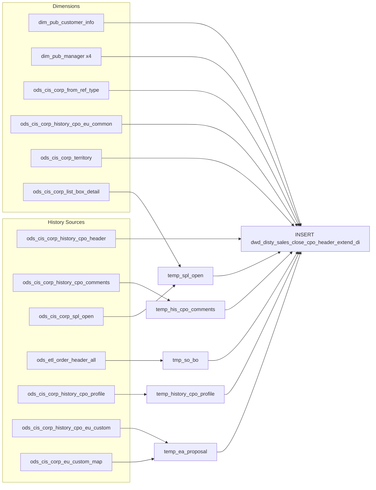

# DWD: Closed CPO Header — Extended Daily (`dwd_disty_sales_close_cpo_header_extend_di`)

- artifact_type: etl_table
- artifact_id: dw_us.dwd_disty_sales_close_cpo_header_extend_di
- domain: cpo
- one_line_purpose: This job builds the **extended closed CPO (Customer Purchase Order) header dataset** by reading settled/archived CPO headers from history tables and enriching each record with resolved user names, opportunity pipeline data, end-user informa...
- layer_type: DWD
- source_kind: etl_sql
- evidence_source: source/etl/sql/csource/etl/sql/po/source/etl/flows/public_order_tools/ingest/public_cpo_dw/script/dwd_disty_sales_close_cpo_header_extend_di.sql

---

## L1 Data Foundation

### Identity and physical mapping
- **Table:** `dw_us.dwd_disty_sales_close_cpo_header_extend_di`
- **Layer type:** DWD
- **Canonical / derived:** Derived / ETL-loaded (see L3)
- **Owner team:** not registered in metadata catalog

### Grain, scope, exclusions
- **Grain:** one row per `(cpo_id, date_flag)` — a unique closed CPO on a given transaction date.
- **Scope:** See L2 business purpose / L3 filters
- **Partition:** `date_flag` = `to_date(ch.trans_datetime)` — the calendar date the CPO transaction was recorded. - resolved from pipeline (see L4)
- **Natural key:** `cpo_id` within a `date_flag` partition.
- **Exclusions:** Not documented in repository

#### Grain detail (preserved)

- **Grain:** one row per `(cpo_id, date_flag)` — a unique closed CPO on a given transaction date.
- **Partition:** `date_flag` = `to_date(ch.trans_datetime)` — the calendar date the CPO transaction was recorded.
- **Natural key:** `cpo_id` within a `date_flag` partition.

---

### Cross-engine presence
| Engine | Present | Canonical FQN | Notes |
|--------|---------|---------------|-------|
| Hive | yes | `dwd_disty_sales_close_cpo_header_extend_di` | ETL target / intermediate per evidence script |
| Vertica | pending | `dwd_disty_sales_close_cpo_header_extend_di` | Confirm via hive2vertica flow evidence / MCP |

### Physical schema reference

Pointer block only - full column catalog lives in WKB L1 storage JSON.

| Field | Value |
|-------|-------|
| **Authoritative catalog** | WKB L1 storage seed (not duplicated in this file) |
| **entity_id** | `dw_us.dwd_disty_sales_close_cpo_header_extend_di` |
| **l1_catalog_seed** | `target/storage/wkb/snapshots/_snapshot_id_template/l1_catalog/{engine}_{schema}_{table}.json` |
| **column_count** | pending (run ddl_seed_writer) |
| **partition_keys** | `date_flag, to_date(ch.trans_datetime)` |
| **ddl_source** | pending Bitbucket DDL / Vertica metadata ingest |
| **retrieval** | `python -m tools.wkb.indexing.run_query --query "cpo dwd_disty_sales_close_cpo_header_extend_di schema" --intent find_table_schema` |

### Lineage
| Object | Role |
|--------|------|
| `ods_${country_code}.ods_cis_corp_history_cpo_header` | Primary source — closed CPO headers |
| `ods_${country_code}.ods_cis_corp_history_cpo_comments` | Comments — CC/OX/EX per CPO |
| `ods_${country_code}.ods_cis_corp_spl_open` | Pipeline/opportunity data |
| `ods_${country_code}.ods_cis_corp_list_box_detail` | Reason code descriptions |
| `ods_${country_code}.ods_etl_order_header_all` | SO/BO order linkage |
| `ods_${country_code}.ods_cis_corp_history_cpo_profile` | Contract no and workflow request ID |
| `ods_${country_code}.ods_cis_corp_eu_custom_map` | EA proposal map type lookup |
| `ods_${country_code}.ods_cis_corp_history_cpo_eu_custom` | EA proposal ID |
| `dim_${country_code}.dim_pub_customer_info` | Customer name |
| `dim_${country_code}.dim_pub_manager` | User name resolution (×4) |
| `ods_${country_code}.ods_cis_corp_from_ref_type` | From-ref-type description |
| `ods_${country_code}.ods_cis_corp_history_cpo_eu_common` | End-user common info |
| `ods_${country_code}.ods_cis_corp_territory` | Territory name |
| `dw_${country_code}.dwd_disty_sales_close_cpo_header_extend_di` | **Target** — enriched closed CPO headers |

---

### Freshness and load path
| Item | Value |
|------|-------|
| Load pattern | See L3 end-to-end / INSERT pattern in evidence script |
| Schedule | Not documented in repository |
| Parameters | `country_code`, `start_date`, `end_date` |


---

## L2 Declarative Knowledge

### Business purpose
This job builds the **extended closed CPO (Customer Purchase Order) header dataset** by reading settled/archived CPO headers from history tables and enriching each record with resolved user names, opportunity pipeline data, end-user information, territory hierarchy, linked sales/backorder numbers, contract references, and EA proposal IDs. The target table is the canonical analytical view of closed CPO headers for a given transaction date range, partitioned by the CPO's transaction date.

---

### Audience and use cases
| Audience | How they benefit |
|----------|-----------------|
| **Sales / pipeline management** | `opportunity_id`, `probability`, `close_date`, `reason_code`, `reason_code_desc` — funnel and win/loss analysis on closed CPOs. |
| **Account management** | `cpo_cust_name`, `cpo_terr_name`, `cpo_sales_terr` — customer and territory context for closed deals. |
| **Operations / fulfilment** | `so`, `bo` — which sales orders and backorders were generated from each closed CPO. |
| **Vendor / channel** | `cpo_from_ref_type_desc`, `system_type`, `sales_model`, `cpo_spa_type`, `cpo_swl_flag` — channel and SPA classification. |
| **Finance** | `cpo_total_taxable`, `cpo_total_notax`, `cpo_sales_tax`, `cpo_freight`, `cpo_so_total`, `cpo_bo_total`, `po_total` — CPO financial totals. |
| **Audit / compliance** | `cpo_comment`, `cpo_delete_reason`, `ec_comment`, `contract_no`, `wf_request_id`, `ea_proposal_id` — audit trail for closed CPOs. |

---

### Fact key resolution
- Natural key: `cpo_id` within a `date_flag` partition.
- FK / label-on attributes: see L3 dimension join patterns and step-by-step logic.
- Negative assertion: do not treat descriptive labels as grain keys unless listed under natural key.

### Time field semantics
- **date_flag / partition columns:** `date_flag` = `to_date(ch.trans_datetime)` — the calendar date the CPO transaction was recorded.
- Primary reporting filter should use the partition column(s) documented in L1; resolve values via L4.


### Metrics served

| Category | Column | Logical metric | Business reading |
|----------|--------|----------------|------------------|
| Measures | — | — | No measure columns mapped for this table. |

### Metric serving map

**Formula authority:** [`source/contracts/cpo/metric-index.md`](../../source/contracts/cpo/metric-index.md)

N/A — no measure columns mapped for this table.

### etl_metrics

No governed logical metrics from `source/contracts/cpo/metric-index.md` are mapped on this table.

---

### Metric serving map
N/A - not a `*_comb_mtd` / multi-period wide serving table (or map not present in legacy doc).


### Data products and column groups (preserved)

### Identifiers

- `cpo_id`, `cpo_no` — CPO system identifiers
- `cpo_cust_no`, `cpo_cust_name` — customer number and resolved name
- `reseller_cust_no`, `end_user_no` — reseller and end-user account numbers
- `company_no` — company identifier

### Pipeline / opportunity

- `opportunity_id`, `probability` — CRM opportunity linkage and win probability
- `close_date`, `reason_code`, `reason_code_desc`, `reason_code_other` — close outcome
- `int_ref_type`, `budgetary`, `hide_flag`, `primary_flag` — opportunity classification flags
- `so`, `bo` — comma-delimited sales order and backorder numbers generated from this CPO

### User names (resolved from manager dimension)

- `cpo_entry_name` — user who created the CPO
- `convert_user_name` — user who converted the CPO
- `cpo_change_name` — user who last changed the CPO
- `cpo_delete_name` — user who deleted/closed the CPO

### Channel / ordering attributes

- `cpo_from_ref_type`, `cpo_from_ref_type_desc`, `system_type` — how the CPO originated
- `sales_model`, `shopping_mode`, `cpo_spa_type`, `cpo_swl_flag` — channel and SPA flags

### End-user (EU) attributes

- `eu_company_name`, `eu_loc_name`, `eu_loc_address1/2`, `eu_loc_city/state/country/zipcode`
- `eu_contact_email`, `eu_contact_phone`, `eu_loc_contact`, `eu_type`
- `res_contact`, `res_contact_email`, `res_contact_phone` — reseller contact

### References and audit

- `contract_no`, `wf_request_id`, `ea_proposal_id` — contract and workflow linkage
- `cpo_comment`, `cpo_delete_reason`, `ec_comment` — semicolon-delimited comment text
- `last_update_comb` = `GREATEST(cpo_entry_datetime, cpo_change_date, last_update_comb from SPL, entry_datetime from EU common)` — latest update across all sources
- `etl_timestamp` — run time (Los Angeles timezone)

---

### etl_metrics

#### `last_update_comb`
- **Source:** [metric-index.md](../../source/contracts/cpo/metric-index.md#last_update_comb)
- **Business definition:** The latest modification timestamp across all contributing sources.
```sql
GREATEST(cpo_entry_datetime, cpo_change_date, spl.last_update_comb, eu_common.entry_datetime)
```

#### `etl_timestamp`
- **Source:** [metric-index.md](../../source/contracts/cpo/metric-index.md#etl_timestamp)
- **Business definition:** ETL run time in Pacific timezone.
```sql
from_utc_timestamp(current_timestamp(), 'America/Los_Angeles')
```


---

## L3 Procedural Knowledge

### Query and routing rules
**Business filters:** Use partition / date keys from L1 grain for reporting scope.
**Technical predicates (load only):** See Key filters and step-by-step logic below.

### Dimension join patterns
| Dimension FQN | Join keys | Purpose | Evidence |
|---------------|-----------|---------|----------|
| See step-by-step / base tables | See L3 steps | Dimension enrichment | `source/etl/sql/csource/etl/sql/po/source/etl/flows/public_order_tools/ingest/public_cpo_dw/script/dwd_disty_sales_close_cpo_header_extend_di.sql` |

### Key filters and ETL business logic
### Step 1 — `temp_his_cpo_comments`

**Source:** `ods_cis_corp_history_cpo_comments` grouped by `(cpo_id, cpo_comment_type)`

**Logic:** For each comment type, concatenates all comment text using `collect_set` then `concat_ws(';')`. Then outer-aggregates per `cpo_id` taking `MAX` of each comment type column.

| Output column | Comment type | Meaning |
|---------------|-------------|---------|
| `cpo_comment` | `'CC'` | Customer-facing comment |
| `cpo_delete_reason` | `'OX'` | Reason the CPO was deleted/closed |
| `ec_comment` | `'EX'` | EC (enterprise channel) comment |

---

### Step 2 — `temp_spl_open` (view)

**Source:** `ods_cis_corp_spl_open` LEFT JOIN `ods_cis_corp_list_box_detail` (on `reason_code = code_value AND list_box_code = 'SPLC'`)

**De-duplication:** `ROW_NUMBER() OVER (PARTITION BY int_ref_no ORDER BY entry_datetime DESC)` — most recent SPL entry per CPO wins. Filter `rn = 1`.

**Key columns:** `opportunity_id`, `probability`, `close_date`, `reason_code`, `reason_code_desc`, `reason_code_other`, `int_ref_type`, `budgetary`, `hide_flag`, `primary_flag`, `last_update_comb`

---

### Step 3 — `tmp_so_bo` (view)

**Source:** `ods_etl_order_header_all` WHERE `order_type IN (1, 8)` AND `int_ref_type <> 2`

**Logic:** Groups by `(int_ref_no, order_type)` collecting all order numbers. Outer-aggregates per `cpo_id` using `MAX`:
- `so` = comma-delimited order_type=1 order numbers
- `bo` = comma-delimited order_type=8 order numbers

---

### Step 4 — `temp_history_cpo...

### Standard time-filter SQL
```sql
-- relative period filter using resolved partition value (see L4)
SELECT *
FROM dwd_disty_sales_close_cpo_header_extend_di
WHERE /* partition predicate */ date_flag = '${partition_value}';
```

### End-to-end flow
**Runtime parameters:** `country_code`, `start_date`, `end_date`
**Target table:** `dw_${country_code}.dwd_disty_sales_close_cpo_header_extend_di`, partitioned by **`date_flag`**.

1. Build `temp_his_cpo_comments`: aggregate CC/OX/EX comment types per CPO from `ods_cis_corp_history_cpo_comments`.
2. Build `temp_spl_open` view: read pipeline data, resolve `reason_code` desc, de-duplicate to latest entry per CPO.
3. Build `tmp_so_bo` view: collect SO (type 1) and BO (type 8) order numbers per CPO from `ods_etl_order_header_all`.
4. Build `temp_history_cpo_profile`: extract `contract_no` and `wf_request_id` from `ods_cis_corp_history_cpo_profile`.
5. Build `temp_eu_map` view: get EAPI map IDs from `ods_cis_corp_eu_custom_map`.
6. Build `temp_ea_proposal` view: resolve `ea_proposal_id` per CPO.
7. **INSERT OVERWRITE** into `dwd_disty_sales_close_cpo_header_extend_di`: join `ods_cis_corp_history_cpo_header` to customer info, four manager lookups, from-ref-type, EU common, territory, SPL, comments, SO/BO, profile, and EA proposal.



---


#### High-level stages (preserved)

| Stage | Business meaning |
|-------|-----------------|
| **CPO comments** | Aggregates CC (customer comments), OX (delete reasons), and EX (EC comments) per CPO from history comment table into semicolon-delimited strings. |
| **SPL open data** | Reads pipeline/opportunity data (`ods_cis_corp_spl_open`) — opportunity ID, probability, close date, reason codes. De-duplicates by taking the most recent entry per CPO. |
| **SO / BO linkage** | Resolves which sales orders (type 1) and backorders (type 8) were generated from each CPO via `ods_etl_order_header_all`. |
| **CPO profile** | Extracts contract number (`CONTRNO`) and workflow request ID (`QUOTREQID`) per CPO from history CPO profile. |
| **EA proposal** | Resolves the EA proposal ID from `ods_cis_corp_history_cpo_eu_custom` via EU custom map (`EAPI` map type). |
| **Final INSERT** | Joins the enriched CPO header to customer name, four manager lookups (entry/convert/change/delete user names), from-ref-type description, end-user common info, territory name, and all temp tables. |

**Parameters:** `country_code`, `start_date`, `end_date`

---


### Base tables register
| Object | Role in this job |
|--------|-----------------|
| `ods_${country_code}.ods_cis_corp_history_cpo_header` | **Primary source.** Closed/settled CPO headers. Filtered to `trans_datetime` in `[start_date, end_date)`. |
| `ods_${country_code}.ods_cis_corp_history_cpo_comments` | CPO-level comments: CC (customer), OX (delete reason), EX (EC) — aggregated with `collect_set` + `concat_ws(';')`. |
| `ods_${country_code}.ods_cis_corp_spl_open` | Pipeline/opportunity data — opportunity ID, probability, close date, reason code. De-duplicated to latest entry per CPO. |
| `ods_${country_code}.ods_cis_corp_list_box_detail` | Reason code description lookup (`list_box_code = 'SPLC'`). |
| `ods_${country_code}.ods_etl_order_header_all` | SO (order_type=1) and BO (order_type=8) order numbers linked to this CPO via `int_ref_no`. |
| `ods_${country_code}.ods_cis_corp_history_cpo_profile` | CPO-level profile — `CONTRNO` (contract number) and `QUOTREQID` (workflow request ID). |
| `ods_${country_code}.ods_cis_corp_eu_custom_map` | EU custom map — filtered to `map_data_desc = 'EAPI'` for EA proposal lookup. |
| `ods_${country_code}.ods_cis_corp_history_cpo_eu_custom` | EA proposal ID (`data_c`) per CPO. |
| `dim_${country_code}.dim_pub_customer_info` | Customer name (`cust_name`) by `cust_no`. |
| `dim_${country_code}.dim_pub_manager` | User name (`name`) by `userid` — joined 4× for entry, convert, change, delete user names. |
| `ods_${country_code}.ods_cis_corp_from_ref_type` | From-ref-type description and system type. |
| `ods_${country_code}.ods_cis_corp_history_cpo_eu_common` | End-user common info — joined where `cpo_line_seq = 0` (header-level EU). |
| `ods_${country_code}.ods_cis_corp_territory` | Territory name (`terr_name`) by `sales_terr`. |

**Temporary tables (inside the job only):**
`temp_his_cpo_comments` → `temp_spl_open` → `tmp_so_bo` → `temp_history_cpo_profile` → `temp_eu_map` → `temp_ea_proposal` → (final INSERT)

---

### Step-by-step logic
### Step 1 — `temp_his_cpo_comments`

**Source:** `ods_cis_corp_history_cpo_comments` grouped by `(cpo_id, cpo_comment_type)`

**Logic:** For each comment type, concatenates all comment text using `collect_set` then `concat_ws(';')`. Then outer-aggregates per `cpo_id` taking `MAX` of each comment type column.

| Output column | Comment type | Meaning |
|---------------|-------------|---------|
| `cpo_comment` | `'CC'` | Customer-facing comment |
| `cpo_delete_reason` | `'OX'` | Reason the CPO was deleted/closed |
| `ec_comment` | `'EX'` | EC (enterprise channel) comment |

---

### Step 2 — `temp_spl_open` (view)

**Source:** `ods_cis_corp_spl_open` LEFT JOIN `ods_cis_corp_list_box_detail` (on `reason_code = code_value AND list_box_code = 'SPLC'`)

**De-duplication:** `ROW_NUMBER() OVER (PARTITION BY int_ref_no ORDER BY entry_datetime DESC)` — most recent SPL entry per CPO wins. Filter `rn = 1`.

**Key columns:** `opportunity_id`, `probability`, `close_date`, `reason_code`, `reason_code_desc`, `reason_code_other`, `int_ref_type`, `budgetary`, `hide_flag`, `primary_flag`, `last_update_comb`

---

### Step 3 — `tmp_so_bo` (view)

**Source:** `ods_etl_order_header_all` WHERE `order_type IN (1, 8)` AND `int_ref_type <> 2`

**Logic:** Groups by `(int_ref_no, order_type)` collecting all order numbers. Outer-aggregates per `cpo_id` using `MAX`:
- `so` = comma-delimited order_type=1 order numbers
- `bo` = comma-delimited order_type=8 order numbers

---

### Step 4 — `temp_history_cpo_profile`

**Source:** `ods_cis_corp_history_cpo_profile` WHERE `profile_type IN ('CONTRNO', 'QUOTREQID')`

**Logic:** Pivots profile rows into columns per `cpo_id`:
- `contract_no` = `profile_i` where `profile_type = 'CONTRNO'` and `profile_cat = 'CPOL'`
- `wf_request_id` = `profile_c` where `profile_type = 'QUOTREQID'` and `profile_cat = 'WFL'`

---

### Steps 5–6 — `temp_eu_map` / `temp_ea_proposal` (views)

`temp_eu_map`: filters `ods_cis_corp_eu_custom_map` to `map_data_desc = 'EAPI'` — identifies the EA (Enterprise Agreement) proposal map IDs.

`temp_ea_proposal`: joins `ods_cis_corp_history_cpo_eu_custom` to `temp_eu_map` on `eu_map_id + eu_map_line_no` — returns `data_c` as `ea_proposal_id` per CPO.

---

### Step 7 — Final `INSERT OVERWRITE` into `dwd_disty_sales_close_cpo_header_extend_di`

**From:** `ods_cis_corp_history_cpo_header` (`ch`)

**Filter:** `ch.trans_datetime >= '${start_date}' AND ch.trans_datetime < '${end_date}'`

**Left joins:**

| Join | Keys | Purpose |
|------|------|---------|
| `dim_pub_customer_info` | `cpo_cust_no = cust_no` | Resolves `cpo_cust_name` |
| `dim_pub_manager` (pm) | `cpo_entry_id = userid` | Resolves `cpo_entry_name` |
| `ods_cis_corp_from_ref_type` | `cpo_from_ref_type` | Adds `cpo_from_ref_type_desc`, `system_type` |
| `dim_pub_manager` (pm1) | `convert_user = userid` | Resolves `convert_user_name` |
| `dim_pub_manager` (pm2) | `cpo_change_id = userid` | Resolves `cpo_change_name` |
| `dim_pub_manager` (pm3) | `cpo_delete_id = userid` | Resolves `cpo_delete_name` |
| `temp_spl_open` | `cpo_id = int_ref_no` | Adds pipeline/opportunity data |
| `temp_his_cpo_comments` | `cpo_id` | Adds comment text |
| `ods_cis_corp_history_cpo_eu_common` | `cpo_id` AND `cpo_line_seq = 0` | Adds EU (end-user) company/address info (header-level only) |
| `ods_cis_corp_territory` | `cpo_sales_terr = sales_terr` | Adds `cpo_terr_name` |
| `tmp_so_bo` | `cpo_id` | Adds linked `so` and `bo` lists |
| `temp_history_cpo_profile` | `cpo_id` | Adds `contract_no`, `wf_request_id` |
| `temp_ea_proposal` | `cpo_id` | Adds `ea_proposal_id` |

**Derived columns:**

| Column | Formula | Plain language |
|--------|---------|----------------|
| `date_flag` | `to_date(ch.trans_datetime)` | Calendar date of the CPO transaction — used as partition key. |
| `last_update_comb` | `GREATEST(cpo_entry_datetime, cpo_change_date, spl.last_update_comb, eu_common.entry_datetime)` | The latest modification timestamp across all contributing sources. |
| `etl_timestamp` | `from_utc_timestamp(current_timestamp(), 'America/Los_Angeles')` | ETL run time in Pacific timezone. |

---

### Relationship map (embedded)

| from_fqn | to_fqn | cardinality | join_keys | provenance |
|----------|--------|-------------|-----------|------------|
| `ods_${country_code}.ods_cis_corp_spl_open` | `ods_${country_code}.ods_cis_corp_list_box_detail` | many:1 | `so.reason_code = lbd.code_value AND lbd.list_box_code = 'SPLC' )t` | etl_sql (source/etl/sql/cpo/public_order_scripts/public_cpo_dw/script/dwd_disty_sales_close_cpo_header_extend_di.sql:1) |
| `ods_${country_code}.ods_cis_corp_history_cpo_eu_custom` | `temp_eu_map` | many:1 | `ec.eu_map_id=em.eu_map_id and ec.eu_map_line_no=em.eu_map_line_no; --6 get cust_name、convert_user_name、cpo_change_name etc` | etl_sql (source/etl/sql/cpo/public_order_scripts/public_cpo_dw/script/dwd_disty_sales_close_cpo_header_extend_di.sql:1) |
| `ods_${country_code}.ods_cis_corp_history_cpo_header` | `dim_${country_code}.dim_pub_customer_info` | many:1 | `ch.cpo_cust_no=pci.cust_no` | etl_sql (source/etl/sql/cpo/public_order_scripts/public_cpo_dw/script/dwd_disty_sales_close_cpo_header_extend_di.sql:1) |
| `ods_${country_code}.ods_cis_corp_history_cpo_header` | `dim_${country_code}.dim_pub_manager` | many:1 | `ch.cpo_entry_id=pm.userid` | etl_sql (source/etl/sql/cpo/public_order_scripts/public_cpo_dw/script/dwd_disty_sales_close_cpo_header_extend_di.sql:1) |
| `ods_${country_code}.ods_cis_corp_history_cpo_header` | `ods_${country_code}.ods_cis_corp_from_ref_type` | many:1 | `ch.cpo_from_ref_type=frt.from_ref_type` | etl_sql (source/etl/sql/cpo/public_order_scripts/public_cpo_dw/script/dwd_disty_sales_close_cpo_header_extend_di.sql:1) |
| `ods_${country_code}.ods_cis_corp_history_cpo_header` | `dim_${country_code}.dim_pub_manager` | many:1 | `ch.convert_user=pm1.userid` | etl_sql (source/etl/sql/cpo/public_order_scripts/public_cpo_dw/script/dwd_disty_sales_close_cpo_header_extend_di.sql:1) |
| `ods_${country_code}.ods_cis_corp_history_cpo_header` | `dim_${country_code}.dim_pub_manager` | many:1 | `ch.cpo_change_id=pm2.userid` | etl_sql (source/etl/sql/cpo/public_order_scripts/public_cpo_dw/script/dwd_disty_sales_close_cpo_header_extend_di.sql:1) |
| `ods_${country_code}.ods_cis_corp_history_cpo_header` | `dim_${country_code}.dim_pub_manager` | many:1 | `ch.cpo_delete_id=pm3.userid` | etl_sql (source/etl/sql/cpo/public_order_scripts/public_cpo_dw/script/dwd_disty_sales_close_cpo_header_extend_di.sql:1) |
| `ods_${country_code}.ods_cis_corp_history_cpo_header` | `temp_spl_open` | many:1 | `ch.cpo_id=so.int_ref_no` | etl_sql (source/etl/sql/cpo/public_order_scripts/public_cpo_dw/script/dwd_disty_sales_close_cpo_header_extend_di.sql:1) |
| `ods_${country_code}.ods_cis_corp_history_cpo_header` | `temp_his_cpo_comments` | many:1 | `ch.cpo_id=tcc.cpo_id` | etl_sql (source/etl/sql/cpo/public_order_scripts/public_cpo_dw/script/dwd_disty_sales_close_cpo_header_extend_di.sql:1) |
| `ods_${country_code}.ods_cis_corp_history_cpo_header` | `ods_${country_code}.ods_cis_corp_history_cpo_eu_common` | many:1 | `ch.cpo_id=cec.cpo_id and cec.cpo_line_seq=0` | etl_sql (source/etl/sql/cpo/public_order_scripts/public_cpo_dw/script/dwd_disty_sales_close_cpo_header_extend_di.sql:1) |
| `ods_${country_code}.ods_cis_corp_history_cpo_header` | `ods_${country_code}.ods_cis_corp_territory` | many:1 | `ch.cpo_sales_terr=ter.sales_terr` | etl_sql (source/etl/sql/cpo/public_order_scripts/public_cpo_dw/script/dwd_disty_sales_close_cpo_header_extend_di.sql:1) |
| `ods_${country_code}.ods_cis_corp_history_cpo_header` | `tmp_so_bo` | many:1 | `ch.cpo_id=tsb.cpo_id` | etl_sql (source/etl/sql/cpo/public_order_scripts/public_cpo_dw/script/dwd_disty_sales_close_cpo_header_extend_di.sql:1) |
| `ods_${country_code}.ods_cis_corp_history_cpo_header` | `temp_history_cpo_profile` | many:1 | `ch.cpo_id=cp.cpo_id` | etl_sql (source/etl/sql/cpo/public_order_scripts/public_cpo_dw/script/dwd_disty_sales_close_cpo_header_extend_di.sql:1) |
| `ods_${country_code}.ods_cis_corp_history_cpo_header` | `temp_ea_proposal` | many:1 | `ch.cpo_id=ep.cpo_id` | etl_sql (source/etl/sql/cpo/public_order_scripts/public_cpo_dw/script/dwd_disty_sales_close_cpo_header_extend_di.sql:1) |

`source/ref/cpo/table relationship.txt`: Not documented in repository.

### Special logic (embedded)

Not documented in repository

### Column / field derivations (from ETL SQL)

| target_column | expression_sql | upstream_columns | upstream_tables | transform_kind | evidence |
|---------------|----------------|------------------|-----------------|----------------|----------|
| `cpo_id` | `ch.cpo_id` | `cpo_id` | `ods_${country_code}.ods_cis_corp_history_cpo_header`, `dim_${country_code}.dim_pub_customer_info`, `dim_${country_code}.dim_pub_manager`, `ods_${country_code}.ods_cis_corp_from_ref_type`, `temp_spl_open`, `temp_his_cpo_comments`, `ods_${country_code}.ods_cis_corp_history_cpo_eu_common`, `ods_${country_code}.ods_cis_corp_territory`, `tmp_so_bo`, `temp_history_cpo_profile`, `temp_ea_proposal` | passthrough | `source/etl/sql/cpo/public_order_scripts/public_cpo_dw/script/dwd_disty_sales_close_cpo_header_extend_di.sql:125` |
| `cpo_no` | `ch.cpo_no` | `cpo_no` | `ods_${country_code}.ods_cis_corp_history_cpo_header`, `dim_${country_code}.dim_pub_customer_info`, `dim_${country_code}.dim_pub_manager`, `ods_${country_code}.ods_cis_corp_from_ref_type`, `temp_spl_open`, `temp_his_cpo_comments`, `ods_${country_code}.ods_cis_corp_history_cpo_eu_common`, `ods_${country_code}.ods_cis_corp_territory`, `tmp_so_bo`, `temp_history_cpo_profile`, `temp_ea_proposal` | passthrough | `source/etl/sql/cpo/public_order_scripts/public_cpo_dw/script/dwd_disty_sales_close_cpo_header_extend_di.sql:126` |
| `cpo_cust_no` | `ch.cpo_cust_no` | `cpo_cust_no` | `ods_${country_code}.ods_cis_corp_history_cpo_header`, `dim_${country_code}.dim_pub_customer_info`, `dim_${country_code}.dim_pub_manager`, `ods_${country_code}.ods_cis_corp_from_ref_type`, `temp_spl_open`, `temp_his_cpo_comments`, `ods_${country_code}.ods_cis_corp_history_cpo_eu_common`, `ods_${country_code}.ods_cis_corp_territory`, `tmp_so_bo`, `temp_history_cpo_profile`, `temp_ea_proposal` | passthrough | `source/etl/sql/cpo/public_order_scripts/public_cpo_dw/script/dwd_disty_sales_close_cpo_header_extend_di.sql:127` |
| `cpo_cust_name` | `pci.cust_name cpo_cust_name` | `cust_name`, `cpo_cust_name` | `ods_${country_code}.ods_cis_corp_history_cpo_header`, `dim_${country_code}.dim_pub_customer_info`, `dim_${country_code}.dim_pub_manager`, `ods_${country_code}.ods_cis_corp_from_ref_type`, `temp_spl_open`, `temp_his_cpo_comments`, `ods_${country_code}.ods_cis_corp_history_cpo_eu_common`, `ods_${country_code}.ods_cis_corp_territory`, `tmp_so_bo`, `temp_history_cpo_profile`, `temp_ea_proposal` | partial | `source/etl/sql/cpo/public_order_scripts/public_cpo_dw/script/dwd_disty_sales_close_cpo_header_extend_di.sql:128` |
| `cpo_sales_terr` | `ch.cpo_sales_terr` | `cpo_sales_terr` | `ods_${country_code}.ods_cis_corp_history_cpo_header`, `dim_${country_code}.dim_pub_customer_info`, `dim_${country_code}.dim_pub_manager`, `ods_${country_code}.ods_cis_corp_from_ref_type`, `temp_spl_open`, `temp_his_cpo_comments`, `ods_${country_code}.ods_cis_corp_history_cpo_eu_common`, `ods_${country_code}.ods_cis_corp_territory`, `tmp_so_bo`, `temp_history_cpo_profile`, `temp_ea_proposal` | passthrough | `source/etl/sql/cpo/public_order_scripts/public_cpo_dw/script/dwd_disty_sales_close_cpo_header_extend_di.sql:129` |
| `cpo_entry_id` | `ch.cpo_entry_id` | `cpo_entry_id` | `ods_${country_code}.ods_cis_corp_history_cpo_header`, `dim_${country_code}.dim_pub_customer_info`, `dim_${country_code}.dim_pub_manager`, `ods_${country_code}.ods_cis_corp_from_ref_type`, `temp_spl_open`, `temp_his_cpo_comments`, `ods_${country_code}.ods_cis_corp_history_cpo_eu_common`, `ods_${country_code}.ods_cis_corp_territory`, `tmp_so_bo`, `temp_history_cpo_profile`, `temp_ea_proposal` | passthrough | `source/etl/sql/cpo/public_order_scripts/public_cpo_dw/script/dwd_disty_sales_close_cpo_header_extend_di.sql:130` |
| `cpo_entry_name` | `pm.name` | `name` | `ods_${country_code}.ods_cis_corp_history_cpo_header`, `dim_${country_code}.dim_pub_customer_info`, `dim_${country_code}.dim_pub_manager`, `ods_${country_code}.ods_cis_corp_from_ref_type`, `temp_spl_open`, `temp_his_cpo_comments`, `ods_${country_code}.ods_cis_corp_history_cpo_eu_common`, `ods_${country_code}.ods_cis_corp_territory`, `tmp_so_bo`, `temp_history_cpo_profile`, `temp_ea_proposal` | rename | `source/etl/sql/cpo/public_order_scripts/public_cpo_dw/script/dwd_disty_sales_close_cpo_header_extend_di.sql:131` |
| `cpo_entry_datetime` | `ch.cpo_entry_datetime` | `cpo_entry_datetime` | `ods_${country_code}.ods_cis_corp_history_cpo_header`, `dim_${country_code}.dim_pub_customer_info`, `dim_${country_code}.dim_pub_manager`, `ods_${country_code}.ods_cis_corp_from_ref_type`, `temp_spl_open`, `temp_his_cpo_comments`, `ods_${country_code}.ods_cis_corp_history_cpo_eu_common`, `ods_${country_code}.ods_cis_corp_territory`, `tmp_so_bo`, `temp_history_cpo_profile`, `temp_ea_proposal` | passthrough | `source/etl/sql/cpo/public_order_scripts/public_cpo_dw/script/dwd_disty_sales_close_cpo_header_extend_di.sql:132` |
| `cpo_from_ref_type` | `ch.cpo_from_ref_type` | `cpo_from_ref_type` | `ods_${country_code}.ods_cis_corp_history_cpo_header`, `dim_${country_code}.dim_pub_customer_info`, `dim_${country_code}.dim_pub_manager`, `ods_${country_code}.ods_cis_corp_from_ref_type`, `temp_spl_open`, `temp_his_cpo_comments`, `ods_${country_code}.ods_cis_corp_history_cpo_eu_common`, `ods_${country_code}.ods_cis_corp_territory`, `tmp_so_bo`, `temp_history_cpo_profile`, `temp_ea_proposal` | passthrough | `source/etl/sql/cpo/public_order_scripts/public_cpo_dw/script/dwd_disty_sales_close_cpo_header_extend_di.sql:133` |
| `cpo_from_ref_type_desc` | `frt.from_ref_type_desc` | `from_ref_type_desc` | `ods_${country_code}.ods_cis_corp_history_cpo_header`, `dim_${country_code}.dim_pub_customer_info`, `dim_${country_code}.dim_pub_manager`, `ods_${country_code}.ods_cis_corp_from_ref_type`, `temp_spl_open`, `temp_his_cpo_comments`, `ods_${country_code}.ods_cis_corp_history_cpo_eu_common`, `ods_${country_code}.ods_cis_corp_territory`, `tmp_so_bo`, `temp_history_cpo_profile`, `temp_ea_proposal` | rename | `source/etl/sql/cpo/public_order_scripts/public_cpo_dw/script/dwd_disty_sales_close_cpo_header_extend_di.sql:134` |
| `system_type` | `frt.system_type` | `system_type` | `ods_${country_code}.ods_cis_corp_history_cpo_header`, `dim_${country_code}.dim_pub_customer_info`, `dim_${country_code}.dim_pub_manager`, `ods_${country_code}.ods_cis_corp_from_ref_type`, `temp_spl_open`, `temp_his_cpo_comments`, `ods_${country_code}.ods_cis_corp_history_cpo_eu_common`, `ods_${country_code}.ods_cis_corp_territory`, `tmp_so_bo`, `temp_history_cpo_profile`, `temp_ea_proposal` | passthrough | `source/etl/sql/cpo/public_order_scripts/public_cpo_dw/script/dwd_disty_sales_close_cpo_header_extend_di.sql:135` |
| `cpo_pay_meth` | `ch.cpo_pay_meth` | `cpo_pay_meth` | `ods_${country_code}.ods_cis_corp_history_cpo_header`, `dim_${country_code}.dim_pub_customer_info`, `dim_${country_code}.dim_pub_manager`, `ods_${country_code}.ods_cis_corp_from_ref_type`, `temp_spl_open`, `temp_his_cpo_comments`, `ods_${country_code}.ods_cis_corp_history_cpo_eu_common`, `ods_${country_code}.ods_cis_corp_territory`, `tmp_so_bo`, `temp_history_cpo_profile`, `temp_ea_proposal` | passthrough | `source/etl/sql/cpo/public_order_scripts/public_cpo_dw/script/dwd_disty_sales_close_cpo_header_extend_di.sql:136` |
| `cpo_total_taxable` | `ch.cpo_total_taxable` | `cpo_total_taxable` | `ods_${country_code}.ods_cis_corp_history_cpo_header`, `dim_${country_code}.dim_pub_customer_info`, `dim_${country_code}.dim_pub_manager`, `ods_${country_code}.ods_cis_corp_from_ref_type`, `temp_spl_open`, `temp_his_cpo_comments`, `ods_${country_code}.ods_cis_corp_history_cpo_eu_common`, `ods_${country_code}.ods_cis_corp_territory`, `tmp_so_bo`, `temp_history_cpo_profile`, `temp_ea_proposal` | passthrough | `source/etl/sql/cpo/public_order_scripts/public_cpo_dw/script/dwd_disty_sales_close_cpo_header_extend_di.sql:137` |
| `cpo_total_notax` | `ch.cpo_total_notax` | `cpo_total_notax` | `ods_${country_code}.ods_cis_corp_history_cpo_header`, `dim_${country_code}.dim_pub_customer_info`, `dim_${country_code}.dim_pub_manager`, `ods_${country_code}.ods_cis_corp_from_ref_type`, `temp_spl_open`, `temp_his_cpo_comments`, `ods_${country_code}.ods_cis_corp_history_cpo_eu_common`, `ods_${country_code}.ods_cis_corp_territory`, `tmp_so_bo`, `temp_history_cpo_profile`, `temp_ea_proposal` | passthrough | `source/etl/sql/cpo/public_order_scripts/public_cpo_dw/script/dwd_disty_sales_close_cpo_header_extend_di.sql:138` |
| `cpo_sales_tax` | `ch.cpo_sales_tax` | `cpo_sales_tax` | `ods_${country_code}.ods_cis_corp_history_cpo_header`, `dim_${country_code}.dim_pub_customer_info`, `dim_${country_code}.dim_pub_manager`, `ods_${country_code}.ods_cis_corp_from_ref_type`, `temp_spl_open`, `temp_his_cpo_comments`, `ods_${country_code}.ods_cis_corp_history_cpo_eu_common`, `ods_${country_code}.ods_cis_corp_territory`, `tmp_so_bo`, `temp_history_cpo_profile`, `temp_ea_proposal` | passthrough | `source/etl/sql/cpo/public_order_scripts/public_cpo_dw/script/dwd_disty_sales_close_cpo_header_extend_di.sql:139` |
| `cpo_freight` | `ch.cpo_freight` | `cpo_freight` | `ods_${country_code}.ods_cis_corp_history_cpo_header`, `dim_${country_code}.dim_pub_customer_info`, `dim_${country_code}.dim_pub_manager`, `ods_${country_code}.ods_cis_corp_from_ref_type`, `temp_spl_open`, `temp_his_cpo_comments`, `ods_${country_code}.ods_cis_corp_history_cpo_eu_common`, `ods_${country_code}.ods_cis_corp_territory`, `tmp_so_bo`, `temp_history_cpo_profile`, `temp_ea_proposal` | passthrough | `source/etl/sql/cpo/public_order_scripts/public_cpo_dw/script/dwd_disty_sales_close_cpo_header_extend_di.sql:140` |
| `cpo_other` | `ch.cpo_other` | `cpo_other` | `ods_${country_code}.ods_cis_corp_history_cpo_header`, `dim_${country_code}.dim_pub_customer_info`, `dim_${country_code}.dim_pub_manager`, `ods_${country_code}.ods_cis_corp_from_ref_type`, `temp_spl_open`, `temp_his_cpo_comments`, `ods_${country_code}.ods_cis_corp_history_cpo_eu_common`, `ods_${country_code}.ods_cis_corp_territory`, `tmp_so_bo`, `temp_history_cpo_profile`, `temp_ea_proposal` | passthrough | `source/etl/sql/cpo/public_order_scripts/public_cpo_dw/script/dwd_disty_sales_close_cpo_header_extend_di.sql:141` |
| `cpo_so_total` | `ch.cpo_so_total` | `cpo_so_total` | `ods_${country_code}.ods_cis_corp_history_cpo_header`, `dim_${country_code}.dim_pub_customer_info`, `dim_${country_code}.dim_pub_manager`, `ods_${country_code}.ods_cis_corp_from_ref_type`, `temp_spl_open`, `temp_his_cpo_comments`, `ods_${country_code}.ods_cis_corp_history_cpo_eu_common`, `ods_${country_code}.ods_cis_corp_territory`, `tmp_so_bo`, `temp_history_cpo_profile`, `temp_ea_proposal` | passthrough | `source/etl/sql/cpo/public_order_scripts/public_cpo_dw/script/dwd_disty_sales_close_cpo_header_extend_di.sql:142` |
| `cpo_bo_total` | `ch.cpo_bo_total` | `cpo_bo_total` | `ods_${country_code}.ods_cis_corp_history_cpo_header`, `dim_${country_code}.dim_pub_customer_info`, `dim_${country_code}.dim_pub_manager`, `ods_${country_code}.ods_cis_corp_from_ref_type`, `temp_spl_open`, `temp_his_cpo_comments`, `ods_${country_code}.ods_cis_corp_history_cpo_eu_common`, `ods_${country_code}.ods_cis_corp_territory`, `tmp_so_bo`, `temp_history_cpo_profile`, `temp_ea_proposal` | passthrough | `source/etl/sql/cpo/public_order_scripts/public_cpo_dw/script/dwd_disty_sales_close_cpo_header_extend_di.sql:143` |
| `po_total` | `ch.po_total` | `po_total` | `ods_${country_code}.ods_cis_corp_history_cpo_header`, `dim_${country_code}.dim_pub_customer_info`, `dim_${country_code}.dim_pub_manager`, `ods_${country_code}.ods_cis_corp_from_ref_type`, `temp_spl_open`, `temp_his_cpo_comments`, `ods_${country_code}.ods_cis_corp_history_cpo_eu_common`, `ods_${country_code}.ods_cis_corp_territory`, `tmp_so_bo`, `temp_history_cpo_profile`, `temp_ea_proposal` | passthrough | `source/etl/sql/cpo/public_order_scripts/public_cpo_dw/script/dwd_disty_sales_close_cpo_header_extend_di.sql:144` |
| `cpo_ship_method` | `ch.cpo_ship_method` | `cpo_ship_method` | `ods_${country_code}.ods_cis_corp_history_cpo_header`, `dim_${country_code}.dim_pub_customer_info`, `dim_${country_code}.dim_pub_manager`, `ods_${country_code}.ods_cis_corp_from_ref_type`, `temp_spl_open`, `temp_his_cpo_comments`, `ods_${country_code}.ods_cis_corp_history_cpo_eu_common`, `ods_${country_code}.ods_cis_corp_territory`, `tmp_so_bo`, `temp_history_cpo_profile`, `temp_ea_proposal` | passthrough | `source/etl/sql/cpo/public_order_scripts/public_cpo_dw/script/dwd_disty_sales_close_cpo_header_extend_di.sql:145` |
| `cpo_ship_loc_type` | `ch.cpo_ship_loc_type` | `cpo_ship_loc_type` | `ods_${country_code}.ods_cis_corp_history_cpo_header`, `dim_${country_code}.dim_pub_customer_info`, `dim_${country_code}.dim_pub_manager`, `ods_${country_code}.ods_cis_corp_from_ref_type`, `temp_spl_open`, `temp_his_cpo_comments`, `ods_${country_code}.ods_cis_corp_history_cpo_eu_common`, `ods_${country_code}.ods_cis_corp_territory`, `tmp_so_bo`, `temp_history_cpo_profile`, `temp_ea_proposal` | passthrough | `source/etl/sql/cpo/public_order_scripts/public_cpo_dw/script/dwd_disty_sales_close_cpo_header_extend_di.sql:146` |
| `end_user_po_no` | `ch.end_user_po_no` | `end_user_po_no` | `ods_${country_code}.ods_cis_corp_history_cpo_header`, `dim_${country_code}.dim_pub_customer_info`, `dim_${country_code}.dim_pub_manager`, `ods_${country_code}.ods_cis_corp_from_ref_type`, `temp_spl_open`, `temp_his_cpo_comments`, `ods_${country_code}.ods_cis_corp_history_cpo_eu_common`, `ods_${country_code}.ods_cis_corp_territory`, `tmp_so_bo`, `temp_history_cpo_profile`, `temp_ea_proposal` | passthrough | `source/etl/sql/cpo/public_order_scripts/public_cpo_dw/script/dwd_disty_sales_close_cpo_header_extend_di.sql:147` |
| `special_handle` | `ch.special_handle` | `special_handle` | `ods_${country_code}.ods_cis_corp_history_cpo_header`, `dim_${country_code}.dim_pub_customer_info`, `dim_${country_code}.dim_pub_manager`, `ods_${country_code}.ods_cis_corp_from_ref_type`, `temp_spl_open`, `temp_his_cpo_comments`, `ods_${country_code}.ods_cis_corp_history_cpo_eu_common`, `ods_${country_code}.ods_cis_corp_territory`, `tmp_so_bo`, `temp_history_cpo_profile`, `temp_ea_proposal` | passthrough | `source/etl/sql/cpo/public_order_scripts/public_cpo_dw/script/dwd_disty_sales_close_cpo_header_extend_di.sql:148` |
| `ship_name1` | `ch.ship_name1` | `ship_name1` | `ods_${country_code}.ods_cis_corp_history_cpo_header`, `dim_${country_code}.dim_pub_customer_info`, `dim_${country_code}.dim_pub_manager`, `ods_${country_code}.ods_cis_corp_from_ref_type`, `temp_spl_open`, `temp_his_cpo_comments`, `ods_${country_code}.ods_cis_corp_history_cpo_eu_common`, `ods_${country_code}.ods_cis_corp_territory`, `tmp_so_bo`, `temp_history_cpo_profile`, `temp_ea_proposal` | passthrough | `source/etl/sql/cpo/public_order_scripts/public_cpo_dw/script/dwd_disty_sales_close_cpo_header_extend_di.sql:149` |
| `ship_addr1` | `ch.ship_addr1` | `ship_addr1` | `ods_${country_code}.ods_cis_corp_history_cpo_header`, `dim_${country_code}.dim_pub_customer_info`, `dim_${country_code}.dim_pub_manager`, `ods_${country_code}.ods_cis_corp_from_ref_type`, `temp_spl_open`, `temp_his_cpo_comments`, `ods_${country_code}.ods_cis_corp_history_cpo_eu_common`, `ods_${country_code}.ods_cis_corp_territory`, `tmp_so_bo`, `temp_history_cpo_profile`, `temp_ea_proposal` | passthrough | `source/etl/sql/cpo/public_order_scripts/public_cpo_dw/script/dwd_disty_sales_close_cpo_header_extend_di.sql:150` |
| `ship_addr2` | `ch.ship_addr2` | `ship_addr2` | `ods_${country_code}.ods_cis_corp_history_cpo_header`, `dim_${country_code}.dim_pub_customer_info`, `dim_${country_code}.dim_pub_manager`, `ods_${country_code}.ods_cis_corp_from_ref_type`, `temp_spl_open`, `temp_his_cpo_comments`, `ods_${country_code}.ods_cis_corp_history_cpo_eu_common`, `ods_${country_code}.ods_cis_corp_territory`, `tmp_so_bo`, `temp_history_cpo_profile`, `temp_ea_proposal` | passthrough | `source/etl/sql/cpo/public_order_scripts/public_cpo_dw/script/dwd_disty_sales_close_cpo_header_extend_di.sql:151` |
| `ship_zipcode` | `ch.ship_zipcode` | `ship_zipcode` | `ods_${country_code}.ods_cis_corp_history_cpo_header`, `dim_${country_code}.dim_pub_customer_info`, `dim_${country_code}.dim_pub_manager`, `ods_${country_code}.ods_cis_corp_from_ref_type`, `temp_spl_open`, `temp_his_cpo_comments`, `ods_${country_code}.ods_cis_corp_history_cpo_eu_common`, `ods_${country_code}.ods_cis_corp_territory`, `tmp_so_bo`, `temp_history_cpo_profile`, `temp_ea_proposal` | passthrough | `source/etl/sql/cpo/public_order_scripts/public_cpo_dw/script/dwd_disty_sales_close_cpo_header_extend_di.sql:152` |
| `ship_country` | `ch.ship_country` | `ship_country` | `ods_${country_code}.ods_cis_corp_history_cpo_header`, `dim_${country_code}.dim_pub_customer_info`, `dim_${country_code}.dim_pub_manager`, `ods_${country_code}.ods_cis_corp_from_ref_type`, `temp_spl_open`, `temp_his_cpo_comments`, `ods_${country_code}.ods_cis_corp_history_cpo_eu_common`, `ods_${country_code}.ods_cis_corp_territory`, `tmp_so_bo`, `temp_history_cpo_profile`, `temp_ea_proposal` | passthrough | `source/etl/sql/cpo/public_order_scripts/public_cpo_dw/script/dwd_disty_sales_close_cpo_header_extend_di.sql:153` |
| `ship_city` | `ch.ship_city` | `ship_city` | `ods_${country_code}.ods_cis_corp_history_cpo_header`, `dim_${country_code}.dim_pub_customer_info`, `dim_${country_code}.dim_pub_manager`, `ods_${country_code}.ods_cis_corp_from_ref_type`, `temp_spl_open`, `temp_his_cpo_comments`, `ods_${country_code}.ods_cis_corp_history_cpo_eu_common`, `ods_${country_code}.ods_cis_corp_territory`, `tmp_so_bo`, `temp_history_cpo_profile`, `temp_ea_proposal` | passthrough | `source/etl/sql/cpo/public_order_scripts/public_cpo_dw/script/dwd_disty_sales_close_cpo_header_extend_di.sql:154` |
| `ship_state` | `ch.ship_state` | `ship_state` | `ods_${country_code}.ods_cis_corp_history_cpo_header`, `dim_${country_code}.dim_pub_customer_info`, `dim_${country_code}.dim_pub_manager`, `ods_${country_code}.ods_cis_corp_from_ref_type`, `temp_spl_open`, `temp_his_cpo_comments`, `ods_${country_code}.ods_cis_corp_history_cpo_eu_common`, `ods_${country_code}.ods_cis_corp_territory`, `tmp_so_bo`, `temp_history_cpo_profile`, `temp_ea_proposal` | passthrough | `source/etl/sql/cpo/public_order_scripts/public_cpo_dw/script/dwd_disty_sales_close_cpo_header_extend_di.sql:155` |
| `ship_contact` | `ch.ship_contact` | `ship_contact` | `ods_${country_code}.ods_cis_corp_history_cpo_header`, `dim_${country_code}.dim_pub_customer_info`, `dim_${country_code}.dim_pub_manager`, `ods_${country_code}.ods_cis_corp_from_ref_type`, `temp_spl_open`, `temp_his_cpo_comments`, `ods_${country_code}.ods_cis_corp_history_cpo_eu_common`, `ods_${country_code}.ods_cis_corp_territory`, `tmp_so_bo`, `temp_history_cpo_profile`, `temp_ea_proposal` | passthrough | `source/etl/sql/cpo/public_order_scripts/public_cpo_dw/script/dwd_disty_sales_close_cpo_header_extend_di.sql:156` |
| `ship_phone` | `ch.ship_phone` | `ship_phone` | `ods_${country_code}.ods_cis_corp_history_cpo_header`, `dim_${country_code}.dim_pub_customer_info`, `dim_${country_code}.dim_pub_manager`, `ods_${country_code}.ods_cis_corp_from_ref_type`, `temp_spl_open`, `temp_his_cpo_comments`, `ods_${country_code}.ods_cis_corp_history_cpo_eu_common`, `ods_${country_code}.ods_cis_corp_territory`, `tmp_so_bo`, `temp_history_cpo_profile`, `temp_ea_proposal` | passthrough | `source/etl/sql/cpo/public_order_scripts/public_cpo_dw/script/dwd_disty_sales_close_cpo_header_extend_di.sql:157` |
| `frt_pay_type` | `ch.frt_pay_type` | `frt_pay_type` | `ods_${country_code}.ods_cis_corp_history_cpo_header`, `dim_${country_code}.dim_pub_customer_info`, `dim_${country_code}.dim_pub_manager`, `ods_${country_code}.ods_cis_corp_from_ref_type`, `temp_spl_open`, `temp_his_cpo_comments`, `ods_${country_code}.ods_cis_corp_history_cpo_eu_common`, `ods_${country_code}.ods_cis_corp_territory`, `tmp_so_bo`, `temp_history_cpo_profile`, `temp_ea_proposal` | passthrough | `source/etl/sql/cpo/public_order_scripts/public_cpo_dw/script/dwd_disty_sales_close_cpo_header_extend_di.sql:158` |
| `convert_datetime` | `ch.convert_datetime` | `convert_datetime` | `ods_${country_code}.ods_cis_corp_history_cpo_header`, `dim_${country_code}.dim_pub_customer_info`, `dim_${country_code}.dim_pub_manager`, `ods_${country_code}.ods_cis_corp_from_ref_type`, `temp_spl_open`, `temp_his_cpo_comments`, `ods_${country_code}.ods_cis_corp_history_cpo_eu_common`, `ods_${country_code}.ods_cis_corp_territory`, `tmp_so_bo`, `temp_history_cpo_profile`, `temp_ea_proposal` | passthrough | `source/etl/sql/cpo/public_order_scripts/public_cpo_dw/script/dwd_disty_sales_close_cpo_header_extend_di.sql:159` |
| `convert_user` | `ch.convert_user` | `convert_user` | `ods_${country_code}.ods_cis_corp_history_cpo_header`, `dim_${country_code}.dim_pub_customer_info`, `dim_${country_code}.dim_pub_manager`, `ods_${country_code}.ods_cis_corp_from_ref_type`, `temp_spl_open`, `temp_his_cpo_comments`, `ods_${country_code}.ods_cis_corp_history_cpo_eu_common`, `ods_${country_code}.ods_cis_corp_territory`, `tmp_so_bo`, `temp_history_cpo_profile`, `temp_ea_proposal` | passthrough | `source/etl/sql/cpo/public_order_scripts/public_cpo_dw/script/dwd_disty_sales_close_cpo_header_extend_di.sql:160` |
| `convert_user_name` | `pm1.name` | `name` | `ods_${country_code}.ods_cis_corp_history_cpo_header`, `dim_${country_code}.dim_pub_customer_info`, `dim_${country_code}.dim_pub_manager`, `ods_${country_code}.ods_cis_corp_from_ref_type`, `temp_spl_open`, `temp_his_cpo_comments`, `ods_${country_code}.ods_cis_corp_history_cpo_eu_common`, `ods_${country_code}.ods_cis_corp_territory`, `tmp_so_bo`, `temp_history_cpo_profile`, `temp_ea_proposal` | rename | `source/etl/sql/cpo/public_order_scripts/public_cpo_dw/script/dwd_disty_sales_close_cpo_header_extend_di.sql:161` |
| `sales_model` | `ch.sales_model` | `sales_model` | `ods_${country_code}.ods_cis_corp_history_cpo_header`, `dim_${country_code}.dim_pub_customer_info`, `dim_${country_code}.dim_pub_manager`, `ods_${country_code}.ods_cis_corp_from_ref_type`, `temp_spl_open`, `temp_his_cpo_comments`, `ods_${country_code}.ods_cis_corp_history_cpo_eu_common`, `ods_${country_code}.ods_cis_corp_territory`, `tmp_so_bo`, `temp_history_cpo_profile`, `temp_ea_proposal` | passthrough | `source/etl/sql/cpo/public_order_scripts/public_cpo_dw/script/dwd_disty_sales_close_cpo_header_extend_di.sql:162` |
| `reseller_cust_no` | `ch.reseller_cust_no` | `reseller_cust_no` | `ods_${country_code}.ods_cis_corp_history_cpo_header`, `dim_${country_code}.dim_pub_customer_info`, `dim_${country_code}.dim_pub_manager`, `ods_${country_code}.ods_cis_corp_from_ref_type`, `temp_spl_open`, `temp_his_cpo_comments`, `ods_${country_code}.ods_cis_corp_history_cpo_eu_common`, `ods_${country_code}.ods_cis_corp_territory`, `tmp_so_bo`, `temp_history_cpo_profile`, `temp_ea_proposal` | passthrough | `source/etl/sql/cpo/public_order_scripts/public_cpo_dw/script/dwd_disty_sales_close_cpo_header_extend_di.sql:163` |
| `shopping_mode` | `ch.shopping_mode` | `shopping_mode` | `ods_${country_code}.ods_cis_corp_history_cpo_header`, `dim_${country_code}.dim_pub_customer_info`, `dim_${country_code}.dim_pub_manager`, `ods_${country_code}.ods_cis_corp_from_ref_type`, `temp_spl_open`, `temp_his_cpo_comments`, `ods_${country_code}.ods_cis_corp_history_cpo_eu_common`, `ods_${country_code}.ods_cis_corp_territory`, `tmp_so_bo`, `temp_history_cpo_profile`, `temp_ea_proposal` | passthrough | `source/etl/sql/cpo/public_order_scripts/public_cpo_dw/script/dwd_disty_sales_close_cpo_header_extend_di.sql:164` |
| `end_user_no` | `ch.end_user_no` | `end_user_no` | `ods_${country_code}.ods_cis_corp_history_cpo_header`, `dim_${country_code}.dim_pub_customer_info`, `dim_${country_code}.dim_pub_manager`, `ods_${country_code}.ods_cis_corp_from_ref_type`, `temp_spl_open`, `temp_his_cpo_comments`, `ods_${country_code}.ods_cis_corp_history_cpo_eu_common`, `ods_${country_code}.ods_cis_corp_territory`, `tmp_so_bo`, `temp_history_cpo_profile`, `temp_ea_proposal` | passthrough | `source/etl/sql/cpo/public_order_scripts/public_cpo_dw/script/dwd_disty_sales_close_cpo_header_extend_di.sql:165` |
| `cpo_swl_flag` | `ch.cpo_swl_flag` | `cpo_swl_flag` | `ods_${country_code}.ods_cis_corp_history_cpo_header`, `dim_${country_code}.dim_pub_customer_info`, `dim_${country_code}.dim_pub_manager`, `ods_${country_code}.ods_cis_corp_from_ref_type`, `temp_spl_open`, `temp_his_cpo_comments`, `ods_${country_code}.ods_cis_corp_history_cpo_eu_common`, `ods_${country_code}.ods_cis_corp_territory`, `tmp_so_bo`, `temp_history_cpo_profile`, `temp_ea_proposal` | passthrough | `source/etl/sql/cpo/public_order_scripts/public_cpo_dw/script/dwd_disty_sales_close_cpo_header_extend_di.sql:166` |
| `cpo_spa_type` | `ch.cpo_spa_type` | `cpo_spa_type` | `ods_${country_code}.ods_cis_corp_history_cpo_header`, `dim_${country_code}.dim_pub_customer_info`, `dim_${country_code}.dim_pub_manager`, `ods_${country_code}.ods_cis_corp_from_ref_type`, `temp_spl_open`, `temp_his_cpo_comments`, `ods_${country_code}.ods_cis_corp_history_cpo_eu_common`, `ods_${country_code}.ods_cis_corp_territory`, `tmp_so_bo`, `temp_history_cpo_profile`, `temp_ea_proposal` | passthrough | `source/etl/sql/cpo/public_order_scripts/public_cpo_dw/script/dwd_disty_sales_close_cpo_header_extend_di.sql:167` |
| `cpo_change_id` | `ch.cpo_change_id` | `cpo_change_id` | `ods_${country_code}.ods_cis_corp_history_cpo_header`, `dim_${country_code}.dim_pub_customer_info`, `dim_${country_code}.dim_pub_manager`, `ods_${country_code}.ods_cis_corp_from_ref_type`, `temp_spl_open`, `temp_his_cpo_comments`, `ods_${country_code}.ods_cis_corp_history_cpo_eu_common`, `ods_${country_code}.ods_cis_corp_territory`, `tmp_so_bo`, `temp_history_cpo_profile`, `temp_ea_proposal` | passthrough | `source/etl/sql/cpo/public_order_scripts/public_cpo_dw/script/dwd_disty_sales_close_cpo_header_extend_di.sql:168` |
| `cpo_change_name` | `pm2.name` | `name` | `ods_${country_code}.ods_cis_corp_history_cpo_header`, `dim_${country_code}.dim_pub_customer_info`, `dim_${country_code}.dim_pub_manager`, `ods_${country_code}.ods_cis_corp_from_ref_type`, `temp_spl_open`, `temp_his_cpo_comments`, `ods_${country_code}.ods_cis_corp_history_cpo_eu_common`, `ods_${country_code}.ods_cis_corp_territory`, `tmp_so_bo`, `temp_history_cpo_profile`, `temp_ea_proposal` | rename | `source/etl/sql/cpo/public_order_scripts/public_cpo_dw/script/dwd_disty_sales_close_cpo_header_extend_di.sql:169` |
| `cpo_change_date` | `ch.cpo_change_date` | `cpo_change_date` | `ods_${country_code}.ods_cis_corp_history_cpo_header`, `dim_${country_code}.dim_pub_customer_info`, `dim_${country_code}.dim_pub_manager`, `ods_${country_code}.ods_cis_corp_from_ref_type`, `temp_spl_open`, `temp_his_cpo_comments`, `ods_${country_code}.ods_cis_corp_history_cpo_eu_common`, `ods_${country_code}.ods_cis_corp_territory`, `tmp_so_bo`, `temp_history_cpo_profile`, `temp_ea_proposal` | passthrough | `source/etl/sql/cpo/public_order_scripts/public_cpo_dw/script/dwd_disty_sales_close_cpo_header_extend_di.sql:170` |
| `cpo_delete_id` | `ch.cpo_delete_id` | `cpo_delete_id` | `ods_${country_code}.ods_cis_corp_history_cpo_header`, `dim_${country_code}.dim_pub_customer_info`, `dim_${country_code}.dim_pub_manager`, `ods_${country_code}.ods_cis_corp_from_ref_type`, `temp_spl_open`, `temp_his_cpo_comments`, `ods_${country_code}.ods_cis_corp_history_cpo_eu_common`, `ods_${country_code}.ods_cis_corp_territory`, `tmp_so_bo`, `temp_history_cpo_profile`, `temp_ea_proposal` | passthrough | `source/etl/sql/cpo/public_order_scripts/public_cpo_dw/script/dwd_disty_sales_close_cpo_header_extend_di.sql:171` |
| `cpo_delete_name` | `pm3.name` | `name` | `ods_${country_code}.ods_cis_corp_history_cpo_header`, `dim_${country_code}.dim_pub_customer_info`, `dim_${country_code}.dim_pub_manager`, `ods_${country_code}.ods_cis_corp_from_ref_type`, `temp_spl_open`, `temp_his_cpo_comments`, `ods_${country_code}.ods_cis_corp_history_cpo_eu_common`, `ods_${country_code}.ods_cis_corp_territory`, `tmp_so_bo`, `temp_history_cpo_profile`, `temp_ea_proposal` | rename | `source/etl/sql/cpo/public_order_scripts/public_cpo_dw/script/dwd_disty_sales_close_cpo_header_extend_di.sql:172` |
| `cpo_delete_datetime` | `ch.cpo_delete_datetime` | `cpo_delete_datetime` | `ods_${country_code}.ods_cis_corp_history_cpo_header`, `dim_${country_code}.dim_pub_customer_info`, `dim_${country_code}.dim_pub_manager`, `ods_${country_code}.ods_cis_corp_from_ref_type`, `temp_spl_open`, `temp_his_cpo_comments`, `ods_${country_code}.ods_cis_corp_history_cpo_eu_common`, `ods_${country_code}.ods_cis_corp_territory`, `tmp_so_bo`, `temp_history_cpo_profile`, `temp_ea_proposal` | passthrough | `source/etl/sql/cpo/public_order_scripts/public_cpo_dw/script/dwd_disty_sales_close_cpo_header_extend_di.sql:173` |
| `cpo_status` | `ch.cpo_status` | `cpo_status` | `ods_${country_code}.ods_cis_corp_history_cpo_header`, `dim_${country_code}.dim_pub_customer_info`, `dim_${country_code}.dim_pub_manager`, `ods_${country_code}.ods_cis_corp_from_ref_type`, `temp_spl_open`, `temp_his_cpo_comments`, `ods_${country_code}.ods_cis_corp_history_cpo_eu_common`, `ods_${country_code}.ods_cis_corp_territory`, `tmp_so_bo`, `temp_history_cpo_profile`, `temp_ea_proposal` | passthrough | `source/etl/sql/cpo/public_order_scripts/public_cpo_dw/script/dwd_disty_sales_close_cpo_header_extend_di.sql:174` |
| `company_no` | `ch.company_no` | `company_no` | `ods_${country_code}.ods_cis_corp_history_cpo_header`, `dim_${country_code}.dim_pub_customer_info`, `dim_${country_code}.dim_pub_manager`, `ods_${country_code}.ods_cis_corp_from_ref_type`, `temp_spl_open`, `temp_his_cpo_comments`, `ods_${country_code}.ods_cis_corp_history_cpo_eu_common`, `ods_${country_code}.ods_cis_corp_territory`, `tmp_so_bo`, `temp_history_cpo_profile`, `temp_ea_proposal` | passthrough | `source/etl/sql/cpo/public_order_scripts/public_cpo_dw/script/dwd_disty_sales_close_cpo_header_extend_di.sql:175` |
| `opportunity_id` | `so.opportunity_id` | `opportunity_id` | `ods_${country_code}.ods_cis_corp_history_cpo_header`, `dim_${country_code}.dim_pub_customer_info`, `dim_${country_code}.dim_pub_manager`, `ods_${country_code}.ods_cis_corp_from_ref_type`, `temp_spl_open`, `temp_his_cpo_comments`, `ods_${country_code}.ods_cis_corp_history_cpo_eu_common`, `ods_${country_code}.ods_cis_corp_territory`, `tmp_so_bo`, `temp_history_cpo_profile`, `temp_ea_proposal` | passthrough | `source/etl/sql/cpo/public_order_scripts/public_cpo_dw/script/dwd_disty_sales_close_cpo_header_extend_di.sql:46` |
| `probability` | `so.probability` | `probability` | `ods_${country_code}.ods_cis_corp_history_cpo_header`, `dim_${country_code}.dim_pub_customer_info`, `dim_${country_code}.dim_pub_manager`, `ods_${country_code}.ods_cis_corp_from_ref_type`, `temp_spl_open`, `temp_his_cpo_comments`, `ods_${country_code}.ods_cis_corp_history_cpo_eu_common`, `ods_${country_code}.ods_cis_corp_territory`, `tmp_so_bo`, `temp_history_cpo_profile`, `temp_ea_proposal` | passthrough | `source/etl/sql/cpo/public_order_scripts/public_cpo_dw/script/dwd_disty_sales_close_cpo_header_extend_di.sql:47` |
| `cpo_comment` | `tcc.cpo_comment` | `cpo_comment` | `ods_${country_code}.ods_cis_corp_history_cpo_header`, `dim_${country_code}.dim_pub_customer_info`, `dim_${country_code}.dim_pub_manager`, `ods_${country_code}.ods_cis_corp_from_ref_type`, `temp_spl_open`, `temp_his_cpo_comments`, `ods_${country_code}.ods_cis_corp_history_cpo_eu_common`, `ods_${country_code}.ods_cis_corp_territory`, `tmp_so_bo`, `temp_history_cpo_profile`, `temp_ea_proposal` | passthrough | `source/etl/sql/cpo/public_order_scripts/public_cpo_dw/script/dwd_disty_sales_close_cpo_header_extend_di.sql:178` |
| `cpo_delete_reason` | `tcc.cpo_delete_reason` | `cpo_delete_reason` | `ods_${country_code}.ods_cis_corp_history_cpo_header`, `dim_${country_code}.dim_pub_customer_info`, `dim_${country_code}.dim_pub_manager`, `ods_${country_code}.ods_cis_corp_from_ref_type`, `temp_spl_open`, `temp_his_cpo_comments`, `ods_${country_code}.ods_cis_corp_history_cpo_eu_common`, `ods_${country_code}.ods_cis_corp_territory`, `tmp_so_bo`, `temp_history_cpo_profile`, `temp_ea_proposal` | passthrough | `source/etl/sql/cpo/public_order_scripts/public_cpo_dw/script/dwd_disty_sales_close_cpo_header_extend_di.sql:179` |
| `eu_company_name` | `cec.eu_company_name` | `eu_company_name` | `ods_${country_code}.ods_cis_corp_history_cpo_header`, `dim_${country_code}.dim_pub_customer_info`, `dim_${country_code}.dim_pub_manager`, `ods_${country_code}.ods_cis_corp_from_ref_type`, `temp_spl_open`, `temp_his_cpo_comments`, `ods_${country_code}.ods_cis_corp_history_cpo_eu_common`, `ods_${country_code}.ods_cis_corp_territory`, `tmp_so_bo`, `temp_history_cpo_profile`, `temp_ea_proposal` | passthrough | `source/etl/sql/cpo/public_order_scripts/public_cpo_dw/script/dwd_disty_sales_close_cpo_header_extend_di.sql:180` |
| `eu_loc_name` | `cec.eu_loc_name` | `eu_loc_name` | `ods_${country_code}.ods_cis_corp_history_cpo_header`, `dim_${country_code}.dim_pub_customer_info`, `dim_${country_code}.dim_pub_manager`, `ods_${country_code}.ods_cis_corp_from_ref_type`, `temp_spl_open`, `temp_his_cpo_comments`, `ods_${country_code}.ods_cis_corp_history_cpo_eu_common`, `ods_${country_code}.ods_cis_corp_territory`, `tmp_so_bo`, `temp_history_cpo_profile`, `temp_ea_proposal` | passthrough | `source/etl/sql/cpo/public_order_scripts/public_cpo_dw/script/dwd_disty_sales_close_cpo_header_extend_di.sql:181` |
| `eu_loc_address1` | `cec.eu_loc_address1` | `eu_loc_address1` | `ods_${country_code}.ods_cis_corp_history_cpo_header`, `dim_${country_code}.dim_pub_customer_info`, `dim_${country_code}.dim_pub_manager`, `ods_${country_code}.ods_cis_corp_from_ref_type`, `temp_spl_open`, `temp_his_cpo_comments`, `ods_${country_code}.ods_cis_corp_history_cpo_eu_common`, `ods_${country_code}.ods_cis_corp_territory`, `tmp_so_bo`, `temp_history_cpo_profile`, `temp_ea_proposal` | passthrough | `source/etl/sql/cpo/public_order_scripts/public_cpo_dw/script/dwd_disty_sales_close_cpo_header_extend_di.sql:182` |
| `eu_loc_address2` | `cec.eu_loc_address2` | `eu_loc_address2` | `ods_${country_code}.ods_cis_corp_history_cpo_header`, `dim_${country_code}.dim_pub_customer_info`, `dim_${country_code}.dim_pub_manager`, `ods_${country_code}.ods_cis_corp_from_ref_type`, `temp_spl_open`, `temp_his_cpo_comments`, `ods_${country_code}.ods_cis_corp_history_cpo_eu_common`, `ods_${country_code}.ods_cis_corp_territory`, `tmp_so_bo`, `temp_history_cpo_profile`, `temp_ea_proposal` | passthrough | `source/etl/sql/cpo/public_order_scripts/public_cpo_dw/script/dwd_disty_sales_close_cpo_header_extend_di.sql:183` |
| `eu_loc_city` | `cec.eu_loc_city` | `eu_loc_city` | `ods_${country_code}.ods_cis_corp_history_cpo_header`, `dim_${country_code}.dim_pub_customer_info`, `dim_${country_code}.dim_pub_manager`, `ods_${country_code}.ods_cis_corp_from_ref_type`, `temp_spl_open`, `temp_his_cpo_comments`, `ods_${country_code}.ods_cis_corp_history_cpo_eu_common`, `ods_${country_code}.ods_cis_corp_territory`, `tmp_so_bo`, `temp_history_cpo_profile`, `temp_ea_proposal` | passthrough | `source/etl/sql/cpo/public_order_scripts/public_cpo_dw/script/dwd_disty_sales_close_cpo_header_extend_di.sql:184` |
| `eu_loc_contact` | `cec.eu_loc_contact` | `eu_loc_contact` | `ods_${country_code}.ods_cis_corp_history_cpo_header`, `dim_${country_code}.dim_pub_customer_info`, `dim_${country_code}.dim_pub_manager`, `ods_${country_code}.ods_cis_corp_from_ref_type`, `temp_spl_open`, `temp_his_cpo_comments`, `ods_${country_code}.ods_cis_corp_history_cpo_eu_common`, `ods_${country_code}.ods_cis_corp_territory`, `tmp_so_bo`, `temp_history_cpo_profile`, `temp_ea_proposal` | passthrough | `source/etl/sql/cpo/public_order_scripts/public_cpo_dw/script/dwd_disty_sales_close_cpo_header_extend_di.sql:185` |
| `eu_loc_country` | `cec.eu_loc_country` | `eu_loc_country` | `ods_${country_code}.ods_cis_corp_history_cpo_header`, `dim_${country_code}.dim_pub_customer_info`, `dim_${country_code}.dim_pub_manager`, `ods_${country_code}.ods_cis_corp_from_ref_type`, `temp_spl_open`, `temp_his_cpo_comments`, `ods_${country_code}.ods_cis_corp_history_cpo_eu_common`, `ods_${country_code}.ods_cis_corp_territory`, `tmp_so_bo`, `temp_history_cpo_profile`, `temp_ea_proposal` | passthrough | `source/etl/sql/cpo/public_order_scripts/public_cpo_dw/script/dwd_disty_sales_close_cpo_header_extend_di.sql:186` |
| `eu_contact_email` | `cec.eu_contact_email` | `eu_contact_email` | `ods_${country_code}.ods_cis_corp_history_cpo_header`, `dim_${country_code}.dim_pub_customer_info`, `dim_${country_code}.dim_pub_manager`, `ods_${country_code}.ods_cis_corp_from_ref_type`, `temp_spl_open`, `temp_his_cpo_comments`, `ods_${country_code}.ods_cis_corp_history_cpo_eu_common`, `ods_${country_code}.ods_cis_corp_territory`, `tmp_so_bo`, `temp_history_cpo_profile`, `temp_ea_proposal` | passthrough | `source/etl/sql/cpo/public_order_scripts/public_cpo_dw/script/dwd_disty_sales_close_cpo_header_extend_di.sql:187` |
| `eu_contact_phone` | `cec.eu_contact_phone` | `eu_contact_phone` | `ods_${country_code}.ods_cis_corp_history_cpo_header`, `dim_${country_code}.dim_pub_customer_info`, `dim_${country_code}.dim_pub_manager`, `ods_${country_code}.ods_cis_corp_from_ref_type`, `temp_spl_open`, `temp_his_cpo_comments`, `ods_${country_code}.ods_cis_corp_history_cpo_eu_common`, `ods_${country_code}.ods_cis_corp_territory`, `tmp_so_bo`, `temp_history_cpo_profile`, `temp_ea_proposal` | passthrough | `source/etl/sql/cpo/public_order_scripts/public_cpo_dw/script/dwd_disty_sales_close_cpo_header_extend_di.sql:188` |
| `eu_loc_state` | `cec.eu_loc_state` | `eu_loc_state` | `ods_${country_code}.ods_cis_corp_history_cpo_header`, `dim_${country_code}.dim_pub_customer_info`, `dim_${country_code}.dim_pub_manager`, `ods_${country_code}.ods_cis_corp_from_ref_type`, `temp_spl_open`, `temp_his_cpo_comments`, `ods_${country_code}.ods_cis_corp_history_cpo_eu_common`, `ods_${country_code}.ods_cis_corp_territory`, `tmp_so_bo`, `temp_history_cpo_profile`, `temp_ea_proposal` | passthrough | `source/etl/sql/cpo/public_order_scripts/public_cpo_dw/script/dwd_disty_sales_close_cpo_header_extend_di.sql:189` |
| `eu_zipcode` | `cec.eu_zipcode` | `eu_zipcode` | `ods_${country_code}.ods_cis_corp_history_cpo_header`, `dim_${country_code}.dim_pub_customer_info`, `dim_${country_code}.dim_pub_manager`, `ods_${country_code}.ods_cis_corp_from_ref_type`, `temp_spl_open`, `temp_his_cpo_comments`, `ods_${country_code}.ods_cis_corp_history_cpo_eu_common`, `ods_${country_code}.ods_cis_corp_territory`, `tmp_so_bo`, `temp_history_cpo_profile`, `temp_ea_proposal` | passthrough | `source/etl/sql/cpo/public_order_scripts/public_cpo_dw/script/dwd_disty_sales_close_cpo_header_extend_di.sql:190` |
| `etl_timestamp` | `from_utc_timestamp(current_timestamp(),'America/Los_Angeles')` | `from_utc_timestamp`, `current_timestamp`, `America`, `Los_Angeles` | `ods_${country_code}.ods_cis_corp_history_cpo_header`, `dim_${country_code}.dim_pub_customer_info`, `dim_${country_code}.dim_pub_manager`, `ods_${country_code}.ods_cis_corp_from_ref_type`, `temp_spl_open`, `temp_his_cpo_comments`, `ods_${country_code}.ods_cis_corp_history_cpo_eu_common`, `ods_${country_code}.ods_cis_corp_territory`, `tmp_so_bo`, `temp_history_cpo_profile`, `temp_ea_proposal` | arithmetic | `source/etl/sql/cpo/public_order_scripts/public_cpo_dw/script/dwd_disty_sales_close_cpo_header_extend_di.sql:191` |
| `last_update_comb` | `greatest(ch.cpo_entry_datetime,ch.cpo_change_date,so.last_update_comb,cec.entry_datetime)` | `cpo_entry_datetime`, `cpo_change_date`, `last_update_comb`, `entry_datetime` | `ods_${country_code}.ods_cis_corp_history_cpo_header`, `dim_${country_code}.dim_pub_customer_info`, `dim_${country_code}.dim_pub_manager`, `ods_${country_code}.ods_cis_corp_from_ref_type`, `temp_spl_open`, `temp_his_cpo_comments`, `ods_${country_code}.ods_cis_corp_history_cpo_eu_common`, `ods_${country_code}.ods_cis_corp_territory`, `tmp_so_bo`, `temp_history_cpo_profile`, `temp_ea_proposal` | udf | `source/etl/sql/cpo/public_order_scripts/public_cpo_dw/script/dwd_disty_sales_close_cpo_header_extend_di.sql:192` |
| `ec_comment` | `tcc.ec_comment` | `ec_comment` | `ods_${country_code}.ods_cis_corp_history_cpo_header`, `dim_${country_code}.dim_pub_customer_info`, `dim_${country_code}.dim_pub_manager`, `ods_${country_code}.ods_cis_corp_from_ref_type`, `temp_spl_open`, `temp_his_cpo_comments`, `ods_${country_code}.ods_cis_corp_history_cpo_eu_common`, `ods_${country_code}.ods_cis_corp_territory`, `tmp_so_bo`, `temp_history_cpo_profile`, `temp_ea_proposal` | passthrough | `source/etl/sql/cpo/public_order_scripts/public_cpo_dw/script/dwd_disty_sales_close_cpo_header_extend_di.sql:193` |
| `cpo_terr_name` | `ter.terr_name` | `terr_name` | `ods_${country_code}.ods_cis_corp_history_cpo_header`, `dim_${country_code}.dim_pub_customer_info`, `dim_${country_code}.dim_pub_manager`, `ods_${country_code}.ods_cis_corp_from_ref_type`, `temp_spl_open`, `temp_his_cpo_comments`, `ods_${country_code}.ods_cis_corp_history_cpo_eu_common`, `ods_${country_code}.ods_cis_corp_territory`, `tmp_so_bo`, `temp_history_cpo_profile`, `temp_ea_proposal` | rename | `source/etl/sql/cpo/public_order_scripts/public_cpo_dw/script/dwd_disty_sales_close_cpo_header_extend_di.sql:194` |
| `res_contact` | `cec.res_contact` | `res_contact` | `ods_${country_code}.ods_cis_corp_history_cpo_header`, `dim_${country_code}.dim_pub_customer_info`, `dim_${country_code}.dim_pub_manager`, `ods_${country_code}.ods_cis_corp_from_ref_type`, `temp_spl_open`, `temp_his_cpo_comments`, `ods_${country_code}.ods_cis_corp_history_cpo_eu_common`, `ods_${country_code}.ods_cis_corp_territory`, `tmp_so_bo`, `temp_history_cpo_profile`, `temp_ea_proposal` | passthrough | `source/etl/sql/cpo/public_order_scripts/public_cpo_dw/script/dwd_disty_sales_close_cpo_header_extend_di.sql:195` |
| `res_contact_email` | `cec.res_contact_email` | `res_contact_email` | `ods_${country_code}.ods_cis_corp_history_cpo_header`, `dim_${country_code}.dim_pub_customer_info`, `dim_${country_code}.dim_pub_manager`, `ods_${country_code}.ods_cis_corp_from_ref_type`, `temp_spl_open`, `temp_his_cpo_comments`, `ods_${country_code}.ods_cis_corp_history_cpo_eu_common`, `ods_${country_code}.ods_cis_corp_territory`, `tmp_so_bo`, `temp_history_cpo_profile`, `temp_ea_proposal` | passthrough | `source/etl/sql/cpo/public_order_scripts/public_cpo_dw/script/dwd_disty_sales_close_cpo_header_extend_di.sql:196` |
| `res_contact_phone` | `cec.res_contact_phone` | `res_contact_phone` | `ods_${country_code}.ods_cis_corp_history_cpo_header`, `dim_${country_code}.dim_pub_customer_info`, `dim_${country_code}.dim_pub_manager`, `ods_${country_code}.ods_cis_corp_from_ref_type`, `temp_spl_open`, `temp_his_cpo_comments`, `ods_${country_code}.ods_cis_corp_history_cpo_eu_common`, `ods_${country_code}.ods_cis_corp_territory`, `tmp_so_bo`, `temp_history_cpo_profile`, `temp_ea_proposal` | passthrough | `source/etl/sql/cpo/public_order_scripts/public_cpo_dw/script/dwd_disty_sales_close_cpo_header_extend_di.sql:197` |
| `so` | `tsb.so` | `so` | `ods_${country_code}.ods_cis_corp_history_cpo_header`, `dim_${country_code}.dim_pub_customer_info`, `dim_${country_code}.dim_pub_manager`, `ods_${country_code}.ods_cis_corp_from_ref_type`, `temp_spl_open`, `temp_his_cpo_comments`, `ods_${country_code}.ods_cis_corp_history_cpo_eu_common`, `ods_${country_code}.ods_cis_corp_territory`, `tmp_so_bo`, `temp_history_cpo_profile`, `temp_ea_proposal` | passthrough | `source/etl/sql/cpo/public_order_scripts/public_cpo_dw/script/dwd_disty_sales_close_cpo_header_extend_di.sql:198` |
| `bo` | `tsb.bo` | `bo` | `ods_${country_code}.ods_cis_corp_history_cpo_header`, `dim_${country_code}.dim_pub_customer_info`, `dim_${country_code}.dim_pub_manager`, `ods_${country_code}.ods_cis_corp_from_ref_type`, `temp_spl_open`, `temp_his_cpo_comments`, `ods_${country_code}.ods_cis_corp_history_cpo_eu_common`, `ods_${country_code}.ods_cis_corp_territory`, `tmp_so_bo`, `temp_history_cpo_profile`, `temp_ea_proposal` | passthrough | `source/etl/sql/cpo/public_order_scripts/public_cpo_dw/script/dwd_disty_sales_close_cpo_header_extend_di.sql:199` |
| `reason_code_desc` | `so.reason_code_desc` | `reason_code_desc` | `ods_${country_code}.ods_cis_corp_history_cpo_header`, `dim_${country_code}.dim_pub_customer_info`, `dim_${country_code}.dim_pub_manager`, `ods_${country_code}.ods_cis_corp_from_ref_type`, `temp_spl_open`, `temp_his_cpo_comments`, `ods_${country_code}.ods_cis_corp_history_cpo_eu_common`, `ods_${country_code}.ods_cis_corp_territory`, `tmp_so_bo`, `temp_history_cpo_profile`, `temp_ea_proposal` | passthrough | `source/etl/sql/cpo/public_order_scripts/public_cpo_dw/script/dwd_disty_sales_close_cpo_header_extend_di.sql:200` |
| `int_ref_type` | `so.int_ref_type` | `int_ref_type` | `ods_${country_code}.ods_cis_corp_history_cpo_header`, `dim_${country_code}.dim_pub_customer_info`, `dim_${country_code}.dim_pub_manager`, `ods_${country_code}.ods_cis_corp_from_ref_type`, `temp_spl_open`, `temp_his_cpo_comments`, `ods_${country_code}.ods_cis_corp_history_cpo_eu_common`, `ods_${country_code}.ods_cis_corp_territory`, `tmp_so_bo`, `temp_history_cpo_profile`, `temp_ea_proposal` | passthrough | `source/etl/sql/cpo/public_order_scripts/public_cpo_dw/script/dwd_disty_sales_close_cpo_header_extend_di.sql:52` |
| `close_date` | `so.close_date` | `close_date` | `ods_${country_code}.ods_cis_corp_history_cpo_header`, `dim_${country_code}.dim_pub_customer_info`, `dim_${country_code}.dim_pub_manager`, `ods_${country_code}.ods_cis_corp_from_ref_type`, `temp_spl_open`, `temp_his_cpo_comments`, `ods_${country_code}.ods_cis_corp_history_cpo_eu_common`, `ods_${country_code}.ods_cis_corp_territory`, `tmp_so_bo`, `temp_history_cpo_profile`, `temp_ea_proposal` | passthrough | `source/etl/sql/cpo/public_order_scripts/public_cpo_dw/script/dwd_disty_sales_close_cpo_header_extend_di.sql:41` |
| `reason_code` | `so.reason_code` | `reason_code` | `ods_${country_code}.ods_cis_corp_history_cpo_header`, `dim_${country_code}.dim_pub_customer_info`, `dim_${country_code}.dim_pub_manager`, `ods_${country_code}.ods_cis_corp_from_ref_type`, `temp_spl_open`, `temp_his_cpo_comments`, `ods_${country_code}.ods_cis_corp_history_cpo_eu_common`, `ods_${country_code}.ods_cis_corp_territory`, `tmp_so_bo`, `temp_history_cpo_profile`, `temp_ea_proposal` | passthrough | `source/etl/sql/cpo/public_order_scripts/public_cpo_dw/script/dwd_disty_sales_close_cpo_header_extend_di.sql:45` |
| `reason_code_other` | `so.reason_code_other` | `reason_code_other` | `ods_${country_code}.ods_cis_corp_history_cpo_header`, `dim_${country_code}.dim_pub_customer_info`, `dim_${country_code}.dim_pub_manager`, `ods_${country_code}.ods_cis_corp_from_ref_type`, `temp_spl_open`, `temp_his_cpo_comments`, `ods_${country_code}.ods_cis_corp_history_cpo_eu_common`, `ods_${country_code}.ods_cis_corp_territory`, `tmp_so_bo`, `temp_history_cpo_profile`, `temp_ea_proposal` | passthrough | `source/etl/sql/cpo/public_order_scripts/public_cpo_dw/script/dwd_disty_sales_close_cpo_header_extend_di.sql:45` |
| `budgetary` | `so.budgetary` | `budgetary` | `ods_${country_code}.ods_cis_corp_history_cpo_header`, `dim_${country_code}.dim_pub_customer_info`, `dim_${country_code}.dim_pub_manager`, `ods_${country_code}.ods_cis_corp_from_ref_type`, `temp_spl_open`, `temp_his_cpo_comments`, `ods_${country_code}.ods_cis_corp_history_cpo_eu_common`, `ods_${country_code}.ods_cis_corp_territory`, `tmp_so_bo`, `temp_history_cpo_profile`, `temp_ea_proposal` | passthrough | `source/etl/sql/cpo/public_order_scripts/public_cpo_dw/script/dwd_disty_sales_close_cpo_header_extend_di.sql:42` |
| `eu_type` | `cec.eu_type` | `eu_type` | `ods_${country_code}.ods_cis_corp_history_cpo_header`, `dim_${country_code}.dim_pub_customer_info`, `dim_${country_code}.dim_pub_manager`, `ods_${country_code}.ods_cis_corp_from_ref_type`, `temp_spl_open`, `temp_his_cpo_comments`, `ods_${country_code}.ods_cis_corp_history_cpo_eu_common`, `ods_${country_code}.ods_cis_corp_territory`, `tmp_so_bo`, `temp_history_cpo_profile`, `temp_ea_proposal` | passthrough | `source/etl/sql/cpo/public_order_scripts/public_cpo_dw/script/dwd_disty_sales_close_cpo_header_extend_di.sql:206` |
| `contract_no` | `cp.contract_no` | `contract_no` | `ods_${country_code}.ods_cis_corp_history_cpo_header`, `dim_${country_code}.dim_pub_customer_info`, `dim_${country_code}.dim_pub_manager`, `ods_${country_code}.ods_cis_corp_from_ref_type`, `temp_spl_open`, `temp_his_cpo_comments`, `ods_${country_code}.ods_cis_corp_history_cpo_eu_common`, `ods_${country_code}.ods_cis_corp_territory`, `tmp_so_bo`, `temp_history_cpo_profile`, `temp_ea_proposal` | passthrough | `source/etl/sql/cpo/public_order_scripts/public_cpo_dw/script/dwd_disty_sales_close_cpo_header_extend_di.sql:207` |
| `wf_request_id` | `cp.wf_request_id` | `wf_request_id` | `ods_${country_code}.ods_cis_corp_history_cpo_header`, `dim_${country_code}.dim_pub_customer_info`, `dim_${country_code}.dim_pub_manager`, `ods_${country_code}.ods_cis_corp_from_ref_type`, `temp_spl_open`, `temp_his_cpo_comments`, `ods_${country_code}.ods_cis_corp_history_cpo_eu_common`, `ods_${country_code}.ods_cis_corp_territory`, `tmp_so_bo`, `temp_history_cpo_profile`, `temp_ea_proposal` | passthrough | `source/etl/sql/cpo/public_order_scripts/public_cpo_dw/script/dwd_disty_sales_close_cpo_header_extend_di.sql:208` |
| `ea_proposal_id` | `ep.ea_proposal_id` | `ea_proposal_id` | `ods_${country_code}.ods_cis_corp_history_cpo_header`, `dim_${country_code}.dim_pub_customer_info`, `dim_${country_code}.dim_pub_manager`, `ods_${country_code}.ods_cis_corp_from_ref_type`, `temp_spl_open`, `temp_his_cpo_comments`, `ods_${country_code}.ods_cis_corp_history_cpo_eu_common`, `ods_${country_code}.ods_cis_corp_territory`, `tmp_so_bo`, `temp_history_cpo_profile`, `temp_ea_proposal` | passthrough | `source/etl/sql/cpo/public_order_scripts/public_cpo_dw/script/dwd_disty_sales_close_cpo_header_extend_di.sql:209` |
| `date_flag` | `to_date(ch.trans_datetime)` | `trans_datetime` | `ods_${country_code}.ods_cis_corp_history_cpo_header`, `dim_${country_code}.dim_pub_customer_info`, `dim_${country_code}.dim_pub_manager`, `ods_${country_code}.ods_cis_corp_from_ref_type`, `temp_spl_open`, `temp_his_cpo_comments`, `ods_${country_code}.ods_cis_corp_history_cpo_eu_common`, `ods_${country_code}.ods_cis_corp_territory`, `tmp_so_bo`, `temp_history_cpo_profile`, `temp_ea_proposal` | udf | `source/etl/sql/cpo/public_order_scripts/public_cpo_dw/script/dwd_disty_sales_close_cpo_header_extend_di.sql:210` |

### Sentinel and code values
| Value | Meaning |
|-------|---------|
| `cpo_comment_type = 'CC'` | Customer comment |
| `cpo_comment_type = 'OX'` | Delete / close reason |
| `cpo_comment_type = 'EX'` | EC (enterprise channel) comment |
| `list_box_code = 'SPLC'` | SPL reason code lookup |
| `map_data_desc = 'EAPI'` | EA proposal map type in EU custom map |
| `profile_type = 'CONTRNO'`, `profile_cat = 'CPOL'` | Contract number in CPO profile |
| `profile_type = 'QUOTREQID'`, `profile_cat = 'WFL'` | Workflow request ID in CPO profile |
| `order_type = 1` | Sales order linked to CPO |
| `order_type = 8` | Backorder linked to CPO |
| `int_ref_type <> 2` | Exclude certain cross-reference types from SO/BO linkage |
| `cpo_line_seq = 0` | Header-level EU common record (not a line-level record) |

---

---

## L4 Validation

### Resolved partition value
| Step | Source | How partition / date scope is determined |
|------|--------|------------------------------------------|
| 1 | evidence script / flow | See parameters in L1 Freshness and L3 filters - `source/etl/sql/csource/etl/sql/po/source/etl/flows/public_order_tools/ingest/public_cpo_dw/script/dwd_disty_sales_close_cpo_header_extend_di.sql` |

**Plain language:** Partition and date scope follow Azkaban/bootstrap parameters documented in the source script and orchestrating flow; do not hardcode calendar literals.

### Data quality checks
- Prefer row-count-by-partition, metric sums, and grain duplicate checks (see Validation SQL).
- Additional checks from legacy caveats / operational notes when present.

### Validation SQL
```sql
-- 1) Row count by partition
SELECT ${partition_col}, COUNT(*) AS row_cnt
FROM dw_${country_code}.dwd_disty_sales_close_cpo_header_extend_di
WHERE ${partition_col} = '${partition_value}'
GROUP BY ${partition_col};

-- 2) Metric sum by business dimension (top deltas)
SELECT ${dim_key}, SUM(${metric}) AS metric_sum
FROM dw_${country_code}.dwd_disty_sales_close_cpo_header_extend_di
WHERE ${partition_col} = '${partition_value}'
GROUP BY ${dim_key}
ORDER BY ABS(SUM(${metric})) DESC
LIMIT 20;

-- 3) Grain duplicate check
SELECT ${grain_key_1}, ${grain_key_2}, ${grain_key_3}, ${partition_col}, COUNT(*) AS cnt
FROM dw_${country_code}.dwd_disty_sales_close_cpo_header_extend_di
WHERE ${partition_col} = '${partition_value}'
GROUP BY ${grain_key_1}, ${grain_key_2}, ${grain_key_3}, ${partition_col}
HAVING COUNT(*) > 1;
```

Replace placeholders from this file's Grain and keys / Data you can fetch sections, and use the resolved partition value from run scope.

### Caveats for interpretation
- **History-only source:** All ODS tables are `history_*` variants — this table covers only settled/archived CPOs, not open/active ones.
- **`trans_datetime` filter:** The `[start_date, end_date)` window on `trans_datetime` controls which CPOs are loaded. Re-runs with the same window will overwrite those partitions.
- **`last_update_comb`** reflects the most recent change across four sources — it is not a single-source timestamp and should be interpreted as "when was this CPO last touched in any system."
- **SO/BO lists are comma-delimited strings**, not normalized references. Use `split` or pattern matching when parsing downstream.
- **Comment columns are semicolon-delimited strings** from `collect_set` — order within the string is not deterministic.

---

### Conflicts and open questions
- Schedule, owner, SLA: Not documented in repository (unless preserved schedule evidence above).
- Vertica MCP verification: pending unless confirmed in L5.


---

## L5 Runtime View

### Query path and engine preference
| Role | Hive object | Vertica object | Sync mode | Evidence | MCP verified |
|------|-------------|----------------|-----------|----------|--------------|
| **Query for reporting** | *See script lineage* | `dw_${country_code}.dwd_disty_sales_close_cpo_header_extend_di` | *Verify from flow* | *Add flow file:line* | pending |
| **Hive alternative** | `*` | `dw_${country_code}.dwd_disty_sales_close_cpo_header_extend_di` | - | *See dependencies* | - |
| **ETL internal** | staging/temp tables | *Not synced to Vertica* | - | *See step-by-step logic* | - |

Business users should query `dw_${country_code}.dwd_disty_sales_close_cpo_header_extend_di` in Vertica once MCP verification is completed for this document.

### Access constraints
- Country / company schema parameters may apply (`literal_country`, `company_no`, etc.).
- Hive-only staging objects are not reporting surfaces unless synced.

### Query risk profile
| Field | Value |
|-------|-------|
| requires_date_predicate | yes |
| scan_risk_tier | high |

---

## L6 Access and Consumption

### Primary consumers and use cases
| Audience | How they benefit |
|----------|-----------------|
| **Sales / pipeline management** | `opportunity_id`, `probability`, `close_date`, `reason_code`, `reason_code_desc` — funnel and win/loss analysis on closed CPOs. |
| **Account management** | `cpo_cust_name`, `cpo_terr_name`, `cpo_sales_terr` — customer and territory context for closed deals. |
| **Operations / fulfilment** | `so`, `bo` — which sales orders and backorders were generated from each closed CPO. |
| **Vendor / channel** | `cpo_from_ref_type_desc`, `system_type`, `sales_model`, `cpo_spa_type`, `cpo_swl_flag` — channel and SPA classification. |
| **Finance** | `cpo_total_taxable`, `cpo_total_notax`, `cpo_sales_tax`, `cpo_freight`, `cpo_so_total`, `cpo_bo_total`, `po_total` — CPO financial totals. |
| **Audit / compliance** | `cpo_comment`, `cpo_delete_reason`, `ec_comment`, `contract_no`, `wf_request_id`, `ea_proposal_id` — audit trail for closed CPOs. |

---

### Representative query patterns
```sql
-- certified / illustrative lookup - replace predicates from L1/L4
SELECT *
FROM dwd_disty_sales_close_cpo_header_extend_di
WHERE date_flag = '${partition_value}'
LIMIT 100;
```

### Dependencies and notes
### Upstream objects (verified)

| Object | Usage | Evidence |
|--------|-------|----------|
| `ods_${country_code}.ods_cis_corp_history_cpo_header` | Primary source, trans_datetime filter | `dwd_disty_sales_close_cpo_header_extend_di.sql:212,240` |
| `ods_${country_code}.ods_cis_corp_history_cpo_comments` | CC/OX/EX comments | `dwd_disty_sales_close_cpo_header_extend_di.sql:26` |
| `ods_${country_code}.ods_cis_corp_spl_open` | Opportunity/pipeline data | `dwd_disty_sales_close_cpo_header_extend_di.sql:54` |
| `ods_${country_code}.ods_cis_corp_list_box_detail` | Reason code descriptions (SPLC) | `dwd_disty_sales_close_cpo_header_extend_di.sql:56` |
| `ods_${country_code}.ods_etl_order_header_all` | SO/BO order linkage | `dwd_disty_sales_close_cpo_header_extend_di.sql:82` |
| `ods_${country_code}.ods_cis_corp_history_cpo_profile` | contract_no, wf_request_id | `dwd_disty_sales_close_cpo_header_extend_di.sql:98` |
| `ods_${country_code}.ods_cis_corp_eu_custom_map` | EAPI map type | `dwd_disty_sales_close_cpo_header_extend_di.sql:109` |
| `ods_${country_code}.ods_cis_corp_history_cpo_eu_custom` | ea_proposal_id | `dwd_disty_sales_close_cpo_header_extend_di.sql:117` |
| `dim_${country_code}.dim_pub_customer_info` | cpo_cust_name | `dwd_disty_sales_close_cpo_header_extend_di.sql:213` |
| `dim_${country_code}.dim_pub_manager` | Entry/convert/change/delete user names | `dwd_disty_sales_close_cpo_header_extend_di.sql:215,219,221,223` |
| `ods_${country_code}.ods_cis_corp_from_ref_type` | from_ref_type_desc, system_type | `dwd_disty_sales_close_cpo_header_extend_di.sql:217` |
| `ods_${country_code}.ods_cis_corp_history_cpo_eu_common` | EU company/address/contact info | `dwd_disty_sales_close_cpo_header_extend_di.sql:229` |
| `ods_${country_code}.ods_cis_corp_territory` | cpo_terr_name | `dwd_disty_sales_close_cpo_header_extend_di.sql:232` |

### Downstream consumers (verified)

| Object / script | Evidence |
|-----------------|----------|
| `fix_dwd_disty_sales_close_cpo_header_extend_di.sql` — reads this table to repair duplicate partitions | `source/etl/sql/csource/etl/sql/po/source/etl/flows/public_order_tools/ingest/public_cpo_dw/script/fix_dwd_disty_sales_close_cpo_header_extend_di.sql:8` |
| `fix_duplicate_close_cpo_header_di_vertica.sql` — DELETEs from this table in Vertica | `source/etl/sql/csource/etl/sql/po/source/etl/flows/public_order_tools/ingest/public_cpo_dw/script/fix_duplicate_close_cpo_header_di_vertica.sql:3` |

### Operational detail (verified)

- Partition overwrite: `INSERT OVERWRITE TABLE dw_${country_code}.dwd_disty_sales_close_cpo_header_extend_di PARTITION (date_flag)` — `dwd_disty_sales_close_cpo_header_extend_di.sql:123`
- `date_flag` = `to_date(ch.trans_datetime)` — `dwd_disty_sales_close_cpo_header_extend_di.sql:210`

### Not documented in repository

- Schedule, owner, SLA — not in scripts or configs
- Whether `start_date` / `end_date` cover one day, one month, or a custom window — determined by job parameters at runtime

---

*Document generated from `source/etl/sql/csource/etl/sql/po/source/etl/flows/public_order_tools/ingest/public_cpo_dw/script/dwd_disty_sales_close_cpo_header_extend_di.sql`.*

#### Not documented in repository
- Owner, SLA (unless schedule evidence preserved above)
- Any dependency without `file:line` evidence in this document

---

*Document migrated to L1-L6 from legacy Knowledgebase content. Evidence: `source/etl/sql/csource/etl/sql/po/source/etl/flows/public_order_tools/ingest/public_cpo_dw/script/dwd_disty_sales_close_cpo_header_extend_di.sql`.*
