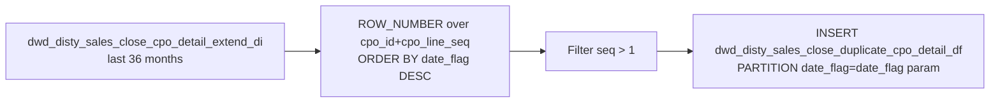

# DWD: Close CPO Detail Duplicate Detection (`dwd_disty_sales_close_duplicate_cpo_detail_df`)

- artifact_type: etl_table
- artifact_id: dw_us.dwd_disty_sales_close_duplicate_cpo_detail_df
- domain: cpo
- one_line_purpose: This job detects **closed CPO line detail rows that appear in more than one date partition** in the main closed CPO detail table. The grain is `(cpo_id, cpo_line_seq)` — if a CPO line appears in multiple `date_flag` partitions, this job rec...
- layer_type: DWD
- source_kind: etl_sql
- evidence_source: source/etl/sql/csource/etl/sql/po/source/etl/flows/public_order_tools/ingest/public_cpo_dw/script/dwd_disty_sales_close_duplicate_cpo_detail_df.sql

---

## L1 Data Foundation

### Identity and physical mapping
- **Table:** `dw_us.dwd_disty_sales_close_duplicate_cpo_detail_df`
- **Layer type:** DWD
- **Canonical / derived:** Derived / ETL-loaded (see L3)
- **Owner team:** not registered in metadata catalog

### Grain, scope, exclusions
- **Grain:** one row per `(cpo_id, cpo_line_seq, last_date_flag)` — a CPO line in a duplicate (older) partition.
- **Scope:** See L2 business purpose / L3 filters
- **Partition:** `date_flag = '${date_flag}'` — the run date. - resolved from pipeline (see L4)
- **Natural key:** `cpo_id`, `cpo_line_seq`, `last_date_flag` within a `date_flag` partition.
- **Exclusions:** Not documented in repository

#### Grain detail (preserved)

- **Grain:** one row per `(cpo_id, cpo_line_seq, last_date_flag)` — a CPO line in a duplicate (older) partition.
- **Partition:** `date_flag = '${date_flag}'` — the run date.
- **Natural key:** `cpo_id`, `cpo_line_seq`, `last_date_flag` within a `date_flag` partition.

---

### Cross-engine presence
| Engine | Present | Canonical FQN | Notes |
|--------|---------|---------------|-------|
| Hive | yes | `dwd_disty_sales_close_duplicate_cpo_detail_df` | ETL target / intermediate per evidence script |
| Vertica | pending | `dwd_disty_sales_close_duplicate_cpo_detail_df` | Confirm via hive2vertica flow evidence / MCP |

### Physical schema reference

Pointer block only - full column catalog lives in WKB L1 storage JSON.

| Field | Value |
|-------|-------|
| **Authoritative catalog** | WKB L1 storage seed (not duplicated in this file) |
| **entity_id** | `dw_us.dwd_disty_sales_close_duplicate_cpo_detail_df` |
| **l1_catalog_seed** | `target/storage/wkb/snapshots/_snapshot_id_template/l1_catalog/{engine}_{schema}_{table}.json` |
| **column_count** | pending (run ddl_seed_writer) |
| **partition_keys** | `date_flag = '${date_flag}'` |
| **ddl_source** | pending Bitbucket DDL / Vertica metadata ingest |
| **retrieval** | `python -m tools.wkb.indexing.run_query --query "cpo dwd_disty_sales_close_duplicate_cpo_detail_df schema" --intent find_table_schema` |

### Lineage
| Object | Role |
|--------|------|
| `dw_${country_code}.dwd_disty_sales_close_cpo_detail_extend_di` | Source — scanned for duplicates |
| `dw_${country_code}.dwd_disty_sales_close_duplicate_cpo_detail_df` | **Target** — duplicate detail partition registry |

---

### Freshness and load path
| Item | Value |
|------|-------|
| Load pattern | See L3 end-to-end / INSERT pattern in evidence script |
| Schedule | Not documented in repository |
| Parameters | `country_code`, `date_flag` |


---

## L2 Declarative Knowledge

### Business purpose
This job detects **closed CPO line detail rows that appear in more than one date partition** in the main closed CPO detail table. The grain is `(cpo_id, cpo_line_seq)` — if a CPO line appears in multiple `date_flag` partitions, this job records the older ("duplicate") partition dates so the fix scripts can remove them.

---

### Audience and use cases
| Audience | How they benefit |
|----------|-----------------|
| **Data engineering** | Input to `fix_dwd_disty_sales_close_cpo_detail_extend_di.sql` and `fix_duplicate_close_cpo_detail_di_vertica.sql`. |

---

### Fact key resolution
- Natural key: `cpo_id`, `cpo_line_seq`, `last_date_flag` within a `date_flag` partition.
- FK / label-on attributes: see L3 dimension join patterns and step-by-step logic.
- Negative assertion: do not treat descriptive labels as grain keys unless listed under natural key.

### Time field semantics
- **date_flag / partition columns:** `date_flag = '${date_flag}'` — the run date.
- Primary reporting filter should use the partition column(s) documented in L1; resolve values via L4.


### Metrics served

| Category | Column | Logical metric | Business reading |
|----------|--------|----------------|------------------|
| Measures | — | — | No measure columns mapped for this table. |

### Metric serving map

**Formula authority:** [`source/contracts/cpo/metric-index.md`](../../source/contracts/cpo/metric-index.md)

N/A — no measure columns mapped for this table.

### etl_metrics

No governed logical metrics from `source/contracts/cpo/metric-index.md` are mapped on this table.

---

## L3 Procedural Knowledge

### Query and routing rules
**Business filters:** Use partition / date keys from L1 grain for reporting scope.
**Technical predicates (load only):** See Key filters and step-by-step logic below.

### Dimension join patterns
| Dimension FQN | Join keys | Purpose | Evidence |
|---------------|-----------|---------|----------|
| See step-by-step / base tables | See L3 steps | Dimension enrichment | `source/etl/sql/csource/etl/sql/po/source/etl/flows/public_order_tools/ingest/public_cpo_dw/script/dwd_disty_sales_close_duplicate_cpo_detail_df.sql` |

### Key filters and ETL business logic
### Step 1 — Final `INSERT OVERWRITE`

**Ranking:**

| Column | Formula | Plain language |
|--------|---------|----------------|
| `seq` | `ROW_NUMBER() OVER (PARTITION BY cpo_id, cpo_line_seq ORDER BY date_flag DESC)` | `1` = most recent partition for this line. `> 1` = duplicate in an older partition. |

**Output columns:** `cpo_id`, `cpo_line_seq`, `last_date_flag` (= older duplicate date_flag), `date_flag` (literal run date).

---

### Standard time-filter SQL
```sql
-- relative period filter using resolved partition value (see L4)
SELECT *
FROM dwd_disty_sales_close_duplicate_cpo_detail_df
WHERE /* partition predicate */ date_flag = '${partition_value}';
```

### End-to-end flow
**Runtime parameters:** `country_code`, `date_flag`
**Target table:** `dw_${country_code}.dwd_disty_sales_close_duplicate_cpo_detail_df`, partitioned by **`date_flag`**.

1. Read `dwd_disty_sales_close_cpo_detail_extend_di` for the last 36 months.
2. Apply `ROW_NUMBER() OVER (PARTITION BY cpo_id, cpo_line_seq ORDER BY date_flag DESC)`.
3. Filter to `seq > 1` — duplicate (older partition) line rows.
4. **INSERT OVERWRITE** writing `cpo_id`, `cpo_line_seq`, `date_flag AS last_date_flag`, literal `'${date_flag}'`.



---


#### High-level stages (preserved)

| Stage | Business meaning |
|-------|-----------------|
| **Scan close CPO detail** | Reads the last 36 months of `dwd_disty_sales_close_cpo_detail_extend_di`, ranking rows by `(cpo_id, cpo_line_seq)` ordered by `date_flag DESC`. |
| **Identify duplicates** | Rows with `seq > 1` are duplicate line appearances in older partitions. |
| **Record duplicate dates** | Writes `cpo_id`, `cpo_line_seq`, the older `last_date_flag`, and run `date_flag` to the duplicate table. |

**Parameters:** `country_code`, `date_flag`

---


### Base tables register
| Object | Role in this job |
|--------|-----------------|
| `dw_${country_code}.dwd_disty_sales_close_cpo_detail_extend_di` | Source — scanned for duplicate `(cpo_id, cpo_line_seq)` across partitions. |

---

### Step-by-step logic
### Step 1 — Final `INSERT OVERWRITE`

**Ranking:**

| Column | Formula | Plain language |
|--------|---------|----------------|
| `seq` | `ROW_NUMBER() OVER (PARTITION BY cpo_id, cpo_line_seq ORDER BY date_flag DESC)` | `1` = most recent partition for this line. `> 1` = duplicate in an older partition. |

**Output columns:** `cpo_id`, `cpo_line_seq`, `last_date_flag` (= older duplicate date_flag), `date_flag` (literal run date).

---

### Relationship map (embedded)

| from_fqn | to_fqn | cardinality | join_keys | provenance |
|----------|--------|-------------|-----------|------------|
| — | — | — | — | Not documented in repository |

`source/ref/cpo/table relationship.txt`: Not documented in repository.

### Special logic (embedded)

Not documented in repository

### Column / field derivations (from ETL SQL)

| target_column | expression_sql | upstream_columns | upstream_tables | transform_kind | evidence |
|---------------|----------------|------------------|-----------------|----------------|----------|
| `cpo_id` | `t.cpo_id` | `cpo_id` | `dw_${country_code}.dwd_disty_sales_close_cpo_detail_extend_di` | passthrough | `source/etl/sql/cpo/public_order_scripts/public_cpo_dw/script/dwd_disty_sales_close_duplicate_cpo_detail_df.sql:3` |
| `cpo_line_seq` | `t.cpo_line_seq` | `cpo_line_seq` | `dw_${country_code}.dwd_disty_sales_close_cpo_detail_extend_di` | passthrough | `source/etl/sql/cpo/public_order_scripts/public_cpo_dw/script/dwd_disty_sales_close_duplicate_cpo_detail_df.sql:4` |
| `last_date_flag` | `t.date_flag` | `date_flag` | `dw_${country_code}.dwd_disty_sales_close_cpo_detail_extend_di` | rename | `source/etl/sql/cpo/public_order_scripts/public_cpo_dw/script/dwd_disty_sales_close_duplicate_cpo_detail_df.sql:5` |
| `date_flag` | `'${date_flag}'` | `date_flag` | `dw_${country_code}.dwd_disty_sales_close_cpo_detail_extend_di` | literal | `source/etl/sql/cpo/public_order_scripts/public_cpo_dw/script/dwd_disty_sales_close_duplicate_cpo_detail_df.sql:6` |

### Sentinel and code values
| Value | Meaning |
|-------|---------|
| `seq > 1` | A CPO line row in a partition that is not the most recent — a duplicate older partition entry. |
| `add_months('${date_flag}', -36)` | 36-month lookback boundary. |

---

---

## L4 Validation

### Resolved partition value
| Step | Source | How partition / date scope is determined |
|------|--------|------------------------------------------|
| 1 | evidence script / flow | See parameters in L1 Freshness and L3 filters - `source/etl/sql/csource/etl/sql/po/source/etl/flows/public_order_tools/ingest/public_cpo_dw/script/dwd_disty_sales_close_duplicate_cpo_detail_df.sql` |

**Plain language:** Partition and date scope follow Azkaban/bootstrap parameters documented in the source script and orchestrating flow; do not hardcode calendar literals.

### Data quality checks
- Prefer row-count-by-partition, metric sums, and grain duplicate checks (see Validation SQL).
- Additional checks from legacy caveats / operational notes when present.

### Validation SQL
```sql
-- 1) Row count by partition
SELECT ${partition_col}, COUNT(*) AS row_cnt
FROM dw_${country_code}.dwd_disty_sales_close_duplicate_cpo_detail_df
WHERE ${partition_col} = '${partition_value}'
GROUP BY ${partition_col};

-- 2) Metric sum by business dimension (top deltas)
SELECT ${dim_key}, SUM(${metric}) AS metric_sum
FROM dw_${country_code}.dwd_disty_sales_close_duplicate_cpo_detail_df
WHERE ${partition_col} = '${partition_value}'
GROUP BY ${dim_key}
ORDER BY ABS(SUM(${metric})) DESC
LIMIT 20;

-- 3) Grain duplicate check
SELECT ${grain_key_1}, ${grain_key_2}, ${grain_key_3}, ${partition_col}, COUNT(*) AS cnt
FROM dw_${country_code}.dwd_disty_sales_close_duplicate_cpo_detail_df
WHERE ${partition_col} = '${partition_value}'
GROUP BY ${grain_key_1}, ${grain_key_2}, ${grain_key_3}, ${partition_col}
HAVING COUNT(*) > 1;
```

Replace placeholders from this file's Grain and keys / Data you can fetch sections, and use the resolved partition value from run scope.

### Caveats for interpretation
- **`last_date_flag` is the OLDER partition** — the one to be removed by fix scripts.
- **Grain is `(cpo_id, cpo_line_seq)`** — different from the header duplicate table which uses only `cpo_id`.

---

### Conflicts and open questions
- Schedule, owner, SLA: Not documented in repository (unless preserved schedule evidence above).
- Vertica MCP verification: pending unless confirmed in L5.


---

## L5 Runtime View

### Query path and engine preference
| Role | Hive object | Vertica object | Sync mode | Evidence | MCP verified |
|------|-------------|----------------|-----------|----------|--------------|
| **Query for reporting** | *See script lineage* | `dw_${country_code}.dwd_disty_sales_close_duplicate_cpo_detail_df` | *Verify from flow* | *Add flow file:line* | pending |
| **Hive alternative** | `*` | `dw_${country_code}.dwd_disty_sales_close_duplicate_cpo_detail_df` | - | *See dependencies* | - |
| **ETL internal** | staging/temp tables | *Not synced to Vertica* | - | *See step-by-step logic* | - |

Business users should query `dw_${country_code}.dwd_disty_sales_close_duplicate_cpo_detail_df` in Vertica once MCP verification is completed for this document.

### Access constraints
- Country / company schema parameters may apply (`literal_country`, `company_no`, etc.).
- Hive-only staging objects are not reporting surfaces unless synced.

### Query risk profile
| Field | Value |
|-------|-------|
| requires_date_predicate | yes |
| scan_risk_tier | high |

---

## L6 Access and Consumption

### Primary consumers and use cases
| Audience | How they benefit |
|----------|-----------------|
| **Data engineering** | Input to `fix_dwd_disty_sales_close_cpo_detail_extend_di.sql` and `fix_duplicate_close_cpo_detail_di_vertica.sql`. |

---

### Representative query patterns
```sql
-- certified / illustrative lookup - replace predicates from L1/L4
SELECT *
FROM dwd_disty_sales_close_duplicate_cpo_detail_df
WHERE date_flag = '${partition_value}'
LIMIT 100;
```

### Dependencies and notes
### Upstream objects (verified)

| Object | Usage | Evidence |
|--------|-------|----------|
| `dw_${country_code}.dwd_disty_sales_close_cpo_detail_extend_di` | Scanned for duplicate cpo_id/cpo_line_seq/date_flag | `dwd_disty_sales_close_duplicate_cpo_detail_df.sql:14-16` |

### Downstream consumers (verified)

| Object / script | Evidence |
|-----------------|----------|
| `fix_dwd_disty_sales_close_cpo_detail_extend_di.sql` — reads this table to identify affected partitions | `fix_dwd_disty_sales_close_cpo_detail_extend_di.sql:4` |
| `fix_duplicate_close_cpo_detail_di_vertica.sql` — uses Vertica-synced duplicate table for DELETE | `fix_duplicate_close_cpo_detail_di_vertica.sql:10` |

### Operational detail (verified)

- Partition overwrite: `INSERT OVERWRITE TABLE dw_${country_code}.dwd_disty_sales_close_duplicate_cpo_detail_df PARTITION (date_flag)` — `dwd_disty_sales_close_duplicate_cpo_detail_df.sql:1`

### Not documented in repository

- Schedule, owner, SLA — not in scripts or configs

---

*Document generated from `source/etl/sql/csource/etl/sql/po/source/etl/flows/public_order_tools/ingest/public_cpo_dw/script/dwd_disty_sales_close_duplicate_cpo_detail_df.sql`.*

#### Not documented in repository
- Owner, SLA (unless schedule evidence preserved above)
- Any dependency without `file:line` evidence in this document

---

*Document migrated to L1-L6 from legacy Knowledgebase content. Evidence: `source/etl/sql/csource/etl/sql/po/source/etl/flows/public_order_tools/ingest/public_cpo_dw/script/dwd_disty_sales_close_duplicate_cpo_detail_df.sql`.*
