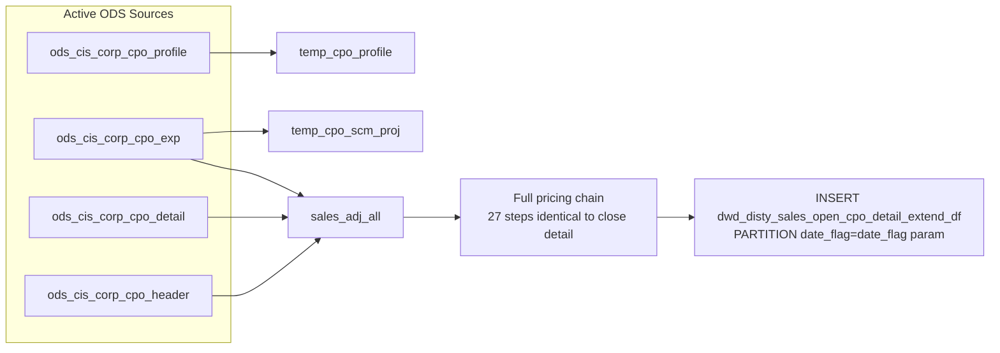

# DWD: Open CPO Detail — Extended Daily Snapshot (`dwd_disty_sales_open_cpo_detail_extend_df`)

- artifact_type: etl_table
- artifact_id: dw_us.dwd_disty_sales_open_cpo_detail_extend_df
- domain: cpo
- one_line_purpose: This job loads the **complete enriched snapshot of all currently open CPO line details** from active ODS tables into a single date partition. It applies the same full pricing calculation chain as the closed CPO detail job (adj_amount, gm, g...
- layer_type: DWD
- source_kind: etl_sql
- evidence_source: source/etl/sql/csource/etl/sql/po/source/etl/flows/public_order_tools/ingest/public_cpo_dw/script/dwd_disty_sales_open_cpo_detail_extend_df.sql

---

## L1 Data Foundation

### Identity and physical mapping
- **Table:** `dw_us.dwd_disty_sales_open_cpo_detail_extend_df`
- **Layer type:** DWD
- **Canonical / derived:** Derived / ETL-loaded (see L3)
- **Owner team:** not registered in metadata catalog

### Grain, scope, exclusions
- **Grain:** one row per `(cpo_id, cpo_line_seq)` — all active CPO lines at the time of the run.
- **Scope:** See L2 business purpose / L3 filters
- **Partition:** `date_flag = '${date_flag}'` — literal date parameter; full partition replaced on each run. - resolved from pipeline (see L4)
- **Natural key:** `cpo_id`, `cpo_line_seq`.
- **Exclusions:** Not documented in repository

#### Grain detail (preserved)

- **Grain:** one row per `(cpo_id, cpo_line_seq)` — all active CPO lines at the time of the run.
- **Partition:** `date_flag = '${date_flag}'` — literal date parameter; full partition replaced on each run.
- **Natural key:** `cpo_id`, `cpo_line_seq`.

---

### Cross-engine presence
| Engine | Present | Canonical FQN | Notes |
|--------|---------|---------------|-------|
| Hive | yes | `dwd_disty_sales_open_cpo_detail_extend_df` | ETL target / intermediate per evidence script |
| Vertica | pending | `dwd_disty_sales_open_cpo_detail_extend_df` | Confirm via hive2vertica flow evidence / MCP |

### Physical schema reference

Pointer block only - full column catalog lives in WKB L1 storage JSON.

| Field | Value |
|-------|-------|
| **Authoritative catalog** | WKB L1 storage seed (not duplicated in this file) |
| **entity_id** | `dw_us.dwd_disty_sales_open_cpo_detail_extend_df` |
| **l1_catalog_seed** | `target/storage/wkb/snapshots/_snapshot_id_template/l1_catalog/{engine}_{schema}_{table}.json` |
| **column_count** | pending (run ddl_seed_writer) |
| **partition_keys** | `date_flag = '${date_flag}'` |
| **ddl_source** | pending Bitbucket DDL / Vertica metadata ingest |
| **retrieval** | `python -m tools.wkb.indexing.run_query --query "cpo dwd_disty_sales_open_cpo_detail_extend_df schema" --intent find_table_schema` |

### Lineage
| Object | Role |
|--------|------|
| `ods_${country_code}.ods_cis_corp_cpo_detail` | Primary source — active open CPO lines |
| (all other sources) | Same as close detail job using active `cpo_*` equivalents |
| `dw_${country_code}.dwd_disty_sales_open_cpo_detail_extend_df` | **Target** — daily snapshot of enriched open CPO line detail |

---

### Freshness and load path
| Item | Value |
|------|-------|
| Load pattern | See L3 end-to-end / INSERT pattern in evidence script |
| Schedule | Not documented in repository |
| Parameters | `country_code`, `date_flag` |


---

## L2 Declarative Knowledge

### Business purpose
This job loads the **complete enriched snapshot of all currently open CPO line details** from active ODS tables into a single date partition. It applies the same full pricing calculation chain as the closed CPO detail job (adj_amount, gm, gm_net, net_price, off_retail, rebate, list_points, base_cost, list_price, VRF) but reads from live/active CPO tables. The `_df` (daily full) variant captures the complete open order book position as of the run date, enabling pipeline margin analysis and deal desk review.

---

### Audience and use cases
| Audience | How they benefit |
|----------|-----------------|
| **Finance / FP&A** | Line-level margin (`gm`, `gm_net`) and pricing analytics on the current open order book. |
| **Pricing / deal desk** | `adj_amount`, `off_retail`, `list_points`, `rebate_total` for live CPO lines under review. |
| **Vendor management** | `spa_no`, `spa_type`, `scm_desc`, `cpo_extended_exp` — SPA/SCM exposure on open CPOs. |
| **Sales / operations** | `cpo_ship_qty`, `cpo_bo_qty`, `cpo_so_qty` — fulfilment status for open lines. |

---

### Fact key resolution
- Natural key: `cpo_id`, `cpo_line_seq`.
- FK / label-on attributes: see L3 dimension join patterns and step-by-step logic.
- Negative assertion: do not treat descriptive labels as grain keys unless listed under natural key.

### Time field semantics
- **date_flag / partition columns:** `date_flag = '${date_flag}'` — literal date parameter; full partition replaced on each run.
- Primary reporting filter should use the partition column(s) documented in L1; resolve values via L4.


### Metrics served

| Category | Column | Logical metric | Business reading |
|----------|--------|----------------|------------------|
| Measures | — | — | No measure columns mapped for this table. |

### Metric serving map

**Formula authority:** [`source/contracts/cpo/metric-index.md`](../../source/contracts/cpo/metric-index.md)

N/A — no measure columns mapped for this table.

### etl_metrics

No governed logical metrics from `source/contracts/cpo/metric-index.md` are mapped on this table.

---

### Metric serving map
N/A - not a `*_comb_mtd` / multi-period wide serving table (or map not present in legacy doc).


### Data products and column groups (preserved)

Same column set as `dwd_disty_sales_close_cpo_detail_extend_di` with these differences:
- `date_flag` is the literal run date, not derived from `trans_datetime`.
- Source is active `cpo_*` tables, not history.
- Includes `cpo_change_id` and `cpo_change_date` from the detail table (not present in close variant).

See `dwd_disty_sales_close_cpo_detail_extend_di.md` for the full column and metric reference.

---

### etl_metrics

N/A - no calculable ETL formulas extracted from this document (passthrough / stored measures only, or formulas not documented).

---

## L3 Procedural Knowledge

### Query and routing rules
**Business filters:** Use partition / date keys from L1 grain for reporting scope.
**Technical predicates (load only):** See Key filters and step-by-step logic below.

### Dimension join patterns
| Dimension FQN | Join keys | Purpose | Evidence |
|---------------|-----------|---------|----------|
| See step-by-step / base tables | See L3 steps | Dimension enrichment | `source/etl/sql/csource/etl/sql/po/source/etl/flows/public_order_tools/ingest/public_cpo_dw/script/dwd_disty_sales_open_cpo_detail_extend_df.sql` |

### Key filters and ETL business logic
See step-by-step logic

### Standard time-filter SQL
```sql
-- relative period filter using resolved partition value (see L4)
SELECT *
FROM dwd_disty_sales_open_cpo_detail_extend_df
WHERE /* partition predicate */ date_flag = '${partition_value}';
```

### End-to-end flow
**Runtime parameters:** `country_code`, `date_flag`
**Target table:** `dw_${country_code}.dwd_disty_sales_open_cpo_detail_extend_df`, partitioned by **`date_flag = '${date_flag}'`** (literal).

Steps 1–27: Identical pricing calculation chain as `dwd_disty_sales_close_cpo_detail_extend_di.sql` but using active `ods_cis_corp_cpo_*` tables instead of `ods_cis_corp_history_cpo_*`.

28. **INSERT OVERWRITE** into `dwd_disty_sales_open_cpo_detail_extend_df PARTITION (date_flag='${date_flag}')` — all active CPO lines, no date filter.



---


#### High-level stages (preserved)

| Stage | Business meaning |
|-------|-----------------|
| **Profile extraction** | Same pivot as close detail: SPA ref, customer part no, base cost/MSRP, contract no, workflow request ID from active `ods_cis_corp_cpo_profile`. |
| **SCM / SPA enrichment** | Aggregates SCM expense, SPA, and project info from active `ods_cis_corp_cpo_exp`. |
| **Sales adjustment base** | Joins active CPO header + detail + expense + part info; computes `total_sales_adj` (excluding HRPM/HRSD/HRFT/HRFD). |
| **Full pricing calculation** | Identical 27-step pricing chain as close detail (adj_amount, gm, net_price, gm_net, off_retail, rebate_total, list_points, base_cost/list_price waterfall, VRF). |
| **Final INSERT** | Writes to `dwd_disty_sales_open_cpo_detail_extend_df` for the literal `date_flag` partition. |

**Parameters:** `country_code`, `date_flag`

---


### Base tables register
| Object | Role in this job |
|--------|-----------------|
| `ods_${country_code}.ods_cis_corp_cpo_header` | CPO header — `cpo_from_ref_type`, `sales_model`, `cpo_cust_no`, `company_no`. |
| `ods_${country_code}.ods_cis_corp_cpo_detail` | **Primary line detail source.** Active open CPO lines. No date filter. |
| `ods_${country_code}.ods_cis_corp_cpo_exp` | Expense lines — adj, unit_exp, SCM, SPA. |
| `ods_${country_code}.ods_cis_corp_cpo_profile` | Profile pivot. |
| All other sources | Same as close CPO detail job using active `cpo_*` equivalents. See `dwd_disty_sales_close_cpo_detail_extend_di.md`. |

**Note:** `list_price_kpart` and `base_cost_kpart` hardcode `ods_us.ods_cis_corp_bom` and `ods_us.ods_cis_corp_sku_cost` — same as the close detail job.

---

### Step-by-step logic
None identified in repository

### Relationship map (embedded)

| from_fqn | to_fqn | cardinality | join_keys | provenance |
|----------|--------|-------------|-----------|------------|
| `ods_${country_code}.ods_cis_corp_cpo_exp` | `ods_${country_code}.ods_cis_corp_project_info` | many:1 | `ce.cpo_scm_no=pinfo.proj_no` | etl_sql (source/etl/sql/cpo/public_order_scripts/public_cpo_dw/script/dwd_disty_sales_open_cpo_detail_extend_df.sql:1) |
| `ods_${country_code}.ods_cis_corp_cpo_exp` | `temp_cpo_profile` | many:1 | `ce.cpo_id = cp.cpo_id and ce.cpo_line_seq=cp.cpo_line_seq` | etl_sql (source/etl/sql/cpo/public_order_scripts/public_cpo_dw/script/dwd_disty_sales_open_cpo_detail_extend_df.sql:1) |
| `ods_${country_code}.ods_cis_corp_cpo_header` | `ods_${country_code}.ods_cis_corp_cpo_detail` | many:1 | `cpoh.cpo_id = cd.cpo_id` | etl_sql (source/etl/sql/cpo/public_order_scripts/public_cpo_dw/script/dwd_disty_sales_open_cpo_detail_extend_df.sql:1) |
| `ods_${country_code}.ods_cis_corp_cpo_detail` | `ods_${country_code}.ods_cis_corp_cpo_exp` | many:1 | `ce.cpo_id = cd.cpo_id AND ce.cpo_line_seq = cd.cpo_line_seq AND ce.cpo_delete_date IS NULL AND ce.cpo_line_seq != 0 AND (ce.cpo_exp_code IS NULL OR ce.cpo_ex...` | etl_sql (source/etl/sql/cpo/public_order_scripts/public_cpo_dw/script/dwd_disty_sales_open_cpo_detail_extend_df.sql:1) |
| `ods_${country_code}.ods_cis_corp_cpo_detail` | `dim_${country_code}.dim_pub_part_info` | many:1 | `cd.cpo_sku_no = pm.sku_no` | etl_sql (source/etl/sql/cpo/public_order_scripts/public_cpo_dw/script/dwd_disty_sales_open_cpo_detail_extend_df.sql:1) |
| `ods_${country_code}.ods_cis_corp_cpo_exp` | `temp_cpo_exp_code` | many:1 | `ce.cpo_exp_code = tc.cpo_exp_code and tc.cpo_exp_code is null` | etl_sql (source/etl/sql/cpo/public_order_scripts/public_cpo_dw/script/dwd_disty_sales_open_cpo_detail_extend_df.sql:1) |
| `temp_cpo_profile` | `ods_${country_code}.ods_cis_corp_cpo_allocation` | many:1 | `cp.cpo_id = ca.cpo_id` | etl_sql (source/etl/sql/cpo/public_order_scripts/public_cpo_dw/script/dwd_disty_sales_open_cpo_detail_extend_df.sql:1) |
| `temp_cpo_profile` | `dim_${country_code}.dim_pub_part_info` | many:1 | `cd.cpo_sku_no = pm.sku_no` | etl_sql (source/etl/sql/cpo/public_order_scripts/public_cpo_dw/script/dwd_disty_sales_open_cpo_detail_extend_df.sql:1) |
| `ods_${country_code}.ods_cis_corp_cpo_profile` | `temp_cpo_profile` | many:1 | `sa.cpo_id=p.cpo_id and sa.cpo_line_seq=p.cpo_line_seq; --11 base_cost_list-->base_cost_list_price -2 create TEMPORARY table base_cost_list_price_first AS` | etl_sql (source/etl/sql/cpo/public_order_scripts/public_cpo_dw/script/dwd_disty_sales_open_cpo_detail_extend_df.sql:1) |
| `ods_${country_code}.ods_cis_corp_cpo_profile` | `ods_${country_code}.ods_etl_cust_profile_all` | many:1 | `cp.cust_no = cd.cpo_cust_no AND cp.profile_type = 'CUST_CURR'` | etl_sql (source/etl/sql/cpo/public_order_scripts/public_cpo_dw/script/dwd_disty_sales_open_cpo_detail_extend_df.sql:1) |
| `ods_${country_code}.ods_etl_cust_profile_all` | `ods_${country_code}.ods_cis_corp_sku_cost` | many:1 | `cd.cpo_sku_no = sc.sku_no and cd.company_no=sc.company_no` | etl_sql (source/etl/sql/cpo/public_order_scripts/public_cpo_dw/script/dwd_disty_sales_open_cpo_detail_extend_df.sql:1) |
| `ods_${country_code}.ods_etl_cust_profile_all` | `ods_${country_code}.ods_cis_corp_vend_master_etc` | many:1 | `cd.vend_no = vc.vend_no` | etl_sql (source/etl/sql/cpo/public_order_scripts/public_cpo_dw/script/dwd_disty_sales_open_cpo_detail_extend_df.sql:1) |
| `ods_${country_code}.ods_etl_cust_profile_all` | `ods_${country_code}.ods_cis_corp_exchange_rate` | many:1 | `er.currency = bcl.company_currency AND er.base = bcl.cust_currency` | etl_sql (source/etl/sql/cpo/public_order_scripts/public_cpo_dw/script/dwd_disty_sales_open_cpo_detail_extend_df.sql:1) |
| `ods_${country_code}.ods_etl_cust_profile_all` | `ods_${country_code}.ods_cis_corp_bom` | many:1 | `a.cpo_sku_no=b.sku_no` | etl_sql (source/etl/sql/cpo/public_order_scripts/public_cpo_dw/script/dwd_disty_sales_open_cpo_detail_extend_df.sql:1) |
| `ods_${country_code}.ods_cis_corp_bom` | `ods_${country_code}.ods_cis_corp_sku_cost` | many:1 | `b.comp_no = sc.sku_no and a.company_no=sc.company_no` | etl_sql (source/etl/sql/cpo/public_order_scripts/public_cpo_dw/script/dwd_disty_sales_open_cpo_detail_extend_df.sql:1) |
| `ods_${country_code}.ods_etl_cust_profile_all` | `ods_us.ods_cis_corp_bom` | many:1 | `a.cpo_sku_no=b.sku_no` | etl_sql (source/etl/sql/cpo/public_order_scripts/public_cpo_dw/script/dwd_disty_sales_open_cpo_detail_extend_df.sql:1) |
| `ods_us.ods_cis_corp_bom` | `ods_us.ods_cis_corp_sku_cost` | many:1 | `b.comp_no = sc.sku_no and a.company_no=sc.company_no --2024/09/04` | etl_sql (source/etl/sql/cpo/public_order_scripts/public_cpo_dw/script/dwd_disty_sales_open_cpo_detail_extend_df.sql:1) |
| `ods_${country_code}.ods_cis_corp_cpo_exp` | `temp_cpo_exp_code` | many:1 | `ce.cpo_exp_code=tc.cpo_exp_code and tc.cpo_exp_code is null` | etl_sql (source/etl/sql/cpo/public_order_scripts/public_cpo_dw/script/dwd_disty_sales_open_cpo_detail_extend_df.sql:1) |
| `ods_${country_code}.ods_etl_cust_profile_all` | `ods_${country_code}.ods_cis_corp_cpo_eu_custom` | many:1 | `a.cpo_id = cdt.cpo_id AND a.cpo_line_seq = cdt.cpo_line_seq` | etl_sql (source/etl/sql/cpo/public_order_scripts/public_cpo_dw/script/dwd_disty_sales_open_cpo_detail_extend_df.sql:1) |
| `ods_${country_code}.ods_cis_corp_cpo_eu_custom` | `ods_${country_code}.ods_cis_corp_eu_custom_map` | many:1 | `a.eu_map_id = b.eu_map_id AND a.eu_map_line_no = b.eu_map_line_no` | etl_sql (source/etl/sql/cpo/public_order_scripts/public_cpo_dw/script/dwd_disty_sales_open_cpo_detail_extend_df.sql:1) |
| `ods_${country_code}.ods_cis_corp_eu_custom_map` | `ods_${country_code}.ods_cis_corp_list_box_detail` | many:1 | `b.map_data_desc = c.code_value AND c.list_box_code = 'CEDM'; --26 combin vrf and use ; as separator create or replace TEMPORARY view sale_vrf_combin as` | etl_sql (source/etl/sql/cpo/public_order_scripts/public_cpo_dw/script/dwd_disty_sales_open_cpo_detail_extend_df.sql:1) |
| `ods_${country_code}.ods_etl_cust_profile_all` | `dim_${country_code}.dim_pub_manager` | many:1 | `cd.cpo_delete_id = pm.userid` | etl_sql (source/etl/sql/cpo/public_order_scripts/public_cpo_dw/script/dwd_disty_sales_open_cpo_detail_extend_df.sql:1) |
| `ods_${country_code}.ods_cis_corp_cpo_profile` | `temp_cpo_profile` | many:1 | `cd.cpo_id = cp.cpo_id and cd.cpo_line_seq = cp.cpo_line_seq` | etl_sql (source/etl/sql/cpo/public_order_scripts/public_cpo_dw/script/dwd_disty_sales_open_cpo_detail_extend_df.sql:1) |
| `temp_cpo_profile` | `temp_cpo_scm_proj` | many:1 | `cd.cpo_id = csp.cpo_id and cd.cpo_line_seq = csp.cpo_line_seq` | etl_sql (source/etl/sql/cpo/public_order_scripts/public_cpo_dw/script/dwd_disty_sales_open_cpo_detail_extend_df.sql:1) |

`source/ref/cpo/table relationship.txt`: Not documented in repository.

### Special logic (embedded)

Not documented in repository

### Column / field derivations (from ETL SQL)

| target_column | expression_sql | upstream_columns | upstream_tables | transform_kind | evidence |
|---------------|----------------|------------------|-----------------|----------------|----------|
| `cpo_id` | `cd.cpo_id` | `cpo_id` | `ods_${country_code}.ods_cis_corp_cpo_detail`, `dim_${country_code}.dim_pub_manager`, `temp_cpo_profile`, `temp_cpo_scm_proj`, `cpo_sales_all` | passthrough | `source/etl/sql/cpo/public_order_scripts/public_cpo_dw/script/dwd_disty_sales_open_cpo_detail_extend_df.sql:44` |
| `cpo_line_seq` | `cd.cpo_line_seq` | `cpo_line_seq` | `ods_${country_code}.ods_cis_corp_cpo_detail`, `dim_${country_code}.dim_pub_manager`, `temp_cpo_profile`, `temp_cpo_scm_proj`, `cpo_sales_all` | passthrough | `source/etl/sql/cpo/public_order_scripts/public_cpo_dw/script/dwd_disty_sales_open_cpo_detail_extend_df.sql:45` |
| `cpo_line_no` | `cd.cpo_line_no` | `cpo_line_no` | `ods_${country_code}.ods_cis_corp_cpo_detail`, `dim_${country_code}.dim_pub_manager`, `temp_cpo_profile`, `temp_cpo_scm_proj`, `cpo_sales_all` | passthrough | `source/etl/sql/cpo/public_order_scripts/public_cpo_dw/script/dwd_disty_sales_open_cpo_detail_extend_df.sql:581` |
| `cpo_line_status` | `cd.cpo_line_status` | `cpo_line_status` | `ods_${country_code}.ods_cis_corp_cpo_detail`, `dim_${country_code}.dim_pub_manager`, `temp_cpo_profile`, `temp_cpo_scm_proj`, `cpo_sales_all` | passthrough | `source/etl/sql/cpo/public_order_scripts/public_cpo_dw/script/dwd_disty_sales_open_cpo_detail_extend_df.sql:582` |
| `cpo_sku_no` | `cd.cpo_sku_no` | `cpo_sku_no` | `ods_${country_code}.ods_cis_corp_cpo_detail`, `dim_${country_code}.dim_pub_manager`, `temp_cpo_profile`, `temp_cpo_scm_proj`, `cpo_sales_all` | passthrough | `source/etl/sql/cpo/public_order_scripts/public_cpo_dw/script/dwd_disty_sales_open_cpo_detail_extend_df.sql:51` |
| `cpo_sku_inv_type` | `cd.cpo_sku_inv_type` | `cpo_sku_inv_type` | `ods_${country_code}.ods_cis_corp_cpo_detail`, `dim_${country_code}.dim_pub_manager`, `temp_cpo_profile`, `temp_cpo_scm_proj`, `cpo_sales_all` | passthrough | `source/etl/sql/cpo/public_order_scripts/public_cpo_dw/script/dwd_disty_sales_open_cpo_detail_extend_df.sql:584` |
| `cpo_line_qty` | `cd.cpo_line_qty` | `cpo_line_qty` | `ods_${country_code}.ods_cis_corp_cpo_detail`, `dim_${country_code}.dim_pub_manager`, `temp_cpo_profile`, `temp_cpo_scm_proj`, `cpo_sales_all` | passthrough | `source/etl/sql/cpo/public_order_scripts/public_cpo_dw/script/dwd_disty_sales_open_cpo_detail_extend_df.sql:585` |
| `cpo_allocated_qty` | `cd.cpo_allocated_qty` | `cpo_allocated_qty` | `ods_${country_code}.ods_cis_corp_cpo_detail`, `dim_${country_code}.dim_pub_manager`, `temp_cpo_profile`, `temp_cpo_scm_proj`, `cpo_sales_all` | passthrough | `source/etl/sql/cpo/public_order_scripts/public_cpo_dw/script/dwd_disty_sales_open_cpo_detail_extend_df.sql:586` |
| `cpo_bo_qty` | `cd.cpo_bo_qty` | `cpo_bo_qty` | `ods_${country_code}.ods_cis_corp_cpo_detail`, `dim_${country_code}.dim_pub_manager`, `temp_cpo_profile`, `temp_cpo_scm_proj`, `cpo_sales_all` | passthrough | `source/etl/sql/cpo/public_order_scripts/public_cpo_dw/script/dwd_disty_sales_open_cpo_detail_extend_df.sql:587` |
| `cpo_so_qty` | `cd.cpo_so_qty` | `cpo_so_qty` | `ods_${country_code}.ods_cis_corp_cpo_detail`, `dim_${country_code}.dim_pub_manager`, `temp_cpo_profile`, `temp_cpo_scm_proj`, `cpo_sales_all` | passthrough | `source/etl/sql/cpo/public_order_scripts/public_cpo_dw/script/dwd_disty_sales_open_cpo_detail_extend_df.sql:588` |
| `cpo_del_qty` | `cd.cpo_del_qty` | `cpo_del_qty` | `ods_${country_code}.ods_cis_corp_cpo_detail`, `dim_${country_code}.dim_pub_manager`, `temp_cpo_profile`, `temp_cpo_scm_proj`, `cpo_sales_all` | passthrough | `source/etl/sql/cpo/public_order_scripts/public_cpo_dw/script/dwd_disty_sales_open_cpo_detail_extend_df.sql:589` |
| `cpo_ship_qty` | `cd.cpo_ship_qty` | `cpo_ship_qty` | `ods_${country_code}.ods_cis_corp_cpo_detail`, `dim_${country_code}.dim_pub_manager`, `temp_cpo_profile`, `temp_cpo_scm_proj`, `cpo_sales_all` | passthrough | `source/etl/sql/cpo/public_order_scripts/public_cpo_dw/script/dwd_disty_sales_open_cpo_detail_extend_df.sql:590` |
| `cpo_price` | `cd.cpo_price` | `cpo_price` | `ods_${country_code}.ods_cis_corp_cpo_detail`, `dim_${country_code}.dim_pub_manager`, `temp_cpo_profile`, `temp_cpo_scm_proj`, `cpo_sales_all` | passthrough | `source/etl/sql/cpo/public_order_scripts/public_cpo_dw/script/dwd_disty_sales_open_cpo_detail_extend_df.sql:591` |
| `cpo_grid_price` | `cd.cpo_grid_price` | `cpo_grid_price` | `ods_${country_code}.ods_cis_corp_cpo_detail`, `dim_${country_code}.dim_pub_manager`, `temp_cpo_profile`, `temp_cpo_scm_proj`, `cpo_sales_all` | passthrough | `source/etl/sql/cpo/public_order_scripts/public_cpo_dw/script/dwd_disty_sales_open_cpo_detail_extend_df.sql:47` |
| `cpo_unit_price` | `cd.cpo_unit_price` | `cpo_unit_price` | `ods_${country_code}.ods_cis_corp_cpo_detail`, `dim_${country_code}.dim_pub_manager`, `temp_cpo_profile`, `temp_cpo_scm_proj`, `cpo_sales_all` | passthrough | `source/etl/sql/cpo/public_order_scripts/public_cpo_dw/script/dwd_disty_sales_open_cpo_detail_extend_df.sql:593` |
| `cpo_unit_cost` | `cd.cpo_unit_cost` | `cpo_unit_cost` | `ods_${country_code}.ods_cis_corp_cpo_detail`, `dim_${country_code}.dim_pub_manager`, `temp_cpo_profile`, `temp_cpo_scm_proj`, `cpo_sales_all` | passthrough | `source/etl/sql/cpo/public_order_scripts/public_cpo_dw/script/dwd_disty_sales_open_cpo_detail_extend_df.sql:48` |
| `cpo_extended_price` | `cd.cpo_line_qty *cd.cpo_unit_price` | `cpo_line_qty`, `cpo_unit_price` | `ods_${country_code}.ods_cis_corp_cpo_detail`, `dim_${country_code}.dim_pub_manager`, `temp_cpo_profile`, `temp_cpo_scm_proj`, `cpo_sales_all` | arithmetic | `source/etl/sql/cpo/public_order_scripts/public_cpo_dw/script/dwd_disty_sales_open_cpo_detail_extend_df.sql:595` |
| `cpo_extended_cost` | `cd.cpo_line_qty * cd.cpo_unit_cost` | `cpo_line_qty`, `cpo_unit_cost` | `ods_${country_code}.ods_cis_corp_cpo_detail`, `dim_${country_code}.dim_pub_manager`, `temp_cpo_profile`, `temp_cpo_scm_proj`, `cpo_sales_all` | arithmetic | `source/etl/sql/cpo/public_order_scripts/public_cpo_dw/script/dwd_disty_sales_open_cpo_detail_extend_df.sql:596` |
| `cpo_gm_percent` | `nvl(cd.cpo_unit_price - cd.cpo_unit_cost,0)/ nvl(cd.cpo_unit_price,0)` | `cpo_unit_price`, `cpo_unit_cost` | `ods_${country_code}.ods_cis_corp_cpo_detail`, `dim_${country_code}.dim_pub_manager`, `temp_cpo_profile`, `temp_cpo_scm_proj`, `cpo_sales_all` | coalesce | `source/etl/sql/cpo/public_order_scripts/public_cpo_dw/script/dwd_disty_sales_open_cpo_detail_extend_df.sql:597` |
| `cpo_price_flag` | `cd.cpo_price_flag` | `cpo_price_flag` | `ods_${country_code}.ods_cis_corp_cpo_detail`, `dim_${country_code}.dim_pub_manager`, `temp_cpo_profile`, `temp_cpo_scm_proj`, `cpo_sales_all` | passthrough | `source/etl/sql/cpo/public_order_scripts/public_cpo_dw/script/dwd_disty_sales_open_cpo_detail_extend_df.sql:598` |
| `cpo_line_delete_id` | `cd.cpo_delete_id` | `cpo_delete_id` | `ods_${country_code}.ods_cis_corp_cpo_detail`, `dim_${country_code}.dim_pub_manager`, `temp_cpo_profile`, `temp_cpo_scm_proj`, `cpo_sales_all` | rename | `source/etl/sql/cpo/public_order_scripts/public_cpo_dw/script/dwd_disty_sales_open_cpo_detail_extend_df.sql:599` |
| `cpo_line_delete_name` | `pm.name` | `name` | `ods_${country_code}.ods_cis_corp_cpo_detail`, `dim_${country_code}.dim_pub_manager`, `temp_cpo_profile`, `temp_cpo_scm_proj`, `cpo_sales_all` | rename | `source/etl/sql/cpo/public_order_scripts/public_cpo_dw/script/dwd_disty_sales_open_cpo_detail_extend_df.sql:600` |
| `cpo_delete_datetime` | `cd.cpo_delete_datetime` | `cpo_delete_datetime` | `ods_${country_code}.ods_cis_corp_cpo_detail`, `dim_${country_code}.dim_pub_manager`, `temp_cpo_profile`, `temp_cpo_scm_proj`, `cpo_sales_all` | passthrough | `source/etl/sql/cpo/public_order_scripts/public_cpo_dw/script/dwd_disty_sales_open_cpo_detail_extend_df.sql:601` |
| `cpo_grid_adj` | `cd.cpo_grid_adj` | `cpo_grid_adj` | `ods_${country_code}.ods_cis_corp_cpo_detail`, `dim_${country_code}.dim_pub_manager`, `temp_cpo_profile`, `temp_cpo_scm_proj`, `cpo_sales_all` | passthrough | `source/etl/sql/cpo/public_order_scripts/public_cpo_dw/script/dwd_disty_sales_open_cpo_detail_extend_df.sql:46` |
| `swl_prog_id` | `cd.swl_prog_id` | `swl_prog_id` | `ods_${country_code}.ods_cis_corp_cpo_detail`, `dim_${country_code}.dim_pub_manager`, `temp_cpo_profile`, `temp_cpo_scm_proj`, `cpo_sales_all` | passthrough | `source/etl/sql/cpo/public_order_scripts/public_cpo_dw/script/dwd_disty_sales_open_cpo_detail_extend_df.sql:603` |
| `cis_unit_cost` | `cd.cis_unit_cost` | `cis_unit_cost` | `ods_${country_code}.ods_cis_corp_cpo_detail`, `dim_${country_code}.dim_pub_manager`, `temp_cpo_profile`, `temp_cpo_scm_proj`, `cpo_sales_all` | passthrough | `source/etl/sql/cpo/public_order_scripts/public_cpo_dw/script/dwd_disty_sales_open_cpo_detail_extend_df.sql:604` |
| `cust_part_no` | `cp.cust_part_no` | `cust_part_no` | `ods_${country_code}.ods_cis_corp_cpo_detail`, `dim_${country_code}.dim_pub_manager`, `temp_cpo_profile`, `temp_cpo_scm_proj`, `cpo_sales_all` | passthrough | `source/etl/sql/cpo/public_order_scripts/public_cpo_dw/script/dwd_disty_sales_open_cpo_detail_extend_df.sql:605` |
| `scm_no` | `csp.scm_no` | `scm_no` | `ods_${country_code}.ods_cis_corp_cpo_detail`, `dim_${country_code}.dim_pub_manager`, `temp_cpo_profile`, `temp_cpo_scm_proj`, `cpo_sales_all` | passthrough | `source/etl/sql/cpo/public_order_scripts/public_cpo_dw/script/dwd_disty_sales_open_cpo_detail_extend_df.sql:606` |
| `scm_desc` | `csp.scm_desc` | `scm_desc` | `ods_${country_code}.ods_cis_corp_cpo_detail`, `dim_${country_code}.dim_pub_manager`, `temp_cpo_profile`, `temp_cpo_scm_proj`, `cpo_sales_all` | passthrough | `source/etl/sql/cpo/public_order_scripts/public_cpo_dw/script/dwd_disty_sales_open_cpo_detail_extend_df.sql:607` |
| `spa_no` | `csp.spa_no` | `spa_no` | `ods_${country_code}.ods_cis_corp_cpo_detail`, `dim_${country_code}.dim_pub_manager`, `temp_cpo_profile`, `temp_cpo_scm_proj`, `cpo_sales_all` | passthrough | `source/etl/sql/cpo/public_order_scripts/public_cpo_dw/script/dwd_disty_sales_open_cpo_detail_extend_df.sql:608` |
| `spa_ref_no` | `csp.spa_ref_no` | `spa_ref_no` | `ods_${country_code}.ods_cis_corp_cpo_detail`, `dim_${country_code}.dim_pub_manager`, `temp_cpo_profile`, `temp_cpo_scm_proj`, `cpo_sales_all` | passthrough | `source/etl/sql/cpo/public_order_scripts/public_cpo_dw/script/dwd_disty_sales_open_cpo_detail_extend_df.sql:609` |
| `cpo_extended_exp` | `csp.cpo_extended_exp` | `cpo_extended_exp` | `ods_${country_code}.ods_cis_corp_cpo_detail`, `dim_${country_code}.dim_pub_manager`, `temp_cpo_profile`, `temp_cpo_scm_proj`, `cpo_sales_all` | passthrough | `source/etl/sql/cpo/public_order_scripts/public_cpo_dw/script/dwd_disty_sales_open_cpo_detail_extend_df.sql:610` |
| `spa_type` | `csp.spa_type` | `spa_type` | `ods_${country_code}.ods_cis_corp_cpo_detail`, `dim_${country_code}.dim_pub_manager`, `temp_cpo_profile`, `temp_cpo_scm_proj`, `cpo_sales_all` | passthrough | `source/etl/sql/cpo/public_order_scripts/public_cpo_dw/script/dwd_disty_sales_open_cpo_detail_extend_df.sql:611` |
| `etl_timestamp` | `from_utc_timestamp(current_timestamp(),'America/Los_Angeles')` | `from_utc_timestamp`, `current_timestamp`, `America`, `Los_Angeles` | `ods_${country_code}.ods_cis_corp_cpo_detail`, `dim_${country_code}.dim_pub_manager`, `temp_cpo_profile`, `temp_cpo_scm_proj`, `cpo_sales_all` | arithmetic | `source/etl/sql/cpo/public_order_scripts/public_cpo_dw/script/dwd_disty_sales_open_cpo_detail_extend_df.sql:612` |
| `cpo_change_id` | `cd.cpo_change_id` | `cpo_change_id` | `ods_${country_code}.ods_cis_corp_cpo_detail`, `dim_${country_code}.dim_pub_manager`, `temp_cpo_profile`, `temp_cpo_scm_proj`, `cpo_sales_all` | passthrough | `source/etl/sql/cpo/public_order_scripts/public_cpo_dw/script/dwd_disty_sales_open_cpo_detail_extend_df.sql:613` |
| `cpo_change_date` | `cd.cpo_change_date` | `cpo_change_date` | `ods_${country_code}.ods_cis_corp_cpo_detail`, `dim_${country_code}.dim_pub_manager`, `temp_cpo_profile`, `temp_cpo_scm_proj`, `cpo_sales_all` | passthrough | `source/etl/sql/cpo/public_order_scripts/public_cpo_dw/script/dwd_disty_sales_open_cpo_detail_extend_df.sql:614` |
| `cpo_entry_datetime` | `cd.cpo_entry_datetime` | `cpo_entry_datetime` | `ods_${country_code}.ods_cis_corp_cpo_detail`, `dim_${country_code}.dim_pub_manager`, `temp_cpo_profile`, `temp_cpo_scm_proj`, `cpo_sales_all` | passthrough | `source/etl/sql/cpo/public_order_scripts/public_cpo_dw/script/dwd_disty_sales_open_cpo_detail_extend_df.sql:615` |
| `adj_amount` | `csa.adj_amount` | `adj_amount` | `ods_${country_code}.ods_cis_corp_cpo_detail`, `dim_${country_code}.dim_pub_manager`, `temp_cpo_profile`, `temp_cpo_scm_proj`, `cpo_sales_all` | passthrough | `source/etl/sql/cpo/public_order_scripts/public_cpo_dw/script/dwd_disty_sales_open_cpo_detail_extend_df.sql:616` |
| `so_unit_price` | `csa.so_unit_price` | `so_unit_price` | `ods_${country_code}.ods_cis_corp_cpo_detail`, `dim_${country_code}.dim_pub_manager`, `temp_cpo_profile`, `temp_cpo_scm_proj`, `cpo_sales_all` | passthrough | `source/etl/sql/cpo/public_order_scripts/public_cpo_dw/script/dwd_disty_sales_open_cpo_detail_extend_df.sql:617` |
| `gm` | `csa.gm` | `gm` | `ods_${country_code}.ods_cis_corp_cpo_detail`, `dim_${country_code}.dim_pub_manager`, `temp_cpo_profile`, `temp_cpo_scm_proj`, `cpo_sales_all` | passthrough | `source/etl/sql/cpo/public_order_scripts/public_cpo_dw/script/dwd_disty_sales_open_cpo_detail_extend_df.sql:618` |
| `gm_net` | `csa.gm_net` | `gm_net` | `ods_${country_code}.ods_cis_corp_cpo_detail`, `dim_${country_code}.dim_pub_manager`, `temp_cpo_profile`, `temp_cpo_scm_proj`, `cpo_sales_all` | passthrough | `source/etl/sql/cpo/public_order_scripts/public_cpo_dw/script/dwd_disty_sales_open_cpo_detail_extend_df.sql:619` |
| `list_points` | `csa.list_points` | `list_points` | `ods_${country_code}.ods_cis_corp_cpo_detail`, `dim_${country_code}.dim_pub_manager`, `temp_cpo_profile`, `temp_cpo_scm_proj`, `cpo_sales_all` | passthrough | `source/etl/sql/cpo/public_order_scripts/public_cpo_dw/script/dwd_disty_sales_open_cpo_detail_extend_df.sql:620` |
| `off_retail` | `csa.off_retail` | `off_retail` | `ods_${country_code}.ods_cis_corp_cpo_detail`, `dim_${country_code}.dim_pub_manager`, `temp_cpo_profile`, `temp_cpo_scm_proj`, `cpo_sales_all` | passthrough | `source/etl/sql/cpo/public_order_scripts/public_cpo_dw/script/dwd_disty_sales_open_cpo_detail_extend_df.sql:621` |
| `rebate_total` | `csa.rebate_total` | `rebate_total` | `ods_${country_code}.ods_cis_corp_cpo_detail`, `dim_${country_code}.dim_pub_manager`, `temp_cpo_profile`, `temp_cpo_scm_proj`, `cpo_sales_all` | passthrough | `source/etl/sql/cpo/public_order_scripts/public_cpo_dw/script/dwd_disty_sales_open_cpo_detail_extend_df.sql:622` |
| `so_net_price` | `csa.so_net_price` | `so_net_price` | `ods_${country_code}.ods_cis_corp_cpo_detail`, `dim_${country_code}.dim_pub_manager`, `temp_cpo_profile`, `temp_cpo_scm_proj`, `cpo_sales_all` | passthrough | `source/etl/sql/cpo/public_order_scripts/public_cpo_dw/script/dwd_disty_sales_open_cpo_detail_extend_df.sql:623` |
| `vrf` | `csa.vrf` | `vrf` | `ods_${country_code}.ods_cis_corp_cpo_detail`, `dim_${country_code}.dim_pub_manager`, `temp_cpo_profile`, `temp_cpo_scm_proj`, `cpo_sales_all` | passthrough | `source/etl/sql/cpo/public_order_scripts/public_cpo_dw/script/dwd_disty_sales_open_cpo_detail_extend_df.sql:624` |
| `cpo_base_cost` | `csa.cpo_base_cost` | `cpo_base_cost` | `ods_${country_code}.ods_cis_corp_cpo_detail`, `dim_${country_code}.dim_pub_manager`, `temp_cpo_profile`, `temp_cpo_scm_proj`, `cpo_sales_all` | passthrough | `source/etl/sql/cpo/public_order_scripts/public_cpo_dw/script/dwd_disty_sales_open_cpo_detail_extend_df.sql:625` |
| `cpo_list_price` | `csa.cpo_list_price` | `cpo_list_price` | `ods_${country_code}.ods_cis_corp_cpo_detail`, `dim_${country_code}.dim_pub_manager`, `temp_cpo_profile`, `temp_cpo_scm_proj`, `cpo_sales_all` | passthrough | `source/etl/sql/cpo/public_order_scripts/public_cpo_dw/script/dwd_disty_sales_open_cpo_detail_extend_df.sql:626` |
| `contract_no` | `cp.contract_no` | `contract_no` | `ods_${country_code}.ods_cis_corp_cpo_detail`, `dim_${country_code}.dim_pub_manager`, `temp_cpo_profile`, `temp_cpo_scm_proj`, `cpo_sales_all` | passthrough | `source/etl/sql/cpo/public_order_scripts/public_cpo_dw/script/dwd_disty_sales_open_cpo_detail_extend_df.sql:627` |
| `wf_request_id` | `cp.wf_request_id` | `wf_request_id` | `ods_${country_code}.ods_cis_corp_cpo_detail`, `dim_${country_code}.dim_pub_manager`, `temp_cpo_profile`, `temp_cpo_scm_proj`, `cpo_sales_all` | passthrough | `source/etl/sql/cpo/public_order_scripts/public_cpo_dw/script/dwd_disty_sales_open_cpo_detail_extend_df.sql:628` |

### Sentinel and code values
Same as `dwd_disty_sales_close_cpo_detail_extend_di.md`. All expense code exclusions, tax code filters, HP normal PO logic, kit BOM handling, and currency resolution rules are identical.

---

---

## L4 Validation

### Resolved partition value
| Step | Source | How partition / date scope is determined |
|------|--------|------------------------------------------|
| 1 | evidence script / flow | See parameters in L1 Freshness and L3 filters - `source/etl/sql/csource/etl/sql/po/source/etl/flows/public_order_tools/ingest/public_cpo_dw/script/dwd_disty_sales_open_cpo_detail_extend_df.sql` |

**Plain language:** Partition and date scope follow Azkaban/bootstrap parameters documented in the source script and orchestrating flow; do not hardcode calendar literals.

### Data quality checks
- Prefer row-count-by-partition, metric sums, and grain duplicate checks (see Validation SQL).
- Additional checks from legacy caveats / operational notes when present.

### Validation SQL
```sql
-- 1) Row count by partition
SELECT ${partition_col}, COUNT(*) AS row_cnt
FROM dw_${country_code}.dwd_disty_sales_open_cpo_detail_extend_df
WHERE ${partition_col} = '${partition_value}'
GROUP BY ${partition_col};

-- 2) Metric sum by business dimension (top deltas)
SELECT ${dim_key}, SUM(${metric}) AS metric_sum
FROM dw_${country_code}.dwd_disty_sales_open_cpo_detail_extend_df
WHERE ${partition_col} = '${partition_value}'
GROUP BY ${dim_key}
ORDER BY ABS(SUM(${metric})) DESC
LIMIT 20;

-- 3) Grain duplicate check
SELECT ${grain_key_1}, ${grain_key_2}, ${grain_key_3}, ${partition_col}, COUNT(*) AS cnt
FROM dw_${country_code}.dwd_disty_sales_open_cpo_detail_extend_df
WHERE ${partition_col} = '${partition_value}'
GROUP BY ${grain_key_1}, ${grain_key_2}, ${grain_key_3}, ${partition_col}
HAVING COUNT(*) > 1;
```

Replace placeholders from this file's Grain and keys / Data you can fetch sections, and use the resolved partition value from run scope.

### Caveats for interpretation
- **No date range filter** — all active open CPO lines are loaded. The partition represents the run date, not the CPO date.
- **Kit BOM cost hardcoded to `ods_us`** — same limitation as close detail job.
- **`rebate_total = 0` rows excluded** from `sales_rebate_all` — same behaviour as close detail.
- **Full partition overwrite** on `date_flag = '${date_flag}'`.

---

### Conflicts and open questions
- Schedule, owner, SLA: Not documented in repository (unless preserved schedule evidence above).
- Vertica MCP verification: pending unless confirmed in L5.


#### Key differences from the close CPO detail job (preserved from legacy doc)

| Aspect | Close (`_di`) | Open (`_df`) |
|--------|--------------|-------------|
| Source tables | `history_cpo_*` | Active `cpo_*` |
| Date filter | `trans_datetime BETWEEN start_date AND end_date` | None — all active lines loaded |
| Partition | `to_date(trans_datetime)` | Literal `'${date_flag}'` parameter |
| Coverage | Settled CPO lines in a date range | All currently open CPO lines |
| Extra output column | — | `cpo_change_id` and `cpo_change_date` from detail table |

---

---

## L5 Runtime View

### Query path and engine preference
| Role | Hive object | Vertica object | Sync mode | Evidence | MCP verified |
|------|-------------|----------------|-----------|----------|--------------|
| **Query for reporting** | *See script lineage* | `dw_${country_code}.dwd_disty_sales_open_cpo_detail_extend_df` | *Verify from flow* | *Add flow file:line* | pending |
| **Hive alternative** | `*` | `dw_${country_code}.dwd_disty_sales_open_cpo_detail_extend_df` | - | *See dependencies* | - |
| **ETL internal** | staging/temp tables | *Not synced to Vertica* | - | *See step-by-step logic* | - |

Business users should query `dw_${country_code}.dwd_disty_sales_open_cpo_detail_extend_df` in Vertica once MCP verification is completed for this document.

### Access constraints
- Country / company schema parameters may apply (`literal_country`, `company_no`, etc.).
- Hive-only staging objects are not reporting surfaces unless synced.

### Query risk profile
| Field | Value |
|-------|-------|
| requires_date_predicate | yes |
| scan_risk_tier | high |

---

## L6 Access and Consumption

### Primary consumers and use cases
| Audience | How they benefit |
|----------|-----------------|
| **Finance / FP&A** | Line-level margin (`gm`, `gm_net`) and pricing analytics on the current open order book. |
| **Pricing / deal desk** | `adj_amount`, `off_retail`, `list_points`, `rebate_total` for live CPO lines under review. |
| **Vendor management** | `spa_no`, `spa_type`, `scm_desc`, `cpo_extended_exp` — SPA/SCM exposure on open CPOs. |
| **Sales / operations** | `cpo_ship_qty`, `cpo_bo_qty`, `cpo_so_qty` — fulfilment status for open lines. |

---

### Representative query patterns
```sql
-- certified / illustrative lookup - replace predicates from L1/L4
SELECT *
FROM dwd_disty_sales_open_cpo_detail_extend_df
WHERE date_flag = '${partition_value}'
LIMIT 100;
```

### Dependencies and notes
### Upstream objects (verified)

| Object | Usage | Evidence |
|--------|-------|----------|
| `ods_${country_code}.ods_cis_corp_cpo_header` | Header data | `dwd_disty_sales_open_cpo_detail_extend_df.sql:57` |
| `ods_${country_code}.ods_cis_corp_cpo_detail` | All active CPO lines, no filter | `dwd_disty_sales_open_cpo_detail_extend_df.sql:58,630` |
| `ods_${country_code}.ods_cis_corp_cpo_exp` | Expense lines | `dwd_disty_sales_open_cpo_detail_extend_df.sql:60` |
| `ods_us.ods_cis_corp_bom` | Kit BOM (hardcoded US) | `dwd_disty_sales_open_cpo_detail_extend_df.sql:323` |

### Downstream consumers (verified)

| Object / script | Evidence |
|-----------------|----------|
| None identified in repository. | — |

### Operational detail (verified)

- Partition overwrite: `INSERT OVERWRITE TABLE dw_${country_code}.dwd_disty_sales_open_cpo_detail_extend_df PARTITION (date_flag='${date_flag}')` — `dwd_disty_sales_open_cpo_detail_extend_df.sql:577`

### Not documented in repository

- Schedule, owner, SLA — not in scripts or configs

### Related scripts (verified)

- `dwd_disty_sales_close_cpo_detail_extend_di.sql` — equivalent job for closed CPOs — identical pricing logic using history tables

---

*Document generated from `source/etl/sql/csource/etl/sql/po/source/etl/flows/public_order_tools/ingest/public_cpo_dw/script/dwd_disty_sales_open_cpo_detail_extend_df.sql`.*

#### Not documented in repository
- Owner, SLA (unless schedule evidence preserved above)
- Any dependency without `file:line` evidence in this document

---

*Document migrated to L1-L6 from legacy Knowledgebase content. Evidence: `source/etl/sql/csource/etl/sql/po/source/etl/flows/public_order_tools/ingest/public_cpo_dw/script/dwd_disty_sales_open_cpo_detail_extend_df.sql`.*
