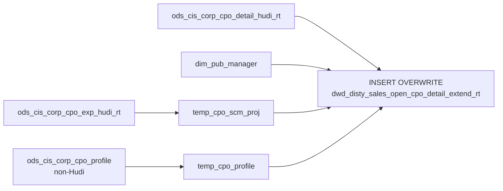

# DWD: Open CPO Detail — Extended Real-Time (`dwd_disty_sales_open_cpo_detail_extend_rt`)

- artifact_type: etl_table
- artifact_id: dw_us.dwd_disty_sales_open_cpo_detail_extend_rt
- domain: cpo
- one_line_purpose: This job is the **real-time variant** of the open CPO line detail pipeline. It reads from **Hudi RT tables** to produce a near-live, non-partitioned snapshot of all open CPO line details enriched with profile data (SPA ref, customer part no...
- layer_type: DWD
- source_kind: etl_sql
- evidence_source: source/etl/sql/csource/etl/sql/po/source/etl/flows/public_order_tools/ingest/public_cpo_dw/script/dwd_disty_sales_open_cpo_detail_extend_rt.sql

---

## L1 Data Foundation

### Identity and physical mapping
- **Table:** `dw_us.dwd_disty_sales_open_cpo_detail_extend_rt`
- **Layer type:** DWD
- **Canonical / derived:** Derived / ETL-loaded (see L3)
- **Owner team:** not registered in metadata catalog

### Grain, scope, exclusions
- **Grain:** one row per `(cpo_id, cpo_line_seq)` — all active open CPO lines.
- **Scope:** See L2 business purpose / L3 filters
- **Partition:** none — full table overwrite on each run. - resolved from pipeline (see L4)
- **Natural key:** `cpo_id`, `cpo_line_seq`.
- **Exclusions:** Not documented in repository

#### Grain detail (preserved)

- **Grain:** one row per `(cpo_id, cpo_line_seq)` — all active open CPO lines.
- **Partition:** none — full table overwrite on each run.
- **Natural key:** `cpo_id`, `cpo_line_seq`.

---

### Cross-engine presence
| Engine | Present | Canonical FQN | Notes |
|--------|---------|---------------|-------|
| Hive | yes | `dwd_disty_sales_open_cpo_detail_extend_rt` | ETL target / intermediate per evidence script |
| Vertica | pending | `dwd_disty_sales_open_cpo_detail_extend_rt` | Confirm via hive2vertica flow evidence / MCP |

### Physical schema reference

Pointer block only - full column catalog lives in WKB L1 storage JSON.

| Field | Value |
|-------|-------|
| **Authoritative catalog** | WKB L1 storage seed (not duplicated in this file) |
| **entity_id** | `dw_us.dwd_disty_sales_open_cpo_detail_extend_rt` |
| **l1_catalog_seed** | `target/storage/wkb/snapshots/_snapshot_id_template/l1_catalog/{engine}_{schema}_{table}.json` |
| **column_count** | pending (run ddl_seed_writer) |
| **partition_keys** | `none — full table overwrite on each run.` |
| **ddl_source** | pending Bitbucket DDL / Vertica metadata ingest |
| **retrieval** | `python -m tools.wkb.indexing.run_query --query "cpo dwd_disty_sales_open_cpo_detail_extend_rt schema" --intent find_table_schema` |

### Lineage
| Object | Role |
|--------|------|
| `ods_${country_code}.ods_cis_corp_cpo_detail_hudi_rt` | Primary source — RT CPO line detail |
| `ods_${country_code}.ods_cis_corp_cpo_exp_hudi_rt` | RT expense lines — SCM/SPA |
| `ods_${country_code}.ods_cis_corp_project_info_hudi_rt` | RT project names |
| `ods_${country_code}.ods_cis_corp_cpo_profile` | Profile data (non-RT) |
| `dim_${country_code}.dim_pub_manager` | User name (non-RT) |
| `dw_${country_code}.dwd_disty_sales_open_cpo_detail_extend_rt` | **Target** — RT enriched open CPO line detail |

---

### Freshness and load path
| Item | Value |
|------|-------|
| Load pattern | See L3 end-to-end / INSERT pattern in evidence script |
| Schedule | Not documented in repository |
| Parameters | `country_code` |


---

## L2 Declarative Knowledge

### Business purpose
This job is the **real-time variant** of the open CPO line detail pipeline. It reads from **Hudi RT tables** to produce a near-live, non-partitioned snapshot of all open CPO line details enriched with profile data (SPA ref, customer part no, contract no, workflow request ID) and SCM/SPA project information. Compared to the `_df` variant, it is significantly **simpler** — it does **not** compute pricing metrics (no adj_amount, gm, gm_net, net_price, off_retail, rebate, list_points, base_cost, list_price). It is designed for fast, near-real-time access to line quantities, status, and reference data only.

---

### Audience and use cases
| Audience | How they benefit |
|----------|-----------------|
| **Operations / fulfilment** | Near-real-time line quantities (`cpo_line_qty`, `cpo_ship_qty`, `cpo_bo_qty`, `cpo_so_qty`), line status, and SPA/SCM reference for in-flight CPO lines. |
| **BI / live dashboards** | Non-partitioned source for real-time CPO line drill-down without pricing overhead. |

---

### Fact key resolution
- Natural key: `cpo_id`, `cpo_line_seq`.
- FK / label-on attributes: see L3 dimension join patterns and step-by-step logic.
- Negative assertion: do not treat descriptive labels as grain keys unless listed under natural key.

### Time field semantics
- **date_flag / partition columns:** none — full table overwrite on each run.
- Primary reporting filter should use the partition column(s) documented in L1; resolve values via L4.


### Metrics served

| Category | Column | Logical metric | Business reading |
|----------|--------|----------------|------------------|
| Measures | — | — | No measure columns mapped for this table. |

### Metric serving map

**Formula authority:** [`source/contracts/cpo/metric-index.md`](../../source/contracts/cpo/metric-index.md)

N/A — no measure columns mapped for this table.

### etl_metrics

No governed logical metrics from `source/contracts/cpo/metric-index.md` are mapped on this table.

---

### Metric serving map
N/A - not a `*_comb_mtd` / multi-period wide serving table (or map not present in legacy doc).


### Data products and column groups (preserved)

### Available columns (subset — no pricing metrics)

- `cpo_id`, `cpo_line_seq`, `cpo_line_no`, `cpo_line_status`
- `cpo_sku_no`, `cpo_sku_inv_type`
- `cpo_line_qty`, `cpo_allocated_qty`, `cpo_bo_qty`, `cpo_so_qty`, `cpo_del_qty`, `cpo_ship_qty`
- `cpo_price`, `cpo_grid_price`, `cpo_unit_price`, `cpo_unit_cost`, `cpo_grid_adj`
- `cpo_extended_price` = `cpo_line_qty × cpo_unit_price`
- `cpo_extended_cost` = `cpo_line_qty × cpo_unit_cost`
- `cpo_gm_percent` = `(cpo_unit_price − cpo_unit_cost) / cpo_unit_price`
- `cpo_price_flag`, `cpo_line_delete_id`, `cpo_line_delete_name`, `cpo_delete_datetime`
- `swl_prog_id`, `cis_unit_cost`
- `cust_part_no`, `scm_no`, `scm_desc`, `spa_no`, `spa_ref_no`, `cpo_extended_exp`, `spa_type`
- `cpo_change_id`, `cpo_change_date`, `cpo_entry_datetime`
- `contract_no`, `wf_request_id`
- `etl_timestamp`

### Not available in this table (present in `_df` detail)

- `adj_amount`, `so_unit_price`, `gm`, `gm_net`, `net_price` (`so_net_price`), `off_retail`, `rebate_total`, `list_points`, `cpo_base_cost`, `cpo_list_price`, `vrf`

---

### etl_metrics

N/A - no calculable ETL formulas extracted from this document (passthrough / stored measures only, or formulas not documented).

---

## L3 Procedural Knowledge

### Query and routing rules
**Business filters:** Use partition / date keys from L1 grain for reporting scope.
**Technical predicates (load only):** See Key filters and step-by-step logic below.

### Dimension join patterns
| Dimension FQN | Join keys | Purpose | Evidence |
|---------------|-----------|---------|----------|
| See step-by-step / base tables | See L3 steps | Dimension enrichment | `source/etl/sql/csource/etl/sql/po/source/etl/flows/public_order_tools/ingest/public_cpo_dw/script/dwd_disty_sales_open_cpo_detail_extend_rt.sql` |

### Key filters and ETL business logic
See step-by-step logic

### Standard time-filter SQL
```sql
-- relative period filter using resolved partition value (see L4)
SELECT *
FROM dwd_disty_sales_open_cpo_detail_extend_rt
WHERE /* partition predicate */ date_flag = '${partition_value}';
```

### End-to-end flow
**Runtime parameters:** `country_code`
**Target table:** `dw_${country_code}.dwd_disty_sales_open_cpo_detail_extend_rt` — **full overwrite, no partitioning**.

1. Build `temp_cpo_profile`: same profile pivot as `_df` detail (from non-Hudi `ods_cis_corp_cpo_profile`).
2. Build `temp_cpo_scm_proj` view: aggregate SCM/SPA from `ods_cis_corp_cpo_exp_hudi_rt` (Hudi RT).
3. **INSERT OVERWRITE** (no PARTITION clause): join `ods_cis_corp_cpo_detail_hudi_rt` + manager + profile + SCM. No pricing chain executed.



---


#### High-level stages (preserved)

| Stage | Business meaning |
|-------|-----------------|
| **Profile extraction** | Same pivot as `_df` detail: SPA ref, cust part no, base cost/MSRP, contract no, workflow request ID from active `ods_cis_corp_cpo_profile` (non-Hudi). |
| **SCM / SPA enrichment** | Aggregates SCM/SPA data from `ods_cis_corp_cpo_exp_hudi_rt` (Hudi RT). |
| **Final INSERT** | Joins `ods_cis_corp_cpo_detail_hudi_rt` to manager lookup + profile + SCM; writes as full overwrite (no partition). No pricing metrics computed. |

**Parameters:** `country_code`

---


### Base tables register
| Object | Role in this job |
|--------|-----------------|
| `ods_${country_code}.ods_cis_corp_cpo_detail_hudi_rt` | **Primary source.** Hudi RT active CPO line detail. |
| `ods_${country_code}.ods_cis_corp_cpo_exp_hudi_rt` | Hudi RT expense lines — SCM/SPA aggregation. |
| `ods_${country_code}.ods_cis_corp_project_info_hudi_rt` | Hudi RT project names for SCM description. |
| `ods_${country_code}.ods_cis_corp_cpo_profile` | Profile pivot (non-Hudi — same as `_df`). |
| `dim_${country_code}.dim_pub_manager` | Delete user name resolution (non-Hudi). |

---

### Step-by-step logic
None identified in repository

### Relationship map (embedded)

| from_fqn | to_fqn | cardinality | join_keys | provenance |
|----------|--------|-------------|-----------|------------|
| `ods_${country_code}.ods_cis_corp_cpo_exp_hudi_rt` | `ods_${country_code}.ods_cis_corp_project_info_hudi_rt` | many:1 | `ce.cpo_scm_no=pinfo.proj_no` | etl_sql (source/etl/sql/cpo/public_order_scripts/public_cpo_dw/script/dwd_disty_sales_open_cpo_detail_extend_rt.sql:1) |
| `ods_${country_code}.ods_cis_corp_cpo_exp_hudi_rt` | `temp_cpo_profile` | many:1 | `ce.cpo_id = cp.cpo_id and ce.cpo_line_seq=cp.cpo_line_seq` | etl_sql (source/etl/sql/cpo/public_order_scripts/public_cpo_dw/script/dwd_disty_sales_open_cpo_detail_extend_rt.sql:1) |
| `ods_${country_code}.ods_cis_corp_cpo_detail_hudi_rt` | `dim_${country_code}.dim_pub_manager` | many:1 | `cd.cpo_delete_id = pm.userid` | etl_sql (source/etl/sql/cpo/public_order_scripts/public_cpo_dw/script/dwd_disty_sales_open_cpo_detail_extend_rt.sql:1) |
| `ods_${country_code}.ods_cis_corp_cpo_detail_hudi_rt` | `temp_cpo_profile` | many:1 | `cd.cpo_id = cp.cpo_id and cd.cpo_line_seq = cp.cpo_line_seq` | etl_sql (source/etl/sql/cpo/public_order_scripts/public_cpo_dw/script/dwd_disty_sales_open_cpo_detail_extend_rt.sql:1) |
| `ods_${country_code}.ods_cis_corp_cpo_detail_hudi_rt` | `temp_cpo_scm_proj` | many:1 | `cd.cpo_id = csp.cpo_id and cd.cpo_line_seq = csp.cpo_line_seq;` | etl_sql (source/etl/sql/cpo/public_order_scripts/public_cpo_dw/script/dwd_disty_sales_open_cpo_detail_extend_rt.sql:1) |

`source/ref/cpo/table relationship.txt`: Not documented in repository.

### Special logic (embedded)

Not documented in repository

### Column / field derivations (from ETL SQL)

| target_column | expression_sql | upstream_columns | upstream_tables | transform_kind | evidence |
|---------------|----------------|------------------|-----------------|----------------|----------|
| `cpo_id` | `cd.cpo_id` | `cpo_id` | `ods_${country_code}.ods_cis_corp_cpo_detail_hudi_rt`, `dim_${country_code}.dim_pub_manager`, `temp_cpo_profile`, `temp_cpo_scm_proj` | passthrough | `source/etl/sql/cpo/public_order_scripts/public_cpo_dw/script/dwd_disty_sales_open_cpo_detail_extend_rt.sql:43` |
| `cpo_line_seq` | `cd.cpo_line_seq` | `cpo_line_seq` | `ods_${country_code}.ods_cis_corp_cpo_detail_hudi_rt`, `dim_${country_code}.dim_pub_manager`, `temp_cpo_profile`, `temp_cpo_scm_proj` | passthrough | `source/etl/sql/cpo/public_order_scripts/public_cpo_dw/script/dwd_disty_sales_open_cpo_detail_extend_rt.sql:44` |
| `cpo_line_no` | `cd.cpo_line_no` | `cpo_line_no` | `ods_${country_code}.ods_cis_corp_cpo_detail_hudi_rt`, `dim_${country_code}.dim_pub_manager`, `temp_cpo_profile`, `temp_cpo_scm_proj` | passthrough | `source/etl/sql/cpo/public_order_scripts/public_cpo_dw/script/dwd_disty_sales_open_cpo_detail_extend_rt.sql:45` |
| `cpo_line_status` | `cd.cpo_line_status` | `cpo_line_status` | `ods_${country_code}.ods_cis_corp_cpo_detail_hudi_rt`, `dim_${country_code}.dim_pub_manager`, `temp_cpo_profile`, `temp_cpo_scm_proj` | passthrough | `source/etl/sql/cpo/public_order_scripts/public_cpo_dw/script/dwd_disty_sales_open_cpo_detail_extend_rt.sql:46` |
| `cpo_sku_no` | `cd.cpo_sku_no` | `cpo_sku_no` | `ods_${country_code}.ods_cis_corp_cpo_detail_hudi_rt`, `dim_${country_code}.dim_pub_manager`, `temp_cpo_profile`, `temp_cpo_scm_proj` | passthrough | `source/etl/sql/cpo/public_order_scripts/public_cpo_dw/script/dwd_disty_sales_open_cpo_detail_extend_rt.sql:47` |
| `cpo_sku_inv_type` | `cd.cpo_sku_inv_type` | `cpo_sku_inv_type` | `ods_${country_code}.ods_cis_corp_cpo_detail_hudi_rt`, `dim_${country_code}.dim_pub_manager`, `temp_cpo_profile`, `temp_cpo_scm_proj` | passthrough | `source/etl/sql/cpo/public_order_scripts/public_cpo_dw/script/dwd_disty_sales_open_cpo_detail_extend_rt.sql:48` |
| `cpo_line_qty` | `cd.cpo_line_qty` | `cpo_line_qty` | `ods_${country_code}.ods_cis_corp_cpo_detail_hudi_rt`, `dim_${country_code}.dim_pub_manager`, `temp_cpo_profile`, `temp_cpo_scm_proj` | passthrough | `source/etl/sql/cpo/public_order_scripts/public_cpo_dw/script/dwd_disty_sales_open_cpo_detail_extend_rt.sql:49` |
| `cpo_allocated_qty` | `cd.cpo_allocated_qty` | `cpo_allocated_qty` | `ods_${country_code}.ods_cis_corp_cpo_detail_hudi_rt`, `dim_${country_code}.dim_pub_manager`, `temp_cpo_profile`, `temp_cpo_scm_proj` | passthrough | `source/etl/sql/cpo/public_order_scripts/public_cpo_dw/script/dwd_disty_sales_open_cpo_detail_extend_rt.sql:50` |
| `cpo_bo_qty` | `cd.cpo_bo_qty` | `cpo_bo_qty` | `ods_${country_code}.ods_cis_corp_cpo_detail_hudi_rt`, `dim_${country_code}.dim_pub_manager`, `temp_cpo_profile`, `temp_cpo_scm_proj` | passthrough | `source/etl/sql/cpo/public_order_scripts/public_cpo_dw/script/dwd_disty_sales_open_cpo_detail_extend_rt.sql:51` |
| `cpo_so_qty` | `cd.cpo_so_qty` | `cpo_so_qty` | `ods_${country_code}.ods_cis_corp_cpo_detail_hudi_rt`, `dim_${country_code}.dim_pub_manager`, `temp_cpo_profile`, `temp_cpo_scm_proj` | passthrough | `source/etl/sql/cpo/public_order_scripts/public_cpo_dw/script/dwd_disty_sales_open_cpo_detail_extend_rt.sql:52` |
| `cpo_del_qty` | `cd.cpo_del_qty` | `cpo_del_qty` | `ods_${country_code}.ods_cis_corp_cpo_detail_hudi_rt`, `dim_${country_code}.dim_pub_manager`, `temp_cpo_profile`, `temp_cpo_scm_proj` | passthrough | `source/etl/sql/cpo/public_order_scripts/public_cpo_dw/script/dwd_disty_sales_open_cpo_detail_extend_rt.sql:53` |
| `cpo_ship_qty` | `cd.cpo_ship_qty` | `cpo_ship_qty` | `ods_${country_code}.ods_cis_corp_cpo_detail_hudi_rt`, `dim_${country_code}.dim_pub_manager`, `temp_cpo_profile`, `temp_cpo_scm_proj` | passthrough | `source/etl/sql/cpo/public_order_scripts/public_cpo_dw/script/dwd_disty_sales_open_cpo_detail_extend_rt.sql:54` |
| `cpo_price` | `cd.cpo_price` | `cpo_price` | `ods_${country_code}.ods_cis_corp_cpo_detail_hudi_rt`, `dim_${country_code}.dim_pub_manager`, `temp_cpo_profile`, `temp_cpo_scm_proj` | passthrough | `source/etl/sql/cpo/public_order_scripts/public_cpo_dw/script/dwd_disty_sales_open_cpo_detail_extend_rt.sql:55` |
| `cpo_grid_price` | `cd.cpo_grid_price` | `cpo_grid_price` | `ods_${country_code}.ods_cis_corp_cpo_detail_hudi_rt`, `dim_${country_code}.dim_pub_manager`, `temp_cpo_profile`, `temp_cpo_scm_proj` | passthrough | `source/etl/sql/cpo/public_order_scripts/public_cpo_dw/script/dwd_disty_sales_open_cpo_detail_extend_rt.sql:56` |
| `cpo_unit_price` | `cd.cpo_unit_price` | `cpo_unit_price` | `ods_${country_code}.ods_cis_corp_cpo_detail_hudi_rt`, `dim_${country_code}.dim_pub_manager`, `temp_cpo_profile`, `temp_cpo_scm_proj` | passthrough | `source/etl/sql/cpo/public_order_scripts/public_cpo_dw/script/dwd_disty_sales_open_cpo_detail_extend_rt.sql:57` |
| `cpo_unit_cost` | `cd.cpo_unit_cost` | `cpo_unit_cost` | `ods_${country_code}.ods_cis_corp_cpo_detail_hudi_rt`, `dim_${country_code}.dim_pub_manager`, `temp_cpo_profile`, `temp_cpo_scm_proj` | passthrough | `source/etl/sql/cpo/public_order_scripts/public_cpo_dw/script/dwd_disty_sales_open_cpo_detail_extend_rt.sql:58` |
| `cpo_extended_price` | `cd.cpo_line_qty *cd.cpo_unit_price` | `cpo_line_qty`, `cpo_unit_price` | `ods_${country_code}.ods_cis_corp_cpo_detail_hudi_rt`, `dim_${country_code}.dim_pub_manager`, `temp_cpo_profile`, `temp_cpo_scm_proj` | arithmetic | `source/etl/sql/cpo/public_order_scripts/public_cpo_dw/script/dwd_disty_sales_open_cpo_detail_extend_rt.sql:59` |
| `cpo_extended_cost` | `cd.cpo_line_qty * cd.cpo_unit_cost` | `cpo_line_qty`, `cpo_unit_cost` | `ods_${country_code}.ods_cis_corp_cpo_detail_hudi_rt`, `dim_${country_code}.dim_pub_manager`, `temp_cpo_profile`, `temp_cpo_scm_proj` | arithmetic | `source/etl/sql/cpo/public_order_scripts/public_cpo_dw/script/dwd_disty_sales_open_cpo_detail_extend_rt.sql:60` |
| `cpo_gm_percent` | `nvl(cd.cpo_unit_price - cd.cpo_unit_cost,0)/ nvl(cd.cpo_unit_price,0)` | `cpo_unit_price`, `cpo_unit_cost` | `ods_${country_code}.ods_cis_corp_cpo_detail_hudi_rt`, `dim_${country_code}.dim_pub_manager`, `temp_cpo_profile`, `temp_cpo_scm_proj` | coalesce | `source/etl/sql/cpo/public_order_scripts/public_cpo_dw/script/dwd_disty_sales_open_cpo_detail_extend_rt.sql:61` |
| `cpo_price_flag` | `cd.cpo_price_flag` | `cpo_price_flag` | `ods_${country_code}.ods_cis_corp_cpo_detail_hudi_rt`, `dim_${country_code}.dim_pub_manager`, `temp_cpo_profile`, `temp_cpo_scm_proj` | passthrough | `source/etl/sql/cpo/public_order_scripts/public_cpo_dw/script/dwd_disty_sales_open_cpo_detail_extend_rt.sql:62` |
| `cpo_line_delete_id` | `cd.cpo_delete_id` | `cpo_delete_id` | `ods_${country_code}.ods_cis_corp_cpo_detail_hudi_rt`, `dim_${country_code}.dim_pub_manager`, `temp_cpo_profile`, `temp_cpo_scm_proj` | rename | `source/etl/sql/cpo/public_order_scripts/public_cpo_dw/script/dwd_disty_sales_open_cpo_detail_extend_rt.sql:63` |
| `cpo_line_delete_name` | `pm.name` | `name` | `ods_${country_code}.ods_cis_corp_cpo_detail_hudi_rt`, `dim_${country_code}.dim_pub_manager`, `temp_cpo_profile`, `temp_cpo_scm_proj` | rename | `source/etl/sql/cpo/public_order_scripts/public_cpo_dw/script/dwd_disty_sales_open_cpo_detail_extend_rt.sql:64` |
| `cpo_delete_datetime` | `cd.cpo_delete_datetime` | `cpo_delete_datetime` | `ods_${country_code}.ods_cis_corp_cpo_detail_hudi_rt`, `dim_${country_code}.dim_pub_manager`, `temp_cpo_profile`, `temp_cpo_scm_proj` | passthrough | `source/etl/sql/cpo/public_order_scripts/public_cpo_dw/script/dwd_disty_sales_open_cpo_detail_extend_rt.sql:65` |
| `cpo_grid_adj` | `cd.cpo_grid_adj` | `cpo_grid_adj` | `ods_${country_code}.ods_cis_corp_cpo_detail_hudi_rt`, `dim_${country_code}.dim_pub_manager`, `temp_cpo_profile`, `temp_cpo_scm_proj` | passthrough | `source/etl/sql/cpo/public_order_scripts/public_cpo_dw/script/dwd_disty_sales_open_cpo_detail_extend_rt.sql:66` |
| `swl_prog_id` | `cd.swl_prog_id` | `swl_prog_id` | `ods_${country_code}.ods_cis_corp_cpo_detail_hudi_rt`, `dim_${country_code}.dim_pub_manager`, `temp_cpo_profile`, `temp_cpo_scm_proj` | passthrough | `source/etl/sql/cpo/public_order_scripts/public_cpo_dw/script/dwd_disty_sales_open_cpo_detail_extend_rt.sql:67` |
| `cis_unit_cost` | `cd.cis_unit_cost` | `cis_unit_cost` | `ods_${country_code}.ods_cis_corp_cpo_detail_hudi_rt`, `dim_${country_code}.dim_pub_manager`, `temp_cpo_profile`, `temp_cpo_scm_proj` | passthrough | `source/etl/sql/cpo/public_order_scripts/public_cpo_dw/script/dwd_disty_sales_open_cpo_detail_extend_rt.sql:68` |
| `cust_part_no` | `cp.cust_part_no` | `cust_part_no` | `ods_${country_code}.ods_cis_corp_cpo_detail_hudi_rt`, `dim_${country_code}.dim_pub_manager`, `temp_cpo_profile`, `temp_cpo_scm_proj` | passthrough | `source/etl/sql/cpo/public_order_scripts/public_cpo_dw/script/dwd_disty_sales_open_cpo_detail_extend_rt.sql:69` |
| `scm_no` | `csp.scm_no` | `scm_no` | `ods_${country_code}.ods_cis_corp_cpo_detail_hudi_rt`, `dim_${country_code}.dim_pub_manager`, `temp_cpo_profile`, `temp_cpo_scm_proj` | passthrough | `source/etl/sql/cpo/public_order_scripts/public_cpo_dw/script/dwd_disty_sales_open_cpo_detail_extend_rt.sql:70` |
| `scm_desc` | `csp.scm_desc` | `scm_desc` | `ods_${country_code}.ods_cis_corp_cpo_detail_hudi_rt`, `dim_${country_code}.dim_pub_manager`, `temp_cpo_profile`, `temp_cpo_scm_proj` | passthrough | `source/etl/sql/cpo/public_order_scripts/public_cpo_dw/script/dwd_disty_sales_open_cpo_detail_extend_rt.sql:71` |
| `spa_no` | `csp.spa_no` | `spa_no` | `ods_${country_code}.ods_cis_corp_cpo_detail_hudi_rt`, `dim_${country_code}.dim_pub_manager`, `temp_cpo_profile`, `temp_cpo_scm_proj` | passthrough | `source/etl/sql/cpo/public_order_scripts/public_cpo_dw/script/dwd_disty_sales_open_cpo_detail_extend_rt.sql:72` |
| `spa_ref_no` | `csp.spa_ref_no` | `spa_ref_no` | `ods_${country_code}.ods_cis_corp_cpo_detail_hudi_rt`, `dim_${country_code}.dim_pub_manager`, `temp_cpo_profile`, `temp_cpo_scm_proj` | passthrough | `source/etl/sql/cpo/public_order_scripts/public_cpo_dw/script/dwd_disty_sales_open_cpo_detail_extend_rt.sql:73` |
| `cpo_extended_exp` | `csp.cpo_extended_exp` | `cpo_extended_exp` | `ods_${country_code}.ods_cis_corp_cpo_detail_hudi_rt`, `dim_${country_code}.dim_pub_manager`, `temp_cpo_profile`, `temp_cpo_scm_proj` | passthrough | `source/etl/sql/cpo/public_order_scripts/public_cpo_dw/script/dwd_disty_sales_open_cpo_detail_extend_rt.sql:74` |
| `spa_type` | `csp.spa_type` | `spa_type` | `ods_${country_code}.ods_cis_corp_cpo_detail_hudi_rt`, `dim_${country_code}.dim_pub_manager`, `temp_cpo_profile`, `temp_cpo_scm_proj` | passthrough | `source/etl/sql/cpo/public_order_scripts/public_cpo_dw/script/dwd_disty_sales_open_cpo_detail_extend_rt.sql:75` |
| `etl_timestamp` | `from_utc_timestamp(current_timestamp(),'America/Los_Angeles')` | `from_utc_timestamp`, `current_timestamp`, `America`, `Los_Angeles` | `ods_${country_code}.ods_cis_corp_cpo_detail_hudi_rt`, `dim_${country_code}.dim_pub_manager`, `temp_cpo_profile`, `temp_cpo_scm_proj` | arithmetic | `source/etl/sql/cpo/public_order_scripts/public_cpo_dw/script/dwd_disty_sales_open_cpo_detail_extend_rt.sql:76` |
| `cpo_change_id` | `cd.cpo_change_id` | `cpo_change_id` | `ods_${country_code}.ods_cis_corp_cpo_detail_hudi_rt`, `dim_${country_code}.dim_pub_manager`, `temp_cpo_profile`, `temp_cpo_scm_proj` | passthrough | `source/etl/sql/cpo/public_order_scripts/public_cpo_dw/script/dwd_disty_sales_open_cpo_detail_extend_rt.sql:77` |
| `cpo_change_date` | `cd.cpo_change_date` | `cpo_change_date` | `ods_${country_code}.ods_cis_corp_cpo_detail_hudi_rt`, `dim_${country_code}.dim_pub_manager`, `temp_cpo_profile`, `temp_cpo_scm_proj` | passthrough | `source/etl/sql/cpo/public_order_scripts/public_cpo_dw/script/dwd_disty_sales_open_cpo_detail_extend_rt.sql:78` |
| `cpo_entry_datetime` | `cd.cpo_entry_datetime` | `cpo_entry_datetime` | `ods_${country_code}.ods_cis_corp_cpo_detail_hudi_rt`, `dim_${country_code}.dim_pub_manager`, `temp_cpo_profile`, `temp_cpo_scm_proj` | passthrough | `source/etl/sql/cpo/public_order_scripts/public_cpo_dw/script/dwd_disty_sales_open_cpo_detail_extend_rt.sql:79` |
| `contract_no` | `cp.contract_no` | `contract_no` | `ods_${country_code}.ods_cis_corp_cpo_detail_hudi_rt`, `dim_${country_code}.dim_pub_manager`, `temp_cpo_profile`, `temp_cpo_scm_proj` | passthrough | `source/etl/sql/cpo/public_order_scripts/public_cpo_dw/script/dwd_disty_sales_open_cpo_detail_extend_rt.sql:80` |
| `wf_request_id` | `cp.wf_request_id` | `wf_request_id` | `ods_${country_code}.ods_cis_corp_cpo_detail_hudi_rt`, `dim_${country_code}.dim_pub_manager`, `temp_cpo_profile`, `temp_cpo_scm_proj` | passthrough | `source/etl/sql/cpo/public_order_scripts/public_cpo_dw/script/dwd_disty_sales_open_cpo_detail_extend_rt.sql:81` |

### Sentinel and code values
| Value | Meaning |
|-------|---------|
| `cpo_delete_date IS NULL` | Only non-deleted expense lines included in SCM/SPA aggregation |
| `cpo_line_seq != 0` | Only line-level (not header-level) expense rows |

---

---

## L4 Validation

### Resolved partition value
| Step | Source | How partition / date scope is determined |
|------|--------|------------------------------------------|
| 1 | evidence script / flow | See parameters in L1 Freshness and L3 filters - `source/etl/sql/csource/etl/sql/po/source/etl/flows/public_order_tools/ingest/public_cpo_dw/script/dwd_disty_sales_open_cpo_detail_extend_rt.sql` |

**Plain language:** Partition and date scope follow Azkaban/bootstrap parameters documented in the source script and orchestrating flow; do not hardcode calendar literals.

### Data quality checks
- Prefer row-count-by-partition, metric sums, and grain duplicate checks (see Validation SQL).
- Additional checks from legacy caveats / operational notes when present.

### Validation SQL
```sql
-- 1) Row count by partition
SELECT ${partition_col}, COUNT(*) AS row_cnt
FROM dw_${country_code}.dwd_disty_sales_open_cpo_detail_extend_rt
WHERE ${partition_col} = '${partition_value}'
GROUP BY ${partition_col};

-- 2) Metric sum by business dimension (top deltas)
SELECT ${dim_key}, SUM(${metric}) AS metric_sum
FROM dw_${country_code}.dwd_disty_sales_open_cpo_detail_extend_rt
WHERE ${partition_col} = '${partition_value}'
GROUP BY ${dim_key}
ORDER BY ABS(SUM(${metric})) DESC
LIMIT 20;

-- 3) Grain duplicate check
SELECT ${grain_key_1}, ${grain_key_2}, ${grain_key_3}, ${partition_col}, COUNT(*) AS cnt
FROM dw_${country_code}.dwd_disty_sales_open_cpo_detail_extend_rt
WHERE ${partition_col} = '${partition_value}'
GROUP BY ${grain_key_1}, ${grain_key_2}, ${grain_key_3}, ${partition_col}
HAVING COUNT(*) > 1;
```

Replace placeholders from this file's Grain and keys / Data you can fetch sections, and use the resolved partition value from run scope.

### Caveats for interpretation
- **No pricing metrics** — this table cannot be used for margin or discount analysis. Use `dwd_disty_sales_open_cpo_detail_extend_df` or `dwd_disty_sales_close_cpo_detail_extend_di` for pricing analytics.
- **Full overwrite on every run** — the entire table is replaced each time.
- **Mixed Hudi RT and non-Hudi sources** — profile data and manager names come from non-RT sources.

---

### Conflicts and open questions
- Schedule, owner, SLA: Not documented in repository (unless preserved schedule evidence above).
- Vertica MCP verification: pending unless confirmed in L5.


#### Key differences from `_df` detail job (preserved from legacy doc)

| Aspect | `_df` (daily batch) | `_rt` (real-time) |
|--------|--------------------|--------------------|
| Detail source | `ods_cis_corp_cpo_detail` | `ods_cis_corp_cpo_detail_hudi_rt` |
| Expense source | `ods_cis_corp_cpo_exp` | `ods_cis_corp_cpo_exp_hudi_rt` |
| Project info | `ods_cis_corp_project_info` | `ods_cis_corp_project_info_hudi_rt` |
| Pricing metrics | Full chain (27 steps) | **None — pricing not computed** |
| VRF | Yes | **No** |
| Partition | `date_flag = '${date_flag}'` | None — full overwrite |

---

---

## L5 Runtime View

### Query path and engine preference
| Role | Hive object | Vertica object | Sync mode | Evidence | MCP verified |
|------|-------------|----------------|-----------|----------|--------------|
| **Query for reporting** | *See script lineage* | `dw_${country_code}.dwd_disty_sales_open_cpo_detail_extend_rt` | *Verify from flow* | *Add flow file:line* | pending |
| **Hive alternative** | `*` | `dw_${country_code}.dwd_disty_sales_open_cpo_detail_extend_rt` | - | *See dependencies* | - |
| **ETL internal** | staging/temp tables | *Not synced to Vertica* | - | *See step-by-step logic* | - |

Business users should query `dw_${country_code}.dwd_disty_sales_open_cpo_detail_extend_rt` in Vertica once MCP verification is completed for this document.

### Access constraints
- Country / company schema parameters may apply (`literal_country`, `company_no`, etc.).
- Hive-only staging objects are not reporting surfaces unless synced.

### Query risk profile
| Field | Value |
|-------|-------|
| requires_date_predicate | unknown |
| scan_risk_tier | high |

---

## L6 Access and Consumption

### Primary consumers and use cases
| Audience | How they benefit |
|----------|-----------------|
| **Operations / fulfilment** | Near-real-time line quantities (`cpo_line_qty`, `cpo_ship_qty`, `cpo_bo_qty`, `cpo_so_qty`), line status, and SPA/SCM reference for in-flight CPO lines. |
| **BI / live dashboards** | Non-partitioned source for real-time CPO line drill-down without pricing overhead. |

---

### Representative query patterns
```sql
-- certified / illustrative lookup - replace predicates from L1/L4
SELECT *
FROM dwd_disty_sales_open_cpo_detail_extend_rt
WHERE date_flag = '${partition_value}'
LIMIT 100;
```

### Dependencies and notes
### Upstream objects (verified)

| Object | Usage | Evidence |
|--------|-------|----------|
| `ods_${country_code}.ods_cis_corp_cpo_detail_hudi_rt` | Primary RT line detail | `dwd_disty_sales_open_cpo_detail_extend_rt.sql:83` |
| `ods_${country_code}.ods_cis_corp_cpo_exp_hudi_rt` | RT SCM/SPA expenses | `dwd_disty_sales_open_cpo_detail_extend_rt.sql:31` |
| `ods_${country_code}.ods_cis_corp_project_info_hudi_rt` | RT project names | `dwd_disty_sales_open_cpo_detail_extend_rt.sql:33` |

### Downstream consumers (verified)

| Object / script | Evidence |
|-----------------|----------|
| None identified in repository. | — |

### Operational detail (verified)

- Full overwrite: `INSERT OVERWRITE TABLE dw_${country_code}.dwd_disty_sales_open_cpo_detail_extend_rt` — no PARTITION clause — `dwd_disty_sales_open_cpo_detail_extend_rt.sql:41`

### Not documented in repository

- Schedule, owner, SLA — not in scripts or configs

---

*Document generated from `source/etl/sql/csource/etl/sql/po/source/etl/flows/public_order_tools/ingest/public_cpo_dw/script/dwd_disty_sales_open_cpo_detail_extend_rt.sql`.*

#### Not documented in repository
- Owner, SLA (unless schedule evidence preserved above)
- Any dependency without `file:line` evidence in this document

---

*Document migrated to L1-L6 from legacy Knowledgebase content. Evidence: `source/etl/sql/csource/etl/sql/po/source/etl/flows/public_order_tools/ingest/public_cpo_dw/script/dwd_disty_sales_open_cpo_detail_extend_rt.sql`.*
