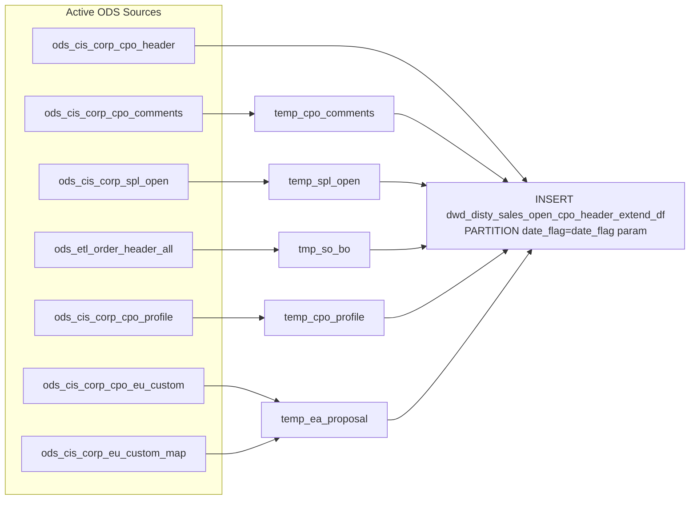

# DWD: Open CPO Header — Extended Daily Snapshot (`dwd_disty_sales_open_cpo_header_extend_df`)

- artifact_type: etl_table
- artifact_id: dw_us.dwd_disty_sales_open_cpo_header_extend_df
- domain: cpo
- one_line_purpose: This job loads the **complete enriched snapshot of all currently open CPO headers** from the active (non-history) ODS tables into a daily partition. It uses the same enrichment logic as the closed CPO header job but reads from live/active s...
- layer_type: DWD
- source_kind: etl_sql
- evidence_source: source/etl/sql/csource/etl/sql/po/source/etl/flows/public_order_tools/ingest/public_cpo_dw/script/dwd_disty_sales_open_cpo_header_extend_df.sql

---

## L1 Data Foundation

### Identity and physical mapping
- **Table:** `dw_us.dwd_disty_sales_open_cpo_header_extend_df`
- **Layer type:** DWD
- **Canonical / derived:** Derived / ETL-loaded (see L3)
- **Owner team:** not registered in metadata catalog

### Grain, scope, exclusions
- **Grain:** one row per `cpo_id` — all currently open CPOs at the time of the run.
- **Scope:** See L2 business purpose / L3 filters
- **Partition:** `date_flag = '${date_flag}'` — literal date supplied as parameter; the entire partition is replaced on each run. - resolved from pipeline (see L4)
- **Natural key:** `cpo_id`.
- **Exclusions:** Not documented in repository

#### Grain detail (preserved)

- **Grain:** one row per `cpo_id` — all currently open CPOs at the time of the run.
- **Partition:** `date_flag = '${date_flag}'` — literal date supplied as parameter; the entire partition is replaced on each run.
- **Natural key:** `cpo_id`.

---

### Cross-engine presence
| Engine | Present | Canonical FQN | Notes |
|--------|---------|---------------|-------|
| Hive | yes | `dwd_disty_sales_open_cpo_header_extend_df` | ETL target / intermediate per evidence script |
| Vertica | pending | `dwd_disty_sales_open_cpo_header_extend_df` | Confirm via hive2vertica flow evidence / MCP |

### Physical schema reference

Pointer block only - full column catalog lives in WKB L1 storage JSON.

| Field | Value |
|-------|-------|
| **Authoritative catalog** | WKB L1 storage seed (not duplicated in this file) |
| **entity_id** | `dw_us.dwd_disty_sales_open_cpo_header_extend_df` |
| **l1_catalog_seed** | `target/storage/wkb/snapshots/_snapshot_id_template/l1_catalog/{engine}_{schema}_{table}.json` |
| **column_count** | pending (run ddl_seed_writer) |
| **partition_keys** | `date_flag = '${date_flag}'` |
| **ddl_source** | pending Bitbucket DDL / Vertica metadata ingest |
| **retrieval** | `python -m tools.wkb.indexing.run_query --query "cpo dwd_disty_sales_open_cpo_header_extend_df schema" --intent find_table_schema` |

### Lineage
| Object | Role |
|--------|------|
| `ods_${country_code}.ods_cis_corp_cpo_header` | Primary source — active open CPO headers |
| (all other sources) | Same as close CPO header job using active `cpo_*` equivalents |
| `dw_${country_code}.dwd_disty_sales_open_cpo_header_extend_df` | **Target** — daily snapshot of enriched open CPO headers |

---

### Freshness and load path
| Item | Value |
|------|-------|
| Load pattern | See L3 end-to-end / INSERT pattern in evidence script |
| Schedule | Not documented in repository |
| Parameters | `country_code`, `date_flag` |


---

## L2 Declarative Knowledge

### Business purpose
This job loads the **complete enriched snapshot of all currently open CPO headers** from the active (non-history) ODS tables into a daily partition. It uses the same enrichment logic as the closed CPO header job but reads from live/active sources instead of history tables. The `_df` (daily full) variant overwrites a single date partition with the full current state of all open CPOs, providing a daily point-in-time view for pipeline management and reporting.

---

### Audience and use cases
| Audience | How they benefit |
|----------|-----------------|
| **Sales / pipeline management** | Full open pipeline CPO headers with opportunity data, probability, close date — daily snapshot for pipeline reports. |
| **Account management** | Customer name, territory, reseller, end-user attributes for all currently open CPOs. |
| **Operations** | `so`, `bo` — linked order and backorder chains for open CPOs. |
| **Finance** | Order totals (`cpo_so_total`, `cpo_bo_total`, `po_total`) and freight for open commitments. |

---

### Fact key resolution
- Natural key: `cpo_id`.
- FK / label-on attributes: see L3 dimension join patterns and step-by-step logic.
- Negative assertion: do not treat descriptive labels as grain keys unless listed under natural key.

### Time field semantics
- **date_flag / partition columns:** `date_flag = '${date_flag}'` — literal date supplied as parameter; the entire partition is replaced on each run.
- Primary reporting filter should use the partition column(s) documented in L1; resolve values via L4.


### Metrics served

| Category | Column | Logical metric | Business reading |
|----------|--------|----------------|------------------|
| Measures | — | — | No measure columns mapped for this table. |

### Metric serving map

**Formula authority:** [`source/contracts/cpo/metric-index.md`](../../source/contracts/cpo/metric-index.md)

N/A — no measure columns mapped for this table.

### etl_metrics

No governed logical metrics from `source/contracts/cpo/metric-index.md` are mapped on this table.

---

### Metric serving map
N/A - not a `*_comb_mtd` / multi-period wide serving table (or map not present in legacy doc).


### Data products and column groups (preserved)

Same column set as `dwd_disty_sales_close_cpo_header_extend_di` with the following differences:
- **No `date_flag` derived from `trans_datetime`** — it is the literal `${date_flag}` parameter.
- **Source is active ODS**, not history — reflects the current open state of each CPO.
- Includes `tso.close_date`, `tso.budgetary`, `tso.hide_flag`, `tso.primary_flag`, `tso.reason_code`, `tso.reason_code_other` (these are on the header in the open variant).

See `dwd_disty_sales_close_cpo_header_extend_di.md` for the full column reference — the field set is identical.

---

### etl_metrics

N/A - no calculable ETL formulas extracted from this document (passthrough / stored measures only, or formulas not documented).

---

## L3 Procedural Knowledge

### Query and routing rules
**Business filters:** Use partition / date keys from L1 grain for reporting scope.
**Technical predicates (load only):** See Key filters and step-by-step logic below.

### Dimension join patterns
| Dimension FQN | Join keys | Purpose | Evidence |
|---------------|-----------|---------|----------|
| See step-by-step / base tables | See L3 steps | Dimension enrichment | `source/etl/sql/csource/etl/sql/po/source/etl/flows/public_order_tools/ingest/public_cpo_dw/script/dwd_disty_sales_open_cpo_header_extend_df.sql` |

### Key filters and ETL business logic
See step-by-step logic

### Standard time-filter SQL
```sql
-- relative period filter using resolved partition value (see L4)
SELECT *
FROM dwd_disty_sales_open_cpo_header_extend_df
WHERE /* partition predicate */ date_flag = '${partition_value}';
```

### End-to-end flow
**Runtime parameters:** `country_code`, `date_flag`
**Target table:** `dw_${country_code}.dwd_disty_sales_open_cpo_header_extend_df`, partitioned by **`date_flag = '${date_flag}'`** (literal).

1–6. Same enrichment steps as the close header job but using active ODS tables (`ods_cis_corp_cpo_*` instead of `ods_cis_corp_history_cpo_*`).
7. **INSERT OVERWRITE** into `dwd_disty_sales_open_cpo_header_extend_df PARTITION (date_flag='${date_flag}')` — no `trans_datetime` filter; all active CPO headers are loaded.



---


#### High-level stages (preserved)

| Stage | Business meaning |
|-------|-----------------|
| **Comments** | Aggregates CC/OX/EX comment types from active `ods_cis_corp_cpo_comments` per CPO. |
| **SPL open** | Reads current pipeline/opportunity data; resolves reason code descriptions; de-duplicates to latest per CPO. |
| **SO / BO linkage** | Collects linked sales order and backorder numbers from `ods_etl_order_header_all`. |
| **CPO profile** | Extracts contract number and workflow request ID from active `ods_cis_corp_cpo_profile`. |
| **EA proposal** | Resolves EA proposal ID from active CPO EU custom fields via EU custom map (`EAPI`). |
| **Final INSERT** | Joins active `ods_cis_corp_cpo_header` to all enrichment tables; writes to the `date_flag = '${date_flag}'` partition. |

**Parameters:** `country_code`, `date_flag`

---


### Base tables register
| Object | Role in this job |
|--------|-----------------|
| `ods_${country_code}.ods_cis_corp_cpo_header` | **Primary source.** Active open CPO headers. No date filter — all open CPOs loaded. |
| `ods_${country_code}.ods_cis_corp_cpo_comments` | Active CPO comments (CC/OX/EX). |
| `ods_${country_code}.ods_cis_corp_spl_open` | Pipeline/opportunity data (same logic as close header). |
| `ods_${country_code}.ods_cis_corp_list_box_detail` | Reason code descriptions (SPLC). |
| `ods_${country_code}.ods_etl_order_header_all` | SO/BO order linkage. |
| `ods_${country_code}.ods_cis_corp_cpo_profile` | `CONTRNO` and `QUOTREQID` profile extraction. |
| `ods_${country_code}.ods_cis_corp_eu_custom_map` | EAPI map type for EA proposal. |
| `ods_${country_code}.ods_cis_corp_cpo_eu_custom` | EA proposal ID from active EU custom fields. |
| `dim_${country_code}.dim_pub_customer_info` | Customer name. |
| `dim_${country_code}.dim_pub_manager` | User names (×4). |
| `ods_${country_code}.ods_cis_corp_from_ref_type` | From-ref-type description. |
| `ods_${country_code}.ods_cis_corp_cpo_eu_common` | End-user common info (`cpo_line_seq = 0`). |
| `ods_${country_code}.ods_cis_corp_territory` | Territory name. |

**Temporary tables (inside the job only):**
`temp_cpo_comments` → `temp_spl_open` → `tmp_so_bo` → `temp_cpo_profile` → `temp_eu_map` → `temp_ea_proposal` → (final INSERT)

---

### Step-by-step logic
None identified in repository

### Relationship map (embedded)

| from_fqn | to_fqn | cardinality | join_keys | provenance |
|----------|--------|-------------|-----------|------------|
| `ods_${country_code}.ods_cis_corp_spl_open` | `ods_${country_code}.ods_cis_corp_list_box_detail` | many:1 | `so.reason_code = lbd.code_value AND lbd.list_box_code = 'SPLC' )t` | etl_sql (source/etl/sql/cpo/public_order_scripts/public_cpo_dw/script/dwd_disty_sales_open_cpo_header_extend_df.sql:1) |
| `ods_${country_code}.ods_cis_corp_cpo_eu_custom` | `temp_eu_map` | many:1 | `ec.eu_map_id=em.eu_map_id and ec.eu_map_line_no=em.eu_map_line_no; --6 intergrate all filed and then merge to target table` | etl_sql (source/etl/sql/cpo/public_order_scripts/public_cpo_dw/script/dwd_disty_sales_open_cpo_header_extend_df.sql:1) |
| `ods_${country_code}.ods_cis_corp_cpo_header` | `dim_${country_code}.dim_pub_customer_info` | many:1 | `ch.cpo_cust_no=pci.cust_no` | etl_sql (source/etl/sql/cpo/public_order_scripts/public_cpo_dw/script/dwd_disty_sales_open_cpo_header_extend_df.sql:1) |
| `ods_${country_code}.ods_cis_corp_cpo_header` | `dim_${country_code}.dim_pub_manager` | many:1 | `ch.cpo_entry_id=pm.userid` | etl_sql (source/etl/sql/cpo/public_order_scripts/public_cpo_dw/script/dwd_disty_sales_open_cpo_header_extend_df.sql:1) |
| `ods_${country_code}.ods_cis_corp_cpo_header` | `ods_${country_code}.ods_cis_corp_from_ref_type` | many:1 | `ch.cpo_from_ref_type=frt.from_ref_type` | etl_sql (source/etl/sql/cpo/public_order_scripts/public_cpo_dw/script/dwd_disty_sales_open_cpo_header_extend_df.sql:1) |
| `ods_${country_code}.ods_cis_corp_cpo_header` | `dim_${country_code}.dim_pub_manager` | many:1 | `ch.convert_user=pm1.userid` | etl_sql (source/etl/sql/cpo/public_order_scripts/public_cpo_dw/script/dwd_disty_sales_open_cpo_header_extend_df.sql:1) |
| `ods_${country_code}.ods_cis_corp_cpo_header` | `dim_${country_code}.dim_pub_manager` | many:1 | `ch.cpo_change_id=pm2.userid` | etl_sql (source/etl/sql/cpo/public_order_scripts/public_cpo_dw/script/dwd_disty_sales_open_cpo_header_extend_df.sql:1) |
| `ods_${country_code}.ods_cis_corp_cpo_header` | `dim_${country_code}.dim_pub_manager` | many:1 | `ch.cpo_delete_id=pm3.userid` | etl_sql (source/etl/sql/cpo/public_order_scripts/public_cpo_dw/script/dwd_disty_sales_open_cpo_header_extend_df.sql:1) |
| `ods_${country_code}.ods_cis_corp_cpo_header` | `temp_cpo_comments` | many:1 | `ch.cpo_id=tcc.cpo_id` | etl_sql (source/etl/sql/cpo/public_order_scripts/public_cpo_dw/script/dwd_disty_sales_open_cpo_header_extend_df.sql:1) |
| `ods_${country_code}.ods_cis_corp_cpo_header` | `ods_${country_code}.ods_cis_corp_cpo_eu_common` | many:1 | `ch.cpo_id=cec.cpo_id and cec.cpo_line_seq=0` | etl_sql (source/etl/sql/cpo/public_order_scripts/public_cpo_dw/script/dwd_disty_sales_open_cpo_header_extend_df.sql:1) |
| `ods_${country_code}.ods_cis_corp_cpo_header` | `temp_spl_open` | many:1 | `ch.cpo_id=tso.int_ref_no` | etl_sql (source/etl/sql/cpo/public_order_scripts/public_cpo_dw/script/dwd_disty_sales_open_cpo_header_extend_df.sql:1) |
| `ods_${country_code}.ods_cis_corp_cpo_header` | `ods_${country_code}.ods_cis_corp_territory` | many:1 | `ch.cpo_sales_terr=ter.sales_terr` | etl_sql (source/etl/sql/cpo/public_order_scripts/public_cpo_dw/script/dwd_disty_sales_open_cpo_header_extend_df.sql:1) |
| `ods_${country_code}.ods_cis_corp_cpo_header` | `tmp_so_bo` | many:1 | `ch.cpo_id=tsb.cpo_id` | etl_sql (source/etl/sql/cpo/public_order_scripts/public_cpo_dw/script/dwd_disty_sales_open_cpo_header_extend_df.sql:1) |
| `ods_${country_code}.ods_cis_corp_cpo_header` | `temp_cpo_profile` | many:1 | `ch.cpo_id=cp.cpo_id` | etl_sql (source/etl/sql/cpo/public_order_scripts/public_cpo_dw/script/dwd_disty_sales_open_cpo_header_extend_df.sql:1) |
| `ods_${country_code}.ods_cis_corp_cpo_header` | `temp_ea_proposal` | many:1 | `ch.cpo_id=ep.cpo_id;` | etl_sql (source/etl/sql/cpo/public_order_scripts/public_cpo_dw/script/dwd_disty_sales_open_cpo_header_extend_df.sql:1) |

`source/ref/cpo/table relationship.txt`: Not documented in repository.

### Special logic (embedded)

Not documented in repository

### Column / field derivations (from ETL SQL)

| target_column | expression_sql | upstream_columns | upstream_tables | transform_kind | evidence |
|---------------|----------------|------------------|-----------------|----------------|----------|
| `cpo_id` | `ch.cpo_id` | `cpo_id` | `ods_${country_code}.ods_cis_corp_cpo_header`, `dim_${country_code}.dim_pub_customer_info`, `dim_${country_code}.dim_pub_manager`, `ods_${country_code}.ods_cis_corp_from_ref_type`, `temp_cpo_comments`, `ods_${country_code}.ods_cis_corp_cpo_eu_common`, `temp_spl_open`, `ods_${country_code}.ods_cis_corp_territory`, `tmp_so_bo`, `temp_cpo_profile`, `temp_ea_proposal` | passthrough | `source/etl/sql/cpo/public_order_scripts/public_cpo_dw/script/dwd_disty_sales_open_cpo_header_extend_df.sql:128` |
| `cpo_no` | `ch.cpo_no` | `cpo_no` | `ods_${country_code}.ods_cis_corp_cpo_header`, `dim_${country_code}.dim_pub_customer_info`, `dim_${country_code}.dim_pub_manager`, `ods_${country_code}.ods_cis_corp_from_ref_type`, `temp_cpo_comments`, `ods_${country_code}.ods_cis_corp_cpo_eu_common`, `temp_spl_open`, `ods_${country_code}.ods_cis_corp_territory`, `tmp_so_bo`, `temp_cpo_profile`, `temp_ea_proposal` | passthrough | `source/etl/sql/cpo/public_order_scripts/public_cpo_dw/script/dwd_disty_sales_open_cpo_header_extend_df.sql:129` |
| `cpo_cust_no` | `ch.cpo_cust_no` | `cpo_cust_no` | `ods_${country_code}.ods_cis_corp_cpo_header`, `dim_${country_code}.dim_pub_customer_info`, `dim_${country_code}.dim_pub_manager`, `ods_${country_code}.ods_cis_corp_from_ref_type`, `temp_cpo_comments`, `ods_${country_code}.ods_cis_corp_cpo_eu_common`, `temp_spl_open`, `ods_${country_code}.ods_cis_corp_territory`, `tmp_so_bo`, `temp_cpo_profile`, `temp_ea_proposal` | passthrough | `source/etl/sql/cpo/public_order_scripts/public_cpo_dw/script/dwd_disty_sales_open_cpo_header_extend_df.sql:130` |
| `cpo_cust_name` | `pci.cust_name cpo_cust_name` | `cust_name`, `cpo_cust_name` | `ods_${country_code}.ods_cis_corp_cpo_header`, `dim_${country_code}.dim_pub_customer_info`, `dim_${country_code}.dim_pub_manager`, `ods_${country_code}.ods_cis_corp_from_ref_type`, `temp_cpo_comments`, `ods_${country_code}.ods_cis_corp_cpo_eu_common`, `temp_spl_open`, `ods_${country_code}.ods_cis_corp_territory`, `tmp_so_bo`, `temp_cpo_profile`, `temp_ea_proposal` | partial | `source/etl/sql/cpo/public_order_scripts/public_cpo_dw/script/dwd_disty_sales_open_cpo_header_extend_df.sql:131` |
| `cpo_sales_terr` | `ch.cpo_sales_terr` | `cpo_sales_terr` | `ods_${country_code}.ods_cis_corp_cpo_header`, `dim_${country_code}.dim_pub_customer_info`, `dim_${country_code}.dim_pub_manager`, `ods_${country_code}.ods_cis_corp_from_ref_type`, `temp_cpo_comments`, `ods_${country_code}.ods_cis_corp_cpo_eu_common`, `temp_spl_open`, `ods_${country_code}.ods_cis_corp_territory`, `tmp_so_bo`, `temp_cpo_profile`, `temp_ea_proposal` | passthrough | `source/etl/sql/cpo/public_order_scripts/public_cpo_dw/script/dwd_disty_sales_open_cpo_header_extend_df.sql:132` |
| `cpo_entry_id` | `ch.cpo_entry_id` | `cpo_entry_id` | `ods_${country_code}.ods_cis_corp_cpo_header`, `dim_${country_code}.dim_pub_customer_info`, `dim_${country_code}.dim_pub_manager`, `ods_${country_code}.ods_cis_corp_from_ref_type`, `temp_cpo_comments`, `ods_${country_code}.ods_cis_corp_cpo_eu_common`, `temp_spl_open`, `ods_${country_code}.ods_cis_corp_territory`, `tmp_so_bo`, `temp_cpo_profile`, `temp_ea_proposal` | passthrough | `source/etl/sql/cpo/public_order_scripts/public_cpo_dw/script/dwd_disty_sales_open_cpo_header_extend_df.sql:133` |
| `cpo_entry_name` | `pm.name` | `name` | `ods_${country_code}.ods_cis_corp_cpo_header`, `dim_${country_code}.dim_pub_customer_info`, `dim_${country_code}.dim_pub_manager`, `ods_${country_code}.ods_cis_corp_from_ref_type`, `temp_cpo_comments`, `ods_${country_code}.ods_cis_corp_cpo_eu_common`, `temp_spl_open`, `ods_${country_code}.ods_cis_corp_territory`, `tmp_so_bo`, `temp_cpo_profile`, `temp_ea_proposal` | rename | `source/etl/sql/cpo/public_order_scripts/public_cpo_dw/script/dwd_disty_sales_open_cpo_header_extend_df.sql:134` |
| `cpo_entry_datetime` | `ch.cpo_entry_datetime` | `cpo_entry_datetime` | `ods_${country_code}.ods_cis_corp_cpo_header`, `dim_${country_code}.dim_pub_customer_info`, `dim_${country_code}.dim_pub_manager`, `ods_${country_code}.ods_cis_corp_from_ref_type`, `temp_cpo_comments`, `ods_${country_code}.ods_cis_corp_cpo_eu_common`, `temp_spl_open`, `ods_${country_code}.ods_cis_corp_territory`, `tmp_so_bo`, `temp_cpo_profile`, `temp_ea_proposal` | passthrough | `source/etl/sql/cpo/public_order_scripts/public_cpo_dw/script/dwd_disty_sales_open_cpo_header_extend_df.sql:135` |
| `cpo_from_ref_type` | `ch.cpo_from_ref_type` | `cpo_from_ref_type` | `ods_${country_code}.ods_cis_corp_cpo_header`, `dim_${country_code}.dim_pub_customer_info`, `dim_${country_code}.dim_pub_manager`, `ods_${country_code}.ods_cis_corp_from_ref_type`, `temp_cpo_comments`, `ods_${country_code}.ods_cis_corp_cpo_eu_common`, `temp_spl_open`, `ods_${country_code}.ods_cis_corp_territory`, `tmp_so_bo`, `temp_cpo_profile`, `temp_ea_proposal` | passthrough | `source/etl/sql/cpo/public_order_scripts/public_cpo_dw/script/dwd_disty_sales_open_cpo_header_extend_df.sql:136` |
| `cpo_from_ref_type_desc` | `frt.from_ref_type_desc` | `from_ref_type_desc` | `ods_${country_code}.ods_cis_corp_cpo_header`, `dim_${country_code}.dim_pub_customer_info`, `dim_${country_code}.dim_pub_manager`, `ods_${country_code}.ods_cis_corp_from_ref_type`, `temp_cpo_comments`, `ods_${country_code}.ods_cis_corp_cpo_eu_common`, `temp_spl_open`, `ods_${country_code}.ods_cis_corp_territory`, `tmp_so_bo`, `temp_cpo_profile`, `temp_ea_proposal` | rename | `source/etl/sql/cpo/public_order_scripts/public_cpo_dw/script/dwd_disty_sales_open_cpo_header_extend_df.sql:137` |
| `system_type` | `frt.system_type` | `system_type` | `ods_${country_code}.ods_cis_corp_cpo_header`, `dim_${country_code}.dim_pub_customer_info`, `dim_${country_code}.dim_pub_manager`, `ods_${country_code}.ods_cis_corp_from_ref_type`, `temp_cpo_comments`, `ods_${country_code}.ods_cis_corp_cpo_eu_common`, `temp_spl_open`, `ods_${country_code}.ods_cis_corp_territory`, `tmp_so_bo`, `temp_cpo_profile`, `temp_ea_proposal` | passthrough | `source/etl/sql/cpo/public_order_scripts/public_cpo_dw/script/dwd_disty_sales_open_cpo_header_extend_df.sql:138` |
| `cpo_pay_meth` | `ch.cpo_pay_meth` | `cpo_pay_meth` | `ods_${country_code}.ods_cis_corp_cpo_header`, `dim_${country_code}.dim_pub_customer_info`, `dim_${country_code}.dim_pub_manager`, `ods_${country_code}.ods_cis_corp_from_ref_type`, `temp_cpo_comments`, `ods_${country_code}.ods_cis_corp_cpo_eu_common`, `temp_spl_open`, `ods_${country_code}.ods_cis_corp_territory`, `tmp_so_bo`, `temp_cpo_profile`, `temp_ea_proposal` | passthrough | `source/etl/sql/cpo/public_order_scripts/public_cpo_dw/script/dwd_disty_sales_open_cpo_header_extend_df.sql:139` |
| `cpo_total_taxable` | `ch.cpo_total_taxable` | `cpo_total_taxable` | `ods_${country_code}.ods_cis_corp_cpo_header`, `dim_${country_code}.dim_pub_customer_info`, `dim_${country_code}.dim_pub_manager`, `ods_${country_code}.ods_cis_corp_from_ref_type`, `temp_cpo_comments`, `ods_${country_code}.ods_cis_corp_cpo_eu_common`, `temp_spl_open`, `ods_${country_code}.ods_cis_corp_territory`, `tmp_so_bo`, `temp_cpo_profile`, `temp_ea_proposal` | passthrough | `source/etl/sql/cpo/public_order_scripts/public_cpo_dw/script/dwd_disty_sales_open_cpo_header_extend_df.sql:140` |
| `cpo_total_notax` | `ch.cpo_total_notax` | `cpo_total_notax` | `ods_${country_code}.ods_cis_corp_cpo_header`, `dim_${country_code}.dim_pub_customer_info`, `dim_${country_code}.dim_pub_manager`, `ods_${country_code}.ods_cis_corp_from_ref_type`, `temp_cpo_comments`, `ods_${country_code}.ods_cis_corp_cpo_eu_common`, `temp_spl_open`, `ods_${country_code}.ods_cis_corp_territory`, `tmp_so_bo`, `temp_cpo_profile`, `temp_ea_proposal` | passthrough | `source/etl/sql/cpo/public_order_scripts/public_cpo_dw/script/dwd_disty_sales_open_cpo_header_extend_df.sql:141` |
| `cpo_sales_tax` | `ch.cpo_sales_tax` | `cpo_sales_tax` | `ods_${country_code}.ods_cis_corp_cpo_header`, `dim_${country_code}.dim_pub_customer_info`, `dim_${country_code}.dim_pub_manager`, `ods_${country_code}.ods_cis_corp_from_ref_type`, `temp_cpo_comments`, `ods_${country_code}.ods_cis_corp_cpo_eu_common`, `temp_spl_open`, `ods_${country_code}.ods_cis_corp_territory`, `tmp_so_bo`, `temp_cpo_profile`, `temp_ea_proposal` | passthrough | `source/etl/sql/cpo/public_order_scripts/public_cpo_dw/script/dwd_disty_sales_open_cpo_header_extend_df.sql:142` |
| `cpo_freight` | `ch.cpo_freight` | `cpo_freight` | `ods_${country_code}.ods_cis_corp_cpo_header`, `dim_${country_code}.dim_pub_customer_info`, `dim_${country_code}.dim_pub_manager`, `ods_${country_code}.ods_cis_corp_from_ref_type`, `temp_cpo_comments`, `ods_${country_code}.ods_cis_corp_cpo_eu_common`, `temp_spl_open`, `ods_${country_code}.ods_cis_corp_territory`, `tmp_so_bo`, `temp_cpo_profile`, `temp_ea_proposal` | passthrough | `source/etl/sql/cpo/public_order_scripts/public_cpo_dw/script/dwd_disty_sales_open_cpo_header_extend_df.sql:143` |
| `cpo_other` | `ch.cpo_other` | `cpo_other` | `ods_${country_code}.ods_cis_corp_cpo_header`, `dim_${country_code}.dim_pub_customer_info`, `dim_${country_code}.dim_pub_manager`, `ods_${country_code}.ods_cis_corp_from_ref_type`, `temp_cpo_comments`, `ods_${country_code}.ods_cis_corp_cpo_eu_common`, `temp_spl_open`, `ods_${country_code}.ods_cis_corp_territory`, `tmp_so_bo`, `temp_cpo_profile`, `temp_ea_proposal` | passthrough | `source/etl/sql/cpo/public_order_scripts/public_cpo_dw/script/dwd_disty_sales_open_cpo_header_extend_df.sql:144` |
| `cpo_so_total` | `ch.cpo_so_total` | `cpo_so_total` | `ods_${country_code}.ods_cis_corp_cpo_header`, `dim_${country_code}.dim_pub_customer_info`, `dim_${country_code}.dim_pub_manager`, `ods_${country_code}.ods_cis_corp_from_ref_type`, `temp_cpo_comments`, `ods_${country_code}.ods_cis_corp_cpo_eu_common`, `temp_spl_open`, `ods_${country_code}.ods_cis_corp_territory`, `tmp_so_bo`, `temp_cpo_profile`, `temp_ea_proposal` | passthrough | `source/etl/sql/cpo/public_order_scripts/public_cpo_dw/script/dwd_disty_sales_open_cpo_header_extend_df.sql:145` |
| `cpo_bo_total` | `ch.cpo_bo_total` | `cpo_bo_total` | `ods_${country_code}.ods_cis_corp_cpo_header`, `dim_${country_code}.dim_pub_customer_info`, `dim_${country_code}.dim_pub_manager`, `ods_${country_code}.ods_cis_corp_from_ref_type`, `temp_cpo_comments`, `ods_${country_code}.ods_cis_corp_cpo_eu_common`, `temp_spl_open`, `ods_${country_code}.ods_cis_corp_territory`, `tmp_so_bo`, `temp_cpo_profile`, `temp_ea_proposal` | passthrough | `source/etl/sql/cpo/public_order_scripts/public_cpo_dw/script/dwd_disty_sales_open_cpo_header_extend_df.sql:146` |
| `po_total` | `ch.po_total` | `po_total` | `ods_${country_code}.ods_cis_corp_cpo_header`, `dim_${country_code}.dim_pub_customer_info`, `dim_${country_code}.dim_pub_manager`, `ods_${country_code}.ods_cis_corp_from_ref_type`, `temp_cpo_comments`, `ods_${country_code}.ods_cis_corp_cpo_eu_common`, `temp_spl_open`, `ods_${country_code}.ods_cis_corp_territory`, `tmp_so_bo`, `temp_cpo_profile`, `temp_ea_proposal` | passthrough | `source/etl/sql/cpo/public_order_scripts/public_cpo_dw/script/dwd_disty_sales_open_cpo_header_extend_df.sql:147` |
| `cpo_ship_method` | `ch.cpo_ship_method` | `cpo_ship_method` | `ods_${country_code}.ods_cis_corp_cpo_header`, `dim_${country_code}.dim_pub_customer_info`, `dim_${country_code}.dim_pub_manager`, `ods_${country_code}.ods_cis_corp_from_ref_type`, `temp_cpo_comments`, `ods_${country_code}.ods_cis_corp_cpo_eu_common`, `temp_spl_open`, `ods_${country_code}.ods_cis_corp_territory`, `tmp_so_bo`, `temp_cpo_profile`, `temp_ea_proposal` | passthrough | `source/etl/sql/cpo/public_order_scripts/public_cpo_dw/script/dwd_disty_sales_open_cpo_header_extend_df.sql:148` |
| `cpo_ship_loc_type` | `ch.cpo_ship_loc_type` | `cpo_ship_loc_type` | `ods_${country_code}.ods_cis_corp_cpo_header`, `dim_${country_code}.dim_pub_customer_info`, `dim_${country_code}.dim_pub_manager`, `ods_${country_code}.ods_cis_corp_from_ref_type`, `temp_cpo_comments`, `ods_${country_code}.ods_cis_corp_cpo_eu_common`, `temp_spl_open`, `ods_${country_code}.ods_cis_corp_territory`, `tmp_so_bo`, `temp_cpo_profile`, `temp_ea_proposal` | passthrough | `source/etl/sql/cpo/public_order_scripts/public_cpo_dw/script/dwd_disty_sales_open_cpo_header_extend_df.sql:149` |
| `end_user_po_no` | `ch.end_user_po_no` | `end_user_po_no` | `ods_${country_code}.ods_cis_corp_cpo_header`, `dim_${country_code}.dim_pub_customer_info`, `dim_${country_code}.dim_pub_manager`, `ods_${country_code}.ods_cis_corp_from_ref_type`, `temp_cpo_comments`, `ods_${country_code}.ods_cis_corp_cpo_eu_common`, `temp_spl_open`, `ods_${country_code}.ods_cis_corp_territory`, `tmp_so_bo`, `temp_cpo_profile`, `temp_ea_proposal` | passthrough | `source/etl/sql/cpo/public_order_scripts/public_cpo_dw/script/dwd_disty_sales_open_cpo_header_extend_df.sql:150` |
| `special_handle` | `ch.special_handle` | `special_handle` | `ods_${country_code}.ods_cis_corp_cpo_header`, `dim_${country_code}.dim_pub_customer_info`, `dim_${country_code}.dim_pub_manager`, `ods_${country_code}.ods_cis_corp_from_ref_type`, `temp_cpo_comments`, `ods_${country_code}.ods_cis_corp_cpo_eu_common`, `temp_spl_open`, `ods_${country_code}.ods_cis_corp_territory`, `tmp_so_bo`, `temp_cpo_profile`, `temp_ea_proposal` | passthrough | `source/etl/sql/cpo/public_order_scripts/public_cpo_dw/script/dwd_disty_sales_open_cpo_header_extend_df.sql:151` |
| `ship_name1` | `ch.ship_name1` | `ship_name1` | `ods_${country_code}.ods_cis_corp_cpo_header`, `dim_${country_code}.dim_pub_customer_info`, `dim_${country_code}.dim_pub_manager`, `ods_${country_code}.ods_cis_corp_from_ref_type`, `temp_cpo_comments`, `ods_${country_code}.ods_cis_corp_cpo_eu_common`, `temp_spl_open`, `ods_${country_code}.ods_cis_corp_territory`, `tmp_so_bo`, `temp_cpo_profile`, `temp_ea_proposal` | passthrough | `source/etl/sql/cpo/public_order_scripts/public_cpo_dw/script/dwd_disty_sales_open_cpo_header_extend_df.sql:152` |
| `ship_addr1` | `ch.ship_addr1` | `ship_addr1` | `ods_${country_code}.ods_cis_corp_cpo_header`, `dim_${country_code}.dim_pub_customer_info`, `dim_${country_code}.dim_pub_manager`, `ods_${country_code}.ods_cis_corp_from_ref_type`, `temp_cpo_comments`, `ods_${country_code}.ods_cis_corp_cpo_eu_common`, `temp_spl_open`, `ods_${country_code}.ods_cis_corp_territory`, `tmp_so_bo`, `temp_cpo_profile`, `temp_ea_proposal` | passthrough | `source/etl/sql/cpo/public_order_scripts/public_cpo_dw/script/dwd_disty_sales_open_cpo_header_extend_df.sql:153` |
| `ship_addr2` | `ch.ship_addr2` | `ship_addr2` | `ods_${country_code}.ods_cis_corp_cpo_header`, `dim_${country_code}.dim_pub_customer_info`, `dim_${country_code}.dim_pub_manager`, `ods_${country_code}.ods_cis_corp_from_ref_type`, `temp_cpo_comments`, `ods_${country_code}.ods_cis_corp_cpo_eu_common`, `temp_spl_open`, `ods_${country_code}.ods_cis_corp_territory`, `tmp_so_bo`, `temp_cpo_profile`, `temp_ea_proposal` | passthrough | `source/etl/sql/cpo/public_order_scripts/public_cpo_dw/script/dwd_disty_sales_open_cpo_header_extend_df.sql:154` |
| `ship_zipcode` | `ch.ship_zipcode` | `ship_zipcode` | `ods_${country_code}.ods_cis_corp_cpo_header`, `dim_${country_code}.dim_pub_customer_info`, `dim_${country_code}.dim_pub_manager`, `ods_${country_code}.ods_cis_corp_from_ref_type`, `temp_cpo_comments`, `ods_${country_code}.ods_cis_corp_cpo_eu_common`, `temp_spl_open`, `ods_${country_code}.ods_cis_corp_territory`, `tmp_so_bo`, `temp_cpo_profile`, `temp_ea_proposal` | passthrough | `source/etl/sql/cpo/public_order_scripts/public_cpo_dw/script/dwd_disty_sales_open_cpo_header_extend_df.sql:155` |
| `ship_country` | `ch.ship_country` | `ship_country` | `ods_${country_code}.ods_cis_corp_cpo_header`, `dim_${country_code}.dim_pub_customer_info`, `dim_${country_code}.dim_pub_manager`, `ods_${country_code}.ods_cis_corp_from_ref_type`, `temp_cpo_comments`, `ods_${country_code}.ods_cis_corp_cpo_eu_common`, `temp_spl_open`, `ods_${country_code}.ods_cis_corp_territory`, `tmp_so_bo`, `temp_cpo_profile`, `temp_ea_proposal` | passthrough | `source/etl/sql/cpo/public_order_scripts/public_cpo_dw/script/dwd_disty_sales_open_cpo_header_extend_df.sql:156` |
| `ship_city` | `ch.ship_city` | `ship_city` | `ods_${country_code}.ods_cis_corp_cpo_header`, `dim_${country_code}.dim_pub_customer_info`, `dim_${country_code}.dim_pub_manager`, `ods_${country_code}.ods_cis_corp_from_ref_type`, `temp_cpo_comments`, `ods_${country_code}.ods_cis_corp_cpo_eu_common`, `temp_spl_open`, `ods_${country_code}.ods_cis_corp_territory`, `tmp_so_bo`, `temp_cpo_profile`, `temp_ea_proposal` | passthrough | `source/etl/sql/cpo/public_order_scripts/public_cpo_dw/script/dwd_disty_sales_open_cpo_header_extend_df.sql:157` |
| `ship_state` | `ch.ship_state` | `ship_state` | `ods_${country_code}.ods_cis_corp_cpo_header`, `dim_${country_code}.dim_pub_customer_info`, `dim_${country_code}.dim_pub_manager`, `ods_${country_code}.ods_cis_corp_from_ref_type`, `temp_cpo_comments`, `ods_${country_code}.ods_cis_corp_cpo_eu_common`, `temp_spl_open`, `ods_${country_code}.ods_cis_corp_territory`, `tmp_so_bo`, `temp_cpo_profile`, `temp_ea_proposal` | passthrough | `source/etl/sql/cpo/public_order_scripts/public_cpo_dw/script/dwd_disty_sales_open_cpo_header_extend_df.sql:158` |
| `ship_contact` | `ch.ship_contact` | `ship_contact` | `ods_${country_code}.ods_cis_corp_cpo_header`, `dim_${country_code}.dim_pub_customer_info`, `dim_${country_code}.dim_pub_manager`, `ods_${country_code}.ods_cis_corp_from_ref_type`, `temp_cpo_comments`, `ods_${country_code}.ods_cis_corp_cpo_eu_common`, `temp_spl_open`, `ods_${country_code}.ods_cis_corp_territory`, `tmp_so_bo`, `temp_cpo_profile`, `temp_ea_proposal` | passthrough | `source/etl/sql/cpo/public_order_scripts/public_cpo_dw/script/dwd_disty_sales_open_cpo_header_extend_df.sql:159` |
| `ship_phone` | `ch.ship_phone` | `ship_phone` | `ods_${country_code}.ods_cis_corp_cpo_header`, `dim_${country_code}.dim_pub_customer_info`, `dim_${country_code}.dim_pub_manager`, `ods_${country_code}.ods_cis_corp_from_ref_type`, `temp_cpo_comments`, `ods_${country_code}.ods_cis_corp_cpo_eu_common`, `temp_spl_open`, `ods_${country_code}.ods_cis_corp_territory`, `tmp_so_bo`, `temp_cpo_profile`, `temp_ea_proposal` | passthrough | `source/etl/sql/cpo/public_order_scripts/public_cpo_dw/script/dwd_disty_sales_open_cpo_header_extend_df.sql:160` |
| `frt_pay_type` | `ch.frt_pay_type` | `frt_pay_type` | `ods_${country_code}.ods_cis_corp_cpo_header`, `dim_${country_code}.dim_pub_customer_info`, `dim_${country_code}.dim_pub_manager`, `ods_${country_code}.ods_cis_corp_from_ref_type`, `temp_cpo_comments`, `ods_${country_code}.ods_cis_corp_cpo_eu_common`, `temp_spl_open`, `ods_${country_code}.ods_cis_corp_territory`, `tmp_so_bo`, `temp_cpo_profile`, `temp_ea_proposal` | passthrough | `source/etl/sql/cpo/public_order_scripts/public_cpo_dw/script/dwd_disty_sales_open_cpo_header_extend_df.sql:161` |
| `convert_datetime` | `ch.convert_datetime` | `convert_datetime` | `ods_${country_code}.ods_cis_corp_cpo_header`, `dim_${country_code}.dim_pub_customer_info`, `dim_${country_code}.dim_pub_manager`, `ods_${country_code}.ods_cis_corp_from_ref_type`, `temp_cpo_comments`, `ods_${country_code}.ods_cis_corp_cpo_eu_common`, `temp_spl_open`, `ods_${country_code}.ods_cis_corp_territory`, `tmp_so_bo`, `temp_cpo_profile`, `temp_ea_proposal` | passthrough | `source/etl/sql/cpo/public_order_scripts/public_cpo_dw/script/dwd_disty_sales_open_cpo_header_extend_df.sql:162` |
| `convert_user` | `ch.convert_user` | `convert_user` | `ods_${country_code}.ods_cis_corp_cpo_header`, `dim_${country_code}.dim_pub_customer_info`, `dim_${country_code}.dim_pub_manager`, `ods_${country_code}.ods_cis_corp_from_ref_type`, `temp_cpo_comments`, `ods_${country_code}.ods_cis_corp_cpo_eu_common`, `temp_spl_open`, `ods_${country_code}.ods_cis_corp_territory`, `tmp_so_bo`, `temp_cpo_profile`, `temp_ea_proposal` | passthrough | `source/etl/sql/cpo/public_order_scripts/public_cpo_dw/script/dwd_disty_sales_open_cpo_header_extend_df.sql:163` |
| `convert_user_name` | `pm1.name` | `name` | `ods_${country_code}.ods_cis_corp_cpo_header`, `dim_${country_code}.dim_pub_customer_info`, `dim_${country_code}.dim_pub_manager`, `ods_${country_code}.ods_cis_corp_from_ref_type`, `temp_cpo_comments`, `ods_${country_code}.ods_cis_corp_cpo_eu_common`, `temp_spl_open`, `ods_${country_code}.ods_cis_corp_territory`, `tmp_so_bo`, `temp_cpo_profile`, `temp_ea_proposal` | rename | `source/etl/sql/cpo/public_order_scripts/public_cpo_dw/script/dwd_disty_sales_open_cpo_header_extend_df.sql:164` |
| `sales_model` | `ch.sales_model` | `sales_model` | `ods_${country_code}.ods_cis_corp_cpo_header`, `dim_${country_code}.dim_pub_customer_info`, `dim_${country_code}.dim_pub_manager`, `ods_${country_code}.ods_cis_corp_from_ref_type`, `temp_cpo_comments`, `ods_${country_code}.ods_cis_corp_cpo_eu_common`, `temp_spl_open`, `ods_${country_code}.ods_cis_corp_territory`, `tmp_so_bo`, `temp_cpo_profile`, `temp_ea_proposal` | passthrough | `source/etl/sql/cpo/public_order_scripts/public_cpo_dw/script/dwd_disty_sales_open_cpo_header_extend_df.sql:165` |
| `reseller_cust_no` | `ch.reseller_cust_no` | `reseller_cust_no` | `ods_${country_code}.ods_cis_corp_cpo_header`, `dim_${country_code}.dim_pub_customer_info`, `dim_${country_code}.dim_pub_manager`, `ods_${country_code}.ods_cis_corp_from_ref_type`, `temp_cpo_comments`, `ods_${country_code}.ods_cis_corp_cpo_eu_common`, `temp_spl_open`, `ods_${country_code}.ods_cis_corp_territory`, `tmp_so_bo`, `temp_cpo_profile`, `temp_ea_proposal` | passthrough | `source/etl/sql/cpo/public_order_scripts/public_cpo_dw/script/dwd_disty_sales_open_cpo_header_extend_df.sql:166` |
| `shopping_mode` | `ch.shopping_mode` | `shopping_mode` | `ods_${country_code}.ods_cis_corp_cpo_header`, `dim_${country_code}.dim_pub_customer_info`, `dim_${country_code}.dim_pub_manager`, `ods_${country_code}.ods_cis_corp_from_ref_type`, `temp_cpo_comments`, `ods_${country_code}.ods_cis_corp_cpo_eu_common`, `temp_spl_open`, `ods_${country_code}.ods_cis_corp_territory`, `tmp_so_bo`, `temp_cpo_profile`, `temp_ea_proposal` | passthrough | `source/etl/sql/cpo/public_order_scripts/public_cpo_dw/script/dwd_disty_sales_open_cpo_header_extend_df.sql:167` |
| `end_user_no` | `ch.end_user_no` | `end_user_no` | `ods_${country_code}.ods_cis_corp_cpo_header`, `dim_${country_code}.dim_pub_customer_info`, `dim_${country_code}.dim_pub_manager`, `ods_${country_code}.ods_cis_corp_from_ref_type`, `temp_cpo_comments`, `ods_${country_code}.ods_cis_corp_cpo_eu_common`, `temp_spl_open`, `ods_${country_code}.ods_cis_corp_territory`, `tmp_so_bo`, `temp_cpo_profile`, `temp_ea_proposal` | passthrough | `source/etl/sql/cpo/public_order_scripts/public_cpo_dw/script/dwd_disty_sales_open_cpo_header_extend_df.sql:168` |
| `cpo_swl_flag` | `ch.cpo_swl_flag` | `cpo_swl_flag` | `ods_${country_code}.ods_cis_corp_cpo_header`, `dim_${country_code}.dim_pub_customer_info`, `dim_${country_code}.dim_pub_manager`, `ods_${country_code}.ods_cis_corp_from_ref_type`, `temp_cpo_comments`, `ods_${country_code}.ods_cis_corp_cpo_eu_common`, `temp_spl_open`, `ods_${country_code}.ods_cis_corp_territory`, `tmp_so_bo`, `temp_cpo_profile`, `temp_ea_proposal` | passthrough | `source/etl/sql/cpo/public_order_scripts/public_cpo_dw/script/dwd_disty_sales_open_cpo_header_extend_df.sql:169` |
| `cpo_spa_type` | `ch.cpo_spa_type` | `cpo_spa_type` | `ods_${country_code}.ods_cis_corp_cpo_header`, `dim_${country_code}.dim_pub_customer_info`, `dim_${country_code}.dim_pub_manager`, `ods_${country_code}.ods_cis_corp_from_ref_type`, `temp_cpo_comments`, `ods_${country_code}.ods_cis_corp_cpo_eu_common`, `temp_spl_open`, `ods_${country_code}.ods_cis_corp_territory`, `tmp_so_bo`, `temp_cpo_profile`, `temp_ea_proposal` | passthrough | `source/etl/sql/cpo/public_order_scripts/public_cpo_dw/script/dwd_disty_sales_open_cpo_header_extend_df.sql:170` |
| `cpo_change_id` | `ch.cpo_change_id` | `cpo_change_id` | `ods_${country_code}.ods_cis_corp_cpo_header`, `dim_${country_code}.dim_pub_customer_info`, `dim_${country_code}.dim_pub_manager`, `ods_${country_code}.ods_cis_corp_from_ref_type`, `temp_cpo_comments`, `ods_${country_code}.ods_cis_corp_cpo_eu_common`, `temp_spl_open`, `ods_${country_code}.ods_cis_corp_territory`, `tmp_so_bo`, `temp_cpo_profile`, `temp_ea_proposal` | passthrough | `source/etl/sql/cpo/public_order_scripts/public_cpo_dw/script/dwd_disty_sales_open_cpo_header_extend_df.sql:171` |
| `cpo_change_name` | `pm2.name` | `name` | `ods_${country_code}.ods_cis_corp_cpo_header`, `dim_${country_code}.dim_pub_customer_info`, `dim_${country_code}.dim_pub_manager`, `ods_${country_code}.ods_cis_corp_from_ref_type`, `temp_cpo_comments`, `ods_${country_code}.ods_cis_corp_cpo_eu_common`, `temp_spl_open`, `ods_${country_code}.ods_cis_corp_territory`, `tmp_so_bo`, `temp_cpo_profile`, `temp_ea_proposal` | rename | `source/etl/sql/cpo/public_order_scripts/public_cpo_dw/script/dwd_disty_sales_open_cpo_header_extend_df.sql:172` |
| `cpo_change_date` | `ch.cpo_change_date` | `cpo_change_date` | `ods_${country_code}.ods_cis_corp_cpo_header`, `dim_${country_code}.dim_pub_customer_info`, `dim_${country_code}.dim_pub_manager`, `ods_${country_code}.ods_cis_corp_from_ref_type`, `temp_cpo_comments`, `ods_${country_code}.ods_cis_corp_cpo_eu_common`, `temp_spl_open`, `ods_${country_code}.ods_cis_corp_territory`, `tmp_so_bo`, `temp_cpo_profile`, `temp_ea_proposal` | passthrough | `source/etl/sql/cpo/public_order_scripts/public_cpo_dw/script/dwd_disty_sales_open_cpo_header_extend_df.sql:173` |
| `cpo_delete_id` | `ch.cpo_delete_id` | `cpo_delete_id` | `ods_${country_code}.ods_cis_corp_cpo_header`, `dim_${country_code}.dim_pub_customer_info`, `dim_${country_code}.dim_pub_manager`, `ods_${country_code}.ods_cis_corp_from_ref_type`, `temp_cpo_comments`, `ods_${country_code}.ods_cis_corp_cpo_eu_common`, `temp_spl_open`, `ods_${country_code}.ods_cis_corp_territory`, `tmp_so_bo`, `temp_cpo_profile`, `temp_ea_proposal` | passthrough | `source/etl/sql/cpo/public_order_scripts/public_cpo_dw/script/dwd_disty_sales_open_cpo_header_extend_df.sql:174` |
| `cpo_delete_name` | `pm3.name` | `name` | `ods_${country_code}.ods_cis_corp_cpo_header`, `dim_${country_code}.dim_pub_customer_info`, `dim_${country_code}.dim_pub_manager`, `ods_${country_code}.ods_cis_corp_from_ref_type`, `temp_cpo_comments`, `ods_${country_code}.ods_cis_corp_cpo_eu_common`, `temp_spl_open`, `ods_${country_code}.ods_cis_corp_territory`, `tmp_so_bo`, `temp_cpo_profile`, `temp_ea_proposal` | rename | `source/etl/sql/cpo/public_order_scripts/public_cpo_dw/script/dwd_disty_sales_open_cpo_header_extend_df.sql:175` |
| `cpo_delete_datetime` | `ch.cpo_delete_datetime` | `cpo_delete_datetime` | `ods_${country_code}.ods_cis_corp_cpo_header`, `dim_${country_code}.dim_pub_customer_info`, `dim_${country_code}.dim_pub_manager`, `ods_${country_code}.ods_cis_corp_from_ref_type`, `temp_cpo_comments`, `ods_${country_code}.ods_cis_corp_cpo_eu_common`, `temp_spl_open`, `ods_${country_code}.ods_cis_corp_territory`, `tmp_so_bo`, `temp_cpo_profile`, `temp_ea_proposal` | passthrough | `source/etl/sql/cpo/public_order_scripts/public_cpo_dw/script/dwd_disty_sales_open_cpo_header_extend_df.sql:176` |
| `cpo_status` | `ch.cpo_status` | `cpo_status` | `ods_${country_code}.ods_cis_corp_cpo_header`, `dim_${country_code}.dim_pub_customer_info`, `dim_${country_code}.dim_pub_manager`, `ods_${country_code}.ods_cis_corp_from_ref_type`, `temp_cpo_comments`, `ods_${country_code}.ods_cis_corp_cpo_eu_common`, `temp_spl_open`, `ods_${country_code}.ods_cis_corp_territory`, `tmp_so_bo`, `temp_cpo_profile`, `temp_ea_proposal` | passthrough | `source/etl/sql/cpo/public_order_scripts/public_cpo_dw/script/dwd_disty_sales_open_cpo_header_extend_df.sql:177` |
| `company_no` | `ch.company_no` | `company_no` | `ods_${country_code}.ods_cis_corp_cpo_header`, `dim_${country_code}.dim_pub_customer_info`, `dim_${country_code}.dim_pub_manager`, `ods_${country_code}.ods_cis_corp_from_ref_type`, `temp_cpo_comments`, `ods_${country_code}.ods_cis_corp_cpo_eu_common`, `temp_spl_open`, `ods_${country_code}.ods_cis_corp_territory`, `tmp_so_bo`, `temp_cpo_profile`, `temp_ea_proposal` | passthrough | `source/etl/sql/cpo/public_order_scripts/public_cpo_dw/script/dwd_disty_sales_open_cpo_header_extend_df.sql:178` |
| `opportunity_id` | `tso.opportunity_id` | `opportunity_id` | `ods_${country_code}.ods_cis_corp_cpo_header`, `dim_${country_code}.dim_pub_customer_info`, `dim_${country_code}.dim_pub_manager`, `ods_${country_code}.ods_cis_corp_from_ref_type`, `temp_cpo_comments`, `ods_${country_code}.ods_cis_corp_cpo_eu_common`, `temp_spl_open`, `ods_${country_code}.ods_cis_corp_territory`, `tmp_so_bo`, `temp_cpo_profile`, `temp_ea_proposal` | passthrough | `source/etl/sql/cpo/public_order_scripts/public_cpo_dw/script/dwd_disty_sales_open_cpo_header_extend_df.sql:179` |
| `probability` | `tso.probability` | `probability` | `ods_${country_code}.ods_cis_corp_cpo_header`, `dim_${country_code}.dim_pub_customer_info`, `dim_${country_code}.dim_pub_manager`, `ods_${country_code}.ods_cis_corp_from_ref_type`, `temp_cpo_comments`, `ods_${country_code}.ods_cis_corp_cpo_eu_common`, `temp_spl_open`, `ods_${country_code}.ods_cis_corp_territory`, `tmp_so_bo`, `temp_cpo_profile`, `temp_ea_proposal` | passthrough | `source/etl/sql/cpo/public_order_scripts/public_cpo_dw/script/dwd_disty_sales_open_cpo_header_extend_df.sql:180` |
| `cpo_comment` | `tcc.cpo_comment` | `cpo_comment` | `ods_${country_code}.ods_cis_corp_cpo_header`, `dim_${country_code}.dim_pub_customer_info`, `dim_${country_code}.dim_pub_manager`, `ods_${country_code}.ods_cis_corp_from_ref_type`, `temp_cpo_comments`, `ods_${country_code}.ods_cis_corp_cpo_eu_common`, `temp_spl_open`, `ods_${country_code}.ods_cis_corp_territory`, `tmp_so_bo`, `temp_cpo_profile`, `temp_ea_proposal` | passthrough | `source/etl/sql/cpo/public_order_scripts/public_cpo_dw/script/dwd_disty_sales_open_cpo_header_extend_df.sql:181` |
| `cpo_delete_reason` | `tcc.cpo_delete_reason` | `cpo_delete_reason` | `ods_${country_code}.ods_cis_corp_cpo_header`, `dim_${country_code}.dim_pub_customer_info`, `dim_${country_code}.dim_pub_manager`, `ods_${country_code}.ods_cis_corp_from_ref_type`, `temp_cpo_comments`, `ods_${country_code}.ods_cis_corp_cpo_eu_common`, `temp_spl_open`, `ods_${country_code}.ods_cis_corp_territory`, `tmp_so_bo`, `temp_cpo_profile`, `temp_ea_proposal` | passthrough | `source/etl/sql/cpo/public_order_scripts/public_cpo_dw/script/dwd_disty_sales_open_cpo_header_extend_df.sql:182` |
| `eu_company_name` | `cec.eu_company_name` | `eu_company_name` | `ods_${country_code}.ods_cis_corp_cpo_header`, `dim_${country_code}.dim_pub_customer_info`, `dim_${country_code}.dim_pub_manager`, `ods_${country_code}.ods_cis_corp_from_ref_type`, `temp_cpo_comments`, `ods_${country_code}.ods_cis_corp_cpo_eu_common`, `temp_spl_open`, `ods_${country_code}.ods_cis_corp_territory`, `tmp_so_bo`, `temp_cpo_profile`, `temp_ea_proposal` | passthrough | `source/etl/sql/cpo/public_order_scripts/public_cpo_dw/script/dwd_disty_sales_open_cpo_header_extend_df.sql:183` |
| `eu_loc_name` | `cec.eu_loc_name` | `eu_loc_name` | `ods_${country_code}.ods_cis_corp_cpo_header`, `dim_${country_code}.dim_pub_customer_info`, `dim_${country_code}.dim_pub_manager`, `ods_${country_code}.ods_cis_corp_from_ref_type`, `temp_cpo_comments`, `ods_${country_code}.ods_cis_corp_cpo_eu_common`, `temp_spl_open`, `ods_${country_code}.ods_cis_corp_territory`, `tmp_so_bo`, `temp_cpo_profile`, `temp_ea_proposal` | passthrough | `source/etl/sql/cpo/public_order_scripts/public_cpo_dw/script/dwd_disty_sales_open_cpo_header_extend_df.sql:184` |
| `eu_loc_address1` | `cec.eu_loc_address1` | `eu_loc_address1` | `ods_${country_code}.ods_cis_corp_cpo_header`, `dim_${country_code}.dim_pub_customer_info`, `dim_${country_code}.dim_pub_manager`, `ods_${country_code}.ods_cis_corp_from_ref_type`, `temp_cpo_comments`, `ods_${country_code}.ods_cis_corp_cpo_eu_common`, `temp_spl_open`, `ods_${country_code}.ods_cis_corp_territory`, `tmp_so_bo`, `temp_cpo_profile`, `temp_ea_proposal` | passthrough | `source/etl/sql/cpo/public_order_scripts/public_cpo_dw/script/dwd_disty_sales_open_cpo_header_extend_df.sql:185` |
| `eu_loc_address2` | `cec.eu_loc_address2` | `eu_loc_address2` | `ods_${country_code}.ods_cis_corp_cpo_header`, `dim_${country_code}.dim_pub_customer_info`, `dim_${country_code}.dim_pub_manager`, `ods_${country_code}.ods_cis_corp_from_ref_type`, `temp_cpo_comments`, `ods_${country_code}.ods_cis_corp_cpo_eu_common`, `temp_spl_open`, `ods_${country_code}.ods_cis_corp_territory`, `tmp_so_bo`, `temp_cpo_profile`, `temp_ea_proposal` | passthrough | `source/etl/sql/cpo/public_order_scripts/public_cpo_dw/script/dwd_disty_sales_open_cpo_header_extend_df.sql:186` |
| `eu_loc_city` | `cec.eu_loc_city` | `eu_loc_city` | `ods_${country_code}.ods_cis_corp_cpo_header`, `dim_${country_code}.dim_pub_customer_info`, `dim_${country_code}.dim_pub_manager`, `ods_${country_code}.ods_cis_corp_from_ref_type`, `temp_cpo_comments`, `ods_${country_code}.ods_cis_corp_cpo_eu_common`, `temp_spl_open`, `ods_${country_code}.ods_cis_corp_territory`, `tmp_so_bo`, `temp_cpo_profile`, `temp_ea_proposal` | passthrough | `source/etl/sql/cpo/public_order_scripts/public_cpo_dw/script/dwd_disty_sales_open_cpo_header_extend_df.sql:187` |
| `eu_loc_contact` | `cec.eu_loc_contact` | `eu_loc_contact` | `ods_${country_code}.ods_cis_corp_cpo_header`, `dim_${country_code}.dim_pub_customer_info`, `dim_${country_code}.dim_pub_manager`, `ods_${country_code}.ods_cis_corp_from_ref_type`, `temp_cpo_comments`, `ods_${country_code}.ods_cis_corp_cpo_eu_common`, `temp_spl_open`, `ods_${country_code}.ods_cis_corp_territory`, `tmp_so_bo`, `temp_cpo_profile`, `temp_ea_proposal` | passthrough | `source/etl/sql/cpo/public_order_scripts/public_cpo_dw/script/dwd_disty_sales_open_cpo_header_extend_df.sql:188` |
| `eu_loc_country` | `cec.eu_loc_country` | `eu_loc_country` | `ods_${country_code}.ods_cis_corp_cpo_header`, `dim_${country_code}.dim_pub_customer_info`, `dim_${country_code}.dim_pub_manager`, `ods_${country_code}.ods_cis_corp_from_ref_type`, `temp_cpo_comments`, `ods_${country_code}.ods_cis_corp_cpo_eu_common`, `temp_spl_open`, `ods_${country_code}.ods_cis_corp_territory`, `tmp_so_bo`, `temp_cpo_profile`, `temp_ea_proposal` | passthrough | `source/etl/sql/cpo/public_order_scripts/public_cpo_dw/script/dwd_disty_sales_open_cpo_header_extend_df.sql:189` |
| `eu_contact_email` | `cec.eu_contact_email` | `eu_contact_email` | `ods_${country_code}.ods_cis_corp_cpo_header`, `dim_${country_code}.dim_pub_customer_info`, `dim_${country_code}.dim_pub_manager`, `ods_${country_code}.ods_cis_corp_from_ref_type`, `temp_cpo_comments`, `ods_${country_code}.ods_cis_corp_cpo_eu_common`, `temp_spl_open`, `ods_${country_code}.ods_cis_corp_territory`, `tmp_so_bo`, `temp_cpo_profile`, `temp_ea_proposal` | passthrough | `source/etl/sql/cpo/public_order_scripts/public_cpo_dw/script/dwd_disty_sales_open_cpo_header_extend_df.sql:190` |
| `eu_contact_phone` | `cec.eu_contact_phone` | `eu_contact_phone` | `ods_${country_code}.ods_cis_corp_cpo_header`, `dim_${country_code}.dim_pub_customer_info`, `dim_${country_code}.dim_pub_manager`, `ods_${country_code}.ods_cis_corp_from_ref_type`, `temp_cpo_comments`, `ods_${country_code}.ods_cis_corp_cpo_eu_common`, `temp_spl_open`, `ods_${country_code}.ods_cis_corp_territory`, `tmp_so_bo`, `temp_cpo_profile`, `temp_ea_proposal` | passthrough | `source/etl/sql/cpo/public_order_scripts/public_cpo_dw/script/dwd_disty_sales_open_cpo_header_extend_df.sql:191` |
| `eu_loc_state` | `cec.eu_loc_state` | `eu_loc_state` | `ods_${country_code}.ods_cis_corp_cpo_header`, `dim_${country_code}.dim_pub_customer_info`, `dim_${country_code}.dim_pub_manager`, `ods_${country_code}.ods_cis_corp_from_ref_type`, `temp_cpo_comments`, `ods_${country_code}.ods_cis_corp_cpo_eu_common`, `temp_spl_open`, `ods_${country_code}.ods_cis_corp_territory`, `tmp_so_bo`, `temp_cpo_profile`, `temp_ea_proposal` | passthrough | `source/etl/sql/cpo/public_order_scripts/public_cpo_dw/script/dwd_disty_sales_open_cpo_header_extend_df.sql:192` |
| `eu_zipcode` | `cec.eu_zipcode` | `eu_zipcode` | `ods_${country_code}.ods_cis_corp_cpo_header`, `dim_${country_code}.dim_pub_customer_info`, `dim_${country_code}.dim_pub_manager`, `ods_${country_code}.ods_cis_corp_from_ref_type`, `temp_cpo_comments`, `ods_${country_code}.ods_cis_corp_cpo_eu_common`, `temp_spl_open`, `ods_${country_code}.ods_cis_corp_territory`, `tmp_so_bo`, `temp_cpo_profile`, `temp_ea_proposal` | passthrough | `source/etl/sql/cpo/public_order_scripts/public_cpo_dw/script/dwd_disty_sales_open_cpo_header_extend_df.sql:193` |
| `etl_timestamp` | `from_utc_timestamp(current_timestamp(),'America/Los_Angeles')` | `from_utc_timestamp`, `current_timestamp`, `America`, `Los_Angeles` | `ods_${country_code}.ods_cis_corp_cpo_header`, `dim_${country_code}.dim_pub_customer_info`, `dim_${country_code}.dim_pub_manager`, `ods_${country_code}.ods_cis_corp_from_ref_type`, `temp_cpo_comments`, `ods_${country_code}.ods_cis_corp_cpo_eu_common`, `temp_spl_open`, `ods_${country_code}.ods_cis_corp_territory`, `tmp_so_bo`, `temp_cpo_profile`, `temp_ea_proposal` | arithmetic | `source/etl/sql/cpo/public_order_scripts/public_cpo_dw/script/dwd_disty_sales_open_cpo_header_extend_df.sql:194` |
| `close_date` | `tso.close_date` | `close_date` | `ods_${country_code}.ods_cis_corp_cpo_header`, `dim_${country_code}.dim_pub_customer_info`, `dim_${country_code}.dim_pub_manager`, `ods_${country_code}.ods_cis_corp_from_ref_type`, `temp_cpo_comments`, `ods_${country_code}.ods_cis_corp_cpo_eu_common`, `temp_spl_open`, `ods_${country_code}.ods_cis_corp_territory`, `tmp_so_bo`, `temp_cpo_profile`, `temp_ea_proposal` | passthrough | `source/etl/sql/cpo/public_order_scripts/public_cpo_dw/script/dwd_disty_sales_open_cpo_header_extend_df.sql:195` |
| `budgetary` | `tso.budgetary` | `budgetary` | `ods_${country_code}.ods_cis_corp_cpo_header`, `dim_${country_code}.dim_pub_customer_info`, `dim_${country_code}.dim_pub_manager`, `ods_${country_code}.ods_cis_corp_from_ref_type`, `temp_cpo_comments`, `ods_${country_code}.ods_cis_corp_cpo_eu_common`, `temp_spl_open`, `ods_${country_code}.ods_cis_corp_territory`, `tmp_so_bo`, `temp_cpo_profile`, `temp_ea_proposal` | passthrough | `source/etl/sql/cpo/public_order_scripts/public_cpo_dw/script/dwd_disty_sales_open_cpo_header_extend_df.sql:196` |
| `hide_flag` | `tso.hide_flag` | `hide_flag` | `ods_${country_code}.ods_cis_corp_cpo_header`, `dim_${country_code}.dim_pub_customer_info`, `dim_${country_code}.dim_pub_manager`, `ods_${country_code}.ods_cis_corp_from_ref_type`, `temp_cpo_comments`, `ods_${country_code}.ods_cis_corp_cpo_eu_common`, `temp_spl_open`, `ods_${country_code}.ods_cis_corp_territory`, `tmp_so_bo`, `temp_cpo_profile`, `temp_ea_proposal` | passthrough | `source/etl/sql/cpo/public_order_scripts/public_cpo_dw/script/dwd_disty_sales_open_cpo_header_extend_df.sql:197` |
| `primary_flag` | `tso.primary_flag` | `primary_flag` | `ods_${country_code}.ods_cis_corp_cpo_header`, `dim_${country_code}.dim_pub_customer_info`, `dim_${country_code}.dim_pub_manager`, `ods_${country_code}.ods_cis_corp_from_ref_type`, `temp_cpo_comments`, `ods_${country_code}.ods_cis_corp_cpo_eu_common`, `temp_spl_open`, `ods_${country_code}.ods_cis_corp_territory`, `tmp_so_bo`, `temp_cpo_profile`, `temp_ea_proposal` | passthrough | `source/etl/sql/cpo/public_order_scripts/public_cpo_dw/script/dwd_disty_sales_open_cpo_header_extend_df.sql:198` |
| `reason_code` | `tso.reason_code` | `reason_code` | `ods_${country_code}.ods_cis_corp_cpo_header`, `dim_${country_code}.dim_pub_customer_info`, `dim_${country_code}.dim_pub_manager`, `ods_${country_code}.ods_cis_corp_from_ref_type`, `temp_cpo_comments`, `ods_${country_code}.ods_cis_corp_cpo_eu_common`, `temp_spl_open`, `ods_${country_code}.ods_cis_corp_territory`, `tmp_so_bo`, `temp_cpo_profile`, `temp_ea_proposal` | passthrough | `source/etl/sql/cpo/public_order_scripts/public_cpo_dw/script/dwd_disty_sales_open_cpo_header_extend_df.sql:199` |
| `reason_code_other` | `tso.reason_code_other` | `reason_code_other` | `ods_${country_code}.ods_cis_corp_cpo_header`, `dim_${country_code}.dim_pub_customer_info`, `dim_${country_code}.dim_pub_manager`, `ods_${country_code}.ods_cis_corp_from_ref_type`, `temp_cpo_comments`, `ods_${country_code}.ods_cis_corp_cpo_eu_common`, `temp_spl_open`, `ods_${country_code}.ods_cis_corp_territory`, `tmp_so_bo`, `temp_cpo_profile`, `temp_ea_proposal` | passthrough | `source/etl/sql/cpo/public_order_scripts/public_cpo_dw/script/dwd_disty_sales_open_cpo_header_extend_df.sql:200` |
| `last_update_comb` | `greatest(ch.cpo_entry_datetime,ch.cpo_change_date,tso.last_update_comb,cec.entry_datetime)` | `cpo_entry_datetime`, `cpo_change_date`, `last_update_comb`, `entry_datetime` | `ods_${country_code}.ods_cis_corp_cpo_header`, `dim_${country_code}.dim_pub_customer_info`, `dim_${country_code}.dim_pub_manager`, `ods_${country_code}.ods_cis_corp_from_ref_type`, `temp_cpo_comments`, `ods_${country_code}.ods_cis_corp_cpo_eu_common`, `temp_spl_open`, `ods_${country_code}.ods_cis_corp_territory`, `tmp_so_bo`, `temp_cpo_profile`, `temp_ea_proposal` | udf | `source/etl/sql/cpo/public_order_scripts/public_cpo_dw/script/dwd_disty_sales_open_cpo_header_extend_df.sql:201` |
| `ec_comment` | `tcc.ec_comment` | `ec_comment` | `ods_${country_code}.ods_cis_corp_cpo_header`, `dim_${country_code}.dim_pub_customer_info`, `dim_${country_code}.dim_pub_manager`, `ods_${country_code}.ods_cis_corp_from_ref_type`, `temp_cpo_comments`, `ods_${country_code}.ods_cis_corp_cpo_eu_common`, `temp_spl_open`, `ods_${country_code}.ods_cis_corp_territory`, `tmp_so_bo`, `temp_cpo_profile`, `temp_ea_proposal` | passthrough | `source/etl/sql/cpo/public_order_scripts/public_cpo_dw/script/dwd_disty_sales_open_cpo_header_extend_df.sql:202` |
| `cpo_terr_name` | `ter.terr_name` | `terr_name` | `ods_${country_code}.ods_cis_corp_cpo_header`, `dim_${country_code}.dim_pub_customer_info`, `dim_${country_code}.dim_pub_manager`, `ods_${country_code}.ods_cis_corp_from_ref_type`, `temp_cpo_comments`, `ods_${country_code}.ods_cis_corp_cpo_eu_common`, `temp_spl_open`, `ods_${country_code}.ods_cis_corp_territory`, `tmp_so_bo`, `temp_cpo_profile`, `temp_ea_proposal` | rename | `source/etl/sql/cpo/public_order_scripts/public_cpo_dw/script/dwd_disty_sales_open_cpo_header_extend_df.sql:203` |
| `res_contact` | `cec.res_contact` | `res_contact` | `ods_${country_code}.ods_cis_corp_cpo_header`, `dim_${country_code}.dim_pub_customer_info`, `dim_${country_code}.dim_pub_manager`, `ods_${country_code}.ods_cis_corp_from_ref_type`, `temp_cpo_comments`, `ods_${country_code}.ods_cis_corp_cpo_eu_common`, `temp_spl_open`, `ods_${country_code}.ods_cis_corp_territory`, `tmp_so_bo`, `temp_cpo_profile`, `temp_ea_proposal` | passthrough | `source/etl/sql/cpo/public_order_scripts/public_cpo_dw/script/dwd_disty_sales_open_cpo_header_extend_df.sql:204` |
| `res_contact_email` | `cec.res_contact_email` | `res_contact_email` | `ods_${country_code}.ods_cis_corp_cpo_header`, `dim_${country_code}.dim_pub_customer_info`, `dim_${country_code}.dim_pub_manager`, `ods_${country_code}.ods_cis_corp_from_ref_type`, `temp_cpo_comments`, `ods_${country_code}.ods_cis_corp_cpo_eu_common`, `temp_spl_open`, `ods_${country_code}.ods_cis_corp_territory`, `tmp_so_bo`, `temp_cpo_profile`, `temp_ea_proposal` | passthrough | `source/etl/sql/cpo/public_order_scripts/public_cpo_dw/script/dwd_disty_sales_open_cpo_header_extend_df.sql:205` |
| `res_contact_phone` | `cec.res_contact_phone` | `res_contact_phone` | `ods_${country_code}.ods_cis_corp_cpo_header`, `dim_${country_code}.dim_pub_customer_info`, `dim_${country_code}.dim_pub_manager`, `ods_${country_code}.ods_cis_corp_from_ref_type`, `temp_cpo_comments`, `ods_${country_code}.ods_cis_corp_cpo_eu_common`, `temp_spl_open`, `ods_${country_code}.ods_cis_corp_territory`, `tmp_so_bo`, `temp_cpo_profile`, `temp_ea_proposal` | passthrough | `source/etl/sql/cpo/public_order_scripts/public_cpo_dw/script/dwd_disty_sales_open_cpo_header_extend_df.sql:206` |
| `so` | `tsb.so` | `so` | `ods_${country_code}.ods_cis_corp_cpo_header`, `dim_${country_code}.dim_pub_customer_info`, `dim_${country_code}.dim_pub_manager`, `ods_${country_code}.ods_cis_corp_from_ref_type`, `temp_cpo_comments`, `ods_${country_code}.ods_cis_corp_cpo_eu_common`, `temp_spl_open`, `ods_${country_code}.ods_cis_corp_territory`, `tmp_so_bo`, `temp_cpo_profile`, `temp_ea_proposal` | passthrough | `source/etl/sql/cpo/public_order_scripts/public_cpo_dw/script/dwd_disty_sales_open_cpo_header_extend_df.sql:207` |
| `bo` | `tsb.bo` | `bo` | `ods_${country_code}.ods_cis_corp_cpo_header`, `dim_${country_code}.dim_pub_customer_info`, `dim_${country_code}.dim_pub_manager`, `ods_${country_code}.ods_cis_corp_from_ref_type`, `temp_cpo_comments`, `ods_${country_code}.ods_cis_corp_cpo_eu_common`, `temp_spl_open`, `ods_${country_code}.ods_cis_corp_territory`, `tmp_so_bo`, `temp_cpo_profile`, `temp_ea_proposal` | passthrough | `source/etl/sql/cpo/public_order_scripts/public_cpo_dw/script/dwd_disty_sales_open_cpo_header_extend_df.sql:208` |
| `reason_code_desc` | `tso.reason_code_desc` | `reason_code_desc` | `ods_${country_code}.ods_cis_corp_cpo_header`, `dim_${country_code}.dim_pub_customer_info`, `dim_${country_code}.dim_pub_manager`, `ods_${country_code}.ods_cis_corp_from_ref_type`, `temp_cpo_comments`, `ods_${country_code}.ods_cis_corp_cpo_eu_common`, `temp_spl_open`, `ods_${country_code}.ods_cis_corp_territory`, `tmp_so_bo`, `temp_cpo_profile`, `temp_ea_proposal` | passthrough | `source/etl/sql/cpo/public_order_scripts/public_cpo_dw/script/dwd_disty_sales_open_cpo_header_extend_df.sql:209` |
| `int_ref_type` | `tso.int_ref_type` | `int_ref_type` | `ods_${country_code}.ods_cis_corp_cpo_header`, `dim_${country_code}.dim_pub_customer_info`, `dim_${country_code}.dim_pub_manager`, `ods_${country_code}.ods_cis_corp_from_ref_type`, `temp_cpo_comments`, `ods_${country_code}.ods_cis_corp_cpo_eu_common`, `temp_spl_open`, `ods_${country_code}.ods_cis_corp_territory`, `tmp_so_bo`, `temp_cpo_profile`, `temp_ea_proposal` | passthrough | `source/etl/sql/cpo/public_order_scripts/public_cpo_dw/script/dwd_disty_sales_open_cpo_header_extend_df.sql:210` |
| `eu_type` | `cec.eu_type` | `eu_type` | `ods_${country_code}.ods_cis_corp_cpo_header`, `dim_${country_code}.dim_pub_customer_info`, `dim_${country_code}.dim_pub_manager`, `ods_${country_code}.ods_cis_corp_from_ref_type`, `temp_cpo_comments`, `ods_${country_code}.ods_cis_corp_cpo_eu_common`, `temp_spl_open`, `ods_${country_code}.ods_cis_corp_territory`, `tmp_so_bo`, `temp_cpo_profile`, `temp_ea_proposal` | passthrough | `source/etl/sql/cpo/public_order_scripts/public_cpo_dw/script/dwd_disty_sales_open_cpo_header_extend_df.sql:211` |
| `contract_no` | `cp.contract_no` | `contract_no` | `ods_${country_code}.ods_cis_corp_cpo_header`, `dim_${country_code}.dim_pub_customer_info`, `dim_${country_code}.dim_pub_manager`, `ods_${country_code}.ods_cis_corp_from_ref_type`, `temp_cpo_comments`, `ods_${country_code}.ods_cis_corp_cpo_eu_common`, `temp_spl_open`, `ods_${country_code}.ods_cis_corp_territory`, `tmp_so_bo`, `temp_cpo_profile`, `temp_ea_proposal` | passthrough | `source/etl/sql/cpo/public_order_scripts/public_cpo_dw/script/dwd_disty_sales_open_cpo_header_extend_df.sql:212` |
| `wf_request_id` | `cp.wf_request_id` | `wf_request_id` | `ods_${country_code}.ods_cis_corp_cpo_header`, `dim_${country_code}.dim_pub_customer_info`, `dim_${country_code}.dim_pub_manager`, `ods_${country_code}.ods_cis_corp_from_ref_type`, `temp_cpo_comments`, `ods_${country_code}.ods_cis_corp_cpo_eu_common`, `temp_spl_open`, `ods_${country_code}.ods_cis_corp_territory`, `tmp_so_bo`, `temp_cpo_profile`, `temp_ea_proposal` | passthrough | `source/etl/sql/cpo/public_order_scripts/public_cpo_dw/script/dwd_disty_sales_open_cpo_header_extend_df.sql:213` |
| `ea_proposal_id` | `ep.ea_proposal_id` | `ea_proposal_id` | `ods_${country_code}.ods_cis_corp_cpo_header`, `dim_${country_code}.dim_pub_customer_info`, `dim_${country_code}.dim_pub_manager`, `ods_${country_code}.ods_cis_corp_from_ref_type`, `temp_cpo_comments`, `ods_${country_code}.ods_cis_corp_cpo_eu_common`, `temp_spl_open`, `ods_${country_code}.ods_cis_corp_territory`, `tmp_so_bo`, `temp_cpo_profile`, `temp_ea_proposal` | passthrough | `source/etl/sql/cpo/public_order_scripts/public_cpo_dw/script/dwd_disty_sales_open_cpo_header_extend_df.sql:214` |

### Sentinel and code values
Same as the close CPO header job. See `dwd_disty_sales_close_cpo_header_extend_di.md`.

---

---

## L4 Validation

### Resolved partition value
| Step | Source | How partition / date scope is determined |
|------|--------|------------------------------------------|
| 1 | evidence script / flow | See parameters in L1 Freshness and L3 filters - `source/etl/sql/csource/etl/sql/po/source/etl/flows/public_order_tools/ingest/public_cpo_dw/script/dwd_disty_sales_open_cpo_header_extend_df.sql` |

**Plain language:** Partition and date scope follow Azkaban/bootstrap parameters documented in the source script and orchestrating flow; do not hardcode calendar literals.

### Data quality checks
- Prefer row-count-by-partition, metric sums, and grain duplicate checks (see Validation SQL).
- Additional checks from legacy caveats / operational notes when present.

### Validation SQL
```sql
-- 1) Row count by partition
SELECT ${partition_col}, COUNT(*) AS row_cnt
FROM dw_${country_code}.dwd_disty_sales_open_cpo_header_extend_df
WHERE ${partition_col} = '${partition_value}'
GROUP BY ${partition_col};

-- 2) Metric sum by business dimension (top deltas)
SELECT ${dim_key}, SUM(${metric}) AS metric_sum
FROM dw_${country_code}.dwd_disty_sales_open_cpo_header_extend_df
WHERE ${partition_col} = '${partition_value}'
GROUP BY ${dim_key}
ORDER BY ABS(SUM(${metric})) DESC
LIMIT 20;

-- 3) Grain duplicate check
SELECT ${grain_key_1}, ${grain_key_2}, ${grain_key_3}, ${partition_col}, COUNT(*) AS cnt
FROM dw_${country_code}.dwd_disty_sales_open_cpo_header_extend_df
WHERE ${partition_col} = '${partition_value}'
GROUP BY ${grain_key_1}, ${grain_key_2}, ${grain_key_3}, ${partition_col}
HAVING COUNT(*) > 1;
```

Replace placeholders from this file's Grain and keys / Data you can fetch sections, and use the resolved partition value from run scope.

### Caveats for interpretation
- **No date range filter** — all active open CPOs are loaded regardless of entry date. The partition represents the run date, not the CPO date.
- **Full partition overwrite** — each run replaces the entire `date_flag = '${date_flag}'` partition. Previous snapshots for other `date_flag` values are unaffected.
- **SPL open de-duplication** — same `ROW_NUMBER` on `entry_datetime DESC` as close header. Most recent pipeline entry per CPO survives.

---

### Conflicts and open questions
- Schedule, owner, SLA: Not documented in repository (unless preserved schedule evidence above).
- Vertica MCP verification: pending unless confirmed in L5.


#### Key differences from the close CPO header job (preserved from legacy doc)

| Aspect | Close (`_di`) | Open (`_df`) |
|--------|--------------|-------------|
| Source tables | `history_cpo_*` | Active `cpo_*` |
| Date filter | `trans_datetime BETWEEN start_date AND end_date` | None — all active CPOs loaded |
| Partition | `to_date(trans_datetime)` | Literal `'${date_flag}'` parameter |
| Coverage | Settled/archived CPOs in a date range | All currently open CPOs as of run date |

---

---

## L5 Runtime View

### Query path and engine preference
| Role | Hive object | Vertica object | Sync mode | Evidence | MCP verified |
|------|-------------|----------------|-----------|----------|--------------|
| **Query for reporting** | *See script lineage* | `dw_${country_code}.dwd_disty_sales_open_cpo_header_extend_df` | *Verify from flow* | *Add flow file:line* | pending |
| **Hive alternative** | `*` | `dw_${country_code}.dwd_disty_sales_open_cpo_header_extend_df` | - | *See dependencies* | - |
| **ETL internal** | staging/temp tables | *Not synced to Vertica* | - | *See step-by-step logic* | - |

Business users should query `dw_${country_code}.dwd_disty_sales_open_cpo_header_extend_df` in Vertica once MCP verification is completed for this document.

### Access constraints
- Country / company schema parameters may apply (`literal_country`, `company_no`, etc.).
- Hive-only staging objects are not reporting surfaces unless synced.

### Query risk profile
| Field | Value |
|-------|-------|
| requires_date_predicate | yes |
| scan_risk_tier | high |

---

## L6 Access and Consumption

### Primary consumers and use cases
| Audience | How they benefit |
|----------|-----------------|
| **Sales / pipeline management** | Full open pipeline CPO headers with opportunity data, probability, close date — daily snapshot for pipeline reports. |
| **Account management** | Customer name, territory, reseller, end-user attributes for all currently open CPOs. |
| **Operations** | `so`, `bo` — linked order and backorder chains for open CPOs. |
| **Finance** | Order totals (`cpo_so_total`, `cpo_bo_total`, `po_total`) and freight for open commitments. |

---

### Representative query patterns
```sql
-- certified / illustrative lookup - replace predicates from L1/L4
SELECT *
FROM dwd_disty_sales_open_cpo_header_extend_df
WHERE date_flag = '${partition_value}'
LIMIT 100;
```

### Dependencies and notes
### Upstream objects (verified)

| Object | Usage | Evidence |
|--------|-------|----------|
| `ods_${country_code}.ods_cis_corp_cpo_header` | All active CPO headers, no date filter | `dwd_disty_sales_open_cpo_header_extend_df.sql:216` |
| `ods_${country_code}.ods_cis_corp_cpo_comments` | CC/OX/EX comments | `dwd_disty_sales_open_cpo_header_extend_df.sql:26` |
| `ods_${country_code}.ods_cis_corp_cpo_eu_custom` | EA proposal ID | `dwd_disty_sales_open_cpo_header_extend_df.sql:118` |

### Downstream consumers (verified)

| Object / script | Evidence |
|-----------------|----------|
| None identified in repository. | — |

### Operational detail (verified)

- Partition overwrite: `INSERT OVERWRITE TABLE dw_${country_code}.dwd_disty_sales_open_cpo_header_extend_df PARTITION (date_flag='${date_flag}')` — `dwd_disty_sales_open_cpo_header_extend_df.sql:126`

### Not documented in repository

- Schedule, owner, SLA — not in scripts or configs

### Related scripts (verified)

- `dwd_disty_sales_close_cpo_header_extend_di.sql` — equivalent job for closed/history CPOs — same enrichment logic with history ODS sources

---

*Document generated from `source/etl/sql/csource/etl/sql/po/source/etl/flows/public_order_tools/ingest/public_cpo_dw/script/dwd_disty_sales_open_cpo_header_extend_df.sql`.*

#### Not documented in repository
- Owner, SLA (unless schedule evidence preserved above)
- Any dependency without `file:line` evidence in this document

---

*Document migrated to L1-L6 from legacy Knowledgebase content. Evidence: `source/etl/sql/csource/etl/sql/po/source/etl/flows/public_order_tools/ingest/public_cpo_dw/script/dwd_disty_sales_open_cpo_header_extend_df.sql`.*
