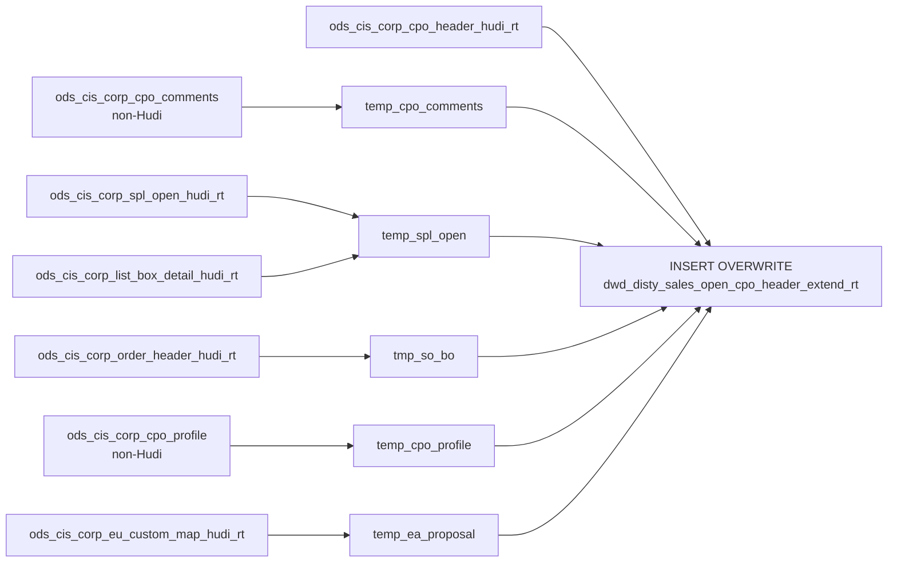

# DWD: Open CPO Header — Extended Real-Time (`dwd_disty_sales_open_cpo_header_extend_rt`)

- artifact_type: etl_table
- artifact_id: dw_us.dwd_disty_sales_open_cpo_header_extend_rt
- domain: cpo
- one_line_purpose: This job is the **real-time variant** of the open CPO header enrichment pipeline. It reads exclusively from **Hudi RT (real-time) tables** — near-live ingested data rather than the batch ODS snapshots used by the `_df` variant. The result i...
- layer_type: DWD
- source_kind: etl_sql
- evidence_source: source/etl/sql/csource/etl/sql/po/source/etl/flows/public_order_tools/ingest/public_cpo_dw/script/dwd_disty_sales_open_cpo_header_extend_rt.sql

---

## L1 Data Foundation

### Identity and physical mapping
- **Table:** `dw_us.dwd_disty_sales_open_cpo_header_extend_rt`
- **Layer type:** DWD
- **Canonical / derived:** Derived / ETL-loaded (see L3)
- **Owner team:** not registered in metadata catalog

### Grain, scope, exclusions
- **Grain:** one row per `cpo_id` — all currently open CPOs.
- **Scope:** See L2 business purpose / L3 filters
- **Partition:** none — full table overwrite on each run. - resolved from pipeline (see L4)
- **Natural key:** `cpo_id`.
- **Exclusions:** Not documented in repository

#### Grain detail (preserved)

- **Grain:** one row per `cpo_id` — all currently open CPOs.
- **Partition:** none — full table overwrite on each run.
- **Natural key:** `cpo_id`.

---

### Cross-engine presence
| Engine | Present | Canonical FQN | Notes |
|--------|---------|---------------|-------|
| Hive | yes | `dwd_disty_sales_open_cpo_header_extend_rt` | ETL target / intermediate per evidence script |
| Vertica | pending | `dwd_disty_sales_open_cpo_header_extend_rt` | Confirm via hive2vertica flow evidence / MCP |

### Physical schema reference

Pointer block only - full column catalog lives in WKB L1 storage JSON.

| Field | Value |
|-------|-------|
| **Authoritative catalog** | WKB L1 storage seed (not duplicated in this file) |
| **entity_id** | `dw_us.dwd_disty_sales_open_cpo_header_extend_rt` |
| **l1_catalog_seed** | `target/storage/wkb/snapshots/_snapshot_id_template/l1_catalog/{engine}_{schema}_{table}.json` |
| **column_count** | pending (run ddl_seed_writer) |
| **partition_keys** | `none — full table overwrite on each run.` |
| **ddl_source** | pending Bitbucket DDL / Vertica metadata ingest |
| **retrieval** | `python -m tools.wkb.indexing.run_query --query "cpo dwd_disty_sales_open_cpo_header_extend_rt schema" --intent find_table_schema` |

### Lineage
| Object | Role |
|--------|------|
| `ods_${country_code}.ods_cis_corp_cpo_header_hudi_rt` | Primary source — RT CPO headers |
| (all other sources) | Hudi RT equivalents of the `_df` job's sources (see table above) |
| `dw_${country_code}.dwd_disty_sales_open_cpo_header_extend_rt` | **Target** — real-time enriched open CPO headers |

---

### Freshness and load path
| Item | Value |
|------|-------|
| Load pattern | See L3 end-to-end / INSERT pattern in evidence script |
| Schedule | Not documented in repository |
| Parameters | `country_code` |


---

## L2 Declarative Knowledge

### Business purpose
This job is the **real-time variant** of the open CPO header enrichment pipeline. It reads exclusively from **Hudi RT (real-time) tables** — near-live ingested data rather than the batch ODS snapshots used by the `_df` variant. The result is a non-partitioned full-overwrite table that always reflects the latest available state of all open CPO headers, used for near-real-time pipeline monitoring and live dashboards.

---

### Audience and use cases
| Audience | How they benefit |
|----------|-----------------|
| **Sales leadership** | Near-real-time open CPO pipeline visibility without waiting for overnight batch. |
| **Operations** | Live SO/BO linkage for in-flight CPOs. |
| **BI / live dashboards** | Always-current source for open CPO header data. |

---

### Fact key resolution
- Natural key: `cpo_id`.
- FK / label-on attributes: see L3 dimension join patterns and step-by-step logic.
- Negative assertion: do not treat descriptive labels as grain keys unless listed under natural key.

### Time field semantics
- **date_flag / partition columns:** none — full table overwrite on each run.
- Primary reporting filter should use the partition column(s) documented in L1; resolve values via L4.


### Metrics served

| Category | Column | Logical metric | Business reading |
|----------|--------|----------------|------------------|
| Measures | — | — | No measure columns mapped for this table. |

### Metric serving map

**Formula authority:** [`source/contracts/cpo/metric-index.md`](../../source/contracts/cpo/metric-index.md)

N/A — no measure columns mapped for this table.

### etl_metrics

No governed logical metrics from `source/contracts/cpo/metric-index.md` are mapped on this table.

---

### Metric serving map
N/A - not a `*_comb_mtd` / multi-period wide serving table (or map not present in legacy doc).


### Data products and column groups (preserved)

Identical column set to `dwd_disty_sales_open_cpo_header_extend_df`. See that document for the full column reference.

---

### etl_metrics

N/A - no calculable ETL formulas extracted from this document (passthrough / stored measures only, or formulas not documented).

---

## L3 Procedural Knowledge

### Query and routing rules
**Business filters:** Use partition / date keys from L1 grain for reporting scope.
**Technical predicates (load only):** See Key filters and step-by-step logic below.

### Dimension join patterns
| Dimension FQN | Join keys | Purpose | Evidence |
|---------------|-----------|---------|----------|
| See step-by-step / base tables | See L3 steps | Dimension enrichment | `source/etl/sql/csource/etl/sql/po/source/etl/flows/public_order_tools/ingest/public_cpo_dw/script/dwd_disty_sales_open_cpo_header_extend_rt.sql` |

### Key filters and ETL business logic
See step-by-step logic

### Standard time-filter SQL
```sql
-- relative period filter using resolved partition value (see L4)
SELECT *
FROM dwd_disty_sales_open_cpo_header_extend_rt
WHERE /* partition predicate */ date_flag = '${partition_value}';
```

### End-to-end flow
**Runtime parameters:** `country_code`
**Target table:** `dw_${country_code}.dwd_disty_sales_open_cpo_header_extend_rt` — **full overwrite, no partitioning**.

Steps 1–6: Same enrichment as `_df` header job. Key source differences: SPL, SO/BO, list box, EU custom map use `_hudi_rt` table variants; `ods_cis_corp_cpo_eu_custom_map_hudi_rt` used for EA proposal map.

7. **INSERT OVERWRITE** (no PARTITION clause) into `dwd_disty_sales_open_cpo_header_extend_rt`.



---


#### High-level stages (preserved)

| Stage | Business meaning |
|-------|-----------------|
| **Comments** | Same CC/OX/EX aggregation as the `_df` variant but from active `ods_cis_corp_cpo_comments` (non-Hudi — same source). |
| **SPL open** | Pipeline/opportunity data from `ods_cis_corp_spl_open_hudi_rt` (Hudi RT); reason code from `ods_cis_corp_list_box_detail_hudi_rt`. |
| **SO / BO linkage** | Links to `ods_cis_corp_order_header_hudi_rt` for near-real-time SO/BO order numbers. |
| **CPO profile** | Contract no and workflow request ID from active `ods_cis_corp_cpo_profile` (non-Hudi). |
| **EA proposal** | EA proposal ID from `ods_cis_corp_cpo_eu_custom` via `ods_cis_corp_eu_custom_map_hudi_rt`. |
| **Final INSERT** | Joins `ods_cis_corp_cpo_header_hudi_rt` to all enrichment; writes as full overwrite (no partition). |

**Parameters:** `country_code`

---


### Base tables register
| Object | Role in this job |
|--------|-----------------|
| `ods_${country_code}.ods_cis_corp_cpo_header_hudi_rt` | **Primary source.** Hudi RT CPO headers — near-real-time state. |
| `ods_${country_code}.ods_cis_corp_cpo_comments` | CPO comments — CC/OX/EX (non-Hudi; same as _df). |
| `ods_${country_code}.ods_cis_corp_spl_open_hudi_rt` | Pipeline/opportunity data — Hudi RT. |
| `ods_${country_code}.ods_cis_corp_list_box_detail_hudi_rt` | Reason code descriptions — Hudi RT. |
| `ods_${country_code}.ods_cis_corp_order_header_hudi_rt` | SO/BO order linkage — Hudi RT. |
| `ods_${country_code}.ods_cis_corp_cpo_profile` | Contract no and workflow request ID (non-Hudi). |
| `ods_${country_code}.ods_cis_corp_eu_custom_map_hudi_rt` | EAPI map type — Hudi RT. |
| `ods_${country_code}.ods_cis_corp_cpo_eu_custom` | EA proposal ID (non-Hudi). |
| `dim_${country_code}.dim_pub_customer_info_rt` | Customer name — RT dimension. |
| `dim_${country_code}.dim_pub_manager` | User names (×4) — non-Hudi. |
| `ods_${country_code}.ods_cis_corp_from_ref_type_hudi_rt` | From-ref-type description — Hudi RT. |
| `ods_${country_code}.ods_cis_corp_cpo_eu_common_hudi_rt` | End-user common info — Hudi RT. |
| `ods_${country_code}.ods_cis_corp_territory_hudi_rt` | Territory name — Hudi RT. |

---

### Step-by-step logic
None identified in repository

### Relationship map (embedded)

| from_fqn | to_fqn | cardinality | join_keys | provenance |
|----------|--------|-------------|-----------|------------|
| `ods_${country_code}.ods_cis_corp_spl_open_hudi_rt` | `ods_${country_code}.ods_cis_corp_list_box_detail_hudi_rt` | many:1 | `so.reason_code = lbd.code_value AND lbd.list_box_code = 'SPLC' )t` | etl_sql (source/etl/sql/cpo/public_order_scripts/public_cpo_dw/script/dwd_disty_sales_open_cpo_header_extend_rt.sql:1) |
| `ods_${country_code}.ods_cis_corp_cpo_eu_custom` | `temp_eu_map` | many:1 | `ec.eu_map_id=em.eu_map_id and ec.eu_map_line_no=em.eu_map_line_no; --6 intergrate all filed and then merge to target table` | etl_sql (source/etl/sql/cpo/public_order_scripts/public_cpo_dw/script/dwd_disty_sales_open_cpo_header_extend_rt.sql:1) |
| `ods_${country_code}.ods_cis_corp_cpo_header_hudi_rt` | `dim_${country_code}.dim_pub_customer_info_rt` | many:1 | `ch.cpo_cust_no=pci.cust_no` | etl_sql (source/etl/sql/cpo/public_order_scripts/public_cpo_dw/script/dwd_disty_sales_open_cpo_header_extend_rt.sql:1) |
| `ods_${country_code}.ods_cis_corp_cpo_header_hudi_rt` | `dim_${country_code}.dim_pub_manager` | many:1 | `ch.cpo_entry_id=pm.userid` | etl_sql (source/etl/sql/cpo/public_order_scripts/public_cpo_dw/script/dwd_disty_sales_open_cpo_header_extend_rt.sql:1) |
| `ods_${country_code}.ods_cis_corp_cpo_header_hudi_rt` | `ods_${country_code}.ods_cis_corp_from_ref_type_hudi_rt` | many:1 | `ch.cpo_from_ref_type=frt.from_ref_type` | etl_sql (source/etl/sql/cpo/public_order_scripts/public_cpo_dw/script/dwd_disty_sales_open_cpo_header_extend_rt.sql:1) |
| `ods_${country_code}.ods_cis_corp_cpo_header_hudi_rt` | `dim_${country_code}.dim_pub_manager` | many:1 | `ch.convert_user=pm1.userid` | etl_sql (source/etl/sql/cpo/public_order_scripts/public_cpo_dw/script/dwd_disty_sales_open_cpo_header_extend_rt.sql:1) |
| `ods_${country_code}.ods_cis_corp_cpo_header_hudi_rt` | `dim_${country_code}.dim_pub_manager` | many:1 | `ch.cpo_change_id=pm2.userid` | etl_sql (source/etl/sql/cpo/public_order_scripts/public_cpo_dw/script/dwd_disty_sales_open_cpo_header_extend_rt.sql:1) |
| `ods_${country_code}.ods_cis_corp_cpo_header_hudi_rt` | `dim_${country_code}.dim_pub_manager` | many:1 | `ch.cpo_delete_id=pm3.userid` | etl_sql (source/etl/sql/cpo/public_order_scripts/public_cpo_dw/script/dwd_disty_sales_open_cpo_header_extend_rt.sql:1) |
| `ods_${country_code}.ods_cis_corp_cpo_header_hudi_rt` | `temp_cpo_comments` | many:1 | `ch.cpo_id=tcc.cpo_id` | etl_sql (source/etl/sql/cpo/public_order_scripts/public_cpo_dw/script/dwd_disty_sales_open_cpo_header_extend_rt.sql:1) |
| `ods_${country_code}.ods_cis_corp_cpo_header_hudi_rt` | `ods_${country_code}.ods_cis_corp_cpo_eu_common_hudi_rt` | many:1 | `ch.cpo_id=cec.cpo_id and cec.cpo_line_seq=0` | etl_sql (source/etl/sql/cpo/public_order_scripts/public_cpo_dw/script/dwd_disty_sales_open_cpo_header_extend_rt.sql:1) |
| `ods_${country_code}.ods_cis_corp_cpo_header_hudi_rt` | `temp_spl_open` | many:1 | `ch.cpo_id=tso.int_ref_no` | etl_sql (source/etl/sql/cpo/public_order_scripts/public_cpo_dw/script/dwd_disty_sales_open_cpo_header_extend_rt.sql:1) |
| `ods_${country_code}.ods_cis_corp_cpo_header_hudi_rt` | `ods_${country_code}.ods_cis_corp_territory_hudi_rt` | many:1 | `ch.cpo_sales_terr=ter.sales_terr` | etl_sql (source/etl/sql/cpo/public_order_scripts/public_cpo_dw/script/dwd_disty_sales_open_cpo_header_extend_rt.sql:1) |
| `ods_${country_code}.ods_cis_corp_cpo_header_hudi_rt` | `tmp_so_bo` | many:1 | `ch.cpo_id=tsb.cpo_id` | etl_sql (source/etl/sql/cpo/public_order_scripts/public_cpo_dw/script/dwd_disty_sales_open_cpo_header_extend_rt.sql:1) |
| `ods_${country_code}.ods_cis_corp_cpo_header_hudi_rt` | `temp_cpo_profile` | many:1 | `ch.cpo_id=cp.cpo_id` | etl_sql (source/etl/sql/cpo/public_order_scripts/public_cpo_dw/script/dwd_disty_sales_open_cpo_header_extend_rt.sql:1) |
| `ods_${country_code}.ods_cis_corp_cpo_header_hudi_rt` | `temp_ea_proposal` | many:1 | `ch.cpo_id=ep.cpo_id;` | etl_sql (source/etl/sql/cpo/public_order_scripts/public_cpo_dw/script/dwd_disty_sales_open_cpo_header_extend_rt.sql:1) |

`source/ref/cpo/table relationship.txt`: Not documented in repository.

### Special logic (embedded)

Not documented in repository

### Column / field derivations (from ETL SQL)

| target_column | expression_sql | upstream_columns | upstream_tables | transform_kind | evidence |
|---------------|----------------|------------------|-----------------|----------------|----------|
| `cpo_id` | `ch.cpo_id` | `cpo_id` | `ods_${country_code}.ods_cis_corp_cpo_header_hudi_rt`, `dim_${country_code}.dim_pub_customer_info_rt`, `dim_${country_code}.dim_pub_manager`, `ods_${country_code}.ods_cis_corp_from_ref_type_hudi_rt`, `temp_cpo_comments`, `ods_${country_code}.ods_cis_corp_cpo_eu_common_hudi_rt`, `temp_spl_open`, `ods_${country_code}.ods_cis_corp_territory_hudi_rt`, `tmp_so_bo`, `temp_cpo_profile`, `temp_ea_proposal` | passthrough | `source/etl/sql/cpo/public_order_scripts/public_cpo_dw/script/dwd_disty_sales_open_cpo_header_extend_rt.sql:128` |
| `cpo_no` | `ch.cpo_no` | `cpo_no` | `ods_${country_code}.ods_cis_corp_cpo_header_hudi_rt`, `dim_${country_code}.dim_pub_customer_info_rt`, `dim_${country_code}.dim_pub_manager`, `ods_${country_code}.ods_cis_corp_from_ref_type_hudi_rt`, `temp_cpo_comments`, `ods_${country_code}.ods_cis_corp_cpo_eu_common_hudi_rt`, `temp_spl_open`, `ods_${country_code}.ods_cis_corp_territory_hudi_rt`, `tmp_so_bo`, `temp_cpo_profile`, `temp_ea_proposal` | passthrough | `source/etl/sql/cpo/public_order_scripts/public_cpo_dw/script/dwd_disty_sales_open_cpo_header_extend_rt.sql:129` |
| `cpo_cust_no` | `ch.cpo_cust_no` | `cpo_cust_no` | `ods_${country_code}.ods_cis_corp_cpo_header_hudi_rt`, `dim_${country_code}.dim_pub_customer_info_rt`, `dim_${country_code}.dim_pub_manager`, `ods_${country_code}.ods_cis_corp_from_ref_type_hudi_rt`, `temp_cpo_comments`, `ods_${country_code}.ods_cis_corp_cpo_eu_common_hudi_rt`, `temp_spl_open`, `ods_${country_code}.ods_cis_corp_territory_hudi_rt`, `tmp_so_bo`, `temp_cpo_profile`, `temp_ea_proposal` | passthrough | `source/etl/sql/cpo/public_order_scripts/public_cpo_dw/script/dwd_disty_sales_open_cpo_header_extend_rt.sql:130` |
| `cpo_cust_name` | `pci.cust_name cpo_cust_name` | `cust_name`, `cpo_cust_name` | `ods_${country_code}.ods_cis_corp_cpo_header_hudi_rt`, `dim_${country_code}.dim_pub_customer_info_rt`, `dim_${country_code}.dim_pub_manager`, `ods_${country_code}.ods_cis_corp_from_ref_type_hudi_rt`, `temp_cpo_comments`, `ods_${country_code}.ods_cis_corp_cpo_eu_common_hudi_rt`, `temp_spl_open`, `ods_${country_code}.ods_cis_corp_territory_hudi_rt`, `tmp_so_bo`, `temp_cpo_profile`, `temp_ea_proposal` | partial | `source/etl/sql/cpo/public_order_scripts/public_cpo_dw/script/dwd_disty_sales_open_cpo_header_extend_rt.sql:131` |
| `cpo_sales_terr` | `ch.cpo_sales_terr` | `cpo_sales_terr` | `ods_${country_code}.ods_cis_corp_cpo_header_hudi_rt`, `dim_${country_code}.dim_pub_customer_info_rt`, `dim_${country_code}.dim_pub_manager`, `ods_${country_code}.ods_cis_corp_from_ref_type_hudi_rt`, `temp_cpo_comments`, `ods_${country_code}.ods_cis_corp_cpo_eu_common_hudi_rt`, `temp_spl_open`, `ods_${country_code}.ods_cis_corp_territory_hudi_rt`, `tmp_so_bo`, `temp_cpo_profile`, `temp_ea_proposal` | passthrough | `source/etl/sql/cpo/public_order_scripts/public_cpo_dw/script/dwd_disty_sales_open_cpo_header_extend_rt.sql:132` |
| `cpo_entry_id` | `ch.cpo_entry_id` | `cpo_entry_id` | `ods_${country_code}.ods_cis_corp_cpo_header_hudi_rt`, `dim_${country_code}.dim_pub_customer_info_rt`, `dim_${country_code}.dim_pub_manager`, `ods_${country_code}.ods_cis_corp_from_ref_type_hudi_rt`, `temp_cpo_comments`, `ods_${country_code}.ods_cis_corp_cpo_eu_common_hudi_rt`, `temp_spl_open`, `ods_${country_code}.ods_cis_corp_territory_hudi_rt`, `tmp_so_bo`, `temp_cpo_profile`, `temp_ea_proposal` | passthrough | `source/etl/sql/cpo/public_order_scripts/public_cpo_dw/script/dwd_disty_sales_open_cpo_header_extend_rt.sql:133` |
| `cpo_entry_name` | `pm.name` | `name` | `ods_${country_code}.ods_cis_corp_cpo_header_hudi_rt`, `dim_${country_code}.dim_pub_customer_info_rt`, `dim_${country_code}.dim_pub_manager`, `ods_${country_code}.ods_cis_corp_from_ref_type_hudi_rt`, `temp_cpo_comments`, `ods_${country_code}.ods_cis_corp_cpo_eu_common_hudi_rt`, `temp_spl_open`, `ods_${country_code}.ods_cis_corp_territory_hudi_rt`, `tmp_so_bo`, `temp_cpo_profile`, `temp_ea_proposal` | rename | `source/etl/sql/cpo/public_order_scripts/public_cpo_dw/script/dwd_disty_sales_open_cpo_header_extend_rt.sql:134` |
| `cpo_entry_datetime` | `ch.cpo_entry_datetime` | `cpo_entry_datetime` | `ods_${country_code}.ods_cis_corp_cpo_header_hudi_rt`, `dim_${country_code}.dim_pub_customer_info_rt`, `dim_${country_code}.dim_pub_manager`, `ods_${country_code}.ods_cis_corp_from_ref_type_hudi_rt`, `temp_cpo_comments`, `ods_${country_code}.ods_cis_corp_cpo_eu_common_hudi_rt`, `temp_spl_open`, `ods_${country_code}.ods_cis_corp_territory_hudi_rt`, `tmp_so_bo`, `temp_cpo_profile`, `temp_ea_proposal` | passthrough | `source/etl/sql/cpo/public_order_scripts/public_cpo_dw/script/dwd_disty_sales_open_cpo_header_extend_rt.sql:135` |
| `cpo_from_ref_type` | `ch.cpo_from_ref_type` | `cpo_from_ref_type` | `ods_${country_code}.ods_cis_corp_cpo_header_hudi_rt`, `dim_${country_code}.dim_pub_customer_info_rt`, `dim_${country_code}.dim_pub_manager`, `ods_${country_code}.ods_cis_corp_from_ref_type_hudi_rt`, `temp_cpo_comments`, `ods_${country_code}.ods_cis_corp_cpo_eu_common_hudi_rt`, `temp_spl_open`, `ods_${country_code}.ods_cis_corp_territory_hudi_rt`, `tmp_so_bo`, `temp_cpo_profile`, `temp_ea_proposal` | passthrough | `source/etl/sql/cpo/public_order_scripts/public_cpo_dw/script/dwd_disty_sales_open_cpo_header_extend_rt.sql:136` |
| `cpo_from_ref_type_desc` | `frt.from_ref_type_desc` | `from_ref_type_desc` | `ods_${country_code}.ods_cis_corp_cpo_header_hudi_rt`, `dim_${country_code}.dim_pub_customer_info_rt`, `dim_${country_code}.dim_pub_manager`, `ods_${country_code}.ods_cis_corp_from_ref_type_hudi_rt`, `temp_cpo_comments`, `ods_${country_code}.ods_cis_corp_cpo_eu_common_hudi_rt`, `temp_spl_open`, `ods_${country_code}.ods_cis_corp_territory_hudi_rt`, `tmp_so_bo`, `temp_cpo_profile`, `temp_ea_proposal` | rename | `source/etl/sql/cpo/public_order_scripts/public_cpo_dw/script/dwd_disty_sales_open_cpo_header_extend_rt.sql:137` |
| `system_type` | `frt.system_type` | `system_type` | `ods_${country_code}.ods_cis_corp_cpo_header_hudi_rt`, `dim_${country_code}.dim_pub_customer_info_rt`, `dim_${country_code}.dim_pub_manager`, `ods_${country_code}.ods_cis_corp_from_ref_type_hudi_rt`, `temp_cpo_comments`, `ods_${country_code}.ods_cis_corp_cpo_eu_common_hudi_rt`, `temp_spl_open`, `ods_${country_code}.ods_cis_corp_territory_hudi_rt`, `tmp_so_bo`, `temp_cpo_profile`, `temp_ea_proposal` | passthrough | `source/etl/sql/cpo/public_order_scripts/public_cpo_dw/script/dwd_disty_sales_open_cpo_header_extend_rt.sql:138` |
| `cpo_pay_meth` | `ch.cpo_pay_meth` | `cpo_pay_meth` | `ods_${country_code}.ods_cis_corp_cpo_header_hudi_rt`, `dim_${country_code}.dim_pub_customer_info_rt`, `dim_${country_code}.dim_pub_manager`, `ods_${country_code}.ods_cis_corp_from_ref_type_hudi_rt`, `temp_cpo_comments`, `ods_${country_code}.ods_cis_corp_cpo_eu_common_hudi_rt`, `temp_spl_open`, `ods_${country_code}.ods_cis_corp_territory_hudi_rt`, `tmp_so_bo`, `temp_cpo_profile`, `temp_ea_proposal` | passthrough | `source/etl/sql/cpo/public_order_scripts/public_cpo_dw/script/dwd_disty_sales_open_cpo_header_extend_rt.sql:139` |
| `cpo_total_taxable` | `ch.cpo_total_taxable` | `cpo_total_taxable` | `ods_${country_code}.ods_cis_corp_cpo_header_hudi_rt`, `dim_${country_code}.dim_pub_customer_info_rt`, `dim_${country_code}.dim_pub_manager`, `ods_${country_code}.ods_cis_corp_from_ref_type_hudi_rt`, `temp_cpo_comments`, `ods_${country_code}.ods_cis_corp_cpo_eu_common_hudi_rt`, `temp_spl_open`, `ods_${country_code}.ods_cis_corp_territory_hudi_rt`, `tmp_so_bo`, `temp_cpo_profile`, `temp_ea_proposal` | passthrough | `source/etl/sql/cpo/public_order_scripts/public_cpo_dw/script/dwd_disty_sales_open_cpo_header_extend_rt.sql:140` |
| `cpo_total_notax` | `ch.cpo_total_notax` | `cpo_total_notax` | `ods_${country_code}.ods_cis_corp_cpo_header_hudi_rt`, `dim_${country_code}.dim_pub_customer_info_rt`, `dim_${country_code}.dim_pub_manager`, `ods_${country_code}.ods_cis_corp_from_ref_type_hudi_rt`, `temp_cpo_comments`, `ods_${country_code}.ods_cis_corp_cpo_eu_common_hudi_rt`, `temp_spl_open`, `ods_${country_code}.ods_cis_corp_territory_hudi_rt`, `tmp_so_bo`, `temp_cpo_profile`, `temp_ea_proposal` | passthrough | `source/etl/sql/cpo/public_order_scripts/public_cpo_dw/script/dwd_disty_sales_open_cpo_header_extend_rt.sql:141` |
| `cpo_sales_tax` | `ch.cpo_sales_tax` | `cpo_sales_tax` | `ods_${country_code}.ods_cis_corp_cpo_header_hudi_rt`, `dim_${country_code}.dim_pub_customer_info_rt`, `dim_${country_code}.dim_pub_manager`, `ods_${country_code}.ods_cis_corp_from_ref_type_hudi_rt`, `temp_cpo_comments`, `ods_${country_code}.ods_cis_corp_cpo_eu_common_hudi_rt`, `temp_spl_open`, `ods_${country_code}.ods_cis_corp_territory_hudi_rt`, `tmp_so_bo`, `temp_cpo_profile`, `temp_ea_proposal` | passthrough | `source/etl/sql/cpo/public_order_scripts/public_cpo_dw/script/dwd_disty_sales_open_cpo_header_extend_rt.sql:142` |
| `cpo_freight` | `ch.cpo_freight` | `cpo_freight` | `ods_${country_code}.ods_cis_corp_cpo_header_hudi_rt`, `dim_${country_code}.dim_pub_customer_info_rt`, `dim_${country_code}.dim_pub_manager`, `ods_${country_code}.ods_cis_corp_from_ref_type_hudi_rt`, `temp_cpo_comments`, `ods_${country_code}.ods_cis_corp_cpo_eu_common_hudi_rt`, `temp_spl_open`, `ods_${country_code}.ods_cis_corp_territory_hudi_rt`, `tmp_so_bo`, `temp_cpo_profile`, `temp_ea_proposal` | passthrough | `source/etl/sql/cpo/public_order_scripts/public_cpo_dw/script/dwd_disty_sales_open_cpo_header_extend_rt.sql:143` |
| `cpo_other` | `ch.cpo_other` | `cpo_other` | `ods_${country_code}.ods_cis_corp_cpo_header_hudi_rt`, `dim_${country_code}.dim_pub_customer_info_rt`, `dim_${country_code}.dim_pub_manager`, `ods_${country_code}.ods_cis_corp_from_ref_type_hudi_rt`, `temp_cpo_comments`, `ods_${country_code}.ods_cis_corp_cpo_eu_common_hudi_rt`, `temp_spl_open`, `ods_${country_code}.ods_cis_corp_territory_hudi_rt`, `tmp_so_bo`, `temp_cpo_profile`, `temp_ea_proposal` | passthrough | `source/etl/sql/cpo/public_order_scripts/public_cpo_dw/script/dwd_disty_sales_open_cpo_header_extend_rt.sql:144` |
| `cpo_so_total` | `ch.cpo_so_total` | `cpo_so_total` | `ods_${country_code}.ods_cis_corp_cpo_header_hudi_rt`, `dim_${country_code}.dim_pub_customer_info_rt`, `dim_${country_code}.dim_pub_manager`, `ods_${country_code}.ods_cis_corp_from_ref_type_hudi_rt`, `temp_cpo_comments`, `ods_${country_code}.ods_cis_corp_cpo_eu_common_hudi_rt`, `temp_spl_open`, `ods_${country_code}.ods_cis_corp_territory_hudi_rt`, `tmp_so_bo`, `temp_cpo_profile`, `temp_ea_proposal` | passthrough | `source/etl/sql/cpo/public_order_scripts/public_cpo_dw/script/dwd_disty_sales_open_cpo_header_extend_rt.sql:145` |
| `cpo_bo_total` | `ch.cpo_bo_total` | `cpo_bo_total` | `ods_${country_code}.ods_cis_corp_cpo_header_hudi_rt`, `dim_${country_code}.dim_pub_customer_info_rt`, `dim_${country_code}.dim_pub_manager`, `ods_${country_code}.ods_cis_corp_from_ref_type_hudi_rt`, `temp_cpo_comments`, `ods_${country_code}.ods_cis_corp_cpo_eu_common_hudi_rt`, `temp_spl_open`, `ods_${country_code}.ods_cis_corp_territory_hudi_rt`, `tmp_so_bo`, `temp_cpo_profile`, `temp_ea_proposal` | passthrough | `source/etl/sql/cpo/public_order_scripts/public_cpo_dw/script/dwd_disty_sales_open_cpo_header_extend_rt.sql:146` |
| `po_total` | `ch.po_total` | `po_total` | `ods_${country_code}.ods_cis_corp_cpo_header_hudi_rt`, `dim_${country_code}.dim_pub_customer_info_rt`, `dim_${country_code}.dim_pub_manager`, `ods_${country_code}.ods_cis_corp_from_ref_type_hudi_rt`, `temp_cpo_comments`, `ods_${country_code}.ods_cis_corp_cpo_eu_common_hudi_rt`, `temp_spl_open`, `ods_${country_code}.ods_cis_corp_territory_hudi_rt`, `tmp_so_bo`, `temp_cpo_profile`, `temp_ea_proposal` | passthrough | `source/etl/sql/cpo/public_order_scripts/public_cpo_dw/script/dwd_disty_sales_open_cpo_header_extend_rt.sql:147` |
| `cpo_ship_method` | `ch.cpo_ship_method` | `cpo_ship_method` | `ods_${country_code}.ods_cis_corp_cpo_header_hudi_rt`, `dim_${country_code}.dim_pub_customer_info_rt`, `dim_${country_code}.dim_pub_manager`, `ods_${country_code}.ods_cis_corp_from_ref_type_hudi_rt`, `temp_cpo_comments`, `ods_${country_code}.ods_cis_corp_cpo_eu_common_hudi_rt`, `temp_spl_open`, `ods_${country_code}.ods_cis_corp_territory_hudi_rt`, `tmp_so_bo`, `temp_cpo_profile`, `temp_ea_proposal` | passthrough | `source/etl/sql/cpo/public_order_scripts/public_cpo_dw/script/dwd_disty_sales_open_cpo_header_extend_rt.sql:148` |
| `cpo_ship_loc_type` | `ch.cpo_ship_loc_type` | `cpo_ship_loc_type` | `ods_${country_code}.ods_cis_corp_cpo_header_hudi_rt`, `dim_${country_code}.dim_pub_customer_info_rt`, `dim_${country_code}.dim_pub_manager`, `ods_${country_code}.ods_cis_corp_from_ref_type_hudi_rt`, `temp_cpo_comments`, `ods_${country_code}.ods_cis_corp_cpo_eu_common_hudi_rt`, `temp_spl_open`, `ods_${country_code}.ods_cis_corp_territory_hudi_rt`, `tmp_so_bo`, `temp_cpo_profile`, `temp_ea_proposal` | passthrough | `source/etl/sql/cpo/public_order_scripts/public_cpo_dw/script/dwd_disty_sales_open_cpo_header_extend_rt.sql:149` |
| `end_user_po_no` | `ch.end_user_po_no` | `end_user_po_no` | `ods_${country_code}.ods_cis_corp_cpo_header_hudi_rt`, `dim_${country_code}.dim_pub_customer_info_rt`, `dim_${country_code}.dim_pub_manager`, `ods_${country_code}.ods_cis_corp_from_ref_type_hudi_rt`, `temp_cpo_comments`, `ods_${country_code}.ods_cis_corp_cpo_eu_common_hudi_rt`, `temp_spl_open`, `ods_${country_code}.ods_cis_corp_territory_hudi_rt`, `tmp_so_bo`, `temp_cpo_profile`, `temp_ea_proposal` | passthrough | `source/etl/sql/cpo/public_order_scripts/public_cpo_dw/script/dwd_disty_sales_open_cpo_header_extend_rt.sql:150` |
| `special_handle` | `ch.special_handle` | `special_handle` | `ods_${country_code}.ods_cis_corp_cpo_header_hudi_rt`, `dim_${country_code}.dim_pub_customer_info_rt`, `dim_${country_code}.dim_pub_manager`, `ods_${country_code}.ods_cis_corp_from_ref_type_hudi_rt`, `temp_cpo_comments`, `ods_${country_code}.ods_cis_corp_cpo_eu_common_hudi_rt`, `temp_spl_open`, `ods_${country_code}.ods_cis_corp_territory_hudi_rt`, `tmp_so_bo`, `temp_cpo_profile`, `temp_ea_proposal` | passthrough | `source/etl/sql/cpo/public_order_scripts/public_cpo_dw/script/dwd_disty_sales_open_cpo_header_extend_rt.sql:151` |
| `ship_name1` | `ch.ship_name1` | `ship_name1` | `ods_${country_code}.ods_cis_corp_cpo_header_hudi_rt`, `dim_${country_code}.dim_pub_customer_info_rt`, `dim_${country_code}.dim_pub_manager`, `ods_${country_code}.ods_cis_corp_from_ref_type_hudi_rt`, `temp_cpo_comments`, `ods_${country_code}.ods_cis_corp_cpo_eu_common_hudi_rt`, `temp_spl_open`, `ods_${country_code}.ods_cis_corp_territory_hudi_rt`, `tmp_so_bo`, `temp_cpo_profile`, `temp_ea_proposal` | passthrough | `source/etl/sql/cpo/public_order_scripts/public_cpo_dw/script/dwd_disty_sales_open_cpo_header_extend_rt.sql:152` |
| `ship_addr1` | `ch.ship_addr1` | `ship_addr1` | `ods_${country_code}.ods_cis_corp_cpo_header_hudi_rt`, `dim_${country_code}.dim_pub_customer_info_rt`, `dim_${country_code}.dim_pub_manager`, `ods_${country_code}.ods_cis_corp_from_ref_type_hudi_rt`, `temp_cpo_comments`, `ods_${country_code}.ods_cis_corp_cpo_eu_common_hudi_rt`, `temp_spl_open`, `ods_${country_code}.ods_cis_corp_territory_hudi_rt`, `tmp_so_bo`, `temp_cpo_profile`, `temp_ea_proposal` | passthrough | `source/etl/sql/cpo/public_order_scripts/public_cpo_dw/script/dwd_disty_sales_open_cpo_header_extend_rt.sql:153` |
| `ship_addr2` | `ch.ship_addr2` | `ship_addr2` | `ods_${country_code}.ods_cis_corp_cpo_header_hudi_rt`, `dim_${country_code}.dim_pub_customer_info_rt`, `dim_${country_code}.dim_pub_manager`, `ods_${country_code}.ods_cis_corp_from_ref_type_hudi_rt`, `temp_cpo_comments`, `ods_${country_code}.ods_cis_corp_cpo_eu_common_hudi_rt`, `temp_spl_open`, `ods_${country_code}.ods_cis_corp_territory_hudi_rt`, `tmp_so_bo`, `temp_cpo_profile`, `temp_ea_proposal` | passthrough | `source/etl/sql/cpo/public_order_scripts/public_cpo_dw/script/dwd_disty_sales_open_cpo_header_extend_rt.sql:154` |
| `ship_zipcode` | `ch.ship_zipcode` | `ship_zipcode` | `ods_${country_code}.ods_cis_corp_cpo_header_hudi_rt`, `dim_${country_code}.dim_pub_customer_info_rt`, `dim_${country_code}.dim_pub_manager`, `ods_${country_code}.ods_cis_corp_from_ref_type_hudi_rt`, `temp_cpo_comments`, `ods_${country_code}.ods_cis_corp_cpo_eu_common_hudi_rt`, `temp_spl_open`, `ods_${country_code}.ods_cis_corp_territory_hudi_rt`, `tmp_so_bo`, `temp_cpo_profile`, `temp_ea_proposal` | passthrough | `source/etl/sql/cpo/public_order_scripts/public_cpo_dw/script/dwd_disty_sales_open_cpo_header_extend_rt.sql:155` |
| `ship_country` | `ch.ship_country` | `ship_country` | `ods_${country_code}.ods_cis_corp_cpo_header_hudi_rt`, `dim_${country_code}.dim_pub_customer_info_rt`, `dim_${country_code}.dim_pub_manager`, `ods_${country_code}.ods_cis_corp_from_ref_type_hudi_rt`, `temp_cpo_comments`, `ods_${country_code}.ods_cis_corp_cpo_eu_common_hudi_rt`, `temp_spl_open`, `ods_${country_code}.ods_cis_corp_territory_hudi_rt`, `tmp_so_bo`, `temp_cpo_profile`, `temp_ea_proposal` | passthrough | `source/etl/sql/cpo/public_order_scripts/public_cpo_dw/script/dwd_disty_sales_open_cpo_header_extend_rt.sql:156` |
| `ship_city` | `ch.ship_city` | `ship_city` | `ods_${country_code}.ods_cis_corp_cpo_header_hudi_rt`, `dim_${country_code}.dim_pub_customer_info_rt`, `dim_${country_code}.dim_pub_manager`, `ods_${country_code}.ods_cis_corp_from_ref_type_hudi_rt`, `temp_cpo_comments`, `ods_${country_code}.ods_cis_corp_cpo_eu_common_hudi_rt`, `temp_spl_open`, `ods_${country_code}.ods_cis_corp_territory_hudi_rt`, `tmp_so_bo`, `temp_cpo_profile`, `temp_ea_proposal` | passthrough | `source/etl/sql/cpo/public_order_scripts/public_cpo_dw/script/dwd_disty_sales_open_cpo_header_extend_rt.sql:157` |
| `ship_state` | `ch.ship_state` | `ship_state` | `ods_${country_code}.ods_cis_corp_cpo_header_hudi_rt`, `dim_${country_code}.dim_pub_customer_info_rt`, `dim_${country_code}.dim_pub_manager`, `ods_${country_code}.ods_cis_corp_from_ref_type_hudi_rt`, `temp_cpo_comments`, `ods_${country_code}.ods_cis_corp_cpo_eu_common_hudi_rt`, `temp_spl_open`, `ods_${country_code}.ods_cis_corp_territory_hudi_rt`, `tmp_so_bo`, `temp_cpo_profile`, `temp_ea_proposal` | passthrough | `source/etl/sql/cpo/public_order_scripts/public_cpo_dw/script/dwd_disty_sales_open_cpo_header_extend_rt.sql:158` |
| `ship_contact` | `ch.ship_contact` | `ship_contact` | `ods_${country_code}.ods_cis_corp_cpo_header_hudi_rt`, `dim_${country_code}.dim_pub_customer_info_rt`, `dim_${country_code}.dim_pub_manager`, `ods_${country_code}.ods_cis_corp_from_ref_type_hudi_rt`, `temp_cpo_comments`, `ods_${country_code}.ods_cis_corp_cpo_eu_common_hudi_rt`, `temp_spl_open`, `ods_${country_code}.ods_cis_corp_territory_hudi_rt`, `tmp_so_bo`, `temp_cpo_profile`, `temp_ea_proposal` | passthrough | `source/etl/sql/cpo/public_order_scripts/public_cpo_dw/script/dwd_disty_sales_open_cpo_header_extend_rt.sql:159` |
| `ship_phone` | `ch.ship_phone` | `ship_phone` | `ods_${country_code}.ods_cis_corp_cpo_header_hudi_rt`, `dim_${country_code}.dim_pub_customer_info_rt`, `dim_${country_code}.dim_pub_manager`, `ods_${country_code}.ods_cis_corp_from_ref_type_hudi_rt`, `temp_cpo_comments`, `ods_${country_code}.ods_cis_corp_cpo_eu_common_hudi_rt`, `temp_spl_open`, `ods_${country_code}.ods_cis_corp_territory_hudi_rt`, `tmp_so_bo`, `temp_cpo_profile`, `temp_ea_proposal` | passthrough | `source/etl/sql/cpo/public_order_scripts/public_cpo_dw/script/dwd_disty_sales_open_cpo_header_extend_rt.sql:160` |
| `frt_pay_type` | `ch.frt_pay_type` | `frt_pay_type` | `ods_${country_code}.ods_cis_corp_cpo_header_hudi_rt`, `dim_${country_code}.dim_pub_customer_info_rt`, `dim_${country_code}.dim_pub_manager`, `ods_${country_code}.ods_cis_corp_from_ref_type_hudi_rt`, `temp_cpo_comments`, `ods_${country_code}.ods_cis_corp_cpo_eu_common_hudi_rt`, `temp_spl_open`, `ods_${country_code}.ods_cis_corp_territory_hudi_rt`, `tmp_so_bo`, `temp_cpo_profile`, `temp_ea_proposal` | passthrough | `source/etl/sql/cpo/public_order_scripts/public_cpo_dw/script/dwd_disty_sales_open_cpo_header_extend_rt.sql:161` |
| `convert_datetime` | `ch.convert_datetime` | `convert_datetime` | `ods_${country_code}.ods_cis_corp_cpo_header_hudi_rt`, `dim_${country_code}.dim_pub_customer_info_rt`, `dim_${country_code}.dim_pub_manager`, `ods_${country_code}.ods_cis_corp_from_ref_type_hudi_rt`, `temp_cpo_comments`, `ods_${country_code}.ods_cis_corp_cpo_eu_common_hudi_rt`, `temp_spl_open`, `ods_${country_code}.ods_cis_corp_territory_hudi_rt`, `tmp_so_bo`, `temp_cpo_profile`, `temp_ea_proposal` | passthrough | `source/etl/sql/cpo/public_order_scripts/public_cpo_dw/script/dwd_disty_sales_open_cpo_header_extend_rt.sql:162` |
| `convert_user` | `ch.convert_user` | `convert_user` | `ods_${country_code}.ods_cis_corp_cpo_header_hudi_rt`, `dim_${country_code}.dim_pub_customer_info_rt`, `dim_${country_code}.dim_pub_manager`, `ods_${country_code}.ods_cis_corp_from_ref_type_hudi_rt`, `temp_cpo_comments`, `ods_${country_code}.ods_cis_corp_cpo_eu_common_hudi_rt`, `temp_spl_open`, `ods_${country_code}.ods_cis_corp_territory_hudi_rt`, `tmp_so_bo`, `temp_cpo_profile`, `temp_ea_proposal` | passthrough | `source/etl/sql/cpo/public_order_scripts/public_cpo_dw/script/dwd_disty_sales_open_cpo_header_extend_rt.sql:163` |
| `convert_user_name` | `pm1.name` | `name` | `ods_${country_code}.ods_cis_corp_cpo_header_hudi_rt`, `dim_${country_code}.dim_pub_customer_info_rt`, `dim_${country_code}.dim_pub_manager`, `ods_${country_code}.ods_cis_corp_from_ref_type_hudi_rt`, `temp_cpo_comments`, `ods_${country_code}.ods_cis_corp_cpo_eu_common_hudi_rt`, `temp_spl_open`, `ods_${country_code}.ods_cis_corp_territory_hudi_rt`, `tmp_so_bo`, `temp_cpo_profile`, `temp_ea_proposal` | rename | `source/etl/sql/cpo/public_order_scripts/public_cpo_dw/script/dwd_disty_sales_open_cpo_header_extend_rt.sql:164` |
| `sales_model` | `ch.sales_model` | `sales_model` | `ods_${country_code}.ods_cis_corp_cpo_header_hudi_rt`, `dim_${country_code}.dim_pub_customer_info_rt`, `dim_${country_code}.dim_pub_manager`, `ods_${country_code}.ods_cis_corp_from_ref_type_hudi_rt`, `temp_cpo_comments`, `ods_${country_code}.ods_cis_corp_cpo_eu_common_hudi_rt`, `temp_spl_open`, `ods_${country_code}.ods_cis_corp_territory_hudi_rt`, `tmp_so_bo`, `temp_cpo_profile`, `temp_ea_proposal` | passthrough | `source/etl/sql/cpo/public_order_scripts/public_cpo_dw/script/dwd_disty_sales_open_cpo_header_extend_rt.sql:165` |
| `reseller_cust_no` | `ch.reseller_cust_no` | `reseller_cust_no` | `ods_${country_code}.ods_cis_corp_cpo_header_hudi_rt`, `dim_${country_code}.dim_pub_customer_info_rt`, `dim_${country_code}.dim_pub_manager`, `ods_${country_code}.ods_cis_corp_from_ref_type_hudi_rt`, `temp_cpo_comments`, `ods_${country_code}.ods_cis_corp_cpo_eu_common_hudi_rt`, `temp_spl_open`, `ods_${country_code}.ods_cis_corp_territory_hudi_rt`, `tmp_so_bo`, `temp_cpo_profile`, `temp_ea_proposal` | passthrough | `source/etl/sql/cpo/public_order_scripts/public_cpo_dw/script/dwd_disty_sales_open_cpo_header_extend_rt.sql:166` |
| `shopping_mode` | `ch.shopping_mode` | `shopping_mode` | `ods_${country_code}.ods_cis_corp_cpo_header_hudi_rt`, `dim_${country_code}.dim_pub_customer_info_rt`, `dim_${country_code}.dim_pub_manager`, `ods_${country_code}.ods_cis_corp_from_ref_type_hudi_rt`, `temp_cpo_comments`, `ods_${country_code}.ods_cis_corp_cpo_eu_common_hudi_rt`, `temp_spl_open`, `ods_${country_code}.ods_cis_corp_territory_hudi_rt`, `tmp_so_bo`, `temp_cpo_profile`, `temp_ea_proposal` | passthrough | `source/etl/sql/cpo/public_order_scripts/public_cpo_dw/script/dwd_disty_sales_open_cpo_header_extend_rt.sql:167` |
| `end_user_no` | `ch.end_user_no` | `end_user_no` | `ods_${country_code}.ods_cis_corp_cpo_header_hudi_rt`, `dim_${country_code}.dim_pub_customer_info_rt`, `dim_${country_code}.dim_pub_manager`, `ods_${country_code}.ods_cis_corp_from_ref_type_hudi_rt`, `temp_cpo_comments`, `ods_${country_code}.ods_cis_corp_cpo_eu_common_hudi_rt`, `temp_spl_open`, `ods_${country_code}.ods_cis_corp_territory_hudi_rt`, `tmp_so_bo`, `temp_cpo_profile`, `temp_ea_proposal` | passthrough | `source/etl/sql/cpo/public_order_scripts/public_cpo_dw/script/dwd_disty_sales_open_cpo_header_extend_rt.sql:168` |
| `cpo_swl_flag` | `ch.cpo_swl_flag` | `cpo_swl_flag` | `ods_${country_code}.ods_cis_corp_cpo_header_hudi_rt`, `dim_${country_code}.dim_pub_customer_info_rt`, `dim_${country_code}.dim_pub_manager`, `ods_${country_code}.ods_cis_corp_from_ref_type_hudi_rt`, `temp_cpo_comments`, `ods_${country_code}.ods_cis_corp_cpo_eu_common_hudi_rt`, `temp_spl_open`, `ods_${country_code}.ods_cis_corp_territory_hudi_rt`, `tmp_so_bo`, `temp_cpo_profile`, `temp_ea_proposal` | passthrough | `source/etl/sql/cpo/public_order_scripts/public_cpo_dw/script/dwd_disty_sales_open_cpo_header_extend_rt.sql:169` |
| `cpo_spa_type` | `ch.cpo_spa_type` | `cpo_spa_type` | `ods_${country_code}.ods_cis_corp_cpo_header_hudi_rt`, `dim_${country_code}.dim_pub_customer_info_rt`, `dim_${country_code}.dim_pub_manager`, `ods_${country_code}.ods_cis_corp_from_ref_type_hudi_rt`, `temp_cpo_comments`, `ods_${country_code}.ods_cis_corp_cpo_eu_common_hudi_rt`, `temp_spl_open`, `ods_${country_code}.ods_cis_corp_territory_hudi_rt`, `tmp_so_bo`, `temp_cpo_profile`, `temp_ea_proposal` | passthrough | `source/etl/sql/cpo/public_order_scripts/public_cpo_dw/script/dwd_disty_sales_open_cpo_header_extend_rt.sql:170` |
| `cpo_change_id` | `ch.cpo_change_id` | `cpo_change_id` | `ods_${country_code}.ods_cis_corp_cpo_header_hudi_rt`, `dim_${country_code}.dim_pub_customer_info_rt`, `dim_${country_code}.dim_pub_manager`, `ods_${country_code}.ods_cis_corp_from_ref_type_hudi_rt`, `temp_cpo_comments`, `ods_${country_code}.ods_cis_corp_cpo_eu_common_hudi_rt`, `temp_spl_open`, `ods_${country_code}.ods_cis_corp_territory_hudi_rt`, `tmp_so_bo`, `temp_cpo_profile`, `temp_ea_proposal` | passthrough | `source/etl/sql/cpo/public_order_scripts/public_cpo_dw/script/dwd_disty_sales_open_cpo_header_extend_rt.sql:171` |
| `cpo_change_name` | `pm2.name` | `name` | `ods_${country_code}.ods_cis_corp_cpo_header_hudi_rt`, `dim_${country_code}.dim_pub_customer_info_rt`, `dim_${country_code}.dim_pub_manager`, `ods_${country_code}.ods_cis_corp_from_ref_type_hudi_rt`, `temp_cpo_comments`, `ods_${country_code}.ods_cis_corp_cpo_eu_common_hudi_rt`, `temp_spl_open`, `ods_${country_code}.ods_cis_corp_territory_hudi_rt`, `tmp_so_bo`, `temp_cpo_profile`, `temp_ea_proposal` | rename | `source/etl/sql/cpo/public_order_scripts/public_cpo_dw/script/dwd_disty_sales_open_cpo_header_extend_rt.sql:172` |
| `cpo_change_date` | `ch.cpo_change_date` | `cpo_change_date` | `ods_${country_code}.ods_cis_corp_cpo_header_hudi_rt`, `dim_${country_code}.dim_pub_customer_info_rt`, `dim_${country_code}.dim_pub_manager`, `ods_${country_code}.ods_cis_corp_from_ref_type_hudi_rt`, `temp_cpo_comments`, `ods_${country_code}.ods_cis_corp_cpo_eu_common_hudi_rt`, `temp_spl_open`, `ods_${country_code}.ods_cis_corp_territory_hudi_rt`, `tmp_so_bo`, `temp_cpo_profile`, `temp_ea_proposal` | passthrough | `source/etl/sql/cpo/public_order_scripts/public_cpo_dw/script/dwd_disty_sales_open_cpo_header_extend_rt.sql:173` |
| `cpo_delete_id` | `ch.cpo_delete_id` | `cpo_delete_id` | `ods_${country_code}.ods_cis_corp_cpo_header_hudi_rt`, `dim_${country_code}.dim_pub_customer_info_rt`, `dim_${country_code}.dim_pub_manager`, `ods_${country_code}.ods_cis_corp_from_ref_type_hudi_rt`, `temp_cpo_comments`, `ods_${country_code}.ods_cis_corp_cpo_eu_common_hudi_rt`, `temp_spl_open`, `ods_${country_code}.ods_cis_corp_territory_hudi_rt`, `tmp_so_bo`, `temp_cpo_profile`, `temp_ea_proposal` | passthrough | `source/etl/sql/cpo/public_order_scripts/public_cpo_dw/script/dwd_disty_sales_open_cpo_header_extend_rt.sql:174` |
| `cpo_delete_name` | `pm3.name` | `name` | `ods_${country_code}.ods_cis_corp_cpo_header_hudi_rt`, `dim_${country_code}.dim_pub_customer_info_rt`, `dim_${country_code}.dim_pub_manager`, `ods_${country_code}.ods_cis_corp_from_ref_type_hudi_rt`, `temp_cpo_comments`, `ods_${country_code}.ods_cis_corp_cpo_eu_common_hudi_rt`, `temp_spl_open`, `ods_${country_code}.ods_cis_corp_territory_hudi_rt`, `tmp_so_bo`, `temp_cpo_profile`, `temp_ea_proposal` | rename | `source/etl/sql/cpo/public_order_scripts/public_cpo_dw/script/dwd_disty_sales_open_cpo_header_extend_rt.sql:175` |
| `cpo_delete_datetime` | `ch.cpo_delete_datetime` | `cpo_delete_datetime` | `ods_${country_code}.ods_cis_corp_cpo_header_hudi_rt`, `dim_${country_code}.dim_pub_customer_info_rt`, `dim_${country_code}.dim_pub_manager`, `ods_${country_code}.ods_cis_corp_from_ref_type_hudi_rt`, `temp_cpo_comments`, `ods_${country_code}.ods_cis_corp_cpo_eu_common_hudi_rt`, `temp_spl_open`, `ods_${country_code}.ods_cis_corp_territory_hudi_rt`, `tmp_so_bo`, `temp_cpo_profile`, `temp_ea_proposal` | passthrough | `source/etl/sql/cpo/public_order_scripts/public_cpo_dw/script/dwd_disty_sales_open_cpo_header_extend_rt.sql:176` |
| `cpo_status` | `ch.cpo_status` | `cpo_status` | `ods_${country_code}.ods_cis_corp_cpo_header_hudi_rt`, `dim_${country_code}.dim_pub_customer_info_rt`, `dim_${country_code}.dim_pub_manager`, `ods_${country_code}.ods_cis_corp_from_ref_type_hudi_rt`, `temp_cpo_comments`, `ods_${country_code}.ods_cis_corp_cpo_eu_common_hudi_rt`, `temp_spl_open`, `ods_${country_code}.ods_cis_corp_territory_hudi_rt`, `tmp_so_bo`, `temp_cpo_profile`, `temp_ea_proposal` | passthrough | `source/etl/sql/cpo/public_order_scripts/public_cpo_dw/script/dwd_disty_sales_open_cpo_header_extend_rt.sql:177` |
| `company_no` | `ch.company_no` | `company_no` | `ods_${country_code}.ods_cis_corp_cpo_header_hudi_rt`, `dim_${country_code}.dim_pub_customer_info_rt`, `dim_${country_code}.dim_pub_manager`, `ods_${country_code}.ods_cis_corp_from_ref_type_hudi_rt`, `temp_cpo_comments`, `ods_${country_code}.ods_cis_corp_cpo_eu_common_hudi_rt`, `temp_spl_open`, `ods_${country_code}.ods_cis_corp_territory_hudi_rt`, `tmp_so_bo`, `temp_cpo_profile`, `temp_ea_proposal` | passthrough | `source/etl/sql/cpo/public_order_scripts/public_cpo_dw/script/dwd_disty_sales_open_cpo_header_extend_rt.sql:178` |
| `opportunity_id` | `tso.opportunity_id` | `opportunity_id` | `ods_${country_code}.ods_cis_corp_cpo_header_hudi_rt`, `dim_${country_code}.dim_pub_customer_info_rt`, `dim_${country_code}.dim_pub_manager`, `ods_${country_code}.ods_cis_corp_from_ref_type_hudi_rt`, `temp_cpo_comments`, `ods_${country_code}.ods_cis_corp_cpo_eu_common_hudi_rt`, `temp_spl_open`, `ods_${country_code}.ods_cis_corp_territory_hudi_rt`, `tmp_so_bo`, `temp_cpo_profile`, `temp_ea_proposal` | passthrough | `source/etl/sql/cpo/public_order_scripts/public_cpo_dw/script/dwd_disty_sales_open_cpo_header_extend_rt.sql:179` |
| `probability` | `tso.probability` | `probability` | `ods_${country_code}.ods_cis_corp_cpo_header_hudi_rt`, `dim_${country_code}.dim_pub_customer_info_rt`, `dim_${country_code}.dim_pub_manager`, `ods_${country_code}.ods_cis_corp_from_ref_type_hudi_rt`, `temp_cpo_comments`, `ods_${country_code}.ods_cis_corp_cpo_eu_common_hudi_rt`, `temp_spl_open`, `ods_${country_code}.ods_cis_corp_territory_hudi_rt`, `tmp_so_bo`, `temp_cpo_profile`, `temp_ea_proposal` | passthrough | `source/etl/sql/cpo/public_order_scripts/public_cpo_dw/script/dwd_disty_sales_open_cpo_header_extend_rt.sql:180` |
| `cpo_comment` | `tcc.cpo_comment` | `cpo_comment` | `ods_${country_code}.ods_cis_corp_cpo_header_hudi_rt`, `dim_${country_code}.dim_pub_customer_info_rt`, `dim_${country_code}.dim_pub_manager`, `ods_${country_code}.ods_cis_corp_from_ref_type_hudi_rt`, `temp_cpo_comments`, `ods_${country_code}.ods_cis_corp_cpo_eu_common_hudi_rt`, `temp_spl_open`, `ods_${country_code}.ods_cis_corp_territory_hudi_rt`, `tmp_so_bo`, `temp_cpo_profile`, `temp_ea_proposal` | passthrough | `source/etl/sql/cpo/public_order_scripts/public_cpo_dw/script/dwd_disty_sales_open_cpo_header_extend_rt.sql:181` |
| `cpo_delete_reason` | `tcc.cpo_delete_reason` | `cpo_delete_reason` | `ods_${country_code}.ods_cis_corp_cpo_header_hudi_rt`, `dim_${country_code}.dim_pub_customer_info_rt`, `dim_${country_code}.dim_pub_manager`, `ods_${country_code}.ods_cis_corp_from_ref_type_hudi_rt`, `temp_cpo_comments`, `ods_${country_code}.ods_cis_corp_cpo_eu_common_hudi_rt`, `temp_spl_open`, `ods_${country_code}.ods_cis_corp_territory_hudi_rt`, `tmp_so_bo`, `temp_cpo_profile`, `temp_ea_proposal` | passthrough | `source/etl/sql/cpo/public_order_scripts/public_cpo_dw/script/dwd_disty_sales_open_cpo_header_extend_rt.sql:182` |
| `eu_company_name` | `cec.eu_company_name` | `eu_company_name` | `ods_${country_code}.ods_cis_corp_cpo_header_hudi_rt`, `dim_${country_code}.dim_pub_customer_info_rt`, `dim_${country_code}.dim_pub_manager`, `ods_${country_code}.ods_cis_corp_from_ref_type_hudi_rt`, `temp_cpo_comments`, `ods_${country_code}.ods_cis_corp_cpo_eu_common_hudi_rt`, `temp_spl_open`, `ods_${country_code}.ods_cis_corp_territory_hudi_rt`, `tmp_so_bo`, `temp_cpo_profile`, `temp_ea_proposal` | passthrough | `source/etl/sql/cpo/public_order_scripts/public_cpo_dw/script/dwd_disty_sales_open_cpo_header_extend_rt.sql:183` |
| `eu_loc_name` | `cec.eu_loc_name` | `eu_loc_name` | `ods_${country_code}.ods_cis_corp_cpo_header_hudi_rt`, `dim_${country_code}.dim_pub_customer_info_rt`, `dim_${country_code}.dim_pub_manager`, `ods_${country_code}.ods_cis_corp_from_ref_type_hudi_rt`, `temp_cpo_comments`, `ods_${country_code}.ods_cis_corp_cpo_eu_common_hudi_rt`, `temp_spl_open`, `ods_${country_code}.ods_cis_corp_territory_hudi_rt`, `tmp_so_bo`, `temp_cpo_profile`, `temp_ea_proposal` | passthrough | `source/etl/sql/cpo/public_order_scripts/public_cpo_dw/script/dwd_disty_sales_open_cpo_header_extend_rt.sql:184` |
| `eu_loc_address1` | `cec.eu_loc_address1` | `eu_loc_address1` | `ods_${country_code}.ods_cis_corp_cpo_header_hudi_rt`, `dim_${country_code}.dim_pub_customer_info_rt`, `dim_${country_code}.dim_pub_manager`, `ods_${country_code}.ods_cis_corp_from_ref_type_hudi_rt`, `temp_cpo_comments`, `ods_${country_code}.ods_cis_corp_cpo_eu_common_hudi_rt`, `temp_spl_open`, `ods_${country_code}.ods_cis_corp_territory_hudi_rt`, `tmp_so_bo`, `temp_cpo_profile`, `temp_ea_proposal` | passthrough | `source/etl/sql/cpo/public_order_scripts/public_cpo_dw/script/dwd_disty_sales_open_cpo_header_extend_rt.sql:185` |
| `eu_loc_address2` | `cec.eu_loc_address2` | `eu_loc_address2` | `ods_${country_code}.ods_cis_corp_cpo_header_hudi_rt`, `dim_${country_code}.dim_pub_customer_info_rt`, `dim_${country_code}.dim_pub_manager`, `ods_${country_code}.ods_cis_corp_from_ref_type_hudi_rt`, `temp_cpo_comments`, `ods_${country_code}.ods_cis_corp_cpo_eu_common_hudi_rt`, `temp_spl_open`, `ods_${country_code}.ods_cis_corp_territory_hudi_rt`, `tmp_so_bo`, `temp_cpo_profile`, `temp_ea_proposal` | passthrough | `source/etl/sql/cpo/public_order_scripts/public_cpo_dw/script/dwd_disty_sales_open_cpo_header_extend_rt.sql:186` |
| `eu_loc_city` | `cec.eu_loc_city` | `eu_loc_city` | `ods_${country_code}.ods_cis_corp_cpo_header_hudi_rt`, `dim_${country_code}.dim_pub_customer_info_rt`, `dim_${country_code}.dim_pub_manager`, `ods_${country_code}.ods_cis_corp_from_ref_type_hudi_rt`, `temp_cpo_comments`, `ods_${country_code}.ods_cis_corp_cpo_eu_common_hudi_rt`, `temp_spl_open`, `ods_${country_code}.ods_cis_corp_territory_hudi_rt`, `tmp_so_bo`, `temp_cpo_profile`, `temp_ea_proposal` | passthrough | `source/etl/sql/cpo/public_order_scripts/public_cpo_dw/script/dwd_disty_sales_open_cpo_header_extend_rt.sql:187` |
| `eu_loc_contact` | `cec.eu_loc_contact` | `eu_loc_contact` | `ods_${country_code}.ods_cis_corp_cpo_header_hudi_rt`, `dim_${country_code}.dim_pub_customer_info_rt`, `dim_${country_code}.dim_pub_manager`, `ods_${country_code}.ods_cis_corp_from_ref_type_hudi_rt`, `temp_cpo_comments`, `ods_${country_code}.ods_cis_corp_cpo_eu_common_hudi_rt`, `temp_spl_open`, `ods_${country_code}.ods_cis_corp_territory_hudi_rt`, `tmp_so_bo`, `temp_cpo_profile`, `temp_ea_proposal` | passthrough | `source/etl/sql/cpo/public_order_scripts/public_cpo_dw/script/dwd_disty_sales_open_cpo_header_extend_rt.sql:188` |
| `eu_loc_country` | `cec.eu_loc_country` | `eu_loc_country` | `ods_${country_code}.ods_cis_corp_cpo_header_hudi_rt`, `dim_${country_code}.dim_pub_customer_info_rt`, `dim_${country_code}.dim_pub_manager`, `ods_${country_code}.ods_cis_corp_from_ref_type_hudi_rt`, `temp_cpo_comments`, `ods_${country_code}.ods_cis_corp_cpo_eu_common_hudi_rt`, `temp_spl_open`, `ods_${country_code}.ods_cis_corp_territory_hudi_rt`, `tmp_so_bo`, `temp_cpo_profile`, `temp_ea_proposal` | passthrough | `source/etl/sql/cpo/public_order_scripts/public_cpo_dw/script/dwd_disty_sales_open_cpo_header_extend_rt.sql:189` |
| `eu_contact_email` | `cec.eu_contact_email` | `eu_contact_email` | `ods_${country_code}.ods_cis_corp_cpo_header_hudi_rt`, `dim_${country_code}.dim_pub_customer_info_rt`, `dim_${country_code}.dim_pub_manager`, `ods_${country_code}.ods_cis_corp_from_ref_type_hudi_rt`, `temp_cpo_comments`, `ods_${country_code}.ods_cis_corp_cpo_eu_common_hudi_rt`, `temp_spl_open`, `ods_${country_code}.ods_cis_corp_territory_hudi_rt`, `tmp_so_bo`, `temp_cpo_profile`, `temp_ea_proposal` | passthrough | `source/etl/sql/cpo/public_order_scripts/public_cpo_dw/script/dwd_disty_sales_open_cpo_header_extend_rt.sql:190` |
| `eu_contact_phone` | `cec.eu_contact_phone` | `eu_contact_phone` | `ods_${country_code}.ods_cis_corp_cpo_header_hudi_rt`, `dim_${country_code}.dim_pub_customer_info_rt`, `dim_${country_code}.dim_pub_manager`, `ods_${country_code}.ods_cis_corp_from_ref_type_hudi_rt`, `temp_cpo_comments`, `ods_${country_code}.ods_cis_corp_cpo_eu_common_hudi_rt`, `temp_spl_open`, `ods_${country_code}.ods_cis_corp_territory_hudi_rt`, `tmp_so_bo`, `temp_cpo_profile`, `temp_ea_proposal` | passthrough | `source/etl/sql/cpo/public_order_scripts/public_cpo_dw/script/dwd_disty_sales_open_cpo_header_extend_rt.sql:191` |
| `eu_loc_state` | `cec.eu_loc_state` | `eu_loc_state` | `ods_${country_code}.ods_cis_corp_cpo_header_hudi_rt`, `dim_${country_code}.dim_pub_customer_info_rt`, `dim_${country_code}.dim_pub_manager`, `ods_${country_code}.ods_cis_corp_from_ref_type_hudi_rt`, `temp_cpo_comments`, `ods_${country_code}.ods_cis_corp_cpo_eu_common_hudi_rt`, `temp_spl_open`, `ods_${country_code}.ods_cis_corp_territory_hudi_rt`, `tmp_so_bo`, `temp_cpo_profile`, `temp_ea_proposal` | passthrough | `source/etl/sql/cpo/public_order_scripts/public_cpo_dw/script/dwd_disty_sales_open_cpo_header_extend_rt.sql:192` |
| `eu_zipcode` | `cec.eu_zipcode` | `eu_zipcode` | `ods_${country_code}.ods_cis_corp_cpo_header_hudi_rt`, `dim_${country_code}.dim_pub_customer_info_rt`, `dim_${country_code}.dim_pub_manager`, `ods_${country_code}.ods_cis_corp_from_ref_type_hudi_rt`, `temp_cpo_comments`, `ods_${country_code}.ods_cis_corp_cpo_eu_common_hudi_rt`, `temp_spl_open`, `ods_${country_code}.ods_cis_corp_territory_hudi_rt`, `tmp_so_bo`, `temp_cpo_profile`, `temp_ea_proposal` | passthrough | `source/etl/sql/cpo/public_order_scripts/public_cpo_dw/script/dwd_disty_sales_open_cpo_header_extend_rt.sql:193` |
| `etl_timestamp` | `from_utc_timestamp(current_timestamp(),'America/Los_Angeles')` | `from_utc_timestamp`, `current_timestamp`, `America`, `Los_Angeles` | `ods_${country_code}.ods_cis_corp_cpo_header_hudi_rt`, `dim_${country_code}.dim_pub_customer_info_rt`, `dim_${country_code}.dim_pub_manager`, `ods_${country_code}.ods_cis_corp_from_ref_type_hudi_rt`, `temp_cpo_comments`, `ods_${country_code}.ods_cis_corp_cpo_eu_common_hudi_rt`, `temp_spl_open`, `ods_${country_code}.ods_cis_corp_territory_hudi_rt`, `tmp_so_bo`, `temp_cpo_profile`, `temp_ea_proposal` | arithmetic | `source/etl/sql/cpo/public_order_scripts/public_cpo_dw/script/dwd_disty_sales_open_cpo_header_extend_rt.sql:194` |
| `close_date` | `tso.close_date` | `close_date` | `ods_${country_code}.ods_cis_corp_cpo_header_hudi_rt`, `dim_${country_code}.dim_pub_customer_info_rt`, `dim_${country_code}.dim_pub_manager`, `ods_${country_code}.ods_cis_corp_from_ref_type_hudi_rt`, `temp_cpo_comments`, `ods_${country_code}.ods_cis_corp_cpo_eu_common_hudi_rt`, `temp_spl_open`, `ods_${country_code}.ods_cis_corp_territory_hudi_rt`, `tmp_so_bo`, `temp_cpo_profile`, `temp_ea_proposal` | passthrough | `source/etl/sql/cpo/public_order_scripts/public_cpo_dw/script/dwd_disty_sales_open_cpo_header_extend_rt.sql:195` |
| `budgetary` | `tso.budgetary` | `budgetary` | `ods_${country_code}.ods_cis_corp_cpo_header_hudi_rt`, `dim_${country_code}.dim_pub_customer_info_rt`, `dim_${country_code}.dim_pub_manager`, `ods_${country_code}.ods_cis_corp_from_ref_type_hudi_rt`, `temp_cpo_comments`, `ods_${country_code}.ods_cis_corp_cpo_eu_common_hudi_rt`, `temp_spl_open`, `ods_${country_code}.ods_cis_corp_territory_hudi_rt`, `tmp_so_bo`, `temp_cpo_profile`, `temp_ea_proposal` | passthrough | `source/etl/sql/cpo/public_order_scripts/public_cpo_dw/script/dwd_disty_sales_open_cpo_header_extend_rt.sql:196` |
| `hide_flag` | `tso.hide_flag` | `hide_flag` | `ods_${country_code}.ods_cis_corp_cpo_header_hudi_rt`, `dim_${country_code}.dim_pub_customer_info_rt`, `dim_${country_code}.dim_pub_manager`, `ods_${country_code}.ods_cis_corp_from_ref_type_hudi_rt`, `temp_cpo_comments`, `ods_${country_code}.ods_cis_corp_cpo_eu_common_hudi_rt`, `temp_spl_open`, `ods_${country_code}.ods_cis_corp_territory_hudi_rt`, `tmp_so_bo`, `temp_cpo_profile`, `temp_ea_proposal` | passthrough | `source/etl/sql/cpo/public_order_scripts/public_cpo_dw/script/dwd_disty_sales_open_cpo_header_extend_rt.sql:197` |
| `primary_flag` | `tso.primary_flag` | `primary_flag` | `ods_${country_code}.ods_cis_corp_cpo_header_hudi_rt`, `dim_${country_code}.dim_pub_customer_info_rt`, `dim_${country_code}.dim_pub_manager`, `ods_${country_code}.ods_cis_corp_from_ref_type_hudi_rt`, `temp_cpo_comments`, `ods_${country_code}.ods_cis_corp_cpo_eu_common_hudi_rt`, `temp_spl_open`, `ods_${country_code}.ods_cis_corp_territory_hudi_rt`, `tmp_so_bo`, `temp_cpo_profile`, `temp_ea_proposal` | passthrough | `source/etl/sql/cpo/public_order_scripts/public_cpo_dw/script/dwd_disty_sales_open_cpo_header_extend_rt.sql:198` |
| `reason_code` | `tso.reason_code` | `reason_code` | `ods_${country_code}.ods_cis_corp_cpo_header_hudi_rt`, `dim_${country_code}.dim_pub_customer_info_rt`, `dim_${country_code}.dim_pub_manager`, `ods_${country_code}.ods_cis_corp_from_ref_type_hudi_rt`, `temp_cpo_comments`, `ods_${country_code}.ods_cis_corp_cpo_eu_common_hudi_rt`, `temp_spl_open`, `ods_${country_code}.ods_cis_corp_territory_hudi_rt`, `tmp_so_bo`, `temp_cpo_profile`, `temp_ea_proposal` | passthrough | `source/etl/sql/cpo/public_order_scripts/public_cpo_dw/script/dwd_disty_sales_open_cpo_header_extend_rt.sql:199` |
| `reason_code_other` | `tso.reason_code_other` | `reason_code_other` | `ods_${country_code}.ods_cis_corp_cpo_header_hudi_rt`, `dim_${country_code}.dim_pub_customer_info_rt`, `dim_${country_code}.dim_pub_manager`, `ods_${country_code}.ods_cis_corp_from_ref_type_hudi_rt`, `temp_cpo_comments`, `ods_${country_code}.ods_cis_corp_cpo_eu_common_hudi_rt`, `temp_spl_open`, `ods_${country_code}.ods_cis_corp_territory_hudi_rt`, `tmp_so_bo`, `temp_cpo_profile`, `temp_ea_proposal` | passthrough | `source/etl/sql/cpo/public_order_scripts/public_cpo_dw/script/dwd_disty_sales_open_cpo_header_extend_rt.sql:200` |
| `last_update_comb` | `greatest(ch.cpo_entry_datetime,ch.cpo_change_date,tso.last_update_comb,cec.entry_datetime)` | `cpo_entry_datetime`, `cpo_change_date`, `last_update_comb`, `entry_datetime` | `ods_${country_code}.ods_cis_corp_cpo_header_hudi_rt`, `dim_${country_code}.dim_pub_customer_info_rt`, `dim_${country_code}.dim_pub_manager`, `ods_${country_code}.ods_cis_corp_from_ref_type_hudi_rt`, `temp_cpo_comments`, `ods_${country_code}.ods_cis_corp_cpo_eu_common_hudi_rt`, `temp_spl_open`, `ods_${country_code}.ods_cis_corp_territory_hudi_rt`, `tmp_so_bo`, `temp_cpo_profile`, `temp_ea_proposal` | udf | `source/etl/sql/cpo/public_order_scripts/public_cpo_dw/script/dwd_disty_sales_open_cpo_header_extend_rt.sql:201` |
| `ec_comment` | `tcc.ec_comment` | `ec_comment` | `ods_${country_code}.ods_cis_corp_cpo_header_hudi_rt`, `dim_${country_code}.dim_pub_customer_info_rt`, `dim_${country_code}.dim_pub_manager`, `ods_${country_code}.ods_cis_corp_from_ref_type_hudi_rt`, `temp_cpo_comments`, `ods_${country_code}.ods_cis_corp_cpo_eu_common_hudi_rt`, `temp_spl_open`, `ods_${country_code}.ods_cis_corp_territory_hudi_rt`, `tmp_so_bo`, `temp_cpo_profile`, `temp_ea_proposal` | passthrough | `source/etl/sql/cpo/public_order_scripts/public_cpo_dw/script/dwd_disty_sales_open_cpo_header_extend_rt.sql:202` |
| `cpo_terr_name` | `ter.terr_name` | `terr_name` | `ods_${country_code}.ods_cis_corp_cpo_header_hudi_rt`, `dim_${country_code}.dim_pub_customer_info_rt`, `dim_${country_code}.dim_pub_manager`, `ods_${country_code}.ods_cis_corp_from_ref_type_hudi_rt`, `temp_cpo_comments`, `ods_${country_code}.ods_cis_corp_cpo_eu_common_hudi_rt`, `temp_spl_open`, `ods_${country_code}.ods_cis_corp_territory_hudi_rt`, `tmp_so_bo`, `temp_cpo_profile`, `temp_ea_proposal` | rename | `source/etl/sql/cpo/public_order_scripts/public_cpo_dw/script/dwd_disty_sales_open_cpo_header_extend_rt.sql:203` |
| `res_contact` | `cec.res_contact` | `res_contact` | `ods_${country_code}.ods_cis_corp_cpo_header_hudi_rt`, `dim_${country_code}.dim_pub_customer_info_rt`, `dim_${country_code}.dim_pub_manager`, `ods_${country_code}.ods_cis_corp_from_ref_type_hudi_rt`, `temp_cpo_comments`, `ods_${country_code}.ods_cis_corp_cpo_eu_common_hudi_rt`, `temp_spl_open`, `ods_${country_code}.ods_cis_corp_territory_hudi_rt`, `tmp_so_bo`, `temp_cpo_profile`, `temp_ea_proposal` | passthrough | `source/etl/sql/cpo/public_order_scripts/public_cpo_dw/script/dwd_disty_sales_open_cpo_header_extend_rt.sql:204` |
| `res_contact_email` | `cec.res_contact_email` | `res_contact_email` | `ods_${country_code}.ods_cis_corp_cpo_header_hudi_rt`, `dim_${country_code}.dim_pub_customer_info_rt`, `dim_${country_code}.dim_pub_manager`, `ods_${country_code}.ods_cis_corp_from_ref_type_hudi_rt`, `temp_cpo_comments`, `ods_${country_code}.ods_cis_corp_cpo_eu_common_hudi_rt`, `temp_spl_open`, `ods_${country_code}.ods_cis_corp_territory_hudi_rt`, `tmp_so_bo`, `temp_cpo_profile`, `temp_ea_proposal` | passthrough | `source/etl/sql/cpo/public_order_scripts/public_cpo_dw/script/dwd_disty_sales_open_cpo_header_extend_rt.sql:205` |
| `res_contact_phone` | `cec.res_contact_phone` | `res_contact_phone` | `ods_${country_code}.ods_cis_corp_cpo_header_hudi_rt`, `dim_${country_code}.dim_pub_customer_info_rt`, `dim_${country_code}.dim_pub_manager`, `ods_${country_code}.ods_cis_corp_from_ref_type_hudi_rt`, `temp_cpo_comments`, `ods_${country_code}.ods_cis_corp_cpo_eu_common_hudi_rt`, `temp_spl_open`, `ods_${country_code}.ods_cis_corp_territory_hudi_rt`, `tmp_so_bo`, `temp_cpo_profile`, `temp_ea_proposal` | passthrough | `source/etl/sql/cpo/public_order_scripts/public_cpo_dw/script/dwd_disty_sales_open_cpo_header_extend_rt.sql:206` |
| `so` | `tsb.so` | `so` | `ods_${country_code}.ods_cis_corp_cpo_header_hudi_rt`, `dim_${country_code}.dim_pub_customer_info_rt`, `dim_${country_code}.dim_pub_manager`, `ods_${country_code}.ods_cis_corp_from_ref_type_hudi_rt`, `temp_cpo_comments`, `ods_${country_code}.ods_cis_corp_cpo_eu_common_hudi_rt`, `temp_spl_open`, `ods_${country_code}.ods_cis_corp_territory_hudi_rt`, `tmp_so_bo`, `temp_cpo_profile`, `temp_ea_proposal` | passthrough | `source/etl/sql/cpo/public_order_scripts/public_cpo_dw/script/dwd_disty_sales_open_cpo_header_extend_rt.sql:207` |
| `bo` | `tsb.bo` | `bo` | `ods_${country_code}.ods_cis_corp_cpo_header_hudi_rt`, `dim_${country_code}.dim_pub_customer_info_rt`, `dim_${country_code}.dim_pub_manager`, `ods_${country_code}.ods_cis_corp_from_ref_type_hudi_rt`, `temp_cpo_comments`, `ods_${country_code}.ods_cis_corp_cpo_eu_common_hudi_rt`, `temp_spl_open`, `ods_${country_code}.ods_cis_corp_territory_hudi_rt`, `tmp_so_bo`, `temp_cpo_profile`, `temp_ea_proposal` | passthrough | `source/etl/sql/cpo/public_order_scripts/public_cpo_dw/script/dwd_disty_sales_open_cpo_header_extend_rt.sql:208` |
| `reason_code_desc` | `tso.reason_code_desc` | `reason_code_desc` | `ods_${country_code}.ods_cis_corp_cpo_header_hudi_rt`, `dim_${country_code}.dim_pub_customer_info_rt`, `dim_${country_code}.dim_pub_manager`, `ods_${country_code}.ods_cis_corp_from_ref_type_hudi_rt`, `temp_cpo_comments`, `ods_${country_code}.ods_cis_corp_cpo_eu_common_hudi_rt`, `temp_spl_open`, `ods_${country_code}.ods_cis_corp_territory_hudi_rt`, `tmp_so_bo`, `temp_cpo_profile`, `temp_ea_proposal` | passthrough | `source/etl/sql/cpo/public_order_scripts/public_cpo_dw/script/dwd_disty_sales_open_cpo_header_extend_rt.sql:209` |
| `int_ref_type` | `tso.int_ref_type` | `int_ref_type` | `ods_${country_code}.ods_cis_corp_cpo_header_hudi_rt`, `dim_${country_code}.dim_pub_customer_info_rt`, `dim_${country_code}.dim_pub_manager`, `ods_${country_code}.ods_cis_corp_from_ref_type_hudi_rt`, `temp_cpo_comments`, `ods_${country_code}.ods_cis_corp_cpo_eu_common_hudi_rt`, `temp_spl_open`, `ods_${country_code}.ods_cis_corp_territory_hudi_rt`, `tmp_so_bo`, `temp_cpo_profile`, `temp_ea_proposal` | passthrough | `source/etl/sql/cpo/public_order_scripts/public_cpo_dw/script/dwd_disty_sales_open_cpo_header_extend_rt.sql:210` |
| `eu_type` | `cec.eu_type` | `eu_type` | `ods_${country_code}.ods_cis_corp_cpo_header_hudi_rt`, `dim_${country_code}.dim_pub_customer_info_rt`, `dim_${country_code}.dim_pub_manager`, `ods_${country_code}.ods_cis_corp_from_ref_type_hudi_rt`, `temp_cpo_comments`, `ods_${country_code}.ods_cis_corp_cpo_eu_common_hudi_rt`, `temp_spl_open`, `ods_${country_code}.ods_cis_corp_territory_hudi_rt`, `tmp_so_bo`, `temp_cpo_profile`, `temp_ea_proposal` | passthrough | `source/etl/sql/cpo/public_order_scripts/public_cpo_dw/script/dwd_disty_sales_open_cpo_header_extend_rt.sql:211` |
| `contract_no` | `cp.contract_no` | `contract_no` | `ods_${country_code}.ods_cis_corp_cpo_header_hudi_rt`, `dim_${country_code}.dim_pub_customer_info_rt`, `dim_${country_code}.dim_pub_manager`, `ods_${country_code}.ods_cis_corp_from_ref_type_hudi_rt`, `temp_cpo_comments`, `ods_${country_code}.ods_cis_corp_cpo_eu_common_hudi_rt`, `temp_spl_open`, `ods_${country_code}.ods_cis_corp_territory_hudi_rt`, `tmp_so_bo`, `temp_cpo_profile`, `temp_ea_proposal` | passthrough | `source/etl/sql/cpo/public_order_scripts/public_cpo_dw/script/dwd_disty_sales_open_cpo_header_extend_rt.sql:212` |
| `wf_request_id` | `cp.wf_request_id` | `wf_request_id` | `ods_${country_code}.ods_cis_corp_cpo_header_hudi_rt`, `dim_${country_code}.dim_pub_customer_info_rt`, `dim_${country_code}.dim_pub_manager`, `ods_${country_code}.ods_cis_corp_from_ref_type_hudi_rt`, `temp_cpo_comments`, `ods_${country_code}.ods_cis_corp_cpo_eu_common_hudi_rt`, `temp_spl_open`, `ods_${country_code}.ods_cis_corp_territory_hudi_rt`, `tmp_so_bo`, `temp_cpo_profile`, `temp_ea_proposal` | passthrough | `source/etl/sql/cpo/public_order_scripts/public_cpo_dw/script/dwd_disty_sales_open_cpo_header_extend_rt.sql:213` |
| `ea_proposal_id` | `ep.ea_proposal_id` | `ea_proposal_id` | `ods_${country_code}.ods_cis_corp_cpo_header_hudi_rt`, `dim_${country_code}.dim_pub_customer_info_rt`, `dim_${country_code}.dim_pub_manager`, `ods_${country_code}.ods_cis_corp_from_ref_type_hudi_rt`, `temp_cpo_comments`, `ods_${country_code}.ods_cis_corp_cpo_eu_common_hudi_rt`, `temp_spl_open`, `ods_${country_code}.ods_cis_corp_territory_hudi_rt`, `tmp_so_bo`, `temp_cpo_profile`, `temp_ea_proposal` | passthrough | `source/etl/sql/cpo/public_order_scripts/public_cpo_dw/script/dwd_disty_sales_open_cpo_header_extend_rt.sql:214` |

### Sentinel and code values
Same as `dwd_disty_sales_open_cpo_header_extend_df.md`.

---

---

## L4 Validation

### Resolved partition value
| Step | Source | How partition / date scope is determined |
|------|--------|------------------------------------------|
| 1 | evidence script / flow | See parameters in L1 Freshness and L3 filters - `source/etl/sql/csource/etl/sql/po/source/etl/flows/public_order_tools/ingest/public_cpo_dw/script/dwd_disty_sales_open_cpo_header_extend_rt.sql` |

**Plain language:** Partition and date scope follow Azkaban/bootstrap parameters documented in the source script and orchestrating flow; do not hardcode calendar literals.

### Data quality checks
- Prefer row-count-by-partition, metric sums, and grain duplicate checks (see Validation SQL).
- Additional checks from legacy caveats / operational notes when present.

### Validation SQL
```sql
-- 1) Row count by partition
SELECT ${partition_col}, COUNT(*) AS row_cnt
FROM dw_${country_code}.dwd_disty_sales_open_cpo_header_extend_rt
WHERE ${partition_col} = '${partition_value}'
GROUP BY ${partition_col};

-- 2) Metric sum by business dimension (top deltas)
SELECT ${dim_key}, SUM(${metric}) AS metric_sum
FROM dw_${country_code}.dwd_disty_sales_open_cpo_header_extend_rt
WHERE ${partition_col} = '${partition_value}'
GROUP BY ${dim_key}
ORDER BY ABS(SUM(${metric})) DESC
LIMIT 20;

-- 3) Grain duplicate check
SELECT ${grain_key_1}, ${grain_key_2}, ${grain_key_3}, ${partition_col}, COUNT(*) AS cnt
FROM dw_${country_code}.dwd_disty_sales_open_cpo_header_extend_rt
WHERE ${partition_col} = '${partition_value}'
GROUP BY ${grain_key_1}, ${grain_key_2}, ${grain_key_3}, ${partition_col}
HAVING COUNT(*) > 1;
```

Replace placeholders from this file's Grain and keys / Data you can fetch sections, and use the resolved partition value from run scope.

### Caveats for interpretation
- **Full overwrite on every run** — no partitioning. The entire table is replaced.
- **Mixed Hudi RT and non-Hudi sources** — some enrichment tables (`cpo_comments`, `cpo_profile`, `cpo_eu_custom`, `dim_pub_manager`) are not Hudi RT. This means the header data is near-real-time but some enrichment dimensions may lag behind.

---

### Conflicts and open questions
- Schedule, owner, SLA: Not documented in repository (unless preserved schedule evidence above).
- Vertica MCP verification: pending unless confirmed in L5.


#### Key differences from `_df` header job (preserved from legacy doc)

| Aspect | `_df` (daily batch) | `_rt` (real-time) |
|--------|--------------------|--------------------|
| CPO header source | `ods_cis_corp_cpo_header` | `ods_cis_corp_cpo_header_hudi_rt` |
| SPL / list box source | Standard ODS batch | `_hudi_rt` variants |
| SO/BO source | `ods_etl_order_header_all` | `ods_cis_corp_order_header_hudi_rt` |
| EU custom map | `ods_cis_corp_eu_custom_map` | `ods_cis_corp_eu_custom_map_hudi_rt` |
| Customer info dim | `dim_pub_customer_info` | `dim_pub_customer_info_rt` |
| Partition | `date_flag = '${date_flag}'` | None — full overwrite |

---

---

## L5 Runtime View

### Query path and engine preference
| Role | Hive object | Vertica object | Sync mode | Evidence | MCP verified |
|------|-------------|----------------|-----------|----------|--------------|
| **Query for reporting** | *See script lineage* | `dw_${country_code}.dwd_disty_sales_open_cpo_header_extend_rt` | *Verify from flow* | *Add flow file:line* | pending |
| **Hive alternative** | `*` | `dw_${country_code}.dwd_disty_sales_open_cpo_header_extend_rt` | - | *See dependencies* | - |
| **ETL internal** | staging/temp tables | *Not synced to Vertica* | - | *See step-by-step logic* | - |

Business users should query `dw_${country_code}.dwd_disty_sales_open_cpo_header_extend_rt` in Vertica once MCP verification is completed for this document.

### Access constraints
- Country / company schema parameters may apply (`literal_country`, `company_no`, etc.).
- Hive-only staging objects are not reporting surfaces unless synced.

### Query risk profile
| Field | Value |
|-------|-------|
| requires_date_predicate | unknown |
| scan_risk_tier | high |

---

## L6 Access and Consumption

### Primary consumers and use cases
| Audience | How they benefit |
|----------|-----------------|
| **Sales leadership** | Near-real-time open CPO pipeline visibility without waiting for overnight batch. |
| **Operations** | Live SO/BO linkage for in-flight CPOs. |
| **BI / live dashboards** | Always-current source for open CPO header data. |

---

### Representative query patterns
```sql
-- certified / illustrative lookup - replace predicates from L1/L4
SELECT *
FROM dwd_disty_sales_open_cpo_header_extend_rt
WHERE date_flag = '${partition_value}'
LIMIT 100;
```

### Dependencies and notes
### Upstream objects (verified)

| Object | Usage | Evidence |
|--------|-------|----------|
| `ods_${country_code}.ods_cis_corp_cpo_header_hudi_rt` | Primary RT source | `dwd_disty_sales_open_cpo_header_extend_rt.sql:216` |
| `ods_${country_code}.ods_cis_corp_spl_open_hudi_rt` | RT pipeline data | `dwd_disty_sales_open_cpo_header_extend_rt.sql:55` |
| `ods_${country_code}.ods_cis_corp_order_header_hudi_rt` | RT SO/BO linkage | `dwd_disty_sales_open_cpo_header_extend_rt.sql:81` |
| `dim_${country_code}.dim_pub_customer_info_rt` | RT customer name | `dwd_disty_sales_open_cpo_header_extend_rt.sql:217` |

### Downstream consumers (verified)

| Object / script | Evidence |
|-----------------|----------|
| None identified in repository. | — |

### Operational detail (verified)

- Full overwrite: `INSERT OVERWRITE TABLE dw_${country_code}.dwd_disty_sales_open_cpo_header_extend_rt` — no PARTITION clause — `dwd_disty_sales_open_cpo_header_extend_rt.sql:126`

### Not documented in repository

- Schedule, owner, SLA — not in scripts or configs

---

*Document generated from `source/etl/sql/csource/etl/sql/po/source/etl/flows/public_order_tools/ingest/public_cpo_dw/script/dwd_disty_sales_open_cpo_header_extend_rt.sql`.*

#### Not documented in repository
- Owner, SLA (unless schedule evidence preserved above)
- Any dependency without `file:line` evidence in this document

---

*Document migrated to L1-L6 from legacy Knowledgebase content. Evidence: `source/etl/sql/csource/etl/sql/po/source/etl/flows/public_order_tools/ingest/public_cpo_dw/script/dwd_disty_sales_open_cpo_header_extend_rt.sql`.*
