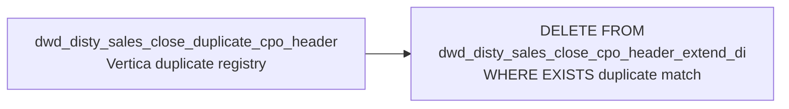

# FIX: Vertica — Delete Duplicate Close CPO Headers (`fix_duplicate_close_cpo_header_di_vertica`)

- artifact_type: etl_table
- artifact_id: flow_cpo.fix_duplicate_close_cpo_header_di_vertica
- domain: cpo
- one_line_purpose: This is a **Vertica-targeted data quality fix script** that deletes duplicate CPO header rows from the Vertica copy of `dwd_disty_sales_close_cpo_header_extend_di`. It uses an EXISTS subquery against a Vertica-synced duplicate registry tabl...
- layer_type: FLOW
- source_kind: etl_sql
- evidence_source: source/etl/sql/csource/etl/sql/po/source/etl/flows/public_order_tools/ingest/public_cpo_dw/script/fix_duplicate_close_cpo_header_di_vertica.sql

---

## L1 Data Foundation

### Identity and physical mapping
- **Table:** `flow_cpo.fix_duplicate_close_cpo_header_di_vertica`
- **Layer type:** FLOW
- **Canonical / derived:** Derived / ETL-loaded (see L3)
- **Owner team:** not registered in metadata catalog

### Grain, scope, exclusions
- **Grain:** Not documented in repository
- **Scope:** See L2 business purpose / L3 filters
- **Partition:** Not documented in repository - resolved from pipeline (see L4)
- **Natural key:** Not documented in repository
- **Exclusions:** Not documented in repository


### Cross-engine presence
| Engine | Present | Canonical FQN | Notes |
|--------|---------|---------------|-------|
| Hive | yes | `fix_duplicate_close_cpo_header_di_vertica` | ETL target / intermediate per evidence script |
| Vertica | pending | `fix_duplicate_close_cpo_header_di_vertica` | Confirm via hive2vertica flow evidence / MCP |

### Physical schema reference

Pointer block only - full column catalog lives in WKB L1 storage JSON.

| Field | Value |
|-------|-------|
| **Authoritative catalog** | WKB L1 storage seed (not duplicated in this file) |
| **entity_id** | `flow_cpo.fix_duplicate_close_cpo_header_di_vertica` |
| **l1_catalog_seed** | `target/storage/wkb/snapshots/_snapshot_id_template/l1_catalog/{engine}_{schema}_{table}.json` |
| **column_count** | pending (run ddl_seed_writer) |
| **partition_keys** | `Not documented in repository` |
| **ddl_source** | pending Bitbucket DDL / Vertica metadata ingest |
| **retrieval** | `python -m tools.wkb.indexing.run_query --query "cpo fix_duplicate_close_cpo_header_di_vertica schema" --intent find_table_schema` |

### Lineage
| Object | Role |
|--------|------|
| `dw_${country_code}.dwd_disty_sales_close_duplicate_cpo_header` | Vertica duplicate registry (synced from Hive `_df` table) |
| `dw_${country_code}.dwd_disty_sales_close_cpo_header_extend_di` | **Target** — Vertica CPO header table, duplicate rows removed |

---

### Freshness and load path
| Item | Value |
|------|-------|
| Load pattern | See L3 end-to-end / INSERT pattern in evidence script |
| Schedule | Not documented in repository |
| Parameters | `country_code` |


---

## L2 Declarative Knowledge

### Business purpose
This is a **Vertica-targeted data quality fix script** that deletes duplicate CPO header rows from the Vertica copy of `dwd_disty_sales_close_cpo_header_extend_di`. It uses an EXISTS subquery against a Vertica-synced duplicate registry table to identify and remove the older duplicate partition rows, ensuring the Vertica analytical store matches the cleaned Hive state after the Hive-side fix scripts have run.

---

### Audience and use cases
| Audience | How they benefit |
|----------|-----------------|
| **Data engineering / BI on Vertica** | Keeps the Vertica analytical layer consistent with the Hive data after duplicate partition repairs. |

---

### Fact key resolution
- Natural key: Not documented in repository
- FK / label-on attributes: see L3 dimension join patterns and step-by-step logic.
- Negative assertion: do not treat descriptive labels as grain keys unless listed under natural key.

### Time field semantics
- **date_flag / partition columns:** Not documented in repository
- Primary reporting filter should use the partition column(s) documented in L1; resolve values via L4.


### Metrics served

| Category | Column | Logical metric | Business reading |
|----------|--------|----------------|------------------|
| Measures | — | — | No measure columns mapped for this table. |

### Metric serving map

**Formula authority:** [`source/contracts/cpo/metric-index.md`](../../source/contracts/cpo/metric-index.md)

N/A — no measure columns mapped for this table.

### etl_metrics

No governed logical metrics from `source/contracts/cpo/metric-index.md` are mapped on this table.

---

## L3 Procedural Knowledge

### Query and routing rules
**Business filters:** Use partition / date keys from L1 grain for reporting scope.
**Technical predicates (load only):** See Key filters and step-by-step logic below.

### Dimension join patterns
| Dimension FQN | Join keys | Purpose | Evidence |
|---------------|-----------|---------|----------|
| See step-by-step / base tables | See L3 steps | Dimension enrichment | `source/etl/sql/csource/etl/sql/po/source/etl/flows/public_order_tools/ingest/public_cpo_dw/script/fix_duplicate_close_cpo_header_di_vertica.sql` |

### Key filters and ETL business logic
### Step 1 — DELETE

**Condition:** `EXISTS (SELECT 1 FROM dw_${country_code}.dwd_disty_sales_close_duplicate_cpo_header t2 WHERE t2.cpo_id = target.cpo_id AND t2.last_date_flag = target.date_flag)`

Deletes the row from `dwd_disty_sales_close_cpo_header_extend_di` when the `(cpo_id, date_flag)` pair appears in the duplicate registry as `(cpo_id, last_date_flag)` — meaning this is an older duplicate partition entry.

---

### Standard time-filter SQL
```sql
-- relative period filter using resolved partition value (see L4)
SELECT *
FROM fix_duplicate_close_cpo_header_di_vertica
WHERE /* partition predicate */ date_flag = '${partition_value}';
```

### End-to-end flow
**Target:** `dw_${country_code}.dwd_disty_sales_close_cpo_header_extend_di` (Vertica)

Single `DELETE` statement using a correlated `EXISTS` subquery:
- Delete any row in `dwd_disty_sales_close_cpo_header_extend_di` where there is a matching row in `dwd_disty_sales_close_duplicate_cpo_header` with the same `cpo_id` and `last_date_flag = date_flag`.



---


#### High-level stages (preserved)

| Stage | Business meaning |
|-------|-----------------|
| **Vertica DELETE** | Deletes rows from `dwd_disty_sales_close_cpo_header_extend_di` in Vertica where the `(cpo_id, date_flag)` combination appears as a duplicate in the `dwd_disty_sales_close_duplicate_cpo_header` Vertica table. |

**Parameters:** `country_code`

---


### Base tables register
| Object | Role in this job |
|--------|-----------------|
| `dw_${country_code}.dwd_disty_sales_close_duplicate_cpo_header` | Vertica duplicate registry — same data as the Hive `_df` table, synced to Vertica. Used in EXISTS subquery. |
| `dw_${country_code}.dwd_disty_sales_close_cpo_header_extend_di` | **Target** — Vertica copy; duplicate rows deleted. |

---

### Step-by-step logic
### Step 1 — DELETE

**Condition:** `EXISTS (SELECT 1 FROM dw_${country_code}.dwd_disty_sales_close_duplicate_cpo_header t2 WHERE t2.cpo_id = target.cpo_id AND t2.last_date_flag = target.date_flag)`

Deletes the row from `dwd_disty_sales_close_cpo_header_extend_di` when the `(cpo_id, date_flag)` pair appears in the duplicate registry as `(cpo_id, last_date_flag)` — meaning this is an older duplicate partition entry.

---

### Relationship map (embedded)

| from_fqn | to_fqn | cardinality | join_keys | provenance |
|----------|--------|-------------|-----------|------------|
| — | — | — | — | Not documented in repository |

`source/ref/cpo/table relationship.txt`: Not documented in repository.

### Special logic (embedded)

Not documented in repository

### Column / field derivations (from ETL SQL)

| target_column | expression_sql | upstream_columns | upstream_tables | transform_kind | evidence |
|---------------|----------------|------------------|-----------------|----------------|----------|
| `1` | `1` | — | `dw_${country_code}.dwd_disty_sales_close_duplicate_cpo_header` | passthrough | `source/etl/sql/cpo/public_order_scripts/public_cpo_dw/script/fix_duplicate_close_cpo_header_di_vertica.sql:8` |

### Sentinel and code values
| Value | Meaning |
|-------|---------|
| `t2.last_date_flag = target.date_flag` | Matches the older (duplicate) date_flag in the target to the recorded duplicate date in the registry. |

---

---

## L4 Validation

### Resolved partition value
| Step | Source | How partition / date scope is determined |
|------|--------|------------------------------------------|
| 1 | evidence script / flow | See parameters in L1 Freshness and L3 filters - `source/etl/sql/csource/etl/sql/po/source/etl/flows/public_order_tools/ingest/public_cpo_dw/script/fix_duplicate_close_cpo_header_di_vertica.sql` |

**Plain language:** Partition and date scope follow Azkaban/bootstrap parameters documented in the source script and orchestrating flow; do not hardcode calendar literals.

### Data quality checks
- Prefer row-count-by-partition, metric sums, and grain duplicate checks (see Validation SQL).
- Additional checks from legacy caveats / operational notes when present.

### Validation SQL
```sql
-- 1) Row count by partition
SELECT ${partition_col}, COUNT(*) AS row_cnt
FROM dw_${country_code}.dwd_disty_sales_close_cpo_header_extend_di
WHERE ${partition_col} = '${partition_value}'
GROUP BY ${partition_col};

-- 2) Metric sum by business dimension (top deltas)
SELECT ${dim_key}, SUM(${metric}) AS metric_sum
FROM dw_${country_code}.dwd_disty_sales_close_cpo_header_extend_di
WHERE ${partition_col} = '${partition_value}'
GROUP BY ${dim_key}
ORDER BY ABS(SUM(${metric})) DESC
LIMIT 20;

-- 3) Grain duplicate check
SELECT ${grain_key_1}, ${grain_key_2}, ${grain_key_3}, ${partition_col}, COUNT(*) AS cnt
FROM dw_${country_code}.dwd_disty_sales_close_cpo_header_extend_di
WHERE ${partition_col} = '${partition_value}'
GROUP BY ${grain_key_1}, ${grain_key_2}, ${grain_key_3}, ${partition_col}
HAVING COUNT(*) > 1;
```

Replace placeholders from this file's Grain and keys / Data you can fetch sections, and use the resolved partition value from run scope.

### Caveats for interpretation
- **Vertica-only script** — this runs against Vertica, not Hive. The `dw_${country_code}` schema refers to the Vertica schema.
- **Run order dependency** — the Vertica sync of `dwd_disty_sales_close_duplicate_cpo_header_df` (Hive) to `dwd_disty_sales_close_duplicate_cpo_header` (Vertica) must be complete before this script runs.

---

### Conflicts and open questions
- Schedule, owner, SLA: Not documented in repository (unless preserved schedule evidence above).
- Vertica MCP verification: pending unless confirmed in L5.


---

## L5 Runtime View

### Query path and engine preference
| Role | Hive object | Vertica object | Sync mode | Evidence | MCP verified |
|------|-------------|----------------|-----------|----------|--------------|
| **Query for reporting** | *See script lineage* | `dw_${country_code}.dwd_disty_sales_close_cpo_header_extend_di` | *Verify from flow* | *Add flow file:line* | pending |
| **Hive alternative** | `*` | `dw_${country_code}.dwd_disty_sales_close_cpo_header_extend_di` | - | *See dependencies* | - |
| **ETL internal** | staging/temp tables | *Not synced to Vertica* | - | *See step-by-step logic* | - |

Business users should query `dw_${country_code}.dwd_disty_sales_close_cpo_header_extend_di` in Vertica once MCP verification is completed for this document.

### Access constraints
- Country / company schema parameters may apply (`literal_country`, `company_no`, etc.).
- Hive-only staging objects are not reporting surfaces unless synced.

### Query risk profile
| Field | Value |
|-------|-------|
| requires_date_predicate | unknown |
| scan_risk_tier | medium |

---

## L6 Access and Consumption

### Primary consumers and use cases
| Audience | How they benefit |
|----------|-----------------|
| **Data engineering / BI on Vertica** | Keeps the Vertica analytical layer consistent with the Hive data after duplicate partition repairs. |

---

### Representative query patterns
```sql
-- certified / illustrative lookup - replace predicates from L1/L4
SELECT *
FROM fix_duplicate_close_cpo_header_di_vertica
WHERE date_flag = '${partition_value}'
LIMIT 100;
```

### Dependencies and notes
### Upstream objects (verified)

| Object | Usage | Evidence |
|--------|-------|----------|
| `dw_${country_code}.dwd_disty_sales_close_duplicate_cpo_header` | Vertica duplicate registry for EXISTS filter | `fix_duplicate_close_cpo_header_di_vertica.sql:10` |

### Downstream consumers (verified)

| Object / script | Evidence |
|-----------------|----------|
| None identified in repository. | — |

### Operational detail (verified)

- Vertica DELETE (not an INSERT): `DELETE FROM dw_${country_code}.dwd_disty_sales_close_cpo_header_extend_di WHERE EXISTS (...)` — `fix_duplicate_close_cpo_header_di_vertica.sql:1`

### Not documented in repository

- Schedule, owner, SLA — not in scripts or configs
- The Vertica sync process for `dwd_disty_sales_close_duplicate_cpo_header_df` → `dwd_disty_sales_close_duplicate_cpo_header` (Vertica) — not documented in this script

### Related scripts (verified)

- `dwd_disty_sales_close_duplicate_cpo_header_df.sql` — produces the Hive duplicate registry that feeds the Vertica sync
- `fix_dwd_disty_sales_close_cpo_header_extend_di.sql` — Hive-side equivalent cleanup

---

*Document generated from `source/etl/sql/csource/etl/sql/po/source/etl/flows/public_order_tools/ingest/public_cpo_dw/script/fix_duplicate_close_cpo_header_di_vertica.sql`.*

---

#### Not documented in repository
- Owner, SLA (unless schedule evidence preserved above)
- Any dependency without `file:line` evidence in this document

---

*Document migrated to L1-L6 from legacy Knowledgebase content. Evidence: `source/etl/sql/csource/etl/sql/po/source/etl/flows/public_order_tools/ingest/public_cpo_dw/script/fix_duplicate_close_cpo_header_di_vertica.sql`.*
