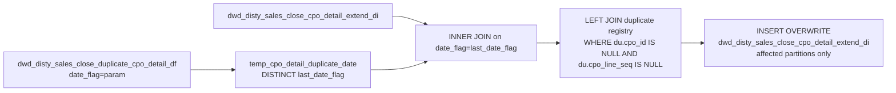

# FIX: Close CPO Detail Duplicate Partition Repair (`fix_dwd_disty_sales_close_cpo_detail_extend_di`)

- artifact_type: etl_table
- artifact_id: flow_cpo.fix_dwd_disty_sales_close_cpo_detail_extend_di
- domain: cpo
- one_line_purpose: This is a **data quality fix script** that repairs the closed CPO line detail table by removing duplicate CPO line rows from older partitions. It uses the same approach as the header fix: reads the detail duplicate registry to find affected...
- layer_type: FLOW
- source_kind: etl_sql
- evidence_source: source/etl/sql/csource/etl/sql/po/source/etl/flows/public_order_tools/ingest/public_cpo_dw/script/fix_dwd_disty_sales_close_cpo_detail_extend_di.sql

---

## L1 Data Foundation

### Identity and physical mapping
- **Table:** `flow_cpo.fix_dwd_disty_sales_close_cpo_detail_extend_di`
- **Layer type:** FLOW
- **Canonical / derived:** Derived / ETL-loaded (see L3)
- **Owner team:** not registered in metadata catalog

### Grain, scope, exclusions
- **Grain:** Not documented in repository
- **Scope:** See L2 business purpose / L3 filters
- **Partition:** Not documented in repository - resolved from pipeline (see L4)
- **Natural key:** Not documented in repository
- **Exclusions:** Not documented in repository

#### Grain detail (preserved)

- Reads from and writes to `dwd_disty_sales_close_cpo_detail_extend_di` — same grain as that table (`(cpo_id, cpo_line_seq, date_flag)`).
- Only affected partitions are overwritten.

---

### Cross-engine presence
| Engine | Present | Canonical FQN | Notes |
|--------|---------|---------------|-------|
| Hive | yes | `fix_dwd_disty_sales_close_cpo_detail_extend_di` | ETL target / intermediate per evidence script |
| Vertica | pending | `fix_dwd_disty_sales_close_cpo_detail_extend_di` | Confirm via hive2vertica flow evidence / MCP |

### Physical schema reference

Pointer block only - full column catalog lives in WKB L1 storage JSON.

| Field | Value |
|-------|-------|
| **Authoritative catalog** | WKB L1 storage seed (not duplicated in this file) |
| **entity_id** | `flow_cpo.fix_dwd_disty_sales_close_cpo_detail_extend_di` |
| **l1_catalog_seed** | `target/storage/wkb/snapshots/_snapshot_id_template/l1_catalog/{engine}_{schema}_{table}.json` |
| **column_count** | pending (run ddl_seed_writer) |
| **partition_keys** | `Not documented in repository` |
| **ddl_source** | pending Bitbucket DDL / Vertica metadata ingest |
| **retrieval** | `python -m tools.wkb.indexing.run_query --query "cpo fix_dwd_disty_sales_close_cpo_detail_extend_di schema" --intent find_table_schema` |

### Lineage
| Object | Role |
|--------|------|
| `dw_${country_code}.dwd_disty_sales_close_duplicate_cpo_detail_df` | Duplicate registry — input |
| `dw_${country_code}.dwd_disty_sales_close_cpo_detail_extend_di` | **Source and target** — cleaned in place |

---

### Freshness and load path
| Item | Value |
|------|-------|
| Load pattern | See L3 end-to-end / INSERT pattern in evidence script |
| Schedule | Not documented in repository |
| Parameters | `country_code`, `date_flag` |


---

## L2 Declarative Knowledge

### Business purpose
This is a **data quality fix script** that repairs the closed CPO line detail table by removing duplicate CPO line rows from older partitions. It uses the same approach as the header fix: reads the detail duplicate registry to find affected partitions, then re-writes those partitions excluding the duplicate rows. The result is a cleaned `dwd_disty_sales_close_cpo_detail_extend_di` where each `(cpo_id, cpo_line_seq)` pair appears in only one date partition.

---

### Audience and use cases
| Audience | How they benefit |
|----------|------------------|
| **Domain consumers (cpo)** | Uses `fix_dwd_disty_sales_close_cpo_detail_extend_di` for operational and reporting workflows documented below. |

### Fact key resolution
- Natural key: Not documented in repository
- FK / label-on attributes: see L3 dimension join patterns and step-by-step logic.
- Negative assertion: do not treat descriptive labels as grain keys unless listed under natural key.

### Time field semantics
- **date_flag / partition columns:** Not documented in repository
- Primary reporting filter should use the partition column(s) documented in L1; resolve values via L4.


### Metrics served

| Category | Column | Logical metric | Business reading |
|----------|--------|----------------|------------------|
| Measures | — | — | No measure columns mapped for this table. |

### Metric serving map

**Formula authority:** [`source/contracts/cpo/metric-index.md`](../../source/contracts/cpo/metric-index.md)

N/A — no measure columns mapped for this table.

### etl_metrics

No governed logical metrics from `source/contracts/cpo/metric-index.md` are mapped on this table.

---

## L3 Procedural Knowledge

### Query and routing rules
**Business filters:** Use partition / date keys from L1 grain for reporting scope.
**Technical predicates (load only):** See Key filters and step-by-step logic below.

### Dimension join patterns
| Dimension FQN | Join keys | Purpose | Evidence |
|---------------|-----------|---------|----------|
| See step-by-step / base tables | See L3 steps | Dimension enrichment | `source/etl/sql/csource/etl/sql/po/source/etl/flows/public_order_tools/ingest/public_cpo_dw/script/fix_dwd_disty_sales_close_cpo_detail_extend_di.sql` |

### Key filters and ETL business logic
### Step 1 — `temp_cpo_detail_duplicate_date`

**Source:** `dwd_disty_sales_close_duplicate_cpo_detail_df WHERE date_flag = '${date_flag}'`
**Output:** `DISTINCT last_date_flag` — partition dates needing repair.

---

### Step 2 — Final `INSERT OVERWRITE`

**Filter key:** `WHERE du.cpo_id IS NULL AND du.cpo_line_seq IS NULL` — both must be null to confirm the row is not a duplicate.

LEFT JOIN keys: `cd.cpo_id = du.cpo_id AND cd.cpo_line_seq = du.cpo_line_seq AND cd.date_flag = du.last_date_flag AND du.date_flag = '${date_flag}'`

---

### Standard time-filter SQL
```sql
-- relative period filter using resolved partition value (see L4)
SELECT *
FROM fix_dwd_disty_sales_close_cpo_detail_extend_di
WHERE /* partition predicate */ date_flag = '${partition_value}';
```

### End-to-end flow
**Runtime parameters:** `country_code`, `date_flag`
**Target table:** `dw_${country_code}.dwd_disty_sales_close_cpo_detail_extend_di` (self-repair).

1. Build `temp_cpo_detail_duplicate_date`: `SELECT DISTINCT last_date_flag FROM dwd_disty_sales_close_duplicate_cpo_detail_df WHERE date_flag = '${date_flag}'`.
2. **INSERT OVERWRITE** affected partitions: INNER JOIN to affected dates, LEFT JOIN duplicate registry, keep rows where `du.cpo_id IS NULL AND du.cpo_line_seq IS NULL`.



---


#### High-level stages (preserved)

| Stage | Business meaning |
|-------|-----------------|
| **Identify affected partitions** | Reads `dwd_disty_sales_close_duplicate_cpo_detail_df` for `date_flag = '${date_flag}'` to get the distinct `last_date_flag` values that need repair. |
| **Re-write clean partitions** | For each affected partition, re-inserts rows from `dwd_disty_sales_close_cpo_detail_extend_di` excluding CPO lines that are in the duplicate registry. |

**Parameters:** `country_code`, `date_flag`

---


### Base tables register
| Object | Role in this job |
|--------|-----------------|
| `dw_${country_code}.dwd_disty_sales_close_duplicate_cpo_detail_df` | Duplicate registry — identifies affected partitions and CPO lines to exclude. |
| `dw_${country_code}.dwd_disty_sales_close_cpo_detail_extend_di` | **Both source and target** — cleaned in place for affected partitions. |

---

### Step-by-step logic
### Step 1 — `temp_cpo_detail_duplicate_date`

**Source:** `dwd_disty_sales_close_duplicate_cpo_detail_df WHERE date_flag = '${date_flag}'`
**Output:** `DISTINCT last_date_flag` — partition dates needing repair.

---

### Step 2 — Final `INSERT OVERWRITE`

**Filter key:** `WHERE du.cpo_id IS NULL AND du.cpo_line_seq IS NULL` — both must be null to confirm the row is not a duplicate.

LEFT JOIN keys: `cd.cpo_id = du.cpo_id AND cd.cpo_line_seq = du.cpo_line_seq AND cd.date_flag = du.last_date_flag AND du.date_flag = '${date_flag}'`

---

### Relationship map (embedded)

| from_fqn | to_fqn | cardinality | join_keys | provenance |
|----------|--------|-------------|-----------|------------|
| `dw_${country_code}.dwd_disty_sales_close_cpo_detail_extend_di` | `temp_cpo_detail_duplicate_date` | many:1 | `cd.date_flag = dd.last_date_flag` | etl_sql (source/etl/sql/cpo/public_order_scripts/public_cpo_dw/script/fix_dwd_disty_sales_close_cpo_detail_extend_di.sql:1) |
| `dw_${country_code}.dwd_disty_sales_close_cpo_detail_extend_di` | `dw_${country_code}.dwd_disty_sales_close_duplicate_cpo_detail_df` | many:1 | `cd.cpo_id = du.cpo_id and cd.cpo_line_seq = du.cpo_line_seq and cd.date_flag=du.last_date_flag and du.date_flag='${date_flag}'` | etl_sql (source/etl/sql/cpo/public_order_scripts/public_cpo_dw/script/fix_dwd_disty_sales_close_cpo_detail_extend_di.sql:1) |

`source/ref/cpo/table relationship.txt`: Not documented in repository.

### Special logic (embedded)

Not documented in repository

### Column / field derivations (from ETL SQL)

| target_column | expression_sql | upstream_columns | upstream_tables | transform_kind | evidence |
|---------------|----------------|------------------|-----------------|----------------|----------|
| `cpo_id` | `cd.cpo_id` | `cpo_id` | `dw_${country_code}.dwd_disty_sales_close_cpo_detail_extend_di`, `temp_cpo_detail_duplicate_date`, `dw_${country_code}.dwd_disty_sales_close_duplicate_cpo_detail_df` | passthrough | `source/etl/sql/cpo/public_order_scripts/public_cpo_dw/script/fix_dwd_disty_sales_close_cpo_detail_extend_di.sql:10` |
| `cpo_line_seq` | `cd.cpo_line_seq` | `cpo_line_seq` | `dw_${country_code}.dwd_disty_sales_close_cpo_detail_extend_di`, `temp_cpo_detail_duplicate_date`, `dw_${country_code}.dwd_disty_sales_close_duplicate_cpo_detail_df` | passthrough | `source/etl/sql/cpo/public_order_scripts/public_cpo_dw/script/fix_dwd_disty_sales_close_cpo_detail_extend_di.sql:11` |
| `cpo_line_no` | `cd.cpo_line_no` | `cpo_line_no` | `dw_${country_code}.dwd_disty_sales_close_cpo_detail_extend_di`, `temp_cpo_detail_duplicate_date`, `dw_${country_code}.dwd_disty_sales_close_duplicate_cpo_detail_df` | passthrough | `source/etl/sql/cpo/public_order_scripts/public_cpo_dw/script/fix_dwd_disty_sales_close_cpo_detail_extend_di.sql:12` |
| `cpo_line_status` | `cd.cpo_line_status` | `cpo_line_status` | `dw_${country_code}.dwd_disty_sales_close_cpo_detail_extend_di`, `temp_cpo_detail_duplicate_date`, `dw_${country_code}.dwd_disty_sales_close_duplicate_cpo_detail_df` | passthrough | `source/etl/sql/cpo/public_order_scripts/public_cpo_dw/script/fix_dwd_disty_sales_close_cpo_detail_extend_di.sql:13` |
| `cpo_sku_no` | `cd.cpo_sku_no` | `cpo_sku_no` | `dw_${country_code}.dwd_disty_sales_close_cpo_detail_extend_di`, `temp_cpo_detail_duplicate_date`, `dw_${country_code}.dwd_disty_sales_close_duplicate_cpo_detail_df` | passthrough | `source/etl/sql/cpo/public_order_scripts/public_cpo_dw/script/fix_dwd_disty_sales_close_cpo_detail_extend_di.sql:14` |
| `cpo_sku_inv_type` | `cd.cpo_sku_inv_type` | `cpo_sku_inv_type` | `dw_${country_code}.dwd_disty_sales_close_cpo_detail_extend_di`, `temp_cpo_detail_duplicate_date`, `dw_${country_code}.dwd_disty_sales_close_duplicate_cpo_detail_df` | passthrough | `source/etl/sql/cpo/public_order_scripts/public_cpo_dw/script/fix_dwd_disty_sales_close_cpo_detail_extend_di.sql:15` |
| `cpo_line_qty` | `cd.cpo_line_qty` | `cpo_line_qty` | `dw_${country_code}.dwd_disty_sales_close_cpo_detail_extend_di`, `temp_cpo_detail_duplicate_date`, `dw_${country_code}.dwd_disty_sales_close_duplicate_cpo_detail_df` | passthrough | `source/etl/sql/cpo/public_order_scripts/public_cpo_dw/script/fix_dwd_disty_sales_close_cpo_detail_extend_di.sql:16` |
| `cpo_allocated_qty` | `cd.cpo_allocated_qty` | `cpo_allocated_qty` | `dw_${country_code}.dwd_disty_sales_close_cpo_detail_extend_di`, `temp_cpo_detail_duplicate_date`, `dw_${country_code}.dwd_disty_sales_close_duplicate_cpo_detail_df` | passthrough | `source/etl/sql/cpo/public_order_scripts/public_cpo_dw/script/fix_dwd_disty_sales_close_cpo_detail_extend_di.sql:17` |
| `cpo_bo_qty` | `cd.cpo_bo_qty` | `cpo_bo_qty` | `dw_${country_code}.dwd_disty_sales_close_cpo_detail_extend_di`, `temp_cpo_detail_duplicate_date`, `dw_${country_code}.dwd_disty_sales_close_duplicate_cpo_detail_df` | passthrough | `source/etl/sql/cpo/public_order_scripts/public_cpo_dw/script/fix_dwd_disty_sales_close_cpo_detail_extend_di.sql:18` |
| `cpo_so_qty` | `cd.cpo_so_qty` | `cpo_so_qty` | `dw_${country_code}.dwd_disty_sales_close_cpo_detail_extend_di`, `temp_cpo_detail_duplicate_date`, `dw_${country_code}.dwd_disty_sales_close_duplicate_cpo_detail_df` | passthrough | `source/etl/sql/cpo/public_order_scripts/public_cpo_dw/script/fix_dwd_disty_sales_close_cpo_detail_extend_di.sql:19` |
| `cpo_del_qty` | `cd.cpo_del_qty` | `cpo_del_qty` | `dw_${country_code}.dwd_disty_sales_close_cpo_detail_extend_di`, `temp_cpo_detail_duplicate_date`, `dw_${country_code}.dwd_disty_sales_close_duplicate_cpo_detail_df` | passthrough | `source/etl/sql/cpo/public_order_scripts/public_cpo_dw/script/fix_dwd_disty_sales_close_cpo_detail_extend_di.sql:20` |
| `cpo_ship_qty` | `cd.cpo_ship_qty` | `cpo_ship_qty` | `dw_${country_code}.dwd_disty_sales_close_cpo_detail_extend_di`, `temp_cpo_detail_duplicate_date`, `dw_${country_code}.dwd_disty_sales_close_duplicate_cpo_detail_df` | passthrough | `source/etl/sql/cpo/public_order_scripts/public_cpo_dw/script/fix_dwd_disty_sales_close_cpo_detail_extend_di.sql:21` |
| `cpo_price` | `cd.cpo_price` | `cpo_price` | `dw_${country_code}.dwd_disty_sales_close_cpo_detail_extend_di`, `temp_cpo_detail_duplicate_date`, `dw_${country_code}.dwd_disty_sales_close_duplicate_cpo_detail_df` | passthrough | `source/etl/sql/cpo/public_order_scripts/public_cpo_dw/script/fix_dwd_disty_sales_close_cpo_detail_extend_di.sql:22` |
| `cpo_grid_price` | `cd.cpo_grid_price` | `cpo_grid_price` | `dw_${country_code}.dwd_disty_sales_close_cpo_detail_extend_di`, `temp_cpo_detail_duplicate_date`, `dw_${country_code}.dwd_disty_sales_close_duplicate_cpo_detail_df` | passthrough | `source/etl/sql/cpo/public_order_scripts/public_cpo_dw/script/fix_dwd_disty_sales_close_cpo_detail_extend_di.sql:23` |
| `cpo_unit_price` | `cd.cpo_unit_price` | `cpo_unit_price` | `dw_${country_code}.dwd_disty_sales_close_cpo_detail_extend_di`, `temp_cpo_detail_duplicate_date`, `dw_${country_code}.dwd_disty_sales_close_duplicate_cpo_detail_df` | passthrough | `source/etl/sql/cpo/public_order_scripts/public_cpo_dw/script/fix_dwd_disty_sales_close_cpo_detail_extend_di.sql:24` |
| `cpo_unit_cost` | `cd.cpo_unit_cost` | `cpo_unit_cost` | `dw_${country_code}.dwd_disty_sales_close_cpo_detail_extend_di`, `temp_cpo_detail_duplicate_date`, `dw_${country_code}.dwd_disty_sales_close_duplicate_cpo_detail_df` | passthrough | `source/etl/sql/cpo/public_order_scripts/public_cpo_dw/script/fix_dwd_disty_sales_close_cpo_detail_extend_di.sql:25` |
| `cpo_extended_price` | `cd.cpo_extended_price` | `cpo_extended_price` | `dw_${country_code}.dwd_disty_sales_close_cpo_detail_extend_di`, `temp_cpo_detail_duplicate_date`, `dw_${country_code}.dwd_disty_sales_close_duplicate_cpo_detail_df` | passthrough | `source/etl/sql/cpo/public_order_scripts/public_cpo_dw/script/fix_dwd_disty_sales_close_cpo_detail_extend_di.sql:26` |
| `cpo_extended_cost` | `cd.cpo_extended_cost` | `cpo_extended_cost` | `dw_${country_code}.dwd_disty_sales_close_cpo_detail_extend_di`, `temp_cpo_detail_duplicate_date`, `dw_${country_code}.dwd_disty_sales_close_duplicate_cpo_detail_df` | passthrough | `source/etl/sql/cpo/public_order_scripts/public_cpo_dw/script/fix_dwd_disty_sales_close_cpo_detail_extend_di.sql:27` |
| `cpo_gm_percent` | `cd.cpo_gm_percent` | `cpo_gm_percent` | `dw_${country_code}.dwd_disty_sales_close_cpo_detail_extend_di`, `temp_cpo_detail_duplicate_date`, `dw_${country_code}.dwd_disty_sales_close_duplicate_cpo_detail_df` | passthrough | `source/etl/sql/cpo/public_order_scripts/public_cpo_dw/script/fix_dwd_disty_sales_close_cpo_detail_extend_di.sql:28` |
| `cpo_price_flag` | `cd.cpo_price_flag` | `cpo_price_flag` | `dw_${country_code}.dwd_disty_sales_close_cpo_detail_extend_di`, `temp_cpo_detail_duplicate_date`, `dw_${country_code}.dwd_disty_sales_close_duplicate_cpo_detail_df` | passthrough | `source/etl/sql/cpo/public_order_scripts/public_cpo_dw/script/fix_dwd_disty_sales_close_cpo_detail_extend_di.sql:29` |
| `cpo_line_delete_id` | `cd.cpo_line_delete_id` | `cpo_line_delete_id` | `dw_${country_code}.dwd_disty_sales_close_cpo_detail_extend_di`, `temp_cpo_detail_duplicate_date`, `dw_${country_code}.dwd_disty_sales_close_duplicate_cpo_detail_df` | passthrough | `source/etl/sql/cpo/public_order_scripts/public_cpo_dw/script/fix_dwd_disty_sales_close_cpo_detail_extend_di.sql:30` |
| `cpo_line_delete_name` | `cd.cpo_line_delete_name` | `cpo_line_delete_name` | `dw_${country_code}.dwd_disty_sales_close_cpo_detail_extend_di`, `temp_cpo_detail_duplicate_date`, `dw_${country_code}.dwd_disty_sales_close_duplicate_cpo_detail_df` | passthrough | `source/etl/sql/cpo/public_order_scripts/public_cpo_dw/script/fix_dwd_disty_sales_close_cpo_detail_extend_di.sql:31` |
| `cpo_line_delete_datetime` | `cd.cpo_line_delete_datetime` | `cpo_line_delete_datetime` | `dw_${country_code}.dwd_disty_sales_close_cpo_detail_extend_di`, `temp_cpo_detail_duplicate_date`, `dw_${country_code}.dwd_disty_sales_close_duplicate_cpo_detail_df` | passthrough | `source/etl/sql/cpo/public_order_scripts/public_cpo_dw/script/fix_dwd_disty_sales_close_cpo_detail_extend_di.sql:32` |
| `cpo_grid_adj` | `cd.cpo_grid_adj` | `cpo_grid_adj` | `dw_${country_code}.dwd_disty_sales_close_cpo_detail_extend_di`, `temp_cpo_detail_duplicate_date`, `dw_${country_code}.dwd_disty_sales_close_duplicate_cpo_detail_df` | passthrough | `source/etl/sql/cpo/public_order_scripts/public_cpo_dw/script/fix_dwd_disty_sales_close_cpo_detail_extend_di.sql:33` |
| `swl_prog_id` | `cd.swl_prog_id` | `swl_prog_id` | `dw_${country_code}.dwd_disty_sales_close_cpo_detail_extend_di`, `temp_cpo_detail_duplicate_date`, `dw_${country_code}.dwd_disty_sales_close_duplicate_cpo_detail_df` | passthrough | `source/etl/sql/cpo/public_order_scripts/public_cpo_dw/script/fix_dwd_disty_sales_close_cpo_detail_extend_di.sql:34` |
| `cis_unit_cost` | `cd.cis_unit_cost` | `cis_unit_cost` | `dw_${country_code}.dwd_disty_sales_close_cpo_detail_extend_di`, `temp_cpo_detail_duplicate_date`, `dw_${country_code}.dwd_disty_sales_close_duplicate_cpo_detail_df` | passthrough | `source/etl/sql/cpo/public_order_scripts/public_cpo_dw/script/fix_dwd_disty_sales_close_cpo_detail_extend_di.sql:35` |
| `cust_part_no` | `cd.cust_part_no` | `cust_part_no` | `dw_${country_code}.dwd_disty_sales_close_cpo_detail_extend_di`, `temp_cpo_detail_duplicate_date`, `dw_${country_code}.dwd_disty_sales_close_duplicate_cpo_detail_df` | passthrough | `source/etl/sql/cpo/public_order_scripts/public_cpo_dw/script/fix_dwd_disty_sales_close_cpo_detail_extend_di.sql:36` |
| `scm_no` | `cd.scm_no` | `scm_no` | `dw_${country_code}.dwd_disty_sales_close_cpo_detail_extend_di`, `temp_cpo_detail_duplicate_date`, `dw_${country_code}.dwd_disty_sales_close_duplicate_cpo_detail_df` | passthrough | `source/etl/sql/cpo/public_order_scripts/public_cpo_dw/script/fix_dwd_disty_sales_close_cpo_detail_extend_di.sql:37` |
| `scm_desc` | `cd.scm_desc` | `scm_desc` | `dw_${country_code}.dwd_disty_sales_close_cpo_detail_extend_di`, `temp_cpo_detail_duplicate_date`, `dw_${country_code}.dwd_disty_sales_close_duplicate_cpo_detail_df` | passthrough | `source/etl/sql/cpo/public_order_scripts/public_cpo_dw/script/fix_dwd_disty_sales_close_cpo_detail_extend_di.sql:38` |
| `spa_no` | `cd.spa_no` | `spa_no` | `dw_${country_code}.dwd_disty_sales_close_cpo_detail_extend_di`, `temp_cpo_detail_duplicate_date`, `dw_${country_code}.dwd_disty_sales_close_duplicate_cpo_detail_df` | passthrough | `source/etl/sql/cpo/public_order_scripts/public_cpo_dw/script/fix_dwd_disty_sales_close_cpo_detail_extend_di.sql:39` |
| `spa_ref_no` | `cd.spa_ref_no` | `spa_ref_no` | `dw_${country_code}.dwd_disty_sales_close_cpo_detail_extend_di`, `temp_cpo_detail_duplicate_date`, `dw_${country_code}.dwd_disty_sales_close_duplicate_cpo_detail_df` | passthrough | `source/etl/sql/cpo/public_order_scripts/public_cpo_dw/script/fix_dwd_disty_sales_close_cpo_detail_extend_di.sql:40` |
| `cpo_extended_exp` | `cd.cpo_extended_exp` | `cpo_extended_exp` | `dw_${country_code}.dwd_disty_sales_close_cpo_detail_extend_di`, `temp_cpo_detail_duplicate_date`, `dw_${country_code}.dwd_disty_sales_close_duplicate_cpo_detail_df` | passthrough | `source/etl/sql/cpo/public_order_scripts/public_cpo_dw/script/fix_dwd_disty_sales_close_cpo_detail_extend_di.sql:41` |
| `spa_type` | `cd.spa_type` | `spa_type` | `dw_${country_code}.dwd_disty_sales_close_cpo_detail_extend_di`, `temp_cpo_detail_duplicate_date`, `dw_${country_code}.dwd_disty_sales_close_duplicate_cpo_detail_df` | passthrough | `source/etl/sql/cpo/public_order_scripts/public_cpo_dw/script/fix_dwd_disty_sales_close_cpo_detail_extend_di.sql:42` |
| `etl_timestamp` | `cd.etl_timestamp` | `etl_timestamp` | `dw_${country_code}.dwd_disty_sales_close_cpo_detail_extend_di`, `temp_cpo_detail_duplicate_date`, `dw_${country_code}.dwd_disty_sales_close_duplicate_cpo_detail_df` | passthrough | `source/etl/sql/cpo/public_order_scripts/public_cpo_dw/script/fix_dwd_disty_sales_close_cpo_detail_extend_di.sql:43` |
| `cpo_entry_datetime` | `cd.cpo_entry_datetime` | `cpo_entry_datetime` | `dw_${country_code}.dwd_disty_sales_close_cpo_detail_extend_di`, `temp_cpo_detail_duplicate_date`, `dw_${country_code}.dwd_disty_sales_close_duplicate_cpo_detail_df` | passthrough | `source/etl/sql/cpo/public_order_scripts/public_cpo_dw/script/fix_dwd_disty_sales_close_cpo_detail_extend_di.sql:44` |
| `cpo_change_date` | `cd.cpo_change_date` | `cpo_change_date` | `dw_${country_code}.dwd_disty_sales_close_cpo_detail_extend_di`, `temp_cpo_detail_duplicate_date`, `dw_${country_code}.dwd_disty_sales_close_duplicate_cpo_detail_df` | passthrough | `source/etl/sql/cpo/public_order_scripts/public_cpo_dw/script/fix_dwd_disty_sales_close_cpo_detail_extend_di.sql:45` |
| `adj_amount` | `cd.adj_amount` | `adj_amount` | `dw_${country_code}.dwd_disty_sales_close_cpo_detail_extend_di`, `temp_cpo_detail_duplicate_date`, `dw_${country_code}.dwd_disty_sales_close_duplicate_cpo_detail_df` | passthrough | `source/etl/sql/cpo/public_order_scripts/public_cpo_dw/script/fix_dwd_disty_sales_close_cpo_detail_extend_di.sql:46` |
| `so_unit_price` | `cd.so_unit_price` | `so_unit_price` | `dw_${country_code}.dwd_disty_sales_close_cpo_detail_extend_di`, `temp_cpo_detail_duplicate_date`, `dw_${country_code}.dwd_disty_sales_close_duplicate_cpo_detail_df` | passthrough | `source/etl/sql/cpo/public_order_scripts/public_cpo_dw/script/fix_dwd_disty_sales_close_cpo_detail_extend_di.sql:47` |
| `gm` | `cd.gm` | `gm` | `dw_${country_code}.dwd_disty_sales_close_cpo_detail_extend_di`, `temp_cpo_detail_duplicate_date`, `dw_${country_code}.dwd_disty_sales_close_duplicate_cpo_detail_df` | passthrough | `source/etl/sql/cpo/public_order_scripts/public_cpo_dw/script/fix_dwd_disty_sales_close_cpo_detail_extend_di.sql:48` |
| `gm_net` | `cd.gm_net` | `gm_net` | `dw_${country_code}.dwd_disty_sales_close_cpo_detail_extend_di`, `temp_cpo_detail_duplicate_date`, `dw_${country_code}.dwd_disty_sales_close_duplicate_cpo_detail_df` | passthrough | `source/etl/sql/cpo/public_order_scripts/public_cpo_dw/script/fix_dwd_disty_sales_close_cpo_detail_extend_di.sql:49` |
| `list_points` | `cd.list_points` | `list_points` | `dw_${country_code}.dwd_disty_sales_close_cpo_detail_extend_di`, `temp_cpo_detail_duplicate_date`, `dw_${country_code}.dwd_disty_sales_close_duplicate_cpo_detail_df` | passthrough | `source/etl/sql/cpo/public_order_scripts/public_cpo_dw/script/fix_dwd_disty_sales_close_cpo_detail_extend_di.sql:50` |
| `off_retail` | `cd.off_retail` | `off_retail` | `dw_${country_code}.dwd_disty_sales_close_cpo_detail_extend_di`, `temp_cpo_detail_duplicate_date`, `dw_${country_code}.dwd_disty_sales_close_duplicate_cpo_detail_df` | passthrough | `source/etl/sql/cpo/public_order_scripts/public_cpo_dw/script/fix_dwd_disty_sales_close_cpo_detail_extend_di.sql:51` |
| `rebate_total` | `cd.rebate_total` | `rebate_total` | `dw_${country_code}.dwd_disty_sales_close_cpo_detail_extend_di`, `temp_cpo_detail_duplicate_date`, `dw_${country_code}.dwd_disty_sales_close_duplicate_cpo_detail_df` | passthrough | `source/etl/sql/cpo/public_order_scripts/public_cpo_dw/script/fix_dwd_disty_sales_close_cpo_detail_extend_di.sql:52` |
| `so_net_price` | `cd.so_net_price` | `so_net_price` | `dw_${country_code}.dwd_disty_sales_close_cpo_detail_extend_di`, `temp_cpo_detail_duplicate_date`, `dw_${country_code}.dwd_disty_sales_close_duplicate_cpo_detail_df` | passthrough | `source/etl/sql/cpo/public_order_scripts/public_cpo_dw/script/fix_dwd_disty_sales_close_cpo_detail_extend_di.sql:53` |
| `vrf` | `cd.vrf` | `vrf` | `dw_${country_code}.dwd_disty_sales_close_cpo_detail_extend_di`, `temp_cpo_detail_duplicate_date`, `dw_${country_code}.dwd_disty_sales_close_duplicate_cpo_detail_df` | passthrough | `source/etl/sql/cpo/public_order_scripts/public_cpo_dw/script/fix_dwd_disty_sales_close_cpo_detail_extend_di.sql:54` |
| `cpo_base_cost` | `cd.cpo_base_cost` | `cpo_base_cost` | `dw_${country_code}.dwd_disty_sales_close_cpo_detail_extend_di`, `temp_cpo_detail_duplicate_date`, `dw_${country_code}.dwd_disty_sales_close_duplicate_cpo_detail_df` | passthrough | `source/etl/sql/cpo/public_order_scripts/public_cpo_dw/script/fix_dwd_disty_sales_close_cpo_detail_extend_di.sql:55` |
| `cpo_list_price` | `cd.cpo_list_price` | `cpo_list_price` | `dw_${country_code}.dwd_disty_sales_close_cpo_detail_extend_di`, `temp_cpo_detail_duplicate_date`, `dw_${country_code}.dwd_disty_sales_close_duplicate_cpo_detail_df` | passthrough | `source/etl/sql/cpo/public_order_scripts/public_cpo_dw/script/fix_dwd_disty_sales_close_cpo_detail_extend_di.sql:56` |
| `contract_no` | `cd.contract_no` | `contract_no` | `dw_${country_code}.dwd_disty_sales_close_cpo_detail_extend_di`, `temp_cpo_detail_duplicate_date`, `dw_${country_code}.dwd_disty_sales_close_duplicate_cpo_detail_df` | passthrough | `source/etl/sql/cpo/public_order_scripts/public_cpo_dw/script/fix_dwd_disty_sales_close_cpo_detail_extend_di.sql:57` |
| `wf_request_id` | `cd.wf_request_id` | `wf_request_id` | `dw_${country_code}.dwd_disty_sales_close_cpo_detail_extend_di`, `temp_cpo_detail_duplicate_date`, `dw_${country_code}.dwd_disty_sales_close_duplicate_cpo_detail_df` | passthrough | `source/etl/sql/cpo/public_order_scripts/public_cpo_dw/script/fix_dwd_disty_sales_close_cpo_detail_extend_di.sql:58` |
| `date_flag` | `cd.date_flag` | `date_flag` | `dw_${country_code}.dwd_disty_sales_close_cpo_detail_extend_di`, `temp_cpo_detail_duplicate_date`, `dw_${country_code}.dwd_disty_sales_close_duplicate_cpo_detail_df` | passthrough | `source/etl/sql/cpo/public_order_scripts/public_cpo_dw/script/fix_dwd_disty_sales_close_cpo_detail_extend_di.sql:59` |

### Sentinel and code values
| Value | Meaning |
|-------|---------|
| `du.cpo_id IS NULL AND du.cpo_line_seq IS NULL` | Both keys null confirms no duplicate match — row is safe to keep. |

---

---

## L4 Validation

### Resolved partition value
| Step | Source | How partition / date scope is determined |
|------|--------|------------------------------------------|
| 1 | evidence script / flow | See parameters in L1 Freshness and L3 filters - `source/etl/sql/csource/etl/sql/po/source/etl/flows/public_order_tools/ingest/public_cpo_dw/script/fix_dwd_disty_sales_close_cpo_detail_extend_di.sql` |

**Plain language:** Partition and date scope follow Azkaban/bootstrap parameters documented in the source script and orchestrating flow; do not hardcode calendar literals.

### Data quality checks
- Prefer row-count-by-partition, metric sums, and grain duplicate checks (see Validation SQL).
- Additional checks from legacy caveats / operational notes when present.

### Validation SQL
```sql
-- 1) Row count by partition
SELECT ${partition_col}, COUNT(*) AS row_cnt
FROM dw_${country_code}.dwd_disty_sales_close_cpo_detail_extend_di
WHERE ${partition_col} = '${partition_value}'
GROUP BY ${partition_col};

-- 2) Metric sum by business dimension (top deltas)
SELECT ${dim_key}, SUM(${metric}) AS metric_sum
FROM dw_${country_code}.dwd_disty_sales_close_cpo_detail_extend_di
WHERE ${partition_col} = '${partition_value}'
GROUP BY ${dim_key}
ORDER BY ABS(SUM(${metric})) DESC
LIMIT 20;

-- 3) Grain duplicate check
SELECT ${grain_key_1}, ${grain_key_2}, ${grain_key_3}, ${partition_col}, COUNT(*) AS cnt
FROM dw_${country_code}.dwd_disty_sales_close_cpo_detail_extend_di
WHERE ${partition_col} = '${partition_value}'
GROUP BY ${grain_key_1}, ${grain_key_2}, ${grain_key_3}, ${partition_col}
HAVING COUNT(*) > 1;
```

Replace placeholders from this file's Grain and keys / Data you can fetch sections, and use the resolved partition value from run scope.

### Caveats for interpretation
None identified in repository

### Conflicts and open questions
- Schedule, owner, SLA: Not documented in repository (unless preserved schedule evidence above).
- Vertica MCP verification: pending unless confirmed in L5.


---

## L5 Runtime View

### Query path and engine preference
| Role | Hive object | Vertica object | Sync mode | Evidence | MCP verified |
|------|-------------|----------------|-----------|----------|--------------|
| **Query for reporting** | *See script lineage* | `dw_${country_code}.dwd_disty_sales_close_cpo_detail_extend_di` | *Verify from flow* | *Add flow file:line* | pending |
| **Hive alternative** | `*` | `dw_${country_code}.dwd_disty_sales_close_cpo_detail_extend_di` | - | *See dependencies* | - |
| **ETL internal** | staging/temp tables | *Not synced to Vertica* | - | *See step-by-step logic* | - |

Business users should query `dw_${country_code}.dwd_disty_sales_close_cpo_detail_extend_di` in Vertica once MCP verification is completed for this document.

### Access constraints
- Country / company schema parameters may apply (`literal_country`, `company_no`, etc.).
- Hive-only staging objects are not reporting surfaces unless synced.

### Query risk profile
| Field | Value |
|-------|-------|
| requires_date_predicate | unknown |
| scan_risk_tier | medium |

---

## L6 Access and Consumption

### Primary consumers and use cases
### Upstream objects (verified)

| Object | Usage | Evidence |
|--------|-------|----------|
| `dw_${country_code}.dwd_disty_sales_close_duplicate_cpo_detail_df` | Duplicate registry | `fix_dwd_disty_sales_close_cpo_detail_extend_di.sql:4,65,70` |
| `dw_${country_code}.dwd_disty_sales_close_cpo_detail_extend_di` | Source rows to filter | `fix_dwd_disty_sales_close_cpo_detail_extend_di.sql:61` |

### Downstream consumers (verified)

| Object / script | Evidence |
|-----------------|----------|
| None identified in repository. | — |

### Operational detail (verified)

- Partition overwrite: `INSERT OVERWRITE TABLE dw_${country_code}.dwd_disty_sales_close_cpo_detail_extend_di PARTITION (date_flag)` — `fix_dwd_disty_sales_close_cpo_detail_extend_di.sql:8`

### Not documented in repository

- S

### Representative query patterns
```sql
-- certified / illustrative lookup - replace predicates from L1/L4
SELECT *
FROM fix_dwd_disty_sales_close_cpo_detail_extend_di
WHERE date_flag = '${partition_value}'
LIMIT 100;
```

### Dependencies and notes
### Upstream objects (verified)

| Object | Usage | Evidence |
|--------|-------|----------|
| `dw_${country_code}.dwd_disty_sales_close_duplicate_cpo_detail_df` | Duplicate registry | `fix_dwd_disty_sales_close_cpo_detail_extend_di.sql:4,65,70` |
| `dw_${country_code}.dwd_disty_sales_close_cpo_detail_extend_di` | Source rows to filter | `fix_dwd_disty_sales_close_cpo_detail_extend_di.sql:61` |

### Downstream consumers (verified)

| Object / script | Evidence |
|-----------------|----------|
| None identified in repository. | — |

### Operational detail (verified)

- Partition overwrite: `INSERT OVERWRITE TABLE dw_${country_code}.dwd_disty_sales_close_cpo_detail_extend_di PARTITION (date_flag)` — `fix_dwd_disty_sales_close_cpo_detail_extend_di.sql:8`

### Not documented in repository

- Schedule, owner, SLA — not in scripts or configs

### Related scripts (verified)

- `dwd_disty_sales_close_duplicate_cpo_detail_df.sql` — must run first — `source/etl/sql/csource/etl/sql/po/source/etl/flows/public_order_tools/ingest/public_cpo_dw/script/dwd_disty_sales_close_duplicate_cpo_detail_df.sql`
- `fix_duplicate_close_cpo_detail_di_vertica.sql` — companion Vertica DELETE — `source/etl/sql/csource/etl/sql/po/source/etl/flows/public_order_tools/ingest/public_cpo_dw/script/fix_duplicate_close_cpo_detail_di_vertica.sql`

---

*Document generated from `source/etl/sql/csource/etl/sql/po/source/etl/flows/public_order_tools/ingest/public_cpo_dw/script/fix_dwd_disty_sales_close_cpo_detail_extend_di.sql`.*

#### Not documented in repository
- Owner, SLA (unless schedule evidence preserved above)
- Any dependency without `file:line` evidence in this document

---

*Document migrated to L1-L6 from legacy Knowledgebase content. Evidence: `source/etl/sql/csource/etl/sql/po/source/etl/flows/public_order_tools/ingest/public_cpo_dw/script/fix_dwd_disty_sales_close_cpo_detail_extend_di.sql`.*
