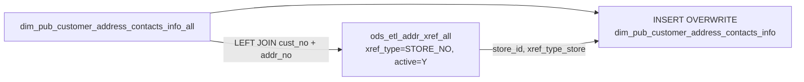

# DIM: Customer Address & Contact with Store Enrichment (`dim_pub_customer_address_contacts_info`)

- artifact_type: etl_table
- artifact_id: dim_us.dim_pub_customer_address_contacts_info
- domain: customer
- one_line_purpose: This dimension table is the reporting-ready version of the customer address and contact dataset. It starts from the intermediate staging table `dim_pub_customer_address_contacts_info_all` and enriches each address with its associated store ...
- layer_type: DIM
- source_kind: etl_sql
- evidence_source: source/etl/sql/customer/source/etl/flows/public_order_tools/ingest/public_customer_dimension/script/dim_pub_customer_address_contacts_info.sql

---

## L1 Data Foundation

### Identity and physical mapping
- **Table:** `dim_us.dim_pub_customer_address_contacts_info`
- **Layer type:** DIM
- **Canonical / derived:** Derived / ETL-loaded (see L3)
- **Owner team:** not registered in metadata catalog

### Grain, scope, exclusions
- **Grain:** one row per customer × address cross-reference × contact cross-reference combination (inherited from `_all` staging table).
- **Scope:** See L2 business purpose / L3 filters
- **Partition:** none explicit — full overwrite each run. - resolved from pipeline (see L4)
- **Natural key:** `cust_no`, `addr_xref_seq`, `contact_xref_seq`, `contact_no`.
- **Exclusions:** Not documented in repository

#### Grain detail (preserved)

- **Grain:** one row per customer × address cross-reference × contact cross-reference combination (inherited from `_all` staging table).
- **Partition:** none explicit — full overwrite each run.
- **Natural key:** `cust_no`, `addr_xref_seq`, `contact_xref_seq`, `contact_no`.

---

### Cross-engine presence
| Engine | Present | Canonical FQN | Notes |
|--------|---------|---------------|-------|
| Hive | yes | `dim_pub_customer_address_contacts_info` | ETL target / intermediate per evidence script |
| Vertica | pending | `dim_pub_customer_address_contacts_info` | Confirm via hive2vertica flow evidence / MCP |

### Physical schema reference

Pointer block only - full column catalog lives in WKB L1 storage JSON.

| Field | Value |
|-------|-------|
| **Authoritative catalog** | WKB L1 storage seed (not duplicated in this file) |
| **entity_id** | `dim_us.dim_pub_customer_address_contacts_info` |
| **l1_catalog_seed** | `target/storage/wkb/snapshots/_snapshot_id_template/l1_catalog/{engine}_{schema}_{table}.json` |
| **column_count** | pending (run ddl_seed_writer) |
| **partition_keys** | `none explicit — full overwrite each run.` |
| **ddl_source** | pending Bitbucket DDL / Vertica metadata ingest |
| **retrieval** | `python -m tools.wkb.indexing.run_query --query "customer dim_pub_customer_address_contacts_info schema" --intent find_table_schema` |

### Lineage
| Object | Role |
|--------|------|
| `dim_${country_code}.dim_pub_customer_address_contacts_info_all` | Primary source (upstream staging layer) |
| `ods_${country_code}.ods_etl_addr_xref_all` | Store ID enrichment |

---

### Freshness and load path
| Item | Value |
|------|-------|
| Load pattern | See L3 end-to-end / INSERT pattern in evidence script |
| Schedule | Not documented in repository |
| Parameters | `${country_code}` — determines the DIM/ODS schema prefix |


---

## L2 Declarative Knowledge

### Business purpose
This dimension table is the reporting-ready version of the customer address and contact dataset. It starts from the intermediate staging table `dim_pub_customer_address_contacts_info_all` and enriches each address with its associated store identifier by joining to the address cross-reference for `STORE_NO`. The result is the canonical per-customer address/contact dimension used by downstream reports and the master customer information dimension.

---

### Audience and use cases
| Audience | How they benefit |
|----------|-----------------|
| **Sales & CRM** | Enriched address/contact with store affiliation for territory and account management |
| **dim_pub_customer_info ETL** | Provides bill-to address, city, zip, state, country, and contact fields for the master customer dimension |
| **Order management** | `store_id` links addresses to store/retail location identifiers for fulfilment routing |
| **E-commerce / EDI** | `ei_flag`, `bill_to_flag`, and `primary_contact_flag` support channel-routing logic |

---

### Identifier search profile
- Primary lookup keys: see natural key under L1 Grain.
- Use latest snapshot / active flags when documented in L3 filters.

### Time field semantics
- **date_flag / partition columns:** none explicit — full overwrite each run.
- Primary reporting filter should use the partition column(s) documented in L1; resolve values via L4.


### Metrics served

| Category | Column | Logical metric | Business reading |
|----------|--------|----------------|------------------|
| Measures | — | — | No measure columns mapped for this table. |

### Metric serving map

**Formula authority:** [`source/contracts/customer/metric-index.md`](../../source/contracts/customer/metric-index.md)

N/A — no measure columns mapped for this table.

### etl_metrics

No governed logical metrics from `source/contracts/customer/metric-index.md` are mapped on this table.

---

### Metric serving map
N/A - not a `*_comb_mtd` / multi-period wide serving table (or map not present in legacy doc).


### Data products and column groups (preserved)

### Identifiers and relationships

- **Customer:** `cust_no`, `cust_name`, `website_address`, `xref_no`
- **Address:** `addr_no`, `addr_xref_seq`, `store_no`, `store_id`
- **Contact:** `contact_no`, `contact_xref_seq`, `xref_seq`, `xref1`

### Dimension columns (reporting-ready)

Use these for **filters, group-bys, and star-schema joins**:

- `address1`, `address1a`, `address1b`, `address2`, `address3a`, `address3b` — address lines
- `city1a`, `city1b`, `state`, `country`, `zip_code` — geographic fields
- `addr_name1a`, `addr_name1b`, `addr_name2a`, `addr_name2b` — address name lines
- `drop_ship`, `store_no` — fulfilment routing
- `store_id` — store identifier from `STORE_NO` xref (added in this layer)
- `xref_type_addr` — address cross-reference type (trimmed)
- `xref_type_store` — store cross-reference type from the enrichment join
- `xref_type_contact` — contact cross-reference type (trimmed)
- `contact_name`, `title`, `prefer_lang` — contact identification
- `email_address`, `stop_email`, `bad_email`, `bad_email_desc` — email validity
- `phone_no`, `fax_no`, `cell_no`, `phone_no2`, `ext_no`, `ext_no2` — phone fields
- `format_phone_no`, `format_phone_no2`, `format_cell_no` — digits-only phone strings
- `stop_call`, `comments` — contact preference flags
- `contact_type` — semicolon-delimited contact type descriptions
- `active_flag_addr`, `active_flag_contact` — active status flags
- `entry_datetime_contact`, `update_datetime_contact`, `delete_datetime_contact` — contact audit trail

### Flag columns

| Column | Meaning |
|--------|---------|
| `bill_to_flag` | `'Y'` when address is the bill-to location |
| `primary_contact_flag` | `'Y'` when contact is the primary contact for this address |
| `ei_flag` | `'Y'` when linked to the EI (electronic interface) channel |

### Audit columns

- `etl_timestamp` — LA-timezone capture time

---

### etl_metrics

N/A - no calculable ETL formulas extracted from this document (passthrough / stored measures only, or formulas not documented).

---

## L3 Procedural Knowledge

### Query and routing rules
**Business filters:** Use partition / date keys from L1 grain for reporting scope.
**Technical predicates (load only):** See Key filters and step-by-step logic below.

### Dimension join patterns
| Dimension FQN | Join keys | Purpose | Evidence |
|---------------|-----------|---------|----------|
| See step-by-step / base tables | See L3 steps | Dimension enrichment | `source/etl/sql/customer/source/etl/flows/public_order_tools/ingest/public_customer_dimension/script/dim_pub_customer_address_contacts_info.sql` |

### Key filters and ETL business logic
### Step 1 — Final SELECT + INSERT OVERWRITE

**From:** `dim_${country_code}.dim_pub_customer_address_contacts_info_all` aliased `cac`

**Left join on insert:**

| Join | Keys | Purpose |
|------|------|---------|
| `ods_etl_addr_xref_all ax` | `cac.cust_no = ax.xref_no` AND `cac.addr_no = ax.addr_no` AND `trim(ax.xref_type) = 'STORE_NO'` AND `ax.active = 'Y'` | Adds the store identifier for addresses associated with a store location |

**Pass-through columns:**
All columns from `dim_pub_customer_address_contacts_info_all` (`cac.*`) are passed through unchanged.

**Derived/added columns at SELECT:**

| Column | Formula | Plain language |
|--------|---------|----------------|
| `store_id` | `ax.xref` | The store number/identifier associated with this address, from the STORE_NO xref record |
| `xref_type_store` | `ax.xref_type` | Cross-reference type from the store join (will be `'STORE_NO'` when matched) |

---

### Standard time-filter SQL
```sql
-- relative period filter using resolved partition value (see L4)
SELECT *
FROM dim_pub_customer_address_contacts_info
WHERE /* partition predicate */ date_flag = '${partition_value}';
```

### End-to-end flow
**Runtime parameters:** `${country_code}`
**Target table:** `dim_${country_code}.dim_pub_customer_address_contacts_info`, full overwrite.

1. **Read** all rows from `dim_${country_code}.dim_pub_customer_address_contacts_info_all` — this is the upstream staging table that already contains the full address × contact join with flags.
2. **LEFT JOIN** `ods_${country_code}.ods_etl_addr_xref_all` on `cust_no = ax.xref_no` AND `addr_no = ax.addr_no` AND `xref_type = 'STORE_NO'` AND `active = 'Y'` — adds `store_id` (`ax.xref`) and `xref_type_store`.
3. **INSERT OVERWRITE** target with all columns from staging plus `store_id` and `xref_type_store`.



---


#### High-level stages (preserved)

| Stage | Business meaning |
|-------|-----------------|
| **Read intermediate staging** | Pulls the full address × contact cross product from the `_all` staging table |
| **Store ID enrichment** | Left-joins address cross-reference filtered to `xref_type = 'STORE_NO'` and `active = 'Y'` to obtain the store identifier (`ax.xref`) as `store_id` |
| **INSERT OVERWRITE** | Fully replaces the target table each run |

**Parameters:** `${country_code}` — determines the DIM/ODS schema prefix

---


### Base tables register
| Object | Role in this job |
|--------|-----------------|
| `dim_${country_code}.dim_pub_customer_address_contacts_info_all` | Primary source — full address × contact dataset with all flags; all columns except `store_id` and `xref_type_store` come from here |
| `ods_${country_code}.ods_etl_addr_xref_all` | Store enrichment — provides `xref` (as `store_id`) and `xref_type` (as `xref_type_store`) for addresses linked to a store number |

**Temporary tables (inside the job only):** none — single-step SELECT with one LEFT JOIN.

---

### Step-by-step logic
### Step 1 — Final SELECT + INSERT OVERWRITE

**From:** `dim_${country_code}.dim_pub_customer_address_contacts_info_all` aliased `cac`

**Left join on insert:**

| Join | Keys | Purpose |
|------|------|---------|
| `ods_etl_addr_xref_all ax` | `cac.cust_no = ax.xref_no` AND `cac.addr_no = ax.addr_no` AND `trim(ax.xref_type) = 'STORE_NO'` AND `ax.active = 'Y'` | Adds the store identifier for addresses associated with a store location |

**Pass-through columns:**
All columns from `dim_pub_customer_address_contacts_info_all` (`cac.*`) are passed through unchanged.

**Derived/added columns at SELECT:**

| Column | Formula | Plain language |
|--------|---------|----------------|
| `store_id` | `ax.xref` | The store number/identifier associated with this address, from the STORE_NO xref record |
| `xref_type_store` | `ax.xref_type` | Cross-reference type from the store join (will be `'STORE_NO'` when matched) |

---

### Relationship map (embedded)

| from_fqn | to_fqn | cardinality | join_keys | provenance |
|----------|--------|-------------|-----------|------------|
| `dim_${country_code}.dim_pub_customer_address_contacts_info_all` | `ods_${country_code}.ods_etl_addr_xref_all` | many:1 | `cac.cust_no=ax.xref_no and cac.addr_no=ax.addr_no AND trim(ax.xref_type) = 'STORE_NO' And ax.active='Y'` | etl_sql (source/etl/sql/customer/public_order_scripts/public_customer_dimension/script/dim_pub_customer_address_contacts_info.sql:1) |

`source/ref/customer/table relationship.txt`: Not documented in repository.

### Special logic (embedded)

Not documented in repository

### Column / field derivations (from ETL SQL)

| target_column | expression_sql | upstream_columns | upstream_tables | transform_kind | evidence |
|---------------|----------------|------------------|-----------------|----------------|----------|
| `cust_no` | `cac.cust_no` | `cust_no` | `dim_${country_code}.dim_pub_customer_address_contacts_info_all`, `ods_${country_code}.ods_etl_addr_xref_all` | passthrough | `source/etl/sql/customer/public_order_scripts/public_customer_dimension/script/dim_pub_customer_address_contacts_info.sql:3` |
| `cust_name` | `cac.cust_name` | `cust_name` | `dim_${country_code}.dim_pub_customer_address_contacts_info_all`, `ods_${country_code}.ods_etl_addr_xref_all` | passthrough | `source/etl/sql/customer/public_order_scripts/public_customer_dimension/script/dim_pub_customer_address_contacts_info.sql:4` |
| `addr_xref_seq` | `cac.addr_xref_seq` | `addr_xref_seq` | `dim_${country_code}.dim_pub_customer_address_contacts_info_all`, `ods_${country_code}.ods_etl_addr_xref_all` | passthrough | `source/etl/sql/customer/public_order_scripts/public_customer_dimension/script/dim_pub_customer_address_contacts_info.sql:5` |
| `addr_no` | `cac.addr_no` | `addr_no` | `dim_${country_code}.dim_pub_customer_address_contacts_info_all`, `ods_${country_code}.ods_etl_addr_xref_all` | passthrough | `source/etl/sql/customer/public_order_scripts/public_customer_dimension/script/dim_pub_customer_address_contacts_info.sql:6` |
| `address1a` | `cac.address1a` | `address1a` | `dim_${country_code}.dim_pub_customer_address_contacts_info_all`, `ods_${country_code}.ods_etl_addr_xref_all` | passthrough | `source/etl/sql/customer/public_order_scripts/public_customer_dimension/script/dim_pub_customer_address_contacts_info.sql:7` |
| `address1b` | `cac.address1b` | `address1b` | `dim_${country_code}.dim_pub_customer_address_contacts_info_all`, `ods_${country_code}.ods_etl_addr_xref_all` | passthrough | `source/etl/sql/customer/public_order_scripts/public_customer_dimension/script/dim_pub_customer_address_contacts_info.sql:8` |
| `address1` | `cac.address1` | `address1` | `dim_${country_code}.dim_pub_customer_address_contacts_info_all`, `ods_${country_code}.ods_etl_addr_xref_all` | passthrough | `source/etl/sql/customer/public_order_scripts/public_customer_dimension/script/dim_pub_customer_address_contacts_info.sql:7` |
| `address2` | `cac.address2` | `address2` | `dim_${country_code}.dim_pub_customer_address_contacts_info_all`, `ods_${country_code}.ods_etl_addr_xref_all` | passthrough | `source/etl/sql/customer/public_order_scripts/public_customer_dimension/script/dim_pub_customer_address_contacts_info.sql:10` |
| `address3a` | `cac.address3a` | `address3a` | `dim_${country_code}.dim_pub_customer_address_contacts_info_all`, `ods_${country_code}.ods_etl_addr_xref_all` | passthrough | `source/etl/sql/customer/public_order_scripts/public_customer_dimension/script/dim_pub_customer_address_contacts_info.sql:11` |
| `address3b` | `cac.address3b` | `address3b` | `dim_${country_code}.dim_pub_customer_address_contacts_info_all`, `ods_${country_code}.ods_etl_addr_xref_all` | passthrough | `source/etl/sql/customer/public_order_scripts/public_customer_dimension/script/dim_pub_customer_address_contacts_info.sql:12` |
| `city1a` | `cac.city1a` | `city1a` | `dim_${country_code}.dim_pub_customer_address_contacts_info_all`, `ods_${country_code}.ods_etl_addr_xref_all` | passthrough | `source/etl/sql/customer/public_order_scripts/public_customer_dimension/script/dim_pub_customer_address_contacts_info.sql:13` |
| `city1b` | `cac.city1b` | `city1b` | `dim_${country_code}.dim_pub_customer_address_contacts_info_all`, `ods_${country_code}.ods_etl_addr_xref_all` | passthrough | `source/etl/sql/customer/public_order_scripts/public_customer_dimension/script/dim_pub_customer_address_contacts_info.sql:14` |
| `STATE` | `cac.STATE` | `STATE` | `dim_${country_code}.dim_pub_customer_address_contacts_info_all`, `ods_${country_code}.ods_etl_addr_xref_all` | passthrough | `source/etl/sql/customer/public_order_scripts/public_customer_dimension/script/dim_pub_customer_address_contacts_info.sql:15` |
| `country` | `cac.country` | `country` | `dim_${country_code}.dim_pub_customer_address_contacts_info_all`, `ods_${country_code}.ods_etl_addr_xref_all` | passthrough | `source/etl/sql/customer/public_order_scripts/public_customer_dimension/script/dim_pub_customer_address_contacts_info.sql:16` |
| `zip_code` | `cac.zip_code` | `zip_code` | `dim_${country_code}.dim_pub_customer_address_contacts_info_all`, `ods_${country_code}.ods_etl_addr_xref_all` | passthrough | `source/etl/sql/customer/public_order_scripts/public_customer_dimension/script/dim_pub_customer_address_contacts_info.sql:17` |
| `drop_ship` | `cac.drop_ship` | `drop_ship` | `dim_${country_code}.dim_pub_customer_address_contacts_info_all`, `ods_${country_code}.ods_etl_addr_xref_all` | passthrough | `source/etl/sql/customer/public_order_scripts/public_customer_dimension/script/dim_pub_customer_address_contacts_info.sql:18` |
| `store_no` | `cac.store_no` | `store_no` | `dim_${country_code}.dim_pub_customer_address_contacts_info_all`, `ods_${country_code}.ods_etl_addr_xref_all` | passthrough | `source/etl/sql/customer/public_order_scripts/public_customer_dimension/script/dim_pub_customer_address_contacts_info.sql:19` |
| `contact_xref_seq` | `cac.contact_xref_seq` | `contact_xref_seq` | `dim_${country_code}.dim_pub_customer_address_contacts_info_all`, `ods_${country_code}.ods_etl_addr_xref_all` | passthrough | `source/etl/sql/customer/public_order_scripts/public_customer_dimension/script/dim_pub_customer_address_contacts_info.sql:20` |
| `contact_no` | `cac.contact_no` | `contact_no` | `dim_${country_code}.dim_pub_customer_address_contacts_info_all`, `ods_${country_code}.ods_etl_addr_xref_all` | passthrough | `source/etl/sql/customer/public_order_scripts/public_customer_dimension/script/dim_pub_customer_address_contacts_info.sql:21` |
| `contact_name` | `cac.contact_name` | `contact_name` | `dim_${country_code}.dim_pub_customer_address_contacts_info_all`, `ods_${country_code}.ods_etl_addr_xref_all` | passthrough | `source/etl/sql/customer/public_order_scripts/public_customer_dimension/script/dim_pub_customer_address_contacts_info.sql:22` |
| `title` | `cac.title` | `title` | `dim_${country_code}.dim_pub_customer_address_contacts_info_all`, `ods_${country_code}.ods_etl_addr_xref_all` | passthrough | `source/etl/sql/customer/public_order_scripts/public_customer_dimension/script/dim_pub_customer_address_contacts_info.sql:23` |
| `phone_no` | `cac.phone_no` | `phone_no` | `dim_${country_code}.dim_pub_customer_address_contacts_info_all`, `ods_${country_code}.ods_etl_addr_xref_all` | passthrough | `source/etl/sql/customer/public_order_scripts/public_customer_dimension/script/dim_pub_customer_address_contacts_info.sql:24` |
| `fax_no` | `cac.fax_no` | `fax_no` | `dim_${country_code}.dim_pub_customer_address_contacts_info_all`, `ods_${country_code}.ods_etl_addr_xref_all` | passthrough | `source/etl/sql/customer/public_order_scripts/public_customer_dimension/script/dim_pub_customer_address_contacts_info.sql:25` |
| `email_address` | `cac.email_address` | `email_address` | `dim_${country_code}.dim_pub_customer_address_contacts_info_all`, `ods_${country_code}.ods_etl_addr_xref_all` | passthrough | `source/etl/sql/customer/public_order_scripts/public_customer_dimension/script/dim_pub_customer_address_contacts_info.sql:26` |
| `stop_email` | `cac.stop_email` | `stop_email` | `dim_${country_code}.dim_pub_customer_address_contacts_info_all`, `ods_${country_code}.ods_etl_addr_xref_all` | passthrough | `source/etl/sql/customer/public_order_scripts/public_customer_dimension/script/dim_pub_customer_address_contacts_info.sql:27` |
| `cell_no` | `cac.cell_no` | `cell_no` | `dim_${country_code}.dim_pub_customer_address_contacts_info_all`, `ods_${country_code}.ods_etl_addr_xref_all` | passthrough | `source/etl/sql/customer/public_order_scripts/public_customer_dimension/script/dim_pub_customer_address_contacts_info.sql:28` |
| `bad_email` | `cac.bad_email` | `bad_email` | `dim_${country_code}.dim_pub_customer_address_contacts_info_all`, `ods_${country_code}.ods_etl_addr_xref_all` | passthrough | `source/etl/sql/customer/public_order_scripts/public_customer_dimension/script/dim_pub_customer_address_contacts_info.sql:29` |
| `bad_email_desc` | `cac.bad_email_desc` | `bad_email_desc` | `dim_${country_code}.dim_pub_customer_address_contacts_info_all`, `ods_${country_code}.ods_etl_addr_xref_all` | passthrough | `source/etl/sql/customer/public_order_scripts/public_customer_dimension/script/dim_pub_customer_address_contacts_info.sql:30` |
| `ext_no` | `cac.ext_no` | `ext_no` | `dim_${country_code}.dim_pub_customer_address_contacts_info_all`, `ods_${country_code}.ods_etl_addr_xref_all` | passthrough | `source/etl/sql/customer/public_order_scripts/public_customer_dimension/script/dim_pub_customer_address_contacts_info.sql:31` |
| `stop_call` | `cac.stop_call` | `stop_call` | `dim_${country_code}.dim_pub_customer_address_contacts_info_all`, `ods_${country_code}.ods_etl_addr_xref_all` | passthrough | `source/etl/sql/customer/public_order_scripts/public_customer_dimension/script/dim_pub_customer_address_contacts_info.sql:32` |
| `phone_no2` | `cac.phone_no2` | `phone_no2` | `dim_${country_code}.dim_pub_customer_address_contacts_info_all`, `ods_${country_code}.ods_etl_addr_xref_all` | passthrough | `source/etl/sql/customer/public_order_scripts/public_customer_dimension/script/dim_pub_customer_address_contacts_info.sql:33` |
| `ext_no2` | `cac.ext_no2` | `ext_no2` | `dim_${country_code}.dim_pub_customer_address_contacts_info_all`, `ods_${country_code}.ods_etl_addr_xref_all` | passthrough | `source/etl/sql/customer/public_order_scripts/public_customer_dimension/script/dim_pub_customer_address_contacts_info.sql:34` |
| `comments` | `cac.comments` | `comments` | `dim_${country_code}.dim_pub_customer_address_contacts_info_all`, `ods_${country_code}.ods_etl_addr_xref_all` | passthrough | `source/etl/sql/customer/public_order_scripts/public_customer_dimension/script/dim_pub_customer_address_contacts_info.sql:35` |
| `prefer_lang` | `cac.prefer_lang` | `prefer_lang` | `dim_${country_code}.dim_pub_customer_address_contacts_info_all`, `ods_${country_code}.ods_etl_addr_xref_all` | passthrough | `source/etl/sql/customer/public_order_scripts/public_customer_dimension/script/dim_pub_customer_address_contacts_info.sql:36` |
| `etl_timestamp` | `cac.etl_timestamp` | `etl_timestamp` | `dim_${country_code}.dim_pub_customer_address_contacts_info_all`, `ods_${country_code}.ods_etl_addr_xref_all` | passthrough | `source/etl/sql/customer/public_order_scripts/public_customer_dimension/script/dim_pub_customer_address_contacts_info.sql:37` |
| `format_phone_no` | `cac.format_phone_no` | `format_phone_no` | `dim_${country_code}.dim_pub_customer_address_contacts_info_all`, `ods_${country_code}.ods_etl_addr_xref_all` | passthrough | `source/etl/sql/customer/public_order_scripts/public_customer_dimension/script/dim_pub_customer_address_contacts_info.sql:38` |
| `format_phone_no2` | `cac.format_phone_no2` | `format_phone_no2` | `dim_${country_code}.dim_pub_customer_address_contacts_info_all`, `ods_${country_code}.ods_etl_addr_xref_all` | passthrough | `source/etl/sql/customer/public_order_scripts/public_customer_dimension/script/dim_pub_customer_address_contacts_info.sql:39` |
| `format_cell_no` | `cac.format_cell_no` | `format_cell_no` | `dim_${country_code}.dim_pub_customer_address_contacts_info_all`, `ods_${country_code}.ods_etl_addr_xref_all` | passthrough | `source/etl/sql/customer/public_order_scripts/public_customer_dimension/script/dim_pub_customer_address_contacts_info.sql:40` |
| `xref_no` | `cac.xref_no` | `xref_no` | `dim_${country_code}.dim_pub_customer_address_contacts_info_all`, `ods_${country_code}.ods_etl_addr_xref_all` | passthrough | `source/etl/sql/customer/public_order_scripts/public_customer_dimension/script/dim_pub_customer_address_contacts_info.sql:41` |
| `xref_seq` | `cac.xref_seq` | `xref_seq` | `dim_${country_code}.dim_pub_customer_address_contacts_info_all`, `ods_${country_code}.ods_etl_addr_xref_all` | passthrough | `source/etl/sql/customer/public_order_scripts/public_customer_dimension/script/dim_pub_customer_address_contacts_info.sql:42` |
| `website_address` | `cac.website_address` | `website_address` | `dim_${country_code}.dim_pub_customer_address_contacts_info_all`, `ods_${country_code}.ods_etl_addr_xref_all` | passthrough | `source/etl/sql/customer/public_order_scripts/public_customer_dimension/script/dim_pub_customer_address_contacts_info.sql:43` |
| `addr_name1a` | `cac.addr_name1a` | `addr_name1a` | `dim_${country_code}.dim_pub_customer_address_contacts_info_all`, `ods_${country_code}.ods_etl_addr_xref_all` | passthrough | `source/etl/sql/customer/public_order_scripts/public_customer_dimension/script/dim_pub_customer_address_contacts_info.sql:44` |
| `addr_name1b` | `cac.addr_name1b` | `addr_name1b` | `dim_${country_code}.dim_pub_customer_address_contacts_info_all`, `ods_${country_code}.ods_etl_addr_xref_all` | passthrough | `source/etl/sql/customer/public_order_scripts/public_customer_dimension/script/dim_pub_customer_address_contacts_info.sql:45` |
| `addr_name2a` | `cac.addr_name2a` | `addr_name2a` | `dim_${country_code}.dim_pub_customer_address_contacts_info_all`, `ods_${country_code}.ods_etl_addr_xref_all` | passthrough | `source/etl/sql/customer/public_order_scripts/public_customer_dimension/script/dim_pub_customer_address_contacts_info.sql:46` |
| `addr_name2b` | `cac.addr_name2b` | `addr_name2b` | `dim_${country_code}.dim_pub_customer_address_contacts_info_all`, `ods_${country_code}.ods_etl_addr_xref_all` | passthrough | `source/etl/sql/customer/public_order_scripts/public_customer_dimension/script/dim_pub_customer_address_contacts_info.sql:47` |
| `xref1` | `cac.xref1` | `xref1` | `dim_${country_code}.dim_pub_customer_address_contacts_info_all`, `ods_${country_code}.ods_etl_addr_xref_all` | passthrough | `source/etl/sql/customer/public_order_scripts/public_customer_dimension/script/dim_pub_customer_address_contacts_info.sql:48` |
| `store_id` | `ax.xref` | `xref` | `dim_${country_code}.dim_pub_customer_address_contacts_info_all`, `ods_${country_code}.ods_etl_addr_xref_all` | rename | `source/etl/sql/customer/public_order_scripts/public_customer_dimension/script/dim_pub_customer_address_contacts_info.sql:49` |
| `xref_type_addr` | `cac.xref_type_addr` | `xref_type_addr` | `dim_${country_code}.dim_pub_customer_address_contacts_info_all`, `ods_${country_code}.ods_etl_addr_xref_all` | passthrough | `source/etl/sql/customer/public_order_scripts/public_customer_dimension/script/dim_pub_customer_address_contacts_info.sql:50` |
| `xref_type_store` | `ax.xref_type` | `xref_type` | `dim_${country_code}.dim_pub_customer_address_contacts_info_all`, `ods_${country_code}.ods_etl_addr_xref_all` | rename | `source/etl/sql/customer/public_order_scripts/public_customer_dimension/script/dim_pub_customer_address_contacts_info.sql:51` |
| `xref_type_contact` | `cac.xref_type_contact` | `xref_type_contact` | `dim_${country_code}.dim_pub_customer_address_contacts_info_all`, `ods_${country_code}.ods_etl_addr_xref_all` | passthrough | `source/etl/sql/customer/public_order_scripts/public_customer_dimension/script/dim_pub_customer_address_contacts_info.sql:52` |
| `active_flag_addr` | `cac.active_flag_addr` | `active_flag_addr` | `dim_${country_code}.dim_pub_customer_address_contacts_info_all`, `ods_${country_code}.ods_etl_addr_xref_all` | passthrough | `source/etl/sql/customer/public_order_scripts/public_customer_dimension/script/dim_pub_customer_address_contacts_info.sql:53` |
| `active_flag_contact` | `cac.active_flag_contact` | `active_flag_contact` | `dim_${country_code}.dim_pub_customer_address_contacts_info_all`, `ods_${country_code}.ods_etl_addr_xref_all` | passthrough | `source/etl/sql/customer/public_order_scripts/public_customer_dimension/script/dim_pub_customer_address_contacts_info.sql:54` |
| `entry_datetime_contact` | `cac.entry_datetime_contact` | `entry_datetime_contact` | `dim_${country_code}.dim_pub_customer_address_contacts_info_all`, `ods_${country_code}.ods_etl_addr_xref_all` | passthrough | `source/etl/sql/customer/public_order_scripts/public_customer_dimension/script/dim_pub_customer_address_contacts_info.sql:55` |
| `update_datetime_contact` | `cac.update_datetime_contact` | `update_datetime_contact` | `dim_${country_code}.dim_pub_customer_address_contacts_info_all`, `ods_${country_code}.ods_etl_addr_xref_all` | passthrough | `source/etl/sql/customer/public_order_scripts/public_customer_dimension/script/dim_pub_customer_address_contacts_info.sql:56` |
| `delete_datetime_contact` | `cac.delete_datetime_contact` | `delete_datetime_contact` | `dim_${country_code}.dim_pub_customer_address_contacts_info_all`, `ods_${country_code}.ods_etl_addr_xref_all` | passthrough | `source/etl/sql/customer/public_order_scripts/public_customer_dimension/script/dim_pub_customer_address_contacts_info.sql:57` |
| `contact_type` | `cac.contact_type` | `contact_type` | `dim_${country_code}.dim_pub_customer_address_contacts_info_all`, `ods_${country_code}.ods_etl_addr_xref_all` | passthrough | `source/etl/sql/customer/public_order_scripts/public_customer_dimension/script/dim_pub_customer_address_contacts_info.sql:58` |
| `bill_to_flag` | `cac.bill_to_flag` | `bill_to_flag` | `dim_${country_code}.dim_pub_customer_address_contacts_info_all`, `ods_${country_code}.ods_etl_addr_xref_all` | passthrough | `source/etl/sql/customer/public_order_scripts/public_customer_dimension/script/dim_pub_customer_address_contacts_info.sql:59` |
| `primary_contact_flag` | `cac.primary_contact_flag` | `primary_contact_flag` | `dim_${country_code}.dim_pub_customer_address_contacts_info_all`, `ods_${country_code}.ods_etl_addr_xref_all` | passthrough | `source/etl/sql/customer/public_order_scripts/public_customer_dimension/script/dim_pub_customer_address_contacts_info.sql:60` |
| `ei_flag` | `cac.ei_flag` | `ei_flag` | `dim_${country_code}.dim_pub_customer_address_contacts_info_all`, `ods_${country_code}.ods_etl_addr_xref_all` | passthrough | `source/etl/sql/customer/public_order_scripts/public_customer_dimension/script/dim_pub_customer_address_contacts_info.sql:61` |

### Sentinel and code values
| Value | Meaning |
|-------|---------|
| `xref_type = 'STORE_NO'` | Filters addr_xref to only store-number associations (not customer or contact xrefs) |
| `active = 'Y'` | Only active store cross-reference records are used for enrichment |

---

---

## L4 Validation

### Resolved partition value
| Step | Source | How partition / date scope is determined |
|------|--------|------------------------------------------|
| 1 | evidence script / flow | See parameters in L1 Freshness and L3 filters - `source/etl/sql/customer/source/etl/flows/public_order_tools/ingest/public_customer_dimension/script/dim_pub_customer_address_contacts_info.sql` |

**Plain language:** Partition and date scope follow Azkaban/bootstrap parameters documented in the source script and orchestrating flow; do not hardcode calendar literals.

### Data quality checks
- Prefer row-count-by-partition, metric sums, and grain duplicate checks (see Validation SQL).
- Additional checks from legacy caveats / operational notes when present.

### Validation SQL
```sql
-- 1) Row count by partition
SELECT ${partition_col}, COUNT(*) AS row_cnt
FROM dim_${country_code}.dim_pub_customer_address_contacts_info
WHERE ${partition_col} = '${partition_value}'
GROUP BY ${partition_col};

-- 2) Metric sum by business dimension (top deltas)
SELECT ${dim_key}, SUM(${metric}) AS metric_sum
FROM dim_${country_code}.dim_pub_customer_address_contacts_info
WHERE ${partition_col} = '${partition_value}'
GROUP BY ${dim_key}
ORDER BY ABS(SUM(${metric})) DESC
LIMIT 20;

-- 3) Grain duplicate check
SELECT ${grain_key_1}, ${grain_key_2}, ${grain_key_3}, ${partition_col}, COUNT(*) AS cnt
FROM dim_${country_code}.dim_pub_customer_address_contacts_info
WHERE ${partition_col} = '${partition_value}'
GROUP BY ${grain_key_1}, ${grain_key_2}, ${grain_key_3}, ${partition_col}
HAVING COUNT(*) > 1;
```

Replace placeholders from this file's Grain and keys / Data you can fetch sections, and use the resolved partition value from run scope.

### Caveats for interpretation
- `store_id` will be `NULL` for any address that has no active `STORE_NO` xref entry — most addresses will have a null `store_id`.
- This table inherits the multi-row grain from the `_all` staging layer: one customer will appear multiple times (once per address × contact combination). Downstream consumers such as `dim_pub_customer_info` apply `ROW_NUMBER()` to pick a representative row.
- All flag columns (`bill_to_flag`, `primary_contact_flag`, `ei_flag`) use `'Y'` / `NULL` semantics — not `'Y'`/`'N'`.

---

### Conflicts and open questions
- Schedule, owner, SLA: Not documented in repository (unless preserved schedule evidence above).
- Vertica MCP verification: pending unless confirmed in L5.


#### Key differences from previous version (if applicable) (preserved from legacy doc)

- This layer adds `store_id` and `xref_type_store` on top of the `_all` staging table; the `_all` table contains everything else.

---

---

## L5 Runtime View

### Query path and engine preference
| Role | Hive object | Vertica object | Sync mode | Evidence | MCP verified |
|------|-------------|----------------|-----------|----------|--------------|
| **Query for reporting** | *See script lineage* | `dim_${country_code}.dim_pub_customer_address_contacts_info` | *Verify from flow* | *Add flow file:line* | pending |
| **Hive alternative** | `*` | `dim_${country_code}.dim_pub_customer_address_contacts_info` | - | *See dependencies* | - |
| **ETL internal** | staging/temp tables | *Not synced to Vertica* | - | *See step-by-step logic* | - |

Business users should query `dim_${country_code}.dim_pub_customer_address_contacts_info` in Vertica once MCP verification is completed for this document.

### Access constraints
- Country / company schema parameters may apply (`literal_country`, `company_no`, etc.).
- Hive-only staging objects are not reporting surfaces unless synced.

### Query risk profile
| Field | Value |
|-------|-------|
| requires_date_predicate | unknown |
| scan_risk_tier | medium |

---

## L6 Access and Consumption

### Primary consumers and use cases
| Audience | How they benefit |
|----------|-----------------|
| **Sales & CRM** | Enriched address/contact with store affiliation for territory and account management |
| **dim_pub_customer_info ETL** | Provides bill-to address, city, zip, state, country, and contact fields for the master customer dimension |
| **Order management** | `store_id` links addresses to store/retail location identifiers for fulfilment routing |
| **E-commerce / EDI** | `ei_flag`, `bill_to_flag`, and `primary_contact_flag` support channel-routing logic |

---

### Representative query patterns
```sql
-- certified / illustrative lookup - replace predicates from L1/L4
SELECT *
FROM dim_pub_customer_address_contacts_info
WHERE date_flag = '${partition_value}'
LIMIT 100;
```

### Dependencies and notes
### Upstream objects (verified)

| Object | Usage | Evidence |
|--------|-------|----------|
| `dim_${country_code}.dim_pub_customer_address_contacts_info_all` | Primary source — all columns | `dim_pub_customer_address_contacts_info.sql:62` |
| `ods_${country_code}.ods_etl_addr_xref_all` | LEFT JOIN — `store_id`, `xref_type_store` | `dim_pub_customer_address_contacts_info.sql:63-66` |

### Downstream consumers (verified)

| Object / script | Evidence |
|-----------------|----------|
| `dim_${country_code}.dim_pub_customer_info` (via `temp_contact`) | Reads this table to extract bill-to address and contact fields | `dim_pub_customer_info.sql:59` |

### Operational detail (verified)

- Full `INSERT OVERWRITE` — no incremental/partition strategy evident from script.
- Must run after `dim_pub_customer_address_contacts_info_all` is populated.

### Not documented in repository

- Schedule, owner, SLA — not in scripts or configs

---

*Document generated from `source/etl/sql/customer/source/etl/flows/public_order_tools/ingest/public_customer_dimension/script/dim_pub_customer_address_contacts_info.sql`.*

#### Not documented in repository
- Owner, SLA (unless schedule evidence preserved above)
- Any dependency without `file:line` evidence in this document

---

*Document migrated to L1-L6 from legacy Knowledgebase content. Evidence: `source/etl/sql/customer/source/etl/flows/public_order_tools/ingest/public_customer_dimension/script/dim_pub_customer_address_contacts_info.sql`.*
